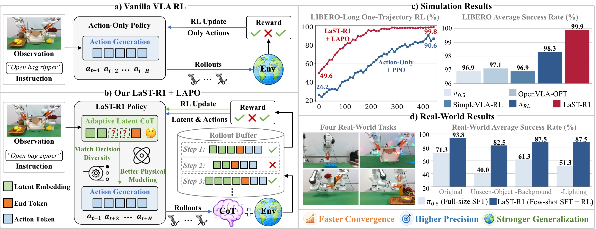
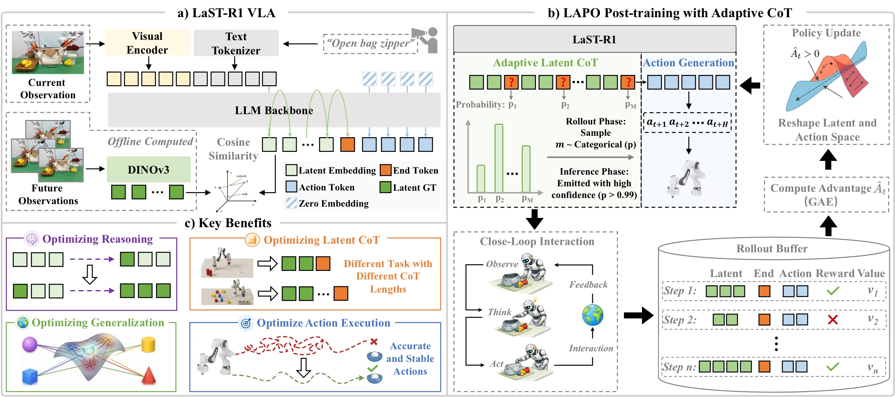
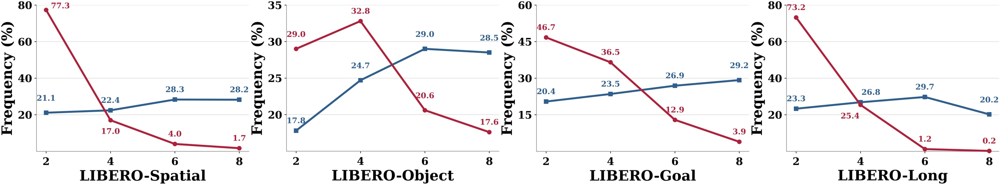
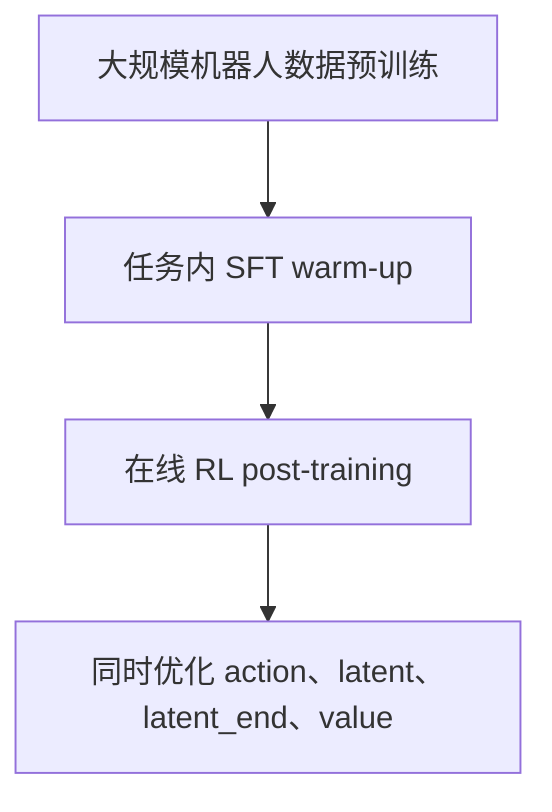
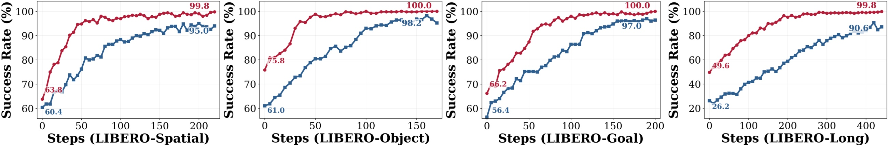
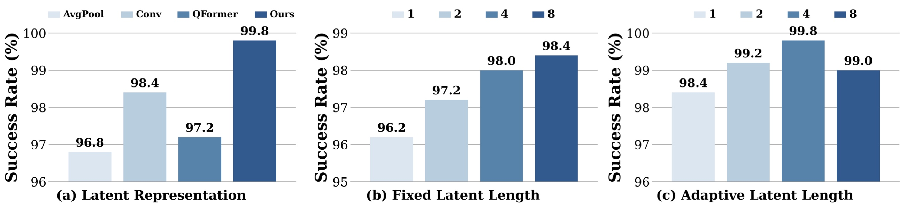
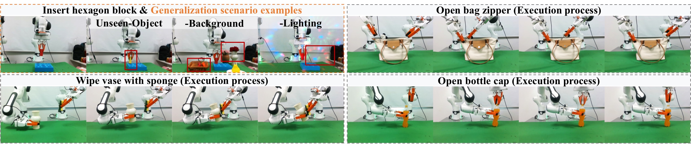
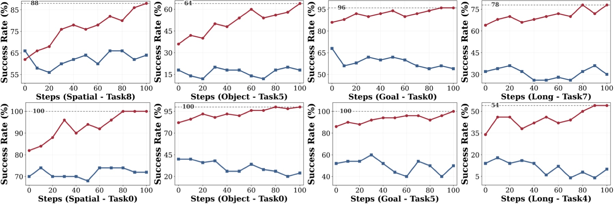
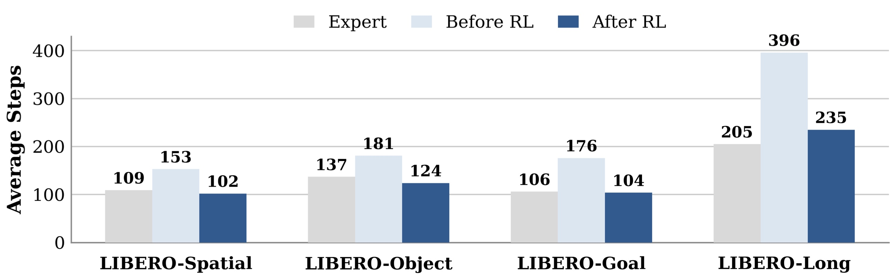
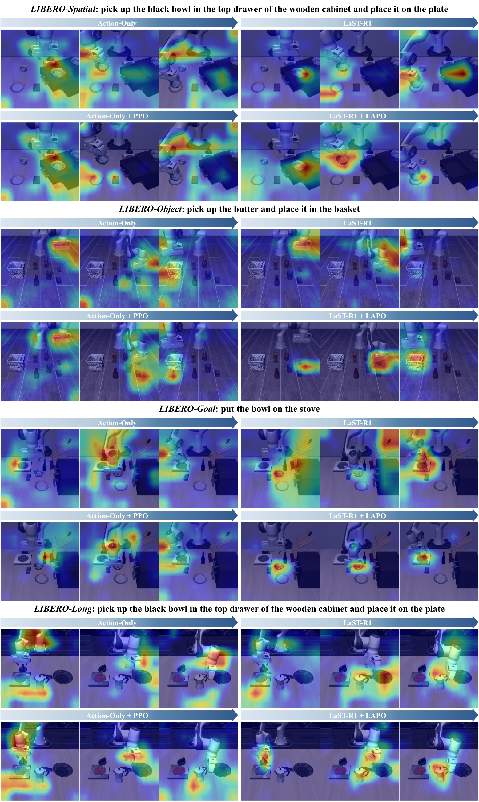

<!-- arxiv: 2604.28192 -->
<!-- venue: ICML 2026 Spotlight -->
<!-- tags: VLA, 强化学习 -->

# LaST-R1 论文分享简明笔记

> 本文基于以下本地材料整理：
>
> - 长版笔记：`LaST-R1_论文与代码笔记.md`
> - 论文 tex 源码：`arXiv-2604.28192v3/main.tex`
> - 论文图片：`arXiv-2604.28192v3/figs/*.pdf`
> - 本文图片导出目录：`assets/last-r1-share/`

## 1. 一句话讲清楚

LaST-R1 的核心想法是：机器人 VLA 模型在输出动作前，先在连续 `latent` 空间里“想一想”；然后用在线 RL 的环境奖励同时优化“怎么想”“想多久”和“怎么动”。

这篇论文的核心不是又做了一个更大的 VLA，而是提出了一个针对 **latent reasoning-before-acting policy** 的 RL post-training 框架：**LAPO, Latent-to-Action Policy Optimization**。



*图 1：论文 teaser，一张图概括全文逻辑。画面分四个部分：*

- **(a) 传统 action-only RL**：模型直接从观测映射到动作，RL 信号只优化最后的 action token，中间的推理过程不受环境反馈影响。
- **(b) LaST-R1 + LAPO**：模型先产生 adaptive latent CoT（绿色），在 `<latent_end>` 处终止推理，再并行解码 action token。关键区别是 RL 信号同时作用于 latent、action 和 stop length 三个对象。
- **(c) 仿真学习曲线**：LaST-R1 + LAPO（红色）相比 Action-Only + PPO（蓝色），收敛更快、最终成功率更高——这在 Long suite 上尤其明显。
- **(d) 真实世界泛化**：LaST-R1 在 unseen object/background/lighting 等 OOD 场景下，性能下降远小于 full-size SFT 的 π₀.₅ 基线。

```text
以前：image + instruction -> action
现在：image + instruction -> latent reasoning -> action
关键：reward 不只优化 action，也优化 latent reasoning 和 stop length
```

## 2. 论文要解决什么问题

VLA 模型通常把图像、语言指令和机器人动作接起来：

```text
image + instruction -> action
```

这个范式有两个常见问题：

1. **只靠 SFT / behavior cloning 容易被数据限制。**
   模型模仿专家轨迹，但没有真正和环境试错；一旦执行时偏离专家分布，错误会累积。

2. **现有 VLA RL 多数只优化 action。**
   在线 RL 能利用成功/失败奖励改进动作，但如果模型内部有 CoT / reasoning 过程，普通 PPO/GRPO 往往没有直接优化这部分“思考”。

LaST-R1 的切入点是：复杂机器人操作不是只靠最后的动作 token 决定成败，动作之前的物理理解、空间推理和未来动态建模也应该被环境反馈优化。

## 3. 方法总览

LaST-R1 把一次决策拆成三段：

```text
image + instruction
  -> latent reasoning embeddings
  -> <latent_end>
  -> action tokens
```

直观解释：

- `latent reasoning embeddings`：模型内部的连续向量推理过程，用来表示物体关系、空间结构、未来动态等难以直接用文字表达的信息。
- `<latent_end>`：表示“想完了，可以开始行动”的特殊 token。
- `action tokens`：离散化后的机器人动作 token，最后再解码成连续控制量。



*图 2：方法框架，三栏分别展示模型结构、训练流程和自适应推理效果。*

**左栏 (a) LaST-R1 VLA 模型结构：**

- 输入：RGB 图像经过 SigLIP2-Large 视觉编码器，与语言指令的 text embedding 拼接后送入 LLM backbone（基于 Qwen3-VL-4B）。
- Latent CoT 生成：模型先自回归地产生 latent reasoning embeddings（绿色方块），每一步的 latent 向量表示空间关系、物体动态等物理信息。这些 latent 的训练 target 来自 DINOv3 视觉基础模型的 `<CLS>` token（离线预计算，不增加在线开销）。
- 推理终止：当模型预测出 `<latent_end>` token，表示”想完了”。
- Action 解码：基于 latent 推理结果，用并行解码一次性输出整个 action chunk（56 个离散 action token），再通过 parameter-free tokenizer 映射回连续控制量。Action token 之间使用双向注意力，推理上下文使用因果注意力。

**中栏 (b) LAPO 在线 RL 训练流程：**

- Rollout：VLA 与环境闭环交互，每步记录四个东西——latent sequence（Z_old）、action token sequence（C_t）、对应的 log-probabilities、以及 value head 估计的状态价值。
- Reward 获取：环境根据任务成功/失败返回稀疏二元奖励（终点成功 = 1，其余 = 0），成功时额外乘以 5 放大信号。
- Advantage 计算：用 GAE（γ=0.99, λ=0.95）计算每一步的 advantage。
- Policy Update：LAPO 把 advantage 作为权重，同时优化三个 ratio——action ratio（离散 token，标准 PPO likelihood ratio）、latent ratio（连续向量，用高斯密度近似）、`<latent_end>` ratio（离散停止决策）。详见第 5 节公式。

**右栏 (c) Adaptive Latent CoT 效果示意：**

- 模型学会在不同任务/状态下使用不同的 reasoning length。
- 示例 1（顶部）：简单任务只用 2 个 latent token 就能完成，且泛化到 unseen 场景。
- 示例 2（底部）：复杂任务需要更长的 latent CoT，LAPO 优化后模型把注意力准确聚焦在关键交互部位（热力图深色区域）。

| 模块 | 做什么 |
|---|---|
| LaST-R1 VLA | 输入图像和指令，先生成 latent，再生成 action |
| LAPO rollout/update | 和环境交互，记录 latent、action、reward |
| Adaptive latent CoT | 学会什么时候发出 `<latent_end>` |

## 4. 模型结构：latent 从哪里来

LaST-R1 基于 `Qwen3-VL-4B`，视觉编码器使用 `SigLIP2-Large`，动作采用离散 token 表示。

关键设计是：latent target 不是随便初始化的 learnable token，而是来自视觉基础模型 `DINOv3`：

1. 用 DINOv3 提取图像 `<CLS>` token，原始维度为 4096；
2. 按通道特征幅值做 top-k 选择，取 `k = 2560`；
3. 得到与 VLA hidden size 对齐的 dense latent target；
4. 这些 latent target 离线预计算，训练和推理时不需要额外跑 DINOv3。

为什么这样做：

- 比简单 global pooling 更少丢空间语义；
- 比 Q-Former / convolution 这类额外模块更少引入训练不稳定因素；
- 离线预计算避免增加在线训练和推理开销。

## 5. LAPO：把 RL 从 action 扩展到 latent

普通 PPO 的思路是：

```text
如果某个 action 带来了比预期更好的结果，就提高它再次出现的概率；
如果结果比预期差，就降低它再次出现的概率。
```

LaST-R1 把这个思想扩展到三类决策：

| 决策对象 | 论文里的优化含义 | 直觉 |
|---|---|---|
| action tokens | 学会做什么动作 | 成功动作更常出现，失败动作更少出现 |
| latent embeddings | 学会怎么内部推理 | 成功时的 latent 思考路径被拉近，失败时的路径被抑制 |
| `<latent_end>` | 学会什么时候停止思考 | 简单状态少想，复杂状态多想 |

### 5.1 action ratio

action 是离散 token，可以直接算新旧策略概率比：

```math
r_t^a(\theta)
=
\exp(
\log \pi_\theta(C_t)
-
\log \pi_{\theta_{old}}(C_t)
)
```

这里 `C_t` 是一次决策输出的 action token 序列。论文和代码里通常把一个 action chunk 离散成多个 token，再把它们的 logprob 加起来作为整段 action 的 logprob。

### 5.2 latent ratio

latent 是连续向量，没有 softmax 概率。LAPO 的做法是：假设 rollout 时旧策略生成的 `old_latents` 来自一个以当前策略 latent 输出为均值的高斯分布。

于是 latent ratio 可以写成：

```math
r_t^z(\theta)
=
\exp\left(
-\frac{1}{2\sigma^2}
\sum_i
\|z_{t,i}^{old} - z_{t,i}^{\theta}\|^2
\right)
```

直觉：

- 当前策略生成的 latent 越接近成功 rollout 里的 old latent，ratio 越大；
- 越远，ratio 越小；
- 再乘上 advantage，就能决定“靠近成功思考路径”还是“远离失败思考路径”。

所以这里看起来像 MSE，但它在 LAPO 里扮演的是连续 latent 的 likelihood ratio surrogate，不是普通监督学习里的 MSE loss。

### 5.3 `<latent_end>` ratio

`<latent_end>` 也是一个策略决策：模型需要决定什么时候结束 latent CoT。

训练时，论文会记录 rollout 中选择的停止位置，并像 PPO 优化离散 token 一样优化它：

```text
新的 <latent_end> logprob - 旧的 <latent_end> logprob -> end ratio
```

如果较短 reasoning length 已经能成功，RL 会鼓励早停；如果任务复杂、想太少导致失败，RL 会降低过早停止的倾向。

## 6. adaptive latent CoT：学会动态分配思考预算

固定长度 latent CoT 的问题是：

- 简单动作也被迫想满固定 token，浪费推理时间；
- 复杂动作可能又需要更多内部建模。

LaST-R1 让 `<latent_end>` 可以在若干候选位置发出。论文默认最大 latent 长度为 8，并设置若干候选停止位置。

在 rollout 时：

1. 模型在候选位置上给出 `<latent_end>` logits；
2. 用带温度的 categorical distribution 采样一个 reasoning length；
3. 执行动作并得到环境 reward；
4. 用 advantage 优化这个停止长度。

在推理时：

- 如果 `<latent_end>` 置信度足够高，就提前停止；
- 否则继续生成 latent，直到达到最大长度。



*图 3：adaptive reasoning length 频率分布，对比 SFT warm-up 后（蓝色）和 RL 优化后（红色）的长度分布，四个子图对应 LIBERO 的四个 task suite（Spatial / Object / Goal / Long）。*

关键发现：

- **SFT 阶段**：warm-up 时 reasoning length 从 {2, 4, 6, 8} 中均匀采样，所以蓝色柱高度差异不大。模型还没有学会区分”什么时候需要多想、什么时候可以早停”。
- **RL 后**：LAPO 优化后（红色柱），分布剧烈向短长度倾斜——长度 2 和 4 占据了绝大多数决策步。这说明环境 reward 成功教会模型：对于大部分状态，短推理就足够做出正确 action，不必浪费计算。
- **Long suite 的特例**：在 LIBERO-Long（右下）上，长度 6 和 8 的红色柱依然有可见比例，反映长任务确实有部分状态需要更多 latent token 来做物理建模。
- **终态**：RL 后模型在短长度上集中，在长长度上仅保留必要余量，实现了”够用就停”的推理效率。

Adaptive CoT 不是手工指定”所有任务都想 8 步”，而是让环境 reward 选择更有效的思考长度。

## 7. 训练流程

论文整体训练分成三步：



### 7.1 预训练

论文使用约 `400K` 条轨迹、`28M` 帧，来源包括 `Open-X-Embodiment`、`DROID`、`RoboMIND` 等机器人数据集。DINOv3 latent target 会离线预计算。

### 7.2 SFT warm-up

SFT 阶段让模型先学会基本动作和 latent reasoning 格式：

- latent 对齐 DINOv3 离线 target；
- `<latent_end>` 用 CE loss；
- action token 用 CE loss。

在 LIBERO 上，论文采用极低数据设定：每个任务只用 `1` 条 expert trajectory 做 warm-up。

### 7.3 在线 RL

LIBERO 仿真里，LaST-R1 使用 LAPO 做在线交互：

- action chunk 长度为 8；
- 单次决策有 `56` 个 action tokens；
- 成功给稀疏终点奖励，并乘以 `5`；
- advantage 用 GAE，`gamma = 0.99`，`lambda = 0.95`；
- policy loss 包含 action loss、latent loss、value loss，以及 adaptive 版本里的 `<latent_end>` loss。

### 7.4 训练资源

| 阶段 | 数据量 | GPU | 训练量 | 关键配置 |
|---|---|---|---|---|
| 预训练 | 400K 轨迹, 28M 帧 | 未明确（推测 8×H20） | 未明确 | OXE + DROID + RoboMIND，DINOv3 latent 离线预计算 |
| LIBERO SFT warm-up | 1 trajectory/task（one-shot） | 8× H20 | 10K iterations/suite | bf16 + DeepSpeed, batch=64, lr=1e-5, cosine decay |
| LIBERO RL (LAPO) | 在线交互采集 | 1 节点 8× H20, FSDP + Ray | ~50–150 RL steps 收敛 | 每步 512 rollout, 4 mini-batch × 4 epoch, actor lr=3e-5, value lr=3e-4 |
| 真机 SFT warm-up | 30 trajectories/task | 8× H20 | 1K iterations | 固定 latent 长度 8 |
| 真机 RL | 在线交互 + 人工干预 | 单卡 RTX 4090 | 在线持续训练 | LoRA r=32, 异步 actor-learner, 500 transitions 后启动 |

注：论文未给出各阶段的 wall-clock 训练时间。从 LIBERO 学习曲线看，LaST-R1 + LAPO 通常在 50–100 RL steps 内收敛，而 Action-Only + PPO 需要更多步数且最终性能更低。

## 8. 实验结论

### 8.1 LIBERO benchmark

论文在 LIBERO 的四个 suite 上评估：

- `LIBERO-Spatial`
- `LIBERO-Object`
- `LIBERO-Goal`
- `LIBERO-Long`

主要结果：

| 方法 | Spatial | Object | Goal | Long | 平均 SR |
|---|---:|---:|---:|---:|---:|
| OpenVLA-OFT | 97.6 | 98.4 | 97.9 | 94.5 | 97.1 |
| SimpleVLA-RL | 98.2 | 98.7 | 98.8 | 91.7 | 96.9 |
| RLinf-GRPO | 98.9 | 99.7 | 98.3 | 93.6 | 97.6 |
| `pi_RL` | 99.6 | 100.0 | 99.6 | 94.0 | 98.3 |
| **LaST-R1** | **99.8** | **100.0** | **100.0** | **99.8** | **99.9** |

最值得强调的是 Long suite：LaST-R1 达到 `99.8%`，而对比的 `pi_RL` 是 `94.0%`。这说明 latent reasoning 对长任务更有帮助。



*图 4：LIBERO one-shot online RL 学习曲线，四个子图分别对应四个 task suite。横轴是 RL 训练步数，纵轴是平均成功率 SR（50 个 hold-out 测试场景）。红色是 LaST-R1 + LAPO，蓝色是 Action-Only + PPO。*

关键观察：

- **收敛速度**：在所有四个 suite 上，红色曲线都更早进入高 SR 区间。尤其在 Long suite（右下），Action-Only + PPO 需要大量步数才勉强接近 90%，而 LaST-R1 快速拉升。
- **最终性能**：LaST-R1 在 Spatial / Object / Goal 上都接近 100%，在 Long 上也达到 ~99.8%。对比之下，Action-Only + PPO 在 Long 上始终无法收敛到 95% 以上。
- **曲线平滑度**：红色曲线震荡更小，说明 latent reasoning 起到了"认知缓冲"的作用——有了内部思考过程，RL 的优化景观变得更平滑，策略更新更稳定。
- **SFT warm-up 的起点差异**：图中虚线标注了 warm-up 后的初始 SR——LaST-R1 warm-up（~63.9%）高于 Action-Only warm-up（~51.0%），说明即使不做 RL，latent reasoning 本身也带来了初始优势。

Long suite 上的曲线差距直接证明了 latent reasoning 对长任务不是锦上添花，而是必需的。

### 8.2 关键 ablation

论文的 ablation 支持三点：

1. **latent reasoning 本身有用。**
   one-shot SFT warm-up 后，LaST-R1 Warm-up 平均 SR 是 `63.9%`，Action-Only baseline 是 `51.0%`。在 LIBERO-Long 上提升更明显：`49.6%` vs `26.2%`。

2. **RL 后 LAPO 明显优于 action-only PPO。**
   LaST-R1 + LAPO 平均 SR 达到 `99.9%`，Action-Only + PPO 是 `95.2%`。

3. **DINOv3 latent 表征最好。**
   DINOv3 表征在 ablation 中达到 `99.8%` SR，高于 Convolution `98.4%`、Q-Former `97.2%`、Global Pooling `96.8%`。



*图 5：三组核心消融实验（均在 LIBERO-Spatial 上评估）。*

**子图 (a) Latent 表征方式对比（RL 后 SR）：**

- 对比四种构造 latent target 的方法：Global Pooling（对 VLA 视觉特征做平均池化，96.8%）、Convolution（reshape 后卷积下采样，98.4%）、Q-Former（learnable query 做 cross-attention 聚合，97.2%）、DINOv3（提取 `<CLS>` token + top-k 通道选择，99.8%）。
- DINOv3 最优，因为它利用了大模型预训练的语义丰富特征，top-k 选择保留了最显著的视觉分量；Global Pooling 最差，简单平均丢失了空间结构。Q-Former 不如 Convolution，说明在低数据 RL 场景下，额外的可学习参数反而增加优化难度。

**子图 (b) Latent CoT 固定长度对比（RL 后 SR）：**

- 测试 1 / 2 / 4 / 8 四种固定 latent 长度，同时对比 Action-Only 基线（无 latent reasoning，95.0%）。
- 长度 1→2→4 带来持续提升（95.0% → 96.2% → 97.6% → 97.8%），但从 4→8 收益递减（97.8% → 98.4%），说明 8 个 latent token 已经足够编码有效推理信息。
- 关键信息：即使只有 1 个 latent token，也优于完全没有 latent reasoning（96.2% vs 95.0%），验证了"先想再做"这一设计本身就优于纯 reaction。

**子图 (c) Adaptive 候选位置数量 M 对比（RL 后 SR）：**

- 固定最大长度为 8，对比 M = 1 / 2 / 4 / 8 四种候选停止位置设置（M=1 只能在第 8 位停止，相当于固定长度；M=8 在每个位置都可以停止）。
- M=4 达到最优 99.8%；M=8 反而降到 99.0%，说明停止位置过多会增加探索方差，不利于稳定优化。
- 所有 adaptive 设置（M >= 2）都优于固定长度（M=1 的 98.4%），证明动态推理长度本身就有正向收益。

总结：DINOv3 表征最好，8 个 latent token 够用，4 个候选停止位置是探索 vs 稳定的最佳折中。

### 8.3 真实机器人实验

真实世界任务包括：

- Insert hexagon block；
- Open bag zipper；
- Wipe vase with sponge；
- Open bottle cap。

论文报告：LaST-R1 使用少量 SFT 数据加在线 RL 后，原始场景平均 SR 从 `52.5%` 提升到 `93.75%`，超过使用 100 条专家轨迹 full SFT 的 `pi_0.5` baseline（`71.25%`）。



*图 6：真实机器人实验结果总览。图片分四行，对应四个真实任务（Insert hexagon block / Open bag zipper / Wipe vase with sponge / Open bottle cap），每行包含多组场景的照片序列，展示机器人从初始状态到完成的关键帧。*

图中四个任务的特点和难点：

- **Insert hexagon block**（单臂）：要求六边形柱体精准插入底座槽位，考验 6-DoF 空间对准能力和 tight clearance 下的轨迹精度。
- **Open bag zipper**（双臂）：一只臂固定柔性袋体，另一只拉动拉链，考验双机械臂协调和对可变形物体的连续操作。
- **Wipe vase with sponge**（双臂）：一只臂固定花瓶，另一只持海绵沿曲面擦拭，要求接触力持续稳定、双机械臂轨迹精确同步。
- **Open bottle cap**（双臂）：一只臂固定瓶身，另一只拧开瓶盖，考验精细力矩控制和旋转操作的协调。

对比数据：

| 对比维度 | π₀.₅（100 条轨迹 full SFT） | LaST-R1（30 条 SFT → RL） |
|---|---|---|
| 原始场景平均 SR | 71.25% | 52.5% → **93.75%** |
| Unseen-Object 泛化 | 最高下降 45% | 下降控制在 15% 以内 |
| Background/Lighting 扰动 | 下降 5–25% | 接近零下降 |

- LaST-R1 只用 30 条 SFT 数据加在线 RL，超过用 100 条 full SFT 的 π₀.₅，数据效率提升 ~3×。
- π₀.₅ 遇到 unseen object 时 SR 断崖式下跌（如 Open bag zipper 从 75% 掉到 30%），而 LaST-R1 仍保持高成功率。

#### 真机 RL 是怎么做的

真机 RL 的训练流程和 LIBERO 仿真 RL（PPO/LAPO + GAE）完全不同，是一个异步 actor-learner 架构，核心思路是：**机器人一边在真实环境里跑，后台一边用混合数据在线更新模型**。

**硬件配置**：

- 双臂 Franka Research 3，配 3D 打印 UMI 夹爪
- 1 个 Intel RealSense D455 第三人称相机 + 2 个 D435 腕部相机
- 推理用单张 NVIDIA RTX 4090
- 数据采集和人工干预都通过 3D SpaceMouse 操作

**整体架构：异步 actor-learner**

```
Actor（机器人端）                  Learner（训练端）
─────────────────                ─────────────────
持续执行策略                      从混合 buffer 采样训练
↓                                ↓
采集 transition tuples           更新 LoRA 参数
↓                                ↓
遇到失败 → 人工干预纠正           定期广播新权重给 Actor
↓                                ↓
干预轨迹写入专用 buffer           Actor 热加载新权重继续跑
```

Actor 和 Learner 是并发的——Actor 不等待 Learner 更新完才继续跑，Learner 也不阻塞 Actor 采集数据。

**人工在环（Human-in-the-Loop）**：

真机 RL 不是全自动的。当策略执行失败或即将出错时，操作员通过 SpaceMouse 介入纠正。这些人工干预轨迹会被专门存入一个 demonstration buffer，和自动 rollout buffer 分开保存。Learner 训练时从两个 buffer 混合采样（mixed mini-batch），确保模型不会遗忘正确的行为模式。

**为什么用 LoRA 而不是全参数更新**：

真机 RL 只更新 LoRA 参数（rank r=32，注入所有 attention 层），冻结 base model。原因有三：

1. **计算效率**：单张 4090 上做全参数 RL 训练不现实，LoRA 大幅降低显存和计算量；
2. **稳定更新**：真机数据量少且噪声大，全参数更新容易导致策略崩溃，LoRA 约束了更新空间；
3. **热加载**：Learner 完成更新后把 LoRA 权重广播给 Actor，Actor 可以无缝切换新权重而不中断执行。

**训练目标：BC + Q-guided policy improvement**

这也是和 LIBERO 仿真 RL 最大的区别——真机不用 PPO/GAE。

LIBERO 仿真 RL 用的是 PPO 风格的 clipped objective + GAE 算 advantage，优化的是"新旧策略的概率比值"。真机 RL 用的是完全不同的组合：

- **Behavior Cloning（λ_BC = 1.0）**：对 demonstration buffer 里的样本做模仿学习，让模型保持在正确行为附近；
- **Q-guided policy improvement（λ_Q = 0.5）**：用学到的 Q 函数引导策略向高价值方向改进，类似 DDPG 风格的确定型策略优化。

Critic 用 one-step TD target（γ=0.98），target value 软更新（τ=0.005）。Critic 更新频率是 Actor 的 2 倍（2:1 更新比）。

**奖励设计**：

真机没有仿真里自动判断任务成功的 verifier，所以奖励是人工给的：

- **终端奖励**：操作员确认任务完成时给 `+10`
- **步数惩罚**：每一步 `-0.05`，鼓励模型走更高效的轨迹

**训练启动和超参**：

- 收集满 500 条 transition 后才开始在线优化
- 学习率 1e-5，AdamW，weight decay=0，梯度裁剪 norm=1.0
- 梯度累积 16 步，每路 micro-batch=2，等效 batch size ≈ 32
- SFT warm-up：每个任务 30 条专家轨迹，1K iterations，固定 latent 长度 8

**真机 RL vs LIBERO 仿真 RL 对比**：

| 维度 | LIBERO 仿真 RL | 真机 RL |
|---|---|---|
| 更新方式 | 同步（collect → train 循环） | 异步 actor-learner |
| 参数更新 | 全参数 | 仅 LoRA（r=32） |
| 训练目标 | PPO clipped + GAE + latent/transition loss | BC + Q-guided policy improvement |
| Advantage 计算 | GAE（γ=0.99, λ=0.95） | One-step TD（γ=0.98） |
| 奖励信号 | 仿真自动判断（稀疏 0/1） | 人工确认（+10 成功 / -0.05 步数） |
| 干预机制 | 无 | 人工 SpaceMouse 干预，存入专用 buffer |
| 数据量 | 1 trajectory/task warm-up | 30 trajectories/task SFT warm-up |
| Latent 长度 | 多任务随机 {2,4,6,8} | 单任务固定 8 |

关键洞察：仿真 RL 追求的是"从极少量数据快速探索"（one-shot + 稀疏奖励），所以用 PPO 做保守的策略更新来防止探索崩溃。真机 RL 面对的是完全不同的挑战——物理噪声、视觉域差、安全约束——所以走的是"少量 SFT 打底 + BC 保持行为锚 + Q 函数引导改进"的稳健路线，外加人工干预兜底。

### 8.4 泛化和执行效率

论文还从两个角度解释为什么 latent reasoning 有帮助：

- OOD 泛化：Action-Only + PPO 容易过拟合训练任务，LaST-R1 + LAPO 在 held-out task 上仍能持续提升；
- 执行效率：RL 后轨迹步数减少，说明模型不只是更容易成功，也更会走直接有效的路线。



*附录图 10：LIBERO OOD 泛化曲线详情（论文附录 §Additional Generalization Analysis）。每个 LIBERO suite 展示 2 个代表性 held-out task，共 8 个子图。横轴是 RL 训练步数，纵轴是 held-out task 上的成功率 SR。红色 = LaST-R1 + LAPO，蓝色 = Action-Only + PPO。*

> **Figure 10: Generalization analysis on LIBERO.** For each task suite, models are warmed up with one trajectory per task, followed by online RL training on 9 tasks, with the remaining 1 task for evaluation. While the out-of-distribution performance of the Action-Only PPO baseline (blue) stagnates, our LaST-R1 with LAPO (red) demonstrates continuous generalization improvements across all task suites.

这张图的核心问题是：**在线 RL 训练会不会只把训练任务刷高，还是能真正提升对未见任务的泛化？** 它不是普通的"训练集成功率曲线"，而是 OOD generalization 曲线。

**实验设置**：LIBERO 每个 suite 有 10 个任务（Spatial: 10 个空间操作任务、Object: 10 个物体操作任务、Goal: 10 个目标导向任务、Long: 10 个长程任务）。每个 suite 中选 9 个任务做 online RL 训练，剩下 1 个任务完全不参与 RL 训练，用这个 held-out task 测试 OOD 成功率。也就是说，**图上测试的是：模型在训练 9 个任务的过程中，对第 10 个没训练过的任务表现有没有变好。**

上图列出了每个 suite 的 2 个 held-out task，其关键趋势如下：

- **Spatial suite**：Action-Only + PPO 在一些 spatial 任务上完全失效（如 Spatial-Task8 长期在 0% 附近震荡），而 LaST-R1 + LAPO 在 Spatial-Task0 上快速收敛至 100%。
- **Object suite**：LaST-R1 + LAPO 能稳定收敛至 100%（如 Object-Task0），而 Action-Only 曲线容易早期崩盘后停滞。
- **Goal suite**：Action-Only + PPO 在训练中段达到 ~65% 后开始退化——典型的过拟合迹象。LaST-R1 + LAPO 保持单调增长至 100%（如 Goal-Task5）。
- **Long suite**：Action-Only + PPO 过拟合最严重——在 Long-Task7 上从峰值跌落至接近 0%；在 Long-Task4 上也始终低于 20%。LaST-R1 + LAPO 则持续提升，在 Long-Task4 上稳步爬升至 54%。

核心洞察：这张图直接支持了论文的关键主张——action-only RL 会有"过拟合"到训练任务特定运动模式的风险。加入 latent reasoning 后，模型从环境反馈中学到的是可迁移的物理理解（空间关系、物体动态），而不是机械记忆训练分布的轨迹模式，因此对 unseen 任务持续泛化。



*图 8：平均执行步数对比，四个子图对应四个 LIBERO suite。每个子图有三组柱形：Expert（仿真专家轨迹）、Before RL（SFT warm-up 后 RL 前的策略）、After RL（LAPO 优化后的策略）。数据在 500 条 rollout 上无条件平均（包含成功和失败的 episode）。*

三个关键对比：

- **Before RL vs Expert**：SFT warm-up 后策略的执行步数远高于专家。这是因为 SFT 只在专家数据上做 behavior cloning，遇到 OOD 状态时靠纯反应式行为，容易陷入低效循环或长时间徘徊，逼近最大步数限制才终止。这反映的是模仿学习的经典问题——复合误差导致轨迹拖长。
- **After RL vs Before RL**：RL 后步数大幅下降。这说明 LAPO 不仅提高了成功率，也直接改善了轨迹效率——模型学会了走更直接、更果断的行动路线。
- **After RL vs Expert**（最大亮点）：在 Spatial、Object、Goal 三个 suite 上，LaST-R1 RL 后的平均步数甚至低于专家轨迹。这意味着 RL 后的模型不是简单模仿专家的保守路径，而是通过优化 latent reasoning 找到了比专家更高效的解决方案（例如更直接的抓取路径、更少的中间调整）。

关于"latent reasoning 会不会让模型变慢"：RL 后 latent length 缩短（图 3），执行步数也减少（图 8），整体比专家更快完成。

### 8.5 视觉注意力证据

论文附录还用 attention 可视化说明：加入 latent reasoning 和 LAPO 后，action token 对视觉区域的关注更集中在任务相关物体和目标位置上。



*图 9：action-to-vision cross-attention 可视化（Grad-CAM），四行对应 LIBERO 四个 suite 上的典型轨迹，四列对应四种模型配置。热力图叠加在原图上，深色/暖色区域表示 action token 对视觉区域的关注度更高。*

四种配置的纵向对比（按列看）：

- **Action-Only (SFT)**（第 1 列）：注意力散乱、覆盖大面积无关背景区域。SFT 后的纯动作模型没有形成对任务相关物体的明确聚焦。
- **LaST-R1 Warm-up (SFT)**（第 2 列）：加入 latent reasoning 后，注意力明显更集中在关键交互对象上。latent 推理起到了"语义锚点"的作用，为 action 解码提供了更好的视觉上下文。
- **Action-Only + PPO**（第 3 列）：RL 后注意力过于集中在夹爪附近区域，缺乏对目标位置的远程感知。这说明纯粹优化 action 空间会导致模型过度近视——它学会了"在夹爪周围小心操作"，但没有学会"看向目标"。
- **LaST-R1 + LAPO**（第 4 列，最佳）：注意力精准且动态迁移——在抓取阶段集中在被操作物体上，在放置/目标阶段转向目标位置。因为 LAPO 同时优化 latent reasoning 和 action，模型学会了将视觉注意力从物体动态切换到目标导向。

按行看任务案例：

- Spatial 例子：LaST-R1 + LAPO 在抓取碗时关注碗，移动时关注目标盘子。
- Object 例子：LAPO 后准确定位目标物体（如特定颜色的积木）。
- Goal 例子：注意力随任务阶段（移动→放置）自然转移。
- Long 例子：在多步骤长任务中保持连贯的注意力切换。

这组热力图是 latent reasoning 的定性证据——它不只是数字的微小提升，而是从根本上改变了模型"看"的方式。

## 9. 这篇论文的核心贡献

可以概括成三点：

1. **提出 LaST-R1 框架。**
   将 latent CoT reasoning 和 action generation 放进同一个 VLA policy 里，先推理再行动。

2. **提出 LAPO。**
   把 PPO 风格的 RL post-training 从 action 扩展到 continuous latent reasoning 和 `<latent_end>` 停止决策。

3. **提出 adaptive latent CoT。**
   让模型根据环境状态动态选择 reasoning length，兼顾复杂任务的推理能力和简单任务的执行效率。

## 10. 常见问题

### Q1：latent CoT 是不是可解释的文字推理？

不是。这里的 CoT 是连续 latent embedding，不是自然语言文本。它更像模型内部的物理状态表示或未来动态摘要。

### Q2：LAPO 的 latent loss 是不是普通 MSE？

不完全是。形式上包含 latent 距离，但论文把它解释为高斯分布下的 likelihood ratio surrogate，再用 PPO clipping 和 advantage 加权。它的作用不是固定模仿某个 ground-truth latent，而是根据 rollout 的好坏决定靠近或远离旧策略产生的 latent。

### Q3：`old_latents` 是不是标准答案？

不是。`old_latents` 是 rollout 时旧策略实际生成的 latent 轨迹。它是否值得学习，取决于这段轨迹的 advantage。

### Q4：为什么 adaptive latent length 有用？

因为不同状态需要的推理预算不同。简单状态可以早停，复杂状态需要更多 latent token。RL 通过 reward 学会哪个长度更可能带来成功。

### Q5：论文最应该关注的局限是什么？

论文当前的 adaptive CoT 仍然依赖最大长度和候选停止位置，例如最大长度为 8、候选位置数量有限。它还不是完全自由的动态停止机制。另外，真实世界实验虽然展示了强结果，但附录中的真实世界 RL pipeline 与 LIBERO 的 LAPO/PPO 实现并不完全一致，需要注意仿真和真实机器人的训练细节不同。

## 11. 最短版 takeaway

LaST-R1 = `latent reasoning-before-acting` + `online RL post-training`。

它的关键是 LAPO：不只优化机器人最后的 action，还用环境 reward 优化 action 之前的 continuous latent reasoning 和 `<latent_end>` 停止长度。因此成功经验会同时塑造“怎么想、想多久、怎么动”，这也是它在长任务和泛化实验中表现更好的主要解释。
