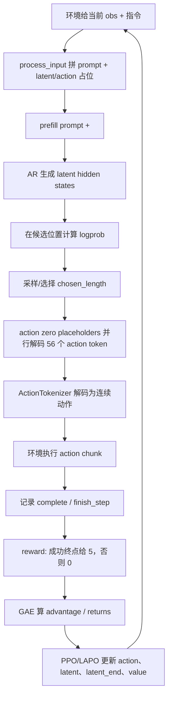

# LaST-R1 论文与代码笔记

> 目标：总结 LaST-R1 论文，并结合代码解释三个问题：
>
> 1. 训练时 latent 占位怎么取特征；
> 2. 推理/rollout 时 latent CoT 怎么生成、怎么决定停在哪；
> 3. RL 里的 reward / advantage 到底在优化什么。
>
> 本文对应本地材料：
>
> - 论文源码：`2026-05-08/arXiv-2604.28192v3`
> - 代码仓库：`2026-05-08/LaST-R1`

## 0. 一句话总览

LaST-R1 想解决的是：机器人 VLA 模型不要直接从「图像 + 指令」跳到 action，而是先在连续 latent 空间里“想几步”，再输出动作；并且这个“想几步”和“怎么想”不只靠模仿学习，而是通过在线 RL 的成功/失败奖励一起优化。

核心方法叫 **LAPO, Latent-to-Action Policy Optimization**：

- action token 继续用 PPO 风格的概率比值优化；
- 连续 latent 没有离散 token 概率，所以用一个高斯近似，把“新策略 latent 是否接近 rollout 时旧策略产生的 latent”变成 likelihood ratio；
- `<latent_end>` 也作为一个要优化的决策，学会什么时候停止 latent CoT。

注意：本文后面结合代码讲的 PPO/GAE/LAPO 闭环，主要对应公开仓库里的 LIBERO 仿真 RL 路径。论文附录描述的真实世界 RL 采用异步 actor-learner、BC + Q-guided policy improvement、LoRA 更新和 one-step TD target；我在当前公开仓库里没有找到这套真实世界 RL 代码。

直观讲：

- 如果某段 rollout 成功了，advantage 为正，训练会让模型更倾向于复现当时的 action、latent、停止长度；
- 如果某段 rollout 比预期差，advantage 为负，训练会降低这些选择再次出现的倾向；
- value head 学的是“当前状态大概能拿多少未来奖励”，它不是直接输出动作，而是给 advantage 提供 baseline。

## 1. 符号表与读公式路线

先把论文符号和代码变量对齐，后面公式就容易读很多。

| 论文符号 | 含义 | 代码里大致对应 |
|---|---|---|
| `s_t` | 第 `t` 个决策点的状态：图像、指令、可选机器人状态 | `input_ids`, `pixel_values`, `attention_mask`, `image_grid_thw` |
| `Z_t^old` | rollout 时旧策略生成的 latent CoT 序列 | `old_latents` |
| `Z_t^theta` | policy update 时新策略重新预测的 latent 序列 | `latents` |
| `C_t` | 一次决策输出的 action token 序列 | `responses`，当前配置 `N_a = 7 * 8 = 56` |
| `r_t` | 环境奖励 | `token_level_scores` / `token_level_rewards` |
| `R_hat_t` | return：从当前步往后的折扣总奖励 | `returns` |
| `v_t` / `V(s_t)` | value head 对未来 return 的预测 | `old_values`, `v_preds` |
| `A_hat_t` | advantage：这步选择比预期好多少 | `advantages` |
| `r_t^a(theta)` | action PPO ratio | `ratio = exp(log_prob - old_log_prob)` |
| `r_t^z(theta)` | latent PPO ratio | `latent_ratio = exp(latent_negative_approx_kl)` |
| `r_t^end(theta)` | `<latent_end>` 停止位置的 PPO ratio | `end_ratio = exp(latent_end_log_prob - old_latent_end_log_prob)` |

上表第一列故意用 ASCII 简写，而不是直接把复杂 LaTeX 放进表格单元格。GitHub 对表格里的 inline math 偶尔不稳定；完整数学定义放在表格外的 `math` fenced block 里更稳。
> 符号注意：论文里小写 $`r`$ 有两种含义。
>
> - $`r_t`$：reward，环境在第 $`t`$ 步给的奖励；
> - $`r_t^a(\theta), r_t^z(\theta), r_t^{end}(\theta)`$：ratio，新旧策略的概率/密度比，用在 PPO/LAPO loss 里。
>
> 简单判断：没有上标、出现在 return 里的 $`r_t`$ 是 reward；带上标 $`a/z/end`$ 且依赖 $`\theta`$ 的 $`r_t^\cdot(\theta)`$ 是 ratio。

状态、latent 和 action 的对应关系：

```math
\begin{aligned}
\mathbf{s}_t
&=
(\mathbf{o}_t,\mathbf{x},\mathbf{p}_t),
&
\mathbf{Z}_t^{old}
&=
\{\mathbf{z}_{t,i}^{old}\}_{i=1}^{N_z},
&
\mathbf{Z}_t^\theta
&=
\{\mathbf{z}_{t,i}^{\theta}\}_{i=1}^{N_z},
\\
\mathbf{C}_t
&=
\{\mathbf{a}_{t,j}\}_{j=1}^{N_a},
&
N_a
&=
7\times8=56
\end{aligned}
```

其中 `o_t` 对应图像观测，`x` 对应语言指令，`p_t` 对应可选机器人 proprioception 状态；代码里它们被整理成 `input_ids`、`pixel_values`、`attention_mask`、`image_grid_thw` 等模型输入。

reward、return、value 和 advantage 的对应关系：

```math
\begin{aligned}
r_t
&=
5\cdot\mathbf{1}[\text{complete at step }t]
\quad
(\text{当前配置 } \mathrm{KL}=0),
\\
\hat{R}_t
&=
\sum_{k=t}^{T}\gamma^{k-t}r_k,
&
v_t
&=
V_\theta(\mathbf{s}_t),
\\
\hat{A}_t
&\approx
\hat{R}_t-v_t
\end{aligned}
```

PPO/LAPO 里真正被 `advantage` 加权的三个 ratio：

```math
\begin{aligned}
r_t^a(\theta)
&=
\exp\left(
\log \pi_\theta(\mathbf{C}_t\mid\cdot)
-
\log \pi_{\theta_{old}}(\mathbf{C}_t\mid\cdot)
\right),
\\
\log \pi_\theta(\mathbf{C}_t\mid\cdot)
&=
\sum_{j=1}^{N_a}
\log \pi_\theta(\mathbf{a}_{t,j}\mid\cdot),
\\
r_t^z(\theta)
&=
\exp\left(
-\frac{1}{2\sigma^2}
\sum_{i=1}^{N_z}
\left\|
\mathbf{z}_{t,i}^{old}
-
\mathbf{z}_{t,i}^{\theta}
\right\|^2
\right),
\\
r_t^{end}(\theta)
&=
\exp\left(
\log \pi_\theta(\mathbf{z}_t^{end}\mid\cdot)
-
\log \pi_{\theta_{old}}(\mathbf{z}_t^{end}\mid\cdot)
\right)
\end{aligned}
```
读公式时可以按这条链路走：

```text
环境成功/失败 -> reward r_t -> GAE 算 advantage A_t
  -> A_t 去加权 action ratio / latent ratio / latent_end ratio
  -> 好的 rollout 被拉近，坏的 rollout 被推远
```

也就是说，公式里最关键的不是某一个 loss 名字，而是 **reward 先变成 advantage，advantage 再决定当前策略要不要复现 rollout 时的 latent/action/停止长度**。

## 2. 论文在做什么

### 2.1 背景

VLA 模型把视觉、语言和机器人动作连起来。传统路线常见两种：

- **SFT / behavior cloning**：用专家示范训练，模型学“看到这个状态就做这个动作”。缺点是受限于数据，遇到分布外状态容易累积错误。
- **RL post-training**：让模型在环境里试错，根据成功/失败奖励更新策略。缺点是很多 VLA RL 只优化 action，不优化中间推理过程。

LaST-R1 的出发点是：复杂操作不应该只靠 action 层面的试错，还应该让环境反馈塑造模型内部的物理理解。

### 2.2 论文里的 SFT / RL 目标

论文先把 VLA 看成一个策略 $`\pi_\theta`$：输入当前状态 $`\mathbf{s}_t`$，输出未来一个 action chunk $`\mathbf{a}_{t:t+H}`$。

SFT 的目标是模仿专家动作：

```math
\mathcal{J}_{\text{SFT}}(\theta)
=
\mathbb{E}_{(\mathbf{s}_t,\mathbf{a}_{t:t+H})\sim\mathcal{D}}
\left[
\log \pi_\theta(\mathbf{a}_{t:t+H}\mid\mathbf{s}_t)
\right]
```

白话说：专家在这个状态下做了这串动作，那就提高模型输出这串动作的概率。这里没有环境试错，只有“像不像专家”。

RL 的目标是最大化轨迹上的折扣奖励：

```math
\mathcal{J}_{\text{RL}}(\theta)
=
\mathbb{E}_{\tau\sim\pi_\theta}
\left[
\sum_{t=0}^{T}\gamma^t r_t
\right]
```
RL 的最终目标始终是最大化 reward；但策略更新时不直接用单步 reward $`r_t`$，而是用由 reward 推导出来的 return / advantage 作为权重。Advantage 不只是为了解决 reward 稀疏，也用于减小策略梯度的方差，让模型学习“比预期更好/更差”的动作。论文使用的GAE 则是一种从稀疏 reward 和 value 估计中计算 advantage 的方法。

策略梯度常写成：

```math
\nabla_\theta \mathcal{J}_{\text{RL}}(\theta)
=
\mathbb{E}_{\tau\sim\pi_\theta}
\left[
\sum_{t=0}^{T}
\nabla_\theta \log \pi_\theta(\mathbf{a}_{t:t+H}\mid\mathbf{s}_t)\,\hat{A}_t
\right]
```

这里 $`\hat{A}_t`$ 乘在 logprob 前面，含义是“这次动作到底值不值得学”。如果 $`\hat{A}_t>0`$，说明这次选择比模型预期更好，梯度会提高它的概率；如果 $`\hat{A}_t<0`$，说明比预期差，梯度会降低它的概率。LaST-R1 后面做的事，就是把这个思想从 action 扩展到 latent CoT 和 `<latent_end>` 停止位置。


### 2.3 LaST-R1 的模型结构

论文模型基于 Qwen3-VL-4B，输入包括：

- 当前图像观测；
- 语言任务指令；
- 可选 proprioception 状态；
- latent CoT 占位；
- action token 占位。

输出顺序是：

```text
image + instruction
  -> latent_start
  -> latent reasoning embeddings
  -> latent_end
  -> action tokens
```

动作是连续 7-DoF end-effector 控制量，但代码里先离散成 token：

- 每个 action step 有 7 个 action token；
- 一个 chunk 有 8 个未来 action step；
- 所以一次决策输出 `7 * 8 = 56` 个 action token。

代码配置见 `scripts/run_libero_rl_training.sh`：

```bash
action_token_len=7
action_chunks_len=8
latent_length=8
latent_end_num=4
latent_mode='ar'
value_choice='latent_end'
```

### 2.4 latent 表征来自哪里

论文中的 supervised warm-up / pretraining 阶段，latent target 不是模型随便学出来的，而是离线预计算：

1. 用 DINOv3 提取图像 `<CLS>` token，维度是 4096；
2. 按通道特征幅值做 top-k，取 `k = 2560`；
3. 这样得到和 Qwen3-VL hidden size 对齐的 dense latent target；
4. 这些 target 离线存好，训练时直接加载，不在训练/推理时跑 DINOv3。

用公式写就是：

```math
f_d \in \mathbb{R}^{1\times4096},
\qquad
\mathbf{z}^{GT}=\text{TopK}_{k=2560}(f_d)
\in \mathbb{R}^{1\times2560}
```
其中 $f_d$ 是 DINOv3 的 `<CLS>` 特征，$\mathbf{z}^{GT}$ 是离线得到的 latent 监督目标。它的维度被裁到 2560，是为了和 VLA/LLM hidden size 对齐。

论文认为这样比 global pooling、conv downsampling、Q-Former 更好，因为 DINOv3 的全局视觉语义和结构先验更强。

先回答一个容易混的问题：**DINOv3 `<CLS>` 单次提取本身没有时间维度**。它是对一张图像得到的全局向量：

```text
一张图 I_t -> DINOv3 <CLS> -> f_d(t) shape = [1, 4096]
```

如果数据管线对一条轨迹里的多帧都离线提取 DINOv3 特征，那么时间维度来自“你选了哪些帧”，而不是来自 `<CLS>` token 自己。也就是说，可能的数据张量会像：

```text
T 张图像 -> T 个 <CLS> -> [T, 4096]
```

但每个 `<CLS>` 仍然只是单帧图像的全局特征。论文说 latent 用来建模 future dynamics，是指模型自回归地产生 `N_z` 个 latent reasoning embeddings；`N_z` 是内部“想几步”的长度，不等于 action chunk 的未来动作步数。

对当前 LIBERO 设置，论文写的是单前视当前观测，代码默认也从当前 `obs["full_image"]` 构造输入；未来动作步数由下面这个配置控制：

```text
action_chunks_len = 8
```

所以这里有三种“长度”不要混：

| 长度 | 控制什么 | 当前设置 |
|---|---|---|
| DINO `<CLS>` 数量 | 离线选了多少帧做 latent target | 论文说对 frames 离线预计算，公开代码未展开完整生成管线 |
| `N_z` / `latent_length` | 模型内部 latent CoT 最多想几步 | `8` |
| `action_chunks_len` | 一次输出多少个未来 action step | `8` |

如果看到 `num_images_in_input > 1`，那主要是多相机视角，例如 front + wrist image，不是“输入未来观测帧”。

你问的关键其实是：**如果 latent CoT 长度是 2 或 8，`z^GT` 到底取哪几个？**

按论文文字最保守的理解，`z^GT` 不是只有一个向量，而是离线为轨迹帧准备好的一串 future-state latent targets。对一个训练样本的当前时刻 `t`，可以先想象有一个离线 target buffer：

```text
轨迹图像:
I_t, I_{t+1}, I_{t+2}, I_{t+3}, ...

离线 DINOv3:
I_{t+u1} -> DINO <CLS> -> TopK -> z^GT_1
I_{t+u2} -> DINO <CLS> -> TopK -> z^GT_2
I_{t+u3} -> DINO <CLS> -> TopK -> z^GT_3
...
I_{t+u8} -> DINO <CLS> -> TopK -> z^GT_8

得到最多 8 个监督槽:
[z^GT_1, z^GT_2, z^GT_3, z^GT_4, z^GT_5, z^GT_6, z^GT_7, z^GT_8]
```

这里的 `u1..u8` 表示从当前时刻往后取哪些 future observation frames。论文和公开代码没有给出具体 offset 规则，比如是否连续取 `t+1..t+8`，还是在一个更长 horizon 内均匀采样；所以不能把具体步长写死。但可以确定的是：如果要监督 2 个或 8 个 latent，合理形式必须是“取 2 个或 8 个 target 槽”，不是把当前帧的同一个 `<CLS>` 简单复制 2 次或 8 次。

如果本样本采样到 latent CoT 长度 `L=2`，就只用前 2 个 target：

```text
模型输出:
<latent_start> -> z^theta_1 -> z^theta_2 -> <latent_end> -> action tokens

监督 target:
                 z^GT_1       z^GT_2

loss:
cos(z^theta_1, z^GT_1)
cos(z^theta_2, z^GT_2)
CE(<latent_end> at length 2)
CE(56 action tokens)

不使用:
z^GT_3 ... z^GT_8
```

如果本样本采样到 latent CoT 长度 `L=8`，就用完整 8 个 target：

```text
模型输出:
<latent_start>
  -> z^theta_1 -> z^theta_2 -> z^theta_3 -> z^theta_4
  -> z^theta_5 -> z^theta_6 -> z^theta_7 -> z^theta_8
  -> <latent_end> -> action tokens

监督 target:
     z^GT_1       z^GT_2       z^GT_3       z^GT_4
     z^GT_5       z^GT_6       z^GT_7       z^GT_8

loss:
sum_{i=1..8} cos(z^theta_i, z^GT_i)
CE(<latent_end> at length 8)
CE(56 action tokens)
```

和代码里的 grouped layout 对齐看，当前 `latent_length=8, latent_end_num=4, G=2`，候选停止点是：

```text
候选 1: z1 z2 <latent_end>                         -> L = 2
候选 2: z1 z2 <latent_end> z3 z4 <latent_end>       -> L = 4
候选 3: z1 z2 <latent_end> z3 z4 <latent_end>
        z5 z6 <latent_end>                         -> L = 6
候选 4: z1 z2 <latent_end> z3 z4 <latent_end>
        z5 z6 <latent_end> z7 z8 <latent_end>       -> L = 8
```

所以 SFT 里的变长监督可以理解成：

```text
先离线准备最多 8 个 z^GT target
训练时采样 L in {2,4,6,8}
只监督前 L 个 z^theta_i 对齐 z^GT_i
只在第 L 个 latent 后的 <latent_end> 位置算停止 CE
后面的 z^GT / latent 槽通过 mask 忽略
```

SFT / warm-up 里输出端 latent CoT 长度确实可以变化。论文附录说 LIBERO 多任务 warm-up 会对每个样本从 `{2, 4, 6, 8}` 均匀采样 reasoning length；real-world 单任务则固定长度 8。可以把一个样本的 SFT 目标写成：

```math
\mathcal{L}_{\text{SFT}}
=
\lambda_z
\frac{1}{L}
\sum_{i=1}^{L}
\left(
1-\cos(\mathbf{z}_{i}^{\theta}, \mathbf{z}_{i}^{GT})
\right)
+
\lambda_{end}
\operatorname{CE}(\texttt{<latent\_end>})
+
\lambda_a
\sum_{j=1}^{56}
\operatorname{CE}(\mathbf{a}_j)
```

其中 `L` 是本样本选中的 latent 长度，比如 4；latent loss 只算前 `L` 个 chosen prefix，后面预留但未选中的 latent 槽不参与监督。论文给的 warm-up loss 权重大意是：

```text
latent cosine similarity loss : <latent_end> CE : action CE = 1 : 0.1 : 1
```

所以“变长 latent 怎么做 loss”的答案是：工程上仍然可以预留最大长度 8，再用 `chosen_length` / `latent_mask` 只让有效前缀参与 latent loss，同时用 `<latent_end>` 的 CE 监督应该在哪个候选位置停止。

注意：当前仓库公开代码主要展示 RL/LAPO 路径；DINOv3 latent 离线生成和 SFT 数据管线没有完整展开。但模型 forward 里已经有 `latent_gt_embeds` 这种接口，可以把外部 latent target/rollout latent 写入占位槽。关于未来帧和 DINO latent target 的精确对齐方式，本文只按论文公开描述做保守解释，不虚构未公开实现细节。

### 2.5 LAPO 的核心思想

普通 PPO 优化 action：

```text
新策略生成同一个 action 的概率 / 旧策略生成这个 action 的概率
```

LaST-R1 多加了 latent：

```text
新策略生成同一个 latent trajectory 的密度 / 旧策略生成这个 latent trajectory 的密度
```

但 latent 是连续向量，没有 vocab softmax 概率。论文假设 latent 服从以当前模型输出为均值的各向同性高斯：

```math
r_t^z(\theta)
=
\exp\left(
-\frac{1}{2\sigma^2}
\sum_{i=1}^{N_z}
\left\|
\mathbf{z}_{t,i}^{old}-\mathbf{z}_{t,i}^{\theta}
\right\|^2
\right)
```

这条式子不是凭空把 MSE 塞进 PPO，而是来自一个高斯密度的比值。对单个 latent，先假设当前策略输出的 $\mathbf{z}_{t,i}^{\theta}$ 是高斯均值，方差固定为 $\sigma^2 I$：

```math
\pi_\theta(\mathbf{x})
=
\mathcal{N}(\mathbf{x}; \mathbf{z}_{t,i}^{\theta}, \sigma^2 I)
=
\frac{1}{(2\pi\sigma^2)^{D/2}}
\exp\left(
-\frac{1}{2\sigma^2}
\|\mathbf{x}-\mathbf{z}_{t,i}^{\theta}\|^2
\right)
```

现在把 rollout 时旧策略真的采到的 latent $\mathbf{z}_{t,i}^{old}$ 代进去：

```math
\pi_\theta(\mathbf{z}_{t,i}^{old})
=
\frac{1}{(2\pi\sigma^2)^{D/2}}
\exp\left(
-\frac{1}{2\sigma^2}
\|\mathbf{z}_{t,i}^{old}-\mathbf{z}_{t,i}^{\theta}\|^2
\right)
```

而旧策略那一侧按“旧策略均值就是当时采到的 rollout latent”近似：

```math
\pi_{\theta_{old}}(\mathbf{z}_{t,i}^{old})
=
\frac{1}{(2\pi\sigma^2)^{D/2}}
\exp(0)
```

两边一除，前面的归一化常数抵消，就得到：

```math
r_{t,i}^{z}(\theta)
=
\exp\left(
-\frac{1}{2\sigma^2}
\|\mathbf{z}_{t,i}^{old}-\mathbf{z}_{t,i}^{\theta}\|^2
\right)
```

整段 latent CoT 再假设条件独立，单个 ratio 相乘，乘积就变成指数里的平方距离求和：

```math
\prod_i r_{t,i}^{z}(\theta)
=
\exp\left(
-\frac{1}{2\sigma^2}
\sum_i
\|\mathbf{z}_{t,i}^{old}-\mathbf{z}_{t,i}^{\theta}\|^2
\right)
```

所以代码里看到的 `diff2` 像 MSE，但它在这里扮演的是“高斯 log density 里的 Mahalanobis distance”。这不是普通 supervised MSE loss，而是把连续 latent 距离转成 PPO 可以使用的 likelihood ratio surrogate。

所以 latent loss 的直觉很简单：

- advantage > 0：新 latent 要靠近 old latent，复现“成功时的思考路径”；
- advantage < 0：新 latent 要远离 old latent，减少“失败时的思考路径”；
- PPO clipping 限制更新幅度，防止一次把策略改太猛。

## 3. 代码地图

重点文件：

- `verl/workers/rollout/rob_rollout.py`
  - 构造输入；
  - 与 LIBERO 环境交互；
  - rollout 时生成 latent、action、value；
  - 保存 `old_latents`、`old_log_probs`、`old_values`、`chosen_length` 等。

- `transformers/models/qwen3_vl/modeling_qwen3_vl.py`
  - Qwen3-VL forward；
  - latent/action 占位 embedding 的处理；
  - value head；
  - policy update 时从 hidden states 取 predicted latents。

- `transformers/integrations/sdpa_attention.py`
  - 修改 attention mask；
  - latent 部分 causal；
  - action 部分 full attention，从而 56 个 action token 可以并行解码。

- `verl/workers/actor/dp_rob.py`
  - actor 更新；
  - 调用模型重新算 new logprob / new latent / value；
  - 汇总 action loss、latent loss、latent_end loss、value loss。

- `verl/trainer/ppo/core_algos.py`
  - GAE；
  - PPO policy loss；
  - latent PPO loss；
  - value loss。

- `verl/trainer/main_ppo.py`
  - reward manager；
  - 把 rollout 是否成功 `complete` 转成 terminal reward。

## 4. 训练时 latent 占位怎么取特征

这里要区分两个阶段：

- warm-up / SFT 阶段：论文说 latent target 来自离线 DINOv3 `<CLS>` top-k 特征；
- RL policy update 阶段：代码用 rollout 时旧策略自己生成的 `old_latents` 作为待复现/待远离的 latent 样本。

对应到论文符号，rollout 阶段保存的是：

```math
\mathbf{Z}_t^{old}
=
\{\mathbf{z}_{t,i}^{old}\}_{i=1}^{N_z}
```
update 阶段当前策略重新预测的是：

```math
\mathbf{Z}_t^\theta
=
\{\mathbf{z}_{t,i}^{\theta}\}_{i=1}^{N_z}
```
latent loss 比较的就是这两组向量。`old` 不是“真值标签”，而是旧策略在环境里真的走过的 latent 轨迹；它是好是坏，要看这条轨迹后面算出的 advantage。

下面主要结合代码讲 RL update，因为这部分代码最完整。

### 4.1 输入序列里 latent 占位怎么放

在 `rob_rollout.py::process_input` 里，如果启用 latent 且 `latent_end_num=4, latent_bind=0`，代码会在 prompt 后拼一个固定 tail：

```python
group_tokens = [latent_pad_id] * G + [latent_end_id]
body_tokens = group_tokens * latent_end_num
tail_tokens = [latent_start_id] + body_tokens + [action_0_id] * action_token_num
```

当前脚本配置：

```text
latent_length = 8
latent_end_num = 4
G = latent_length / latent_end_num = 2
action_token_num = 8 * 7 = 56
```

所以 tail 形状是：

```text
<latent_start>
  <latent_pad> <latent_pad> <latent_end>
  <latent_pad> <latent_pad> <latent_end>
  <latent_pad> <latent_pad> <latent_end>
  <latent_pad> <latent_pad> <latent_end>
  <action_0> * 56
```

这 4 个 `<latent_end>` 不是都一定会被用作最终停止点，而是 4 个候选停止位置，对应 latent 长度 `{2, 4, 6, 8}`。

### 4.2 action 占位和 latent 占位的 embedding 会被改写

在 `Qwen3VLModel.forward` 里：

1. 如果传了 `action_length`，最后 `action_length` 个 action 占位 embedding 被置零：

```python
inputs_embeds[:, -action_length:, :] = 0
```

这意味着 action token 的输入不是 `<action_0>` 本身的 embedding，而是全零占位。模型通过这些零向量位置输出 hidden state，再用 `lm_head` 预测真正的 action token。

2. 如果没有 `latent_gt_embeds`，latent 占位也会被置零：

```python
inputs_embeds[:, -(latent_length + action_length):latent_end, :] = 0
```

3. 如果传了 `latent_gt_embeds`，代码会把这些 continuous latent 写入 `<latent_pad>` 对应的位置：

```python
inputs_embeds[b, dst:dst + G, :] = latent_emb[b, lat_idx:lat_idx + G, :]
```

对于 `latent_end_num=4`，每组是：

```text
G 个 latent 槽 + 1 个 <latent_end> token
```

所以写入位置是每组前 `G` 个 `<latent_pad>`，`<latent_end>` 仍保留为普通 token embedding。

### 4.3 policy update 时 old_latents 是怎么用的

在 rollout 阶段，旧策略已经生成了一串 latent，保存在 batch 里：

```python
"old_latents": inferred_latents
"latent_mask": latent_mask
"chosen_length": chosen_length
"old_latent_end_log_prob": old_latent_end_log_prob
```

到了 `dp_rob.py::update_policy`，这些东西会被取出来，传给模型：

```python
action_logits, v_preds, latents, latent_end_logits = self.actor_module(
    ...,
    old_latents=old_latents,
    latent_length=self.config.latent_length,
    latent_mode=self.config.latent_mode,
    latent_end_num=...,
    latent_mask=latent_mask,
    chosen_length=chosen_length,
)
```

模型内部走 `Qwen3VLForConditionalGeneration.forward` 的 grouped AR update 分支：

```python
if latent_length > 0 and latent_end_id is not None and latent_end_num > 1 and old_latents is not None:
```

这里会把 `old_latents` 当成 `latent_gt_embeds` 写入 latent pad 槽，相当于 teacher forcing：

```python
latent_gt_embeds=old_latents
latent_gt_pad_start=latent_pad_start
```

这一步的目的不是“让 old_latents 再生成一次 action”这么简单，而是让新策略在同一个 rollout context 下重新输出：

- new action logprob；
- new predicted latents；
- new `<latent_end>` logprob；
- new value。

PPO 更新比较的就是 old 和 new 的差别。

### 4.4 predicted latent 到底从哪个 hidden state 取

这是最容易混的地方。

代码不是从 `<latent_pad>` 自己位置直接取 latent target，而是从“预测这个 latent 的前一个位置”的 hidden state 取特征：

```python
for i in range(latent_length):
    g = i // G
    j = i % G
    pad_abs = latent_pad_start + g * (G + 1) + j - 1
    inferred_latents[:, i, :] = hidden_states[:, pad_abs, :]
```

以 `G=2` 为例，一组位置如下：

```text
位置 s-1: <latent_start> 的 hidden state
位置 s:   old_latent[0] 写入的槽
位置 s+1: old_latent[1] 写入的槽
位置 s+2: <latent_end>
```

取 latent 特征时：

| 要比较的 latent | 取哪个 hidden state | 含义 |
|---|---|---|
| latent[0] | `hidden_states[s-1]` | prompt + `<latent_start>` 后，模型预测第 1 个 latent |
| latent[1] | `hidden_states[s]` | 喂入 old latent[0] 后，模型预测第 2 个 latent |
| `<latent_end>` logit | `hidden_states[s+1]` | 喂入第 2 个 latent 后，预测是否该结束 |
| value | `hidden_states[s+2]` | `<latent_end>` token 聚合后的状态价值 |

所以：**latent 占位写入的是 old latent；训练时拿来优化的新 latent，是这些占位前一拍的 hidden state。**

这符合自回归语言模型的习惯：位置 `t` 的 hidden state 用来预测位置 `t+1` 的内容。

数学上可以写成：

```math
\mathbf{z}_{t,i}^{\theta}
=
h_{\text{pos}(i)-1}
```
这里 $h_{\text{pos}(i)-1}$ 是第 `i` 个 latent 槽前一位置的 hidden state。代码里的：

```python
pad_abs = latent_pad_start + g * (G + 1) + j - 1
```

最后的 `- 1` 正是在实现这个 $\text{pos}(i)-1$。没有这个 `-1`，就会变成从已经写入 old latent 的当前位置取 hidden state，语义就错了。

### 4.5 latent loss 怎么和这些特征相连

`dp_rob.py` 把模型返回的 `latents` 和 rollout 存的 `old_latents` 传给：

```python
core_algos.compute_policy_loss_with_latent(...)
```

在 `core_algos.py` 里：

```python
diff2 = (old_latents - latents).pow(2).sum(dim=-1)
diff2 = diff2.view(..., -1, latent_length)
if latent_mask is not None:
    diff2 *= per_step_mask
diff2 = diff2.sum(dim=-1)

latent_negative_approx_kl = -0.5 * diff2 / (latent_sigma ** 2)
latent_ratio = torch.exp(latent_negative_approx_kl)
```

这里的 `latent_ratio` 就是论文里的：

```math
r_t^z(\theta)
=
\frac{\pi_\theta(\mathbf{Z}_t^{old}\mid\cdot)}
{\pi_{\theta_{old}}(\mathbf{Z}_t^{old}\mid\cdot)}
=
\exp\left(
-\frac{1}{2\sigma^2}
\sum_{i=1}^{N_z}
\left\|
\mathbf{z}_{t,i}^{old}-\mathbf{z}_{t,i}^{\theta}
\right\|^2
\right)
```
代码里 `diff2` 就是 $\sum_i \|\mathbf{z}_{t,i}^{old}-\mathbf{z}_{t,i}^{\theta}\|^2$，`latent_sigma` 就是 $\sigma$。当前默认 `latent_sigma=10`，所以距离越小，`latent_ratio` 越接近 1；距离越大，`latent_ratio` 越接近 0。

`latent_mask` 用来处理动态长度：如果本次选择长度是 4，就只让前 4 个 latent 参与 loss，后面的候选 latent 不算。

## 5. 推理 / rollout 时 latent CoT 怎么 rollout

代码里的 rollout 发生在 `rob_rollout.py::_generate_one_step_qwen_oft`。

### 5.1 每个环境 step 做什么

对 LIBERO 来说，外层 rollout loop 是：

```text
当前环境观测 obs
  -> process_input(obs, task_description)
  -> _generate_one_step(...)
  -> 得到 8-step action chunk
  -> 环境连续执行这个 action chunk
  -> 拿到新 obs / done / complete / finish_step
  -> 循环
```

由于一次输出 8 个 action step，所以外层 `step += action_chunks_len`。

### 5.2 latent 生成分三段

#### Phase 1: prefill prompt + latent_start

代码先只喂 prompt 和 `<latent_start>`：

```python
prefill_ids = idx[:, :prompt_start_len]
outputs_prefill = self.module.model(..., use_cache=True)
prev_latent_hidden = outputs_prefill.last_hidden_state[:, -1, :]
```

`prev_latent_hidden` 就是第一个 latent 的起点。后续 latent 不通过 vocab 采样，而是把上一步 hidden state 直接当作下一步 input embedding。

论文用下面的式子描述这件事：
$\mathbf{z}_{t,i}^{\mathrm{old}} \sim \pi_\theta(\cdot \mid \mathbf{s}_t, \mathbf{z}_{t,<i}^{\mathrm{old}})$

意思是：第 `i` 个 latent 不是独立生成的，它依赖当前环境状态 $\mathbf{s}_t$ 和前面已经生成的 latent。代码里的 `past_key_values` 和 `_ar_step(...)` 就是在复用前文 KV cache，实现这个条件依赖。

#### Phase 2: grouped AR latent loop

当前配置下：

```text
latent_length = 8
latent_end_num = 4
G = 2
candidate_lengths = [2, 4, 6, 8]
```

循环 4 个 group，每个 group 先自回归生成 2 个 latent，再看当前位置对 `<latent_end>` 的 logit：

```python
for _g in range(max_groups):
    for _p in range(G):
        prev_latent_hidden = model(inputs_embeds=prev_latent_hidden)
    step_logits = lm_head(prev_latent_hidden)
    end_logits.append(step_logits)
    prev_latent_hidden = model(inputs_embeds=latent_end_embed)
```

关键点：

- latent 是 continuous hidden state，不是离散 token；
- `<latent_end>` 是离散 token，所以可以从 `lm_head` 里读它的 logit/logprob；
- 每个 group 结束时都产生一个“现在是否该结束”的候选分数。

#### Phase 3: 选择长度，再并行解码 action

训练 rollout 时，脚本设置：

```bash
do_sample=True
end_do_sample=True
temperature=1.6
```

代码会拿每个候选位置上 `<latent_end>` 的 logit 做 softmax，然后采样一个 group：

```python
group_end_probs = torch.softmax(group_end_logits[:, :, latent_end_id], dim=-1)
chosen_idx = torch.multinomial(group_end_probs, num_samples=1)
```

论文里的长度采样公式是：

```math
p_m
=
\frac{\exp(l_m/\beta)}
{\sum_{i=1}^{M}\exp(l_i/\beta)},
\qquad
m\in\{1,\dots,M\}
```
其中 $l_m$ 是第 `m` 个候选停止位置上 `<latent_end>` 的 logit，$\beta$ 是温度。代码里 `temperature=1.6`，`M=latent_end_num=4`，候选长度就是 `{2,4,6,8}`。训练 rollout 用 `torch.multinomial(...)` 从这个分布采样，是为了让模型探索不同思考长度，而不是永远走当前最大概率长度。

用字符画看就是这样：

```text
先完整生成最多 8 个 latent，并在 4 个候选点打分：

prompt + <latent_start>
  |
  v
z1 -> z2 -> <end1> | z3 -> z4 -> <end2> | z5 -> z6 -> <end3> | z7 -> z8 -> <end4>
              |                  |                  |                  |
              v                  v                  v                  v
            logit1             logit2             logit3             logit4
```

然后只拿 4 个 `<latent_end>` 位置的 logit 做长度分布：

```text
[logit1, logit2, logit3, logit4]
          |
          v
softmax / temperature
          |
          v
p(length=2), p(length=4), p(length=6), p(length=8)
          |
          v
multinomial 采样
```

假设这次采到了 `chosen_length = 4`，action 解码时逻辑上只让 action 看前 4 个 latent 和第二个 `<latent_end>`：

```text
可见前缀:
prompt + <latent_start>
  z1 z2 <end1> z3 z4 <end2>

被 mask 掉:
  z5 z6 <end3> z7 z8 <end4>

并行 action 占位:
  [a1] [a2] [a3] ... [a56]
```

对应的 attention 关系可以粗略画成：

```text
action query 看到:

prompt / text / image tokens      yes
z1 z2 <end1> z3 z4 <end2>         yes
z5 z6 <end3> z7 z8 <end4>         no
其他 action placeholder           yes
```

所以 Phase 3 的“选择长度，再并行解码 action”不是先真的截断 tensor，而是：

```text
固定跑满候选 latent -> 采样 chosen_length -> 用 attention_mask 屏蔽未选后缀 -> 一次 forward 输出 56 个 action logits
```

这里的 56 个 action placeholder 是一起进模型的。action token 之间用 full attention，所以不是 `a1 -> a2 -> ... -> a56` 这样逐个自回归生成，而是一次 forward 并行预测整个 action chunk。

如果不采样，比如推理/验证可走 confidence-based early exit：

```python
threshold_log = math.log(0.99)
exceeds = group_end_log_probs >= threshold_log
chosen_idx = first_exceed_idx if has_any else best_group_idx
```

也就是论文说的：

```text
如果 <latent_end> 概率 >= 0.99，就停止 latent reasoning；
否则用分数最高的候选位置。
```

选好后：

```python
chosen_length = [2, 4, 6, 8][chosen_idx]
latent_mask = arange(L) < chosen_length
```

代码为了批处理形状稳定，会先跑完整 8 个 latent / 4 个候选 group，再用 attention mask 让 action 只看选中的前缀：

```python
body_mask = arange(body_len) < prefix_len
full_attention = cat([prefill_mask, body_mask, action_mask_ones])
```

然后构造 56 个全零 action 占位：

```python
action_zero_embeds = torch.zeros(B, action_token_num, D)
outputs = self.module.model(
    inputs_embeds=action_zero_embeds,
    past_key_values=past_key_values,
    attention_mask=full_attention,
    action_length=action_token_num,
)
```

action token logits 来自最后 56 个 hidden state：

```python
action_logits = lm_head(hidden_states[:, -action_token_num:, :])
action_logits_last256 = action_logits[..., action_0_id:action_0_id + 256]
```

最后采样或 argmax 得到 56 个离散 action token，再用 `ActionTokenizer` 解码回连续动作。

action chunk 的 logprob 在论文里写成 joint log-probability：

```math
\log \pi_\theta(\mathbf{C}_t\mid\cdot)
=
\sum_{j=1}^{N_a}
\log \pi_\theta(\mathbf{a}_{t,j}\mid\cdot)
```
代码里的 `logprobs.sum(dim=1, keepdim=True)` 就是在把 56 个 action token 的 logprob 加起来，得到一个 step-level 的 action logprob。

### 5.3 为什么 action 可以并行解码

默认 LLM 是 causal attention，后面的 token 不能被前面的 token 看见。但 action chunk 是一组同时预测的控制 token，论文希望高效并行解码。

`sdpa_attention.py` 里对 action 部分改 mask：

```python
if action_length > 0:
    causal_mask[:, :, -action_length:, -action_length:] = True
```

意思是：最后 56 个 action query 之间互相可见。于是模型一次 forward 就能输出整个 action chunk。

latent 部分仍然是 causal 的，因为 latent CoT 需要一步一步自回归。

## 6. RL 基础：先把机器人任务翻译成强化学习语言

这一节先不看 LaST-R1 的复杂公式，只回答一个问题：机器人在仿真环境里试错，为什么能变成 `reward -> advantage -> loss` 这条训练链路。

### 6.1 从监督学习到强化学习：差别在哪里

监督学习的训练样本长这样：

```text
输入 x -> 标准答案 y
```

模型输出错了，可以直接算：

```text
loss = 模型输出 和 标准答案 的差距
```

机器人 RL 的数据不是这样。它更像：

```text
当前画面和指令 -> 模型选一个动作 -> 环境变成下一个状态 -> 最后告诉你成功/失败
```

这里有三个麻烦点：

- 环境不会告诉你“这一步正确动作是什么”，只告诉你最后有没有完成任务；
- 很多动作早期看不出好坏，可能第 3 步的选择影响第 20 步成败；
- 机器人环境本身通常不可微，不能把梯度从“任务成功”直接反传进模型。

所以 RL 的核心不是“拟合标签”，而是：

```text
让模型多产生高回报轨迹，少产生低回报轨迹。
```

### 6.2 MDP：RL 里最基础的五个对象

强化学习通常把任务写成 MDP，也就是 Markov Decision Process。不要被名字吓到，它只是在说一个循环：

```text
state s_t
  -> policy 选择 action a_t
  -> environment 产生 reward r_t 和 next state s_{t+1}
  -> 继续
```

对应到 LaST-R1 / LIBERO：

| RL 概念 | 普通含义 | 在 LaST-R1 里是什么 |
|---|---|---|
| `state s_t` | 当前可观察到的情况 | 图像、语言指令、可选机器人状态 |
| `action a_t` | 策略做出的选择 | 更准确说是 latent CoT、停止长度、action chunk |
| `reward r_t` | 环境给这一刻的分数 | 成功终点给 5，大多数 step 是 0 |
| `transition` | 环境如何进入下一状态 | LIBERO 仿真执行 action chunk 后更新场景 |
| `policy pi_theta` | 模型的行为规则 | Qwen3-VL backbone + latent/action head |

一条完整 episode / trajectory 可以写成：

```math
\tau =
(\mathbf{s}_0,\mathbf{u}_0,r_0,\mathbf{s}_1,\mathbf{u}_1,r_1,\ldots,\mathbf{s}_T,\mathbf{u}_T,r_T)
```

这里我用 $\mathbf{u}_t$ 表示 LaST-R1 在第 `t` 个决策点做出的“组合决策”：

```math
\mathbf{u}_t
=
(\mathbf{Z}_t,\mathbf{z}^{end}_t,\mathbf{C}_t)
```

也就是：

- $\mathbf{Z}_t$：这一步生成的 latent CoT；
- $\mathbf{z}^{end}_t$：选在哪个候选位置停止思考；
- $\mathbf{C}_t$：最终输出的 action token chunk。

所以 LaST-R1 的 policy 严格说不是单纯的“动作策略”：

```math
\pi_\theta(\mathbf{u}_t\mid\mathbf{s}_t)
=
\pi_\theta(
\mathbf{Z}_t,\mathbf{z}^{end}_t,\mathbf{C}_t
\mid
\mathbf{s}_t
)
```

### 6.3 policy：模型不是只输出一个答案，而是在定义概率分布

RL 里说的 policy 不是“固定规则”，而是一个带参数的概率分布：

```math
\pi_\theta(a_t\mid s_t)
```

意思是：在状态 $s_t$ 下，模型给每个可选动作一个概率。训练不是直接把某个动作改成“正确答案”，而是调整这些概率。

对语言模型式 action token 来说，这很自然：

```text
logits -> softmax -> 每个 action token 的概率
```

如果 rollout 时模型真的采样到了某个 action chunk $\mathbf{C}_t$，代码可以计算：

```math
\log \pi_\theta(\mathbf{C}_t\mid\cdot)
=
\sum_{j=1}^{N_a}
\log \pi_\theta(\mathbf{a}_{t,j}\mid\cdot)
```

这里 $N_a=56$，因为一次输出 `7 * 8` 个 action token。

LaST-R1 里还多了 continuous latent。continuous vector 没有 softmax 概率，所以后面 LAPO 用高斯近似把“latent 距离”转成类似概率密度的 ratio。

### 6.4 reward：环境原始打分，不等于训练信号本身

reward 是环境给的原始分数。LIBERO 这条路径里非常稀疏：

```math
r_t =
\begin{cases}
5, & \text{任务成功并到达终点}\\
0, & \text{否则}
\end{cases}
```

代码里 `complete=True` 先记为 1，再乘 `reward_coef=5`，所以成功终点 reward 是 5。

要特别注意：reward 不是“每一步动作好坏的精确标签”。在稀疏奖励任务里，大多数 step 的 reward 都是 0。比如：

```text
t:       0    1    2    3    4
reward:  0    0    0    0    5
```

这只告诉你“这条轨迹最后成功了”，没有直接告诉你第 0 步、第 1 步、第 2 步分别该给多少 credit。后面的 return、value、advantage、GAE 都是在解决这个 credit assignment 问题。

### 6.5 return：从当前往后总共能拿多少奖励

return 是“从当前 step 往后，折扣后的奖励总和”：

```math
\hat{R}_t
=
r_t+\gamma r_{t+1}+\gamma^2 r_{t+2}+\cdots
=
\sum_{k=t}^{T}\gamma^{k-t}r_k
```

`gamma` 是 discount factor。LaST-R1 脚本里是：

```bash
algorithm.gamma=0.99
```

`gamma=0.99` 的含义：

- 未来奖励仍然很重要；
- 但越远的奖励权重略低；
- 数值上也能避免无限长任务的 return 发散。

如果只有最后一步 reward 是 5，且先忽略 episode 结束外的 value bootstrap，那么 return 大概是：

```text
t:         0       1       2       3       4
reward:    0       0       0       0       5
return: 4.803   4.851   4.900   4.950   5.000
```

这里 `t=0` 的 return 是 $0.99^4 * 5 \approx 4.803$。这说明：即使第 0 步 reward 是 0，它仍然能因为未来成功而得到正的训练信号。

### 6.6 value：模型对未来回报的预期

value function 回答的是：

```text
从当前状态开始，按当前策略继续走，预计能拿多少 return？
```

公式是：

```math
V_\theta(\mathbf{s}_t)
\approx
\mathbb{E}_{\tau\sim\pi_\theta}
\left[
\hat{R}_t
\mid
\mathbf{s}_t
\right]
```

白话：

```text
value 不是动作。
value 是模型对“这个局面有多大希望成功”的估计。
```

LaST-R1 代码里 value head 接在 Qwen3-VL backbone 后面：

```python
self.value_head = ValueHead(input_dim=hidden_size, ...)
```

当前配置：

```bash
value_choice='latent_end'
```

所以 value 主要从 `<latent_end>` 位置的 hidden state 预测。这个位置已经看过图像、指令和 latent reasoning，比较适合估计“当前决策后未来能拿多少奖励”。

### 6.7 Q value、V value、advantage 的关系

很多 RL 教程会同时出现 `Q`、`V`、`A`，容易混。

| 名字 | 问的问题 | 直觉 |
|---|---|---|
| `V(s)` | 当前状态整体有多好 | 这个局面平均能拿多少回报 |
| `Q(s,a)` | 在当前状态选这个动作有多好 | 这个动作选下去预计能拿多少回报 |
| `A(s,a)` | 这个动作比平均选择好多少 | 好于预期还是差于预期 |

它们的关系是：

```math
A(s_t,a_t)
=
Q(s_t,a_t)-V(s_t)
```

实际代码不显式训练一个 Q head，而是用 rollout 得到的 return / GAE 估计“这次实际选择的动作到底比预期好多少”：

```math
\hat{A}_t
\approx
\hat{R}_t
-
V_\theta(\mathbf{s}_t)
```

所以 advantage 的核心含义是：

```text
实际结果 - 模型原本预期
```

### 6.8 advantage：决定要不要学习这次选择

advantage 是 policy update 的方向盘：

```text
advantage > 0：这次选择比预期好，提高它再次出现的概率
advantage < 0：这次选择比预期差，降低它再次出现的概率
advantage = 0：和预期差不多，不需要明显更新
```

举一个数值例子：

```text
某一步实际 return = 5
value 预期       = 3
advantage        = 2
```

说明这一步的 latent/action/end 组合比模型原本预期更好，应该鼓励。

再看另一个：

```text
某一步实际 return = 5
value 预期       = 5
advantage        = 0
```

虽然这条轨迹成功了，但模型本来就预期它会成功，所以这一步不需要大幅更新。

第三个：

```text
某一步实际 return = 0
value 预期       = 3
advantage        = -3
```

说明模型以为这个局面会成功，结果失败了。这次选择应该被降低概率。

这就是为什么 PPO 不直接用 reward 当训练权重。reward 只看“拿了几分”，advantage 看的是“比预期多拿还是少拿”。

### 6.9 为什么要有 value baseline

不用 baseline 的策略梯度可以粗略想成：

```text
成功轨迹里出现过的动作都加概率
失败轨迹里出现过的动作都减概率
```

这会很吵。因为成功轨迹里也可能有多余动作，失败轨迹里也可能有一些正确动作，只是后面某一步出错了。

引入 value baseline 后，更新变成：

```text
不是看“成功还是失败”，而是看“比当前模型预期更好还是更差”。
```

baseline 不改变 policy gradient 的期望方向，但能显著降低方差。实际工程里，value head 的质量越好，advantage 越稳定，policy update 通常也越稳定。

### 6.10 policy gradient：为什么 logprob 会乘 advantage

RL 不能直接对环境成功率反传梯度，所以用 policy gradient。核心公式是：

```math
\nabla_\theta J(\theta)
=
\mathbb{E}_{\tau\sim\pi_\theta}
\left[
\sum_t
\nabla_\theta
\log \pi_\theta(a_t\mid s_t)
\hat{A}_t
\right]
```

先只看直觉：

```text
如果 A_t > 0，就把这次采样到的动作 logprob 往上推；
如果 A_t < 0，就把这次采样到的动作 logprob 往下压。
```

为什么是 `logprob`？因为采样动作本身不可微，但“模型给这个已采样动作的概率”是可微的。用 logprob 有一个经典恒等式：

```math
\nabla_\theta \pi_\theta(a\mid s)
=
\pi_\theta(a\mid s)
\nabla_\theta \log \pi_\theta(a\mid s)
```

它让我们可以用采样出来的轨迹估计“提高哪些选择的概率会提高期望回报”。

对应到 LaST-R1：

```text
advantage 不是只乘 action logprob，
还会乘 latent ratio 和 latent_end ratio。
```

这就是 LAPO 相对普通 action PPO 的关键扩展。

### 6.11 on-policy、old policy、new policy

PPO 是 on-policy 方法。意思是：训练用的数据应该来自当前或刚刚过去的策略，而不是很久以前的旧数据。

一次 PPO 更新通常分两段：

```text
rollout 阶段：
  用 old policy 跑环境，采样 latent/action/end，保存 old logprob、old latent、old value、reward

update 阶段：
  用当前 new policy 重新计算同一批选择的概率/latent/value
  比较 new 和 old 的差异
  用 advantage 决定是提高还是降低这些选择的倾向
```

为什么要保存 old policy 的信息？因为 PPO 的更新目标不是“新策略随便变好”，而是：

```text
在不要偏离 rollout 策略太多的前提下，
让高 advantage 的选择更可能、低 advantage 的选择更不可能。
```

这就引出后面的 ratio：

```math
r_t(\theta)
=
\frac{
\pi_\theta(a_t\mid s_t)
}{
\pi_{\theta_{old}}(a_t\mid s_t)
}
```

如果 `ratio = 1`，说明新旧策略对这次选择的概率一样。`ratio > 1` 表示新策略更倾向这次选择；`ratio < 1` 表示新策略不那么倾向这次选择。

## 7. 这份代码里的 reward / return / advantage 怎么算

这一节把上面的 RL 概念落到当前公开仓库的 LIBERO 仿真路径。先记住一个粒度差异：这里的一个 RL step 不是一个底层机器人控制 tick，而是一次 **decision step**，一次会输出 `action_chunks_len=8` 个未来动作。

### 7.1 reward：`complete` 只放到最后一个有效 decision step

`main_ppo.py::RobRewardManager.verify` 里：

```python
completes = data.batch['complete'].tolist()
score = [float(item) for item in completes]
data.batch['acc'] = torch.tensor(score, ...)
```

也就是环境 rollout 结束后：

```text
complete=True  -> verifier_score = 1
complete=False -> verifier_score = 0
```

`RobRewardManager.__call__` 里再把这个分数放到最后一个有效 decision step：

```python
valid_response_length = ceil(finish_step / action_chunks_len)
idx = valid_response_length[i] - 1
verifier_reward[i, idx] += verifier_score[i]
reward_tensor += reward_coef * verifier_reward
```

因为默认 `reward_coef=5`，所以最终：

```text
成功轨迹：最后一个有效 decision step 的 reward = 5
失败轨迹：所有有效 decision step 的 reward = 0
```

举例，假设某条轨迹执行了 4 个 decision step 才成功：

```text
t:                    0    1    2    3
token_level_scores:   0    0    0    5
```

如果失败：

```text
t:                    0    1    2    3
token_level_scores:   0    0    0    0
```

训练脚本里：

```bash
algorithm.kl_ctrl.kl_coef=0.00
```

所以当前配置下 KL penalty 实际不生效：

```text
token_level_rewards ≈ token_level_scores
```

如果以后把 KL 打开，`token_level_rewards` 就会变成：

```text
环境 reward - KL penalty
```

它会惩罚 policy 离 reference policy 太远。

### 7.2 response mask：只在有效 step 上算 advantage 和 loss

代码里会根据 `finish_step` 和 `action_chunks_len` 算有效 decision step：

```python
response_mask = steps < ceil(finish_step / action_chunks_len)
```

这个 mask 很重要。batch 里为了张量形状统一，可能会有 padding step；这些位置不是环境真实执行过的决策，不应该参与：

- reward 统计；
- advantage 标准化；
- PPO policy loss；
- value loss。

后面看到的 `eos_mask` / `response_mask`，可以先理解成：

```text
哪些 decision step 是真的，哪些只是 padding。
```

### 7.3 return：成功终点奖励如何变成每一步的目标回报

如果只按 Monte Carlo return 算，成功例子会从最后一步往前得到折扣回报：

```text
gamma = 0.99

t:       0       1       2       3
reward:  0       0       0       5
return: 4.851   4.900   4.950   5.000
```

这个 return 说明第 0、1、2 步虽然即时 reward 是 0，但它们在一条成功轨迹里，所以也应该收到正信号。

不过实际代码没有直接用纯 Monte Carlo return，而是用 GAE。GAE 会结合：

- 实际 reward；
- 下一步 value；
- 当前 value；
- `gamma=0.99`；
- `lambda=0.95`。

### 7.4 GAE 的第一步：TD error / delta
GAE 是用来从 rollout 的 reward 和 value 里计算 advantage的方法。
它回答的是：第 t 步这次选择，比模型原本预期的好多少？
也就是：
advantage = 实际表现 - 模型预期

为什么不直接用reward？
因为 LaST-R1 / LIBERO 里的 reward 很稀疏：大多数 step reward 是 0，只有任务最后成功才给奖励。你的代码笔记里也写到，成功记 1，再乘 reward_coef=5，所以成功终点 reward 是 5。假设一条轨迹是：
```text

step 0: reward = 0
step 1: reward = 0
step 2: reward = 0
step 3: reward = 5  # 最后成功
```

如果只用当前 step 的 reward，那么前面 0、1、2 步都看不到功劳。但实际成功可能正是因为前面几步做对了。

所以 GAE 的作用是：把最后成功的信用，比较平滑地往前面的 step 传播。

训练脚本：

```bash
algorithm.adv_estimator=gae
algorithm.gamma=0.99
algorithm.lam=0.95
```

`ray_trainer.py::compute_advantage` 会取：

```python
values = data.batch['old_values']
token_level_rewards = data.batch['token_level_rewards']
```

然后调用：

```python
compute_gae_advantage_return(...)
```

GAE 的第一行是 TD error：

```math
\delta_t
=
r_t+\gamma V(\mathbf{s}_{t+1})-V(\mathbf{s}_t)
```

白话：

```text
delta_t
= 当前拿到的 reward
  + 下一状态看起来还值多少钱
  - 当前状态原本以为值多少钱
```

所以 `delta_t` 是一次“预期修正”：

- `delta_t > 0`：实际进展比 value head 预期更好；
- `delta_t < 0`：实际进展比 value head 预期更差；
- `delta_t ≈ 0`：和预期差不多。

一个简单例子：

```text
r_t = 0
V(s_{t+1}) = 4
V(s_t) = 3
gamma = 0.99

delta_t = 0 + 0.99 * 4 - 3 = 0.96
```

虽然当前 reward 是 0，但下一步局面明显更有希望，所以这一步仍然是正贡献。

再看失败倾向：

```text
r_t = 0
V(s_{t+1}) = 1
V(s_t) = 3
gamma = 0.99

delta_t = 0 + 0.99 * 1 - 3 = -2.01
```

说明这一步让局面变差了，即使环境还没给失败奖励，也应该被负向更新。

### 7.5 GAE 的第二步：把后面的 surprise 往前传

GAE 不是只用当前一步 `delta_t`，而是从后往前累积：

```math
\hat{A}_t
=
\delta_t
+
\gamma\lambda\hat{A}_{t+1}
```

代码里对应：

```python
lastgaelam = delta + gamma * lam * lastgaelam
```

`lastgaelam` 就是“从后面传回来的累计 advantage”。代码倒着扫时间步：

```text
先算最后一步 A_T
再算倒数第二步 A_{T-1}
...
最后算 A_0
```

`lambda` 控制信用往前传多远：

| `lambda` | 效果 | 直觉 |
|---|---|---|
| 接近 0 | 更依赖一步 TD error | 方差低，但可能短视 |
| 接近 1 | 更接近 Monte Carlo return | 信号传得远，但方差高 |
| 0.95 | 常用折中 | LaST-R1 当前配置 |

在当前配置里：

```text
gamma * lambda = 0.99 * 0.95 = 0.9405
```

如果先忽略 value 误差，只看终点 reward 5 被往前传，粗略会像：

```text
t:            0       1       2       3
reward:       0       0       0       5
GAE weight: 0.831   0.884   0.941   1.000
signal:     4.157   4.422   4.703   5.000
```

这不是代码里的精确 advantage，因为真实计算还要减去 value baseline，并做 masked whitening。但这个例子能说明：最后一步成功奖励会通过 GAE 传回早期决策。

### 7.6 GAE 的第三步：得到 returns，训练 value head

GAE 算出 advantage 后，代码构造 value head 的监督目标：

```math
\hat{R}_t
=
\hat{A}_t+V(\mathbf{s}_t)
```

代码：

```python
returns = advantages + values
```

当前训练脚本里 `bootstrap='none'`，所以走的就是这个分支。`core_algos.py` 里还保留了 `bootstrap='always'` 的分支，那种情况下 `values` 会多带一个 next value，return 用的是 `advantages + values[:, :-1]`。

这行容易误解。它不是说 return 的定义变了，而是：

```text
advantage = 比当前 value 预期多出来的那部分
return    = 当前 value 预期 + 多出来的那部分
```

后面的 value loss 会让新的 value 预测 `v_preds` 拟合这个 `returns`。

### 7.7 masked_whiten：为什么 advantage 还要标准化

代码最后做：

```python
advantages = masked_whiten(advantages, eos_mask)
```

含义是在有效 step 上把 advantage 标准化，通常近似变成：

```text
均值约为 0，方差约为 1
```

它改变的是训练尺度，不改变“正的是鼓励、负的是抑制”这个核心作用。

为什么需要它？因为不同 batch 的 reward / value 尺度可能波动很大。如果不标准化，某些 batch 的梯度会特别大，训练不稳。

### 7.8 一条样本在 RL 更新前会保存哪些东西

rollout 阶段会保存“当时旧策略实际做过什么”：

| 保存项 | 含义 | 后面怎么用 |
|---|---|---|
| `old_log_probs` | 旧策略对实际 action chunk 的 logprob | 算 action PPO ratio |
| `old_latents` | 旧策略实际生成的 latent CoT | 算 latent ratio |
| `old_latent_end_log_prob` | 旧策略选中停止长度的 logprob | 算 latent_end ratio |
| `chosen_length` | 当时选了几个 latent | 构造 latent mask 和 end loss |
| `old_values` | 旧 value head 的预测 | 算 GAE 和 value clipping |
| `complete`, `finish_step` | 环境是否成功、在哪里结束 | 构造 sparse reward |

然后 update 阶段用当前新策略重新算：

| 新计算项 | 和旧项比较得到什么 |
|---|---|
| `log_prob` | action ratio |
| `latents` | latent ratio |
| `latent_end_log_prob` | end ratio |
| `v_preds` | value loss |

所以整条链路是：

```text
rollout 保存 old 行为
  -> reward manager 根据 complete 造 reward
  -> GAE 根据 reward + old_values 算 advantages / returns
  -> update 用 new policy 重算同一批选择
  -> PPO/LAPO 根据 ratio * advantage 更新模型
```

## 8. PPO / LAPO 到底在优化什么

这一节默认讨论 LIBERO 仿真里的 PPO/LAPO 实现。真实世界 RL 的训练细节在论文附录里是另一套 BC + Q-guided actor-learner 流程，不使用这里的 GAE/PPO loss 组合；但当前公开仓库没有提供这套真实世界 RL 实现。

### 8.1 先看最朴素的 policy gradient loss

如果不用 PPO clip，最直观的 policy loss 可以想成：

```math
\mathcal{L}_{PG}
=
-
\hat{A}_t
\log \pi_\theta(a_t\mid s_t)
```

因为训练代码是最小化 loss：

- 当 $\hat{A}_t>0$，最小化 `-A * logprob` 会推高 `logprob`；
- 当 $\hat{A}_t<0$，最小化 `-A * logprob` 会压低 `logprob`。

但 PPO 不直接用这个形式。PPO 会用 old policy 采样，再用 new policy 更新多轮，所以它更关心：

```text
new policy 相比 old policy，把同一个选择的概率改了多少？
```

这就是 ratio。

### 8.2 PPO ratio：新策略相对旧策略的概率变化

PPO 的核心 ratio 是：

```math
r_t(\theta)
=
\exp(
\log \pi_\theta(a_t\mid s_t)
-
\log \pi_{\theta_{old}}(a_t\mid s_t)
)
```

等价于：

```math
r_t(\theta)
=
\frac{
\pi_\theta(a_t\mid s_t)
}{
\pi_{\theta_{old}}(a_t\mid s_t)
}
```

直觉：

| ratio | 含义 |
|---|---|
| `1.0` | 新旧策略一样倾向这次选择 |
| `1.2` | 新策略把这次选择概率提高了 20% |
| `0.8` | 新策略把这次选择概率降低了 20% |

把 advantage 乘上 ratio：

```math
r_t(\theta)\hat{A}_t
```

就得到一个“按好坏加权的概率变化收益”：

- `A > 0` 时，希望 ratio 大一点；
- `A < 0` 时，希望 ratio 小一点。

### 8.3 为什么 PPO 要 clip

如果只最大化 `ratio * advantage`，模型可能一步更新太猛：

- 一条成功样本被过度提高概率；
- 一条失败样本被过度压低概率；
- policy 很快偏离 rollout 数据分布；
- 训练变得不稳定。

PPO 的处理是把 ratio 限制在一个范围内：

```math
\text{clip}(r_t,1-\epsilon_{low},1+\epsilon_{high})
```

当前脚本里：

```text
clip_ratio_low = 0.2
clip_ratio_high = 0.28
```

也就是大致限制在：

```text
ratio ∈ [0.8, 1.28]
```

代码写成 loss：

```python
pg_losses = -advantages * ratio
pg_losses2 = -advantages * clamp(ratio, 1-low, 1+high)
pg_loss = masked_mean(max(pg_losses, pg_losses2), eos_mask)
```

这里用 `max` 是因为代码在最小化 loss；论文常写成最大化 objective，所以常见公式里是 `min`。符号不同，本质相同。

可以这样理解 clip：

| advantage | 模型想做什么 | clip 阻止什么 |
|---|---|---|
| 正 | 大幅提高这次选择概率 | ratio 超过上界后不再给更多收益 |
| 负 | 大幅降低这次选择概率 | ratio 低于下界后不再给更多收益 |

PPO 的目标不是每次把 policy 改到最优，而是每轮只做可信的小步更新。

### 8.4 LaST-R1 的 PPO 不只作用在 action 上

普通 PPO 只会说：

```text
这次 action 好 -> 提高 action 概率
这次 action 差 -> 降低 action 概率
```

LaST-R1 / LAPO 额外说：

```text
这次轨迹好 -> 不只提高 action 概率，也让模型更倾向类似 latent reasoning 和类似停止长度
这次轨迹差 -> 不只降低 action 概率，也降低这类 latent reasoning 和停止长度的倾向
```

所以一次 actor update 包括四块：

| loss | 优化对象 | 作用 |
|---|---|---|
| `action_pg_loss` | action chunk | 做什么动作 |
| `latent_pg_loss` | continuous latent CoT | 怎么想 |
| `latent_end_pg_loss` | `<latent_end>` 停止位置 | 想多久 |
| `value_loss` | value head | 预期未来回报 |

`dp_rob.py::update_policy` 里整体结构是：

```text
policy_loss = action_loss_weight * latent_action_pg_loss
            + latent_loss_weight * latent_pg_loss

loss = policy_loss + value_loss
```

当前脚本配置：

```text
action_loss_weight = 1.0
latent_loss_weight = 0.1
latent_end_loss_weight = 1.0
clip_ratio_low = 0.2
clip_ratio_high = 0.28
latent_sigma = 10
```

### 8.5 action loss：提高或降低同一个 action chunk 的概率

action ratio 是：

```math
r_t^a(\theta)
=
\exp\left(
\log \pi_\theta(\mathbf{C}_t\mid\cdot)
-
\log \pi_{\theta_{old}}(\mathbf{C}_t\mid\cdot)
\right)
```

代码里：

- `old_log_prob`：rollout 时旧策略对实际采样 action chunk $\mathbf{C}_t$ 的 logprob；
- `log_prob`：update 时新策略重新计算同一个 action chunk 的 logprob。

代码：

```python
negative_approx_kl = log_prob - old_log_prob
ratio = exp(negative_approx_kl)
pg_losses = -advantages * ratio
pg_losses2 = -advantages * clamp(ratio, 1-low, 1+high)
pg_loss = masked_mean(max(pg_losses, pg_losses2), eos_mask)
```

因为一次 action chunk 有 56 个 token，代码先把 56 个 token 的 logprob 加起来：

```python
logprobs = gather(...).squeeze(-1)
logprobs = logprobs.sum(dim=1, keepdim=True)
```

所以这里的 PPO ratio 是 step-level 的：

```text
同一个 8-step action chunk 在新策略下的概率
/
同一个 8-step action chunk 在旧策略下的概率
```

效果：

- advantage > 0：提高这组 action token 的概率；
- advantage < 0：降低这组 action token 的概率；
- clipping 防止概率变化过大。

### 8.6 latent loss：continuous latent 没有 token 概率，所以用高斯密度近似

离散 action token 有 softmax probability，但 continuous latent vector 没有“第几个 token 的概率”。LAPO 的做法是：把当前策略预测的 latent 当成高斯分布均值。

对单个 latent：

```math
p_\theta(\mathbf{x})
=
\frac{1}{(2\pi\sigma^2)^{D/2}}
\exp\left(
-\frac{1}{2\sigma^2}
\|\mathbf{x}-\mathbf{z}_{t,i}^{\theta}\|^2
\right)
```

其中：

- $\mathbf{z}_{t,i}^{\theta}$：update 阶段新策略预测的第 `i` 个 latent；
- $\mathbf{x}$：要评估概率密度的 latent 样本；
- $\sigma$：固定标准差，代码里 `latent_sigma=10`。

把 rollout 时旧策略实际生成的 latent $\mathbf{z}_{t,i}^{old}$ 代入 $\mathbf{x}$，就得到：

```text
新策略认为 old latent 有多像自己会生成的 latent？
```

对整个 latent 序列求和后：

```math
r_t^z(\theta)
=
\exp\left(
-\frac{1}{2\sigma^2}
\sum_{i=1}^{N_z}
\|\mathbf{z}_{t,i}^{old}-\mathbf{z}_{t,i}^{\theta}\|^2
\right)
```

代码：

```python
diff2 = (old_latents - latents).pow(2).sum(dim=-1)
diff2 = diff2.view(..., latent_length)
diff2 *= per_step_mask
diff2 = diff2.sum(dim=-1)
latent_ratio = exp(-0.5 * diff2 / sigma^2)
latent_pg_losses = -advantages * latent_ratio
```

这里要抓住两个点：

- `old_latents` 不是 DINOv3 真值，而是 rollout 时旧策略自己生成的 latent；
- `latents` 是 update 时新策略在同样上下文下重新预测的 latent。

训练效果：

| advantage | latent loss 做什么 |
|---|---|
| 正 | 让新策略 latent 靠近 old latent，复现成功/超预期的思考路径 |
| 负 | 让新策略 latent 远离 old latent，减少失败/低于预期的思考路径 |

`latent_mask` 只让被选中的前 `chosen_length` 个 latent 参与优化。未被选中的候选 latent 虽然为了固定形状可能存在于张量里，但不应该贡献 loss。

这就是论文里“environment reward shapes latent reasoning space”的代码落点：环境 reward 不直接监督 latent 的语义，而是通过 advantage 决定某段 latent 轨迹该被拉近还是推远。

### 8.7 latent_end loss：把“想多久”也当成 RL 决策

rollout 时模型会在几个候选长度中选择一个停止位置。例如当前配置：

```text
latent_length = 8
latent_end_num = 4
候选长度 = 2, 4, 6, 8
```

rollout 时会保存：

```python
old_latent_end_log_prob = group_end_log_probs[chosen_idx]
chosen_length = candidate_sizes[chosen_idx]
```

update 时，新策略重新计算同一个 chosen length 对应 `<latent_end>` 的 logprob：

```python
latent_end_log_prob = log_softmax(latent_end_logits)[latent_end_id]
end_ratio = exp(latent_end_log_prob - old_latent_end_log_prob)
```

对应公式：

```math
r_t^{end}(\theta)
=
\exp\left(
\log \pi_\theta(\mathbf{z}_t^{end}\mid\cdot)
-
\log \pi_{\theta_{old}}(\mathbf{z}_t^{end}\mid\cdot)
\right)
```

效果：

- advantage > 0：增加当时那个停止长度的概率；
- advantage < 0：降低当时那个停止长度的概率。

所以 adaptive latent CoT 不是靠手写规则学出来的。模型是在 RL 中学：

```text
哪些状态需要想短一点，哪些状态需要想长一点。
```

### 8.8 value loss：训练“预期未来回报”的头

policy loss 负责更新“怎么选”，value loss 负责更新“怎么估计局面好坏”。

代码：

```python
value_loss, value_clipfrac = core_algos.compute_value_loss(...)
vpredclipped = clip(vpreds, old_values - low, old_values + low)
vf_losses1 = (vpreds - returns)^2
vf_losses2 = (vpredclipped - returns)^2
vf_loss = 0.5 * masked_mean(max(vf_losses1, vf_losses2), eos_mask)
```

含义：

```text
v_preds  = 新 value head 的预测
returns  = GAE 构造出来的目标回报
old_values = rollout 时旧 value head 的预测
```

value clipping 和 policy clipping 的动机类似：限制 value head 单次更新不要跳太猛。

这里还有两个代码细节：

- `compute_value_loss(...)` 的参数里有 `high_clip_ratio`，但当前实现没有用它；value clipping 实际只用 `low_clip_ratio` 做 `old_values ± low` 的对称裁剪。
- 函数签名里保留了 `huber_delta=10`，但 Huber loss 代码被注释掉了；当前实际使用的是上面这套 MSE-style value loss。

value head 不直接输出动作。它的作用是让下一轮 advantage 更准：

```text
advantage = 实际回报 - value 预期
```

### 8.9 total loss：把 action、latent、end、value 合起来

论文的总目标可以概念化写成：

```math
\mathcal{L}_{total}(\theta)
=
\mathcal{L}_{action}(\theta)
+
\lambda_1\mathcal{L}_{latent}(\theta)
+
\lambda_2\mathcal{L}_{value}(\theta)
+
\lambda_3\mathcal{L}_{end}(\theta)
```

代码里拆得更工程化：

```python
latent_action_pg_loss = (
    n_action * action_pg_loss
    + latent_end_loss_weight * latent_end_pg_loss
) / (n_action + latent_end_loss_weight)

policy_loss = (
    action_loss_weight * latent_action_pg_loss
    + latent_loss_weight * latent_pg_loss
)

loss = policy_loss + value_loss
```

对应关系只能粗略看成：

- $\mathcal{L}_{action}$：`action_pg_loss`
- $\mathcal{L}_{latent}$：`latent_pg_loss`
- $\mathcal{L}_{end}$：`latent_end_pg_loss`
- $\mathcal{L}_{value}$：`value_loss`
- $\lambda_1$：`latent_loss_weight`
- $\lambda_2$：代码里等价于 1，直接把 `value_loss` 加进总 loss
- $\lambda_3$：不要直接等同于 `latent_end_loss_weight`

最后一条很重要。脚本里虽然写：

```text
latent_end_loss_weight = 1.0
n_action = 7 * 8 = 56
```

但代码不是：

```text
loss = action_pg_loss + 1.0 * latent_end_pg_loss
```

而是：

```text
latent_action_pg_loss
=
(56 * action_pg_loss + 1.0 * latent_end_pg_loss) / 57
```

也就是说，`latent_end_loss_weight` 是 action/end 这个加权平均里的内部权重。它决定 `<latent_end>` 相对 56 个 action token 的占比，而不是论文公式里独立线性项 $\lambda_3\mathcal{L}_{end}$ 的直接系数。

因此论文附录里说 $\lambda_3=0.1$ 最优，不能直接和脚本里的 `latent_end_loss_weight=1.0` 做数值对比。两边的数学组织方式不同：论文公式是一级线性加和，代码实现是先把 `action_pg_loss` 和 `latent_end_pg_loss` 按 token 数合并，再加 latent/value。

### 8.10 一句话串起来

如果只用一句话概括 LaST-R1 这段 RL：

```text
环境只告诉模型 rollout 最后成不成功；
GAE 把这个结果变成每个 decision step 的 advantage；
PPO 用 advantage 调整 action chunk 的概率；
LAPO 进一步用同一个 advantage 调整 latent CoT 和停止长度；
value head 学会预测未来回报，让下一轮 advantage 更可靠。
```

## 9. 训练和推理流程合在一起看

下面是 LIBERO 仿真 PPO/LAPO 的完整闭环：



## 10. 常见误解

### 10.1 advantage 不是 reward

reward 是环境给的原始分数。advantage 是经过 value baseline 和 GAE 处理后的“比预期好多少”。

成功轨迹里的某一步也可能 advantage 不大，因为 value head 可能早就预期它会成功；失败轨迹里的某些早期 step 也可能不全是负的，因为失败可能由后面动作造成。

### 10.2 RL 阶段的 latent loss 不是 DINOv3 supervised loss

论文 warm-up 阶段用 DINOv3 latent target 做监督。RL/LAPO 阶段代码里，latent PPO loss 比较的是：

```text
rollout 时旧策略生成的 old_latents
vs
当前新策略在同样上下文下预测的 latents
```

环境 reward 通过 advantage 决定靠近还是远离这些 old_latents。

### 10.3 old_latents 不是“真实答案”

old_latents 只是旧策略在当时状态下走过的 latent 轨迹。它是不是值得学习，取决于这段 rollout 的 advantage。

- 成功且超预期：old_latents 被当成好样本；
- 失败或低于预期：old_latents 被当成坏样本。

### 10.4 `<latent_end>` 既是 token，也是决策

`<latent_end>` 有 token embedding，也有 lm_head logit/logprob。它的 logprob 被纳入 PPO，因此模型不仅学 action，还学“何时停止思考”。

### 10.5 为什么 continuous latent 也能用 PPO

离散 action token 可以直接用 softmax 概率。continuous latent 没有这个概率，所以论文假设：

```text
old_latent 是从以 new_latent 为均值的高斯分布里来的
```

距离越近，密度越高，ratio 越大；距离越远，ratio 越小。这样就把连续向量变成了可优化的 PPO surrogate。

## 11. 公式到代码速查表

下面这张表的第一列故意用 ASCII/代码风格简写，而不是把复杂 LaTeX 直接塞进 Markdown 表格。GitHub 对表格里的 inline math 偶尔会渲染失败；完整数学定义放在表格外的 `math` fenced block 里更稳。

```math
\begin{aligned}
r_t^a(\theta)
&=
\exp\left(
\log \pi_\theta(\mathbf{C}_t\mid\cdot)
-
\log \pi_{\theta_{old}}(\mathbf{C}_t\mid\cdot)
\right),
\\
\log \pi_\theta(\mathbf{C}_t\mid\cdot)
&=
\sum_{j=1}^{N_a}
\log \pi_\theta(\mathbf{a}_{t,j}\mid\cdot)
\end{aligned}
```
```math
\begin{aligned}
\mathbf{Z}_t^{old}
&=
\{\mathbf{z}_{t,i}^{old}\}_{i=1}^{N_z},
&
\mathbf{Z}_t^\theta
&=
\{\mathbf{z}_{t,i}^{\theta}\}_{i=1}^{N_z},
\\
r_t^z(\theta)
&=
\exp\left(
-\frac{1}{2\sigma^2}
\sum_{i=1}^{N_z}
\left\|
\mathbf{z}_{t,i}^{old}
-
\mathbf{z}_{t,i}^{\theta}
\right\|^2
\right)
\end{aligned}
```
```math
\begin{aligned}
r_t^{end}(\theta)
&=
\exp\left(
\log \pi_\theta(\mathbf{z}_t^{end}\mid\cdot)
-
\log \pi_{\theta_{old}}(\mathbf{z}_t^{end}\mid\cdot)
\right),
\\
\hat{R}_t
&=
\sum_{k=t}^{T}\gamma^{k-t}r_k,
&
\hat{A}_t
&\approx
\hat{R}_t - V_\theta(\mathbf{s}_t),
\\
\mathcal{L}_{value}
&=
\frac{1}{2}
\left(
V_\theta(\mathbf{s}_t)-\hat{R}_t
\right)^2
\end{aligned}
```
| 论文公式 / 变量 | 代码变量 | 位置 | 梯度效果 |
|---|---|---|---|
| `r_t^a(theta)` | `ratio` | `verl/trainer/ppo/core_algos.py::compute_policy_loss_with_latent` | 控制当前策略对 rollout action chunk 的概率更新幅度 |
| `log pi_theta(C_t | .)` | `log_prob` | `verl/workers/actor/dp_rob.py::_forward_micro_batch_update` | advantage 为正时提高该 action chunk 概率，为负时降低 |
| `log pi_old(C_t | .)` | `old_log_probs` | `verl/workers/rollout/rob_rollout.py::_generate_one_step_qwen_oft` | PPO ratio 的旧策略基准，不参与当前梯度 |
| `Z_t^old` | `old_latents` | `rob_rollout.py` 写入 batch，`dp_rob.py` 读出 | 成功轨迹中被当成 latent 复现目标，失败轨迹中被降低倾向 |
| `Z_t^theta` | `latents` | `modeling_qwen3_vl.py::forward` | 当前策略 predicted latent，和 `old_latents` 算距离 |
| `r_t^z(theta)` | `latent_ratio` | `verl/trainer/ppo/core_algos.py::compute_policy_loss_with_latent` | 控制当前策略要靠近还是远离 rollout latent |
| `z_t^end` | `chosen_length`, `old_latent_end_log_prob`, `latent_end_log_prob` | `rob_rollout.py`, `dp_rob.py` | 学习哪个候选位置该停止 latent CoT |
| `r_t` | `token_level_scores`, `token_level_rewards` | `verl/trainer/main_ppo.py::RobRewardManager` | 成功终点给奖励，驱动整条轨迹的 credit assignment |
| `V(s_t)` | `old_values`, `v_preds` | `modeling_qwen3_vl.py`, `dp_rob.py` | 学习未来回报 baseline，降低 policy gradient 噪声 |
| `A_hat_t` | `advantages` | `ray_trainer.py::compute_advantage` | 决定 action、latent、end ratio 是被鼓励还是被抑制 |
| `R_hat_t` | `returns` | `core_algos.py::compute_gae_advantage_return` | value loss 的监督目标 |
| `L_value` | `value_loss` | `core_algos.py::compute_value_loss` | 让 value head 拟合 `returns`，从而让后续 advantage 更准 |

## 12. 我对代码实现的简明判断

这份实现的关键设计是“固定形状 + 动态 mask”：

- 输入里始终预留最多 8 个 latent 和 4 个 `<latent_end>` 候选；
- rollout 时先生成完整候选，再选长度；
- action 解码时用 attention mask 只暴露被选中的 latent 前缀；
- update 时用 `latent_mask` 只优化有效 latent；
- 这样 avoids 变长序列带来的分布式训练和 batch 对齐复杂度。

最核心的一行是：

```python
pad_abs = latent_pad_start + g * (G + 1) + j - 1
```

它说明训练时的 predicted latent 是从“前一位置 hidden state”取的，而不是从当前 latent pad 槽直接取的。这一点和自回归 next-token prediction 对齐，也是理解 LaST-R1 latent 占位机制的关键。
