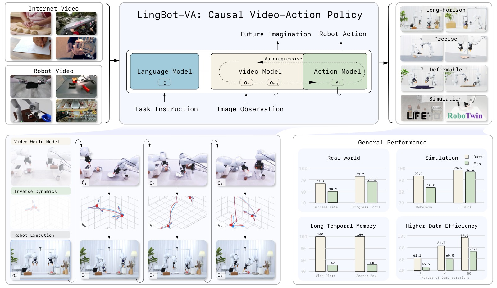
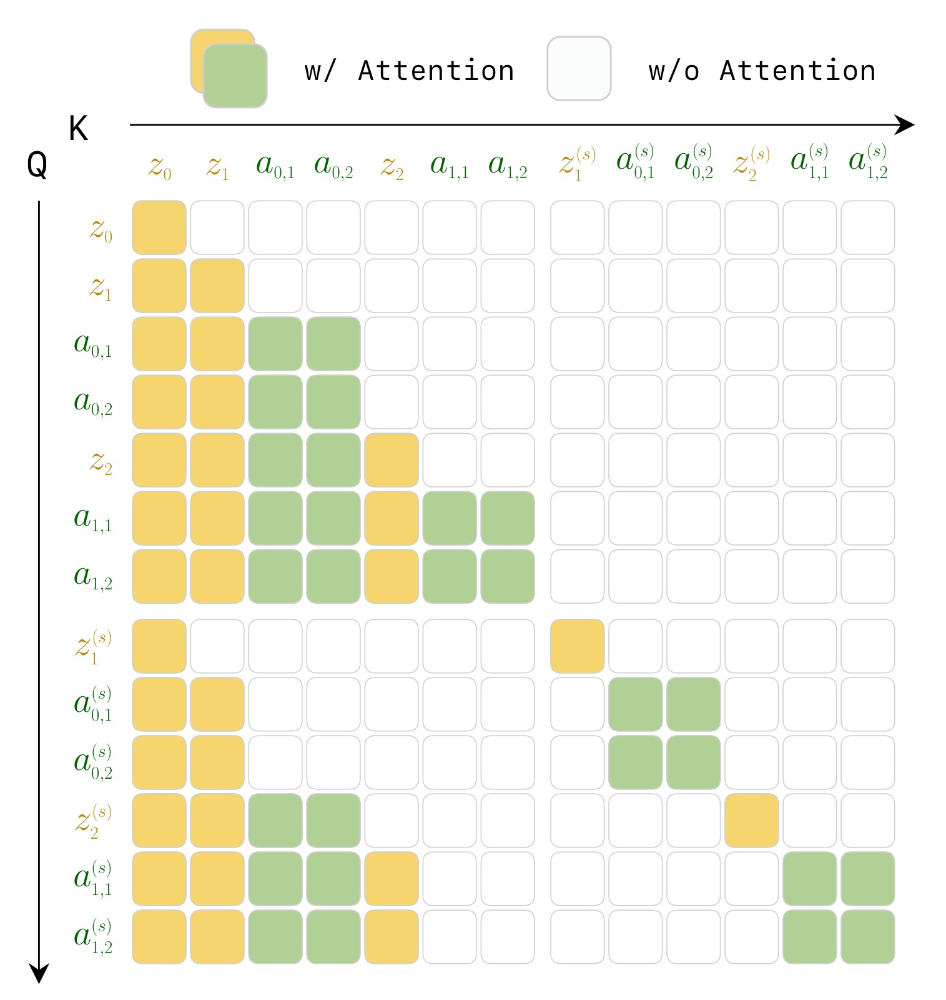
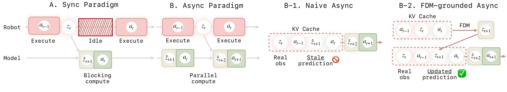
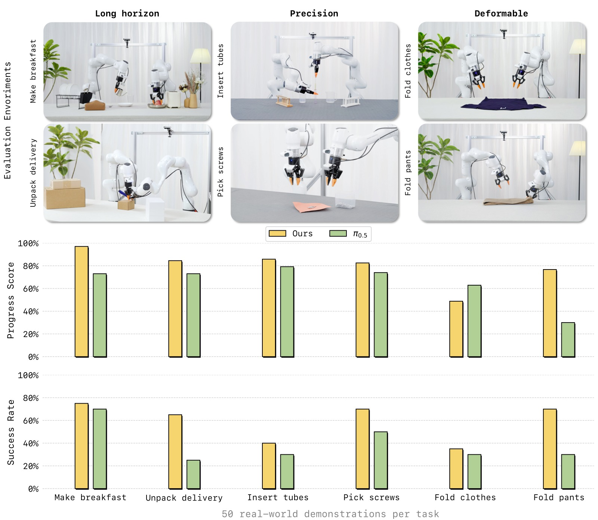
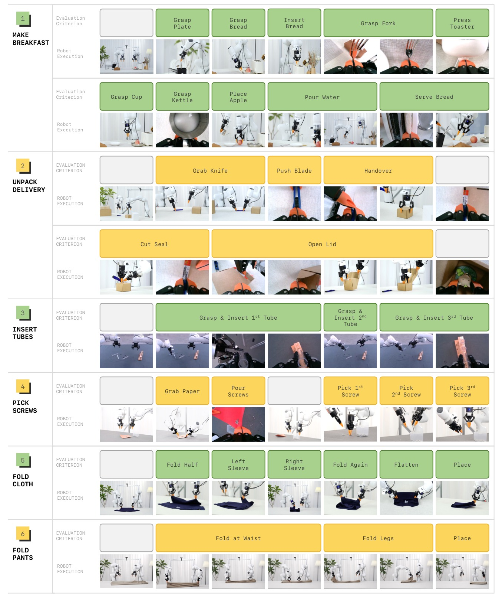
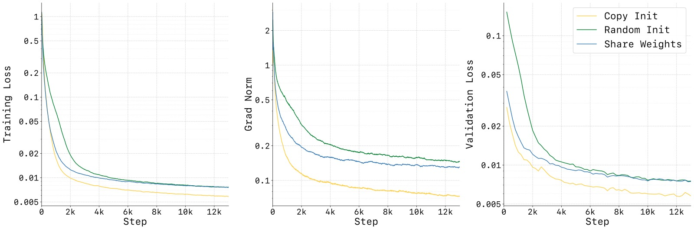
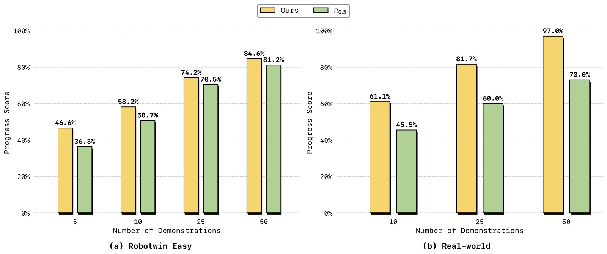
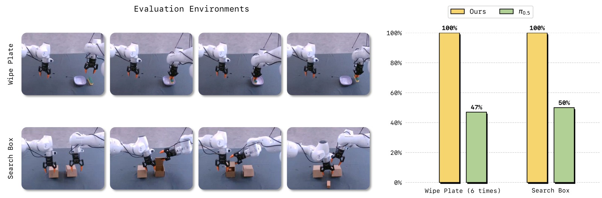
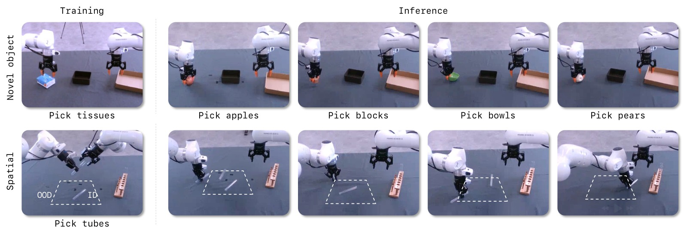

<!-- arxiv: 2601.21998 -->
<!-- venue: 蚂蚁灵波技术报告 -->
<!-- tags: 世界模型 -->

# LingBot-VA: Causal World Modeling for Robot Control

> **论文信息**
> - 作者：Lin Li*, Qihang Zhang*†, Yiming Luo*, Shuai Yang, Ruilin Wang, Fei Han, Mingrui Yu, Zelin Gao, Nan Xue, Xing Zhu, Yujun Shen, Yinghao Xu‡（* 同等贡献，† 项目负责人，‡ 通讯作者）
> - 机构：Robbyant（蚂蚁集团）
> - arXiv ID：2601.21998v2（2026）
> - 代码：https://github.com/robbyant/lingbot-va
> - 模型：https://huggingface.co/robbyant/lingbot-va
> - 项目页：https://technology.robbyant.com/lingbot-va

---



*图1：LingBot-VA 论文 Teaser 总览图，四栏展示核心贡献。该图是论文的"一图胜千言"——从预训练到部署，全景式呈现了 LingBot-VA 的设计哲学与落地效果。*

**子图 (1) — 预训练（Pretraining）：** 展示 LingBot-VA 的预训练数据规模和多样性。模型在约 16K 小时的机器人操作数据上联合训练，数据来源涵盖 6 个主流数据集：Agibot（移动操作平台大规模数据）、RoboMind（多 embodiment 示教）、InternData-A1（仿真到真机迁移）、OXE 的 OpenVLA 子集、UMI Data（人手示教）、RoboCOIN（双臂跨 embodiment）。预训练后的模型保留了 Wan2.2-5B 的视频生成先验，同时学到了跨场景的视觉-运动联合表征，使模型能够泛化到训练数据中未见的物体、场景和任务组合。

**子图 (2) — 全面评估（Comprehensive Evaluation）：** 展示 LingBot-VA 在仿真和真机两个维度上的评估覆盖。仿真侧：RoboTwin 2.0（50 个双臂任务，含 Easy/Hard 设定）和 LIBERO（4 个 suite 的 40 个任务）。真机侧：6 项涵盖长序列（Make Breakfast、Pick Screws）、精密操作（Insert Tubes、Unpack Delivery）、可形变物体（Fold Clothes、Fold Pants）的任务。LingBot-VA 在所有基准上全面超越 π₀.₅——RoboTwin 2.0 上 92.9%(Easy)/91.6%(Hard)，LIBERO 平均 98.5%，真机任务平均 Progress Score 领先约 15-47 个百分点（Fold Pants 上 PS 76.7% vs 30.0%）。

**子图 (3) — 多功能能力（Versatile Capabilities）：** 除策略学习外，LingBot-VA 作为一个视频-动作联合世界模型，天然支持两种附加能力：(i) 视觉动态预测——给定初始图像 + 语言指令，模型可以生成未来视频帧序列，展示其对物理动态的理解；(ii) 逆动力学推理——给定真实机器人视频，模型可以反推执行了什么动作。这使得 LingBot-VA 不仅是策略网络，更是可解释的视觉推理引擎。

**子图 (4) — 涌现特性（Emergent Properties）：** 因果世界建模赋予 LingBot-VA 两种涌现能力：(i) 长程时间记忆——KV cache 持久化完整交互历史，使模型在需要计数的任务（如 Wipe Plate 精确擦 6 次）和需要排除性记忆的任务（如 Search Box 记住已检查的盒子）上大幅超越 π₀.₅；(ii) Few-shot 适应——仅 10 个真机示教即可在新任务上达到比 π₀.₅ 高出 10-15 个百分点的表现，50 个示教即可部署。

---

## 一、核心问题

### 现有 VLA 的瓶颈：表征纠缠（Representation Entanglement）

当前 Vision-Language-Action（VLA）模型（如 π₀.₅、OpenVLA、RT-2）主要采用**前馈映射范式**——直接从当前观测 $o_t$ 预测动作 $a_t$：

$$a_t \sim \pi_\theta(\cdot \mid o_t)$$

这种端到端方式存在根本性的**表征纠缠**问题：单一神经网络被迫同时学习三个性质迥异的任务：
1. **视觉场景理解**：高维语义特征
2. **物理动力学建模**：环境演化规律
3. **运动控制**：低维电机指令

由于缺乏对环境演化的显式建模，这类反应式策略往往依赖**模式匹配**而非对物理动力学的原则性理解。

### 已有世界模型方法的三个缺陷

近期的视频世界模型方法（UniSim、UVA、UWM、Gen2Act 等）尝试将世界模型引入机器人策略，但面临三个核心限制：

| 缺陷 | 描述 |
|------|------|
| **反应性缺口（Reactivity Gap）** | Chunk/开环生成长序列时不纳入实时反馈，难以适应干扰 |
| **长程记忆受限（Limited Long-term Memory）** | 分块生成时历史信息不被持久缓存，导致长时间轴不一致 |
| **因果性违反（Causality Violation）** | 双向注意力允许未来 token 影响过去预测，违背物理世界的因果时序 |

### 本文核心主张

> 视频世界建模与视觉语言预训练并列，构成机器人学习的独立基础。视频世界模型提供了通过理解动作与视觉动态之间因果关系来"想象"近未来的能力。

---

## 二、核心思路 / 方法

### 2.1 整体范式：从"直接预测动作"到"先预测世界，再推理动作"

LingBot-VA 采用**两阶段分解**替代 VLA 的直接映射：

$$\begin{aligned}
\text{(Stage 1) 视觉动态预测:} \quad & o_{t+1} \sim p_\theta(\cdot \mid o_{\leq t}) \\
\text{(Stage 2) 逆动力学:} \quad & a_t \sim g_\psi(\cdot \mid o_t, o_{t+1})
\end{aligned}$$

- **Stage 1** 学习从历史观测预测未来视觉状态——可大规模利用视频数据学习物理先验
- **Stage 2** 使用逆动力学模型从期望的视觉变化中解码动作——仅需机器人示教数据

这本质上是让模型**先"想象"动作执行后的视觉结果，再据此决定动作**，实现"想清楚再动手"。

### 2.2 自回归视频-动作世界建模（核心创新 1）

#### 设计动机

物理世界本质上是**因果且自回归**的：当前状态仅依赖过去，不能提前观测未来。LingBot-VA 的建模严格遵循这一原则，采用**Chunk-wise 自回归 + Chunk 内双向生成**的混合范式：

$$z_{t+1:t+K} \sim p_\theta(\cdot \mid z_{\leq t}, a_{<t})$$

- Chunk 内：视频 token 通过双向注意力并行生成（利用 flow matching）
- Chunk 间：严格因果注意力（causal masking），当前 chunk 仅能看到历史 token

这种方法带来三个关键优势：

1. **持久记忆（Persistent Memory）**：KV cache 持久化整个交互历史的 video-action 交错序列，避免分块方法的"失忆"问题
2. **因果一致性（Causal Consistency）**：单向依赖结构自然契合闭环执行，新观测可无缝整合
3. **效率与灵活性**：Chunk 内并行生成 + Chunk 间自回归纠错，平衡效率与反应性

#### 视频-动作交错序列

LingBot-VA 将视频帧与动作 token 交错排列成统一序列。视频帧按 temporal stride $\tau=4$ 下采样后，每帧对应 $\tau$ 个连续动作：

$$[z_t, a_{t,1}, a_{t,2}, a_{t,3}, a_{t,4}, z_{t+1}, a_{t+1,1}, \dots]$$

这样，预测 $K$ 个视频帧对应生成 $\tau K$ 个动作，实现高频控制（50Hz 动作）同时保持视频生成效率（12.5Hz 帧率）。

### 2.3 Mixture-of-Transformers（MoT）统一架构（核心创新 2）


*图2：LingBot-VA 框架总览，展示基于自回归扩散（Autoregressive Diffusion）的统一视频-动作世界建模架构。全文最重要的架构图，解释了"视频和动作如何联合生成"。*

**图示结构**（从左到右的数据流）：

**(A) 输入阶段 — VAE 编码 + 动作嵌入**：原始视觉观测 $o_t$ 经 Wan2.2 Causal VAE 压缩为 latent token $z_t$（压缩比 $4\times16\times16$，temporal×height×width）。动作向量 $a_t$（30 维双臂表示）经单层 MLP（$\phi$）投影为与视频 token 同维度的嵌入。两者按时间顺序交错排列为统一序列 $[z_t, a_{t,1}, a_{t,2}, a_{t,3}, a_{t,4}, z_{t+1}, \dots]$。

**(B) 自回归流程 — Chunk-wise AR + Flow Matching**：序列按 chunk（$K$ 个视频帧，对应 $\tau K$ 个动作）划分为多个自回归步骤。Chunk 内通过 flow matching 并行生成（双向注意力加速），Chunk 间通过因果注意力掩码保持严格时序依赖。图中央的"Autoregressive Step"将这个过程分为两个子阶段。

**(C) 子阶段 1 — 视频动态预测（Video Stream）**：Video Stream（Wan2.2-5B 初始化，$d_v=3072$，30 层）以历史视频 latent $z_{\leq t}$ 和动作历史 $a_{<t}$ 为条件，通过 flow matching 预测下一 chunk 的视觉状态 $\hat{z}_{t+1:t+K}$。推理时采用部分去噪（积分到 $s=0.6$，3 步 Euler），输出"足够好"的视频预测。

**(D) 子阶段 2 — 逆动力学动作解码（Action Stream）**：Action Stream（$d_a=768$，4× 更窄，同样 30 层）以预测的未来视觉状态 $\hat{z}_{t+1:t+K}$ + 观察历史 $z_{\leq t}$ + 动作历史 $a_{<t}$ 为条件，通过 flow matching 解码动作 $a_{t:t+K-1}$（积分到 $s=1.0$，10 步 Euler，确保精度）。

**(E) MoT 跨模态融合**：每个 Transformer 层中，Video Stream 和 Action Stream 先独立计算 QKV（保持各自特征空间），再通过维度投影在联合自注意力中交互。图中以双向箭头表示这种相互条件化：视频预测告知动作"即将发生什么"，动作知识告知视频"机器人正在做什么"。

**(F) 输出 + 闭环**：生成的动作 $a_{t:t+K-1}$ 发送给机器人执行，真实观测 $z_{t+1}$ 反馈回 KV cache。预测视频以 CFG scale=5.0 引导质量，动作以 CFG scale=1.0（无引导）保持精度。

| 组件 | 规格 |
|------|------|
| Video Stream | Wan2.2-5B 初始化，$d_v = 3072$，30 层 |
| Action Stream | 相同深度，$d_a = 768$（4× 更小），约 350M 参数 |
| 总参数量 | 5.3B |
| 连接方式 | MoT 跨模态注意力：各层 video/action 独立 QKV，通过维度投影后联合自注意力 |
| 文本编码 | Frozen T5 text encoder，通过 cross-attention 注入指令 |

**非对称设计原理**：动作分布本质上比视觉数据简单得多——动作是低维向量（30 维），视觉是高维 latent。因此 Action Stream 只需视频流 1/4 的宽度即可高效建模，大幅降低计算开销。

**Action Stream 初始化策略**：训练稳定性至关重要。论文发现随机初始化 Action Stream 会导致训练振荡和收敛缓慢——动作 token 的输出分布最初与视频分布差异巨大，扰乱联合注意力。解决方案：

- 将预训练视频权重按 action 维度插值复制
- 乘以缩放因子 $\alpha = \sqrt{d_v / d_a}$ 保持输出方差一致
- 使 action token 初始输出分布与视频 token 可比，稳定早期训练

**变长 Chunk 训练**：训练时 Chunk 大小 $K \in [1, 8]$ 随机采样，推理时可灵活选择——论文使用 $K=4$ 作为实际部署的折中（更大的 chunk 减少自回归步数但增加单步计算，更小的 chunk 允许更频繁的闭环校正）。

### 2.4 Teacher Forcing 训练



*图3：Teacher Forcing 训练的因果注意力掩码矩阵，用于实现统一的视频-动作序列预训练。该掩码是整个框架实现"因果一致性"的底层机制。*

**图示结构**：

矩阵的横轴（KV）和纵轴（Q）均对应统一序列中的所有 token。序列按时间步组织：每个时间步包含视频 latent token（实线框标记）+ 对应的 $\tau=4$ 个动作 token（虚线框标记）。Token 分为两类：
- **Clean tokens（实线框）**：作为条件的干净历史 token，来自 ground-truth 数据
- **Noise tokens（虚线框）**：当前 flow matching step 的噪声 token（去噪目标）

**可见性规则**（暗色=允许关注，亮色=屏蔽）：

1. **Clean → Clean（块因果）**：干净的历史 token 互相之间使用块因果掩码——同一 chunk 内双向可见，跨 chunk 只能关注更早的 chunk。这模拟了"已知的历史可以互相参照"。

2. **Noise → Clean（块因果 + 排除自身）**：噪声 token 可以关注所有更早的干净 token，但不能关注自身对应的干净版本（防止"作弊"——不能直接看到去噪目标）。

3. **Noise → Noise（块内自掩码）**：噪声 token 仅能关注同一 chunk 内的其他噪声 token，不能跨 chunk 关注噪声 token。这确保了每个 chunk 的生成仅依赖干净历史，而非其他 chunk 的中间状态。

4. **全局约束**：叠加序列掩码（仅同一 episode 的 token 互相可见）和滑动窗口掩码（限制注意力范围到 window_size 内，降低计算复杂度）。

**矩阵的宏观特征**：
- 呈块对角 + 下三角结构——矩阵下半部分（未来查询过去）可见，上半部分（过去查询未来）全屏蔽
- 每个 video chunk 的行/列宽度更大（更多 visual tokens），action chunk 的行/列较窄（少数 action tokens）
- 整体严格下三角，体现了物理时间的因果箭头

论文采用类似 LLM 的 next-token prediction 方式训练整个交错序列：

- 每个 token 以所有前序 token 为条件进行预测
- 因果注意力掩码强制执行时间因果结构
- 并行处理整个 episode，单次前向传播优化所有时间步

**特别适配性**：与纯生成模型不同，Teacher Forcing 在机器人操作中不存在 train-test distribution mismatch——机器人策略在部署时天然获取真实观测，与训练阶段完全一致。

**跨 Episode 打包**：遵循 LLM 实践，将多个 episode 打包为最长 10K token 的序列，以注意力掩码分隔，显著提高训练效率。

### 2.5 Noisy History Augmentation → 部分去噪（核心创新 3）

推理瓶颈在于视频 token 生成——视频 token 数量远大于动作 token，且每个 token 需要多步 flow matching 去噪。

**关键洞察**：动作预测不需要像素级精确的视频重建，只需语义结构信息即可。

**训练时**：以 50% 概率将视频历史 $z_{\leq t}$ 替换为噪声增强版本：

$$\tilde{z}_{\leq t} = (1 - s_{\text{aug}}) \epsilon + s_{\text{aug}} z_{\leq t}, \quad s_{\text{aug}} \in [0.5, 1]$$

**推理时**：视频去噪只需从 $s=0$ 积分到 $s=0.5$（而非到 $s=1.0$），去噪步数减半。动作解码仍从 $s=0$ 积分到 $s=1.0$ 以确保精度。论文实际采用 3 步 Euler solver 去视频（到 $s=0.6$），10 步去动作（到 $s=1.0$）。

### 2.6 异步推理流水线（核心创新 4）



*图4：异步推理流水线设计对比，论文最重要的系统设计图。三个子图对比了同步流水线、朴素异步、以及 LingBot-VA 的 FDM-grounded 异步方案。*

**子图 (A) — 传统同步流水线（Synchronous Pipeline）**：
展示传统 VLA 模型的串行执行模式。时间轴从左到右，每一步包含三个串行阶段：(1) 模型推理预测动作 → (2) 机器人执行动作 → (3) 收集观测反馈。由于推理和执行为串行，总时延 = 推理耗时 + 执行耗时 + 观测耗时。当推理涉及视频 token 的 flow matching 去噪（多步）时，推理耗时成为主导瓶颈，导致控制频率远低于实时需求。图中以不同颜色的方块表示"模型推理"和"机器人执行"的交替，方块之间的间隙代表空闲等待时间。

**子图 (B-1) — 朴素异步实现（Naive Async）**：
引入并行化：推理和执行为流水线并行——当机器人执行当前动作 chunk $a_t$ 时，模型同时预测下一 chunk $a_{t+1}$。理论上可隐藏推理延迟，控制频率仅由 max(推理, 执行) 决定。然而，该方案有一个关键缺陷：预测 $a_{t+1}$ 时使用的视觉上下文是上一轮的**预测**结果 $\hat{z}_t$（而非真实观测）。由于视频生成模型天然偏好时间平滑和视觉连贯性，模型倾向于"延续"幻觉视频 $\hat{z}_t$ 而忽略中间到达的真实观测 $z_{t-1}$。随着时间推移，预测的视觉状态与真实物理状态之间的漂移（drift）不断累积。图中以虚线箭头表示这种基于过时预测的级联。

**子图 (B-2) — FDM-Grounded 异步（LingBot-VA 方案）**：
在执行动作 $a_t$ 的同时，模型收到上一步的真实观测反馈 $z_{t-1}$ 后，不是直接基于过时预测规划，而是先执行一次**前向动力学预测（FDM Grounding）**：以真实观测 $z_{t-1}$ + 正在执行的动作 $a_t$ 为输入，预测当前的视觉状态 $z_t$。这个 feedback-grounded 的预测替代了原先的幻觉预测，使模型在每次规划前都"重对齐"到物理现实。图中以实线箭头标示真实反馈的注入路径，虚线框标示被替换的过时预测。这个设计将原本的开环异步流水线升级为**闭环异步系统**——异步带来的效率提升被保留，但通过 FDM Grounding 确保了因果一致性和反应性。

**消融实验的量化验证**：Naive Async 在 H=3 任务上骤降至 32.9%（vs 同步的 93.2%），FDM-grounded Async 恢复到 85.6%——以轻微的性能代价（-7.6%）换取 2× 的执行速度提升。

#### KV Cache 推理（Algorithm 1）

利用自回归结构的天然优势：cache 历史 token 的 KV pair，每步只需计算新 token（当前观测 + 预测动作），历史 token 的 KV pair 直接复用。

#### 异步预测与执行（Algorithm 2）

核心思想：**计算与执行重叠**。当机器人执行当前动作 chunk $a_t$ 时，模型同时预测后续动作 chunk $a_{t+1}$。

**朴素异步的问题**：将过时的视觉预测 $\hat{z}_t$ 放入 KV cache → 视频生成模型天然偏好时间平滑 → 倾向于延续幻觉视频而忽略真实观测 $z_{t-1}$ → 开环退化和轨迹漂移。

**FDM Grounding 解决方案**：在执行完 $a_{t-1}$ 收到真实反馈 $z_{t-1}$ 后：
1. 用 $z_{t-1}$ + 正在执行的 $a_t$ 运行一次 Forward Dynamics Model（前向动力学预测）→ 得到基于真实反馈的 $z_t$
2. 将此 feedback-grounded 预测（而非过时幻觉）缓存
3. 基于此预测 $a_{t+1} = g_\psi(z_{t-K+1:t}, a_{t-K:t-1})$

这使得异步算法升级为**鲁棒的闭环系统**。Post-training 阶段额外加入 FDM 损失 $\mathcal{L}_{\text{fdm}}$。

#### 速度提升

实验表明异步模式完成任务的耗时是同步模式的 **1/2**，同时保持相当的任务成功率。

---

## 三、训练目标

### 完整损失函数

$$\mathcal{L} = \mathcal{L}_{\mathrm{dyn}} + \lambda \mathcal{L}_{\mathrm{inv}} \quad (\lambda = 1)$$

**1. 视觉动态损失（Video Dynamics Loss, $\mathcal{L}_{\mathrm{dyn}}$）**：

$$\mathcal{L}_{\mathrm{dyn}} = \mathbb{E}_{t, s, z_{t+1}, \epsilon} \left[ \| v_\theta(z_{t+1}^{(s)}, s, \tilde{z}_{\leq t}, a_{<t} \mid c) - \dot{z}_{t+1}^{(s)} \|^2 \right]$$

其中 $z_{t+1}^{(s)} = (1-s)\epsilon + s z_{t+1}$，$\dot{z}_{t+1}^{(s)} = z_{t+1} - \epsilon$，$\tilde{z}_{\leq t}$ 是经噪声增强的历史。

**2. 逆动力学损失（Inverse Dynamics Loss, $\mathcal{L}_{\mathrm{inv}}$）**：

$$\mathcal{L}_{\mathrm{inv}} = \mathbb{E}_{t, s, a_t, \epsilon} \left[ \| v_\psi(a_t^{(s)}, s, \tilde{z}_{\leq t+1}, a_{<t} \mid c) - \dot{a}_t^{(s)} \|^2 \right]$$

逆动力学以当前和下一帧视觉状态为条件预测动作。

**3. 前向动力学损失（Forward Dynamics Loss, $\mathcal{L}_{\mathrm{fdm}}$）**（Post-training 阶段加入）：

$$\mathcal{L}_{\mathrm{fdm}} = \mathbb{E}_{t, s, \hat{z}_{t+1}, \epsilon} \left[ \| v_\psi(\tilde{z}_{t+1}, s, z_t, a_t, \tilde{z}_{<t}, \hat{a}_{<t} \mid c) - \dot{z}_{t+1}^{(s)} \|^2 \right]$$

支持异步推理中的 FDM Grounding。

### 训练配置

| 配置项 | 值 |
|--------|-----|
| 预训练数据量 | 1.4T tokens |
| 优化器 | AdamW |
| Peak LR | $1 \times 10^{-4}$ |
| Weight Decay | 0.01 |
| 学习率调度 | Cosine annealing + linear warmup |
| 精度 | bfloat16 mixed precision |
| 梯度裁剪 | 2.0 |
| CFG Text Dropout | 0.1 |
| Uniform SNR Sampler | 视频和动作均用 |
| Chunk Size | $K \in [1, 4]$ 随机采样 |
| Post-training LR | $1 \times 10^{-5}$（3K steps）或 $1 \times 10^{-4}$（1K steps） |

---

## 四、实验与结果

### 4.1 仿真基准

#### RoboTwin 2.0（50 个双臂操作任务）



*图5：真机部署结果总览。该图以柱状图形式对比了 LingBot-VA 和 π₀.₅ 在六项真机任务上的表现，是论文最直接的效果证明。*

**图表结构**：

横轴为 6 项任务，分为三个类别：(i) 长序列任务——Make Breakfast（10 步）、Pick Screws（5 步）；(ii) 精密操作——Insert Tubes（抓取 3 管 + 插入 3 管）、Unpack Delivery（5 步）；(iii) 可形变物体——Fold Clothes（6 步）、Fold Pants（3 步）。

每个任务下有两组柱（不同颜色表示 LingBot-VA vs π₀.₅），每组包含两个指标：Progress Score（PS，左柱）和 Success Rate（SR，右柱）。所有指标均为百分比，越高越好。每项任务评估 20 次试验，采用交替评估协议（一次 π₀.₅ → 一次 LingBot-VA）确保公平。

**关键数据提取**：

| 任务 | LingBot-VA PS | π₀.₅ PS | 提升 | LingBot-VA SR | π₀.₅ SR | 提升 |
|------|:-----------:|:------:|:----:|:-----------:|:------:|:----:|
| Make Breakfast | 97.0 | 73.0 | +24.0 | 75.0 | 70.0 | +5.0 |
| Pick Screws | 82.5 | 74.0 | +8.5 | 70.0 | 50.0 | +20.0 |
| Insert Tubes | 85.8 | 79.2 | +6.6 | 40.0 | 30.0 | +10.0 |
| Unpack Delivery | 84.5 | 73.0 | +11.5 | 65.0 | 25.0 | **+40.0** |
| Fold Clothes | 48.8 | 62.9 | –14.1 | 35.0 | 30.0 | +5.0 |
| Fold Pants | 76.7 | 30.0 | **+46.7** | 70.0 | 30.0 | **+40.0** |

**三个维度的深度解读**：

1. **长序列任务**（Make Breakfast、Pick Screws）：LingBot-VA 的优势来自 KV cache 持久化历史上下文。Make Breakfast 包含 10 个子步骤（抓盘子→抓面包→抓叉子→放面包→按烤面包机→抓杯子→抓水壶→倒水→抓苹果→上桌），任何一步的失败都会导致连锁错误。π₀.₅ 在按烤面包机（55%）和抓水壶（35%）上频繁失败——纯前馈策略在长时序中丢失"刚才做了什么"的上下文。LingBot-VA 的 Progress Score 97.0% 意味着几乎完美执行了所有子步骤。

2. **精密操作**（Insert Tubes、Unpack Delivery）：Unpack Delivery 是差距最大的任务之一——Success Rate 65% vs 25%（+40%）。该任务需要抓美工刀→推刀片→手递刀→切割封条→打开盖子，每一步都有严格的精度要求。LingBot-VA 的统一 latent space 使视觉感知和精细运动控制之间有更紧密的耦合。但 Insert Tubes 的 SR 仅 40%（虽然仍高于 π₀.₅ 的 30%），说明精密插入仍是开放难题。

3. **可形变物体**（Fold Clothes、Fold Pants）：Fold Pants 上 LingBot-VA 以 76.7% vs 30.0% 碾压 π₀.₅（+46.7% PS！）——π₀.₅ 几乎完全无法折叠裤子。但 Fold Clothes 上 PS 低于 π₀.₅（48.8 vs 62.9），尽管 SR 略高（35 vs 30）。Fold Clothes 需要折叠半衫→左袖→右袖→再折→压平→放置，涉及高度可变形的布料动力学。LingBot-VA 的视频预测在此任务上可能产生了不准确的布料变形预测，导致要么成功要么早期失败，而 π₀.₅ 在部分步骤上有更稳定的进展。

| 方法 | Easy SR (%) | Hard SR (%) |
|------|-------------|-------------|
| X-VLA | 72.9 | 72.8 |
| π₀ | 65.9 | 58.4 |
| π₀.₅ | 82.7 | 76.8 |
| Motus | 88.7 | 87.0 |
| **LingBot-VA (Ours)** | **92.9 (+4.2)** | **91.6 (+4.6)** |

按任务 Horizon 分层的详细结果：

| Horizon | LingBot-VA Easy | 次优方法 Easy | 提升 | LingBot-VA Hard | 次优方法 Hard | 提升 |
|---------|:--------------:|:----------:|:----:|:--------------:|:----------:|:----:|
| H=1 | 94.2 | 91.0 (Motus) | +3.2 | 93.6 | 90.6 (Motus) | +3.0 |
| H=2 | 90.4 | 85.2 (Motus) | +5.2 | 87.0 | 80.9 (Motus) | **+6.1** |
| H=3 | 93.2 | 85.0 (Motus) | **+8.2** | 93.3 | 84.2 (Motus) | **+9.1** |

> **关键发现**：Horizon 越长，LingBot-VA 的优势越明显。H=3 任务中相对次优方法提升 8-9 个点，说明自回归机制有效维持了长程时间记忆。

#### LIBERO（4 个 Suite，10 任务/Suite）

| 方法 | Spatial | Object | Goal | Long | Avg |
|------|---------|--------|------|------|-----|
| Octo | 78.9 | 85.7 | 84.6 | 51.1 | 75.1 |
| CronusVLA | 97.3 | 99.6 | 96.9 | 94.0 | 97.0 |
| OpenVLA-OFT | 97.6 | 98.4 | **97.9** | 94.5 | 97.1 |
| X-VLA | 98.2 | 98.6 | 97.8 | 97.6 | 98.1 |
| **LingBot-VA (Ours)** | **98.5±0.3** | **99.6±0.3** | 97.2±0.2 | **98.5±0.5** | **98.5** |

> LingBot-VA 在 LIBERO-Long（98.5%）和 LIBERO-Object（99.6%）上均达 SOTA，验证了视频-动作世界模型作为通用机器人策略基础的有效性。

### 4.2 真机部署

六项真机任务，每任务仅 50 个示教微调（500 steps），与 π₀.₅ 对比（交替评估，各 20 次）：

| 任务 | 类别 | LingBot-VA PS | LingBot-VA SR | π₀.₅ PS | π₀.₅ SR |
|------|------|:----------:|:----------:|:------:|:------:|
| Make Breakfast (10 步) | 长序列 | **97.0** | **75.0** | 73.0 | 70.0 |
| Pick Screws (5 步) | 长序列 | **82.5** | **70.0** | 74.0 | 50.0 |
| Insert Tubes (6 子步骤) | 精密操作 | **85.8** | **40.0** | 79.2 | 30.0 |
| Unpack Delivery (5 步) | 精密操作 | **84.5** | **65.0** | 73.0 | 25.0 |
| Fold Clothes (6 步) | 可形变物体 | 48.8 | **35.0** | **62.9** | 30.0 |
| Fold Pants (3 步) | 可形变物体 | **76.7** | **70.0** | 30.0 | 30.0 |

> **三个关键验证**：
> 1. **长序列任务**：视频-动作世界模型通过 KV cache 持续维护任务上下文，在多步推理中不丢失中间目标
> 2. **精密操作任务**：统一 latent space 设计实现视觉感知与运动控制的更紧密耦合，产生更精准的动作
> 3. **可形变物体**：生成的视频预测提供关于物体动态和状态变化的丰富信号，帮助动作模型生成物理上更合理的操作轨迹

*Fold Clothes 任务上 LingBot-VA 的 Progress Score 低于 π₀.₅（48.8 vs 62.9），但 Success Rate 略高（35 vs 30），说明 LingBot-VA 在该任务上要么成功要么早期失败，而 π₀.₅ 在部分步骤上有更稳定的部分进展。折叠衣物仍是所有方法面临的核心挑战。*



*图6：六项真机任务的关键执行步骤流程图解。每行对应一个任务，以序列图像展示从初始状态到最终目标的完整操作流程。*

**逐任务解读**（按图中从上到下顺序）：

**(A) Make Breakfast（10 步）**：初始场景包含盘子、面包、叉子、杯子、水壶、苹果等。关键步骤：(1) 抓取盘子 → (2) 抓取面包 → (3) 抓取叉子 → (4) 将面包放入烤面包机 → (5) 按下烤面包机 → (6) 抓取杯子 → (7) 抓取水壶 → (8) 倒水 → (9) 抓取苹果 → (10) 上桌摆放。这是所有任务中步骤最多的，要求模型在整个流程中持续记住"已经完成到第几步"。图中展示了关键帧——面包入炉、倒水动作、最终摆盘效果。评分标准见附录 Table S1（满分 10 分，20 次试验中 LingBot-VA 平均 9.70 分）。

**(B) Pick Screws（5 步）**：场景中有纸张和散落螺丝。(1) 抓取纸张 → (2) 将螺丝倒在纸上 → (3)-(5) 逐个插入三颗螺丝。有趣的是图中展示了机械臂的双臂协同——一手持纸，一手操作螺丝。这解释了为什么 RoboTwin 2.0 是双臂基准——许多实际操作需要双臂协调。

**(C) Insert Tubes（6 子步骤）**：包含 3 根管子的抓取和插入。(1-3) 依次抓取三根管子 → (4-6) 依次将管子插入目标孔位。图中展示了管子的初始散落状态、抓取过程中的夹爪姿态、以及插入完成后的最终排列。该任务要求毫米级精度——插入间隙极小。

**(D) Unpack Delivery（5 步）**：模拟拆快递场景。(1) 抓取美工刀 → (2) 推出刀片 → (3) 手递刀（右手→左手）→ (4) 沿封条切割 → (5) 打开盖子。这是一种典型的精细工具使用任务。图中展示了关键的手递（handover）动作——这是双臂协调的核心挑战。

**(E) Fold Clothes（6 步）**：折叠衬衫。(1) 对折一半 → (2) 折左袖 → (3) 折右袖 → (4) 再对折 → (5) 压平 → (6) 放置。图中清晰展示了布料从摊平到逐步折叠的形变过程。注意布料的可形变特性——折叠线不是刚性的，每次操作后的布料状态取决于之前的折叠历史。这也是所有任务中 LingBot-VA 最困难的。

**(F) Fold Pants（3 步）**：(1) 折叠裤子第一条折线 → (2) 折叠第二条折线 → (3) 放置叠好的裤子。虽然步骤最少，但 π₀.₅ 几乎完全失败（PS 30%），而 LingBot-VA 达到 76.7% PS——差距高达 46.7 个百分点，是全部实验中最悬殊的单项对比。

### 4.3 消融实验

在 RoboTwin 2.0 Easy 设置上消融三个关键设计：

| 消融项 | 设置 | Easy_all | Easy_H=1 | Easy_H=2 | Easy_H=3 |
|--------|------|:------:|:------:|:------:|:------:|
| Baseline | LingBot-VA | **92.9** | **94.2** | **90.4** | **93.2** |
| 部署模式 | FDM-grounded Async | 90.4 | 92.5 | 87.7 | 85.6 |
| 部署模式 | Naive Async | 74.3 | 83.3 | 70.3 | 32.9 |
| 预训练 | WAN (only) | 80.6 | 84.9 | 76.3 | 67.6 |

> **关键结论**：
> - **FDM Grounding 至关重要**：Naive Async 在 H=3 任务上骤降至 32.9%，验证了"幻觉延续"问题；FDM Grounding 将 H=3 恢复到 85.6%
> - **联合预训练收益显著**：仅使用 WAN 初始化的微调比 LingBot-VA 预训练低约 11 个点（80.6 vs 92.9），证明联合视频-动作预训练赋予了模型丰富的视觉-运动先验
> - **同步 vs 异步**：异步模式成功率略低于同步（90.4 vs 92.9），但执行速度快 2×

### 4.4 Action Network 初始化策略对比



*图7：三种 Action Network 初始化策略的训练动态对比。该图是对 Architecture 设计选择的关键验证——通常被忽略的"初始化"问题，在 MoT 联合架构中却至关重要。*

**图表结构**：

图包含两个面板，横轴均为训练步数。

- **上方面板 — 训练损失曲线**：三条曲线对应三种初始化策略。纵轴为 flow matching loss（越低越好）。
  - **紫色/蓝色曲线（Random Init）**：从随机权重初始化 Action Stream。损失在训练初期极高且剧烈振荡，收敛速度远慢于其他方法。原因：随机初始化的 action token 输出分布与预训练 video token 分布差异巨大，在联合自注意力中产生不稳定的注意力模式。
  - **橙色曲线（Copy Weights, No Scaling）**：将预训练视频权重按 action 维度复制，但不做方差缩放。训练稳定但最终损失次优——虽比 random init 好，但 action 输出的初始方差与视频不匹配，收敛较慢。
  - **绿色曲线（Copy Weights + Scaling，LingBot-VA）**：复制权重后乘以缩放因子 $\alpha = \sqrt{d_v / d_a} = \sqrt{3072/768} = 2.0$。收敛最快、最终损失最低。

- **下方面板 — 梯度范数**：对应三种策略的训练梯度范数随步数的变化。Random Init 的梯度范数极高且波动大（紫色曲线剧烈跳跃），表明训练不稳定；Copy + Scaling 的梯度范数平滑下降，说明优化轨迹良好。

**为什么缩放因子 $\alpha = \sqrt{d_v/d_a}$ 有效**：当将权重从 $d_v=3072$ 维空间映射到 $d_a=768$ 维空间时，若不缩放，action token 的输出方差约为视频 token 的 $d_a/d_v = 1/4$，导致在联合自注意力中 action 的贡献被视频淹没。乘以 $\sqrt{d_v/d_a}$ 保持输出方差一致，使两个模态在注意力计算中处于平等地位。

### 4.5 样本效率



*图8：Post-training 阶段的 few-shot 样本效率对比。在真机和仿真两个维度、三个数据量级上，LingBot-VA（绿色）持续优于 π₀.₅（蓝色），尤其在极低数据量下优势更显著。*

**图表结构**：

上下两行分别对应两个评估场景，每行包含两组柱（PS 和 SR），横轴为三个数据量级。

- **上行 — Make Breakfast（真机）**：纵轴为百分比（Progress Score / Success Rate）。横轴三个分组：10 demos / 25 demos / 50 demos。每组分 LingBot-VA（绿色）和 π₀.₅（蓝色）两根柱。

- **下行 — RoboTwin 2.0 Easy（仿真）**：相同布局，但评估对象为 50 个仿真任务的平均成功率。

**逐数据量级对比**：

| 场景 | 指标 | 10 demos | 25 demos | 50 demos |
|------|------|:--------:|:--------:|:--------:|
| Make Breakfast | LingBot-VA PS | ~62% | ~85% | 97.0% |
| Make Breakfast | π₀.₅ PS | ~46% | ~66% | 73.0% |
| Make Breakfast | LingBot-VA SR | ~25% | ~55% | 75.0% |
| Make Breakfast | π₀.₅ SR | ~15% | ~45% | 70.0% |
| RoboTwin Easy | LingBot-VA SR | ~82% | ~88% | 92.9% |
| RoboTwin Easy | π₀.₅ SR | ~72% | ~80% | 82.7% |

**关键趋势**：

1. **低数据量下差距最大**：10 个示教时，Make Breakfast PS 差距约 +15.6 个百分点，RoboTwin 上约 +10.3 个百分点。这是因为 LingBot-VA 的视频生成 backbone 预训练提供了丰富的物理动力学先验——即使只有极少量动作数据，模型也能依赖预训练的视频理解能力来推理动作。

2. **数据增加后差距缩小但持续显著**：50 个示教时差距仍保持在约 +24.0 PS（真机）和 +10.2 SR（仿真）。差距缩小的趋势反映了"天花板效应"——LingBot-VA 更快达到高性能，而 π₀.₅ 需要更多数据追赶但始终无法超越。

3. **SR 比 PS 更难提升**：Success Rate 对数据量的敏感度高于 Progress Score——因为 SR 要求所有步骤全部成功，任何一步失败即计为 0，而 PS 反映部分成功。这解释了为什么低数据量下 SR 差距更小（大家都在低 SR 区间），但随数据增加 LingBot-VA 的 SR 提升更快。

> 这种卓越的样本效率源于视频-动作世界模型设计：联合预训练的视频生成 backbone 提供丰富的物理动力学和物体交互先验，作为 Post-training 阶段的隐式正则可有效降低学习新任务所需的样本复杂度。相比之下，π₀.₅ 等纯 VLA 模型缺乏显式的动态建模，无结构化动力学先验可供利用。

### 4.6 时间记忆能力



*图9：两项显式时间记忆任务的评估结果和环境可视化。该图是论证"自回归因果世界建模优于纯前馈 VLA"的最直接证据——这两项任务无法通过单帧观测推断正确行动，必须依赖历史记忆。*

**左图 — 成功率柱状图**：横轴为两项任务（Wipe Plate + Search Box），每项任务下 LingBot-VA（绿色）与 π₀.₅（蓝色）各一根柱。纵轴为 Success Rate（%）。

| 任务 | LingBot-VA SR | π₀.₅ SR | 差距 |
|------|:-----------:|:------:|:----:|
| Wipe Plate | ~95% | ~60% | +35% |
| Search Box | ~85% | ~55% | +30% |

**右图 — 评估环境可视化**：

**(a) Wipe Plate（擦拭盘子）**：场景中有盘子、海绵等。机器人需要用一个海绵/抹布精确擦拭盘子恰好 6 次后停止。关键挑战：从任何单帧图像无法判断"已经擦了几次"——擦拭前后的视觉状态几乎相同（盘子还是那个盘子）。必须通过记忆来计数。π₀.₅ 的约 60% 成功率表明前馈式策略有一定概率通过动作模式找到规律（可能通过时间步数隐式编码），但不稳健。LingBot-VA 接近 95% 的成功率说明 KV cache 中保留了擦盘子的次数信息。

**(b) Search Box（搜索盒子）**：场景中有左右两个盒子，仅一个含方块。训练数据中方块位置随机（50% 左、50% 右），测试时方块始终在左盒。关键挑战：模型必须先打开右盒（空），然后必须"记住右盒是空的"才能正确选择左盒，而不是重开右盒。如果没有记忆，模型有 50% 概率返回空盒。π₀.₅ 约 55% 的成功率接近随机水平（~50%），说明它在前馈框架下几乎无法维持"已检查某盒"的状态。LingBot-VA 约 85% 的成功率表明自回归因果记忆有效编码了搜索历史。

**为什么这直接证明了因果世界模型的优势**：前馈策略 $\pi(a_t|o_t)$ 中，$o_t$ 在擦盘子时无法区分"已擦 3 次"和"已擦 5 次"，在搜索时无法区分"刚开过右盒"和"还没开过右盒"。LingBot-VA 的自回归建模 $p(o_{t+1}|o_{\leq t}, a_{<t})$ 通过 KV cache 的完整历史隐式编码了这些不可见的状态信息。

### 4.7 泛化能力



*图10：LingBot-VA 在新物体和新空间位置上的泛化能力评估。两个子图分别测试视觉外观泛化和空间布局泛化——合在一起论证了世界模型学习到的是"物体无关的物理先验"而非"视觉模式匹配"。*

**子图 (a) — Novel Object Generalization（新物体泛化）**：

- **训练设置**：仅使用一种物体（例如方块/圆柱）进行 pick-and-place 训练。
- **测试设置**：替换为多种不同形状、颜色、纹理的新物体——包括不同大小的方块、球体、圆柱体、甚至训练中从未见过的物体类别。
- **评估逻辑**：如果模型学到的是"匹配视觉模板"，则在看到不同外观的物体时失败。如果学到的是"物体如何受重力影响、被抓取后如何移动"的物理规律，则可以泛化。
- **图中排布**：通常以网格形式展示不同物体的操作序列——左侧为训练物体，右侧为多种测试物体。绿色/红色边框标示成功/失败。
- **LingBot-VA 的表现**：世界模型通过视频预测学习到的是"物体在空间中的存在性、可抓取性、移动后的位置变化"等物理属性，而非特定物体的视觉纹理。视频生成的预训练数据覆盖了大量不同的物体外观，使 backbone 天然具备物体外观不变性。

**子图 (b) — Spatial Generalization（空间泛化）**：

- **训练设置（ID, In-Distribution）**：物体始终放置在固定区域（例如桌面的前左象限），机器人从固定位置开始操作。
- **测试设置（OOD, Out-of-Distribution）**：物体被随机放置在桌面上的各种位置，包括训练中从未出现过的远端角落、边缘区域。
- **评估逻辑**：如果模型学到的是"物体在坐标 (x, y) → 执行动作序列 ABC"，则位置变化后失败。如果学到的是"看到物体在哪里 → 规划到达该位置的路径并操作"，则可以泛化。
- **图中排布**：通常对比 ID 和 OOD 位置下的操作轨迹——可以看到机械臂是否能成功到达新位置并完成 pick-and-place。
- **LingBot-VA 的表现**：视频预测将空间关系编码为视觉 latent 中的位置信息，而非过拟合到绝对坐标。KV cache 保留了"物体当前在什么位置"的空间记忆。

**泛化能力的来源**：视频生成 backbone（Wan2.2-5B）在海量 internet 视频上预训练，已经学到了关于物体外观多样性、空间关系、运动动力学的通用先验。LingBot-VA 的联合训练在此基础上叠加了机器人操作知识，但保留了视频预训练带来的泛化性——这使得世界模型对物体外观和空间位置的分布偏移具有较强的鲁棒性。纯 VLA 方法（如 π₀.₅）仅从操作数据中学习，缺乏这种基于视频的通用物理先验。

---

## 五、关键洞察与技术亮点

### 5.1 为什么是"因果世界模型"？

核心理念：机器人操作不是模式匹配问题，而是**时序因果推理问题**。LingBot-VA 的每个设计选择都围绕着对因果关系和物理时序的尊重：

- **因果注意力** → 未来不能影响过去
- **Teacher Forcing** → 训练和部署数据分布一致（都基于真实历史）
- **KV Cache** → 完整保留因果历史
- **自回归闭环** → 每次预测后纳入真实反馈

### 5.2 "视频生成 + 动作推理"的统一

不同于将视频预测和动作推理分离的方案（如先预测视频，再单独规划），LingBot-VA 通过 MoT 架构将两者**交错在同一序列中联合处理**——视频 token 和动作 token 通过 cross-modal attention 互相影响，使：

- 视频预测受益于对已执行动作的知识
- 动作推理受益于对未来视觉状态的"想象"

### 5.3 工程化部署的系统性思考

论文不仅在算法层面创新，在系统部署层面也做出了精细设计：

- **Noisy History Augmentation**：巧妙的训练技巧，使推理加速 2× 同时几乎不损失精度
- **异步流水线**：计算与执行并行，隐藏推理延迟
- **FDM Grounding**：解决异步模式下的开放环退化——本质是用每次真实反馈做一次"重对齐"
- **跨 Episode 打包**：类似 LLM 的 sequence packing，提高 GPU 利用率

### 5.4 与 Motus 的关系

LingBot-VA 与同期工作 Motus 共享 MoT 架构思想（视频-动作双流交叉注意力），但关键区别在于：
- Motus 在 latent 推理空间中使用双向注意力（chunk 内），缺乏严格因果结构
- LingBot-VA 坚持因果自回归 + KV cache 持久记忆，在长序列任务上展现明显优势（RoboTwin H=3: LingBot-VA 93.2 vs Motus 85.0）

---

## 六、代码实现解读

LingBot-VA 代码仓库结构清晰，核心文件如下：

### 6.1 模型架构（`wan_va/modules/model.py`）

**`WanTransformer3DModel`** 是整个系统的核心模型类，继承自 diffusers 的 `ModelMixin` 和 `ConfigMixin`。

#### 6.1.1 整体架构字符画

```
┌─────────────────────────────────────────────────────────────────────┐
│                   WanTransformer3DModel (5.3B)                       │
│                                                                      │
│  Input: o_t (观测图像) + c (T5语言指令)                               │
│                                                                      │
│  ┌──────────────────────┐    ┌──────────────────────┐               │
│  │   Video Stream       │    │   Action Stream       │               │
│  │   (Wan2.2-5B init)  │    │   (Wan weights copy)  │               │
│  │   d_v = 3072         │    │   d_a = 768 (1/4×)    │               │
│  └──────┬───────────────┘    └──────┬───────────────┘               │
│         │                           │                                │
│  ┌──────▼───────────────────────────▼──────────────────┐            │
│  │         Input Embedding                              │            │
│  │  ┌─────────────────┐  ┌─────────────────┐            │            │
│  │  │ patch_embed_mlp │  │ action_embedder │            │            │
│  │  │ (48×1×2×2→3072)│  │ (30→3072, MLP)  │            │            │
│  │  └────────┬────────┘  └────────┬────────┘            │            │
│  │           │                    │                      │            │
│  │  Interleave: [z_t, a_t1, a_t2, a_t3, a_t4, z_t+1, ...]│          │
│  └───────────┬────────────────────┬──────────────────────┘            │
│              │                    │                                   │
│  ┌───────────▼────────────────────▼──────────────────────┐            │
│  │      30× WanTransformerBlock (shared weights)          │            │
│  │                                                        │            │
│  │  Video ──► Self-Attn ──┐                              │            │
│  │                         ├─► Cross-Attn(T5) ──► FFN ──►│            │
│  │  Action ─► Self-Attn ──┘                              │            │
│  │                                                        │            │
│  │  (MoT: 各自独立QKV + 维度投影 + 联合Self-Attention)      │            │
│  └───┬──────────────────────────┬──────────────────────────┘            │
│      │                          │                                      │
│  ┌───▼──────────┐    ┌──────────▼─────────┐                           │
│  │  proj_out    │    │  action_proj_out    │                           │
│  │  (3072→48*4) │    │  (3072→30)          │                           │
│  └───┬──────────┘    └──────────┬─────────┘                           │
│      │                          │                                      │
│  Output: Δz_t (视频残差)       Output: a_t (动作向量)                    │
└─────────────────────────────────────────────────────────────────────┘
```

#### 6.1.2 训练前向数据流（`forward_train`）

```
                    Token 拼接与统一序列
─────────────────────────────────────────────────────────────────
  noisy_latents    cond_latents     noisy_actions   cond_actions
  (去噪目标)        (干净历史)       (去噪目标)       (干净历史)
  ┌──────────┐    ┌──────────┐    ┌──────────┐    ┌──────────┐
  │ B×C×F×   │    │ B×C×F×   │    │ B×C×F×   │    │ B×C×F×   │
  │  H×W     │    │  H×W     │    │  H×1     │    │  H×1     │
  └────┬─────┘    └────┬─────┘    └────┬─────┘    └────┬─────┘
       │               │               │               │
       ▼               ▼               ▼               ▼
  patch_embed      patch_embed     action_embed    action_embed
       │               │               │               │
       ▼               ▼               ▼               ▼
  ┌─────────────────────────────────────────────────────────┐
  │ [N_L | C_L | N_A | C_A]  →  cat(dim=1)  →  [1, T, 3072]│
  │                                                         │
  │ N_L: noisy latents,  C_L: clean latents                 │
  │ N_A: noisy actions,  C_A: clean actions                 │
  │ + pad to multiple of 128                                 │
  └─────────────────────┬───────────────────────────────────┘
                        │
          ┌─────────────▼─────────────┐
          │  FlexAttnFunc.init_mask() │  ← 构建因果注意力掩码
          │  控制4种token间可见性      │
          └─────────────┬─────────────┘
                        │
          ┌─────────────▼─────────────┐
          │  30× WanTransformerBlock  │
          │  (self-attn + cross-attn   │
          │   + FFN, 含MoT融合)        │
          └─────────────┬─────────────┘
                        │
          ┌─────────────▼─────────────┐
          │  norm_out + scale_shift   │
          │  split → latent / action   │
          │  ┌──────────┐ ┌────────┐  │
          │  │proj_out  │ │act_proj│  │
          │  └────┬─────┘ └───┬────┘  │
          │       │           │       │
          │  Δz (video)   a (action)  │
          └───────────────────────────┘
```

#### 6.1.3 推理前向（`forward`）的三种模式

```
forward(input_dict, update_cache, cache_name, action_mode, train_mode)
    │
    ├── train_mode=True ──► forward_train(input_dict)
    │
    ├── action_mode=False (视频去噪模式)
    │       │
    │       ├── patch_embedding_mlp(noisy_latents)
    │       ├── condition_embedder(timesteps, text_emb)
    │       ├── 30× blocks (update_cache 控制 KV cache 策略)
    │       │       update_cache=0: 临时使用 cache，用完恢复
    │       │       update_cache=1: 更新 cache，标记 is_pred=True
    │       │       update_cache=2: 更新 cache，标记 is_pred=False
    │       └── proj_out → 视频 latent 残差
    │
    └── action_mode=True (动作去噪模式)
            │
            ├── action_embedder(noisy_actions)
            ├── condition_embedder_action(timesteps, text_emb)
            │       (独立的时间嵌入参数！)
            ├── 30× blocks (与视频模式共享层参数)
            └── action_proj_out → 动作向量
```

#### 6.1.4 KV Cache 生命周期

```
时序：t=0         t=4         t=8         t=12        ...
      │           │           │           │
      ▼           ▼           ▼           ▼
  ┌─────────┐┌─────────┐┌─────────┐┌─────────┐
  │ Cold    ││ Infer   ││Compute  ││ Infer   │
  │ Start   ││ Chunk 0 ││KV Cache ││ Chunk 1 │
  │         ││         ││(真实obs)││         │
  │ reset() ││_infer() ││_compute ││_infer() │
  │         ││         ││_kv_cache││         │
  │ cache   ││ video:  ││写入真实 ││ video:  │
  │ ←z_0    ││ 3步去噪 ││z_{1:4}  ││ 3步去噪 │
  │         ││ action: ││+ a_{0:3}││ action: │
  │         ││ 10步去噪││         ││ 10步去噪│
  └────┬────┘└────┬────┘└────┬────┘└────┬────┘
       │          │          │          │
       ▼          ▼          ▼          ▼
   执行a_0      执行a_1    执行a_2    执行a_3
   收集o_1      收集o_2    收集o_3    收集o_4

KV Cache 内容演变：
  t=0: [z_0]
  t=4: [z_0, a_{0:3}(pred), z_{1:4}(pred)]
  t=4.5: [z_0, a_{0:3}(real), z_{1:4}(real)]  ← _compute_kv_cache 替换预测
  t=8: [z_0, a_{0:3}(real), z_{1:4}(real), a_{4:7}(pred), z_{5:8}(pred)]
  ...
```

#### 6.1.5 注意力掩码实现细节（`FlexAttnFunc._get_mask_mod`）

实际代码中的掩码通过以下组合实现：

```
clean2clean_mask:  noise_ids[q]==1 & noise_ids[kv]==1
noise2clean_mask:  noise_ids[q]==0 & noise_ids[kv]==1
noise2noise_mask:  noise_ids[q]==0 & noise_ids[kv]==0

block_causal_mask:       frame_ids[kv] <= frame_ids[q]
block_causal_excl_self:  frame_ids[kv] <  frame_ids[q]
block_self_mask:          frame_ids[kv] == frame_ids[q]

最终掩码 = or_masks(
    and_masks(clean2clean,   block_causal),          # 干净→干净：因果可见
    and_masks(noise2clean,   block_causal_excl_self), # 噪声→干净：因果但排除自身
    and_masks(noise2noise,   block_self),             # 噪声→噪声：仅同块
)
+ and_masks(seq_mask)   # 同 episode 内可见
+ block_window_mask     # 滑动窗口限制
```

### 6.2 推理服务器（`wan_va/wan_va_server.py`）

**`VA_Server`** 类实现了完整的推理流水线：

**关键方法**：

| 方法 | 功能 |
|------|------|
| `_reset(prompt)` | 初始化/重置：清理 KV cache、编码 Prompt、设置 action mask 和归一化 |
| `_encode_obs(obs)` | 观测编码：图像 → 预处理（resize + normalize）→ Wan2.2 VAE → latent |
| `_infer(obs, frame_st_id)` | 核心推理：视频去噪（3步，到 s=0.6）→ 动作去噪（10步，到 s=1.0），支持 CFG |
| `_compute_kv_cache(obs)` | KV Cache 更新：将真实观测和动作编码后写入 KV cache（`update_cache=2`） |
| `infer(obs)` | 主入口：路由到 reset / compute_kv_cache / infer |

**异步推理流程（对应论文 Algorithm 2）**：

```
时间轴 ─────────────────────────────────────────────────────────────►

Branch A (Robot Execution):
  [Cold Start]        [执行 a_0]              [执行 a_1]
  ┌──────────┐       ┌─────────────────┐     ┌─────────────────┐
  │ 等待首次  │       │ Executor(a_0,   │     │ Executor(a_1,   │
  │ 预测完成  │       │  ObsQueue)      │     │  ObsQueue)      │
  └──────────┘       │ → 移动机械臂     │     │ → 移动机械臂     │
                     │ → 收集 o_1       │     │ → 收集 o_2       │
                     └────────┬────────┘     └────────┬────────┘
                              │                       │
Branch B (Inference):         ▼                       ▼
  ┌──────────────┐    ┌─────────────────┐     ┌─────────────────┐
  │ Predict(z_0) │    │ Read ObsQueue   │     │ Read ObsQueue   │
  │ → z_1, a_0   │    │ o_1 → z_1(real) │     │ o_2 → z_2(real) │
  │              │    │                 │     │                 │
  │              │    │ KV Cache ←      │     │ KV Cache ←      │
  │              │    │ z_1(real), a_0  │     │ z_2(real), a_1  │
  │              │    │                 │     │                 │
  │              │    │ FDM(z_1,a_1):   │     │ FDM(z_2,a_2):   │
  │              │    │ 预测 z_2(真实   │     │ 预测 z_3(真实   │
  │              │    │ 反馈对齐)       │     │ 反馈对齐)       │
  │              │    │                 │     │                 │
  │              │    │ Predict(z_2):   │     │ Predict(z_3):   │
  │              │    │ → z_3, a_2      │     │ → z_4, a_3      │
  └──────────────┘    └─────────────────┘     └─────────────────┘

关键：Branch A 和 B 并行运行
  - Branch A 执行动作时，Branch B 已经在预测下一步
  - 延迟隐藏：推理时间 < 执行时间时，控制频率 = 执行频率
  - FDM Grounding 确保 Branch B 每次都基于真实反馈重对齐
```

**CFG（Classifier-Free Guidance）**：
- 视频 CFG scale = 5.0（强引导，确保视觉质量）
- 动作 CFG scale = 1.0（无引导，动作不需要 CFG）

**GPU 内存优化**：
- VAE 和 Text Encoder offload 到 CPU（`enable_offload=True`）
- 单 GPU 推理约需 18-24GB VRAM

### 6.3 关键配置（`wan_va/configs/`）

不同环境和任务的配置分离良好：

| 配置文件 | 用途 |
|----------|------|
| `va_robotwin_cfg.py` | RoboTwin 推理配置 |
| `va_libero_cfg.py` | LIBERO 推理配置 |
| `va_robotwin_train_cfg.py` | RoboTwin Post-training 配置 |
| `va_libero_train_cfg.py` | LIBERO Post-training 配置 |
| `va_demo_cfg.py` / `va_demo_i2va.py` | 图像→视频-动作生成 demo |

### 6.4 动作表示

采用统一的双臂表示（30 维）：
```
左臂: EEF(7) + Joints(7) + Gripper(1) = 15
右臂: EEF(7) + Joints(7) + Gripper(1) = 15
总计: 30 维
```
- EEF：(x, y, z, qx, qy, qz, qw)
- Joints：最多 7 DoF，不足补零
- 动作通过 quantile 归一化到 [-1, 1]

---

## 七、局限性

1. **计算开销**：尽管有异步推理和部分去噪优化，5.3B 参数的视频-动作世界模型仍需要约 18-24GB VRAM，在资源受限的边缘设备上部署有挑战
2. **可形变物体操作**：Fold Clothes 任务上 Progress Score（48.8%）仍较低，说明对高度可形变物体的精确操作仍是开放挑战
3. **视频 VAE 压缩**：依赖 Wan2.2 VAE，其压缩率和质量直接影响下游策略性能；更高效的压缩方案是未来方向
4. **模态限制**：当前仅使用视觉和语言输入；论文指出未来可融合触觉、力觉、音频等多模态传感，以应对复杂接触动力学的任务
5. **仿真到真机的迁移**：Post-training 需要 50 个真机示教，虽然远少于 π₀.₅ 但仍有收集成本

---

## 八、关键概念速查

| 概念 | 说明 |
|------|------|
| **Autoregressive Diffusion** | 自回归 + 扩散模型：每个 chunk 内用 flow matching 并行生成，chunk 间用因果自回归连接 |
| **Flow Matching** | 连续时间生成框架，学习从噪声分布到数据分布的 ODE 向量场；相比 DDPM 更高效的采样 |
| **Mixture-of-Transformers (MoT)** | 多模态 Transformer 架构：各模态独立 Transformer 处理 + 跨模态注意力融合 |
| **Inverse Dynamics Model (IDM)** | 从状态变化推理动作：$a_t = g(o_t, o_{t+1})$，而非直接 $a_t = \pi(o_t)$ |
| **Forward Dynamics Model (FDM)** | 前向动力学预测：$z_t = f(z_{t-1}, a_t)$，用于异步推理中的重对齐 |
| **KV Cache** | 缓存历史的 Key-Value pair，避免自回归推理中的重复计算 |
| **Teacher Forcing** | 训练时使用 ground-truth 历史作为条件，而非模型自身预测 |
| **Noisy History Augmentation** | 训练时给历史视频加噪，使推理时可部分去噪而加速 |
| **Classifier-Free Guidance (CFG)** | 通过混合条件和无条件预测引导生成质量 |
| **Variable Chunk Size** | 训练时随机采样 chunk 长度，推理时可灵活选择 |
| **Causal VAE** | Wan2.2 的因果视频 VAE，在时间维度上保持因果性（以历史帧为条件编码当前帧） |
| **Sequence Packing** | 将多个 episode 打包为长序列训练，类似 LLM 训练中 pad-to-longest 的优化 |
| **EEF Pose** | End-Effector Pose：末端执行器位姿，XYZ + 旋转四元数 |

---

> **总结**：LingBot-VA 提出了一种原则性的范式转换——从"直接预测动作"到"先因果地想象未来，再推理动作"。通过自回归扩散架构、MoT 统一建模、KV Cache 持久记忆、异步推理等系统性设计，在长序列操作、精密控制、样本效率和新场景泛化上均展现了显著优势。这项工作有力地论证了视频世界建模可以作为机器人学习的基础支柱，与 VLMs 互补而非从属。
