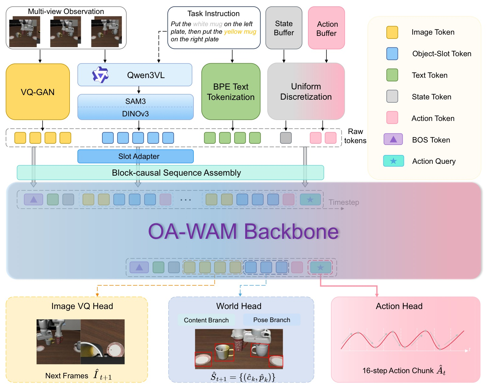
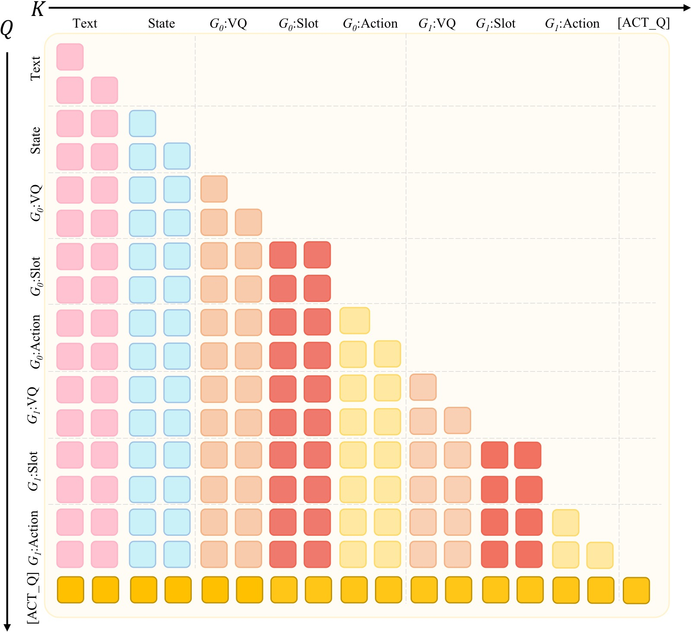
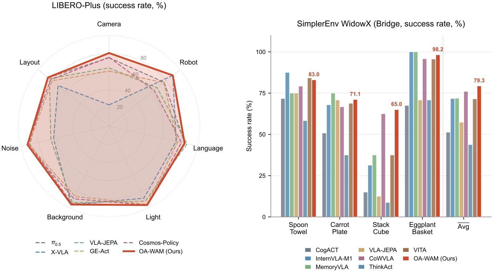
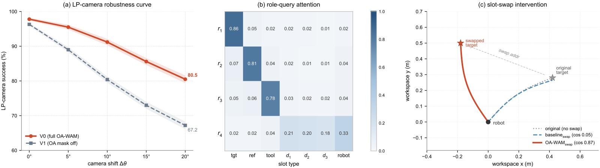

<!-- arxiv: 2605.06481 -->
<!-- venue: NeurIPS 2026（投稿中） -->
<!-- tags: 世界模型 -->

# OA-WAM: Object-Addressable World Action Model for Robust Robot Manipulation

> **论文信息**
> - 作者：Yushan Liu (Tsinghua), Peibo Sun (SJTU), Shoujie Li (NTU) 等
> - 通讯作者：Wenbo Ding (Tsinghua)
> - 状态：NeurIPS 2026 投稿（under review）
> - arXiv: 2605.06481v1

---

*图1：OA-WAM 总览图，对比整体 WAM 与 OA-WAM 在场景扰动下的行为差异。*

**左侧——六个典型扰动轴：** 展示了机器人操作中常见的六种场景扰动类型：Camera（相机视角偏移）、Layout（物体布局重排）、Robot Init（机器人初始位姿变化）、Light（光照条件改变）、Background（背景纹理替换）、Sensor Noise（传感器噪声注入）。这些扰动模拟了从模拟器到真实世界部署时的典型分布偏移。

**右上——整体 WAM 失败模式：** 当场景发生扰动（如相机视角变化）时，整体 WAM 将目标物体的身份信息（"它是哪个物体"）与场景上下文（背景、邻近物体外观）一起编码进全局 token 中。结果显示，目标物体（红色框标记的 mug）仍然可见，但动作解码器"找错对象"——末端执行器轨迹偏向背景中的另一个物体而非指令指定的目标。这是对象身份与场景上下文在 token 级别纠缠的直接可视化证据。

**右下——OA-WAM 鲁棒行为：** OA-WAM 将每帧分解为 N+1 个独立的对象槽（1 个 robot 槽 + N 个 object 槽），每个槽的交叉注意力键仅从冻结的 32 维身份地址 $\mathbf{addr}_k$ 投影（而非时变内容）。即使场景几何重排，目标物体的身份地址保持不变，动作解码器始终能通过地址子空间正确定位目标。末端执行器轨迹（橙色线）精准指向目标物体，证明了"对哪个对象采取行动"与"该对象当前是什么状态"在张量级别的成功解耦。

---

## 1. 核心问题：World Action Model 缺乏"对象可寻址性"

### 1.1 现有方法的缺陷

VLA（Vision-Language-Action）和 WAM（World Action Model）在高标准基准上表现饱和，但在场景扰动下（相机视角、物体布局、背景、光照、传感器噪声等）性能急剧下降。

**根本原因**：现有 WAM 将预测的世界表示为整体图像、视频 token 流或全局隐变量。这些整体表征将目标物体与其周围环境纠缠在一起——当场景发生变化时，目标物体仍然可见，但整体 token 中目标身份被背景和邻近内容污染，导致动作解码器"找错对象"。

论文将此问题形式化为**缺乏对象可寻址性（Object Addressability）**：

> 世界状态不仅应该预测未来，还应该提供稳定的逐对象状态，使语言条件的动作生成能够直接查询与任务相关的对象。

### 1.2 已有对象中心方法的不足

Slot-Attention 等方法将场景分解为对象槽（slot），但仍存在问题：
- 对固定槽数量、遮挡、杂乱场景敏感
- 即使有了稳定槽，每个槽仍混合了身份、外观、姿态和上下文——动作解码器在扰动下仍可能漂移到错误实例

---

## 2. OA-WAM 方法

### 2.1 核心思想

将每帧分解为 $N+1$ 个槽（1 个 robot 槽 + $N$ 个 object 槽），每个槽向量分割为两部分：

$$\mathbf{s}_k^t = [\underbrace{\mathbf{addr}_k}_{32} \| \underbrace{\mathbf{cnt}_k^t}_{256} \| \underbrace{\boldsymbol{\pi}^t}_{16} \| \underbrace{\boldsymbol{\rho}_k}_{16}] \in \mathbb{R}^{320}$$

- **$\mathbf{addr}_k$**（32 维）：**冻结的身份地址**，每个 episode 仅计算一次（来自语言标签 + 初始 DINOv3 特征），**永不更新**
- **$\mathbf{cnt}_k^t$**（256 维）：时变内容，每帧由 SAM3 + DINOv3 + 姿态重新计算
- **$\boldsymbol{\pi}^t$**（16 维）：帧索引的正弦位置编码
- **$\boldsymbol{\rho}_k$**（16 维）：可学习的角色标签查表（robot / object / padding）

*图2：OA-WAM 完整架构图，展示从多模态输入到动作/世界预测输出的端到端前向流程。*

**子图 (a) 上部——多模态 Tokenization（六路编码）：** 架构顶部展示了六条并行的 token 化路径：(T1) Qwen3-VL-4B 将语言指令解析为名词短语，仅作为 SAM3 提示不入 trunk；(T2) Chameleon BPE tokenizer 对指令文本做标准 BPE 嵌入；(I-A) Chameleon VQ-GAN 将 RGB 图像编码为 $16\times16=256$ 个离散视觉 token；(I-B) 每帧经过 SAM3 分割 + DINOv3 特征提取 + 姿态估计后，形成 $N+1$ 个对象槽（每个槽拼接 $\mathbf{addr}_k$ 身份地址 + $\mathbf{cnt}_k^t$ 时变内容 + $\boldsymbol{\pi}^t$ 帧位置编码 + $\boldsymbol{\rho}_k$ 角色标签），由可学习的 Slot Adapter（两层 MLP，$320\to4096$）投影到 trunk 隐藏维度；(S) 7 维末端执行器姿态经 256-bin 离散化；(A-d) 7 维历史动作同样经 256-bin 离散化。仅 I-B 槽流引入可学习参数（~23.8M），其余五路复用 Chameleon 的冻结嵌入表。

**子图 (b) 中部——块因果序列组装与 Slot-Aware Trunk：** 各 token 流通过 LLaVA 风格的 `masked_scatter` 替换占位符，组装为固定模板序列：`[BOS; T2文本; S本体感知; [F_BOS; I-A视觉码; S_BOS; I-B对象槽; S_EOS; A-d过去动作; F_EOS]_{t=0}^{T-1}; [ACT_Q]]`。$T=4$ 个历史帧，总长约 1200 tokens。序列由 7B Chameleon 风格的多模态 Transformer（32 层、隐藏维 4096、32 注意力头）处理，在 slot 位置启用 OA 约束：$W_K$ 仅从 $\mathbf{addr}_k$（前 32 维）投影键，每层后通过 forward hook 重置残差流的前 32 维为冻结地址。

**子图 (c) 下部——三重预测头读出：** World Head（$h_\psi$）从每槽最终隐藏状态并行预测下一帧的逐槽内容 $\hat{\mathbf{c}}_k^{t+1}$（内容分支 MLP：$4096\to1024\to256$）和姿态 $\hat{\mathbf{p}}_k^{t+1}$（姿态分支 MLP：$4096\to256\to9$），作为辅助监督信号（MSE 损失）。Action Head（$h_\xi$）读取 `[ACT_Q]` token 的最终隐藏状态，通过 8 块残差 MLP 的条件流匹配（Conditional Flow Matching）解码 16 步连续动作块 $\mathbf{A}_t\in\mathbb{R}^{16\times7}$，推理时 4 步 Euler 积分完成。辅助 Image-VQ Head 复用 trunk 的 `lm_head` 预测下一帧 VQ token（零新增参数）。

**关键设计选择：** 图中清晰展示了 OA-WAM 的"世界→动作"单向信息流——世界侧（槽、VQ）token 不能反向看到动作 token，而 `[ACT_Q]` 可以读取全部上下文。这确保动作生成以世界状态为条件，而非相反。

### 2.2 对象可寻址注意力（OA Attention）—— 核心机制

在每一层 Transformer 中，对 slot 位置施加两个参数无关的张量级操作：

**① 地址仅有的键投影（Addr-only Key Projection）**

$$\mathbf{K}_k^{(\ell)} = W_K^{(\ell)} \cdot \mathrm{mask}_{\le 32}(\mathbf{x}_k^{(\ell)})$$

$\mathrm{mask}_{\le 32}$ 将前 32 维之后的所有坐标清零。相当于键仅从 $\mathbf{addr}_k$ 投影，前 32 维对应地址子空间。

**② 逐层地址流重置（Per-layer Address-Stream Reset）**

每层 Transformer block 之后，前向 hook 强制覆盖 slot 位置的残差流前 32 维：

$$\mathbf{x}_k^{(\ell+1)}[1:32] \leftarrow \mathbf{addr}_k$$

其余 4064 维不变。

**设计效果**：
- 交叉槽注意力的路由信号在每一层都仅依赖于冻结的身份地址
- **"对哪个对象采取行动"** 与 **"该对象当前是什么状态"** 在张量级别解耦
- 内容、姿态、语言仍自由流经残差流和值投影——约束只在键路由上

> 关键：这是**键路由的架构属性**，而非端到端的语义保证。如果上游 SAM3 漏检对象或地址初始化模糊，路由约束无法恢复——但这提供了一种可介入的对象级接口。

### 2.3 六路 Tokenization

| 路径 | 内容 | 编码器 | 处理方式 |
|------|------|--------|----------|
| T1 | 名词短语 | Qwen3-VL-4B | 仅作 SAM3 提示，不进入 trunk |
| T2 | BPE 文本 | Chameleon BPE | 标准嵌入 |
| I-A | VQ-GAN 图像码 | Chameleon VQ-GAN | 256 个离散码 ($16\times16$) |
| I-B | 对象槽 | SAM3 + DINOv3 + 姿态 | Slot Adapter 投影到 4096 维 |
| S | 本体感知 | 7 维 EE 姿态 | 256-bin 离散化 |
| A-d | 过去动作 | 7 维动作 | 256-bin 离散化 |

- 除槽流外，所有流复用预训练的 Chameleon 嵌入表
- 槽流通过可学习的 Slot Adapter（两层 MLP，$320 \to 4096$）引入新参数
- 槽嵌入通过 LLaVA 风格的 `masked_scatter` 替换占位符

### 2.4 序列结构与注意力掩码

**序列模板**：

$$[\text{BOS}; \mathbf{x}^{\text{T2}}; \mathbf{x}^{\text{S}}; [\mathsf{F_{BOS}}; \mathbf{x}_t^{\text{I-A}}; \mathsf{S_{BOS}}; \mathbf{x}_t^{\text{I-B}}; \mathsf{S_{EOS}}; \mathbf{x}_t^{\text{A-d}}; \mathsf{F_{EOS}}]_{t=0}^{T-1}; \text{[ACT\_Q]}]$$

- $T=4$ 历史帧，$N+1=17$ 个槽，总长 $\approx 1200$ tokens
- 序列末尾附加可学习的动作查询 token `[ACT_Q]`

**注意力掩码**：
- **跨帧块因果（Block-causal）**：token 只能看到当前及历史帧组
- **帧内槽双向**：保证排列等变性
- **槽/VQ → 动作单向**：动作 token 不能反向污染世界侧隐藏状态
- **`[ACT_Q]` 可见全部**
- **槽内共享 RoPE 位置索引**：保证排列等变性

*图3：OA 注意力掩码矩阵可视化，展示跨帧块因果 + 帧内槽双向的混合注意力模式。*

**矩阵结构：** 图中展示了一个 $T=4$ 帧的注意力掩码矩阵。横轴为 Key（被注意的 token），纵轴为 Query（发出注意的 token）。矩阵被划分为 4 个帧组 block（对应 $t=0,1,2,3$），每个块内包含该帧的多种 token 类型：文本 token、本体感知 token、VQ 图像 token、对象槽 token、过去动作 token，以及序列末尾的 `[ACT_Q]` 动作查询 token。

**跨帧块因果（Block-causal）：** 每帧的 token 只能关注当前帧及更早帧的 token（左下三角区域允许，右上三角区域禁止）。这意味着模型在 $t$ 时刻不能"窥视"未来帧的信息，保证了时序因果性。帧组之间的边界（白色分隔线）清晰标记了这一约束。

**帧内槽双向（红色对角线方块）：** 在每个帧组内部，对象槽 token 之间的注意力是双向的（显示为红色实心对角线方块）。这意味着同一帧内的 $N+1$ 个槽可以互相充分注意，保证模型的输出对槽的输入排列顺序不敏感（排列等变性）。这一设计与槽内共享 RoPE 位置索引配合，确保动作头对对象顺序是排列不变的。

**$W_K$ 仅读取 $\mathbf{addr}_k$（前 32 维）：** 图中标注了在 slot 类型的位置上，键投影矩阵 $W_K$ 的输入被 $\mathrm{mask}_{\le 32}$ 限制为残差流的前 32 维（即 $\mathbf{addr}_k$ 地址子向量），后 4064 维被清零。这意味着交叉槽注意力的路由信号在每一层都仅依赖于冻结的身份地址，而非时变内容或场景上下文——这是 OA 约束的核心实现。

**`[ACT_Q]` 可见全部：** 序列末尾的动作查询 token（最后一行）可以关注所有历史 token（整行均为允许区域），包括所有帧的文本、视觉、槽、本体感知和动作 token，使其能够综合完整的时序上下文来解码动作块。

### 2.5 预测头

#### World Head $h_\psi$
- 两个并行 MLP 从每槽隐藏状态读取
- **内容分支**：$4096 \to 1024 \to 256$，预测下一帧 $\hat{\mathbf{c}}_k^{t+1}$
- **姿态分支**：$4096 \to 256 \to 9$，预测下一帧 $\hat{\mathbf{p}}_k^{t+1}$（3D 位置 + 6D 连续旋转）
- 监督：MSE，robot 槽排除在外

#### Action Head $h_\xi$（Flow Matching）
- 读取 `[ACT_Q]` 隐藏状态
- 8 块残差 MLP，条件流匹配（Conditional Flow Matching）
- 输出：16 步连续动作块 $\mathbf{A}_t \in \mathbb{R}^{16 \times 7}$
- 推理时 4 步 Euler 积分，单次前向传播完成——避免自回归动作解码的块内误差累积

#### 辅助 Image-VQ Head
- 复用 trunk 的 `lm_head`，预测下一帧 VQ token
- 加权交叉熵（图像 VQ 词表权重 0.04）
- **零新增参数**

### 2.6 训练目标

$$\mathcal{L} = \mathcal{L}_\mathrm{act} + \lambda_w\mathcal{L}_\mathrm{world} + \lambda_v\mathcal{L}_\mathrm{vq} + \lambda_c\mathcal{L}_\mathrm{compose} + \lambda_r\mathcal{L}_\mathrm{role}$$

| 损失项 | 权重 | 作用 |
|--------|------|------|
| $\mathcal{L}_\mathrm{act}$ | 1.0 | Flow matching 动作损失 |
| $\mathcal{L}_\mathrm{world}$ | 0.5 | 世界状态预测 MSE |
| $\mathcal{L}_\mathrm{vq}$ | 0.04 | 辅助 VQ 图像重建 |
| $\mathcal{L}_\mathrm{compose}$ | 0.1（warmup） | 干扰物排列/插入不变性 |
| $\mathcal{L}_\mathrm{role}$ | 0.05（前 50k 步） | 动作头注意力与语言标签对齐 |

### 2.7 三阶段训练

| 阶段 | 内容 | 可训练参数 | 数据 | 计算量 |
|------|------|-----------|------|--------|
| Stage 0 | Trunk 预训练 | ~7.0B（全量） | 2.5T tokens（Web+Robot 混合） | 384×A100, ~18天 |
| Stage I | Slot Adapter 对齐 | ~23.8M | LIBERO + DROID + OXE 子集 | 8×A100, 3-4天 |
| Stage II | 全系统微调（LoRA） | ~127M（80M LoRA + 47M heads） | 仅 LIBERO 标准演示 | 8×A100, 3-4天 |

- Stage 0 的 OA 掩码在前 5k 步从全残差线性退火到 32 维硬形式
- Stage II 使用 LoRA（rank=32）附加到所有 Q/K/V/O/gate/up/down 投影
- **LIBERO-Plus 不出现在任何训练阶段**，纯粹作为 OOD 评估

---

## 3. 实验结果

*图4：OA-WAM 主要实验结果，由两个子图组成——左为 LIBERO-Plus 鲁棒性雷达图，右为 SimplerEnv WidowX 逐任务柱状图。*

**子图 (a) 左——LIBERO-Plus 七轴雷达图：** 
- **坐标轴含义：** 雷达图的七个辐轴分别对应 LIBERO-Plus 的七种扰动类型：Camera（相机视角偏移）、Robot Init（机器人初始位姿）、Layout（物体布局重排）、Light（光照变化）、Background（背景替换）、Language（指令改写/同义替换）、Sensor Noise（传感器噪声）。每个轴上的数值为成功率（%），越靠近外圈性能越好。
- **数据来源：** 所有方法均为 zero-shot 评估——仅在标准 LIBERO 演示上训练，LIBERO-Plus 扰动不出现在任何训练阶段。每个数据点为 3 个随机种子的均值，每条曲线基于相同种子计算。
- **图例与对比方法：** 彩色多边形覆盖区域对应不同方法——OA-WAM（蓝色，本文方法）、$\pi_{0.5}$（最强整体基线，橙色）、Cosmos-Policy、VLA-JEPA、GE-Act 等世界/动作模型。多边形面积越大表示整体鲁棒性越强。
- **关键发现：** OA-WAM 在三个几何轴（Camera/Robot Init/Layout）上形成显著外扩——Camera 轴 80.5%（超 Cosmos-Policy +4.7%），Robot Init 轴 89.6%（与 X-VLA 并列最佳），Layout 轴 82.8%。这三个轴的几何平均 Geo Avg 为 84.3%，比 $\pi_{0.5}$ 的 79.5% 高出 +4.8 个百分点，设立新 SOTA。在外观/语言轴上与 $\pi_{0.5}$ 基本持平（Light 96.5% vs 96.9%，Background 95.9% vs 96.0%）。传感器噪声轴（Sensor Noise 75.6% vs Cosmos-Policy 92.7%，差距 -17.1%）出现明显内缩——这是槽提取阶段的感知失败（光度损坏破坏 SAM3/DINOv3 的逐对象内容提取），而非策略阶段的 routing 失败。

**子图 (b) 右——SimplerEnv WidowX 逐任务柱状图：**
- **横轴：** SimplerEnv WidowX (Bridge) 的四个操作任务——Put Spoon on Towel（勺子放毛巾上）、Put Carrot on Plate（胡萝卜放盘子上）、Stack Block（堆叠方块）、Put Eggplant in Basket（茄子放篮子里）。
- **纵轴：** 成功率（%），每个任务 25 个 episode × 3 个种子 = 75 次评估。
- **柱状图分组：** 每组包含多个方法的柱子——OA-WAM（蓝色）、CoWVLA、MemoryVLA、InternVLA-M1、VITA 等最强基线。OA-WAM 在 Stack Block（65.0%，最佳）和 Eggplant/Basket（98.2%，接近满分）上领先，Spoon/Towel（83.0%）和 Carrot/Plate（71.1%）上也具竞争力。
- **Avg 列：** 四任务平均 OA-WAM 达 79.3%，领先 CoWVLA 的 76.0%（+3.3%），表明对象槽分解不牺牲分布内操作精度。

### 3.1 标准基准

| Benchmark | OA-WAM | 最佳基线 | 差距 |
|-----------|--------|---------|------|
| LIBERO（4 套件平均） | **97.8%** | 97.2%（VLA-JEPA） | +0.6% |
| SimplerEnv WidowX（4 任务平均） | **79.3%** | 76.0%（CoWVLA） | +3.3% |

标准基准上匹配或超越 SOTA，说明对象槽分解**不牺牲分布内精度**。

### 3.2 LIBERO-Plus 鲁棒性基准（Zero-shot）

| 扰动轴 | OA-WAM | 最佳基线 | $\Delta$ |
|--------|--------|---------|----------|
| Camera | **80.5** | 75.8（Cosmos-Policy） | **+4.7** |
| Robot Init | **89.6** | 89.7（X-VLA） | -0.1 |
| Layout | 82.8 | 85.7（$\pi_{0.5}$） | -2.9 |
| **Geo Avg**（前三项） | **84.3** | 79.5（$\pi_{0.5}$） | **+4.8** |
| Light | 96.5 | 96.9（$\pi_{0.5}$） | -0.4 |
| Background | 95.9 | 96.0（X-VLA） | -0.1 |
| Language | 85.3 | 88.1（VLA-JEPA） | -2.8 |
| Sensor Noise | 75.6 | 92.7（Cosmos-Policy） | -17.1 |
| **七轴平均** | **83.9** | 85.7（$\pi_{0.5}$） | -1.8 |

**关键观察**：
- **几何轴**（Camera/Robot/Layout）——目标身份保持但场景几何重排——正是地址仅有路由的强项，Geo Avg 领先 4.8%
- **外观/语言轴**——与 $\pi_{0.5}$ 持平
- **传感器噪声**——落后 17.1%，属于槽提取阶段的失败（光度损坏破坏逐对象内容），而非策略阶段失败

### 3.3 消融实验

#### A1：OA 约束隔离

| 变体 | 键掩码 | 重置 Hook | LIBERO | LP Camera | LP Avg | Swap Binding |
|------|--------|-----------|--------|-----------|--------|-------------|
| V2（无 OA） | Off | Off | 95.4 | 60.5 | 76.2 | 0.06 |
| V1（掩码关，Hook 开） | Off | On | 96.3 | 67.2 | 80.8 | 0.19 |
| V3（掩码开，Hook 关） | On | Off | 96.6 | 70.8 | 83.2 | 0.32 |
| **V0（完整 OA-WAM）** | **On** | **On** | **97.8** | **80.5** | **83.9** | **0.87** |

**关键结论**：
- 关闭键掩码（V0→V1）：LP Camera 下降 **13.3%**，LP Robot 下降 **18.2%**，但 LIBERO 仅下降 **1.5%**——OOD 特异性归纳偏置的标志
- V2（感知栈相同但无 OA）→ V0（完整）：LP Camera **+20.0%**，LP Avg **+7.7%**，LIBERO 仅 **+2.4%**
- 两个组件（键掩码 + 重置 Hook）**都是独立负载的且组合效果超线性**

#### A2：因果槽干预（Swap Binding）

测试时交换语言绑定目标槽与另一场景槽的地址，测量末端执行器轨迹与被交换目标方向的余弦对齐：

| 方法 | Swap Binding $\uparrow$ |
|------|------------------------|
| 8 个整体 VLA/WAM 基线 | $\le 0.09$ |
| OA-WAM（掩码关） | 0.19 |
| OA-WAM（均值池化头） | 0.18 |
| **OA-WAM（完整）** | **0.87** |

直接行为证据：目标选择确实锚定在显式地址子空间中。

*图5：机制诊断图——从三个互补角度验证 OA-WAM 的对象可寻址性。*

**子图 (a) 左——LP-Camera 成功率 vs 相机偏移角 $\Delta\theta$：**
- **横轴：** 相机视角偏移角度 $\Delta\theta$（度），从 0°（训练分布内视角）逐渐增大到约 60°（大角度 OOD 偏移）。
- **纵轴：** LP-Camera 轴上的成功率（%）。
- **两条曲线：** 蓝色实线为 V0（完整 OA-WAM，键掩码 ON + 重置 Hook ON），橙色虚线为 V1（键掩码 OFF，重置 Hook ON）。两条曲线在 $\Delta\theta$ 较小（<15°）时几乎重叠——说明在分布内或轻度偏移下，键掩码的贡献不明显，整体模型容量足够应对。
- **关键趋势：** 随着 $\Delta\theta$ 增大，V0 和 V1 的曲线显著分离。在 $\Delta\theta\approx45°$ 时，V0 仍保持约 80% 的成功率，而 V1 已降至约 58%（差距约 22 个百分点）。这表明 OA 约束（键掩码）的收益是 OOD 特异性的——在分布内几乎无影响（LIBERO 仅 -1.5%），但在大角度相机偏移下贡献了绝大部分鲁棒性增益。曲线的渐进分离而非突变证实了"地址路由是 OOD 特异性归纳偏置"这一核心主张。

**子图 (b) 中——角色查询注意力在槽类型上的分布：**
- **横轴：** 槽类型，从左到右依次为 Target（目标物体槽）、Reference（参照物槽）、Tool（工具槽）、Distractor（干扰物槽）、Robot（机器人槽）、Padding（填充槽）。
- **纵轴：** 注意力权重（0-1 范围）。
- **四条彩色柱状图：** 分别对应 4 个可学习的角色查询向量 $r_1$（蓝色，Target 查询）、$r_2$（橙色，Reference 查询）、$r_3$（绿色，Tool 查询）、$r_4$（红色，Distractor 查询）。数据来源于 300 个 LIBERO-Spatial episode 的均值。
- **关键发现：** 四个角色查询展现出清晰且一致的专业化分工——$r_1$ 在 Target 槽上的注意力质量高达 0.81（远高于其他槽类型），$r_4$ 在 Distractor 槽上集中。这种软专业化不是通过显式标签强制学习的，而是通过 $\mathcal{L}_\mathrm{role}$ 损失（仅前 50k 步）引导后自动涌现的。它表明动作头可以通过角色查询稳定地定位到与任务语义相关的槽，而非被场景上下文干扰。

**子图 (c) 右——A2 地址交换下的末端执行器轨迹（俯视图）：**
- **坐标系：** 俯视平面（X-Y 平面），展示操作空间中的物体位置和末端执行器运动轨迹。
- **场景设置：** 两个候选目标物体（实心圆形标记：目标 A 和目标 B），语言指令指定目标 A，但测试时将目标 A 槽的 $\mathbf{addr}$ 与目标 B 槽的 $\mathbf{addr}$ 交换（所有其他输入保持不变）。
- **绿色实线（OA-WAM 轨迹）：** 末端执行器运动方向（箭头）明显偏向被交换后的目标 B——轨迹与被交换目标方向的余弦对齐度高达 0.87。这是直接的行为证据，证明目标选择确实锚定在显式地址子空间中：地址交换→目标选择交换。
- **红色虚线（整体基线轨迹）：** 8 个整体 VLA/WAM 基线的典型行为——末端执行器仍按原始指令方向运动，不受地址交换影响（余弦对齐度均 $\le 0.09$）。整体模型的目标选择绑定在训练布局和视觉上下文上，而非可寻址的对象身份。
- **含义：** 子图 (c) 是 A1 消融（OA 约束必要性的关联证据）的因果补充——A2 直接干预地址子空间并观测到行为改变，构成"地址→目标选择"因果链。0.87 的 Swap Binding 值意味着地址交换可以可靠地重定向约 87% 的动作偏差，验证了可寻址接口的因果有效性。

#### A3：世界预测头

| 配置 | LIBERO | LP Camera | LP Avg |
|------|--------|-----------|--------|
| 仅动作 | 95.6 | 73.4 | 84.5 |
| **含世界头** | **97.8** | **80.5** | 83.9 |

世界头特定地提升几何轴（Camera +7.1%），而非通用容量增益。

#### A4：干扰物一致性损失

| 配置 | LP Layout | Perm KL $\downarrow$ | Ins Drift $\downarrow$ |
|------|-----------|---------------------|----------------------|
| 无 | 78.5 | 0.21 | 0.19 |
| **完整** | **82.8** | **0.04** | **0.05** |

---

## 4. 诊断指标

| 方法 | Target Attn | Swap Binding | Perm KL | Action L2 (m) | Ins Drift | 感知/策略失败率 |
|------|------------|-------------|---------|---------------|-----------|----------------|
| 整体基线 | n/a | $\le 0.09$ | 0.29-0.96 | 0.107-0.241 | 0.42-0.83 | 0 / 14-83% |
| **OA-WAM** | **0.81** | **0.87** | **0.04** | **0.018** | **0.05** | 3.4% / ~7.2% |

- OA-WAM 的 Target Attention 达到 0.81（角色查询 $r_1$ 在 ground-truth 目标槽上的平均注意力质量）
- 动作稳定性远超整体基线（L2 偏差 0.018m vs ≥0.107m）
- 感知失败率仅 3.4%，策略失败率约 7.2%

### 失败模式分解（300 个随机采样失败 episode）

| 类别 | 数量 | 占比 | 可改进方向 |
|------|------|------|-----------|
| 动作/动力学（接触角度/位置错误） | 121 | 40.3% | 更好的策略 |
| 槽提取/感知（SAM3 漂移/姿态错误） | 89 | 29.7% | 更好的感知/姿态估计 |
| 工程（感知延迟） | 47 | 15.7% | 延迟优化 |
| 超出假设（物理遮挡/歧义指令） | 43 | 14.3% | — |

---

## 5. 关键技术细节

### 5.1 排列等变性

在帧内共享 RoPE 位置索引 + 掩码感知自注意力 + 一致排列输入/G/M 的条件下，OA-WAM 的 slot-aware trunk 对对象槽是**排列等变的**——动作头对对象顺序是排列不变的。

### 5.2 地址子空间容量

32 维单位超球面在余弦相似度下可容纳约 1000 个成对分离的方向。LIBERO 场景最多 16 个对象，LIBERO-Plus 最多 24 个。Stage 0 中的最大同时活跃地址数为 27，容量利用率始终 ≤ 3%。

### 5.3 推理延迟（单 A100）

| 阶段 | 耗时 |
|------|------|
| SAM3 + DINOv3 + Qwen3-VL 感知 | 138ms |
| 序列构建（Slot Adapter + masked_scatter） | ~5ms |
| Slot-aware 7B Trunk 前向传播 | 80ms |
| Flow-matching 动作头（4 步 Euler） | 10ms |
| **总计** | **~233ms** |
| 有效闭环控制率 | ~4.3Hz |

感知部分（~95ms/帧）是主要瓶颈，trunk + head 仅需 ~5.6ms。

---

## 6. 贡献总结

1. **问题建模**：将现有 WAM 的鲁棒性不足形式化为缺乏对象可寻址性
2. **架构创新**：提出 OA-WAM，使用 addr/content 分离的槽状态 token、块因果世界-动作序列、时间对齐的世界/动作头，以及两部分 OA 约束（地址仅有键投影 + 逐层地址流重置）
3. **实验验证**：
   - 标准基准匹配 SOTA
   - LIBERO-Plus 几何轴新 SOTA（Geo Avg +4.8%）
   - 消融和槽干预实验确认对象可寻址接口是鲁棒性的关键来源

---

## 7. 局限性

1. **仅模拟器验证**：鲁棒性尚未在真实机器人上证明
2. **感知栈对特殊对象失效**：小尺寸、反光、透明、被遮挡或运动模糊的对象，导致传感器噪声轴 -17.1% 的劣势
3. **干扰物一致性损失假设弱耦合**：目标与干扰物之间弱耦合的假设不总是成立
4. **感知延迟**：~95ms/帧 的感知成本是 trunk+head（~5.6ms）的约 17 倍

---

## 8. 关键概念速查

| 概念 | 说明 |
|------|------|
| **Object Addressability** | 动作解码器能稳定地通过对象身份（而非场景上下文）定位目标的能力 |
| **addr_k** | 32 维冻结身份地址，每 episode 计算一次，永不更新 |
| **cnt_k^t** | 256 维时变内容，每帧由 SAM3 + DINOv3 重新计算 |
| **OA Constraint** | addr-only key projection + per-layer address-stream reset |
| **Swap Binding** | 交换地址后末端轨迹偏向被交换目标的余弦相似度 |
| **Geo Avg** | Camera / Robot Init / Layout 三项的几何平均 |
| **Block-causal** | 跨帧组因果注意力，帧内槽双向 |
| **Flow Matching** | 从噪声到动作块的连续归一化流，4 步 Euler 解码 |
