# MindVLA-U1: VLA Beats VA with Unified Streaming Architecture for Autonomous Driving

> **论文信息**
> - 作者：Yuzhou Huang$^{1,2*}$, Benjin Zhu$^{2,3*\Letter\bigstar}$（通讯+项目负责人）, Hengtong Lu$^{2,3}$, Victor Shea-Jay Huang$^{1,2}$, Haiming Zhang$^{2}$, Wei Chen$^{2}$, Jifeng Dai$^{3}$, Yan Xie$^{2}$, Hongsheng Li$^{1\Letter}$
> - 机构：$^{1}$CUHK MMLab, $^{2}$Li Auto（理想汽车）, $^{3}$清华大学
> - 投稿方向：NeurIPS 2026（preprint）
> - arXiv ID：2605.12624
> - 代码：项目页 https://mind-omni.github.io/（代码暂未公开）
> - 项目：MindLabel 数据集（约 3.8M VQA + 约 250K dreamed trajectories）

---

## 一、核心问题

自动驾驶从模块化管线走向端到端统一，VLA（Vision-Language-Action）是超越 VA（Vision-to-Action）的自然延伸。但**在实践中，驾驶 VLA 的规划质量通常落后于 VA**。论文认为这不是规模问题，而是**接口设计问题**（interface-level failure）：

1. **动作接口与精度不匹配**：现有 VLA 要么把轨迹离散化成 token 走 language head 解码（丢失厘米级精度），要么用独立的 action expert 读 VLM 特征（动作 token 不参与 VLM 的 self-attention，VLM 退化成特征编码器）
2. **时序建模短视**：预测固定长度的 action chunk，chunk 边界产生不连续；把多帧视频塞给 VLM 做 temporal modeling 导致大量 token 冗余
3. **语言没有通向动作的显式路径**：大多数 VLA 训练时用模板化的驾驶指令，推理时语言路径坍塌为固定前缀，实际上退化成了 VA with VLM weights

论文的核心主张：**这些不是范式限制，而是接口错误**。正确设计的 VLA 架构可以在不牺牲精度、吞吐或语言接口的前提下，弥合 VLA-VA 的规划差距。

---

## 二、核心思路 / 方法

### 2.1 总体架构：统一共享骨干（Unified Shared Backbone）

MindVLA-U1 的核心设计是**一个 VLM 骨干同时做场景理解和连续动作生成**：

- **语言保持自回归**：AR language tokens 通过 LM head 输出
- **动作保持连续**：Flow-matching（扩散风格）连续轨迹通过一个轻量 MLP（action head）输出
- **共享权重、单次前向**：视觉、自车状态、语言、记忆、噪声动作 token 流经同一个 transformer 的所有 self-attention 和 FFN
- **两路梯度在该共享骨干上同时反向传播**：$\mathcal{L} = \mathcal{L}_{\mathrm{AR}} + \mathcal{L}_{\mathrm{FM}}$

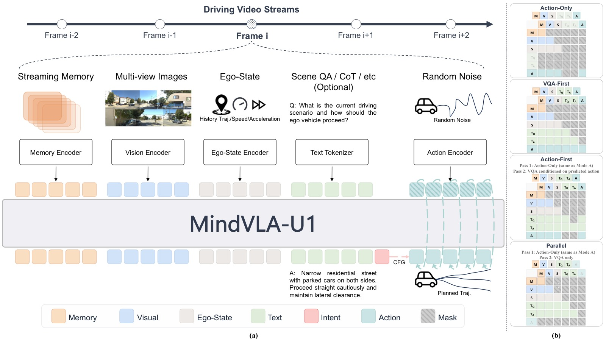

*图1：MindVLA-U1 总体架构图，展示从输入到输出的完整数据流和训练/推理机制。以下解析基于论文 caption 原文和 §2.1、§2.5 正文描述。*

**五类 Token 统一入网（论文 caption："Vision, ego-state, language, memory, and noisy action tokens flow through a shared VLM backbone in one forward pass"）：**
- Vision（V）：多视图图像经冻结视觉编码器 + 可训练 visual merger 压缩后的 token
- Language（L）：包含 Question + Answer 两部分
- Memory（M）：从 FIFO 通道读出的 128 个运动对齐压缩记忆 token
- Ego-State（S）：由 3 个轻量 MLP 编码的 16 步历史位置/速度/加速度
- Noisy Action（A）：20 个噪声动作 token，经 flow-matching 逐步去噪为目标轨迹

正文（§2.1）明确："noisy action tokens flow through every transformer layer of the backbone exactly like vision and language tokens with no separate computation path"——五类 token 共享所有 self-attention 和 FFN 权重。

**双头读出（论文 caption："the LM head and the flow-matching action head read out at their respective token positions"）：**
正文（§2.1）："A language LM head decodes language tokens and a thin flow-matching MLP reads out the action velocity field at action positions, both in a single forward pass"。左侧 LM head 自回归解码 VQA 答案 + intent token；右侧 Action MLP（2 层 SiLU，6 维输出 = pos+vel+acc）读出速度场，经 2 步 Euler 积分恢复 5s/4Hz 轨迹。

**流式记忆循环（论文 caption："A FIFO memory channel propagates compact temporal context across frames, motion-aligned on read and refreshed after each pass"）：**
每帧前向后，Propagation Transformer（Q-Former 风格，6 层 cross-attention，16 头）压缩骨干输出为 128 个新记忆 token 写入 FIFO 通道头部，最旧帧被驱逐。读记忆时用 SE(2) 相对位姿变换对齐到当前自车坐标系（§2.5）。正文明确"Gradients flow through the propagation transformer across frames"——帧 i 的 loss 监督帧 i−1 写入的记忆。

**四种推理模式（论文 caption："Attention-mask composition exposes four inference orderings (vqa_first/only, action_first/only) for fast/slow execution from the same weights"）：**
`vqa_first` 先语言后动作（慢路径，~2,594ms）、`action_first` 先动作后语言（产生轨迹解释）、`action_only` 纯动作（快路径，~103ms）、`vqa_only` 纯语言。同一组权重通过注意力掩码切换，无需额外模块。

**该图支持的核心论点：** MindVLA-U1 的"统一"是 token 级接口重新设计——语言和动作在同一个 self-attention 中交互，记忆在帧间流动，推理模式在掩码层面切换。直接支撑论文"VLA-VA 差距是接口问题"的中心主张。*

### 2.2 联合训练：AR + Flow Matching on Shared Backbone

对于单帧步骤，多视图视觉 token $\mathbf{I}$、自车状态历史 $\mathbf{e}$、语言查询 $\mathbf{q}$、语言答案 $\mathbf{a}$、长度为 $N$ 的噪声动作 token $\mathbf{x}_t$：

- Prefix $(\mathbf{I},\mathbf{e},\mathbf{q},\mathbf{a})$ 因果掩码；动作 token 双向可见
- **AR loss**（语言头）：
  $$\mathcal{L}_{\mathrm{AR}} = -\sum_{l=1}^{L} \log p_\theta(a_l \mid \mathbf{I},\mathbf{e},\mathbf{q},a_{<l})$$
- **Flow-matching loss**（动作头）：$\mathbf{x}_t = t\boldsymbol{\epsilon} + (1-t)\mathbf{x}_0$，$t \sim \mathrm{Beta}(1.5, 1.0)$
  $$\mathcal{L}_{\mathrm{FM}} = \|v_\theta(\mathbf{x}_t, t; \mathbf{I},\mathbf{e},\mathbf{q},\mathbf{a}) - (\boldsymbol{\epsilon} - \mathbf{x}_0)\|^2$$
- 推理时通过 ODE 积分恢复轨迹，仅需 2 步 Euler 积分

> **关键洞察**：离散 AR cross-entropy 和连续 flow-matching MSE 在共享骨干参数上训练是稳定的，因为两者作用在**不同输出位置、不同读出头**——共享梯度但不共享目标，场景特征相互补充而非竞争。

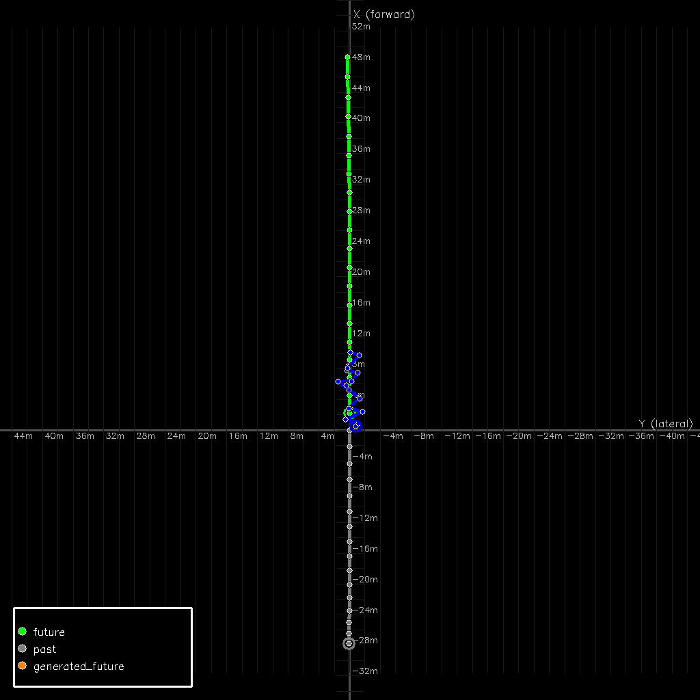 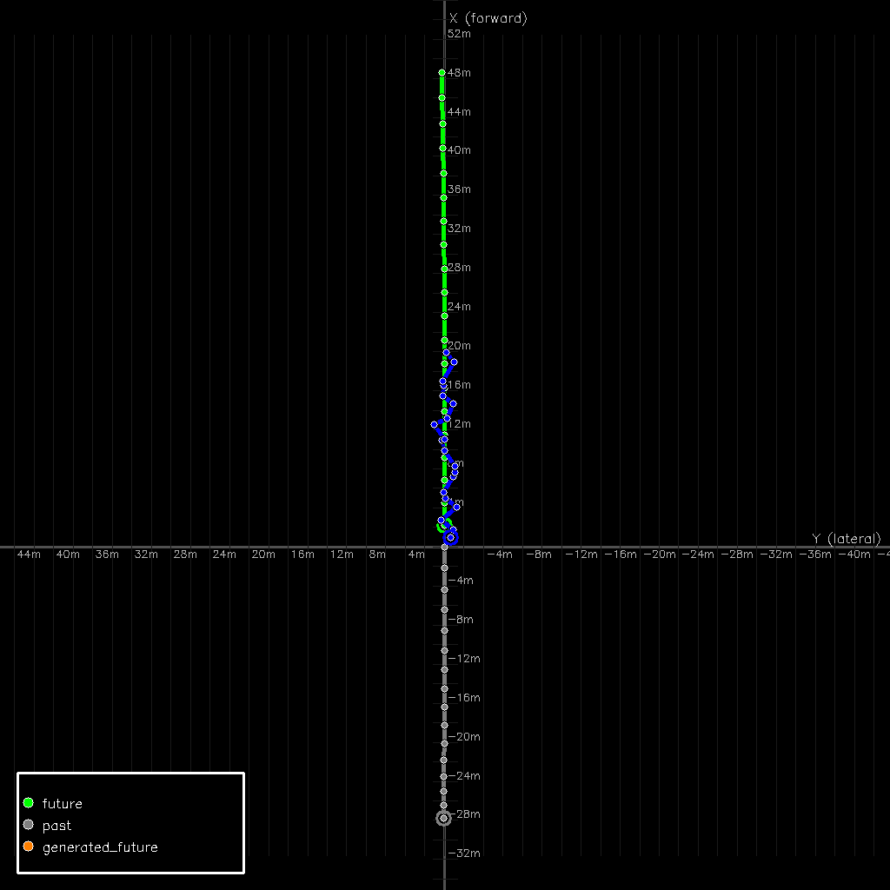 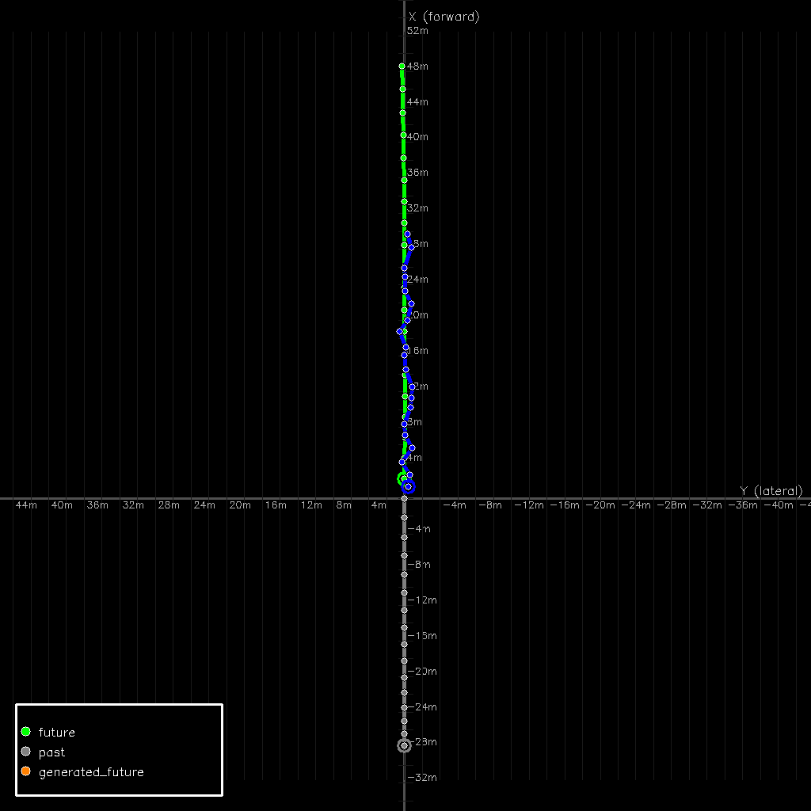 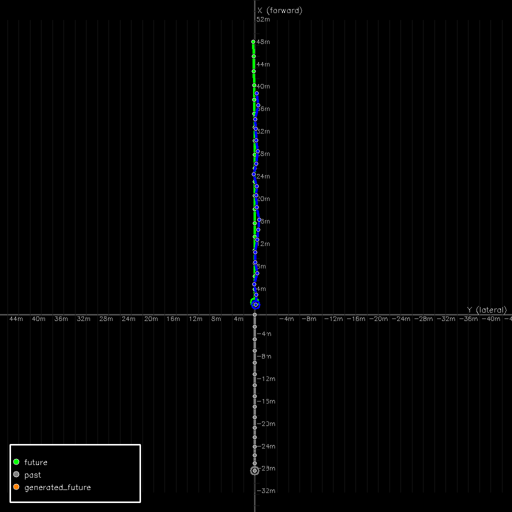 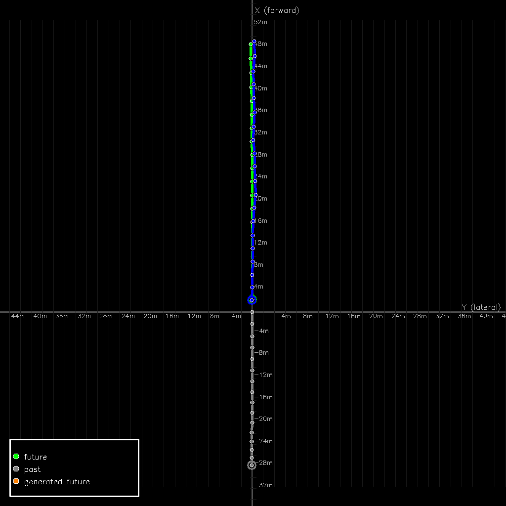

*图2(a-e)：Flow-matching 动作头在 5 步 Euler 积分下的去噪过程可视化（BEV 视图：自车前进方向为 +X，横向为 +Y）。论文推理仅需 2 步，这里用 5 步展示完整的去噪动力学。5 张子图从左到右分别对应去噪步骤 1 至 5。*

*图中各元素含义（依据论文 caption 和正文描述）：**绿色轨迹**为 GT ground truth（自车未来 5 秒真实行驶轨迹），**灰色轨迹**为过去已行驶路径，**蓝色轨迹**为当前去噪步骤预测的轨迹（20 个 waypoints，4Hz 采样）。坐标原点为自车当前位置。*

*逐步骤解析：*
- *Step 1（图2a）：从纯高斯噪声出发（噪声输入本身未在图中展示），经 1 步 Euler 积分，轨迹首次成形。蓝色 waypoint 大致呈现前进方向，但 waypoint 间距分布不均匀（速度 profile 还带噪声），末端横向位置抖动较大。这是从噪声到结构的最大跳跃——第 1 步去噪的效果最大*
- *Step 2（图2b）：轨迹方向进一步收敛稳定，表明速度场 $v_\theta$ 的全局方向分量在前 2 步就能可靠确定。但 waypoint 间距（速度 profile）仍不完全均匀，横向位置在 GT corridor 附近小幅振荡。这是去噪的"中间阶段"——方向对了但速度和曲率还在微调*
- *Step 3（图2c）：轨迹形状明显稳定。Waypoint 排列趋于均匀平滑，速度 profile 开始与 GT 对齐——证明 $v_\theta$ 在速度/加速度辅助通道（w_vel=w_acc=0.5）上的训练有效。蓝色与绿色横向偏差缩小*
- *Step 4（图2d）：预测轨迹（蓝色）与 GT（绿色）高度重合。仅在后段（>4s horizon 的尾部 waypoint）有轻微发散——这是 flow-matching 固有的 horizon 效应：远期 flow 方向不确定性更大。论文用 2 步推理时，这部分 ADE 是主要误差来源*
- *Step 5（图2e）：最终去噪结果。轨迹平滑紧贴 GT corridor，近端（$t=0$ 处）几乎完美匹配——近端控制精度得到保证。即使 5 步去噪，末端仍有轻微偏差，但 RFS 的 trust region 可以吸收*

*该图支持的论点：(1) Flow-matching 在共享 VLM 骨干上的去噪行为健康——从噪声到结构的过渡平滑单调，无模式坍塌 (2) 2 步推理可行是因为 $v_\theta$ 学到了从噪声到数据的近似直线 flow（flow-matching 核心优势 vs diffusion 弯曲路径）(3) 5 步比 2 步改善的主要是 >4s 远期 waypoint，非近端控制。*

### 2.3 语言到动作桥梁：Intent-CFG

**直觉**：无论场景多复杂，人类驾驶员最终会确定一个驾驶意图（直行、变道、让行）并据此行动。Intent 是连接语言推理和连续动作的自然紧凑桥梁。

实现方式：

1. 语言头预测当前场景的 intent label $z$（如 Left/Right/Go Straight），通过标准 next-token prediction
2. 预测的 intent token 被嵌入并**注入 action MLP 的 time embedding**
3. 训练时偶尔替换为无条件 token $\emptyset$（CFG dropout = 0.15）
4. 推理时跑两次前向（条件/无条件），混合速度场：
   $$v_{\mathrm{cfg}} = v_\theta(\emptyset) + s(v_\theta(z) - v_\theta(\emptyset))$$
   其中 guidance scale $s = 1.5$

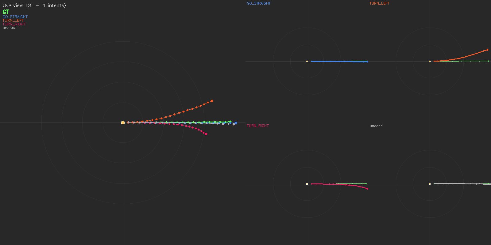

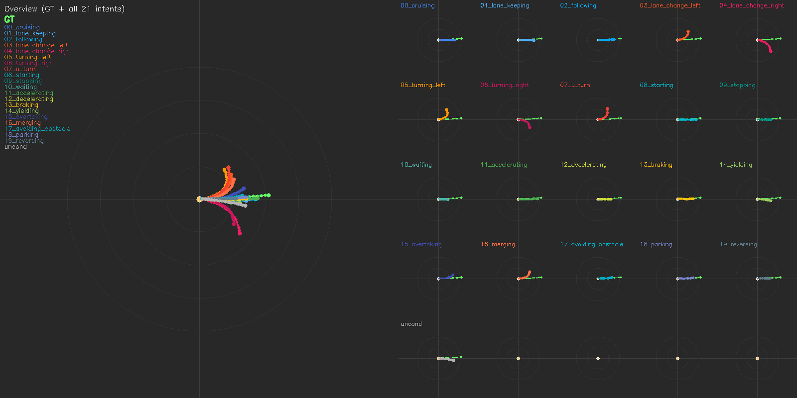

*图3(a-b)：Intent-CFG 作为结构化多模态机制——从同一个 MindVLA-U1 checkpoint，在同一帧 WOD-E2E 场景上，通过变化 intent conditioning token 生成的轨迹集。该图是论文最核心的可视化证据之一。*

**子图 (a) WOD-E2E 官方 3 类 intent + unconditional baseline：**
使用 WOD-E2E 原生 3 类 GT intent（straight / left / right）和 unconditional baseline（CFG 中使用 ∅ token）。论文正文将该可视化描述为：左侧 BEV 总览显示绿色 GT 轨迹；右侧排列各 intent 条件下的预测轨迹。关键结果——Unconditional baseline 产生接近 GT 的默认轨迹；`straight` 条件接近 unconditional（该场景 GT 为直行）；`left` / `right` 条件分别向左/右偏移——**证明 intent token 改变了动作扩散的去噪方向**。CFG guidance scale s=1.5。

**子图 (b) MindLabel 20 类 intent + unconditional baseline：**
从同一个 checkpoint 出发，使用 MindLabel 的 20 类细粒度 intent 词汇，展示 21 个条件（20 类 intent + 1 unconditional）的预测轨迹。论文关键观察——轨迹随 intent 系统性分叉：`u_turn` 产生调头轨迹，`lane_change_left` 产生左变道，`starting` 产生起步加速，`reversing` 产生倒车——每个 intent 将动作扩散引导到语义一致的方向。多模态来自条件接口而非场景内容——即使场景 GT 是直行，conditioning 在 u_turn/reversing 上也能产生对应意图方向的行为。

**但论文同时指出 fidelity 限制：** `u_turn`、`reversing`、`parking` 在 WOD-E2E 训练集中极少或无 GT 样本，因此条件轨迹只会"朝正确方向走"而不会形成教科书级机动。这是数据问题（MindLabel 的 20 类 intent 可用于构造均衡训练分布）而非架构问题。

**该图支持的核心论点：** (1) Intent-CFG 暴露的是**结构化多模态**——intent token 作为"地址线"为动作扩散提供可寻址的模态轴 (2) 语言→动作桥接是**可度量**的（改变 intent token 确实改变输出轨迹）(3) 这是 VLA 领域首次可视化展示语言端信号如何操控连续动作生成 (4) 无条件 baseline 收敛到接近 GT 的行为——intent 是**可选控制信号**而非必须输入。实验设置：MindVLA-U1 dense 配置（RFS 7.83），训练时 CFG dropout=0.15，推理时 s=1.5。*

### 2.4 快/慢系统与 MoT（Mixture-of-Transformers）

统一骨干天然支持快/慢推理：通过注意力掩码组合，同一组权重可以走四种推理顺序：

| 模式 | 含义 | 用途 |
|------|------|------|
| `vqa_first` | 先解码语言，再以此条件做动作扩散 | 慢路径：语义推理增强动作 |
| `vqa_only` | 仅解码语言 | 诊断/理解 |
| `action_first` | 先做动作扩散，再条件解码语言 | 产生轨迹的自然语言解释 |
| `action_only` | 纯动作，不跑语言头 | 快路径：接近 VA 级吞吐 |

**稀疏 MoT 变体**将每层拆分为两组专家：

- **Context group**（V, L tokens）：感知/语言
- **Action group**（M, S, A tokens）：记忆/自车状态/动作

两组共享 self-attention（通用 K/V 池），但使用独立的 Q/K/V/O 投影和 FFN。Fast mode 下物理移除语言 token，action subgraph 独立运行，实现真实计算缩减。

```
                    ┌─────────────────────────────────────────┐
                    │          Shared Self-Attention           │
                    │          (Universal K/V Pool)            │
                    └────┬──────────────────────────┬─────────┘
                         │                          │
              ┌──────────▼─────────┐    ┌──────────▼──────────┐
              │  Q/K/V/O_ctx       │    │  Q/K/V/O_act        │
              │  (context tokens)  │    │  (action tokens)     │
              └──────────┬─────────┘    └──────────┬──────────┘
                         │                          │
              ┌──────────▼─────────┐    ┌──────────▼──────────┐
              │  V │ L │ W │ P     │    │  M │ S │ A │ C       │
              └────────────────────┘    └─────────────────────┘
               context tokens              action tokens
             (V=Vision, L=Language)     (M=Memory, S=EgoState, A=Action)
              
              After Shared SA:
              ┌──────────┐ ┌──────────┐ ┌────────────┐ ┌────────────┐
              │ FFN_ctx  │ │ FFN_act  │ │ FFN_reason │ │ FFN_safety │
              │ (active) │ │ (active) │ │ (future)   │ │ (future)   │
              └──────────┘ └──────────┘ └────────────┘ └────────────┘
               context FFN   action FFN    ext. slots     ext. slots
```

*示意图（ASCII）：MoT 架构单层结构。每层拆分为两组并行的 FFN 专家——context（V, L）和 action（M, S, A）——通过共享 self-attention 池连接。Per-modality Q/K/V/O 投影送入共享 SA；per-functionality FFN 专家在 SA 之后解码。Fast mode（`action_only`）物理排除语言 token，action subgraph 无需支付 VQA 解码开销。*

### 2.5 流式范式（Streaming Paradigm）

论文将驾驶建模为**逐帧流式处理**，而非固定 video-action chunk：

- 每步仅处理当前多视图帧 + 紧凑的记忆 token $\mathbf{m}_i$
- 记忆通道是**有界 FIFO**：存储压缩的每帧骨干状态（非原始视觉 token）
- **运动对齐**：读记忆时，利用 SE(2) 相对位姿变换将历史记忆对齐到当前自车坐标系
- **梯度跨帧流通**：帧 $i$ 的 loss 监督帧 $i-1$ 写入的记忆——通道从被动缓存变为主动被监督的状态

```
   Frame i-2      Frame i-1       Frame i        Frame i+1
      │               │               │               │
      │  write m_{i-2}│  write m_{i-1}│  write m_i    │  write m_{i+1}
      │       ┌───────┤       ┌───────┤       ┌───────┤
      ▼       │       ▼       │       ▼       │       ▼
   ┌────┐ ┌──▼──┐ ┌────┐ ┌──▼──┐ ┌────┐ ┌──▼──┐ ┌────┐
   │VLM │→│Prop.│→│VLM │→│Prop.│→│VLM │→│Prop.│→│VLM │→ ...
   └────┘ │Trans│ └────┘ │Trans│ └────┘ │Trans│ └────┘
           │former│       │former│       │former│
           └──┬───┘       └──┬───┘       └──┬───┘
              │              │              │
    ┌─────────▼──────────────▼──────────────▼──────────┐
    │              FIFO Memory Channel                  │
    │  [m_{i-2}] [m_{i-1}]  →  read m_i (aligned)      │
    │  motion-aligned to current ego pose on read       │
    └───────────────────────────────────────────────────┘
```

*示意图（ASCII）：流式记忆更新机制。帧 $i$ 的前向传播消费当前帧和从 FIFO 通道读出的运动对齐记忆 token $\mathbf{m}_i$；前向完成后，Q-Former 风格的传播 transformer 将骨干输出压缩为新记忆写入通道，最旧条目被驱逐。梯度通过传播 transformer 跨帧流动。*

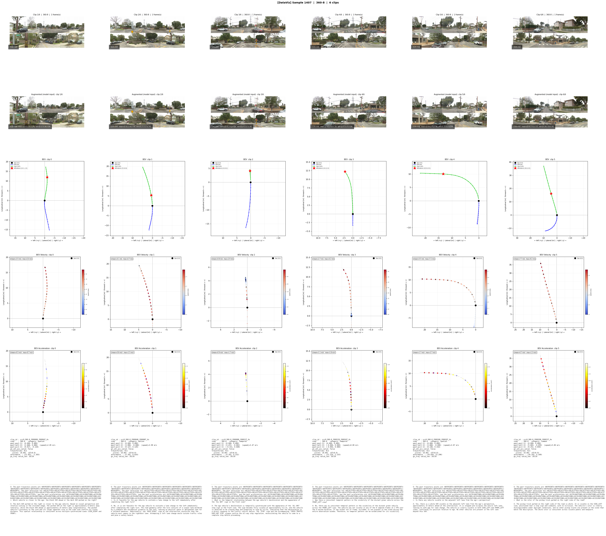

*图4：流式推理在连续 6 帧上的逐帧可视化输出，展示 MindVLA-U1 流式范式的实际推理行为。图中 6 列对应流中的连续 6 个帧步（约 1.5 秒实际时间窗口，4Hz 处理频率），每列从上到下分为 5 行。*

**各行含义与行间关系：**
- **第 1-2 行（前视图 RGB 输入）**：每列顶部两行展示该帧步的前视摄像头原始图像。两行之间展示的是不同相机或不同时刻的裁剪视图，提供场景的视觉上下文。关键点：流式范式每步只接收**当前帧**——不是把 6 帧同时塞给 VLM。6 帧之间的场景变化是平滑连续的（前车位置渐变、车道线连续），但模型在每步只看到"当下"，历史通过记忆通道传递
- **第 3 行（BEV 预测轨迹）**：每帧步的 BEV 鸟瞰轨迹预测（5 秒 horizon，20 waypoints，4Hz 采样）。这是 action head 的最终输出——经 2 步 Euler 积分从 $v_\theta$ 恢复的完整轨迹
- **第 4-5 行（Waypoint 置信度热力图）**：heatmap 颜色深浅表示每个 waypoint 位置的预测置信度（深色=高置信度，浅色=低置信度）。这是模型对自己预测的 uncertainty estimation，两行展示不同视角或不同分辨率的置信度分布

**逐列（逐帧）分析：**
- *Frame 1（最左列）*：流起始帧，记忆通道为初始空状态。RGB 显示前方道路清晰无前车。BEV 轨迹预测为平滑直行，近端 waypoint 排列紧凑均匀（预测恒定低速）。置信度热力图显示近端（<2s）高置信（深色占主导），远端（>4s）开始变浅
- *Frame 2*：场景与前帧几乎相同（无前车、无弯道）。BEV 轨迹与 Frame 1 高度一致——这是流式连续性的体现：没有 chunk 边界导致的轨迹突变。置信度模式与前帧相似，但远端浅色区域略缩小——记忆通道开始积累上下文，减少了远期不确定性
- *Frame 3*：场景仍为直行。BEV 轨迹继续维持一致性，waypoint 排列无跳跃。置信度热力图进一步稳定——记忆通道在 3 帧后已 warm up，模型对场景的时序理解趋于稳定
- *Frame 4*：场景出现细微变化（前视图中道路前方可能出现弯道或路口）。BEV 轨迹开始出现轻微的曲率调整——轨迹末端略微弯曲。这个调整是**渐进的**而非突变的，因为 memory channel 传递的前几帧上下文起到了平滑作用。置信度在弯曲段略有下降（浅色区域向右端集中）
- *Frame 5*：曲率调整更加明显，轨迹末端弯曲角度增大。Waypoint 间距在弯曲段重新均匀化——速度 profile 已适配弯道。置信度热力图与 Frame 4 相似，说明模型对弯道预测的确定性没有进一步恶化
- *Frame 6（最右列）*：轨迹已稳定在新曲率上，waypoint 排列平滑。与 Frame 1 对比可以看出：6 帧之内轨迹从直行平滑过渡为弯道，没有 chunk 边界跳跃、没有 stale waypoint 残留。置信度热力图维持空间平滑——即使在弯曲段也没有置信度断层

**该图支持的核心论点：** 流式范式在实际推理中产生连续、平滑、无 chunk 边界的轨迹序列——6 帧跨度内轨迹从直行演变为弯道的过程是渐进式的。这直接回应了"chunk-wise VLA 在 chunk 边界产生不连续"这一已知问题，证明了流式+记忆的设计在定量（+0.14 RFS）和定性上均优于 chunk-wise。*

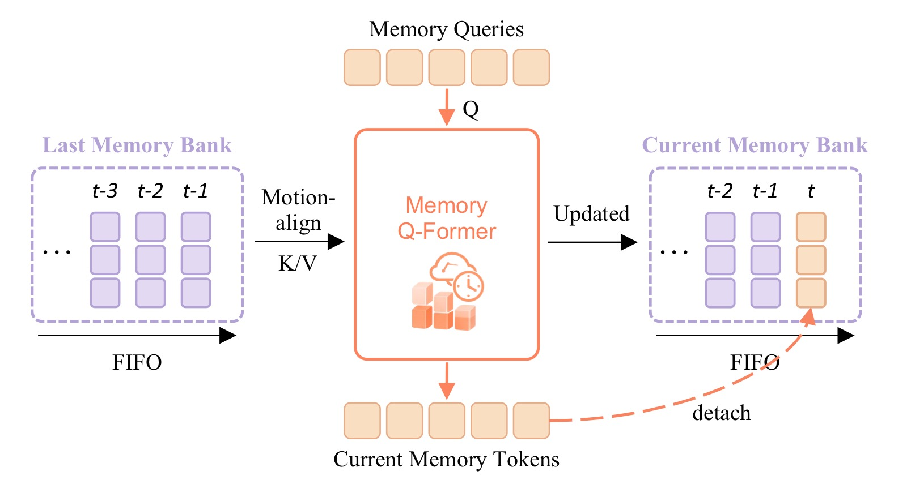

*图5：Streaming Memory 通道的详细工作流程。该图从单帧视角展示了记忆通道的 read→forward→write 三步循环，是理解 MindVLA-U1 流式范式的关键图。*

**图的上半部分——当前帧 i 的 forward pass：**
帧 i 的输入由三部分组成：(1) 当前多视图图像（经过 frozen vision encoder + visual merger）；(2) 从 FIFO 通道读出的记忆 token 集合 $\mathbf{m}_i$（经过运动对齐）；(3) 语言 query / 噪声动作 token。这些 token 联合送入共享 VLM 骨干做单次前向传播。注意与之前 VLA 方法的关键区别：**每步只处理当前帧，不把多帧视频 token 塞进 VLM**——多帧冗余视觉 token 被压缩记忆取代。

**图的中部——FIFO Memory Channel 的结构：**
FIFO 通道存储 $N_g=2$ 个帧步条目，每条目包含 $N_m=128$ 个 token（维度 $H=2048$），总容量 256 token。条目按时间顺序排列（Frame i−2→Frame i−1→Frame i），最新条目在右端，最旧条目将被驱逐。图中用不同颜色区分不同帧步的记忆，示意了运动对齐（motion alignment）过程：每帧记忆存储在该帧的自车坐标系下，读出时通过 SE(2) 相对位姿变换 $T_{j \to i} = P_i \cdot P_j^{-1}$ 对齐到当前帧坐标系，然后由轻量 MLP 将 5 维运动特征（cosφ, sinφ, δx, δy, 归一化时间偏移）映射为 modulation vector 逐元素加到 128 个 token 上。

**图的下半部分——记忆写入（Memory Writing）：**
前向传播完成后，Propagation Transformer（Q-Former 风格，6 层 cross-attention，16 头）做对称操作：128 个 learnable query token cross-attend 到骨干输出 $\mathbf{h}_i$，压缩为新的 128 个记忆 token，写入 FIFO 通道右端。若通道已满（≥2 帧），最旧的左端条目被驱逐。

**红色虚线箭头——梯度跨帧流通：**
图中红色虚线标注了梯度流：帧 i 的 loss（$\mathcal{L}_{\mathrm{AR}} + \mathcal{L}_{\mathrm{FM}}$）通过 propagation transformer 反向传播到帧 i−1 写入的记忆。这意味着记忆通道不是被动缓存（"存一下上次的状态"），而是**被主动监督的时序状态**——记忆特征被 flow-matching 和语言目标共同塑造。训练和推理使用相同的 read→forward→write 循环，无 train-test mismatch。

**该图支持的核心论点：** 流式记忆不是往 VLM 多塞几帧图像的工程技巧，而是对"VLA 应该怎么建模时间"这个问题的根本性重新回答——把时序上下文的压缩和传播变成 VLM 架构**内部**的可学习组件，而非通过增加 VLM 输入 token 来外部化处理。消融实验证明这个设计选择带来了 +0.10 RFS，而直接多帧 VLM 输入（DeepStack）反而降低了 RFS（7.61 vs 7.69）。*

### 2.6 MindLabel：驾驶原生 VLA 监督数据

论文构建了 MindLabel 自动标注管线，在同一训练帧上生成：

1. **场景理解 VQA**（5 类）：Common（事实感知）、Spatial（空间关系）、Temporal（时序变化）、Motion（安全分析/规划决策）、Object-Centric（检测实例锚定）
2. **Action Dreaming**：基于 GT intent 条件生成的多样化 dreamed trajectories（AFF：4 条质量分级轨迹；EXP：人偏好迁移轨迹）
3. **轨迹评估 QA**：CoT 推理评价 dreamed trajectory 质量
4. **20 类细粒度 intent 标签**（vs. WOD-E2E 官方 3 类）

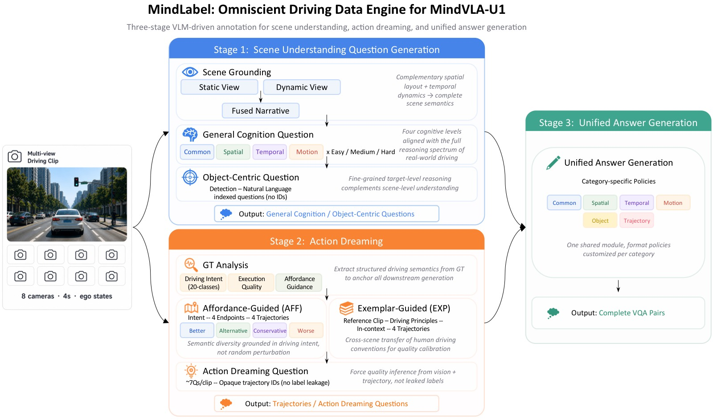

*图6：MindLabel 自动标注管线架构总览。该管线解决的核心问题是：驾驶日志只有轨迹没有语言——需要自动生成场景理解和轨迹评估的语言标注。管线分为三个并行/串行阶段：*

**左支——Scene Understanding Question Generation（场景理解问题生成）：**
该阶段分三步。Step 1 Scene Grounding：融合当前帧的静态空间布局与前 4 秒动态历史窗口，生成一段自然语言场景描述（有意不含 metric 坐标和结构化物体列表）。Step 2 General Cognition QA：基于场景叙事，在 4 个认知维度生成问题——Common（事实感知，如"前方红绿灯什么颜色？"）、Spatial（相对位置和距离）、Temporal（时序变化和因果推理）、Motion（安全分析和规划决策，如"自车应该前进、让行还是停车？"）。每个问题独立标注难度（Easy/Medium/Hard）和 CoT 标志。Step 3 Object-Centric QA：对当前帧做统一检测（车辆、行人、骑行者、交通标志、信号灯），为每个检测实例生成以自然语言描述（如"左车道约 15 米前的红色卡车"）锚定的问题。

**右支——Action Dreaming（动作梦想）：**
不满足于单一 GT 轨迹，生成多样化的 dreamed trajectories。包含两个子策略：(1) AFF（Affordance-Guided Generation）：从 GT 提取 20 类驾驶意图标签 → 生成 4 条同一意图但质量分级（Better/Alternative/Conservative/Worse）的完整 5 秒轨迹，用 GT 轨迹曲率做形状参考；(2) EXP（Exemplar-Guided Generation）：从同序列中检索带人偏好标注的参考帧，提取驾驶原则作为 in-context guidance，将人偏好迁移到生成轨迹中。每个 dreamed trajectory 配套生成评估问题（固定 4 题 + 采样 3 题），使用 opaque identifier 引用轨迹，迫使模型从视频和 BEV 推断质量。

**底部——Unified Answer Generation（统一答案生成）：**
所有问题经共享模块生成答案，不同类型有不同格式策略：Common 输出简洁事实、Spatial 附加单位和相对位置、Temporal 引用时间点和因果关系、Motion 以可执行驾驶建议收尾（proceed/yield/stop）。带 CoT 标志的问题输出多步推理链。

**标注规模：** 覆盖 WOD-E2E 全量 4,021 个序列（训练 2,037 + 验证 479 + 测试 1,505），按 2Hz 采样、4s 窗口切 clip，每 clip 由 Qwen3-VL 和 Qwen3.5-Plus 两个骨干独立标注，合计 ~18.8K clips → ~3.8M VQA + ~250K dreamed trajectories。论文主结果只用了基础场景 VQA + GT 3-class intent；其余数据留给未来工作。*

> 论文主结果只用了基础场景 VQA + 3 类 GT intent；其余（dreamed trajectories、20 类 intent、CoT rationales）留给未来工作。

---

## 三、训练目标

联合训练目标：

$$\mathcal{L} = \underbrace{-\sum_{l=1}^{L} \log p_\theta(a_l \mid \mathbf{I},\mathbf{e},\mathbf{q},a_{<l})}_{\mathcal{L}_{\mathrm{AR}}\text{：语言 AR loss}} + \underbrace{\|v_\theta(\mathbf{x}_t, t; \mathbf{I},\mathbf{e},\mathbf{q},\mathbf{a}) - (\boldsymbol{\epsilon} - \mathbf{x}_0)\|^2}_{\mathcal{L}_{\mathrm{FM}}\text{：动作 flow-matching loss}}$$

- 训练方案：端到端单阶段，VLM 骨干直接从公开 checkpoint 初始化
- 无需 AD 专用预训练（区别于 Poutine 等需要专门 AD 预训练阶段的方法）
- 8×H200 GPU，BF16 + DeepSpeed ZeRO-2，50 epochs，约 7 小时
- RL 后训练：GRPO，以 RFS 为唯一 reward，~8.20 RFS

---

## 四、实验与结果

### 4.1 WOD-E2E 验证集结果

| 方法 | 骨干 | AD-PT | L B/R↑ | RFS-GT ADE 3/5↓ | RFS-matched ADE 3/5↓ | RFS↑ |
|------|------|-------|--------|-------------------|----------------------|------|
| **VA Methods** | | | | | | |
| VAD | ImageNet ViT | × | -- | 3.19 / 5.81 | -- | 4.45 |
| UniAD | ImageNet ViT | × | -- | 6.50 / 10.81 | -- | 5.78 |
| RAP-DINO | DINOv3-H | ✓ | -- | 0.97 / 2.20 | -- | 7.91 |
| **VLA Methods (action-only at inference)** | | | | | | |
| Poutine-Base | Qwen2.5-VL-3B | ✓ | -- | 1.27 / 2.94 | -- | 8.12 |
| **Real human driver** | --- | --- | --- | --- | --- | 8.13 |
| **MindVLA-U1 (Ours)** | | | | | | |
| MindVLA-U1 | Qwen3-VL-2B | × | 0.30 / 0.49 | 0.92 / 2.14 | 0.50 / 1.05 | 7.83 |
| MindVLA-U1 + Intent-CFG | Qwen3-VL-2B | × | **0.31 / 0.52** | **0.86** / 2.13 | **0.47** / 1.07 | 7.92 |
| MindVLA-U1 + MoT | Qwen3-VL-2B | × | 0.30 / 0.51 | 0.89 / **2.11** | 0.49 / 1.05 | 7.92 |
| MindVLA-U1 + RL | Qwen3-VL-2B | × | -- | 1.01 / 2.28 | 0.51 / **1.03** | **8.20** |

### 4.2 WOD-E2E 官方测试集结果

| 方法 | 骨干 | AD-PT | RFS-GT ADE 3/5↓ | RFS↑ |
|------|------|-------|-------------------|------|
| **VA Methods** | | | | |
| DiffusionLTF | DiffusionDrive | ? | 1.36 / 2.98 | 7.72 |
| UniPlan | DiffusionDrive | ? | 1.31 / 2.99 | 7.69 |
| **VLA Methods (action-only at inference)** | | | | |
| AutoVLA | Qwen2.5-VL-3B | ✓ | 1.35 / 2.96 | 7.56 |
| dVLM-AD | LLaDA-V + SigLIP2 | ✓ | 1.29 / 3.02 | 7.63 |
| HMVLM | Qwen2.5-VL-3B | ? | 1.33 / 3.07 | 7.74 |
| **MindVLA-U1 (Ours, Language-preserving)** | | | | |
| MindVLA-U1 | Qwen3-VL-2B | × | 1.16 / 2.67 | 7.77 |
| MindVLA-U1 + RL | Qwen3-VL-2B | × | **1.09 / 2.66** | **7.87** |

> **关键结论**：
> - MindVLA-U1 是首个在 WOD-E2E 上**语言保持可用**（推理时保留 language head 输出 VQA）的 VLA，而非在推理时退化为纯 VA
> - 在测试集上 ADE 3s/5s 显著优于所有 VA/VLA 方法（1.09 / 2.66 vs dVLM-AD 的 1.29 / 3.02）
> - RL 后训练将 RFS 从 7.83 推到 8.20（val），**首次超越人类驾驶员**（8.13 GT RFS）
> - trust-region 命中率从 66.0% 升至 73.1%

### 4.3 Intent-CFG 消融实验

| Variant | L B/R↑ | RFS-GT ADE 3/5↓ | RFS↑ |
|---------|--------|-------------------|------|
| No-intent baseline | 0.30 / 0.49 | 0.92 / 2.14 | 7.83 |
| + Trajectory-derived Intent-CFG | 0.30 / 0.49 | 0.88 / 2.14 | 7.81 |
| + GT-supplied Intent-CFG | 0.29 / 0.47 | 0.89 / 2.15 | 7.83 |
| **+ NTP-predicted Intent-CFG (Ours)** | **0.31 / 0.52** | **0.86 / 2.13** | **7.92** |

> **核心发现**：轨迹推导的 intent 和 GT 提供的 3 类 intent 都接近无 intent baseline（~7.82），只有 NTP 预测的 intent + prototype-grounded embedding 精炼方案带来了 **+0.09 RFS** 的提升。这表明 Intent-CFG 既是**可控性结果**（语言侧状态可度量地影响了连续动作），也是 aggregate planning 的改善——在正确 embedding 设计下。

### 4.4 流式记忆消融

| Configuration | RFS-GT ADE 3/5↓ | RFS-matched ADE 3/5↓ | seq ADE 25s↓ | RFS↑ |
|---------------|-------------------|----------------------|-------------|------|
| Chunk-wise, single frame | 0.92 / 2.15 | 0.52 / 1.13 | --- | 7.69 |
| Chunk-wise + image seq (4 frames) | 1.14 / 2.53 | 0.63 / 1.27 | --- | 7.61 |
| Streaming, no memory | 0.98 / 2.30 | 0.50 / 1.14 | 1.54 | 7.73 |
| **Streaming + memory (Ours)** | **0.92 / 2.14** | **0.50 / 1.05** | **1.50** | **7.83** |

> **关键发现**：
> - Chunk-wise → Streaming-no-memory：+0.04 RFS
> - Streaming-no-memory → Streaming + memory：**+0.10 RFS**
> - 把 4 帧直接塞给 VLM（Qwen3-VL DeepStack）反而**降低** RFS（7.61 vs 7.69）——多帧驾驶视频 token 严重冗余，通用 VLM 没有经过将冗余视觉 token 压缩为规划相关时序状态的训练
> - Memory channel 在所有规划指标上改善，尤其是长序列 ADE（25s ADE: 1.54 → 1.50）

### 4.5 MoT 变体对比

| System | RFS-GT ADE 3/5↓ | RFS↑ |
|--------|-------------------|------|
| Dense | 0.92 / 2.14 | 7.83 |
| MoT (V,L,M,S)+(A) → context vs. action | 0.92 / **2.11** | **8.01** |
| MoT (V,L)+(M,S,A) → context vs. proprio+action **(Ours)** | **0.89 / 2.11** | 7.92 |

> 两种 MoT 分组都优于 Dense baseline。论文推荐 (V,L)+(M,S,A) 分组：将记忆和状态与动作归为一组，形成"模态纯粹"的 motor group——fast mode 下无需跨 attention group 读取记忆/ego-state token，吞吐分离更干净。该路由原则（感知模态 → context，运动/本体感知 → action）也可自然扩展到其他模态。

### 4.6 吞吐量对比

| Configuration | Latency↓ | FPS↑ | RFS↑ |
|---------------|----------|------|------|
| RAP-DINO (VA, ~0.88B) | 57ms | 17.68 | 7.91 |
| MindVLA-U1 (InternVL-2 1B, template QA, 2 steps) | 64ms | **15.55** | **7.78** |
| MindVLA-U1 (slow path: `vqa_first_decoding`) | 2,594ms | 0.39 | 7.83 |
| MindVLA-U1 (`action_only`, 2 steps) | 103ms | 9.70 | 7.74 |
| MindVLA-U1 (`vqa_first_fast`, template QA, 2 steps) | 108ms | **9.26** | **7.82** |
| MindVLA-U1 (`vqa_first_fast`, template QA, 1 step) | 63ms | 15.92 | 7.67 |

> **成本分解**：AR VQA decoding 占据慢路径 ~94% 延迟（~2,450ms），其他阶段（prefix embedding: ~30ms, VQA prefilling: ~40ms, action diffusion 2 steps: ~74ms）都比它便宜 1-2 个数量级。**Fast 模式通过物理移除 answer token 来回收这些成本**——这是接口级优化而非容量级优化。在 ~1B 参数匹配规模下，MindVLA-U1 的 fast path 接近 VA 级吞吐（15.55 FPS vs RAP-DINO 17.68 FPS）。

### 4.7 VLM 骨干规模 Scaling

| Backbone | L B/R↑ | RFS↑ |
|----------|--------|------|
| Qwen3.5-VL 0.8B | 0.27 / 0.48 | 7.81 |
| Qwen3.5-VL 2B | 0.27 / 0.48 | **7.94** |
| Qwen3.5-VL 4B | 0.28 / 0.48 | 7.86 |
| Qwen3.5-VL 9B | **0.28 / 0.49** | 7.84 |
| Qwen3.5-VL 2B (base, 无指令微调) | 0.12 / 0.29 | 7.91 |
| Qwen3.5-VL 4B (base) | 0.13 / 0.30 | 7.86 |
| Qwen3.5-VL 9B (200 ep) | 0.28 / 0.48 | 7.91 |

> **RFS 在骨干规模上非单调**：7.81 → 7.94 → 7.86 → 7.84，2B 峰值后下降。但 9B 延长到 200 epoch 恢复到 7.91（+0.07），说明大骨干在当前 budget 下训练不足。

**语言质量与动作质量结构性解耦**（最亮眼的发现）：
- Base VLM（无指令微调）的 VQA 质量崩溃 2×（BLEU-4: 0.27 → 0.12），但 RFS 几乎不变（7.94 → 7.91）
- 这说明 Intent-CFG 消费的是 VLM 的**场景表征**（scene representation），而非**语言生成能力**（language generation）
- 即使 VLM 的指令跟随能力受损或从未训练，只要共享骨干学到了可分类 intent 的场景表征，CFG 路由就是对的

### 4.8 Val/Test 分布偏移诊断

| Intent | Val share | Test share | Δ relative |
|--------|-----------|------------|------------|
| accelerating | 19.5% | 4.1% | **-78.9%** |
| starting | 10.5% | 4.5% | **-57.1%** |
| following | 2.7% | 5.6% | +107% |
| waiting | 7.6% | **20.2%** | **+167%** |

> Val → Test RFS 下降（MindVLA-U1: -0.24 RFS）被归因于**基准级别**的意图分布偏移而非方法弱点。Test 过度代表了减速/等待场景（waiting 从 7.6% 暴涨至 20.2%），这些场景在 Waymo 3 类 GT intent（仅 left/right/straight）中无法被监督。

---

## 五、关键洞察与技术亮点

### 5.1 "VLA 落后 VA 是接口问题，不是范式问题"

论文最核心的论点：行动精度低、语言没用上、时序不连贯——这些都是**设计选择错误**（离散化动作、chunk 输出、VLM 特征→外部 action expert），而不是 VLA 框架的固有限制。正确设计的统一骨干可以同时拥有 VA 的精度和 VLA 的语义能力。

### 5.2 语言到动作的可度量桥接

之前所有 VLA 声称"语言帮助了规划"但从未证明。MindVLA-U1 通过 Intent-CFG 建立了一条**可度量**的因果路径：predicted intent → CFG → 连续速度场调制。消融实验证明 intent 信号质量和 embedding 设计至关重要——只有 NTP-predicted + prototype-grounded 方案带来正收益。

### 5.3 流式记忆 > 多帧 VLM 输入

直接往 VLM 塞多帧是自然但错误的做法。驾驶多视图视频帧间高度冗余，通用 VLM 没有训练过压缩这种冗余为规划相关的时序状态。流式记忆通道通过端到端监督（传播 transformer + 跨帧梯度）学到了**任务相关的紧凑时序表示**。

### 5.4 语言质量与动作质量解耦

Base VLM（无指令微调）VQA 质量跌 2×，但规划 RFS 不变。这意味着 Intent-CFG 不依赖 VLM 的语言流畅度——场景表征才是关键。这对部署有重要启示：不需要旗舰级 VLM 就能获得好的规划质量。

### 5.5 单阶段端到端训练

不同于 Poutine 等多阶段 VLA 需要专门的 AD 数据预训练阶段，MindVLA-U1 直接从公开 VLM checkpoint + WOD-E2E 训练。这让架构可以**快速跟进 VLM 前沿**——新 VLM 发布后直接 slot in 即可，无需重新跑昂贵的 AD 预训练。

---

## 六、代码实现解读

（代码暂未公开，以下基于论文正文和附录的架构描述进行梳理）

### 6.1 论文公式 → 模块映射

| 论文公式/算法 | 对应模块 | 说明 |
|--------------|---------|------|
| $\mathcal{L}_{\mathrm{AR}}$（Eq.1） | LM Head（VLM 自带的 language modeling head） | 标准 AR cross-entropy，在 language token 位置计算，仅作用于 prefix tokens |
| $\mathcal{L}_{\mathrm{FM}}$（Eq.2） | Action Head（`2-layer MLP, SiLU`） | 预测速度场 $v_\theta$，在 action token 位置读出，与 AR loss 共享骨干梯度 |
| $v_{\mathrm{cfg}}$（Eq.3） | Intent-CFG Module → `IntentEmbedding` + `time_embedding injection` | 两次前向的 velocity field 混合，guidance scale $s=1.5$ |
| ODE 积分（推理） | Action Head → Euler integration（2 steps） | $x_0 \approx x_t - t \cdot v_\theta(x_t, t)$ 从噪声恢复轨迹 |
| SE(2) 位姿对齐（Eq.4） | `MotionAwareModulator`（轻量 MLP） | 5 维运动特征 → H 维 modulation vector，逐元素加到记忆 token |
| Memory read/write | `PropagationTransformer`（Q-Former, 6 layers, 16 heads） | 读：learnable queries cross-attend 到 FIFO 通道；写：对称压缩骨干输出 |
| Intent token prediction | LM Head（next-token prediction） | 语言头在 answer 序列末尾预测 intent token $z$ |
| CFG dropout | `IntentEmbedding`（$|C|+1$ rows） | 训练时 15% 概率替换为 $\emptyset$ row |

### 6.2 核心模块映射

```
MindVLA-U1
├── VLM Backbone (Qwen3-VL-2B, H=2048)
│   ├── Vision Encoder (frozen)
│   ├── Visual Merger (trainable)
│   └── Language Model (trainable)
├── Ego-history Encoders (3 lightweight MLPs)
│   ├── Position MLP
│   ├── Velocity MLP
│   └── Acceleration MLP
├── Streaming Memory Module
│   ├── FIFO Memory Channel (N_g=2 frames × N_m=128 tokens = 256 total)
│   ├── Motion-Aware Modulator (SE(2) alignment + MLP)
│   └── Propagation Transformer (Q-Former-style, 6 layers, 16 heads)
├── Action Head (2-layer MLP, SiLU activation)
│   └── Output: 6-dim × 20 waypoints @ 4Hz (pos+vel+acc, 5s horizon)
└── Intent-CFG Module
    ├── Intent Embedding Table (|C|+1 rows, incl. ∅)
    └── Time Embedding Injection (projected + residual add)
```

### 6.3 前向传播数据流

```
                            ┌──────────────────────────────────┐
                            │     One Forward Pass              │
                            │                                  │
  Vision ──────────┐        │  ┌────────────────────────────┐  │
  Ego-state ───────┤        │  │                            │  │
  Language Q ──────┤        │  │   Shared VLM Backbone      │  │
  Language A ──────┤───────►│  │   (Self-Attention + FFN)   │──┼──► LM Head → AR tokens
  Memory tokens ───┤        │  │                            │  │
  Noisy Action ────┘        │  └────────────────────────────┘  │──┼──► Action MLP → velocity field
                            │                                  │
                            └──────────────────────────────────┘
                                      │
                                      ▼
                            ┌──────────────────────┐
                            │ Propagation Transformer│
                            │ (compress backbone    │
                            │  outputs → memory)     │
                            └──────────┬───────────┘
                                       │
                                       ▼
                            ┌──────────────────────┐
                            │   FIFO Memory Channel  │
                            │   (write m_i, evict    │
                            │    oldest if full)     │
                            └──────────────────────┘
```

### 6.4 推理流程（快/慢路径）

```
                    ┌──────────────┐
                    │  Input Frame  │
                    └──────┬───────┘
                           │
                    ┌──────▼───────┐
                    │ Read Memory  │ (motion-aligned from FIFO)
                    └──────┬───────┘
                           │
              ┌────────────┼────────────┐
              │            │            │
         Slow Path     Fast Path    Action Only
         (vqa_first)  (vqa_first   (action_only)
                       _fast)
              │            │            │
     ┌────────▼──────┐ ┌──▼────────┐ ┌─▼───────────┐
     │ AR VQA decode │ │ Template  │ │ Skip VQA    │
     │ (2,450ms)     │ │ QA prefix │ │ entirely    │
     └────────┬──────┘ └──┬────────┘ └─┬───────────┘
              │            │            │
     ┌────────▼────────────▼────────────▼───────────┐
     │        Action Diffusion (2 Euler steps)       │
     │        + Intent-CFG (if enabled)              │
     │        ~74ms                                  │
     └────────────────────┬─────────────────────────┘
                          │
                   ┌──────▼──────┐
                   │ Write Memory│
                   │ to FIFO     │
                   └──────┬──────┘
                          │
                   ┌──────▼──────┐
                   │  Trajectory  │
                   │  (5s, 4Hz)   │
                   └─────────────┘
```

### 6.5 训练配置

| 参数 | 值 |
|------|-----|
| Optimizer | AdamW (lr=1e-4, wd=0.1, β1=0.9, β2=0.999) |
| Schedule | Linear warmup 1K steps + cosine anneal (η_min=0.1·η_max) |
| Precision | BF16 + DeepSpeed ZeRO-2 |
| Epochs | 50 (default) |
| GPUs | 8×H200 |
| Training time | ~7 hours |
| Flow-matching weights | w_pos=1.0, w_vel=0.5, w_acc=0.5 |
| Beta distribution for t | Beta(1.5, 1.0) |
| CFG dropout | p_drop=0.15 |
| CFG guidance scale | s=1.5 |
| Action horizon | 5s @ 4Hz = 20 waypoints |
| Memory tokens | N_m=128 per frame, FIFO holds N_g=2 frames |

**RL post-training**:
| 参数 | 值 |
|------|-----|
| Algorithm | GRPO |
| Reward | RFS only (no ADE/FDE/smoothness auxiliary) |
| Optimizer | AdamW (lr=5e-7, constant) |
| KL regularizer | β_kl=0.008, k3 estimator |
| PPO clip | ε=±0.2 |
| Rollouts | 8 per sample |

---

## 七、局限性

1. **仅开环评估**：WOD-E2E 是 logged benchmark，RFS 评估开环轨迹质量而非闭环策略质量。超越 8.13 GT RFS 证明了开环优势，但实车闭环行为是另一个评估维度
2. **单一 benchmark**：所有结果仅限 WOD-E2E。未验证 nuScenes、NAVSIM 或实车部署的跨 benchmark 迁移
3. **未建立确定的 VLA scaling law**：在当前 budget 下 RFS 随骨干规模非单调；未分离 schedule、data、action-interface 和 evaluation-channel 的 confound
4. **MindLabel 利用不充分**：主结果仅用了基础场景 VQA + 3 类 GT intent；dreamed trajectories、20 类 intent、CoT rationales 未被使用
5. **Intent 词汇有限（3 类）**：Waymo GT intent 仅有 left/right/straight 三类，无法覆盖 waiting/stopping/yielding 等复杂意图。这是 val→test 分布偏移的根本原因

---

## 八、关键概念速查

| 概念 | 含义 |
|------|------|
| **VLA vs VA** | VLA = Vision-Language-Action（语言+动作统一），VA = Vision-to-Action（纯视觉→动作）|
| **Unified Shared Backbone** | 单一 VLM 骨干同时输出 AR 语言和 flow-matching 连续动作，共享所有权重 |
| **Flow Matching** | 扩散式生成模型：学习从噪声到数据的速度场，推理时 ODE 积分（2 Euler steps）|
| **AR + FM Joint Training** | 自回归交叉熵 + 连续 MSE 在同一骨干上联合优化 |
| **Intent-CFG** | 从语言头预测 intent token，嵌入后通过 CFG 混合条件/无条件速度场来引导动作扩散 |
| **MoT** | Mixture-of-Transformers：按模态拆分 attention/FFN 组，共享 K/V 池 |
| **Streaming Memory** | 有界 FIFO 通道传播紧凑时序记忆，运动对齐读+端到端梯度跨帧监督 |
| **Fast/Slow Execution** | 同一组权重通过注意力掩码切换推理顺序，fast path 物理排除语言 token |
| **RFS** | Rater Feedback Score：轨迹与 3 条人类标注参考轨迹中最匹配者的评分 [0,10] |
| **MindLabel** | 驾驶原生自动标注管线：场景 VQA + dreamed trajectories + 轨迹评估 QA |
| **WOD-E2E** | Waymo Open Dataset End-to-End：8 相机 360° 覆盖，长尾场景（事件频率 <0.003%）|
| **AD-PT** | Autonomous Driving Pretraining：在 AD 日志上的额外预训练阶段 |
| **GRPO** | Group Relative Policy Optimization：RL 后训练算法 |
