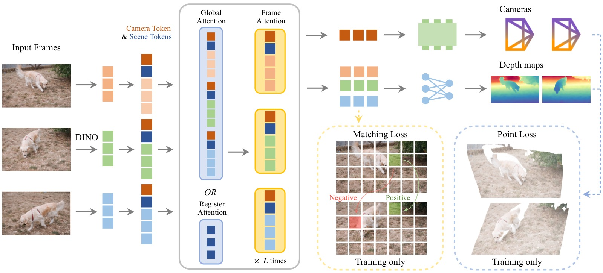
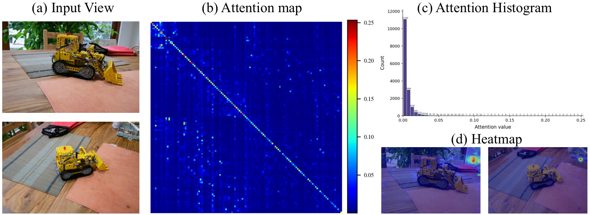
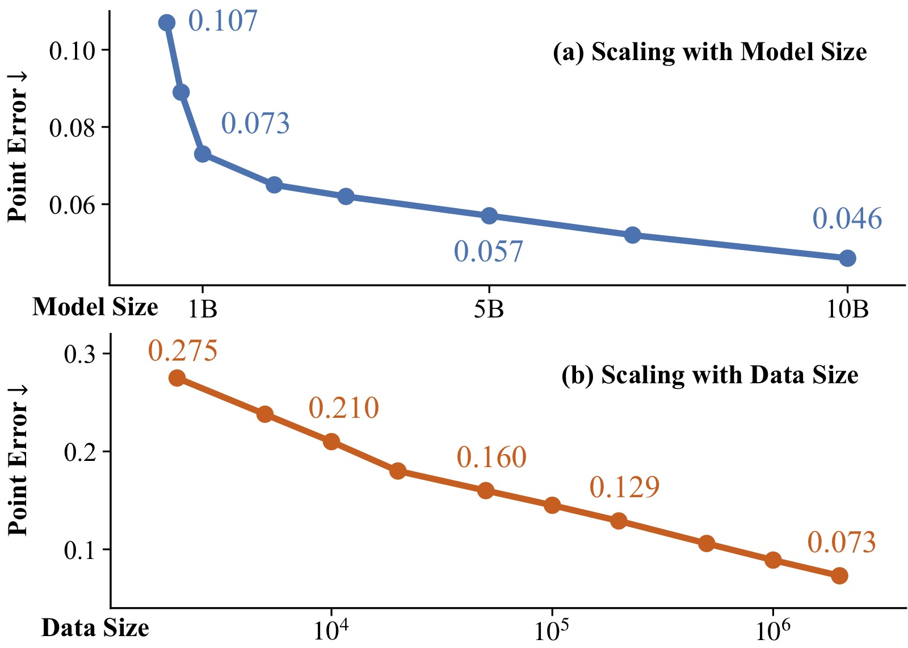
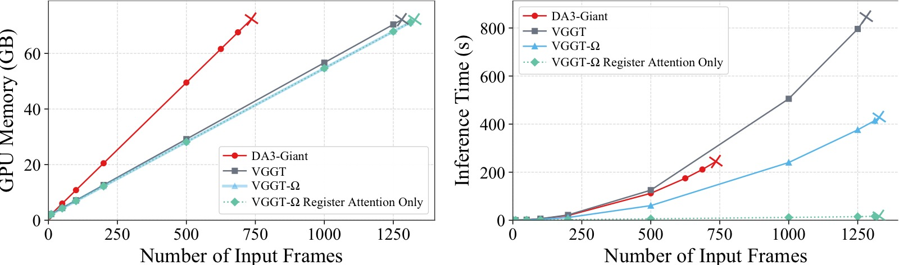
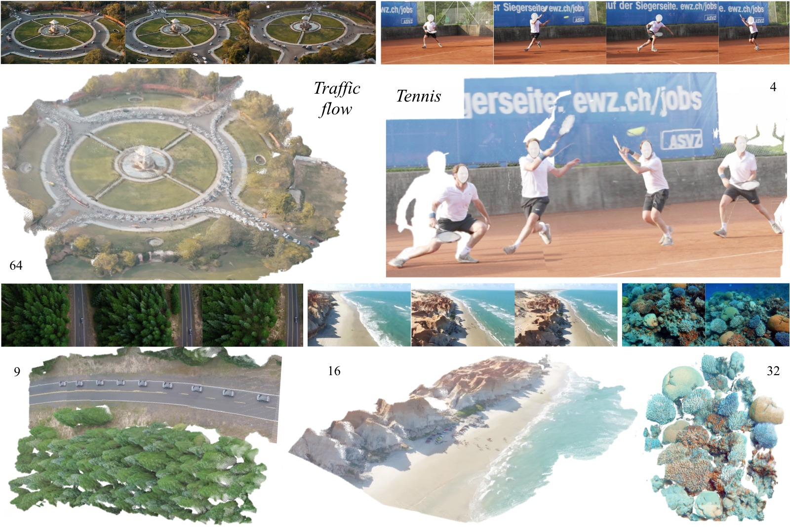
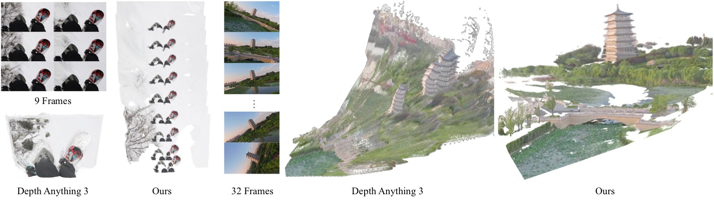
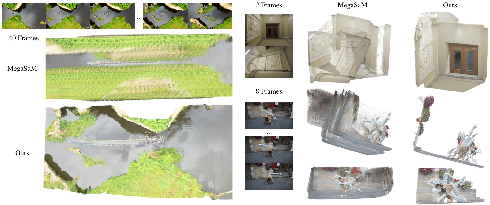
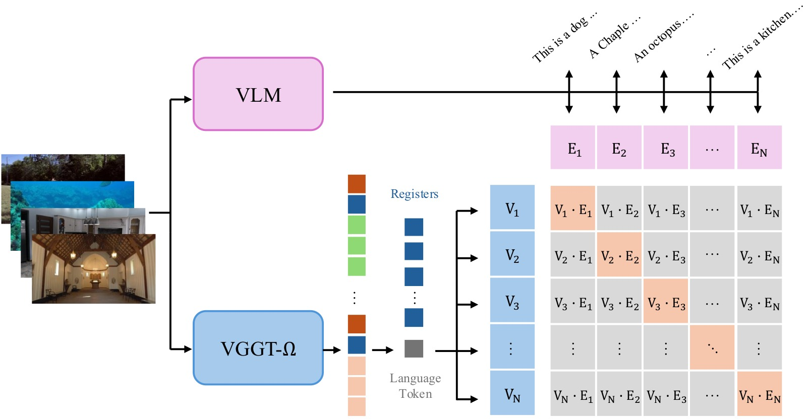

<!-- arxiv: 2605.15195 -->
<!-- venue: CVPR 2026 Oral -->
<!-- tags: 3D重建 -->

# VGGT-Ω: Scaling Feed-Forward Reconstruction Models

> **论文信息**
> - 作者：Jianyuan Wang, Minghao Chen, Shangzhan Zhang, Nikita Karaev, Johannes Schönberger, Patrick Labatut, Piotr Bojanowski, David Novotny, Andrea Vedaldi, Christian Rupprecht
> - 通讯作者：Jianyuan Wang（VGG, University of Oxford / Meta AI）
> - 投稿方向：CVPR 2026 **Oral**
> - arXiv ID：2605.15195
> - 代码：https://github.com/facebookresearch/vggt-omega
> - 项目页：http://vggt-omega.github.io/

---

## 一、核心问题

前馈重建模型（feed-forward reconstruction models）如 VGGT 已证明可以在许多场景下匹敌甚至超越传统 SfM 管线，但它们能否像语言/2D 视觉基础模型一样通过**扩大模型和数据规模**获得可预测的性能提升？这个问题在 3D 视觉中尚未被充分探索。

本文的核心问题是：**多视图前馈重建模型是否可以 scaling？以及 scaling 能带来什么好处？**

## 二、核心思路 / 方法

VGGT-Ω 在 VGGT 基础上做了三个层面的改进：

### 2.1 架构改进：Register Attention（寄存器注意力）

**核心设计**：为每帧图像引入 16 个可学习的"寄存器"（register / scene token），在部分全局注意力层（默认 25%）中，跨帧信息交换**仅通过寄存器进行**。Camera token 和 Register tokens 在 register attention 层中进行跨帧交互，聚合全局场景信息；随后在 frame attention 层中，更新后的寄存器将信息重新分配给每帧的 patch tokens。Patch tokens 本身不参与跨帧 attention，大幅节省计算量。



*图1：VGGT-Ω 整体架构总览。输入图像先通过 DINOv3 编码为 patch tokens，每帧附加 1 个 camera token 和 16 个 register（scene）tokens。交替使用 global attention（或 register attention）和 frame attention 进行特征聚合。最终通过 Camera Head 预测 9D 相机编码，通过 Dense Head（DPT 低分辨率卷积 + MLP + Pixel Shuffle）预测深度和置信度。相比 VGGT，去除了多个冗余密集预测头，仅保留训练损失的多任务监督。*

两个关键好处：
1. **效率提升**：替换 25% 的全局注意力层为 register attention，训练 GPU 内存节省约 70%（相比原 VGGT），FLOPs 减少约 23%
2. **学到有用的全局表征**：寄存器自然地聚合了场景级信息，且未经显式监督就能用于 VLA 模型和语言对齐

### 2.2 解码头简化

VGGT 原来有多个密集预测头（depth、point map、tracking features），其中的高分辨率卷积层（DPT）虽然参数量不大，但需要保存大量前向激活值，内存开销巨大。VGGT-Ω 做了三项简化：

- **单密集头 + 多任务损失**：只保留一个 depth 预测头，但通过 unprojection 间接监督 point map 和 matching loss
- **MLP + Pixel Shuffle 替代高分辨率卷积**：1/4 分辨率以上的卷积层被替换为单个 MLP + pixel shuffle 上采样
- **Camera head 单次预测**：不再迭代优化，一次前向直接输出 camera parameters

### 2.3 动态场景支持

VGGT-Ω 通过只预测 depth + camera（不预测显式的动态输出如 motion mask），将动态场景处理内化到模型的数据驱动先验中。这避免了需要分割运动像素或引入动态点图的复杂性，同时解锁了海量互联网视频数据。



*图2：VGGT 中 Global Attention 的稀疏性可视化。*

**子图 (a)**：输入的多帧图像。

**子图 (b)**：第 13 层全局注意力矩阵的可视化。横轴和纵轴分别代表所有帧的所有 tokens，颜色深浅表示注意力权重大小。可以看到注意力矩阵整体非常稀疏——大部分 token 对之间的注意力权重接近于零，只有少数 token 对（亮度较高的点）存在显著的信息交换。这说明全量全局注意力中大量计算是冗余的。

**子图 (c)**：注意力值的分布直方图。横轴为注意力值，纵轴为频率。分布高度集中在接近零的区域，进一步量化了稀疏性：绝大多数 token 间的注意力权重极小。

**子图 (d)**：空间注意力热力图。将特定 query token 对所有 key tokens 的注意力权重重映射回图像空间，高亮区域表示该 query 关注的位置。可以看到注意力集中在少数几个显著区域，而非均匀分布。

*这一观察直接启发了 register attention 的设计：既然只有少量 tokens 需要跨帧交换信息，不如显式地通过 register tokens 来集中这些信息交换。*

---

## 三、训练目标与数据

### 3.1 多任务损失

虽然模型只输出 depth 和 camera，但训练时使用四个损失：

$$\mathcal{L} = \lambda_{\text{cam}} \mathcal{L}_{\text{cam}} + \lambda_{\text{depth}} \mathcal{L}_{\text{depth}} + \lambda_{\text{point}} \mathcal{L}_{\text{point}} + \lambda_{\text{match}} \mathcal{L}_{\text{match}}$$

- **Camera loss**：L1 loss（比 Huber loss 更稳定），权重 5.0
- **Depth loss**：带 aleatoric uncertainty + 梯度一致性的 loss，权重 1.0
- **Point loss**：通过 unprojection 从 depth + camera 推导 point map 进行监督，权重 0.5
- **Matching loss**：对最后层 token 做对比学习（cosine similarity + BCE），权重 0.1

### 3.2 标注管线

为了处理动态内容，设计了一套高质量标注管线：

```
 40M Internet Videos
        │
        ▼
  ┌──────────────────┐
  │ VLM 预过滤        │ → 保留 ~10% 可重建的视频
  │ (过滤水印/转场等)  │
  └──────┬───────────┘
         ▼
  ┌──────────────────┐
  │ 动态 Mask 提取     │ → Grounding DINO 检测人/车等
  │ (排除动态区域)     │
  └──────┬───────────┘
         ▼
  ┌──────────────────┐
  │ 特征匹配 & 追踪    │ → SIFT + SuperPoint/SuperGlue
  │ (多方法集成)       │   + ALIKED/LightGlue + VGGSfM
  └──────┬───────────┘
         ▼
  ┌──────────────────┐
  │ VGGT 初始化 +      │ → RANSAC → VGGT 初始化位姿
  │ COLMAP BA         │   → COLMAP 迭代优化
  └──────┬───────────┘
         ▼
  ┌──────────────────┐
  │ 多视角一致性检查   │ → 深度投影验证，<5% 有效像素则丢弃
  └──────┬───────────┘
         ▼
  ┌──────────────────┐
  │ 监督几何过滤       │ → XGBoost + RandomForest + CatBoost
  │ (分类器去除低质量) │   用500静态+500动态人工标注训练
  └──────┬───────────┘
         ▼
  ~0.8M 高质量序列（1/3 动态，2/3 静态）
  + ~3M 公开数据集序列 = 总共 ~4M 序列
```

*训练数据标注管线流程。从 40M 互联网视频中经过 VLM 预过滤、动态 mask、多方法匹配、COLMAP 优化、多视角验证和分类器过滤，最终保留约 0.8M 高质量序列。标注管线优先质量而非数量。*

### 3.3 自监督训练

受 DINO 启发，采用 teacher-student 动量蒸馏方案：
- Teacher 和 student 都以监督训练后的 VGGT-Ω checkpoint 初始化
- 同一视频序列，不同 augmentation（color jitter、随机 90° 旋转、patch masking、帧重排）
- Student 匹配 teacher 的 token 特征和 depth/camera 预测
- Teacher 通过 EMA（decay=0.999）更新
- Camera 和 depth head **冻结**，防止坍缩
- 在 18M 未标注视频上训练

### 3.4 数据质量的重要性

论文特别强调了标注数据质量的关键性。噪音数据会导致训练中的特定 failure mode：
- **传感器数据的前景-背景泄漏**：ScanNet++ 中椅子背部被标注为墙壁深度
- **合成数据中的"假背景"**：Kubric 等数据集中背景深度对应 HDRI 穹顶而非实际几何
- **BA 的穹顶效应（doming effect）**：弱全局约束下 BA 产生全局弯曲的重建
- **细薄结构标注不完整**：栅栏等细结构的渲染深度可能被误标为背后的墙壁


*图3：训练数据中四类常见的标注质量问题。*

**第一行—传感器数据的前景-背景泄漏（ScanNet++）**：椅子背部的深度被标注为背景地板或墙壁的深度值，而非椅子本身。吊灯周围的碎片化前景结构也表明传感器在过曝和半透明物体附近的捕获不可靠。此类数据在训练后期被排除。

**第二行—合成数据中的细薄结构标注不完整（Hypersim）**：栅栏等仅占几个像素的细薄结构，其渲染深度可能缺失、过度平滑或错位，导致标注将栅栏的深度赋给背后的墙壁、窗户或地面。这使模型倾向于忽略细薄物体或将其深度"冲刷"到附近大表面上。

**第三行—合成数据中的"假背景"（Kubric/PointOdyssey）**：背景深度对应 HDRI 渲染用的代理穹顶或地面几何，而非背景外观所暗示的真实 3D 结构。对于前景和背景有明显边界的（如 BEDLAM），通过阈值过滤；其余直接排除。

**第四行—BA 的穹顶效应（Doming Effect）**：当图像集合缺乏足够的全局约束时（如近平行拍摄方向、缺少回环、三角化角度小、径向畸变误差），BA 可能收敛到全局弯曲的退化解。虽然重投影误差低，但相机和场景的整体几何是扭曲的。通过监督几何分类器过滤。

### 3.5 动态场景处理策略

动态场景训练的关键设计选择：
- 只预测 **depth + camera**，不预测 point map 或 motion mask
- 动态区域的深度标注在管线中**被丢弃**，模型从合成数据中学习动态区域的深度
- 通过构造 challenging 的训练子集（从局部时间窗口采样帧），增强泛化能力

---

## 四、实验与结果

### 4.1 Scaling 行为



*图4：模型和数据规模的 scaling 曲线（以 point error 为指标）。*

**子图 (a) 模型规模 scaling**：在固定数据量下，将模型从 0.2B 扩展到 10B 参数（12→24 层、384→4096 隐层维度），point error 从约 0.25 单调下降至约 0.07。符合幂律规律。

**子图 (b) 数据规模 scaling**：在固定模型大小下，训练序列从几千扩展到 2M，point error 从 0.275 单调下降至 0.073。每增加 10× 数据都带来显著提升，同样符合幂律规律。

### 4.2 相机位姿估计

| 方法 | 7 Scenes AUC@3° | NRGBD AUC@3° | ETH3D AUC@3° | DyCheck AUC@3° | Sintel AUC@3° | TUM-Dyn AUC@3° |
|------|:---:|:---:|:---:|:---:|:---:|:---:|
| MonST3R | 9.0 | 13.9 | 1.7 | 11.5 | 4.3 | 7.7 |
| MapAnything | 5.8 | 35.2 | 13.2 | 6.1 | 2.9 | 4.3 |
| MegaSaM | 10.6 | 17.2 | 5.9 | 26.8 | 22.5 | 15.4 |
| VGGT | 10.9 | 81.7 | 18.8 | 21.0 | 15.0 | 16.6 |
| PI3 | 13.3 | 83.8 | 35.3 | 23.3 | 14.8 | 16.1 |
| DA3 | 18.7 | 86.4 | 46.1 | 32.1 | 16.2 | 20.8 |
| **Ours-1B** | **29.6** | **89.7** | **49.8** | **38.4** | **35.3** | **30.2** |
| **Ours-10B** | **36.4** | **92.5** | **56.3** | **43.7** | **40.0** | **36.4** |

关键发现：
- 在 Sintel 上，AUC@3° 从 MegaSaM 的 22.5 → 40.0（**+77%**），AUC@30° 从 58.3 → 79.1（**+35%**）
- 在所有静态和动态 benchmark 上均大幅领先
- Optimization-based 方法（MegaSaM）在 Sintel 严格阈值上较有竞争力，但在宽基线场景（ETH3D）严重退化
- 10B 模型始终优于 1B 模型，scaling 直接转化为精度提升

### 4.3 深度估计

| 方法 | Sintel δ₁.₂₅ | Sintel AbsRel | ETH3D δ₁.₂₅ | ETH3D AbsRel |
|------|:---:|:---:|:---:|:---:|
| VGGT | 79.2 | 0.189 | 97.4 | 0.036 |
| MegaSaM | 74.1 | 0.207 | 94.8 | 0.083 |
| DA3 | 86.1 | 0.118 | 99.6 | 0.015 |
| **Ours-1B** | **89.5** | **0.097** | **99.8** | **0.012** |
| **Ours-10B** | **93.5** | **0.081** | **99.8** | **0.009** |

关键发现：
- Sintel 上 δ₁.₂₅ 从 DA3 的 86.1 → 93.5（**+8.6%**）
- 静态数据集上已经在天花板附近（ETH3D δ₁.₂₅ 99.8%），动态数据集上仍有显著提升

### 4.4 推理效率



*图5：VGGT、DA3 和 VGGT-Ω 的推理内存和速度对比（单张 A100 80GB）。*

**子图 (a) GPU 内存**：VGGT（修正后）和 VGGT-Ω 内存使用相似，均可处理超过 1,000 帧（单卡 A100）。DA3 在约 750 帧时 OOM。关键洞察：Flash Attention v2 不会显式存储完整 attention 矩阵，内存峰值主要由与帧数和 token 数成正比的 tensor（frame-attention 激活值和 FFN 中间结果）决定。内存随帧数**近似线性**增长。

**子图 (b) 推理速度**：VGGT-Ω 比 VGGT 快 20–25%，主要得益于：(1) DINOv3 的 patch_size=16（vs DINOv2 的 14），token 数减少约 25%；(2) 25% 全局注意力替换为 register attention。全 register attention 变体在 1000 帧上的推理时间从 240.2s 降至 11.7s（速度提升约 20×），但精度会显著下降。

### 4.5 Ablation Studies

| 实验配置 | Point Error |
|---------|:-----------:|
| 全全局注意力（无 register attention） | 0.071 |
| 25% register attention（**默认**） | 0.073 |
| 移除 point + matching loss | 0.078 |
| VGGT 原版多任务多头（reference） | 0.070 |
| 添加 10% 自监督训练步 | 0.070 |

- Register attention 替代 25% 全局注意力几乎无损（+0.002）
- Multi-task losses（即使无对应 head）仍有明显收益（0.073 → 0.078）
- 自监督训练略微提升 + 改善 OOD 泛化

### 4.6 定性对比



*图6：VGGT-Ω 在多样场景上的定性重建结果（每个场景标注了所用帧数）。*

**子图 (a) 交通场景（64 帧）**：叠加的车流轨迹展示了模型对动态内容的高质量处理——移动的车辆被正确重建为独立的 3D 结构，未被吸收到静态背景中。注意模型仅预测 depth 和 camera，不预测 motion mask，但仍能自然地处理运动物体。

**子图 (b) 网球比赛（4 帧）**：尽管只有 4 帧输入，运动员轨迹和球场结构的空间关系保持一致。模型对快速人体运动的几何先验来自大规模动态数据训练。

**子图 (c) 自然景观（9 帧）**：在充满重复纹理的山地场景中保持全局几何一致性，未出现纹理重复导致的匹配错误。

**子图 (d) 水下珊瑚礁（16 帧）**：极端非自然光照和复杂几何条件下，模型仍恢复出连贯的 3D 结构。此类场景在训练数据中极为罕见，体现了强泛化能力。

**子图 (e) 室内场景（32 帧）**：大场景下恢复出合理的全局结构，无尺度漂移或全局弯曲。



*图7：与 Depth Anything 3（DA3）在困难场景上的定性对比。*

**左侧—雪地缆车序列**：白雪覆盖的田野形成大量重复纹理，DA3 因此几乎无法估计相机运动（将其误判为静止场景），重建结果表现为一簇混乱的 3D 点。VGGT-Ω 正确恢复了相机的前向运动轨迹和缆车的 3D 结构。这体现了 VGGT-Ω 的几何先验对纹理歧义的鲁棒性。

**右侧—无人机环绕塔楼序列**：无人机在飞行过程中发生大幅相机旋转（roll）。在这种强视角变化下，DA3 产生了严重的"鬼影"效应——将同一座塔楼重复重建为多个重叠副本，全局几何完全崩溃。VGGT-Ω 的重建保持全局一致，塔楼结构完整无重复。这表明 VGGT-Ω 的 camera estimation 在极端旋转条件下比 DA3 更可靠。



*图8：与 MegaSaM 在困难场景上的定性对比。*

**左列—航拍场景**：MegaSaM 在航拍序列中呈现严重的几何漂移和纹理涂抹（texture smearing），地面纹理被重复拉伸、全局布局扭曲。VGGT-Ω 保持了全局一致的地面重建。

**右上—稀疏室内场景（第二帧非 upright）**：该场景的第二帧相机存在明显倾斜（非 upright），使位姿估计极具挑战。MegaSaM 在缺乏纹理的墙壁区域产生不连贯的平面结构。VGGT-Ω 凭借强大的几何先验维持了合理的全局重建。

**右下—室内纹理缺失场景**：大面积白墙和弱纹理区域使 MegaSaM 的优化难以收敛，表现为错位或断裂的墙面。VGGT-Ω 的前馈推断避免了优化过程中的局部最小值问题。

### 4.7 Registers 的下游应用

**VLA（Vision-Language-Action）**：将冻结的 VGGT-Ω 的 scene tokens 拼接给 OpenVLA-OFT，在 LIBERO 四个子任务上均有提升：

| 方法 | Spatial | Object | Goal | Long | Average |
|------|:---:|:---:|:---:|:---:|:---:|
| OpenVLA-OFT | 97.6 | 98.4 | 97.9 | 94.5 | 97.1 |
| **+ Scene Tokens** | **99.3** | **99.2** | **99.0** | **96.7** | **98.5** |

**语言对齐**：通过一个小的 self-attention stack + 可学习 language token 读取 registers，使用对比学习与 VLM 文本嵌入对齐。训练只需 10K iterations 即取得良好效果：
- 与训练时所用 VLM 嵌入做 retrieval：Top-1 76.8%，Top-3 97.0%
- Zero-shot transfer 到纯文本 LLM（Qwen3）：Top-1 47.5%，Top-3 77.8%



*图9：语言对齐流程。VLM 观察多帧图像生成场景描述文本，其隐藏状态被池化为语言嵌入。VGGT-Ω 侧通过可学习的 language token 从 registers 中读取信息，投影后与语言嵌入做对比学习。关键约束：language token 不能直接访问 image patch tokens，只能通过 registers 获取信息。对齐成功意味着 registers 确实携带了场景级语义信息。*

---

## 五、关键洞察与技术亮点

1. **Register Attention 是一种高效的信息瓶颈**：限制跨帧信息交换只通过 16 个 register tokens，既是计算优化，也是在强迫模型学习紧凑的全局场景表征。这与 ViT 中观察到的 "high-norm outlier tokens 自然携带全局信息" 现象一致。

2. **"单头多损失" 设计是高效 scaling 的关键**：虽然最终模型只输出 depth，但通过 unprojection 可以从 depth + camera 推导 point map 并施加损失。这种方式几乎保留了原 VGGT 多任务训练的好处，同时节省了一个 dense head 的内存。

3. **Scaling 遵循幂律规律**：无论是模型规模还是数据规模，point error 都呈现出可预测的幂律下降。这对未来更大规模的训练具有指导意义。

4. **训练效率 vs 推理效率是不同的问题**：论文明确指出 Flash Attention v2 使得推理时的内存瓶颈不再是 attention 矩阵（不需要显式存储），而是与帧数成正比的激活值。因此 register attention 主要**加速推理**而非节省推理内存。

5. **数据质量 > 数据数量**：标注管线故意保守——宁可丢弃可能不准确的序列/像素，也不注入噪音监督。小批高精度伪真值优于大噪数据集。

6. **运动感知是无监督涌现的**：无需光流或运动标签，仅通过 reconstruction 目标，模型的中间层 features 通过 PCA + k-means 就能自动分离运动区域和背景。


*图10：运动感知的涌现。对中间层 tokens 做 PCA 降维 + k-means 聚类（无任何运动标签），浅层（layer 4）的一个聚类可以精确追踪移动的舞者，深层（layer 23）则同时高亮所有人。这说明模型自动学会了区分运动区域——即使它从不知道帧的时间顺序。*

7. **模型汤（Model Souping）揭示了信息存储的位置**：通过融合 VGGT 和 VGGT-Ω 的部分权重，发现 depth/FoV 信息主要存储在 frame attention block 的 FFN 中，camera extrinsic 信息存储在更高层。

---

## 六、代码实现解读

### 6.1 整体架构

```
 ┌─────────────────────────────────────────────────────────────┐
 │                      VGGTOmega (nn.Module)                  │
 │                                                             │
 │  images: [B, N, 3, H, W]                                    │
 │       │                                                     │
 │       ▼                                                     │
 │  ┌──────────────────────────────────────────────────────┐   │
 │  │              Aggregator (核心编码器)                    │   │
 │  │                                                      │   │
 │  │  ┌──────────────────────┐                            │   │
 │  │  │ DINOv3 Patch Embed   │  (vggt_omega/models/       │   │
 │  │  │ + RoPE Position Enc  │   layers/vision_           │   │
 │  │  └──────────┬───────────┘   transformer.py)          │   │
 │  │             │                                        │   │
 │  │  ┌──────────▼──────────────────────────────────┐    │   │
 │  │  │  [CAM|1] [REG|16] [PATCH_TOKENS|HW/p²]      │    │   │
 │  │  └──────────┬──────────────────────────────────┘    │   │
 │  │             │                                        │   │
 │  │    ┌────────▼──────────────────────────┐            │   │
 │  │    │  Alternating Attention × 24 blocks │            │   │
 │  │    │  ┌─────────────────────────────┐   │            │   │
 │  │    │  │ Frame Attention (per frame) │   │            │   │
 │  │    │  │   → SelfAttention + FFN     │   │            │   │
 │  │    │  └─────────────┬───────────────┘   │            │   │
 │  │    │                ▼                    │            │   │
 │  │    │  ┌─────────────────────────────┐   │            │   │
 │  │    │  │ Inter-Frame Attention       │   │            │   │
 │  │    │  │   global: all tokens 交互    │   │            │   │
 │  │    │  │   register: 仅 CAM+REG 交互  │   │            │   │
 │  │    │  └─────────────────────────────┘   │            │   │
 │  │    └────────────────────────────────────┘            │   │
 │  │                                                      │   │
 │  │  输出: 4 个中间层 features [B,N,H'W'+17,2C]           │   │
 │  └──────────────────────────────────────────────────────┘   │
 │       │                                                     │
 │       ├──→ CameraHead: 最终层 CAM+REG tokens                │
 │       │    └─→ 4× SelfAttentionBlock → MLP → [T,quat,FoV]  │
 │       │                                                     │
 │       ├──→ DenseHead: 4 层 patch tokens                    │
 │       │    └─→ DPT(低分辨率CNN) + MLP + PixelShuffle        │
 │       │       → depth [B,N,H,W], depth_conf [B,N,H,W]      │
 │       │                                                     │
 │       └──→ TextAlignmentHead (可选): 最终层 CAM+REG tokens  │
 │            └─→ learnable language token + 4× attention      │
 │               → text_alignment_embedding [B, D]             │
 └─────────────────────────────────────────────────────────────┘
```

*图11：VGGT-Ω 整体架构代码映射。核心实现在 `vggt_omega/models/vggt_omega.py:16`。*

### 6.2 关键代码映射

| 论文概念 | 代码位置 | 关键细节 |
|---------|---------|---------|
| DINOv3 初始化 | `aggregator.py:220` `_build_patch_embed()` | `DinoVisionTransformer`，patch_size=16, 24层 |
| Register tokens | `aggregator.py:82` | `nn.Parameter(1, 2, 16, embed_dim)`，2=参考帧/非参考帧两种 |
| Camera token | `aggregator.py:81` | `nn.Parameter(1, 2, 1, embed_dim)` |
| Register attention indices | `aggregator.py:29` | 默认 `[2, 6, 9, 14, 20]`（24层中的5层） |
| Register attention 实现 | `aggregator.py:187-217` | 只让 `[:, :, :patch_token_start]` tokens 做 self-attention |
| Frame attention | `aggregator.py:156-168` | `reshape → frame_blocks[block_idx] → reshape` |
| Global attention | `aggregator.py:182-185` | 全 tokens 展平 → `inter_frame_blocks[block_idx]` |
| Camera head 单次预测 | `camera_head.py:44-73` | 4× SelfAttentionBlock → MLP → 9D encoding |
| DenseHead (DPT + MLP) | `dense_head.py:19-180` | 4个中间层 → Conv2d projection → DPT fusion → MLP → PixelShuffle |
| Text alignment head | `text_alignment_head.py:48-79` | learnable language token + 4× attention → projector |
| Pose encoding | `pose_enc.py:12-26` | translation(3) + quaternion(4) + FoV_h(1) + FoV_w(1) = 9D |

### 6.3 推理流程

```
  Image Paths
       │
       ▼
  load_and_preprocess_images()          # load_fn.py:15
  ├─ center-crop to [0.5, 2.0] 宽高比
  ├─ resize (balanced / max_size mode)
  └─ padding to common size
       │
       ▼
  model(images)                         # vggt_omega.py:35
  ├─ bfloat16 autocast
  │   └─ aggregator(images)             # aggregator.py:100
  │       ├─ normalize (ResNet mean/std)
  │       ├─ patch_embed (DINOv3)
  │       ├─ concat [CAM, REG, PATCH]
  │       ├─ 24 × (frame_block → inter_frame_block)
  │       └─ return [4 cached layers, patch_token_start]
  │
  ├─ CameraHead (float32)               # camera_head.py:45
  │   └─ 最终层 cam+reg → 4× attn → MLP → [B,N,9]
  │
  ├─ DenseHead (float32)                # dense_head.py:72
  │   └─ 4 层 patch tokens → DPT → MLP → PixelShuffle
  │       → depth = exp(logits), conf = 1 + exp(conf_logits)
  │
  └─ TextAlignmentHead (可选, float32)   # text_alignment_head.py:48
      └─ language_token + cam+reg → 4× attn → projector → L2 norm
       │
       ▼
  encoding_to_camera()                  # pose_enc.py:29
  ├─ translation = pose_enc[..., :3]
  ├─ R = quat_to_mat(pose_enc[..., 3:7])
  ├─ fx, fy from FoV
  └─ → extrinsics [B,N,3,4], intrinsics [B,N,3,3]
```

*图12：VGGT-Ω 推理流程。从图像加载到最终相机参数和深度图的完整数据流。*

### 6.4 代码设计要点

- **Memory chunking**：DenseHead 支持 `frames_chunk_size` 参数（默认 8），将多帧分块处理以控制峰值内存
- **Custom interpolate**：`custom_interpolate()` 将超大张量分块执行 `F.interpolate`，避免超过 2^31 元素限制
- **QK normalization**：attention 层中可选 `use_qk_norm=True`（aggregator blocks），稳定训练
- **Masked K bias**：`LinearKMaskedBias` 将 K 的 bias 掩码为 NaN，防止 K 的 bias 被优化（训练稳定性技巧）
- **LayerScale**：每个 attention 和 FFN block 后使用 LayerScale，`init_values=1e-5`（小初始化，渐进学习）
- **Confidence init**：`proj_conf` 的 bias 初始化为 `ln(0.05)`，使得初始 confidence ≈ 1.05

### 6.5 模型变体配置

| 变体 | 层数 | 隐层维度 | 注意力头数 | 参数量 |
|------|:---:|:---:|:---:|:---:|
| VGGT-Ω-200M | 12 | 384 | - | ~200M |
| VGGT-Ω-500M | 12 | 768 | - | ~500M |
| VGGT-Ω-1B | 24 | 1024 | 16 | ~1B |
| VGGT-Ω-10B | 16 | 4096 | - | ~10B |

---

## 七、局限性

1. **强运动模糊**：性能显著下降
2. **视场角剧烈变化**：如几秒内从 10° 变到 160°
3. **高度畸变的相机**
4. **特定场景不稳定**：如办公室中大量显示器的场景（因训练数据中有 ScanNet++ 的噪声标注）
5. **隐私内容区域**：人脸和商标被 mask 处理，可能导致对应区域深度预测不稳定
6. **细薄结构**：栅栏等细结构的深度预测容易被附近大表面淹没
7. **"人在墙里"现象**：街景视频中的行人偶尔会被吸收到背景建筑中（源于 MegaDepth 的边界像素歧义标注）
8. **MLP-only 解码头的块状伪影**：论文尝试了纯 MLP 解码头以减少内存，但会产生可见的 patch 块状伪影（尤其在室外远景场景），最终保留了低分辨率卷积层作为折中

---

## 八、关键概念速查

| 概念 | 解释 |
|------|------|
| **Feed-forward reconstruction** | 直接从图像通过神经网络推断深度和相机参数，无需 BA 等迭代优化 |
| **Register tokens** | 可学习的额外 token，不绑定任何图像 patch，用于聚合和交换全局信息 |
| **Register attention** | 仅在 register tokens 之间做跨帧 attention，patch tokens 不参与 |
| **Alternating attention** | 在 frame attention（帧内）和 inter-frame attention（帧间）之间交替 |
| **Scene tokens** | 即 register tokens，因为聚合了场景级信息 |
| **Camera token** | 每帧一个的特殊 token，最终用于预测相机参数 |
| **Point error** | 用预测的 depth + camera unproject 得到的 3D 点与 GT 之间的 L2 距离 |
| **Doming effect** | BA 在弱全局约束下产生的全局弯曲重建伪影 |
| **Pixel shuffle** | 将通道维度重排为空间维度的高效上采样算子 |
| **Model souping** | 直接平均不同模型的部分权重进行融合，无需额外训练 |

---

## 训练配置速查

| 项目 | 配置 |
|------|------|
| 优化器 | AdamW |
| 峰值学习率 | 2×10⁻⁴（监督），1×10⁻⁴（自监督） |
| 学习率调度 | 5% warmup + cosine decay |
| 总迭代数 | 240K（160K 监督 + 50K 自监督 + 30K 监督） |
| 帧数/样本 | [1, 24] 均匀随机采样 |
| 输入分辨率 | ~512×512（保持面积，宽高比随机在 [0.33, 1.33]） |
| 硬件 | 128× H100 96GB |
| 精度 | bfloat16 mixed precision |
| 并行策略 | FSDP + gradient checkpointing |
| 合成:真实数据比例 | 约 80%:20%（推荐） |
| 梯度裁剪 | 阈值 1.0 |
