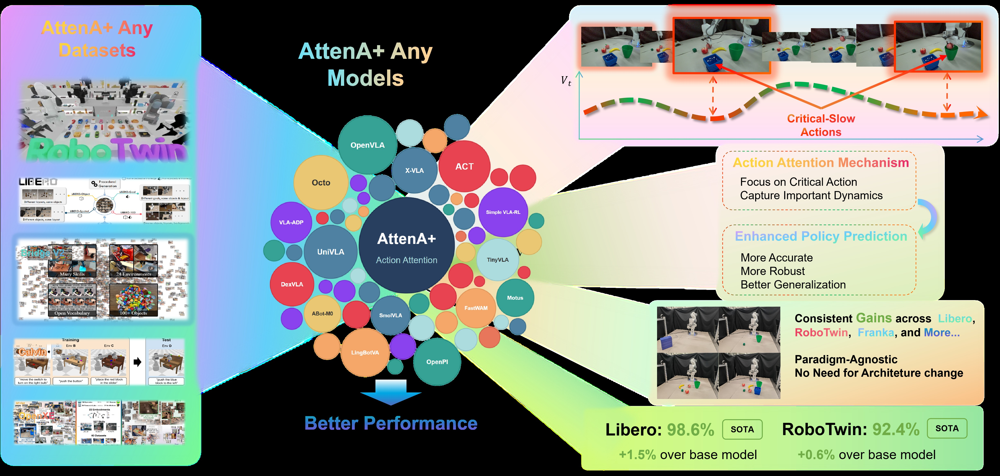
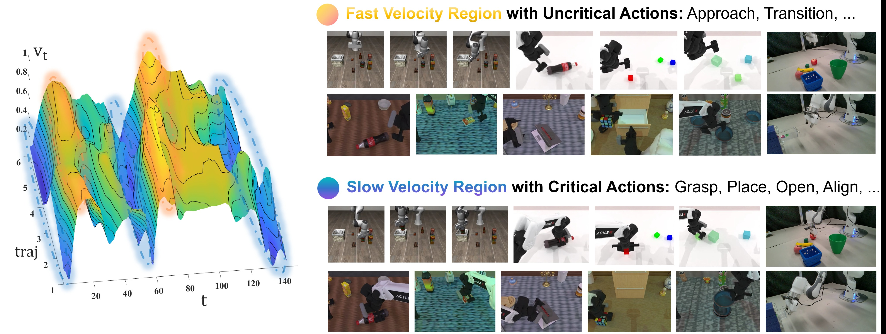
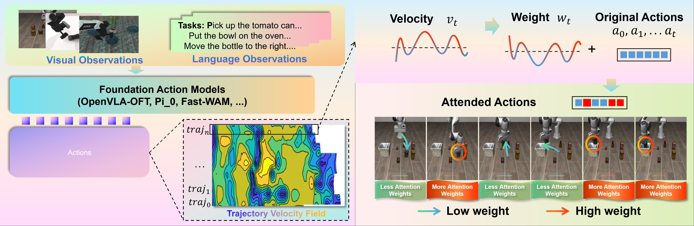
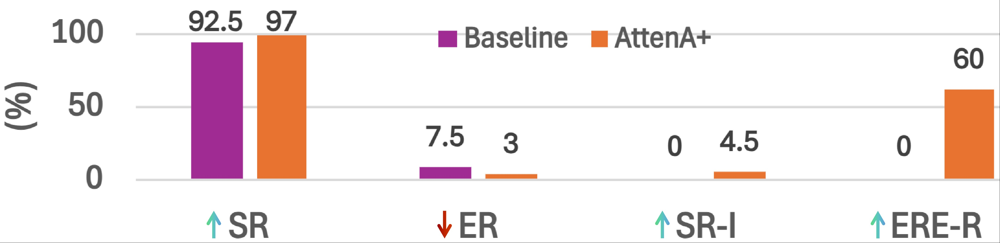
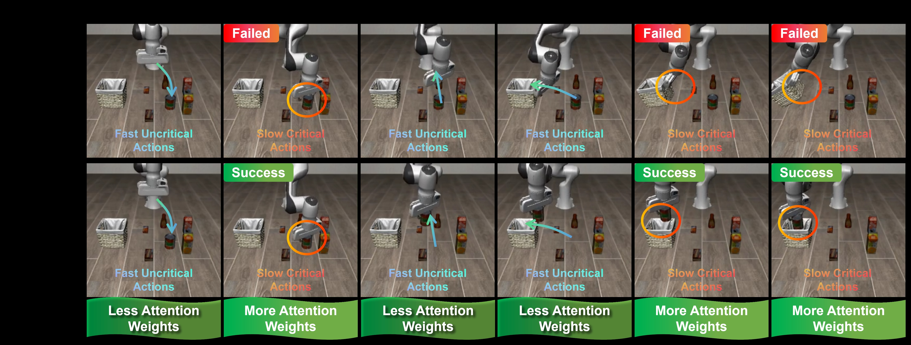
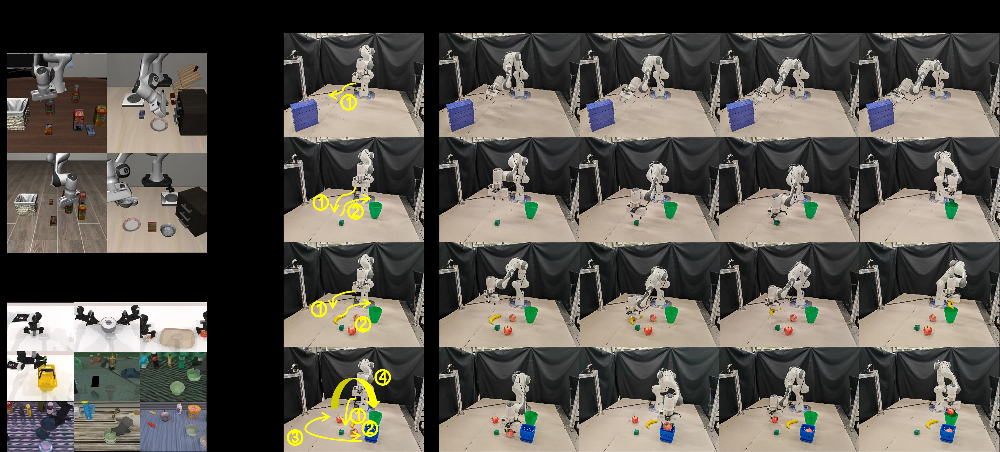

# AttenA+: Rectifying Action Inequality in Robotic Foundation Models

> **论文信息**
> - 作者：Daojie Peng*, Fulong Ma*, Jiahang Cao*, Qiang Zhang, Xupeng Xie, Jian Guo, Ping Luo, Andrew F. Luo, Boyu Zhou, Jun Ma†（*同等贡献，†通讯作者）
> - 机构：HKUST(GZ), HKU, USTC, IDEA Research, SUSTech, X-Humanoid
> - 投稿方向：NeurIPS 2026（投稿中）
> - arXiv ID：2605.13548v1
> - 代码：https://github.com/AttenA-Plus/AttenA-Plus

---

## 一、核心问题

当前机器人基础模型（VLA 和 WAM）在训练时对所有时间步的动作一视同仁，赋予相同的 loss 权重。这一做法继承自 NLP 的"所有 token 同等重要"假设，但忽略了机器人操作轨迹的**物理异构性**：

- **低速动作**（如抓取、精细对准、放置）是任务成败的关键，对精度要求极高
- **高速动作**（如自由空间移动、粗定位）是容错率高的过渡性运动

这种"平坦"的训练范式导致模型将表示能力浪费在冗余的过渡段上，而对真正决定任务成败的低速精密动作优化不足。论文将这一现象形式化为 **Action Inequality（动作不平等）** 问题。

> 换句话说：模型花了同样的力气去学"快速移动到目标附近"和"精确抓取物体"，但后者才是决定成败的关键。AttenA+ 的核心思想就是让模型把更多注意力放在低速精密动作上。

---

## 二、核心思路 / 方法

### 2.1 速度场分析：低速 = 关键

论文首先对多个任务数据集的末端执行器速度分布进行了可视化分析（图1）。发现：

- **高速区（暖色）**：对应自由空间中的接近/过渡阶段，误差容忍度高
- **低速区（冷色）**：对应物体交互阶段（抓取、对准、放置），微小的预测误差就可能导致任务失败

因此，**瞬时速度 $v_t$ 可以作为动作重要性的天然无监督代理指标**——速度越低，精度要求越高，动作越关键。

### 2.2 AttenA+：基于速度场的动作注意力

AttenA+ 是一个**架构无关的即插即用增强框架**，核心思想是用速度场的倒数作为权重，重新缩放训练 loss。

#### 速度计算

对每个时间步 $t$ 的真值动作 $\boldsymbol{a}_t^{gt}$，计算其瞬时速度幅值：

$$v_t = \|\boldsymbol{a}_t^{gt}\|_2 = \sqrt{\sum_{d=1}^{D_{pos}} (a_{t,d}^{gt})^2}$$

其中 $D_{pos}$ 为动作的平移/旋转自由度。以 LIBERO 数据集（$D=7$：6 个关节速度 + 1 个夹爪状态）为例，仅使用前 6 维（关节速度）计算速度，忽略二值夹爪状态。

#### 权重映射

定义注意力权重函数 $w_t = F_A(v_t)$，设计四种可配置的映射策略：

| 策略 | 公式 | 特点 |
|------|------|------|
| **Inverse** | $w_t = \frac{1}{v_t}$ | 温和的反比加权 |
| **Inverse Squared** | $w_t = \frac{1}{v_t^2}$ | 强力放大低速动作权重差（默认） |
| **Exponential Decay** | $w_t = e^{-\alpha \cdot v_t}$ | 快速衰减高速动作，$\alpha=5.0$ |
| **Logarithmic** | $w_t = \frac{1}{\log(1+v_t)}$ | 平滑稳定，对噪声不敏感 |

#### 正则化

为确保训练稳定性，AttenA+ 引入两个正则化步骤：

1. **权重裁剪**：将权重限制在 $[1/\text{clip}_{\text{max}}, \text{clip}_{\text{max}}]$ 范围内，防止极低速时间步主导梯度
2. **损失归一化**（可选）：将权重均值归一化到约 1，保持与原始基线一致的全局学习率

### 2.3 范式无关的优化目标

AttenA+ 可以无缝集成到不同范式的模型中：

**判别式模型（AttenA+Disc）**：将标准 $L_1$ 回归 loss 改为加权版本

$$\theta^* = \arg\min_\theta \mathbb{E}_{(\mathcal{I}, L, \mathcal{A}^{gt}) \sim \mathcal{D}} \left[ \frac{1}{T \cdot D} \sum_{t=1}^T \sum_{d=1}^D w_t \cdot | a_{t,d}^{\text{pred}} - a_{t,d}^{gt} | \right]$$

**流匹配模型（AttenA+FM）**：将 $\pi_0$/$\pi_{0.5}$ 的流匹配 loss 改为加权版本

$$\phi^* = \arg\min_\phi \mathbb{E}_{\substack{(\mathcal{I}, L, \mathcal{A}^{gt}) \sim \mathcal{D} \\ \epsilon \sim \mathcal{N}(0, I)}} \left[ \frac{1}{T \cdot D} \sum_{t=1}^T \sum_{d=1}^D w_t \cdot \| u_t(\epsilon; \mathcal{I}, L) - (a_{t,d}^{gt} - \epsilon_d) \|_2^2 \right]$$

**扩散策略模型（AttenA+Diff）**：同样将去噪 loss 改为加权版本。

*图1：AttenA+ 整体框架概览。该图从宏观层面展示了 AttenA+ 的设计哲学和适用范围。*

**上半部分**展示了 AttenA+ 的核心洞察：机器人操作轨迹中，低速精密动作（如精确抓取、对准放置）才是任务成败的决定性因素，而高速过渡运动（如自由空间移动）容错率很高。现有的"平坦"训练范式对所有时间步一视同仁，导致优化效率低下。AttenA+ 通过速度场（Velocity Field）发现这一物理层次结构，用速度的倒数作为注意力权重，优先优化低速关键动作。

**下半部分**展示了 AttenA+ 的范式通用性：它不修改任何骨干网络结构，只需在 loss 计算时乘以速度导出的权重矩阵即可。图中列出了支持的模型范围——从判别式的 OpenVLA-OFT，到生成式的 π₀/π₀.₅/Diffusion Policy，再到新兴的世界-动作模型 Fast-WAM——覆盖了当前机器人基础模型的所有主流范式。在 LIBERO（4 类任务）和 RoboTwin 2.0（50 个双臂任务）两个基准上的实验结果（柱状图）显示，AttenA+ 一致提升了各基线的成功率。

---

*图2：速度场分析揭示动作不平等。该图通过对多个专家演示轨迹的速度分布进行可视化，直观展示了论文的核心发现。*

图中包含多条专家演示轨迹的速度曲线，横轴为时间步，纵轴为末端执行器瞬时速度幅值。暖色（红/橙）区域表示高速动作，冷色（蓝/深蓝）区域表示低速动作。每个子图对应一个具体的操作任务（如抓取、放置、推拉等）。

关键观察：
- **低速段与任务关键阶段高度重合**：速度曲线在任务开始（机器人初始化）、接近物体（精细对准）、抓取瞬间、放置瞬间和任务完成时都出现明显的"低谷"——这些正是精度敏感、容错率低的关键动作。
- **高速段对应容错过渡**：自由空间移动、粗定位、抓取后的重新定位等阶段速度较高，即使有一定预测误差也不会导致任务失败。
- **跨任务一致性**：不同任务的速度分布模式虽然有差异，但"低速=精密交互、高速=容错过渡"的规律普遍成立。这验证了速度作为动作重要性代理指标的跨任务泛化性。

---

*图3：AttenA+ 的端到端工作流程。该图具体展示了从原始数据到加权训练的实现过程。*

**左侧（数据流）**：给定视觉观测和语言指令，从数据集中提取真值动作序列 $\mathcal{A}^{gt}$，计算每个时间步的速度幅值 $v_t$，通过注意力权重函数 $F_A$ 将速度映射为权重 $w_t \propto 1/v_t$（速度越低，权重越高）。

**中间（权重分配可视化）**：图中以柱状图或曲线形式展示了不同时间步的权重分布。低速精密动作段（如抓取、对准）获得更高的注意权重（更长的柱子），而高速过渡段权重较低。

**右侧（损失计算）**：将权重 $w_t$ 融入加权损失函数 $\mathcal{L}_{\text{AttenA+}} = \sum_t w_t \cdot \mathcal{L}_t$。这等价于在优化地形中"加深"低速动作区域的梯度盆地，使模型在训练时自动将更多优化能力分配给精密操控阶段。

---

## 三、实验与结果

### 3.1 评估指标

- **SR（Success Rate）**：任务成功率（%）
- **$\overline{\text{SR}}$**：平均成功率
- **$\overline{\text{ER}}$**：平均错误率
- **$\overline{\text{SR-I}}$**：平均成功率绝对提升
- **$\overline{\text{RER-R}}$**：平均相对错误率降低，公式为 $\overline{\text{RER-R}} = (1 - \frac{\overline{\text{ER}}_{\text{AttenA+}}}{\overline{\text{ER}}_{\text{other}}}) \times 100$

### 3.2 LIBERO 基准结果

| 方法 | Spatial | Object | Goal | Long(10) | $\overline{\text{SR}}$ | $\overline{\text{ER}}$ |
|------|---------|--------|------|----------|------------------------|------------------------|
| OpenVLA | 84.7 | 88.4 | 79.2 | 53.7 | 76.50 | 23.50 |
| $\pi_{0.5}$ | 98.8 | 98.2 | 98.0 | 92.4 | 96.85 | 3.15 |
| OpenVLA-OFT | 97.6 | 98.4 | 97.9 | 94.5 | 97.10 | 2.90 |
| **AttenA+OFT (ours)** | **99.0** | **100** | **98.8** | **96.6** | **98.60** | **1.40** |

- AttenA+OFT 以 98.6% 的平均成功率位列第一，比 OpenVLA-OFT 提升 1.5%
- 在 Long-horizon（10 个长序列任务）上提升最大（+2.1%），说明动作注意力对复杂长时任务尤为有效
- Object 子集达到 100% 完美成功率
- 报告了 4 个随机种子的均值和标准差（如 $99.0 \pm 0.16$）

### 3.3 不同基线的改进对比

| 范式 | 基模型 | 基模型 SR | AttenA+ SR | 提升 |
|------|--------|----------|-----------|------|
| 生成式 | $\pi_{0.5}$ | 96.85 | 97.95 | +1.10 |
| 判别式 | OpenVLA-OFT | 97.10 | 98.60 | +1.50 |

- 两个范式的基线上都有稳定提升
- Long-horizon 任务上生成式提升 +1.8%，判别式提升 +2.1%——长序列任务受益最大

### 3.4 RoboTwin 2.0 基准结果

| 方法 | Embodied PT. | Clean SR | Random SR | $\overline{\text{SR}}$ |
|------|-------------|----------|-----------|------------------------|
| $\pi_0$ | Yes | 65.92 | 58.40 | 62.20 |
| $\pi_{0.5}$ | Yes | 82.74 | 76.76 | 79.75 |
| LingBot-VA | Yes | 92.90 | 91.50 | 92.20 |
| Fast-WAM | No | 91.88 | 91.78 | 91.80 |
| **AttenA+WAM (ours)** | No | **93.06** | **91.86** | **92.46** |

- 基于 Fast-WAM 的 AttenA+WAM 无需 embodied pre-training 即达到 92.46% 的平均成功率
- 超越 LingBot-VA（92.2%）成为新的 SOTA，且不需要 embodied pre-training
- 在 Clean 环境下表现尤为突出（93.06% vs Fast-WAM 91.88%）

### 3.5 消融实验：权重策略与裁剪阈值

在 LIBERO 各子集上对四种权重策略和三种裁剪阈值进行消融：

| 策略 / $\text{clip}_{\text{max}}$ | Spatial (2.0) | Object (2.0) | Long (2.0) | Goal (2.0) | Goal (3.0) | Goal (5.0) |
|------|:---:|:---:|:---:|:---:|:---:|:---:|
| baseline (OpenVLA-OFT) | 97.6 | 98.4 | 94.5 | 97.9 | 97.9 | 97.9 |
| exp_decay | 99.2 | 99.8 | **96.8** | **99.0** | 95.4 | 97.4 |
| inverse_squared | **99.4** | 99.8 | 94.2 | 98.8 | 97.9 | 97.6 |
| inverse | 98.6 | **100.0** | 95.8 | 98.0 | **98.2** | 95.6 |
| log | 98.2 | 99.6 | 88.8 | **99.0** | 97.8 | 97.8 |

关键发现：
1. **没有单一策略在所有任务上最优**：不同任务有不同的最优策略，反映了不同任务的速度分布特征差异
2. **clip_max = 1.0 时等价于基线**（所有权重退化为 1），clip_max 增大到 2.0~3.0 时一致提升，但 clip_max = 5.0 时性能下降——过度强调极低速步会引入训练不稳定
3. **inverse_squared 在 Spatial 上最优（99.4%）**，**inverse 在 Object 上达到 100%**
4. **log 在 Long 上表现最差（88.8%）**，因为其平滑特性可能不足以区分类似的长序列任务中的动作重要性

### 3.6 真机实验

在 Franka Panda 机械臂上进行 4 类任务的真实世界验证：

*图4：Franka 真机实验结果。左侧表格为定量成功率对比（每个任务测试 50 次），右侧为定性可视化。*

- **Close Draw（关闭抽屉）**：两项均为 100%（50/50），这是个简单任务，基线已饱和
- **Put Cube（放方块）**：AttenA+OFT 达 100%（50/50），基线为 96%（48/50），提升 4%
- **Multi-object（多物体操作）**：AttenA+OFT 达 98%（49/50），基线为 90%（45/50），提升 8%——这是提升最大的任务
- **Long（长序列操作）**：AttenA+OFT 达 90%（45/50），基线为 84%（42/50），提升 6%
- 平均成功率从 92.5% 提升到 97.0%（+4.5%）

**关键趋势**：任务复杂度越高（从简单的单步操作到多物体、长序列），AttenA+ 的提升幅度越大。这与论文的核心论点一致——越复杂的任务中，区分关键动作和过渡动作越重要。

---

## 四、关键洞察与技术亮点

1. **从"关注输入"到"关注输出"**：现有工作将注意力机制局限于视觉和语言输入，AttenA+ 首次将注意力直接施加于输出动作序列，扩展了 attention 在机器人学习中的设计空间。

2. **物理先验比盲目扩展更高效**：在 LIBERO 上 AttenA+ 仅通过改变 loss 权重就带来 +1.5% 提升，而无需增加数据量或模型参数量。这为数据受限场景提供了高性价比的替代方案。

3. **速度是天然的精度需求代理**：不需要额外标注或监督信号，仅从真值动作序列中计算速度幅值就能获得高质量的动作重要性权重——零额外标注成本。

4. **范式无关的即插即用**：同一套权重机制在判别式（OpenVLA-OFT）、生成式（π₀.₅、Diffusion Policy）和 WAM（Fast-WAM）三个范式中均有效，说明速度场是机器人操作的通用物理先验。

5. **长序列任务受益最大**：无论是 LIBERO-Long（+2.1%）还是真机的 Long 任务（+6%），AttenA+ 在需要长时间序列决策的任务上提升最大——这正是"区分关键动作"最有用武之地的地方。

*图5：基线模型与 AttenA+ 增强模型在同一任务上的定性对比。通过关键帧序列展示任务执行过程的差异。*

**子图 (a) 基线模型失败案例**：展示了原始 OpenVLA-OFT 在某个精密操作任务中的关键帧。在低速关键动作阶段（如夹爪对准、物体释放），基线模型因对所有时间步均等优化，关键步骤的预测精度不足，误差累积导致最终任务失败。图中标注了具体的失败点。

**子图 (b) AttenA+ 成功案例**：同样的任务在 AttenA+ 增强后，低速精密段获得更高的注意权重，模型在这些关键步骤的预测更准确，成功完成任务。注意图中低速动作段（对准、释放）的注意力权重更高（可能以颜色深浅或边框粗细表示），表明模型在这些阶段投入了更多优化资源。

这一对比直观验证了 AttenA+ 的核心主张：不是所有动作都同等重要，通过速度场区分关键动作可以显著提升精密操作的成功率。

---

*图6：仿真与真机实验任务概览。该图以网格形式展示了论文中所有实验任务的代表性场景。*

**I. 仿真实验**：
- **(a) LIBERO 基准**：展示 LIBERO 四个子集的代表性任务——Spatial（空间推理）、Object（物体交互）、Goal（目标导向）、Long（10 个长序列任务）。每个子集包含多个不同场景，如堆叠积木、放置物品、开关抽屉等。
- **(b) RoboTwin 2.0**：展示双臂操作平台的 50 个任务中的代表性场景（如双手协作抓取、传递物体、放置物品等）。Clean 和 Randomized 两种难度分别对应固定初始布局和随机布局，后者对泛化能力要求更高。

**II. 真机实验（Franka Panda）**：(a) 关闭抽屉、(b) 将绿色方块放入绿色碗中、(c) 多物体操作（将物体 A 放入 XXX，再将物体 B 放入 XXX）、(d) 长序列操作。图中展示了 AttenA+ 增强策略执行过程中的关键帧，标注了低速精密动作发生的阶段。

---

## 五、局限性

1. **依赖手工启发式规则**：当前的速度权重映射是手工设计的（四种固定函数），假设"低速 = 关键"。这不适用于高速动态任务（如打乒乓球、高速抓取），其中关键动作反而是快速爆发的。

2. **仅利用速度信息**：忽略了力/力矩、接触状态、加速度变化率（jerk）等其他物理信号，这些信号同样可以表征动作重要性。

3. **速度-重要性关系可能不单调**：在某些任务中，中速动作也可能很关键，当前的反比映射无法捕获这种非单调关系。

---

## 六、关键概念速查

| 概念 | 说明 |
|------|------|
| **Action Inequality** | 机器人轨迹中不同时间步的动作物理重要性不同，低速精密动作远大于高速过渡动作 |
| **Velocity-Field Attention** | 用速度场倒数作为注意力权重，优先优化低速关键动作 |
| **Kinematic Criticality** | 动作的运动学关键度，以速度幅值作为代理指标 |
| **AttenA+Disc** | 用于判别式模型（如 OpenVLA-OFT）的加权 L1 loss 版本 |
| **AttenA+FM** | 用于流匹配模型（如 π₀/π₀.₅）的加权流匹配 loss 版本 |
| **AttenA+Diff** | 用于扩散策略的加权去噪 loss 版本 |
| **Weight Clipping** | 权重裁剪，防止极低速步主导梯度 |
| **$\text{clip}_{\text{max}}$** | 权重裁剪上限，2.0~3.0 为推荐范围 |
| **LIBERO** | 机器人操作基准，含 Spatial/Object/Goal/Long 四个子集 |
| **RoboTwin 2.0** | 双臂操作基准，50 个任务，含 Clean 和 Randomized 两种难度 |
