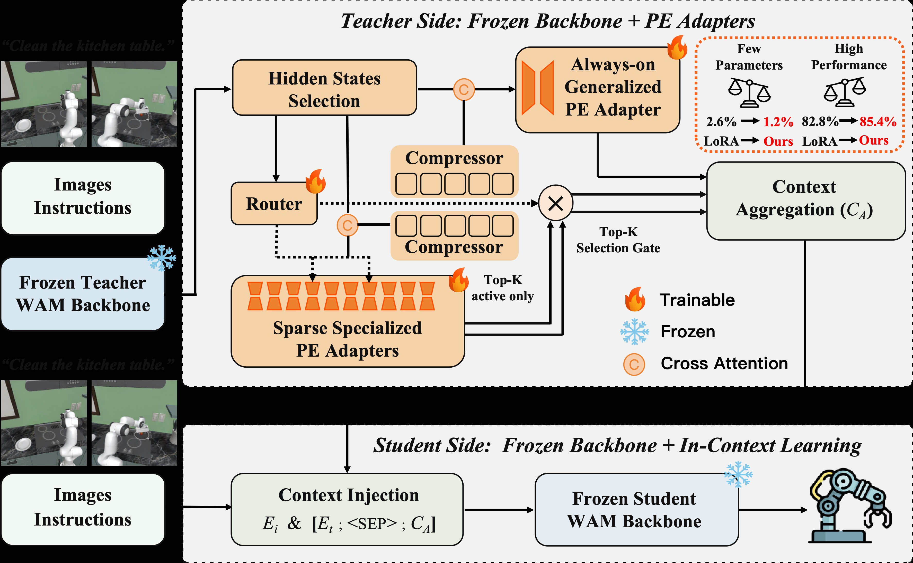
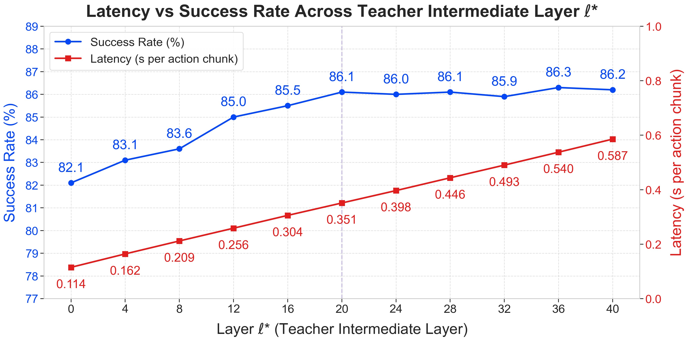
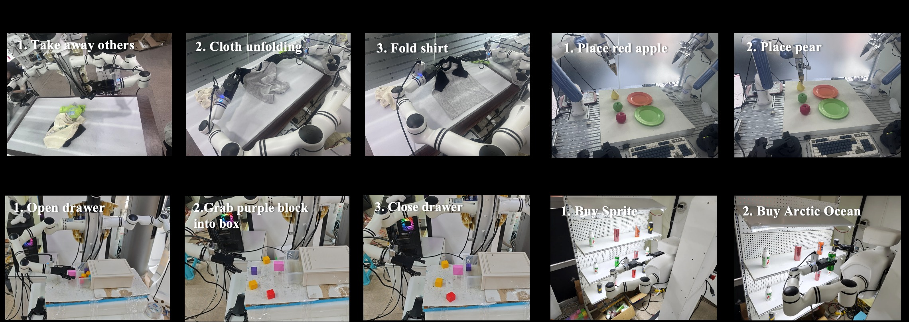
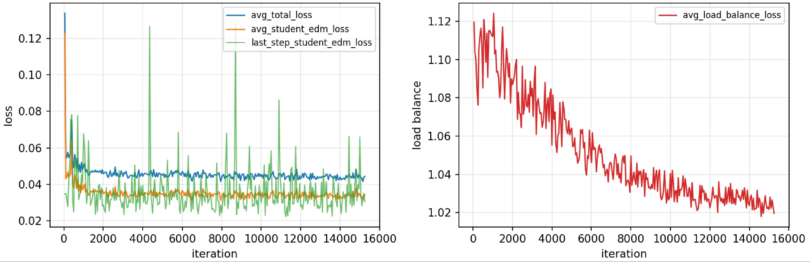
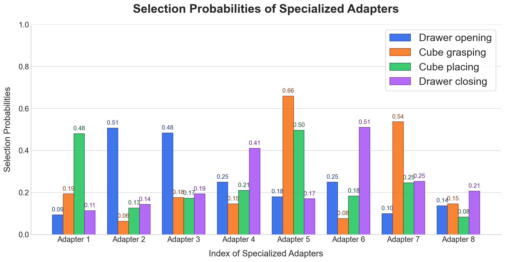

<!-- arxiv: 2605.06247 -->
<!-- venue: NeurIPS 2026（投稿中） -->
<!-- tags: WAM, VLA, 机器人, 知识蒸馏 -->

# CKT-WAM: Parameter-Efficient Context Knowledge Transfer Between World Action Models

> **论文信息**
> - 作者：Yuhua Jiang, Yijun Guo, Hongbing Yang, Guojun Lei, Nuo Chen, Yinuo Zhang, Shaoqiang Yan, Bo Lin, Feifei Gao, Biqing Qi
> - 通讯作者：Shaoqiang Yan, Bo Lin, Feifei Gao, Biqing Qi（加粗标注）
> - 单位：Tsinghua University（清华大学）, LivsynRobotics（灵波机器人）, Shanghai AI Laboratory（上海人工智能实验室）
> - 投稿方向：NeurIPS 2026（投稿中，under review）
> - arXiv ID：2605.06247
> - 代码：https://github.com/YuhuaJiang2002/CKT-WAM
> - 教师模型：DreamZero-14B（冻结），学生模型：Cosmos-Policy-2B（冻结）

---

## 一、核心问题

World Action Models（WAM）利用对未来视觉-动作的生成式建模来驱动具身控制，但不同 WAM 之间存在显著的**架构异构性**（latent 接口、token 设计、去噪 backbone 各不相同）。在实际部署中，往往有一个强大的大教师 WAM 和一个受延迟/内存限制的轻量学生 WAM。问题在于：

> **如何在两个异构的、已冻结的 WAM 之间高效地传递"世界知识"，而不依赖输出模仿或逐层隐藏状态对齐？**

传统知识蒸馏方案（logit 匹配、FitNet、attention transfer）要么要求教师和学生共享输出空间，要么需要逐层结构对齐，在跨 WAM 场景中难以适用。直接对教师或学生进行全量微调成本过高。本研究探索一种新的传递范式：**将教师知识压缩为紧凑的上下文 token，通过学生的原生条件注入通道注入，完全冻结两个 backbone**。

---

## 二、核心思路 / 方法

### 2.1 总体框架



*图1：CKT-WAM 整体架构。从教师 WAM 的选定中间层提取隐藏状态，经 CKT 模块转换后注入学生 WAM 的文本条件序列。*

**整体流程（图1）：**

1. **教师侧（左半部分）：** 给定观测图像和指令文本，冻结的教师 WAM 执行一次前向传播（固定 timestep $t^*=0$），从第 $\ell^*=20$ 层提取中间隐藏状态 $H_T \in \mathbb{R}^{B \times N \times d^{\text{tea}}}$（$d^{\text{tea}}=5120$）。
2. **CKT 模块（中间部分）：** 包含三个核心组件：
   - **共享投影瓶颈（Shared Projection）：** 将 $H_T$ 从 $d^{\text{tea}}=5120$ 映射到学生空间 $d^{\text{stu}}=2048$，经 GELU + LayerNorm + Dropout 得到 $Z \in \mathbb{R}^{B \times N \times 2048}$。
   - **LQCA 压缩器（Compressor）：** 通过两个可学习 query bank（$Q_g$ 用于通用分支、$Q_s$ 用于专用分支，各 $K=32$ 个 token）与 $Z$ 做 multi-head cross-attention，将 $N$ 个变长 token 压缩为固定 $K$ 个上下文 token。
   - **双分支适配器（Generalized + Specialized Adapters）：** 通用适配器（always-on）提供任务无关的稳定知识基础；$M=8$ 个专用适配器通过轻量路由器做 top-$k=2$ 稀疏激活，提供实例级自适应知识。
3. **学生侧（右半部分）：** 将压缩后的上下文 $C_A = [C_g; C_s] \in \mathbb{R}^{B \times (2K) \times 2048}$ 与可学习分隔符 `<SEP>` 拼接到学生原有的文本嵌入 $E_t$ 之后，形成 $\tilde{E}_t = [E_t; \langle\text{SEP}\rangle; C_A]$，通过 cross-attention 注入学生 DiT 的每一层。
4. **关键效率设计：** 教师仅在每个观测执行一次前向传播（$t^*=0$），产生的 $C_A$ 在学生的整个去噪轨迹中复用——教师不参与迭代去噪。

### 2.2 教师侧：中间层选择与单次提取

选择教师中间层 $\ell^*=20$（总共 40 层）而非最深层的理由：
- 中间层特征已经具备充分的语义结构和动作相关性
- 更深层的特征带有更强的任务特定偏置（task-specific bias），不利于泛化迁移
- 延迟与性能的 trade-off：$\ell^*=20$ 时成功率达 86.1%，更深层（$\ell^*=36$ 为 86.3%）收益递减但延迟线性增长

教师输入在 $t^*=0$（干净端点）进行编码，避免将 timestep 特定的噪声注入教师特征，保证表征的确定性和可复用性。

### 2.3 CKT 模块：压缩 + 双分支稀疏适配

**LQCA 压缩器（Learned-Query Cross-Attention）：**

将经共享瓶颈投影后的 $Z \in \mathbb{R}^{B \times N \times d^{\text{stu}}}$ 通过两个可学习 query bank 压缩：

$$C_*^{0} = \text{LN}\big(\text{MHCA}(\tilde{Q}_*, K_Z, V_Z) + \tilde{Q}_*\big), \quad * \in \{g, s\}$$

其中 $K_Z = Z W_K$, $V_Z = Z W_V$，$\tilde{Q}_*$ 是 batch 广播后的可学习 query。这种设计将 $N$ 个 token 的完整教师序列压缩为仅 $K_g$ 或 $K_s$ 个 query 条件化的 token，大幅降低下游传输成本。压缩器强制了一个信息瓶颈，仅提取任务相关信息。

**通用适配器（Always-on Generalized Adapter）：**

$$C_g = C_g^{0} + \phi\big(C_g^{0} W_{\text{down}}^{(g)}\big) W_{\text{up}}^{(g)}$$

对每个输入都激活，捕获任务无关的通用可迁移结构。采用 residual bottleneck 形式，bottleneck 维度 $r_g \ll d^{\text{stu}}$。

**专用适配器 + 稀疏路由（Routed Specialized Adapters）：**

维护 $M=8$ 个专用适配器 $\{\mathcal{E}_m\}_{m=1}^{M}$，每个结构相同但参数独立：

$$\mathcal{E}_m(C_s^{0}) = C_s^{0} + \phi\big(C_s^{0} W^{(m)}_{\text{down}}\big) W^{(m)}_{\text{up}}$$

路由器是一个两层 MLP（$5120 \to 512 \to 8$），以教师隐藏状态的平均池化 $h_r = \frac{1}{N}\sum_i H_T[:,i,:]$ 为输入，输出路由概率 $p = \text{softmax}(\phi(h_r W_1) W_2)$。对每个实例选取 top-$k=2$ 个适配器，重归一化权重后进行加权聚合：

$$C_s[b,:,:] = \sum_{m \in \mathcal{I}_b} \bar{p}_{b,m} \cdot \mathcal{E}_m(C_s^{0}[b,:,:])$$

**效率分析：** 总可训练参数 $P_{\text{train}} = P_{\text{sh}} + P_g + M \cdot P_e + P_r \approx 187.4\text{M}$，但每次前向仅激活 $P_{\text{active}} = P_{\text{sh}} + P_g + k \cdot P_e + P_r$——活跃计算量随 $k$ 而非 $M$ 增长。

### 2.4 学生侧：文本上下文注入

将 $C_A = [C_g; C_s]$ 与可学习的 `<SEP>` token 拼接到学生原始文本嵌入 $E_t$ 之后：

$$\tilde{E}_t = [E_t; \langle\text{SEP}\rangle; C_A] \in \mathbb{R}^{B \times (L_t + 2K + 1) \times d^{\text{stu}}}$$

增强后的条件序列通过 cross-attention 注入学生 DiT 的每一层：

$$Z_\tau^{(\ell+1)} = Z_\tau^{(\ell)} + \text{MHCA}\big(Q=Z_\tau^{(\ell)}, K=\tilde{E}_t W_K^{(\ell)}, V=\tilde{E}_t W_V^{(\ell)}\big)$$

**几何不变性保证：** 学生的 3D RoPE 仅应用于 visual self-attention，依赖于视觉 token 的时空索引，与条件长度 $\tilde{L}$ 无关。Cross-attention 不使用位置编码，因此扩展条件序列不改变视觉流的旋转几何。这意味着注入设计是**对冻结 backbone 的最小侵入**。

### 2.5 实现方式：前向 Hook

整个注入通过单个 forward hook 实现，注册在学生 text_embedding 模块上：

```python
def _inject_context_hook(module, input, output):
    # output = E_t, 原始文本嵌入
    return torch.cat([output, sep_token, C_A], dim=1)
```

- **零侵入：** 不修改学生 DiT 源码
- **参数隔离：** 梯度仅通过 $C_A$ 回流到 CKT 模块
- **跨步复用：** 教师 + CKT 模块每观测仅评估一次，$C_A$ 缓存后供所有去噪步使用

---

## 三、训练目标

训练时两个 WAM backbone 完全冻结，仅优化 CKT 模块的 187.4M 参数（占总参数 16B 的 1.17%）。

### 3.1 主目标：学生原生 EDM 去噪损失

沿用学生 WAM 的 diffusion 风格 latent objective，同时监督未来视频和未来动作：

$$\mathcal{L}_{\text{act}} = \frac{1}{B}\sum_{b=1}^{B}\sum_{t=1}^{T_a} m^{a}_{b,t} \cdot \omega(\sigma_b) \|\hat{a}_{0,b,t} - a_{0,b,t}\|_2^2$$

$$\mathcal{L}_{\text{vid}} = \frac{1}{B}\sum_{b=1}^{B}\sum_{t=1}^{T_v} m^{v}_{b,t} \cdot \omega(\sigma_b) \|\hat{v}_{0,b,t} - v_{0,b,t}\|_2^2$$

噪声水平从 log-normal 分布采样：$\ln(\sigma) \sim \mathcal{N}(1.39, 1.2^2)$。视频和动作使用相同的 $\sigma_b$ 以保证 corruption 水平一致。

### 3.2 辅助目标：负载均衡损失

防止路由器坍塌到少数适配器：

$$\mathcal{L}_{\text{bal}} = M \sum_{m=1}^{M} f_m P_m$$

其中 $P_m = \frac{1}{B}\sum_b p_{b,m}$ 是 batch 平均路由概率，$f_m = \frac{1}{kB}\sum_b \mathbb{I}\{m \in \mathcal{I}_b\}$ 是 top-$k$ 选择频率。当路由完全均匀时 $\mathcal{L}_{\text{bal}} = 1$。

### 3.3 总损失

$$\mathcal{L} = \mathcal{L}_{\text{act}} + \lambda_{\text{vid}}\mathcal{L}_{\text{vid}} + \lambda_{\text{bal}}\mathcal{L}_{\text{bal}}$$

其中 $\lambda_{\text{vid}} = 1$, $\lambda_{\text{bal}} = 0.01$。

---

## 四、实验与结果

### 4.1 LIBERO-Plus 零样本泛化

LIBERO-Plus 在 LIBERO 四套训练集上训练，在七个 OOD 维度（Camera / Robot / Language / Light / Background / Noise / Layout）上零样本评估。

CKT-WAM 取得 **86.1% 总成功率**，全面超越所有对比方法：

| 方法 | Camera | Robot | Language | Light | Background | Noise | Layout | **Total** |
|------|--------|-------|----------|-------|------------|-------|--------|-----------|
| OpenVLA | 0.8 | 3.5 | 23.0 | 8.1 | 34.8 | 15.2 | 28.5 | 15.6 |
| $\pi_{0.5}$ | 75.4 | 77.5 | 85.6 | 96.9 | 94.6 | 89.7 | 85.7 | 85.7 |
| Cosmos-Policy | 75.8 | 63.3 | 81.7 | 96.5 | 88.9 | 92.7 | 82.2 | 82.2 |
| GE-Act | 60.7 | 77.0 | 77.4 | 95.8 | 86.0 | 90.9 | 80.2 | 80.3 |
| **CKT-WAM** | **77.4** | 71.4 | **86.7** | **98.2** | 90.2 | **94.8** | **88.5** | **86.1** |

关键观察：
- CKT-WAM 在 Camera (+1.6)、Language (+5.0)、Light (+1.7)、Noise (+2.1)、Layout (+6.3) 五个维度上超越学生 WAM 的原始性能（Cosmos-Policy 82.2%），说明教师知识迁移有效增强了语义理解和场景泛化
- 相比最强的 VLA 基线 $\pi_{0.5}$（85.7%），CKT-WAM 的领先主要体现在 Language、Light、Noise、Layout 等语义和场景级分布偏移上
- Robot 维度（71.4%）弱于 $\pi_{0.5}$（77.5%）和 X-VLA（89.7%），这是未来的改进方向

### 4.2 PEFT 方法对比（核心消融）

为了隔离知识迁移机制本身的贡献，将所有 PEFT 基线统一为相同接口（教师 $\ell^*$ 层 → MLP 投影 → 拼接到学生文本输入），仅改变适配器类型：

| 方法 | 可训练参数比 | Camera | Robot | Language | Light | Background | Noise | Layout | **Total** |
|------|-------------|--------|-------|----------|-------|------------|-------|--------|-----------|
| Full Fine-tuning | 100% | 77.6 | 71.2 | **87.5** | 97.1 | **91.0** | **95.7** | 88.3 | **86.3** |
| LoRA | 2.59% | 76.1 | 67.9 | 81.6 | 95.9 | 88.1 | 90.4 | 84.7 | 82.8 |
| PiSSA | 2.04% | 75.2 | 68.5 | 84.2 | 96.1 | 88.4 | 90.6 | 85.1 | 83.3 |
| DoRA | 2.06% | 76.4 | 67.8 | 84.7 | 96.4 | 88.7 | 90.8 | 85.4 | 83.6 |
| MiLoRA | 1.73% | 73.9 | 71.2 | 85.3 | 96.8 | 89.0 | 91.0 | 85.9 | 84.0 |
| Mona | 1.65% | **79.2** | 70.6 | 84.1 | 97.0 | 89.3 | 91.1 | 86.2 | 84.7 |
| AdaMoLE | 1.69% | 76.0 | 70.9 | 85.4 | 97.3 | 89.6 | 91.3 | 86.7 | 84.6 |
| GOAT | 1.77% | 75.0 | 71.0 | 86.1 | 97.7 | 89.9 | 91.6 | 87.4 | 84.8 |
| **CKT-WAM** | **1.17%** | 77.4 | **71.4** | 86.7 | **98.2** | 90.2 | 94.8 | **88.5** | 86.1 |

**核心发现：** CKT-WAM 以最低的可训练参数比（1.17%）达到接近全量微调的性能（86.1% vs 86.3%），且在 Robot、Light、Layout 三个维度上超越了全量微调。这证明收益来自**更有效的知识迁移机制**，而非更大的适配容量。

### 4.3 消融实验

| 配置 | Camera | Robot | Language | Light | Background | Noise | Layout | **Total** |
|------|--------|-------|----------|-------|------------|-------|--------|-----------|
| w.o. Context（纯 Cosmos-Policy） | 75.8 | 63.3 | 81.7 | 96.5 | 88.9 | 92.7 | 82.2 | 82.2 |
| w.o. Generalized Adapter | 73.5 | 70.8 | 82.4 | 96.7 | 86.1 | 89.4 | 86.9 | 83.0 |
| w.o. Specialized Adapters | 72.8 | 68.1 | 82.3 | 97.0 | 88.7 | 90.6 | 85.7 | 82.7 |
| w.o. Auxiliary Loss | 75.0 | 70.9 | 83.6 | 97.6 | 86.9 | 92.2 | 86.9 | 84.1 |
| **CKT-WAM（完整）** | **77.4** | **71.4** | **86.7** | **98.2** | **90.2** | **94.8** | **88.5** | **86.1** |

- **移除专用适配器**造成最大退化（82.7%，-3.4），说明实例级自适应对多样化的分布偏移至关重要
- **移除通用适配器**也导致明显下降（83.0%，-3.1），表明共享的稳定知识基础同样不可或缺
- **移除辅助损失**影响最小（84.1%，-2.0），说明其主要作用是正则化路由稳定性，主体收益来自双分支联合使用

### 4.4 中间层选择消融



*图2：中间层 $\ell^*$ 的消融。左 y 轴为 LIBERO-Plus 零样本成功率（蓝色曲线），右 y 轴为每个 action chunk 的推理延迟（红色曲线），单位秒。x 轴为从 0 到 40 层的 $\ell^*$。*

**子图解读：**

- **蓝色曲线（成功率）：** 从 $\ell^*=0$ 时的 82.1% 单调上升至 $\ell^*=20$ 时的 86.1%，此后进入平台期（$\ell^*=36$ 仅达到 86.3%，提升仅 0.2%）。浅层特征（0-8 层）主要是低级感知特征，不足以支持有效的动作迁移；中间层（12-20 层）提供丰富的语义和动作相关表征；深层（24-40 层）带来边际收益递减。
- **红色曲线（延迟）：** 从 $\ell^*=0$ 时的 0.114s 线性增长至 $\ell^*=40$ 时的 0.587s。每增加一层约增加 12ms 延迟，因为需要更多的前向计算。
- **最优选择 $\ell^*=20$：** 在性能平台期的起点，以 0.351s 的适度延迟达到接近最优的 86.1% 成功率。这一选择验证了"中间层特征提供最佳 cost-utility trade-off"的设计动机。

### 4.5 LIBERO 标准 Benchmark

| 方法 | Spatial | Object | Goal | Long | Average |
|------|---------|--------|------|------|---------|
| $\pi_{0.5}$ | 98.8 | 98.2 | 98.0 | 92.4 | 96.9 |
| OpenVLA-OFT | 97.6 | 98.4 | 97.9 | 94.5 | 97.1 |
| Cosmos Policy | 98.1 | **100.0** | 98.2 | 97.6 | 98.5 |
| **CKT-WAM** | **99.0** | 99.8 | **98.6** | **97.8** | **98.8** |

在已高度饱和的 LIBERO 标准 benchmark 上，CKT-WAM 仍取得一致的改进（+0.3 平均 SR）。Long 套件上的提升（+0.2）说明跨模型知识迁移对长时序操作任务特别有益。

### 4.6 真机实验：长程多步操作



*图3：四项真机长程任务。从左到右：(1) 衣物折叠——移除干扰衣物、展开目标衣物、折叠；(2) 水果分拣——将红苹果和梨放到指定盘子；(3) 方块收纳——打开抽屉、放入紫色方块、关闭抽屉；(4) 无人零售——从杂乱货架中挑选目标饮料。所有任务都需要完成多个有序子目标。*

| 方法 | 衣物折叠 | 水果分拣 | 方块收纳 | 无人零售 | **平均** |
|------|---------|---------|---------|---------|----------|
| $\pi_{0.5}$ | **77.8** | 84.4 | 80.0 | 77.8 | 80.0 |
| Cosmos Policy | 62.2 | 77.8 | 68.9 | 71.1 | 70.0 |
| Fast-WAM | 66.7 | 75.6 | 73.3 | 66.7 | 70.6 |
| **CKT-WAM** | 73.3 | **88.9** | **86.7** | **84.4** | **83.3** |

每项任务 45 次真机试验。CKT-WAM 在水果分拣（+4.5）、方块收纳（+6.7）、无人零售（+6.6）三项任务上超越所有基线，仅在最具挑战性的衣物折叠（涉及可变形物体）上稍逊于 $\pi_{0.5}$。平均成功率 83.3% 展现了在真实长程操作场景下的稳定优势。

### 4.7 训练动态



*图4：CKT-WAM 的训练动态曲线。左图展示总损失（绿色）、平均学生 EDM 损失（橙色）和最后一步学生 EDM 损失（蓝色）的优化轨迹；右图展示负载均衡损失 $\mathcal{L}_{\text{bal}}$ 的变化轨迹。*

**左图（主损失曲线）：**
- 总损失和平均学生 EDM 损失在训练初期快速下降，随后进入稳定平台期——说明辅助均衡项没有破坏主目标的优化
- 最后一步学生 EDM 损失方差明显更大（蓝色曲线波动剧烈），这是预期的，因为单步损失对 minibatch 变化和 timestep 相关难度高度敏感。关键的是，其整体量级保持稳定、无漂移趋势

**右图（负载均衡损失曲线）：**
- $\mathcal{L}_{\text{bal}}$ 从训练初期的约 1.12 稳定下降至收敛时的约 1.02
- 在完全均匀路由下 $\mathcal{L}_{\text{bal}} = 1$，最终值接近 1.0 说明路由器已接近均匀运行状态，同时保留了足够的灵活性进行输入自适应
- 均衡项作为温和的辅助约束而非主导优化——这正是期望的行为

### 4.8 专用适配器的阶段性选择模式



*图5：方块收纳（cube catching）任务中 8 个专用适配器在四个阶段的平均选择概率。从 120 条完整轨迹中采样统计。x 轴为适配器编号 1-8，y 轴为平均选择概率。*

**逐阶段分析：**

- **阶段 1——打开抽屉（Drawer Opening）：** 概率集中在 Adapter 2（~0.35）和 Adapter 3（~0.30），其余适配器概率极低（< 0.10）。这说明"打开抽屉"这一子技能主要由 2 号（主要）和 3 号适配器处理。
- **阶段 2——抓取方块（Cube Grasping）：** 概率分布剧烈变化，Adapter 5（~0.45）和 Adapter 7（~0.30）主导。适配器的激活从"操作抽屉"模式切换为"抓取物体"模式。
- **阶段 3——放置方块（Cube Placing）：** Adapter 5（~0.35）保持活跃，但 Adapter 1（~0.30）上升到第二位。说明"放置"与"抓取"共享部分技能（Adapter 5），但也需要不同的专用知识（Adapter 1）。
- **阶段 4——关闭抽屉（Drawer Closing）：** 再次切换到全新组合：Adapter 6（~0.40）和 Adapter 4（~0.25）主导。关闭动作激活了与打开动作不同的适配器集合（6/4 vs 2/3），表明路由学到了操作方向的语义差异。

**核心洞察：** 专用适配器的激活随操作子阶段动态变化，而非静态绑定到整个任务。每个阶段仅激活 1-2 个主导适配器，验证了 route-first 稀疏设计的有效性——仅需小量专家即可覆盖每个阶段的控制需求。

---

## 五、关键洞察与技术亮点

1. **"上下文传递"范式：** 传统知识蒸馏要求输出或隐藏状态对齐，CKT-WAM 提出通过紧凑的上下文 token 传递知识——这是一种对异构架构天然友好的新范式。教师提供的是"可消费的上下文"而非"需模仿的输出"。

2. **双分支解耦设计：** 通用适配器（always-on）+ 专用适配器（稀疏路由）的设计将"稳定知识基础"和"实例级自适应"解耦。消融实验证明两者不可或缺。

3. **中间层选取的策略性：** $\ell^*=20$ 的选择基于明确的 cost-utility trade-off 分析——中间层特征既足够语义丰富又避免了深层任务偏置。性能平台期恰好从 $\ell^*=20$ 开始，提供了最优性价比。

4. **几何不变的注入设计：** 通过 cross-attention（而非 self-attention）注入上下文，配合无位置编码的条件侧，保证了学生 backbone 的 3D RoPE 几何完全不变。这是对冻结模型"最小侵入"设计的一个很好的示范。

5. **单次教师评估 + 跨步复用：** 教师仅在 $t^*=0$ 执行一次前向，$C_A$ 跨所有去噪步缓存复用。这使教师推理开销从 $\mathcal{O}(\text{denoising steps})$ 降为 $\mathcal{O}(1)$。

6. **稀疏 MoE 路由的细粒度专业化：** 即使在单一任务（方块收纳）内部，不同子阶段激活的适配器也完全不同。路由学到的不是"任务级"而是"技能级"的专业化。

---

## 六、代码实现解读

CKT-WAM 的代码结构清晰，核心实现集中在三个文件中。

### 6.1 整体架构与数据流

```
┌─────────────────────────────────────────────────────────────────────┐
│                        CKTPipelineMiddle                           │
│                                                                     │
│  ┌──────────────────────┐     ┌──────────────────────┐             │
│  │ TeacherMiddleLayer   │     │     AdapterBank      │             │
│  │ FeatureExtractor     │     │                      │             │
│  │                      │     │  ┌────────────────┐  │             │
│  │  DreamZero-14B       │     │  │ Shared Project. │  │             │
│  │  (frozen, 40 layers) │     │  │  5120→512→2048  │  │             │
│  │         │            │     │  └───────┬────────┘  │             │
│  │  forward hook on     │ H_T │          │ Z          │             │
│  │  layer l*=20 ────────┼─────┼─────────►│            │             │
│  │                      │     │  ┌───────┴────────┐  │             │
│  │  t*=0, single-pass   │     │  │  LQCA Compress  │  │             │
│  └──────────────────────┘     │  │  Q_g(32 tok)    │  │             │
│                               │  │  Q_s(32 tok)    │  │             │
│                               │  └───┬─────────┬──┘  │             │
│                               │      │ C_g⁰    │ C_s⁰ │             │
│                               │  ┌───┴───┐ ┌───┴──────┴──────┐    │
│                               │  │ Gen.  │ │ M=8 Specialized │    │
│                               │  │ Adap. │ │  Adapters +     │    │
│                               │  │always │ │  Router(top-2)  │    │
│                               │  │  on   │ │                 │    │
│                               │  └───┬───┘ └───────┬────────┘    │
│                               │      │ C_g         │ C_s         │
│                               │  └───┴─────────────┴──────────┐  │
│                               │  │  C_A = [C_g; C_s]          │  │
│                               │  │  [B, 64, 2048]             │  │
│                               │  └─────────────┬──────────────┘  │
│                               │                │                 │
│                               │  <SEP> token   │                 │
│                               └────────────────┼─────────────────┘
│                                                │ C_A + <SEP>
│  ┌─────────────────────────────────────────────┴───────────────┐ │
│  │           Student WAM: Cosmos-Policy-2B (frozen)            │ │
│  │                                                             │ │
│  │  text_embedding ──► forward hook injects:                   │ │
│  │    E_t ───────────► Ẽ_t = [E_t; <SEP>; C_A]                │ │
│  │                          │                                  │ │
│  │                          ▼                                  │ │
│  │  ┌──────────────────────────────────────────────────┐      │ │
│  │  │  DiT Block ℓ (×L_stu layers):                    │      │ │
│  │  │    SelfAttn(visual tokens, 3D RoPE)               │      │ │
│  │  │    → CrossAttn(Q=visual, K=V=Ẽ_t)  ◄── injection  │      │ │
│  │  │    → FFN + AdaLN                                  │      │ │
│  │  └──────────────────────────────────────────────────┘      │ │
│  │                          │                                  │ │
│  │                          ▼                                  │ │
│  │                   Predicted actions                         │ │
│  └─────────────────────────────────────────────────────────────┘ │
└─────────────────────────────────────────────────────────────────────┘
```

### 6.2 关键模块映射

**论文公式 → 代码函数：**

| 论文内容 | 代码位置 | 说明 |
|---------|---------|------|
| 共享投影瓶颈（Eq.3） | `Adapter.__init__`: `down_proj`, `up_proj`, `layer_norm` | `Linear(5120→512)` + GELU + `Linear(512→2048)` + LayerNorm + Dropout |
| LQCA 压缩（Eq.5） | `Adapter.forward()`: `cross_attn(query=queries, key=h, value=h)` | 可学习 `query_tokens` 与投影后的 $Z$ 做 8-head cross-attention |
| 通用适配器（Eq.6） | `AdapterBank.__init__`: `generalized_adapter` | 一个单独的 `Adapter` 实例，对每个输入都激活 |
| 专用适配器（Eq.7） | `AdapterBank.__init__`: `specialized_adapters` | `ModuleList` 包含 $M=8$ 个 `Adapter` 实例 |
| 路由门控（Eq.8） | `DynamicRouter.forward()` | 两层 MLP: `Linear(5120→512)` + GELU + `Linear(512→8)`, 训练时加可学习噪声, softmax + top-k |
| 稀疏聚合（Eq.9） | `AdapterBank.forward()`: `torch.gather` + 加权求和 | 选出 top-k 适配器输出，用重归一化权重加权求和 |
| 上下文拼接（Eq.10-11） | `CKTPipelineMiddle._inject_context_hook()` | `torch.cat([output, sep, C_A], dim=1)` 在 forward hook 中完成 |
| 负载均衡损失（Eq.14） | `LoadBalancingLoss.forward()` | $M \cdot \sum_m f_m P_m$，其中 $f_m$ 通过 `scatter_add_` 统计 top-1 频率 |

### 6.3 训练流程

```
训练迭代（per step）:

  1. data_batch 包含两部分:
     ├── student-side: video, t5_text_embeddings, actions, proprio, ...
     └── teacher-side: teacher_images, teacher_text, teacher_action, ...

  2. TeacherMiddleLayerFeatureExtractor.forward():
     ├── 执行教师完整前向（t*=0, gradient_checkpointing=True）
     ├── forward hook 在 block[20] 捕获输出 → H_T [B, N, 5120]
     └── 所有教师参数 requires_grad=False

  3. AdapterBank.forward(H_T):
     ├── generalized_adapter: H_T → C_g [B, 32, 2048]
     ├── specialized_adapters: H_T → C_s¹...C_s⁸ [B, 8, 32, 2048]
     ├── router(h_pooled): → top_k_weights [B, 2], top_k_indices [B, 2]
     └── sparse aggregation → C_A [B, 64, 2048]

  4. 注入 hook:
     text_embedding输出 E_t → torch.cat([E_t, <SEP>, C_A]) → Ẽ_t

  5. Student.training_step(data_batch):
     去噪预测 â₀, v̂₀, 计算 L_act + L_vid

  6. CKTLoss:
     total = L_student + 0.01 * L_bal

  7. backward + AdamW step:
     ├── adapter_bank 参数: lr=3e-4
     └── 其他可训练参数: lr=1e-4
```

### 6.4 推理流程

```
推理（per observation）:

  1. 教师单次前向（t*=0）→ H_T [B, N, 5120]
  2. AdapterBank(H_T) → C_A [B, 64, 2048]  ← 缓存！
  3. 学生文本嵌入 + hook注入 → Ẽ_t = [E_t; <SEP>; C_A]

  4. for denoising_step in range(num_steps):  ← C_A 跨步复用
       ├── CFG分支 (conditional + unconditional)
       │   └── 每层DiT: SelfAttn(3D RoPE) → CrossAttn(Q=visual, K=V=Ẽ_t) → FFN
       └── 去噪迭代

  5. 输出去噪后的动作 chunk
```

---

## 七、局限性

1. **应用范围限于 WAM-to-WAM：** 当前仅验证了具身控制场景下的 WAM 间知识迁移，未探索是否能泛化到更广泛的多模态场景（文本建模、VQA 等）。作者认为这是范围选择而非方法本身的根本限制，因为 CKT-WAM 的核心设计（压缩教师中间表征为可迁移上下文 + 轻量条件注入）并不固有地绑定于机器人学。

2. **Robot 维度仍弱于个别专用方法：** 在 LIBERO-Plus 的 Robot OOD 维度上，CKT-WAM（71.4%）不如 X-VLA（89.7%）和 $\pi_{0.5}$（77.5%），说明在 embodiment 变化下的泛化仍有提升空间。

3. **衣物折叠仍具挑战：** 在真机实验中，最具挑战性的可变形物体操作任务（衣物折叠，73.3%）仍弱于 $\pi_{0.5}$（77.8%），表明长程 deformable object manipulation 仍是开放难题。

4. **依赖于教师中间层质量：** 方法假设教师中间层特征已包含足够的动作相关信息，如果教师架构差异过大（如非 DiT 结构），hook 机制可能需要重新设计。

---

## 八、关键概念速查

| 概念 | 简要说明 |
|------|---------|
| **CKT（Context Knowledge Transfer）** | 通过紧凑上下文 token 而非输出模仿或隐藏状态对齐来传递知识 |
| **LQCA（Learned-Query Cross-Attention）** | 使用可学习 query bank 通过 cross-attention 将变长教师序列压缩为固定长度上下文 |
| **Generalized Adapter** | Always-on 的通用适配器，捕获任务无关的可迁移结构 |
| **Specialized Adapters** | $M$ 个稀疏激活的专用适配器（top-$k$ 路由），提供实例级自适应 |
| **Route-first Sparse Execution** | 先计算路由分数，仅执行选中的适配器（$k \ll M$），活跃计算量不随 $M$ 线性增长 |
| **Single-pass Teacher Extraction** | 教师在 $t^*=0$ 执行单次前向，$C_A$ 跨学生所有去噪步复用 |
| **Load Balancing Loss** | $\mathcal{L}_{\text{bal}} = M \sum_m f_m P_m$，防止 MoE 路由器坍塌 |
| **3D RoPE Invariance** | 上下文注入仅通过 cross-attention（无位置编码），保留学生视觉流旋转几何不变 |
| **Forward Hook Injection** | 通过 PyTorch forward hook 注入 $C_A$，零侵入学生 backbone 源码 |
| **教师层 $\ell^*=20$** | DreamZero-14B 共 40 层，选择中间层作为 cost-utility 最优 trade-off |
| **参数效率** | 仅训练 187.4M / 16B ≈ 1.17%，逼近全量微调性能 |
