<!-- arxiv: 2602.15922 -->
<!-- venue: NVIDIA Tech Report 2026 -->
<!-- tags: WAM, 世界模型, 视频生成, 泛化 -->

# DreamZero: World Action Models are Zero-shot Policies

> **论文信息**
> - 作者：Seonghyeon Ye, Yunhao Ge, Kaiyuan Zheng, Shenyuan Gao, Sihyun Yu, ..., Joel Jang（NVIDIA GEAR Lab, 共 39 位作者）
> - 通讯作者/项目负责人：Seonghyeon Ye, Yuke Zhu, Linxi "Jim" Fan, Joel Jang
> - 投稿方向：NVIDIA Tech Report（arXiv 2602.15922, 2026 年 2 月）
> - 代码：https://github.com/dreamzero0/dreamzero（Apache 2.0 开源）
> - 模型规模：14B 参数，基于 Wan2.1-I2V-14B-480P 视频扩散 backbone

---

## 一、核心问题

当前最强的 Vision-Language-Action（VLA）模型在语义级泛化（例如识别未见过的物体）方面表现出色，但在两类关键泛化能力上存在根本性短板：

1. **环境泛化（Environment Generalization）**：将已知任务换到新环境执行时性能骤降
2. **技能/动作泛化（Skill/Motion Generalization）**：面对训练数据中从未出现的新动作（如"解鞋带""熨衣服"）完全失败

根本原因在于：**VLA 从 VLM 继承的是"知道做什么"（语义先验），但缺乏"知道怎么做"的物理先验**——即对几何结构、动力学和运动控制的精确空间理解。

> VLA priors encode *what* to do at a semantic level, but lack representations of *how* actions should be executed with precise spatial awareness.

此外，传统 VLA 训练通常依赖每个任务的大量重复演示（repetitive demonstrations），难以有效利用异构、非重复的多样机器人数据。

---

## 二、核心思路 / 方法

### 2.1 World Action Model (WAM) 概念

DreamZero 提出了 **World Action Model（WAM）** 这一概念：基于预训练视频扩散模型，**同时预测未来的视频帧和对应的机器人动作**。核心直觉是：

- 视频扩散模型在互联网规模数据上预训练，已经内化了丰富的时空物理先验
- 通过联合建模视频和动作，将"action learning"从稠密的状态-动作模仿问题转化为**逆动力学（inverse dynamics）问题**——即学习从预测的视觉未来中提取可执行的动作
- 这一转化使得模型可以从异构、非重复的多样数据中高效学习


*图1：DreamZero 总览。通过联合预测视频和动作，WAM 获得四个核心能力：(1) 从多样、非重复数据中高效学习，(2) 开放世界泛化，(3) 仅用视频数据的跨具身学习，(4) 对新机器人的 few-shot 适应。*

### 2.2 问题形式化

DreamZero 将问题形式化为联合预测问题：

$$P(\mathbf{o}_{l:l+H}, \mathbf{a}_{l:l+H} \mid \mathbf{o}_{0:l}, \mathbf{c}, \mathbf{q}_l) = P(\mathbf{o}_{l:l+H} \mid \mathbf{o}_{0:l}, \mathbf{c}, \mathbf{q}_l) \cdot P(\mathbf{a}_{l:l+H} \mid \mathbf{o}_{0:l+H}, \mathbf{q}_l)$$

其中：
- $\mathbf{o}$ 为视频观测，$\mathbf{a}$ 为动作，$\mathbf{c}$ 为语言指令，$\mathbf{q}$ 为本体感知状态
- 右侧第一项是视频预测，第二项是逆动力学模型（IDM）

与传统方法不同，DreamZero 使用单一模型端到端地联合学习这两部分，而不是用两个独立模型分别建模。

### 2.3 模型架构

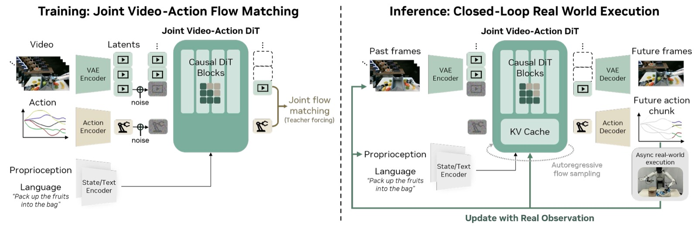

*图2：DreamZero 模型架构。模型接受三类输入：视觉上下文（经 VAE 编码）、语言指令（经 Text Encoder）、以及本体感知状态（经 State Encoder）。这些输入由自回归 DiT backbone 通过 Flow Matching 处理，分别经由 Video Decoder 和 Action Decoder 输出预测的未来视频帧和动作。训练时（左），对每个 chunk 基于干净视频上下文对加噪的视频和动作 latent 进行去噪。推理时（右），动作异步在真实世界执行，真实观测替换 KV cache 中的预测帧以防止误差累积。*

架构要点：

**1. 自回归（AR）架构**
- 以 chunk 为单位自回归生成：每个 chunk 包含 $K$ 个 latent 帧（$K=2$），对应固定的动作 horizon
- AR 架构的优势：(a) 通过 KV-cache 实现更快推理，(b) 可利用视觉观测历史做引导，(c) 保留原生帧率，确保视频-动作的精确对齐
- 双向模型需要子采样视频来匹配语言标注间隔，会扭曲原生 FPS，破坏视频-动作对齐

**2. 注意力机制（Attention Mask）**

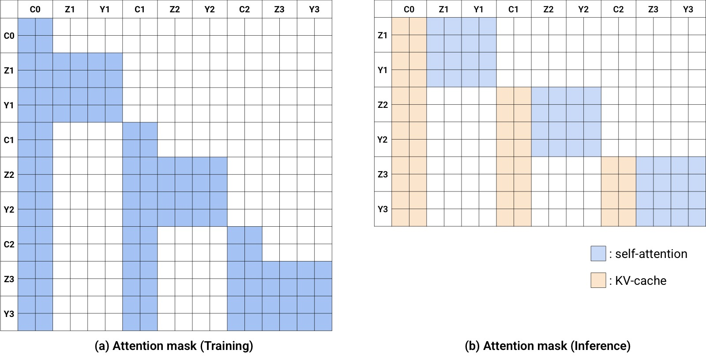

*图3：DreamZero 注意力策略。(a) 训练的 QKV Self-Attention mask：Y 轴为 Query(Q)，X 轴为 Key/Value(KV)。给定条件帧 (C0, C1, C2)，模型预测后续帧 (Z1, Z2, Z3) 和动作 (Y1, Y2, Y3) 的速度。每个 noisy chunk 可关注前序干净 chunk 的上下文。(b) 推理时，先计算条件帧的 KV-cache，然后拼接后预测动作和帧。例如 Y3（动作）关注 C0, C1, C2，利用视觉历史来预测当前动作。关键设计：推理时 C0, C1, C2 被替换为真实观测。*

**3. Flow Matching 训练目标**

采用 Flow Matching 作为训练目标，视频和动作共享相同的去噪时间步（基础版本）：

$$\mathcal{L}(\theta) = \mathbb{E}\Bigg[\frac{1}{K} \sum_{k=1}^{K} w(t_k) \lVert \mathbf{u}_{\theta}([\mathbf{z}_{t_k}^{k}, \mathbf{a}_{t_k}^{k}];\mathcal{C}_{k}, \mathbf{c}, \mathbf{q}_{k}, t_{k}) - \mathbf{v}^{k} \rVert^2\Bigg]$$

其中速度目标 $\mathbf{v}^{k} \coloneqq [\mathbf{z}_{1}^{k}, \mathbf{a}_{1}^{k}] - [\mathbf{z}_{0}^{k}, \mathbf{a}_{0}^{k}]$。

**4. 推理时的闭环设计（关键创新）**

推理的核心优势是**用真实观测替换 KV cache 中的预测帧**：
- 推理时异步执行：模型推断和动作执行解耦
- 执行完一个 action chunk 后，将真实世界观测编码后注入 KV cache，**丢弃预测的视频 latent**
- 这从根本上消除了自回归视频生成的累积误差问题——这是 WAM 独有的优势

**5. 自回归 vs 双向架构对比**

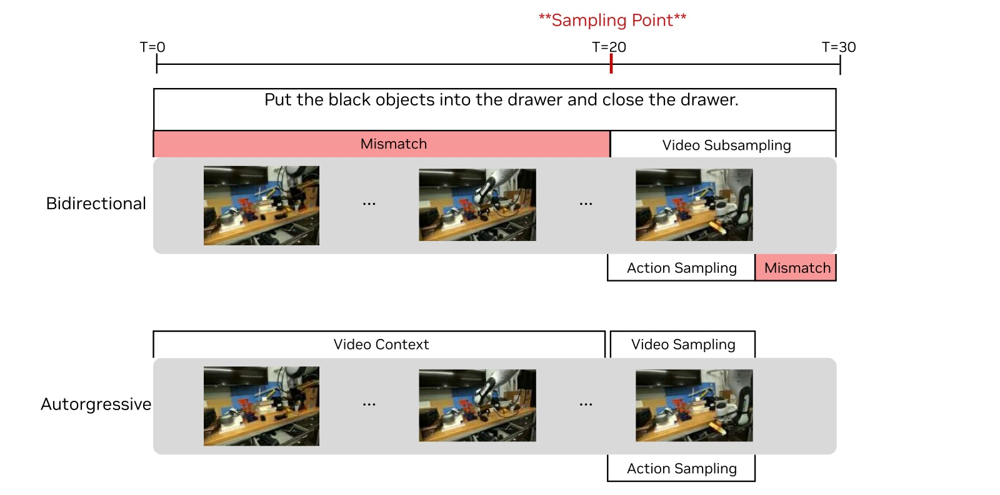

*图4：双向 vs 自回归 WAM。当采样点落在任务中间（T=20），双向 WAM 必须对视频进行子采样来匹配语言标注间隔，扭曲了原生 FPS 并破坏视频-动作对齐。自回归 WAM 通过条件化视频上下文而非子采样，避免了这种权衡。蓝色高亮帧为预测目标，灰色帧为上下文。*

### 2.4 实时推理优化（38x 加速）

14B 视频扩散模型在单 GPU 上无优化时，每次动作推断需约 5.7 秒，无法用于闭环控制。DreamZero 引入三层优化：

**系统级优化：**
- **CFG 并行**：将有条件/无条件两个前向传播分布到两块 GPU，减少 47% 步骤延迟
- **DiT Caching**：利用 Flow Matching 速度向量的方向一致性，当连续速度预测的余弦相似度超过阈值时重用缓存速度，将有效 DiT 步数从 16 步降至 4 步

**实现级优化：**
- **Torch Compile + CUDA Graphs**：对五个组件（DiT、scheduler、text encoder、image encoder、VAE）编译
- **NVFP4 量化**：在 Blackwell 架构上将权重和激活量化为 4-bit，敏感操作（QKV、Softmax）保留 FP8
- **cuDNN attention kernels + GPU scheduler**

**模型级优化 —— DreamZero-Flash：**

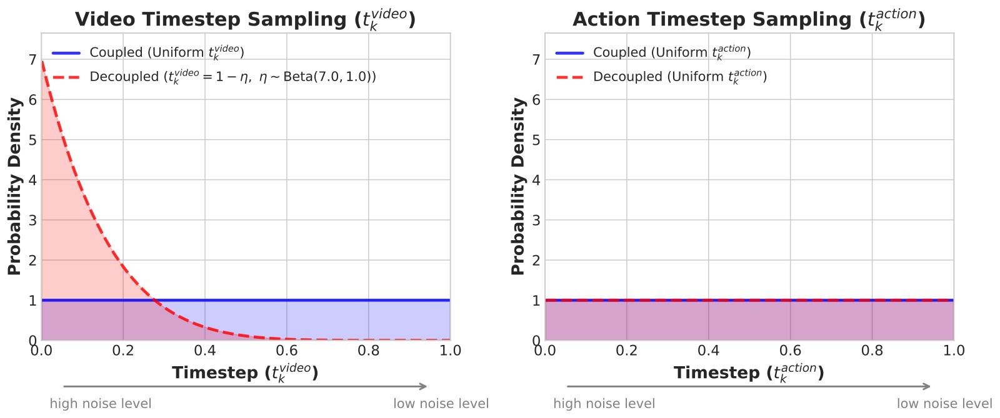

*图5：解耦噪声调度。标准 DreamZero（蓝色）使用耦合噪声分布（视频和动作都是 uniform 分布）。DreamZero-Flash（红色）将视频时间步偏向高噪声状态（Beta(7,1) 分布，均值 = 0.125），动作保持 uniform，训练模型在高噪声视觉上下文下预测干净动作，使训练和少步推理的分布对齐。*

核心洞察：标准训练时视频和动作在同一噪声水平，但少步推理时动作需要在视频仍 noisy 时去噪到干净值——存在 train-test mismatch。DreamZero-Flash 通过训练时偏向视频噪声（Beta(7,1)）来解决，使单步去噪（150ms）达到 4 步去噪的 90% 性能。

**累计加速效果：**

| 优化类别 | H100 | GB200 |
|---------|------|-------|
| Baseline | 1x | 1.1x |
| + CFG 并行 | 1.9x | 1.8x |
| + DiT Caching | 5.5x | 5.4x |
| + Torch Compile + CUDA Graphs | 8.9x | 10.9x |
| + Kernel & Scheduler 优化 | 9.6x | 14.8x |
| + NVFP4 量化 | — | 16.6x |
| + DreamZero-Flash | — | **38x** |

最终在 2x GB200 上达到 **7Hz 实时闭环控制**（~150ms/action chunk）。

### 2.5 训练与数据配置

- **Backbone**：Wan2.1-I2V-14B-480P（14B 图像到视频扩散模型）
- **训练步数**：100K steps，全局 batch size 128
- **更新策略**：更新所有 DiT block、state encoder、action encoder、action decoder（LoRA 实验效果不佳，改为全参更新），冻结 text encoder、image encoder、VAE
- **数据**：AgiBot G1 约 500 小时遥操作数据（22 个环境）；Franka 使用 DROID 数据集
- **视频采样**：5 FPS；动作采样：30Hz（AgiBot）/ 15Hz（DROID）
- **动作 horizon**：48（AgiBot）/ 24（DROID），每 chunk 1.6 秒
- **多视图处理**：将多个相机视图拼接为单帧（2x2 或特殊 grid），无需修改 backbone 架构

---

## 三、关键洞察与技术亮点

### 3.1 "改进视频生成 = 改进策略"

论文的核心发现：**大多数 DreamZero 失败案例源于视频预测错误，而非动作提取错误**。策略忠实地执行视频预测出的轨迹——这意味着改进视频 backbone 的质量将直接转化为更好的策略性能。这使得 WAM 的性能提升可以借助视频生成领域的持续进步。

### 3.2 多样数据优于重复数据

即使数据总量相同（500 小时），在 22 个环境中采集的多样化数据（50% 任务进度）显著优于 70 个任务的重复数据（33% 任务进度）。直觉解释：WAM 的视频预测能力大多继承自预训练，关键瓶颈是学习鲁棒的逆动力学模型——而多样的状态-动作对应关系正是构建鲁棒 IDM 的必要条件。

### 3.3 模型规模的正向缩放

14B 模型显著优于 5B 模型（50% vs 21%），小模型容易出现视觉幻觉并传播到错误动作。相比之下，将 VLA 从 5B 扩展到 14B 仍然无法从多样数据中学习（0% 任务进度）——单纯的模型规模扩展无法解决 VLA 在多样数据分布上的困难。

### 3.4 AR 架构：质量相当但更快更平滑

AR 和双向架构在任务进度上相近，但 AR 模型产生的动作更平滑（因为在完整动作序列上进行梯度反传），且推理速度快 3-4 倍（得益于 KV cache）。

---

## 四、实验与结果

### 4.1 实验设置

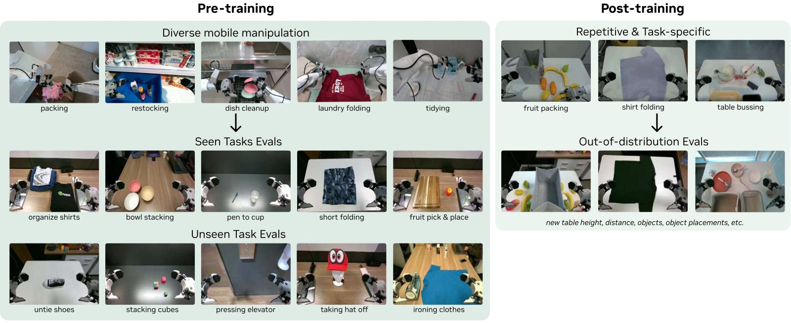

*图6：AgiBot 评估设置。评测场景涵盖不同环境（不同地理位置，因此测试环境和训练环境分布不同）、不同物体。分为两类任务：seen tasks（10 个，80 次 rollout）和 unseen tasks（10 个，80 次 rollout）。每个任务在 4 台机器人上各执行 2 次，变换物体、位置和使用的机械臂。基线包括 GR00T N1.6 和 π₀.₅，各有两个初始化策略。*

**测试场景说明**：由于训练数据和评测数据在不同地理位置采集，**所有评测天然是分布外测试**，而非训练分布内的插值。

**数据统计**：

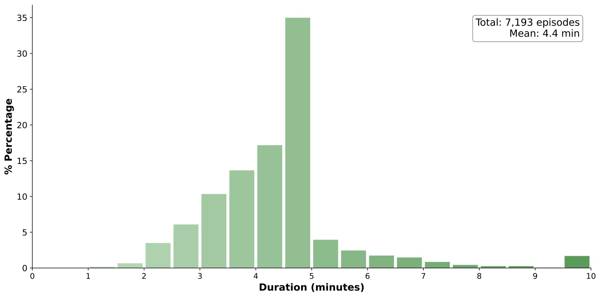

*图7(a)：Episode 时长分布。平均每个 episode 约 4.4 分钟，远长于典型机器人操作数据集。*

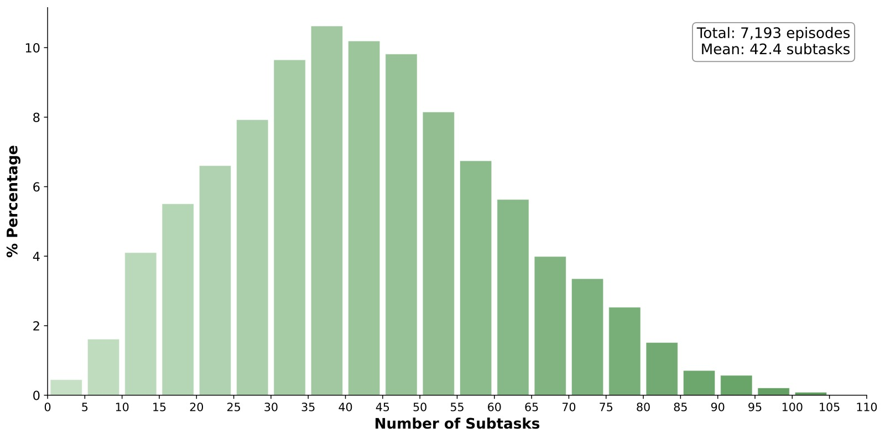

*图7(b)：每 episode 子任务数。平均约 42 个子任务，反映了多任务 episode 结构的设计效果。*

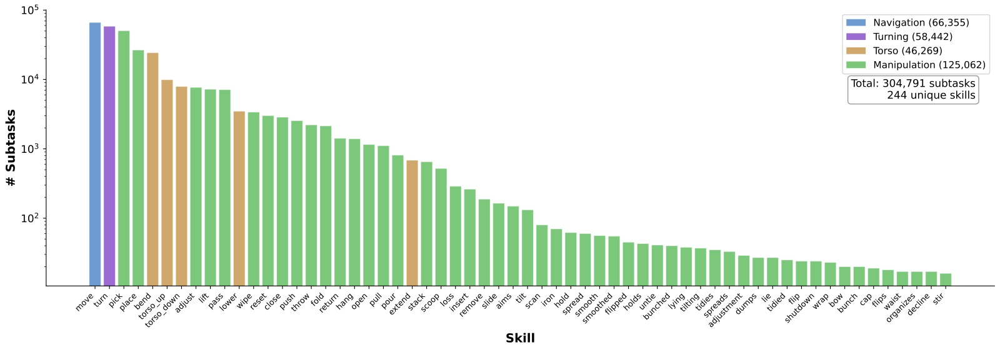

*图7(c)：技能分布涵盖导航（Navigation）、躯干调节（Torso）、右臂、左臂等，反映了真实部署需求——导航实现工作区切换，躯干调节实现对不同高度物体的交互。*

### 4.2 主实验一：已见任务泛化

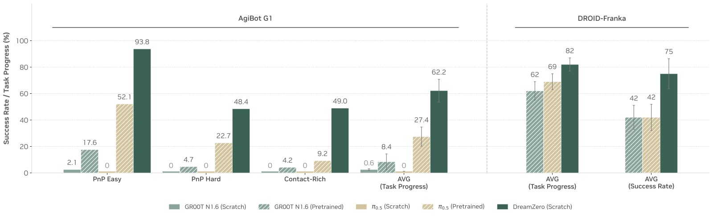

*图8：已见任务（seen tasks）评估结果。横轴为三个任务类别（PnP Easy、PnP Hard、Contact-Rich Manipulation）及平均，纵轴为任务进度百分比。三种颜色分别代表：from-scratch VLA、pretrained VLA、DreamZero。*

**关键数据：**
- **From-scratch VLA**：在所有类别上接近零分——即使简单 pick-and-place，VLA 偶尔能朝向正确物体但无法在未见环境中精确交互
- **Pretrained VLA**：最佳 baseline 平均 27.4%——得益于跨具身预训练中获取的具身知识
- **DreamZero**：平均 **62.2%**，**超过最佳 VLA 基线 2 倍以上**——且 DreamZero 没有使用额外的跨具身预训练
- 在 DROID-Franka 上，DreamZero 同样显著优于 pretrained 基线

### 4.3 主实验二：未见任务零样本泛化

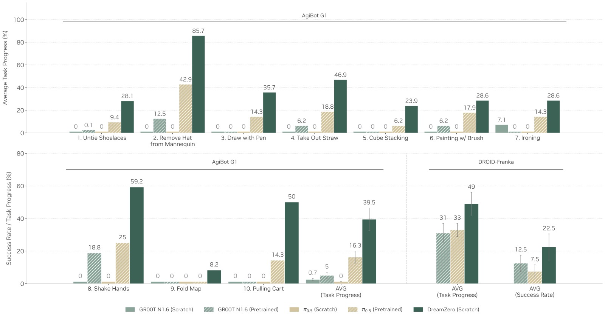

*图9：未见任务（unseen tasks）零样本泛化。左半边为 AgiBot G1（10 个任务），右半边为 DROID-Franka。横轴为具体任务，蓝色条为成功执行（Success），橙色条为部分完成（Progress/Failure），总计为任务进度。底部为基线对比（from-scratch VLA 接近零分，pretrained VLA 分别为 16.3% 和 31%/33%）。*

**关键数据：**
- **From-scratch VLA**：<1%（接近零）
- **Pretrained VLA**：平均 16.3%（AgiBot），31-33%（DROID）
- **DreamZero**：AgiBot 平均 **39.5%**，DROID 平均 **49%**（成功率达 22.5% vs 基线 7.5-12.5%）
- 强表现任务："Remove Hat from Mannequin"（85.7%），"Shake Hands"（59.2%）

**关键定性观察**：Pretrained VLA 常表现出"不管指令只管抓取"的行为，说明它们过拟合到训练中的主流行为（pick-and-place），而非真正理解新任务语义。DreamZero 则能对未见任务进行视觉规划并成功执行。

### 4.4 主实验三：后训练表现

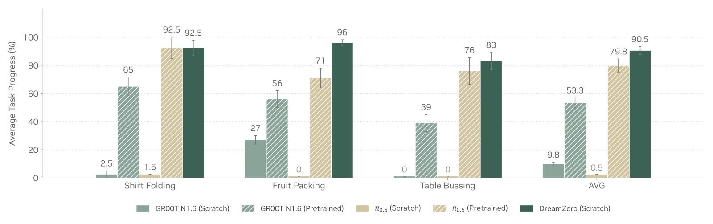

*图10：后训练（post-training）结果。三个任务：Shirt Folding（33 小时）、Fruit Packing（12 小时）、Table Bussing（40 小时）。每个任务 10 次 rollout 的平均任务进度。DreamZero 在所有任务上持平或超越 pretrained VLA 基线。*

- DreamZero 在三个后训练任务上持平或超越 pretrained VLA 基线
- From-scratch VLA 在后训练后仍然过度拟合训练场景，无法泛化到新环境（不同桌子高度、距离、物体摆放）
- 证明 WAM 的**环境泛化能力在后训练后得以保留**

### 4.5 主实验四：跨具身迁移

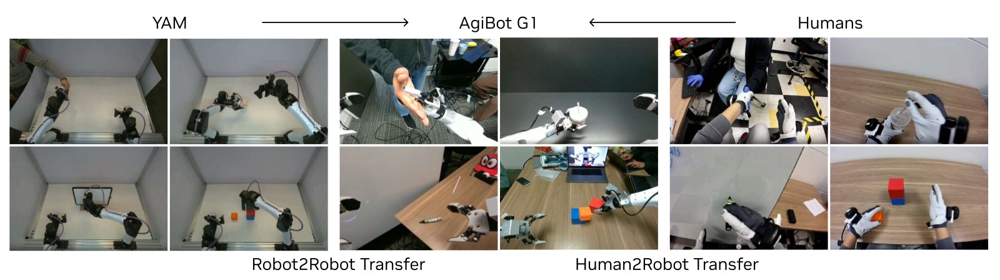

*图11：跨具身迁移实验设计。上半部分（Robot-to-Robot Transfer）：使用 YAM 机器人采集 9 个未见任务的 72 条多视图轨迹（20 分钟），仅用视频预测目标（无动作标注），与 AgiBot 数据 1:1 混合再训练 10K 步。下半部分（Human-to-Robot Transfer）：使用人类第一视角演示，72 条轨迹（12 分钟）。*

**关键数据：**

| 方法 | 任务进度 |
|------|---------|
| DreamZero | 38.3% ± 7.6% |
| DreamZero + Human→Robot | 54.3% ± 10.4% |
| DreamZero + Robot→Robot | **55.4%** ± 9.5% |

- 仅用 **10-20 分钟**视频数据（无动作标注），未见任务性能相对提升 **42%+**
- 机器人到机器人迁移效果最好（55.4%），因为具身差距更小
- 人类到机器人也有效（54.3%），尽管存在形态学差距和动态第一人称视角
- **关键意义**：海量互联网人类视频数据（比机器人数据大数个数量级）可能成为 WAM 获取多样化技能的燃料

### 4.6 主实验五：Few-shot 新具身适应

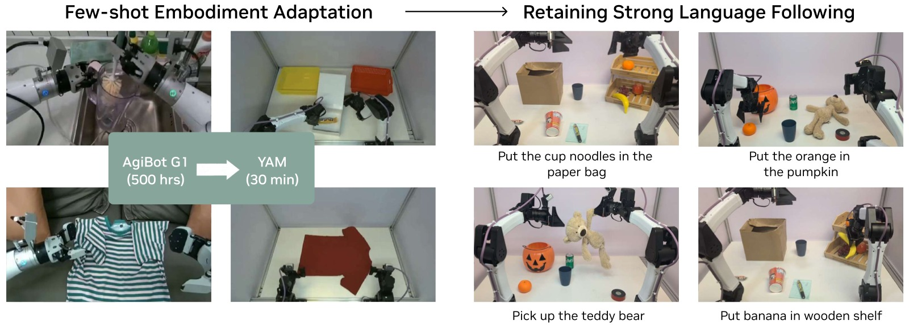

*图12：Few-shot 新具身适应。将 DreamZero-AgiBot checkpoint 在新机器人 YAM 上用仅 30 分钟 play data（55 条轨迹，11 个任务）后训练，随后在新的 pick-and-place 变体上评估语言跟随能力。右图为生成的视频帧和实际执行对比——即使数据极少，视频-动作对齐仍然紧密。*

- 仅用 **30 分钟 play data**（55 条轨迹，11 个任务）将 AgiBot 模型适应到 YAM 机器人
- 后训练后的策略保留了强大的语言跟随能力，甚至泛化到训练中未见的新物体
- 高效适应的两个因素：
  1. AgiBot 和 YAM 视觉外观相似（都是双臂并行夹爪）
  2. 更根本地，**从预测视频中学习隐式 IDM 天生比直接策略学习更样本高效**

### 4.7 消融实验

| 消融问题 | 配置 | 任务进度 |
|---------|------|---------|
| **Q1. 数据多样性** | AR 14B + Repetitive | 33% ± 4.2% |
| | AR 14B + Diverse | **50%** ± 6.3% |
| **Q2. 模型规模** | AR 5B + Diverse | 21% ± 4.2% |
| | AR 14B + Diverse | **50%** ± 6.3% |
| | VLA 5B + Diverse | 0% |
| | VLA 14B + Diverse | 0% |
| **Q3. 架构** | BD 14B + Diverse | 50% ± 14.4% |
| | AR 14B + Diverse | 50% ± 6.3% |

- 多样数据比重复数据改进 **52%**（33% → 50%）
- 14B 比 5B 改善 **138%**（21% → 50%）
- AR 和 BD 架构分数相近，但 AR 方差更小且动作更平滑

### 4.8 DreamZero-Flash 性能

| 方法 | 去噪步数 | 任务进度 | 推理速度 | 加速比 |
|------|---------|---------|---------|-------|
| DreamZero | 4 | 83% ± 6.1% | 350ms | 1x |
| DreamZero | 1 | 52% ± 10.2% | 150ms | 2.33x |
| DreamZero-Flash | 1 | **74%** ± 10.1% | 150ms | 2.33x |

- Flash 在单步推理时恢复 4 步性能的 89%，同时速度快 2.33 倍

---

## 五、代码实现解读

### 5.1 项目结构

DreamZero 代码库基于 PyTorch 和 DeepSpeed ZeRO Stage 2，核心模型定义在 `groot/vla/model/dreamzero/` 下：

```
dreamzero/
├── groot/vla/model/dreamzero/
│   ├── action_head/wan_flow_matching_action_tf.py  # 核心 inference/training loop
│   ├── modules/
│   │   ├── wan_video_dit_action_casual_chunk.py     # 因果 chunk DiT（核心架构）
│   │   ├── wan_video_dit.py                         # Wan DiT backbone
│   │   ├── flow_match_scheduler.py                  # Flow Matching 调度器
│   │   ├── flow_unipc_multistep_scheduler.py        # 推理用多步调度器
│   │   ├── wan_video_vae.py                         # VAE 编码/解码
│   │   ├── wan_video_text_encoder.py                # T5 文本编码器
│   │   ├── wan_video_image_encoder.py               # CLIP 图像编码器
│   │   └── attention.py / cudnn_attention.py        # 注意力实现
│   ├── transform/dreamzero_cotrain.py               # 数据预处理/变换
│   └── backbone/                                    # 抽象 backbone 接口
├── scripts/train/                                   # 训练脚本
├── eval_utils/                                      # 评测工具（WebSocket 服务）
├── socket_test_optimized_AR.py                      # 推理服务器入口（AR 模式）
└── test_client_AR.py                                # 测试客户端
```

### 5.2 核心架构数据流

```
┌─────────────────────────────────────────────────────────────────────┐
│                        DreamZero 架构全景                            │
└─────────────────────────────────────────────────────────────────────┘

                         训练 (Training)
┌──────────┐   ┌──────────┐   ┌──────────┐
│ 多视图    │   │ 语言指令  │   │ 本体感知  │
│ 视频 o_t  │   │ 文本 c    │   │ 状态 q_t  │
└────┬─────┘   └────┬─────┘   └────┬─────┘
     │              │              │
     ▼              ▼              ▼
┌──────────┐  ┌───────────┐  ┌───────────┐
│ VAE      │  │ T5-XXL    │  │ State      │
│ Encoder  │  │ Text Enc  │  │ Encoder    │
└────┬─────┘  └────┬──────┘  └────┬──────┘
     │ z_latent    │ prompt_emb   │ state_emb
     │             │              │
     └─────────────┼──────────────┘
                   │
    ┌──────────────▼──────────────┐
    │   Flow Matching 加噪         │
    │   z_noisy = t*z + (1-t)*ε   │
    │   a_noisy = t*a + (1-t)*ε   │
    └──────────────┬──────────────┘
                   │
    ┌──────────────▼──────────────────────────┐
    │   Causal Chunk DiT (14B / 40 layers)     │
    │   ┌─────────────────────────────────┐   │
    │   │  Self-Attn: causal chunk mask   │   │
    │   │  Cross-Attn: text embeddings    │   │
    │   │  RoPE: video + action + state   │   │
    │   └─────────────────────────────────┘   │
    │   预测速度场 v = [v_vid, v_act]           │
    └──────────────┬──────────────────────────┘
                   │
    ┌──────────────▼──────────────┐
    │   MSE Loss =                │
    │   ||v_pred - v_target||²     │
    │   (视频 + 动作联合)          │
    └─────────────────────────────┘


                       推理 (Inference)
┌──────────┐   ┌──────────┐   ┌──────────┐
│ 初始图像  │   │ 语言指令  │   │ 初始状态  │
└────┬─────┘   └────┬─────┘   └────┬─────┘
     │              │              │
     ▼              ▼              ▼
┌──────────┐  ┌───────────┐  ┌───────────┐
│ VAE+CLIP │  │ T5-XXL    │  │ State      │
│ Encode   │  │ Text Enc  │  │ Encoder    │
└────┬─────┘  └────┬──────┘  └────┬──────┘
     │             │              │
     └─────────────┼──────────────┘
                   │
    ┌──────────────▼──────────────────────────┐
    │ ❶ Prefill: 干净帧 -> KV Cache（t=0）    │
    └──────────────┬──────────────────────────┘
                   │
    ┌──────────────▼──────────────────────────┐
    │ ❷ AR Loop (每次 ~150ms)                  │
    │                                          │
    │   ┌──────────────────────────────────┐  │
    │   │ 从噪声开始 joint denoising        │  │
    │   │ Flow Matching t: 0 → 1           │  │
    │   │ ┌────────────────────────────┐   │  │
    │   │ │ @each step:                 │   │  │
    │   │ │  if CosSim(v_i, v_{i-1})    │   │  │
    │   │ │     > ε: skip DiT (cache)   │   │  │
    │   │ │  else: v = DiT(z,a; KV)     │   │  │
    │   │ │  x_{i+1} = x_i + v·Δσ       │   │  │
    │   │ └────────────────────────────┘   │  │
    │   └──────────────────────────────────┘  │
    │                                          │
    │   输出: action_chunk (48 步), video_pred  │
    └──────────────┬──────────────────────────┘
                   │
    ┌──────────────▼──────────────────────────┐
    │ ❸ Async Execution + Cache Update        │
    │                                          │
    │   action_chunk ──► 异步执行（机器人）     │
    │                                          │
    │   真实观测 o_real ──► VAE                │
    │   z_real ──► KV cache (替换预测帧)       │
    │                                          │
    │   丢弃预测的 video latent                 │
    │   保留 KV cache 中的视觉历史              │
    └──────────────┬──────────────────────────┘
                   │
                   ▼
             循环 ❷ （直到任务完成）
```

### 5.3 关键代码模块映射

**论文 Algorithm 1（Training）→ `wan_flow_matching_action_tf.py:forward()`**

```python
# Line 603-813: 完整训练 forward pass
def forward(self, backbone_output, action_input):
    # 1. 编码视频 → latents (VAE)
    latents = self.encode_video(videos, ...)
    
    # 2. 编码文本 → prompt_embs
    prompt_embs = self.encode_prompt(text_ids, attn_mask)
    
    # 3. 编码图像 → clip_feas, y
    clip_feas, ys, _ = self.encode_image(image, ...)
    
    # 4. 采样时间步 → 加噪
    noise = torch.randn_like(latents)
    timestep_id = torch.randint(...)  # uniform
    noisy_latents = scheduler.add_noise(latents, noise, timestep)
    
    # 5. 模型前向
    video_noise_pred, action_noise_pred = self.model(
        noisy_latents, timestep, ..., context=prompt_embs,
        state=state_features, action=noisy_actions, ...
    )
    
    # 6. 联合损失
    dynamics_loss = MSE(video_noise_pred, training_target)
    action_loss = MSE(action_noise_pred, training_target_action) * action_mask
    loss = dynamics_loss + action_loss
```

**论文 Algorithm 2（Inference）→ `lazy_joint_video_action()`**

```python
# Line 973-1338: 推理 pipeline
def lazy_joint_video_action(self, backbone_output, action_input):
    # 1. Prefill: clean frames → KV cache
    if current_start_frame == 0:
        self._run_diffusion_steps(..., update_kv_cache=True)
    
    # 2. AR loop: 联合去噪
    for timestep in scheduler.timesteps:
        if should_run_model:  # DiT caching
            predictions = self._run_diffusion_steps(
                noisy_input, timestep, action=noisy_action, ...
            )
            flow_pred = flow_uncond + cfg_scale * (flow_cond - flow_uncond)
        
        noisy_input = scheduler.step(flow_pred_transpose, timestep, noisy_input)
        noisy_action = scheduler_action.step(flow_pred_action, timestep, noisy_action)
    
    # 3. 输出
    return {"action_pred": latents_action, "video_pred": output}
```

**注意力掩码实现 → `wan_video_dit_action_casual_chunk.py`**

```python
# 核心: 因果 chunk 注意力 + 多种 RoPE (video/action/state)
def causal_rope_action_apply(x, freqs, freqs_action, freqs_state,
                              action_register_length, num_action_per_block,
                              num_state_per_block, action_state_index):
    # 为 video/action/state tokens 应用不同的 RoPE 频率
    # action token 和 state token 使用独立频率
    # 实现论文中 Y3 关注 C0,C1,C2 的注意力模式
```

**DreamZero-Flash 噪声解耦 → `wan_flow_matching_action_tf.py:680-731`**

```python
# Line 680-731: 解耦噪声采样
if decouple_video_action_noise:
    # 视频: Beta(α,β) 偏向高噪声
    video_noise_ratio = self.video_beta_dist.sample(...)
    timestep_id = ((1.0 - video_noise_ratio) * 1000).long()
    # 动作: 独立 uniform
    timestep_action_id = torch.randint(0, 1000, ...)
```

**DiT Caching → `should_run_model()`**

```python
# Line 943-971: 自适应 DiT 步骤跳过
def should_run_model(self, index, current_timestep, prev_predictions):
    if not dynamic_cache_schedule: return dit_step_mask[index]
    
    # 计算相邻速度向量的余弦相似度
    sim = cosine_similarity(v_last, v_prev).mean()
    
    # 相似度 > 阈值: 跳过 N 步
    for threshold, countdown in [(0.95, 4), (0.93, 2)]:
        if sim > threshold: skip_countdown = countdown; return False
    return True
```

### 5.4 数据处理流程

```
┌──────────────────────────────────────────────────────────────┐
│                    DreamTransform Pipeline                    │
└──────────────────────────────────────────────────────────────┘

原始数据                    处理后
┌────────────────┐        ┌─────────────────────────┐
│ video (T,V,H,W)│───────▶│ _prepare_video()        │
│                │        │ 多视图拼接为 2x2 grid     │
│                │        │ DROID: wrist(顶行全宽)    │
│                │        │        left|right(底行)  │
│                │        │ AgiBot: head|right       │
│                │        │         left |black      │
└────────────────┘        └─────────────────────────┘
                                    │
┌────────────────┐        ┌────────▼────────────────┐
│ language (str) │───────▶│ _prepare_language()     │
│                │        │ 多视图描述增强            │
│                │        │ "A multi-view video     │
│                │        │  shows that a robot..." │
└────────────────┘        └─────────────────────────┘
                                    │
┌────────────────┐        ┌────────▼────────────────┐
│ state (T,D)    │───────▶│ _prepare_state()        │
│                │        │ pad to max_state_dim    │
└────────────────┘        └─────────────────────────┘
                                    │
┌────────────────┐        ┌────────▼────────────────┐
│ action (T,D)   │───────▶│ _prepare_action()       │
│                │        │ pad to max_action_dim   │
└────────────────┘        └─────────────────────────┘
```

---

## 六、局限性

1. **推理延迟仍然较高**：虽然通过一系列优化达到了 7Hz，但相比 VLA 在消费级 GPU 上可达 20Hz+ 仍有差距。需要 2x GB200 级别的硬件。

2. **高精度任务受限**：在需要亚厘米级精度的任务（如钥匙插入、精细装配）上继承了行为克隆的通用局限。多样预训练策略优先覆盖广度，可能忽视了这类高精度操作所需的密集演示。

3. **视觉上下文窗口有限**：当前最大上下文为 8 个 latent 帧（约 6.6 秒），对于需要长程记忆的任务可能不够。

4. **多具身联合训练**：目前每个具身单独训练，未探索多具身联合训练的潜力。

5. **跨具身迁移成功率仍中等**：虽然相对提升显著，但绝对成功率（~55%）仍有较大提升空间。

6. **失败主要源于视频预测**：如果视频 backbone 预测错误，策略会忠实地执行错误的视觉计划——这在安全关键场景中可能带来风险。

---

## 七、关键概念速查

| 概念 | 解释 |
|------|------|
| WAM (World Action Model) | 基于预训练视频扩散 backbone，联合预测视频和动作的机器人基础模型 |
| VLA (Vision-Language-Action) | 从 VLM 初始化、直接预测动作的传统机器人模型 |
| Flow Matching | DreamZero 使用的生成建模目标，预测从噪声分布到数据分布的速度场 |
| IDM (Inverse Dynamics Model) | 从预测的视觉未来中提取可执行动作的隐式模型 |
| DiT (Diffusion Transformer) | DreamZero 的 backbone 架构，基于 Transformer 的扩散模型 |
| KV Cache | 自回归推理时缓存 Key-Value 注意力张量的技术，加速推理 |
| CFG (Classifier-Free Guidance) | 通过结合条件和无条件预测来增强生成质量的技术 |
| DreamZero-Flash | 解耦视频和动作噪声调度以支持少步/单步去噪的模型级优化 |
| Chunk-wise Generation | 每次自回归生成固定数量 latent 帧（K=2）和对应动作 |
| Teacher Forcing | 训练时基于干净前序 chunk 条件化当前 noisy chunk 的策略 |
| Savitzky-Golay Filter | 用于平滑生成动作 chunk 中高频噪声的数字滤波器 |
| NVFP4 (E2M1) | NVIDIA Blackwell 架构的 4-bit 浮点量化格式 |

---

## 八、讨论与未来方向

- **WAM 缩放定律**：类似 LLM 的缩放定律，WAM 在模型规模、数据规模、计算量之间的关系尚需探索，预计 VAM 的动作缩放曲线将比 VLA 更陡峭。
- **大规模人类视频数据**：当前实验仅使用 12 分钟室内人类数据。大规模第一人称人类视频（如 Ego4D、EgoDex、Action100M）可能带来更强的下游迁移。
- **长程推理**：需要 System 2 规划器或大幅扩展视觉上下文窗口来实现鲁棒的长程执行。
- **WAM 时代的具身设计**：更高自由度需要更多 play data，但更像人的具身可能从互联网人类视频中受益更多——人形机器人可能因数据优势而胜出。
