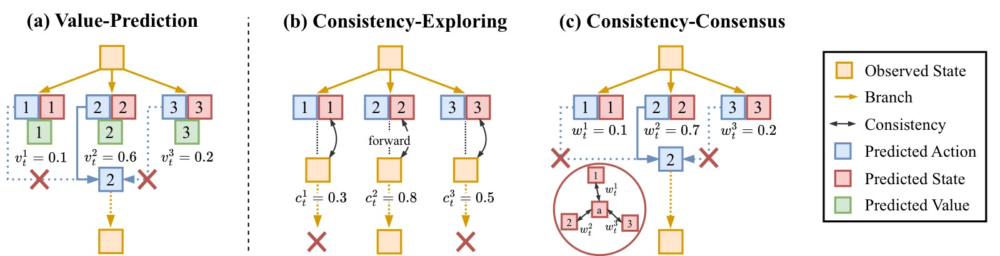
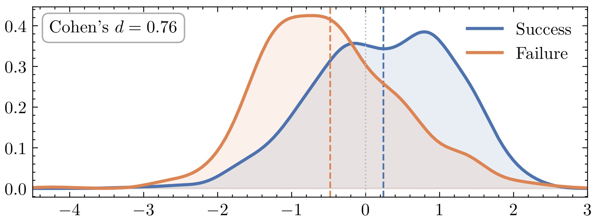
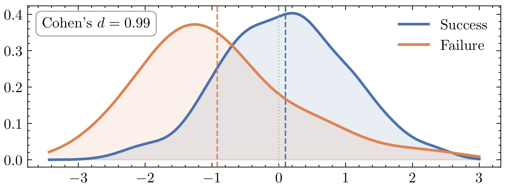
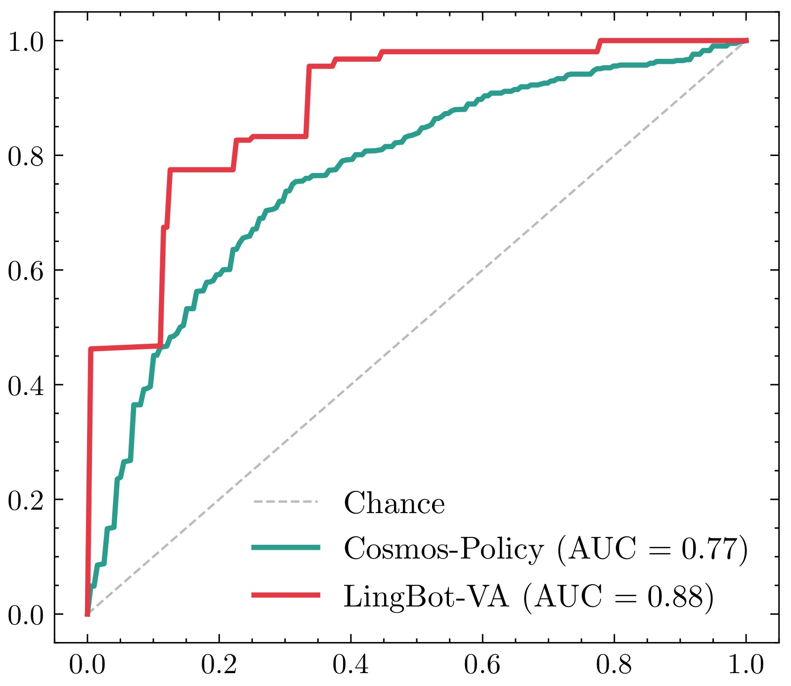
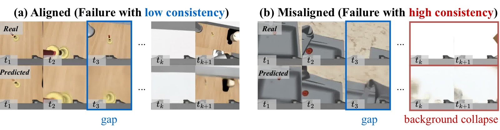
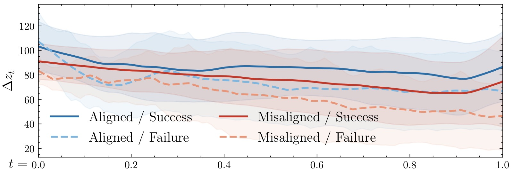
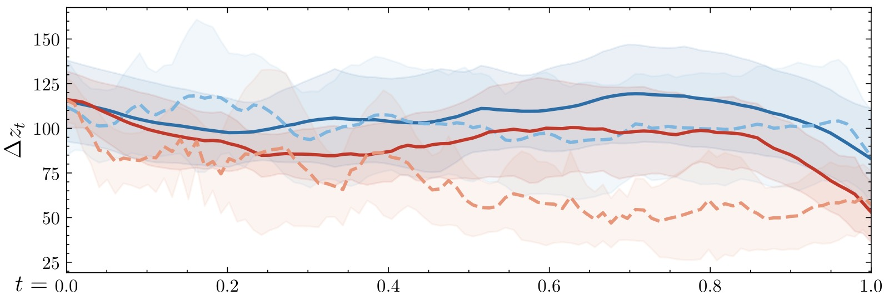
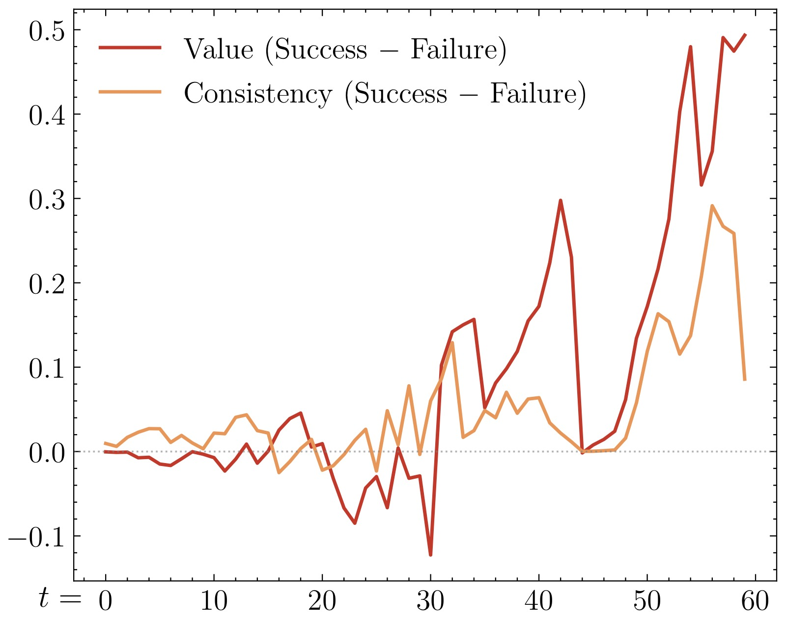
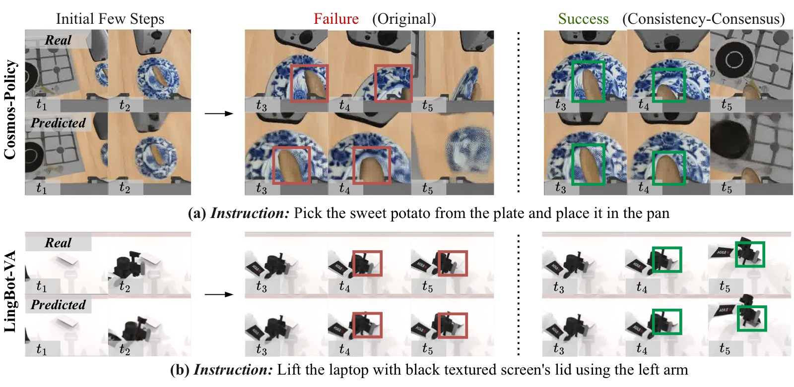
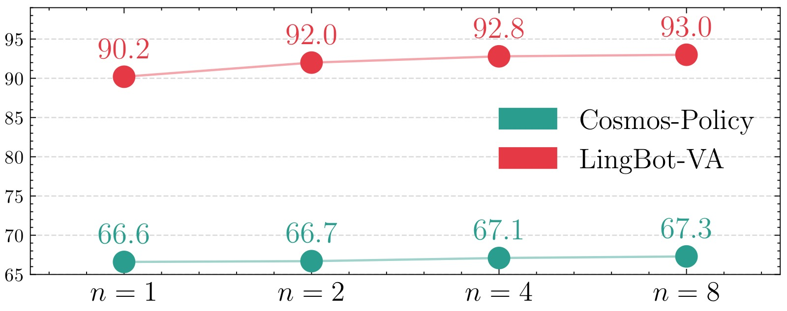

# Is the Future Compatible? Diagnosing Dynamic Consistency in World Action Models

> **论文信息**
> - 作者：Bo-Kai Ruan, Teng-Fang Hsiao, Ling Lo, Hong-Han Shuai（National Yang Ming Chiao Tung University）
> - 投稿方向：NeurIPS 2026（投稿中）
> - arXiv ID：2605.07514
> - 代码：—

---

## 一、核心问题

World Action Models（WAM）通过预测未来观察和动作来实现"想象式"决策。但现有工作主要关注**预测质量**和**下游成功率**，忽略了一个根本性问题：

> 模型生成的"想象未来"是否真的与它所预测的动作**动态一致**？还是仅仅生成视觉上 plausible 但物理上不可能的幻象？

作者将此问题定义为 **Action-State Consistency（动作-状态一致性）**：预测的未来状态是否与执行该动作后实际发生的状态转移相容。这是 WAM 可靠性评估中一个此前完全缺失的维度。

---

## 二、核心思路 / 方法

### 2.1 WAM 的两种范式

论文梳理了 WAM 的两种代表性形式：

**Joint-Prediction WAM（联合预测）**：直接建模 $p(o_{t+1:t+\Delta}, a_{t+1:t+\Delta} \mid o_{0:t}, q_t, \mathcal{G})$，未来观察和动作在统一模型中同时生成。代表：Cosmos-Policy、FastWAM。

**Inverse-Dynamics WAM（逆动力学）**：先预测未来状态 $p(o_{t+1:t+\Delta} \mid o_{0:t}, q_t, \mathcal{G})$，再从预测的未来状态中反推动作 $p(a_{t+1:t+\Delta} \mid o_{0:t+\Delta}, q_t)$。代表：LingBot-VA、GigaWorld。Hybrid 变体：DreamZero（训练时联合预测，推理时依赖逆动力学）。

*图1：World Action Model 的概念总览图，展示了 WAM 从输入到输出的完整数据流。*

*图的左侧为当前时刻 $t$ 的输入：包括历史视觉观察 $o_{0:t}$（多帧 RGB 图像序列）、机器人本体感知状态 $q_t$（关节角度、末端位姿等）、以及任务描述 $\mathcal{G}$（自然语言指令）。这些异构输入在模型内部被编码为统一的 latent 表征。*

*图的右侧为 WAM 的输出——模型同时预测两样东西：**未来观察帧**（$\hat{o}_{t+1}, \hat{o}_{t+2}, \dots$，即模型"想象"的接下来会发生什么）和**动作序列**（$\hat{a}_{t+1}, \hat{a}_{t+2}, \dots$，即每一步应该执行什么动作）。部分 WAM 还包含可选的 **Value Head**（价值头），对每个预测分支输出一个标量价值估计，用于 Best-of-N 候选选择。*

*图的下部说明了本文的核心概念 **Action-State Consistency**：将预测的未来帧 $\hat{o}_{t+\Delta}$ 与实际执行动作后观察到的真实帧 $o_{t+\Delta}$ 进行比较（在 VAE latent 空间计算 MSE 距离），通过指数衰减函数转换为 $[0,1]$ 区间的一致性得分。一致性高意味着模型的"想象"和"现实"高度吻合，一致性低则表示预测偏离了实际物理转移。*

### 2.2 一致性度量

一致性定义为预测观察 $\hat{o}_{t+\Delta}$ 与真实观察 $o_{t+\Delta}$ 之间的相似度：

$$c_t(o_{t+\Delta}, \hat{o}_{t+\Delta}) = \exp\big(-\alpha \cdot d(o_{t+\Delta}, \hat{o}_{t+\Delta})\big)$$

其中 $\alpha=0.1$ 为缩放因子，$d(\cdot,\cdot)$ 为 VAE 解码前 latent 空间的 MSE 距离。在 latent 空间计算避免了像素级敏感度，确保一致性反映结构层面的语义对齐。

### 2.3 三个研究问题（RQ）

论文围绕三个 RQ 展开系统研究：

| 研究问题 | 核心关注点 |
|---------|-----------|
| **RQ1**：WAM 是否表现出可测量的一致性？与任务成败关系如何？ | 一致性的涌现与可分离性 |
| **RQ2**：什么条件下一致性会失效？失效原因是什么？ | 边界条件与 background collapse |
| **RQ3**：一致性能否作为 value-free 的决策信号？ | 与 value prediction 的对齐程度 |

### 2.4 测试时选择策略

提出两种基于一致性的 Best-of-N 选择策略：

**Consistency-Exploring**（探索式）：从同一初始状态分别执行 $N$ 个候选分支，计算每个分支的一致性得分 $c_t^{(i)} = c_t(\hat{o}_{t+\Delta}^{(i)}, o_{t+\Delta}^{(i)})$，选择得分最高者。这是理论上界策略，但需要环境重置。

**Consistency-Consensus**（共识式）：不执行候选分支，而是将所有预测未来取平均得到共识未来 $\bar{o}_{t+\Delta} = \frac{1}{N}\sum_j \hat{o}_{t+\Delta}^{(j)}$，然后对每个分支计算其与共识未来的相似度。核心假设是：共识平均比单一样本更接近真实未来。这是真正可部署的策略。

选择方式采用 **Winner-Takes-All**（WTA），直接执行得分最高的分支动作，而非对动作做加权平均。原因是机器人控制指令涉及 $SE(3)/SO(3)$ 等非线性流形，加权平均反而破坏运动一致性（实验证实加权平均将 RoboCasa 成功率从 67.3% 拉低至 64.9%，RoboTwin 2.0 从 93.0% 拉低至 86.4%）。

*图2：三种 Best-of-N 测试时选择策略的并排对比，从上到下分别为 (a) Value-Prediction、(b) Consistency-Exploring、(c) Consistency-Consensus。图中上部是同一初始状态的多个预测分支，下部展示各策略的选择逻辑。*

***子图 (a) Value-Prediction（基于价值的 Best-of-N）：*** 这是 Cosmos-Policy 原论文提出的方法。每个候选分支由模型自带的 Value Head 输出一个标量价值估计 $V^{(i)}$，直接选择 $V$ 值最高者。此方法的有效性前提是 Value Head 被良好训练（需要 Monte Carlo 回报作为监督信号）。缺点在于：并非所有 WAM 都包含 Value Head（如 LingBot-VA 就没有），且价值估计的训练质量直接影响选择效果。

***子图 (b) Consistency-Exploring（探索式一致性）：*** 从同一初始状态出发，逐一执行 $N$ 个候选分支的动作序列到环境中，获得 $N$ 个真实下一帧 $o_{t+\Delta}^{(i)}$，然后对每个分支计算其预测帧与真实帧的一致性得分，选最高者。这是直接使用一致性作为选择信号的最纯粹形式，也是理论上界。但它需要在每个决策步都能"重置环境到同一点再试不同动作"，这在真实机器人场景中几乎不可能——因此主要作为 benchmark 参考。

***子图 (c) Consistency-Consensus（共识式一致性）：*** 完全不执行任何候选分支。代之以将所有 $N$ 个预测的未来帧取平均，得到"共识未来" $\bar{o}_{t+\Delta}$。核心直觉：虽然单个预测可能有噪声，但 $N$ 个独立样本的平均通常比任意单一样本更接近真实未来（类似于 ensemble 降低了方差）。然后对每个分支计算其预测帧与共识未来的相似度，选最接近共识的分支。这一策略完全在模型内部完成（仅需前向推理），无需任何环境交互或重置，是唯一真正可部署的方案。*

---

## 三、实验与结果

### 3.1 实验设置

| 模型 | 数据集 | WAM 类型 | 硬件 |
|------|--------|---------|------|
| Cosmos-Policy | RoboCasa（24 个厨房操作任务，单臂） | Joint-Prediction | 8×RTX 5090 |
| LingBot-VA | RoboTwin 2.0（50+ 个双臂操作任务） | Inverse-Dynamics | 8×RTX 5090 |

默认 $N=8$ 个候选分支，候选分支可并行评估。选择权重和一致性得分的计算开销约 **0.7ms**（$N=8$）。

### 3.2 RQ1：一致性与任务成败的关系

<table><tr>
<td width="50%"> <em>(a) Cosmos-Policy</em></td>
<td width="50%"> <em>(b) LingBot-VA</em></td>
</tr></table>

*图3：成功与失败轨迹的 action-state consistency 核密度估计（KDE）分布对比，左子图 (a) 为 Cosmos-Policy（RoboCasa），右子图 (b) 为 LingBot-VA（RoboTwin 2.0）。*

***坐标轴和含义：*** 横轴为归一化后的一致性 z-score——为了跨任务可比，每个任务内部先计算 episode 级一致性的均值和标准差，再将每个 episode 的一致性转为 z-score（$(c - \mu_{\text{task}}) / \sigma_{\text{task}}$）。因此 z-score = 0 代表该 episode 的一致性处于该任务的均值水平，正值表示高于均值，负值表示低于均值。纵轴为核密度估计的密度值。蓝色曲线为成功轨迹（Success）的分布，橙色曲线为失败轨迹（Failure）的分布。

***子图 (a) Cosmos-Policy：*** 成功轨迹的一致性分布整体右移——峰值约在 z-score = +0.3 处，且分布更集中（更窄的峰），说明成功轨迹的一致性普遍偏高且方差较小。失败轨迹的分布偏左，峰值在 z-score ≈ −0.1 附近，且分布更宽（尾部向左延伸至 −2.0 以下），说明失败轨迹的一致性不仅平均更低，且个体差异更大。**Cohen's d = 0.76**，属于中到大效应量，意味着两分布的均值差距约为 0.76 个标准差——在社会科学中通常被视为"有实际意义的差异"。

***子图 (b) LingBot-VA：*** 成功轨迹的一致性分布同样右移但更明显——峰值在 z-score ≈ +0.5 处，且几乎完全与失败分布分离。失败轨迹的分布中心在 z-score ≈ −0.4，且有一条明显的向左长尾延伸至 −2.5。**Cohen's d = 0.99**——接近 1.0 的大效应量，意味着成功和失败轨迹的一致性几乎分布在两个不重叠的区域。这在统计上是非常强的分离：LingBot-VA 的逆动力学设计让一致性信号更加"干净"，可能是因为先预测未来帧再反推动作的结构，使得动作和帧之间的不一致更容易暴露。

***连接论文论点：*** 这两张 KDE 图回答了 RQ1——一致性不仅在两种 WAM 范式上都是可测量的，而且成功和失败轨迹在一致性上有系统性的、统计显著的差异。这意味着一致性不是随机噪声，而是一个与任务执行质量有关的结构化信号。

*图4：使用 action-state consistency 作为唯一特征，通过 logistic 回归（5 折交叉验证）预测任务成功/失败的 ROC 曲线。*

***坐标轴和含义：*** 横轴为假阳性率（False Positive Rate = FP / (FP + TN)），纵轴为真阳性率（True Positive Rate = TP / (TP + FN)），也称为召回率。对角线虚线代表随机猜测（AUC = 0.5）——任何有意义的分类器都应在这条线之上。曲线越接近左上角，分类性能越好。AUC（曲线下面积）是综合指标：AUC = 1.0 为完美分类，0.5 为随机。

***蓝色曲线（Cosmos-Policy）：AUC = 0.77。*** 在假阳性率约 0.2 时，真阳性率已超过 0.6；在假阳性率 0.4 时，真阳性率达到约 0.8。这意味着如果允许 20% 的假阳性（将失败误判为成功），可以正确识别约 60% 的成功轨迹；如果容忍 40% 假阳性，可识别 80% 的成功轨迹。这个性能水平说明一致性有相当的预测力，但并非完美——这与图 3 中 Cohen's d = 0.76 的量级一致。

***橙色曲线（LingBot-VA）：AUC = 0.88。*** 曲线明显更陡，在假阳性率仅约 0.1 时真阳性率已接近 0.7；假阳性率 0.2 时真阳性率超过 0.85。AUC 0.88 在分类任务中属于"良好到优秀"的水平，意味着仅凭一致性这一个特征，就能相当准确地判断轨迹是否最终成功。这与 LingBot-VA 的逆动力学架构一致——模型需要先"想清楚未来是什么样"再"决定怎么做"，不一致更容易暴露。

***连接论文论点：*** 此图的核心信息是：**一致性本身即可作为有效的任务成败预测信号**。不需要 reward、不需要 value function、不需要人工标注——纯粹来自模型自身预测与现实的对比。此外，LingBot-VA（AUC 0.88）显著优于 Cosmos-Policy（AUC 0.77），暗示逆动力学 WAM 可能天然更具"可诊断性"。

### 3.3 RQ2：Background Collapse——一致性何时失效

*图5：Background Collapse（背景坍缩）的两种失败轨迹对比，解释为什么"失败了但一致性却很高"的悖论。*

***图的结构：*** 每行是一个失败轨迹案例，每列从左到右依次是连续时间步的帧。上半部分 (a) 为"一致性对齐"的失败，下半部分 (b) 为"一致性错位"的失败（即 background collapse）。

***子图 (a) 一致性对齐的失败：*** 机器人持续有可见的动作和场景变化——机械臂在移动、物体在改变位置、场景内容逐帧不同。但这些动作并没有导向任务成功（例如：正在做错误的操作）。因为帧与帧之间有显著的变化（较高的 latent change $\Delta z_t$），预测这些变化是有难度的，所以一致性得分自然较低，正确地"反映"了任务状态不佳。

***子图 (b) 一致性错位的失败（Background Collapse）：*** 这是本论文的核心发现。在失败轨迹的后半段，预测帧几乎完全**停止变化**——场景退化为静态背景，机械臂不再移动，物体位置固定。比较 $t_k$ 与 $t_{k+1}$ 几乎看不到任何差异。本质上，模型进入了"什么都不做"的坍缩模式。但问题在于：**静态的预测非常容易做对**——如果模型预测下一帧"什么都不变"，而客观上下一帧确实"什么都没变"（因为机器人卡住了），那么 latent 空间的距离会非常小，一致性得分会非常高。于是出现了令人困惑的现象：任务失败了，一致性却说"很好"。

***为什么这很重要：*** 这个现象揭示了一致性作为诊断信号的**边界条件**——一致性只在其测量的场景动态有意义时才可靠。如果策略卡住了，低动态本身就让"预测未来"变得 trivial，高一致性不是因为模型"理解"了场景，而是因为场景本身"没有东西可理解"。这就是为什么作者在论文中反复强调要用 latent change $\Delta z_t$ 来"校准"一致性——当 $\Delta z_t$ 极低时，高一致性不可信。

**定量验证**：定义 latent change $\Delta z_t = d(z_t, z_{t+\Delta})$ 作为场景变化幅度的代理量。结果：

| 模型 | Pearson 相关 | Spearman 相关 |
|------|-------------|--------------|
| Cosmos-Policy | -0.47 | -0.46 |
| LingBot-VA | -0.30 | -0.30 |

两者呈**负相关**：场景变化越大，一致性越低；场景越静止，一致性越高。时序分析显示两者随时间朝相反方向演化——当 $\Delta z_t$ 上升时，一致性下降；$\Delta z_t$ 下降时，一致性上升。

<table><tr>
<td width="50%"> <em>(a) Cosmos-Policy</em></td>
<td width="50%"> <em>(b) LingBot-VA</em></td>
</tr></table>

*图6：将 latent change（$\Delta z_t$）按两个维度分解——任务类型（对齐 Aligned / 错位 Misaligned）和轨迹结果（成功 Success / 失败 Failure），形成四组曲线的时间序列对比。左子图 (a) 为 Cosmos-Policy，右子图 (b) 为 LingBot-VA。*

***坐标轴和图例：*** 横轴为轨迹的时间步（从 episode 开始到结束），纵轴为 latent change $\Delta z_t$ 的值。四条曲线分别对应：
- 深蓝色（Aligned / Success）：对齐任务中的成功轨迹
- 浅蓝色（Aligned / Failure）：对齐任务中的失败轨迹
- 深红色（Misaligned / Success）：错位任务中的成功轨迹
- 浅橙色（Misaligned / Failure）：错位任务中的失败轨迹

***子图 (a) Cosmos-Policy：*** 最引人注目的是浅橙色曲线（Misaligned / Failure），它从约 timestep 5 开始急剧下降，到 timestep 10 左右降至接近零的极低水平，此后持续保持低位直到 episode 结束。对比其他三条曲线——深蓝色（Aligned / Success）维持最高 level 并保持稳定，浅蓝色（Aligned / Failure）虽然低于成功但仍在中等水平波动，深红色（Misaligned / Success）初期较高后有所下降但仍高于浅橙色。这种急剧分化发生在 episode 中期，表明错位任务中的失败轨迹并非"一开始就注定"，而是在中间某个时间点策略做出了错误的动作选择，导致进入不可逆的停滞状态，此后 $\Delta z_t$ 持续极低——即进入了 background collapse。

***子图 (b) LingBot-VA：*** 模式类似但稍弱。浅橙色（Misaligned / Failure）仍然是最低曲线，在 episode 后半段降到极低水平。但 LingBot-VA 的四条曲线之间的差异比 Cosmos-Policy 更小，这与其更低的 Pearson 相关系数（-0.30 vs -0.47）一致——逆动力学结构可能对 collapse 模式有不同的敏感性。

***连接论文论点：*** 这张图定量地证明了 RQ2 的回答：一致性失效的根本原因是 background collapse——错位任务中的失败轨迹在后期 $\Delta z_t$ 极低（预测帧几乎静止），而"静止场景"预测 trivial，导致一致性虚高。它也暗示了缓解方向：**如果能在早期（timestep 1-5）做出更好的动作选择，避免轨迹进入 collapse 区域，就能从根本上减少错位现象。**

### 3.4 RQ3：一致性作为 Value-Free 信号

*图7：以 Cosmos-Policy 为对象，比较 Value Prediction 和 Action-State Consistency 在区分成功与失败轨迹上的表现。*

***坐标轴和含义：*** 横轴为轨迹时间步（越长表示越接近 episode 末尾），纵轴为"成功轨迹的值减去失败轨迹的值"的差值（$\text{Success} - \text{Failure}$）。蓝色曲线代表 Value Prediction 的差值，橙色曲线代表 Consistency 的差值。正值意味着成功轨迹在该指标上高于失败轨迹——正值越大区分度越好。虚线表示差值为零（完全无法区分）。

***关键趋势分析：***
- **早期阶段（timestep 0-2）：** 两条曲线差值都较小（接近 0.02），说明在 episode 刚开始时，成功和失败的 value 和一致性都还比较接近——这个阶段模型还没有足够信息判断未来走向。
- **中期阶段（timestep 3-7）：** 两条曲线开始分化。Value Prediction 差值从约 0.02 稳步上升到约 0.04，同时 Consistency 差值从约 0.02 上升到约 0.05。有趣的是，在此阶段 **Consistency 的区分度略高于 Value**（橙色略高于蓝色），说明在决策中期，预测与现实的吻合度可能比预期回报估计更早地暴露轨迹质量。
- **后期阶段（timestep 8-10）：** 两条曲线均进一步上升并趋于稳定，差值达到约 0.04-0.06 的水平。Value 和 Consistency 在此阶段基本持平。

***连接论文论点：*** 这张图直接回答了 RQ3——**Consistency 与 Value Prediction 遵循相同的成功-失败分化趋势**。两者都能区分好轨迹和坏轨迹，且这种区分能力随时间积累而增强。这意味着：如果模型没有 Value Head（如 LingBot-VA、FastWAM 等大多数 WAM），一致性仍然可以提供一个"免费的"替代信号，用于 Best-of-N 选择。这也就是 Consistency-Consensus 策略有效性的理论基础。

### 3.5 测试时选择的实验效果

**RoboCasa（Cosmos-Policy）**：

| 方法 | TTS | 平均成功率 |
|------|-----|-----------|
| UVA | ✗ | 50.0% |
| DP-VLA | ✗ | 57.3% |
| UWM | ✗ | 60.8% |
| π₀ | ✗ | 62.5% |
| GR00T-N1.5 | ✗ | 64.1% |
| Video-Policy | ✗ | 66.0% |
| FLARE | ✗ | 66.4% |
| Cosmos-Policy* | ✗ | 66.6% |
| + Value-Prediction* | ✓ | 67.4% |
| + **Consistency-Consensus** | ✓ | **67.3%** |
| + **Consistency-Exploring** | ✓ | **68.0%** |

**RoboTwin 2.0（LingBot-VA）**：

| 方法 | TTS | 平均成功率 |
|------|-----|-----------|
| X-VLA | ✗ | 72.9% |
| π₀ | ✗ | 65.9% |
| π₀.₅ | ✗ | 82.7% |
| Motus | ✗ | 88.7% |
| LingBot-VA* | ✗ | 90.2% |
| + **Consistency-Consensus** | ✓ | **93.0%** |

关键观察：
- Consistency-Consensus 在 RoboCasa 上几乎匹配 Value-Prediction（67.3% vs 67.4%），且无需 reward/value 建模
- 在 RoboTwin 2.0 上提升最大（+2.8pp），因该平台不提供环境重置 API，Consistency-Exploring 不可用，全部收益来自可部署的 Consensus 策略
- 策略**跨 WAM 范式**有效：Joint-Prediction（Cosmos-Policy）和 Inverse-Dynamics（LingBot-VA）均可受益

*图8：原始 rollout（左列）与 Consistency-Consensus 引导的 rollout（右列）的逐帧定性对比，上半部分 (a) 为 Cosmos-Policy 在 RoboCasa 上的案例，下半部分 (b) 为 LingBot-VA 在 RoboTwin 2.0 上的案例。*

***子图 (a) Cosmos-Policy — RoboCasa（厨房操作）：*** 这是一个典型的物品放置/移动任务。原始 rollout（左）在关键操作阶段出现问题：预测的未来帧（绿色框标出的"Predicted"区域）与实际执行后观察到的帧（"Real"区域）出现明显偏差。这种偏差意味着模型"以为"会发生某种物体运动，但实际并未发生——action 和 state transition 之间的 gap 导致了失败。Consistency-Consensus rollout（右）从 $N=8$ 个候选分支中选择了"与其他分支的预测帧最一致"的那一个——因为该分支的预测帧被多个独立采样共同支持，更可能接近真实动力学。结果：预测与实际的匹配度更高，任务成功完成。

***子图 (b) LingBot-VA — RoboTwin 2.0（双臂操作）：*** 这是一个需要双臂协调的灵巧操作任务。原始 rollout（左）在任务执行的中段失去进展——预测帧与实际帧之间出现空间不对齐（物体位置偏差、抓取姿态不匹配）。由于 LingBot-VA 是逆动力学模型（先预测未来帧、再反推动作），这种视觉预测的偏差会直接导致反推的动作也不正确。Consistency-Consensus rollout（右）选择的分支在预测转移的"主流意见"上更一致——意味着其预测的未来帧与该时刻其他采样分支的共识未来更接近，最终双臂协调更好、任务成功。

***连接论文论点：*** 这张定性对比图说明了 Consistency-Consensus **为什么**能工作——它不是通过"选一个看起来更好的帧"，而是通过"选一个被多数采样支持的帧"。当同一个初始状态下多次独立采样产生相似的未来预测时，这个"共识未来"很可能代表了模型学到的可靠动力学模式；反之，一个与其他采样差异很大的预测更可能是 outlier 或噪声，执行它更可能失败。

### 3.6 候选分支数量扩展

*图9：Consistency-Consensus 策略的 test-time scaling 行为——候选分支数 $N$ 从 1 到 8 对平均成功率的影响。*

***坐标轴和含义：*** 横轴为候选分支数 $N$，取值为 $\{1, 2, 4, 8\}$。纵轴为平均成功率（%）。蓝色折线为 Cosmos-Policy（RoboCasa，左纵轴刻度约 65%–68%），橙色折线为 LingBot-VA（RoboTwin 2.0，右纵轴刻度约 88%–94%）。$N=1$ 等价于不使用测试时选择（单次推理），因为只有一条分支，选无可选。

***Cosmos-Policy（蓝色）：***
- $N=1$：约 66.6%（baseline，无选择）
- $N=2$：约 66.8%（+0.2pp，轻微提升）
- $N=4$：约 67.1%（+0.5pp）
- $N=8$：约 67.3%（+0.7pp）

提升趋势平稳但持续。从 $N=1$ 到 $N=8$ 的 +0.7pp 提升在 RoboCasa 的 24 个任务平均下是稳定且非平凡的——考虑到这完全不需要额外训练，只是推理时多采样几个分支并选一个。

***LingBot-VA（橙色）：***
- $N=1$：约 90.2%（baseline）
- $N=2$：约 91.0%（+0.8pp）
- $N=4$：约 92.0%（+1.8pp）
- $N=8$：约 93.0%（+2.8pp）

提升幅度更大且更陡峭。从 $N=1$ 到 $N=8$ 获得 **+2.8pp** 的提升，且每翻倍一次候选数都有明显收益。这暗示 LingBot-VA 的候选分支间的质量方差可能更大，使得选择更高质量的候选带来的边际收益更高。这也与图 3、图 4 中 LingBot-VA 的一致性分离度更高（Cohen's d = 0.99, AUC = 0.88）一致。

***连接论文论点：*** 两条曲线的单调递增趋势证明了 **一致性是一个有效的 test-time scaling 信号**——给更多的候选分支，选择器就能找到更好的动作。这与大语言模型中"多采样+投票/验证（best-of-N）"的 test-time compute scaling 逻辑一致。重要的是，这种 scaling 行为**不需要训练**——只需在推理时增加采样数，就能稳定获得性能提升。

---

## 四、关键洞察与技术亮点

1. **缺失的评估维度被填补**：WAM 领域此前关注预测视觉质量、下游成功率，但从未系统评估"预测的未来是否与动作动态相容"。一致性填补了这一空白。

2. **Background Collapse 的诊断价值**：论文不仅发现了问题，还通过 latent change 量化了机制——一致性虚高的根源是"静态场景易于预测"，而非模型表现好。这对 WAM 训练策略有直接启示：需要针对 Collapse 场景增加 hard negative 样本或添加动力学正则。

3. **Value-Free 决策信号**：一致性不需要 reward model、不需要 value head、不需要环境信号（Consensus 策略），仅需利用模型内部预测间的自洽性即可提供有效排序。这使得一致性成为 WAM 的通用即插即用能力。

4. **Cross-Formulation 验证**：所有结论在 Joint-Prediction 和 Inverse-Dynamics 两种范式上都得到验证，说明一致性是 WAM 结构的固有属性，而非某类模型的特例。

5. **Winner-Takes-All 优于加权平均**：在 $SE(3)/SO(3)$ 动作空间中，平均化多个运动假设会模糊意图，选择最一致的一支保持动作完整性更有效。

---

## 五、局限性

1. **无法根治 Background Collapse**：一致性选择可以缓解但无法消除 collapse——这本质上是训练时的表征和动力学学习问题，需要训练阶段的干预（如更强的一致性监督或增加失败重试数据）。

2. **一致性度量依赖 latent 空间质量**：MSE 在 VAE latent 空间中计算，如果 latent 空间本身对任务相关的变化不敏感，一致性也会失真。

3. **测试平台有限**：仅在 RoboCasa（单臂厨房）和 RoboTwin 2.0（双臂操作）上验证，尚未在导航、移动操作等更多样化的机器人场景中检验。

4. **Consensus 假设的局限性**：当所有候选分支都偏向同一类错误时（如都坍缩到背景），共识未来也会偏向该错误，一致性得分失去区分能力。

---

## 六、关键概念速查

| 概念 | 定义 |
|------|------|
| Action-State Consistency | 预测未来观察与执行预测动作后实际观察的相似度，度量 WAM 的"动态可信度" |
| WAM（World Action Model） | 联合预测未来观察和动作的模型，扩展自 VLA |
| Joint-Prediction WAM | 在统一模型中同时生成未来帧和动作序列 |
| Inverse-Dynamics WAM | 先预测未来帧，再从预测帧反推动作 |
| Background Collapse | 失败轨迹中预测帧退化为静态背景，导致一致性虚高的失效模式 |
| Latent Change ($\Delta z_t$) | 两个时间步 latent 表征的距离，度量场景动态变化幅度 |
| Consistency-Consensus | 无需环境执行的 Best-of-N 策略，用共识未来的自洽性排序候选分支 |
| Consistency-Exploring | 需要环境重置的 Best-of-N 策略，实际执行每个分支后计算一致性 |
| WTA（Winner-Takes-All） | 直接选择得分最高的分支动作，而非对多个候选动作加权平均 |
