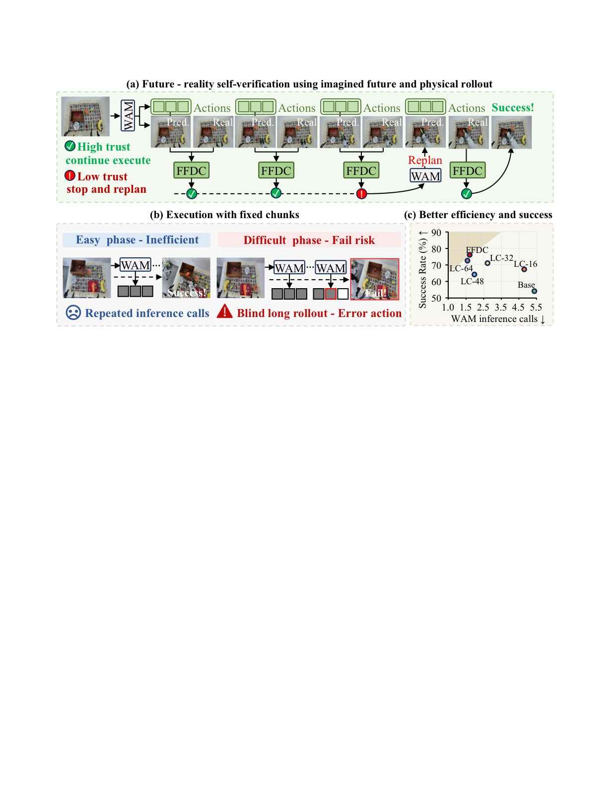
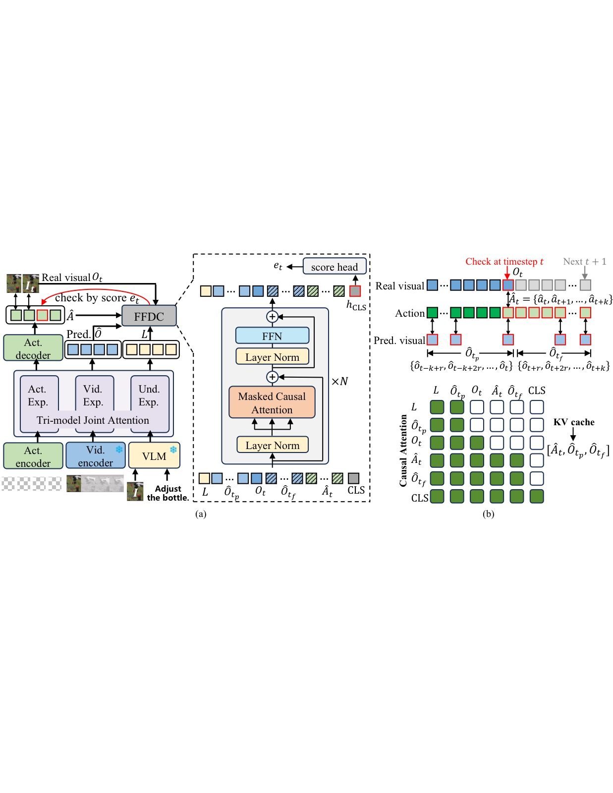
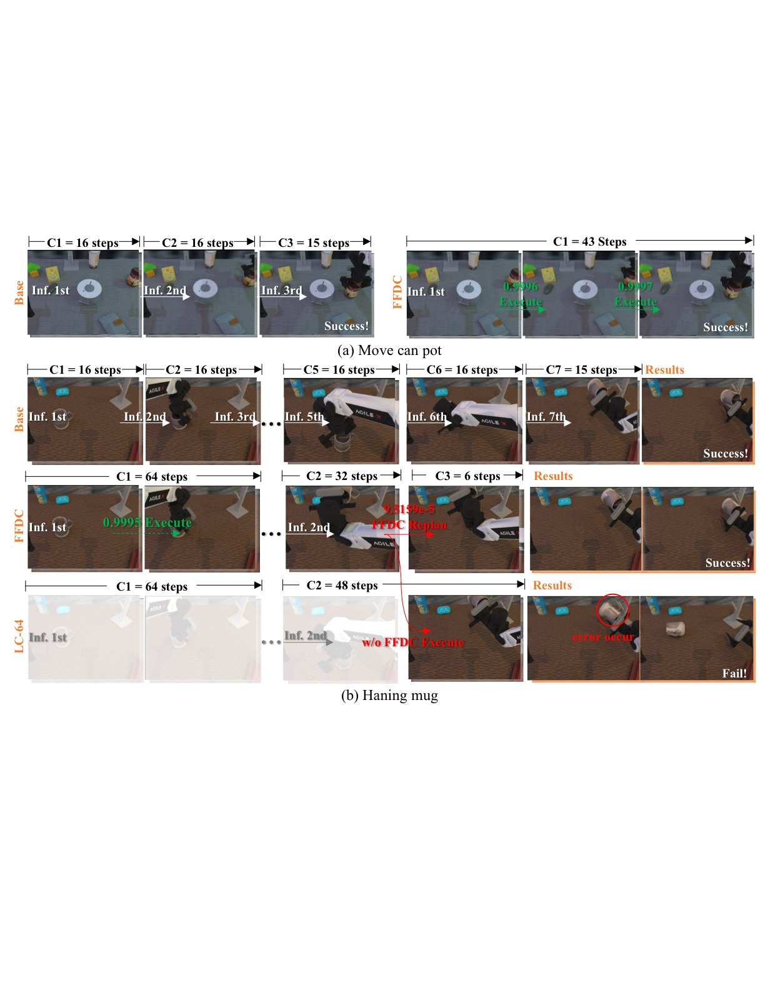
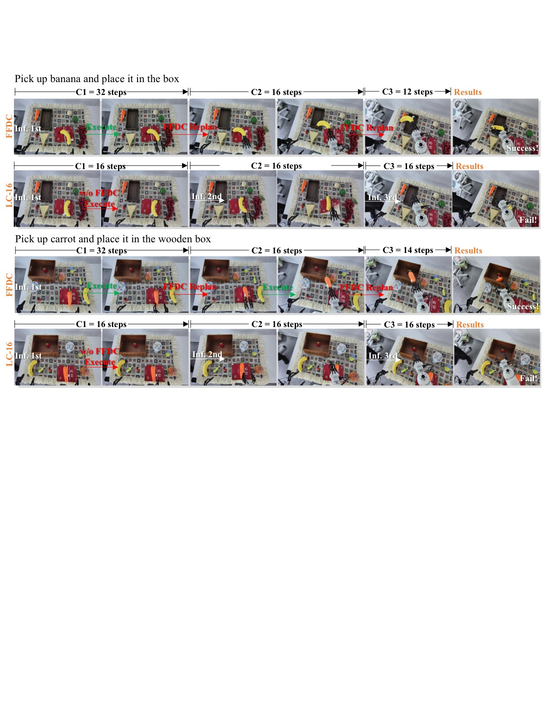

# When to Trust Imagination: Adaptive Action Execution for World Action Models

> **论文信息**
> - 作者：Rui Wang$^*$, Yue Zhang$^*$, Jiehong Lin, Kuncheng Luo, Jianan Wang, Zhongrui Wang$^\dagger$, Xiaojuan Qi$^\dagger$
> - 通讯作者：Zhongrui Wang (SUSTech), Xiaojuan Qi (HKU)
> - 投稿方向：NeurIPS 2026（投稿中）
> - arXiv ID：2605.06222v2
> - 代码：未开源

---

## 一、核心问题

World Action Models（WAM）能同时预测未来视觉观测和未来动作序列，在机器人操控中展现了强大的泛化能力。但当前 WAM 的推理执行方式存在根本性局限：**每次推理预测一个固定长度的 action chunk，机器人执行完这个 chunk 后再重新推理**。这种固定长度执行忽略了两个关键事实：

1. **可预测阶段浪费计算**：在简单、可预测的阶段（如接近刚性杯子），WAM 的预测在很长 horizon 内都是准确的，频繁重新推理纯属浪费。
2. **困难阶段累积误差**：在接触密集、变形物体、随机性强的情况下，预测很快就不准了，但机器人仍然盲目执行剩余的不可靠动作，导致失败。

> 核心挑战不是选择一个"更好的 chunk size"，而是判断 **WAM 的想象何时仍可被信任**。

*图1：FFDC 实现 WAM 的"自适应信任"。该图从三个层面展示了本方法的核心思路。*

**子图 (a) 自适应验证机制：** 展示 FFDC-WAM 的完整工作流。WAM 接收当前观测和语言指令，每次推理输出三样东西——未来的视觉动态预测（predicted visual dynamics）、动作序列（action chunk）以及语义 tokens。FFDC verifier 在物理执行过程中持续比对"想象"与"现实"：当 WAM 预测的视觉未来与实际观测、计划动作、指令保持因果一致时，允许机器人继续执行（Continue）；一旦检测到不一致，立即触发重新规划（Replan）。这一设计将 WAM 从"预测完就盲执行"转变为"带着未来预期去执行"。

**子图 (b) 固定 vs 自适应执行对比：** 对比了两种执行策略的差异。Fixed-size 方法在可预测阶段仍频繁推理（效率低），在困难阶段却盲目执行不可靠动作（成功率低）。FFDC 则在一致性高的绿色阶段执行长序列（省推理），在出现偏差的红色阶段立即重规划（保成功率），实现了两种需求的自动平衡。

**子图 (c) RoboTwin benchmark 散点图：** 横轴为任务完成时间（越左越快），纵轴为成功率（越上越高）。最理想的点是左上角——又快又好。FFDC-WAM 恰好处于这个位置，成功率达到最高的同时显著缩短了完成时间。相比之下，Base-Motus（chunk size=16）虽有较好成功率但速度慢，LC-64（一次执行 64 步的长 chunk）速度最快但成功率更低。FFDC 证明了两者可以兼得。

---

## 二、核心思路 / 方法

### 2.1 问题形式化：Future–Reality Verification

作者将自适应 WAM 执行形式化为一个**未来—现实一致性验证**问题：

- WAM 推断时输出 $(\hat{A}_{t+1:t+H}, \hat{O}_{t+1:t+H})$——未来 H 步的动作序列和对应的视觉 token 预测
- 在物理执行过程中，verifier $\mu_\phi$ 输入当前真实观测 $o_t$、剩余动作序列 $\hat{A}_{t:t+k}$、对应视觉预测 $\hat{O}_{t:t+k}$ 和语言指令 $\ell$，输出一个置信度分数 $e_t \in [0,1]$
- 如果 $e_t \ge \tau$（$\tau=0.5$），继续执行；否则立即触发重规划

这样一来，有效 chunk size 不再是手动设定的超参数，而是**未来—现实一致性自然涌现的结果**：一致性高时执行长（省推理），不一致时执行短（保安全）。

### 2.2 FFDC：Future Forward Dynamics Causal Attention

*图2：FFDC-WAM 系统架构。(a) 展示 WAM 推理与 FFDC verifier 的协作关系；(b) 展示 FFDC 的 structured causal attention 机制。*

**子图 (a) 系统总览：** WAM 每次推理输出三类信息——预测的未来动作序列（Action Tokens）、对应的视频 tokens（Video Tokens）、以及理解专家（Understanding Expert）从语言指令中提取的语义 tokens。这些 token 序列被缓存在 KV cache 中（白色块）。FFDC verifier 是一个轻量级 Transformer，在每个 check step $t$ 接收当前真实观测 $O_t$（蓝色块），与缓存的预测 tokens 进行结构化交叉注意力，输出一个执行置信度分数 $e_t \in [0,1]$。绿色分数表示可继续执行，红色分数表示需要重规划。

**子图 (b) 结构化因果注意力细节：** 展示了 FFDC 的核心——未来前向动力学因果注意力（Future Forward Dynamics Causal Attention）。输入序列由 6 部分组成：语言语义 tokens $L$（黄色）、WAM 预测的历史视觉 tokens $\hat{O}_{t_p}$（灰色）、当前真实观测 $O_t$（深灰）、WAM 预测的未来视觉 tokens $\hat{O}_{t_f}$（紫色）、未来动作 tokens $\hat{A}_t$（蓝色）、以及可学习的 [CLS] token（绿色）。注意力通过一个布尔可见性矩阵 $M$ 进行约束，强制未来视觉 token 只能注意到时间上对齐的动作 token 和更早的未来视觉 token。这种因果结构防止了信息泄漏，同时保证 verifier 能够评估"未来动作是否与预测的未来视觉一致、而预测的未来是否与实际观测兼容"这一关键问题。

**KV cache 设计的高效性：** WAM 推理产生的预测 tokens 只需计算一次并存入 KV cache。后续每个验证步，verifier 只需编码最新的真实观测 $O_t$，然后对缓存的 tokens 做轻量级注意力计算——不需要重新运行 WAM。

---

## 三、训练目标

### 3.1 WAM 训练：Mixture-of-Horizon

为了支持自适应执行的长 horizon 轨迹覆盖，作者提出了 Mixture-of-Horizon 训练策略：

- 从 episode 中**均匀随机采样**一个时间步 $s$ 作为条件起点（而非总是从 episode 开头开始）
- 给定 horizon $H$，动作索引为 $\tau_i = \min(s+i, T)$，视频索引为 $\upsilon_j = \min(s+jr, T)$
- 越界位置用最后一个有效帧/动作重复填充

这使得训练覆盖了更长的预测 horizon 和更多样的起始状态，减少了仅从 episode 前缀采样的偏差。

### 3.2 Verifier 训练：二分类 + 数据增强

Verifier 作为一个二分类器训练，损失函数为标准二元交叉熵：

$$\mathcal{L}_{\text{ver}} = -[y \log \sigma(z) + (1-y) \log (1-\sigma(z))]$$

**训练数据构造**：
- **正样本**（$y=1$）：来自演示数据中的有效轨迹段 + 少量成功 rollout
- **负样本**（$y=0$）：来自少量失败 rollout + 对有效演示的合成破坏（synthetic corruptions）

四种合成破坏方式：
1. **Temporal Swap**：随机交换 horizon 内的两对动作
2. **Gripper Flip**：翻转夹爪维度的符号
3. **Late-Stage Gaussian Noise**：对序列后半段加高斯噪声
4. **Tail Scaling**：对随机采样的尾部片段乘以随机缩放因子

---

## 四、实验与结果

实验基于 Motus WAM 作为 backbone，在 RoboTwin 仿真 benchmark（50 个任务，clean/random 两种设置，每个任务 100 次执行）和真实世界 Astribot S1 机器人（25 DoF）上进行。

**对比基线**：
- **Base-Motus**：chunk size=16，训练和测试都用 16
- **LC-16/32/48/64**：用 chunk size=64 训练的长 horizon backbone，测试时分别只执行前 16/32/48/64 步

### 4.1 仿真结果

| 设置 | 指标 | Base-Motus | LC-16 | LC-32 | LC-48 | LC-64 | FFDC-WAM |
|------|------|-----------|-------|-------|-------|-------|----------|
| Rand.hard | SR(%) | 54.20 | 67.40 | 71.60 | 65.00 | 73.00 | **76.40** |
| Rand.hard | T(s) | 33.0 | 29.4 | 21.2 | 19.0 | 16.5 | 20.5 |
| Clean.hard | SR(%) | 57.80 | 64.40 | 70.60 | 67.40 | 74.60 | **76.00** |
| Rand.easy | SR(%) | 89.16 | 85.58 | 88.64 | 88.49 | 88.89 | **89.51** |
| Rand.easy | T(s) | 23.5 | 51.4 | 16.0 | 13.9 | 13.3 | 15.7 |
| Clean.easy | SR(%) | **90.98** | 86.82 | 89.38 | 89.73 | 90.00 | 90.33 |
| Clean.easy | T(s) | 20.4 | 18.3 | 13.4 | 11.4 | 10.7 | 12.9 |
| Rand.avg | Calls | 5.47 | 4.76 | 2.67 | 1.81 | 1.56 | **1.69** |

关键发现：
- **融合效率与鲁棒性最优**：FFDC-WAM 在 hard 任务上大幅提升 SR（Rand.hard: 54.20%→76.40%），在 easy 任务上大幅缩短时间（21%–37%）
- **推理调用减少 69.10%**：相对于 Base-Motus 的 5.47 次平均调用，FFDC-WAM 仅需 1.69 次
- **固定长 chunk 的代价**：LC-64 虽然推理次数最少（1.56），但 hard 任务 SR 从 76.40% 降至 73.00%

### 4.2 真实世界结果

| 任务 | 指标 | LC-16 | FFDC-WAM |
|------|------|-------|----------|
| pick banana and place | SR(%) | 50 | **80** |
| pick carrot and place | SR(%) | 40 | **80** |
| Average | SR(%) | 45 | **80** |
| Average | T(s) | 25.6 | 28.1 |
| Average | Calls | 14 | 16 |

FFDC-WAM 在真实世界的成功率从 45% 提升到 80%（+35 个百分点）。推理次数和时间的略微增加是因为在真实世界中感知噪声和接触不确定性更大，FFDC 增加了必要的在线修正——这正是"用适度的额外计算换取大幅鲁棒性提升"的体现。

### 4.3 消融实验

在 RoboTwin hard 任务子集（5 个任务）上，逐一移除 FFDC 的四个输入模态：

| 变体 | 移除内容 | Avg SR(%) | Avg T(s) |
|------|---------|-----------|----------|
| FFDC-WAM | 完整模型 | **76.4** | 20.5 |
| w/o Und | 语言指令 | 74.8 | 22.1 |
| w/o Pred | 预测视觉 tokens | 71.6 | 20.8 |
| w/o Real | 当前真实观测 | 72.4 | 21.0 |
| w/o Action | 预测动作 | 73.4 | 21.0 |

**移除预测视觉 tokens 导致最大性能下降**（76.4%→71.6%），说明 WAM 的"想象"是判断 rollout 可信度最重要的信号。移除真实观测也导致明显下降（76.4%→72.4%），验证了"想象与现实的对比"这一核心设计。移除动作输入和语言指令也产生一致但相对较小的下降。

### 4.4 定性可视化

*图3：两种任务上的 FFDC-WAM vs Base-Motus 执行行为对比。绿色标识表示 FFDC 高置信度，允许继续执行；红色标识表示低置信度，触发重规划。*

**子图 (a) 简单任务（move can pot）：** Base-Motus 由于固定短 chunk（16 步），需要 3 次 WAM 推理（C1→C2→C3）才完成任务。FFDC-WAM 在整个执行过程中置信度始终很高（绿色分数），仅需 1 次推理就完成了全部动作（C1 覆盖了整个任务）。这直接展示了自适应长执行在可预测阶段的计算节省效果。

**子图 (b) 困难任务（hanging mug）：** 这是一个需要精确对准挂钩的精细操作。Base-Motus 需要 7 次 WAM 推理（C1 到 C7）才成功。FFDC-WAM 展现出智能的自适应行为：在运输阶段（从抓取杯子到接近挂钩），置信度高，执行了长 chunk；进入精度关键的最终悬挂阶段时，置信度下降（红色分数），立即切换到高频重规划模式。如果不用 FFDC，直接开环执行与 C1 同样长度的 chunk，则误差累积最终导致失败（底部帧显示）。这说明 FFDC 实现了"在需要精确反馈的地方自动切换为谨慎模式"。

---

*图4：真实世界中的定性示例，展示 FFDC 如何检测执行偏差并触发重规划。*

**香蕉抓取任务（上一行）：** LC-16（固定短 chunk）在抓取香蕉的过程中持续开环执行，中间帧显示手指位置偏离目标后没有进行修正，最终失败。FFDC-WAM（下一行）展现出交替的执行与重规划行为——当真实场景与预测 rollout 出现偏差时，FFDC 检测到不一致并触发重新推理，机器人修正动作后最终成功抓取。

**胡萝卜抓取任务（下一组）：** 同样的模式——LC-16 在接近胡萝卜的过程中继续执行偏离的动作导致失败，而 FFDC-WAM 通过在线验证检测到执行漂移（drift），自动触发 replanning 后的修正动作，成功完成了抓取。两个任务共同验证了 FFDC 在真实世界感知噪声和接触不确定性下的鲁棒性增益。

---

## 五、关键洞察与技术亮点

1. **从"如何执行"到"何时信任"的视角转换**：不再问"chunk size 多大好"，而是问"WAM 的想象现在还靠谱吗"。这是对 WAM 这个模型家族独特能力（联合预测视觉+动作）的首次充分利用。

2. **未来—现实一致性作为自适应信号**：现有的自适应方法（基于动作不确定性、熵、policy confidence）都是"只看当前"，FFDC 第一次利用了 WAM 的"未来视觉预测"作为在线验证信号——这是 WAM 独有而 VLA 不具备的能力。

3. **因果注意力 + KV cache 的高效架构**：FFDC 用结构化布尔 mask 强制"未来动作↔未来视觉"之间只有因果交互，同时将 WAM 预测 tokens 缓存为 KV cache，验证时仅需编码当前观测并做轻量注意力——非常高效。

4. **合成负样本数据增强**：通过 temporal swap、gripper flip、late-stage noise、tail scaling 四种方式从有效演示中构造不可执行的轨迹段，解决了真实负样本不足的问题。

5. **难度感知的推理分配**：FFDC 在 hard 任务上调用更多推理（2.34 次），在 easy 任务上接近 LC-64 的水平（1.62 次），实现了"按需分配"的推理预算。

---

## 六、局限性

1. **二分类监督的覆盖范围有限**：FFDC 用成功/失败/合成破坏的二元数据训练，可能无法覆盖真实世界执行中全部多样的偏差模式——更丰富的失败模式数据是重要扩展方向。

2. **固定阈值**：当前使用固定检测阈值 $\tau=0.5$，但不同任务和不同阶段可能适合不同的阈值——需要更系统地研究阈值对鲁棒性-效率权衡的影响。

3. **Verifier 参数量的权衡**：FFDC 设计较为轻量，虽然实验显示效果很好，但更深的 verifier 架构与效率之间的权衡空间尚未充分探索。

---

## 七、关键概念速查

| 概念 | 说明 |
|------|------|
| **WAM (World Action Model)** | 联合预测未来视觉观测和未来动作的生成式机器人策略模型 |
| **Action Chunking** | 一次推理预测多步动作，开环执行后再重新推理 |
| **FFDC (Future Forward Dynamics Causal Attention)** | 本文提出的轻量级 verifier，通过结构化因果注意力验证 WAM 想象的未来是否仍可信任 |
| **Future–Reality Verification** | 将自适应执行视为"未来预测 vs 现实观测"的一致性判断问题 |
| **Mixture-of-Horizon Training** | 均匀随机采样起始时间步的长 horizon 训练策略 |
| **KV Cache Verification** | WAM 预测 tokens 一次缓存，后续验证仅编码新观测 + 轻量注意力 |
| **Motus** | 本文所用的 WAM backbone，基于 rectified flow-matching 的联合视频-动作生成模型 |
| **RoboTwin** | 包含 50 个操控任务的仿真 benchmark，支持 clean 和 random（背景/光照/高度变化）两种设置 |
