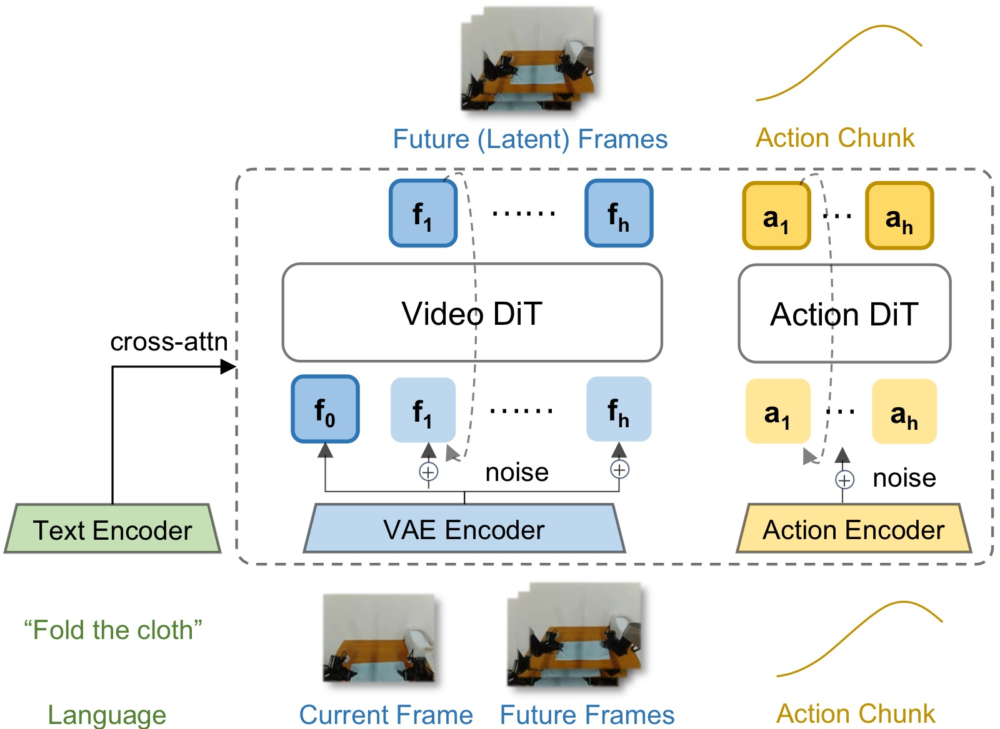
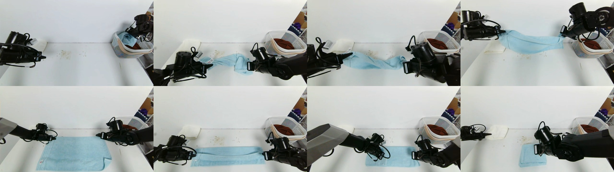
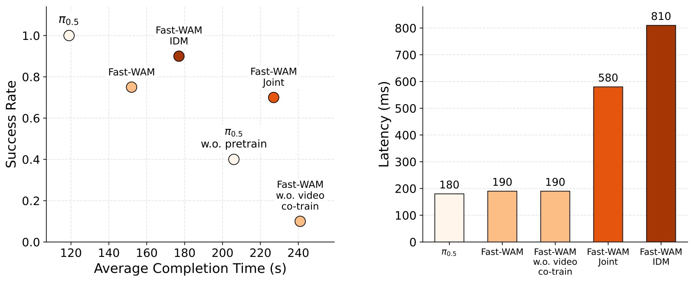

<!-- arxiv: 2603.16666 -->
<!-- venue: NeurIPS 2026（投稿中） -->
<!-- tags: WAM, 视频生成 -->

# Fast-WAM: Do World Action Models Need Test-time Future Imagination?

> **论文信息**
> - 作者：Tianyuan Yuan, Zibin Dong, Yicheng Liu, Hang Zhao
> - 通讯作者：Hang Zhao（赵行）
> - 单位：IIIS, Tsinghua University（清华大学交叉信息研究院）& Galaxea AI
> - 投稿方向：NeurIPS 2026（投稿中，under review）
> - arXiv ID：2603.16666
> - 代码：https://github.com/yuantianyuan01/FastWAM（含 LIBERO/RoboTwin 训练和评估代码）
> - 项目主页：https://yuantianyuan01.github.io/FastWAM/
> - 模型权重：https://huggingface.co/yuanty/fastwam

---

## 一、核心问题

World Action Models（WAM）通过同时建模未来视觉观测和动作预测，在具身控制中展现出了超越传统 Vision-Language-Action（VLA）模型的潜力。然而，几乎所有现有 WAM 都遵循 **"想象再执行"（imagine-then-execute）** 范式：先通过迭代视频去噪生成未来观测，再基于想象的未来预测动作。这带来了严重的测试时延迟问题（通常 >800ms），但从未有人系统研究过：**显式的未来想象是否真的必要？**

本文提出了一个根本性的问题：WAM 的收益究竟来自 **(1)** 训练时的视频建模目标（帮助学习更好的世界表征），还是来自 **(2)** 推理时的显式未来生成（提供额外的预见信息）？现有 WAM 将这两个因素耦合在一起，无法区分。

---

## 二、核心思路 / 方法

### 2.1 关键设计：解耦训练与推理

Fast-WAM 的核心思想是：**训练时保留视频联合训练（video co-training），推理时跳过未来预测，直接从世界表征中生成动作**。


*图1：三种代表性 WAM 范式对比。*

**子图 (A) Joint-modeling WAM（联合建模）：** 未来视频 token 和动作 token 在共享模型中被一起去噪。Action token 和 video token 通过共享注意力交互，动作生成与未来视频建模在整个去噪过程中耦合。代表工作：Motus、Unified World Models。

**子图 (B) Causal WAM（因果式）：** 先独立生成未来视频（第一阶段去噪），再将生成的未来表征作为条件输入给动作预测模块（第二阶段去噪）。动作预测以冻结的去噪视频为条件。代表工作：LingBot-VA、Vidar。

**子图 (C) Fast-WAM（本文方法）：** 训练时保留视频去噪和动作去噪两个分支（通过 Mixure-of-Transformer 架构共享注意力），但推理时完全移除未来视频分支。仅保留第一帧观测的干净 latent token，通过 video DiT 进行一次前向编码，产生世界表征 $z(o, l)$，然后仅对 action token 进行去噪生成动作。推理延迟从 810ms 降至 190ms。

### 2.2 架构：Mixture-of-Transformer (MoT)



*图2：Fast-WAM 模型架构（左）与结构化注意力掩码（右）。*

**架构组件（图2 左）：**

- **Video VAE（冻结）：** 将视觉观测编码为 latent token。多相机图像在输入 VAE 之前沿空间维度拼接为单张图像。时间维度进行 4× 下采样，结果 9 帧视频对应 $\sim$3 个 latent 时间步。
- **T5 文本编码器（冻结）：** 编码任务指令，通过 cross-attention 注入所有 token。
- **Video DiT（Wan2.2-5B）：** 世界建模骨干，30 层，hidden_dim=3072，24 头注意力，作为 MoT 的 "video expert"。
- **Action DiT（1B）：** 动作专家，30 层但 hidden_dim 缩减为 1024，作为 MoT 的 "action expert"。与 video DiT 共享注意力头数和每头维度，确保可以拼接做 mixed attention。
- **Proprio 编码器：** 可选的单层线性层，将本体感知状态投影到文本维度后拼接到 context 中。

**注意力掩码（图2 右）：**

训练时（Training Mask）的 token 分组和交互规则：
- **Clean first-frame tokens（C）：** 不 attend 任何其他 token（防止未来信息泄漏），仅作为视觉锚点被其他 token attend
- **Noisy future video tokens（N）：** 双向 attend 视频内所有 token，可访问 clean first-frame tokens，不可访问 action tokens
- **Action tokens（A）：** 双向 attend action 内所有 token，可访问 clean first-frame tokens，**不可访问未来视频 token**（关键设计——防止动作分支窥探未来）

推理时（Inference Mask）：未来视频分支完全移除，仅保留 clean first-frame tokens。Action tokens 仅 attend 自己和 first-frame tokens。

### 2.3 受控变体设计

为了回答核心问题，作者在同一框架下实现了三种受控变体：

| 变体 | 训练 | 推理 | 映射到现有工作 |
|------|------|------|----------------|
| **Fast-WAM** | 视频 + 动作联合训练 | 仅动作去噪（first-frame 编码） | 本文提出 |
| **Fast-WAM-Joint** | 视频 + 动作联合训练，action 可 attend 全部 video tokens | 视频 + 动作联合去噪 | Motus 等 |
| **Fast-WAM-IDM** | 视频 + 动作联合训练，teacher-forcing（50% 概率对 cond-video 加噪） | 先视频去噪，再基于冻结视频做动作去噪 | LingBot-VA 等 |
| **Fast-WAM w.o. video co-train** | 仅动作训练（架构不变，去掉 $\mathcal{L}_{\text{vid}}$） | 仅动作去噪 | 消融对照 |

---

## 三、训练目标

Fast-WAM 使用 **Flow Matching** 目标联合训练动作和视频分支。

### 3.1 Flow Matching 公式

给定目标变量 $y$（动作 chunk 或未来视频 latent），从高斯噪声 $\epsilon \sim \mathcal{N}(0, I)$ 和时间步 $t \in (0,1)$ 构造插值样本：

$$y_t = (1-t) y + t \epsilon$$

模型预测速度场（velocity field）：

$$\mathcal{L}_{\text{FM}}(y) = \mathbb{E}_{y, \epsilon, t} \left[ \| f_\theta(y_t, t, o, l) - (\epsilon - y) \|_2^2 \right]$$

### 3.2 联合目标

- **动作损失：** $\mathcal{L}_{\text{act}} = \mathcal{L}_{\text{FM}}(a_{1:H})$，其中 $H=32$ 为动作 chunk 长度
- **视频损失：** $\mathcal{L}_{\text{vid}} = \mathcal{L}_{\text{FM}}(z_{1:T})$，其中 $z_{1:T}$ 为 VAE 编码的未来帧 latent（每 chunk 9 帧）
- **总损失：** $\mathcal{L} = \mathcal{L}_{\text{act}} + \lambda \mathcal{L}_{\text{vid}}$

### 3.3 训练细节

- 骨干：Wan2.2-5B video DiT（30 层，hidden_dim=3072，24 头，attn_head_dim=128）
- Action expert：相同架构但 hidden_dim=1024（1B 参数），总模型 6B
- 优化器：AdamW，lr=1e-4，weight decay=0.01，cosine annealing
- 推理：10 步去噪，CFG scale=1.0（实际不使用 CFG）
- 噪声调度：logit-normal 分布（遵循 Wan2.2）
- 延迟测量：单张 NVIDIA RTX 5090D V2 32GB

---

## 四、实验与结果

### 4.1 仿真基准：LIBERO 和 RoboTwin

**LIBERO 结果（4 个 suite，40 个任务，2000 次评估试验）：**

| 方法 | Embodied PT. | Spatial | Object | Goal | Long | **Average** |
|------|:---:|---|---|---|---|---|
| OpenVLA | ✓ | 84.7 | 88.4 | 79.2 | 53.7 | 76.5 |
| π₀ | ✓ | 96.8 | 98.8 | 95.8 | 85.2 | 94.1 |
| π₀.₅ | ✓ | 98.8 | 98.2 | 98.0 | 92.4 | 96.9 |
| LingBot-VA | ✓ | 98.5 | 99.6 | 97.2 | 98.5 | **98.5** |
| Motus | ✓ | 96.8 | 99.8 | 96.6 | 97.6 | 97.7 |
| **Fast-WAM** | ✗ | 98.2 | 100.0 | 97.0 | 95.2 | 97.6 |
| Fast-WAM-Joint | ✗ | 99.6 | 99.4 | 98.2 | 96.8 | **98.5** |
| Fast-WAM-IDM | ✗ | 98.8 | 97.8 | 97.8 | 97.6 | 98.0 |
| Fast-WAM w.o. co-train | ✗ | 89.2 | 99.2 | 95.4 | 90.0 | 93.5 |

关键发现：
- Fast-WAM（97.6%）在无 embodied pretraining 条件下与预训练的 Motus（97.7%）持平，显著优于同为无预训练的 WAM 基线
- Fast-WAM vs Fast-WAM-Joint（98.5%）差距仅 0.9 个百分点，说明跳过推理时未来想象的成本很小
- **去掉 video co-training 后掉到 93.5%（-4.1pp），尤其在 Spatial（-9pp）和 Long（-5.2pp）子集上退化严重**

**RoboTwin 结果（50+ 双手机器人任务，100 次试验/任务）：**

| 方法 | Embodied PT. | Clean | Rand. | **Average** |
|------|:---:|---|---|---|
| π₀ | ✓ | 65.92 | 58.40 | 62.2 |
| π₀.₅ | ✓ | 82.74 | 76.76 | 79.8 |
| Motus | ✓ | 88.66 | 87.02 | 87.8 |
| Motus (from WAN2.2) | ✗ | 77.56 | 77.00 | 77.3 |
| LingBot-VA | ✓ | 92.90 | 91.50 | **92.2** |
| LingBot-VA (from WAN2.2) | ✗ | 80.60 | -- | 80.6 |
| **Fast-WAM** | ✗ | 91.88 | 91.78 | **91.8** |
| Fast-WAM-Joint | ✗ | 90.84 | 90.32 | 90.6 |
| Fast-WAM-IDM | ✗ | 91.16 | 91.34 | 91.3 |
| Fast-WAM w.o. co-train | ✗ | 82.76 | 84.80 | 83.8 |

关键发现：
- Fast-WAM（91.8%）大幅超越同无预训练的 Motus（77.3%）和 LingBot-VA（80.6%），并接近预训练的 LingBot-VA（92.2%）
- 三个有 video co-training 的变体性能高度接近（90.6%~91.8%），差距在 1.2pp 以内
- 去掉 video co-training 导致 8pp 的大幅下降（91.8% → 83.8%）

### 4.2 真机实验：毛巾折叠



*图3：真机毛巾折叠任务（Galaxea R1 Lite 平台）。任务要求双臂协调操作柔性物体（毛巾），需要长期规划（长 horizon）和精确的闭环操控。演示数据量：60 小时遥操作数据。*

**真机结果：**



*图4：真机实验结果，左图为成功率 vs 平均完成时间散点图（越靠左上越好），右图为推理延迟对比。*

**左图解读（成功率 vs 完成时间）：**
- 预训练的 π₀.₅ 表现最优（成功率最高 + 完成时间最短），这符合预期——它有大规模式 embodied 预训练数据
- 在 Fast-WAM 家族中，Fast-WAM-IDM 成功率最高（约 55%），但 Fast-WAM 完成时间更短（约 35s vs 约 45s），说明去掉了未来生成后执行效率更高
- 去掉 video co-training 的变体成功率骤降至仅 10%，且完成时间最长。这一退化幅度远超三个有 co-training 变体之间的差异
- 所有带 video co-training 的 Fast-WAM 变体均大幅优于无预训练的 π₀.₅，验证了 WAM 式视频联合训练在数据效率上的优势

**右图解读（推理延迟）：**
- Fast-WAM：190ms（实时级别，>20Hz）
- Fast-WAM-Joint：约 410ms（联合去噪，需同时维护 video+action 两组 token）
- Fast-WAM-IDM：810ms（两阶段推理：先视频去噪再动作去噪）
- Fast-WAM 比 imagine-then-execute 变体快 4×+，是实现真机实时部署的关键优势

### 4.3 核心结论

> 三组实验（LIBERO、RoboTwin、真机）一致表明：**去掉 video co-training 导致的性能退化远大于在推理时跳过未来想象**。WAM 的主要价值在于训练时通过视频预测目标塑造更好的世界表征，而非推理时的显式未来生成。

---

## 五、关键洞察与技术亮点

1. **"预训练"来自视频模型而非具身数据：** Fast-WAM 无需任何 embodied pretraining 即达到 SOTA 水平。其世界建模能力继承自 Wan2.2-5B 的视频生成预训练权重，通过 video co-training 将这些知识迁移到具身控制任务。

2. **Structured Attention Mask 是关键设计：** 通过精确控制 token 间的注意力流（action token 不能看未来 video token，clean first-frame 不 attend 任何 token），确保动作分支确实在"预测"而非"窥探"，同时让两个分支共享视觉锚点。

3. **KV-Cache 推理优化：** Fast-WAM 推理时使用 `prefill_video_cache` 将 first-frame 的 video DiT 编码结果缓存为逐层 K/V，action 去噪的每一步只需计算 action token 的 attention（以缓存 video K/V 为条件），避免重复编码视频。

4. **Flow Matching 统一框架：** Action 和 video 使用相同的 flow matching 公式和 logit-normal 噪声调度，简化了实现和超参调优。

5. **Action Chunk = 32 的设计：** 每 32 步 action 对应 9 帧视频（4× 时间下采样后），action 维度与 video 时间维度对齐，确保时间一致性。

---

## 六、代码实现解读

### 6.1 整体架构数据流

```
                          ┌─────────────────────────────────┐
                          │        FastWAM (6B total)        │
                          │                                  │
   Observation ──────────►│  Video VAE (frozen)              │
   (multi-cam)            │  ├─ encode → video latents       │
                          │  └─ first-frame latents ─────────┼──► prefill_video_cache()
                          │                                  │        │
   Language ─────────────►│  T5 Encoder (frozen)             │        │
   Instruction            │  └─ text embeddings ─────────────┼── cross-attn ──┐
                          │                                  │        │        │
                          │  ┌───────────────────────────────┘        │        │
                          │  │  Video DiT (30 layers, dim=3072)       │        │
                          │  │  └─ pre_dit() → tokens + freqs         │        │
                          │  │                                        ▼        │
                          │  │           ┌─────────────────────────────────┐   │
                          │  │           │       MoT (30 layers)           │   │
                          │  │           │  ┌───────────┬───────────────┐  │   │
                          │  │           │  │Layer i:   │               │  │   │
                          │  │           │  │ Q/K/V_cat │ Mixed Attn    │  │   │
                          │  │  ───────► │  │ [video+   │ (structured   │  │   │
                          │  │           │  │  action]  │  mask)        │  │   │
                          │  └─ kv_cache │  │   ──► split → post_block  │  │   │
                          │              │  └───────────┴───────────────┘  │   │
                          │              └─────────────────────────────────┘   │
                          │                                  │                 │
   Action Chunk (H=32) ──►│  Action DiT (30 layers, dim=1024)                  │
                          │  ├─ pre_dit() → action tokens + freqs              │
                          │  └─ post_dit() ← action_tokens ─────────────────────┘
                          │
                          │  Training only (┅┅┅):
                          │  ┌─ Video denoising loss (future frames)
                          │  └─ Action denoising loss (Flow Matching)
                          └─────────────────────────────────┘
```

### 6.2 关键代码文件映射

| 论文概念 | 代码位置 | 说明 |
|----------|----------|------|
| Fast-WAM 主模型 | `src/fastwam/models/wan22/fastwam.py` | `FastWAM` 类，包含训练/推理全流程 |
| MoT 混合注意力 | `src/fastwam/models/wan22/mot.py` | `MoT` 类，实现逐层 video+action 混合注意力 |
| Action DiT | `src/fastwam/models/wan22/action_dit.py` | `ActionDiT` 类，1B 动作专家 |
| Fast-WAM-Joint | `src/fastwam/models/wan22/fastwam_joint.py` | Joint modeling 变体（action attend 全部 video） |
| Fast-WAM-IDM | `src/fastwam/models/wan22/fastwam_idm.py` | IDM 变体（teacher-forcing + 两阶段推理） |
| Video DiT | `src/fastwam/models/wan22/wan_video_dit.py` | Wan2.2 DiT 骨干 |
| 训练器 | `src/fastwam/trainer.py` | 训练循环、DeepSpeed 集成 |
| 数据处理 | `src/fastwam/datasets/lerobot/` | LeRobot 格式数据集加载和预处理 |
| 模型配置 | `configs/model/fastwam.yaml` | 模型超参、scheduler、loss 权重 |
| 运行时工厂 | `src/fastwam/runtime.py` | `create_fastwam()` 从配置构建模型 |

### 6.3 训练流程（`FastWAM.training_loss`）

```
training_loss(sample)
│
├─ build_inputs(sample)
│  ├─ VAE.encode(video) → input_latents [B, C, T_latent, H_lat, W_lat]
│  ├─ extract first_frame_latents (if fuse_vae)
│  ├─ T5 context + optional proprio encoding
│  └─ action + action_is_pad
│
├─ Video branch:
│  ├─ sample noise_video, timestep_video
│  ├─ add_noise(input_latents) → noisy_latents
│  ├─ replace first frame with clean latents
│  └─ target_video = scheduler.training_target(input_latents, noise)
│
├─ Action branch:
│  ├─ sample noise_action, timestep_action
│  ├─ add_noise(action) → noisy_action
│  └─ target_action = scheduler.training_target(action, noise)
│
├─ pre_dit (video + action):
│  ├─ video_expert.pre_dit(noisy_latents) → tokens, freqs, t_mod, context
│  └─ action_expert.pre_dit(noisy_action)  → tokens, freqs, t_mod, context
│
├─ MoT forward (30 layers):
│  for each layer:
│    build Q/K/V per expert → concat → mixed_attention(structured_mask)
│    → split → post_block (self-attn + cross-attn + MLP) per expert
│
├─ post_dit:
│  ├─ video_expert.post_dit(tokens_out["video"]) → pred_video
│  └─ action_expert.post_dit(tokens_out["action"]) → pred_action
│
└─ Loss:
   ├─ loss_video = MSE(pred_video, target_video) [masked by image_is_pad]
   ├─ loss_action = MSE(pred_action, target_action) [masked by action_is_pad]
   └─ loss_total = λ_video * loss_video + λ_action * loss_action
```

### 6.4 推理流程（`FastWAM.infer_action` —— 核心 Fast Path）

```
infer_action(obs_image, instruction)
│
├─ VAE.encode(first_frame) → first_frame_latents
├─ random init → latents_action [1, 32, action_dim]
│
├─ video_expert.pre_dit(first_frame_latents, t=0)
│  └─ 返回 video tokens + freqs + t_mod + context
│
├─ mot.prefill_video_cache(video_tokens, ...)
│  └─ 逐层计算 video K/V，存入 kv_cache (30 层)
│     for each layer:
│       Q_video, K_video, V_video = build(video_tokens)
│       mixed = flash_attention(Q_video, K_video, V_video, self_mask)
│       video_tokens = post_block(video_tokens, mixed)
│       kv_cache[layer] = {k: K_video, v: V_video}
│
├─ Denoising loop (10 steps):
│  for each step:
│    timestep_action = schedule[t]
│    action_pre = action_expert.pre_dit(latents_action, t)
│    └─ 返回 action tokens + freqs + t_mod
│
│    mot.forward_action_with_video_cache(
│      action_tokens, kv_cache, joint_attention_mask
│    )
│    └─ for each layer:
│         Q_act, K_act, V_act = build(action_tokens)
│         K_cat = concat([kv_cache[layer].k, K_act])
│         V_cat = concat([kv_cache[layer].v, V_act])
│         mixed = flash_attention(Q_act, K_cat, V_cat, action_rows_of_joint_mask)
│         action_tokens = post_block(action_tokens, mixed)
│
│    pred_action = action_expert.post_dit(action_tokens)
│    latents_action = scheduler.step(pred_action, delta, latents_action)
│
└─ return latents_action → action chunk (32 steps)
```

### 6.5 Structured Attention Mask 实现

```python
# fastwam.py:_build_mot_attention_mask()
def _build_mot_attention_mask(video_seq_len, action_seq_len, video_tokens_per_frame):
    mask = zeros(total_seq, total_seq)  # 全零 = 不可见

    # video → video: 由 video_expert 的配置决定
    #   "first_frame_causal" 模式: first-frame 双向，后续帧因果
    mask[:video_seq_len, :video_seq_len] = video_mask

    # action → action: 双向（action chunk 内部完全可见）
    mask[video_seq_len:, video_seq_len:] = True

    # action → first-frame video: 可访问视觉锚点
    mask[video_seq_len:, :video_tokens_per_frame] = True

    # action → future video: 不可见！（关键解耦设计）
    # 这一行被刻意留为 False

    return mask
```

Fast-WAM-Joint 的关键区别：`mask[video_seq_len:, :video_seq_len] = True` —— action 可访问全部 video token（包括未来帧），形成联合建模。

### 6.6 Teacher-Forcing in Fast-WAM-IDM

Fast-WAM-IDM 训练时引入了第三个分支（cond-video），以 50% 概率对其加噪：

```
training_loss (IDM variant):
├─ Branch A: noisy video → video denoising loss
├─ Branch B: noisy action → action denoising loss
├─ Branch C: cond video (50% noisy / 50% clean)
│
├─ 拼接 [noisy_video, cond_video] 作为 video expert 输入
├─ Action 仅 attend cond_video（不 attend noisy_video）
└─ 推理时两阶段：先去噪 video → 冻结 cond → 去噪 action
```

---

## 七、局限性

1. **仅研究单步 action chunk：** 论文为简化控制实验，省略了外层的自回归 rollout 循环。真实部署中需要滑动窗口式的 chunk 执行，外层 rollout 的影响未被研究。
2. **未探索更大规模预训练：** Fast-WAM 使用 Wan2.2-5B 作为骨干，未测试更大视频模型（如 Wan2.2-14B）或更多预训练数据下的 scaling 行为。
3. **单任务毛巾折叠的真机实验范围有限：** 真机仅测试了一个任务（毛巾折叠），虽然该任务有代表性（长 horizon + 柔性物体），但更多样化的真机任务（如灵巧操作、移动操作）的验证仍缺乏。
4. **Flow Matching 与 action 的兼容性未深入探讨：** Action 是低维连续向量（通常 <20 维），与高维视频 latent（48 通道 × 空间 × 时间）在 flow matching 中的行为差异未被分析，可能存在更适合 action 的替代训练目标。

---

## 八、关键概念速查

| 概念 | 说明 |
|------|------|
| **WAM (World Action Model)** | 同时建模未来视觉观测和动作生成的具身策略模型 |
| **VLA (Vision-Language-Action)** | 直接从视觉+语言映射到动作的策略模型，不显式建模未来 |
| **Imagine-then-Execute** | 先想象未来 → 再基于想象执行动作的 WAM 推理范式 |
| **Video Co-training** | 训练时额外的视频预测/去噪目标，作为动作学习的辅助信号 |
| **MoT (Mixture-of-Transformer)** | 多个专家 DiT 共享混合注意力的架构 |
| **Flow Matching** | 通过预测速度场从噪声到数据的生成模型训练方法，替代 DDPM |
| **Logit-normal Schedule** | Wan2.2 使用的噪声调度策略，从 logit-normal 分布采样时间步 t |
| **KV-Cache** | 推理时将视频编码的逐层 K/V 缓存，供 action 去噪多步复用 |
| **Teacher Forcing** | IDM 变体中：训练时以一定概率对 cond-video 加噪，使 action 分支学会利用不同质量的视频条件 |
| **LIBERO** | 机器人操作仿真基准，含 4 个 suite（Spatial/Object/Goal/Long）共 40 个任务 |
| **RoboTwin 2.0** | 双臂协调操作仿真基准，50+ 任务，含 clean 和 randomized 两种场景 |
