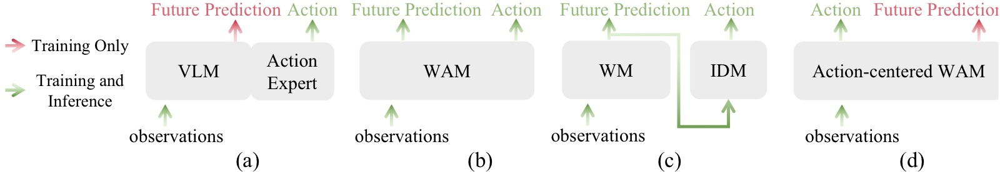
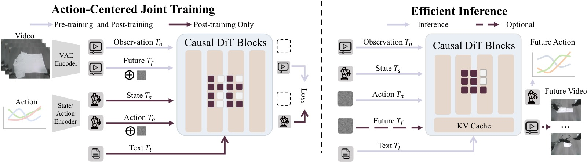
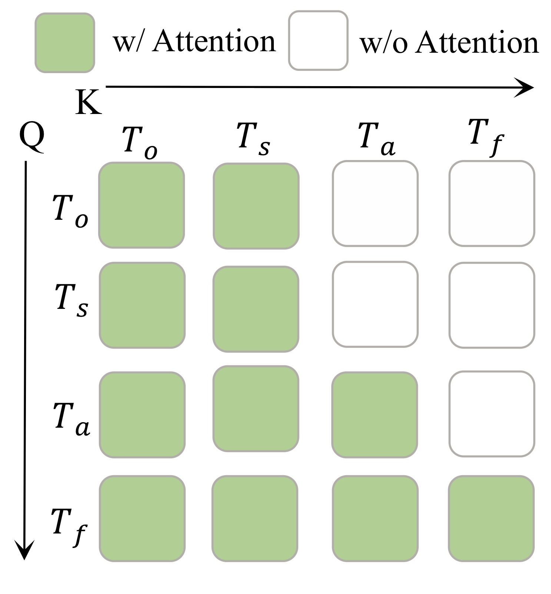
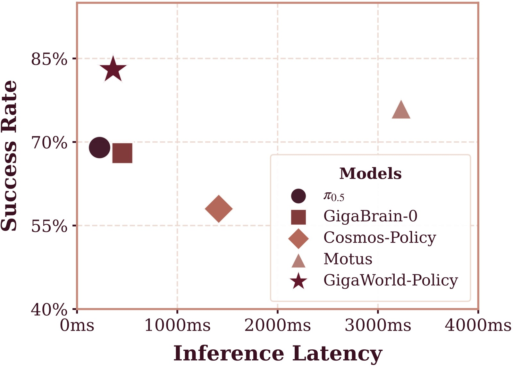
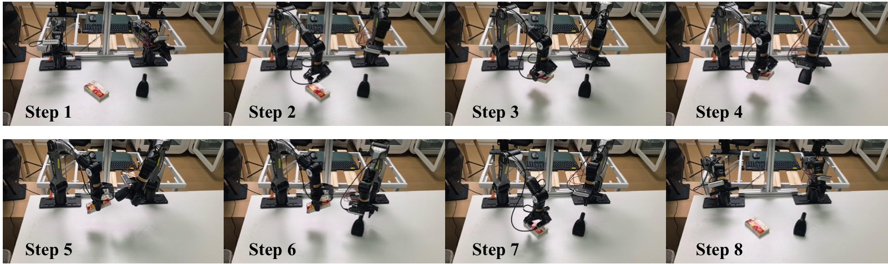
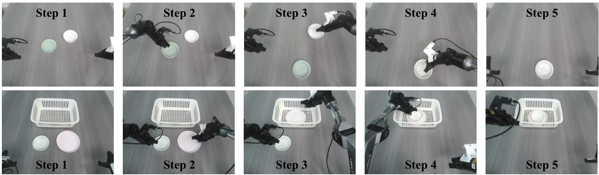
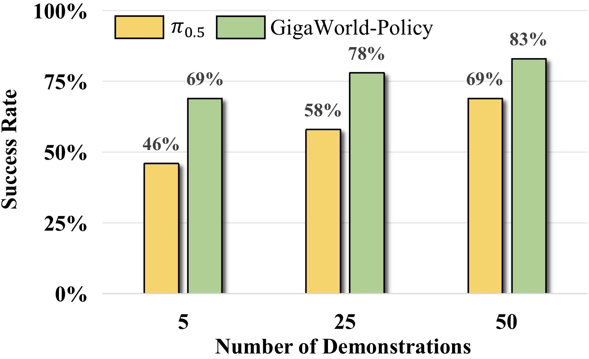
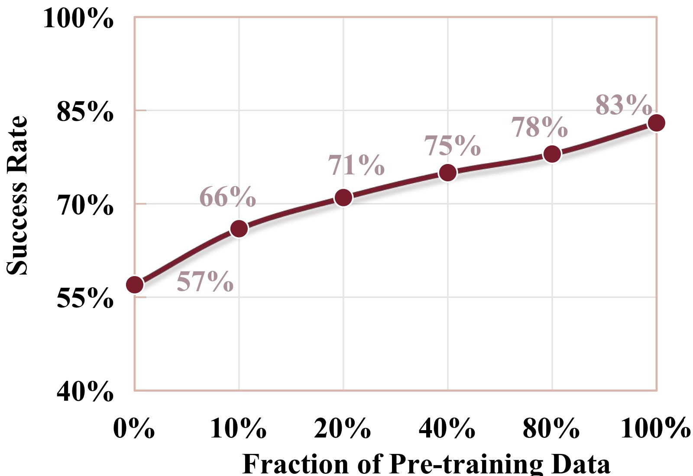
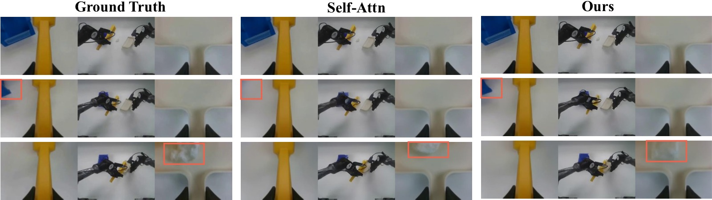

<!-- arxiv: 2603.17240 -->
<!-- venue: 投稿中 (under review) -->
<!-- tags: WAM, 视频生成 -->

# GigaWorld-Policy: An Efficient Action-Centered World-Action Model

> **论文信息**
> - 作者：GigaAI（GigaWorld Team, alphabetical order: Angen Ye, Boyuan Wang, Chaojun Ni, Guan Huang, Guosheng Zhao, Hao Li, Hengtao Li, Jie Li, Jindi Lv, Jingyu Liu, Min Cao, Peng Li, Qiuping Deng, Wenjun Mei, Xiaofeng Wang, Xinze Chen, Xinyu Zhou, Yang Wang, Yifan Chang, Yifan Li, Yukun Zhou, Yun Ye, Zhichao Liu, Zheng Zhu）
> - 通讯作者：团队署名（GigaAI）
> - 投稿方向：投稿中（under review）
> - arXiv ID：2603.17240
> - 代码：https://github.com/GigaAI-Research/GigaWorld-Policy
> - 项目主页：https://gigaai-research.github.io/GigaWorld-Policy/

---

## 一、核心问题

World-Action Models（WAM）从预训练视频生成骨干网络初始化，在机器人策略学习中展现出巨大潜力。但现有方法面临两个关键瓶颈：

1. **推理开销大**：联合推理未来视觉动态和对应动作需要大量计算，导致高延迟。Motus 推理一次需要 3231ms，无法满足实时控制需求。
2. **表示纠缠（Representation Entanglement）**：联合建模将视觉和运动表示耦合在一起，动作预测的质量严重依赖于未来视频预测的准确性。视频预测的小误差会随时间累积，导致长时域控制性能退化。

> 核心洞察：动作预测不需要显式的未来视频生成。视频动态可以作为**训练时的密集监督信号和推理信号**，但在推理时完全可以省略——只要模型在训练中通过合适的因果结构学会了"在脑中想象"的能力。

---

## 二、核心思路 / 方法

### 2.1 关键设计：Action-Centered WAM，推理时视频预测可选

GigaWorld-Policy 的核心思想是：**训练时联合预测动作和未来视频（以动作为条件），推理时利用因果掩码设计只解码动作，跳过视频生成**。



*图1：四种具身策略范式对比，从 VLA 辅助监督到本文的 action-centered WAM。*

**子图 (a) VLM-based VLA + 辅助未来监督：** 在传统 VLA（如 π₀、π₀.₅）基础上，引入未来状态预测作为辅助损失（如 WorldVLA、DreamVLA、SwiftVLA），试图加密集训信号。但 VLM 骨干本质上是判别性模型而非生成模型，很难将辅助损失转化为物理一致的动作分布。

**子图 (b) Joint Action-Video Prediction（双向注意力）：** Motus、Cosmos-Policy 等方法在统一模型中同时预测动作和视频，使用双向注意力使两者耦合。推理时必须先生成未来视频才能得到动作，延迟高（Motus ~3231ms），且视频预测误差会跨模态传播。

**子图 (c) Two-stage（先生成视频再解码动作）：** MimicVideo、LingBot-VA 等方法先通过视频模型生成未来观测，再通过逆动力学模型（IDM）从预测的视频中解码动作。这种级联方式直接继承了视频预测的全部误差，且额外增加了 IDM 推理开销。

**子图 (d) GigaWorld-Policy（本文方法）：** 训练时视频动态作为密集监督和推理信号，提供比稀疏动作标签丰富得多的学习信号。推理时利用因果掩码设计——动作 token 不依赖未来视频 token——直接跳过视频生成，仅解码动作。视频预测变为可选项。

### 2.2 架构设计



*图2：GigaWorld-Policy 整体架构。基于预训练视频生成骨干，预训练阶段从大规模视频数据中学习动作相关表征；后训练阶段联合进行动作 chunk 预测和未来视频预测作为辅助监督；推理时未来视频预测分支可选，实现快速推理。*

#### 输入表示

- **多视角拼接（Multi-view Concatenation）**：将左腕、前视、右腕三个相机视图沿宽度维度拼接为单一复合图像 $o_t^{comp} = Compose(o_t^{left}, o_t^{front}, o_t^{right})$。这种设计无需修改骨干网络即可支持多视角，并鼓励跨视角一致性。
- **稀疏未来帧预测**：由于相邻观测帧之间存在高时间相关性，模型以固定步长 $\Delta$ 预测稀疏未来帧 $\{o^{comp}_{t+k\Delta}\}_{k=1}^{K}$（$K = \lfloor p/\Delta \rfloor$），减少冗余监督。

#### Token 化

- **视觉 token**：当前观测 $o_t^{comp}$ 和未来观测 $\{o^{comp}_{t+k\Delta}\}$ 通过同一冻结 VAE 编码为 latent，再 tokenize 为时空视觉 token $T_o$（当前）和 $T_f$（未来）。
- **状态/动作 token**：本体感知状态和动作通过可学习的线性投影映射到骨干网络的隐藏维度，生成 $T_s$ 和 $T_a$。
- **文本 token**：任务指令 $l$ 通过预训练 T5 语言编码器编码为 $T_l$，通过 cross-attention 注入（不参与 causal self-attention 排序）。

#### 共享 Transformer 块

不同于 Motus 的 MoE（Mixture-of-Transformer）设计，GigaWorld-Policy 使用**单一共享 Transformer 块**处理所有 token 类型。视觉 token 和动作 token 在每一层共享相同的 Q/K/V 投影矩阵，紧密耦合动作与视觉证据。不同 token 类型使用不同位置编码：视觉 token 使用 2D 位置编码（图像网格），状态/动作 token 使用 1D 时序位置编码。

#### Causal Self-Attention 掩码：核心设计



*图3：GigaWorld-Policy 的块状因果注意力掩码。动作 token $T_a$ 只能看到状态 $T_s$ 和当前观测 $T_o$，未来视频 token $T_f$ 额外可以看到动作 token。*

将所有模态打包为统一 token 序列：

$$T_t = [T_o; T_s; T_a; T_f]$$

块状因果掩码的规则：

| Token 类型 | 可 attend | 不可 attend |
|-----------|----------|------------|
| $T_s$（状态） | $T_s$, $T_o$ | $T_a$, $T_f$ |
| $T_o$（当前观测） | $T_s$, $T_o$ | $T_a$, $T_f$ |
| $T_a$（动作） | $T_s$, $T_o$ | $T_f$ |
| $T_f$（未来视频） | $T_s$, $T_o$, $T_a$ | — |

这个设计的精妙之处在于：

1. **动作预测不依赖未来视频**（$T_a$ 不能 attend $T_f$），推理时去掉 $T_f$ 在架构上完全一致。
2. **未来视频预测以动作为条件**（$T_f$ 可以 attend $T_a$），使视觉动态建模与决策耦合。
3. **语言指令通过 cross-attention 注入**，不参与 causal 排序，因此不受掩码约束。

---

## 三、训练目标

GigaWorld-Policy 使用 **Flow Matching** 联合优化动作预测和视觉前馈动态建模。

### 3.1 Flow Matching 公式

对任意模态 $x$（动作 token 或未来视频 token），采样 flow time $s \sim \mathcal{U}(0,1)$ 和噪声 $\epsilon \sim \mathcal{N}(0,I)$，构造插值变量：

$$x^{(s)} = (1-s)\epsilon + s x, \quad \dot{x}^{(s)} = x - \epsilon$$

### 3.2 联合目标

**视频损失**（visual feedforward dynamics）：

$$\mathcal{L}_{video} = \mathbb{E}_{s,\epsilon}\left[\|g_\Theta(z_f^{(s)}, s \mid T_s, T_o, T_a, T_l) - \dot{z}_f^{(s)}\|^2\right]$$

**动作损失**（action prediction）：

$$\mathcal{L}_{action} = \mathbb{E}_{s,\epsilon}\left[\|g_\Theta(a^{(s)}, s \mid T_s, T_o, T_l) - \dot{a}^{(s)}\|^2\right]$$

**总损失**（post-training 阶段）：

$$\mathcal{L}_{all} = \lambda_{video}\mathcal{L}_{video} + \lambda_{action}\mathcal{L}_{action}$$

其中 $\lambda_{action}=5$, $\lambda_{video}=1$，强调动作预测同时保留视频一致性正则化。

预训练阶段仅优化 $\mathcal{L}_{video}$。

### 3.3 训练流程

#### 预训练（Pre-training）

从 Wan2.2-5B 互联网视频预训练模型初始化，进行**具身数据预训练（Embodied Data Pre-training）**：

| 数据集 | 时长 | 类型 |
|--------|------|------|
| EgoDex | 800h | 第一人称人类演示 |
| Agibot | 2,500h | 真实机器人操作 |
| EGO4D | 3,500h | 第一人称日常活动 |
| RoboMind | 300h | 机器人操作 |
| DROID | 350h | 机器人操作 |
| Open X-Embodiment | 3,500h | 多机器人聚合 |
| Something-Something V2 | 200h | 人类手部动作 |
| RDT | 25h | 机器人操作 |
| ATARA | 10h | 机器人操作 |

合计约 **10,000 小时**数据，统一清洗、格式化、采样。预训练消耗 6,000 GPU 小时，全局 batch size 256，AdamW（β₁=0.85, β₂=0.9），cosine decay lr（1e-4 → 1e-6）。

#### 后训练（Post-training）

在目标机器人任务轨迹数据（图像 + 语言 + 动作）上进行后训练，使模型适应特定机器人的控制接口和状态分布。

---

## 四、实验与结果

### 4.1 推理速度对比



*图4：GigaWorld-Policy 与基线方法在真实世界场景和 A100 GPU 上的推理频率与任务成功率对比。横轴为推理频率（Hz），纵轴为成功率。GigaWorld-Policy 位于 Pareto 前沿——高频且高成功率。*

| 方法 | 推理延迟 (ms) | 仿真 SR | 真实世界 SR |
|------|-------------|---------|------------|
| **VLA 方法** | | | |
| π₀.₅ | **225** | 0.48 | 0.69 |
| GigaBrain-0 | 452 | — | 0.68 |
| **WAM 方法** | | | |
| Motus | 3231 | **0.88** | 0.76 |
| Cosmos-Policy | 1413 | — | 0.58 |
| **GigaWorld-Policy** | **360** | 0.86 | **0.83** |

关键发现：
- 比 Motus 快 **9×**（360ms vs 3231ms），真实世界成功率提高 **7%**（0.83 vs 0.76）
- 比 π₀.₅，同量级推理速度下仿真 SR 提升 38 个百分点，真实世界 SR 提升 14 个百分点
- 慢推理会引入控制延迟、降低有效动作更新率、削弱闭环纠错能力——这在变形物体操作中尤其致命

### 4.2 RoboTwin 2.0 仿真实验

在 RoboTwin 2.0 的 50+ 个操作任务上评估（含 clean 和 domain randomization 两种设置）：

| 方法 | Clean SR | Rand. SR |
|------|----------|----------|
| π₀.₅ | 0.43 | 0.44 |
| X-VLA | 0.73 | 0.73 |
| Motus | **0.89** | **0.87** |
| **GigaWorld-Policy** | 0.86 | 0.85 |

在 50+ 个任务中，GigaWorld-Policy 在 Adjust Bottle、Place Cans Plasticbox、Shake Bottle、Stamp Seal 等关键任务上达到或超过 Motus 水平，同时推理快 9×。相比 π₀.₅，平均成功率提升超过 44 个百分点。

### 4.3 真实世界实验

在 AgileX PiPER 6-DoF 机械臂上进行四项真实世界任务评估（每任务 20 次试验，每次最多 5 次尝试）：

| 方法 | Clean the Desk | Scan QR Code | Sweep up Trash | Stack Bowls | **Average** |
|------|:---:|:---:|:---:|:---:|:---:|
| π₀.₅ | 0.75 | 0.55 | 0.65 | 0.80 | 0.69 |
| GigaBrain-0 | 0.70 | 0.65 | 0.60 | 0.75 | 0.68 |
| Motus | 0.80 | **0.75** | 0.70 | 0.80 | 0.76 |
| Cosmos-Policy | 0.65 | 0.50 | 0.45 | 0.70 | 0.58 |
| **GigaWorld-Policy** | **0.90** | **0.75** | **0.75** | **0.90** | **0.83** |

四项任务全部最优或并列最优。Clean the Desk 和 Stack Bowls 任务上达到 90%，远超所有基线。



*图5：GigaWorld-Policy 在 PiPER 臂上执行 QR 码扫描任务。机器人需要先拿起手持扫描器，抓取目标物体，将扫描器对准 QR 码完成读取，再将物体放回原位。此任务评估多步规划、工具使用和精确视觉对齐能力。*



*图6：GigaWorld-Policy 执行堆碗（上）和清理桌面（下）任务。堆碗任务要求将两个任意位置的碗嵌套堆叠；清理桌面任务要求按顺序（先盘子后碗）将所有餐具移入目标篮中，同时避开随机放置的障碍物。*

### 4.4 数据效率



*图7：训练数据比例与成功率的关系。GigaWorld-Policy 仅需 π₀.₅ 的 10% 训练数据即可达到其全量数据的最高成功率，体现了视频预训练表征的强大样本效率。*

GigaWorld-Policy 在仅使用 10% 训练数据时就能达到 VLA 基线使用 100% 数据的最高成功率。这得益于 WAM 通过视频预训练学到的丰富世界先验——即使在极少量的目标任务数据上也能有效迁移。

### 4.5 消融实验

#### （a）预训练的重要性



*图8：增加具身数据预训练比例持续提升真实世界成功率。从无具身预训练的 57% 提升到全量数据的 83%，提升了 26 个百分点。曲线显示随数据量增加呈单调上升趋势，但边际收益递减。*

| 配置 | SR |
|------|:---:|
| 无任何预训练 | 0.45 |
| 仅预训练视频模型初始化 | 0.57 |
| 仅具身数据预训练 | 0.73 |
| 视频初始化 + 具身预训练（完整） | **0.83** |

两者互补：视频模型提供通用时空建模能力，具身预训练提供机器人领域特定的交互先验。

#### （b）未来帧预测数量（Δ 的影响）

固定 action chunk = 48，通过调整采样间隔 Δ 改变预测的未来帧数 $K = \lfloor 48/\Delta \rfloor$：

| Δ | 0 | 4 | 8 | 12 | 24 | 48 |
|:---:|:---:|:---:|:---:|:---:|:---:|:---:|
| K 未来帧 | 0 | 12 | 6 | 4 | 2 | 1 |
| SR | 0.60 | 0.76 | 0.78 | **0.83** | 0.80 | 0.76 |

- $K=0$（纯动作预测，无未来视频监督）：SR = 0.60，证明视频动态监督至关重要
- $\Delta=12$（4 帧未来预测）最优：0.83。适度的未来建模足以提供有用信息
- 更密集的预测（$\Delta=4$）反而略降（0.76），说明过于密集的预测引入冗余甚至噪声

#### （c）Causal Mask vs Self-Attention

| 方法 | SR | PSNR | SSIM |
|------|:---:|:---:|:---:|
| Self-Attention（无掩码） | 0.81 | 27.87 | 0.892 |
| **Causal Mask（本文）** | **0.83** | **28.41** | **0.901** |

Causal mask 不仅在成功率上更优，生成的未来视频质量也更高（PSNR +0.54dB, SSIM +0.009）。无约束的自注意力允许动作 token 在训练时"窥探"未来帧，引入信息泄漏，削弱了动作条件动态学习。



*图9：Self-Attention 基线（上）与本文 Causal Mask 方法（下）的未来视频生成质量对比。红色框标注区域显示本文方法更准确地预测了物体的状态变化和外观细节。Causal mask 强制将动作作为视频生成的条件而非直接耦合，促进了更物理一致的前向动态建模。*

#### （d）多视角融合策略

| 融合策略 | SR |
|----------|:---:|
| 单视角 | — |
| Motus 风格优先拼接 | — |
| **等权重视角拼接（本文）** | **最优** |

等权重拼接保留各视角的空间结构，使左右腕相机的精细接触和局部几何线索（如抓取点、褶皱）与前置相机同样重要。

---

## 五、关键洞察与技术亮点

1. **"训练时想象，推理时执行"范式**：根本性地重新定义了 WAM 的设计哲学——视频生成是训练工具而非推理必需品。这与 Fast-WAM 同期独立提出的思路一致，但实现路径不同（共享 Transformer vs MoE）。

2. **Causal mask 的双重价值**：既保证了推理时视频预测的可选性（动作不依赖未来视频），又通过强制视频以动作为条件促进了更好的视觉动态建模——反直觉地，约束信息流反而提高了生成质量。

3. **10,000 小时具身预训练数据的规模化**：证明了大规模、多源异构具身视频预训练的有效性——仅 10% 目标任务数据即可超越全量数据训练的 VLA。

4. **共享 Transformer vs MoE 的选择**：GigaWorld-Policy 选择共享 Transformer 块（所有 token 类型共享 Q/K/V 投影），而 Motus/Fast-WAM 使用 MoE。共享设计的优势是更紧密的跨模态耦合和更简单的架构，代价是灵活性略低。

5. **多视角等权重拼接**：简单但有效的设计——不引入额外参数，不修改骨干，仅通过拼接就能实现有效的跨视角推理。

---

## 六、代码实现解读

代码仓库结构：

```
giga-world-policy/
├── scripts/
│   ├── train.py                    # 训练入口
│   ├── inference_server.py         # 推理服务
│   ├── inference_client.py         # 推理客户端（开环评估）
│   ├── compute_norm_stats.py       # 计算动作归一化统计量
│   └── compute_t5_embedding.py     # 预计算 T5 文本嵌入
├── world_action_model/
│   ├── models/
│   │   ├── transformer_wa.py       # 基础 Transformer（训练用）
│   │   └── transformer_wa_casual.py # CasualWorldActionTransformer
│   ├── pipeline/
│   │   ├── wa_pipeline.py          # WAPipeline（推理流程）
│   │   └── utils.py
│   ├── trainer/
│   │   ├── wa_trainer.py           # 训练循环 + Flow Matching 损失
│   │   └── wa_casual_trainer.py    # Causal 版本训练器
│   ├── transformers/
│   │   └── wa_transforms.py        # 数据变换/增强
│   └── configs/
│       └── example.py              # 配置示例
└── third_party/
    ├── giga-train/                 # 训练框架
    ├── giga-models/                # 模型定义
    └── giga-datasets/              # 数据集加载
```

### 6.1 核心模型架构字符画

```
┌─────────────────────────────────────────────────────────────────┐
│                   CasualWorldActionTransformer                   │
│                      (Wan2.2-5B backbone)                        │
├─────────────────────────────────────────────────────────────────┤
│                                                                  │
│  ┌──────────┐   ┌──────────┐   ┌──────────┐   ┌──────────────┐ │
│  │ Patchify │   │  Action  │   │  Action  │   │ 1D RoPE for  │ │
│  │ Conv3D   │   │ Encoder  │   │ Decoder  │   │ action/state │ │
│  │ (→video  │   │ 14→128→  │   │ D→256→   │   │ tokens       │ │
│  │  tokens) │   │ 256→D    │   │ 128→14   │   │              │ │
│  └────┬─────┘   └────┬─────┘   └────┬─────┘   └──────┬───────┘ │
│       │              │              │                 │          │
│  ┌────▼──────────────▼──────────────▼─────────────────▼───────┐ │
│  │              Token Sequence Construction                    │ │
│  │  [T_s(1)] [T_o(spatial)] [T_a(48)] [T_f(spatial × K)]     │ │
│  │   state     current obs    actions     future frames        │ │
│  └──────────────────────┬─────────────────────────────────────┘ │
│                         │                                       │
│  ┌──────────────────────▼─────────────────────────────────────┐ │
│  │              40× WanTransformerBlock                       │ │
│  │  ┌──────────────────────────────────────────────────────┐  │ │
│  │  │  Self-Attn (causal mask) → Cross-Attn (lang) → FFN  │  │ │
│  │  │  • T_s, T_o ↔ attend each other                      │  │ │
│  │  │  • T_a → attend T_s, T_o (NOT T_f)                   │  │ │
│  │  │  • T_f → attend T_s, T_o, T_a                        │  │ │
│  │  └──────────────────────────────────────────────────────┘  │ │
│  └──────────────────────┬─────────────────────────────────────┘ │
│                         │                                       │
│  ┌──────────────────────▼─────────────────────────────────────┐ │
│  │                   Output Heads                             │ │
│  │  ┌──────────────────┐    ┌──────────────────────────────┐  │ │
│  │  │ Action Decoder   │    │ Proj_out + Unpatchify        │  │ │
│  │  │ → action_pred    │    │ → video_pred (noise/flow)    │  │ │
│  │  │ [B, 48, 14]      │    │ [B, C, T, H, W]              │  │ │
│  │  └──────────────────┘    └──────────────────────────────┘  │ │
│  └────────────────────────────────────────────────────────────┘ │
│                                                                  │
│  Language (T5) → Cross-Attention (injected per block)            │
│  Timestep → TimeEmbedding → scale_shift modulation (per block)   │
└─────────────────────────────────────────────────────────────────┘
```

### 6.2 推理流程：Action-Only 模式

```
┌─ Inference (action_only=True) ─────────────────────────────────┐
│                                                                  │
│  Step 1: 编码观测                                                │
│  ┌──────────────────────────────────────────────────────────┐   │
│  │ image [3, 480, 832] → VAE.encode → ref_latents [16,1,H,W]│   │
│  │ state [1, 14]       → action_encoder → [1, D]            │   │
│  │ action (noise init)  → action_encoder → [48, D]           │   │
│  │ text → T5 → prompt_embeds [512, 4096] → cross-attn cond   │   │
│  └──────────────────────────────────────────────────────────┘   │
│                         │                                        │
│                         ▼                                        │
│  Step 2: 构造 Token 序列（无 T_f！）                              │
│  ┌──────────────────────────────────────────────────────────┐   │
│  │ [T_s(1)] [T_o(spatial, ≈256)] [T_a(48)]                  │   │
│  │  └─ 可互相 attend ─┘  └─ attend T_s, T_o ─┘              │   │
│  └──────────────────────────────────────────────────────────┘   │
│                         │                                        │
│                         ▼                                        │
│  Step 3: Flow Matching 去噪（仅动作 token）                       │
│  ┌──────────────────────────────────────────────────────────┐   │
│  │ for s in [0 → 1] (50 steps):                             │   │
│  │   velocity = transformer(a^(s), s | T_o, T_s, T_l)       │   │
│  │   a^(s+Δs) = a^(s) + velocity · Δs                        │   │
│  │ → action_pred [48, 14]                                   │   │
│  └──────────────────────────────────────────────────────────┘   │
│                         │                                        │
│                         ▼                                        │
│  Step 4: 执行动作                                                │
│  ┌──────────────────────────────────────────────────────────┐   │
│  │ action_decoder(action_pred) → continuous action chunk     │   │
│  │ execute → observe new state/image → repeat               │   │
│  └──────────────────────────────────────────────────────────┘   │
│                                                                  │
│  ⚡ 关键：无 T_f token → 序列长度大幅缩短 → 360ms/step            │
└──────────────────────────────────────────────────────────────────┘
```

### 6.3 训练流程：Causal Mask 实现

训练时 token 序列包含所有四组 token：

```python
# transformer_wa_casual.py:_forward_train (line 941)

# Token order: [State(1), Ref_Video(spatial), Action(48), Noisy_Video(spatial × K)]
hidden_states = torch.cat([
    extra_states[:, :num_state_tokens],      # T_s: 1 token
    hidden_states[:, :num_ref_tokens],       # T_o: spatial tokens
    extra_states[:, num_state_tokens:],      # T_a: 48 tokens
    hidden_states[:, num_ref_tokens:]        # T_f: spatial × K tokens
], dim=1)

# Causal mask construction (lines 1018-1025)
mask = torch.zeros((L, L))
s_r_end = num_state_tokens + num_ref_tokens       # T_s + T_o 的结束位置
action_end = s_r_end + num_action_tokens           # T_a 的结束位置
mask[s_r_end:action_end, action_end:] = float("-inf")   # T_a ⊥ T_f
mask[:s_r_end, s_r_end:] = float("-inf")                # T_s,T_o ⊥ T_a,T_f
```

### 6.4 关键函数映射

| 论文概念 | 代码位置 | 说明 |
|---------|---------|------|
| Flow Matching 视频损失 | `wa_trainer.py:169-170` | $\mathcal{L}_{video} = \|pred - (noise - latent)\|^2$ |
| Flow Matching 动作损失 | `wa_trainer.py:171-172` | $\mathcal{L}_{action} = \|pred - (noise - action)\|^2$ |
| 动作编码器（14→D） | `transformer_wa_casual.py:655-661` | 3 层 MLP: 14→128→256→3072 |
| 动作解码器（D→14） | `transformer_wa_casual.py:663-669` | 3 层 MLP: 3072→256→128→14 |
| Causal mask 构造 | `transformer_wa_casual.py:1018-1025` | 块状因果掩码 |
| Action-only 推理 | `transformer_wa_casual.py:817-939` | `_forward_inference_action_only` |
| 联合推理（含视频） | `transformer_wa_casual.py:681-815` | `_forward_inference` |
| VAE 编码/解码 | `wa_trainer.py:179-185` | 冻结的 Wan VAE |
| 视角拼接（数据预处理） | 预处理阶段 | 三视角 width-dim concat |

### 6.5 推理 Pipeline 关键流程

```python
# wa_pipeline.py:__call__ (line 358)

# Action-only 模式：model_out 仅返回 action_pred
model_out = current_model(
    ref_latents=..., noisy_latents=...,
    timestep=..., encoder_hidden_states=...,
    action=action, state=state,
    action_only=True,          # ← 关键参数
)

# 视频 + 动作模式：model_out 返回 (noise_pred, action_pred)
if not action_only:
    noise_pred, action_pred = model_out
    latents = self.scheduler.step(noise_pred, t, latents)
action = self.action_scheduler.step(action_pred, t, action)

# 仅 action_only 时跳过 VAE decode，直接返回 action
if not action_only:
    imgs = self.vae.decode(latents)
return {"images": imgs, "action": action}
```

---

## 七、局限性

1. **预训练数据依赖**：10,000 小时具身预训练数据虽然来源广泛，但收集和清洗成本仍然很高。论文未分析不同数据源的具体贡献度（消融实验中的数值被隐去）。
2. **仿真 vs 真实差距**：在 RoboTwin 2.0 仿真上略低于 Motus（0.86 vs 0.88），但在真实世界上更优。这暗示着 Motus 的 MoE 设计可能在仿真中拟合得更好（仿真分布更集中），而本文的共享 Transformer 在真实世界泛化更强。
3. **模型规模单一**：仅评估了 5B 参数版本。不同规模下的 scaling behavior 和 trade-off 未知。
4. **与同期工作 Fast-WAM 的对比缺失**：Fast-WAM（2603.16666）提出了几乎相同的思想（训练时视频联合训练，推理时跳过），但实验设置和基线不同，无法直接比较。

---

## 八、关键概念速查

| 概念 | 解释 |
|------|------|
| **WAM** (World-Action Model) | 基于视频生成范式的机器人策略模型，联合预测动作和未来视觉动态 |
| **Flow Matching** | 生成模型训练范式，学习从噪声到数据的速度场（velocity field），替代传统扩散模型的噪声预测 |
| **Causal Mask** | 块状因果注意力掩码，约束信息流向：动作只能看历史和当前观测，视频可以看动作 |
| **Action-Centered** | 以动作为中心的架构设计——视频动态是辅助，动作预测是核心 |
| **VFD** (Visual Feedforward Dynamics) | 视觉前馈动态建模：以动作为条件预测未来观测 |
| **Multi-view Concatenation** | 多相机视图沿宽度维度的等权重拼接 |
| **Action Chunk** | 一次推理预测的连续动作序列（$p=48$ 步） |
| **Embodied Data Pre-training** | 在机器人/人类具身视频上的大规模预训练阶段 |
| **Action-Only Decoding** | 推理时仅解码动作 token，跳过未来视频生成 |
| **Δ (stride)** | 未来帧预测的时间步长，控制预测密度 |
