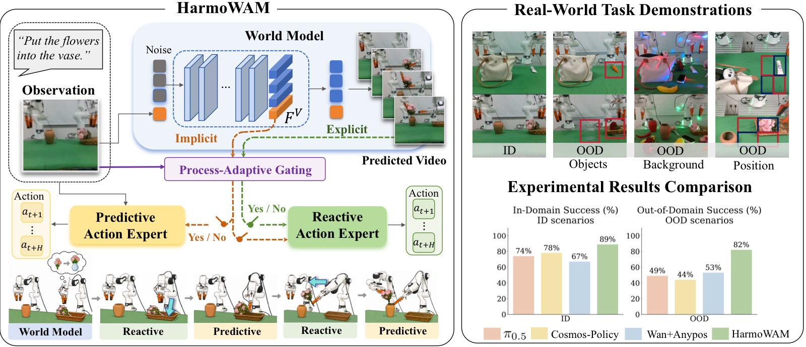
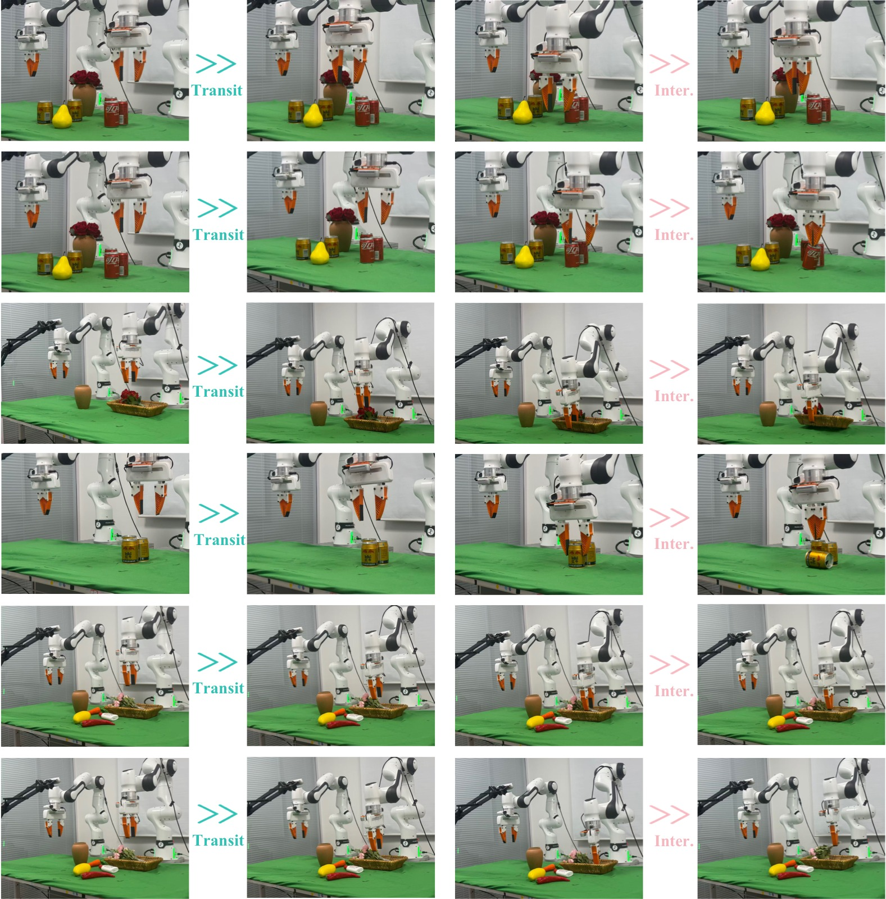
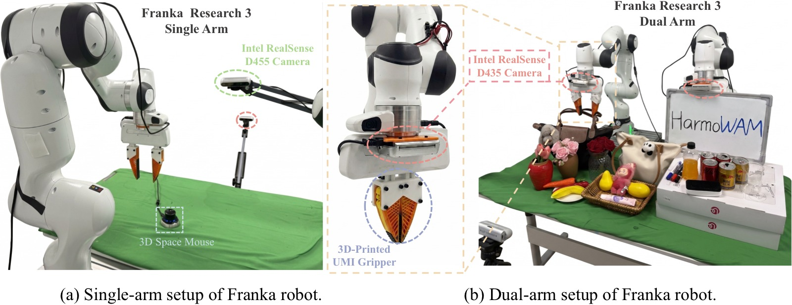
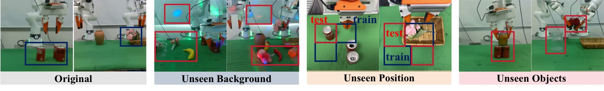
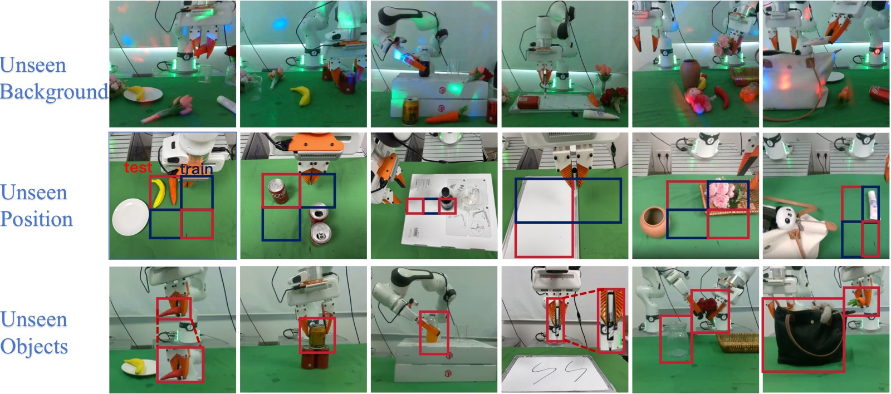
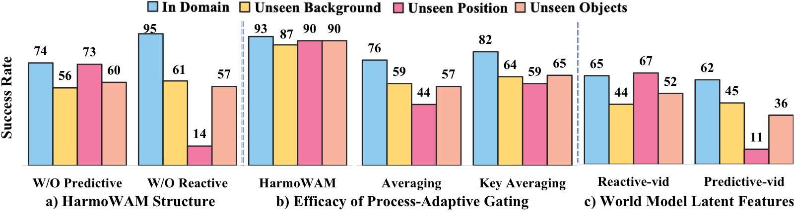
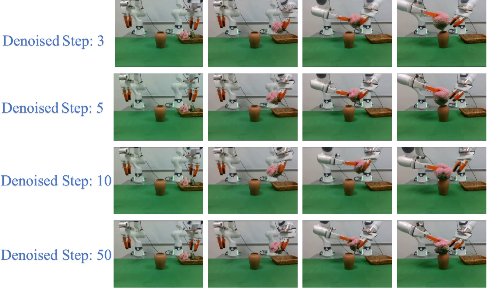
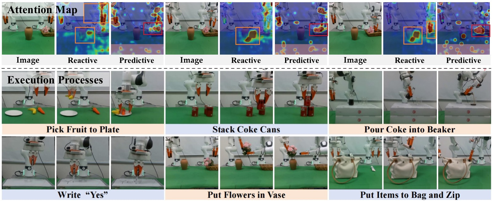
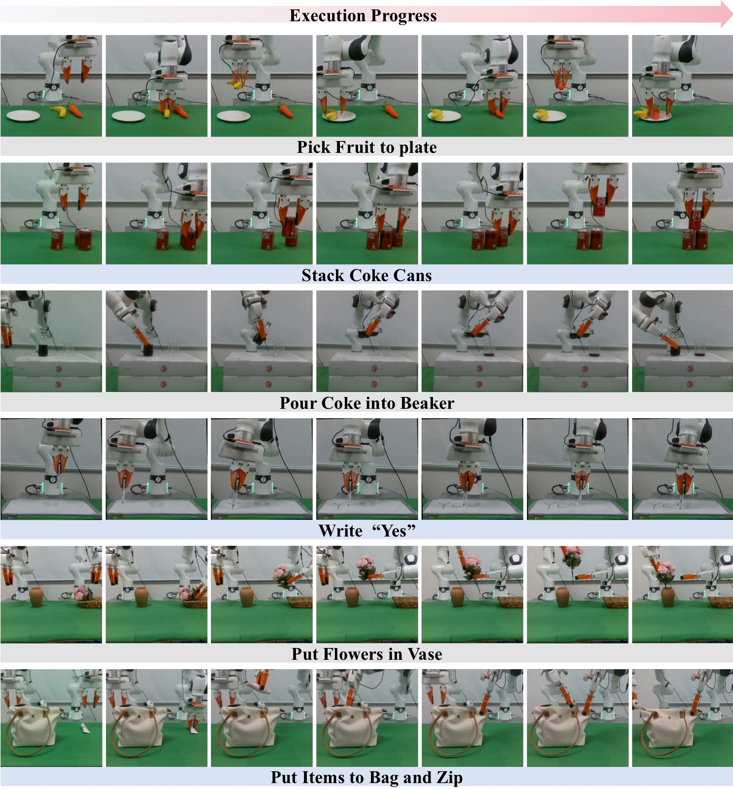
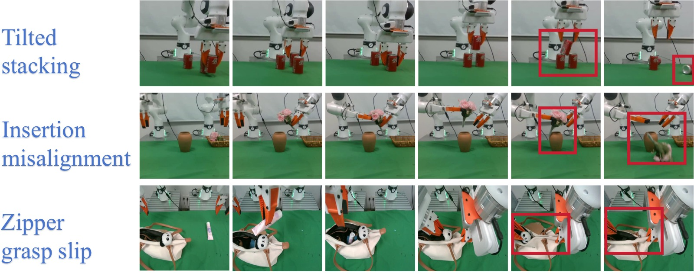

<!-- arxiv: 2605.10942 -->
<!-- venue: NeurIPS 2026（投稿中） -->
<!-- tags: WAM, 泛化 -->

# HarmoWAM: Harmonizing Generalizable and Precise Manipulation via Adaptive World Action Models

> **论文信息**
> - 作者：Qiuxuan Feng*, Jiale Yu*, Jiaming Liu*†（Project lead）, Yueru Jia*, Zhuangzhe Wu, Hao Chen, Zezhong Qian, Shuo Gu, Peng Jia, Siwei Ma, Shanghang Zhang（通讯）
> - 通讯作者：Shanghang Zhang（Peking University）
> - 机构：Peking University（北大）, Simplexity Robotics, The Chinese University of Hong Kong（港中文）
> - 投稿方向：NeurIPS 2026（投稿中）
> - arXiv ID：2605.10942
> - 项目页面：https://elbb-yu.github.io/HarmoWAM/
> - 代码：未公开

---

## 一、核心问题

**世界动作模型（World Action Models, WAMs）** 是机器人操控领域的新范式，通过预测未来视频来为动作生成提供时空物理先验。现有 WAM 主要分为两类：

1. **Imagine-then-Execute（想象再执行）**：先预测未来视频轨迹，再用逆动力学模型（IDM）从预测帧推断动作。泛化能力强，但精细操作精度不足。
2. **Joint Modeling（联合建模）**：将动作与视频表征联合建模，利用视频模型的潜空间特征指导动作预测。操作精度高，但探索空间受 SFT 数据分布限制，OOD 场景下无法可靠到达目标。

本文通过系统的真实世界实验，首次量化了这一根本性权衡：前者在 OOD 场景下目标接近近乎完美，但操作成功率低至 60%；后者接近目标后操作精度超 80%，但 OOD 场景下到达目标的成功率不足 60%。

> 核心矛盾：泛化性（Generalizable Transit）与精细操作（Precise Manipulation）不可兼得。

*图1（论文 Figure 1: Overview）：HarmoWAM 的整体设计思路。左上方展示两类现有 WAM 范式（Imagine-then-Execute 与 Joint Modeling）的核心权衡——前者泛化性强但精度不足，后者精度高但 OOD 下探索受限。右方及下方展示 HarmoWAM 方案：一个端到端的 WAM，通过世界模型提供物理动力学先验，并自适应协调预测型动作专家（Predictive Expert）和反应式动作专家（Reactive Expert），在 ID 场景下达到 SOTA 性能，在 OOD 场景下显著领先基线。图中包含真机实验的定性执行序列和定量成功率对比柱状图。*

---

## 二、核心思路 / 方法

HarmoWAM 提出了一种**端到端的自适应 WAM 架构**，通过世界模型统一预测试控制（predictive）和反应式控制（reactive），实现泛化移动与精细操作的协同。

### 2.1 动机实验（Motivation）

*图1：两类 WAM 范式在真实世界任务上的性能对比。论文中的 Figure 1 是一个复合图：左侧插图为任务场景示意（即本图），右侧为下表所示的定量对比表。*

**图像内容**：机器人插图展示两个评估任务。上方为 Put Flowers in Vase（双臂协作插花），涉及左臂抓取花→双手交接→右臂插入花瓶三段流程，代表需要双臂协调和紧密公差插入的复杂任务。下方为 Stack Coke Cans（可乐罐堆叠），涉及抓取罐体并在已有罐体上方精确放置，代表需要高度空间对齐的精细操作任务。

**论文 Figure 1 右侧定量对比表（Table 1）**：以 Method × Domain × Gen Scenarios 的行组织方式，分别报告两个任务在 Transit（移动阶段）和 Interaction（交互阶段）的成功次数（每次 10 次试验）。带 `*` 的数据表示机器人在目标物体附近初始化后测得的交互成功率。

| Method | Domain | Gen Scenarios | Stack Cans (Transit) | Stack Cans (Interaction) | Put Flowers (Transit) | Put Flowers (Interaction) |
|:---|:---|:---|:---:|:---:|:---:|:---:|
| **Imagine-then-Execute** | In | — | 10/10 | 7/10 | 10/10 | 8/10 |
| | OOD | Background | 10/10 | 6/10 | 10/10 | 6/10 |
| | | Position | 10/10 | 5/10 | 10/10 | 2/10 |
| | | Objects | 10/10 | 7/10 | 10/10 | 7/10 |
| **Joint Modeling** | In | — | 9/10 | 9/10 | 9/10 | 10/10 |
| | OOD | Background | 5/10 | 8/10* | 5/10 | 9/10* |
| | | Position | 3/10 | 10/10* | 0/10 | 10/10* |
| | | Objects | 0/10 | 10/10* | 6/10 | 10/10* |

> *Interaction 数据在机器人初始化于目标物体附近后测得，以解耦交互精度与移动阶段失败的干扰。

**关键数据解读：**

- **Imagine-then-Execute 的 Transit 完美但 Interaction 不足**：4 行数据中 Transit 全部 10/10——无论是 ID 还是三种 OOD 场景，视频预测驱动的大范围移动无一失败。然而 Interaction 在 ID 的 Stack Cans 仅 7/10、插花仅 8/10；切换到 Position OOD 后插花 Interaction 暴跌至 2/10。根本原因在于：视频预测模型（Wan2.2-TI2V-5B）生成的未来帧虽然指示了正确的目标方位，但下游 IDM（AnyPos）仅凭帧间像素变化无法推断出精确的抓取/放置动作——IDM 本身缺乏对操作物体几何和接触动力学的理解。

- **Joint Modeling 的 ID 优异但 OOD Transit 崩溃**：ID 下两个任务的 Transit 和 Interaction 均为 9–10/10，证明联合建模在训练分布内的确能兼顾移动和操作。但 OOD 场景下 Transit 急剧退化：Position OOD 时 Stack Cans 仅 3/10（7 次无法到达目标区域），插花任务甚至 0/10（10 次全部在移动阶段失败）。最关键的发现来自 Interaction 列中带 `*` 的数据——当人为将机器人初始化在目标附近后，OOD 下的 Interaction 仍稳定在 8–10/10。这说明联合建模的操作能力本身没有退化，问题完全出在"无法自己走到目标位置"——其探索空间被 SFT 数据分布严格限制。

- **范式互补的证据**：Imagine-then-Execute 的弱点（操作精度）恰好是 Joint Modeling 的强项（Interaction 9–10/10），Joint Modeling 的弱点（OOD 探索）恰好是 Imagine-then-Execute 的强项（Transit 全部 10/10）。这张图（左侧示意图 + 右侧定量表）是整个论文的立论基础——直接引出 HarmoWAM 用一个世界模型统一两种控制方式的核心设计动机。

*图2：两种 WAM 范式在 OOD 场景下的代表性失败案例可视化（论文 Figure 2）。图片按 6 行 × 多列的时间帧序列排列，每一行是一个完整的执行序列（从左到右为时间推进）。全部评估在 Franka 真机平台上进行。论文称：前 3 行为 Joint Modeling 范式的典型移动阶段失败，后 3 行为 Imagine-then-Execute 范式的典型交互阶段失败。以下行级解读基于对图像内容的视觉观察。*

**图像结构拆解：** 图片分为上下两组，各 3 行。

**前 3 行——Joint Modeling 的 Transit 阶段失败（OOD 场景下）：**
论文指出，OOD 场景下的背景外观或物体位置变化会偏移预测轨迹，导致末端执行器未能移动到目标物体上方或停在错误位置，在建立有效物体接触之前即在移动阶段失败。

- **第 1 行**（视觉解读：OOD 背景下的插花任务）：序列显示机器人从初始位置出发，但视频-动作联合预测的轨迹在中途偏离了花瓶方向，末端执行器最终停在桌面空白区域——从未到达可以交互的位置。失败根源：OOD 背景中的新视觉元素使联合模型预测的潜空间轨迹偏离了训练分布中的"正确路径"。
- **第 2 行**（视觉解读：Position OOD 下的堆叠任务）：目标罐体被放置在训练未覆盖的远角区域，机器人移动方向在接近目标时发生偏移，最终在目标罐体旁边停下但未与之对齐。这体现了联合建模的本质局限：模型的探索行为由 SFT 数据中的空间分布决定，一旦目标位于分布外区域，隐含的"目标驱动"信号就会失效。
- **第 3 行**（视觉解读：Objects OOD 下的插花任务）：花瓶被替换为未见过的形状/颜色变体，机器人在接近过程中轨迹发散，最终停在错误位置。即使语义相近的替换物体，也能导致联合模型的潜空间条件出现足够大的分布偏移，使移动阶段失败。

**后 3 行——Imagine-then-Execute 的 Interaction 阶段失败（OOD 场景下）：**
论文指出，虽然 Imagine-then-Execute 通常能生成合理的移动轨迹并到达目标附近，但推断的执行动作在交互阶段仍可能不准确，例如夹爪在偏移的抓取点闭合，或过早/过晚开合，导致抓取、放置或堆叠失败。

- **第 4 行**（视觉解读：OOD 背景下的插花任务）：序列显示机器人成功移动到花瓶上方（Transit 成功），但在插入动作执行时，末端执行器高度不足，花茎擦过花瓶边缘而未能进入瓶口。视频预测生成了正确的宏观轨迹，但 IDM 从预测帧推断的插入深度和方向偏差足以导致失败。
- **第 5 行**（视觉解读：Position OOD 下的堆叠任务）：机器人到达目标罐体上方后，夹爪闭合的时序和位置出现偏差——夹爪在罐体侧面而非正上方闭合，导致罐体被推倒而非抓起。IDM 缺乏对"何时该闭合夹爪"这一关键交互时刻的精确判断能力。
- **第 6 行**（视觉解读：Objects OOD 下的堆叠任务）：目标罐体被替换为不同尺寸的变体后，机器人仍能到达附近，但抓取点偏移（夹爪闭合在罐体边缘而非中心），抓取不稳定导致后续放置失败。这表明 Imagine-then-Execute 在 Transit 阶段受益于世界模型的泛化能力，但在 Interaction 阶段因为 IDM 不"理解"操作物体的几何属性而失败。

**连接论文论点：** 这 6 行失败案例是动机实验（图 1 定量表）的可视化证据——前 3 行证明 Joint Modeling "走不到"，后 3 行证明 Imagine-then-Execute "做不准"。两者恰好互补的失败模式，构成了 HarmoWAM 用世界模型提供的共享时空结构来解耦探索和精度的核心设计动机。

### 2.2 HarmoWAM 整体架构

*图3：HarmoWAM 整体框架图。图片以从左到右、从上到下的数据流方式组织，展示从输入到最终闭环控制的全流程。*

**图像结构拆解（从左到右、从上到下追踪数据流）：**

**（一）输入层（左上角）**：两个输入端——当前视觉观测（RGB 图像，来自 3 个 RealSense 相机，分辨率 640×480）和语言指令（如 "put the flower in the vase"）。语言指令经过 Text Encoder（基于 T5）编码为文本特征 $\mathcal{F}^{text}$。视觉观测经 SigLIP 图像编码器提取为图像特征 $\mathcal{F}^{img}_{t}$。

**（二）世界模型（中上部，Wan2.2-TI2V-5B）**：接收当前帧条件和语言指令，通过 Flow Matching 视频扩散过程（5 步去噪）生成两个关键输出：
1. **显式输出**——13 帧未来视频预测 $\mathbf{V}_{t:t+H}$（分辨率 $256\times320$），图中以帧序列形式展示
2. **隐式输出**——每帧对应的潜空间表征 $\mathcal{F}^{\mathbf{V}}_{t:t+H} \in \mathbb{R}^{B\times80\times3072}$，编码了预测的时空物理动态

**（三）过程自适应门控（中右部，Process-Adaptive Gating）**：一个轻量 MLP 分类器，接收当前图像特征 $\mathcal{F}^{img}_{t}$，输出置信度分数 $s_t \in [0,1]$。图中以决策节点（菱形/分支）形式展示：$s_t > 0.5$ 时路由到 Predictive Expert，$s_t \leq 0.5$ 时路由到 Reactive Expert。这是实现 Transit ↔ Interaction 阶段自适应切换的核心机制。

**（四）两个动作专家（下半部）**：

- **左侧路径——Predictive Expert（1B 参数 Action DiT）**：接收三个条件输入——SigLIP 图像特征 $\mathcal{F}^{img}_{t}$（实时闭环感知）、文本特征 $\mathcal{F}^{text}$（任务语义）、以及世界模型当前帧潜特征 $\mathcal{F}^{\mathbf{V}}_{t}$（通过交叉注意力注入 DiT 的 28 层 Transformer block）。经过扩散去噪过程输出长度为 $H=12$ 的动作序列 $\mathbf{a}_{t+1:t+H}$。

- **右侧路径——Reactive Expert（DINOv2 + Orientation Decoder）**：对世界模型预测的每个未来帧 $s \in \{t+1, ..., t+H\}$，DINOv2-base 提取 patch 级几何特征 $\mathcal{F}^{\text{patch}}_{s} \in \mathbb{R}^{B\times1369\times768}$，与降维后的潜表征 $\mathcal{F}^{\mathbf{V}}_{s}$ 沿 token 维度拼接形成 $\mathcal{F}^{\text{fuse}}_{s}$。Orientation Decoder（多尺度卷积层）将融合表征映射为动作预测。

**（五）控制输出（底部）**：门控选择后的动作序列输出到 Franka 机器人执行器，形成闭环控制回路。图中清晰展示了世界模型同时驱动两个专家、门控机制居中协调的"一核两翼"架构。

**连接论文论点：** 这张图是 HarmoWAM 的核心贡献的可视化——世界模型不仅生成像素级的未来预测（显式），还提供潜空间的时空表征（隐式），两种表征分别以互补的方式注入两个动作专家，由门控机制根据任务阶段动态选择。这套架构使得"泛化移动 = 反应专家 + 世界模型预测帧"和"精细操作 = 预测专家 + 世界模型潜特征"统一为一个端到端可微的框架。

**三个核心组件：**

#### (1) 世界模型（World Model）

- 基于 **Wan2.2-TI2V-5B** 视频扩散模型
- 在约 **190 万条**机器人轨迹上预训练（DROID 20.1万 + AgiBot 0.3万 + RoboMIND 172.2万 + 闭源数据）
- 推理时输出：分辨率 $256 \times 320$ 的 **13 帧**未来视频 + 对应的潜空间表征 $\mathcal{F}_{t:t+H}^{\mathbf{V}} \in \mathbb{R}^{B \times 80 \times 3072}$
- 去噪步数：**5 步**（消融实验确认的最优效率-质量平衡点）

#### (2) 预测型动作专家（Predictive Expert）

- **1B 参数**的 Diffusion Transformer（DiT），28 层 Transformer block
- 利用世界模型当前帧潜特征 $\mathcal{F}^{\mathbf{V}}_{t}$ 作为隐式条件，通过 **交叉注意力**（cross-attention）注入 Action DiT
- 同时融合 SigLIP 图像特征和文本编码特征
- 去噪后输出长度为 $H$ 的动作序列（单臂 7-DoF，双臂 14-DoF）
- 擅长：**时序连贯的精细动作生成**，尤其在操作物体的交互阶段

#### (3) 反应式动作专家（Reactive Expert）

- **DINOv2-base** 提取预测帧的 patch 级几何特征（$\mathbb{R}^{B \times 1369 \times 768}$）
- 同时融入对应帧的潜表征 $\mathcal{F}^{\mathbf{V}}_{s}$（平均池化后拼接）
- **Orientation Decoder**：多尺度卷积层，将融合表征映射到动作空间
- 擅长：**直接利用预测视觉演化推断动作**，泛化性强的目标接近

#### (4) 过程自适应门控机制（Process-Adaptive Gating）

核心思想：自动判断当前处于 **Transit（移动）** 阶段还是 **Interaction（交互）** 阶段，动态切换专家。

- **实现**：轻量 MLP 分类网络，复用当前观测的视觉 token $\mathcal{F}^{img}_{t}$ 作为输入
- **输出**：置信度分数 $s_t \in [0,1]$，$s_t > 0.5$ 时激活预测专家，否则激活反应专家
- **标签构建**：基于机器人本体感知信号（夹爪状态变化、末端执行器高度阈值）自动标注关键帧，关键帧前后 20 帧窗口标记为交互阶段
- **训练准确率**：在 1,637 帧的 held-out 测试集上达到 **96.95%** 的帧级分类准确率
- **损失函数**：二值交叉熵（BCE）

#### 两个专家与 WAM 两类范式的对应关系

论文 Related Work 将现有 WAM 分为两条路线，其中 Joint Modeling 内部实际包含两种做法：

| WAM 范式 | 细分 | 代表工作 | 做法 |
|---------|------|---------|------|
| Imagine-then-Execute | — | DreamGen, WoW | 世界模型预测未来帧 → IDM 从帧推断动作 |
| Joint Modeling | **类型 A：Latent-as-condition** | VPP, Video2Act, Genie Envisioner | 视频模型抽 latent → 作为条件注入独立动作模型 |
| Joint Modeling | **类型 B：联合去噪** | Cosmos-Policy, UVA, UWM, Motus | 视频 latent 和 action 在同一生成框架中一起去噪 |

HarmoWAM 两个专家与上述范式的对应：

- **Predictive Expert → Joint Modeling 类型 A（Latent-as-condition）**：世界模型当前帧潜特征 $\mathcal{F}^{\mathbf{V}}_{t}$ 通过 cross-attention 注入独立的 1B Action DiT。视频和动作分开建模，不做联合去噪——这与 VPP/Video2Act 一脉相承，而非 Cosmos-Policy 的联合去噪路线。
- **Reactive Expert → Imagine-then-Execute（升级版）**：继承"看预测帧推断动作"的思路，但不止于纯 IDM 看像素——还融合了世界模型对应帧的潜表征 $\mathcal{F}^{\mathbf{V}}_{s}$，获得高层时空知识来增强泛化移动能力。

核心设计：两个专家共享同一个世界模型的输出（显式视频帧 + 隐式潜表征），由 Process-Adaptive Gating 按任务阶段动态路由——不是简单拼接两个旧范式。

---

## 三、训练目标

HarmoWAM 采用**两阶段训练**范式：

### Stage 1：世界模型微调

在真实世界示教数据上对预训练世界模型进行全量微调，使用 **Conditional Flow Matching** 目标：

$$\mathcal{L}_{\mathrm{stage1}} = \mathbb{E}_{\mathbf{x}_0,\mathbf{x}_1,\xi,\mathbf{c}}\left[ w(\xi) \left\| f_\theta(\mathbf{x}_\xi,\xi,\mathbf{c}) - \mathbf{v}_\xi \right\|_2^2 \right]$$

其中 $\mathbf{x}_0 \sim \mathcal{N}(0,I)$ 为噪声潜变量，$\mathbf{x}_1$ 为干净视频潜变量，$\mathbf{v}_\xi = \mathbf{x}_1 - \mathbf{x}_0$ 为速度目标，$w(\xi)$ 为流步骤权重。

### Stage 2：动作专家与门控训练

冻结世界模型，基于其输出的显式/隐式视频条件训练两个专家和门控网络：

- **预测专家**：标准扩散去噪损失 $\mathcal{L}_{\mathrm{pred}} = \mathbb{E}\left[ \| \epsilon_\theta - \epsilon \|_2^2 \right]$
- **反应专家**：Smooth L1 损失 $\mathcal{L}_{\mathrm{react}} = \mathbb{E}\left[ d(\hat{\mathbf{a}}, \mathbf{a}) \right]$，$\beta=0.1$
- **门控网络**：BCE 损失 $\mathcal{L}_{\mathrm{gate}}$

总损失：
$$\mathcal{L}_{\mathrm{stage2}} = \mathcal{L}_{\mathrm{pred}} + 0.1 \cdot \mathcal{L}_{\mathrm{react}} + 0.05 \cdot \mathcal{L}_{\mathrm{gate}}$$

### 硬件与数据

- 训练：**8 × NVIDIA H20 GPU**
- 每任务 **100 条** SpaceMouse 遥操作示教轨迹
- 真机平台：双 Franka Research 3 机械臂，3 × Intel RealSense 相机（1 全局 + 2 腕部）
- 推理速度：动作块大小 12，**48 Hz** 的动作生成频率

---

## 四、实验与结果

### 4.1 实验设置

*图4：真实世界机器人平台和实验资产。图片分为三个逻辑区域展示硬件配置和任务设置。*

**图像结构拆解：**

**顶部区域——单臂平台（Single-Arm Configuration）**：展示基于 7-DoF Franka Research 3（FR3）机械臂的配置。末端执行器为 3D 打印的 UMI 夹爪（用于接触密集型精细操作任务）。三相机感知阵列的布局：① 正面 D435 相机以约 45° 俯角固定在工位前方，提供场景全局视图；② 顶部 D455 相机垂直安装在操作面上方，提供精确的空间定位（xy 平面）；③ 腕部 D435 相机安装在末端执行器上，提供接近物体的近距离视角。所有相机以 640×480 分辨率同步采集。每步策略观测包含三张 RGB 图像 + 14 维本体感知状态（7 维末端位姿 + 1 维夹爪状态）。

**中左区域——双臂平台（Dual-Arm Configuration）**：两个平行的 FR3 机械臂，各配 UMI 夹爪。相机调整为 1 个全局相机 + 每臂 1 个腕部相机，每步观测仍为三张 RGB 图像（两个腕部视角 + 一个全局视角），本体感知状态扩展为 28 维（每臂 14 维）。

**底部区域——六个真实世界任务的可视化资产**：按从左到右、从上到下的顺序展示了各任务的操作对象和场景布置——
1. **Pick Fruit to Plate**（香蕉 + 胡萝卜 → 盘子）：平均约 280 步，S1 抓取香蕉放盘 / S2 抓取胡萝卜放盘
2. **Stack Coke Cans**（三个罐体堆叠）：平均约 290 步，S1 放置第二罐与第一罐并排 / S2 将第三罐叠放在上
3. **Pour Coke into Beaker**（可乐瓶 → 烧杯倾倒）：平均约 310 步，S1 抓取瓶子 / S2 倾斜瓶子将内容物倒入烧杯
4. **Write "Yes"**（白板笔在白板上书写）：平均约 310 步，S1 写 "Y" / S2 写 "e" / S3 写 "s"
5. **Put Flowers in Vase**（双臂协作插花）：平均约 280 步，S1 左臂抓取花 / S2 双臂交接 / S3 右臂插入花瓶
6. **Put Items to Bag and Zip**（装袋 + 拉链）：平均约 400 步（最长时域任务），S1→S2 抓取物品放入袋中 / S3→S4→S5 固定袋口 + 抓取拉链 + 拉合

**连接论文论点：** 这六个任务的设计覆盖了单臂/双臂、短时域/长时域、简单抓放/精细对齐/连续姿态控制/紧密公差插入等多种操作类型。该任务集合既测试独立操作能力（单臂），也测试协作能力（双臂），为评估 HarmoWAM 在 ID 和 OOD 场景下的 Transit（移动）和 Interaction（交互）表现提供了全面的真机实验基础。

- **6 个真机任务**：4 单臂（Pick Fruit to Plate、Stack Coke Cans、Pour Coke into Beaker、Write "Yes"）+ 2 双臂（Put Flowers in Vase、Put Items to Bag and Zip）
- **对比方法**（3 类 5 个）：VLA（π0.5、QwenVLA-OFT）、Imagine-then-Execute（Wan2.2-TI2V-5B + AnyPos）、Joint Modeling（VPP、Cosmos-Policy）
- **3 种 OOD 场景**：未见背景（干扰物 + 光照变化）、未见位置（空间分布外区域）、未见物体（语义和几何变化）
- 每方法每任务 **20 次独立评估**，HarmoWAM 重复 3 次评估计算标准差（±3%）

### 4.2 In-Domain（ID）结果

| 方法 | Pick Fruit | Stack Cans | Pour Coke | Write "Yes" | Put Flowers | Put Items | **Avg** |
|------|:----------:|:----------:|:---------:|:-----------:|:-----------:|:---------:|:-------:|
| π0.5 | 0.80 | 0.68 | 0.75 | 0.83 | 0.72 | 0.67 | 0.74 |
| VPP | 0.80 | 0.60 | 0.78 | 0.73 | — | — | 0.73 |
| Wan+Anypos | 0.88 | 0.60 | 0.78 | 0.72 | 0.53 | 0.52 | 0.67 |
| QwenVLA-OFT | 0.78 | 0.30 | 0.73 | 0.72 | — | — | 0.63 |
| Cosmos-Policy | 0.93 | 0.65 | 0.80 | 0.83 | 0.75 | 0.72 | 0.78 |
| **HarmoWAM** | **0.95** | **0.90** | **0.88** | **0.92** | **0.85** | **0.85** | **0.89** |

> HarmoWAM 在 ID 下取得 **89%** 平均成功率，分别比最强 VLA（π0.5）和最强 WAM（Cosmos-Policy）高出 **15pp** 和 **11pp**。

**分阶段表现（附录数据）**：
- 单臂分步平均 **91%**（S1→S2），比 Cosmos-Policy（81%）高 10pp
- 双臂分步平均 **85%**（S1→S2→S3/…），比 Cosmos-Policy（73%）高 12pp
- 在插花任务的最终插入阶段（S3），HarmoWAM 达到 70%，而 Wan+Anypos 仅 15%，Cosmos-Policy 仅 35%

### 4.3 泛化性（OOD）结果

| 方法 | Background | Position | Objects | **OOD Avg** | ID→OOD 降幅 |
|------|:----------:|:--------:|:-------:|:-----------:|:-----------:|
| π0.5 | 0.60 | 0.32 | 0.54 | 0.49 | **−33.8%** |
| VPP | 0.43 | 0.23 | 0.57 | 0.41 | −43.8% |
| Wan+Anypos | 0.53 | 0.49 | 0.58 | 0.53 | −20.9% |
| QwenVLA-OFT | 0.46 | 0.28 | 0.50 | 0.41 | −34.9% |
| Cosmos-Policy | 0.57 | 0.26 | 0.50 | 0.44 | −43.6% |
| **HarmoWAM** | **0.81** | **0.80** | **0.85** | **0.82** | **−7.9%** |

> **核心结果**：HarmoWAM 在 OOD 下仅下降 **7.9%**，而所有基线下降 20.9–43.8%。平均 OOD 成功率比最强 VLA 和 WAM 基线分别高 **33pp** 和 **29pp**。

**分场景分析**：

- **Background OOD（81%）**：在杂乱背景和光照变化下，HarmoWAM 通过世界模型预测任务相关的视觉演化来抑制干扰物，使下游动作通路聚焦于目标交互。单臂任务中 Stack Cans 第二阶段仍达 65%，而所有基线不超过 35%。
- **Position OOD（80%）**：最具挑战性的泛化场景。π0.5 降至 32%，Cosmos-Policy 降至 26%。HarmoWAM 利用反应专家突破 SFT 分布约束进行泛化移动，并由预测专家在关键交互阶段提供精细控制。在 Stack Cans 中仍保持 85%/70% 的两阶段成功率（最强基线仅 55%/25%）。
- **Objects OOD（85%）**：HarmoWAM 有效利用世界模型的语义先验，协调两个专家实现对未见物体的可靠接近和交互。Stack Cans 达到 95%/75%，插花任务达到 95%/85%/60%（最佳基线仅 80%/65%/35%）。

*图5：泛化实验场景示例。图片按 6 行 × 多列的网格排列，每行对应一个任务，以成对对比（训练场景 vs OOD 场景）的方式展示三种泛化维度的具体设置。红色框高亮 OOD 变化元素，蓝色框标注原始训练配置。*

**图像结构拆解（逐行分析）：**

- **第 1 行——Pick Fruit to Plate**：左侧蓝色框为训练场景（标准香蕉+胡萝卜+白色盘子），右侧红色框展示 Objects OOD（胡萝卜替换为彩椒/辣椒，外观颜色和形状显著不同）。同时还展示了 Background OOD（桌面增加杂色干扰物）和 Position OOD（水果放置在训练分布外的桌面角落）。

- **第 2 行——Stack Coke Cans**：左侧为标准红色可口可乐罐，右侧红色框展示 Objects OOD（罐体替换为红牛罐，罐身直径和高度比可乐罐更大，堆叠几何条件改变）。Background OOD 中桌面散布多种未见干扰物；Position OOD 中罐体放置在训练未覆盖的远距离位置。

- **第 3 行——Pour Coke into Beaker**：展示倒液任务中的 Background OOD（光照条件改变，产生新的阴影和反射模式）和 Objects OOD（烧杯或瓶子的视觉外观变化）。Position OOD 将瓶子和烧杯置于训练分布外空间区域。

- **第 4 行——Write "Yes"**：书写任务的白板笔/白板配置，Background OOD 引入新的桌面纹理和背景物体，Objects OOD 可能涉及不同形状或颜色的书写工具，Position OOD 改变白板在桌面上的位置。

- **第 5 行——Put Flowers in Vase（双臂）**：展示插花任务中的 Objects OOD（花朵颜色/数量变化，如从单色变为多色，从 3 朵变为 5 朵，花瓶形状也可能替换），以及 Background OOD 和 Position OOD 变体。红色框标注了花的颜色变化和新花瓶的外形。

- **第 6 行——Put Items to Bag and Zip（双臂）**：展示装袋拉链任务中的 OOD 变体。Objects OOD 可能涉及袋子材质/颜色变化或待装物品的替换，Background OOD 引入桌面干扰物。

**连接论文论点：** 这张图直接对应 Table OOD All 中的定量数据，为读者提供了三种 OOD 场景在六个任务中的直观视觉参照。红色框 vs 蓝色框的对比清晰地展示了泛化评估的难度层级——Background OOD 主要挑战感知鲁棒性，Position OOD 挑战空间泛化能力（论文中称为最具挑战性的场景），Objects OOD 挑战语义理解和几何适应能力。HarmoWAM 在这三种 OOD 下分别取得 81%/80%/85% 的平均成功率，而所有基线均大幅下降，这张图为理解这些数字提供了场景层面的上下文。

*图6：三种 OOD 设定下六个任务的完整场景示例。图片按 3 行（三种 OOD 维度）× 多列（六个任务）的网格排列，每列配有场景图标标注 OOD 类型。*

**图像结构拆解（按行分 OOD 维度、按列分任务）：**

**第 1 行——Unseen Background（未见背景）**：展示六个任务在杂乱背景和光照变化下的场景设置。具体构造方式：在工区内随机放置 5–8 个训练中从未出现的干扰物（颜色、纹理、几何形状各异），同时调整环境光照（改变光源强度和入射方向，产生新的阴影和局部反射）。例如 Pick Fruit 场景中桌面散布了彩色积木和不规则物体，插花场景中背景增加了额外的容器和工具。关键测试点：模型能否在视觉杂乱的场景中抑制干扰物、保持对目标物体的正确感知和稳定操控。

**第 2 行——Unseen Position（未见位置）**：展示目标物体被放置在训练数据空间覆盖范围之外的配置。具体构造方式：将操作面划分为训练区和测试区，测试区与训练期间物体位置的空间分布互不重叠。例如 Stack Cans 场景中罐体被放置在桌面最远角（训练中从未覆盖的位置），插花场景中花瓶被推到桌面边缘区域。关键测试点：策略能否在未见空间坐标下执行有效的目标接近和交互——这是论文中性能差距最显著、最具挑战性的泛化维度。

**第 3 行——Unseen Objects（未见物体）**：展示各任务中目标物体被替换为外观和几何差异显著的新实例。具体替换示例：Pick Fruit 中胡萝卜→彩椒（外形从长条变为块状，颜色从橙色变为红色/黄色），Stack Cans 中标准可乐罐→红牛罐（罐体直径更大、高度更矮），Pour Coke 中瓶子或烧杯形状改变，Write "Yes" 中笔的外形变化，插花任务中花朵颜色和数量变化（单色→多色，3 朵→5 朵），装袋任务中待装物品被替换。关键测试点：模型能否利用世界模型的语义先验来理解未见物体的几何属性和功能，从而自适应调整抓取策略和交互模式。

**连接论文论点：** 从定量结果看，三个 OOD 维度对基线模型的冲击程度不同——Position OOD 对 Joint Modeling 范式的打击最严重（Cosmos-Policy 降至 26%），Objects OOD 对 Imagine-then-Execute 范式的交互阶段影响最大。而 HarmoWAM 在三种 OOD 下分别取得 81%/80%/85% 的平均成功率，这张图展示的场景构造方式解释了为什么这些性能差异具有实际意义——每一类 OOD 变化都模拟了真实部署中常见的分布偏移。

### 4.4 消融实验

*图7：三组核心消融实验，在 Put Flowers in Vase 和 Pick Fruit to Plate 两个任务上评估平均值。*

**子图 (a) HarmoWAM 结构消融——验证各专家必要性：**

对比完整 HarmoWAM（89% ID / 83% OOD）与三个变体：
- **移除反应专家（仅预测专家）**：ID 降至 74%，Position OOD 暴跌至 **14%**——证明单独依赖预测专家无法将世界模型知识转化为扩展探索空间的可执行信号。
- **移除预测专家（仅反应专家）**：ID 降至 65%，Position OOD 降至 **56%**，Object OOD 降至 60%——反应专家依赖预测视频帧，在视觉变化下不足以完成精细动作生成。
- 结论：两个专家不是简单的能力叠加，而是**互补**——探索来自反应式推理，精度来自预测式推理，两者缺一不可。

**子图 (b) 门控机制消融——验证自适应切换的有效性：**

对比 Process-Adaptive Gating 与两种替代策略：
- **Averaging（简单平均）**：每步对两个专家的输出取均值，ID 性能下降明显，Position OOD 下降 **46%**。
- **Keyframe-Based Averaging**：交互阶段（预测专家激活时）取均值，Position OOD 下降 31%。
- **Process-Adaptive Gating**：Position OOD 仅降 **15%**——说明基于实时视觉反馈的分阶段路由远优于简单混合策略。有效操控依赖于分阶段地利用世界模型知识，由门控机制在不同阶段路由到适合的专家。

**子图 (c) 世界模型潜特征消融——验证潜表征对各专家的贡献：**

- **移除反应专家中的视频潜特征（-vid）**：ID 降至 65%，OOD 均值降至 54%。
- **移除预测专家中的视频潜特征（-vid）**：ID 从 95% 降至 **62%**，降幅达 33pp。
- 结论：世界模型的潜特征在两个专家中都起着关键的时空理解作用——为反应专家提供高级时空知识以增强泛化能力，为预测专家提供时序连贯的物理建模以实现精确动作生成。潜特征的去除对预测专家影响更大，因其内在依赖时序条件进行结构化动作预测。

### 4.5 去噪步数消融

| 去噪步数 | 成功率 | 推理频率 |
|:--------:|:------:|:--------:|
| 3 | 80% | 4 Hz |
| **5** | **85%** | **4 Hz** |
| 10 | 85% | 3.6 Hz |
| 50 | 87% | 3 Hz |

> 5 步是最优效率-质量平衡点：3 步视频模糊导致成功率下降，10/50 步成功率的边际收益递减但推理速度下降。

*图8：不同去噪步数（3/5/10/50）下世界模型在 Put Flowers in Vase 任务上的生成视频质量对比。图片按 4 行（对应 4 种去噪步数配置）× 多列（展示生成视频的时间帧序列）排列，从上到下分别为 3 步、5 步、10 步、50 步去噪的生成结果。*

**图像结构拆解（逐行对比）：**

- **第 1 行——3 步去噪**：生成的 13 帧视频序列整体模糊，尤其在需要清晰空间信息的帧中（如夹爪接近花朵、花茎对准瓶口），边缘细节和纹理信息严重丢失。模糊的视频帧使下游动作专家难以精确判断目标位置和姿态，直接导致成功率降至 80%。3 步去噪的推理频率虽同为 4 Hz，但视频质量的退化抵消了速度优势。

- **第 2 行——5 步去噪（论文默认配置）**：视频帧清晰度显著提升，关键交互阶段的视觉细节得以保留——包括花朵的空间位置、花瓶瓶口的边缘、夹爪与物体的相对关系。清晰度足以支撑反应专家从预测帧中准确推断移动动作，潜表征质量也足以支撑预测专家的精细动作生成。成功率 85%，推理频率保持 4 Hz，实现了论文中的效率-质量最优平衡。

- **第 3 行——10 步去噪**：相比 5 步，视频质量有轻微改善（色彩更饱和、细节更锐利），但视觉差异并不显著。成功率仍为 85%（与 5 步持平），推理频率降至 3.6 Hz——额外的 5 步去噪带来的边际收益为零，仅增加了推理延迟。

- **第 4 行——50 步去噪**：视频质量达到最高（接近全去噪），但成功率仅提升至 87%（比 5 步高 2pp），推理频率降至 3 Hz。这一收益递减曲线说明：世界模型的泛化能力主要来自预训练权重中的物理先验，而非极致的视频生成质量；过多的去噪步数只是"让视频更好看"而非"让动作更准确"。

**连接论文论点：** 这张图支撑了论文中"5 步去噪是最优配置"的结论。它同时揭示了一个深层洞察——在 WAM 框架中，世界模型的角色是提供有物理意义的时空条件，而非追求像素级完美的视频质量。5 步的粗糙但"物理正确"的预测足以驱动下游动作生成，过多的去噪步数只增加计算成本。

---

## 五、关键洞察与技术亮点

1. **首次量化 WAM 的 Transit–Interaction 权衡**：通过系统性真实世界实验，揭示了 Imagine-then-Execute（泛化强/精度弱）和 Joint Modeling（精度强/泛化弱）的根本性互补模式。

2. **统一范式的架构设计**：HarmoWAM 不是简单地将两个范式拼接，而是通过共享世界模型，让两种互补的控制方式（预测式 vs 反应式）在同一框架中协同工作——这在 WAM 领域是全新的尝试。

3. **过程自适应门控**：不依赖人工规则或任务特定设计，完全基于机器人本体感知信号自动构建分阶段标注数据（夹爪状态 + 高度阈值），训练出高准确率（96.95%）的门控网络。推理时仅凭视觉输入即可实时判断任务阶段。

4. **潜表征的双重利用**：世界模型的潜特征同时以隐式条件（预测专家）和显式条件（反应专家）两种方式注入下游动作生成，充分利用了世界模型中的时空物理知识。

5. **零样本泛化仅降 7.9%**：OOD 下的微小性能退化（基线 20.9–43.8%）证明了世界模型驱动的探索-精度解耦设计的有效性。

6. **长时域鲁棒性**：在最长 400 步的"装袋拉链"任务中，HarmoWAM 在最后三个阶段仍保持 85%/80%/80% 的成功率，其他方法普遍在后期退化。

### 注意力图可视化

*图9：注意力图与执行过程可视化。图片分为上下两个面板。*

**图像结构拆解：**

**上面板——注意力图可视化**：展示两个动作专家最后一层特征的注意力热力图叠加在原图上的效果。图中用不同颜色/亮度的热力区域标注模型的注意力分布：

- **Reactive Expert 的注意力分布**（左侧列）：热力区域集中在机器人夹爪、末端执行器周围以及环境中与目标导航相关的区域（如桌面上的物体位置、路径上的关键空间点）。这意味着反应专家在做决策时主要关注"夹爪在哪里、应该往哪里走"——这正是 Transit 阶段的核心需求：环境感知和空间导航。

- **Predictive Expert 的注意力分布**（右侧列）：热力区域紧密环绕在被操作物体本身——如堆叠任务中的罐体接触面、插花任务中花茎与瓶口的对准区域、书写任务中笔尖与白板的接触点。预测专家在做决策时高度聚焦于"当前正在交互的物体及其接触关系"——这恰好是 Interaction 阶段所需的高精度物体感知。

- **注意力分工的互补性**：两个专家的注意力区域几乎不重叠——Reactive Expert 看环境（where to go），Predictive Expert 看物体（how to interact）。这种天然的分工解释了为什么需要两个专家协同工作：没有一个专家能同时覆盖 Transit 和 Interaction 所需的全部视觉信息。

**下面板——机器人真实执行过程**：以时间帧序列展示某一个任务的完整执行流程，从初始状态到任务完成。关键帧包括：机器人从起始位置出发、接近目标物体的过程中末端执行器姿态的连续变化、接触物体时刻的精确对齐、以及任务完成后的状态。

**连接论文论点：** 注意力图的互补模式是 Process-Adaptive Gating 设计的神经科学层面依据——既然两个专家天然地关注不同的视觉信息，那么根据任务阶段（Transit vs Interaction）来动态路由到相应的专家，比在任何阶段都对两个专家的输出做某种混合（如平均）更加合理。这也解释了消融实验中 Averaging 策略（简单平均两个专家的输出）在 Position OOD 下暴跌 46% 的原因——在 Transit 阶段混入 Predictive Expert 的输出反而会污染以空间导航为导向的动作决策。

### 完整执行序列

*图10：HarmoWAM 在六个真实世界操控任务上的完整执行序列。图片按 2 行 × 3 列排列，每个子面板以时间帧序列展示一个任务从初始状态到任务完成的全过程。*

**图像结构拆解（逐任务分析）：**

**上排左——Pick Fruit to Plate**：序列展示机器人依次抓取香蕉和胡萝卜并放入盘子。关键帧包括：① 末端执行器移动到香蕉上方定位抓取点，② 夹爪闭合稳定抓取，③ 提升并移动到盘子上方，④ 释放入盘，⑤–⑧ 重复上述流程抓取胡萝卜。注意第二阶段抓取胡萝卜时，机器人需要避开已入盘的香蕉——HarmoWAM 的门控机制在接近胡萝卜的 Transit 阶段由反应专家主导，在抓取和放置的 Interaction 阶段切换为预测专家，确保两阶段都准确执行。

**上排中——Stack Coke Cans**：三层堆叠序列，展示了需要高度空间对齐的操作。第 1 步将第二罐并排放置在第一罐旁，第 2 步将第三罐叠在上方。关键观察：在叠放第三罐时，末端执行器在罐体上方进行了细微的姿态调整（旋转对齐罐体边缘），然后降下放置——这体现了预测专家（在 Interaction 阶段激活）的精细动作生成能力，确保罐体重心对齐。

**上排右——Pour Coke into Beaker**：展示了连续姿态控制的要求。序列从抓取瓶子开始，然后将瓶口移动到烧杯上方，执行倾斜动作，在倾倒过程中维持角度，最后回正姿态。关键观察：倾倒阶段机器人末端执行器的倾角变化是平滑连续的（非突兀的离散动作），这正是预测专家的扩散去噪过程带来的时序连贯性——连续多帧动作之间存在内在一致性。

**下排左——Write "Yes"**：书写三个字符的序列。S1 写 "Y"（两笔斜线）、S2 写 "e"（弧线）、S3 写 "s"（曲线）。关键观察：夹爪握持白板笔在垂直白板上的运动轨迹在三个字符之间切换时需要重新定位，同时笔尖需要在书写过程中维持与白板的恒定压力接触——同时考验了 Transit（字符间移动）和 Interaction（书写时精细力控）两个阶段。

**下排中——Put Flowers in Vase（双臂）**：双臂协作的三阶段序列。① 左臂抓取花朵并提升，② 双臂在中部交接区域进行花束转移（需要两臂末端执行器的空间协调），③ 右臂将花茎对准花瓶口插入。关键观察：在交接和插入阶段，两个机械臂的运动是协调而非独立的——HarmoWAM 的双臂 14-DoF 联合预测确保了双臂动作的空间一致性。

**下排右——Put Items to Bag and Zip（双臂）**：最长时域任务（约 400 步）。序列从左到右展示了装袋和拉链闭合的完整流程：抓取物品→放入袋中→一臂固定袋口→另一臂抓取拉链头→沿闭合方向持续拉动。关键观察：在最后的拉链闭合阶段，固定袋口的手臂需要保持静止稳定，而拉链手臂沿轨迹拉动——两个手臂扮演不对称的协作角色，HarmoWAM 在最后三个子阶段仍保持 85%/80%/80% 的成功率（附录数据），而基线方法在此阶段普遍退化。

**连接论文论点：** 这六行执行序列是 ID 结果（Table ID All）的可视化验证——HarmoWAM 的 89% 平均成功率并非偶然，从序列中可以看到：(1) Transit 阶段运动轨迹平滑且目标明确，(2) Interaction 阶段动作精度高且时序连贯，(3) 阶段之间的切换自然无停顿，验证了 Process-Adaptive Gating 的实时有效性。

---

## 六、局限性

1. **固定预测时域**：预训练世界模型使用固定的 13 帧生成时域，下游任务必须保持一致。这限制了适应不同时域任务需求的灵活性。未来工作将探索基于任务上下文动态调整预测窗口的自适应生成。

2. **像素级生成开销**：虽然像素级未来生成提供直观的视觉指导，但可能引入不必要的生成开销。未来工作将探索潜空间层面的预测表征，实现更高效的下游动作生成。

3. **硬件依赖**：系统依赖 8 × H20 GPU 进行训练，部署成本较高。

4. **特定失败模式**：
   - **倾斜堆叠**：正视相机对前后方向偏移的分辨能力有限，导致放置不精确
   - **插入未对准**：抓取位置微小偏差改变花茎有效长度，使插入姿态难以对齐
   - **拉链滑脱**：夹爪对小型拉链头的摩擦力不足，持续受力方向约束下易滑脱

*图11：HarmoWAM 在 Franka 真机实验中的三类典型失败案例。图片以时间帧序列（从左到右）展示每类失败的发生过程，红色框高亮标注关键错误发生的帧和空间区域。*

**图像结构拆解（按行分析三类失败的时间线）：**

**第 1 行——Tilted Stacking（倾斜堆叠）**：以 4–6 帧时间序列展示堆叠失败的过程。关键时间线：① 末端执行器抓取罐体并移动到目标位置上方（正常），② 开始下降放置，夹爪姿态基本正确（正常），③ 罐体接触到下方支撑罐体，但前后方向存在微小偏移（红色框标注偏移），④ 夹爪释放罐体，⑤ 释放后罐体因重心偏移而发生倾斜/滑落（红色框标注最终失败状态）。失败的根本原因来自第三视角相机对前后方向深度估计的分辨能力有限——正视视角下前后偏移在 2D 投影中几乎不可见，导致预测专家在 Interaction 阶段的放置动作存在前后方向的系统误差。

**第 2 行——Insertion Misalignment（插入未对准）**：以多帧序列展示插花失败的时间线。关键时间线：① 双臂交接完成，右臂持花茎移动到花瓶上方（正常），② 末端执行器开始下降，花茎接近瓶口（正常），③ 花茎底部接触花瓶边缘而非直接进入瓶口（红色框标注接触点），④ 继续下压时花茎沿瓶口边缘滑动（红色框标注偏移轨迹），⑤ 插入失败，花茎歪斜在瓶外。失败的根本原因：抓取花茎的位置存在微小偏差（夹爪夹持位置略高或略低），改变了花茎的有效暴露长度，导致原先示教中可行的插入姿态不再适用——即使门控机制正确切换到预测专家，基础抓取姿态的偏差也无法在插入过程中被完全补偿。

**第 3 行——Zipper Grasp Slip（拉链滑脱）**：以 4–6 帧序列展示拉链闭合失败的时间线。关键时间线：① 拉链手臂的夹爪成功抓住了拉链头（正常），② 开始沿闭合方向拉动，拉链头在夹爪之间（正常），③ 拉动过程中拉链头因摩擦力不足而开始从夹爪中滑动（红色框标注滑脱起始），④ 拉链头完全滑出夹爪，拉动轨迹中断（红色框标注最终失败）。失败的根本原因来自硬件层面：3D 打印的 UMI 夹爪对小型金属拉链头的摩擦系数不足，持续受力方向约束下（需要沿袋口方向稳定施加拉力），即使动作指令正确也无法维持稳定的物理接触。

**连接论文论点：** 这三类失败代表了 HarmoWAM 当前的能力边界：
1. **Tilted Stacking** 属于感知瓶颈——非多模态传感融合（仅 RGB）对特定方向的空间分辨率不足
2. **Insertion Misalignment** 属于误差传播——早期抓取阶段的微小姿态偏差会逐步放大，在后期紧密公差阶段导致失败
3. **Zipper Grasp Slip** 属于硬件-任务不匹配——任务对执行器物理特性的要求超出了当前硬件的摩擦/力控能力

这些失败模式都不是 HarmoWAM 的架构或算法层面的根本缺陷——它们分别指向感知、误差补偿、硬件三个维度的改进方向，为后续工作提供了清晰的路线图。

---

## 七、关键概念速查

| 术语 | 含义 |
|------|------|
| **WAM** | World Action Model，利用世界模型（视频预测）为动作生成提供物理先验 |
| **Imagine-then-Execute** | 先预测未来视频 → 再通过 IDM 从预测帧推断动作 |
| **Joint Modeling** | 将动作和视频联合建模，利用视频潜特征指导动作预测 |
| **Predictive Expert** | 基于世界模型潜特征的扩散 Transformer，时序连贯地生成精细动作 |
| **Reactive Expert** | 基于预测视频帧 + 潜特征的 DINOv2 模型，直接推断泛化性强的动作 |
| **Process-Adaptive Gating** | 基于视觉输入判断任务阶段（Transit / Interaction）的 MLP 门控网络 |
| **Flow Matching** | 通过拟合速度场来学习概率路径的生成建模范式 |
| **Action DiT** | 基于 Diffusion Transformer 的动作生成模型（1B 参数） |
| **IDM** | Inverse Dynamics Model，逆动力学模型，从视频帧对推断动作 |
| **Action Chunk** | 一次推理同时预测的连续动作帧数（HarmoWAM 中为 12） |
| **DROID / AgiBot / RoboMIND** | 大规模机器人操控数据集，用于世界模型预训练（合计约 190 万条轨迹） |
