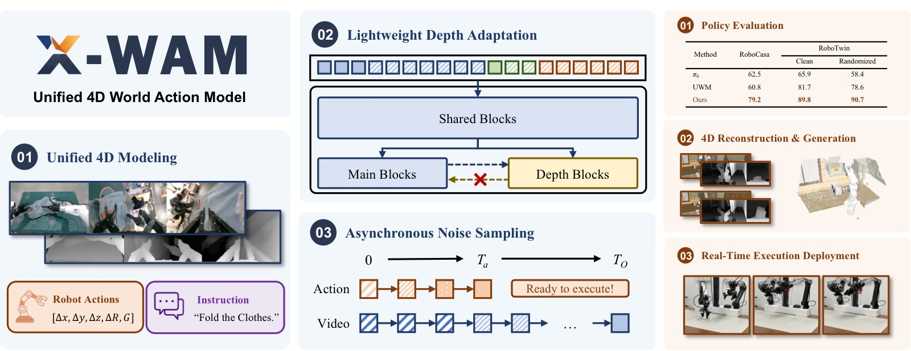
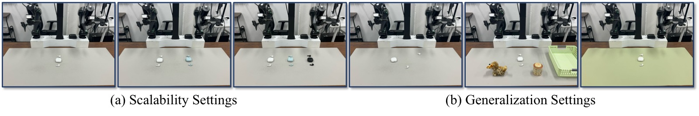
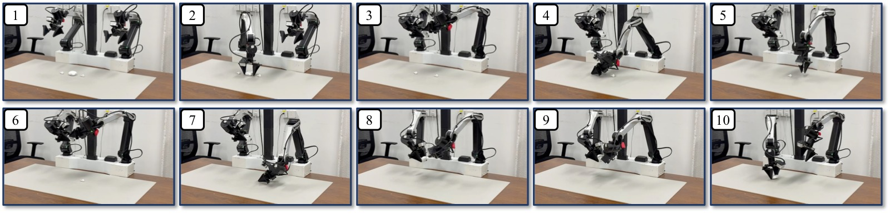

<!-- arxiv: 2604.26694 -->
<!-- venue: NeurIPS 2026（投稿中） -->
<!-- tags: WAM, 世界模型, 视频生成, 3D重建 -->

# Unified 4D World Action Modeling from Video Priors with Asynchronous Denoising

> **论文信息**
> - 作者：Jun Guo (Tsinghua/Xiaomi), Qiwei Li (PKU/Xiaomi), Peiyan Li (CASIA/Xiaomi), Zilong Chen (Tsinghua), Nan Sun (Tsinghua/Xiaomi), Yifei Su, Heyun Wang, Yuan Zhang, Xinghang Li, Huaping Liu
> - 通讯作者：Xinghang Li (Xiaomi Robotics), Huaping Liu (Tsinghua University)
> - 投稿方向：NeurIPS 2026（投稿中）
> - arXiv ID：2604.26694v2
> - 项目主页：https://sharinka0715.github.io/X-WAM/

---

## 一、核心问题

当前具身 AI 模型存在两大割裂：

1. **策略模型（VLA / WAM）** 专注动作预测，缺乏 3D 空间感知和物理直觉。
2. **世界模型（World Model）** 专注未来观测仿真，不直接产生可执行动作。

近期工作（UWM、Motus、DreamZero 等）尝试在单一框架中统一视频生成与动作预测，但存在两个关键缺陷：

> **缺陷一**：仅建模 2D 像素空间，缺乏显式 3D 几何感知，容易产生物理上不可行的幻觉预测。
>
> **缺陷二**：异步去噪（加速动作解码）时，训练和推理的噪声分布不匹配——训练阶段各模态独立采样噪声时间步，推理阶段却要求动作先于视频完成去噪。这种训练-推理 gap 限制了异步去噪的效果。

**论文目标**：将统一世界动作模型从 2D 像素预测器升级为**空间感知的 4D 动态模拟器**，同时完成视频生成、3D 重建和策略执行三大任务。

---

## 二、核心思路 / 方法

X-WAM 基于预训练视频扩散模型 **Wan2.2-TI2V-5B**（一个 5B 参数的 Diffusion Transformer），通过两个核心设计实现 4D 统一建模：

*图1：X-WAM 整体概览。上半部分：X-WAM 是一个统一的 4D 世界动作模型，基于预训练视频先验，以多视角 RGB 观测和机器人当前状态作为输入，联合预测未来多视角 RGB-D 视频和机器人动作，通过轻量级深度适配模块（Lightweight Depth Adaptation）实现空间重建、异步噪声采样（ANS）实现高效动作解码。下半部分：X-WAM 在 RoboCasa 和 RoboTwin 2.0 上的策略成功率超越现有方法，生成高保真 4D 重建，并在真机上实现实时部署。*

### 2.1 模型架构总览

X-WAM 接收语言指令 $c$、初始本体感受状态 $s_0$、多视角初始 RGB 观测 $O_0$ 作为条件，同时预测：
- 未来 RGB 视频 $O_{1:H}$（$H=8$ 帧）
- 未来深度视频 $D_{1:H}$
- 未来本体感受状态 $s_{1:H}$
- 未来动作 $a_{1:K}$（$K=32$，控制频率为视频帧率的 4 倍）

三种模态统一拼接为去噪序列：

$$\mathbf{Z} = [\mathbf{z}_{O_0},\, \mathbf{z}_{O_{1:H}},\, \mathbf{z}_{s_0},\, \mathbf{z}_{s_{1:H}},\, \mathbf{z}_{a_{1:K}}]$$

其中 RGB 视频通过 Wan2.2 原有的因果 VAE 编码为 latent，状态和动作通过可学习的 MLP 投影到同一 latent 空间，使用双向全注意力处理。

**多视角兼容**：原始模型仅支持单视角 2D 生成（使用 3D RoPE 编码时空位置）。X-WAM 为每个视角的 token 添加可学习的视角嵌入（view embedding），在不破坏预训练位置编码的前提下支持多视角输入。

**相机外参估计**：X-WAM 不显式编码相机外参或射线方向图，而是预测末端执行器位姿 $\mathbf{T}_{\text{ee}} \in SE(3)$，再通过固定的手眼标定矩阵 $\mathbf{T}_{\text{h2e}}$ 推导腕部相机位姿：

$$\mathbf{T}_{\text{wrist}} = \mathbf{T}_{\text{ee}} \cdot \mathbf{T}_{\text{h2e}}$$

### 2.2 轻量级深度适配模块（Lightweight Depth Adaptation）

*图2：X-WAM 框架详细设计，分为 (a) 模型架构和 (b) 异步噪声采样 ANS 两大板块。*

**子图 (a) 模型架构——双分支 Diffusion Transformer**：

展示了 X-WAM 的完整模型结构和数据流。左侧为**输入层**：多视角 RGB 图像 $O_0$（含全局视角和腕部视角共 3 个以上 camera views）通过因果 VAE 编码器 $\mathcal{E}$ 压缩为 latent token 序列 $\mathbf{z}_O$；机器人当前状态 $s$ 和待去噪的动作噪声 $\mathbf{z}_a$ 分别通过可学习的 MLP 投影到统一维度。这些 token 沿序列维度拼接后，添加视角嵌入（view embedding）以区分不同相机来源，形成统一的去噪序列 $\mathbf{Z}$。

中部为**Diffusion Transformer 主干**：由 $N$ 层 DiT Block 组成。前 $N-M$ 层为共享主干（Shared Trunk），对所有 token 执行双向全注意力处理，让视频、状态、动作三种模态在统一的 latent 空间中充分交互。第 $N-M$ 层输出的隐藏状态 $\mathbf{H}$ 同时送入两个分支：(1) 主分支（Main Branch），继续执行剩余的 $M$ 个预训练 DiT Block；(2) 深度分支（Depth Branch），由 $M$ 个复制自 DiT Block 的 Depth Block 构成。关键设计在于深度分支的每个 block 通过**交叉注意力（Cross-Attention）** 读取主分支同一层的输入 $\mathbf{Z}_m^{(j-1)}$，形成"深度偷看 RGB 主分支"的非对称信息流。注：图中用虚线箭头从主分支指向深度分支，清晰标注了这种单向注意力（Unilateral Attention）关系——主分支不受深度 token 的影响，严格保护预训练权重不被破坏。

右侧为**输出层**：主分支的最终输出通过三个独立的预测头（Head）输出速度预测 $\hat{\mathbf{v}}_O$（视频）、$\hat{\mathbf{v}}_s$（状态）、$\hat{\mathbf{v}}_a$（动作），分别用于反向去噪恢复干净 latent；深度分支通过独立 Depth Head 直接回归逆深度图 $\hat{D}$（单通道，MSE loss）。末端的 RGB Decoder 将去噪后的 $\mathbf{z}_O$ 解码回像素空间视频帧。

**子图 (b) 异步噪声采样 ANS——三种采样范式对比**：

用三列简图对比训练→推理的噪声时间步对齐策略。横轴统一表示从噪声到干净的流匹配插值过程（0 = 纯噪声，1 = 干净数据），纵轴区分视频（Video）和动作（Action）两个模态。

**(b-i) 标准解耦采样（Decoupled Sampling）——以往方法（UWM、Motus、DreamZero）**：训练时视频和动作的噪声时间步 $t_O$ 和 $t_a$ **独立随机采样**（$t_O \sim U(0,1)$，$t_a \sim U(0,1)$ 互不依赖）。这导致训练中出现大量 $t_O < t_a$ 的配置（视频噪声比动作低，图中用虚线框标注为"无效训练区域"），而推理时异步去噪要求动作先完成（$t_a$ 先到 0），意味着 $t_O \geq t_a$ 才是推理可能遇到的情况。$t_O < t_a$ 的训练样本对应推理中不可能出现的 regime，被完全浪费。

**(b-ii) X-WAM 的耦合联合采样（Coupled Joint Sampling, 即 ANS 训练）**：视频时间步 $t_O$ 以动作时间步 $t_a$ 为条件采样，确保始终满足 $t_O \geq t_a$（图中用蓝色区域表示有效训练区域）。具体采样策略：$t_a \sim U(0,1)$ 先采样，然后 $b \sim \mathrm{Beta}(1.5, 1)$ 采样一个偏向 1 的值，经重缩放 $t_O = t_a + (1-t_a) \cdot b$ 得到 $t_O \in [t_a, 1]$。Beta(1.5, 1) 的偏态分布使 $t_O$ 大概率落在较高噪声水平，反映了视频确实比动作需要更多去噪步数的物理现实。另外 50% 概率 ($p=0.5$) 直接设 $t_a=0$（动作无噪），模拟推理后半段的纯"动作条件视频生成"阶段。

**(b-iii) 异步推理过程（Async Inference）**：推理时使用两个独立的 UniPC 调度器。横轴表示去噪步数 $k=1 \dots T_O$。前 $T_a=10$ 步（黄色区域）为**联合去噪阶段**——视频和动作各自按调度器步长推进，每步都调用完整的 Denoise 函数。第 $T_a$ 步完成后，动作/状态已经恢复为干净 latent（$t_a=0$），立即解码为物理空间的动作序列并发送给机器人执行。第 $T_a+1$ 至第 $T_O=50$ 步（蓝色区域）为**视频专属去噪阶段**——动作保持干净不动，仅视频继续去噪直到 $T_O$ 步输出高保真 RGB-D 视频。图中用分叉箭头清晰标注了"动作在第 $T_a$ 步分离，视频延续至 $T_O$ 步"的关键时间点。这种设计用一个模型同时实现了两种能力：前半段是统一世界动作模型（WAM），后半段是动作条件世界模型（action-conditioned world model）。*

这是 X-WAM 的第一个核心创新，解决"如何在不大幅增加计算量的前提下注入 3D 感知"。

**三种朴素方案的问题**：

| 方案 | 问题 |
|------|------|
| 沿序列维度拼接深度 token | 序列长度翻倍，注意力成本平方增长 |
| 沿通道维度融合深度 | 输入分布偏离预训练流形，大幅增加学习难度 |
| 后处理深度估计（如 DA3） | 并非端到端联合优化，几何一致性差 |

**X-WAM 的方案——交错深度分支（Interleaved Depth Branch）**：

1. 将预训练 DiT 的最后 $M$ 个 block（论文中 $M=10$）复制一份，构造专属深度预测分支。
2. 前 $N-M$ 个共享 DiT block 产出隐藏状态 $\mathbf{H}$ 后，主分支和深度分支初始化为 $\mathbf{Z}_m^{(0)} = \mathbf{Z}_D^{(0)} = \mathbf{H}$。
3. 交错执行：每层深度分支通过交叉注意力读取主分支输入 $\mathbf{Z}_m^{(j-1)}$，再执行主分支的 DiT block。

**关键设计——单向注意力（Unilateral Attention）**：深度分支可以读取主分支信息，但主分支不受深度 token 影响，严格保护预训练权重完整性。

**推理灵活性**：深度分支不需要参与每个去噪步骤，可以灵活开关，大幅降低 rollout 开销。动作解码时关闭深度分支，视频生成时按需开启。

### 2.3 异步噪声采样（Asynchronous Noise Sampling, ANS）

这是 X-WAM 的第二个核心创新，解决"高维视频需要大量去噪步数 vs 低维动作只需少量步数"的模态失配。

**异步推理**：推理时分配 $T_a$ 步给动作/状态去噪，$T_O$ 步给视频去噪（$T_a < T_O$）。前 $T_a$ 步两者联合去噪，之后动作变为干净的 conditioning，视频继续去噪至 $T_O$ 步。动作在 $T_a$ 步后即可立即发送给机器人执行。

**耦合训练采样**（区别于以往工作的独立采样）：

从联合分布中采样 $(t_O, t_a)$：

$$(t_O, t_a) \sim
\begin{cases}
    t_a = 0,\;\; t_O \sim \mathrm{U}(0, 1) & \text{w.p. } p, \\[4pt]
    t_a \sim \mathrm{U}(0, 1),\;\; t_O = t_a + (1 - t_a) \cdot b,\;\; b \sim \mathrm{Beta}(1.5, 1) & \text{w.p. } 1-p,
\end{cases}$$

- **第一种情况**（概率 $p=0.5$）：动作无噪（$t_a=0$），仅对视频加噪——模拟推理后半段"动作条件视频生成"的 regime。
- **第二种情况**（概率 $1-p=0.5$）：同步加噪，但通过 $\mathrm{Beta}(1.5, 1)$ 分布确保 $t_O \geq t_a$——视频噪声水平始终不低于动作，反映了视频需要更多去噪步数的现实。

核心洞察：**$t_O$ 以 $t_a$ 为条件采样**，二者是 dependent 而非 independent 随机变量，忠实匹配推理分布。

---

## 三、训练目标

训练框架基于 **Flow Matching**，模型 $f_\theta$ 预测速度场 $\mathbf{v} = \boldsymbol{\epsilon} - \mathbf{z}^0$：

$$\mathcal{L}_{m} = \left\| f_\theta^{m}(\mathbf{z}_m^{t_m}, t_m) - (\boldsymbol{\epsilon}_m - \mathbf{z}_m^0) \right\|^2$$

其中 $m \in \{O, s, a\}$ 分别对应视频、状态、动作。$t_O$ 和 $t_a$ 通过 ANS 采样，$t_s = t_a$。深度分支使用直接的 MSE 回归损失：

$$\mathcal{L}_{\text{depth}} = \left\| \hat{D} - D^{*} \right\|^2$$

总损失：

$$\mathcal{L}_{\text{total}} = \mathcal{L}_{O} + \lambda_s \mathcal{L}_{s} + \lambda_a \mathcal{L}_{a} + \lambda_D \mathcal{L}_{\text{depth}}$$

其中 $\lambda_s = \lambda_a = \lambda_D = 1.0$。

### 预训练数据

| 数据集 | 来源 | 轨迹数 | 时长 (h) |
|--------|------|--------|----------|
| AgibotWorld-Beta | 真实 | 866,562 | 2,221.5 |
| DROID | 真实 | 74,734 | 280.3 |
| InternA1-Aloha | 仿真 | 184,803 | 1,337.3 |
| InternA1-Genie1 | 仿真 | 50,638 | 174.0 |
| InternA1-Lift2 | 仿真 | 231,018 | 1,464.7 |
| RoboCasa MimicGen | 仿真 | 56,771 | 282.4 |
| RoboTwin 2.0 | 仿真 | 27,500 | 113.7 |
| **合计** | — | **1,492,026** | **5,873.9** |

> 关键细节：预训练数据大多缺乏深度标注，X-WAM 使用 Video Depth Anything (VDA) 从所有训练视频中提取深度图作为伪标签。

### 训练配置

- **预训练**：256 × NVIDIA H20 GPU，总 batch size 2,048，40,000 步
- **微调**：32 × NVIDIA H20 GPU，总 batch size 128，20,000 步
- 优化器：AdamW，峰值学习率 $1\times10^{-4}$（预训练）/ $3\times10^{-5}$（微调），1,000 步 warmup + cosine decay
- 推理：$T_a=10$ 动作去噪步，$T_O=50$ 视频去噪步，UniPC 多步调度器，CFG scale=1.0

---

## 四、实验与结果

### 4.1 策略评估

**RoboCasa（24 个厨房操作任务）**：

| 类别 | 方法 | 平均成功率 |
|------|------|-----------|
| VLA | $\pi_0$ | 62.5% |
| VLA | GR00T-N1.5 | 64.1% |
| WAM | UWM | 60.8% |
| WAM | DreamZero | 62.4% |
| WAM | Cosmos Policy | 67.1% |
| **WAM** | **X-WAM** | **79.2%** |

> X-WAM 以 79.2% 胜出，比最强基线 Cosmos Policy 高出 **12.1 个百分点**。

**RoboTwin 2.0（50 个双臂操作任务）**：

| 类别 | 方法 | Clean | Randomized |
|------|------|-------|------------|
| VLA | $\pi_0$ | 65.9% | 58.4% |
| VLA | $\pi_{0.5}$ | 82.7% | 76.8% |
| WAM | UWM | 81.7% | 78.6% |
| WAM | GigaWorld-Policy | 87.0% | 85.0% |
| WAM | Motus | 88.7% | 87.0% |
| **WAM** | **X-WAM** | **89.8%** | **90.7%** |

> 在 Clean 和 Randomized 两个设置下均超越 Motus，且 Randomized 下高出 3.7 个百分点，展现了更强的泛化鲁棒性。

### 4.2 4D 重建与生成

在 RoboCasa 环境上评估多视角 RGB-D 预测质量（像素指标仅在两个静态相机上计算，腕部相机因预测位姿微小误差导致像素不对齐）：

| 方法 | PSNR↑ | SSIM↑ | LPIPS↓ | AbsRel↓ | δ₁↑ | CD↓ |
|------|-------|-------|--------|---------|-----|-----|
| DreamZero + DA3 | 21.12 | 0.7788 | 0.1580 | 0.1362 | 0.8594 | 0.0680 |
| Robot4DGen | 22.67 | 0.8207 | 0.1026 | 0.0736 | 0.9443 | 0.0134 |
| X-WAM w/o depth + DA3 | 23.09 | 0.8916 | 0.0548 | 0.1045 | 0.9089 | 0.0401 |
| **X-WAM** | **23.46** | **0.8942** | **0.0513** | **0.0349** | **0.9738** | **0.0049** |

> **关键发现**：
> - X-WAM 在所有 6 个指标上全面领先。
> - 相比 DreamZero+DA3 的两阶段方案，PSNR 提升 2.34 dB，Chamfer Distance 从 0.0680 降至 0.0049（**降低 13.9 倍**），说明端到端联合建模远优于后处理深度估计。
> - X-WAM w/o depth + DA3 保持了较强的 RGB 质量，但深度精度明显下降（AbsRel 0.1045 vs 0.0349），点云质量也大幅降低（CD 0.0401 vs 0.0049），证实了集成深度分支的几何一致性优势。

### 4.3 消融实验（RoboCasa，无大规模预训练）

**深度架构设计对比**（Table 3a）：

| 变体 | SR↑ | 延迟(ms)↓ | PSNR↑ | AbsRel↓ |
|------|-----|----------|-------|---------|
| No depth | 63.0% | **1033** | 23.09 | — |
| Sequence concat | **68.7%** | 1888 | **23.60** | **0.0332** |
| Channel concat | 64.2% | 1266 | 23.20 | 0.0377 |
| **Interleaved branch (Ours)** | **67.8%** | **1033** | 23.46 | 0.0349 |

> - 序列拼接质量最优但延迟近翻倍（1888ms），不可接受。
> - 通道拼接延迟也有显著开销（1266ms），且成功率仅 64.2%——破坏了预训练输入分布。
> - 交错分支方案在保持与 No depth 相同延迟（1033ms）的前提下，将成功率从 63.0% 提升至 67.8%（**+4.8pp**），证明了显式空间建模对策略执行的关键价值。
> - 深度分支可在动作推理时关闭，这是延迟不受影响的根本原因。

**噪声调度策略对比**（Table 3b）：

| 变体 | SR↑ | 延迟(ms)↓ | PSNR↑ | AbsRel↓ |
|------|-----|----------|-------|---------|
| Sync train + Sync infer | 66.4% | 4665 | **23.48** | 0.0375 |
| Decoupled train + Sync infer | 66.3% | 4665 | 23.17 | 0.0397 |
| Decoupled train + Async infer | 67.2% | **1033** | 22.60 | 0.0430 |
| **ANS train + Async infer (Ours)** | **67.8%** | **1033** | 23.46 | **0.0349** |

> - 同步方案延迟 4665ms（25 步），异步方案仅 1033ms（5 步），**延迟降低 4.5 倍**。
> - Decoupled-Async 成功率不错（67.2%），但重建质量显著退化（PSNR 从 23.17 降至 22.60）——因为视频必须在干净动作条件下继续去噪，而独立采样训练未见过此 regime。
> - ANS 通过耦合训练噪声分布，在异步推理的低延迟（1033ms）下取得了最高的成功率（67.8%）和最佳的深度指标（AbsRel 0.0349），同时视频质量接近同步基线水平。

### 4.4 真机实验

*图3：真实机器人实验平台设置。照片展示了一台 AC One 双机械臂操作平台的全貌，标注了关键硬件组成和相机布局。*

**硬件配置**：平台配备两条 6-DoF 机械臂（左右对称布局），每只手臂末端安装有平行夹爪用于抓取物体。工作台面上方和侧方共布置了**三个相机**：一个固定在台面上方的全局主相机（main camera），提供全景俯视视角，用于观察整个工作空间的物体布局和双臂姿态；两个腕部相机（wrist-mounted cameras）分别安装在左右机械臂腕关节处，随手臂运动提供动态的近距局部视角，对抓取和插入等精细操作尤为关键。所有相机以 **320×256 分辨率**运行，帧率为 3.75 FPS（与训练数据统一）。

**实验任务**：台面上放置了耳机盒和需要包装的耳机（图中可见黑色耳机盒和白色耳机），这是经过精心设计的四阶段长序列任务，用于测试模型的 3D 空间推理和长时间操作能力。选择此任务的核心原因有两点：(1) 耳机插入操作要求精确估计耳机盒的 6-DoF 姿态，定位因盒体旋转方向不同而变化的窄槽开口位置，执行**亚厘米级间隙约束**的插入轨迹——这些都对 3D 空间感知提出了极高的要求；(2) 四阶段流程（开盖→放左耳机→放右耳机→合盖归位）测试了长序列操作的可靠性和双臂协调能力。

**数据与训练**：此平台上采集了约 20 小时的遥控示教数据，模型在 64 块 H20 GPU 上微调 40,000 步。推理时使用 8 步异步去噪，单次推理延迟约 300ms，结合 RTC（Real-Time Chunking）技术实现计算与执行重叠，最终以 15Hz 控制频率实现无缝实时部署。

**图中隐含的关键对比**：论文同时在此平台上测试了 VLA 基线模型 $\pi_{0.5}$ 和 XR-0。$\pi_{0.5}$ 在相同数据和训练条件下**完全无法完成任何单个完整 episode**，仅能达到 25%–50% 进度（对应抓取盒子开盖但耳机插入失败），这直观地验证了：依赖纯 2D 像素空间建模的 VLA 在需要精确 3D 空间推理的接触式操作任务上存在根本性瓶颈。*

在 **AC One 双臂平台**上执行**耳机包装任务**（4 阶段长序列任务：开盖→放左耳机→放右耳机→合盖归位），对比 X-WAM 与 Xiaomi-Robotics-0 (XR-0)：

| 设置 | XR-0 进度 | XR-0 时间 | X-WAM 进度 | X-WAM 时间 |
|------|----------|----------|-----------|-----------|
| 1 个耳机 | 100.0% | 54.66s | **100.0%** | **41.63s** |
| 2 个耳机 | 79.1% | 115.44s | **93.8%** | **113.25s** |
| 3 个耳机 | 63.9% | 195.66s | **68.0%** | **160.72s** |
| 新位置 | 58.3% | 89.63s | **70.8%** | **46.68s** |
| 新桌布 | **66.7%** | 65.73s | **66.7%** | **62.01s** |
| 新干扰物 | 66.7% | 76.32s | **75.0%** | **51.53s** |

> **关键发现**：
> - X-WAM 在所有扩展性和泛化设置下均超越 XR-0，尤其在长时间任务和新位置泛化上优势显著。
> - $\pi_{0.5}$ 在相同数据和训练设置下**未能完成任何单个完整耳机包装 episode**，只做到 25%–50% 进度（即只能抓取盒子但无法完成耳机插入），侧面反映了 2D 模型在需要精确 3D 空间推理的插入任务上的局限性。
> - 推理方面：8 步异步去噪 + RTC（Real-Time Chunking），单次延迟约 300ms，控制频率 15Hz，实现无缝实时部署。

*图4：X-WAM 在 AC One 双臂机器人上执行完整耳机包装任务的代表性 rollout 关键帧序列。四行从上到下对应四个阶段，每行展示该阶段从开始到完成的关键时间步画面。所有画面来自三个相机视角的拼接（全局主相机 + 左右腕部相机）。*

**阶段 (a) 抓取耳机盒并开盖**（第 1 行）：左臂从台面抓取闭合的耳机盒，提升至工作高度，右臂辅助稳定盒体，左臂手指执行开盖动作。此阶段的难点在于：(1) 耳机盒是旋转对称物体，需要从 RGB 外观推断其朝向以规划抓取姿态；(2) 开盖需要定位盒盖的铰链方向和边缘缝隙——纯 2D 特征（如纹理、颜色）不足以推断铰链位置，必须依赖深度预测提供的 3D 几何信息。完成此阶段贡献 25% 任务进度，是后续所有插入操作的前提。

**阶段 (b) 放入第一只耳机——精准插入**（第 2 行）：左臂从台面拾取第一只无线耳机（小型不规则物体），移动至已开盖的盒子附近，将耳机精确插入盒中对应的凹槽。此阶段的难点在于：(1) 耳机尺寸小（约 2–3cm），抓取姿态要求高精度；(2) 盒中凹槽的开口方向与盒子当前朝向有关，需要模型理解盒子在空间中的 6-DoF 位姿，而非仅凭 2D 外观推测。X-WAM 通过深度分支预测的深度图推断凹槽的 3D 位置和法向量，规划出满足亚厘米级公差的插入轨迹。此阶段在论文中是最关键的瓶颈——$\pi_{0.5}$ 在所有 trial 中均在此阶段或之前失败，证明了纯 2D 模型对接触式插入任务的根本性局限。

**阶段 (c) 放入第二只耳机——重复精度**（第 3 行）：与阶段 (b) 对称，但拾取第二只耳机。新挑战在于：(1) 盒子内已有第一只耳机，视觉上凹槽部分被遮挡，模型需要记住第一只耳机的放置位置；(2) 第二只耳机的凹槽通常在盒子的对称位置，涉及另一侧的空间推理。模型需要通过视频预测来"想象"盒内空间布局，而非仅依赖当前观测。

**阶段 (d) 合盖并归位**（第 4 行）：右臂合上盒盖，左臂将完整的耳机盒放回台面指定位置。此阶段的难点在于：(1) 合盖需要轻柔且精确的力度控制，避免夹坏已放入的耳机或损坏铰链（注意论文使用笛卡尔空间相对位姿作为动作表示，可提供平滑的轨迹）；(2) 将盒子放回台面需要规划避免碰撞的路径——盒子内已有耳机，碰撞风险高于空盒。完成此阶段即达成 100% 进度。

**整体观察**：四个阶段之间的过渡流畅无停顿，验证了 RTC（Real-Time Chunking）机制的有效性——推理计算与动作执行重叠，避免了传统"推理→执行→推理"的等待间隙。论文定量结果中 X-WAM 完成 1 个耳机包装平均仅需 41.63 秒（vs XR-0 的 54.66 秒），**快了 24%**，说明异步去噪不仅在延迟数字上占优，实际转化为更高效的物理操作轨迹和更少的纠偏动作。在定性层面，图中可见机械臂的末端轨迹平滑且目标导向，未见抖动或反复尝试，印证了 X-WAM 的 3D 空间感知带来了更自信的一次性精确操作。*

---

## 五、关键洞察与技术亮点

1. **3D 感知提升策略性能**：消融实验中移除深度监督导致成功率从 67.8% 降至 63.0%（−4.8pp），证明显式空间建模不仅在重建上有益，还直接提升操作鲁棒性。

2. **单向注意力的设计哲学**：深度分支可以"偷看"主分支，但主分支不受深度 token 影响——这保护了预训练权重的完整性，是深度分支不破坏原有性能的根本保障。

3. **训练-推理分布对齐**：以往工作（Motus、DreamZero 等）独立采样各模态噪声时间步，导致训练时出现 $t_O < t_a$ 等推理中不可能出现的配置，浪费训练资源。ANS 通过耦合采样（$t_O$ 以 $t_a$ 为条件）消除了这一 mismatch。

4. **深度分支的可开关特性**：推理时动作解码不需要深度信息，因此可关闭深度分支以维持低延迟；视频生成时按需开启。这种"按需使用"的设计是交错分支方案在延迟上持平 No depth 变体的关键。

5. **相机位姿的巧妙处理**：不同于显式编码外参或射线方向，X-WAM 仅预测末端执行器位姿并通过手眼标定推导腕部相机位姿——利用了机器人系统的结构化先验，避免了额外的预测头。

6. **大规模多源数据统一**：5,800+ 小时、7 个异构数据集通过统一的末端执行器状态/动作表示（16 维状态 + 14 维动作）进行标准化，对单臂机器人只监督左臂输出。

---

## 六、局限性

1. **固定长度上下文窗口**：X-WAM 仅处理固定长度的观测窗口，不包含历史信息也不支持自回归 rollout。在长序列操作中，单帧观测不足以区分任务阶段，可能产生次优决策。作者指出可通过 KV 缓存和自回归推理扩展。

2. **推理延迟高于专用策略模型**：作为同时生成高维视频和低维动作的统一模型，X-WAM 的单次推理延迟（约 300ms / 8 步）高于专用 VLA 或轻量 WAM（如 Fast-WAM）。虽然 RTC 机制可在物理机器人上实现实时部署，但额外的推理延迟意味着机器人必须基于"几个帧之前"的预测执行动作，可能降低策略性能。模型蒸馏、一致性模型和更激进的异步调度是潜在的加速方向。

---

## 七、关键概念速查

| 概念 | 简要说明 |
|------|----------|
| **WAM (World Action Model)** | 统一世界动作模型，从视频生成模型出发联合预测未来观测和机器人动作 |
| **X-WAM** | 本文提出的 4D WAM，同时完成视频生成、3D 重建和策略执行 |
| **Interleaved Depth Branch** | 轻量级深度适配模块：复制 DiT 末尾 M 个 block 作为深度分支，通过单向交叉注意力从主分支读取信息 |
| **Unilateral Attention** | 单向注意力：深度分支可读取主分支，反之不可，保护预训练权重 |
| **ANS (Asynchronous Noise Sampling)** | 异步噪声采样：训练时耦合采样 $(t_O, t_a)$ 确保 $t_O \geq t_a$，推理时动作在 $T_a$ 步解码、视频在 $T_O$ 步生成 |
| **Flow Matching** | 训练框架：模型预测速度场 $\mathbf{v} = \boldsymbol{\epsilon} - \mathbf{z}^0$，而非噪声本身 |
| **Wan2.2-TI2V-5B** | 预训练视频 DiT 基座，5B 参数，支持文生视频（T2V）和图生视频（I2V） |
| **RTC (Real-Time Chunking)** | 实时分块推理：重叠计算与执行，减少等待延迟 |
| **UniPC** | 多步 ODE 调度器，Wan2.2 推荐的推理采样器 |
