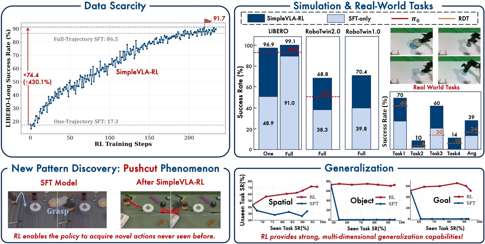
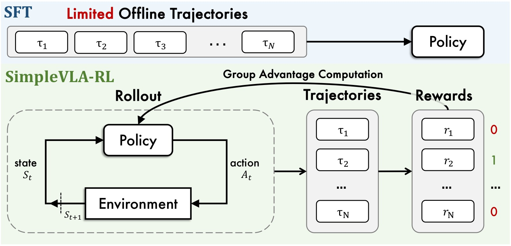
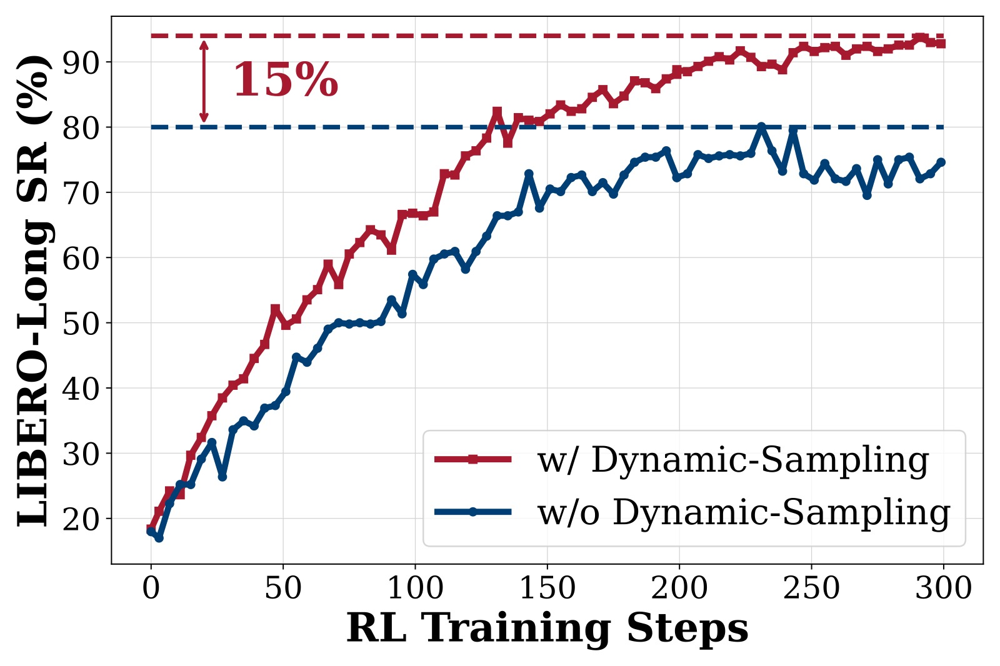
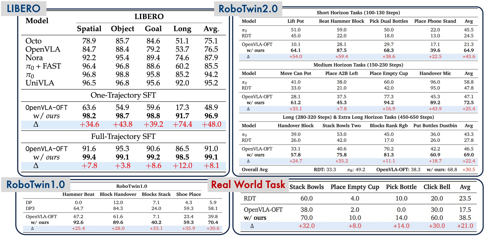
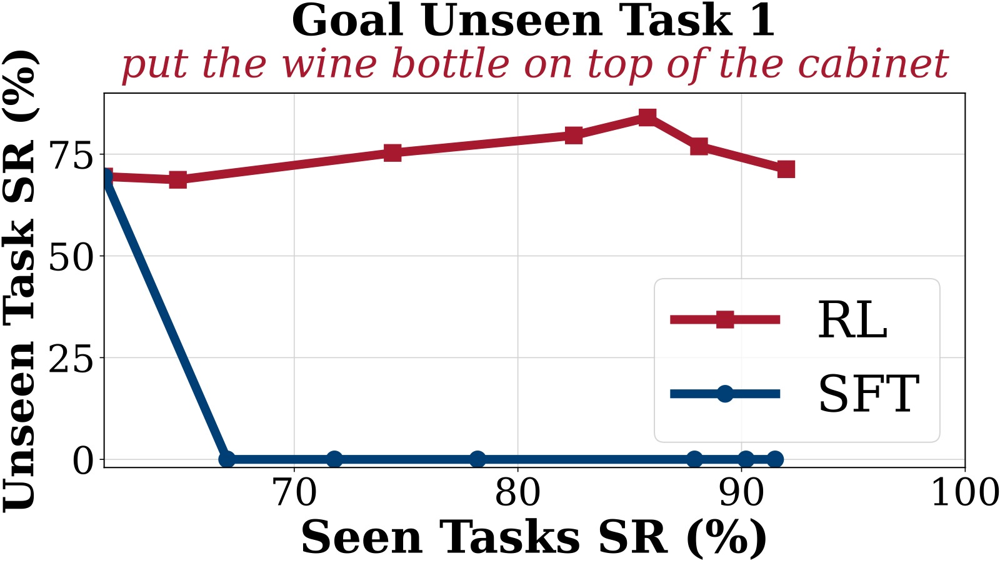
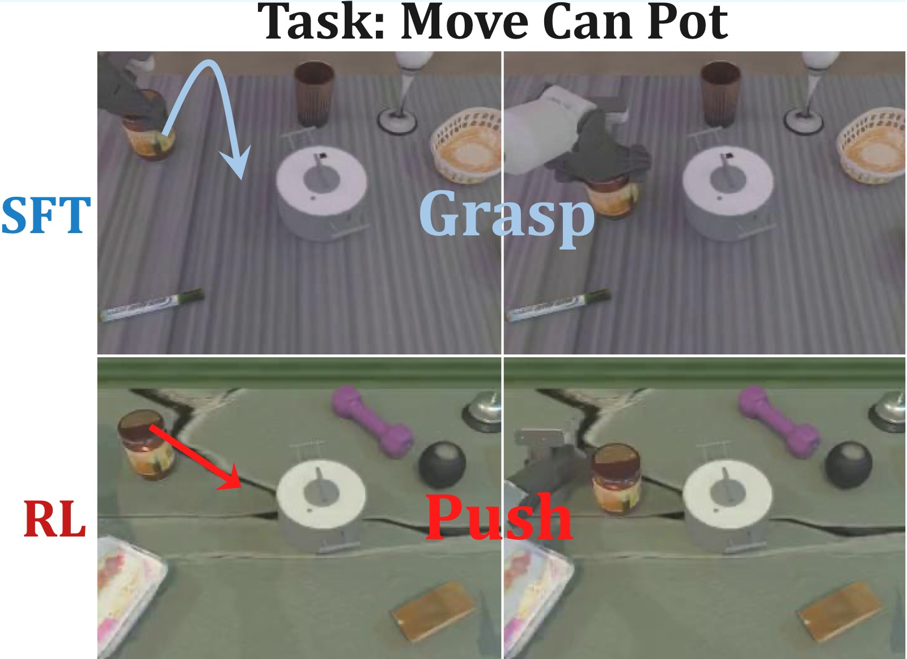
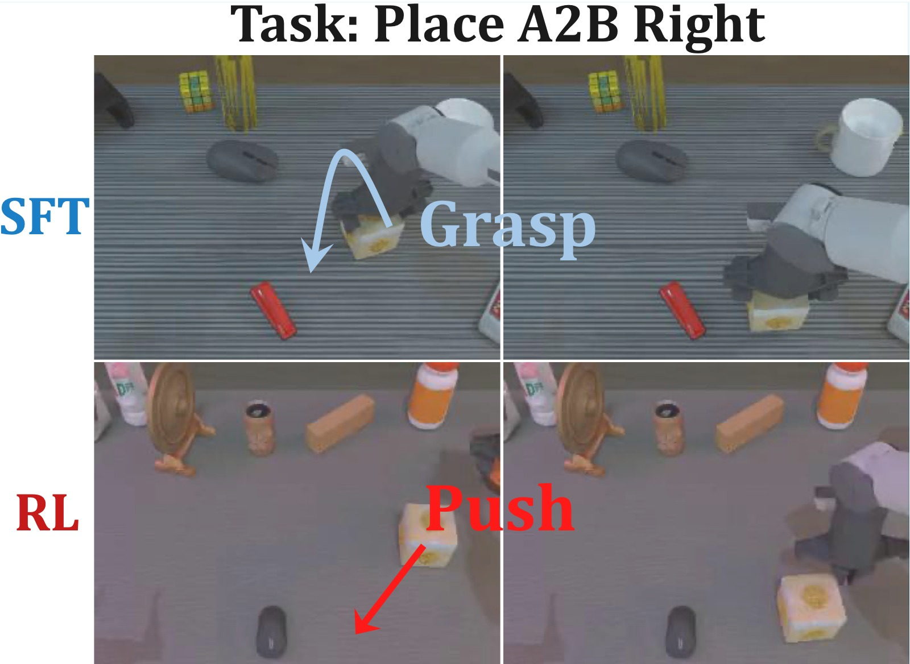

# SimpleVLA-RL: Scaling VLA Training via Reinforcement Learning

> **论文信息**
> - 作者：Haozhan Li*, Yuxin Zuo*, Jiale Yu*, Yuhao Zhang, Zhaohui Yang, Kaiyan Zhang, Xuekai Zhu, Yuchen Zhang, Tianxing Chen, Ganqu Cui, Dehui Wang, Dingxiang Luo, Yuchen Fan, Youbang Sun, Jia Zeng, Jiangmiao Pang, Shanghang Zhang, Yu Wang, Yao Mu, Bowen Zhou†, Ning Ding†
> - 通讯作者：Bowen Zhou, Ning Ding
> - 机构：Shanghai AI Lab, SJTU, Peking University, HKU
> - arXiv ID：2509.09674
> - 会议：ICLR 2026
> - 代码：https://github.com/PRIME-RL/SimpleVLA-RL
> - 日期：2025-09-12

---

## 一、核心问题

VLA（Vision-Language-Action）模型在机器人操控领域取得了显著进展，但面临两个根本性瓶颈：

1. **数据稀缺与高成本**：SFT 需要大量人工采集的机器人轨迹数据。采集高质量轨迹需要精心设计的实验场景、多样的操控对象和熟练操作员，导致数据规模和多样性严重受限。这一瓶颈随模型规模增长而加剧。
2. **泛化能力不足**：在面临分布偏移（unseen tasks、new environments、novel objects、spatial variations）时，VLA 性能急剧下降。SFT 依赖有限的、场景特定的数据，导致过拟合——模型在训练任务上表现尚可，但在未见任务上完全失败。

DeepSeek-R1 等工作证明 RL 可以显著增强 LLM 的逐步推理能力。论文核心问题是：**RL 能否同样增强 VLA 模型逐步生成准确动作的长程规划能力？**

挑战在于：LLM rollout 是一次性自回归生成，而 VLA rollout 需要与物理/仿真环境进行闭环多轮交互——每步执行后环境状态改变，模型必须基于实时感知反馈生成下一步动作。这远比 LLM RL 更慢、更昂贵。



*图1：SimpleVLA-RL 框架总览。该图以四栏布局展示了 SimpleVLA-RL 的核心贡献：(1) **RL 训练流程**——从 SFT 初始化的 VLA 模型出发，通过 GRPO 在线 RL 持续改进策略，利用二元 outcome reward（成功=1，失败=0）驱动学习；(2) **性能对比**——在 LIBERO 和 RoboTwin 基准上大幅超越 SFT 基线；(3) **"pushcut" 现象**——RL 训练中自主涌现出演示数据中不存在的新动作策略（推挤而非抓取）；(4) **泛化能力**——在空间配置、物体类型、任务目标三个维度上均优于 SFT。该图直观展示了从"模仿学习"到"强化学习"的范式转变带来的多方面收益。*

---

## 二、核心思路 / 方法

### 2.1 LLM RL vs VLA RL 的关键差异

| 维度 | LLM RL | VLA RL |
|------|--------|--------|
| **State** | prompt + 已生成 token | 多模态观测（RGB 图像 + proprioception + language） |
| **Action** | 从词表采样离散 token | 连续控制指令 $\mathbb{R}^d$，通过 action tokenizer 离散化 |
| **Environment** | 无中间反馈，序列完成时给奖励 | 每步物理交互，环境状态实时更新 |
| **Rollout** | 自回归生成至 EOS/max_length | 闭环交互采样：infer → execute → observe → infer → ... |
| **Reward** | 最终正确性判断（rule-based / RM） | 任务完成与否 + 可选过程奖励（如距离目标距离） |

VLA RL 的核心工程挑战：rollout 需要频繁与环境交互（每步都要 VLA 推理 + 环境 step），且必须支持并行多环境以提高吞吐。

### 2.2 SimpleVLA-RL 框架总览



*图2：SimpleVLA-RL 训练流程架构图。该图展示了从输入到策略更新的完整数据流。顶部是 VLA Policy Model（基于 OpenVLA-OFT，LLaMA2-7B backbone + SigLIP/DINOv2 vision encoder），接收任务指令和多视角图像作为输入。中部展示了核心 RL 循环的三个阶段：(1) **Rollout 阶段**——对同一 task prompt 采样 8 条轨迹（temperature=1.6），每条轨迹通过多步闭环交互完成，输出 action chunks；(2) **Reward 分配**——根据仿真环境返回的任务完成信号，给整个轨迹分配 0/1 二元奖励；(3) **GRPO 优化**——在 8 条轨迹间进行组内标准化计算优势函数，结合 PPO-style clipping 和动态采样过滤，更新策略参数。底部显示多环境并行渲染和交互的管理架构。*

#### 2.2.1 交互式 VLA Rollout（§3.1）

当前 VLA 模型有三种 action decoding 方式：

1. **Token-based**（如 OpenVLA、π₀）：输出 action token 的概率分布，与 PPO 类 RL 算法最兼容——天然提供 action distribution 用于随机采样和策略梯度计算。
2. **Diffusion-based**（如 RDT）：在 latent space 上去噪，难以直接计算 action likelihood。
3. **Deterministic MLP regression**（如部分 fine-tuned VLA）：输出确定性连续值，无法直接支持随机探索。

SimpleVLA-RL 选择 token-based 方式，因为这是唯一与 PPO/GRPO 等 policy-gradient 算法自然兼容的范式。在 rollout 阶段，VLA 通过 temperature 采样生成多样化轨迹；在更新阶段，通过 action token 的 log probability 计算 importance sampling ratio。

核心 pseudo-code 对比：

```
LLM rollout:  outputs = policy.generate(batch, temperature=T)  // 一次性
VLA rollout:  for t in range(max_steps):                       // 闭环
                  actions = policy.generate(states, temperature=T)
                  states, dones = env.step(actions)
                  if all(dones): break
```

#### 2.2.2 Outcome Reward（§3.2）

采用极简二元奖励：轨迹成功 → 全体 token reward = 1，失败 → 全体 token reward = 0。

$$R(a_{i,t} \mid s_{i,t}) = \begin{cases} 1, & \text{is\_successful}[\text{traj}_i(a_i,s_i)] \\ 0, & \text{otherwise} \end{cases}$$

轨迹级奖励均匀传播到每个 action token。这种设计的关键优势：
- **可扩展**：无需为每个任务手工设计过程奖励，跨环境通用
- **鼓励创新**：不约束中间步骤，给策略最大的探索自由度——任何能达成目标的行为都获得等值奖励
- **避免 reward hacking**：二元信号比连续过程奖励更难被利用

#### 2.2.3 探索增强策略（§3.3）

三类改进共同作用，每类各带来 10-15% 的额外性能提升：



*图3：三种探索增强策略的消融实验结果（均在 LIBERO 基准上评估）。该图是一个三子图并排的组合图（a/b/c），每个子图对比启用和禁用对应策略时的训练曲线。横轴为 RL 训练步数（global steps），纵轴为该步数对应的验证成功率（Success Rate %）。蓝色/绿色曲线代表启用策略的结果，橙色/灰色曲线代表禁用策略的对照结果。*

**子图 (a) Dynamic Sampling 效果：**
对比启用（绿线）和禁用（灰线）动态采样的训练曲线。动态采样过滤掉所有 8 条轨迹全成功或全失败的 group，只保留至少有一条成功和至少有一条失败的混合 group 用于训练。灰线（禁用）波动剧烈，训练极不稳定——当整组全部成功或全部失败时，GRPO 的优势估计变为零，梯度消失，导致模型在无信号的状态下随机漂移。绿线（启用）波动显著减小，成功率稳步上升并收敛到更高值（约 98% vs 95%）。这个改进的理论意义是：GRPO 通过组内标准化计算优势 $\hat{A}_i = (R_i - \text{mean})/(\text{std} + \epsilon)$，当所有 $R_i$ 相等时，$\text{std}=0$，所有 $\hat{A}_i=0$，loss 梯度为零——动态采样确保每组都有非零方差。

**子图 (b) Clip Higher 效果：**
对比 clip 范围 [0.8, 1.2]（橙线）vs [0.8, 1.28]（蓝线）。提高 clip 上界后，蓝线的最终成功率更高且收敛更快。PPO 的 clipping 机制 $\text{clip}(r, 1-\epsilon_{low}, 1+\epsilon_{high})$ 限制了 importance sampling ratio 的变动范围——传统的对称 clip [0.8, 1.2] 对概率增大和概率减小施加同等约束。但在 exploration 阶段，低概率但可能有价值的 action token 需要更大的增长空间才能被策略采纳。将上界从 1.2 放宽到 1.28（DAPO 提出的 Clip-Higher）给予低概率 token 更大的上升空间，同时保留下界 0.8 防止高概率 token 被过快遗忘。曲线显示在训练中后期（40-60 步后），clip higher 的优势更加明显。

**子图 (c) Higher Temperature 效果：**
对比 rollout temperature=1.0（灰色）vs temperature=1.6（蓝绿色）。提高温度后，训练初期的成功率攀升更快，最终收敛值也更高。Temperature 控制 action token 采样的随机程度：$T=1.0$ 时模型基本遵循其训练分布，$T=1.6$ 时采样的探索性显著增强。更高的温度产生更多样化的轨迹，为 GRPO 的组内比较提供了更丰富的好/坏对比信号。注意温度只在 rollout 阶段调高（鼓励探索），评估阶段始终使用 greedy sampling（temperature=0），确保最终策略的确定性。

#### 2.2.4 训练目标（§3.4）

采用改进的 GRPO，移除 KL 散度正则化项（借鉴 DAPO），最终目标：

$$\mathcal{J}(\theta) = \mathbb{E}_{s_0 \sim \mathcal{D}, \{a_t\}_{i=1}^G \sim \pi_{\theta_\text{old}}} \left[ \frac{1}{G} \sum_{i=1}^G \frac{1}{|a_i|} \sum_{t=1}^{|a_i|} \min \left( r_{i,t}(\theta) \hat{A}_{i}, \, \text{clip} \left( r_{i,t}(\theta), 1 - \varepsilon_{low}, 1 + \varepsilon_{high} \right) \hat{A}_{i} \right) \right]$$

约束条件：$0 < |\{\text{traj}_i \mid \text{is\_successful}[\text{traj}_i]\}| < G$（动态采样过滤）

移除 KL 正则化有两个动机：（1）省去 reference model 的 GPU 显存和推理开销；（2）KL 约束限制策略偏离 reference 的程度，移除后策略可以获得更大的探索自由度，有利于发现新行为（如 pushcut 现象）。

---

## 三、实验与结果

### 3.1 实验设置

- **Backbone**：OpenVLA-OFT（LLaMA2-7B + SigLIP/DINOv2 fused vision encoder + action chunking + parallel decoding），256 个 action token，vocab_size=32000
- **硬件**：8× NVIDIA A800 80GB（单节点）或 2×8 节点，全参数 FSDP 训练
- **超参**：lr=5e-6，batch_size=64，n_samples=8（每 prompt 采样 8 条轨迹），mini_batch=128，ε_low=0.2，ε_high=0.28，T=1.6，action_chunks: LIBERO=8 / RoboTwin=25，max_steps: LIBERO=512 / RoboTwin=200-800
- **训练方式**：两阶段——SFT 初始化 + RL 训练。评估用 greedy sampling，每 benchmark 测 3 次取平均

### 3.2 LIBERO 结果

| Model | Spatial | Object | Goal | Long | Avg |
|-------|---------|--------|------|------|-----|
| Octo | 78.9 | 85.7 | 84.6 | 51.1 | 75.1 |
| OpenVLA | 84.7 | 88.4 | 79.2 | 53.7 | 76.5 |
| Nora | 92.2 | 95.4 | 89.4 | 74.6 | 87.9 |
| π₀ + FAST | 96.4 | 96.8 | 88.6 | 60.2 | 85.5 |
| π₀ | 96.8 | 98.8 | 95.8 | 85.2 | 94.2 |
| UniVLA | 96.5 | 96.8 | 95.6 | 92.0 | 95.2 |
| OpenVLA-OFT | 91.6 | 95.3 | 90.6 | 86.5 | 91.0 |
| **+SimpleVLA-RL** | **99.4** | **99.1** | **99.2** | **98.5** | **99.1** |
| *Δ* | *+7.8* | *+3.8* | *+8.6* | *+12.0* | *+8.1* |

关键发现：
- LIBERO-Long（10 个长程任务，每任务 50 demo）上提升最大（+12.0%）——长程任务对规划能力要求最高，RL 的 trial-and-error 探索恰好强化了逐步决策能力
- 所有四个 suite 均达到 99% 左右，逼近性能上界
- 超越 π₀（94.2%）和 UniVLA（95.2%）等当前 SOTA VLA 模型

### 3.3 RoboTwin 结果



*图-SimpleVLA-RL 主结果海报图。该图综合展示了 LIBERO Long 和 RoboTwin 2.0 的主要结果，以柱状图和雷达图对比 OpenVLA-OFT 在 SFT-only 和 +SimpleVLA-RL 两种设置下的成功率。左侧 LIBERO-Long 柱状图：SFT-only（灰色）约 86.5%，+RL（蓝色）约 98.5%，提升 12 个百分点。右侧 RoboTwin 2.0 雷达图：六个维度的 SR 从 SFT-only 的约 38% 全面提升至 +RL 的约 69%。该图突显了 SimpleVLA-RL 在不同难度和类型的操作任务上的普适有效性。*

**RoboTwin 1.0（4 个双臂任务）**：

| Model | Hammer Beat | Block Handover | Blocks Stack | Shoe Place | Avg |
|-------|-------------|----------------|--------------|------------|-----|
| DP | 0.0 | 12.0 | 7.1 | 4.3 | 5.9 |
| DP3 | 64.7 | 84.3 | 24.0 | 59.3 | 58.1 |
| OpenVLA-OFT | 67.2 | 61.6 | 7.1 | 23.4 | 39.8 |
| **+SimpleVLA-RL** | **92.6** | **89.6** | **40.2** | **59.3** | **70.4** |

平均提升 30.6%。Blocks Stack 从 7.1% → 40.2%（+33.1%）——该任务需要高精度空间推理（双机械臂配合堆叠方块），SFT 几乎无法学会，RL 通过大量探索找到了可行的堆叠策略。

**RoboTwin 2.0（12 个任务，按 horizon 分级）**：

| Horizon | Steps Range | OpenVLA-OFT | +SimpleVLA-RL | π₀ | RDT |
|---------|------------|------------|---------------|-----|-----|
| Short (4 tasks) | 112-130 | 21.3 | **64.9** | 45.5 | 24.5 |
| Medium (4 tasks) | 151-223 | 47.1 | **72.5** | 58.8 | 47.8 |
| Long+Extra-Long (4 tasks) | 283-637 | 46.5 | **69.0** | 43.3 | 27.8 |
| **Overall Avg** | - | 38.3 | **68.8** | 49.2 | 33.3 |

关键发现：
- 相对提升 80%（38.3% → 68.8%），在所有 horizon 级别一致改进
- 即使在 637-step 的 Extra-Long 任务（Put Bottles Dustbin）上也有 +18.7%——验证了 outcome-level reward 即使不分解为中间步骤，也能有效指导长程策略学习
- 超越 π₀（diffusion-based，49.2%）和 RDT（33.3%）

### 3.4 数据效率实验

| Setting | Spatial | Object | Goal | Long | Avg |
|---------|---------|--------|------|------|-----|
| 1-trajectory SFT | 63.6 | 54.9 | 59.6 | 17.3 | 48.9 |
| 1-trajectory SFT + RL | **98.2** | **98.7** | **98.8** | **91.7** | **96.9** |
| Full SFT (500 trajs) | 91.6 | 95.3 | 90.6 | 86.5 | 91.0 |
| Full SFT + RL | 99.4 | 99.1 | 99.2 | 98.5 | 99.1 |

**核心发现**：仅用 1 条演示轨迹 per task 做 SFT 初始化，然后通过 RL 训练，性能从 17.3% 飙升至 91.7%（+74.4 百分点，提升 430%），一举超越 Full SFT（500 trajectories）的 86.5%。而 1-trajectory + RL（96.9% avg）与 Full SFT + RL（99.1% avg）的差距仅 2.2%。这说明：**RL 可以大幅降低对大规模演示数据的依赖，数据稀缺不应再被视为 VLA 扩展的根本瓶颈。**

### 3.5 泛化分析



*图4：LIBERO 三个维度（Goal、Object、Spatial）的泛化分析（共 9 子图，3 行×3 列）。每行对应一个泛化维度，三列分别展示该维度下 3 个 held-out unseen tasks 的泛化曲线。横轴为训练过程中 seen tasks（9 个）的成功率（代表训练进度），范围 0%–100%。纵轴为对应 unseen task 的成功率变化。蓝色线代表 RL 训练下的 unseen task 表现，橙色线代表 SFT 训练下的 unseen task 表现。所有实验均以 1-trajectory SFT 初始化的 OpenVLA-OFT 为起点。*

**第一行 — LIBERO-Goal Unseen（跨任务泛化，Task 2/6/9）：**
三个子图展示了最具挑战性的泛化场景——不同 goal 任务涉及截然不同的物体和操控策略，任务间可迁移的知识最少。
- **Task 2（左）**：SFT 橙色线在训练开始后几乎立即从约 25% 跌至 0%，且始终保持 0%。RL 蓝色线从约 25% 稳步上升至约 38%（+13%）。SFT 的灾难性遗忘在此体现得淋漓尽致——在 9 个 seen goal tasks 上学习的过程中，模型完全丢失了在第 2 个 unseen task 上的能力。RL 通过学习通用的操控模式而非记忆特定轨迹避免了这一问题。
- **Task 6（中）**：SFT 橙色线同样迅速归零。RL 蓝色线从约 12% 持续提升至约 27%（+15%），且未见衰减。
- **Task 9（右）**：SFT 立即归零。RL 蓝色线从约 20% 稳步升至约 25%（+5%）。虽然提升幅度小于前两个任务，但关键是**没有退化**——这在任何 SFT 模型中都无法实现。

**第二行 — LIBERO-Object Unseen（跨物体泛化，Task 1/2/7）：**
三个子图展示了不同物体类型下的泛化表现。物体泛化相对 goal 泛化更容易，因为操控不同物体时底层动作原语（grasp/move/place）仍然相似。
- **Task 1（左）**：SFT 橙色线从约 50% 开始，但随训练进行逐渐下降至约 30%。RL 蓝色线从约 50% 稳步升至约 70%（+20%）。
- **Task 2（中）**：SFT 橙色线从约 30% 降至约 15%。RL 蓝色线从约 30% 飙升至约 67%（+37%），是所有 9 个 unseen task 中提升幅度最大的。这说明利用 RL 在 seen objects 上学到的操控模式可以很好地迁移到视觉外观不同但物理交互相似的物体上。
- **Task 7（右）**：SFT 橙色线维持在约 40-60% 范围内波动，最终约 74%。RL 蓝色线从约 60% 升至约 90%（+30%）。

**第三行 — LIBERO-Spatial Unseen（跨空间泛化，Task 0/1/5）：**
三个子图展示了空间配置变化下的泛化。空间泛化对 VLA 来说极为困难——物体位置的微小变化就可能导致 SFT 策略完全失败。
- **Task 0（左）**：SFT 橙色线从约 70% 开始，训练后迅速跌至约 10%（-60%）。RL 蓝色线从约 70% 升至约 84%（+14%）。
- **Task 1（中）**：SFT 橙色线从约 43% 降至约 33%（-10%）。RL 蓝色线从约 43% 升至约 72%（+29%）。这是空间泛化维度中提升最大的 unseen task。
- **Task 5（右）**：SFT 橙色线从约 47% 降至 0%（彻底遗忘）。RL 蓝色线从约 47% 升至约 60%（+13%）。

**关键结论**：RL 训练在 9 个 unseen tasks 上全部实现正向泛化增长（+5% ~ +37%），而 SFT 在 6/9 个任务上出现退化或遗忘。这揭示了 RL vs SFT 的根本差异：SFT 通过最小化训练数据的负对数似然来拟合特定轨迹分布，导致过拟合；RL 通过奖励驱动的试错探索来学习通用成功条件，自然获得更好的泛化性。

### 3.6 真实世界实验（Sim-to-Real）

| Task | RDT | OpenVLA-OFT | +SimpleVLA-RL | Δ |
|------|-----|------------|---------------|---|
| Stack Bowls | 60.0 | 38.0 | **70.0** | +32.0 |
| Place Empty Cup | 4.0 | 2.0 | **10.0** | +8.0 |
| Pick Bottle | 10.0 | 0.0 | **14.0** | +14.0 |
| Click Bell | 20.0 | 30.0 | **60.0** | +30.0 |
| **Avg** | 23.5 | 17.5 | **38.5** | +21.0 |

全程仅用仿真数据训练（零真实机器人数据），RL 训练大幅提升 sim-to-real 迁移性能：
- Pick Bottle：SFT 完全失败（0%），因为该任务需要极高的初始动作精度（瓶子一旦被碰倒就无法完成）。RL 通过大量仿真探索学到精确的对准策略，达到 14%。
- Click Bell：从 30% 翻倍至 60%，超越 RDT。

---

## 四、关键洞察与技术亮点

### 4.1 "Pushcut"：RL 驱动的新动作模式涌现



*图5：Pushcut 现象——move can pot 任务中的新行为涌现。上排（演示数据）展示标准操作序列（从左到右）：机械臂移动到罐子上方→抓取罐子→移动到锅旁边→释放罐子。这是人类演示的标准"grasp-move-place"范式和唯一被 SFT 训练数据包含的行为模式。下排（RL 训练后）展示涌现的新策略（从左到右）：机械臂靠近罐子侧面→直接推动罐子沿桌面滑行→罐子滑行至锅旁边的目标位置→任务完成。整个过程中机械臂从未抓取罐子。关键观察：这种推挤策略比抓取-搬运更高效（步骤更少、轨迹更短），但完全不在演示数据中——它是 RL 的 outcome-level reward 驱动的自主发现，因为"推挤成功"和"抓取成功"获得相同的 +1 奖励。*



*图6：Pushcut 现象——place a2b right 任务。与图 5 结构相同。上排演示数据：机械臂抓取物体 A→移动至物体 B 右侧→放置。下排 RL 涌现行为：机械臂靠近物体 A 侧面→直接推挤 A 至 B 右侧→手指松开。推挤策略再次替代了抓取-移动-放置的标准范式。两个任务中对 pushcut 的独立观察到，表明这不是偶然的随机行为，而是 RL 在 outcome reward 框架下系统性地发现的更优解——当奖励只关心"是否到达目标位置"而不关心"如何到达"，策略自然会找到阻力最小的路径。*

**深层含义**：
- outcome-level 的稀疏奖励设计是关键——不约束中间步骤，给策略最大的探索自由度
- 类似于 DeepSeek-R1 的"Aha Moment"，体现了 RL 超越模仿学习范式的独特优势
- 这种涌现现象也暗示：在复杂操控任务中，人类演示的策略未必是最优的——RL 可能发现人类未曾考虑的更高效方案

### 4.2 移除 KL 正则化

省略 KL 散度损失带来两个收益：
1. **显存节省**：无需维护 reference model（在混合引擎中共享同一组 GPU），训练吞吐提升
2. **探索自由**：KL 惩罚约束策略不得偏离 reference 太远；移除后策略在 reward 引导下可以自由探索新行为空间

### 4.3 工程优化要点

- 基于字节跳动 veRL 框架，利用 FSDP 全分片数据并行 + 混合通信模式
- Libero 环境：multiprocessing 多进程管理（每个 env 独立进程，通过 Queue 通信）
- RoboTwin 环境：ThreadPoolExecutor（max_workers=16）线程池管理，适应 GPU 密集型环境
- 训练-推理-渲染一体化，FSDP 参数在 actor 和 rollout 间动态 offload/load

---

## 五、代码实现深度解读

SimpleVLA-RL 是 veRL（字节跳动 LLM RL 框架）的 VLA 扩展。核心代码改动集中在 7 个模块，各模块的职责与论文方法的对应关系如下。

### 5.1 整体架构

```
main_ppo.py (入口)
│
├── RobRewardManager         ← 奖励管理：verify() + __call__()
│
└── RayTrainer.fit()         ← 主训练循环
    │
    ├─[1] generate_sequences()  → rob_rollout.py
    │       VLA 采样：环境创建 → 交互循环 → 轨迹收集
    │
    ├─[2] reward_fn.verify()    → main_ppo.py:RobRewardManager
    │       二元奖励：complete → 0/1
    │
    ├─[3] filter()              → ray_trainer.py:filter()
    │       动态采样：过滤全成功/全失败 group
    │
    ├─[4] compute_advantage()   → core_algos.py:compute_grpo_outcome_advantage()
    │       GRPO 优势：组内标准化 (R_i - mean)/std
    │
    ├─[5] update_actor()        → fsdp_workers.py → dp_rob.py
    │       策略更新：forward → log_prob → PPO loss → backward
    │
    └─[6] _validate()           定期评估
```

### 5.2 模块一：main_ppo.py — 入口 + 奖励管理

**文件**：`verl/trainer/main_ppo.py`

这是训练的主入口，使用 Hydra 配置管理 + Ray 分布式框架。

**RobRewardManager 类**（line 30-99）是奖励分配的核心：

```python
# verify() — 将环境的 complete 标志转为 0/1 分数
def verify(self, data):
    completes = data.batch['complete'].tolist()
    score = [float(item) for item in completes]  # True→1.0, False→0.0
    ...

# __call__() — 将 trajectory-level reward 展开到 token-level
def __call__(self, data):
    verifier_reward[i, valid_response_length[i]-1] += verifier_score[i]
    # 只在最后一个 valid token 位置放置 reward，其余位置为 0
```

**关键设计**：reward 只放在轨迹的最后一个有效 token 位置（`finish_step * action_token_len - 1`），之前所有位置为 0。这是因为二元 reward 是 trajectory-level 的，在 token-level 计算 advantage 时，GRPO 会通过组内标准化自动将 reward 信号传播到整个轨迹。

### 5.3 模块二：ray_trainer.py — 主训练循环

**文件**：`verl/trainer/ppo/ray_trainer.py`

`RayTrainer.fit()` 方法（line 469-710）是训练的核心。关键数据流：

```
while True:  # epoch loop
    # Step 1: 采样 — 收集 batch_size * n_samples 条轨迹
    while len(valid_batch) < batch_size * n_samples:
        gen_batch_output = actor_rollout_wg.generate_sequences(gen_batch)
        scores = reward_fn.verify(roll_batch)
        filtered = self.filter(roll_batch.batch['acc'], roll_batch, n_samples)
        valid_batch = concat(valid_batch, filtered)

    # Step 2: 计算奖励和优势
    reward_tensor_dict = reward_fn(batch)
    batch = apply_kl_penalty(batch, ...)  # KL penalty (当前设为 0)
    batch = compute_advantage(batch, adv_estimator='grpo')

    # Step 3: 更新策略
    actor_output = actor_rollout_wg.update_actor(batch)

    # Step 4: 定期评估
    if global_steps % test_freq == 0:
        val_metrics = _validate()
```

**Dynamic Sampling 过滤**（`filter()` 方法，line 755-816）：过滤 accuracy 全 0 或全 1 的 group，确保每组都包含至少一条成功和至少一条失败的轨迹。

**Advantage 计算**（line 160-173）：
```python
elif adv_estimator == 'grpo':
    advantages, returns = core_algos.compute_grpo_outcome_advantage(
        token_level_rewards, eos_mask, index=uid)
```
每个 prompt 的 8 条轨迹由 `uid` 标识为一组，在组内做 z-score 标准化。

### 5.4 模块三：fsdp_workers.py — 模型加载与分布式管理

**文件**：`verl/workers/fsdp_workers.py`

`RobActorRolloutRefWorker` 类（line 64-645）管理 VLA 模型的生命周期。

**模型加载**（`_build_model_optimizer()`，line 111-323）：

```python
if self.config.model.vla == "openvla-oft":
    # 注册 OpenVLA-OFT 的自定义模型类到 HuggingFace AutoModel
    AutoConfig.register("openvla", OpenVLAConfig)
    AutoImageProcessor.register(OpenVLAConfig, PrismaticImageProcessor)
    AutoProcessor.register(OpenVLAConfig, PrismaticProcessor)
    AutoModelForVision2Seq.register(OpenVLAConfig, OpenVLAForActionPrediction)

    # 加载模型
    actor_module = AutoModelForVision2Seq.from_pretrained(
        local_path, torch_dtype=torch_dtype, config=actor_model_config,
        trust_remote_code=True)

    # 设置视觉 backbone 的输入图像数
    actor_module.vision_backbone.set_num_images_in_input(num_images)

    # 加载 proprioception projector 权重（如果有）
    if use_proprio:
        actor_module.load_proprio_projector_weights(local_path)

    # 加载 norm_stats（用于 action unnormalization）
    actor_module.norm_stats = json.load("dataset_statistics.json")
```

**FSDP 包装**（line 288-297）：
```python
actor_module_fsdp = FSDP(actor_module,
    auto_wrap_policy=auto_wrap_policy,  # VLA 特定的 transformer layer 包装策略
    sharding_strategy=ShardingStrategy.FULL_SHARD,  # Zero-3
    mixed_precision=MixedPrecision(param_dtype=bf16, reduce_dtype=fp32),
    device_mesh=self.device_mesh)
```

**Rollout 构建**（`_build_rollout()`，line 325-350）：根据配置选择 HF rollout（VLA 用 `RobHFRollout`）或 vLLM rollout（LLM 用）。

**关键 RPC 方法**：
- `generate_sequences()`（line 483-536）— VLA rollout + old_log_prob 重算
- `update_actor()`（line 414-449）— 策略梯度更新
- `compute_entropy()`（line 451-481）— 熵监控（动态采样过滤前后）

### 5.5 模块四：dp_rob.py — 策略更新引擎

**文件**：`verl/workers/actor/dp_rob.py`

`RobDataParallelPPOActor` 类（line 39-607）实现了 VLA 的策略评估和更新。

**核心方法链路**：

```
update_policy(data)
    │
    ├── _forward_micro_batch_update()  → 前向 + log_prob + entropy
    │       1. input_ids/attention_mask unpad（去除右 padding）
    │       2. actor_module.forward()  → logits
    │       3. logits[..., vocab-256-64 : vocab-64]  → action token logits
    │       4. logprobs_from_logits()  → log_prob
    │       5. entropy_from_logits()   → entropy
    │
    ├── core_algos.compute_policy_loss()  → GRPO clipped loss
    │       ratio = exp(log_prob - old_log_prob)
    │       pg_loss = max(-adv*ratio, -adv*clip(ratio, 1-ε_low, 1+ε_high))
    │
    └── _optimizer_step()  → clip_grad → optimizer.step()
```

**关键实现细节**：

1. **Action token logits 截取**（line 154-155）：
```python
start_index = self.actor_module.vocab_size - 256  # 32000 - 256 = 31744
logits = logits[..., -256-64:-64]  # 取 [31744-64 : 32000-64] 范围的 256 个 token
responses = responses - start_index  # 将 action token IDs 映射回 [0, 255]
```
OpenVLA 的 action tokens 位于 vocab 的最后 256 个 bin 中。logits 截取 `[-320:-64]` 是因为 vocab 末尾 64 个 token 为预留位置，实际 action bin 在 `[vocab_size-256-64, vocab_size-64)` 范围内。

2. **Trajectory mask 处理**（line 66-77 + 168-169）：
```python
def generate_traj_mask(self, end_step, traj_len):
    steps = torch.arange(traj_len, device=end_step.device)
    steps_expanded = steps.unsqueeze(0).expand(end_step.size(0), -1)
    mask = steps_expanded < end_step.unsqueeze(1)
    return mask  # (batch_size, traj_len)

# 使用：只对实际执行步数内的 token 计算 loss
log_probs, entropy = self.apply_mask_with_grad_control(log_probs, entropy, mask)
```
`finish_step` 记录每条轨迹的实际交互步数，mask 确保 padding 位置不参与 loss 计算。

3. **Trajectory 分片梯度累积**（line 480-519）：
```python
for i in range(0, traj_len, int(traj_len/traj_split_num)):
    # 按 traj 维度分片做 forward，节省显存
    entropy, log_prob = self._forward_micro_batch_update(...)
    pg_loss = core_algos.compute_policy_loss(...)
    loss = pg_loss / self.gradient_accumulation
    loss.backward()
```

### 5.6 模块五：rob_rollout.py — 环境交互引擎

**文件**：`verl/workers/rollout/rob_rollout.py`

这是 VLA RL 最核心的工程模块，负责轨迹采样、环境管理、多环境并行。

**Libero 多进程架构**（`_generate_minibatch_libero()`，line 772-886）：

```
主进程                       子进程 1          子进程 2          ...  子进程 N
  │                            │                │                     │
  ├── 创建 N 个 Process ────────→ env_worker()   env_worker()        env_worker()
  │                            │  init env      init env            init env
  │                            │  reset+wait    reset+wait          reset+wait
  │  ←─── init_data (Queue) ───┤                │                     │
  │                            │                │                     │
  ├── Loop:                    │                │                     │
  │    process_input(obs)      │                │                     │
  │    ↓                       │                │                     │
  │    _generate_one_step()    │                │                     │
  │    ↓                       │                │                     │
  │  ──→ action (Queue) ──────→ env.step()     env.step()           env.step()
  │  ←── obs+done (Queue) ────┤                │                     │
  │                            │                │                     │
  └── _prepare_output_batch()  │                │                     │
```

**RoboTwin 线程池架构**（`_generate_minibatch_robotwin()`，line 604-770）：
```python
self.env_thread_pool = ThreadPoolExecutor(max_workers=16)

# 并行初始化
init_futures = [self.env_thread_pool.submit(w.initialize) for w in env_wrappers]
for future in as_completed(init_futures): future.result()

# 并行执行动作
step_futures = [self.env_thread_pool.submit(env_wrappers[idx].step, actions[idx])
                for idx in active_indices]
```

**OpenVLA-OFT 单步推理**（`_generate_one_step_oft()`，line 925-978）：
```python
# 核心调用
actions, response = self.module.generate_action_verl(
    input_ids=idx, pixel_values=pixel_values, proprio=proprio,
    attention_mask=attention_mask,
    do_sample=do_sample, temperature=temperature,
    unnorm_key=self.config.unnorm_key,
)
```
`generate_action_verl()` 是 OpenVLA-OFT 模型中为 veRL 定制的推理入口（定义在 modeling_prismatic.py）。

### 5.7 模块六：core_algos.py — GRPO 损失 + 优势计算

**文件**：`verl/trainer/ppo/core_algos.py`

**GRPO 优势计算**（`compute_grpo_outcome_advantage()`，line 173-216）：
```python
def compute_grpo_outcome_advantage(token_level_rewards, eos_mask, index, epsilon=1e-6):
    scores = token_level_rewards.sum(dim=-1)  # 每条轨迹的总奖励（0 或 1）

    # 按 uid 分组计算每个 prompt 的 mean/std
    for i in range(bsz):
        id2score[index[i]].append(scores[i])
    for idx in id2score:
        id2mean[idx] = torch.mean(torch.tensor(id2score[idx]))
        id2std[idx] = torch.std(torch.tensor([id2score[idx]]))

    # 组内标准化
    scores[i] = (scores[i] - id2mean[index[i]]) / (id2std[index[i]] + epsilon)
    # 展开到 token 维度
    return scores.unsqueeze(-1).tile([1, response_length]) * eos_mask
```

**PPO 策略损失**（`compute_policy_loss()`，line 271-302）：
```python
def compute_policy_loss(old_log_prob, log_prob, advantages, eos_mask,
                        clip_ratio_high, clip_ratio_low):
    ratio = torch.exp(log_prob - old_log_prob)  # importance sampling ratio
    pg_losses = -advantages * ratio
    pg_losses2 = -advantages * torch.clamp(ratio, 1-clip_ratio_low, 1+clip_ratio_high)
    pg_loss = masked_mean(torch.max(pg_losses, pg_losses2), eos_mask)
    return pg_loss, pg_clipfrac, ppo_kl
```

### 5.8 模块七：modeling_prismatic.py — VLA 模型实现

**文件**：`verl/utils/vla_utils/openvla_oft/modeling_prismatic.py`

**模型架构**（`OpenVLAForActionPrediction`，line 1355-2040）：

```
输入:
  pixel_values ──→ Vision Backbone (SigLIP + DINOv2 fused)
                        │ patch_features
                        ▼
                   Projector (MLP: vision_dim → llm_dim → llm_dim)
                        │ projected_patch_embeddings
                        ▼
  input_ids ──────→ Input Embeddings ──→ Multimodal Embeddings
                        │                  (concat: <bos> + vision + text)
                        ▼
                   LLaMA-2 7B (Transformer Decoder)
                        │ logits
                        ▼
                   Action Token Extraction
                   logits[:, -256-64:-64, :]  → (B, 256, 7 * 8)
                        │
          ┌─────────────┴─────────────┐
          ▼                           ▼
    do_sample=True              do_sample=False
    softmax / T → multinomial   argmax
          │                           │
          ▼                           ▼
    Action De-tokenize (bin_centers 查表)
          │
          ▼
    Action Unnormalize (norm_stats)
          │
          ▼
    连续动作: (batch, NUM_ACTIONS_CHUNK, ACTION_DIM)
```

**关键方法 `generate_action_verl()`**（line 1870-2010）：
1. 为 input_ids 添加 placeholder action tokens + stop token
2. 构建 labels 用于 action mask 计算
3. 处理 padding（将左 padding 转为右 padding，适应 FSDP 序列打包）
4. Vision backbone forward → projector → multimodal embeddings
5. 可选：proprioception features 拼接到 vision patch 后
6. LLaMA forward → logits
7. 从 logits 中提取 action token 位置的输出
8. Temperature sampling（训练）/ greedy decoding（评估）
9. bin_centers 查表 de-tokenize + norm_stats unnormalize → 连续动作

### 5.9 公式 → 代码映射

| 论文公式/概念 | 代码文件:行号 | 说明 |
|---|---|---|
| GRPO 目标 $J_{\text{GRPO}}(\theta)$ | `core_algos.py:173-216` | `compute_grpo_outcome_advantage()` |
| PPO clipped loss | `core_algos.py:271-302` | `compute_policy_loss()` |
| importance ratio $r_{i,t}$ | `core_algos.py:294` | `ratio = exp(log_prob - old_log_prob)` |
| clip 范围 $[1-\varepsilon_{low}, 1+\varepsilon_{high}]$ | `core_algos.py:298` | `torch.clamp(ratio, 1-clip_ratio_low, 1+clip_ratio_high)` |
| outcome reward 传播 | `main_ppo.py:78-79` | `verifier_reward[i, valid_response_length[i]-1] += score[i]` |
| 动态采样过滤约束 | `ray_trainer.py:768-778` | `acc_mask = (acc_tensor >= lower) & (acc_tensor <= upper)` |
| VLA rollout 闭环交互 | `rob_rollout.py:826-862` | while step < max_steps 循环 |
| action token logits 截取 | `dp_rob.py:154-155` | `logits[..., -256-64:-64]` |
| trajectory mask | `dp_rob.py:66-77` | `generate_traj_mask(finish_step, traj_len)` |

---

## 六、局限性

### 6.1 RL 需要初始能力门槛

| Model Prior | Pre-RL SR | Post-RL SR | Δ |
|-------------|-----------|------------|-----|
| 0-trajectory SFT | 0% | 0% | 0 |
| 100-trajectory SFT | 7.3% | 25.4% | +18.1 |
| 1000-trajectory SFT | 28.2% | 50.4% | +22.2 |

当基础模型成功率为 0% 时，RL 完全无效——所有轨迹奖励为 0，无梯度信号。1000-trajectory SFT 的 Δ（+22.2%）也大于 100-trajectory 的 Δ（+18.1%），表明初始能力越强，RL 提升空间越大。

### 6.2 仅支持 token-based action VLA

框架天然兼容输出 action token 分布的 VLA 模型，diffusion-based（π₀、RDT）和 deterministic MLP regression 模型需要额外适配（roadmap 中计划支持）。

### 6.3 未探索方向

- 仅测试 outcome-level binary reward，未与 process reward 对比
- 最大模型规模为 7B（LLaMA2），未在更大 backbone 上验证
- 真实世界实验仅 4 个任务

---

## 七、新 VLA 模型适配指南

本节说明如何将一个新的 VLA 模型通过 SimpleVLA-RL 框架适配到指定的仿真环境中进行 RL 训练。适配涉及 6 个层次的改造或扩展。

### 7.1 适配层次总览

```
适配一个新 VLA 模型到新仿真环境需要改动 6 个层次：

Level 1: 模型注册         vla_utils/your_model/         ← 注册模型类到 HF AutoModel
Level 2: 推理接口         rob_rollout.py                ← 添加 _generate_one_step_yourmodel()
Level 3: 训练接口         dp_rob.py + fsdp_workers.py   ← 添加 forward/log_prob/entropy 计算
Level 4: 环境注册         rob_dataset.py + rob_rollout  ← 注册新环境 + max_steps 配置
Level 5: 数据管道         rob_dataset.py                ← 实现 YourEnv_Dataset 类
Level 6: 训练脚本         examples/                     ← 创建 run_yourmodel_rl_yourenv.sh
```

### 7.2 Level 1：注册 VLA 模型

**目标**：将新 VLA 模型（假设叫 `YourVLA`）注册到 HuggingFace AutoModel 体系。

**步骤**：

1. 在 `verl/utils/vla_utils/` 下创建 `your_vla/` 目录，放入：
   ```
   your_vla/
   ├── __init__.py
   ├── configuration_yourvla.py     # 继承 PretrainedConfig
   ├── modeling_yourvla.py          # 继承 PreTrainedModel
   ├── processing_yourvla.py        # 继承 ProcessorMixin
   └── constants.py                 # ACTION_DIM, NUM_ACTIONS_CHUNK 等
   ```

2. `modeling_yourvla.py` 中**必须实现的方法**：

```python
class YourVLAForActionPrediction(PreTrainedModel):
    def __init__(self, config):
        # 初始化 vision_backbone + projector + language_model + action head
        ...

    def forward(self, input_ids, pixel_values, attention_mask,
                proprio=None, **kwargs):
        """
        RL 训练前向传播，返回所有 token 的 logits。
        这是 dp_rob.py 中 _forward_micro_batch() 调用的接口。
        """
        # 1. Vision encoding
        patch_features = self.vision_backbone(pixel_values)
        projected = self.projector(patch_features)

        # 2. Multimodal embedding construction
        input_embeds = self.get_input_embeddings()(input_ids)
        multimodal_embeds = build_multimodal(input_embeds, projected)

        # 3. LLM forward
        return self.language_model(inputs_embeds=multimodal_embeds, ...)

    def generate_action_verl(self, input_ids, pixel_values, attention_mask,
                             proprio=None, do_sample=True, temperature=1.0,
                             unnorm_key=None, padding_idx=None, **kwargs):
        """
        RL rollout 推理接口。这是 rob_rollout.py 中调用的方法。
        必须返回:
          - actions: (batch, num_action_chunks, action_dim) 连续动作
          - response: (batch, num_action_tokens) action token IDs
        """
        # 1. 添加 placeholder action tokens + stop token
        # 2. Forward pass → logits
        # 3. 提取 action token 位置的 logits
        # 4. Temperature sampling / greedy decoding → token IDs
        # 5. De-tokenize (bin_centers 查表或直接解码)
        # 6. Unnormalize → 连续动作
        return actions, response_ids
```

**关键约束**：
- `forward()` 返回的 logits 需要能被 dp_rob.py 正确处理——action token 的 logits 位置必须与 vocab 中 action token 的位置一致
- `generate_action_verl()` 返回的 `response` 是 action token IDs，用于 log_prob 计算和 GRPO loss

3. 在 `fsdp_workers.py:_build_model_optimizer()` 中注册：

```python
elif self.config.model.vla == "your-vla":
    from verl.utils.vla_utils.your_vla.configuration_yourvla import YourVLAConfig
    from verl.utils.vla_utils.your_vla.modeling_yourvla import YourVLAForActionPrediction
    from verl.utils.vla_utils.your_vla.processing_yourvla import YourVLAProcessor

    AutoConfig.register("yourvla", YourVLAConfig)
    AutoProcessor.register(YourVLAConfig, YourVLAProcessor)
    AutoModelForVision2Seq.register(YourVLAConfig, YourVLAForActionPrediction)

    actor_module = AutoModelForVision2Seq.from_pretrained(local_path, ...)
```

### 7.3 Level 2：添加 Rollout 推理路径

**文件**：`verl/workers/rollout/rob_rollout.py`

在 `_generate_one_step()` 方法中添加新 VLA 的分支：

```python
def _generate_one_step(self, prompts):
    if self.config.vla == "openvla-oft":
        return self._generate_one_step_oft(prompts)
    elif self.config.vla == "your-vla":
        return self._generate_one_step_yourvla(prompts)
```

新增 `_generate_one_step_yourvla()` 方法，结构参照 `_generate_one_step_oft()`：

```python
def _generate_one_step_yourvla(self, prompts):
    idx = prompts['input_ids']
    attention_mask = prompts['attention_mask']
    pixel_values = prompts['pixel_values']
    proprio = prompts.get('proprio', None)
    do_sample = prompts.get('do_sample', self.config.do_sample)
    temperature = prompts.get('temperature', self.config.temperature)

    with FSDP.summon_full_params(self.module, ...):
        actions, response = self.module.generate_action_verl(
            input_ids=idx,
            pixel_values=pixel_values,
            proprio=proprio,
            attention_mask=attention_mask,
            do_sample=do_sample,
            temperature=temperature,
            unnorm_key=self.config.unnorm_key,
            padding_idx=self.processor.tokenizer.pad_token_id,
        )

    # 填充到固定长度（与现有代码一致）
    idx = verl_F.pad_sequence_to_length(idx, max_seq_len, pad_token_id, left_pad=True)
    attention_mask = verl_F.pad_sequence_to_length(attention_mask, max_seq_len, 0, left_pad=True)

    return {
        'responses': response,
        'input_ids': idx,
        'attention_mask': attention_mask,
        'pixel_values': pixel_values,
        'action': actions,
    }
```

### 7.4 Level 3：添加训练前向/反传路径

**文件**：`verl/workers/actor/dp_rob.py`

在 `_forward_micro_batch()` 和 `_forward_micro_batch_update()` 中添加新 VLA 的 logits 提取逻辑：

```python
elif self.config.vla == "your-vla":
    logits = self.actor_module(input_ids=input_ids_unpad, ...)
    # 根据你的 action token 在 vocab 中的位置截取 logits
    # 例如：如果你的 action tokens 在 vocab 末尾 512 个位置
    logits = logits[..., -512:]  # 调整为你的 action token 范围
    responses = responses - (self.actor_module.vocab_size - 512)
    logits = logits.div(temperature)
    log_probs = logprobs_from_logits(logits, responses)
    entropy = verl_F.entropy_from_logits(logits)
```

**文件**：`verl/workers/fsdp_workers.py`

确保 `_build_model_optimizer()` 中正确处理你的模型的 config override：

```python
override_config_kwargs = {
    'bos_token_id': self.tokenizer.bos_token_id,
    'eos_token_id': self.tokenizer.eos_token_id,
    'pad_token_id': self.tokenizer.pad_token_id,
}
if self.config.rollout.use_proprio:
    override_config_kwargs["use_proprio"] = True
    override_config_kwargs["proprio_dim"] = self.config.model.action_token_len
```

### 7.5 Level 4：注册新仿真环境

**文件**：`verl/workers/rollout/rob_rollout.py`

1. 在 `RobHFRollout.__init__()` 的 `self.max_steps` 字典中添加新任务的 max_steps：

```python
self.max_steps = {
    ...
    "your_env_task1": 300,
    "your_env_task2": 500,
}
```

2. （如果是全新仿真器）实现 `_generate_minibatch_yourenv()` 方法，参照 Libero 的多进程模式或 RoboTwin 的线程池模式。

3. （如果是全新仿真器）在 `_generate_minibatch()` 中添加路由：

```python
def _generate_minibatch(self, prompts):
    if "robotwin" in self.config.task_suite_name:
        return self._generate_minibatch_robotwin(prompts)
    elif "your_env" in self.config.task_suite_name:
        return self._generate_minibatch_yourenv(prompts)
    else:
        return self._generate_minibatch_libero(prompts)
```

4. 如果是 RoboTwin 2.0 的新任务，按 SETUP.md 的步骤操作即可：
   - `pre_collect_robotwin2_seed.sh` 收集可行种子
   - 在 `rob_dataset.py` 的 `all_task_names` 中添加任务名
   - 在 `rob_rollout.py` 的 `max_steps` 中添加 max_steps
   - 实现 `get_info()` 方法 → 参考 `modified_codes/robotwin2/envs/handover_block.py`

### 7.6 Level 5：数据管道

**文件**：`verl/utils/dataset/rob_dataset.py`

为新环境实现 Dataset 类：

```python
class YourEnv_Dataset(Dataset):
    def __init__(self, task_suite_name, num_trials_per_task=50, train_val="train"):
        self.task_suite_name = task_suite_name
        self.num_trials_per_task = num_trials_per_task
        self._read_files_and_tokenize()

    def _read_files_and_tokenize(self):
        dataframes = []
        for task_id, task_name in enumerate(self.all_task_names):
            if self.train_val == "train":
                trials = range(0, int(self.num_trials_per_task))
            else:
                trials = range(0, int(self.num_trials_per_task))
            for i in trials:
                data = {
                    "task_suite_name": task_name,
                    "task_id": torch.tensor(task_id, dtype=torch.int64).unsqueeze(0),
                    "trial_id": torch.tensor(i, dtype=torch.int64).unsqueeze(0),
                    "trial_seed": torch.tensor(i, dtype=torch.int64).unsqueeze(0),
                }
                dataframes.append(data)
        self.dataframe = dataframes
```

然后在 `ray_trainer.py:_create_dataloader()` 中注册：

```python
elif "your_env" in self.config.data.task_suite_name:
    self.train_dataset = YourEnv_Dataset(self.config.data.task_suite_name, ...)
    self.val_dataset = YourEnv_Dataset(self.config.data.task_suite_name, ...)
```

### 7.7 Level 6：训练脚本

**文件**：`examples/run_yourmodel_rl_yourenv.sh`

参照 LIBERO 示例，关键配置项：

```bash
export ROBOT_PLATFORM=YOUR_PLATFORM

python -u -m verl.trainer.main_ppo \
    data.task_suite_name=$DATASET_NAME \
    data.n_samples=8 \
    data.train_batch_size=64 \
    data.val_batch_size=496 \
    actor_rollout_ref.model.path=$SFT_MODEL_PATH \
    actor_rollout_ref.model.vla=your-vla \
    actor_rollout_ref.model.action_token_len=7 \
    actor_rollout_ref.model.action_chunks_len=8 \
    actor_rollout_ref.actor.clip_ratio_high=0.28 \
    actor_rollout_ref.actor.clip_ratio_low=0.2 \
    actor_rollout_ref.rollout.temperature=1.6 \
    actor_rollout_ref.rollout.task_suite_name=$DATASET_NAME \
    algorithm.adv_estimator=grpo \
    algorithm.kl_ctrl.kl_coef=0.00 \
    trainer.total_epochs=100 \
    ...
```

### 7.8 适配清单

| 层次 | 需修改的文件 | 核心工作 |
|------|------------|---------|
| L1 模型注册 | `vla_utils/your_model/*.py`, `fsdp_workers.py` | 实现 `forward()` + `generate_action_verl()` |
| L2 推理接口 | `rob_rollout.py` | 添加 `_generate_one_step_yourmodel()` |
| L3 训练接口 | `dp_rob.py` | 添加 action token logits 截取逻辑 |
| L4 环境注册 | `rob_rollout.py`, `rob_dataset.py` | 添加 max_steps + 环境初始化逻辑 |
| L5 数据管道 | `rob_dataset.py`, `ray_trainer.py` | 实现 `YourEnv_Dataset` 类 |
| L6 训练脚本 | `examples/run_*.sh` | 创建训练启动脚本 |

**最小适配路径**（同一仿真器的新任务）：只需 L4 + L5 + L6。
**中等适配路径**（同一仿真器 + 新 VLA 模型）：L1 + L2 + L3 + L6。
**完整适配路径**（全新仿真器 + 新 VLA 模型）：全部 6 层。

---

## 八、关键概念速查

| 概念 | 说明 |
|------|------|
| **VLA** | Vision-Language-Action，多模态机器人操控模型 |
| **GRPO** | Group Relative Policy Optimization，组内标准化消去 value function |
| **Dynamic Sampling** | 过滤全成功/全失败 group，确保非零梯度 |
| **Clip Higher** | 将 PPO clip 上界从 0.2 提高到 0.28，鼓励低概率 token 探索 |
| **pushcut** | push-driven shortcut，RL 训练中涌现的推挤式新动作策略 |
| **Outcome Reward** | 仅根据任务是否成功给出 0/1 奖励，无中间过程奖励 |
| **Action Chunking** | 一次推理输出多个连续动作（LIBERO: 8, RoboTwin: 25），减少推理频率 |
| **veRL** | 字节跳动的 LLM 通用 RL 框架，SimpleVLA-RL 的底层基础设施 |
| **OpenVLA-OFT** | 基于 OpenVLA 改进，action chunk + parallel decoding + cross-entropy loss 替代 L1 regression |
| **FSDP Full Shard** | Zero-3 级参数分片，使 7B 模型可在 8×A800 上进行全参数 RL 训练 |
