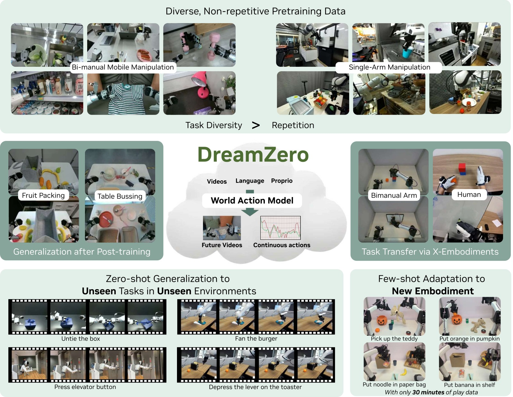
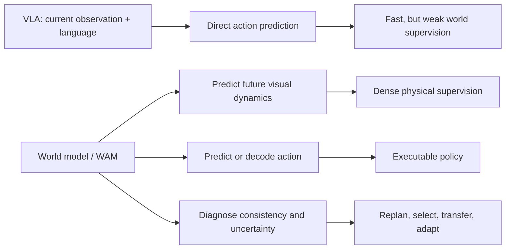
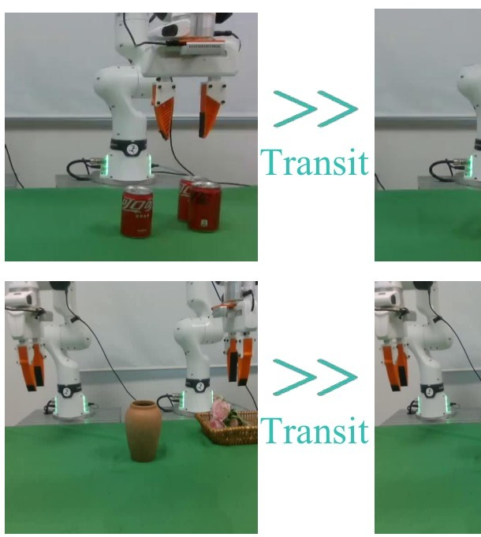
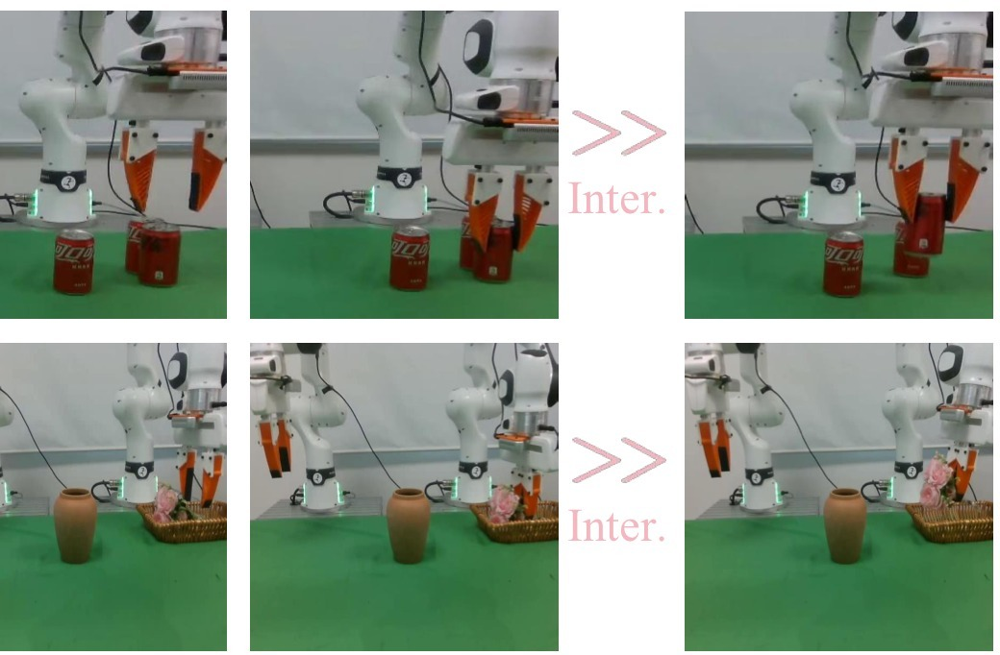
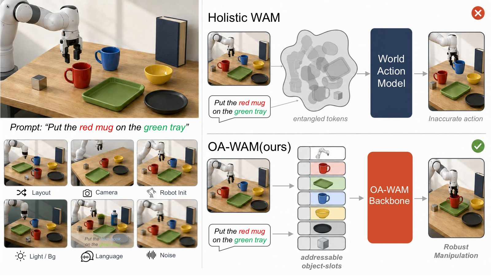

# World Models and World Action Models: A Survey Note

> **笔记信息**
> - 类型：综述性质笔记
> - 范围：基于 `tags.html` 中 `WAM` 与 `世界模型` 两个分组的论文笔记
> - 覆盖论文：11 篇唯一笔记
> - 日期：2026-05-22
> - 关键词：世界模型、World Action Model、机器人、视频生成、泛化

---

## 一、核心结论

这一批论文共同指向一个清晰趋势：机器人策略正在从“直接把图像和语言映射成动作”的 VLA 范式，转向“先学习世界如何变化，再从世界变化中产生动作”的世界模型范式。WAM（World Action Model）是这个趋势在机器人操控中的具体形态：它把未来视觉、机器人状态和动作放进同一个生成式建模框架里，使策略不再只是行为克隆器，而是一个可以预测、诊断、选择和复用未来的控制系统。

但这些工作也说明，WAM 的价值并不简单等同于“推理时一定要生成未来视频”。更准确的说法是：

> **未来视频预测是训练世界表征的强监督信号，也是诊断和规划的接口；但在实时控制时，显式生成未来视频可以被压缩、跳过、异步执行，甚至只作为训练时的辅助任务存在。**

*图1：DreamZero 的总览图很好地概括了 WAM 相比 VLA 的核心差异。图中不是直接从当前观测回归动作，而是让模型先在视觉空间中生成未来交互过程，再从生成轨迹中得到可执行动作。这个图支持本文的主线判断：WAM 的“世界”部分并不是装饰性的辅助任务，而是策略泛化、跨具身迁移和未见任务执行的主要信息来源。需要注意的是，这类图通常强调显式视觉想象的可解释性，但后续 Fast-WAM 和 GigaWorld-Policy 会进一步说明，部署时未必每一步都要完整生成这些未来帧。*

从 DreamZero、LingBot-VA 到 Fast-WAM、GigaWorld-Policy，这条线索越来越明确：视频生成 backbone 提供通用物理先验，动作生成则需要面向实时性、精度和闭环反馈做结构化约束。WAM 的核心矛盾不是“要不要想象未来”，而是“什么时候显式想象、什么时候只保留想象塑造出的表征、什么时候必须用现实反馈打断想象”。

---

## 二、资料范围

本综述只使用当前仓库中已整理过的笔记，不额外引入未读论文。`tags.html` 中 `WAM` 分组有 9 篇，`世界模型` 分组有 3 篇，其中 DreamZero 和 OA-WAM 与 WAM 分组重叠，因此合并后共有 11 篇。

| 论文笔记 | 分组 | 在谱系中的角色 |
|---|---|---|
| [DreamZero](../2026-05-21/DreamZero_阅读笔记.html) | WAM / 世界模型 | 将 WAM 明确提出为 zero-shot policy，展示视频世界模型可直接转化为策略 |
| [LingBot-VA](../2026-05-13/LingBot-VA_阅读笔记.html) | 世界模型 | 因果视频-动作世界模型，强调自回归记忆、逆动力学和异步闭环 |
| [OA-WAM](../2026-05-13/OA-WAM_阅读笔记.html) | 世界模型 | 对象可寻址 WAM，解决整体视频 token 的对象身份纠缠 |
| [Fast-WAM](../2026-05-21/Fast-WAM_阅读笔记.html) | WAM | 证明训练时视频协同建模比推理时显式想象更关键 |
| [GigaWorld-Policy](../2026-05-21/GigaWorld-Policy_阅读笔记.html) | WAM | Action-centered WAM，训练时预测视频，推理时只解码动作 |
| [X-WAM](../2026-05-21/X-WAM_阅读笔记.html) | WAM | 将 WAM 扩展到 RGB-D、状态、动作统一的 4D 世界动作建模 |
| [HarmoWAM](../2026-05-21/HarmoWAM_阅读笔记.html) | WAM / 世界模型 | 用门控专家协调泛化移动和精细操作 |
| [FFDC-WAM](../2026-05-21/FFDC-WAM_阅读笔记.html) | WAM | 用 future-reality verification 判断何时继续执行、何时重规划 |
| [Dynamic Consistency WAM](../2026-05-21/Dynamic-Consistency-WAM_阅读笔记.html) | WAM | 将预测未来与真实未来的一致性作为 value-free 诊断和选择信号 |
| [CKT-WAM](../2026-05-21/CKT-WAM_阅读笔记.html) | WAM | 在异构冻结 WAM 之间做参数高效的上下文知识迁移 |
| [AttenA+](../2026-05-21/AttenA-Plus_阅读笔记.html) | WAM | 不改骨干，只用速度场重加权动作损失，提升关键低速动作精度 |

---

## 三、从 VLA 到 WAM：问题定义的变化

传统 VLA 主要学习：

$$
\pi(a_t \mid o_t, l)
$$

也就是给定当前视觉观测 $o_t$ 和语言指令 $l$，直接输出动作 $a_t$。这种形式很干净，但有三个先天缺口：

1. **时序因果弱**：单帧或短历史观测很难表达“刚刚做过什么”和“下一步会导致什么”。
2. **物理监督稀疏**：动作标签只是低维控制信号，无法充分约束模型理解物体、接触和场景变化。
3. **OOD 泛化脆弱**：训练数据中没有覆盖的位置、背景、物体或任务组合，很容易让策略退化为模式匹配。

WAM 把问题改写为联合建模：

$$
p(o_{t+1:t+H}, s_{t+1:t+H}, a_{t:t+K} \mid o_{\leq t}, s_{\leq t}, a_{<t}, l)
$$

其中未来观测、未来状态和未来动作不再是分离模块，而是同一个生成式世界模型里的不同输出。这样做的好处是：未来视觉动态成为密集监督，动作可以从“世界会怎样变”中推导出来，模型也天然拥有可视化、可诊断、可选择的中间接口。

这张图表达的是范式差异：VLA 的中间表征通常不可检查，而 WAM 的未来预测可以被拿来做三件事：训练时提供物理监督，推理时辅助动作生成，部署时作为自我诊断信号。

---

## 四、WAM 的主要范式

### 4.1 Imagine-then-Execute：先预测未来，再反推动作

LingBot-VA 和一部分 DreamZero 推理路径代表了这种思路：先生成未来视觉状态，再通过逆动力学模型或隐式 IDM 从未来帧中解码动作。

*图2：LingBot-VA 的框架图展示了“视频动态预测”和“动作逆推”如何被放进同一个自回归序列。图中 Video Stream 负责预测未来视觉 latent，Action Stream 以预测未来和历史观测为条件生成动作；两条流通过 Mixture-of-Transformers 交互，但又保留不同宽度和计算预算。这张图的关键不是模块很多，而是因果顺序很明确：模型先维护历史，再预测未来，再从未来中解码动作。它解释了 LingBot-VA 为什么在长 horizon 任务上优势更大，因为 KV cache 中的历史不是一次性输入，而是在闭环执行中持续积累。*

优势是泛化强。视频生成 backbone 通常来自大规模视频预训练，天然携带关于物体外观、空间关系和运动趋势的先验。DreamZero 在未见任务上明显优于 VLA，AgiBot 未见任务平均任务进度达到 39.5%，DROID 平均 49%，而 from-scratch VLA 接近 0，pretrained VLA 也只有 16.3% 或 31% 到 33% 的水平。LingBot-VA 在 RoboTwin 2.0 上达到 92.9% Easy / 91.6% Hard，在 LIBERO 平均 98.5%，说明因果视频-动作建模在长程任务中确实有优势。

缺点是精细动作可能不够准。HarmoWAM 的动机实验把这个问题说得很清楚：Imagine-then-Execute 在 OOD 场景下能够可靠到达目标区域，但 Interaction 阶段容易因为 IDM 对接触、抓取点、插入深度的反推不准而失败。换句话说，视频预测能告诉机器人“应该去哪里”，但未必能告诉它“夹爪应该以多高精度、什么时序、什么接触姿态执行”。

### 4.2 Joint Modeling：视频和动作共同去噪

Joint WAM 把未来视频 token 和动作 token 放进同一个 diffusion / flow matching 过程里，通过共享注意力让两者彼此条件化。DreamZero、Motus、Fast-WAM-Joint、X-WAM 都属于或接近这一类；HarmoWAM 本身不是纯 Joint Modeling 方法，而是把 Joint Modeling 与 Imagine-then-Execute 做系统对比后，再用双专家门控融合两者，因此这里主要用它的动机实验来说明 Joint Modeling 的优势和边界。

<table>
<tr>
<td width="38%"> <em>图3(a)：两个动机任务，分别对应双臂插花和可乐罐堆叠，覆盖 OOD 移动和精细交互两类难点。</em></td>
<td width="62%"> <em>图3(b)：右侧表格单独裁出放大，按 ID / OOD Background / OOD Position / OOD Objects 分解 Transit 与 Interaction 成功次数。</em></td>
</tr>
</table>

*图3：HarmoWAM 的动机图把 WAM 内部的一个关键 trade-off 可视化了：Imagine-then-Execute 在 Transit 阶段泛化很强，能在 OOD 背景、位置和对象变化下接近目标；Joint Modeling 在 Interaction 阶段更准，目标附近的抓取、插入、堆叠更稳定。图3(b) 的表格不是简单比较平均成功率，而是在回答“失败发生在哪个阶段”。这也是 HarmoWAM 后续采用双专家和门控机制的直接依据。*

*图4：HarmoWAM 的架构图补上了动机实验之后的“怎么融合”。世界模型同时输出显式未来视频和隐式时空 latent；Predictive Expert 利用世界模型潜特征做精细动作预测，更适合 Interaction；Reactive Expert 利用预测帧和实时视觉做大范围目标接近，更适合 Transit；中间的 Process-Adaptive Gating 根据当前视觉状态在两个专家之间切换。这个图说明 HarmoWAM 不是把两类 WAM 简单平均，而是把“泛化移动”和“精细交互”拆成两个控制专家，再用阶段判断决定何时相信哪一路。*

优势是动作精度更高。动作不是后处理出来的，而是在联合 latent 空间里与视觉动态共同优化，因此视频状态和控制信号之间的对齐更紧。HarmoWAM 的实验显示，Joint Modeling 在 ID 场景中移动和交互都很强；当人为把机器人放到目标附近后，它在 OOD Interaction 阶段仍能保持 8 到 10 次成功中的高成功次数，说明“做得准”这件事并没有退化。

缺点是探索空间受训练分布限制。Joint Modeling 容易把训练数据里的空间分布、背景和对象布局内化为动作先验。一旦目标位置或对象外观落到分布外，它可能“走不到”正确交互区域。HarmoWAM 的 Position OOD 案例中，Joint Modeling 的 Transit 失败非常明显，说明联合建模虽然精细，但容易受 SFT 数据覆盖范围约束。

### 4.3 Action-Centered WAM：训练时学世界，推理时只出动作

Fast-WAM 和 GigaWorld-Policy 是当前最务实的一支：训练时仍然做视频和动作联合建模，用未来视频作为密集监督；推理时通过注意力掩码和缓存设计跳过未来视频生成，只保留动作解码。

<table>
<tr>
<td width="50%"> <em>图4(a)：Fast-WAM 对比 Joint-modeling、Causal WAM 和自身 fast path。重点是训练时保留视频协同建模，推理时只保留动作分支。</em></td>
<td width="50%"> <em>图4(b)：GigaWorld-Policy 对比 VLA 辅助未来监督、联合动作-视频预测、两阶段预测和 action-centered WAM。动作 token 不依赖未来视频 token，因此推理时可以安全跳过视频生成。</em></td>
</tr>
</table>

*图4：两篇 action-centered WAM 的图放在一起看，信息非常一致：视频预测的价值主要体现在训练阶段，通过密集动态监督塑造动作表征；部署阶段则应尽量走短路径，避免每个控制周期都完整生成未来视频。Fast-WAM 强调“Do WAM need test-time future imagination?”，GigaWorld-Policy 强调动作中心的因果掩码，两者都把 WAM 从“慢速视觉想象器”推向“可实时控制的世界表征策略”。*

Fast-WAM 的核心结论很强：去掉 video co-training 的性能损失，远大于推理时跳过显式未来想象的损失。在 LIBERO 上，Fast-WAM 为 97.6%，Fast-WAM-Joint 为 98.5%，差距只有 0.9 个点；但去掉 video co-training 后下降到 93.5%。在 RoboTwin 上，Fast-WAM 为 91.8%，无 video co-training 变体下降到 83.8%。这说明视频预测更像是训练世界表征的监督，而不一定是每一步控制都必须执行的推理过程。

GigaWorld-Policy 也沿着同一方向推进。它用 causal mask 保证动作 token 不依赖未来视频 token，而未来视频 token 可以以动作为条件。这样推理时可以安全删掉未来视频分支，只做 action-only。结果是推理延迟 360ms，远快于 Motus 的 3231ms，同时真实世界平均成功率 0.83，高于 Motus 的 0.76 和 $\pi_{0.5}$ 的 0.69。

### 4.4 Object-Addressable WAM：把世界拆成可寻址对象

OA-WAM 关注的是另一个根本问题：整体图像或视频 token 会把目标对象、邻近物体、背景和光照纠缠在一起。当相机视角、布局、背景或噪声变化时，目标物体仍然可见，但动作解码器可能“找错对象”。

*图5：OA-WAM 的总览图对比了整体 WAM 和对象可寻址 WAM 在扰动场景下的差异。左侧列出 camera、layout、robot init、light、background、sensor noise 等常见部署扰动；右侧展示整体表征会把目标 mug 与背景和邻近物体混合，导致动作轨迹漂到错误对象，而对象地址约束让动作解码器稳定查询任务对象。这个图说明 WAM 的“世界”不应只是一张未来图像，还应该提供可查询、可绑定、可追踪的对象级状态。*

OA-WAM 的做法是把每帧拆成 robot 槽和 object 槽，每个槽包含冻结身份地址 $\mathbf{addr}_k$ 和时变内容 $\mathbf{cnt}_k^t$。注意力键只从身份地址投影，并在每层后重置地址流，从架构上保证“对哪个对象采取行动”和“对象现在是什么状态”分离。

这类工作的重要性在于，它把 WAM 从“像素级未来预测器”推进到“对象级世界状态接口”。如果 WAM 要在真实家庭、工厂或仓储场景部署，只预测整体画面是不够的；策略需要稳定地指向任务对象，理解对象身份在视角变化和布局变化下保持不变。

### 4.5 4D WAM：从 2D 视频到空间感知动态模拟器

X-WAM 将 WAM 从 2D RGB 视频扩展到 RGB-D、3D 点云和机器人状态。它基于 Wan2.2-TI2V-5B，预测未来多视角 RGB-D 视频、未来状态和动作，同时通过轻量深度分支提供几何信息。

*图6：X-WAM 的总览图展示了一个更空间化的 WAM 形态：输入多视角 RGB、本体状态和语言指令，输出未来 RGB-D 视频、3D 重建和动作序列。下方结果同时报告策略成功率和重建指标，说明 X-WAM 不是把深度当成后处理可视化，而是把几何预测纳入同一个训练目标。这个图对综述的启发是：当任务需要插入、装配、包装等高空间精度时，2D 视频想象可能不够，WAM 需要显式几何接口。*

这个方向解决的是纯 2D 视频生成的物理幻觉问题。只看像素，模型可能生成看起来合理但几何上不可执行的未来；引入深度和点云后，策略可以利用空间结构做更稳定的操作。X-WAM 在 RoboCasa 上达到 79.2%，在 RoboTwin Clean / Randomized 上达到 89.8% / 90.7%，并在 Chamfer Distance 上显著优于后处理深度估计方案，说明端到端几何预测确实改善了世界建模质量。

### 4.6 Adaptive WAM：让系统知道何时相信想象

FFDC-WAM 和 Dynamic Consistency WAM 都在回答一个部署问题：WAM 预测了未来，但机器人应不应该一直相信它？

<table>
<tr>
<td width="50%"> <em>图7(a)：FFDC-WAM 在执行中持续验证预测未来与真实反馈是否一致，一致则继续执行，不一致则重规划。</em></td>
<td width="50%"> <em>图7(b)：Dynamic Consistency WAM 展示预测未来、真实未来和一致性信号之间的关系，用于判断轨迹质量和选择候选分支。</em></td>
</tr>
</table>

*图7：裁剪后的 FFDC-WAM 图与 Dynamic Consistency 图比例接近，可以并排阅读。FFDC 更偏工程部署：每个 check step 都用 verifier 决定 chunk 是否继续执行，从而把固定 chunk 改成自适应 chunk。Dynamic Consistency 更偏度量和选择：把预测未来与真实未来的相似性转化为无需 value head 的质量信号。二者都依赖同一个前提：WAM 输出的不只是动作，还包括可被现实检验的未来预期。*

FFDC-WAM 把执行过程变成 future-reality verification。WAM 一次输出长 horizon 的动作和未来视觉 token，轻量 verifier 在执行中持续比对真实观测、剩余动作、预测未来和语言指令。如果一致性高就继续执行，低就立即重规划。它在 RoboTwin hard 设置中把 Rand.hard 成功率从 Base-Motus 的 54.20% 提到 76.40%，平均推理调用从 5.47 次降到 1.69 次，实现了“简单阶段少想、困难阶段多想”。

Dynamic Consistency WAM 则把预测未来与真实未来的一致性变成 value-free 信号。成功轨迹通常有更高的一致性，LingBot-VA 上仅凭一致性就能得到 AUC 0.88 的成败区分能力。但它也指出一个边界：background collapse 会让失败轨迹看起来一致性很高，因为系统已经卡住，未来几乎不变，预测静态背景很容易。因此一致性必须和 latent change 一起看，低动态下的高一致性不代表策略好。

---

## 五、横向对比

| 方向 | 代表工作 | 核心收益 | 主要代价 / 风险 |
|---|---|---|---|
| 先想象再执行 | LingBot-VA, DreamZero | 泛化强，能利用视频预训练先验，长程记忆更好 | IDM 精度受限，接触和插入任务容易误差累积 |
| 联合视频动作建模 | DreamZero, X-WAM, Motus 类方法 | 动作和视觉动态对齐更紧，精细控制更强 | 推理慢，OOD 探索可能被训练分布限制 |
| Action-centered | Fast-WAM, GigaWorld-Policy | 保留视频训练监督，推理实时性显著提升 | 失去显式未来视频作为在线诊断接口，需额外 verifier 或选择器 |
| 对象可寻址 | OA-WAM | 提升对象身份稳定性和场景扰动鲁棒性 | 依赖上游分割、对象槽初始化和目标识别 |
| 4D 几何 | X-WAM | 显式空间感知，减少 2D 幻觉，适合高精度空间任务 | 深度监督、相机标定、多视角数据和计算成本更高 |
| 自适应执行 | FFDC-WAM, Dynamic Consistency | 用一致性决定继续执行、重规划或 best-of-N 选择 | 一致性信号会被低动态 collapse 欺骗，需要校准 |
| 训练重加权 / 迁移 | AttenA+, CKT-WAM | 低成本提升精度或复用强教师 WAM | 不改变基础世界建模边界，依赖已有 WAM 质量 |

---

## 六、三个核心矛盾

### 6.1 泛化移动 vs 精细交互

HarmoWAM 把这个矛盾讲得最直接：Imagine-then-Execute 的 Transit 很强，Joint Modeling 的 Interaction 很强，但单一范式很难同时兼得。泛化移动依赖视频世界模型的开放式先验，精细交互依赖动作和接触动态的高精度对齐。

HarmoWAM 的解决方案是双专家门控：Reactive Expert 更适合 Transit，Predictive Expert 更适合 Interaction，由过程自适应门控在不同阶段切换。它在 OOD 下仅下降 7.9%，而基线下降 20.9 到 43.8 个点，说明“阶段化控制”可能比追求一个全能动作头更现实。

*图8：AttenA+ 的流程图展示了另一种补足精细交互的方式：不改变 WAM 或 VLA 骨干，而是从真值动作序列中计算速度幅值，把低速段映射为更高损失权重。图中左侧是速度场统计，中间是权重映射，右侧是把权重乘到动作损失上。它对 WAM 的意义在于，世界模型提供了宏观动态先验，但成败往往发生在低速、接触、对齐、释放这些少数关键时间步；训练目标需要把这些步骤显式凸显出来。*

这个结论也能解释为什么 AttenA+ 有效。机器人轨迹不是每个时间步都同等重要。低速精密动作往往决定成败，高速过渡动作容错更高。AttenA+ 只用速度场重加权损失，就让 Fast-WAM 在 RoboTwin 上从 91.80% 提升到 92.46%，在真机任务上平均从 92.5% 提到 97.0%。这说明 WAM 的下一步改进不一定总是更大模型，也可能是更准确地识别“哪些动作值得优化”。

### 6.2 显式想象 vs 实时控制

WAM 最诱人的能力是生成未来，但机器人控制最苛刻的约束是实时闭环。显式想象越完整，推理越慢；推理越慢，控制越容易错过纠错窗口。

Fast-WAM、GigaWorld-Policy 和 DreamZero-Flash 给出的答案都不是放弃世界模型，而是压缩想象的部署成本。Fast-WAM 把推理延迟降到 190ms，GigaWorld-Policy 用 action-only 推理达到 360ms，DreamZero-Flash 通过噪声调度修正让单步推理在 150ms 下恢复 4 步性能的 89%。LingBot-VA 则通过异步流水线让计算和执行重叠，FDM-grounded Async 用真实反馈修正异步幻觉。

这些结果共同说明：未来 WAM 部署很可能采用“训练时充分想象，推理时分层想象”的系统设计。宏观规划阶段可以生成未来，局部控制阶段只保留压缩表征，异常检测阶段再调用 verifier 或重规划器。

### 6.3 一致性信号 vs 真实成功

一致性是 WAM 独有的诊断接口。VLA 直接输出动作，很难知道模型为什么失败；WAM 能比较“模型以为会发生什么”和“现实实际发生什么”。

但一致性不是万能 reward。Dynamic Consistency WAM 的 background collapse 说明，如果机器人卡住不动，未来确实会很容易预测，模型可能得到虚高一致性。FFDC-WAM 也需要用因果结构把语言、动作、未来视觉和当前观测一起检查，而不是只看像素相似度。

因此，一致性更适合作为 value-free filter 或 verifier，而不是完整价值函数。可靠的在线选择至少需要同时考虑：

1. 预测未来和真实反馈是否匹配。
2. 场景是否有足够动态变化，避免静态 collapse。
3. 动作是否与语言目标和对象状态因果一致。
4. 当前阶段是 Transit 还是 Interaction，不同阶段对一致性的要求不同。

---

## 七、关键技术脉络

### 7.1 视频预训练正在成为机器人世界先验

DreamZero、LingBot-VA、Fast-WAM、GigaWorld-Policy 和 X-WAM 都大量依赖 Wan 系列或类似视频扩散 backbone。它们的共同假设是：大规模视频模型已经学到关于物体、运动、时空连续性和视觉语义的通用结构；机器人数据则用于把这些结构对齐到可执行动作。

DreamZero 的失败分析尤其关键：大多数失败来自视频预测错误，而不是动作提取错误。这意味着 WAM 策略能力的上限很大程度受视频 backbone 限制。视频生成领域的进步可能直接变成机器人策略进步，这也是 WAM 相比传统 VLA 最有想象力的地方。

### 7.2 注意力掩码决定了“世界”和“动作”的因果关系

这些论文反复使用结构化注意力掩码来规定信息流：

- GigaWorld-Policy 让动作 token 看当前观测和状态，但不能看未来视频 token。
- Fast-WAM 训练时协同视频和动作，推理时通过缓存和掩码只对 action token 去噪。
- LingBot-VA 用因果自回归和 KV cache 保证历史反馈持续进入下一步。
- OA-WAM 对 slot 位置的 key projection 加约束，让身份地址主导跨槽路由。
- FFDC-WAM 用 future forward dynamics causal attention 防止 verifier 看到不该看到的信息。

这说明 WAM 的架构设计重点已经从“把所有 token 拼起来”转向“精确定义哪些 token 能看哪些 token”。信息流的因果结构直接决定模型能不能在推理时删分支、能不能避免信息泄漏、能不能解释失败。

### 7.3 世界模型不只是策略，也是接口

WAM 的一个长期价值是接口化：

- **诊断接口**：Dynamic Consistency 用一致性判断成败趋势。
- **执行接口**：FFDC 用 verifier 决定继续执行还是重规划。
- **迁移接口**：CKT-WAM 把强教师的中间层压缩成上下文 token 注入学生。
- **对象接口**：OA-WAM 把世界拆成可寻址对象槽。
- **几何接口**：X-WAM 输出深度和点云，让策略拥有 3D 状态。

这比“端到端策略网络”更适合真实部署，因为真实机器人系统需要的不只是动作，还需要监控、解释、重试、迁移和安全边界。

---

## 八、目前的开放问题

### 8.1 WAM 的 scaling law 还不清楚

DreamZero 显示 14B 比 5B 明显更强，任务进度从 21% 到 50%，数据多样性也比重复数据重要。但 WAM 的 scaling law 还没有像 LLM 那样清晰：模型规模、视频数据规模、具身数据规模、动作维度、上下文长度和去噪步数之间如何权衡，目前仍是开放问题。

### 8.2 视频质量和动作质量并非单调一致

高保真视频不一定带来更好动作。HarmoWAM 指出世界模型的预测只要物理结构正确，不一定需要像素完美；Fast-WAM 说明推理时甚至可以跳过未来视频；Dynamic Consistency 又说明静态背景预测得准可能是假信号。未来评价 WAM 不能只看 PSNR、SSIM 或 LPIPS，还要看预测是否保留对动作有用的因果变量。

### 8.3 精细接触和可变形物体仍困难

LingBot-VA 在 Fold Clothes 上 Progress Score 低于 $\pi_{0.5}$，DreamZero 也承认高精度任务仍受限。视频世界模型擅长宏观动态，但接触力、摩擦、柔性物体形变和亚厘米级插入需要更细粒度的状态和反馈。X-WAM 的 4D 几何、AttenA+ 的关键动作重加权、HarmoWAM 的交互专家，都是朝这个问题推进。

### 8.4 安全部署需要不止一个 verifier

FFDC 和 Dynamic Consistency 证明 verifier 有用，但一致性会失效。真实机器人部署中，可能需要多层 verifier：视觉一致性、对象状态一致性、动作可达性、碰撞风险、语言目标一致性和阶段进度。WAM 提供了可检查的中间表示，但如何把这些检查组合成可靠安全系统，还没有标准答案。

---

## 九、个人理解：WAM 的合理定位

如果把 WAM 理解成“会生成视频的策略”，会低估它。更合理的定位是：

> **WAM 是一种把机器人控制问题重新表述为可生成、可验证、可迁移的世界状态建模问题的框架。**

在这个框架下，未来视频不是最终目的，而是一种世界监督和系统接口。动作也不是单独的回归目标，而是世界转移的一部分。最有前途的系统形态可能不是单一大模型端到端输出动作，而是一个分层 WAM 系统：

1. 视频预训练 backbone 提供通用物理和语义先验。
2. 结构化注意力定义动作、状态、对象和未来之间的因果关系。
3. Action-centered fast path 满足实时控制。
4. Verifier / consistency path 负责诊断和重规划。
5. Object / 4D / memory interfaces 支撑真实场景中的泛化和安全。

这一批论文的共同贡献，是把“世界模型能否用于机器人”推进到了更具体的问题：“世界模型的哪些部分该在训练时用，哪些该在推理时用，哪些该暴露给系统做诊断，哪些该压缩进动作表征”。这比单纯比较 VLA 和 WAM 的成功率更重要。

---

## 十、关键概念速查

| 概念 | 解释 |
|---|---|
| World Model | 学习环境状态如何随时间和动作变化的模型，在这里主要表现为未来视频、状态或几何预测 |
| WAM | World Action Model，将未来世界预测和动作生成统一建模的机器人策略框架 |
| VLA | Vision-Language-Action，直接从视觉和语言生成动作的机器人基础模型范式 |
| Imagine-then-Execute | 先预测未来视觉，再从未来视觉反推动作 |
| Joint Modeling | 在同一生成模型中联合去噪视频 token 和动作 token |
| Action-Centered WAM | 训练时用视频动态监督，推理时跳过未来视频只输出动作 |
| IDM | Inverse Dynamics Model，从状态转移或未来观测中反推动作 |
| Future-Reality Verification | 比较 WAM 的预测未来和真实执行反馈，用于决定继续执行或重规划 |
| Dynamic Consistency | 预测未来和实际未来之间的一致性，可作为 value-free 的轨迹选择或诊断信号 |
| Background Collapse | 策略卡住后场景几乎不变，导致静态预测看似一致但任务失败的现象 |
| Object Addressability | 世界表征中每个对象有稳定可查询身份，动作可以可靠指向目标对象 |
| 4D WAM | 同时建模 RGB、深度、状态、动作和时间动态的空间感知 WAM |
| Video Co-training | 训练时用未来视频预测作为辅助监督，塑造动作模型的世界表征 |
| Structured Attention Mask | 用注意力可见性约束定义不同 token 之间的因果信息流 |
