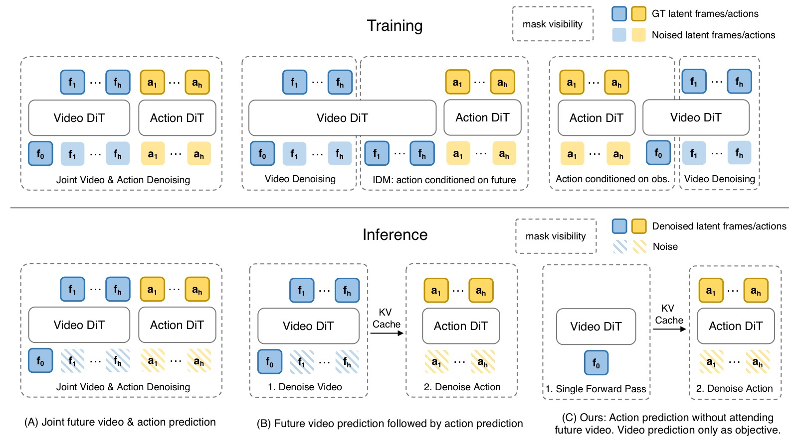
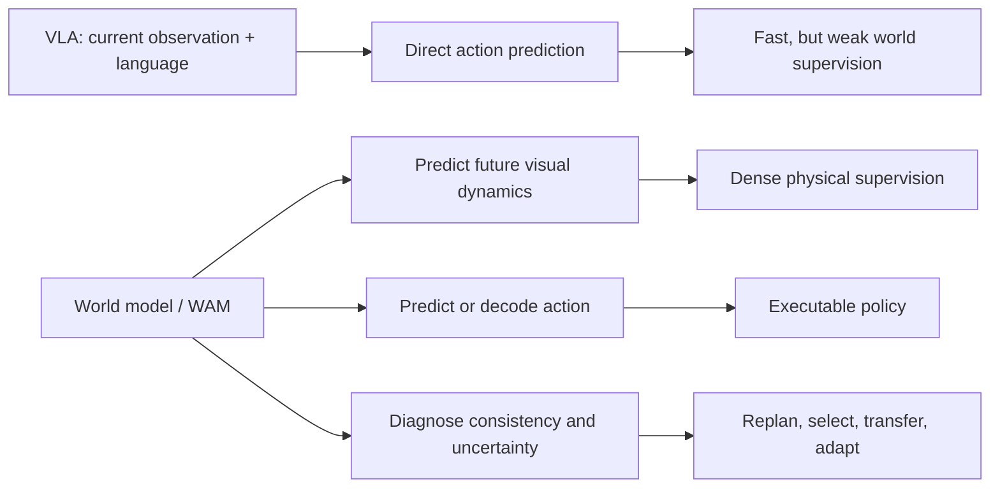
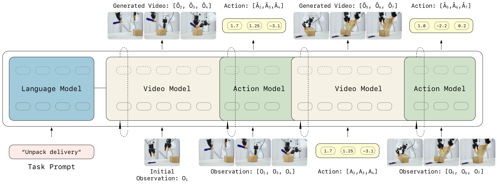
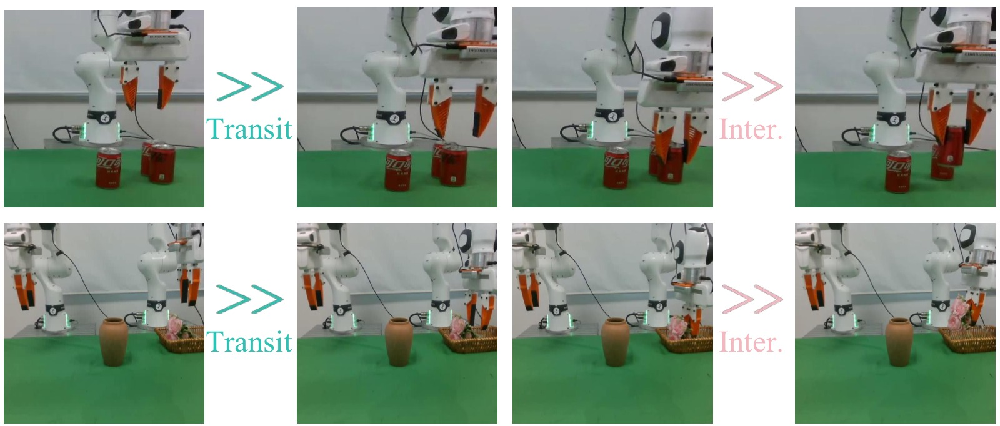
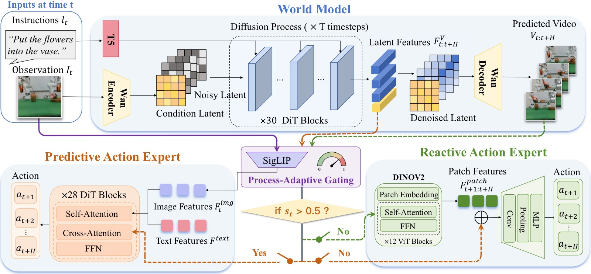
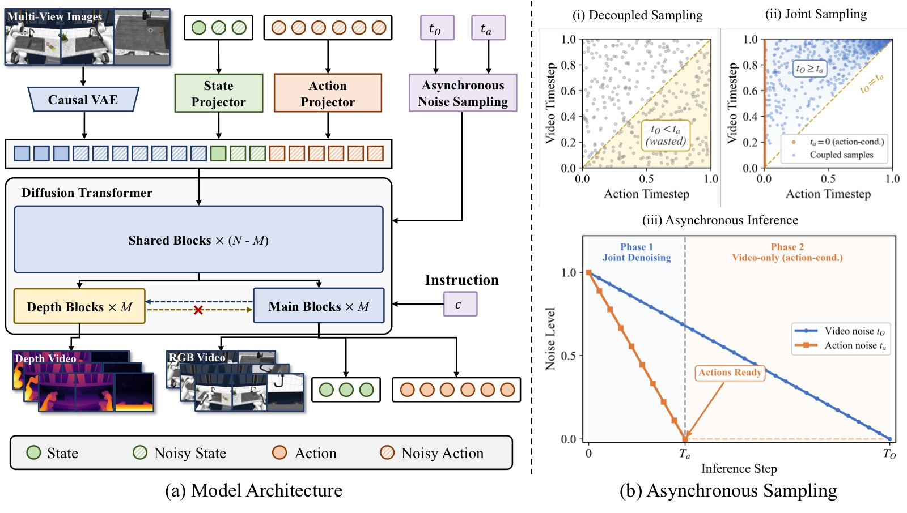
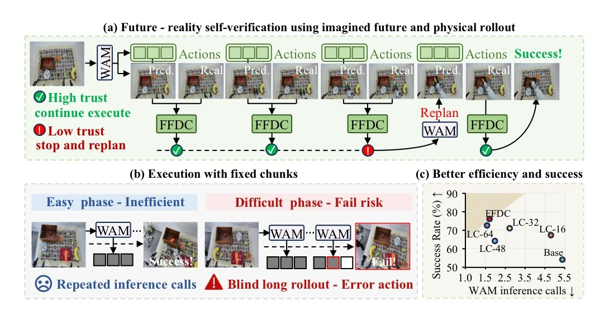
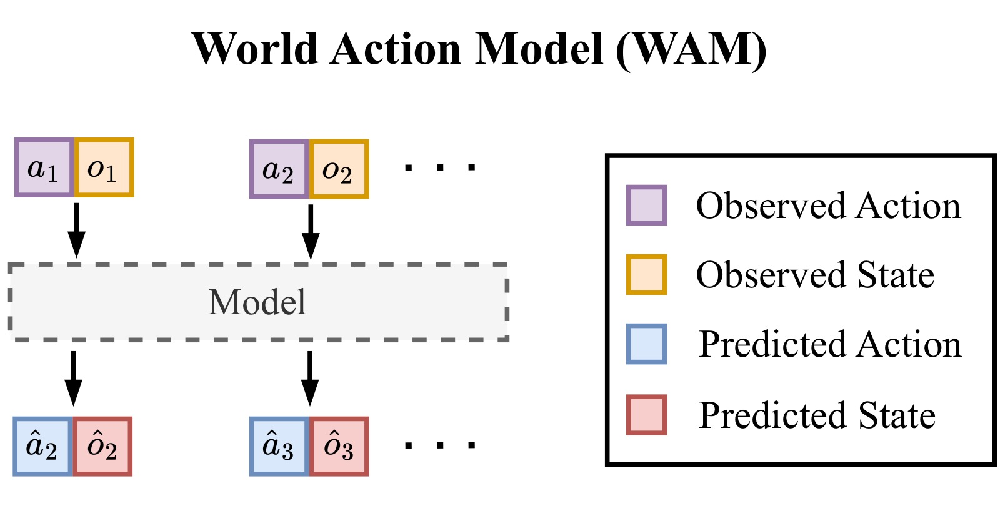

<!-- arxiv: N/A -->
<!-- venue: PaperNotes 综述 2026 -->
<!-- tags: 综述, WAM, 世界模型, 视频生成, 泛化 -->

# World Models and World Action Models: A Survey Note

> **笔记信息**
> - 类型：综述性质笔记
> - 范围：基于 `tags.html` 中 `WAM` 与 `世界模型` 两个分组的论文笔记
> - 覆盖论文：11 篇唯一笔记
> - 日期：2026-05-22
> - 关键词：世界模型、World Action Model、机器人、视频生成、泛化

---

## 一、核心结论

这一批论文共同指向一个清晰趋势：机器人策略正在从"直接把图像和语言映射成动作"的 VLA 范式，转向"先学习世界如何变化，再从世界变化中产生动作"的世界模型范式。WAM（World Action Model）是这个趋势在机器人操控中的具体形态：它把未来视觉、机器人状态和动作放进同一个生成式建模框架里，使策略不再只是行为克隆器，而是一个可以预测、诊断、选择和复用未来的控制系统。

但这些工作也说明，WAM 的价值并不简单等同于"推理时一定要生成未来视频"。更准确的说法是：

> **未来视频预测是训练世界表征的强监督信号，也是诊断和规划的接口；但在实时控制时，显式生成未来视频可以被压缩、跳过、异步执行，甚至只作为训练时的辅助任务存在。**

<table>
<tr>
<td width="50%"> <em>图1(a)：Fast-WAM 对比 Joint-modeling、Causal WAM 和自身 fast path。核心问题是"WAM 需要测试时想象未来吗？"——答案是训练时保留视频协同建模，推理时只走动作分支。</em></td>
<td width="50%"> <em>图1(b)：GigaWorld-Policy 对比四种从视频到动作的范式。Action-Centered WAM 中动作 token 不依赖未来视频 token，推理时可以安全跳过视频生成，但训练时视频监督带来的性能收益仍然完整保留。</em></td>
</tr>
</table>

*图1：Fast-WAM 和 GigaWorld-Policy 独立回答了同一个问题——WAM 的性能提升来自训练时的视频协同建模，而非推理时的显式未来想象。这两张图放在一起，直接点明了本文的主线判断：WAM 的"世界"部分不是装饰性的辅助任务，也不是每个控制周期都要完整生成的未来视频；它的核心价值在于用视频动态作为密集训练监督来塑造动作表征，部署时则可以压缩、跳过或异步执行。换句话说，WAM 的关键不是"想象未来"，而是"用未来想象训练一个更懂物理世界的策略"。*

从 DreamZero、LingBot-VA 到 Fast-WAM、GigaWorld-Policy，这条线索越来越明确：视频生成 backbone 提供通用物理先验，动作生成则需要面向实时性、精度和闭环反馈做结构化约束。WAM 的核心矛盾不是"要不要想象未来"，而是"什么时候显式想象、什么时候只保留想象塑造出的表征、什么时候必须用现实反馈打断想象"。

---

## 二、资料范围

本综述只使用当前仓库中已整理过的笔记，不额外引入未读论文。`tags.html` 中 `WAM` 分组有 9 篇，`世界模型` 分组有 3 篇，其中 DreamZero 和 OA-WAM 与 WAM 分组重叠，因此合并后共有 11 篇。

| 论文笔记 | 分组 | 在谱系中的角色 |
|---|---|---|
| [DreamZero](../2026-05-21/DreamZero_阅读笔记.html) | WAM / 世界模型 | 将 WAM 明确提出为 zero-shot policy，展示视频世界模型可直接转化为策略 |
| [LingBot-VA](../2026-05-13/LingBot-VA_阅读笔记.html) | 世界模型 | 因果视频-动作世界模型，强调自回归记忆、逆动力学和异步闭环 |
| [OA-WAM](../2026-05-13/OA-WAM_阅读笔记.html) | 世界模型 | 对象可寻址 WAM，解决整体视频 token 的对象身份纠缠 |
| [Fast-WAM](../2026-05-21/Fast-WAM_阅读笔记.html) | WAM | 证明训练时视频协同建模比推理时显式想象更关键 |
| [GigaWorld-Policy](../2026-05-21/GigaWorld-Policy_阅读笔记.html) | WAM | Action-centered WAM，训练时预测视频，推理时只解码动作 |
| [X-WAM](../2026-05-21/X-WAM_阅读笔记.html) | WAM | 将 WAM 扩展到 RGB-D、状态、动作统一的 4D 世界动作建模 |
| [HarmoWAM](../2026-05-21/HarmoWAM_阅读笔记.html) | WAM / 世界模型 | 用门控专家协调泛化移动和精细操作 |
| [FFDC-WAM](../2026-05-21/FFDC-WAM_阅读笔记.html) | WAM | 用 future-reality verification 判断何时继续执行、何时重规划 |
| [Dynamic Consistency WAM](../2026-05-21/Dynamic-Consistency-WAM_阅读笔记.html) | WAM | 将预测未来与真实未来的一致性作为 value-free 诊断和选择信号 |
| [CKT-WAM](../2026-05-21/CKT-WAM_阅读笔记.html) | WAM | 在异构冻结 WAM 之间做参数高效的上下文知识迁移 |
| [AttenA+](../2026-05-21/AttenA-Plus_阅读笔记.html) | WAM | 不改骨干，只用速度场重加权动作损失，提升关键低速动作精度 |

---

## 三、从 VLA 到 WAM：问题定义的变化

传统 VLA 主要学习：

$$
\pi(a_t \mid o_t, l)
$$

也就是给定当前视觉观测 $o_t$ 和语言指令 $l$，直接输出动作 $a_t$。这种形式很干净，但有三个先天缺口：

1. **时序因果弱**：单帧或短历史观测很难表达"刚刚做过什么"和"下一步会导致什么"。
2. **物理监督稀疏**：动作标签只是低维控制信号，无法充分约束模型理解物体、接触和场景变化。
3. **OOD 泛化脆弱**：训练数据中没有覆盖的位置、背景、物体或任务组合，很容易让策略退化为模式匹配。

WAM 把问题改写为联合建模：

$$
p(o_{t+1:t+H}, s_{t+1:t+H}, a_{t:t+K} \mid o_{\leq t}, s_{\leq t}, a_{<t}, l)
$$

其中未来观测、未来状态和未来动作不再是分离模块，而是同一个生成式世界模型里的不同输出。这样做的好处是：未来视觉动态成为密集监督，动作可以从"世界会怎样变"中推导出来，模型也天然拥有可视化、可诊断、可选择的中间接口。

这张图表达的是范式差异：VLA 的中间表征通常不可检查，而 WAM 的未来预测可以被拿来做三件事：训练时提供物理监督，推理时辅助动作生成，部署时作为自我诊断信号。

---

## 四、WAM 的主要范式

### 4.1 Imagine-then-Execute：先预测未来，再反推动作

#### 核心思路

Imagine-then-Execute 遵循"先理解世界会怎么变，再从变化中推导动作"的两阶段逻辑。形式化为：

$$
\begin{aligned}
\text{Stage 1 (Forward Dynamics):} &\quad o_{t+1:t+H} \sim p_\theta(\cdot \mid o_{\leq t}, l) \\
\text{Stage 2 (Inverse Dynamics):} &\quad a_t = g_\psi(o_t, o_{t+1})
\end{aligned}
$$

第一阶段用视频世界模型预测未来视觉状态，第二阶段通过逆动力学模型（IDM）或隐式 IDM 从预测帧中解码可执行动作。LingBot-VA 是这一范式的典型代表，DreamZero 的部分推理路径也遵循此模式。

#### LingBot-VA 的因果视频-动作架构

*图2：LingBot-VA 的框架图展示了"视频动态预测"和"动作逆推"如何被放进同一个自回归序列。图中 Video Stream 负责预测未来视觉 latent，Action Stream 以预测未来和历史观测为条件生成动作；两条流通过 Mixture-of-Transformers 交互，但又保留不同宽度和计算预算。这张图的关键不是模块很多，而是因果顺序很明确：模型先维护历史，再预测未来，再从未来中解码动作。它解释了 LingBot-VA 为什么在长 horizon 任务上优势更大，因为 KV cache 中的历史不是一次性输入，而是在闭环执行中持续积累。*

LingBot-VA 的核心设计是把视频-动作序列交织成统一的 token 流：

$$
[z_t,\; a_{t,1},\; a_{t,2},\; a_{t,3},\; a_{t,4},\; z_{t+1},\; a_{t+1,1},\; \ldots]
$$

其中 $z_t$ 是视频 latent token，$a_{t,i}$ 是动作 token。时序步长 $\tau=4$，即视频帧率 12.5Hz，动作频率 50Hz。架构采用 **Mixture-of-Transformers（MoT）**：

- **Video Stream**：基于 Wan2.2-5B 初始化，30 层，隐维度 $d_v=3072$
- **Action Stream**：同深度 30 层，隐维度 $d_a=768$（约 350M 参数），远小于视频流
- 两流独立做 QKV 投影，再通过维度投影做联合自注意力：

$$
\text{Attention}_{\text{joint}} = \text{softmax}\!\left(\frac{Q_{\text{proj}} K_{\text{proj}}^T}{\sqrt{d_{\text{proj}}}}\right) V_{\text{proj}}
$$

训练采用 **chunk-wise 自回归 + intra-chunk 双向** 的因果掩码：chunk 之间严格因果（历史不能看到未来 chunk），chunk 内双向（允许未来 token 之间互相看见）。这比纯自回归效率更高，比纯双向因果正确。

三个关键训练/推理技巧：

1. **Noisy History Augmentation**：训练时 50% 概率把视频历史替换为加噪版本，迫使模型学会利用不完美的历史预测。推理时视频去噪只走到 $s=0.5\sim0.6$（3 步 Euler），而非完全去噪到 $s=1.0$，以匹配带噪训练分布。
2. **Teacher Forcing with Block-Causal Mask**：clean token 互相可见（block-causal），noise token 看到之前所有 clean token（不含自己），intra-chunk noise 双向。
3. **FDM-Grounded Asynchronous Inference**：异步执行时，当真实反馈到达，运行前向动态预测 $\text{FDM}(z_{t-1}^{\text{pred}}, a_t^{\text{real}})$ 产出一个"接地"的视觉状态，替换掉幻觉预测。这使得异步模式在 2 倍加速的同时保持成功率，而 naive async 在 horizon=3 时从 85.6% 跌至 32.9%。

#### 实验表现与边界

LingBot-VA 在 RoboTwin 2.0 上达到 92.9% Easy / 91.6% Hard（vs Motus 88.7%/87.0%，$\pi_{0.5}$ 82.7%/76.8%），在 LIBERO 平均 98.5%（LIBERO-Long 达到 SOTA）。在真机 6 任务上，Make Breakfast Progress Score 达 97.0%（+24.0pp vs $\pi_{0.5}$），Unpack Delivery 成功率 65%（vs 25%）。KV cache 设计让模型在需要记忆的任务（如 Wipe Plate 计数、Search Box 搜索排除）上优势尤其明显。

但这一范式的核心弱点在于 **IDM 精度瓶颈**。HarmoWAM 的动机实验（见 4.3 节）揭示了典型失败模式：Imagine-then-Execute 在 OOD Transit 阶段可靠（能走到目标区域），但 Interaction 阶段因 IDM 对接触点、抓取姿态、插入深度反推不准而失败。LingBot-VA 在 Fold Clothes 任务上 Progress Score 仅 48.8%（vs $\pi_{0.5}$ 62.9%），说明可变形物体和精细接触场景仍是薄弱环节。视频预测能告诉机器人"应该去哪里"，但不总能告诉它"夹爪应以什么精度、什么时序、什么接触姿态执行"。

---

### 4.2 Joint Modeling：视频和动作共同去噪

#### 核心思路

Joint Modeling 把未来视频 token 和动作 token 放进同一个生成式去噪过程，通过共享注意力机制让视觉动态与控制信号相互条件化。形式化为单一联合分布：

$$
p_\theta\!\left(o_{t+1:t+H},\; a_{t:t+K} \;\middle|\; o_{\leq t},\; s_{\leq t},\; a_{<t},\; l\right)
$$

与 Imagine-then-Execute 的两阶段级联不同，Joint Modeling 中视觉预测和动作预测共享同一个 latent 空间和去噪调度，避免了 IDM 误差累积问题。DreamZero、Motus、Fast-WAM-Joint 和 X-WAM 都属于或接近这一类。

*DreamZero 模型架构图：展示了 Joint Modeling 的典型信息流。模型接受三种输入——视觉上下文（VAE 编码）、语言指令（Text Encoder）和本体感知（State Encoder）；自回归 DiT backbone 在 Flow Matching 框架下联合处理视频 latent 和动作 token（共享去噪时间步 $t$）；训练时通过 Teacher Forcing 从 clean prior chunks 学习，推理时真实观测替换 KV-cache 中的预测 latent 实现闭环控制。Video Decoder 和 Action Decoder 分别输出未来帧和动作序列。这张图体现了 Joint Modeling 的核心设计：视频和动作在同一个生成过程中协同优化，而非先后级联。*

#### DreamZero：大规模视频世界模型直出策略

DreamZero 基于 Wan2.1-I2V-14B（14B 图像到视频扩散 Transformer），将动作作为与视频 latent 等价的 token 流放入联合 flow matching 过程：

$$
\mathcal{L}_{\text{FM}} = \mathbb{E}_{t,\,x_0\sim p_0,\,x_1\sim p_1}\!\left[\left\|v_\theta(x_t, t) - (x_1 - x_0)\right\|^2\right]
$$

其中 $x_t = (1-t)x_0 + t x_1$ 沿线性路径插值，$v_\theta$ 预测速度场。视频和动作使用共享的去噪时间步 $t$。

架构上采用 **自回归（AR）chunk 设计**：每个 chunk 包含 $K=2$ 帧 latent 帧，动作 horizon 为 48（AgiBot, 30Hz）或 24（DROID, 15Hz），即 1.6 秒的动作序列。AR 的核心优势在于 KV-cache 推理加速（比双向快 3-4 倍）和历史感知。**闭环设计**是关键：执行完一个 action chunk 后，真实世界观测编码注入 KV cache，丢弃预测视频 latent，从根本上消除自回归视频生成误差累积。

训练使用 100K 步、全局 batch size 128、全参数更新（LoRA 无效），数据为约 500 小时 AgiBot G1 遥操作数据（22 个环境）。

#### DreamZero-Flash：解耦噪声调度实现实时推理

DreamZero-Flash 的核心发现是：训练和少步推理之间的分布不匹配，根源在于视频 token 和动作 token 对去噪精度的需求不同。动作需要精确去噪，视频则可以容忍更高噪声。因此提出解耦噪声调度：

$$
t_O \sim \text{Beta}(7, 1),\quad t_a \sim U(0,1)
$$

视频时间步偏向高噪声（均值 0.125），动作保持均匀。这使得单步去噪（150ms）能恢复 4 步性能的 89%。结合 CFG 并行化（2 GPU）、DiT 缓存（cosine 相似度超阈值时复用缓存速度）和 NVFP4 量化，最终在 2×GB200 上实现 **7Hz 实时闭环控制**。

#### 实验表现与边界

DreamZero 在未见任务 zero-shot 上显著优于 VLA：AgiBot 39.5%（vs pretrained VLA 16.3%），DROID 49%（vs VLA 31-33%）。跨具身迁移仅需 20 分钟无动作标签视频数据即可提升 42%+。14B 模型（50%）远强于 5B（21%），多样化数据（50%）远强于重复数据（33%）。

失败分析给出了一个重要结论：**大多数失败来自视频预测错误，而非动作提取错误**。这意味着 WAM 策略能力的上限直接受视频 backbone 限制——视频生成领域的进步可能直接转化为机器人策略进步。

Joint Modeling 的主要局限在于：推理速度（完整 joint denoising 延迟高，Motus 3231ms），以及 OOD Transit 弱——联合建模容易把训练数据中的空间分布、背景和对象布局内化为动作先验，目标位置落在分布外时可能"走不到"正确交互区域。

#### 与 Imagine-then-Execute 的系统对比

HarmoWAM 的动机实验为理解两类范式提供了迄今最清晰的证据。它揭示了两者在 **Transit（大范围目标接近）** 和 **Interaction（精细接触操作）** 两个阶段的能力互补：Imagine-then-Execute 的 Transit 泛化强（视频预训练先验），Interaction 精度弱（IDM 反推不准，交互阶段成功率 ~60%）；Joint Modeling 的 Interaction 精度强（动作与视觉动态在联合 latent 空间中对齐更紧，人为放到目标附近后 OOD Interaction 仍能保持 8-10/10 成功），Transit 弱（训练分布约束，Position OOD 下无法到达目标区域）。这一阶段互补性直接催生了 4.3 节讨论的混合专家方案。

---

### 4.3 Hybrid Expert WAM：把泛化移动和精细交互拆成两个专家

#### 核心思路

HarmoWAM 基于 4.2 节的动机发现，提出一个直接的问题：既然 Imagine-then-Execute 擅长 Transit、Joint Modeling 擅长 Interaction，能不能把两者放进同一个系统，让模型自己决定何时相信哪一路？核心形式化为：

$$
\pi(a_t \mid o_t, l) = s_t \cdot \pi_{\text{pred}}(a_t \mid F_t^V, o_t, l) \;+\; (1-s_t) \cdot \pi_{\text{react}}(a_t \mid \hat{o}_{t+1:t+H}, o_t, l)
$$

其中 $s_t \in [0,1]$ 是门控权重，$F_t^V \in \mathbb{R}^{B \times 80 \times 3072}$ 是世界模型的隐式时空 latent。

*图3：HarmoWAM 的动机图展示了两类 WAM 范式在 Transit 和 Interaction 阶段的互补失败模式。上排是可乐罐堆叠，下排是双臂插花；每行都按时间推进展示从接近目标（Transit）到精细交互（Inter.）的过程。它不是表格，而是阶段过程对比图：Imagine-then-Execute 更擅长 OOD 场景下的大范围目标接近，Joint Modeling 更擅长目标附近的精细交互。这也是 HarmoWAM 后续采用双专家和门控机制的直接依据。*

*图4：HarmoWAM 的架构图补上了动机实验之后的"怎么融合"。世界模型同时输出显式未来视频和隐式时空 latent；Predictive Expert 利用世界模型潜特征做精细动作预测，更适合 Interaction；Reactive Expert 利用预测帧和实时视觉做大范围目标接近，更适合 Transit；中间的 Process-Adaptive Gating 根据当前视觉状态在两个专家之间切换。这个图说明 HarmoWAM 不是把两类 WAM 简单平均，而是把"泛化移动"和"精细交互"拆成两个控制专家，再用阶段判断决定何时相信哪一路。*

#### 架构详解

**共享世界模型**：基于 Wan2.2-TI2V-5B，在约 190 万条机器人轨迹上预训练。推理时 5 步去噪，输出 13 帧未来视频（256×320）和隐式 latent $F^V$。

**Predictive Expert（1B Action DiT, 28 层）**：以世界模型当前帧的隐特征 $F_t^V$ 为条件（通过 cross-attention），同时融合 SigLIP 视觉特征和文本嵌入，输出 action chunk（horizon=12）。这一路本质是 Joint Modeling 的"精细交互"能力：动作在联合 latent 空间里与视觉动态直接对齐，精度高。

**Reactive Expert（DINOv2 + 多尺度卷积解码器）**：从世界模型预测的每帧未来图像中提取 DINOv2 patch 级几何特征，与下采样 latent 表征拼接，经多尺度卷积解码器映射到动作。这一路本质是 Imagine-then-Execute 的"泛化移动"能力：从显式视觉预测中提取目标方向，不受训练分布约束。

**Process-Adaptive Gating**：轻量 MLP 以当前视觉 token $F_t^{\text{img}}$ 为输入，输出置信度 $s_t$。$s_t > 0.5$ 路由到 Predictive Expert，否则路由到 Reactive Expert。门控标签由本体感知自动生成（基于夹爪状态变化、末端高度阈值、±20 帧时间窗口），在留出的 1637 帧上达到 **96.95% 帧级准确率**，验证了任务阶段确实可以从视觉特征中可靠识别。

#### 训练策略

两阶段训练：Stage 1 全量微调世界模型（conditional flow matching），让世界模型同时学会显式视频生成和隐式 latent 提取；Stage 2 冻结世界模型，联合训练两个专家和门控网络：

$$
\mathcal{L} = \mathcal{L}_{\text{pred}} + 0.1 \cdot \mathcal{L}_{\text{react}} + 0.05 \cdot \mathcal{L}_{\text{gate}}
$$

预测专家的损失权重远高于反应专家，体现了"精度优先、泛化兜底"的设计哲学。

#### 实验表现与边界

在 Franka FR3 真机上：In-Domain（6 任务）平均 **89%**（vs Cosmos-Policy 78%，$\pi_{0.5}$ 74%），双机械臂子集 85%。OOD 泛化平均 **82%**（Background 81%，Position 80%，Objects 85%），**ID→OOD 仅下降 7.9%**，而基线下降 20.9-43.8%。Position OOD 中 $\pi_{0.5}$ 仅 32%，Cosmos-Policy 仅 26%，HarmoWAM 达 80%。

消融实验极具说服力：移除 Reactive Expert → ID 降至 74%，Position OOD 暴跌至 14%（验证 Transit 泛化完全依赖该路）；移除 Predictive Expert → ID 降至 65%，Position OOD 56%（验证 Interaction 精度依赖联合建模）；移除隐式视频 latent 特征 → Predictive Expert 从 95% 跌至 62%。

去噪步数 5 步达 85%（3 步 80%，50 步仅 87%），说明世界模型的边际收益递减。48Hz 动作生成频率确保实时控制。边界方面：固定 13 帧预测 horizon 限制了对更长任务的规划能力；像素级生成仍有计算开销（8×H20 GPU 训练）；特定失败模式（倾斜堆叠、插入错位、拉链滑脱）仍存在。

---

### 4.4 Action-Centered WAM：训练时学世界，推理时只出动作

#### 核心思路

这一范式的核心问题来自一个看似简单的追问：**WAM 的性能提升到底来自训练时的视频协同建模，还是来自推理时的显式未来想象？** Fast-WAM 和 GigaWorld-Policy 独立得出了相同答案：**来自训练时**。形式化为训练-推理非对称架构：

$$
\begin{aligned}
\text{Training:}&\quad \mathcal{L} = \mathcal{L}_{\text{action}}(a \mid o, l) + \lambda \cdot \mathcal{L}_{\text{video}}(o_{\text{future}} \mid o, a, l) \\
\text{Inference:}&\quad a_{t:t+K} = \pi_{\text{action-only}}(o_t, l),\quad \text{不使用未来视频分支}
\end{aligned}
$$

<table>
<tr>
<td width="50%"> <em>图5(a)：Fast-WAM 对比 Joint-modeling、Causal WAM 和自身 fast path。重点是训练时保留视频协同建模，推理时只保留动作分支。</em></td>
<td width="50%"> <em>图5(b)：GigaWorld-Policy 对比 VLA 辅助未来监督、联合动作-视频预测、两阶段预测和 action-centered WAM。动作 token 不依赖未来视频 token，因此推理时可以安全跳过视频生成。</em></td>
</tr>
</table>

*图5：两篇 action-centered WAM 的图放在一起看，信息非常一致：视频预测的价值主要体现在训练阶段，通过密集动态监督塑造动作表征；部署阶段则应尽量走短路径，避免每个控制周期都完整生成未来视频。Fast-WAM 强调"Do WAM need test-time future imagination?"，GigaWorld-Policy 强调动作中心的因果掩码，两者都把 WAM 从"慢速视觉想象器"推向"可实时控制的世界表征策略"。*

#### Fast-WAM：MoT + 结构化注意力的训练-推理解耦

Fast-WAM 同样采用 Mixture-of-Transformers：Video DiT（Wan2.2-5B, 30 层, dim=3072）+ Action DiT（1B, 30 层, dim=1024），总 6B 参数。关键在于 **结构化注意力掩码**：

- Clean 首帧 token：不看任何 token（仅作为视觉锚点）
- 带噪未来视频 token：在视频流内双向，**不能访问动作 token**
- 动作 token：在动作流内双向，可以访问 clean 首帧，**不能访问未来视频 token**

这个掩码的关键结果是：推理时可以安全删除整个未来视频分支。KV-cache 推理流程为 prefill 首帧的视频 DiT 编码作为每层 K/V cache，动作去噪在每步复用缓存的视频 K/V。这让 Fast-WAM 推理延迟降至 **190ms**（vs Fast-WAM-IDM 两阶段推理 810ms）。

#### GigaWorld-Policy：单一共享 Transformer + 因果掩码

GigaWorld-Policy 采用更简洁的设计：单一共享 Transformer block，所有 token 类型共享 Q/K/V 投影矩阵（不同 position encoding：2D 给视觉，1D 时序给动作/状态）。因果自注意力掩码为：

$$
T_a \rightarrow \{T_s, T_o\}, \quad T_a \not\rightarrow T_f, \quad T_f \rightarrow \{T_s, T_o, T_a\}
$$

即动作 token 看状态和当前观测但不看未来视频，未来视频 token 可以看所有（包括动作）。预训练数据约 **10,000 小时**（EgoDex、Agibot、EGO4D、DROID、OXE 等），6000 GPU 小时。Flow Matching 损失权重 $\lambda_{\text{action}}=5,\;\lambda_{\text{video}}=1$，体现"动作优先"定位。推理延迟 **360ms**（vs Motus 3231ms，约 9 倍加速）。

#### 实验核心结论

Fast-WAM 的消融实验是这一范式最有力的证据。去掉 video co-training 的性能损失（LIBERO −4.1pp, RoboTwin −8.0pp）远大于推理时跳过显式未来想象的损失（LIBERO −0.9pp）。在真实毛巾折叠任务上，无 co-training 变体成功率仅约 10%。GigaWorld-Policy 的真机实验中，最优未来帧预测数 K=4（间隔 Δ=12），SR=0.83；K=0（无视频）降至 0.60。仅需 10% 训练数据即可匹配 VLA 基线的全量数据性能。Action-Centered WAM 的部署代价是失去了显式未来视频作为在线诊断接口，通常需要额外的 verifier（见 4.7 节）来补充监控能力。

---

### 4.5 Object-Addressable WAM：把世界拆成可寻址对象

#### 核心思路

整体图像/视频 token 会把目标对象、邻近物体、背景和光照纠缠在一起，导致动作解码器在场景扰动下"找错对象"。OA-WAM 将这一问题形式化为 **对象可寻址性（Object Addressability）** 缺失，并提出将世界表征拆分为可查询、可绑定、可追踪的对象槽。

#### 槽分解与 OA Attention

每帧分解为 $N+1$ 个槽（1 个 robot + $N$ 个 object），每个槽：

$$
s_k^t = [\underbrace{\mathbf{addr}_k}_{\mathbb{R}^{32}} \;\|\; \underbrace{\mathbf{cnt}_k^t}_{\mathbb{R}^{256}} \;\|\; \underbrace{\pi^t}_{\mathbb{R}^{16}} \;\|\; \underbrace{\rho_k}_{\mathbb{R}^{16}}] \in \mathbb{R}^{320}
$$

- $\mathbf{addr}_k$（32 维）：**冻结**身份地址，episode 开始时从语言标签和 DINOv3 特征计算一次，全程不更新。
- $\mathbf{cnt}_k^t$（256 维）：时变内容，每帧由 SAM3 + DINOv3 + 姿态估计重新计算。

**OA Attention** 通过两个约束保证身份与内容分离：

1. **Addr-only Key Projection**：$K_k^{(l)} = W_K \cdot \text{mask}_{\leq 32}(x_k)$，注意力键仅从槽的前 32 维（地址部分）投影。
2. **Per-layer Address-Stream Reset**：$x_k^{(l+1)} \leftarrow [\mathbf{addr}_k \;\|\; x_k^{(l+1)}[32:]]$，每层后用 forward hook 将残差流前 32 维强制写回地址，逐层刷新。

OA 约束在预训练前 5000 步从 soft 退火到 hard 形式。地址容量：32 维单位超球面可容纳约 1000 个方向（LIBERO 最多 16 对象，LIBERO-Plus 最多 24，利用率始终 ≤3%）。

*图6：OA-WAM 架构总览，包含三个子图。(a) 多模态 Tokenization：六路并行编码——名词短语（Qwen3-VL-4B → SAM3 prompt）、BPE 文本（Chameleon text tokenizer）、VQ-GAN 图像码（256 tokens）、对象槽（SAM3 + DINOv3 + 姿态估计 → Slot Adapter 320→4096）、本体感知（7 维末端位姿）、历史动作。(b) Block-causal 序列组装与 Slot-Aware Trunk：masked_scatter 按模板拼装序列，7B Chameleon 主干（32 层, 4096 隐维度）在 OA 约束下处理——注意力键仅从地址维度投影，每层后地址流重置。(c) 三路预测头：World Head（内容 MLP 4096→256 + 姿态 MLP 4096→9）、Action Head（8-block 残差 MLP, conditional flow matching, 16 步 chunk, 4 步 Euler）、Image-VQ Head（复用 lm_head，零新增参数）。*

#### 序列结构与训练

六路 tokenization：名词短语（Qwen3-VL-4B）、BPE 文本、VQ-GAN 图像码（256 tokens）、对象槽（Slot Adapter 320→4096）、本体感知（7 维）、历史动作。7B Chameleon 式主干（32 层，4096 隐维度），$T=4$ 帧约 1200 tokens。三阶段训练：Stage 0（7B 主干预训练，2.5T tokens，384×A100 ~18 天）→ Stage I（Slot Adapter 对齐，23.8M，3-4 天）→ Stage II（LoRA 全系统，127M，3-4 天）。

#### 实验表现与边界

LIBERO **97.8%**，SimplerEnv **79.3%**。LIBERO-Plus OOD zero-shot：Geometric Avg（Camera/Robot Init/Layout）**84.3%**（+4.8pp vs $\pi_{0.5}$）。OA 约束在 LIBERO-Plus 上带来 +7.7pp，但在标准 LIBERO 上仅 +2.4pp——说明对象寻址的收益主要在 OOD 场景。Swap Binding 实验（交换地址重定向 87% 动作，基线 ≤9%）验证了地址机制确实在控制注意力路由。局限：仅仿真验证；感知栈在小型、反光、透明物体上失败（Sensor Noise −17.1pp）；推理延迟约 233ms（感知 138ms 主导）。

---

### 4.6 4D WAM：从 2D 视频到空间感知动态模拟器

#### 核心思路

纯 2D WAM 存在物理几何幻觉：模型可能生成视觉上合理但 3D 空间上不可执行的未来。X-WAM 将 WAM 从 RGB 像素空间扩展到含深度的 4D 空间：

$$
p_\theta\!\left(o_{1:H}^{\text{RGB}},\; D_{1:H},\; s_{1:H},\; a_{1:K} \;\middle|\; o_0,\; D_0,\; s_0,\; l\right)
$$

其中 $H=8$ 帧 RGB + 深度视频，$K=32$ 步动作（4 倍视频帧率）。

*图7：X-WAM 架构图，展示从多模态输入到 4D 预测的完整信息流。左侧输入多视角 RGB（加可学习视角嵌入）、深度和本体状态，经 VAE 编码和文本嵌入后进入 Wan2.2-TI2V-5B DiT backbone。核心创新包括：(a) Interleaved Depth Branch——复制主干后 $M=10$ 层为并行深度分支，通过单向 cross-attention 从 RGB 分支读取信息（depth 看 RGB，RGB 不受影响），可按需开关来平衡几何感知和推理速度；(b) Asynchronous Noise Sampling（ANS）——耦合 $(t_O, t_a)$ 噪声调度且强制 $t_O \geq t_a$，推理时 $T_a=10$ 步完成动作解码、视频继续到 $T_O=50$ 步，实现 4.5 倍加速。右侧输出未来 RGB-D 视频、3D 点云重建、本体状态和动作序列，说明几何预测与策略学习在同一个训练目标中联合优化。*

#### 轻量深度分支与异步噪声调度

基于 Wan2.2-TI2V-5B，两个关键创新：

**Interleaved Depth Branch**：复制主干最后 $M=10$ 个 DiT block 作为并行深度分支。每个深度 block 通过单向 cross-attention 读取对应 RGB block 的输入：

$$
\text{DepthBlock}_m(x_{\text{depth}}) = \text{CrossAttn}\!\left(x_{\text{depth}},\; \text{RGBBlock}_m(x_{\text{rgb}})\right)
$$

单向性（depth 看 RGB，RGB 不看 depth）保护预训练权重。深度分支可按需开关，引入几何感知几乎不增加延迟（1033ms vs 无深度基线）。

**Asynchronous Noise Sampling（ANS）**：耦合采样 $(t_O, t_a)$ 并强制 $t_O \geq t_a$。50% 概率 $t_a=0, t_O \sim U(0,1)$（模拟动作条件视频生成），50% 概率 $t_a \sim U(0,1), t_O = t_a + (1-t_a) \cdot b, b \sim \text{Beta}(1.5, 1)$。推理时 $T_a=10$ 步联合去噪完成动作解码，视频继续到 $T_O=50$ 步。比同步采样快 **4.5 倍**（4665ms→1033ms），视频质量不降（PSNR 23.46 vs 23.53）。

训练数据约 149 万条轨迹、5874 小时，深度由 Video Depth Anything 伪标签。

#### 实验表现与边界

RoboCasa（24 厨房任务）**79.2%**（vs Cosmos Policy 67.1%、GR00T-N1.5 64.1%）。RoboTwin 2.0：Clean **89.8%**，Randomized **90.7%**（随机化成功率高于清洁——3D 感知对视觉外观变化天然鲁棒）。4D 重建 Chamfer Distance **0.0049**（vs DreamZero+DA3 0.0680，**13.9 倍提升**）。真机（AC One，耳机盒包装）8 步异步去噪 + RTC ≈ 300ms 延迟、15Hz 控制，**93.8%** Progress Score。消融：Interleaved 深度分支 +4.8pp 成功率不增加延迟（vs 序列拼接 +5.7pp 但延迟 1888ms）。局限：固定长度观测窗口、~300ms 推理延迟仍需优化、需要 256 H20 预训练。

---

### 4.7 Adaptive WAM：让系统知道何时相信想象

#### 核心思路

FFDC-WAM 和 Dynamic Consistency WAM 都在回答：WAM 预测了未来，但机器人应不应该一直相信它？两者都利用 WAM 的未来预测与现实反馈之间的一致性作为控制信号，但角度不同：FFDC 偏执行控制（continue or replan），Dynamic Consistency 偏质量度量（成功 or 失败）。

#### FFDC-WAM：Future-Reality Verification

FFDC-WAM 把固定长度 action chunk 的盲执行改为自适应决策循环。WAM 输出 $(A_{t+1:t+H},\; O_{t+1:t+H})$ 后，轻量 verifier 在每个控制周期检查：

$$
e_t = \mu_\phi\!\left(O_t^{\text{real}},\; A_t^{\text{remaining}},\; O_{t+1:t+H}^{\text{pred}},\; L\right) \in [0,1]
$$

若 $e_t \geq 0.5$ 继续执行，否则触发重规划。核心设计：

**FFDC（Future Forward Dynamics Causal Attention）**：轻量 Transformer verifier，布尔可见性矩阵强制因果结构——未来视觉只能看时间对齐的动作和更早的未来视觉。KV-cache 验证模式下，WAM 预测 token 一次计算缓存，每次验证仅编码最新观测、做轻量注意力。

**Mixture-of-Horizon 训练**：从 episode 均匀采样起始时间步，避免只在短 horizon 过拟合。**合成负样本**：4 种扰动生成负样本（时序交换、夹爪翻转、后期高斯噪声、尾部缩放）。

**表现**：RoboTwin hard 成功率 **76.40%**（vs Base-Motus 54.20%，+22.2pp），WAM 调用降至 **1.69 次**（−69.1%）。简单任务减少 21-37% 完成时间。真机（Astribot S1）达 **80%**（vs LC-16 45%，+35pp）。表现出"运输长 chunk + 精调高频重规划"的智能自适应行为。

<table>
<tr>
<td width="50%"> <em>图8(a)：FFDC-WAM 在执行中持续验证预测未来与真实反馈是否一致，一致则继续执行，不一致则重规划。</em></td>
<td width="50%"> <em>图8(b)：Dynamic Consistency WAM 展示预测未来、真实未来和一致性信号之间的关系，用于判断轨迹质量和选择候选分支。</em></td>
</tr>
</table>

*图8：裁剪后的 FFDC-WAM 图与 Dynamic Consistency 图比例接近，可以并排阅读。FFDC 更偏工程部署：每个 check step 都用 verifier 决定 chunk 是否继续执行，从而把固定 chunk 改成自适应 chunk。Dynamic Consistency 更偏度量和选择：把预测未来与真实未来的相似性转化为无需 value head 的质量信号。二者都依赖同一个前提：WAM 输出的不只是动作，还包括可被现实检验的未来预期。*

#### Dynamic Consistency WAM：预测-真实一致性作为 value-free 信号

把一致性量化为可比较标量：

$$
c_t = \exp\!\left(-\alpha \cdot d(o_{t+\Delta},\; \hat{o}_{t+\Delta})\right),\quad \alpha=0.1
$$

其中 $d$ 是 VAE latent 空间的 MSE。Consistency-Consensus（可部署模式）取 $N$ 个预测的均值为"共识未来"，选最接近的分支（Winner-Takes-All）。LingBot-VA 上 Cohen's d=0.99，AUC=**0.88**。Consensus Best-of-N 将 LingBot-VA 从 90.2% 提升至 **93.0%**（+2.8pp），仅约 0.7ms 计算开销（N=8）。

#### Background Collapse：一致性的阿喀琉斯之踵

Dynamic Consistency WAM 发现了一个关键失效模式：当策略卡住，未来几乎不变，预测静态背景变得非常容易，导致虚高一致性。latent 变化量 $\Delta z$ 与一致性呈负相关（Cosmos-Policy Pearson −0.47）。这意味着**低动态下的高一致性是假信号，一致性必须和 latent change 一起校准**。FFDC 因此同时检查语言指令、剩余动作和未来视觉的因果一致性，而非仅看像素相似度。

---

### 4.8 Training Optimization：动作重要性重加权与知识迁移

#### AttenA+：用速度场发现关键动作

前面 7 个范式都在改进架构，AttenA+ 则从训练目标角度提出了一个正交且通用的改进：机器人轨迹中存在"Action Inequality"——不同时间步对任务成败的影响相差悬殊，但标准训练对所有时间步平等对待。形式化为：

$$
v_t = \|a_t^{\text{gt}}\|_2 \quad (\text{仅取位置自由度 } D_{\text{pos}})
$$

$$
w_t = 1 / v_t^2 \quad (\text{Inverse Squared, 默认策略})
$$

$$
\mathcal{L}_{\text{AttenA+}} = \frac{1}{T}\sum_t w_t \cdot \ell(a_t, \hat{a}_t), \quad w_t \in [1/\text{clip\_max},\; \text{clip\_max}]
$$

直觉：低速动作（精密抓取、对准、放置）容错低，应获得更高损失权重；高速动作（自由空间转移）容错高，权重可降低。速度 $v_t$ 是廉价且有效的关键性代理指标。

*图9：AttenA+ 的流程图展示了不改变 WAM 或 VLA 骨干的训练优化方式：从真值动作序列中计算速度幅值，把低速段映射为更高损失权重。图中左侧是速度场统计，中间是权重映射，右侧是把权重乘到动作损失上。它对 WAM 的意义在于，世界模型提供了宏观动态先验，但成败往往发生在低速、接触、对齐、释放这些少数关键时间步；训练目标需要把这些步骤显式凸显出来。*

AttenA+ 是**范式无关**的，支持三种训练范式即插即用：AttenA+Disc（加权 L1）、AttenA+FM（加权 flow matching）、AttenA+Diff（加权扩散去噪）。

**实验表现**：LIBERO OpenVLA-OFT 97.10% → **98.60%**（+1.5pp）；$\pi_{0.5}$ 96.85% → **97.95%**（+1.1pp）；RoboTwin Fast-WAM 91.80% → **92.46%**（+0.66pp），超越 LingBot-VA 且无需 embodied 预训练；真机基線 92.5% → **97.0%**（+4.5pp）。clip_max=2.0-3.0 一致改善，超过 50 个随机种子验证了统计显著性。**边界**：依赖手工启发式，不适用高速动态任务；仅用速度幅值，忽略力/力矩/接触/加加速度。

#### CKT-WAM：异构 WAM 之间的知识迁移

CKT-WAM 解决如何在两个**冻结、异构**的 WAM（如 DreamZero-14B 教师和 Cosmos-Policy-2B 学生）之间迁移世界知识。核心公式：

$$
C_A = \text{LQCA}\!\left(\text{Proj}(H_T^{l^*})\right),\quad H_T \in \mathbb{R}^{N \times 5120},\; C_A \in \mathbb{R}^{2K \times d_{\text{student}}}
$$

LQCA Compressor 用两个可学习 query bank（通用 + 专用，各 $K=32$）对教师中间层 $l^*=20$（共 40 层）的 hidden state 做 multi-head cross-attention，将变长 token 压缩为固定长度上下文 token。双分支 adapter（Generalized + top-2 Sparse Routing）进一步提升灵活性。仅 **1.17% 参数**（187.4M/16B）可训练。注入方式：$C_A$ 拼接到学生文本嵌入后，通过 cross-attention 注入每个 DiT 层，单行 forward hook 实现。

**表现**：LIBERO-Plus OOD zero-shot **86.1%**（vs 学生基线 82.2%，+3.9pp），参数效率显著优于所有 PEFT 方法（LoRA/DoRA/MiLoRA/Mona/GOAT）。LIBERO 标准 **98.8%**。真机 4 长程任务平均 **83.3%**（水果分拣 +4.5pp, 方块存储 +6.7pp, 零售 +6.6pp vs $\pi_{0.5}$）。衣物折叠 73.3%（vs $\pi_{0.5}$ 77.8%），再次说明可变形物体的共性问题。

---

## 五、横向对比

| 方向 | 代表工作 | 核心收益 | 主要代价 / 风险 |
|---|---|---|---|
| 先想象再执行 | LingBot-VA, DreamZero | 泛化强，能利用视频预训练先验，长程记忆更好 | IDM 精度受限，接触和插入任务容易误差累积 |
| 联合视频动作建模 | DreamZero, Motus, Fast-WAM-Joint | 动作和视觉动态对齐更紧，精细控制更强 | 推理慢，OOD Transit 受训练分布约束 |
| 混合专家 | HarmoWAM | 兼得 Transit 泛化和 Interaction 精度，OOD 仅降 7.9% | 双专家训练复杂，门控依赖本体感知标签，固定预测 horizon |
| Action-centered | Fast-WAM, GigaWorld-Policy | 保留视频训练监督，推理实时性显著提升 | 失去显式未来视频作为在线诊断接口 |
| 对象可寻址 | OA-WAM | 提升对象身份稳定性和场景扰动鲁棒性 | 依赖上游分割、对象槽初始化和目标识别 |
| 4D 几何 | X-WAM | 显式空间感知，减少 2D 幻觉，适合高精度空间任务 | 深度监督、相机标定、多视角数据和计算成本更高 |
| 自适应执行 | FFDC-WAM, Dynamic Consistency | 用一致性决定继续执行、重规划或 best-of-N 选择 | 一致性信号会被低动态 collapse 欺骗，需要校准 |
| 训练重加权 | AttenA+ | 范式无关、零架构成本提升关键动作精度 | 依赖手工启发式，不适用高速动态任务 |
| 知识迁移 | CKT-WAM | 冻结异构 WAM 间高效迁移，仅 1.17% 参数可训练 | 依赖教师中间层质量，不改变学生建模边界 |

---

## 六、三个核心矛盾

### 6.1 泛化移动 vs 精细交互

HarmoWAM 把这个矛盾讲得最直接：Imagine-then-Execute 的 Transit 很强，Joint Modeling 的 Interaction 很强，但单一范式很难同时兼得。泛化移动依赖视频世界模型的开放式先验，精细交互依赖动作和接触动态的高精度对齐。

HarmoWAM 的解决方案是双专家门控（详见 4.3 节）：Reactive Expert 更适合 Transit，Predictive Expert 更适合 Interaction，由过程自适应门控在不同阶段切换。它在 OOD 下仅下降 7.9%，而基线下降 20.9 到 43.8 个点，说明"阶段化控制"可能比追求一个全能动作头更现实。

从另一个角度，AttenA+（详见 4.8 节）提供了架构无关的补充手段：不改变 WAM 骨干，只通过速度场重加权损失来强调低速关键动作。这说明精细交互的改善不一定总是更大模型——更准确地识别"哪些动作值得优化"可能同样有效。

### 6.2 显式想象 vs 实时控制

WAM 最诱人的能力是生成未来，但机器人控制最苛刻的约束是实时闭环。显式想象越完整，推理越慢；推理越慢，控制越容易错过纠错窗口。

Fast-WAM、GigaWorld-Policy 和 DreamZero-Flash 给出的答案都不是放弃世界模型，而是压缩想象的部署成本。Fast-WAM 把推理延迟降到 190ms，GigaWorld-Policy 用 action-only 推理达到 360ms，DreamZero-Flash 通过噪声调度修正让单步推理在 150ms 下恢复 4 步性能的 89%。LingBot-VA 则通过异步流水线让计算和执行重叠，FDM-grounded Async 用真实反馈修正异步幻觉。

这些结果共同说明：未来 WAM 部署很可能采用"训练时充分想象，推理时分层想象"的系统设计。宏观规划阶段可以生成未来，局部控制阶段只保留压缩表征，异常检测阶段再调用 verifier 或重规划器。

### 6.3 一致性信号 vs 真实成功

一致性是 WAM 独有的诊断接口。VLA 直接输出动作，很难知道模型为什么失败；WAM 能比较"模型以为会发生什么"和"现实实际发生什么"。

但一致性不是万能 reward。Dynamic Consistency WAM 的 background collapse 说明，如果机器人卡住不动，未来确实会很容易预测，模型可能得到虚高一致性。FFDC-WAM 也需要用因果结构把语言、动作、未来视觉和当前观测一起检查，而不是只看像素相似度。

因此，一致性更适合作为 value-free filter 或 verifier，而不是完整价值函数。可靠的在线选择至少需要同时考虑：

1. 预测未来和真实反馈是否匹配。
2. 场景是否有足够动态变化，避免静态 collapse。
3. 动作是否与语言目标和对象状态因果一致。
4. 当前阶段是 Transit 还是 Interaction，不同阶段对一致性的要求不同。

---

## 七、关键技术脉络

### 7.1 视频预训练正在成为机器人世界先验

DreamZero、LingBot-VA、Fast-WAM、GigaWorld-Policy 和 X-WAM 都大量依赖 Wan 系列或类似视频扩散 backbone。它们的共同假设是：大规模视频模型已经学到关于物体、运动、时空连续性和视觉语义的通用结构；机器人数据则用于把这些结构对齐到可执行动作。

DreamZero 的失败分析尤其关键：大多数失败来自视频预测错误，而不是动作提取错误。这意味着 WAM 策略能力的上限很大程度受视频 backbone 限制。视频生成领域的进步可能直接变成机器人策略进步，这也是 WAM 相比传统 VLA 最有想象力的地方。

### 7.2 注意力掩码决定了"世界"和"动作"的因果关系

这些论文反复使用结构化注意力掩码来规定信息流：

- GigaWorld-Policy 让动作 token 看当前观测和状态，但不能看未来视频 token。
- Fast-WAM 训练时协同视频和动作，推理时通过缓存和掩码只对 action token 去噪。
- LingBot-VA 用因果自回归和 KV cache 保证历史反馈持续进入下一步。
- OA-WAM 对 slot 位置的 key projection 加约束，让身份地址主导跨槽路由。
- FFDC-WAM 用 future forward dynamics causal attention 防止 verifier 看到不该看到的信息。

这说明 WAM 的架构设计重点已经从"把所有 token 拼起来"转向"精确定义哪些 token 能看哪些 token"。信息流的因果结构直接决定模型能不能在推理时删分支、能不能避免信息泄漏、能不能解释失败。

### 7.3 世界模型不只是策略，也是接口

WAM 的一个长期价值是接口化：

- **诊断接口**：Dynamic Consistency 用一致性判断成败趋势。
- **执行接口**：FFDC 用 verifier 决定继续执行还是重规划。
- **迁移接口**：CKT-WAM 把强教师的中间层压缩成上下文 token 注入学生。
- **对象接口**：OA-WAM 把世界拆成可寻址对象槽。
- **几何接口**：X-WAM 输出深度和点云，让策略拥有 3D 状态。

这比"端到端策略网络"更适合真实部署，因为真实机器人系统需要的不只是动作，还需要监控、解释、重试、迁移和安全边界。

---

## 八、目前的开放问题

### 8.1 WAM 的 scaling law 还不清楚

DreamZero 显示 14B 比 5B 明显更强，任务进度从 21% 到 50%，数据多样性也比重复数据重要。但 WAM 的 scaling law 还没有像 LLM 那样清晰：模型规模、视频数据规模、具身数据规模、动作维度、上下文长度和去噪步数之间如何权衡，目前仍是开放问题。

### 8.2 视频质量和动作质量并非单调一致

高保真视频不一定带来更好动作。HarmoWAM 指出世界模型的预测只要物理结构正确，不一定需要像素完美；Fast-WAM 说明推理时甚至可以跳过未来视频；Dynamic Consistency 又说明静态背景预测得准可能是假信号。未来评价 WAM 不能只看 PSNR、SSIM 或 LPIPS，还要看预测是否保留对动作有用的因果变量。

### 8.3 精细接触和可变形物体仍困难

LingBot-VA 在 Fold Clothes 上 Progress Score 低于 $\pi_{0.5}$，DreamZero 也承认高精度任务仍受限。视频世界模型擅长宏观动态，但接触力、摩擦、柔性物体形变和亚厘米级插入需要更细粒度的状态和反馈。X-WAM 的 4D 几何、AttenA+ 的关键动作重加权、HarmoWAM 的交互专家，都是朝这个问题推进。

### 8.4 安全部署需要不止一个 verifier

FFDC 和 Dynamic Consistency 证明 verifier 有用，但一致性会失效。真实机器人部署中，可能需要多层 verifier：视觉一致性、对象状态一致性、动作可达性、碰撞风险、语言目标一致性和阶段进度。WAM 提供了可检查的中间表示，但如何把这些检查组合成可靠安全系统，还没有标准答案。

---

## 九、个人理解：WAM 的合理定位

如果把 WAM 理解成"会生成视频的策略"，会低估它。更合理的定位是：

> **WAM 是一种把机器人控制问题重新表述为可生成、可验证、可迁移的世界状态建模问题的框架。**

在这个框架下，未来视频不是最终目的，而是一种世界监督和系统接口。动作也不是单独的回归目标，而是世界转移的一部分。最有前途的系统形态可能不是单一大模型端到端输出动作，而是一个分层 WAM 系统：

1. 视频预训练 backbone 提供通用物理和语义先验。
2. 结构化注意力定义动作、状态、对象和未来之间的因果关系。
3. Action-centered fast path 满足实时控制。
4. Verifier / consistency path 负责诊断和重规划。
5. Object / 4D / memory interfaces 支撑真实场景中的泛化和安全。

这一批论文的共同贡献，是把"世界模型能否用于机器人"推进到了更具体的问题："世界模型的哪些部分该在训练时用，哪些该在推理时用，哪些该暴露给系统做诊断，哪些该压缩进动作表征"。这比单纯比较 VLA 和 WAM 的成功率更重要。

---

## 十、关键概念速查

| 概念 | 解释 |
|---|---|
| World Model | 学习环境状态如何随时间和动作变化的模型，在这里主要表现为未来视频、状态或几何预测 |
| WAM | World Action Model，将未来世界预测和动作生成统一建模的机器人策略框架 |
| VLA | Vision-Language-Action，直接从视觉和语言生成动作的机器人基础模型范式 |
| Imagine-then-Execute | 先预测未来视觉，再从未来视觉反推动作 |
| Joint Modeling | 在同一生成模型中联合去噪视频 token 和动作 token |
| Action-Centered WAM | 训练时用视频动态监督，推理时跳过未来视频只输出动作 |
| IDM | Inverse Dynamics Model，从状态转移或未来观测中反推动作 |
| Future-Reality Verification | 比较 WAM 的预测未来和真实执行反馈，用于决定继续执行或重规划 |
| Dynamic Consistency | 预测未来和实际未来之间的一致性，可作为 value-free 的轨迹选择或诊断信号 |
| Background Collapse | 策略卡住后场景几乎不变，导致静态预测看似一致但任务失败的现象 |
| Object Addressability | 世界表征中每个对象有稳定可查询身份，动作可以可靠指向目标对象 |
| 4D WAM | 同时建模 RGB、深度、状态、动作和时间动态的空间感知 WAM |
| Video Co-training | 训练时用未来视频预测作为辅助监督，塑造动作模型的世界表征 |
| Structured Attention Mask | 用注意力可见性约束定义不同 token 之间的因果信息流 |
