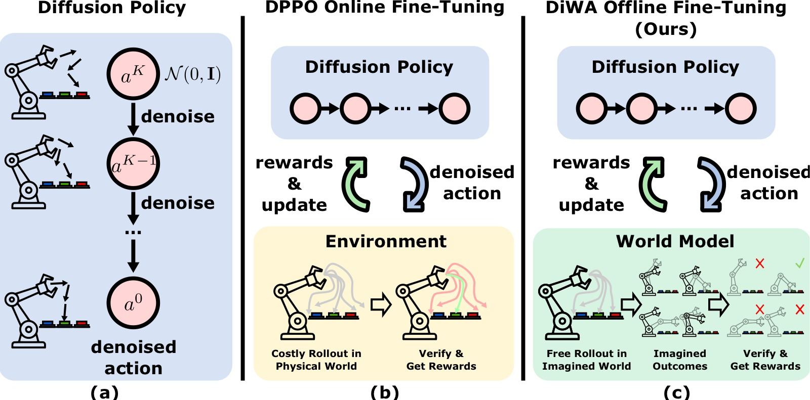
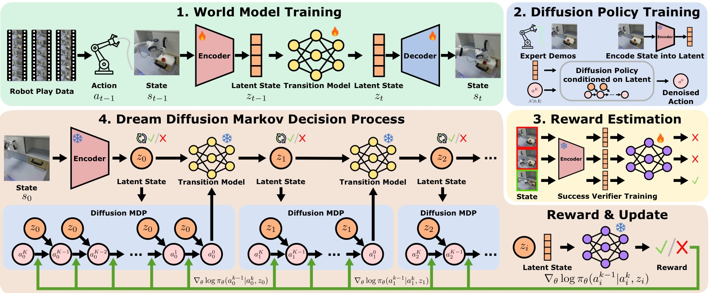
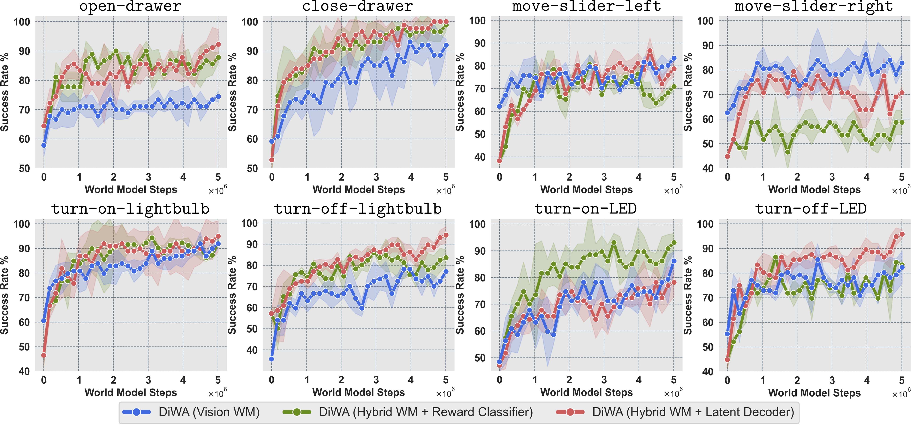
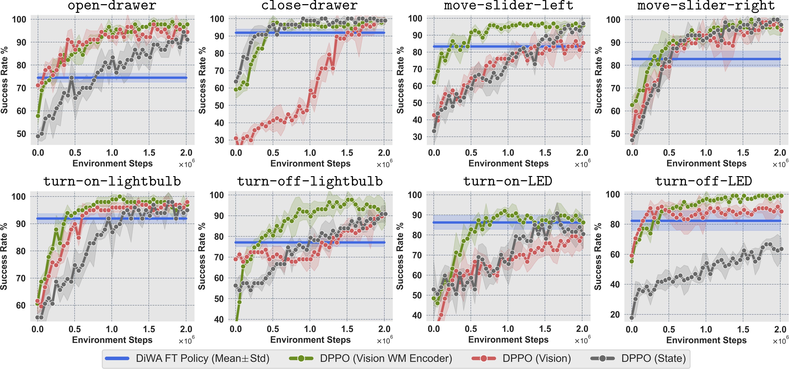
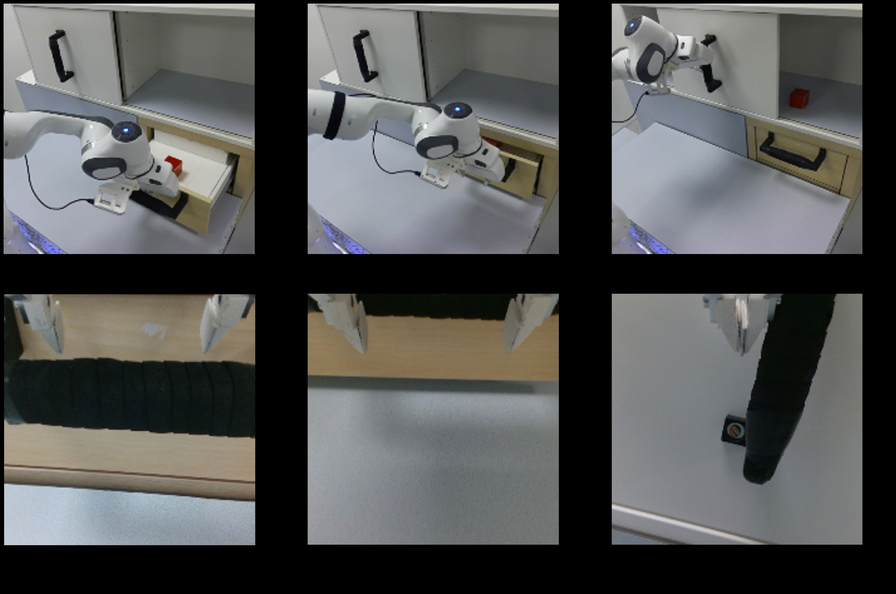
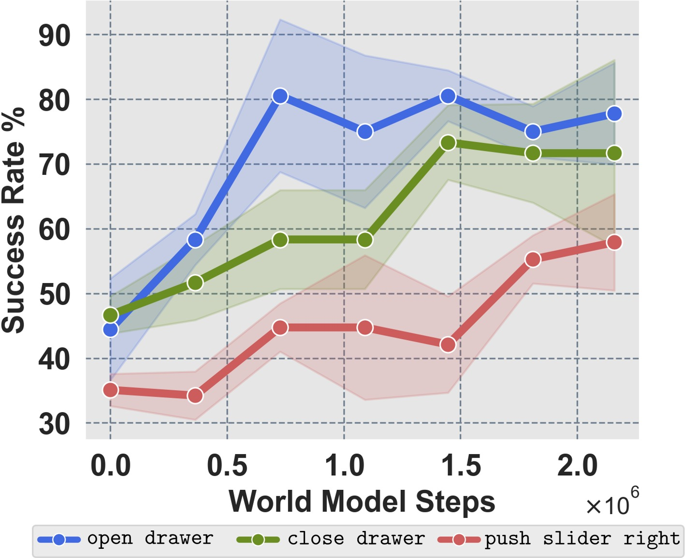
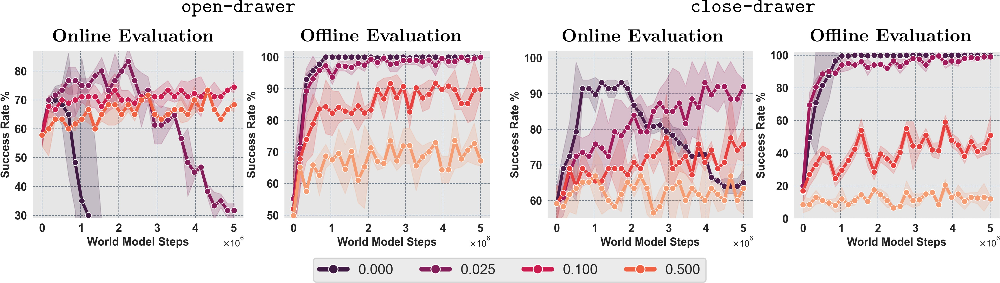
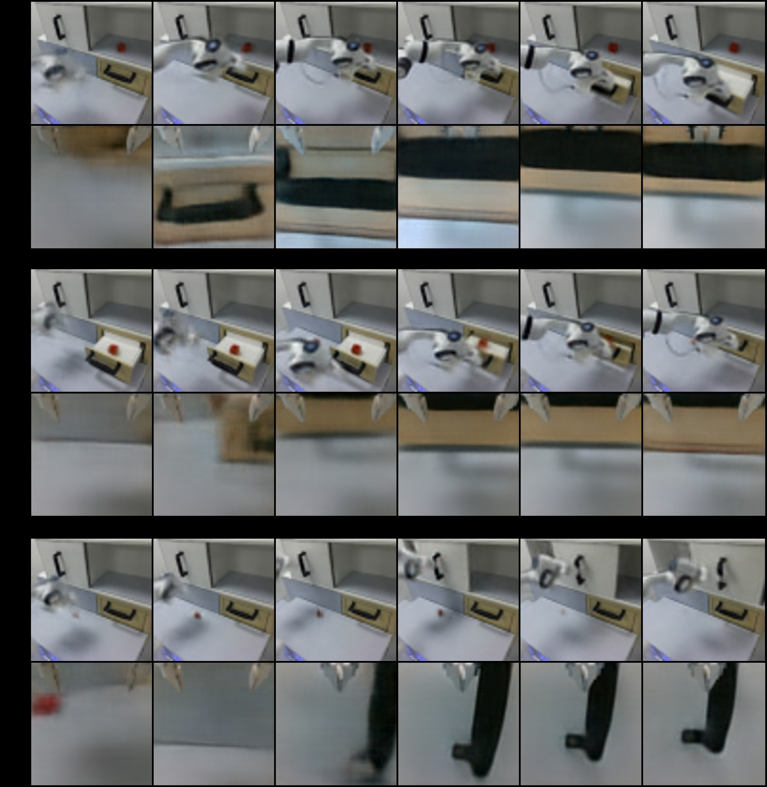

# DiWA: Diffusion Policy Adaptation with World Models

> **论文信息**
> - 作者：Akshay L Chandra$^{*}$, Iman Nematollahi$^{*}$, Chenguang Huang, Tim Welschehold, Wolfram Burgard, Abhinav Valada
> - 通讯作者：Abhinav Valada（University of Freiburg）
> - 投稿方向：CoRL 2025
> - arXiv ID：2508.03645
> - 项目主页：https://diwa.cs.uni-freiburg.de
> - 代码：https://github.com/acl21/diwa

---

## 一、核心问题

扩散策略（Diffusion Policy）在机器人模仿学习中表现优异，但纯 Behavior Cloning 训练的策略受限于专家数据的覆盖范围和质量，面对分布偏移（distribution shift）时容易失败。自然地，可以用强化学习（RL）对预训练策略进行微调。

现有 SOTA 方法 **DPPO**（Diffusion Policy Policy Optimization）将扩散去噪过程建模为多步 MDP，用 PPO 进行在线微调，但存在致命缺陷：**需要数百万次真实环境交互**，在实际机器人场景中既不安全也不可行。

本文核心问题：**能否完全离线地微调扩散策略，而不需要任何真实或仿真环境交互？**



*图1：三种扩散策略学习范式对比。**(a)** 标准扩散策略通过 Behavior Cloning 从离线数据中学习，受限于数据质量。**(b)** DPPO 通过在线环境交互微调扩散策略，需要数百万步物理交互，成本高且有安全隐患。**(c)** DiWA 通过学习到的世界模型（world model）中的"想象 rollout"完全离线地微调扩散策略，无需任何物理交互即可实现策略改进。*

---

## 二、核心思路 / 方法

### 2.1 整体框架：四阶段训练

DiWA 的训练分为四个阶段（图 2）：

1. **世界模型训练**：在无标签的 play 数据 $\mathcal{D}_{\text{play}}$ 上训练 latent dynamics model，学习环境的紧凑隐空间表征
2. **扩散策略预训练**：在专家演示 $\mathcal{D}_{\text{exp}}$ 上通过 Behavior Cloning 预训练扩散策略（使用 WM 编码的 latent 作为输入）
3. **奖励分类器训练**：在 latent 空间训练二分类器 $C_\psi$，从专家数据中学习任务成功/失败的判别信号
4. **Dream Diffusion MDP 中微调**：在 WM 的 latent 空间中展开想象 rollout，用 PPO + BC 正则化微调扩散策略



*图2：DiWA 完整框架图。四阶段流程清晰展示了从 play 数据到最终部署的全链路：(1) 从无结构 play 数据学习世界模型；(2) 用 WM encoder 提取 latent 表征，预训练扩散策略；(3) 在 latent 空间训练 success classifier 作为奖励函数；(4) 在 Dream Diffusion MDP 中通过 PPO + BC 正则化完全离线微调策略。推理时直接将微调后的策略部署到真实机器人上。*

### 2.2 世界模型：DreamerV2 风格 RSSM

世界模型 $\mathcal{M}_{\text{wm}} = (\mathcal{Z}, \mathcal{A}, P_\phi)$ 采用 DreamerV2 的 recurrent state-space model（RSSM）架构：

- **编码器**：双路视觉编码（static camera + wrist camera），特征拼接后送入 RSSM
- **确定性状态** $h_t$：1024 维，通过 GRU 式循环更新
- **随机状态** $z_t$：32 个 categorical 变量，每变量 32 类 → 稀疏 1024 维 one-hot
- **总 latent 维度**：$k = 2048$（$h_t$ 和 $z_t$ 拼接）
- **解码器**：从 latent 重建 RGB 图像
- **训练目标**：负 ELBO，带 KL balancing（$\delta = 0.8$）稳定训练

世界模型在约 50 万步 play 数据上一次性训练完成，**训练后冻结**，不再更新。

### 2.3 扩散策略预训练

- 使用世界模型 encoder 将原始观测编码为 2048 维 latent 向量
- 策略架构：3 层 MLP（每层 512 维），DDPM 去噪，$K = 20$ 步
- 观察窗口 1 步，预测 $T_p = 4$ 步未来动作，执行 $T_a = 4$ 步
- 每 skill 仅需 50 条专家演示
- 训练 5000 epochs，使用 EMA（decay=0.995）稳定权重

### 2.4 潜在奖励估计

在 latent 空间训练成功分类器 $C_\psi$：

- **双组件架构**：Embedding MLP（[512,512]）→ 对比学习（NT-Xent） + Classification MLP（[512,512]）→ 交叉熵
- **联合损失**：$\mathcal{L}_{\text{reward}} = \mathcal{L}_{\text{NT-Xent}} + \mathcal{L}_{\text{CE}}$
- **精度**：平均 precision 0.89，recall 0.98（仅需 50 demonstrations/skill）
- **对比**：ResNet-18 视觉分类器 precision 仅 0.41（recall 相同 0.98）

关键洞察：WM 的时序结构化 latent 空间自带强归纳偏置，使得奖励分类器即使在小样本下也能高精度区分成功/失败状态。

### 2.5 Dream Diffusion MDP：核心创新

这是 DiWA 最核心的理论贡献。将扩散去噪过程嵌入世界模型 MDP，形成一个统一的 **Dream Diffusion MDP** $\mathcal{M}_{\text{DD}}$：

- **双层时间索引** $\bar{t}(t,k) = tK + (K-k)$：外层是世界模型时间步 $t$，内层是去噪步 $k$（从 $K$ 递减到 $1$）
- **状态**：$\bar{s}_{\bar{t}(t,k)} = (z_t, \bar{a}_t^{k})$——latent 状态 + 当前噪声动作
- **动作**：$\bar{a}_{\bar{t}(t,k)} = \bar{a}_t^{k-1}$——去噪一步后的动作
- **奖励**：只在 $k=1$（最终去噪步）时给 reward classifier 的输出，其余去噪步为 0
- **转移**：
  - $k > 1$ 时：在 latent 空间内去噪（Dirac delta 转移）
  - $k = 1$ 时：执行动作 $a_t^0$，通过世界模型转移到 $z_{t+1}$，并从新噪声开始下一轮扩散

### 2.6 PPO 微调 + BC 正则化

微调目标 = PPO clip loss + BC 正则化项：

$$\mathcal{L}_\theta = \mathcal{L}_\text{PPO} - \alpha_\text{BC} \ \mathbb{E}\left[\sum_{k=1}^{K} \log \pi_{\theta_\text{pre}}(\bar{a}_t^{k-1} \mid z_t, \bar{a}_t^{k})\right]$$

- **去噪折扣** $\gamma_\text{denoise}$：对早期（噪声更大的）去噪步的 advantage 进行衰减，因为早期去噪步对最终动作的影响较小
- **BC 正则化** $\alpha_\text{BC}$（默认 0.05）：约束微调后的策略不要偏离预训练策略太远，防止利用 WM 的建模误差（model exploitation）
- **仅微调最后 $K'=10$ 步去噪**：前 $K-K'=10$ 步保持冻结，减少计算量
- **GAE**：仅在 $k=1$ 步计算，然后用去噪折扣传播到更早的去噪步

---

## 三、训练目标

### 3.1 世界模型（ELBO）

$$\min_{\phi}\; \mathbb{E}_{q_\phi}\left[\sum_{t=1}^T -\log p_\phi(x_t \mid s_t) + \beta \, \text{KL}\left(q_\phi(z_t \mid h_t, x_t)\, \| \, p_\phi(z_t \mid h_t)\right)\right]$$

### 3.2 扩散策略 BC 预训练

$$\mathcal{L}_\text{BC}(\theta) = \mathbb{E}_{\mathcal{D}_\text{exp}} \left[\sum_{t=1}^{T} \sum_{k=1}^{K} - \log \pi_\theta(a_t^{k-1} \mid z_t, a_t^k)\right]$$

### 3.3 奖励分类器（Contrastive + CE）

$$\mathcal{L}_{\text{reward}} = \mathcal{L}_{\text{NT-Xent}} + \mathcal{L}_{\text{CE}}$$

### 3.4 Dream Diffusion MDP 策略梯度

$$\nabla_\theta \bar{\mathcal{J}}(\bar{\pi}_\theta) = \mathbb{E}^{\bar{\pi}_\theta, \bar{P}}\left[\sum_{\bar{t} \geq 0} \nabla_\theta \log \bar{\pi}_\theta(\bar{a}_{\bar{t}} \mid \bar{s}_{\bar{t}}) \, \bar{r}(\bar{s}_{\bar{t}}, \bar{a}_{\bar{t}})\right]$$

---

## 四、实验与结果

### 4.1 仿真实验：CALVIN Benchmark（8 个任务）

| 任务 | 预训练 SR | DiWA 微调 SR | DPPO (WM Enc) 需多少步追上 | DPPO (Vision) 需多少步追上 |
|------|-----------|-------------|--------------------------|--------------------------|
| Open Drawer | 57.78 | **74.44** | 117,600 | 134,400 |
| Close Drawer | 59.14 | **91.95** | 345,600 | 1,545,600 |
| Left Slider | 62.15 | **83.33** | 270,933 | 1,377,600 |
| Right Slider | 62.55 | **82.76** | 249,600 | 537,600 |
| Light On | 60.61 | **91.92** | 302,933 | 588,000 |
| Light Off | 35.63 | **77.01** | 327,066 | 1,260,000 |
| LED On | 48.43 | **86.21** | 494,933 | 2,251,200 |
| LED Off | 55.25 | **82.33** | 277,333 | 184,800 |
| **总物理交互** | — | **0** | ~2.5M | ~8M |

**关键发现**：
- DiWA 在所有 8 个任务上一致提升，物理交互次数为 **0**
- DPPO 需要数十万到数百万步在线交互才能达到同等性能
- DPPO (Vision WM Encoder) 变体始终优于 DPPO (Vision) 变体，说明 WM latent 表征比 ViT 编码更丰富



*图3：三种 DiWA 变体在 8 个 CALVIN 任务上的微调性能对比。**蓝色（Vision WM）**：仅用视觉输入训练世界模型，依赖学习到的奖励分类器——这是主实验的标准配置，因为它仅需视觉观测即可部署到真实机器人。**绿色（Hybrid WM + Reward Classifier）**：在训练时额外引入场景状态（scene state）监督，使 latent dynamics 更准确，但仍使用学习到的奖励分类器。**红色（Hybrid WM + Latent Decoder）**：使用场景状态增强的 latent，并直接从 latent 解码状态变量来计算奖励（无需学到的分类器），奖励信号最准确。*

*结果趋势清晰：更准确的世界模型 + 更可靠的奖励信号 → 更强的微调性能。Hybrid WM + Latent Decoder 在多数任务上最优，验证了"WM 精度"和"奖励质量"是决定离线微调上限的两个关键因素。Vision WM（蓝色）作为纯视觉方案，虽然绝对性能略低，但优势在于完全兼容真实机器人部署（无需 scene state）。*

### 4.2 DPPO 各变体详细对比



*图S1：DPPO 三种输入模态变体的在线学习曲线对比。**DPPO (State, 灰色)**：直接使用仿真器 ground-truth 状态（51 维），在部分任务上学习最快但波动大。**DPPO (Vision, 红色)**：使用 ViT 编码原始 RGB 图像（64×64×6），学习最慢——在 Close Drawer 任务上需要超过 150 万步才能追上 DiWA。**DPPO (Vision WM Encoder, 绿色)**：使用与 DiWA 相同的 frozen WM encoder 处理视觉输入，性能最强且最稳定，学习速度明显快于纯 ViT 变体。*

*DiWA（蓝色水平带）作为离线方法，不需要任何环境交互——其性能在图中显示为恒定水平线。关键对比：DPPO (Vision WM Encoder) 虽然最终可以逼近甚至超过 DiWA，但每个 skill 平均需要数百到数千次在线 episode。在真实机器人上，这些交互对应数小时甚至数天的物理操作，且存在安全风险。DiWA 用几小时一次性 play 数据 + 少量 expert demo 就能消除所有这些在线交互需求。*

### 4.3 真机实验（3 个任务）

在 Franka Emika Panda 机器人上测试了 3 个任务（开抽屉、关抽屉、推滑条），使用 4 小时 teleoperation play 数据（~45 万步）+ 每 skill 50 条 expert demo。



*图4a：三个真实世界操作任务的可视化——Open Drawer、Close Drawer、Push Slider Right。实验使用 Franka Emika Panda 7-DoF 机械臂，配备 static Azure Kinect + wrist Realsense D415 双摄像头。*



*图5b：三个真机任务上的微调前后成功率对比（20 次 rollout × 3 seeds）。蓝色柱为预训练扩散策略的成功率，绿色/红色/紫色柱为在 WM 中微调 ~2M imagination steps 后的成功率。每个任务都观察到了显著提升：Open Drawer 从 ~25% → ~70%，Close Drawer 从 ~30% → ~80%，Push Slider 从 ~20% → ~65%。这些提升完全离线实现，**零次真实环境交互**——微调后的策略直接 zero-shot 部署到真实机器人上。*

### 4.4 LIBERO-90 实验（4 个任务）

| 任务 | 预训练 SR | DiWA 微调 SR |
|------|-----------|-------------|
| Open Top Drawer (scene 1) | 40.67 | **77.33** |
| Turn On Stove (scene 3) | 54.00 | **91.33** |
| Close Bottom Drawer (scene 4) | 27.33 | **78.00** |
| Close Top Drawer (scene 5) | 75.33 | **100.00** |

LIBERO-90 场景多样但每场景交互数据稀疏，DiWA 仍能在此条件下有效微调（不同任务需要不同的微调步数：1M–3M）。

### 4.5 BC 正则化消融实验



*图S2：BC 正则化系数 $\alpha_\text{BC}$ 对微调效果的影响。**$\alpha_\text{BC} = 0.0$（无正则化）**：策略在想象环境中表现很好，但部署到真实环境时成功率急剧下降——典型的 model exploitation，策略学会了利用 WM 的不准确性来获得虚假的高奖励。**$\alpha_\text{BC} = 0.5$（过强正则化）**：策略几乎没有改进，因为约束太强，PPO 无法有效调整策略。**中间值（0.025–0.10）**：在"适应新任务"和"保持预训练行为"之间取得最佳平衡，使策略既能从 RL 中获益，又不会过拟合 WM 的建模误差。*

### 4.6 世界模型 Rollout 可视化



*图S3：学习到的世界模型在真实世界 hold-out 轨迹上的长期预测。每行是一个技能的片段，展示 static 和 gripper 两个视角的解码重建图像。模型仅用前 2 帧建立初始上下文，然后通过 latent 空间的循环动力学前向预测 80 步（尽管训练序列长度仅 50 步）。预测图像保持视觉连贯性和时序一致性，准确追踪机械臂和操作物体的运动——说明 WM 从 play 数据中学到了有意义的物理动态，且能外推到训练序列长度之外。*

### 4.7 高斯策略微调（验证框架通用性）

| 任务 | 预训练 SR | 微调后 SR |
|------|-----------|----------|
| Open Drawer | 50.00 | **71.67** |
| Close Drawer | 55.17 | **98.28** |
| Left Slider | 54.86 | **82.64** |
| Right Slider | 55.52 | **87.93** |
| Light On | 54.55 | **95.96** |
| Light Off | 62.07 | **77.59** |
| LED On | 44.83 | **77.59** |
| LED Off | 40.94 | **79.69** |

框架也可用于简单的高斯策略，验证了 Dream Diffusion MDP 的设计与策略架构无关。

---

## 五、关键洞察与技术亮点

1. **Dream Diffusion MDP**：将扩散去噪过程的 $K$ 步与 WM 的时间步统一建模为一个分层 MDP，使 PPO 的策略梯度可以自然传播——这是首次在 WM 中对扩散策略做策略梯度微调。

2. **Latent 奖励分类器优于视觉分类器**：通过对比学习 + 交叉熵联合训练，在 WM 的时序结构化 latent 空间中学到的奖励分类器（precision 0.89）远优于直接基于像素的 ResNet-18（precision 0.41）。时序 consistent 的 latent 表征本身就是一个强先验。

3. **BC 正则化防止 model exploitation**：纯 PPO 微调会使策略学会利用 WM 的不准确性来获得虚假的高奖励（在想象中成功率高，部署到真实环境失败）。BC 正则化约束策略靠近预训练行为，是离线微调成功的关键。

4. **仅微调最后 $K'$ 步去噪**：前 $K-K'$ 步去噪与预训练策略共享，大幅减少计算量，同时不影响微调效果——因为早期去噪步骤主要决定动作的大致方向，而精细调整集中在后期。

5. **去噪折扣 $\gamma_\text{denoise}$**：直觉上，去噪早期步骤（$k$ 大）的动作仍然很 noisy，对最终动作的贡献有限，应该对它们的 advantage 做折扣。这一设计使得梯度信号集中在影响最大的去噪步骤上。

6. **一次训练、多任务复用**：世界模型在 task-agnostic play 数据上只训练一次，后续可以为任意新 skill 训练奖励分类器并微调策略——实现了 WM 的一次性投入、多任务复用。

---

## 六、代码实现解读

### 6.1 代码架构总览

```
diwa/
├── diwa/
│   ├── agent/
│   │   ├── pretrain/        # 扩散策略 BC 预训练
│   │   │   ├── train_agent.py
│   │   │   ├── train_diffusion_agent.py
│   │   │   └── train_gaussian_agent.py
│   │   ├── finetune/        # PPO 微调
│   │   │   ├── train_agent.py
│   │   │   ├── train_ppo_agent.py
│   │   │   ├── train_ppo_diffusion_agent.py          # DPPO 在线微调
│   │   │   ├── train_ppo_diffusion_img_agent.py      # DPPO (Vision) 变体
│   │   │   └── train_mb_ppo_diffusion_agent_visionwm.py  # ★ DiWA 核心
│   │   └── eval/
│   ├── model/
│   │   ├── diffusion/
│   │   │   ├── diffusion.py         # DDPM/DDIM 核心实现
│   │   │   ├── diffusion_vpg.py     # VPG 基类
│   │   │   ├── diffusion_ppo.py     # PPO loss + BC 正则化 ★
│   │   │   ├── mlp_diffusion.py     # MLP 去噪网络
│   │   │   └── diffusion_eval.py    # 推理/采样
│   │   ├── gaussian/
│   │   └── rewcls/                  # 奖励分类器
│   │       └── contrastive.py
│   ├── wm/
│   │   ├── encoder/
│   │   │   └── visionwm.py          # WM encoder（观测 → latent）
│   │   └── wrapper/
│   │       ├── visionwm_cls.py      # Vision WM + reward classifier ★
│   │       ├── hybridwm.py          # Hybrid WM 变体
│   │       └── base.py
│   ├── env/
│   └── utils/
├── lumos/                           # WM 训练子模块
└── config/
    ├── calvin/finetune/             # 各 skill 微调配置
    └── dataset/
```

### 6.2 核心推理/训练流程

```
┌─────────────────────────────────────────────────────────────────────────┐
│                        DiWA 训练主循环                                     │
│  train_mb_ppo_diffusion_agent_visionwm.py :: run()                       │
├─────────────────────────────────────────────────────────────────────────┤
│                                                                          │
│  ┌──────────────┐    ┌──────────────┐    ┌──────────────┐               │
│  │ 1. 获取初始   │───▶│ 2. WM encoder │───▶│ 3. 扩散策略   │               │
│  │   观测 obs   │    │   obs→latent  │    │   采样 action │               │
│  └──────────────┘    └──────────────┘    └──────┬───────┘               │
│                                                  │                       │
│                                                  ▼                       │
│  ┌──────────────┐    ┌──────────────┐    ┌──────────────┐               │
│  │ 6. 检查 done │◀───│ 5. 计算奖励   │◀───│ 4. WM multi_  │               │
│  │   重置/继续   │    │   rewcls→r   │    │   step(lat,a)│               │
│  └──────┬───────┘    └──────────────┘    └──────────────┘               │
│         │ done_envs → get_init_obs → WM encoder → 新 latent              │
│         ▼                                                                │
│  ┌──────────────┐    ┌──────────────┐    ┌──────────────┐               │
│  │ 7. 收集 buffer│───▶│ 8. PPO update│───▶│ 9. BC 正则化 │               │
│  │   obs,chains,│    │   计算 ratio │    │   logprob 约 │               │
│  │   rewards,.. │    │   clip loss  │    │   束策略更新  │               │
│  └──────────────┘    └──────────────┘    └──────────────┘               │
│                                                                          │
└─────────────────────────────────────────────────────────────────────────┘
```

### 6.3 关键代码映射

| 论文概念 | 代码位置 | 说明 |
|---------|---------|------|
| Dream Diffusion MDP $\mathcal{M}_{\text{DD}}$ | `train_mb_ppo_diffusion_agent_visionwm.py:161-169` | 扩散策略在 latent 空间采样 action，然后通过 `wme.multi_step()` 在世界模型中执行 |
| 世界模型 multi_step | `wm/wrapper/visionwm_cls.py:45-62` | 逐 action step 前向 WM 动力学，最后用 reward classifier 计算奖励 |
| PPO + BC 联合 loss | `model/diffusion/diffusion_ppo.py:58-194` | `loss()` 函数同时计算 pg_loss、v_loss、bc_loss |
| 去噪折扣 $\gamma_\text{denoise}$ | `diffusion_ppo.py:137-142` | `discount = gamma_denoising**i`，对早期去噪步的 advantage 做指数衰减 |
| BC 正则化项 | `diffusion_ppo.py:101-123` | 用 base policy 重新采样，计算当前 policy 下 teacher action 的 logprob |
| 仅微调 $K'=10$ 步 | `diffusion_ppo.py:93-95` | `newlogprobs[:, :reward_horizon, :]` 限制梯度只回传到前 `reward_horizon` 步 |
| 奖励分类器 | `model/rewcls/contrastive.py` | Embedding MLP + Classification MLP，联合 NT-Xent + CE loss |
| PPO clip 系数指数衰减 | `diffusion_ppo.py:149-156` | 对越靠后的去噪步使用越小的 clip 范围，减少后期步的策略变化 |

### 6.4 Dream Diffusion MDP 单步展开流程

```
时间步 t（外层 WM），去噪步 k（内层 diffusion）

  k=20  k=19  ...  k=2       k=1              k=20  k=19  ...
  │      │          │          │                 │      │
  ▼      ▼          ▼          ▼                 ▼      ▼
  ┌─┐   ┌─┐       ┌─┐       ┌─┐              ┌─┐   ┌─┐
  │ā²⁰│→│ā¹⁹│→ ...→│ā¹│→────┤ā⁰│──action──▶  │ā²⁰│→│ā¹⁹│→ ...
  └─┘   └─┘       └─┘       └─┘              └─┘   └─┘
  z_t   z_t        z_t       z_t    ──▶ z_{t+1}   z_{t+1}
                                │
                       reward = C_ψ(z_{t+1})
                       仅在 k=1 时给奖励
```

- $k > 1$：策略去噪一步 $ā_t^{k} \to ā_t^{k-1}$，latent 状态不变 $z_t$，奖励为 0
- $k = 1$：最终动作 $ā_t^0$ 执行到 WM，转移至 $z_{t+1} = P_\phi(z_{t+1} \mid z_t, ā_t^0)$，奖励 = $C_\psi(z_{t+1})$，从新噪声 $\mathcal{N}(0,I)$ 开始新一轮 $K$ 步去噪

### 6.5 奖励分类器训练（`scripts/rewcls/train_contrastive.py`）

```
输入：WM latent z_t（2048 维）
  │
  ▼
┌─────────────────┐
│ Embedding MLP    │  [512, 512] + ReLU
│ f_ψ(z_t) → emb  │
└────────┬────────┘
         │
    ┌────┴────┐
    ▼         ▼
┌───────┐ ┌───────┐
│NT-Xent│ │  CE   │
│ Loss  │ │ Loss  │
└───┬───┘ └───┬───┘
    └────┬────┘
         ▼
    L_reward = L_NT-Xent + L_CE
```

---

## 七、局限性

1. **WM 冻结不可更新**：世界模型在 play 数据上一次性训练后冻结，建模误差在微调过程中持续存在，策略可能过拟合这些误差（model exploitation）。未来可探索混合方法——离线预训练 + 少量在线交互逐步修正 WM。

2. **想象性能 ≠ 真实性能**：在 WM 中微调时看到的性能提升不一定能完全转移到真实环境，需要在真实机器人上评估中间 checkpoint 才能确定真实效果。

3. **WM 数据需求**：需要数小时的无结构 play 数据训练 WM（CALVIN ~6 小时/50 万步，真机 ~4 小时/45 万步），虽然远少于在线交互，但仍需要一定的数据采集成本。

4. **每 skill 需要少量专家演示**：虽然只需 50 条 demo/skill，但这 50 条需要包含成功标注（用于训练奖励分类器），在某些场景下收集成本不低。

---

## 八、关键概念速查

| 概念 | 说明 |
|------|------|
| **Dream Diffusion MDP** | 将 $K$ 步扩散去噪嵌入 WM MDP 形成的双层 MDP，外层是 WM 时间步、内层是去噪步 |
| **RSSM** | Recurrent State-Space Model，DreamerV2 风格的 latent dynamics model |
| **DPPO** | Diffusion Policy Policy Optimization，将扩散去噪视为多步 MDP 用 PPO 微调 |
| **BC 正则化** | Behavior Cloning regularization，约束微调策略不偏离预训练策略太远 |
| **去噪折扣 $\gamma_\text{denoise}$** | 对更早（噪声更大）的去噪步的 advantage 做衰减 |
| **$K'$ / fine-tuned denoising steps** | 仅微调最后 $K'$ 步去噪（默认 10），前 $K-K'$ 步保持冻结 |
| **KL balancing** | 用不同权重分别正则化 prior 和 posterior，加速 prior 收敛 |
| **GAE** | Generalized Advantage Estimation，在 $k=1$ 步计算后通过去噪折扣传播 |
