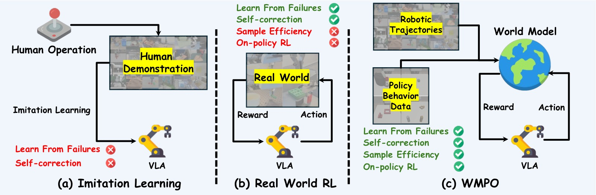
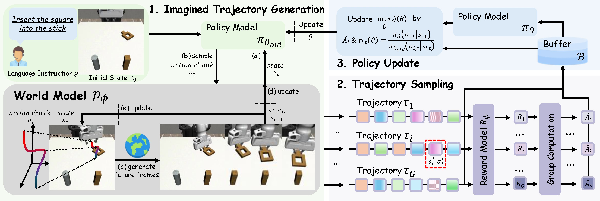
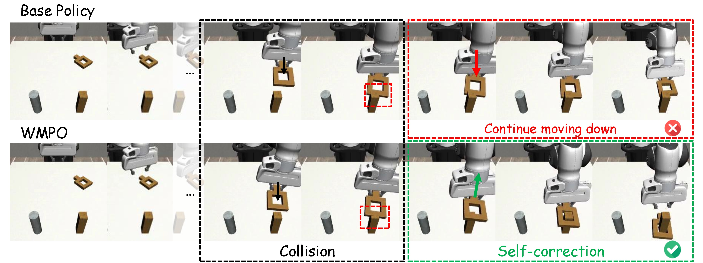
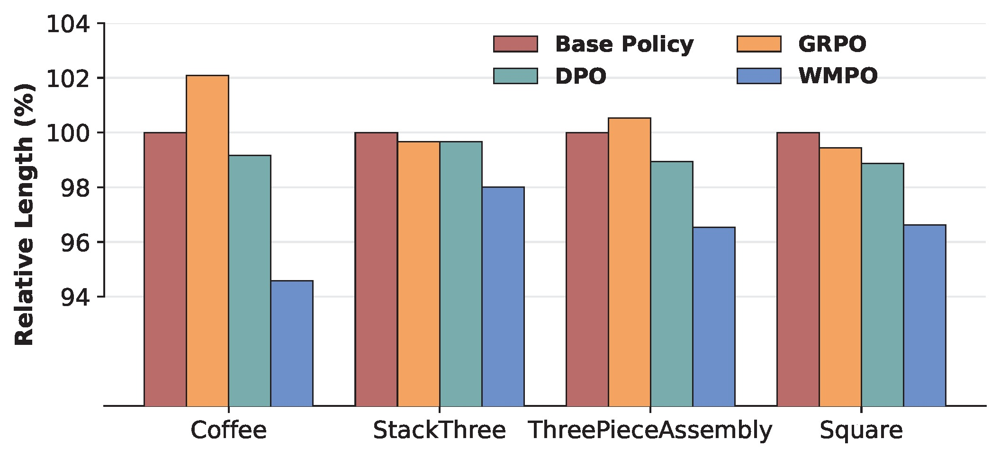
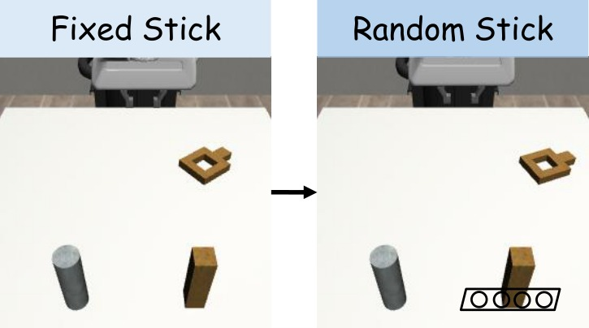
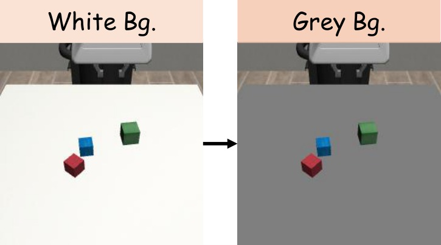
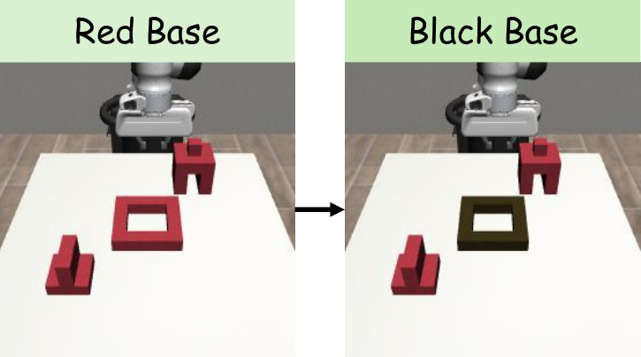
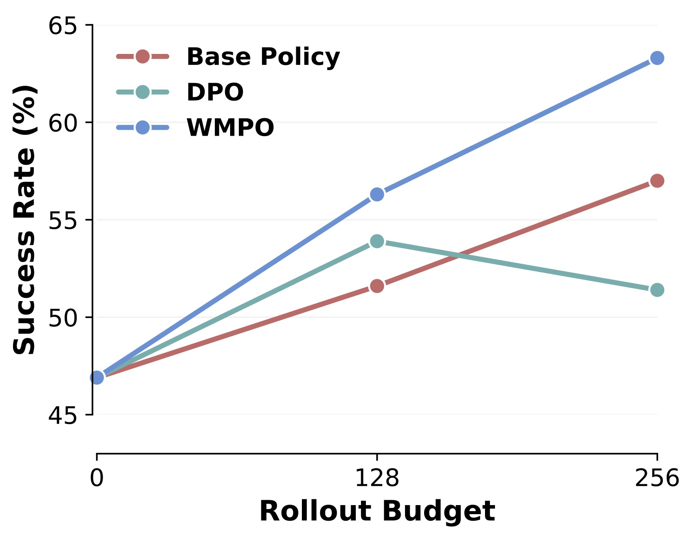
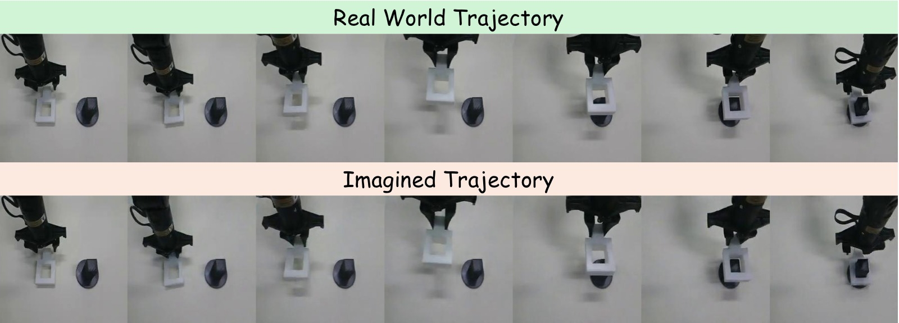

# WMPO: World Model-based Policy Optimization for Vision-Language-Action Models

> **论文信息**
> - 作者：Fangqi Zhu<sup>1,2</sup>, Zhengyang Yan<sup>1</sup>, Zicong Hong<sup>1</sup>, Quanxin Shou<sup>1</sup>, Xiao Ma<sup>2*</sup>, Song Guo<sup>1*</sup>
> - 通讯作者：Xiao Ma (ByteDance Seed), Song Guo (HKUST)
> - 投稿方向：ICLR 2026
> - arXiv ID：2511.09515
> - 代码：[github.com/WM-PO](https://WM-PO.github.io)（基于 verl + OpenSora，完整开源）
> - 项目页：https://wm-po.github.io/

---

## 一、核心问题

VLA（Vision-Language-Action）模型在机器人操控领域展现了巨大潜力，但存在两个根本性瓶颈：

1. **模仿学习（IL）的脆弱性**：现有 VLA 主要依赖专家演示做行为克隆，遭遇 OOD（分布外）状态时会产生级联错误，无法自纠正和从失败中学习。
2. **真实环境 RL 的采样低效**：直接在真实机器人上做 RL 需要数百万次交互，成本高、不安全、不可扩展。而构建精确仿真器又面临巨大的工程开销。

**核心矛盾**：IL 无法从失败中学习，RL 无法高效采样 —— 如何在不接触真实环境的情况下，让 VLA 策略获得 RL 的自我改进能力？

> 论文的核心洞察：利用**像素空间**（而非潜空间）的视频生成世界模型来模拟环境动力学，使 VLA 策略可以在"想象"中进行 on-policy RL，从而与预训练 VLA 的视觉表征保持一致。



**子图 (a) 模仿学习（Imitation Learning）**：数据流从左侧的"专家演示数据集"出发，经过训练直接得到 VLA 策略并部署到机器人。这条路径的核心问题是数据与部署之间存在单向鸿沟 —— 策略部署后产生的失败轨迹（failure trajectories）无法回流到训练循环中。IL 本质上是"看一遍就上岗"，不会从错误中学习。

**子图 (b) 真实环境 RL（Real-World RL）**：相比 IL，增加了从部署环境回传轨迹的反馈回路。策略可以在真实机器人上采集 rollout 数据、计算奖励并更新自身。但这条路径标注了"high sampling costs"——真实环境的物理交互极其昂贵，难以扩展到大规模训练。

**子图 (c) WMPO**：在真实环境与策略之间插入了一个"Learned World Model"。世界模型先在 OXE 等大规模机器人数据上预训练，然后在少量策略自采数据上做 Policy Behavior Alignment。此后，整个 RL 循环（Policy → 想象轨迹 → 奖励 → 更新）完全在世界模型内部完成，不再需要真实环境交互。论文称这个设计为"无环境交互的 on-policy RL"。

> 这张图的价值在于清晰对比了三种范式的核心差异：IL 只有单向数据流（演示→策略），缺乏反馈能力；真实环境 RL 有反馈但被物理交互瓶颈限制；WMPO 通过世界模型将反馈回路"搬进 GPU"，实现了可扩展的闭环学习。

---

## 二、核心思路 / 方法

### 2.1 总体框架

WMPO 将 VLA RL 完全建立在**动作条件视频生成世界模型**之上。训练流程包含三个核心组件：

1. **想象轨迹生成（Imagined Trajectory Generation）**：策略 $\pi_\theta$ 与世界模型 $p_\phi$ 交替交互，自回归地生成完整轨迹
2. **轨迹采样（Trajectory Sampling）**：对同一初始状态采样多条轨迹，用奖励模型 $R_\psi$ 评估成功/失败
3. **策略更新（Policy Update）**：使用 GRPO（Group Relative Policy Optimization）在"想象轨迹"上优化策略参数



**图片拆解**：该图以从左到右的流程展示了 WMPO 的一次完整训练迭代。

**阶段 1（左侧黄色区域）—— 想象轨迹生成**：给定来自真实环境数据集的初始状态 $s_0$（包含初始图像 $I_{0:c}$ 和语言指令），旧的 VLA 策略 $\pi_{\theta_{\text{old}}}$ 预测第一个动作块 $a_{0:K}$，世界模型 $p_\phi$ 基于条件帧和动作块生成下一段视频帧 $I_{K:2K}$。这个过程交替重复，逐步自回归地生成一整条完整的"想象轨迹" $\tau$。图中用"Imagine Trajectory $\tau$"的箭头清晰标注了这个交替交互模式。

**阶段 2（中间蓝色区域）—— 轨迹采样**：对同一初始状态，策略以一定温度采样多条（$G=8$ 条）不同的想象轨迹。图中以不同颜色的轨迹线表示这种多样性。每条轨迹输入奖励模型 $R_\psi$，获得成功/失败（Smile/Frown）的二元标签。这里还用到了 Dynamic Sampling：如果 $G$ 条轨迹全部成功或全部失败，该组被丢弃并重新采样，避免梯度为零。

**阶段 3（右侧绿色区域）—— 策略更新**：所有有效的轨迹组被收集起来，按照 GRPO 公式计算组内相对优势 $\hat{A}_i$ 和策略比率 $r_{i,t}(\theta)$，通过最小化裁剪后的替代目标（clipped surrogate objective）来更新策略参数 $\theta$。更新完成后，旧策略参数 $\theta_{\text{old}}$ 被新参数替代，进入下一轮迭代。

> 整个流程的循环特性是 WMPO 的核心优势：策略在想象中越练越好，世界模型保持固定（因为在想象中策略的输入始终是模型生成的帧），这保证了训练稳定性和可扩展性。

### 2.2 问题形式化

将 VLA 操控任务形式化为 MDP $\mathcal{M} = (\mathcal{S}, \mathcal{A}, P, R)$：

- **状态空间** $\mathcal{S} = \mathcal{I} \times \mathcal{G}$：图像观测序列 $I_{0:K}$ + 语言指令
- **动作空间** $\mathcal{A}$：动作块（action chunk），每个动作有 $D$ 个自由度，每维离散化为 256 bins
- **转移函数** $P$：由参数化世界模型 $s_{t+1} \sim p_\phi(s_{t+1} \mid s_t, a_t)$ 实现
- **奖励函数** $R_\psi$：训练好的 VideoMAE 分类器，输出轨迹是否成功的二值判断

优化目标：

$$\max_\theta \mathbb{E}_{\tau \sim \pi_\theta, p_\phi}\left[R_\psi(\tau)\right]$$

### 2.3 生成式世界模型

**架构选择**：基于 OpenSora（STDiT-v3 视频扩散模型），做出三项关键修改：

| 修改 | 动机 | 效果 |
|------|------|------|
| **3D VAE → 2D VAE（SDXL）** | 3D VAE 的时序压缩会丢失细粒度运动细节 | 更好地保留机器人-物体交互的精细运动 |
| **噪声条件帧（Noisy Frame Conditioning）** | 自回归生成中误差累积导致长期预测崩溃 | 训练时对条件帧加 50/1000 步扩散噪声，提升鲁棒性 |
| **帧级动作控制（Frame-Level Action Control）** | 需要精确的动作-帧对齐 | 扩展 AdaLN 块，以帧粒度注入动作信号 |

**帧级动作控制**的具体实现：对每帧 $i$ 的动作 $a_i$，MLP 生成调制系数 $\gamma_1^i$、$\beta_1^i$（LayerNorm 的 scale/shift）、$\alpha_1^i$（残差连接的 scale）：

$$\mathbf{x}^i = \mathbf{x}^i + (1 + \alpha_1^i) \cdot \text{Block}\bigl(\gamma_1^i \cdot \text{LayerNorm}(\mathbf{x}^i) + \beta_1^i\bigr)$$

**Policy Behavior Alignment（策略行为对齐）**：世界模型先在 OXE（Open X-Embodiment，百万级机器人轨迹）上预训练 1200 万步，再在下游任务的策略自采数据上微调 300 万步。这一步解决了两个分布不匹配问题：(1) OXE 以成功轨迹为主，缺乏失败案例；(2) 下游策略的行为模式可能与 OXE 中的演示者不同。如果不做这一步对齐，世界模型在遇到策略的失败行为时会生成不真实的想象，导致 RL 训练失效。

### 2.4 奖励模型

- **架构**：VideoMAE-base 编码器 + 线性分类头
- **训练**：二分类交叉熵。正样本为成功轨迹的最后 $L$ 帧 clip，负样本来自成功轨迹的中间片段和失败轨迹的任意片段。batch 内正负样本强制 1:1 平衡，缓解类不平衡
- **推理**：对整条想象轨迹以 stride=1 滑动窗口扫描（窗口长度 $L=8$），任一时序窗口的预测概率超过阈值 $\tau_{\text{thr}}$ 即判定为成功。该阈值通过验证集 grid search 确定
- **效果**：所有任务上 F1 > 0.95，意味着奖励信号高度可靠，有效防止 reward hacking

### 2.5 On-Policy GRPO 优化

采用 GRPO（Group Relative Policy Optimization），关键设计选择：

- **组内相对优势**：从同一初始状态采样 $G=8$ 条轨迹，用组内标准化计算优势：$\hat{A}_i = \frac{R_i - \text{mean}(\{R_i\})}{\text{std}(\{R_i\})}$
- **去除 KL 散度正则**（遵循 DAPO）：不使用参考模型，减少显存消耗，鼓励策略探索
- **动态采样（Dynamic Sampling）**：若一组轨迹全部成功或全部失败，丢弃该组重新采样 —— 避免梯度消失
- **不对称裁剪**：$\epsilon_{\text{low}}=0.20$，$\epsilon_{\text{high}}=0.28$（上界更宽松，给正向更新更大空间）

$$\mathcal{J}(\theta) = \mathbb{E}\left[\frac{1}{G}\sum_{i=1}^G \frac{1}{T}\sum_{t=0}^{T} \min\!\Big(r_{i,t}(\theta)\hat{A}_i, \operatorname{clip}(r_{i,t}(\theta), 1-\epsilon_{\text{low}}, 1+\epsilon_{\text{high}})\hat{A}_i\Big)\right]$$

---

## 三、实验与结果

### 3.1 实验设置

- **模拟环境**：Mimicgen，4 个精细操控任务：Coffee_D0（端咖啡）、StackThree_D0（堆叠三个方块）、ThreePieceAssembly_D0（三件组装）、Square_D0（将方柱插入方孔）
- **基础策略**：OpenVLA-OFT 在每任务 300 条专家演示上做 SFT
- **Rollout 预算**：$P=128$ 和 $P=1280$，代表可用于优化的**真实轨迹数量**
- **评估**：每任务 128 个不同初始状态，报告平均成功率（%）
- **硬件**：SFT 8×H100，世界模型预训练 + 策略优化 32×H100
- **世界模型预训练**：OXE 数据集上 1200 万步；Policy Behavior Alignment 微调 300 万步

### 3.2 主要对比结果

论文以表格形式（Table 1）报告了 WMPO 与基线和消融方法的全面对比。以下为完整的数字结果：

| Rollout 预算 $P$ | 方法 | Coffee | StackThree | ThreePieceAssembly | Square | 平均 (%) |
|:---:|:---|:---:|:---:|:---:|:---:|:---:|
| *—* | *Base Policy (SFT)* | 43.8 | 46.9 | 19.5 | 24.2 | 33.6 |
| 128 | GRPO | 38.3 | 52.3 | 17.2 | 25.0 | 33.2 |
| 128 | DPO | 43.8 | 53.9 | 23.4 | 28.1 | 37.3 |
| 128 | **WMPO（本文）** | **61.7** | **56.3** | **37.5** | **32.8** | **47.1** |
| 1280 | GRPO | 47.7 | 54.7 | 20.3 | 25.8 | 37.1 |
| 1280 | DPO | 52.3 | 57.0 | 26.7 | 33.6 | 42.4 |
| 1280 | **WMPO（本文）** | **75.0** | **64.1** | **46.1** | **45.3** | **57.6** |

**逐项解读**：

**Row 1 — Base Policy（SFT 基线）**：不做任何 RL，直接用 300 条专家演示微调 OpenVLA-OFT。平均成功率 33.6%，Coffee 和 StackThree 相对容易（43.8%/46.9%），ThreePieceAssembly 和 Square 非常困难（19.5%/24.2%）。这说明精细操控对纯 IL 来说极具挑战性。

**Row 2-4 — $P=128$（小样本场景）**：
- GRPO（在线 RL，直接在仿真中交互）：平均 33.2%，低于 base policy。原因很明确——$P=128$ 条轨迹不足以支撑在线 GRPO 的批量训练需求（一次更新就需要 $64 \times 8 = 512$ 条轨迹），加上 Dynamic Sampling 过滤掉的无效组，模型只能更新 1-2 次。Coffee 任务上甚至降到 38.3%（vs base 43.8%），说明数据不足时 GRPO 可能破坏既有能力。
- DPO（离线 RL，对比偏好优化）：平均 37.3%（+3.7 vs base），利用了所有数据做重复训练，但无法在线更新策略。
- WMPO：平均 **47.1%**（**+13.5 vs base**，**+9.8 vs 最强基线 DPO**）。在 Coffee 任务上提升尤其显著（43.8%→61.7%，+17.9），因为世界模型能从少量自采数据中学习有效的环境动态。

**Row 5-7 — $P=1280$（充足样本场景）**：
- GRPO：平均 37.1%（+3.5 vs base）。有更多数据后 GRPO 恢复了一些能力，但离 WMPO 差距巨大（37.1% vs 57.6%，差 20.5 个百分点）。
- DPO：平均 42.4%（+8.8 vs base）。DPO 受限于离线数据的固有能力上限，即使数据量扩大 10 倍也仅增加了 5.1 个百分点。
- WMPO：平均 **57.6%**（**+24.0 vs base**，**+15.2 vs 最强基线**）。在 Coffee 任务上达到 75.0%，比基线的 43.8% 高出 31.2 个百分点——几乎翻倍。即使最难的 ThreePieceAssembly（19.5%→46.1%）也提升了 26.6 个百分点。

**跨任务趋势**：WMPO 在所有任务上都一致优于所有基线，且性能增益不随任务难度饱和。即便基线已经很高（如 $P=128$ 的 DPO 在 StackThree 上达到 53.9%），WMPO 仍能进一步推高。这表明 WMPO 的增益来自 RL 本身的学习能力，而非简单的数据利用效率差异。

> 表格直接支持了论文的核心主张：WMPO 既具样本效率（小预算下大幅领先），又具可扩展性（大预算下优势进一步扩大）。GRPO 在真实环境中的困境恰恰反衬出世界模型的价值 —— 不是 GRPO 算法不好，而是没有足够数据时 on-policy RL 在物理世界中根本无法运作。

### 3.3 涌现行为：自纠正



**图片结构**：该图以两行并行的方式对比了 Base Policy（上排）和 WMPO（下排）在 Square 任务中遭遇相同碰撞场景时的行为序列。每排约 5-6 个关键帧，按时间从左到右排列。最右侧标注了最终结果：Base Policy 为红色叉号（任务失败），WMPO 为绿色勾号（任务成功）。

**Base Policy（上排）逐帧分析**：
- **帧 1-2（接近立柱）**：策略正确地将方块移向立柱方向。
- **帧 3（碰撞发生）**：方块接触到立柱边缘，出现偏移。此时是关键决策点——策略需要感知到偏移并做出调整。
- **帧 4-5（持续推挤）**：策略继续向前施加压力，方块被立柱挡住无法移动，形成"卡住"状态。由于 IL 训练只见过成功的插入轨迹，从未在训练中遇到"被挡住"的情形，策略无法识别这是一个需要修正的状态。
- **帧 6（超时失败）**：直到最大步数（Square 任务为 184 步），方块仍卡在立柱外，任务失败。

**WMPO（下排）逐帧分析**：
- **帧 1-2（接近立柱）**：与 Base Policy 相似，方块移向立柱。
- **帧 3（碰撞发生）**：同样出现了偏移和碰撞。
- **帧 4（抬起）**：WMPO 策略做出了一个关键动作——将方块**向上抬起**，脱离与立柱的卡住状态。这个行为在专家演示数据中**从未出现**（演示者总是直接插入，不会先碰撞再抬起）。
- **帧 5（重新对齐）**：方块在空中被重新调整位置，对准立柱的方孔。
- **帧 6（成功插入）**：方块从正确位置顺利插入立柱，任务完成。

**为什么这是"涌现"行为**：WMPO 策略在专家演示中没有见过碰撞→恢复的序列，也没有见过"抬起→对齐→再插"的动作模式。这一行为完全是通过在世界模型中反复"想象"失败轨迹并学习从失败中恢复而自发产生的。这是 RL 相对于 IL 本质优势的最强有力的定性证据 —— RL 不仅可以模仿好的行为，还可以从坏的行为中学习如何变好。

### 3.4 轨迹效率提升



**图片结构**：该图为垂直柱状图（或水平柱状图），横轴列出 Base Policy、GRPO、DPO、WMPO 四种方法，纵轴为**相对平均轨迹长度**（百分比），以 Base Policy 的成功轨迹平均长度为 100% 基准。

**数据解读**：
- **Base Policy = 100%**：基准线。这代表 IL 策略完成任务的典型步数。IL 策略在遇到不确定状态时容易犹豫（vacillation），表现为臂端反复微调、停顿等待等"粘滞"行为，推高了轨迹长度。
- **GRPO 和 DPO**：轨迹长度与 Base Policy 接近或略短。这两种方法主要优化的是"是否成功"，对执行效率没有直接优化信号。在某些情况下，追求成功率的策略可能会选择更谨慎、更慢的执行方式，反而增加轨迹长度。
- **WMPO**：轨迹长度显著短于所有其他方法。原因在于 WMPO 的奖励模型对轨迹长度有隐式惩罚——"卡住"行为会增加轨迹步数，而更长的轨迹在推理时需要更多轮次的世界模型自回归生成，累积误差更大，更容易被判定为失败。这种隐式机制驱动策略学习更快、更果断的执行方式。

**为什么这很重要**：更短的轨迹不仅意味着更高的效率（同样时间内完成更多任务），更重要的是它说明 WMPO 抑制了"卡住"（stuck）行为 —— 这种行为在纯 IL 中非常普遍，因为 IL 策略在遇到不同于训练分布的状态时，缺乏明确的纠错方向，只能不断尝试类似的动作直到超时。WMPO 通过在想象中反复经历各种失败模式，学会了在不确定时果断调整而非原地犹豫。

> 论文将这种行为特征总结为"fast and smooth execution without noticeable stalls"，这正是人类专家操控的标志。

### 3.5 泛化能力

WMPO 在三种根本不同的分布偏移（Distribution Shift）下测试泛化能力，每种偏移都旨在评估策略是否学到了可迁移的操控技能，而非依赖于训练数据的表面视觉特征。

<table><tr>
<td width="33%"><br><em>(a) 位置偏移：立柱在矩形区域内随机放置，而非训练时的固定位置</em></td>
<td width="33%"><br><em>(b) 背景偏移：灰色桌面替代了训练时的原有桌面背景</em></td>
<td width="33%"><br><em>(c) 纹理偏移：深色木纹底座替代了红色塑料底座</em></td>
</tr></table>

**泛化实验结果**：

| 方法 | 位置偏移 | 背景偏移 | 纹理偏移 | 平均 |
|------|:---:|:---:|:---:|:---:|
| Base Policy | 14.1 | 46.1 | 10.9 | 23.7 |
| GRPO | 15.6 | 47.7 | 10.9 | 24.7 |
| DPO | 16.4 | 34.4 | 7.8 | 19.5 |
| **WMPO** | **22.3** | **50.0** | **16.4** | **29.6** |

**子图 (a) 位置偏移（Position Disruption）—— Square 任务**：训练时立柱固定在桌面特定位置。测试时立柱位置在附近矩形区域内随机采样，要求策略具备空间泛化能力——根据视觉输入实时调整末端执行器的移动方向，而非记忆固定轨迹。WMPO 达到 22.3%，比 Base Policy（14.1%）高出 8.2 个百分点，比 DPO（16.4%）高出 5.9 个百分点。所有方法的成功率都显著低于分布内设置（Square 原任务约 24-45%），说明位置偏移对所有方法都是巨大的挑战。但 WMPO 相对 Base Policy 的优势比例（+58%）远高于其他方法，证明世界模型让策略学到了更灵活的空间推理。

**子图 (b) 背景偏移（Background Disruption）—— StackThree 任务**：训练时桌面为木纹纹理。测试时将桌面背景替换为纯灰色。这项测试的核心目的是区分"学到了操控技能"和"学到了背景关联"——如果策略完全依赖桌面纹理来定位物体，换背景后应大幅退化。Base Policy 从 46.9%（分布内）降至 46.1%，基本没有退化，说明 OpenVLA-OFT 本身对背景变化有一定的鲁棒性。但 DPO 从 57.0% 骤降至 34.4%（**-22.6 个百分点**），严重退化——这是 DPO 过拟合的明显信号：DPO 优化可能在无意中放大了策略对特定视觉线索的依赖。WMPO 达到 50.0%，在所有方法中最高，且相对其分布内表现（StackThree $P=1280$ 时 64.1%）退化幅度最小。

**子图 (c) 纹理偏移（Texture Disruption）—— ThreePieceAssembly 任务**：训练时组装底座为红色塑料材质。测试时替换为深色木纹底座。这项测试与背景偏移互为补充——背景偏移调的是环境上下文，纹理偏移调的是交互物体的材质。ThreePieceAssembly 是四个任务中最难的（base 仅 19.5%），加上纹理偏移后更加困难。Base Policy 仅 10.9%，几乎随机。DPO 在分布内还有 26.7% ($P{=}1280$)，但在纹理偏移下骤降至 7.8%，甚至比 base 还差——说明 DPO 在 ThreePieceAssembly 上学到的很可能是"识别红色底座"而非"组装物体的空间关系"。WMPO 达到 16.4%，虽然绝对值仍低，但相比 Base Policy 提升超过 50%，是唯一在该偏移下保持正向效果的方法。

**方法间对比的关键规律**：
- **DPO 的过拟合模式**最为突出：在分布内设置中 DPO 往往有可观的提升（特别是大预算下），但在背景和纹理偏移下大幅退化甚至低于 base。这符合 DPO 作为离线方法的局限——它只能从已有的轨迹数据中学习，不可避免地会利用数据中的 spurious correlations 而非本质操控技能。
- **GRPO 与 Base Policy 表现接近**：在三种偏移下 GRPO 基本与 base 持平。考虑到它在分布内设置中也提升有限（甚至低于 base），这表明真实环境 GRPO 在有限的 rollout 预算下连分布内能力都未能显著提升，更谈不上泛化。
- **WMPO 是唯一在三类偏移下都保持正向提升的方法**：无论是空间、背景还是纹理变化，WMPO 都优于其他方法。核心原因在于，世界模型生成的"想象轨迹"本身包含了大量的视觉变化（扩散模型生成时天然带有多样性），相当于在想象中做了大规模数据增强，使策略学会关注操控本身而非特定视觉特征。

> 泛化实验是 WMPO 方法中最有说服力的部分之一。它不仅证明了"在想象中训练优于在真实数据上训练"，而且通过 DPO 的退化现象揭示了离线 RL 的一个深层缺陷：离线方法优化的是数据利用效率，而非技能本身的泛化性。

### 3.6 终身学习（Lifelong Learning）



**实验设计**：这是一个模拟"部署→改进→再部署"闭环的实验：
1. 用基策略收集 $P=128$ 条真实轨迹
2. 用 WMPO/DPO 优化策略
3. 用优化后的策略重新收集 $P=128$ 条轨迹
4. 重复步骤 2-3

同时对比了用更多专家演示（428 条 vs 300 条、556 条 vs 300 条）训练的 Base Policy，作为"是否应该花时间收集更多演示而非做 RL"的对照组。

**图片结构**：横轴为迭代轮次（或训练数据量），纵轴为 StackThree 任务的成功率（%）。图中应包含三条曲线：
- **WMPO 曲线**：起点约 56%（第一轮 WMPO 优化后），随后持续上升
- **DPO 曲线**：起点约 54%，随后波动甚至下降
- **Base Policy 参考线**：三条水平线（或点），分别标注为 300 demos、428 demos、556 demos

**数据解读**：
- **WMPO 三轮后的趋势**：WMPO 实现了稳定的逐步提升，每一轮都在前一轮的基础上继续改进。这是因为：(1) 优化后的策略收集到更多样的数据（包括更多成功案例和新的失败模式），(2) 用新数据再次做 Policy Behavior Alignment，世界模型的模拟能力也同步提升，(3) 形成良性循环。
- **DPO 无法迭代**：DPO 在第二轮后性能停滞甚至下降。原因在于 DPO 是离线方法，每次优化只能从已有数据中学，而离线数据覆盖的策略行为空间有限。更严重的是，DPO 的优化不稳定（preference optimization 容易产生策略坍缩），多轮迭代会累积这种不稳定。
- **增加专家演示 vs WMPO**：即使用 556 条专家演示（比基础 300 条多出 85%），Base Policy 的提升也远不如 WMPO 的第一轮优化。这从经济学角度证明了 WMPO 的价值——专家演示需要人类操作员的时间和精力，而 WMPO 所需的自采数据由策略自己生成，成本接近于零。**自动探索比增加人类演示更有效**。

> 终身学习实验的直接含义是：WMPO 可以让机器人在部署过程中持续自我改进，无需人工干预。这是一个从"一次性训练→固定部署"到"持续学习→持续提升"的范式转变。

### 3.7 真机实验



**实验设置与图片结构**：
- **平台**：Cobot Mobile ALOHA 双臂机器人
- **任务**：将一金属方块精确插入立柱上的方孔，方块与孔壁间隙仅 5mm——对视觉感知和运动控制的精度要求极高
- **训练数据**：200 条高质量专家演示 → 基策略 SFT；128 条策略自采数据 → WMPO/DPO 优化
- **评估**：每种方法 30 次试验，固定光照和初始条件
- **图片结构**：上排为基策略在真实环境中的执行帧序列，下排为世界模型对同一初始状态生成的"想象"轨迹帧序列

**上排（真实世界执行）的观察**：基策略在真实机器人上的执行过程。从初始状态（方块在桌面上，立柱在前方），机械臂抓取方块后向立柱移动。可以观察到基策略的特点：动作相对缓慢、谨慎，在某些帧可能有微调或犹豫。这条轨迹最终是否成功取决于具体的试验——论文报告的基策略成功率为 53%。

**下排（世界模型"想象"）的观察**：从完全相同的初始帧出发，世界模型生成的视频预测。需要特别指出的是：世界模型在训练时**从未见过这条具体轨迹**——这不是对训练数据的复述，而是从初始状态出发、结合策略动作的全新生成。尽管如此，世界模型准确地预测了：(1) 机械臂的运动轨迹（包括关节角度和末端位置），(2) 方块被抓起后与立柱的空间关系，(3) 整体场景的光照、阴影和纹理一致性。这说明世界模型真正学到了任务的核心物理动态，而不是简单的视频插值。

**定量结果**：

| 方法 | 成功率 |
|------|:---:|
| Base Policy (SFT, 200 demos) | 53% |
| DPO (+128 self-collected) | 60% |
| **WMPO (+128 self-collected)** | **70%** |

- WMPO 比基策略高出 **17 个百分点**（53%→70%）
- WMPO 比 DPO 高出 **10 个百分点**（60%→70%）
- 仅用 128 条自采数据（无人工标注），WMPO 带来了 1.32× 的相对提升

**为什么真机实验特别重要**：仿真环境（Mimicgen）中的成功不一定能转移到真实机器人，因为真实世界存在仿真无法精确建模的物理因素（摩擦力变化、光照变化、机械间隙等）。WMPO 在真机上取得 70% 的成功率，说明：(1) 世界模型能有效弥合 sim-to-real gap——它从少量真实数据中学到的物理动态足以支撑策略优化；(2) 70% 的成功率在 5mm 间隙的高精度插入任务上已经是实用水平的性能。

**额外分析：世界模型的失败预测能力**：论文附录中还展示了世界模型成功预测失败场景的案例（Fig. A1），以及一个罕见的预测失败案例（Fig. A2，因为微妙扰动未能捕捉方块被卡住的瞬间）。总体而言，世界模型在验证集上的失败预测错误率很低，说明它能够忠实地辨别成功和失败轨迹，这对于策略学习至关重要——如果世界模型无法准确判断"什么是失败"，策略也无法学会"如何避免失败"。

---

## 四、关键洞察与技术亮点

1. **像素空间 > 潜空间**：WMPO 坚持在像素空间生成视频，而非像 Dreamer 系列那样在潜空间学动力学。理由是 VLA 的视觉编码器用海量互联网图片预训练，包含丰富的语义理解 —— 在潜空间中重新训练会导致表征失配。这个设计选择虽然增加了计算开销（扩散模型在像素空间开销大），但从根本上保证了 VLA 预训练知识可以无损地用于理解想象轨迹。

2. **Policy Behavior Alignment 是必需组件**：仅用专家演示训练世界模型无法模拟策略可能遇到的失败状态。必须用策略自身的 rollout 数据微调世界模型。这与模仿学习中的 DAgger（Dataset Aggregation）思想同源——训练数据应来自当前策略的分布，而非仅来自专家。

3. **噪声条件帧**：自回归视频预测中，先前生成的帧带有伪影和误差，使用干净的帧作为条件会导致训练-推理分布不一致（train-test mismatch）。给条件帧加噪声（50/1000 步扩散噪声）是一个非常优雅的解决方案——它本质上是在训练时模拟推理时的"不完美条件"，让模型学会鲁棒地处理累积误差。

4. **GRPO + 世界模型 = 天然匹配**：GRPO 要求从同一初始状态采样多条轨迹来计算组内相对优势，这在真实世界中几乎不可能（无法精确复现同一初始状态），但在世界模型中可以轻松重复采样。这种"reset-to-same-state" 的能力是虚拟化训练的独特优势。

5. **自纠正 = RL 价值的体现**：WMPO 涌现的自纠正行为是论文最有力的定性证据 —— 策略学会了演示数据中完全没有的动作模式（抬起→对齐→再插），证明了 RL 相对于 IL 的本质优势不是"更好地模仿"，而是"学会解决新问题"。

6. **终身学习闭环**：WMPO 支持策略→收集→世界模型更新→策略优化的迭代循环。每一轮迭代中：(1) 更好的策略收集到更丰富的自采数据，(2) 更丰富的自采数据强化世界模型的模拟能力，(3) 更强的世界模型支撑更好的策略优化。这个良性循环是 WMPO 区别于一次性优化方法的核心竞争力。

7. **隐式效率优化**：WMPO 的奖励模型没有任何对轨迹长度的显式奖励，但策略仍然学会了更短的执行路径。这是通过一个隐式机制实现的——在世界模型中，长轨迹需要多轮自回归生成，累积误差逐渐增大，导致更容易被判定为失败。策略因此学会了"快刀斩乱麻"。

---

## 五、代码实现解读

WMPO 代码基于三个开源项目构建：**verl**（RL 训练框架）、**OpenSora**（世界模型）、**OpenVLA-OFT**（VLA 策略）。

### 5.1 系统架构

```
┌──────────────────────────────────────────────────────────────────────────────┐
│                           WMPO Training System                                │
├──────────────────────────────────────────────────────────────────────────────┤
│                                                                              │
│  ┌─────────────────────── Ray Cluster ───────────────────────────────────┐   │
│  │                                                                       │   │
│  │  ┌─────────────────┐   ┌─────────────────┐   ┌─────────────────┐     │   │
│  │  │ RobWMActorRollout│   │  CriticWorker   │   │ RobWMActorRollout│     │   │
│  │  │   Worker (GPU)   │   │    (GPU)         │   │   (RefPolicy)    │     │   │
│  │  │                  │   │                  │   │                  │     │   │
│  │  │ ┌─────────────┐  │   │ ┌─────────────┐  │   │ ┌─────────────┐  │     │   │
│  │  │ │ VLA Policy  │  │   │ │Value Network│  │   │ │ Old Policy  │  │     │   │
│  │  │ │ (OpenVLA)   │  │   │ │  (optional)  │  │   │ │  (frozen)   │  │     │   │
│  │  │ └─────────────┘  │   │ └─────────────┘  │   │ └─────────────┘  │     │   │
│  │  │ ┌─────────────┐  │   │                  │   │                  │     │   │
│  │  │ │ World Model │  │   │                  │   │                  │     │   │
│  │  │ │(OpenSora)   │  │   │                  │   │                  │     │   │
│  │  │ └─────────────┘  │   │                  │   │                  │     │   │
│  │  │ ┌─────────────┐  │   │                  │   │                  │     │   │
│  │  │ │ Reward Model│  │   │                  │   │                  │     │   │
│  │  │ │ (VideoMAE)  │  │   │                  │   │                  │     │   │
│  │  │ └─────────────┘  │   │                  │   │                  │     │   │
│  │  └─────────────────┘   └─────────────────┘   └─────────────────┘     │   │
│  └───────────────────────────────────────────────────────────────────────┘   │
│                                                                              │
│  关键文件映射:                                                                 │
│  ├── verl/trainer/main_ppo.py            # 训练入口，配置 Ray + Worker         │
│  ├── verl/workers/rollout/robwm_rollout.py  # 世界模型 rollout（核心）         │
│  ├── verl/workers/rollout/rob_rollout.py    # 真实环境 rollout（baseline）      │
│  ├── verl/workers/fsdp_workers.py        # FSDP 分布式 Worker 实现             │
│  ├── verl/trainer/ppo/core_algos.py      # GRPO 核心算法                       │
│  ├── verl/trainer/ppo/ray_trainer.py     # Ray 分布式训练调度                   │
│  └── reward_model/videomae.py            # 奖励模型训练                         │
└──────────────────────────────────────────────────────────────────────────────┘
```

**架构说明**：系统通过 Ray 管理多 GPU 分布式训练。`RobWMActorRolloutRefWorker` 是 WMPO 的核心 Worker，内部同时持有 VLA 策略、世界模型、奖励模型和 VAE 编码器/解码器。`main_ppo.py:153` 通过 `config.actor_rollout_ref.wm.enable` 开关切换世界模型模式和真实环境模式。`RayTrainer` 负责协调多 Worker 之间的数据流（rollout → reward → advantage → update）。

### 5.2 世界模型 Rollout 流程（robwm_rollout.py）

这是 WMPO 的核心代码，`RobWMHFRollout` 类实现了"在想象中做 RL"的完整流程：

```
  初始状态 s₀ ────┐
                 │
   ┌─────────────▼─────────────┐
   │ 1) encode(s₀) → VAE latent│
   │    image_history = repeat │
   │      (latent, queue_len)  │
   └─────────────┬─────────────┘
                 │
   ┌─────────────▼─────────────┐
   │ 2) VLA π_θ(current_frame) │   _generate_one_step()
   │    → action chunk (8 dim)  │   论文: 公式 π_θ(a_t|s_t)
   └─────────────┬─────────────┘
                 │
   ┌─────────────▼─────────────┐
   │ 3) World Model p_φ:       │   scheduler.sample(
   │    z = concat(history,     │     model=world_model,
   │         noise)             │     y=actions,
   │    latent = denoise(z|     │     mask=[0..0,1..1])
   │             action)        │   论文: 公式 I~p_φ(I|c,a)
   │    frame = vae.decode()    │
   └─────────────┬─────────────┘
                 │
                 ▼  重复直到 max_steps
                 │
   ┌─────────────▼─────────────┐
   │ 4) Reward Model R_ψ:      │   predict_success()
   │    slide_window(video)     │   滑动窗口 L=w=8, stride=1
   │    → complete / fail       │   论文: 二值分类 R_ψ(τ)∈{0,1}
   └─────────────┬─────────────┘
                 │
   ┌─────────────▼─────────────┐
   │ 5) GRPO Update:            │   core_algos.py
   │    adv = (R-mean)/std       │   论文: 公式 Eq.(4)
   │    loss = clip_ratio * adv  │
   └───────────────────────────┘
```

**逐步骤解释**：

**步骤 1（编码初始状态）**：初始 RGB 帧 $I_{0:1}$ 通过 SDXL 2D VAE 编码为潜变量（latent）。这个 latent 被复制 `queue_len=4` 次作为初始的 `image_history_tensor`，为第一轮扩散生成提供条件。代码位置：`robwm_rollout.py:355-357`。

**步骤 2（VLA 策略推理）**：将当前帧 resize 到 224×224，通过 `process_input()` 构建 VLA 输入（图像 token + 语言指令 prompt）。`_generate_one_step()` 调用 OpenVLA-OFT 的 `generate_action_verl()` 方法，输出动作块（8 个动作 × 7 维 = 56 个 token），同时返回归一化动作 `normalized_actions`。代码位置：`robwm_rollout.py:362-376`。

**步骤 3（世界模型扩散生成）**：这是最核心的步骤。将潜变量历史 `image_history_tensor` (shape: B×C×4×H_l×W_l) 与随机噪声 `z` (shape: B×C×8×H_l×W_l) 在时序维度拼接，得到 z_combined。构建一个二值 mask，对历史帧标记为 0（条件帧，不需要去噪），对新帧标记为 1（需要去噪）。调用扩散调度器 `scheduler.sample()` 执行去噪过程，以动作 `y` 为条件信号（通过 AdaLN 注入）。去噪完成后取后 8 帧作为生成的潜变量，用 VAE 解码回像素空间。代码位置：`robwm_rollout.py:378-399`。

**步骤 4（奖励模型评估）**：对生成完成的完整视频（max_steps+1 帧），使用 `predict_success()` 方法以滑动窗口（窗口长 $L=8$，stride=1）扫描。每一窗口输入 VideoMAE 模型，输出成功概率。如果任一时序窗口的概率超过阈值，该轨迹判定为成功，并记录 `finish_step`（最早达到成功标准的步数）。代码位置：`robwm_rollout.py:237-287`。

**步骤 5（GRPO 更新）**：将所有轨迹的 complete/finish_step 信息组织为 DataProto，由 RayTrainer 调度到所有 Worker 执行 GRPO 更新。核心逻辑在 `core_algos.py` 中，计算策略比率 $r_{i,t}(\theta)$、组内标准化优势 $\hat{A}_i$、裁剪后的替代损失。代码位置：`core_algos.py` + `ray_trainer.py`。

**代码关键函数映射**：

| 论文公式/概念 | 代码位置 |
|---|---|
| 想象轨迹生成 (Eq.1) | `robwm_rollout.py:run_wm_inference()` |
| 世界模型条件扩散 | `robwm_rollout.py:339-395` |
| 帧级动作控制（AdaLN 调制） | OpenSora transformer block 中的 AdaLN 扩展 |
| 奖励模型滑动窗口推理 | `robwm_rollout.py:predict_success()` |
| GRPO 目标函数 (Eq.3+4) | `core_algos.py` + `ray_trainer.py` |
| 动态采样过滤无效组 | `ray_trainer.py`（DAPO 策略） |
| Policy Behavior Alignment | 通过 `train_wmpo_*.sh` 训练脚本，在 OXE 预训练后用策略数据微调 |

### 5.3 奖励模型训练（videomae.py）

- **数据构造**：`SuccessWindowDataset` 类从 webdataset tar 文件中提取滑动窗口 clips
  - **正样本**（label=1）：仅取成功轨迹的末端 $[T-W, T]$ 窗口（$W=8$）
  - **负样本**（label=0）：来自两个来源：(1) 成功轨迹的中间片段（$[W, T-S]$ 范围内随机采样），(2) 失败轨迹的任意片段
  - 训练时 batch 内正负样本强制 1:1 平衡
- **模型**：VideoMAE-base（`MCG-NJU/videomae-base`），最后加 2 类线性分类头
- **训练**：DDP 多卡训练，最多 20 万步，每 1000 步验证一次。在 20 个阈值（0.3-1.0 均匀采样）上 grid search F1，取最优阈值
- **最优阈值选择**：通过 `find_thre.py` 在预留验证集上确定 $\tau_{\text{thr}}$，针对每个任务独立选择

### 5.4 双模式 Rollout

WMPO 代码同时支持两种 rollout 模式：

| 模式 | Worker 类 | 用途 |
|------|-----------|------|
| **世界模型 Rollout** | `RobWMActorRolloutRefWorker` (继承 `RobWMHFRollout`) | WMPO 主线：策略在世界模型"想象"中训练 |
| **真实环境 Rollout** | `RobActorRolloutRefWorker` (继承 `RobHFRollout`) | 基线（GRPO）：策略在 Mimicgen 仿真中直接交互 |

切换方式：配置 `actor_rollout_ref.wm.enable = true/false`（见 `main_ppo.py:153`）。这两种模式共享相同的 GRPO 训练后端（`core_algos.py`），唯一区别是 rollout 的来源。

---

## 六、局限性

1. **动作表征**：当前仅支持离散化动作（每维 256 bins），未扩展到 flow-matching 等连续/更表达性的策略类（如 π₀）。论文提到未来将探索 FlowGRPO 以支持连续动作空间。

2. **计算开销**：世界模型预训练需 1200 万步（32×H100），每任务还需 300 万步微调。总体 GPU 时数相当可观。不过论文从经济学角度提出了合理的反驳——真实机器人 rollout 的成本（硬件磨损、安全风险、人工监督）在时间维度上是线性的且不可压缩，而算力是高度可并行和可扩展的。在实际部署中，用 GPU 时换机器人时通常是值得的。

3. **基线覆盖**：仅对比 GRPO 和 DPO，缺少与 DreamerV3 等潜空间世界模型方法的对比。但这部分是由于现有潜空间方法不直接兼容 VLA 设置（潜空间和 VLA 的视觉编码器不匹配）。WMPO 本身是首个将视频扩散世界模型用于 VLA RL 的工作，在方法论上本身就是新的基线。

---

## 七、关键概念速查

| 概念 | 说明 |
|------|------|
| **WMPO** | 在视频生成世界模型中进行 on-policy VLA RL，无需真实环境交互 |
| **Policy Behavior Alignment** | 用策略自己的 rollout 数据微调世界模型，解决专家演示与策略行为的状态分布不匹配 |
| **Noisy Frame Conditioning** | 训练时对条件帧加扩散噪声（50/1000 步），提升自回归预测的鲁棒性 |
| **Frame-Level Action Control** | 扩展 AdaLN，以帧粒度注入动作信号，确保长序列中的动作-帧一一对齐 |
| **VideoMAE Reward Model** | 以滑动窗口扫描想象视频，输出轨迹成功/失败的二值判断（F1 > 0.95） |
| **GRPO (Group Relative Policy Optimization)** | 从同一初始状态采样多条轨迹（$G=8$），用组内相对优势做策略优化 |
| **Dynamic Sampling (DAPO)** | 丢弃全成功/全失败的轨迹组（梯度为零），重新采样直到凑满 batch |
| **SDXL 2D VAE** | 替代 OpenSora 的 3D VAE，保留更好的帧间细粒度运动细节 |
| **OXE (Open X-Embodiment)** | 百万级跨机器人/跨任务操控数据集，用于世界模型预训练 |
| **Mimicgen** | robosuite 生态下的精细操控仿真基准，提供多种难度的操控任务 |
