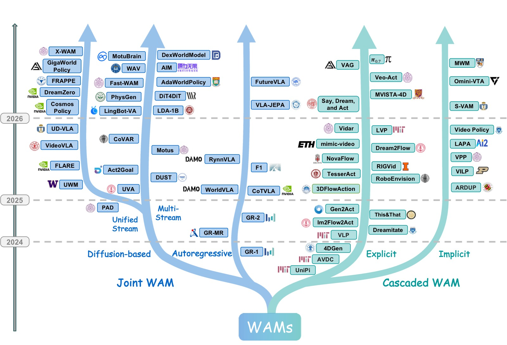
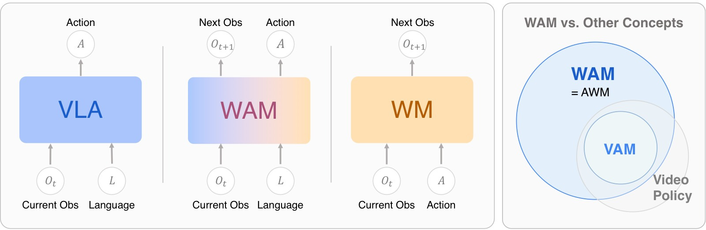
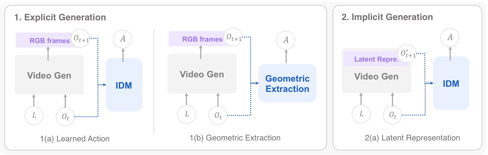
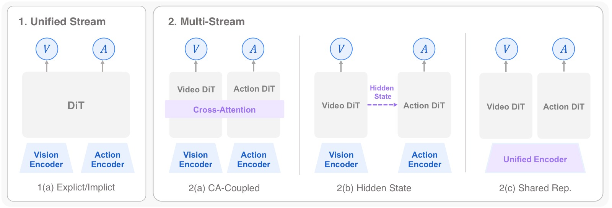
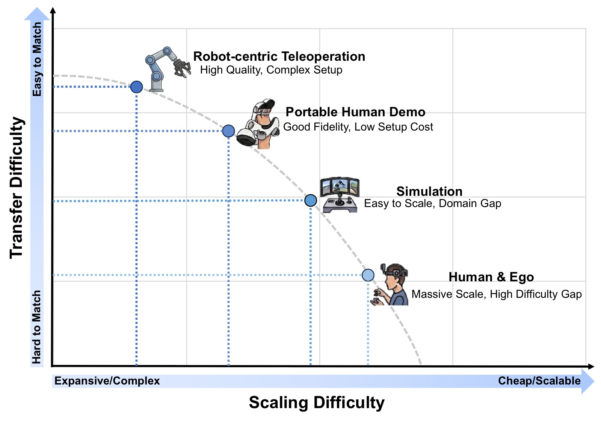
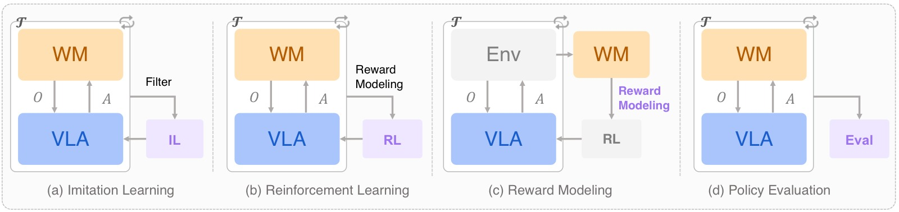

<!-- arxiv: 2605.12090 -->
<!-- venue: arXiv 综述 2026 -->
<!-- tags: WAM, 世界模型, VLA, 视频生成 -->

# World Action Models: The Next Frontier in Embodied AI

> **论文信息**
> - 作者：Siyin Wang, Junhao Shi, Zhaoyang Fu, Xinzhe He, Feihong Liu, Chenchen Yang, Yikang Zhou, Zhaoye Fei, Jingjing Gong, Jinlan Fu, Mike Zheng Shou, Xuanjing Huang, Xipeng Qiu, Yu-Gang Jiang
> - 通讯作者：Yu-Gang Jiang（复旦大学）
> - 投稿方向：技术报告 / 综述（arXiv）
> - arXiv ID：2605.12090
> - 项目主页：https://openmoss.github.io/Awesome-WAM
> - 代码：https://github.com/OpenMOSS/Awesome-WAM

---

## 一、核心问题

当前 Vision-Language-Action (VLA) 模型（如 RT-2、OpenVLA、π₀）在具身策略学习中取得了很强的语义泛化能力，但它们学习的是**反应式的 observation→action 映射**，没有显式建模物理世界在干预下如何演化。这导致模型缺乏预测性物理推理能力，在需要预判未来状态的场景（如接触丰富的操作、长时序任务）中泛化受限。

越来越多的工作开始在策略管线中集成世界模型（World Model），通过预测环境动力学为 agent 提供物理"远见"。然而文献在架构、学习目标和应用场景上高度碎片化，缺乏统一的概念框架。

本文首次对这一新兴范式进行系统化梳理，将其正式命名为 **World Action Models (WAMs)**——统一预测性状态建模与动作生成的具身基础模型，目标是对未来状态和动作的联合分布建模，而非仅预测动作。

---

## 二、核心思路 / 方法

*图1：WAM 代表性工作的时间演进与分类全景图。左分支展示了 **Joint WAM** 架构的演进轨迹——将世界预测与动作生成紧密耦合，分为**自回归（Autoregressive）**和**扩散式（Diffusion-based）**两条技术路线，其中扩散式进一步分叉为 Unified Stream（Uni. Stream）和 Multi-Stream 两种 backbone 设计。右分支总结了 **Cascaded WAM** 管线的发展——世界建模和动作执行解耦，沿**显式（Explicit）**和**隐式（Implicit）**两条表示对齐轨迹演进。底部时间轴从 2023 年底延伸至 2025 年中，清晰展示了该领域不到两年内的爆发式增长：从 2023 年底 GR-1、UniPi 等早期探索，到 2024 年 VPP、CoT-VLA、PAD、UWM 等多样化架构涌现，再到 2025 年 DreamZero、Motus、Cosmos Policy、FLARE、Fast-WAM 等大规模系统级工作。这些结构策略代表了领域在架构耦合方面的主要探索方向，而非严格的序列替代关系。*

### 2.1 形式化定义

WAM 必须满足两个核心标准：

1. **前向预测建模**：模型必须预测环境的物理演化，生成或利用未来状态 $o'$ 的可量化表征（可以是像素级视频帧、密集光流，或物理 grounded 的潜空间）。
2. **耦合动作生成**：动作命令 $a$ 必须严格对齐于预期的未来状态 $o'$，体现为联合概率输出或潜架构中的策略条件。

形式化目标：

$$\mathcal{L}_{\text{WAM}} = \mathbb{E}_{(o, l, o', a) \sim \mathcal{D}} \left[-\log p(o', a \mid o, l)\right]$$

*图2：WAM 的概念定义及与相关范式的对比。左半部分对比了 VLA、WAM 和标准 World Model (WM) 的输入-输出公式，突出 WAM 的核心能力——联合预测动作和未来观测。VLA 仅建模 $p(a \mid o, l)$（当前→动作），WM 建模 $p(o' \mid o, a)$（状态+动作→未来），而 WAM 建模 $p(o', a \mid o, l)$（当前+指令→未来+动作）。右半部分展示了 WAM 与 Video Action Models (VAMs) 和 Video Policies 的概念范围关系。关键区分在于：VAM 与视频格式绑定，是 WAM 的子集；Video Policies 仅继承视频模型的结构化先验但不一定做前向预测；WAM 是模态无关的，可以基于视频、点云、触觉等多模态进行状态预测。*

### 2.2 概念辨析

本文在三个维度上区分了 WAM 与易混淆概念：

| 概念 | 核心区别 |
|------|---------|
| **VLA** | VLA 学习 $p(a \mid o, l)$，不做前向状态预测；WAM 要求显式建模 $o'$ |
| **Video Action Models (VAMs)** | VAM 是 WAM 的子集（限定视频模态），WAM 模态无关 |
| **Video Policies** | Video Policies 利用视频生成 backbone 的时空表征，但可以不做前向预测；WAM 必须有预测性承诺 |
| **Action World Models (AWM)** | 早期文献的命名，WAM 命名将系统重新定位为"Agent"（而非增强的 Simulator），强调 World 和 Action 是并列组件 |

### 2.3 架构分类

本文将 WAM 架构分为两大范式：

**（1）Cascaded WAM（级联式）**

显式分解为两阶段：$p(o', a \mid o, l) = p(a \mid o', o, l) p(o' \mid o, l)$

- 世界模型先合成未来视觉计划 → 动作模型从中解码机器人指令
- 优势：自然解耦（世界模型不需理解运动学，动作模型不需做长时预测）
- 劣势：两阶段的耦合引入延迟和误差传播
- 按中间计划载体分为：显式规划（像素空间）、隐式规划（潜表征）

**（2）Joint WAM（联合式）**

单一模型同时预测未来状态和动作，世界建模与动作生成在统一目标下联合训练：

- 按生成方式分为：自回归生成（Autoregressive）、扩散式生成（Diffusion-based）
- 扩散式可进一步分为：Unified Stream（单流）、Multi-Stream（多流——Cross-Attention 耦合、Hidden-State 耦合、Shared Representation）

### 2.4 数据生态系统

WAM 的独特优势在于**统一数据消化能力**：既能利用高质量的 $(o_t, a_t, o_{t+1})$ 三元组进行紧密耦合，又能在架构上灵活消化海量**非配对**数据（如无动作标注的视频用于学习视觉物理）。

四大数据来源：
1. **机器人遥操作数据**：精确的运动学 ground truth，zero sim-to-real gap
2. **便携式人类演示数据（UMI 风格）**：低成本、野外环境，桥接人类灵巧性与真实交互
3. **仿真数据**：无限程序性变化、特权空间监督
4. **人类和以自我为中心的视频数据**：近乎无限的真实世界物理先验

---

## 三、架构详解

### 3.1 Cascaded WAM

*图3：级联式 WAM 的三种结构模式。**1(a) Learned Action**：世界模型生成像素空间的未来计划，由学习到的逆动力学模型（IDM）或动作模型映射为动作（代表工作：UniPi、VLP、Gen2Act、π₀.₇ 等）。**1(b) Geometric Extraction**：显式视觉计划通过光流计算或姿态跟踪等几何方式转换为动作（代表工作：AVDC、NovaFlow、Dreamitate 等），特点是无需动作标注训练。**2(a) Latent Representation**：中间计划载体为潜表征而非 RGB 帧，下游动作模型从中解码指令（代表工作：VPP、mimic-video、S-VAM 等），避免了像素级合成的计算开销。三种模式的核心权衡是：像素空间（可解释性强但计算量大）→ 几何提取（无需学习但依赖结构化表示）→ 潜表征（高效但可解释性弱）。*

#### 3.1.1 显式规划（像素空间）

**Learned Action Extraction 类方法对比**：

| 方法 | Stage-1 Backbone | Stage-2 | 关键创新 |
|------|-----------------|---------|---------|
| UniPi | Video U-Net | CNN+MLP IDM | 奠基性两阶段蓝图 |
| VLP | Video U-Net + PaLM-E 12B | LAVA | VLM 做层次化子动作生成+树搜索 |
| π₀.₇ | BAGEL | 预训练 VLA | 用 VLA 替代 IDM，上下文学习泛化 |
| Gen2Act | VideoPoet（零样本） | 闭环神经策略 | 零样本泛化，无需微调 |
| Veo-Act | Veo-3 | Multi-head IDM + VLA | 门控机制：粗导航+接触阶段切换 VLA |

**Geometric Extraction 类方法对比**：

| 方法 | 中间表示 | 关键特点 |
|------|---------|---------|
| AVDC | 像素 RGB → 光流 | 完全不需动作标注 |
| NovaFlow | 3D 物体级光流 | 零训练，即插即用 |
| Dreamitate | 工具 6-DoF 姿态 | 通过工具的位姿跟踪桥接人-机器人 |
| 4DGen | RGB-D + 4D 点图 | 多视角一致的生成 |
| LVP | 3D 手势重建 | Diffusion Forcing 提升时序一致性 |

#### 3.1.2 隐式规划（潜表征）

- **VPP**：首个达到实时控制的隐式规划方案，VAE 编码→扩散预测未来潜序列→轻量策略网络
- **S-VAM**：通过自蒸馏弥合单步推理与多步精度的 gap，QFormer 风格感知器聚合特征
- **mimic-video**：流匹配替代 DDPM + 部分去噪策略
- **LAPA**：无监督潜在动作预训练，VQ-VAE 从无标签视频学习"状态-潜在动作"先验
- **MWM**：用未来语义掩码潜变量替代 RGB 预测，对极端视觉偏移鲁棒
- **OmniVTA**：将隐式规划扩展到视觉-触觉领域

### 3.2 Joint WAM

*图4：扩散式 Joint WAM 的四种架构模式。**1(a) Unified Stream 显式预测**：World 和 Action 变量统一在单个 DiT 中联合去噪，未来帧或潜替代物为直接预测目标（代表：PAD、DreamZero、Cosmos Policy、UWM）。**1(b) Unified Stream 隐式预测**：通过学习到的未来 token 在潜空间中对齐未来观测的嵌入，而非生成未来帧（代表：FLARE、FRAPPE）。**2(a) Multi-Stream Cross-Attention 耦合**：Video DiT 和 Action DiT 两路分支通过显式交叉注意力交换信息（代表：CoVAR、Motus、LingBot-VA）。**2(b) Multi-Stream Hidden-State 耦合**：Video 分支的中间隐状态传递给 Action 分支作为条件信号（代表：DiT4DiT、Fast-WAM、Act2Goal）。**2(c) Multi-Stream Shared Representation**：视觉和动作首先通过统一编码器融合为共享潜表示，再分别解码（代表：UVA、PhysGen）。核心权衡：Unified Stream 保证最紧密的同步但计算重，Multi-Stream 模块化但需显式设计耦合接口。*

#### 3.2.1 自回归生成

分三个子范式：

**（a）Explicit Decoupled Representation**（显式解耦表示）

保持模态异构格式，通过注入控制 token（[ACT]、[OBS]）路由到独立输出头：
- **GR-1**：Transformer 预训练视频重建→微调联合解码未来图像块+连续动作
- **GR-2**：切换到 VQGAN 离散视觉 token + CVAE 动作分块
- **GR-MG**：引入 [PROG] token，宏观/微观步层次化解耦

**（b）Unified Discrete Representations**（统一离散表示）

完全量化到同构 token 空间，共享 next-token 预测头：
- **CoT-VLA**：因果注意力生成视觉 CoT → 全注意力同步预测动作
- **WorldVLA**：模态特定因果掩码，禁止当前动作 token 关注同块内的先前动作
- **RynnVLA-002**：离散 MLLM 主干 + 轻量连续 Action Transformer 头
- **F₁**：Mixture-of-Transformer，Generation expert 做预测，Action expert 做控制

**（c）Predictive Latent Representations**（预测性潜在表示）

- **VLA-JEPA**：连续潜在动作 token 条件化自回归世界模型，预测未来表征（冻结目标网络）。避免"像素匹配捷径"，优先语义抽象

#### 3.2.2 扩散式生成

**Unified Stream（单流）**：

| 方法 | Backbone | 关键设计 |
|------|---------|---------|
| PAD | ImageNet DiT | 多模态统一潜序列，动作填充+注意力掩码利用无动作视频 |
| UWM | Single DiT | World 和 Action 独立噪声调度，一个模型多种工作模式 |
| DreamZero | Wan2.1-14B | KV-cache 观测替换+异步执行+量化优化→~7Hz |
| Cosmos Policy | Cosmos-Predict2 | 潜帧注入：同时做策略、世界模型、价值函数 |
| FLARE | GR00T DiT | 可学习未来 token，对齐冻结教师编码器的未来嵌入 |
| FRAPPE | RDT-1B | Mixture-of-Prefix-and-LoRA 多专家对齐，阶段性训练 |

**Multi-Stream（多流）**：

| 耦合方式 | 代表方法 | 特点 |
|---------|---------|------|
| Cross-Attention | Motus (8B) | Wan2.2 + Qwen3-VL，三模态联合注意力（World+VLA+语义） |
| Cross-Attention | LingBot-VA | KV-cache 跨块累积，异步预测+执行 |
| Cross-Attention | DUST | World/Action 独立噪声时间步+独立流匹配损失 |
| Hidden-State | DiT4DiT | Hook 算子从 Video DiT 提取中间隐状态→Action DiT cross-attention |
| Hidden-State | Fast-WAM | 训练时保留 Video 分支做流匹配，推理时移除 |
| Hidden-State | Act2Goal | 多尺度时间哈希，HER 风格目标重新标记+在线 LoRA 微调 |
| Shared Repr. | UVA | 共享 Transformer 编码→两个轻量扩散头分别解码 |
| Shared Repr. | PhysGen | NOVA 自回归视频 backbone + Action-DiT 解码器 |

---

## 四、数据生态

*图5：具身数据全景图，按 Transfer Difficulty（Y 轴，从低到高表示从仿真到真实场景的迁移难度）和 Scaling Difficulty（X 轴，从低到高表示数据采集和扩展难度）两个维度组织。**右下角 Internet Videos**（如 Ego4D、HowTo100M）：扩展难度低（海量被动采集）、迁移难度高（无动作标注、领域 gap 大），用于学习被动世界动力学先验。**左下角 Simulation**（如 RoboCasa、MimicGen）：扩展难度中等、迁移难度中等，提供无限程序性变化和特权信息（深度、6D 姿态、碰撞边界）。**右上角 Robot Teleoperation**（如 OXE、DROID）：扩展难度高（成本高、需实验室环境）、迁移难度低（零 sim-to-real gap），提供精确的物理 grounding。**左上角 UMI-style**（如 FastUMI-100K、RealOmin）：便携式人类演示，兼具野外多样性和厘米级动作约束，扩展难度和迁移难度居中。WAM 的核心数据优势在于可混合这四类来源——利用非配对数据进行世界建模，配对数据进行动作 grounding。*

### 4.1 机器人遥操作数据

| 数据集 | 规模 | 关键贡献 |
|--------|------|---------|
| OXE | 1M+ 轨迹 / 22 机器人 | 统一多平台聚合标准 |
| ARIO | 3M+ 轨迹 / 35 机器人 | 迄今最大规模 |
| DROID | 76k 轨迹 / 564 场景 | 野外多样性 |
| AgiBot World | 1M+ 轨迹 | 多模态（RGB+D+触觉+本体感知） |

### 4.2 便携式人类演示（UMI 风格）

- **FastUMI-100K**：100K+ 轨迹，丰富多模态文本标注
- **RealOmin**：百万级，3000+ 真实家庭环境，含 IMU 和触觉
- **RDT2**：约 10,000 小时演示，100+ 场景

### 4.3 仿真数据

- **SynGrasp-1B**：1000 万抓取轨迹——反映 WAM 预训练的巨大数据需求
- **TesserAct**：285K RGB-D-N 视频片段，专门针对 4D 具身世界建模
- **RoboTwin 2.0**：100K+ 轨迹，高保真 3D 资产+照片级渲染

### 4.4 人类/自我中心数据

- **EgoScale**：20,854 小时，含本体感知地面真值
- **HumanNet**：100 万小时，720K+ 任务
- **DreamDojo-HV**：43,827 小时，6015 项活动
- **EgoDex**：829 小时，194 任务，高保真 3D 手指追踪

---

## 五、评估协议

*图6：世界模型在 VLA 的四个关键应用场景。**(a) Imitation Learning**：世界模型生成或筛选训练轨迹以增强模仿学习数据，如 Ctrl-World 使 π₀.₅ 成功率提升 44.7%。**(b) Reinforcement Learning**：世界模型作为替代环境进行想象 rollout，policy 在想象轨迹上训练。**(c) Reward Modeling**：从预训练生成世界模型中导出奖励信号（如 VIPER、Diffusion Reward、SRPO），或直接在世界模型中联合建模奖励（RoboScape-R）。**(d) Policy Evaluation**：世界模型作为数据驱动仿真器，支持可扩展、可复现、安全的策略评估。Veo Robotics 还利用生成式图像编辑合成 OOD 场景进行泛化测试和红队安全测试。*

### 5.1 世界建模能力评估

三个维度：

**（1）视觉保真度（Visual Fidelity）**

| 指标 | 评估内容 |
|------|---------|
| PSNR / SSIM | 像素级重建保真度和结构相似性 |
| LPIPS | 深度特征空间中的感知相似性 |
| DreamSim | 人类对齐的感知相似性（基于三元组标注训练） |
| DINO 相似度 | 语义/实例级对齐（余弦相似度） |
| FVD | 分布级真实感和时序质量（Fréchet 距离） |

**（2）物理常识（Physical Commonsense）**

- **VideoPhy**：固-固、固-液、液-液交互场景，人工二值标注物理合理性
- **PhyGenBench**：PhyGenEval 自动评估——关键物理现象检测、物理顺序验证、整体自然度
- **WorldModelBench**：五项物理定律检查：牛顿第一定律、质量守恒、流体力学、不可穿透性、重力
- **Physics-IQ**：从真实视频中预测物理事件演化的空间/时空 IoU

**（3）动作合理性（Action Plausibility）**——WAM 最独特的评估维度

- **WorldSimBench**：隐性操作评估——检查生成的视频是否保留足够信息支持控制推理
- **Wow, wo, val!**：IDM 图灵测试——在生成视频上应用 IDM 推断动作序列，以真实世界执行成功率评估。结果显示许多视觉逼真的模型在此测试下成功率接近零

### 5.2 动作策略评估

40+ 主流 benchmark 按机器人形态分类：

- **通用操作**：LIBERO (130 任务)、ManiSkill3 (10K+ 物体, 62 任务)、RoboCasa (2509 物体, 100 任务)
- **双臂与人形**：RoboTwin、HumanoidBench (27 任务, 448 触觉传感点)
- **移动操作**：BEHAVIOR-1K (1000 日常任务)
- **接触与变形物体操作**：SoftGym、TacSL/ManiFeel（引入触觉评估）
- **真实机器人**：Maniparena (10,812 轨迹，迄今最大规模)

---

## 六、关键洞察与技术亮点

1. **WAM 的命名哲学**：从 Action World Model (AWM) 改为 World Action Model (WAM)，将系统从"增强的仿真器"重新定位为"Agent"，强调 World（预测物理）和 Action（运动控制）是并列组件，直接将 WAM 定位为 VLA 的概念继承者。

2. **"先想再做"优于纯反应**：即使是只有 1 个 latent token 的 Latent CoT 也优于纯 Action-Only 基线（96.2% vs 95.0%），验证了预测性推理本身就有正向收益——不仅仅是预测精度带来的好处。

3. **预测监督在推理时可丢弃**：某些 WAM 中世界建模的主要效用来自训练时提供的辅助梯度，而非推理时生成未来帧。多个框架证明在测试时移除未来预测头不会降低控制性能——这暗示了一条计算高效的新路径（潜预测而非显式像素重建）。

4. **无动作视频数据的利用**：WAM 的架构灵活性使其能消化海量无动作标注的互联网视频进行世界建模，同时用少量配对数据做动作 grounding，大幅扩展了数据基础。

5. **光流/几何提取作为免学习替代方案**：AVDC、NovaFlow 等方法完全不需要动作标注即可提取动作，将策略学习问题转化为几何计算问题。

6. **IDM 图灵测试揭示的 gap**：Wow, wo, val! 的实验表明视觉逼真的视频生成与可执行的机器人行为之间存在巨大鸿沟——这是当前评估体系的核心盲区。

7. **数据混合设计的层次化框架**：提出将非机器人数据的价值按可迁移知识层级理解：(1) 低级物理先验（物体永存性、重力约束）、(2) 中级因果动力学（交互与物理结果的因果关系）、(3) 高级任务逻辑（任务相关的时间依赖）。

---

## 七、开放挑战

1. **架构耦合**：缺乏在匹配规模和评估条件下的系统化对比研究。显式视觉预测是否严格必要？级联与联合架构何时产生实质差异？需要严格的消融实验和理论分析。

2. **多模态物理状态表征**：现有 WAM 几乎全部预测 RGB 模态的未来状态，但接触丰富操作最关键的信息（触觉分布、接触力、声学信号、材料顺应性）在像素空间中不可见。需要扩展到触觉、力、本体感知的联合预测。

3. **数据利用与混合设计**：各数据源的边际贡献如何随规模变化？人类视频预训练的收益是语义性的还是动力学性的？需要从经验性超参数调优转向原则性信息论视角。

4. **长时规划与时序抽象**：需要层次化 World-Action 建模——连接高层语义任务分解和低层物理预测。三条互补路径：模块化层级、内建层次化 WAM、时序上下文扩展。

5. **推理延迟与计算效率**：DreamZero 通过系统优化将 WAM 推理推至 7Hz，但仍远低于非生成 VLA 策略的 50Hz 标准。提出"任务自适应预测保真度"概念——为不同任务动态调整预测深度和分辨率。

6. **评估方法论**：当前评估中世界建模和动作生成严重脱钩——PSNR/FVD 无法捕捉物理正确性，任务成功率不反映视觉预测质量。提出 Counterfactual Consistency（反事实一致性）和 Foresight-Conditioned Success（远见条件成功率）等耦合指标。

7. **安全性与可靠物理部署**：WAM 的预测能力既是优势也是风险——错误想象物理未来可能导致难以中断的延展动作序列。提出 prediction-integrated safety——将想象未来的不确定性估计作为安全监控的一等输入。

---

## 八、关键概念速查

| 术语 | 简要定义 |
|------|---------|
| **VLA** | Vision-Language-Action：学习 $p(a \mid o, l)$ 的具身基础模型 |
| **WM** | World Model：预测环境动力学的模型 $p(o' \mid o, a)$ |
| **WAM** | World Action Model：联合预测未来状态和动作 $p(o', a \mid o, l)$ |
| **Cascaded WAM** | 级联式：$p(a \mid o', o, l) p(o' \mid o, l)$，先预测未来再解码动作 |
| **Joint WAM** | 联合式：单一模型同时输出未来状态和动作 |
| **Explicit Planning** | 像素空间的中间计划载体 |
| **Implicit Planning** | 潜表征作为中间计划载体 |
| **Unified Stream** | 单 DiT 统一处理 World 和 Action |
| **Multi-Stream** | 多个 DiT 分支通过 Cross-Attention / Hidden-State / Shared Repr. 耦合 |
| **IDM** | Inverse Dynamics Model：从视频帧对回归动作 |
| **UMI** | Universal Manipulation Interface：便携式手持夹爪数据采集范式 |
| **JEPA** | Joint-Embedding Predictive Architecture：在潜空间做预测而非像素重建 |
| **FVD** | Fréchet Video Distance：视频生成的分布级质量指标 |
| **RSSM / TSSM** | Recurrent / Transformer State-Space Model：潜动力学建模架构 |
