<!-- arxiv: 2605.24642 -->
<!-- venue: ECCV 2026（投稿中） -->
<!-- tags: VLA, 3D重建 -->

# Understanding the Impact of Geometric Foundation Models on Vision-Language-Action Models

> **论文信息**
> - 作者：Yurou Yang, Muyuan Lin, Roberto Martin-Martin, Martin Labrie, Shreekant Gayaka, Cheng-Hao Kuo, Luca Carlone
> - 通讯作者：Luca Carlone（MIT）
> - 机构：Amazon Personal Robotics Group, UT Austin, MIT
> - arXiv ID：2605.24642
> - 代码：未公开（论文提及将在接收后开源）
> - 投稿方向：ECCV（使用 llncs 模板 + eccvabbrv.sty）

---

## 一、核心问题

Vision-Language-Action 模型（VLA）在机器人操控中取得了显著成功，但一个关键瓶颈在于：**VLA 内部 VLM 的几何/空间理解能力很弱**。VLM 在处理"红色杯子和蓝色杯子的距离"这类空间查询时并不可靠。

与此同时，计算机视觉领域出现了**几何基础模型**（Geometric Foundation Models, GFM）——如 VGGT、DUSt3R、Dens3R 等——它们能通过单次前向传播从多张图片中直接预测相机位姿、深度图和稠密点云。

近期有一系列工作将 GFM 引入 VLA（Evo-0 VLA、GeoAware-VLA、VO-DP、VGGT-DP、FALCON、Spatial Forcing），但它们存在三个问题：

1. **缺乏量化证据**证明 VLA 确实缺少几何理解（只有定性 observations）
2. **架构比较不公**：每种方法使用不同 VLA + 不同 GFM + 不同训练方案，无法公平对比
3. **外部因素影响不明**：相机数量、训练数据量、GFM 重建质量等因素对最终性能的影响未被系统研究

本文选择 **GR00T-N1.5**（VLA）+ **VGGT**（GFM）这一特定组合，进行严格的实验分析来回答上述三个问题。

---

## 二、核心思路 / 方法

### 2.1 三种几何注入策略

研究识别并统一了三种将 GFM token 注入 VLA 的策略：

**标准 VLA 架构（图1a）**：
```
  图像 I ──→ [Vision Encoder] ──→ Mᵥₑ ──→ [LLM] ──→ Mᵥₗ ──→ [Action Expert] ──→ a₀:ₜ
  指令 L ──→ [Text Tokenizer] ──→ Mₗₑ ──┤                          ├── Mₗₗ ──→
  状态 R ──→ [State Encoder]  ──→ M_R ──────────────────────────────┘
```
视觉 token Mᵥₑ 和语言 token Mₗₑ 经过 LLM backbone 处理后，产生 Mᵥₗ 和 Mₗₗ，与机器人状态 token M_R 一起送入 Action Expert（基于 Diffusion Policy），输出未来 T 步动作序列 a₀:ₜ。

**Early Fusion（图1b）**：
VGGT 处理相同图像，产生几何 token M_G。将视觉 token Mᵥₑ 与几何 token M_G 通过 cross-attention fusion 融合成 token `fuse(Mᵥₑ, M_G)`，送入 LLM（替代原始视觉 token）。**直觉**：将 GFM 视为额外编码器，从输入端注入几何信息。

**Late Fusion（图1c）**：
VGGT 处理图像产生 M_G。将 LLM 输出的视觉 token Mᵥₗ 与 M_G 通过 cross-attention 融合成 token `fuse(Mᵥₗ, M_G)`，送入 Action Expert。**直觉**：在决策端用几何信息增强 VLM 输出。

**Spatial Forcing（图1d）**：
架构不变。训练时添加 alignment loss，鼓励 LLM 内部 token 与 VGGT token 对齐（通过 cosine similarity）。**直觉**：通过训练信号强迫 VLM 保留几何信息。

<table>
<tr>
<td width="50%">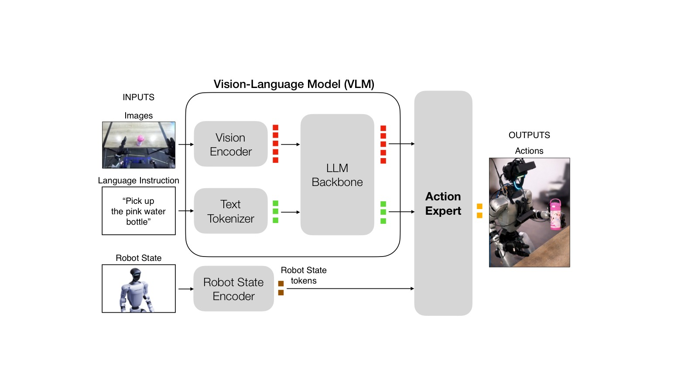<br><em>(a) Standard VLA</em></td>
<td width="50%">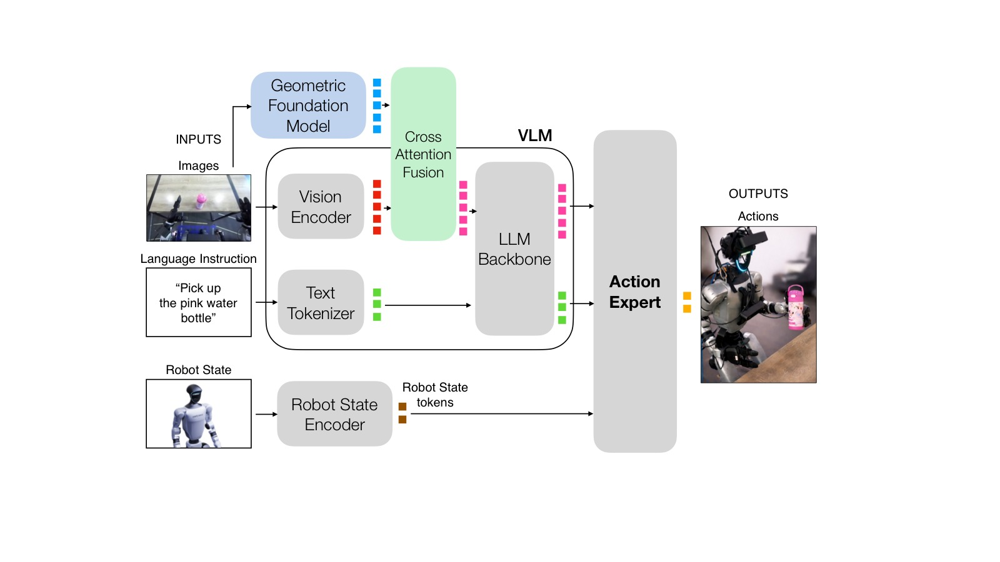<br><em>(b) Early Fusion</em></td>
</tr>
<tr>
<td width="50%">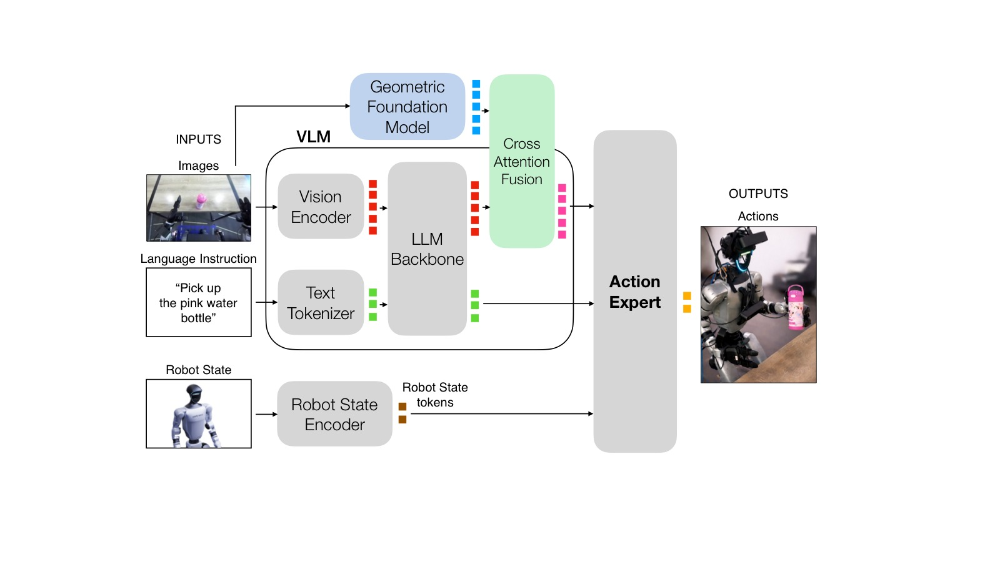<br><em>(c) Late Fusion</em></td>
<td width="50%">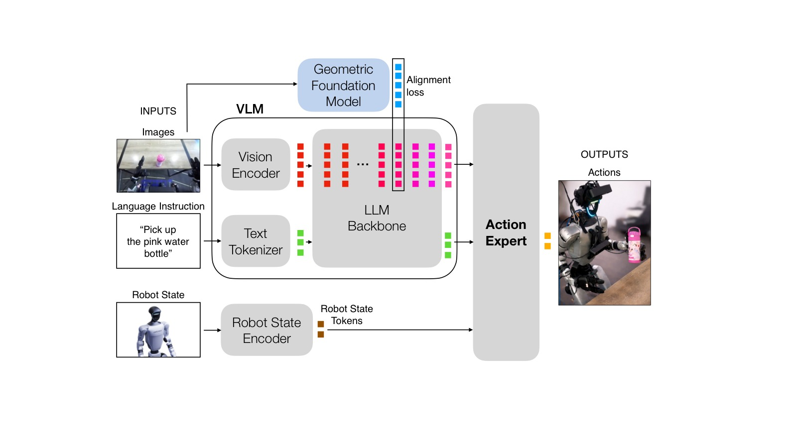<br><em>(d) Spatial Forcing</em></td>
</tr>
</table>

*图1：四种 VLA 架构对比（论文核心贡献之一：统一三种几何注入策略并于同一基座公平对比）。所有变体共享相同输入：多视图图像 I、语言指令 L、机器人状态 R。绿色模块表示训练时更新参数，灰色模块表示冻结。*

**子图 (a) Standard VLA（GR00T-N1.5）：**
这是参考基线。数据流为：图像 I 经 Vision Encoder（冻结）产生视觉 token M_V_e；语言指令 L 经 Text Tokenizer 产生语言 token M_L_e；二者送入 LLM backbone（冻结）产生 M_V_l 和 M_L_l；最后与机器人状态 token M_R 一起送入 Action Expert（Diffusion Transformer，训练时更新）。整个流程中没有任何显式 3D 信息——所有空间理解必须隐式编码在 Vision Encoder 的特征中。这解释了为什么后续线性探针实验中 baseline 的深度预测 RMSE 高达 0.73m。

**子图 (b) Early Fusion：**
VGGT 作为额外的几何编码器处理相同输入图像，产生几何 token M_G。关键设计：M_G 在 LLM 之前与 M_V_e 通过 Cross-Attention Fusion 模块融合，融合结果替代原始 M_V_e 送入 LLM。LLM 保持冻结，但被赋予了"几何增强的视觉 token"。直觉：把 GFM 当成第二个视觉编码器，让 VLM 在语义推理阶段就能利用几何信息。训练时只更新 Fusion 模块和 Action Expert。此策略被 Evo-0 VLA 等早期工作采用，但本文首次系统评估。

**子图 (c) Late Fusion：**
与 Early Fusion 形成对照。VGGT token M_G 在 LLM 输出端与 M_V_l 融合，仅影响 Action Expert 的输入。直觉：在决策端才注入几何信息，VLM 本身不接触 GFM token。训练时同样只更新 Fusion 模块和 Action Expert。此策略类似于 FALCON 的设计，但简化了架构。关键问题：Action Expert 是否有足够的灵活性来利用额外几何信息？实验结果显示它不如 VLM 灵活。

**子图 (d) Spatial Forcing（Li et al.）：**
架构完全不变。唯一区别：训练时在 LLM 第 9 层（共 13 层，约 70% 深度处）对 LLM 内部 token 与 VGGT token 施加 alignment loss（cosine similarity），迫使 VLM 内部表征编码几何结构。直觉：不改变推理时的数据流，而是通过训练信号"教"VLM 关注几何信息。此方法原基于 OpenVLA + π₀，本文将其适配到 GR00T-N1.5 以确保公平对比。训练时只更新 vision→LLM 的投影层（附录中尝试微调 LLM 反而更差——更多参数导致过拟合）。*

### 2.2 Cross-Attention Fusion 模块

对于 Early 和 Late Fusion，设计了统一的融合模块 `fuse(X, M_G)`：

1. **位置编码**：为 GR00T token 和 VGGT token 分别添加可学习的 2D/3D 位置编码，保留空间结构
2. **Cross-Attention**：以 GR00T token X 为 Query，VGGT token M_G 为 Key/Value，使用 LoRA（rank=8）参数化投影矩阵 W_Q, W_K, W_V, W_O
3. **Attention Gating**：融合结果为 residual correction 形式：

$$\tilde{X} = X + A \odot Z$$

其中 A 是 attention gate（可学习参数），初始化为接近零——这确保 VGGT token 被逐步引入，避免扰乱预训练 VLA 的分布。消融实验表明，去掉 gating 机制会导致成功率崩溃到 5-27%（见附录图 A.1）。

---

## 三、训练目标

### 3.1 Diffusion Policy 基础目标

动作序列通过加噪过程变为 a^k，Diffusion Policy v_θ 使用 flow-matching loss 学习去噪：

$$\mathbf{a}^k = \alpha_k\mathbf{a}_{0:T} + (1-\alpha_k)\boldsymbol{\epsilon}, \quad \boldsymbol{\epsilon} \sim \mathcal{N}(0, \mathbf{I})$$

$$\mathcal{L}_{\text{diff}} = \mathbb{E}_k\left[\|v_\theta(\mathbf{a}^k, \mathbf{T}, k) - (\boldsymbol{\epsilon} - \mathbf{a}_{0:T})\|_2^2\right]$$

动作通过 Euler 积分获得。

### 3.2 Spatial Forcing 对齐损失

Spatial Forcing 额外添加 alignment loss，对 LLM 第 9 层（共 13 层）的 token 与 VGGT token 计算 cosine similarity。

### 3.3 训练协议

- **Finetuning**：只训练 Action Expert（GR00T baseline）；对于 Early/Late Fusion，训练 fusion module + Action Expert，其余冻结；对于 Spatial Forcing，只训练 vision encoder → LLM 的投影层
- **Mid-training**：先用全部 8 个 RoboCasa 任务的数据训练 10 epoch，再 finetune 特定任务 50 epoch
- 所有模型在 NVIDIA A100（320GB GPU Memory）上训练 100 epoch
- 微调耗时 2-3 天，mid-training 约 1 周
- 随机种子固定为 42，action expert 噪声固定为确定性

---

## 四、实验与结果

### 4.1 实验协议

**Benchmark**：
- **RoboCasa**：8 个 Pick-and-Place 任务（如 PnPCabToCounter），每任务 5 episodes × 15 trials = 600 次实验，使用 3 个相机（左、右、腕部）
- **LIBERO**：4 个子 benchmark（Spatial, Object, Long-10, 90），每任务 500 trials，使用 2 个相机（主相机 + 腕部）
- **Unitree G1 真机**：3 类物体（bottle, ball, box），每类 30 次测试 = 90 次实验

**评估指标**：成功率（Success Rate），配合 McNemar 双尾检验计算 p 值（p<0.05 视为显著）。

### 4.2 线性探针实验：量化"几何鸿沟"

在 NYU Depth V2（24,000 训练 / 645 验证）上训练线性探针，预测逐像素深度。

| 探针位置 | RMSE [m] ↓ | δ₁ ↑ |
|----------|-----------|------|
| GR00T - Vision Encoder | 0.92 | 0.51 |
| GR00T - VLM | 0.73 | 0.63 |
| **VGGT** | **0.41** | **0.89** |
| Early Fusion (VLM 输出) | 0.44 | 0.88 |
| Late Fusion (VLM 输出) | 0.45 | 0.87 |

**关键发现**：
- GR00T 的深度理解远弱于 VGGT——RMSE 几乎翻倍（0.73 vs 0.41）
- 深度信息在 Vision Encoder 之后就已经丢失（RMSE 0.92）
- **Even Early Fusion 能将深度性能恢复到接近 VGGT 水平**——这很反直觉，因为 VGGT token 被注入在 LLM 之前，而 LLM 被冻结。说明冻结的 LLM 仍有足够可塑性来利用新增的几何信息
- Late Fusion 也能保留几何信息（VGGT token 注入点靠近探针）

多子图探测定性结果见下图。

<table>
<tr>
<td width="49%">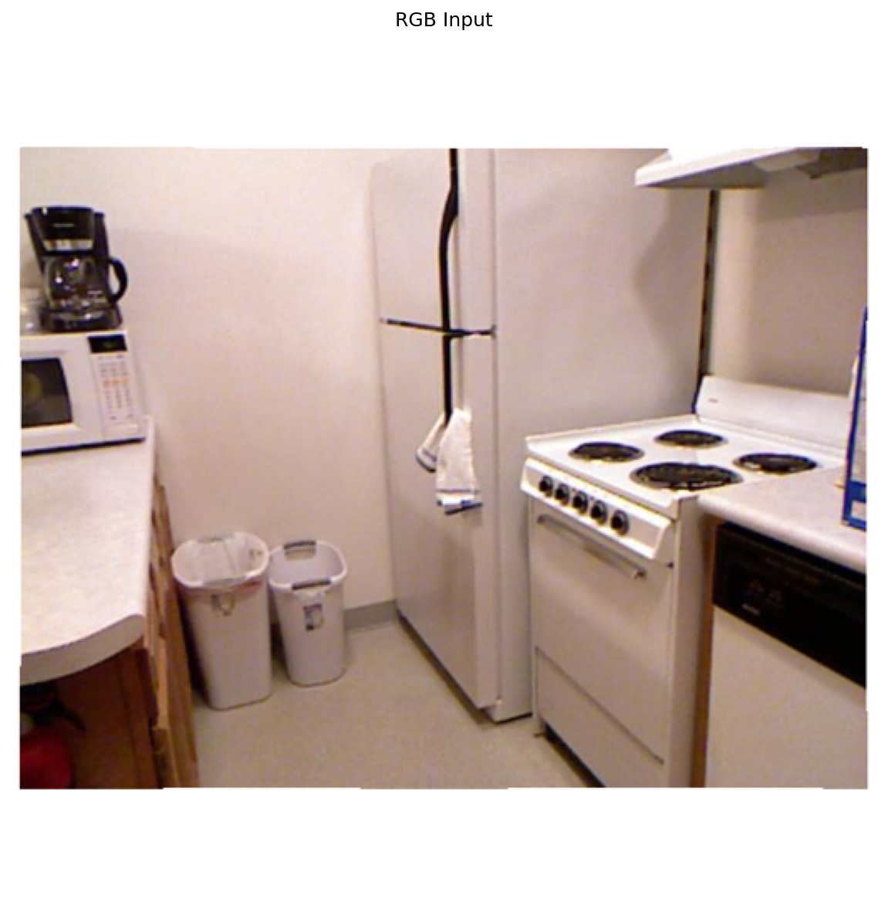<br><em>(a) RGB 输入</em></td>
<td width="49%">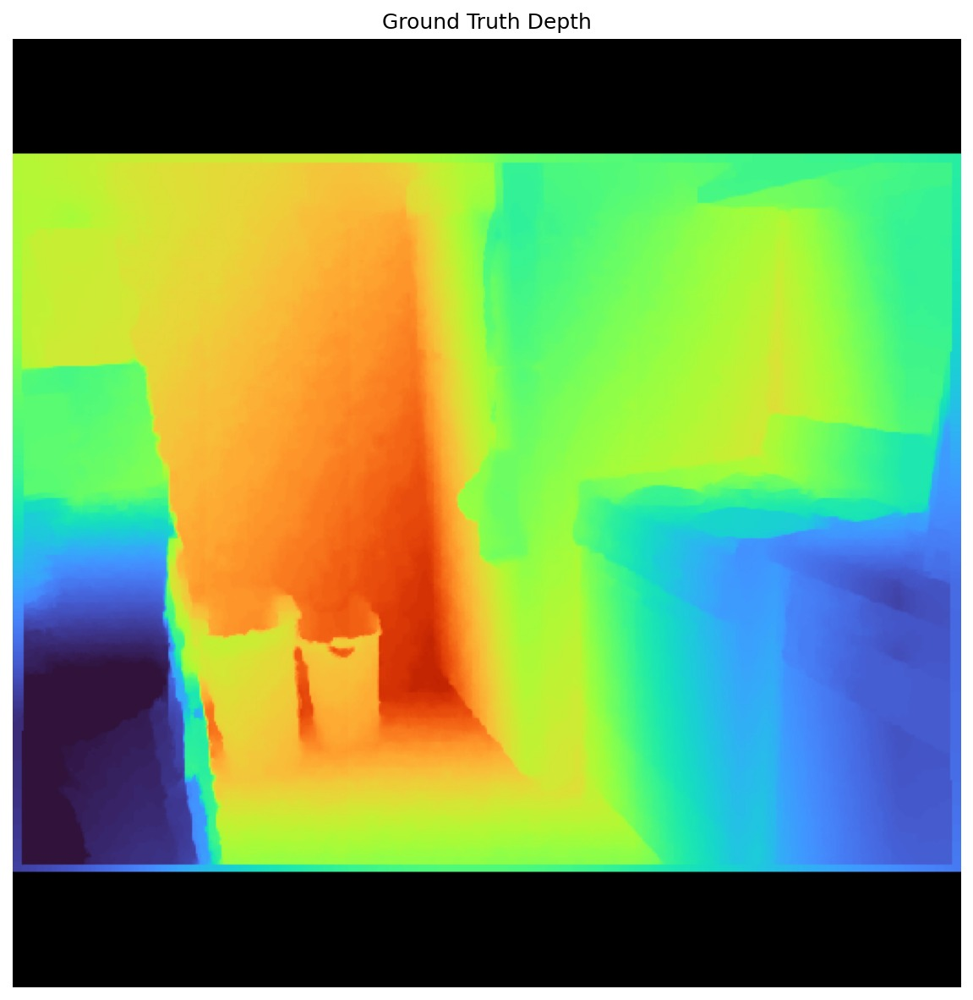<br><em>(b) 真值深度 GT</em></td>
</tr>
</table>

<table>
<tr>
<td width="20%">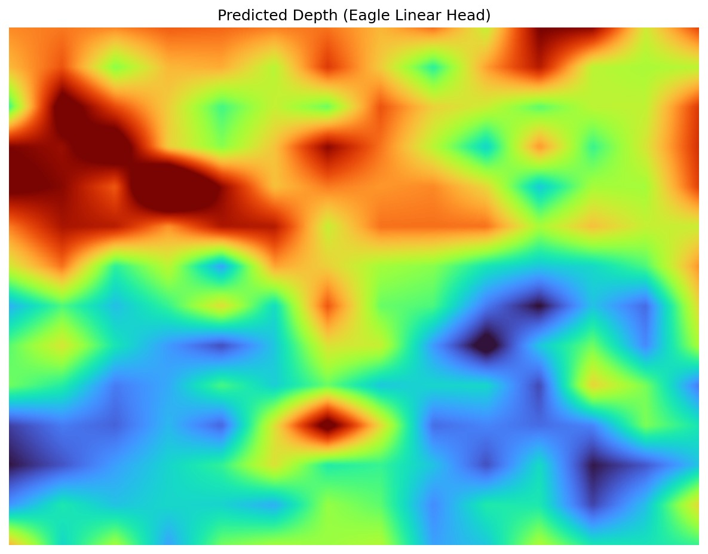<br><em>(c) Vision Encoder 探针</em></td>
<td width="20%">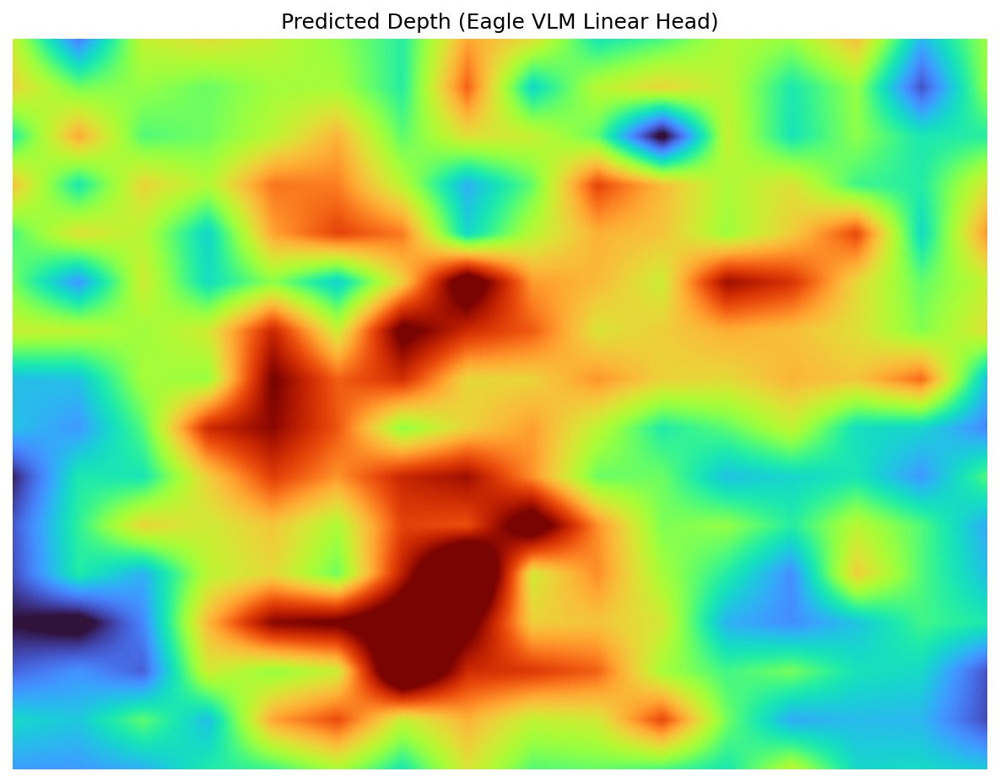<br><em>(d) VLM 探针</em></td>
<td width="20%">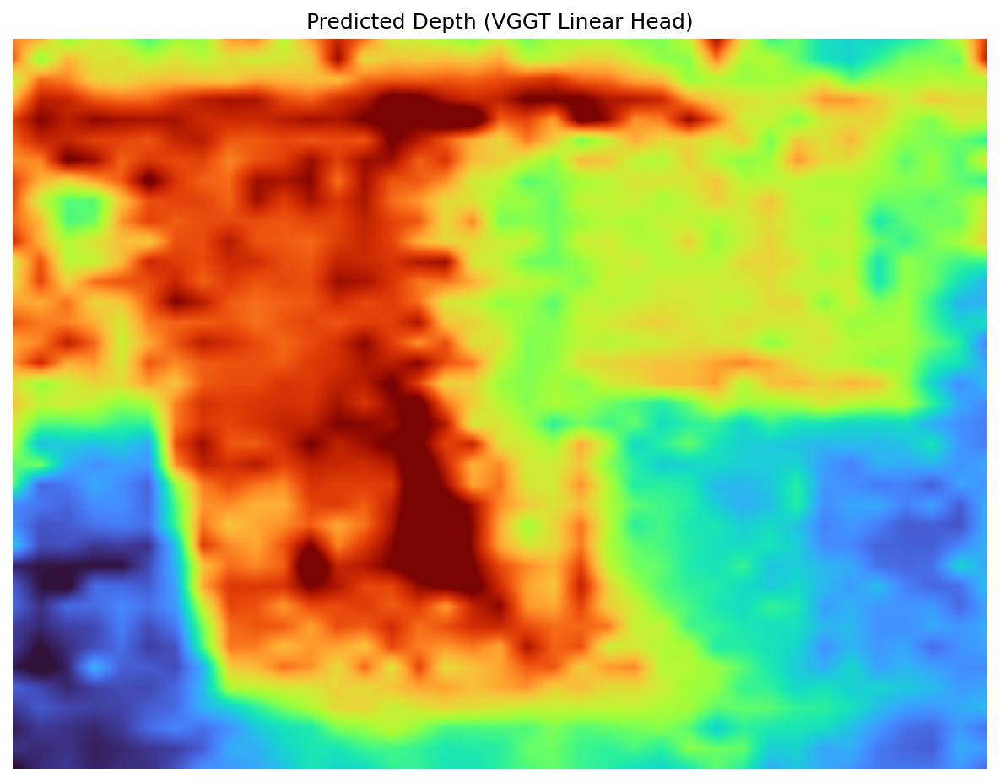<br><em>(e) VGGT 探针</em></td>
<td width="20%">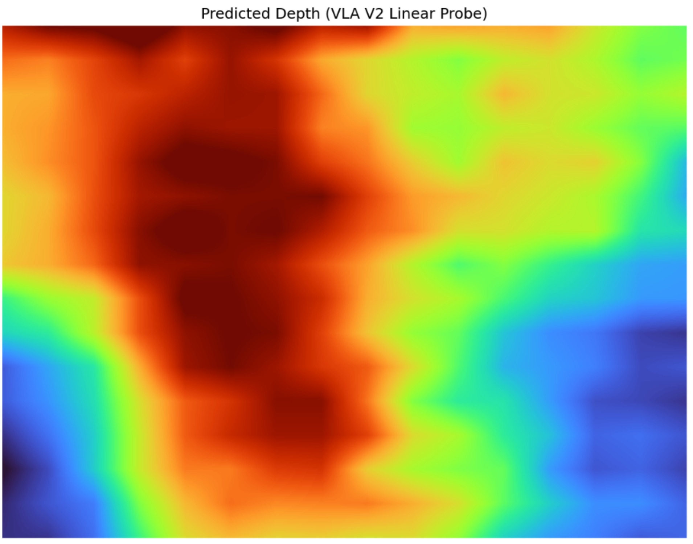<br><em>(f) Early Fusion 探针</em></td>
<td width="20%">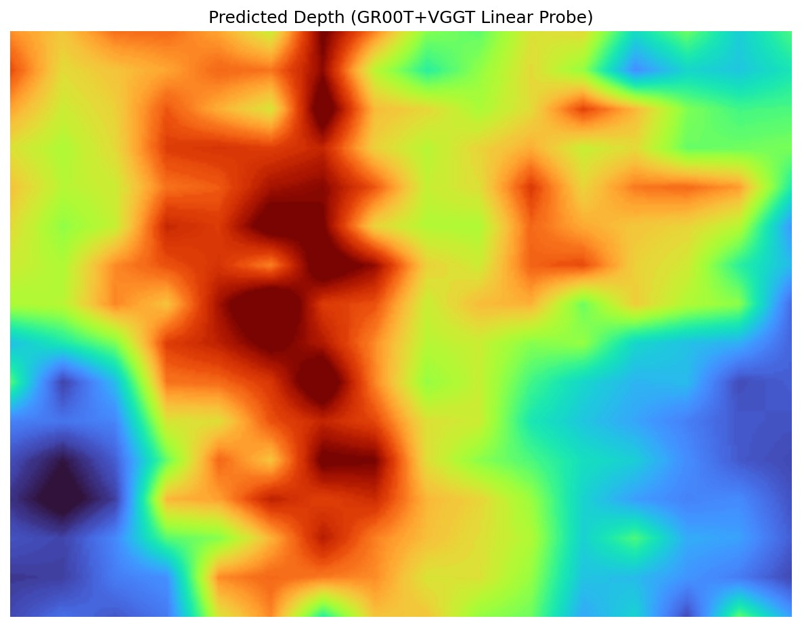<br><em>(g) Late Fusion 探针</em></td>
</tr>
</table>

*图2：线性探针深度预测的定性对比（NYU Depth V2 验证集样本，配合 Table 1 定量指标）。这是论文首次量化"几何鸿沟"的核心证据图。所有探针均为附加在冻结网络某层输出的线性 MLP，仅在 NYU Depth V2 的 24,000 张训练对上训练 10 epoch——因此预测质量直接反映该层包含的深度信息量。*

**子图 (a) RGB 输入**——厨房场景的原始 RGB 图像，包含桌椅、橱柜等常见室内物体。地面区域的深度应连续且渐近，物体边界应有清晰深度跳变。

**子图 (b) 真值深度 GT**——颜色编码：越亮表示越近（暖色=近，冷色=远）。地面从近到远呈现平滑的亮度渐变，物体轮廓处有清晰的深度断裂。

**子图 (c) Vision Encoder 探针（RMSE 0.92m, δ₁=0.51）**——深度预测几乎完全是模糊的，物体边界不可辨认，地面深度层次丢失。这证明 GR00T 的 Vision Encoder（DINOv2 类预训练）在设计上就压缩了空间信息——其目标是为语义理解产生特征，而非保留精确的逐像素几何。这是"几何鸿沟"的根源——深度信息在 VLA 的最前端就已经丢失，且 LLM 无法从语义特征中充分恢复它（注意：Vision Encoder 探针隐藏维度为 1024，低于 VLM/VGGT 探针的 2048，部分影响了其表现）。

**子图 (d) VLM 探针（RMSE 0.73m, δ₁=0.63）**——比 Vision Encoder 略有改善（部分因为探针容量更大），能隐约分辨桌椅轮廓，但整体仍远差于 VGGT。地面深度层次仍然模糊，物体边界的深度跳变不清晰。这确认了即使经过 LLM 的语义处理，几何信息也未得到本质恢复。

**子图 (e) VGGT 探针（RMSE 0.41m, δ₁=0.89）**——作为几何上界参考。清晰恢复桌椅轮廓和地面深度层次，物体边界有正确的深度跳变。但注意即使是 VGGT 的线性探针也带有噪声（相比 DPT 解码器的效果），因为线性 MLP 容量有限。δ₁=0.89 意味着 89% 的像素深度预测误差在 25% 以内。

**子图 (f) Early Fusion 探针（RMSE 0.44m, δ₁=0.88）**——注入 VGGT token 后，深度预测质量跃升至接近 VGGT 本身水平。这是论文最反直觉的发现：VGGT token 在 LLM 之前注入、LLM 保持冻结——但冻结的 LLM 仍能将几何信息有效传递到输出端。对比 (d) 和 (f) 可以直观看到几何鸿沟被填补的效果：桌椅轮廓从模糊变清晰，地面层次从平坦变立体。这说明预训练 LLM 有足够的"可塑性"来处理新的输入模态。

**子图 (g) Late Fusion 探针（RMSE 0.45m, δ₁=0.87）**——同样恢复了几何信息，性能接近 Early Fusion。这在意料之中，因为 VGGT token 注入点就在探针附近（LLM 输出端），attention gate 可以直接让 VGGT token 通过。但这个结果不能回答"LLM 是否利用了这些几何信息"——它只告诉我们几何信息到达了 LLM 输出端。*

**法向预测探针**也得到一致结论：VGGT 误差角中位数 33.86°，GR00T-VLM 44.15°，Early Fusion 恢复至 34.40°（附录 Table A.2）。

### 4.3 融合策略对比：RoboCasa

表中所有结果均含 McNemar p 值（vs GR00T-N1.5 baseline）。

| 方法 | CabToCtr | CtrToCab | CtrToMicrowave | CtrToSink | CtrToStove | MicrowaveToCtr | SinkToCtr | StoveToCtr | **平均** |
|------|----------|----------|----------------|-----------|------------|----------------|-----------|------------|---------|
| DP3 | 4.0 | 2.0 | 6.0 | 0.0 | 0.0 | 6.0 | 0.0 | 0.0 | 2.3 |
| π₀ | 28.0 | 18.0 | 36.0 | 70.0 | 36.0 | 22.0 | 16.0 | 44.0 | 33.8 |
| π₀-Fast | 30.0 | 48.0 | 20.0 | 56.0 | 64.0 | 46.0 | 62.0 | 60.0 | 48.3 |
| RS-CL | 60.0 | 68.0 | 40.0 | 68.0 | 72.0 | 48.0 | 68.0 | 54.0 | 59.0 |
| DP-VLA | 10.0 | 32.0 | 56.0 | 30.0 | 22.0 | 18.0 | 56.0 | 62.0 | 35.8 |
| GR00T N1 | 20.0 | 36.0 | 13.0 | 10.0 | 24.0 | 16.0 | 33.0 | 29.0 | 22.6 |
| Video Policy | 48.0 | 52.0 | 22.0 | 48.0 | 54.0 | 28.0 | 56.0 | 70.0 | 47.3 |
| **GR00T-N1.5** | 42.7 | **74.7** | 73.3 | **93.3** | 77.3 | 58.7 | 65.3 | 88.0 | **71.7** |
| Early Fusion | 32.0 | 69.3 | 65.3 | 88.0 | 73.3 | 62.7 | 80.0 | 86.7 | 69.7 (p=0.399) |
| Late Fusion | 46.7 | 72.0 | **74.7** | 85.3 | 69.3 | **69.3** | 69.3 | 81.3 | 71.0 (p=0.806) |
| Spatial Forcing | 29.3 | 68.0 | 66.7 | 76.0 | 72.0 | 60.0 | **84.0** | **90.7** | 68.3 (p=0.154) |
| **Early Fusion (mid-trained)** | **52.0** | 72.0 | 69.3 | **94.7** | **80.0** | 68.0 | **81.3** | 84.0 | **75.2** (p=0.104) |

**关键结论**：
- **Simple finetuning 时，几何 VLA 和 baseline 之间没有统计学显著差异**（所有 p > 0.05）。几何注入在仿真环境中直接微调不会带来明显增益
- 只有两个任务出现了显著差异（SinkToCtr: Early Fusion p=0.019, Spatial Forcing p=0.007），但这可能是统计波动
- **Mid-training 后**，Early Fusion 达到 75.2%（vs baseline 71.7%），p=0.104 虽仍不显著但明显更优——数据扩展是关键

### 4.4 融合策略对比：Unitree G1 真机

阶段分解成功率（Approach → Grasp → Lift → Placement → Overall）：

| 方法 | Approach | Grasp | Lift | Placement | Overall |
|------|----------|-------|------|-----------|---------|
| GR00T-N1.5 | 57.78% | 51.92% | 85.19% | **86.96%** | 22.22% |
| **Early Fusion** | **84.44%** (p<0.001) | **60.53%** | 89.13% | 65.85% | **27.78%** |
| Late Fusion | 57.78% | 59.62% | **93.55%** | 79.31% | 25.56% |

**真机关键发现**：
- Early Fusion 在 **Approach 阶段有统计显著的巨大提升**（84.44% vs 57.78%，p<0.001）
- 作者观察：Early Fusion 更可靠地抓取小物体（小球、小盒子），这恰是 baseline 的致命弱点
- Late Fusion 提升更温和，印证了"动作专家相对僵硬、不如 VLM 灵活"的假设
- 整体成功率虽有提升但不显著（p=0.511）——placement 阶段下降（物体靠近桌面边缘时掉落）抵消了前期优势

### 4.5 Libero 结果

| 方法 | Spatial | Object | Long-10 | 90 | **平均** |
|------|---------|--------|---------|-----|---------|
| GR00T-N1.5 | **96.7** | 95.3 | 78.0 | 81.8 | 87.9 |
| Early Fusion | 94.0 | 94.0 | 76.0 | 82.2 | 86.6 (p=0.138) |
| Late Fusion | 93.3 | **96.0** | 83.3 | **91.1** | 90.9 (p=0.561) |
| Spatial Forcing | 95.3 | **96.0** | **84.7** | 90.0 | **91.5** (p=0.295) |

与 RoboCasa 一致：**LIBERO 上 p 值均不显著**，性能差异无法与随机波动区分。

### 4.6 单相机实验

| 方法 | CabToCtr | CtrToCab | CtrToMicrowave | CtrToSink | CtrToStove | MicrowaveToCtr | SinkToCtr | StoveToCtr | **平均** |
|------|----------|----------|----------------|-----------|------------|----------------|-----------|------------|---------|
| GR00T-N1.5 | 12.0 | 8.0 | 33.3 | **28.0** | 13.3 | 12.0 | 26.7 | 4.0 | 17.2 |
| **Early Fusion** | 10.7 | **9.3** | **38.7** | 17.3 | **29.3** | **18.7** | **34.7** | **13.3** | **21.5** (p=0.030) |

单相机时整体性能大幅下降（确认多视图的重要性），但 **Early Fusion 的优势首次变得统计显著**（p=0.030）。这暗示：在传感器受限场景下，GFM 提供的几何信息更加关键——多相机时 VLA 可以通过多视图几何隐式推断深度，单相机时没了这个能力，GFM 的价值凸显。

### 4.7 VGGT 重建质量与成功率的关系

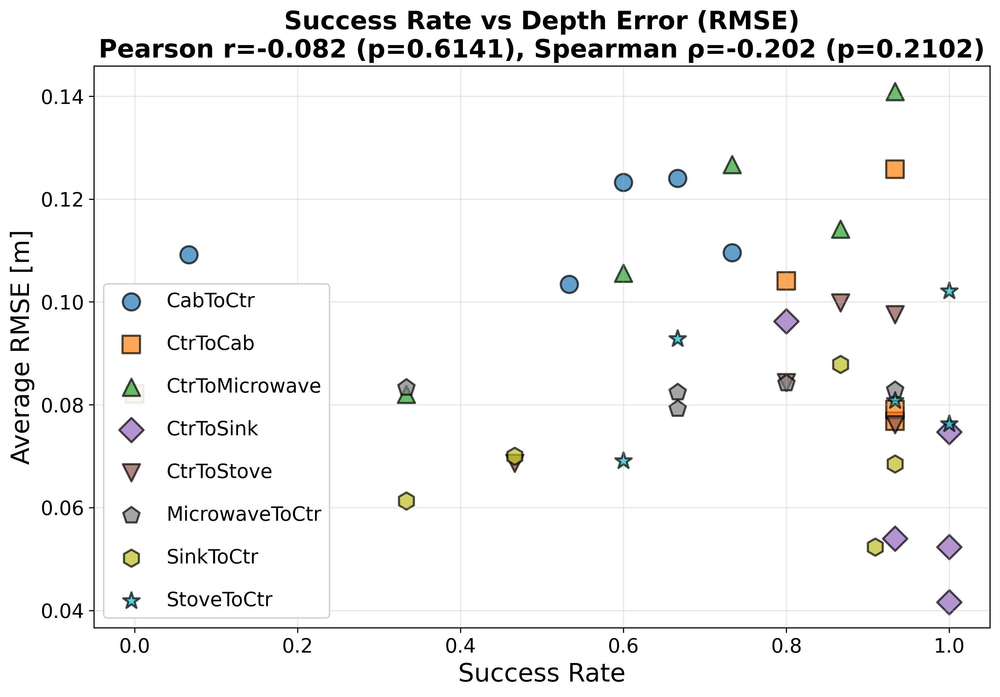

*图3：VGGT 重建质量与操控成功率的关系分析——回答"GFM 的精度是否影响下游操控"这一核心问题。*

**子图 (a) 深度 RMSE vs 成功率散点图：**
横轴为 VGGT 在该 episode 所有图像和相机上的平均深度 RMSE（米），纵轴为 Early Fusion 模型在该 episode 上的成功率（%）。每个点代表一个 RoboCasa episode（8 个任务 × 5 episodes = 共 40 个数据点），不同颜色/形状可能对应不同任务。整体散点分布较广，反映了任务难度、相机视角、物体类别等因素对成功率的巨大影响。

关键趋势：**右侧（低 RMSE）区域呈下降趋势，左侧（高 RMSE）区域较少高成功率的点**。具体而言，RMSE < 0.08m 的 episode 倾向于有更高的成功率，而 RMSE > 0.12m 的 episode 成功率普遍偏低。Spearman 秩相关系数 ρ = -0.202，确认了轻度但真实的负相关——即 VGGT 重建越准确（低 RMSE），操控成功率倾向于越高。ρ 值不大说明任务难度等因素造成的方差远大于 GFM 误差的影响。但这一相关性的存在暗示：**在目标环境中微调 VGGT 以降低深度误差，有可能进一步提升几何 VLA 的性能**——这为未来的工作提供了方向。

**子图 (b) 深度预测定性对比（PnPCabToCounter 任务示例）：**
这是一个 3×3 网格，展示 VGGT 在不同相机视角下的深度预测质量。**行**表示数据类型：第一行为 RGB 原始图像（左/腕/右三个相机），第二行为 VGGT 预测深度，第三行为仿真器提供的真值深度（GT）。**列**表示相机位置：左列=左侧固定相机（场景全景视角）、中列=腕部相机（靠近操作区域）、右列=右侧固定相机。颜色编码：越亮/橙=越近，越暗/紫=越远。

对比 VGGT 预测深度和 GT 深度可以发现：VGGT 在仿真场景（RoboCasa 使用 MuJoCo 渲染，分辨率较低）中仍能产生合理的深度估计——操作台、橱柜的相对远近关系正确，物体轮廓可辨。这验证了 VGGT 的强泛化能力（VGGT 在真实照片上训练，零样本迁移到仿真渲染图像仍有效）。但部分区域的深度细节与 GT 存在差异（如腕部相机的近景区域），说明仿真→真实的 domain gap 确实存在。*

**启示**：在目标环境中微调 VGGT 可能进一步提升几何 VLA 的性能。

### 4.8 Mid-training 对比（vs mid-trained baseline）

| 方法 | CabToCtr | CtrToCab | CtrToMicrowave | CtrToSink | CtrToStove | MicrowaveToCtr | SinkToCtr | StoveToCtr | **平均** |
|------|----------|----------|----------------|-----------|------------|----------------|-----------|------------|---------|
| GR00T (mid-trained) | 50.7 | **72.0** | **80.0** | **100.0** | **81.3** | 61.3 | 66.7 | 65.3 | 72.2 |
| Early Fusion (mid-trained) | **52.0** | **72.0** | 69.3 | 94.7 | 80.0 | **68.0** | **81.3** | **84.0** | **75.2** (p=0.168) |

即使都经过 mid-training，Early Fusion 仍优于 baseline，排除了"增益来自额外的训练数据而非 VGGT"的可能。

### 4.9 物体外观不变性测试

为测试几何信息的抗外观干扰能力，只随机化目标物体颜色（不变化场景其余部分）：

| 方法 | CabToCtr | CtrToCab | CtrToMicrowave | CtrToSink | CtrToStove | MicrowaveToCtr | SinkToCtr | StoveToCtr | **平均** |
|------|----------|----------|----------------|-----------|------------|----------------|-----------|------------|---------|
| GR00T (mid-trained) | 29.3 | **78.7** | **89.3** | 97.3 | 82.7 | **65.3** | 60.0 | **92.0** | 74.3 |
| Early Fusion (mid-trained) | **48.0** | 76.0 | 88.0 | **98.7** | **89.3** | 56.0 | **84.0** | 73.3 | **76.7** |

Early Fusion 保持优势，但外观变化并未对 baseline 造成特别挑战——Vision Encoder 已经在一定程度上对外观抽象化。

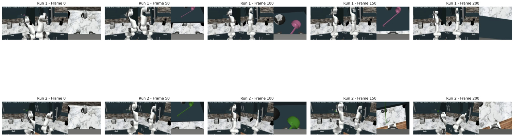

*附录图 A.X：RoboCasa 物体外观变化示例——测试 VLA 对外观（颜色）扰动的不变性。每个子块对应一个相机视角（左/腕/右），每行对应不同的时间步（t=0, 50, 100, 150）。上下两组分别展示同一物体的两种随机颜色（品红色 vs 绿色）。此实验只随机化目标物体颜色，场景其余部分保持不变——借此隔离"外观变化"的影响，验证几何 VLA 是否比纯外观特征更鲁棒。定量结果（Table A.3）显示 Early Fusion 和 baseline 的相对优势与原始设置一致，外观变化对两者的影响程度类似。*

### 4.10 消融实验：Attention Gate 与位置编码

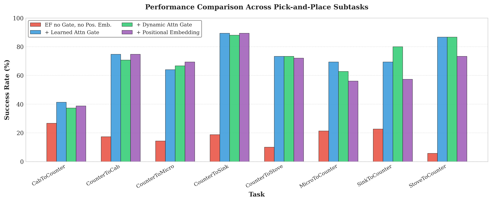

*图4：Early Fusion 融合模块消融实验（RoboCasa 全部 8 个任务），展示了论文发现的"Attention Gate 是 Early Fusion 有效性的关键"这一核心结论。*

**图表结构**：横轴为 4 个方法变体（从左到右逐步添加组件），纵轴为成功率（%）。每簇柱子代表一个 RoboCasa 任务（不同颜色），共 8 个任务 × 4 个变体 = 32 根柱子。

**蓝色（无 Gating + 无位置编码）**：纯 cross-attention 融合，无任何保护机制。所有任务的成功率崩溃至 5-27%，大多数集中在 10-20%。这个基线惨败的原因是：VGGT token 与 GR00T token 来自完全不同的特征空间，直接 cross-attention 的结果是一个强烈的"分布外"扰动——Action Expert 的预训练权重被彻底扰乱。这验证了"逐步引入几何信息"的必要性。

**橙色（+ Learned Attention Gate）**：添加可学习的 attention gate A（初始化为接近零），融合变为 $\tilde{X} = X + A \odot Z$。大多数任务性能跃升至 64-89%，平均提升 50-70 个百分点。Gate 作为一个可学习的"音量旋钮"——训练初期几何信息几乎为零（X ≈ X̃），VLA 行为等同 baseline；随着训练进行，gate 逐步增大，几何信息被平滑注入。这是论文最重要的工程贡献之一：一个简单的设计选择（gate + 零初始化）使得冻结 LLM 的 Early Fusion 成为可能。

**绿色（+ Dynamic Attention Gate）**：将静态 gate 替换为输入依赖的 gate $A = \sigma(X W_g + b_g)$。混合效果——某些任务略有改善，另一些反而下降。整体无一致增益，说明 Dynamic Gate 增加的参数量和灵活性没有带来额外价值，反而可能引入过拟合风险。论文因此选择较简单的静态 gate 作为最终设计。

**红色（+ Positional Encoding）**：在保留 Dynamic Gate 基础上添加 2D/3D 可学习位置编码。部分任务改善（CounterToCab: 约 +5%，CounterToMicrowave: 约 +8%），但 SinkToCounter 和 StoveToCounter 明显下降（约 -5% ~ -10%）。位置编码效果因任务而异——这暗示不同任务对 token 空间排列的敏感度不同：需要精确定位的任务（如将物体放入微波炉）可能受益于位置信息，而大范围移动任务中位置编码可能成为噪声。*

### 4.11 训练动态

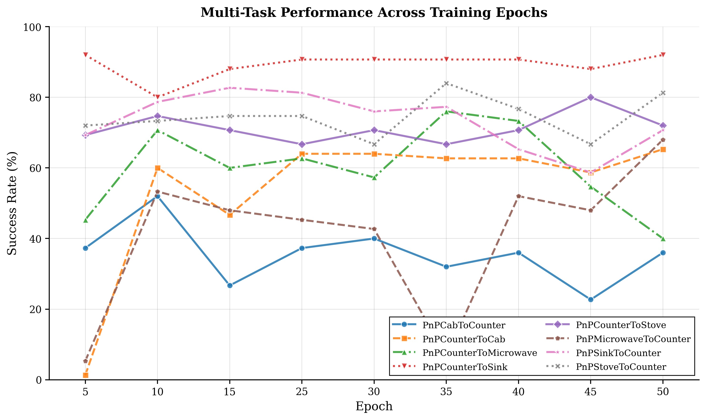

*图5：Early Fusion（mid-trained）在 RoboCasa 各任务上的逐 epoch 成功率曲线——揭示多任务视觉运动学习中任务间收敛速度的巨大差异和灾难性遗忘现象。*

**图表结构**：横轴为 finetuning epoch（1-50），纵轴为成功率（%）。8 条不同颜色的曲线分别对应 8 个 RoboCasa 任务。此实验在 mid-training（所有 8 任务预训练 10 epoch）后进行 50 epoch 的特定任务 finetuning。

**各任务收敛特性分析**：

- **PnPCounterToSink（最快的曲线）**：第 5 epoch 即达 92%，全程保持高且稳定的成功率。Sink→Counter 任务的操作空间开阔、目标位置大而明显（水槽），几何信息和语义信息都充足，是"最简单"的任务。

- **PnPCounterToCab（最慢的曲线）**：需要 50 epoch 才能达到 65.3% 的峰值。Cabinet 操作涉及狭窄空间内的精确放置，对深度估计的要求极高。65.3% 也是全部任务中最低的峰值之一。

- **PnPCounterToMicrowave（灾难性遗忘案例）**：第 35 epoch 达到峰值 76%，此后持续下降，到第 50 epoch 跌至约 40%——几乎腰斩。这是典型的多任务干扰现象：随着训练继续，模型参数向其他任务的平均方向漂移，丧失了微波炉任务的特殊能力。这说明固定学习率的统一训练协议对异质性操作任务不适用。

- **Cabinet 相关任务（CabToCtr, CtrToCab）**：两端（epoch 1 和 epoch 50）的成功率都在 52-65.3% 之间，远低于其他任务的 70-95% 区间。Cabinet 操作是 RoboCasa 的公认瓶颈——橱柜把手小、柜门有铰链约束、内部空间狭窄，三者叠加形成对 VLA 几何理解的最严峻考验。

**论文启示**：这些训练动态曲线说明多任务 finetuning 需要任务特定的训练调度（如自适应学习率、早停策略、分阶段训练）才能最大化各任务性能，一刀切的训练协议对几何 VLA 并不最优。*

### 4.12 Attention Mask 可视化

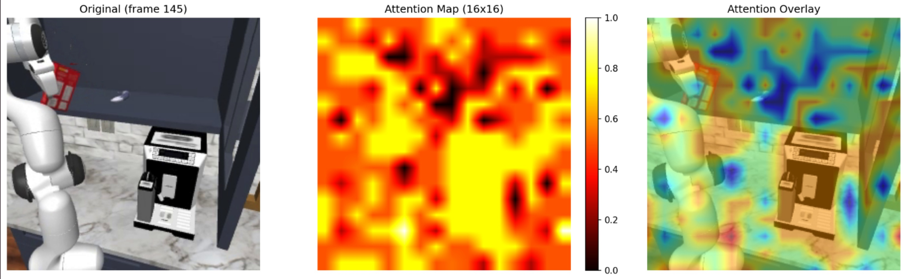

*图6：Early Fusion 中 Fusion 模块的 Cross-Attention Mask 可视化（RoboCasa 单帧样本）——揭示模型在融合 VGGT token 与 GR00T token 时"关注"了图像的哪些区域。*

**图表结构**：三栏从左到右分别为 (a) 原始 RGB 图像、(b) attention mask 热力图、(c) mask 叠加到原图的半透明效果。Mask 来自 cross-attention 计算中 GR00T token（Query）对 VGGT token（Key）的注意力权重，颜色编码：越亮/暖色=注意力权重越高，越暗/冷色=注意力权重越低。

**关键观察**：
- Mask 整体**噪声较大**，并非紧凑的物体 mask——这符合预期，因为 cross-attention 在 token 级别操作（而非 pixel 级别），每个 GR00T token 对应一个图像 patch，且 LoRA 投影压缩了维度。
- 高注意力值（暖色区域）**倾向于集中在机器人手臂和末端执行器（gripper）周围**——这正是操控任务中几何精度最关键的区域。模型学会了定位"需要精确深度的位置"。
- 在叠加视图（c）中可以看到，gripper 与物体接触的区域有最亮的注意力热点——暗示模型在这些位置优先从 VGGT token 中提取精细的 3D 信息来指导抓取动作。

**连接论文论点**：这张图直接支持了真机实验中"Early Fusion 在 Approach 阶段大幅优于 baseline（84.44% vs 57.78%）"的观察——模型确实在手臂和 gripper 区域更多地利用了几何信息，而这些区域正是精确接近和抓取的关键。同时也说明模型并非均匀地融合几何信息，而是学会了**空间选择性融合**——这正是 attention gate 机制的设计初衷。*

### 4.13 真机示例：多相机深度对比

<table>
<tr><td width="33%">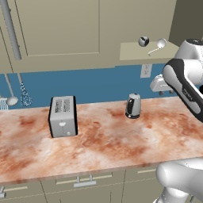<br><em>Left RGB</em></td>
<td width="33%">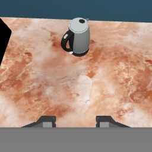<br><em>Wrist RGB</em></td>
<td width="33%">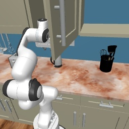<br><em>Right RGB</em></td>
</tr>
<tr><td width="33%">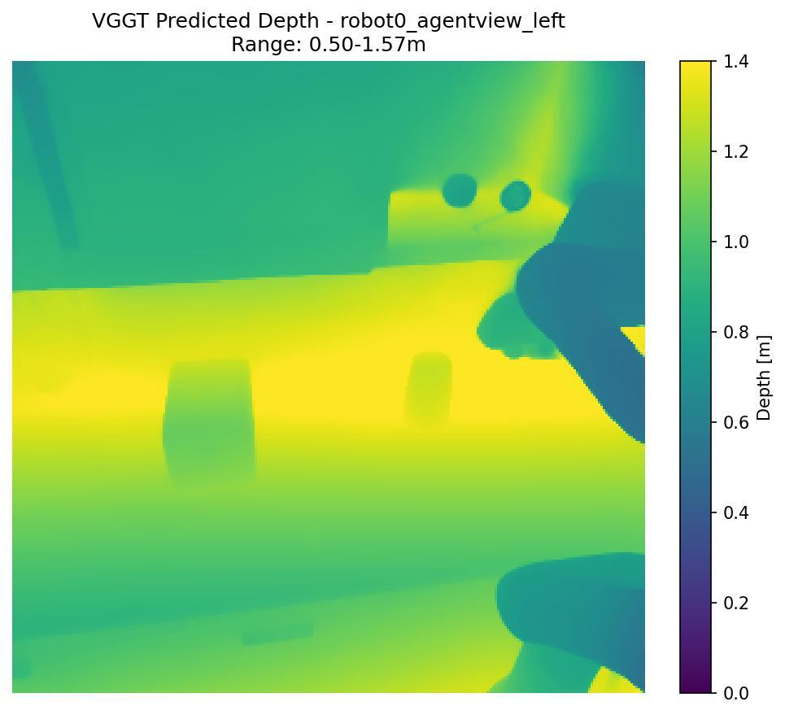<br><em>VGGT depth (左)</em></td>
<td width="33%">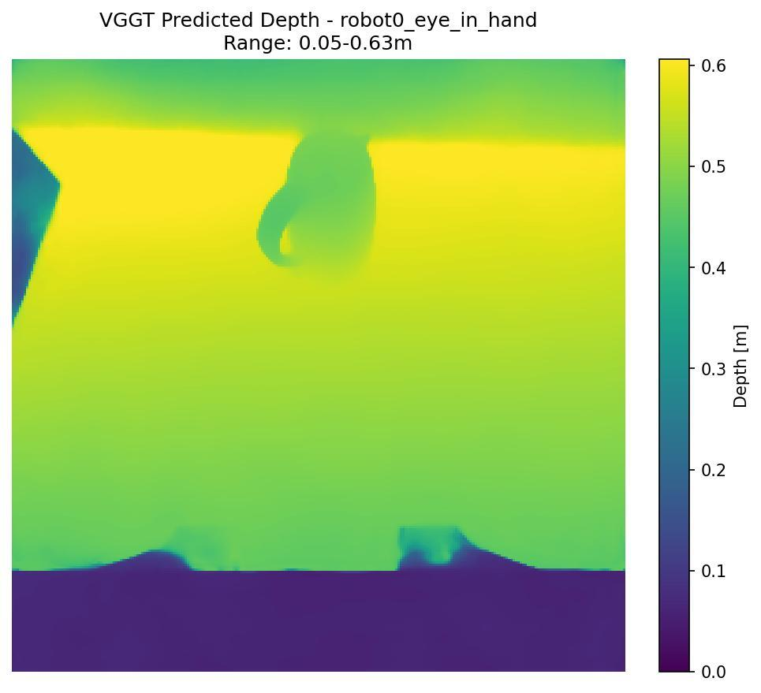<br><em>VGGT depth (腕)</em></td>
<td width="33%">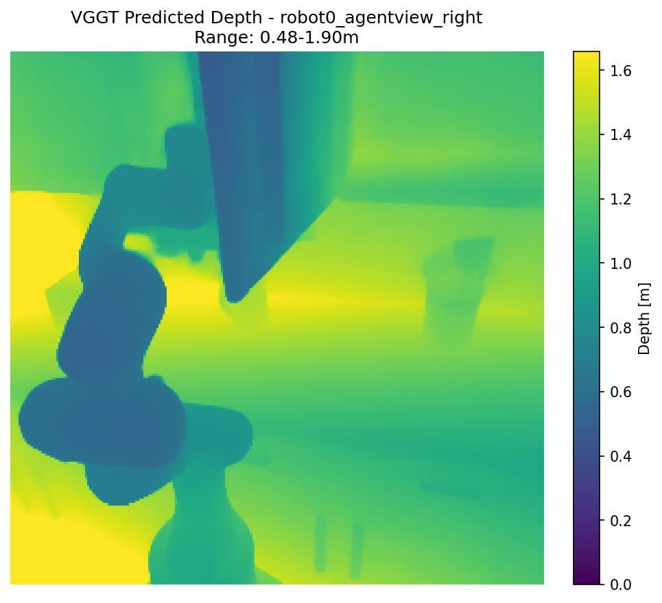<br><em>VGGT depth (右)</em></td>
</tr>
</table>

*图3(b) 细节展开：PnPCabToCounter 任务中三相机视角的 RGB 和 VGGT 预测深度对比——从"橱柜取物放到台面"的典型操控场景审视 GFM 的实际表现。*

**图表结构**：上行为各相机的原始 RGB 图像，下行 VGGT 预测深度。列对应左/腕/右相机。
- **左侧相机**提供场景全景，VGGT 正确恢复了操作台、橱柜的前后层次关系。注意远处墙壁和近处台面的深度差异清晰可见。
- **腕部相机**是最关键的操控视角，因为 gripper 和被抓物体的交互在此视角最清晰。VGGT 对台面、物体的近景深度估计准确，物体轮廓处的深度断裂正确。
- **右侧相机**补充了橱柜侧面的深度信息。

**与图3(a) 的联系**：这里展示的是一个 VGGT 表现良好的案例——左/腕/右三视角的深度都与 GT 接近。但图3(a) 中的散点也说明在某些 episode 中 VGGT 会有更大的深度误差（RMSE > 0.12m），那些情况下操控成功率明显偏低。*

---

## 五、关键洞察与技术亮点

1. **"几何鸿沟"首次量化**：通过线性探针，确认 GR00T-N1.5 的深度 RMSE（0.73）几乎是 VGGT（0.41）的两倍——VLA 确实缺乏几何理解

2. **冻结 LLM 仍有可塑性**：Early Fusion 在冻结 LLM 的情况下能将几何信息恢复至接近 VGGT 水平（probe RMSE 0.44 vs VGGT 0.41）——这个发现意义重大，意味着可以保留预训练语义理解同时注入几何信息

3. **Attention Gate 是关键**：去掉 gating 会导致成功率崩溃至 5-27%。Gate 初始化为接近零，让 VGGT token 逐步"融入"VLA

4. **Finetuning 不够，Mid-training 才有价值**：简单 finetune 时几何 VLA 与 baseline 无法区分（p>0.1）。经 mid-training（全部 8 个 RoboCasa 任务预训练 10 epoch），Early Fusion 显著超越 baseline

5. **多相机时几何 VLA 增益有限，单相机时增益显著**：多相机时 VLA 可以通过多视图几何推断深度，GFM 价值被稀释；单相机时 GFM 补充的几何信息变得关键

6. **真实场景中几何 VLA 的优势更明显**：真机实验中 Early Fusion 在 Approach 阶段大幅领先 baseline（+26.66%，p<0.001），尤其擅长抓取小物体

7. **VLM 比 Action Expert 更灵活**：VLM 处理早期注入的几何 token 效果很好，而 Action Expert 相对"僵硬"，不容易适应额外数据源（说明 Late Fusion 的瓶颈）

8. **严谨统计方法论**：使用 McNemar 双尾检验计算 p 值，固定随机种子 + 确定性 DiT 噪声，避免 seed hacking。附录展示了即使固定所有场景随机性，DiT 噪声导致的成功率波动仍可达 8-10%

9. **VGGT 重建质量与操控成功率正相关**：Spearman ρ = -0.202（RMSE↓ → SR↑），暗示在目标环境微调 VGGT 可能进一步提效

---

## 六、局限性

1. **范围受限**：结论仅基于 GR00T-N1.5 + VGGT 这一对组合——其他 VLA（OpenVLA、π₀）和 GFM（Dens3R、MASt3R）可能有不同表现
2. **仿真为主**：仅有 Unitree G1 一个真机 benchmark，仿真中观察到的效果（无统计显著性）可能与真机表现不一致
3. **设计空间未穷尽**：未消融 Spatial Forcing 的对齐层选择、非 cross-attention 的融合方式等——实验已很密集（有些训练接近一周），不可行地探索全部组合
4. **Benchmark 饱和**：LIBERO-Spatial 的 GR00T baseline 已达 96.7%，剩余提升空间极小
5. **p 值非二元决策**：即使有了统计检验，仍有不确定性
6. **无推理速度分析**：GFM（VGGT）引入额外计算开销，论文未分析推理延迟

---

## 七、关键概念速查

| 概念 | 说明 |
|------|------|
| **VLA** (Vision-Language-Action) | 从视觉+语言输入预测机器人动作的模型，核心组件为 VLM + Action Expert |
| **GFM** (Geometric Foundation Model) | 从多张图片前向传播直接预测 3D 结构的 Transformer 模型，如 VGGT、DUSt3R |
| **GR00T-N1.5** | NVIDIA 的 VLA，基于 Diffusion Policy 的 action expert |
| **VGGT** (Visual Geometry Grounded Transformer) | 一种 GFM，预测相机位姿、深度图和稠密点云——本文选用的 GFM |
| **Early Fusion** | VGGT token 在 VLM 输入端与视觉 token 融合 |
| **Late Fusion** | VGGT token 在 VLM 输出端与视觉 token 融合，再送入 Action Expert |
| **Spatial Forcing** | 不对架构做修改，仅添加训练损失使 VLM token 与 VGGT token 对齐 |
| **Cross-Attention Fusion** | 以 LoRA + Attention Gate 实现的 token 融合机制，Gated residual: $\tilde{X} = X + A \odot Z$ |
| **Attention Gate** | 控制 VGGT token 对 VLA token 的修正幅度，初始化为零以平滑引入 |
| **Linear Probing** | 冻结网络，只在某一层附加线性 MLP 训练特定任务，用于探测该层包含的信息 |
| **"几何鸿沟"** (Geometric Gap) | VLA 的深度预测能力（probe RMSE 0.73）与 GFM（0.41）之间的差距 |
| **Mid-training** | 在多个任务上预训练（非全量预训练），再在特定任务上 finetune |
| **McNemar 双尾检验** | 配对二值数据的统计检验，评估两组成功率差异是否显著 |
| **Diffusion Policy** | 通过扩散过程学习动作分布的 policy 范式，用 flow-matching loss 训练 |
| **Spearman ρ** | 秩相关系数，衡量 VGGT 深度误差与操控成功率之间的单调关系 |
| **δ₁ 分数** | 深度估计指标，预测误差在 25% 以内的像素比例 |
| **SILog loss** | Scale-Invariant Logarithmic loss，深度估计标准损失函数 |
