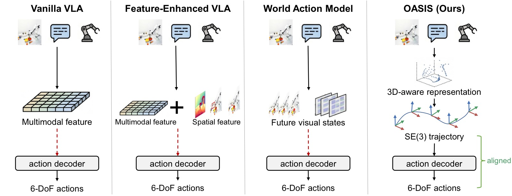
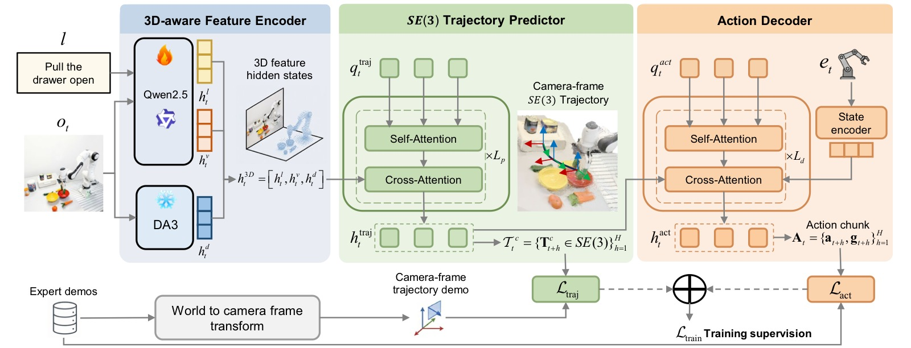
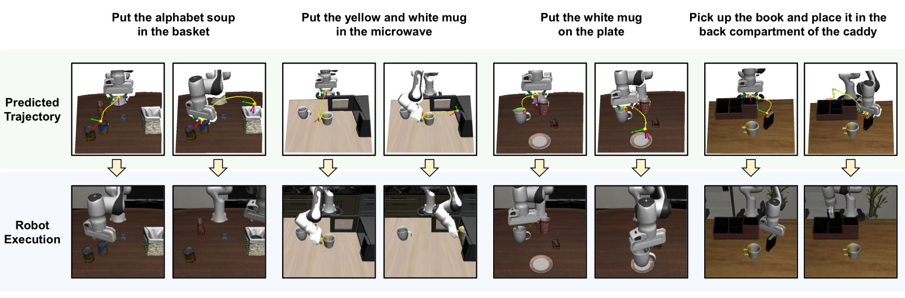
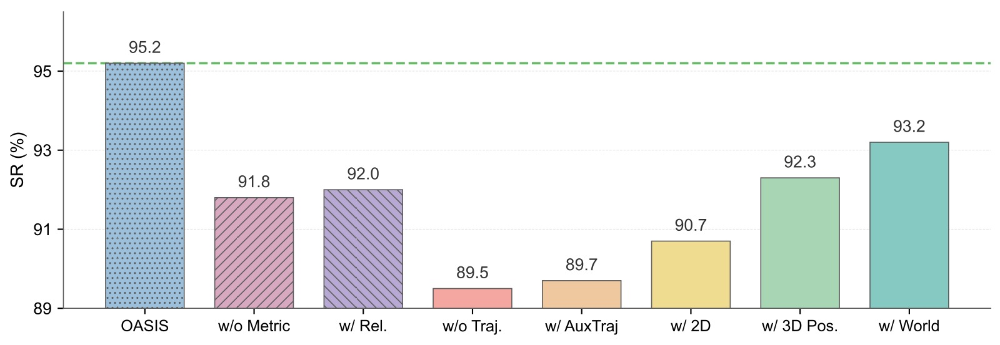
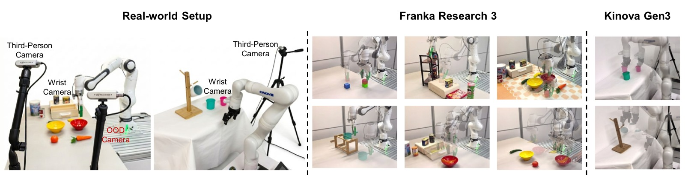
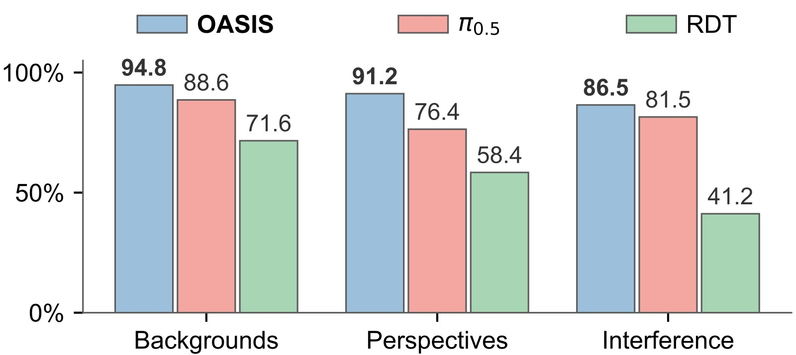
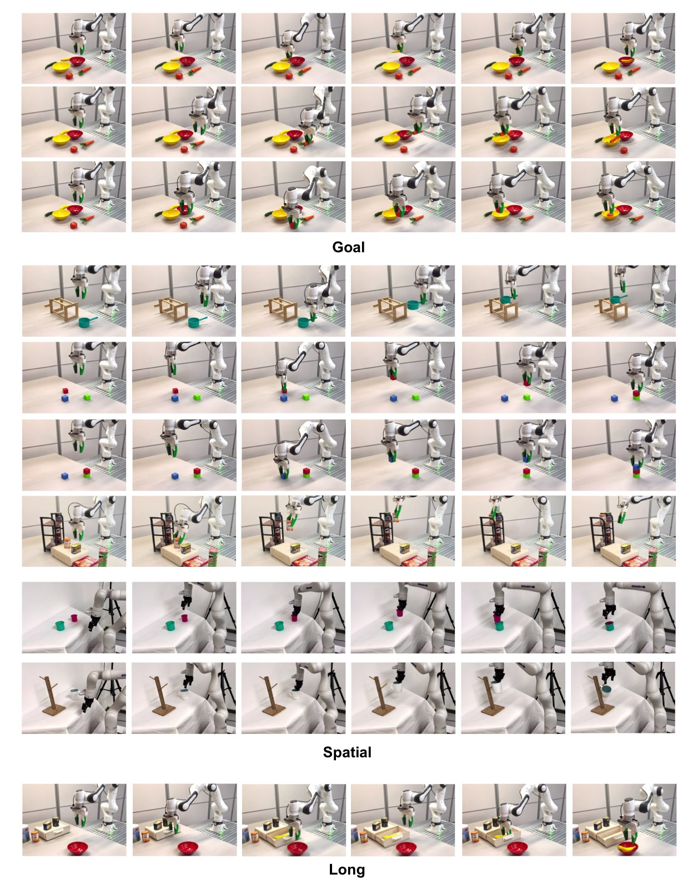
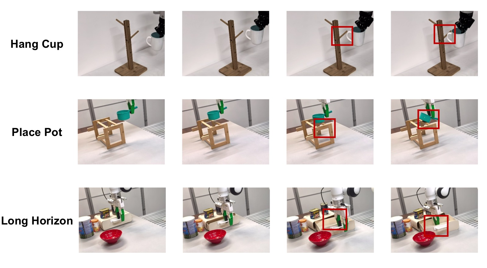

# OASIS: Observation-Action Space Alignment via SE(3) Trajectory Prediction for Robotic Manipulation

> **论文信息**
> - 作者：Xinzhe Chen\*, Sihua Ren\*, Liqi Huang, Haowen Sun, Mingyang Li, Xingyu Chen, Zeyang Liu, Xuguang Lan（通讯作者）
> - 单位：西安交通大学，人机混合增强智能全国重点实验室
> - 投稿方向：NeurIPS 2026
> - arXiv ID：arXiv:2605.25829v1
> - 代码：未公开（项目页：https://npuhandsome.github.io/OASIS_web）

---

## 一、核心问题

### 先理解：什么是 SE(3)？

> **SE(3) = 三维空间中的刚体运动（Special Euclidean group）**
>
> 一个物体在 3D 空间中的"姿态"由 6 个数字决定：**3 个位置（x, y, z）+ 3 个旋转角（绕 x/y/z 轴的转角）**。这 6 个数字唯一确定了一个 SE(3) 姿态。
>
> 举个例子：桌上的咖啡杯——
> - 位置：杯底中心在桌面上的坐标 (30cm, 20cm, 5cm)
> - 旋转：杯把朝向哪边（绕竖直轴转了 45°）
>
> 这 6 个数字合在一起，就是一个 SE(3) 值。
>
> 机器人末端执行器（夹爪）在空间中运动，本质上就是从一个 SE(3) 姿态移动到下一个 SE(3) 姿态。**6 个位置/旋转数字 → 6 个位置/旋转数字**，输入和输出都是同样的"语言"。

### 问题在哪？

现有视觉-语言-动作（VLA）模型和世界动作模型（WAM）通过注入辅助空间特征或预测未来视觉状态来增强中间表示，但这些中间表示**仍然停留在观测空间**（observation space），不具备动作空间的刚体几何结构（$SE(3)$）。动作解码器必须从这些几何结构不对齐的中间表示中**隐式地恢复** 6-DoF 动作，这是一个困难且不直接的学习问题。

> 一张 RGB 图像可以对应多种不同的 6-DoF 末端执行器动作，而现有方法的中间表示缺乏对目标 $SE(3)$ 姿态的显式几何约束。

论文的核心洞察用直觉来理解就是：**与其让模型从抽象视觉特征中猜出动作，不如先让模型说清楚"未来几步手应该出现在哪个位置、朝向什么角度"——也就是预测一条 SE(3) 轨迹。这个轨迹本身就是 6 个数字的序列，和最终要输出的 6-DoF 动作共享同样的数学结构（都是 SE(3) 空间中的量），动作解码器的工作就从"猜测"变成了"照着轨迹微调"。**

---

## 二、核心思路 / 方法

### 2.1 对齐中间表示的设计原则

论文首先形式化了对齐中间表示（aligned intermediate representation）的概念。定义一个按时间步索引的中间表示 $\mathbf{m}_t = \{\mathbf{m}_{t+h}\}_{h=1}^{H}$，如果对每个时间步 $h$ 存在显式的姿态读出 $r(\mathbf{m}_{t+h}) = \mathbf{g} \cdot \mathbf{T}_{t+h} \in SE(3)$（其中 $\mathbf{g}$ 是一个未知的固定刚体变换），则该中间表示与动作空间**几何对齐**。

- **VLA 模型**：$\mathbf{z}_t = E_{\text{VLA}}(\mathbf{o}_t, l, \mathbf{e}_t)$，$\mathbf{A}_t = D_{\text{VLA}}(\mathbf{z}_t)$ — 中间表示 $\mathbf{z}_t$ 不含任何姿态读出，解码器必须同时推断目标姿态和动作参数化。
- **WAM 模型**：$\mathbf{u}_t = F_{\text{WAM}}(\mathbf{o}_t, l, \mathbf{e}_t) \in \mathcal{P}^{H}$，$\mathbf{A}_t = D_{\text{WAM}}(\mathbf{u}_t, \mathbf{e}_t)$ — 虽然按时间索引，但 $\mathcal{P}$（未来图像或 latent 视觉特征）不具备 $SE(3)$ 几何结构。
- **OASIS**：预测相机坐标系下的 $SE(3)$ 轨迹 $\{\mathbf{T}^c_{t+h}\}_{h=1}^{H}$，满足对齐性质（$\mathbf{g} = \mathbf{T}_{c\to w}^{-1}$），解码器接收到显式的姿态信息。



*图1：现有 visuomotor policy 与 OASIS 的设计对比。该图以三栏并列方式展示三类方法的中间表示策略差异。左栏（VLA Models）：图像观测和语言指令经过多模态编码器得到 latent 多模态特征 $\mathbf{z}_t$，动作解码器直接从该特征生成 6-DoF 动作——中间表示不含任何显式姿态读出，解码器必须隐式推断目标 $SE(3)$ 姿态和动作参数化。中栏（World Action Models）：在编码器和解码器之间插入预测中间表示 $\mathbf{u}_t$（未来图像或 latent 视觉特征），虽然按时间索引，但这些预测目标位于图像平面而非 $SE(3)$ 空间，解码器仍需从视觉预测中恢复刚体运动。右栏（OASIS）：在 3D 感知编码器之后加入 $SE(3)$ 轨迹预测器，显式预测相机坐标系下的末端执行器位姿序列 $\mathcal{T}^c_t$，使中间表示 $\mathbf{h}_{\text{traj}}$ 与动作空间共享 $SE(3)$ 几何结构。这张图直接对应论文的核心洞察：与其在观测空间中堆砌辅助特征，不如让中间表示本身就具有动作空间的刚体几何。*

### 2.2 OASIS 架构

OASIS 由三个端到端训练的组件级联而成：

**（1）3D 感知特征编码器（3D-Aware Feature Encoder）**

将视觉-语言特征与度量深度（metric depth）特征融合为统一的 3D 感知表示：

- **度量深度特征**：使用 Depth Anything 3（DA3METRIC-LARGE，冻结），从 RGB 图像提取多尺度度量深度特征 $\mathbf{h}^d_t$。关键选型：必须是**度量深度**（metric depth）而非相对深度，因为前者提供真实物理距离信息。
- **视觉-语言特征**：使用基于 Qwen2.5-0.5B 的 VLM（Prismatic VLM 架构，含 DINOv2 + SigLIP 视觉编码器），联合处理图像观测 $\mathbf{o}_t$ 和语言指令 $l$，输出视觉特征 $\mathbf{h}^v_t$ 和语言特征 $\mathbf{h}^l_t$。
- 三者拼接：$\mathbf{h}^{3D}_t = [\mathbf{h}^l_t, \mathbf{h}^v_t, \mathbf{h}^d_t]$

**（2）$SE(3)$ 轨迹预测器（SE(3) Trajectory Predictor）**

在 3D 感知表示之上，预测 $H=8$ 步相机坐标系下的末端执行器位姿序列：

- 初始化 $H$ 个可学习的轨迹查询 token $\mathbf{q}_{\text{traj}} \in \mathbb{R}^{H \times D}$
- 4 层 Transformer（自注意力 + RoPE 位置编码 + 对 $\mathbf{h}^{3D}_t$ 的交叉注意力）
- 线性头将隐状态 $\mathbf{h}_{\text{traj}}$ 投影为每步的轴角位姿向量 $\mathbf{e}^c_{t+h} = [\mathbf{p}^c_{t+h}, \boldsymbol{\theta}^c_{t+h}]^\top$
- 通过 Rodrigues 旋转公式 $\mathbf{R}(\boldsymbol{\theta}) = \exp([\boldsymbol{\theta}]_\times)$ **自动保证**预测的旋转矩阵在 $SO(3)$ 上，无需 Gram-Schmidt 正交化或后处理

选择在**相机坐标系**下预测轨迹的好处是：中间表示与观测流绑定在同一坐标系，预测器无需学习 camera-to-world 外参。

**（3）动作解码器（Action Decoder）**

- 初始化 $H$ 个可学习的动作查询 token $\mathbf{q}_{\text{act}}$
- 2 层 Transformer，交叉注意力到两个上下文源：
  - 轨迹隐状态 $\mathbf{h}_{\text{traj}}$（来自预测器）
  - 当前末端执行器状态嵌入 $\mathbf{h}_{\text{state}}$（线性投影 $\mathbf{e}_t$）
- 输出动作块 $\mathbf{A}_t = \{(\mathbf{a}_{t+h-1}, g_{t+h-1})\}_{h=1}^{H}$，其中 $\mathbf{a}$ 是 6-DoF 相对动作，$g$ 是夹爪指令

**为什么要保留学习的解码器而不是闭式几何转换？** 附录消融实验表明，用硬编码的几何流水线（已知相机外参 + 闭式相对动作计算）替换学习解码器后，LIBERO-Spatial 降至 12.4%，LIBERO-Long 降至 0.0%。原因是预测噪声、接触动力学和夹爪时序等残差超出了闭式几何的处理能力。



*图2：OASIS 完整架构图。从左到右展示三级流水线。Stage 1 — 3D-Aware Feature Encoder：顶部通路为 VLM（Qwen2.5-0.5B + DINOv2/SigLIP 视觉编码器），接收 RGB 图像（第三视角 + 腕部视角，224×224）和语言指令，输出视觉特征 $\mathbf{h}^v_t$ 和语言特征 $\mathbf{h}^l_t$；底部通路为 Depth Anything 3（DA3METRIC-LARGE，冻结），从 RGB 提取多尺度度量深度特征 $\mathbf{h}^d_t$；三者在序列维拼接为 $\mathbf{h}^{3D}_t$。Stage 2 — SE(3) Trajectory Predictor：4 层 Transformer，8 个可学习轨迹查询 token 通过自注意力（+RoPE）和交叉注意力（到 $\mathbf{h}^{3D}_t$）处理后，线性头投影为 8 步相机坐标系位姿向量 $\mathbf{e}^c_{t+h} = [\mathbf{p}^c_{t+h}, \boldsymbol{\theta}^c_{t+h}]$，每个轴角向量通过 Rodrigues 公式自动保证 $SO(3)$ 有效性。Stage 3 — Action Decoder：2 层 Transformer，8 个动作查询 token 交叉注意力到轨迹隐状态 $\mathbf{h}_{\text{traj}}$ 和当前末端执行器状态嵌入 $\mathbf{h}_{\text{state}}$，输出 8 步动作块（6-DoF 相对动作 + 夹爪指令）。图中蓝色箭头表示数据流，橙色模块表示有监督信号——轨迹预测器受 $\mathcal{L}_{\text{traj}}$（L1，λ=0.1）监督，动作解码器受 $\mathcal{L}_{\text{act}}$（L1）监督，整个架构端到端训练。*

---

## 三、训练目标

总损失为轨迹预测损失与动作损失的加权和：

$$\mathcal{L}_{\text{total}} = \lambda \mathcal{L}_{\text{traj}} + \mathcal{L}_{\text{act}}, \quad \lambda = 0.1$$

**轨迹损失（$\ell_1$）**：

$$\mathcal{L}_{\text{traj}} = \frac{1}{H}\sum_{h=1}^{H} \left\|\hat{\mathbf{e}}^c_{t+h} - \mathbf{e}^c_{t+h}\right\|_1$$

监督信号来自将世界坐标系下的示范轨迹通过外参矩阵变换到相机坐标系。

**动作损失（$\ell_1$）**：

$$\mathcal{L}_{\text{act}} = \frac{1}{H}\sum_{h=1}^{H} \left\|[\hat{\mathbf{a}}_{t+h-1}, \hat{g}_{t+h-1}] - [\mathbf{a}_{t+h-1}, g_{t+h-1}]\right\|_1$$

**关键训练设置**：
- Qwen2.5-0.5B VLM：LoRA 微调（0.10B 可训练参数）
- DA3METRIC-LARGE：冻结
- 轨迹预测器 + 动作解码器：全参数训练（0.07B）
- 总参数 1.73B，可训练 0.18B
- 4×NVIDIA A800，batch size 64，50k 步训练
- AdamW，学习率 $2 \times 10^{-4}$，cosine annealing + warmup
- 无需大规模机器人预训练，无需标注空间标签

---

## 四、实验与结果

### 4.1 LIBERO 仿真基准

| 方法 | 中间表示类型 | 预训练 | Spatial | Object | Goal | Long | 平均 |
|------|-------------|--------|---------|--------|------|------|------|
| SpatialVLA | 空间特征 | ✓ | 88.2 | 89.9 | 78.6 | 55.5 | 78.1 |
| WorldVLA | 未来视觉状态 | ✗ | 85.6 | 89.0 | 82.6 | 59.0 | 79.1 |
| ThinkAct | 2D 监督特征 | ✓ | 88.3 | 91.4 | 87.1 | 70.9 | 84.4 |
| π₀ | 多模态特征 | ✓ | 96.8 | **98.8** | 95.8 | 85.2 | 94.1 |
| QDepth-VLA | 空间特征 | ✓ | 97.6 | 96.6 | 95.2 | 90.0 | 94.9 |
| UniVLA | 空间特征 | ✓ | 96.5 | 96.8 | 95.6 | 92.0 | 95.2 |
| Unified-VLA | 未来视觉状态 | ✓ | 95.4 | **98.8** | 93.6 | 94.0 | 95.5 |
| **OASIS** | **SE(3) 监督特征** | **✗** | **99.0** | **98.8** | **97.4** | **95.2** | **97.6** |

OASIS 在**无大规模预训练**的条件下，四项全面领先，平均成功率 97.6%，超出次优方法 Unified-VLA 2.1 个百分点。在 Long 任务上领先 ThinkAct（同样做轨迹预测但仅在 2D 图像平面）24.3 个百分点，验证了 $SE(3)$ 轨迹预测相比 2D 轨迹预测的显著优势。

### 4.2 CALVIN ABC→D 仿真基准

| 方法 | 中间表示类型 | 预训练 | 1 task | 2 tasks | 3 tasks | 4 tasks | 5 tasks | Avg. Seq |
|------|-------------|--------|--------|---------|---------|---------|---------|----------|
| SuSIE | 未来视觉状态 | ✓ | 87.0 | 69.0 | 49.0 | 38.0 | 26.0 | 2.69 |
| 3D Diffuser Actor† | 3D 特征 | ✗ | 93.8 | 80.3 | 66.2 | 53.3 | 41.2 | 3.35 |
| ReconVLA | 空间特征 | ✓ | 95.6 | 87.6 | 76.9 | 69.3 | 64.1 | 3.95 |
| Seer-Large | 未来视觉状态 | ✓ | 96.3 | 91.6 | 86.1 | 80.3 | 74.0 | 4.28 |
| VPP | 未来视觉状态 | ✓ | 96.5 | 90.9 | 86.6 | 82.0 | 76.9 | 4.33 |
| Unified-VLA | 未来视觉状态 | ✓ | **98.9** | 94.8 | 89.0 | 82.8 | 75.1 | 4.41 |
| DreamVLA | 未来视觉状态 | ✓ | 98.2 | 94.6 | 89.5 | 83.4 | 78.1 | 4.44 |
| **OASIS** | **SE(3) 监督特征** | **✗** | 98.1 | **94.9** | **91.7** | **88.9** | **83.3** | **4.57** |

OASIS 的平均序列长度达 4.57，在 5 个连续任务上成功率 83.3%，领先 DreamVLA 5.2 个百分点。随着任务数量增加，OASIS 的领先优势**逐渐扩大**，说明 $SE(3)$ 对齐的中间表示使每步误差累积更少。

### 4.3 消融实验

论文在 LIBERO-Long 和 LIBERO-Spatial 上进行了系统消融，所有变体共享编码器、深度模型、架构和训练预算。

| 变体 | LIBERO-Long | LIBERO-Spatial | 说明 |
|------|-------------|----------------|------|
| _w/o Traj._ | 89.5 | 91.6 | 去掉轨迹预测器（基线） |
| _w/ AuxTraj_ | 89.7 | 91.9 | 轨迹损失走并行分支，解码器看不到 $\mathbf{h}_{\text{traj}}$ |
| _w/ 2D_ | 90.7 | 93.3 | 监督目标为 2D 图像平面轨迹 |
| _w/ 3D Pos._ | 92.3 | 95.4 | 仅监督 3D 位置（无旋转） |
| _w/ World_ | 93.2 | 96.5 | 在世界坐标系下预测 $SE(3)$ 轨迹 |
| **OASIS** | **95.2** | **99.0** | 相机坐标系下完整 $SE(3)$ 轨迹预测 |
| _w/o Metric_ | 91.8 | 93.4 | 去掉度量深度特征 |

关键发现：
1. **单调递增梯度**：从无监督 → 2D → 3D 位置 → 世界系 $SE(3)$ → 相机系 $SE(3)$，几何监督越丰富，成功率越高
2. **路由至关重要**：_w/ AuxTraj_（监督信号不送解码器）几乎等于无监督，说明监督必须作用在到达解码器的隐状态上
3. **相机坐标系优于世界坐标系**：+2.0/+2.5 个百分点，因为预测器不需要学习 camera-to-world 外参
4. **度量深度不可或缺**：去掉度量深度后 Long 降 3.4 个百分点，替换为相对深度（DA2）仅恢复至 92.0%

**$SO(3)$ 参数化选择**：

| 参数化方式 | LIBERO-Long SR (%) |
|-----------|-------------------|
| 轴角（Axis-Angle） | **95.2** |
| 欧拉角（Euler） | 92.2 |
| 四元数（Quaternion） | 91.6 |

轴角最优，因为它是最小、无约束的 $SO(3)$ 坐标图（chart），且对于桌面操作场景中相机坐标系下的末端执行器姿态范围，始终保持在 $\|\boldsymbol{\theta}\| < \pi$ 的正则坐标图内。



*图3a：SE(3) 轨迹预测与机器人实际执行的对比可视化。在四个 LIBERO-Long 复杂任务上，蓝色虚线表示预测的平移路径点（camera frame 下的 3D 位置），红色箭头表示预测的旋转轴方向，黑色实线为机器人实际执行轨迹。每个子图对应一个完整的长序列任务（如"将白色杯子放在左边盘子上，将黄色杯子放在右边盘子上"），展示从起始位姿到目标位姿的完整运动过程。关键观察：实际执行路径紧密跟踪预测位置和方向，说明预测器产出的刚体运动先验与解码器生成的动作高度一致。四个任务的路径形态差异显著（直线型、弧线型、先升后降等），但预测器均能给出合理的中间位姿序列，证明其并非记忆固定轨迹模式，而是在不同任务条件下均能提供有效的几何引导。*

<table>
<tr>
<td width="63%"><br><em>(b) LIBERO-Long 消融柱状图</em></td>
<td width="37%">

**__(c) SO(3) 参数化消融__**

| 参数化方式 | SR (%) |
|-----------|--------|
| Axis-Angle | **95.2** |
| Euler | 92.2 |
| Quaternion | 91.6 |

</td>
</tr>
</table>

*图3b：LIBERO-Long 上的消融柱状图（所有变体共享编码器、深度模型、架构和训练预算）。横轴为不同变体，纵轴为成功率（%）。从左到右七个柱形依次为：**(1) w/o Traj.（89.5%）**——完全去掉轨迹预测器，仅靠 3D 感知编码器→动作解码器的直连通路，作为几何监督的"地板"；**(2) w/ AuxTraj（89.7%）**——保留轨迹预测器及其损失，但预测器的隐状态不送入解码器（走并行辅助分支），仅 $\mathbf{h}^{3D}_t$ 条件化解码器。成功率几乎等同于 w/o Traj.，证明位姿监督必须作用在到达解码器的隐状态上才有意义，单纯"多一个预测任务"无帮助；**(3) w/ 2D（90.7%）**——将监督目标替换为 2D 图像平面轨迹，相比无监督仅提升 1.2 个百分点，因为图像平面几何不具备 SE(3) 刚体结构，无法有效对齐中间表示；**(4) w/ 3D Pos.（92.3%）**——加入 3D 位置监督（无旋转），相比 2D 提升 1.6 个百分点，说明深度信息的加入开始提供有意义的空间约束；**(5) w/ World（93.2%）**——在世界坐标系下预测完整 SE(3) 轨迹（含旋转），相比纯位置再提升 0.9 个百分点，但比相机系低 2.0 个百分点——因为预测器需要额外学习 camera-to-world 外参；**(6) w/o Metric（91.8%）**——去掉度量深度特征，OASIS 从 95.2% 骤降至 91.8%（−3.4 个百分点），论文还验证替换为相对深度仅恢复到 92.0%，确认关键是度量尺度而非深度本身；**(7) OASIS（95.2%）**——完整方法，相机系 SE(3) 轨迹预测，达到最高成功率。该单调递增梯度直接验证了论文的核心主张：中间表示的几何监督越丰富（无→2D→3D位置→世界SE(3)→相机SE(3)），策略成功率越高。*

*图3c：SO(3) 旋转参数化方式的消融对比（均在 LIBERO-Long，控制其他变量不变）。Axis-Angle（95.2%）> Euler（92.2%）> Quaternion（91.6%）。论文分析轴角最优的三个原因：(i) 三维向量是无约束的——不需要像四元数那样归一化到单位球面；(ii) Rodrigues 公式 $\exp([\boldsymbol{\theta}]_\times)$ 自动生成有效 SO(3) 矩阵，无需投影或正交化；(iii) 对于桌面操作的相机坐标系末端执行器姿态范围，所有预测天然满足 $\|\boldsymbol{\theta}\| < \pi$，始终在轴角坐标图的正则区域内。欧拉角因万向节锁问题次之，四元数因归一化约束最差。*

### 4.4 真机实验

实验平台：Franka Research 3 + Kinova Gen3，三类任务（Goal / Spatial / Long），每任务 50 个遥操作示范，3 轮 × 20 次测试 = 60 次评估。

| 方法 | Goal | Spatial | Long | 平均 |
|------|------|---------|------|------|
| ACT | 58.3 | 45.0 | 18.3 | 40.5 |
| Seer-Large | 73.3 | 55.2 | 46.7 | 58.4 |
| RDT | 81.7 | 66.7 | 60.0 | 69.5 |
| π₀.₅ | 95.0 | 78.3 | 71.6 | 81.6 |
| **OASIS** | **98.6** | **85.8** | **83.3** | **89.2** |

OASIS 平均 89.2%，领先 π₀.₅ 7.6 个百分点。Wilson 95% 置信区间显示 Goal 和 Spatial 的差距具有统计显著性，Long 的差距为数值领先。

**数据效率**：在 Long 任务上，OASIS 仅需 10 个示范即可达到 π₀.₅ 用 25 个示范的成功率（35.0%），展现低数据优势。



*图4a：真机实验平台与三类任务场景。照片展示 Franka Research 3 和 Kinova Gen3 两个机器人平台及各自的工作空间布局——桌面上的物体排列（碗、水果、积木、杯子、罐子、架子等）。三类任务设计：(i) Goal 任务——两个碗 + 四个物体（香蕉、胡萝卜、橙子等），机器人根据语言指令将正确物体放入正确碗中，物体与碗的相对位置固定但绝对位置随机变化；(ii) Spatial 任务——六个子任务覆盖多种空间推理需求：堆叠方块、搭建塔楼、将锅放置于木质支架（需两侧均稳固搁置）、将橙色罐子放上架子、将粉色杯子放入青色杯子、将杯子挂上杯架（需精确插入）；(iii) Long 任务——多阶段长序列操作：打开抽屉→从中取出香蕉→将香蕉放入红色碗中，对闭环反馈和误差纠正能力要求最高。*

*图4b：真机多任务成功率对比表（每任务 50 个遥操作示范，3 轮 × 20 次 = 60 次评估）。OASIS 在全部三个 suite 均最高：Goal 98.6%（领先 π₀.₅ 3.6 个百分点，Wilson 95% CI [96.6, 99.5] vs [92.4, 96.9]）、Spatial 85.8%（领先 π₀.₅ 7.5 个百分点，CI [81.8, 88.9] vs [73.7, 82.3]）、Long 83.3%（领先 π₀.₅ 11.7 个百分点，CI 有重叠）。平均 89.2%，领先 π₀.₅ 7.6 个百分点。值得注意的是 Spatial 内部方差较大——放锅（83.3%）、放罐子（81.6%）、挂杯子（76.6%）因对毫米级精度要求而偏低，而堆叠方块（90.0%）、搭建塔楼（90.0%）、杯子嵌套（93.3%）因对旋转精度要求较低而更高。*



*图4c：OOD 扰动下 Goal 任务的成功率对比（三种场景，每种 60 次评估）。横轴为三种 OOD 条件，纵轴为成功率（%），两组柱形（OASIS vs π₀.₅）并列对比。(1) Unseen Backgrounds（未见背景）：OASIS 94.8% vs π₀.₅ 88.6%（+6.2）。引入训练中未出现的新物体和新桌面作为视觉干扰，OASIS 的度量深度特征基于场景几何而非外观纹理，干扰物不显著改变深度结构，因此对解码器输入的扰动极小。(2) Altered Camera（相机偏移）：OASIS 91.2% vs π₀.₅ 76.4%（+14.8，三个场景中差距最大）。仅第三视角相机平移约 15cm（不改变角度），无重标定或测试时自适应。OASIS 的优势源于 $\mathbf{h}^{3D}_t$ 和 $\mathcal{T}^c_t$ 均在相机坐标系中，解码器天然地对单次未标定视角偏移有一定容忍度。π₀.₅ 的大幅下降说明基于大规模预训练的多模态特征在没有几何对齐的情况下对相机外参变化更为敏感。(3) Human Interference（人为干扰）：OASIS 86.5% vs π₀.₅ 81.5%（+5.0）。在机器人运输物体途中人为移动目标碗的位置，检验策略的闭环重规划能力。OASIS 的 SE(3) 轨迹预测器每步重新生成轨迹，可在一个动作块内（8 步，约 0.4 秒）重新定位目标。三种场景平均 OASIS 90.8% vs π₀.₅ 82.2%（+8.6）。*

### 4.5 真机执行可视化



*图8：真机执行序列的定性可视化。分三行展示三类任务的完整 rollout（每行从左到右为时间顺序的关键帧）。第一行 Goal 任务（两碗四物体，按语言指令"将香蕉放入红色碗"）：机器人从初始位姿移动到香蕉上方→下降抓取→提升并平移到红色碗上方→释放香蕉入碗。图中可见碗和物体的结构化布局及不同颜色指令对应的目标碗切换。第二行 Spatial 任务（六个子任务的关键帧拼接）：从左至右依次展示 (1) 堆叠方块——将红色方块精准放置在绿色方块之上，(2) 搭建塔楼——逐层累积需要逐层调姿，(3) 将锅放上木质支架——需保证锅的两侧同时搁在支架上，(4) 将橙色罐子放上多层架子——需判断正确的架层高度，(5) 将粉色杯子插入青色杯子——对相对位姿精度要求高，(6) 挂杯子——需将杯把精确对准挂钩。Spatial 任务的核心挑战在于：目标位姿不仅由物体类别决定，还受物体间的空间关系（上方/内部/挂在）约束。第三行 Long 任务（"打开抽屉并取出香蕉放入红碗"）：第一帧靠近抽屉→第二帧打开抽屉→第三至四帧伸入抽屉抓取香蕉→第五帧移向红色碗→第六帧释放。该序列长度约 15-20 秒，抽屉打开阶段的位置误差会直接传播到后续抓取步骤，对闭环纠正能力要求最高。所有任务均由 OASIS 自主完成，无人工干预。*

### 4.6 失败案例分析

OASIS 在真机上的主要失败模式集中在需要**亚厘米级放置精度**或**精确姿态对齐**的子任务：
- **挂杯子**（76.6%）：残余旋转误差导致把手无法挂上架子
- **放锅**（83.3%）：小幅度 z 轴或 yaw 误差导致锅仅靠单根支撑杆
- **长序列任务**（83.3%）：抽屉打开阶段的不精确性传播到下游抓取步骤



*失败案例分析：三类典型失败模式的关键帧对比（左侧为成功执行，右侧为失败执行），帮助读者直观理解 OASIS 在真机上的残余误差来源。(1) 挂杯子（Hang Cup, 76.6%）：失败时可见杯把与挂钩之间存在明显的角度偏移——杯把的开口方向与挂钩不平行，残余的 yaw 旋转误差（约 5-10°）使杯把无法滑入挂钩。虽然平移定位正确（杯子已到达挂钩正上方），但旋转精度不足导致任务失败。这也说明轴角参数化虽然在整体上最优（95.2%），但在需要亚度级旋转精度的任务上仍有提升空间。(2) 放锅（Place Pot, 83.3%）：失败帧显示锅的后侧未完全搁在远侧支架上，锅处于倾斜状态。这是因为末端执行器在 z 轴方向提前释放（约 1-2cm 的深度估计误差），导致锅在接触到远侧支撑杆之前就被放下。度量深度特征的精度（Depth Anything 3 在远距离的误差约为厘米级）在此成为瓶颈。(3) 长序列任务（Long, 83.3%）：失败案例展示误差累积效应——第一帧抽屉未完全打开（开度约 70-80%），导致后续抓取时手爪与抽屉边缘碰撞、或无法到达香蕉的抓取位置。抽屉打开阶段的微小位姿偏差（< 1cm）传播为后续阶段的抓取失败。论文在数据扩展实验中发现，增加示范数量（从 10→50）对此类误差累积有显著改善（35.0%→83.3%），说明更丰富的示范覆盖有助于解码器学习更鲁棒的残差补偿。*

---

## 五、关键洞察与技术亮点

1. **对齐中间表示的设计原则**：这是论文最重要的概念贡献。不同于"往观测空间加更多特征"的思路，OASIS 提出中间表示本身就应该与动作空间共享几何结构。消融实验的单调递增梯度为这一原则提供了有力的实证支持。

2. **相机坐标系预测的巧妙之处**：预测器不需要学习 camera-to-world 外参，且中间表示与观测流在同一坐标系下。消融显示相机系比世界系高 2.0-2.5 个百分点。

3. **轴角参数化的选择**：通过 Rodrigues 公式自动保证 $SO(3)$ 有效性，且对桌面操作场景，所有预测天然在 $\|\boldsymbol{\theta}\| < \pi$ 的正则坐标图内。比四元数（需归一化约束）和欧拉角（万向节锁）更适合此场景。

4. **学到的解码器不可简化**：硬编码几何流水线的失败（Long 降至 0.0%）排除了"OASIS 只是换个名字的闭式执行流水线"的解释，证明了学习解码器吸收预测噪声、接触动力学和夹爪时序的必要性。

5. **无大规模预训练**：OASIS 仅需标准专家示范即可训练，0.18B 可训练参数，4 张 GPU，相比需要大规模机器人预训练的基线（如 π₀、SpatialVLA）有明显的数据和计算效率优势。

6. **度量深度 vs 相对深度**：实验明确指出，帮助 3D 感知表示的是**度量尺度**而非深度本身。替换为相对深度后效果与无深度接近。

---

## 六、代码实现解读

> 论文代码未公开。以下基于论文描述的架构进行分析。

### 6.1 整体数据流

```
┌─────────────────────────────────────────────────────────────────────┐
│                          OASIS 推理流程                               │
├─────────────────────────────────────────────────────────────────────┤
│                                                                      │
│  RGB Image (224×224×3)                                               │
│  ├── 3rd-person view                                                 │
│  └── wrist view                                                      │
│       │                                                              │
│       ▼                                                              │
│  ┌──────────────────────────────────────────┐                        │
│  │      3D-Aware Feature Encoder             │                        │
│  │                                           │                        │
│  │  ┌──────────┐  ┌──────────┐  ┌─────────┐ │                        │
│  │  │ Qwen2.5  │  │  DINOv2  │  │ DA3     │ │                        │
│  │  │ 0.5B LLM │  │ +SigLIP  │  │ METRIC  │ │                        │
│  │  │          │  │  Visual  │  │ LARGE   │ │                        │
│  │  └────┬─────┘  └────┬─────┘  └────┬────┘ │                        │
│  │       │             │             │       │                        │
│  │       ▼             ▼             ▼       │                        │
│  │  h^l ∈ R^{Nl×D}  h^v ∈ R^{Nv×D}  h^d     │                        │
│  │       └─────────┬──┴──────────────┘       │                        │
│  │                 ▼                          │                        │
│  │    h^{3D} = [h^l, h^v, h^d]               │                        │
│  └────────────────────┬─────────────────────┘                        │
│                       │                                              │
│                       ▼                                              │
│  ┌──────────────────────────────────────────┐                        │
│  │      SE(3) Trajectory Predictor           │                        │
│  │      4× Transformer blocks                │                        │
│  │                                           │                        │
│  │  8 learnable query tokens q_traj          │                        │
│  │      │ self-attn + RoPE                   │                        │
│  │      │ cross-attn → h^{3D}                │                        │
│  │      ▼                                    │                        │
│  │  h_traj ∈ R^{8×D}  ──Linear──► e^c_{t+h} │                        │
│  │  (pose-supervised hidden states)          │                        │
│  └────────────────────┬─────────────────────┘                        │
│                       │                                              │
│                       ▼                                              │
│  ┌──────────────────────────────────────────┐                        │
│  │         Action Decoder                     │                        │
│  │         2× Transformer blocks              │                        │
│  │                                           │                        │
│  │  8 learnable query tokens q_act           │                        │
│  │      │ cross-attn → [h_traj, h_state]     │                        │
│  │      ▼                                    │                        │
│  │  A_t = {(Δp, Δθ, g)}_{h=1}^{8}            │                        │
│  └──────────────────────────────────────────┘                        │
│                                                                      │
│  Output: 8-step action chunk → executed sequentially @ ~20Hz         │
└─────────────────────────────────────────────────────────────────────┘
```

### 6.2 关键模块的论文→代码映射

| 论文公式/概念 | 对应实现 |
|-------------|---------|
| 公式 (8)：$\mathbf{h}^{3D}_t = [\mathbf{h}^l_t, \mathbf{h}^v_t, \mathbf{h}^d_t]$ | encoder 中将 VLM 的 language/visual hidden states 与 depth hidden states 在序列维拼接 |
| 公式 (9)：$\mathcal{T}^c_t = \text{Linear}(\mathbf{h}_{\text{traj}})$ | TrajectoryPredictor 末尾一个 Linear(896, 6) 将每步隐状态投影为 [px, py, pz, θx, θy, θz] |
| 公式 (6)：$\mathbf{R}(\boldsymbol{\theta}) = \exp([\boldsymbol{\theta}]_\times)$ | 轴角 → 旋转矩阵通过 `so3_exp_map()` 实现（Rodrigues 公式），前向过程中每个 $\boldsymbol{\theta}^c_{t+h}$ 自动对应一个有效的 $SO(3)$ 矩阵 |
| 公式 (10)：$\mathcal{L}_{\text{traj}}$ | `nn.L1Loss()` 在相机坐标系下计算预测位姿向量与真值位姿向量的逐元素差 |
| 公式 (11)：$\mathcal{L}_{\text{act}}$ | `nn.L1Loss()` 计算 6-DoF 相对动作 + 夹爪指令的 L1 损失 |
| 公式 (12)：$\mathcal{L}_{\text{total}}$ | `loss = 0.1 * traj_loss + act_loss` |
| $\mathbf{h}_{\text{ctx}} = [\mathbf{h}_{\text{traj}}, \mathbf{h}_{\text{state}}]$ | ActionDecoder 中在序列维拼接 $8 \times D$ 的轨迹隐状态和 $1 \times D$ 的状态嵌入 |

### 6.3 推理部署架构

```
┌───────────────────┐     WebSocket      ┌───────────────────┐
│  Robot Control PC │ ◄────────────────► │  GPU Server        │
│  (Franka/Kinova)  │   ~30Hz images    │  (RTX 4090)        │
│                   │   + robot state   │                    │
│                   │   ← action chunk  │  OASIS Policy      │
│                   │                   │  ~4.5GB VRAM       │
│                   │                   │  ~0.05s/inference  │
└───────────────────┘                   └───────────────────┘
```

推理速度约 20Hz（每次推理预测 8 步 SE(3) 轨迹 + 8 步动作，顺序执行），显存占用约 4.5GB。

---

## 七、局限性

1. **仅限单臂桌面操作**：当前方法聚焦于单末端执行器的 $SE(3)$ 轨迹预测。扩展到更丰富的动作空间是自然的下一步，包括移动操作（$SE(2) \times SE(3)$ 耦合轨迹）和灵巧手（接触条件下的轨迹）。

2. **Long 任务的统计显著性**：真机实验中 Long 任务的 Wilson 置信区间与 π₀.₅ 重叠，仅为数值领先而非统计显著差异。

3. **相机偏移的鲁棒性有限**：论文明确指出 OOD 相机实验中仅改变了第三视角相机的位移（约 15cm），并未扫描完整的 6-DoF 外参空间，因此不声称相机姿态不变性。

4. **代码未开源**：限制了社区复现和进一步改进。

---

## 八、关键概念速查

| 概念 | 简要解释 |
|------|---------|
| **Aligned Intermediate Representation** | 中间表示的隐状态可通过线性头读出目标 $SE(3)$ 姿态，使中间表示与动作空间共享刚体几何结构 |
| **$SE(3)$（Special Euclidean Group）** | 所有 3D 刚体运动的数学空间。一个 SE(3) 元素 = 6 个数字（3 位置 + 3 旋转角），完全描述物体的 3D 姿态。机器人操作本质上就是在 SE(3) 空间中移动 |
| **$SE(3)$ Trajectory Prediction** | 预测未来 $H$ 步末端执行器会在哪、朝向哪（6 数字序列），作为动作生成的条件信号。好处：这个中间表示和最终输出（6-DoF 动作）说同一种"语言" |
| **Metric Depth vs Relative Depth** | 度量深度反映真实物理距离（米），相对深度仅反映像素间深度排序。实验证明只有度量深度对 3D 感知表示有帮助 |
| **Axis-Angle Parameterization** | 三维轴角向量 $\boldsymbol{\theta}$，通过 Rodrigues 公式 $\exp([\boldsymbol{\theta}]_\times)$ 自动生成有效的 $SO(3)$ 旋转矩阵 |
| **Camera-Frame Prediction** | 在相机坐标系下预测轨迹，避免预测器学习 camera-to-world 外参 |
| **Pose-Supervised Hidden States** | 轨迹预测器中经位姿损失监督的隐状态 $\mathbf{h}_{\text{traj}}$，是传递给动作解码器的核心条件信号 |
| **Learned Decoder Necessity** | 硬编码几何流水线失败（Long 0.0%），证明学习解码器对吸收预测噪声、接触动力学和夹爪时序不可或缺 |
