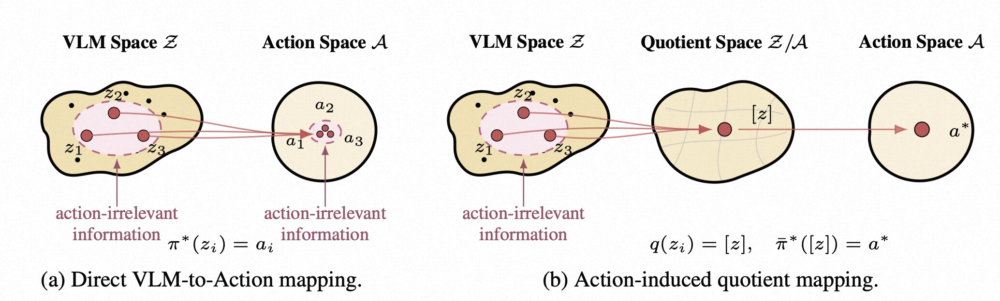
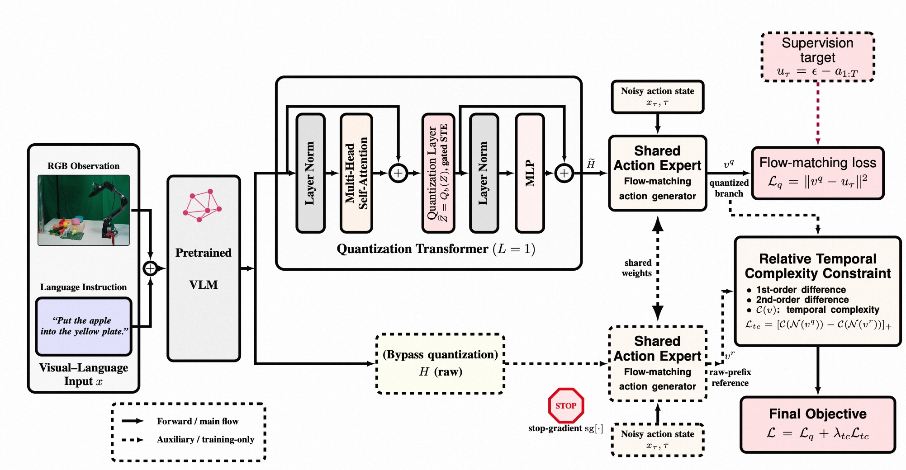
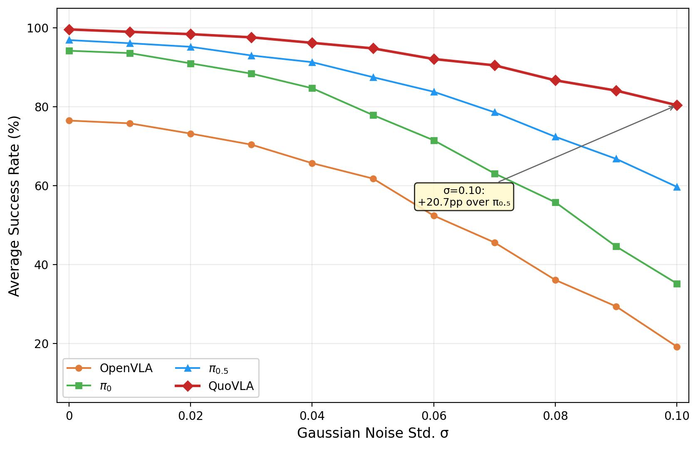
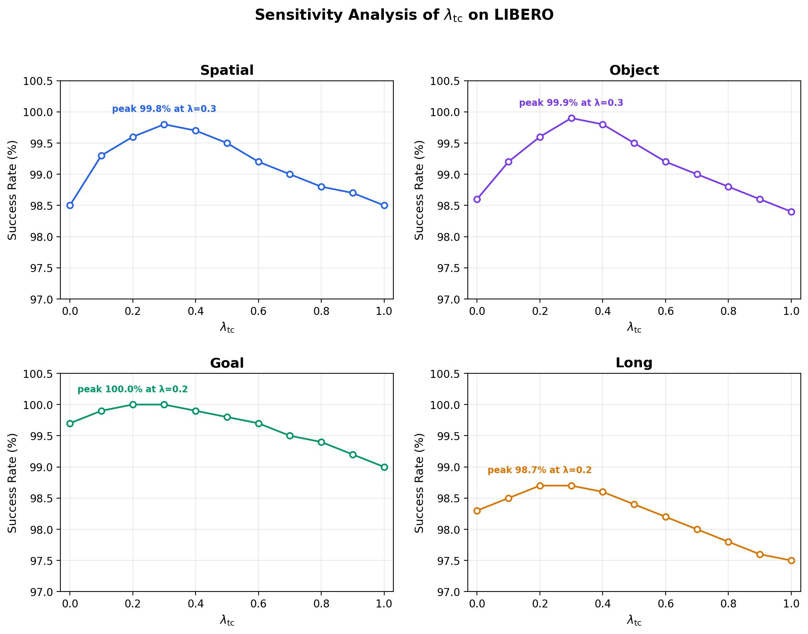

# QuoVLA: Quotient Space for Vision-Language-Action Models

> **论文信息**
> - 作者：Xuan Wang, Yinan Wu, Haoran Duan, Jungong Han（corresponding author）
> - 单位：Department of Automation, Tsinghua University
> - 投稿方向：NeurIPS 2026（投稿中）
> - arXiv ID：2605.24890
> - 代码：待公开

---

## 一、核心问题

当前 VLA（Vision-Language-Action）模型的主流范式是将预训练 VLM（Vision-Language Model）的 latent 表征直接接入 action head 生成机器人动作。现有方法普遍采用 **"动作信息不足"（action-insufficiency）** 的诊断：认为预训练 VLM 的 latent 缺少足够的动作相关信息，因此需要进一步微调 VLM，或将 action 学习信号与 VLM 隔离以防干扰。

本文提出了一个**截然相反的诊断**：

> 预训练 VLM 的 latent 不是"信息不足"，而是**"信息过度"（overcomplete）**——它包含了对 prompt 完全但对控制冗余的信息。VLM 保留了与动作无关的 prompt 层面变化（如光照、背景纹理、语言措辞差异），这些变化经 Transformer 的 injectivity（单射性）传播到 action space，导致策略对不同但行为等价（action-equivalent）的输入产生不同的动作预测，从而损害泛化能力。

**核心直觉**：两个看起来不同的场景（不同光照、不同背景）如果需要完全相同的操作动作，那么 VLA 应该将它们映射到同一个表示——而不是为每个细微的视觉差异生成不同的 latent。

---

## 二、核心思路 / 方法

### 2.1 Quotient Theory for VLA（商空间理论）

论文建立了 VLA 表征学习的商空间理论框架：

- **定义 action equivalence relation** $\sim_{\mathcal{A}}$：两个 VLM latent $h, h'$ 等价，当且仅当它们诱导的 Bayes-optimal action trajectory law 相同：

$$h \sim_{\mathcal{A}} h' \Longleftrightarrow p_H^\star(\cdot \mid h) = p_H^\star(\cdot \mid h')$$

- **Theorem 1（Minimal VLM-Action Quotient）**：商映射 $q_{\mathcal{A}}^\star(h) = [h]_{\sim_{\mathcal{A}}}$ 是 exact action-sufficient 的最粗（coarsest）表示——它保留了改变最优动作行为的所有信息，同时丢弃了一切与动作无关的变化。

- **Theorem 2（Generalization Bound）**：商表示 $\mathcal{R}_Q$ 的泛化界不大于原始 VLM 表示 $\mathcal{R}_H$ 的泛化界，且在商映射真正移除了非平凡的动作无关方向时严格更优：

$$\text{Gen}(\mathcal{R}_Q) \leq \text{Bd}(\mathcal{R}_Q) \leq \text{Bd}(\mathcal{R}_H)$$

这意味着追求 action-minimal 的表示不仅有理论美感，还有可证明的泛化收益。

> *图1：Direct VLM-to-Action mapping vs Action-induced quotient mapping。**(a)** Transformer 的单射性（injectivity）使得预训练 VLM latent 保留了与动作无关的 prompt 层面细节（粉色虚线区域），这些细节未经商空间处理时会直接传播到 action space，导致虚假的动作差异和更差的泛化。**(b)** 通过 action-induced quotient，与动作无关的变化在解码为共享商编码 $[z]$ 之前被折叠（collapsed），随后统一解码为最优动作 $a^*$。商空间中被网格线（cell decomposition）划分的每个单元格代表一组行为等价的 VLM latent。*

### 2.2 QuoVLA 架构

QuoVLA 基于 $\pi_{0.5}$（PaliGemma-2.6B VLM + 300M flow-matching action expert），在 VLM 和 action expert 之间插入三个关键设计：

> *图2：QuoVLA 架构总览。左侧为 Visual-Language 输入（RGB 观测 + 语言指令），经 Pretrained VLM 编码为 prefix tokens $H$。中间上方为 Quantization Transformer（L=1），其核心是插入在 Attention 与 MLP 之间的量化层（Quantization Layer），输出压缩后的商编码 $\widetilde{H}$。下方为 Bypass 分支，原始 prefix $H$ 经 stop-gradient 后作为参考。右侧为共享权重的 Flow-matching Action Expert，量化分支预测速度场 $v^q$（实线），参考分支预测 $v^r$（虚线，仅训练时使用）。最终损失由 Flow-matching loss $\mathcal{L}_q$ 和 Relative Temporal-Complexity Constraint $\mathcal{L}_{tc}$ 组成。*

#### （1）Transformer-based Prefix Quantization

在 VLM 的 prefix tokens $H = [h_1, ..., h_M] \in \mathbb{R}^{M \times d}$ 之后，插入一个**仅 1 层**的量化 Transformer block。关键是 quantization layer 被放在 Attention 子层和 MLP 子层之间（非标准位置）：

$$\begin{aligned}
H^{\text{att}} &= \text{LN}(H + \text{MHA}_\psi(H)) \\
\widehat{H} &= Q_b(H^{\text{att}}) \\
\widetilde{H} &= \text{LN}(\widehat{H} + \text{MLP}_\psi(\widehat{H}))
\end{aligned}$$

其中 $Q_b$ 是 **8-bit per-token 对称均匀量化**：

$$Q_b(z) = s \cdot \text{clip}\left(\text{round}\left(\frac{z}{s}\right), -q_{\max}, q_{\max}\right), \quad q_{\max} = 2^{b-1}-1$$

#### （2）Adaptive Straight-Through Estimator（STE）

量化操作 $\text{round}(\cdot)$ 的导数几乎处处为 0，传统 STE 直接传梯度可能导致 VLM 受到过多 action 监督的干扰。QuoVLA 引入**可学习的门控参数** $\alpha$：

$$g = g_{\min} + (1 - g_{\min})\sigma(\alpha), \quad g \in [g_{\min}, 1]$$

$$\widehat{H} = \text{sg}[Q_b(H^{\text{att}}) - gH^{\text{att}}] + gH^{\text{att}}$$

前向传播：$\widehat{H} = Q_b(H^{\text{att}})$（标准量化）。反向传播：$\frac{\partial \widehat{H}}{\partial H^{\text{att}}} \approx gI$（缩放的恒等梯度）。这个设计让模型**学习**向 VLM 回传多少 action 梯度。

#### （3）Dual-Branch Action Generation

- **量化分支（主训练分支）**：$v^q = G_\phi^{\text{act}}(x_\tau, \tau \mid \widetilde{H})$，受 $\mathcal{L}_q = \|v^q - u_\tau\|_2^2$ 监督
- **非量化分支（参考分支）**：$v^r = \text{sg}[G_\phi^{\text{act}}(x_\tau, \tau \mid H)]$，stop-gradient，仅为量化分支提供参考

两个分支**共享 action expert 权重**，但量化分支通过压缩后的商表示预测动作，参考分支通过原始 VLM latent 预测动作。

#### （4）Relative Temporal-Complexity Constraint

为防止量化导致过度高频的动作速度场，引入相对时间复杂度约束：

$$\mathcal{C}(v) = \lambda_1 \frac{\sum_{t=1}^{T-1} \|v_{t+1} - v_t\|_2^2}{(T-1)D} + \lambda_2 \frac{\sum_{t=1}^{T-2} \|v_{t+2} - 2v_{t+1} + v_t\|_2^2}{(T-2)D}$$

$$\mathcal{L}_{\text{tc}} = [\mathcal{C}(\mathcal{N}(v^q)) - \mathcal{C}(\mathcal{N}(v^r))]_+$$

一阶项惩罚相邻速度步之间的快速变化，二阶项惩罚尖锐曲率和高频振荡。$[\cdot]_+$ 确保只有当量化分支的速度场比参考分支更复杂时才施加惩罚。

**最终目标函数**：$\mathcal{L} = \mathcal{L}_q + \lambda_{\text{tc}} \mathcal{L}_{\text{tc}}$

---

## 三、训练目标

### 3.1 Flow Matching 基础

对 ground-truth 动作轨迹 $a_{1:T}$，采样噪声 $\epsilon$ 和时间 $\tau$：

$$x_\tau = \tau\epsilon + (1-\tau)a_{1:T}, \quad u_\tau = \epsilon - a_{1:T}$$

目标：学习速度场 $v$ 使 $\|v - u_\tau\|^2$ 最小化。

### 3.2 总损失

$$\mathcal{L} = \underbrace{\|v^q - u_\tau\|_2^2}_{\text{Flow-matching loss}} + \lambda_{\text{tc}} \underbrace{[\mathcal{C}(\mathcal{N}(v^q)) - \mathcal{C}(\mathcal{N}(v^r))]_+}_{\text{Relative temporal-complexity constraint}}$$

---

## 四、实验与结果

### 4.1 仿真 Benchmark

QuoVLA 在四个仿真 benchmark 上评估：LIBERO、LIBERO-PRO、LIBERO-Plus、RoboTwin 2.0。

#### LIBERO（标准语言条件操控）

**Table (a)：LIBERO 成功率（%）**

| Model | Spatial | Object | Goal | Long | Avg |
|-------|---------|--------|------|------|-----|
| Diffusion Policy | 78.5 | 87.5 | 73.5 | 64.8 | 76.1 |
| OpenVLA | 84.7 | 88.4 | 79.2 | 53.7 | 76.5 |
| CoT-VLA | 87.5 | 91.6 | 87.6 | 69.0 | 83.9 |
| UniVLA | 96.5 | 96.8 | 95.6 | 92.0 | 95.2 |
| OpenVLA-OFT | 97.6 | 98.4 | 97.9 | 94.5 | 97.1 |
| π₀ | 96.8 | 98.8 | 95.8 | 85.2 | 94.2 |
| π₀.₅ | 98.8 | 98.2 | 98.0 | 92.4 | 96.9 |
| ABot-M0 | 98.8 | 99.8 | 99.0 | 96.6 | 98.6 |
| SimVLA | 99.6 | 99.8 | 98.6 | 96.4 | 98.6 |
| **QuoVLA** | **99.8** | **99.9** | **100.0** | **98.7** | **99.6** |

**解读**：QuoVLA 在全部四个 suite 上取得最优，平均 99.6%，比第二名（SimVLA/ABot-M0 的 98.6%）高出 1.0 个百分点。收益在 Long（长时序任务，+1.1%）和 Goal（目标条件任务，+1.0%）上最明显——这些更困难的任务对"去除动作无关信息"的需求更大。

#### LIBERO-PRO（泛化鲁棒性）

**Table (b)：LIBERO-PRO 鲁棒性成功率（%），仅摘录关键对比**

LIBERO-PRO 测试 Object/Position/Semantic/Task 四种扰动下的泛化能力：

| Suite | Model | Ori | Obj | Pos | Sem | Task |
|-------|-------|-----|-----|-----|-----|------|
| Spatial | π₀.₅ | 98.0 | 97.0 | 20.0 | 97.0 | 1.0 |
| Spatial | **QuoVLA** | **100.0** | **99.0** | **40.0** | **99.0** | **10.0** |
| Object | π₀.₅ | 98.0 | 98.0 | 17.0 | 96.0 | 1.0 |
| Object | **QuoVLA** | **100.0** | 87.0 | **26.0** | **100.0** | **26.0** |
| Goal | π₀.₅ | 97.0 | 97.0 | 38.0 | 97.0 | 0.0 |
| Goal | **QuoVLA** | **100.0** | 85.0 | **57.0** | **100.0** | **42.0** |
| Long | π₀.₅ | 93.0 | 92.0 | 8.0 | 93.0 | 1.0 |
| Long | **QuoVLA** | **99.0** | 82.0 | **21.0** | **99.0** | **24.0** |

**解读**：
- 在 20 个 LIBERO-PRO 鲁棒性设置中，QuoVLA 在 17 个设置上取得最优或并列最优
- **Position 扰动（位置变化）** 提升最为显著：Spatial +20%、Object +9%、Goal +19%、Long +13%
- **Task 扰动（任务逻辑变化）** 同样大幅领先：Spatial +9%、Object +25%→22pp、Goal +42%、Long +23%
- **Object 扰动（物体变化）** 相对较弱——因为改变任务相关物体会改变 object-action 对应关系本身，商空间的 action-invariant 压缩可能抑制了部分精细的物体定位线索
- Position 和 Task 扰动恰好是"需要动作层面推理而非简单视觉匹配"的场景，验证了商空间设计的核心 motivation

#### LIBERO-Plus（细粒度鲁棒性，7 种扰动）

| Models | Camera | Robot | Lang | Light | Bkgd | Noise | Layout | Avg |
|--------|--------|-------|------|-------|------|-------|--------|-----|
| **Zero-Shot Transfer** | | | | | | | | |
| π₀.₅ | 75.8 | 79.4 | 83.3 | 95.5 | 95.0 | 89.6 | 87.0 | 85.7 |
| ACoT-VLA | 72.6 | 82.6 | 87.5 | 97.7 | **96.5** | 87.8 | 88.1 | 86.6 |
| **QuoVLA** | **82.3** | **87.6** | **88.2** | **98.2** | 95.9 | **90.8** | **89.3** | **90.3** |
| **Supervised Fine-Tuning** | | | | | | | | |
| π₀.₅ | 70.3 | 41.7 | 81.1 | **97.3** | 94.6 | 71.8 | 84.9 | 75.7 |
| ACoT-VLA | 96.6 | 70.4 | 79.7 | 95.1 | 97.1 | **95.9** | 85.0 | 88.0 |
| **QuoVLA** | **98.4** | **73.5** | **83.7** | 96.3 | **99.0** | 94.8 | **90.4** | **90.9** |

**解读**：
- **Zero-shot**：QuoVLA 平均 90.3%，比 π₀.₅（85.7%）高 4.6 个百分点。Camera 和 Robot 扰动提升最明显（+6.5% 和 +8.2%），这些正是商空间压缩最擅长的"prompt-level 变化"
- **Fine-tuning**：平均 90.9%，比 ACoT-VLA（88.0%）高 2.9 个百分点。Camera 达到 98.4%，Background 达到 99.0%

#### RoboTwin 2.0（双臂操控，完整 51 任务）

| Model | Easy Avg | Hard Avg |
|-------|----------|----------|
| ACT | 29.7% | 1.7% |
| π₀ | 46.4% | 16.3% |
| π₀.₅ | 42.98% | 43.84% |
| DP3 | 55.2% | 5.0% |
| **QuoVLA** | 45.1% | **58.6%** |

**解读**：
- **Hard 设置**：QuoVLA 的 58.6% 远超 π₀.₅ 的 43.84%（+14.76pp）和所有其他方法。DP3 在 Easy 上最强（55.2%）但在 Hard 上崩溃到 5.0%，说明其缺乏分布偏移下的鲁棒性
- **Easy 设置**：QuoVLA 的 45.1% 虽然低于 DP3（55.2%），但与其他 VLA 方法相当。Easy-Hard 的表现"反转"说明两个 split 的任务构成和扰动 profile 不同，商空间 bottleneck 在过滤动作无关因素方面有独特优势

### 4.2 真机实验

**Table：真机操控成功率（100 次试验/任务，5000 步训练）**

| Task | π₀.₅ | QuoVLA | Δ |
|------|------|--------|---|
| Move tennis ball (yellow→blue plate) | 93% | 97% | +4% |
| Pick red cube into yellow plate | 48% | 74% | +26% |
| Put apple on yellow plate | 31% | 83% | +52% |
| Remove cuboid from blue plate | 86% | 98% | +12% |
| **Average** | **64.5%** | **88%** | **+23.5%** |

**解读**：在仅 100 个训练样本的低数据条件下，QuoVLA 平均提升 23.5 个百分点。"Put apple on yellow plate"（+52%）和"Pick red cube into yellow plate"（+26%）这类精确放置任务提升最显著——因为商空间压缩过滤了与动作无关的视觉变化，让策略更聚焦于任务相关的空间关系而非 prompt 层面的细节。

### 4.3 消融实验

**Table：LIBERO 消融（默认设置：$L_q=1, b_q=8$，Adaptive STE，dual-branch + constraints）**

| Knob | Value | Spatial | Object | Goal | Long | Avg |
|------|-------|---------|--------|------|------|-----|
| **QuoVLA（默认）** | — | **99.8** | **99.9** | **100.0** | **98.7** | **99.6** |
| w/o Quantization | — | 98.8 | 98.2 | 98.0 | 92.4 | 96.85 |
| Quantization depth $L_q$ | 2 | 96.4 | 96.1 | 95.6 | 94.8 | 95.7 |
| Quantization depth $L_q$ | 6 | 93.7 | 92.9 | 91.8 | 90.5 | 92.2 |
| Quantization bit-width $b_q$ | 4 | 84.4 | 87.3 | 85.0 | 73.7 | 82.6 |
| Quantization bit-width $b_q$ | 16 | 98.3 | 98.8 | 97.2 | 94.1 | 97.1 |
| w/o Adaptive STE | — | 98.4 | 98.5 | 99.1 | 97.8 | 98.45 |
| w/o dual-branch | — | 98.4 | 98.6 | 99.2 | 98.4 | 98.65 |
| w/o Constraints | — | 98.5 | 98.6 | 99.7 | 98.3 | 98.78 |

**解读（逐项分析）**：

- **移除量化** → 96.85%（-2.75%）：直接退化为接近 π₀.₅（96.9%），验证了量化 bottleneck 是核心贡献
- **增加量化深度 $L_q$**：1→2→6 层，性能单调下降（99.6% → 95.7% → 92.2%）。更多层会过度处理 prefix，扭曲动作相关结构
- **量化位宽 $b_q$**：4-bit 严重不足（82.6%），8-bit 最优（99.6%），16-bit 反而下降（97.1%）——因为位宽过大削弱了"商压缩"效果，保留了过多动作无关信息
- **移除 Adaptive STE** → 98.45%（-1.15%）：验证了门控梯度估计对离散 bottleneck 稳定训练的重要性
- **移除 dual-branch** → 98.65%（-0.95%）：缺少参考分支的引导
- **移除 Constraints** → 98.78%（-0.82%）：缺少时间平滑正则

### 4.4 噪声鲁棒性曲线

> *图X：噪声鲁棒性曲线（根据论文 Figure 3b 数据重现）。横轴为添加到 RGB 观测的高斯噪声标准差 σ（0 到 0.10），纵轴为 LIBERO 四 suite 平均成功率（%）。σ 越大表示视觉退化越严重。*

**解读**：四条曲线展示了四种方法在递增噪声下的表现——OpenVLA 最脆弱（σ=0.10 时降至 19.2%），π₀ 和 π₀.₅ 有一定鲁棒性但仍大幅下降（分别降至 35.2% 和 59.7%），QuoVLA 全程维持最高曲线且退化最慢（σ=0.10 时仍保持 80.4%）。在 σ=0.08 时，QuoVLA 领先 π₀.₅ 约 14.3 个百分点；在 σ=0.10 时领先扩大到 20.7 个百分点。商空间压缩通过量化 bottleneck 抑制了与任务无关的视觉扰动，使 action head 接收到的商表示对观测噪声天然不敏感。

### 4.5 时间复杂度权重灵敏度

> *图X：λ_tc 灵敏度分析（根据论文附录 Figure 数据重现）。在 LIBERO 四 suite 上测试 λ_tc 从 0 到 1.0 对成功率的影响。每个子图标注了峰值成功率及对应的 λ_tc 值。*

**解读**：性能在 $\lambda_{\text{tc}} \in [0.1, 0.5]$ 范围内非常稳定——Spatial/Object 在 λ=0.3 达到峰值（99.8%/99.9%），Goal 在 λ=0.2-0.3 达到 100.0%，Long 在 λ=0.2-0.3 达到 98.7%。λ=0（无约束）时有轻微下降，λ≥0.8 时过度正则化带来小幅退降。这说明相对时间复杂度约束是一个**稳健的正则化器**，不依赖精细的超参调优。

---

## 五、关键洞察与技术亮点

### 5.1 理论贡献
1. **重新定义 VLA 适配问题**：首次提出从"给 VLM 加动作信息"到"从 VLM 中去动作冗余信息"的范式转变。这是一个根本性的观点变化。
2. **可证明的泛化收益**：Theorem 2 将商空间的压缩与 certified generalization bound 联系起来，不是单纯的 heuristic。
3. **Transformer Injectivity 的创造性应用**：引用 Nikolaou et al. (2026) 的结果说明 Transformer 的单射性（不同输入→不同 latent）在 VLA 场景下反而是**有害的**——因为它会将 prompt 层面的细微差异传播到 action space。

### 5.2 工程贡献
4. **量化位置的选择**：把量化层放在 Attention 和 MLP 之间（而非之后），让离散化发生在中间激活上。消融显示 1 层量化 Transformer 最优——"less is more"。
5. **Adaptive STE**：用可学习的门控参数控制向 VLM 回传的梯度强度。这是一个优雅的解决方案，同时避免了过度干扰 VLM 预训练知识和梯度消失。
6. **Relative（相对）时间约束而非 Absolute（绝对）**：$\mathcal{L}_{\text{tc}}$ 只在量化分支比参考分支更复杂时才惩罚——这保证了压缩不会牺牲必要的时序结构。

### 5.3 实验洞察
7. **8-bit 量化是甜蜜点**：4-bit 信息不足，16-bit 压缩不够，8-bit 恰好提供了合适的 bottleneck 强度。
8. **低数据真机场景收益最大**：+52%（put apple）和 +26%（pick cube）表明商空间压缩在数据稀缺时特别有效——因为它通过先验（"忽略动作无关变化"）弥补了数据不足。
9. **Position/Task 扰动 → 最大提升**：因为这些扰动要求"动作层面的推理"，商空间天然适合处理这类场景。Object 扰动较弱是因为改变物体会改变动作语义本身。

---

## 六、局限性

1. **依赖强 VLM 基座**：如果预训练 VLM 在前缀表征中缺乏动作相关信息，商空间压缩无法弥补缺失。QuoVLA 适合已有较强 VLM 的场景。
2. **量化 bottleneck 容量敏感**：depth 和 bit-width 需要合理选择（L=1, b=8 最优），不恰当的设置会损害动作结构。
3. **真机实验范围有限**：仅桌面操控 + 单一硬件设置，未涉及移动操控、更长时序或开放世界任务。
4. **Object 扰动下表现相对较弱**：商空间的 action-invariant 设计可能过度压缩了与特定物体相关的精细定位信息。

---

## 七、关键概念速查

| 概念 | 解释 |
|------|------|
| **Action-insufficiency view** | 现有主流观点：预训练 VLM latent 缺少动作相关信息，需要进一步微调或添加 action head |
| **Action-sufficiency / overcompleteness** | 本文观点：VLM latent 已包含动作信息，但同时携带了大量与动作无关的 prompt 层面变化 |
| **Action equivalence $\sim_{\mathcal{A}}$** | 两个 VLM latent 等价当且仅当它们诱导相同的 Bayes-optimal action trajectory law |
| **Minimal VLM-Action Quotient** | 商空间 $\mathcal{H}/\sim_{\mathcal{A}}$，保留动作相关信息，丢弃动作冗余信息的最粗表示 |
| **Prefix Quantization** | 在 VLM prefix tokens 和 action expert 之间插入 8-bit 量化 Transformer block（L=1） |
| **Adaptive STE** | 可学习门控参数 $g \in [g_{\min}, 1]$ 控制通过量化的梯度强度 |
| **Dual-Branch Action Generation** | 量化分支（主训练）+ 非量化分支（stop-gradient 参考），共享 action expert 权重 |
| **Relative Temporal-Complexity Constraint** | $\mathcal{L}_{\text{tc}} = [\mathcal{C}(v^q) - \mathcal{C}(v^r)]_+$，一阶+二阶差分约束，只在量化分支更复杂时惩罚 |
| **Flow Matching** | 通过学习速度场 $v$ 匹配 $u_\tau = \epsilon - a_{1:T}$ 来生成动作轨迹 |
| **Transformer Injectivity** | Transformer 的单射性质：不同输入映射到不同 latent，在 VLA 中可能将动作无关变化传播到 action space |
