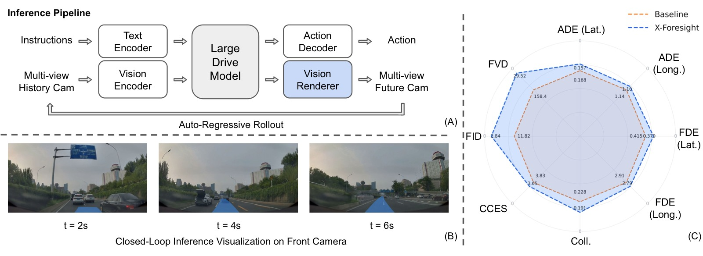
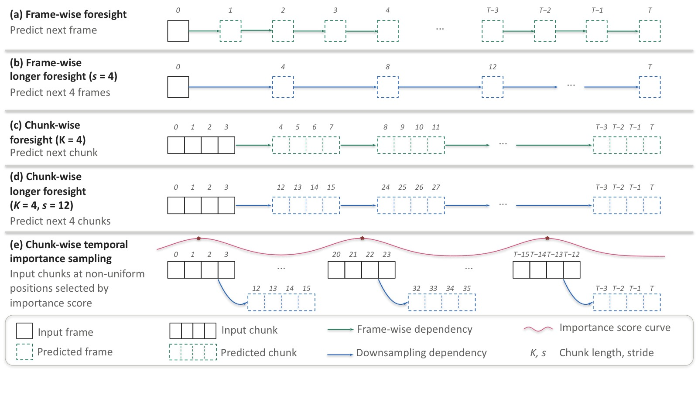
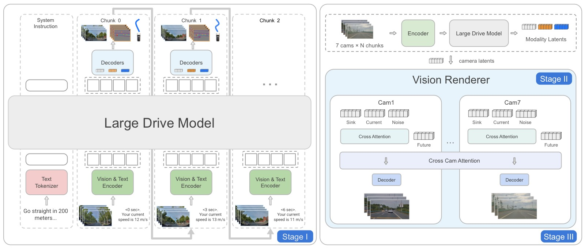
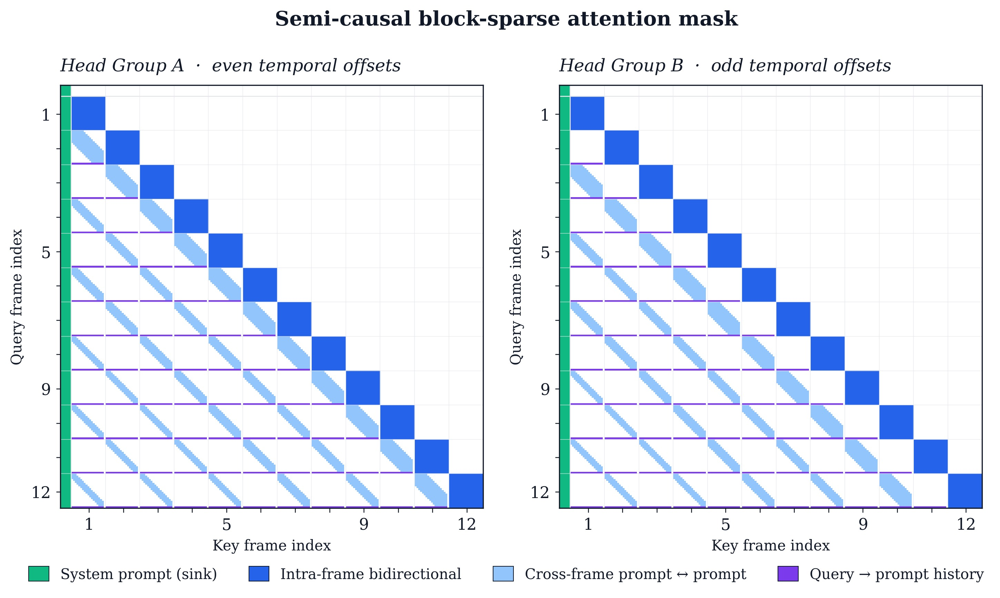
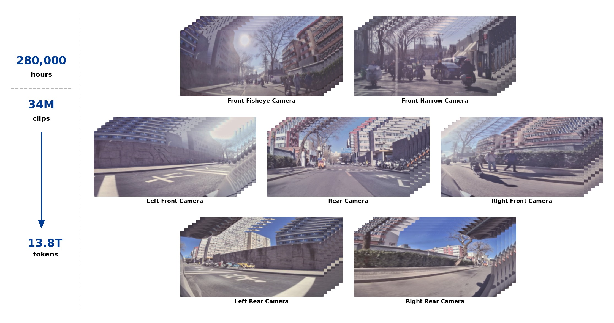
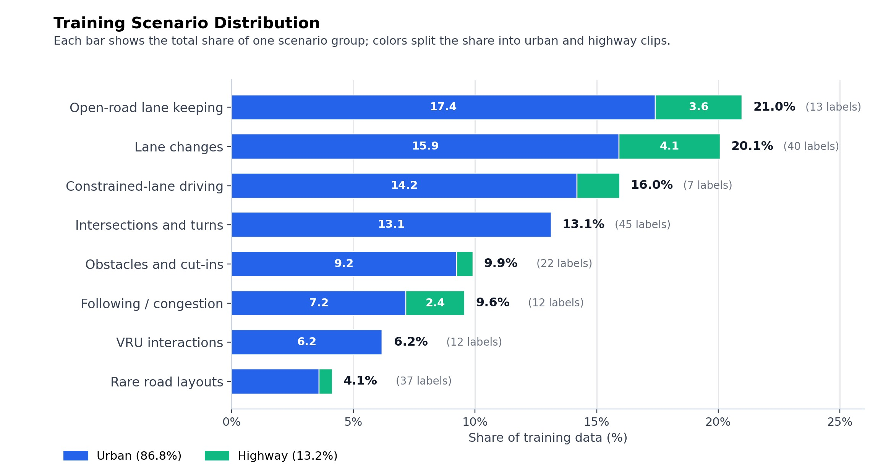
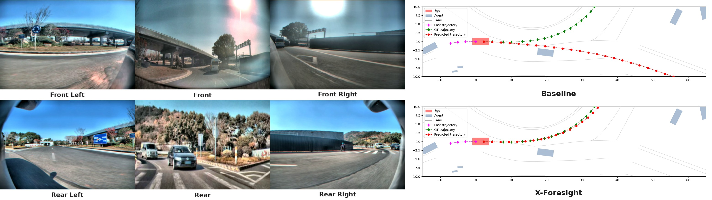
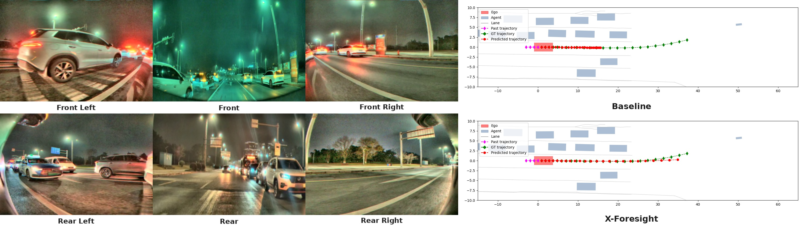
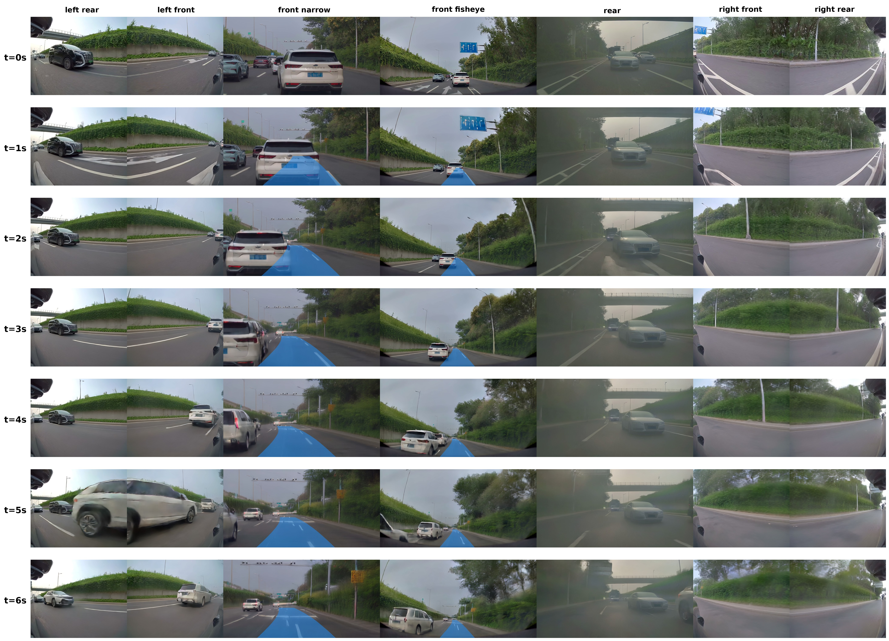

# X-Foresight: A Joint Vision-Action Causal Forecasting Network via Predictive World Modeling

> **论文信息**
> - 作者：PWM Team, XPeng Inc.（小鹏汽车）
> - 通讯作者 / Advisor：Yu Zhang, Xianming Liu
> - 项目负责人：Zhuangzhuang Ding, Pengkun Zheng
> - 核心贡献者（按字母序）：Baolu Li, Jingyu Qian, Rui Guo, Yilun Chen
> - 投稿方向：NeurIPS 2025（投稿中）
> - arXiv ID：2605.24892
> - 项目页面：https://x-foresight-1.github.io
> - 代码：未提供

---

## 一、核心问题

当前的 Vision-Language-Action (VLA) 模型**本质上是反应式的（reactive）**：它们基于历史观测直接输出控制信号，缺乏对物理世界未来状态的内部模拟能力。这种"无远见"的局限导致模型无法：

1. **预判碰撞**：不能提前模拟未来场景来规避危险。
2. **处理长程因果**：无法理解"当前决策 → 几秒后的世界状态"之间的因果链。
3. **在复杂场景中稳健规划**：如环岛多出口导航、红绿灯变化前的预判。

论文的核心洞察是：**视频是物理世界知识的主要载体**——它同时编码了低级视觉细节（纹理、形状）和高级语义信息（运动模式、交通参与者行为）。如果能从视频数据中学习预测未来画面（world modeling），VLA 就能内化物理动力学和长程因果关系。

然而，直接将 next-token prediction 范式套用到视频 world modeling 面临两大挑战：

1. **熵困境**：语言 token 语义离散、高熵；视频 token 帧间高度相似、低熵冗余。逐帧预测容易退化为平凡的外推（trivial extrapolation），而非学习有意义的物理动力学。
2. **时间困境**：瞬时动力学（instantaneous dynamics）需要密集帧预测，但长程因果关系（long-term causality）跨越的时间跨度远超密集预测能高效覆盖的范围。

---

## 二、核心思路 / 方法

X-Foresight 的核心设计是**将预测性世界模型直接嵌入 VLA 架构**，实现联合的世界建模和实时动作控制。系统由两大组件构成：

- **Large Drive Model (LDM)**：自回归 Transformer，在统一 token 空间中联合预测未来动作、BEV 表征和多视角相机 latent token。
- **Vision Renderer**：基于 Diffusion Transformer (DiT) 的解码器，将 LDM 的 latent token 重建为逼真的多视角未来画面，并反馈回 LDM 形成闭环。



*图1：X-Foresight 系统全景，包含三个子图。*

**子图 (A) — 推理管线（Inference Pipeline）：**
展示了从感知到控制再到渲染的完整数据流。左侧为多视角历史图像（7 个环视摄像头），经 ViT 编码后与语言指令（"沿当前道路直行，第二个路口右转"等导航文本）一同输入 LDM。LDM 在单次前向传播中同时输出三样东西：① 下一步 ego action（方向盘转角、油门/刹车），用于实时车辆控制；② 未来 1 秒的 camera latent tokens（4 帧 × 7 摄像头），以低分辨率 latent 形式编码了预测的未来场景布局和动态；③ 辅助 BEV 表征。camera tokens 随后进入 Vision Renderer（基于 DiT 的扩散解码器），经少量 rectified flow 采样步数去噪，生成高保真、多视角一致的环视未来画面。这些渲染帧被附加到历史上下文缓冲区，作为下一推理步的"观测"反馈回 LDM——形成闭环。循环迭代即可产生任意长度的（动作轨迹 + 环视视频）联合推演。此管线的核心巧思在于：LDM 负责"想象"（产生语义丰富但视觉模糊的 latent），Renderer 负责"显影"（将 latent 细化为逼真画面），两者分工明确。

**子图 (B) — 闭环推演可视化（Closed-Loop Inference Visualization）：**
展示前向摄像头（front camera）在闭环推演中的预测未来帧，时间跨度从 t=0s（ground-truth 观测）到 t=6s（纯模型预测）。自上而下 4 行分别对应 t=0s、2s、4s、6s。关键观察：即使经过 6 秒的自回归推演（每个 AR 步产 1 秒/4 帧，共计 6 个 AR 步），画面仍保持几何一致性——车道线不发生扭曲、前方车辆的位置和尺度连续变化、路侧建筑物不出现跳跃或形变。这说明 latent sink 和 latent augmentation 有效抑制了闭环推演中的误差累积。图中蓝色轨迹线叠加在前向画面上，展示了 LDM 预测的自车未来路径。

**子图 (C) — Benchmark 对比（Performance Comparison）：**
柱状图展示 X-Foresight 与 baseline（纯 reactive VLA）在多个评测维度上的对比。X-Foresight 在所有维度均取得更优（更低）的分数，其中 Safety 和 Compliance 两个维度的领先优势最为显著，直观验证了"通过世界建模获得远见 → 提升安全关键决策质量"的核心主张。具体的数值对比详见第三章实验部分。

### 2.1 Long-Horizon Chunk-Wise Auto-Regressive Strategy

这是解决"熵困境"和"时间困境"的核心机制。

**Chunk-Wise 预测**：将未来切分为固定长度的 chunk（每个 chunk 1 秒，含 4 帧@4Hz），模型在每个自回归步预测整个 chunk 的 K 帧。相比逐帧预测，chunk 内保留了密集的瞬时动态信息；相比将帧率直接降采样，chunk 间跳过的语义距离足够大，迫使模型学习真正的世界状态转移，而非平凡帧间外推。



*图2：五种未来帧预测策略的系统对比。横轴为时间步，每个色块代表一个被模型预测的未来帧，色块间的间隔反映了采样策略的差异。这张图是理解 X-Foresight 核心设计动机的关键——它解释了为什么简单的"多预测几帧"不够，以及 chunk-wise 设计如何同时解决熵困境和时间困境。*

**子图 (a) Frame-wise foresight（逐帧预测）：**
每自回归步仅预测紧邻的下一帧。图中相邻帧之间色块几乎重叠，反映了视频帧间极高的相似性。这种设置下，模型只需要学会"把上一帧稍微平移几个像素"就能获得低 loss——即平凡外推（trivial extrapolation）。损失函数虽然在数值上收敛了，但模型并未学到任何有意义的物理动力学（如"前车减速意味着我可能需要刹车"）。这是直接迁移 LLM 的 next-token 范式到视频域的根本性失败模式。

**子图 (b) Frame-wise longer foresight（加大步长的逐帧预测）：**
通过引入时间步长 s 对帧序列降采样（例如从 4Hz 降至 1Hz），使每步预测的帧在时间上拉开距离。这确实增大了帧间差异、缓解了熵困境，但代价是丢失了精细时序运动信息——对于轨迹预测而言，4Hz→1Hz 的降采样意味着自车的速度、加速度、转向角速度等都需要从稀疏得多的观测中推断，可能出现混叠（aliasing），导致轨迹预测精度下降。

**子图 (c) Chunk-wise foresight（本文方案：chunk 级预测）：**
每个 AR 步预测包含 K 帧连续画面的一个 chunk（蓝色块）。Chunk 内部保留了原始的密集时序（4Hz），完整捕获瞬时动力学（如行人突然横穿的 0.25 秒级运动），无需降采样。Chunk 之间形成自然的语义间距——1 秒后的场景与当前场景已有足够的差异（前车可能已变道、红绿灯可能已变化），迫使模型学习真正的世界状态转移。这一设计一举两得：chunk 内密集 = 解决瞬时动力学需求；chunk 间稀疏 = 解决熵困境。

**子图 (d) Chunk-wise longer foresight（扩展远见的 chunk 预测）：**
在 chunk-wise 基础上进一步拉大相邻 chunk 之间的时间步长（stride s，从 1s 扩展到 3s）。这使得有效预测视界从 ~1 秒扩展到 ~6 秒（3 chunks × 2s each），但每个 AR 步的计算量不变——因为被预测的 chunk 仍然只有 K 帧。关键的非对称设计：视觉预测覆盖了延长的整个视界（3s gap + chunk），而动作预测仅输出紧邻下一步的控制信号——因为闭环控制需要密集、高频率的轨迹输出，不能跳过中间步骤。

**子图 (e) Chunk-wise temporal importance sampling（时间重要性采样）：**
在子图 (d) 的基础上，将 chunk 间的均匀采样替换为重要性加权采样。红色标记的 chunk（加粗边框）代表被重要性采样选中的高权重段——通常对应急刹车、快速变道、突然加速等安全关键事件；灰色标记的 chunk（虚线边框）代表低权重的平稳巡航段。通过公式 $p_k \propto w_k^{1/\tau}$（其中 $w_k$ 基于三窗口加权加速度幅值），训练监督被集中到约 30% 的最关键 chunk 上，使模型将有限的计算预算用于学习最有价值的物理因果关系。

**Chunk-wise longer foresight（扩展远见）**：在基础 chunk-wise 之上，通过拉大 chunk 间步长（从 1s 到 3s）来扩展有效预测视界。关键设计是**非对称**的：视觉预测覆盖延长的步长，而动作预测保持在下一步控制频率不变——因为闭环控制需要密集的轨迹输出。

### 2.2 Multi-Modal Prompt Design

LDM 将预测问题定义为多模态 prompt 任务：

$$[\texttt{SYSTEM PROMPT}] \mid [l_0, O_0, A_0, Q_0] \mid [l_1, O_1, A_1, Q_1] \mid \ldots \mid [l_i, O_i, A_i, Q_i]$$

每个时序 chunk 包含四类 token：
- **$l_i$**：文本 token，指定预测视界/时间窗口
- **$O_i$**：多视角视频 token（通过 ViT 编码器提取）
- **$A_i$**：自车状态/动作 token（轨迹历史）
- **$Q_i$**：查询 token，触发未来变量预测

### 2.3 Three-Stage Training Pipeline



*图3：X-Foresight 三阶段训练流程全景图。与大多数端到端方法不同，X-Foresight 采用"先分后合"策略将 LDM 和 Renderer 的训练解耦为三个阶段，避免两个复杂模块联合训练的不稳定性。图中实线箭头表示训练时的梯度流（gradient flow），虚线箭头表示数据流（forward pass），红色叉号表示该阶段被冻结的模块。*

**Stage I — LDM Pretraining（LDM 独立预训练）：**
此阶段仅训练 LDM，Vision Renderer 完全不参与。LDM 在 teacher forcing 下接收 multi-modal prompt（系统指令 + 历史观测 token + 历史动作 token + query token），用三个损失的加权组合进行监督：$L_{\text{total}} = L_{\text{act}} + \alpha L_{\text{cam}} + \beta L_{\text{bev}}$。其中 $L_{\text{act}}$（L1 回归）监督动作预测，$L_{\text{cam}}$（L2 回归）监督 camera latent token 预测（以 frozen ViT 编码的 GT 帧 latent 为目标），$L_{\text{bev}}$（L2 回归）作为辅助损失监督 BEV 预测。此阶段的关键设计有三：① 半因果 BSA 注意力掩码使长序列训练的计算复杂度接近线性；② 短→长的课程学习（从 H=1s 逐步扩展到 H=21s/chunk stride 从 1s 扩展到 3s）；③ 时间重要性采样将梯度信号集中于安全关键 chunk。由于 camera token 在 L2 损失下对多个可能的未来取均值，直接 decode 出来的图像是模糊的——但包含了足够的场景结构和语义信息来支撑动作预测。

**Stage II — Renderer Pretraining（Renderer 独立预训练）：**
此阶段仅训练 Vision Renderer，LDM 完全不参与。Renderer 从 X-World（预训练 DiT 视频生成器）的权重初始化，在驾驶数据上进行两步适配：① 时间对齐——从 X-World 原生的 12Hz 微调到 LDM 的 4Hz 输出频率（调整 VAE 时间步长和 rectified flow 采样步数），确保每个生成帧与 LDM 的 camera token 一一对应；② rollout drift 缓解——加入 latent sink（在 latent 空间中锚定一个稳定的参考上下文，在多个 rollout 步间共享）和 latent augmentation（训练时对当前步的 latent 注入扰动，使 Renderer 习惯推理时的噪声分布）。此阶段 Renderer 仍通过 X-World 原生的 action-conditioning 分支接收 GT 未来轨迹（而非 LDM 预测的 camera token），以确保独立训练时的条件信号干净可靠。优化使用 Muon 优化器，学习率 $8\times10^{-5}$，batch size 1/device，128 GPUs。

**Stage III — Renderer Alignment（Renderer 联合对齐）：**
这是"合"的阶段：LDM 被冻结（图中红色叉号），仅 Renderer 继续接收梯度。Renderer 的条件源从 Stage II 中的 GT action 切换为 LDM 预测的 camera token，通过新激活的 camera-token cross-attention 分支注入每个 DiT block。同时移除 X-World 遗留的 action-conditioning、dynamic-agent、static-element、text-conditioning 四个分支——Renderer 仅以 (i) 多视角历史画面 latents 和 (ii) LDM 预测的 camera token 为条件。这一"纯 camera token 条件"的强制约束是确保闭环一致性的关键：如果 Renderer 能同时看到 action token，它可能学到一个低熵捷径——直接根据 action 画出未来而不依赖 camera token——导致 LDM 的 latent 想象和 Renderer 的像素输出各说各话，闭环推演形同虚设。训练使用 rectified flow velocity-matching 目标，Muon 优化器配合 one-cycle cosine 学习率调度，应用 activation checkpointing 和 FSDP 分片以装入设备内存。从 Stage III 开始定期对比 Renderer 输出与 Camera Latent Decoder 的 pixel decode（相同 camera token 条件下的两种重建方式），以审计 Renderer 是否忠实追踪 LDM 的意图。

### 2.4 关键训练设计

#### Curriculum Learning（课程学习）

从短视界（chunk 间步长 1s）开始训练，逐步扩展到长视界（步长 3s）。渐进策略让模型先学会短期预测，再逐步掌握更长时间跨度的因果关系。消融实验（表 2）证实：课程学习（CL）使碰撞率从 0.270% 降至 0.238%，扩展远见（CLEF，含步长扩展）进一步将 ADE/FDE 推至最优——因为扩展 stride 不仅拉长了视界，还增大了 chunk 间语义距离，使学习信号更强。

#### Temporal Importance Sampling（时间重要性采样）

均匀采样视界内的 chunk 会浪费大多数计算在"巡航"等平稳段，而安全关键事件（急刹、切入、变道等）采样不足。为此引入基于自车运动信号的重要性采样：

$$w_k = \sum_{W \in \{W_1^k, W_2^k, W_3^k\}} \max_{t \in W}\left(\lambda_x |a_x(t)| + \lambda_y |a_y(t)|\right)$$

三个时间窗口覆盖不同阶段：
- **$W_1^k$（近未来）**：捕获迫在眉睫的事件（制动、加速、突然转向）
- **$W_2^k$（中视界）**：捕获即将发生的操控（入弯、刹车意图）
- **$W_3^k$（近历史）**：捕获刚完成的操控的后续影响

采样概率通过温度缩放：$p_k = \frac{w_k^{1/\tau}}{\sum_j w_j^{1/\tau}}$

#### Semi-Causal Block-Sparse Attention (BSA)



*图4：BSA 注意力掩码的两个互补模式，分别对应按时间步差奇偶性划分的两组注意力头。这是使长序列训练在计算上可行的关键工程优化。*

*图的排布与阅读方式：** 两个面板（左/右或上/下，取决于排版）分别展示 Group 0 和 Group 1 的稀疏注意力模式。每个面板中，横轴为 key blocks（被关注的 token 块），纵轴为 query blocks（发起关注的 token 块），每个彩色像素点代表该 (query_block, key_block) 对的注意力被允许（即未被 mask 掉），白色区域代表被 mask。序列按时间顺序从左到右、从上到下排列，最左上角的密集块对应 system prompt（全局可见的 sink token）。*

*掩码的层次结构（从粗到细）：** ① **全局层**：system prompt 块对所有后续 chunk 完全可见——它为整个序列提供任务指令和高层导航目标，扮演类似 ViT 中 CLS token 的角色。② **chunk 内层**：对角线上的密集正方形对应每个时序 chunk 内部的 token 块，采用完全双向（bidirectional）注意力——chunk 内的 $l_i$、$O_i$、$A_i$、$Q_i$ 四种 token 可以在该时间窗口内自由交互，实现联合推理。③ **chunk 间层（prompt→prompt）**：非对角线的彩色像素连接不同 chunk 之间的 prompt token（$l_i$、$O_i$、$A_i$）。连接模式是时间因果的（过去→现在），并且空间邻域随时间距离增大而收缩——近期的 chunk 与当前 chunk 在较宽的空间范围内交互，远期的 chunk 交互范围逐步收窄。这一"随时间衰减的空间注意力半径"反映了物理直觉：很久以前的观测对当前决策的影响更宏观、更不需要精确的空间对应。④ **chunk 间层（query→prompt）**：Query token $Q_i$ 可以关注所有过去的 prompt token（$l_{1:i}$、$O_{1:i}$、$A_{1:i}$），确保未来预测的条件信息完整。⑤ **禁止连接**：$Q_i$ 不能关注过去的 query token $Q_{1:i-1}$——这是为了防止当前预测直接复制之前的预测输出（cheating shortcut），强制模型始终从原始观测中推理未来。*

*两个面板的互补关系：** Group 0 和 Group 1 按 query-key 时间步差的奇偶性划分。例如，Group 0 关注时间步差为偶数（0, 2, 4, ...）的 key blocks，Group 1 关注时间步差为奇数（1, 3, 5, ...）的 key blocks。每个组只承担约一半的注意力连接，两个组合在一起覆盖完整的时序上下文。这种划分的妙处在于：它天然保持了时间覆盖的均匀性（每隔一个时间步一个连接，而非集中在前半段或后半段），同时每个注意力头组的计算量减半。最终整体注意力块密度随序列长度近似线性增长（而非标准注意力的二次增长），实测长序列训练每步从 24.50s 降至 15.40s，**1.59× 加速**。*

### 2.5 训练目标

三个损失函数的加权组合：

$$L_{\text{cam}} = \frac{1}{HV}\sum_{i=1}^{H}\sum_{v=1}^{V}\left\|\hat{\mathbf{o}}_i^v - g(\mathbf{I}_i^v)\right\|_2$$

$$L_{\text{act}} = \frac{1}{H}\sum_{i=1}^{H}\left\|\hat{\mathbf{a}}_i - \mathbf{a}_i\right\|_1$$

$$L_{\text{bev}} = \frac{1}{H}\sum_{i=1}^{H}\left\|\hat{\mathbf{b}}_i - \mathbf{b}_i\right\|_2$$

$$L_{\text{total}} = L_{\text{act}} + \alpha L_{\text{cam}} + \beta L_{\text{bev}}$$

- Camera token 用 L2 回归（teacher forcing 下 GT→latent 的 ViT 编码），收敛到条件未来的低熵均值——多个可能的未来在 L2 下的最优估计就是它们的期望。这解释了为什么直接 decode camera token 得到的是模糊图像（期望图）而非清晰的单次采样。
- 动作用 L1 回归——相比 L2，L1 对离群值更鲁棒，适合轨迹预测中偶发的大偏差。
- BEV 为辅助损失，鼓励几何上有意义的场景表征，同时也是对 camera token 的正则化——防止 latent 空间塌缩到只编码外观而丢失空间结构。

### 2.6 Vision Renderer

基于 X-World（DiT 视频生成器），使用 3D causal VAE + rectified flow 目标：

$$\mathcal{L}_{\text{velocity}}(\theta) = \mathbb{E}_{\mathbf{y}_0,\mathbf{y}_1,t,\mathbf{c}}\left[\left\|v_\theta(\mathbf{y}_t,t,\mathbf{c}) - (\mathbf{y}_1-\mathbf{y}_0)\right\|_2^2\right]$$

设计要点：
- **仅以 camera token 为条件**：故意不暴露 action token 给 Renderer，避免 Renderer 利用 action 作为低熵捷径而忽略 camera token，破坏闭环的一致性
- **交叉视角注意力**：在时间轴和视角轴之间交替应用 self-attention，确保 7 个环视相机之间的几何一致性
- **4Hz 时间对齐**：从 X-World 原生 12Hz 微调适配到 LDM 的 4Hz
- **Rollout drift 缓解**：latent sink + latent augmentation，避免闭环推演中误差累积导致的 drift

### 2.7 推理流程

```
┌──────────────────────────────────────────────────────────┐
│                    每个推理步 (4Hz)                        │
├──────────────────────────────────────────────────────────┤
│  输入: 文本指令 + 多视角历史帧窗口                           │
│    │                                                      │
│    ▼                                                      │
│  ┌─────────────────────────┐                              │
│  │  LDM (自回归 Transformer) │  ← 单次前向传播              │
│  │  ┌─────────────────────┐ │                              │
│  │  │ 预测:                │ │                              │
│  │  │ • 下一步 ego action  │ │                              │
│  │  │ • 1秒 camera tokens  │ │  ← 4帧×7摄像头, 低分辨率latent │
│  │  │ • BEV 辅助           │ │                              │
│  │  └─────────────────────┘ │                              │
│  └──────────┬──────────────┘                              │
│             │ camera tokens                                │
│             ▼                                              │
│  ┌─────────────────────────┐                              │
│  │  Vision Renderer (DiT)  │  ← Rectified Flow 采样        │
│  │  ┌─────────────────────┐ │                              │
│  │  │ 渲染:                │ │                              │
│  │  │ 高保真多视角未来帧    │ │  ← 7个环视摄像头, 4帧@4Hz    │
│  │  └─────────────────────┘ │                              │
│  └──────────┬──────────────┘                              │
│             │ 渲染帧                                       │
│             ▼                                              │
│  ┌─────────────────────────┐                              │
│  │  附加到滚动上下文缓冲区    │                              │
│  │  → 反馈回 LDM 作为新观测   │                              │
│  └─────────────────────────┘                              │
│                                                           │
│  循环迭代 → 产生任意长度的 (动作轨迹 + 环视视频) 闭环推演       │
└──────────────────────────────────────────────────────────┘
```

---

## 三、实验与结果

实验基于小鹏自建的工业级数据集：**28 万小时**驾驶数据、**3400 万** clip（每 clip ≤30 秒）、7 摄像头环视系统、13.8T token、4Hz 训练频率。场景分布：城市道路 86.8%，高速 13.2%。



*图5：工业级多摄像头驾驶数据集概览。*

*图的中心是自车俯视示意图，7 个环视摄像头以扇形标注覆盖范围——前鱼眼（front fisheye，大广角近场感知，覆盖车头前方约 180 度的宽视场）、前窄角（front narrow，长焦远距离观测，覆盖正前方约 300 米范围）、左前/右前（侧前方，覆盖交叉车流和变道盲区）、左后/右后（侧后方，覆盖后方来车和盲区）、后方（rear，正后方跟车感知）。这 7 路视频构成完整的 360 度无死角环视感知，所有相机经过几何标定，统一到自车坐标系。*

*图的周边信息标注了数据集的规模维度：** 总时长约 280,000 小时（相当于约 32 年的连续驾驶数据），切分为 34M 个 clip（每 clip 最长 30 秒），经 ViT tokenization 后产生 13.8T 个 token 用于 world model 训练。所有相机原生以 12Hz 采集，训练时下采样至 4Hz——这一帧率的选择是权衡了运动保真度（4Hz 足以捕获 0.25 秒级的瞬时动态）和计算效率（相比 12Hz 将序列长度缩减了 3 倍，使自回归训练可承受）。4Hz 意味着每帧间隔 250ms，在 120km/h 高速行驶时自车移动约 8.3m，这个空间分辨率对于世界建模中的场景理解是足够的。*



*图6：训练数据场景分布柱状图。*

*图表结构：** 横轴为 8 大聚合场景类别，纵轴为该类别在总数据中的占比（百分比）。每个柱子的颜色分段表示城市道路（urban）和高速（highway）的比例——蓝色/深色为城市，橙色/浅色为高速。每个类别名后的括号内数字为该类别下细粒度 auto-tag 的数量（原始标签共约 200 个，经聚合为 8 类）。*

*8 类场景及其关键数字：** ① **开放道路车道保持（Open-road Lane Keeping）**——21.0%，城市主导，这是最基础的巡航场景；② **变道（Lane Changes）**——20.1%，包含左右变道、超车变道等；③ **受限车道行驶（Constrained-lane Driving）**——16.0%，如压线行驶、无标线路段，对模型的空间推理要求更高；④ **路口与转弯（Intersections & Turns）**——13.1%，含十字路口、T 型路口、左右转弯，是事故高发场景；⑤ **障碍物与切入（Obstacles & Cut-ins）**——9.9%，前方车辆突然切入、道路障碍物等安全关键事件；⑥ **跟车与拥堵（Following & Congestion）**——9.6%，密集车流中的低速跟车和启停；⑦ **弱势道路使用者交互（VRU Interactions）**——6.2%，行人、自行车、电动车等交互场景；⑧ **罕见路况（Rare Road Layouts）**——4.1%，匝道、收费站、环岛、高曲率弯道等长尾场景。*

*关键解读：** 约 70% 的数据为常规驾驶场景（前三类），为模型提供了稳定的基础训练信号；约 30% 为交互密集型和长尾场景（后五类），确保模型接触到安全关键事件的足够样本。城市道路占比 86.8% 反映了大规模公开道路数据采集的现实——大多数里程发生在城市路网中。但高速虽然只占 13.2%，却是速度最快、事故后果最严重的场景，因此 TIS（时间重要性采样）在高速段的加速度事件上会赋予更高的权重。*

### 3.1 评估指标

- **ADE/FDE**：平均/终点位移误差（米），分横向（Lat.）和纵向（Long.）
- **Collision**：碰撞率（%）
- **CCES 四维指标**（相对于 $H{=}1$ baseline 的比率，越低越好）：
  - **Compliance**：交规遵守（车道居中、压线、闯红灯）
  - **Comfort**：乘坐质量（转向不稳、晕车）
  - **Efficiency**：行驶效率（加速不足、未超越慢车）
  - **Safety**：安全性（碰撞、TTC 违规、冲出道路边界）
- **Total = Compl. + Comfort + Eff. + Safety**（baseline 为 4.0）

### 3.2 训练视界的影响

| Method | ADE Lat.↓ | ADE Long.↓ | FDE Lat.↓ | FDE Long.↓ | Coll.↓ | Compl.↓ | Comfort↓ | Eff.↓ | Safety↓ | Total↓ |
|--------|-----------|------------|-----------|------------|--------|---------|----------|-------|---------|--------|
| H=1    | 0.1923    | 1.2409     | 0.4881    | 3.1935     | 0.263  | 1.0000  | 1.0000   | 1.0000| 1.0000  | 4.0000 |
| H=6    | 0.1864    | 1.2196     | 0.4691    | 3.1178     | 0.262  | 0.9756  | 0.9880   | 0.9833| 0.9927  | 3.9396 |
| H=21   | 0.1810    | 1.2110     | 0.4571    | 3.0988     | 0.245  | 0.9533  | 1.0416   | 1.0094| 0.9481  | 3.9524 |

关键发现：从 $H{=}1$ 到 $H{=}6$，所有指标单调改善，Total 从 4.0 降至 3.94。但 $H{=}21$ 时 Comfort 和 Efficiency 出现轻微回退（1.0416、1.0094），Total 也回升到 3.95。这说明**直接扩展视界存在优化困难**，需要课程学习和重要性采样的辅助。

### 3.3 CL、CLEF 和 TIS 消融实验

所有模型从 $H{=}6$ checkpoint 初始化，额外用 128 GPU 训练。

| Method | ADE Lat.↓ | ADE Long.↓ | FDE Lat.↓ | FDE Long.↓ | Coll.↓ | Compl.↓ | Comfort↓ | Eff.↓ | Safety↓ | Total↓ |
|--------|-----------|------------|-----------|------------|--------|---------|----------|-------|---------|--------|
| Cont. H=6         | 0.1741 | 1.1807 | 0.4344 | 3.0087 | 0.270 | 0.9302 | 1.0515 | 0.9980 | 0.9726 | 3.9523 |
| +H=21, CL         | 0.1718 | 1.1671 | 0.4277 | 2.9856 | 0.238 | 0.9326 | 1.0106 | 1.0003 | 0.9310 | 3.8745 |
| +H=21, CLEF       | 0.1692 | 1.1571 | 0.4181 | 2.9421 | 0.230 | 0.9320 | 1.0076 | 0.9951 | 0.9387 | 3.8734 |
| +H=21, TIS        | 0.1696 | 1.1578 | 0.4195 | 2.9413 | **0.216** | **0.9187** | **1.0043** | 0.9953 | **0.9264** | **3.8447** |

关键发现：
- **继续训练 H=6** 虽然改善了 ADE/FDE，但碰撞率反而上升（0.262→0.270），排除了"多训练一会就行"的解释
- **CL**（基础课程学习）有效降低碰撞（0.270→0.238）和 Total CCES（3.95→3.87）
- **CLEF**（课程学习 + 扩展远见）实现最强的 ADE/FDE 改善，但 Safety 比 CL 略有回退（0.9310→0.9387）
- **TIS**（时间重要性采样）进一步将碰撞率降至 0.216%（**相对减少 6.1%**），获得最低 Total CCES（3.8447），Safety 改善至 0.9264——符合将监督集中在安全关键 chunk 的设计意图

### 3.4 Production-Scale 最终对比

训练扩展到 1024 GPU，完整 X-Foresight（$H{=}21$ + CLEF + TIS）vs Baseline：

| Method | ADE Lat.↓ | ADE Long.↓ | FDE Lat.↓ | FDE Long.↓ | Coll.↓ | Compl.↓ | Comfort↓ | Eff.↓ | Safety↓ | Total↓ |
|--------|-----------|------------|-----------|------------|--------|---------|----------|-------|---------|--------|
| Baseline    | 0.1675 | 1.1387 | 0.4153 | 2.9117 | 0.228 | 0.9483 | 0.9505 | 0.9867 | 0.9441 | 3.8296 |
| X-Foresight | **0.1567** | **1.0982** | **0.3789** | **2.7924** | **0.191** | **0.8708** | **0.9413** | **0.9831** | **0.8583** | **3.6535** |

核心结果：
- 横向 ADE 降低 **6.4%**，纵向 ADE 降低 **3.6%**
- 横向 FDE 降低 **8.8%**，纵向 FDE 降低 **4.1%**
- **碰撞率从 0.228% 降至 0.191%，相对减少 16.2%**——这是最重要的安全指标
- Safety 改善 **9.1%**，Compliance 改善 **8.2%**
- Total CCES 从 3.83 降至 3.65，**相对改善 4.6%**

改善集中在 Safety 和 Compliance 两个维度，与"长视界世界因果监督提升安全关键决策质量"的核心主张一致。

### 3.5 定性结果



*图7：定性对比场景一——多出口环岛的远出口导航。*

*场景设定：** 自车（ego vehicle，图中以绿色/彩色轨迹标识）进入一个多出口环岛，导航指令（图示左上角的导航箭头或文字）指示在环岛的较远出口（如第三或第四出口）驶出，而非第一个出口。这是一个典型的"需要长程空间推理"的场景——最近的那个出口在视觉上最显著、最吸引模型的注意力，但正确的决策是忽略它并继续沿环岛行驶。*

*对比解读：** **Baseline（左列/上图）**：反应式 VLA 模型被最近、最显著的可见出口吸引，在环岛入口处即发出右转意图，轨迹（红色/虚线）偏离环岛车道中心线，提前切向第一个出口方向，与 ground truth（绿色/实线）产生大幅偏离。这一失败模式本质上是缺乏"远见"——模型只看当前帧的视觉显著 cue（最近出口），无法将导航指令中的"远出口"这个长期目标与当前动作关联起来。**X-Foresight（右列/下图）**：通过自回归世界推演，模型在 latent 空间中模拟了"如果现在走第一个出口 vs 如果继续沿环岛行驶"的未来场景差异，并在 camera token 中编码了"继续沿环岛才能到达远出口"的因果关系。因此其轨迹（紫色/实线）紧密贴合环岛车道中心线，一直追踪 ground truth 直至目标出口。这幅图直观展示了"predictive world modeling → 长程空间因果关系 → 正确导航决策"的因果链。*



*图8：定性对比场景二——夜间红绿灯状态变化的预判。*

*场景设定：** 自车夜间接近一个信号灯控制的十字路口。在**当前时刻 t=0**，信号灯显示为红色（图中底部或左侧的状态标注确认了这一点）。然而，数据记录（ground-truth log）表明：信号灯将在自车到达停止线之前变为绿色——这意味着正确的行为是保持速度、穿过路口，而非在停止线前刹车。这是一个纯"时间远见"的场景：当前的视觉观测（红灯）误导性地指向"立即停车"，只有通过预测未来信号状态的变化，才能做出正确决策。*

*对比解读：** **Baseline（左列/上图）**：反应式模型将当前红灯作为硬约束，发出减速/停车指令，预测轨迹（红色/虚线）在停止线前就截断或大幅减速，无法匹配 ground truth（绿色/实线，穿过路口）。这说明 reactive 模型无法对即将发生的环境变化进行推理——它只能响应"现在有什么"，不能预判"下一秒会变成什么"。**X-Foresight（右列/下图）**：通过 chunk-wise 自回归推演，LDM 在 forward pass 中预测了未来 6 秒的多帧相机画面。在这些预测的未来帧中，信号灯状态随时间的推移自然地从红变绿——模型在 latent 空间中"看到"了绿灯亮起之后的场景，因此其预测轨迹（紫色/实线）连续穿过路口，与 ground truth 高度一致。关键洞察：X-Foresight 并不知道交通信号灯的物理规则（红灯→绿灯的时序），它仅仅是通过 world modeling 从海量驾驶数据中学到了"当接近停止线时红灯通常会变绿"这一统计规律——这是一种从数据中涌现的因果推理能力。*

### 3.6 Vision Renderer 生成质量



*图9：Vision Renderer 的 6 秒闭环推演可视化网格。这是验证"camera token 作为有效信息瓶颈"以及"Renderer 忠实追踪 LDM 意图"两个关键设计假设的核心证据图。*

*图表结构：** 这是一个 7 列 × 7 行的网格布局。**7 列**从左到右对应 7 个环视摄像头——左后（left rear）、左前（left front）、前窄角（front narrow）、前鱼眼（front fisheye）、后方（rear）、右前（right front）、右后（right rear）。**7 行**从上到下对应时间轴——t=0s（第一行，ground truth 真实观测，用作参考基准）、t=1s 到 t=6s（后续 6 行，纯模型自回归预测的渲染帧）。每一格是一张 4Hz 下的相机帧。*

*逐行阅读指南：** ① **t=0s（GT 行）**：所有 7 个相机展示同一时刻的真实场景。可以观察到前窄角看到远处的主路和车辆、前鱼眼看到近处宽阔的视野和车道线、侧方相机看到相邻车道和路边建筑、后方相机看到跟随车辆。② **t=1s-2s（近期预测）**：渲染帧质量极高，与 GT 行几乎不可区分——道路纹理、车道线、前车尾灯、路侧建筑立面等细节均得到保持。定量上这对应了 FID 1.51 @ 1s 的优秀成绩。③ **t=3s-4s（中期预测）**：开始出现轻微的质量退化——远处物体的边缘可能略微模糊，但整体的几何结构（车道走向、前车位置和尺度、自车所在车道）仍然准确。这反映了 rollout drift 的逐渐累积。④ **t=5s-6s（远期预测）**：退化更明显但仍在可控范围内——FID 从 1s 的 1.51 仅上升到 6s 的 2.84（+1.33），FVD 从 11.28 升到 29.52（+18.24）。相比直接 decode camera token 的 Camera Latent Decoder（FID 10.97→11.82，FVD 135.56→158.39），Renderer 的质量提升了约一个数量级。

*蓝色轨迹线解读（关键）：** 在前窄角和前鱼眼两个前向视图上，叠加了一条**蓝色轨迹线**——这是从 LDM 预测的 action token 中解码出的自车未来路径（方向盘转角 + 速度积分得出的 2D 轨迹投影到图像平面）。Renderer 在训练和推理中**从未接触过 action token**（Stage III 中 action-conditioning 分支已被移除），因此这条蓝色轨迹是独立于 Renderer 的外部参考。观察 6 秒内的所有行：蓝色轨迹始终紧密贴合渲染画面中的车道几何——轨迹在弯道处沿车道线弯曲、在直道处保持在车道中心、在前车后方保持安全距离。这种高度一致性证明了：**camera token 已经隐式编码了自车轨迹和场景动力学**，并且 **Renderer 的生成完全受 LDM 的 latent 想象控制**，而非从历史画面中自由发挥（hallucination）。如果 Renderer 无视 camera token 而仅凭历史帧外推，蓝色轨迹和渲染画面必然出现不一致——但结果中并未观察到这种不一致，从而验证了"pure camera token conditioning"设计的有效性。*

| Method | FID↓ (1s) | FID↓ (6s) | FVD↓ (1s) | FVD↓ (6s) |
|--------|-----------|-----------|-----------|-----------|
| Camera Latent Decoder | 10.97 | 11.82 | 135.56 | 158.39 |
| Vision Renderer       | **1.51**  | **2.84**  | **11.28**  | **29.52**  |

- Vision Renderer 在 1s 视界达到 FID 1.51 / FVD 11.28，远优于直接 latent decode（FID 10.97 / FVD 135.56）。FID 低于 2.0 意味着渲染帧与真实帧在人眼感知上几乎不可区分；而 FID 10.97 的 latent decode 图像明显模糊。
- 从 1s 到 6s 的退化很小（FID 仅增加 1.33，FVD 增加 18.24），说明**自回归推演在 6 秒内 drift 累积有限**，这是闭环部署的关键属性。

### 3.7 BSA 加速

| 注意力实现 | 每步耗时 (s)↓ | 加速比↑ |
|-----------|-------------|---------|
| FlashAttention-2 (标准 causal mask) | 24.50 | 1.00× |
| BSA w/ mask (本文)                  | **15.40** | **1.59×** |

---

## 四、关键洞察与技术亮点

1. **Chunk-wise 设计一举两得**：既避免了逐帧预测的平凡外推退化（chunk 间语义距离足够大），又保留了 chunk 内密集帧捕获瞬时动力学。这是一个优雅的设计——不是选择帧率权衡，而是改变了预测的基本单元。

2. **"只给 Renderer camera token 不给 action"的设计**：这是确保闭环一致性的关键。如果同时暴露 action 和 camera token，Renderer 可能绕过 camera token 直接依赖 action 预测，导致 LDM 和 Renderer 各自独立预测未来——闭环形同虚设。强制 Renderer 只能通过 camera token 接受 LDM 的意图，使 camera token 成为有效的信息瓶颈，也提供了可审计的一致性检查（对比 Renderer 输出和 Camera Latent Decoder 输出）。

3. **三阶段解耦训练**：LDM 和 Renderer 先独立预训练、再联合对齐。这种"先分后合"策略在面对两个复杂模块时，比端到端联合训练更稳定、更易调试。

4. **时间重要性采样的窗口设计**：三窗口（近未来/中视界/近历史）覆盖操控全周期，不是简单的"采样大加速度帧"，而是从因果角度覆盖了操控的前因（近历史）、迫在眉睫（近未来）和长期意图（中视界）。

5. **非对称预测**：视觉预测走长视界（chunk 间步长 3s），动作预测保持高频率——这个不对称性精确反映了自动驾驶中"看远"和"控密"的不同需求。

6. **BSA 线性的块密度**：通过按时间步差奇偶性划分注意力头组，每个组只关注互补的时间偏移子集。这不仅压缩了计算，本身就是一种多头注意力的正则化——不同头组的差异化时间视野可能促进更丰富的表征学习。

7. **从 "reactive" 到 "predictive" 的范式转变**：X-Foresight 不是简单在 VLA 上加一个预测模块，而是将世界模型作为 VLA 的**内在能力**来训练——world modeling 和 action control 共享同一个 latent 空间和同一个 backbone。这种深度融合比两阶段方法（先预测再规划）更优雅，也避免了信息损失。

---

## 五、局限性

1. **闭环推演中的漂移**：虽然 drift 在 6 秒内有限（FID 仅 +1.33），但更长时间推演（如 20 秒+）的稳定性未在论文中讨论。对于需要长距离规划的自动驾驶场景，这仍是待解决问题。

2. **缺乏公开 benchmark 对比**：所有实验基于内部数据集，未与已发表的 world model 方法（如 GAIA-1、DriveDreamer、OccWorld 等）在公开 benchmark 上对比。CP 值难以评估。

3. **安全关键场景的覆盖度**：尽管时间重要性采样将碰撞率降低了 16.2%，但长尾问题的根本解决仍需数据覆盖和模型的进一步能力提升。

4. **多模态监督的潜力**：论文在结论中提到可以加入 3D 几何监督等更丰富的模态，说明当前方法在物理世界知识的学习上还有提升空间。

---

## 六、关键概念速查

| 概念 | 含义 |
|------|------|
| **LDM** (Large Drive Model) | 自回归 Transformer，在统一 token 空间联合预测动作和未来视觉 |
| **Vision Renderer** | 基于 DiT + Rectified Flow 的多视角未来画面渲染器 |
| **Chunk-Wise AR** | 每个自回归步预测一个 chunk（K 帧），而非单帧 |
| **Chunk-Wise Longer Foresight** | 拉大 chunk 间步长扩展有效预测视界 |
| **CLEF** | Curriculum Learning with Extended Foresight |
| **TIS** (Temporal Importance Sampling) | 基于自车加/减速度的重要性加权采样，聚焦安全关键 chunk |
| **BSA** (Block-Sparse Attention) | 半因果块稀疏注意力，线性复杂度长序列训练 |
| **CCES** | 四维驾驶质量评估：Compliance / Comfort / Efficiency / Safety |
| **Camera Token** | LDM 预测的多视角 latent token，编码未来外观和场景动力学 |
| **Rectified Flow** | 直线插值的扩散采样路径，比标准 DDPM 用更少步骤产生高质量样本 |
| **Camera Latent Decoder** | 轻量卷积解码器，用于可视化诊断 latent 空间的一致性 |
| **Rollout Drift** | 自回归推演中误差逐步累积导致预测偏离数据流形的现象 |
