<!-- arxiv: 2502.09992 -->
<!-- venue: NeurIPS 2025 -->
<!-- tags: 语言模型, 扩散模型 -->

# Large Language Diffusion Models

> **论文信息**
> - 作者：Shen Nie*, Fengqi Zhu*, Zebin You, Xiaolu Zhang, Jingyang Ou, Jun Hu, Jun Zhou, Yankai Lin, Ji-Rong Wen, Chongxuan Li（* 共同一作）
> - 通讯作者：Chongxuan Li（中国人民大学高瓴人工智能学院）
> - 机构：中国人民大学 + 蚂蚁集团
> - 投稿方向：NeurIPS 2025（以 [final] 选项编译，已接收）
> - arXiv ID：2502.09992
> - 代码：https://github.com/ML-GSAI/LLaDA
> - HuggingFace：https://huggingface.co/GSAI-ML/LLaDA-8B-Base

---

## 一、核心问题

**自回归模型（ARM）是不是 LLM 核心能力的唯一路径？**

当前所有主流 LLM（GPT、LLaMA 等）都采用自回归"next-token prediction"范式（公式 2），业界普遍认为 LLM 的三大核心能力——**可扩展性（scalability）、上下文学习（in-context learning）、指令遵循（instruction-following）**——天然依赖自回归建模。这篇论文直接挑战这个假设。

论文的核心洞察是：真正支撑 LLM 能力的，是**生成式建模原理**（generative modeling principles，即公式 1 的最大似然估计 / KL 散度最小化），而不是自回归形式本身。自回归模型天然存在的**反转诅咒（reversal curse）**反而是其形式局限性的直接体现。

---

## 二、核心思路 / 方法

### 2.1 LLaDA 的生成建模方式

LLaDA 采用**掩码扩散模型（Masked Diffusion Model, MDM）**来定义模型分布，不再逐 token 自回归生成，而是：

1. **前向过程**：给定干净文本 $x_0$，以概率 $t \sim U[0, 1]$ 对每个 token **独立随机**掩码，得到部分掩码的 $x_t$。$t=1$ 时全部掩码，$t=0$ 时无掩码。
2. **反向过程**：训练一个 **mask predictor**（Transformer，无因果掩码）输入 $x_t$，同时预测所有被掩码的 token。从 $t=1$（全掩码）逐渐去掩码到 $t=0$（全部生成），在此过程中迭代采样。

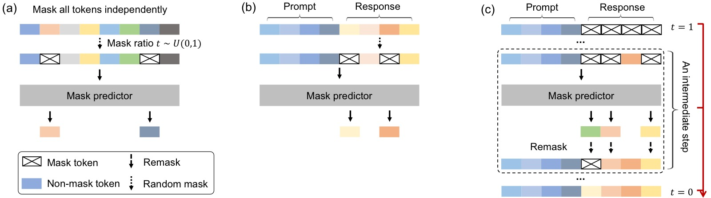

*图2：LLaDA 整体架构概览。(a) 预训练——对完整文本以相同比率 $t \sim U[0,1]$ 随机独立掩码每个 token；(b) SFT——仅对 response 部分进行掩码，prompt 保持不变；(c) 采样——从 $t=1$（全掩码）到 $t=0$（无掩码）模拟扩散过程，每步同时预测所有掩码 token，配合灵活的 remask 策略。*

### 2.2 与 BERT 的本质区别

这经常被问到。LLaDA 使用的是**从 0 到 1 随机变化的掩码比率**，而 BERT 使用固定比率（如 15%）。这个细微差别有重大意义：

- LLaDA 的训练目标是模型分布**负对数似然的上界**（公式 8），使其成为**有原则的生成模型 (principled generative model)**
- 这赋予了 LLaDA 本质性的 in-context learning 和 instruction-following 能力
- 在大数据和模型规模下具有 Fisher 一致性，保证了可扩展性

### 2.3 模型架构

LLaDA 8B 与 LLaMA3 8B 使用相同的 Transformer 架构基础（RMSNorm、SwiGLU、RoPE），关键差异：

| 设计选择 | LLaDA 8B | LLaMA3 8B |
|---------|----------|-----------|
| 注意力掩码 | 无因果掩码（双向） | 因果掩码（单向） |
| 注意力类型 | 普通多头注意力 | 分组查询注意力（GQA） |
| FFN 维度 | 12,288（略小） | 14,336 |
| KV 头数 | 32 | 8 |
| 原因 | 无法用 KV Cache，无需 GQA | GQA 减少 KV Cache |

不使用 GQA 导致注意力层参数更多，因此缩减 FFN 维度以保持总参数量相近（8.02B vs 8.03B）。

---

## 三、训练目标

### 3.1 预训练

LLaDA 的损失函数只计算**被掩码 token** 上的交叉熵，带 $\frac{1}{t}$ 权重：

$$\mathcal{L}(\theta) = -\mathbb{E}_{t, x_0, x_t}\left[\frac{1}{t} \sum_{i=1}^L \mathbf{1}[x_t^i = \textrm{M}] \log p_\theta(x_0^i|x_t)\right]$$

其中 $t \sim U[0, 1]$，$x_t$ 来自前向掩码过程。该损失被证明是负对数似然的上界：

$$-\mathbb{E}_{p_{\textrm{data}}(x_0)}[\log p_\theta(x_0)] \le \mathcal{L}(\theta)$$

**预训练配置**：
- 数据：2.3T tokens（约 11% 中文、61% 英文、28% 代码）
- 序列长度：4096 tokens
- 计算量：0.13M H800 GPU hours（约 10²³ FLOPs）
- 优化器：AdamW（weight decay 0.1，batch size 1280）
- 学习率：Warmup-Stable-Decay 策略——初始 4e-4，1.2T 后降至 1e-4，最后 0.3T 线性降至 1e-5
- 训练全程只 crash 过一次（1.2T 处 loss=NAN），恢复后降学习率继续

### 3.2 SFT

将 (prompt, response) 对中的 **response 部分** 进行随机掩码，计算相同形式的损失：

$$-\mathbb{E}_{t, p_0, r_0, r_t}\left[\frac{1}{t} \sum_{i=1}^{L'} \mathbf{1}[r_t^i = \textrm{M}] \log p_\theta(r_0^i|p_0, r_t)\right]$$

- 数据：4.5M 对（1M 人工标注 + 3.5M 合成）
- 3 个 epoch，学习率 2.5e-5，batch size 256
- 用动态 padding（附 `|EOS|` token），训练时也预测 EOS，采样时去除

### 3.3 推理采样

从 $t=1$（全掩码）到 $t=0$（全部生成），将时间离散为 $N$ 步。每步：
1. Mask predictor 输入当前 $p_0 + r_t$，预测所有掩码位置的 token
2. 使用 **低置信度 remask（low-confidence remasking）** 策略选择保留哪些 token
3. 将 $\frac{s}{t}$ 比例的低置信度预测重新掩码

**关键超参数**：
- 生成长度（用户指定，论文显示结果对此不敏感）
- 采样步数（= 生成长度时最优，可减少以换速度）

此外 LLaDA **天然支持多种采样方式**（无需重新训练）：纯扩散采样、自回归采样、块扩散采样。

---

## 四、实验与结果

### 4.1 可扩展性（Scalability）

<table>
<tr>
<td width="33%">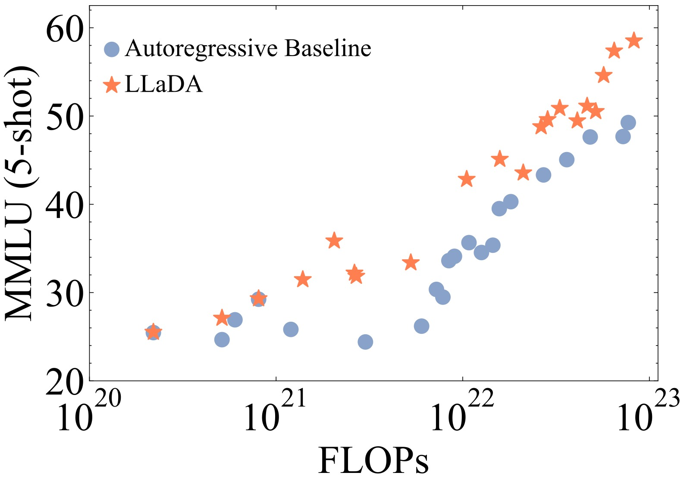<br><em>(a) MMLU</em></td>
<td width="33%">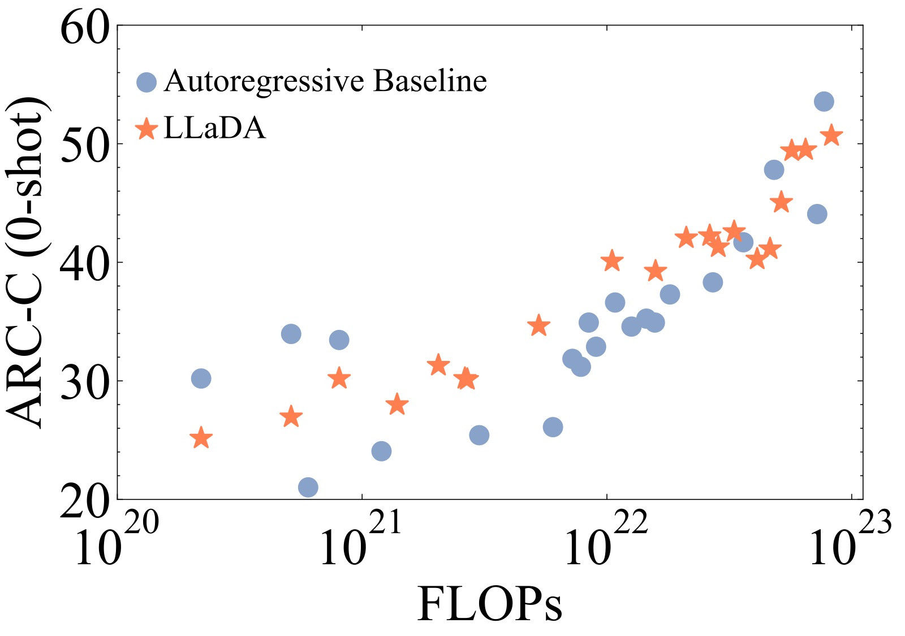<br><em>(b) ARC-C</em></td>
<td width="33%">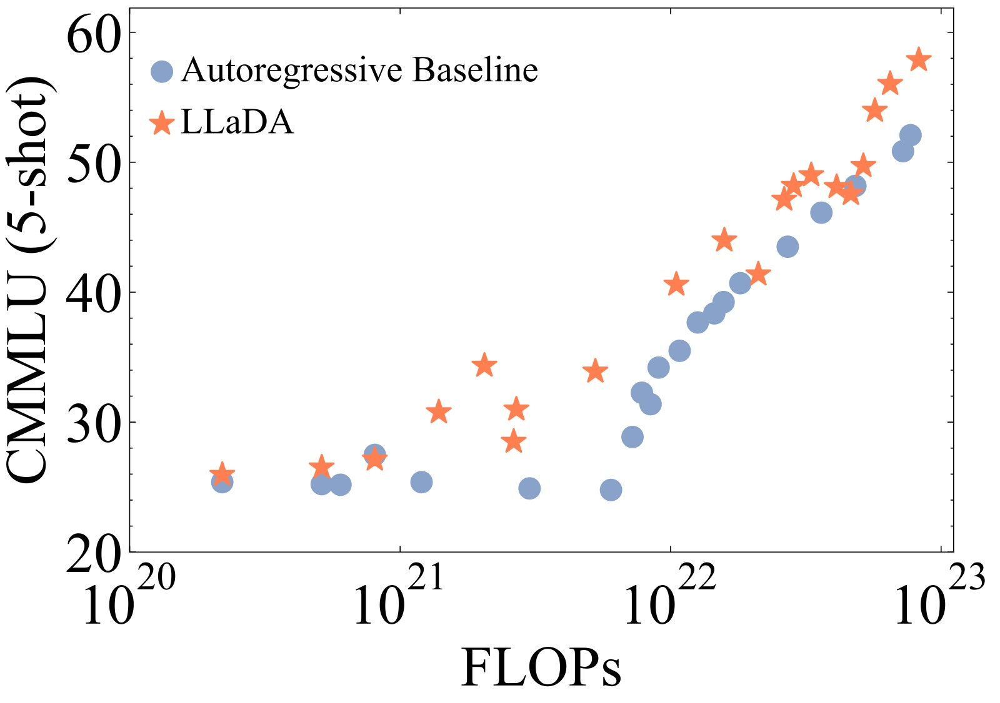<br><em>(c) CMMLU</em></td>
</tr>
<tr>
<td width="33%">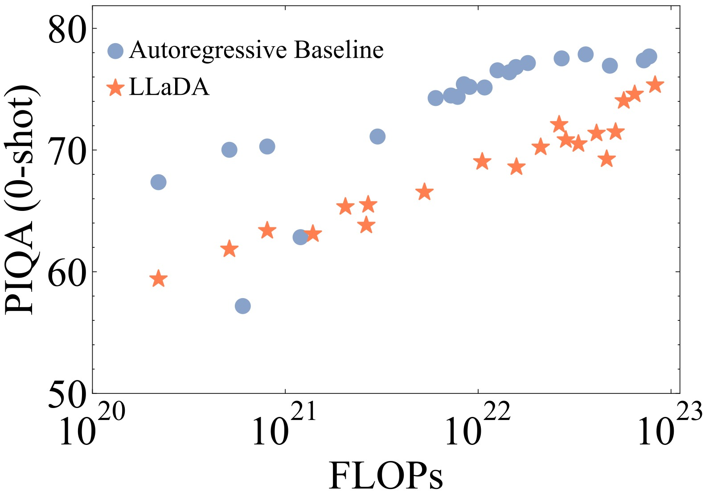<br><em>(d) PIQA</em></td>
<td width="33%">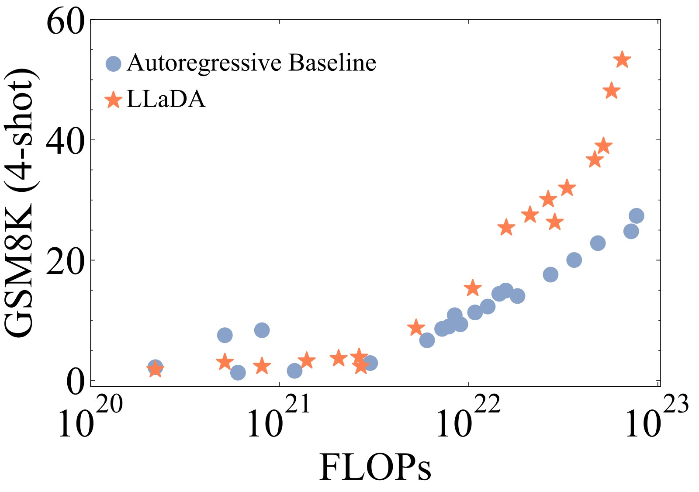<br><em>(e) GSM8K</em></td>
<td width="33%">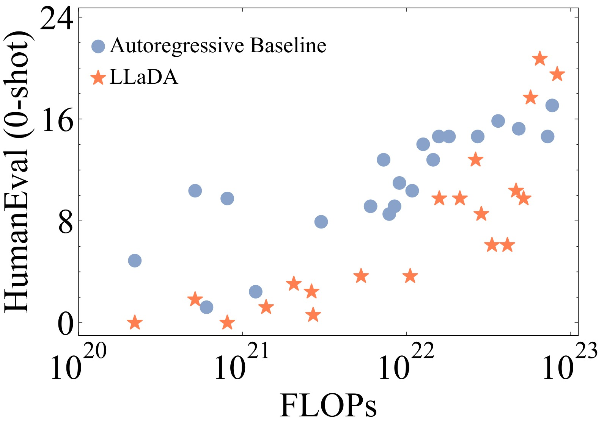<br><em>(f) HumanEval</em></td>
</tr>
</table>

*图3：LLaDA 与自回归基线（ARM）在 6 个任务上的可扩展性对比，横轴为预训练计算量（FLOPs），纵轴为各任务指标。*

**逐子图分析：**

**(a) MMLU（5-shot）：** LLaDA（蓝色）与 ARM（橙色）在 10²⁰∼10²³ FLOPs 区间内的趋势几乎完全平行，且 LLaDA 整体略高于 ARM。这意味着在通用知识理解任务上，扩散模型的扩展效率不逊于自回归模型。

**(b) ARC-C（0-shot）：** LLaDA 略低于 ARM，差距约 2-4 个百分点。但随着计算量增加，差距并未扩大，说明这更多是数据效率的差异而非根本性的架构劣势。

**(c) CMMLU（5-shot，中文多任务理解）：** LLaDA 与 ARM 趋势高度一致。在最大计算量处，LLaDA 甚至略高于 ARM，证明双向建模对中文等多语言任务可能有天然优势。

**(d) PIQA（0-shot，物理常识推理）：** 这是 LLaDA 相对最弱的任务——LLaDA 始终低于 ARM 约 5 个百分点。但随着 FLOPs 增加，差距在缩小。可能原因是 PIQA 需要精确的物理因果链推理，双向建模的信息整合方式在此任务上稍有劣势。

**(e) GSM8K（4-shot，小学数学）：** LLaDA 明显优于 ARM，且在最大计算量处差距最大（约 10 个百分点）。这与 Table 1 中 LLaDA 对 LLaMA3 8B 在 GSM8K 上的巨大优势（70.3 vs 48.7）一致。

**(f) HumanEval（0-shot，代码生成）：** 在低计算量区间 LLaDA 略低，但到 10²³ FLOPs 处已基本追平。说明代码能力可以通过规模扩展弥补。*

### 4.2 基座模型 Benchmark（LLaDA 8B Base）

<table>
<tr>
<td width="48%">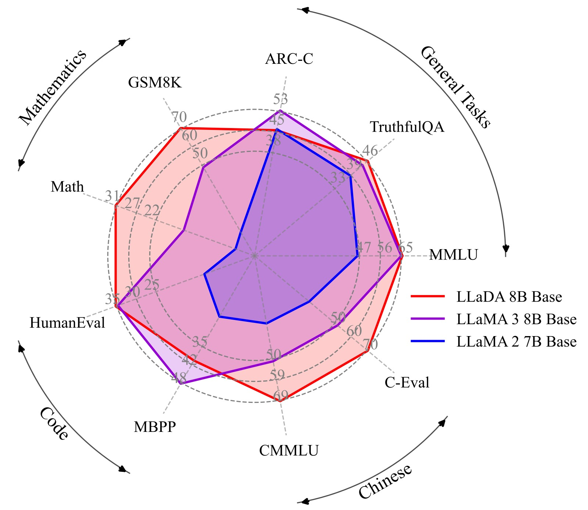<br><em>(a) LLaDA 8B Base vs LLaMA3 8B Base、LLaMA2 7B Base 在 15 个零/少样本任务上的对比</em></td>
<td width="52%">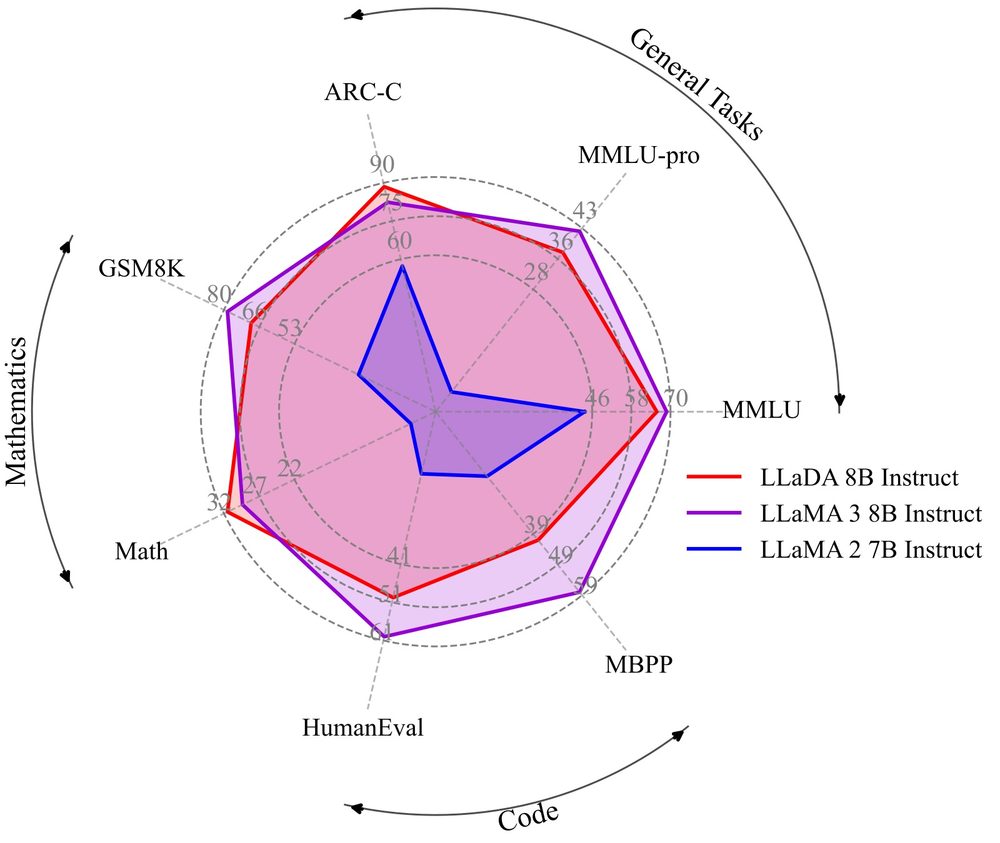<br><em>(b) LLaDA 8B Instruct（仅 SFT）vs 各 Instruct 模型（SFT+RL）</em></td>
</tr>
</table>

*图1：零/少样本 Benchmark 对比。*

| 维度 | LLaDA 8B | LLaMA3 8B | LLaMA2 7B |
|------|----------|-----------|-----------|
| 训练 tokens | 2.3T | 15T | 2T |
| MMLU (5-shot) | **65.9** | 65.4 | 45.9 |
| BBH (3-shot) | 49.7 | **62.1** | 39.4 |
| GSM8K (4-shot) | **70.3** | 48.7 | 13.1 |
| Math (4-shot) | **31.4** | 16.0 | 4.3 |
| HumanEval (0-shot) | **35.4** | 34.8 | 12.8 |
| CMMLU (5-shot) | **69.9** | 50.7 | 32.5 |
| C-Eval (5-shot) | **70.5** | 51.7 | 34.0 |

**核心亮点**：LLaDA 仅用 2.3T tokens 训练（LLaMA3 的 ~1/6.5），在数学和中文任务上对 LLaMA3 8B 形成碾压式优势（GSM8K 高出 21.6 个百分点），同时英文通用任务整体持平。

### 4.3 Instruct 模型 Benchmark（LLaDA 8B Instruct）

*对应图1 (b)。LLaDA 8B Instruct（仅 SFT）与 LLaMA3 8B Instruct（SFT+RL）的对比。LLaDA 在仅使用 SFT 的情况下，多项指标与经过 RL 对齐的 LLaMA3 8B Instruct 接近。*

| 维度 | LLaDA 8B Inst | LLaMA3 8B Inst | 
|------|--------------|----------------|
| 后训练方式 | 仅 SFT | SFT + RL |
| MMLU (5-shot) | 65.5 | **68.4** |
| MMLU-Pro (0-shot) | 37.0 | **41.9** |
| ARC-C (0-shot) | **88.5** | 82.4 |
| GSM8K (4-shot) | 69.4 | **78.3** |
| Math (0-shot) | **31.9** | 29.6 |
| HumanEval (0-shot) | 49.4 | **59.8** |

关键：LLaDA 仅做了 SFT（未做 RLHF / DPO 等对齐），在多项指标上与经过 RL 对齐的 LLaMA3 8B Instruct 非常接近。这说明扩散模型同样能有效学习指令遵循。

### 4.4 反转推理（Reversal Reasoning）

| 模型 | 正向诗歌续写 | 反向诗歌续写 | 差距 |
|------|:---------:|:---------:|:----:|
| GPT-4o | **82.7** | 34.3 | -48.4 |
| Qwen2.5-7B Inst | 75.9 | 38.0 | -37.9 |
| LLaDA-8B Inst | 51.8 | **45.6** | -6.2 |

LLaDA 正反向差距仅 6.2 个百分点，而 GPT-4o 差距高达 48.4。**LLaDA 的反向生成能力超越了 GPT-4o**（45.6 vs 34.3），这是扩散模型天然的**无方向性归纳偏置**带来的优势——在训练中，LLaDA 看到的是被随机掩码的文本，没有固定的左→右方向偏好。

### 4.5 采样效率分析

<table>
<tr>
<td width="50%">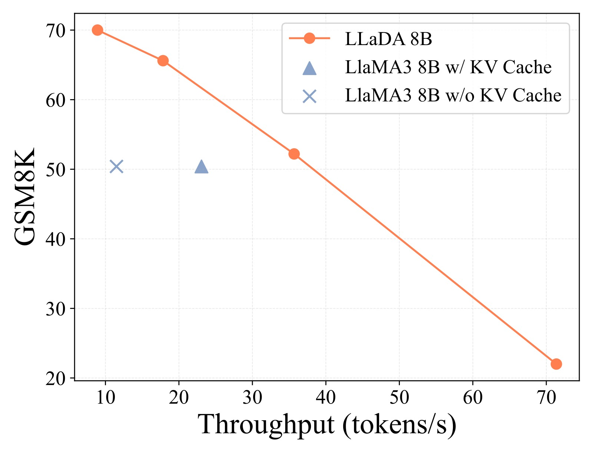<br><em>(a) GSM8K——LLaDA 8B 在 1.5x 吞吐量下持平 LLaMA3 8B</em></td>
<td width="50%">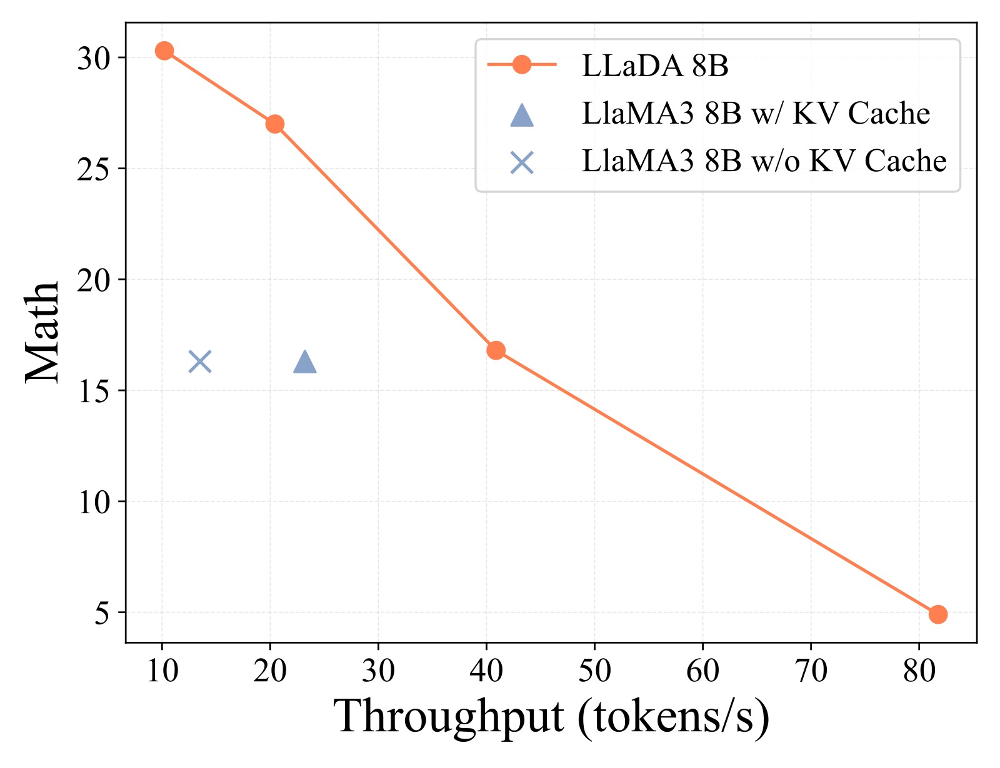<br><em>(b) Math——LLaDA 8B 在 1.8x 吞吐量下持平 LLaMA3 8B</em></td>
</tr>
<tr>
<td width="50%">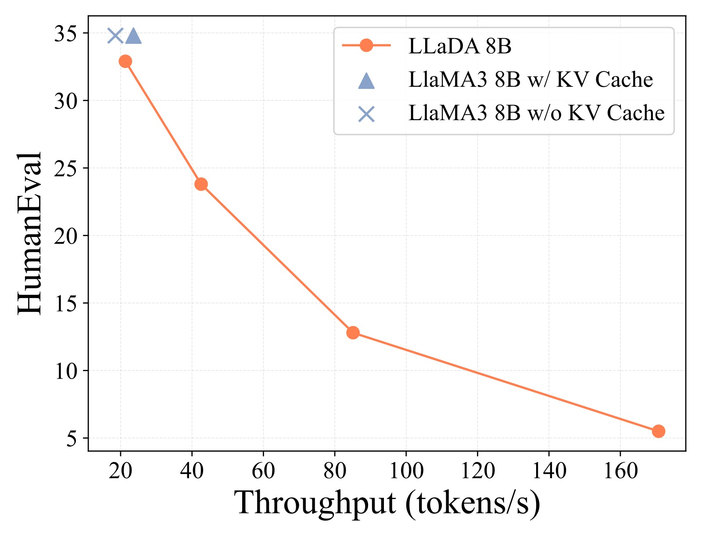<br><em>(c) HumanEval——吞吐量匹配时性能相当</em></td>
<td width="50%">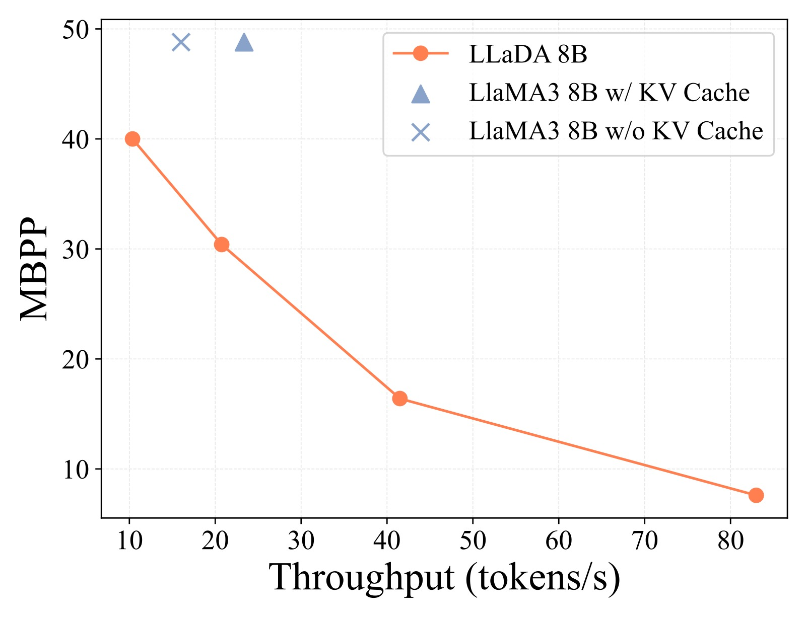<br><em>(d) MBPP——LLaDA 弱于 LLaMA3</em></td>
</tr>
</table>

LLaDA 通过调整采样步数提供了**灵活的质效权衡**：减少步数可以大幅提速，减少到 32 步时在 GSM8K 和 Math 上以比 LLaMA3 更高的吞吐量获得同等性能（尽管 LLaMA3 使用了 KV Cache 而 LLaDA 完全没有推理优化）。

关键结论：**LLaDA 不是为了比 ARM 更快**，而是在没有 KV Cache 等推理优化的情况下已经能在某些任务上达到速度-质量的双赢，说明优化空间很大。

### 4.6 采样策略消融：低置信度 Remask 至关重要

| 策略 | BBH | GSM8K | Math | HumanEval | MBPP |
|------|:---:|:-----:|:----:|:---------:|:----:|
| 随机 Remask | 32.1 | 21.3 | 9.2 | 11.6 | 21.0 |
| 低置信度 Remask | **45.0** | **70.0** | **30.3** | **32.9** | **40.2** |

低置信度 remask 的效果远超随机 remask，类比于自回归模型中的退火采样（annealed sampling），通过降低多样性来提升准确性。

### 4.7 生成过程可视化


*图：LLaDA 8B Instruct 在数学题"Lily can run 12 km/h for 4h, then 6 km/h. How many km in 8h?"上的生成过程可视化。颜色越深表示该 token 在采样后期才被确定，颜色越浅表示早期就被预测出来。*

这张图展示了扩散语言模型非自回归生成过程的独特特性：

1. **关键中间结果被早期锁定**：`12 × 4 = 48` 等计算步骤在采样早期（浅色）就被确定，说明 mask predictor 在全局信息充足的条件下能高置信度地一次性预测出计算中间值。
2. **最终答案可能出现得比中间步骤更早**：有时"72"这个最终答案的 token 会比 `12 × 4 = 48` 中的某些 token 更早被确定。这是因为 mask predictor 在一次前向传播中同时预测所有被掩码位置，它可能先"猜到"最终答案的模式，再去补充中间推理。
3. **与自回归模型的本质差异**：自回归模型必须按序生成"先计算 12×4=48，再计算 4×12+6×4=72"，而 LLaDA 可以先看到全局结构再填充细节。

---

## 五、关键洞察与技术亮点

### 5.1 "生成式建模原理 > 自回归形式"

论文最核心的哲学主张。可扩展性主要来自 Transformer + 大模型 + 大数据 + Fisher 一致性（由最大似然框架保证），而非自回归形式独有。扩散 Transformer 在视觉领域的成功就是佐证。

### 5.2 时间无关参数化（Time-free Parameterization）

MDM 的关键理论结果之一是：**mask predictor 不需要时间 $t$ 作为输入**。原因是数据预测函数 $q_{0|t}(x_s^i|x_t)$ 等价于在未掩码 token 条件下的干净数据条件分布 $p_{\textrm{data}}(x_0^{i}|x_t^{\textrm{UM}})$，而后者与 $t$ 无关。这意味着 LLaDA 可以直接使用标准 Transformer（不加时间嵌入）作为 mask predictor。

### 5.3 天然双向建模 → 打破反转诅咒

LLaDA 的训练等价于**任意顺序自回归模型（any-order autoregressive model）**的期望训练目标，这使它天然具有双向推理能力，无需任何特殊设计。这也是它在反转诗歌任务上超越 GPT-4o 的根本原因。

### 5.4 推理灵活性：纯扩散、自回归、块扩散三者通吃

同一个预训练/SFT 后的 LLaDA 模型，无需任何修改或重新训练，即可支持三种采样策略：

<table>
<tr>
<td width="25%">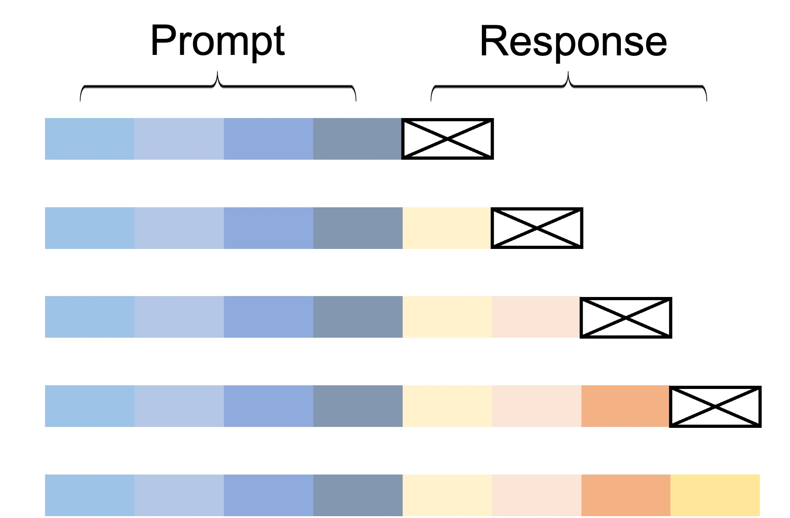<br><em>(a) 自回归：逐 token 左→右生成</em></td>
<td width="37%">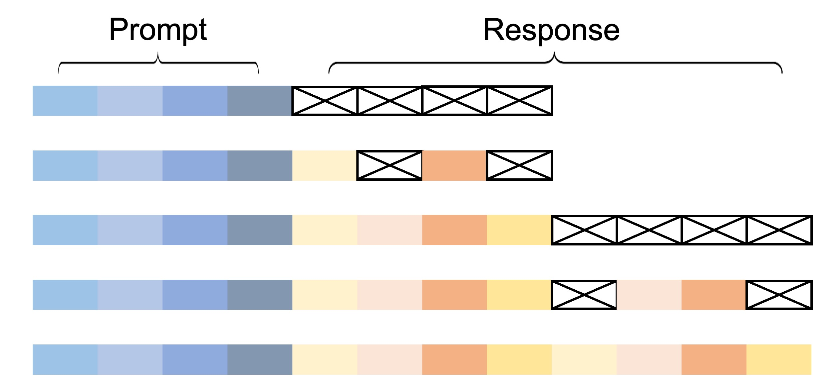<br><em>(b) 块扩散（原版）：块间自回归、块内扩散，序列长度动态变化</em></td>
<td width="37%">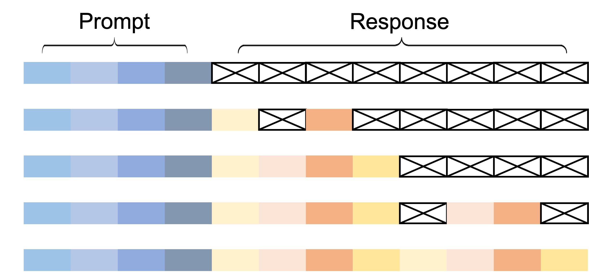<br><em>(c) 块扩散 LLaDA：固定块长度，块间半自回归 + 块内扩散</em></td>
</tr>
</table>

*图：LLaDA 支持的三种灵活采样策略。彩色方块为已生成的 token，× 为当前掩码的 token。图示块长度为 4。*

- **纯扩散**：全局同时去掩码，性能最佳（全文默认）
- **块扩散 LLaDA（semi-autoregressive）**：固定块长度，块间自回归、块内扩散，Instruct 模型的 GSM8K 可达 78.6
- **纯自回归**：逐 token 左→右，Base 模型可用，但 Instruct 模型效果差（SFT 数据是完整句子）

### 5.5 训练稳定性

2.3T tokens 预训练中仅 crash 1 次（1.2T 处），恢复后降学习率即可。训练只跑了一次，无超参调优。

---

## 六、代码实现解读

LLaDA 的实现极其简洁——从自回归模型代码出发，只需寥寥数行修改。

### 6.1 模型架构：去掉 Causal Mask

```
LLaMA 的 Transformer Decoder:
┌──────────────────────────────────────┐
│  Input → RMSNorm → Attention        │
│                    (causal mask)     │
│         → RMSNorm → FFN (SwiGLU)    │
│         → Output                     │  × 32 layers
└──────────────────────────────────────┘

LLaDA 的 Transformer Encoder:
┌──────────────────────────────────────┐
│  Input → RMSNorm → Attention        │
│                    (no causal mask)  │
│         → RMSNorm → FFN (SwiGLU)    │
│         → Output                     │  × 32 layers
└──────────────────────────────────────┘
```

唯一的变化：删除自注意力中的因果掩码。模型权重结构完全相同，可直接从 ARM checkpoint 转化。

### 6.2 预训练核心代码

```python
def forward_process(input_ids, eps=1e-3):
    b, l = input_ids.shape
    t = torch.rand(b, device=input_ids.device)        # t ~ U(0,1)
    p_mask = (1 - eps) * t + eps
    p_mask = p_mask[:, None].repeat(1, l)
    masked_indices = torch.rand((b, l)) < p_mask       # 每个 token 独立以 t 概率掩码
    noisy_batch = torch.where(masked_indices, 126336, input_ids)  # 126336 = [MASK]
    return noisy_batch, masked_indices, p_mask

# 损失计算
logits = model(input_ids=noisy_batch).logits
token_loss = F.cross_entropy(logits[masked_indices], 
                              input_ids[masked_indices], 
                              reduction='none') / p_mask[masked_indices]
loss = token_loss.sum() / (input_ids.shape[0] * input_ids.shape[1])
```

**论文公式 → 代码映射**：

| 论文公式 | 代码行 | 说明 |
|---------|--------|------|
| $t \sim U[0,1]$ | `torch.rand(b)` | 为每个样本独立采样掩码比率 |
| $x_t \sim q_{t\|0}(x_t\|x_0)$ | `torch.rand() < p_mask` | 每个 token 以概率 t 独立掩码 |
| $\frac{1}{t} \sum \mathbf{1}[x_t^i=\textrm{M}] \log p_\theta$ | `cross_entropy(...) / p_mask[masked_indices]` | 仅对掩码位置计算加权交叉熵 |

### 6.3 SFT 核心代码

```python
# SFT 关键差异：不对 prompt 部分加噪声
noisy_batch, _, p_mask = forward_process(input_ids)
prompt_mask = (token_positions < prompt_lengths.unsqueeze(1))
noisy_batch[prompt_mask] = input_ids[prompt_mask]  # 保持 prompt 原样

# 按 answer 长度归一化
token_loss = F.cross_entropy(logits[masked_indices], 
                              input_ids[masked_indices], 
                              reduction='none') / p_mask[masked_indices]
ce_loss = torch.sum(token_loss / answer_lengths[masked_indices]) / input_ids.shape[0]
```

### 6.4 推理采样流程

```
                    ┌──────────────────────────┐
                    │  r₁ = 全 [MASK] 序列      │
                    │  t = 1                    │
                    └───────────┬──────────────┘
                                │
            ┌───────────────────▼───────────────────┐
            │  for step in 1..N:                    │
            │    s = t - 1/N                        │
            │                                       │
            │    ┌──────────────────────────┐      │
            │    │  mask_predictor(p₀ + rₜ) │      │ 预测所有 [MASK]
            │    └───────────┬──────────────┘      │
            │                │                     │
            │    ┌───────────▼──────────────┐      │
            │    │  argmax + 低置信度 remask  │      │ 保留高置信度 ← 低置信度 → [MASK]
            │    │  保留 (1-s) 个 token      │      │
            │    └───────────┬──────────────┘      │
            │                │                     │
            │    rₛ = 更新后的序列                  │
            │    t = s                              │
            └───────────────────┬───────────────────┘
                                │
                    ┌───────────▼──────────────┐
                    │  r₀ = 完整生成文本         │
                    └──────────────────────────┘
```

**remask 策略核心**：
- **随机 remask**：随机选择 $\frac{s}{t}$ 比例的已预测 token 重新掩码
- **低置信度 remask**：选择预测置信度最低的 $\frac{s}{t}$ 比例 token 重新掩码（默认策略，效果远超随机）

低置信度 remask 的作用类似自回归模型中的 temperature sampling / top-k——它保留了高置信度的预测，让模型在后续步骤中有机会修正低置信度部分。

### 6.5 采样策略对比

LLaDA 同一模型支持三种策略：

| 策略 | 流程 | Base 性能 | Instruct 性能 |
|------|------|:--------:|:-----------:|
| 纯扩散 | 全局同时去掩码 | **最优** | **最优**（数学任务除外） |
| 块扩散 LLaDA | 块间半自回归 + 块内扩散 | 次优 | 数学最优（GSM8K 78.6） |
| 纯自回归 | 逐 token 左→右 | Base 可用 | Instruct 不可用 |

---

## 七、局限性

1. **生成长度需要手动指定**：虽然实验证明结果对此不敏感，但要实现真正自适应的生成长度还需改进。

2. **推理速度仍有差距**：无 KV Cache，固定长度 + 多步采样，当前最优配置下比 LLaMA3 慢。但论文明确指出这是上限探索而非效率优化，类比扩散图像模型从 DDPM 到 Consistency Model 近千倍加速的历程。

3. **计算资源限制**：未能在同等数据量上训练 ARM 基线（ARM 最高 7B，而 LLaDA 8B 的对比模型 LLaMA3 8B 用了 15T tokens vs 2.3T tokens）。

4. **未做 RL 对齐**：Instruct 模型仅 SFT，缺少 RLHF/DPO 等对齐过程。

5. **无 KV Cache 的替代方案**：未设计专门的注意力机制或位置编码优化推理效率。

6. **仅探索文本模态**：多模态扩散语言模型的潜力尚未涉及。

---

## 八、关键概念速查

| 概念 | 说明 |
|------|------|
| **Masked Diffusion Model (MDM)** | 通过前向随机掩码 + 反向去掩码定义生成过程的一类离散扩散模型 |
| **Mask Predictor** | LLaDA 核心组件，输入部分掩码的文本，同时预测所有掩码位置 |
| **Low-confidence Remasking** | 推理时保留高置信度的预测，将低置信度预测重新掩码，让后续步骤修正 |
| **Time-free Parameterization** | 理论上证明 mask predictor 不需要时间 t 作为输入，可直接使用标准 Transformer |
| **Any-order Autoregressive (AO-ARM)** | LLaDA 的训练目标等价于所有可能解码顺序的自回归模型的期望 |
| **Fisher Consistency** | 模型在无限数据和足够大容量下能恢复真实数据分布，保证可扩展性 |
| **Reversal Curse** | 自回归模型因单向生成而在反向推理任务上表现不佳的现象 |
| **Classifier-free Guidance (CFG)** | 无需分类器即可在采样时调节与 prompt 对齐度的技术，LLaDA 兼容但主实验未使用 |
| **Block Diffusion** | 将文本分块，块间自回归、块内扩散的混合采样策略 |
| **Warmup-Stable-Decay** | 预热 → 稳定 → 衰减的三阶段学习率调度策略，无需中断训练即可监控进度 |

---

*笔记生成时间：2026-05-29*
