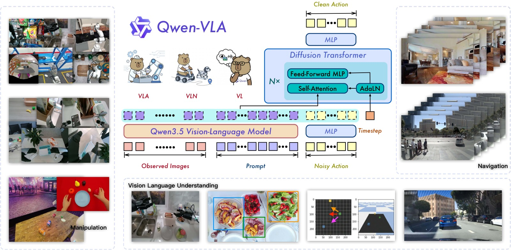
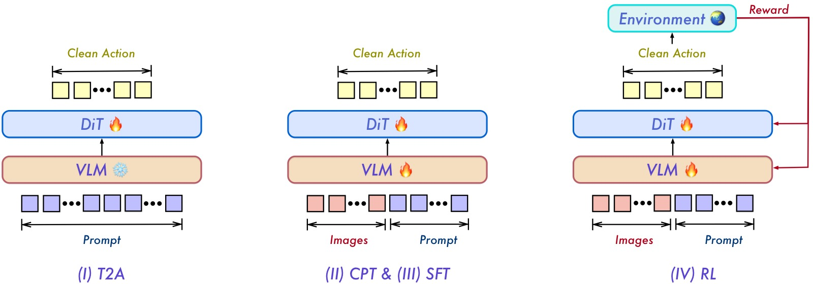
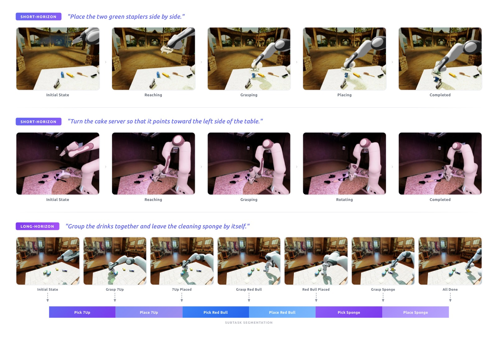
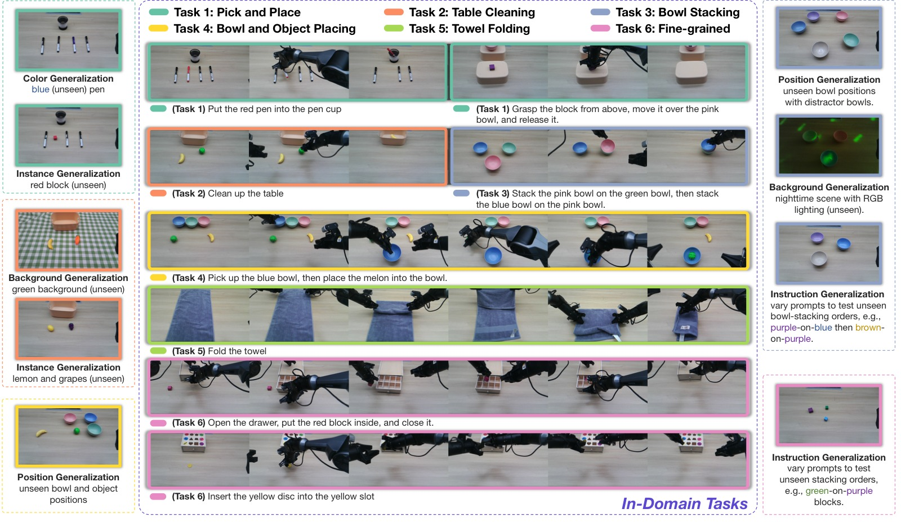
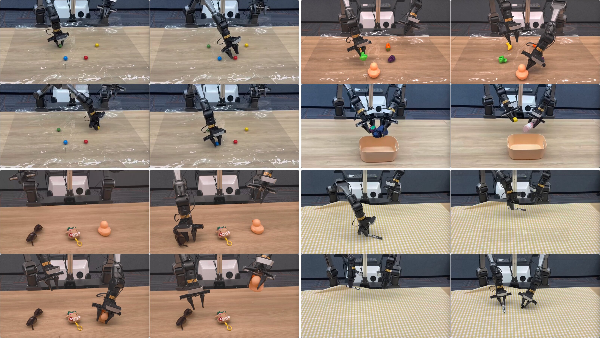
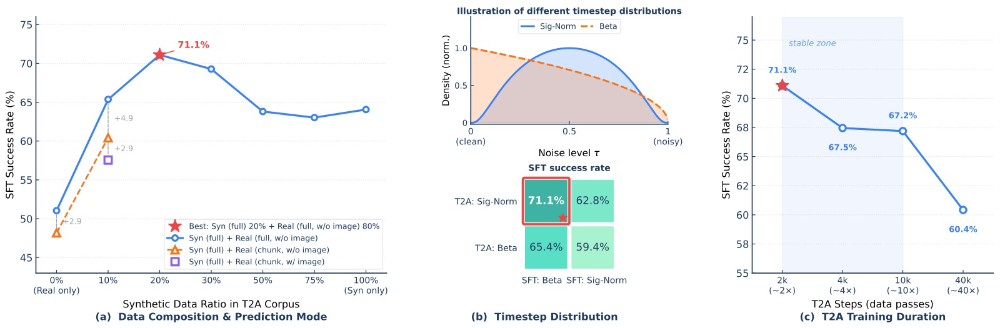
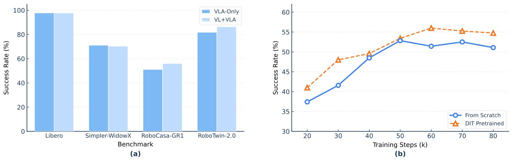

<!-- arxiv: 2605.30280 -->
<!-- venue: 千问VLA技术报告 -->
<!-- tags: VLA, 泛化 -->

# Qwen-VLA: Unifying Vision-Language-Action Modeling across Tasks, Environments, and Robot Embodiments

> **论文信息**
> - 作者：Qwen Team（核心贡献者：Qiuyue Wang\*, Mingsheng Li\*, Jian Guan\*, Jinhui Ye 等）
> - 通讯作者：Shuai Bai
> - 投稿方向：千问VLA技术报告
> - arXiv ID：2605.30280
> - 模型规模：VLM backbone Qwen3.5-4B + DiT action decoder ~1.15B

---

## 一、核心问题

当前具身智能模型高度碎片化：操作（manipulation）模型针对桌面或灵巧手控制设计，导航（navigation）模型围绕室内航点预测设计，人类自我中心（egocentric）动作建模又是一个独立范式。每个模型只服务单一场景、单一机器人本体（embodiment），跨任务、跨环境、跨本体的泛化能力很弱。

本文的核心主张是：**操作、导航、轨迹预测等异构具身任务可以被统一为一个"动作-轨迹预测"问题**。尽管这些任务在输出格式、控制频率、动作维度上差异很大，但它们共享相同的计算结构——智能体必须基于视觉观测、语言指令和本体约束，预测物理上合理且语义对齐的未来动作或轨迹。

> 一句话：用一个模型统一所有具身决策任务。

---

## 二、核心思路 / 方法

### 2.1 统一问题建模

在时间步 $t$，模型接收：

- **视觉上下文** $o_t$（单帧/多帧图像或视频）
- **语言指令** $x$
- **本体描述** $e$（如"Franka Panda 单臂，控制频率 20Hz"）
- **任务标识符** $z$（可选）

模型预测未来 $H$ 步的目标序列：

$$p_\theta(y_{t:t+H-1} \mid o_t, x, e, z)$$

其中 $y$ 可以是：末端执行器位姿、关节角度、导航航点 $(\Delta x, \Delta y, \Delta\theta)$、人类手部 MANO 参数等——全部放入统一的张量格式。

*图1：Qwen-VLA 整体概览。模型接收多视角视觉观测、语言指令和本体描述提示，通过 Qwen3.5-4B VLM backbone 编码后，由 DiT 流匹配 action decoder 生成操作/导航/轨迹预测的统一动作输出。训练数据涵盖操作轨迹、导航数据、自我中心人类演示、合成仿真数据和视觉-语言数据，实现跨任务、跨本体的统一建模。*

### 2.2 模型架构

模型由两部分组成：

**【VLM Backbone】Qwen3.5-4B**
- 原生多模态模型，ViT + 空间合并（spatial merging）后视觉 token 与文本 token 交织输入
- 混合注意力设计：大部分层用 gated linear attention（高效编码长序列），间隔层用 grouped-query softmax attention（保留全精度全局推理）
- 提供细粒度视觉感知、指称定位（referential grounding）、多语言指令跟随和结构化推理能力

**【Action Expert】DiT-style Flow-Matching Decoder (~1.15B 参数)**
- 单流 DiT（Diffusion Transformer）架构，将 VLM 隐藏状态与噪声动作块拼接后进行联合自注意力
- 使用 AdaLN 时间步调节（timestep conditioning）和多段 RoPE
- 训练目标：流匹配（flow matching），推理时用少量 Euler 积分步生成动作序列
- 16 个 DiT block（每个 70.8M，合计 1.13B）+ 投影 MLP（4.9M）+ VLM→DiT 线性映射（3.9M）+ 时间步嵌入（2.8M）+ AdaLN 调制（4.7M）

### 2.3 Embodiment-Aware Prompt Conditioning（本体感知提示调节）

这是本文实现跨本体统一的**关键设计**。每个训练样本前添加一个文本提示：

> *The robot is {robot_tag} with {single arm / dual arms}[, waist][, and mobile base]. The control frequency is {FPS} Hz. Please predict the next {chunk_size} control actions to execute the following task: {instruction}.*

这个提示是模型与特定本体之间的**唯一接口**。不同的机器人平台（WidowX、Franka Panda、Mobile ALOHA、AgiBot A2-D 等）、不同的控制模式（增量末端位姿/绝对关节角度/夹爪状态/灵巧手关节）、不同的预测视野（如 16 步或 8 步）——全部通过这段文本描述来区分，不需要任何架构修改。

**支持的机器人平台**（训练语料覆盖 10+ 种）：

| 机器人 | 臂配置 | 动作类型 |
|--------|--------|----------|
| WidowX | 单臂 | ΔEEF + 夹爪 |
| Google Robot | 单臂 | ΔEEF + 夹爪 |
| Franka Panda | 单/双臂 | ΔEEF + 夹爪; 绝对关节 + 夹爪 |
| ARX5 | 双臂 | ΔEEF + 夹爪 |
| Fourier GR-1 | 双臂 | ΔEEF + 夹爪 |
| Mobile ALOHA | 双臂 | ΔEEF + 夹爪; 绝对关节 + 夹爪 |
| AgiBot A2-D | 双臂 | 绝对关节 + 夹爪/灵巧手 |
| AIRBOT MMK2 | 双臂 | 绝对关节 + 灵巧手 |
| TienKung | 双臂 | 绝对关节 + 夹爪/灵巧手 |
| Real Human | 双臂 | ΔEEF（MANO 参数） |

### 2.4 统一动作与轨迹表示

不同本体的动作维度和语义各不相同（如 7-DoF 机械臂 vs 29-DoF 全身控制）。Qwen-VLA 的方案是：

1. **统一张量接口**：所有动作表示为 $\mathbf{Y} \in \mathbb{R}^{H \times K}$，其中 $H$ 是预测视野，$K$ 是固定的最大通道数
2. **Zero-Padding**：短动作向量右侧补零到 $K$ 维，用二值掩码 $\mathbf{M}$ 标记有效维度
3. **不对齐物理语义**：不强制将不同本体的动作映射到同一物理空间，保留各数据集的原始控制约定
4. **投影设计**：最终采用 Zero-Padding 方式，仅需 $2h \cdot d_{\max}$ 个参数（对比 Multi-MLP 和 Concatenation 的 $2h\sum_i d_i$），在 Bridge 和 RoboCasa 上与单本体训练持平

对于人类自我中心数据，动作表示为双手腕部 SE(3) 变换（每手 6 维）+ "eigengrasp" 系数（通过 PCA 将 45 维手部关节缩减到 10 维），总计每时间步 32 维。

---

## 三、训练目标与训练流程

### 3.1 训练目标

联合优化两个损失：

**流匹配动作损失** $\mathcal{L}_{\text{act}}$：
- 给定干净目标 $\mathbf{Y}_0$ 和噪声 $\mathbf{Y}_1 \sim \mathcal{N}(0, \mathbf{I})$，线性插值 $\mathbf{Y}_\tau = (1-\tau)\mathbf{Y}_0 + \tau\mathbf{Y}_1$
- 训练 DiT $v_\theta$ 预测条件速度场 $v_\theta(\mathbf{Y}_\tau, \tau \mid o, x, e, z)$
- 使用逐通道、逐步的 mask-aware 损失：先对每个有效通道计算 MSE，再均匀平均所有有效通道

**视觉-语言损失** $\mathcal{L}_{\text{vl}}$：标准 next-token prediction，防止 backbone 遗忘

$$\mathcal{L} = \lambda_{\text{act}} \mathcal{L}_{\text{act}} + \lambda_{\text{vl}} \mathcal{L}_{\text{vl}}$$

### 3.2 四阶段训练流程

*图2：Qwen-VLA 四阶段训练流程。Stage I（T2A）：冻结 VLM，仅用文本和本体提示训练 DiT 动作解码器——学习语言到动作的"解压缩"映射。Stage II（CPT）：解冻两个模块，引入视觉观测，在异构数据混合上进行多模态继续预训练。Stage III（SFT）：从 CPT 检查点分叉为多任务 SFT 和真机 SFT 两条路线。Stage IV（RL）：在单一仿真环境（SimplerEnv）中用 PPO + 稀疏成功奖励进行强化学习，优化闭环任务成功率。*

#### Stage I：Text-to-Action DiT Pretraining（T2A）

**这是本文最具特色的设计**。核心思路来自一个"压缩"视角：

- 语言指令 + 本体提示只占几个 token，编码了紧密的任务意图
- 而完整动作轨迹可能包含数百个高维关节值
- 这个维度差距构成了一个**结构化解压缩问题**

T2A 的做法：**冻结 VLM，只用文本和本体提示训练 DiT，刻意不喂图像**。让解码器学会纯粹的"语言→动作"解压缩映射：

- 哪些语言描述对应哪些动作分布区域
- 本体提示如何将同一任务意图调制为不同平台的运动程序
- 完整动作轨迹的时间连贯性和组合性

这样一来，后续的多模态训练可以把全部容量用于"将已有的动作先验与视觉观测对齐"，而不是从零开始学动作生成。

#### Stage II：Continued Pretraining（CPT）

解冻 VLM + DiT，在所有异构数据混合上训练。这一步的关键作用是：
- 将 T2A 阶段学到的动作先验与视觉观测对齐
- 让 backbone 适应具身感知（多视角、场景变化、物理交互）
- 同时接触仿真和真机数据，为后续微调打好基础

CPT 后产出 **Qwen-VLA-Base**。

#### Stage III：Supervised Fine-Tuning（SFT）

分两条线：
1. **多任务 SFT**：在 VQA、空间定位、操作、导航等任务上联合微调，用本体平衡和任务平衡采样
2. **真机 SFT**：在内部遥操作数据上微调，验证 CPT 的跨域先验能否迁移到物理硬件

#### Stage IV：Reinforcement Learning（RL）

使用 PPO + GAE，仅在 SimplrEnv 中收集 rollout，用稀疏二元成功奖励（$R=1$ 成功 / $R=0$ 失败）。

几个关键设计：
- **价值估计**：在 VLM backbone 上附加轻量 value head（mean-pool 所有隐藏状态 → 线性投影），对 backbone 做 stop-gradient
- **流匹配下的对数概率估计**：将确定性概率流 ODE 转为 SDE（注入受控噪声），使每步去噪的 log-prob 可解析计算
- **动作块级信用分配**：每 16 步动作块共享一个标量奖励和一个优势估计
- **128 个并行环境**，每迭代 8,192 个转移块

RL 后产出 **Qwen-VLA-Instruct**。

---

## 四、预训练数据

*图3：通过 RoboInF 生成的合成仿真数据示例。上图：短视距任务——"将两个绿色订书机并排放置"，包含抓取、搬运、放置的紧凑序列。下图：长视距任务——"将饮料归拢到一起，清洁海绵单独放置"，需要依次操作多个物体。每个完整轨迹还被自动分割为子任务轨迹，提供多时间粒度的监督信号。*

预训练数据混合涵盖 8 个数据族，按采样权重排序：

| 数据来源 | 占比 | 说明 |
|----------|------|------|
| 机器人操作轨迹 | 74.2% | 公开数据集（RobotSet, DROID, BridgeData V2, RT-1 等）+ 内部 1000+ 小时遥操作数据 |
| 导航轨迹 | 7.5% | 指令跟随（4.3%）+ 物体搜索（2.3%）+ 目标跟踪（1.0%） |
| 人类自我中心轨迹 | 6.0% | Ego4D, EPIC-KITCHENS, EgoDex, EgoVerse, Xperience |
| 合成仿真轨迹 | 3.7% | RoboInF 生成的视觉-语言-动作数据 + 语言-动作数据（>8M 轨迹） |
| 通用视觉-语言数据 | 3.4% | Captioning, VQA, OCR, 空间关系预测等 |
| 空间定位（2D） | 2.5% | 2D 边界框定位，强化物体级空间理解 |
| 自动驾驶 VQA | 2.4% | LingoQA, nuScenes-QA, DriveLM 等 |
| 细粒度具身动作描述 | 0.2% | 48K 视频-描述对，13 维标注 |

**人类自我中心数据的特殊处理**：手部动作表示为双手腕部 SE(3) 变换 + eigengrasp（PCA 降维到 10 维），总计每步 32 维。

**合成数据的两类**：
- **视觉-语言-动作数据**：基于 RoboInF，20 个桌面场景 × 10 种物体初始位姿 = 200 种基础配置，450 个操作任务（含短视距和长视距），每个任务 300 条成功轨迹，共 359,848 条含子任务分割的轨迹
- **语言-动作数据**：6 种任务模板（pick-place、线性推/拉、旋转等），6 种单臂机器人，每对约 200K 轨迹，合计 720 万条轨迹、14000+ 小时

---

## 五、实验与结果

### 5.1 仿真操作结果

| 方法 | 类型 | LIBERO | RoboCasa-GR1 | Simpler-WidowX | RoboTwin-Easy | RoboTwin-Hard |
|------|------|--------|-------------|----------------|---------------|---------------|
| π₀ | 专家 | 94.4 | — | — | 65.9 | 58.4 |
| StarVLA-OFT | 专家 | 96.6 | 48.8 | 64.6 | 50.4 | — |
| GR00T N1.6 | 专家 | 97.2 | 49.9 | 63.2 | 47.6 | — |
| π₀.₅ | 专家 | 97.6 | 37.0 | 46.9 | 82.7 | 76.8 |
| ABot-M0 | 专家 | **98.6** | **58.3** | — | 86.0 | 85.0 |
| Being-H0.5 | 专家 | 97.6 | 53.3 | — | — | — |
| **Qwen-VLA-Base** | **通用** | 90.8 | 40.4 | 64.3 | 64.3 | 66.4 |
| **Qwen-VLA-Instruct** | **通用** | **97.9** | **56.7** | **73.7** | **86.1** | **87.2** |

**关键发现**：
1. **One model beats most specialists**：单个通用模型超越大多数专家模型。RoboTwin-Easy/Hard 上甚至超越所有专家（86.1%/87.2%）
2. **预训练提供强基础**：Base 模型已具备不错的性能（LIBERO 90.8%），说明大规模预训练学到了可迁移的操作原语
3. **SFT + RL 带来显著提升**：Instruct 相比 Base 在所有 benchmark 上平均提升 10+ 个百分点

### 5.2 真机操作结果（ALOHA 双臂平台）

*图4：ALOHA 双臂平台上的真机评估任务概览。涵盖 6 个分布内任务类别（抓取放置、桌面清理、碗叠放、碗取物放置、毛巾折叠、精细操作）和 5 个分布外泛化维度（颜色泛化、实例泛化、位置泛化、背景泛化、指令泛化），测试模型在不同难度和泛化要求下的综合表现。*

**分布内任务结果（success rate %）**：

| 模型 | 短视距任务 | | | 长视距任务 | | | 平均 |
|------|-----------|--------|--------|------------|--------|--------|------|
| | Pick&Place | Table Clean | Bowl Stack | Bowl P&P | Towel Fold | Fine-grained | |
| GR00T N1.6 | 30.8 | 38.5 | 53.8 | 19.2 | 19.2 | 10.3 | 28.6 |
| π₀.₅ | 73.1 | 84.6 | 88.5 | 69.2 | **80.8** | 33.3 | 71.6 |
| Qwen-VLA-aloha（无预训练） | 30.8 | 53.8 | 61.5 | 64.1 | 50.0 | 30.8 | 48.5 |
| **Qwen-VLA-aloha（有预训练）** | **96.2** | **92.3** | **98.7** | **87.2** | 65.4 | **61.5** | **83.6** |

**分布外泛化结果**：

| 模型 | 颜色 | 实例 | 位置 | 背景 | 指令 | 平均 OOD |
|------|------|------|------|------|------|----------|
| GR00T N1.6 | 46.2 | 38.5 | 3.8 | 19.2 | 19.2 | 25.4 |
| π₀.₅ | 57.7 | 61.5 | 19.2 | 26.9 | 42.3 | 41.5 |
| Qwen-VLA-aloha（无预训练） | 42.3 | 30.8 | 34.6 | 30.8 | 42.3 | 36.2 |
| **Qwen-VLA-aloha（有预训练）** | **88.5** | **76.9** | **53.8** | **80.8** | **84.6** | **76.9** |

> 有预训练 vs 无预训练的 OOD 平均差距高达 40.7 个百分点——**预训练对泛化能力的贡献远大于架构本身**。

*图5：Qwen-VLA-Base 在 ALOHA 双臂机器人上的定性分布外泛化结果。左上：颜色条件抓取（绿/蓝/红/黄色球），模型正确识别目标颜色并生成准确轨迹。右上：上两格为未见物体抓取（西兰花、玩具鸭），下两格为组合任务"清理桌面"——依次捡起蓝伞、玩具鸭、瓶装酸奶放入收纳盒。左下：与完全未见物体交互（太阳镜、毛绒玩偶、玩具鸭），"approach" 动作本身也几乎不在操作数据中出现。右下：在未见过的黄色背景前完成拔笔帽并放置笔帽的两阶段精细操作，背景不变性表明模型关注任务相关物体而非背景。*

### 5.3 导航结果（VLN-CE）

| 方法 | R2R Val-Unseen | | | | RxR Val-Unseen | | | |
|------|----------------|-----|------|------|----------------|------|------|------|
| | NE↓ | OS↑ | SR↑ | SPL↑ | NE↓ | SR↑ | SPL↑ | nDTW↑ |
| NaVid | 5.7 | 49.2 | 41.9 | 36.5 | **5.7** | 45.7 | 38.2 | — |
| StreamVLN | **5.0** | 64.2 | 56.9 | **51.9** | 6.2 | 52.9 | 46.0 | **61.9** |
| **Qwen-VLA-Base** | 5.2 | 61.7 | 53.8 | 49.4 | 6.4 | 55.1 | 45.8 | 56.2 |
| **Qwen-VLA-Instruct** | 5.1 | **69.0** | **57.5** | 51.2 | 5.8 | **59.6** | **47.8** | 57.1 |

Instruct 在 R2R 和 RxR 的大多数指标上达到最优，尤其是 Oracle Success（69.0）和 Success Rate（57.5/59.6），表明 VLA + VLN 联合训练没有牺牲单任务性能。

### 5.4 分布外泛化

**静态 OOD（SimplerEnv-OOD）**：模型仅在 Bridge 数据集（简单 pick-place）上微调，评估 6 个未见任务类型（位置泛化、区域约束、颜色推理倒序）。Qwen-VLA-Instruct 平均 SR 32.0%，π₀.₅ 仅 12.6%。

**动态操作 OOD（DOMINO，零样本）**：

| 方法 | SR (%)↑ | MS↑ |
|------|---------|-----|
| *动态操作数据微调的模型* | | |
| π₀.₅（微调） | 9.6 | 26.2 |
| PUMA（微调） | 17.2 | 35.0 |
| *零样本到动态操作* | | |
| π₀.₅（零样本） | 7.5 | 20.4 |
| LingBot-VA | 24.1 | 36.1 |
| **Qwen-VLA-Base** | 21.1 | 37.4 |
| **Qwen-VLA-Instruct** | **26.6** | **39.5** |

> Qwen-VLA-Instruct 在零样本条件下超越所有动态微调的基线模型，比 PUMA（专门在 DOMINO 上微调并使用时序运动输入）高出 9.4 个百分点的 SR。模型仅使用当前帧观测，没有任何动态操作微调——证明了统一动作-轨迹预训练学到的可迁移空间-运动先验。

### 5.5 后训练阶段消融

| 阶段 | Simpler | RoboCasa | RoboTwin-E | RoboTwin-H | LIBERO | SimplerOOD | DOMINO SR | DOMINO MS |
|------|---------|----------|------------|------------|--------|------------|-----------|-----------|
| CPT（Base） | 64.3 | 40.4 | 64.3 | 66.4 | 90.8 | 25.3 | 21.1 | 37.4 |
| + SFT | 70.8 | 56.0 | 86.3 | 87.1 | 97.8 | 31.6 | 25.7 | 39.1 |
| + RL（Instruct） | **73.7** | **56.7** | 86.1 | **87.2** | **97.9** | **32.0** | **26.6** | **39.5** |

> RL 仅在 SimplrEnv 中收集 rollout，其收益却泛化到了其他未参与 RL 训练的 benchmark（RoboCasa +0.7, DOMINO SR +0.9）——证明"闭环优化任务成功率"学到的是可迁移的决策质量提升。

### 5.6 T2A 预训练消融

*图6：T2A 预训练阶段的三组消融实验（均在 Simplr-WidowX 上以 SFT 后成功率评估）。*

**子图 (a) 数据组成与预测模式：**
横轴为 T2A 语料中合成数据（Syn）的比例（0%~100%），纵轴为 SFT 后 SR。三条曲线对比三种设置：
- 纯真实数据（0% Syn）：51.04%
- 纯合成数据（100% Syn）：64.06%
- **最佳混合：~20% Syn + 80% Real → 71.09%**——合成数据拓宽语言-动作对应覆盖，真实数据锚定物理合理的动态
- 全序列预测（蓝色）始终优于块预测（红色），在 10% Syn 时差距最大（+4.94 个百分点）
- 在 T2A 中包含图像（橙色×）反而对 chunk 模式造成 −2.87 个百分点的惩罚——**T2A 应该彻底不用图像**

**子图 (b) 流匹配时间步分布：**
对比 T2A 和 SFT 阶段使用 Beta vs Sigmoid-Normal 时间步分布的四种组合：
- **最佳：T2A 用 Sigmoid-Normal + SFT 用 Beta → 71.09%**
- T2A 用 Beta → 降至 65.36%（−5.73 个百分点）
- SFT 用 Sigmoid-Normal → 降至 62.76%（−8.33 个百分点）
- 双 Beta → 仅 59.38%（最差）
- **原理**：无视觉条件时，中间噪声水平的信号最有利于学习语言→动作映射；有 VLM backbone 条件时，Beta 分布更均匀的梯度分配更有样本效率

**子图 (c) T2A 训练步数：**
横轴为 T2A 步数（对数尺度），纵轴为 SFT 后 SR：
- **最优在 2,000 步（71.09%）**
- 4,000~10,000 步持平（67.45%~67.19%）
- 40,000 步显著下降至 60.42%——**过拟合到 T2A 语料，降低了后续 CPT 的可塑性**

### 5.7 VL 联合训练消融

*图7：视觉-语言协同训练消融实验。*

**子图 (a) VL 数据对动作学习的影响：**
在四个 benchmark 上对比"纯动作训练"（VLA-Only）和"动作+VL 数据联合训练"（VL+VLA）：
- Libero 和 Simpler-WidowX 上两种配置持平——VL 数据**不会干扰**动作学习
- RoboCasa-GR1：VL+VLA 带来 **+4.9 个百分点**（51.1% → 56.0%）
- RoboTwin-2.0：VL+VLA 带来 **+4.6 个百分点**（81.8% → 86.4%）
- **结论**：在需要细粒度物体识别和组合指令解析的复杂 benchmark 上，保留 VL 数据至关重要

**子图 (b) 预训练 DiT 的可迁移性：**
横轴为训练步数，纵轴为 RoboCasa-GR1 上的 SFT 成功率：
- 将在 Qwen-VLA 中预训练好的 DiT 迁移到一个**全新的** Qwen3.5-4B backbone → 收敛更快、峰值更高
- 从零初始化的 DiT → 收敛慢且最终性能低
- **结论**：T2A 阶段学到的动作先验与具体 VLM backbone 解耦，可迁移到新 backbone

### 5.8 其他消融

**多本体投影设计**：Multi-MLP / Concatenation / Zero-Padding 三种设计在 Bridge 和 RoboCasa 上性能差异 <1.2 个百分点。采用 Zero-Padding 因为参数最少。

**状态条件（State Conditioning）**：在 RoboTwin-2.0 上对比无状态 / VLM prompt 中注入 / DiT 中注入三种策略，性能差异 <1.3 个百分点。原因是多视角观测已经提供了足够本体信息，而 DiT 预测相对位移而非绝对位姿。**最终默认不用 proprioceptive state**。

---

## 六、关键洞察与技术亮点

1. **语言是动作的压缩表示**：T2A 阶段的核心洞察——语言指令承载了紧密的任务意图，动作轨迹是它的解压缩结果。让 DiT 先在"无视觉"条件下学语言→动作映射，再引入视觉做接地，比从零联合训练更高效、更稳定。

2. **Embodiment Prompt 是唯一接口**：不靠多套输出头、不靠本体专用编码器，只用一段文本描述来区分不同机器人——这是实现"一个模型适配所有本体"的最简方案。

3. **RL 只在单环境做就够了**：在 SimplrEnv 上做 RL 的收益居然能泛化到 RoboCasa、RoboTwin、DOMINO 等完全不同的环境——说明 RL 优化的是"果断执行"和"复合误差恢复"等跨域通用能力。

4. **VL 数据不是干扰而是助力**：在简单任务上与纯动作训练持平，在复杂任务上显著提升——视觉-语言监督帮助模型保持细粒度物体识别和组合指令解析能力。

5. **合成数据的高效配方**：~20% 合成 + 80% 真实是最优混合——合成数据拓宽覆盖，真实数据锚定物理合理性。纯合成过拟合理想化运动学，纯真实覆盖不足。

6. **Flow-matching 的时序分布有讲究**：Sigmoid-Normal（峰值在中间噪声水平）适合 T2A 的无视觉场景，Beta（更均匀）适合有 VLM 条件时的 CPT/SFT。

---

## 七、局限性

1. **具身动作数据规模远小于 VL 预训练数据**：对长尾物体、环境、本体和接触密集型交互的鲁棒性仍然有限
2. **联合训练存在优化权衡**：动作导向的训练会轻度损害纯 VL 和导航评估，需要更好的目标平衡和数据课程
3. **当前评估仍偏短视距、benchmark 驱动**：长时间、易失败的真实世界部署仍是开放挑战
4. **模型基于 Qwen3.5-4B**：虽然 4B 是出于推理延迟的务实选择，但与更大 backbone 的 scaling 效应尚未探索

---

## 八、关键概念速查

| 概念 | 说明 |
|------|------|
| **VLA（Vision-Language-Action）** | 从视觉+语言输入直接预测机器人动作的模型范式 |
| **DiT（Diffusion Transformer）** | 用 Transformer 架构实现扩散/流匹配生成，常用于高维连续信号建模 |
| **Flow Matching** | 通过学习速度场来建模概率路径的生成方法，推理时用 ODE/SDE 积分 |
| **T2A（Text-to-Action）** | 本文提出的预训练阶段：无需图像，只用文本训练动作解码器 |
| **Embodiment-Aware Prompt** | 用文本描述区分不同机器人平台和控制约定，避免架构修改 |
| **Eigengrasp** | 对手部关节 PCA 降维后的低维系数，捕获手部姿态变化的主要模式 |
| **CPT（Continued Pretraining）** | 在异构具身数据上解冻全部模块继续预训练 |
| **VLN-CE** | Vision-and-Language Navigation in Continuous Environments |
| **DOMINO** | 动态物体操作 benchmark，测试对独立运动物体的操作能力 |
| **Zero-Padding** | 将短动作向量补零到统一最大维度，用掩码排除填充位 |
