<!-- arxiv: 2602.19083 -->
<!-- venue: CVPR 2026 Oral -->
<!-- tags: 图像编辑, 扩散模型 -->

# ChordEdit: One-Step Low-Energy Transport for Image Editing


> **论文信息**
> - 作者：Liangsi Lu（广东工业大学）, Xuhang Chen（惠州学院）, Minzhe Guo（广东工业大学）, Shichu Li（深圳大学）, Jingchao Wang（北京大学）, Yang Shi（广东工业大学，通讯作者）
> - 发表：CVPR 2026 Oral
> - arXiv ID：2602.19083
> - 项目主页：https://chordedit.github.io
> - 代码：随论文提供（`ChordEdit/`），基于 diffusers 实现

---

## 一、核心问题

**单步（One-Step）文生图模型实现了实时图像合成，但为什么无法直接用于高质量的文本引导图像编辑？**

以 SD-Turbo、SwiftBrush-v2、InstaFlow 为代表的单步生成模型通过蒸馏将多步扩散模型压缩为单步推理，实现了毫秒级图像生成。很自然的想法是：能否利用这些模型的能力，在单步内完成"根据文本指令修改图像"的编辑任务？

论文发现，现有的训练免（training-free）、反转免（inversion-free）编辑方法在多步模型中表现良好，但**强制压缩到单步后会崩溃**：物体严重畸变（编辑目标扭曲变形、面目全非），非编辑区域一致性丧失（背景和周围结构坍塌、出现伪影）。

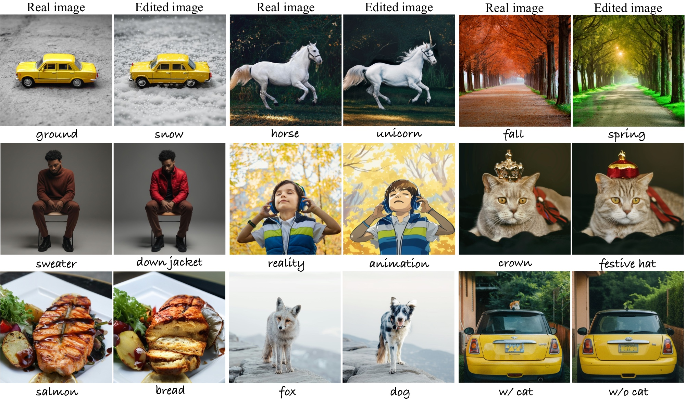

*图 1：ChordEdit 基于 SD-Turbo（上两行）和 SwiftBrush-v2（底行）的跨类型编辑效果总览。TeX caption 明确说明，图中手写标签就是每组样例的目标语义变化。*

- **图像结构**：整张图是 9 组 `Real image → Edited image` 对照，按三列三行排列；每组下面的手写标签给出源语义和目标语义，例如 `ground → snow`、`horse → unicorn`、`fall → spring`。
- **编辑类型覆盖**：上两行包含场景/属性变化（地面变雪地、秋景变春景、毛衣变羽绒服）、物体替换或局部物体编辑（马变独角兽、皇冠变节日帽）以及风格化（现实照片变动画风格）。底行进一步展示食物替换（salmon → bread）、动物替换（fox → dog）和物体删除（w/ cat → w/o cat）。
- **保真重点**：这些例子不是在展示任意大幅重绘，而是在强调“只改目标语义，尽量保持非编辑区域”。例如 `fall → spring` 中道路透视和树列结构保持，主要改变季节色彩；`w/ cat → w/o cat` 中车身、车牌和背景基本不变，只移除车顶上的猫。
- **跨模型一致性**：论文 caption 标注上两行来自 SD-Turbo、底行来自 SwiftBrush-v2，说明 ChordEdit 不是绑定单一 backbone 的训练式编辑器，而是在不同快速生成模型上使用同一类低能量控制场。

### 根因分析

问题出在 **naive editing field（简单漂移差分）** 的本质上。传统训练免编辑器通过计算目标 prompt 与源 prompt 对应的 drift 场之差来构造编辑控制场：

$$\Delta v(x_t, t) = v(x_t, t, c_{\text{tar}}) - v(x_t, t, c_{\text{src}})$$

在多步扩散模型中 $\Delta v$ 被分成许多小步迭代应用，误差被分散和平均化。但单步模型通过对抗蒸馏学到了从噪声到图像的**直接映射**——文本→向量场映射高度非线性，源和目标各自由大振幅、方向剧烈变化的高能量场驱动。直接相减得到的 $\Delta v$ 是**两个剧烈轨迹的算术残差**：高能量、不稳定、大方差。在单步大步长（$h=1$）积分下，这个 erratic 的控制场将显著局部截断误差一次性累积，导致轨迹严重偏离预期路径。

<p style="text-align: center;">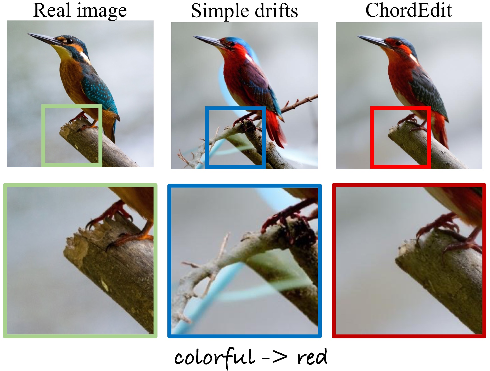</p>

*图 2：Simple Drift 在单步下的失败模式及 ChordEdit 修正。*

- **实际编辑任务**：这张图只有一组 `colorful → red` 的鸟类颜色编辑。三列分别是原图、Simple drifts 输出和 ChordEdit 输出；底部是框选区域的放大裁剪，用来观察鸟爪、树枝和背景的局部结构。
- **Simple drifts 的问题**：中间列虽然把鸟身颜色推向红色，但树枝被拉成不自然的浅色弧线，鸟爪和枝条交界处出现断裂、糊化和伪结构。也就是说，naive 单步差分不只是“编辑强”，而是把非编辑区域一起卷入了高能量漂移。
- **ChordEdit 的修正**：右列同样完成红色语义编辑，但鸟的姿态、树枝走向、爪子接触点和背景虚化更接近原图。这个局部放大图直观支持论文 caption 里的两类失败：object distortion 和 background breakup。
- **失败机制**：Naive 场 $\Delta v$（两高能量场之差）在 $h=1$ 大步长下累积大量局部截断误差，轨迹大幅偏离低能量传输路径；Chord Control Field 用时间平滑降低场能量，因此单步积分不容易把局部结构撕裂。

---

## 二、核心思路与方法

### 2.1 背景：什么是动态最优传输（Dynamic OT）？

在讲 ChordEdit 的方法之前，先理解一个看似不相关的问题：**最优传输（Optimal Transport）**。

最优传输问的是：你有两堆"土"（源分布和目标分布），怎么用最小的力气把源分布铲到目标分布的位置？18 世纪的法国数学家 Monge 第一次提出这个问题。到了 2000 年，Benamou 和 Brenier 把这个问题改写成了一个"流体动力学"版本（Benamou–Brenier 公式），这是 ChordEdit 理论的起点。

**Benamou–Brenier 动态 OT 公式**：

$$\min_{\rho, u} \int_0^1 \int \frac{1}{2}\|u_t(x)\|^2 \rho_t(x) dx dt \quad \text{s.t.} \quad \partial_t \rho_t(x) + \nabla_x \cdot (\rho_t(x) u_t(x)) = 0$$

逐符号解读：
- $\rho_t(x)$：在"编辑时间"$t$ 时，图像空间中位置 $x$ 处的概率密度。$t=1$ 时 $\rho_1$ 等于源分布（所有 $c_{\text{src}}$ prompt 能生成的图像），$t=0$ 时 $\rho_0$ 等于目标分布（所有 $c_{\text{tar}}$ prompt 能生成的图像）。你可以把它理解为：$t=1$ 时是"编辑前"、$t=0$ 时是"编辑后"，中间的时刻 $t\in(0,1)$ 是"正在编辑中"的过渡状态。
- $u_t(x)$：在时刻 $t$、位置 $x$ 处，驱动概率质量移动的**速度向量场**。在 ChordEdit 里，它被看作理想的**编辑控制场**——如果能知道它，就可以沿着低能量路径把源 prompt 对应的图像状态推向目标 prompt 对应的状态。
- $\frac{1}{2}\|u_t(x)\|^2$：该点此刻的动能（物理学中，质量为 $m$ 速度为 $v$ 时动能 = $\frac{1}{2}mv^2$，这里质量就是概率密度 $\rho$）。
- $\iint \frac{1}{2}\|u\|^2\rho\,dxdt$：整个传输过程的总动能。目标是最小化它——找到最"省力"的传输路径。注意这里的 $t$ 是论文统一使用的 flow/transport 时间，方向上用 $\rho_1$ 表示源边界、$\rho_0$ 表示目标边界；不要把它简单等同为普通扩散采样里的“第几步图像”。
- **连续性方程** $\partial_t \rho + \nabla\cdot(\rho u)=0$：这是流体力学的质量守恒定律——概率质量不会凭空产生或消失，流入一个区域的量和流出的量必须平衡。$\nabla\cdot(\rho u)$ 是"散度"，衡量一个点周围质量的净流出量。

**为什么 OT 天然倾向低能量场？**

这个优化问题的目标函数直接惩罚 $\|u\|^2$（场的平方大小）。如果某个候选场 $u$ 在某个位置取值很大（能量高），即使它能把分布送到目标，也会因为 $\|u\|^2$ 大而被目标函数惩罚。所以 OT 的数学结构**自动排斥高能量、高波动的场**，偏爱平滑、小振幅的场——这正是 ChordEdit 想要的。

### 2.2 重新定义：编辑作为最优传输问题

ChordEdit 的核心洞察是：不要用向量算术（直接相减）来看编辑，而是从 Benamou–Brenier 动态 OT 的角度来建模——**将编辑问题转化为：寻找将源分布传输到目标分布的最低能量向量场**。

具体来说，将图像编辑形式化为：

- **编辑前**：给定源 prompt $c_{\text{src}}$ 生成的图像 $x_{\text{src}} \sim p_1(x|c_{\text{src}})$，时间 $t=1$。
- **编辑后**：期望得到目标 prompt $c_{\text{tar}}$ 下的图像 $x_{\text{tar}} \sim p_0(x|c_{\text{tar}})$，时间 $t=0$。
- **编辑过程**：找到一个向量场 $u_t(x)$，它的积分路径能把源边界的概率质量推向目标边界，同时总动能最小。实际算法并不会真的求解完整 OT PDE，而是用这个低能量原则来构造一个可计算的局部估计器。

这个视角与 naive 方法的根本区别是：
- **Naive**：源场和目标场各算各的（都很大），然后做差——结果还是很大、很乱。
- **OT**：直接要求整个传输过程中场的总能量尽可能小——这给 ChordEdit 的“低能量、少震荡”控制场提供了建模原则，但实现上仍依赖后面的局部估计和一阶近似。

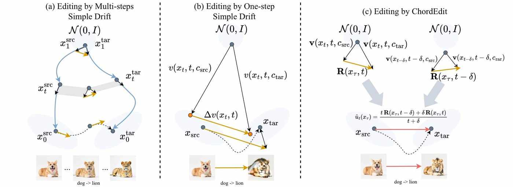

*图 3：多步 vs 单步 Simple Drift vs ChordEdit 的编辑场行为对比。*

- **(a) 多步 Simple Drift**：50 步 DDIM 中每次小步长迭代，局部截断误差被自然分散，累积轨迹紧密贴合理想路径（虚线）。这是 naive 方法能工作的原因。
- **(b) 单步 Simple Drift**：蒸馏单步模型中 naive 场振幅大、方向波动剧烈。单次大步长积分（实线箭头）严重偏离期望路径（虚线）——对应图 2 的失败模式。
- **(c) ChordEdit**：用 $\mathbf{R}(x_\tau, t)$ 和 $\mathbf{R}(x_\tau, t-\delta)$ 的时间加权平均构造平滑 Chord Field（红色箭头）。它不是保证“精确到达”某张唯一目标图，而是通过降低场能量和一致性常数，让一次大步长 Euler 更新更接近低能量传输路径，减少图 2 那类结构撕裂。

### 2.3 从 OT 到 Chord Control Field —— 逐步推导

上面的 OT 公式很美，但有一个致命问题：**理想的编辑场 $u_t$ 是我们不知道的**，无法直接计算。我们只能通过操作生成模型来获取关于 $u_t$ 的部分信息。ChordEdit 的推导就是一步步用"能观测到的"量来逼近"想要但看不到的"$u_t$。

#### 第一步：建立观测模型——我们能"看到"什么？

> 你有一个单步生成模型（比如 SD-Turbo）。给一张源图 $x_{\text{src}}$、一个 prompt $c$、一个时间 $t$，模型可以告诉你：如果把这张图加噪到 $t$ 时刻的水平，然后用 $c$ 条件去噪，噪声/速度/干净图的预测是什么。
>
> 用源 prompt 和目标 prompt 各跑一次，取差，就能了解"目标方向"和"源方向"的差异有多大。这就是可观测代理场的概念：它不需要知道真实的 $u_t$，只需要利用模型在两个 prompt 下的行为差异。

形式化地，定义可观测代理场（Observable Proxy Field）：

$$\mathbf{R}(x_\tau, t) = \mathbb{E}_{z \sim K_t(\cdot|x_\tau)}[\mathcal{B}_t(Q(z, t, c_{\text{tar}}) - Q(z, t, c_{\text{src}}))]$$

逐符号解读这个看似复杂、实则直观的公式：
- $x_\tau = x_{\text{src}}$：**锚点**，就是你的源图像。整个编辑过程的"起点"固定在这张图上。
- $K_t(\cdot|x_\tau)$：**前向加噪核**。因为扩散模型在不同噪声水平下表现不同，我们需要"模拟"时刻 $t$ 应有的噪声水平。具体操作：对源图 $x_\tau$ 加上噪声使其看起来像扩散过程在时刻 $t$ 的状态：$z = \alpha_t x_\tau + \sigma_t \epsilon$，其中 $\epsilon$ 是随机高斯噪声。
- $Q(z, t, c_{\text{tar}})$ 和 $Q(z, t, c_{\text{src}})$：模型在含噪状态 $z$、时间 $t$ 下、分别以目标 prompt 和源 prompt 为条件的**预测输出**。根据模型架构不同，$Q$ 可能是噪声预测 $\hat{\epsilon}$（SD-Turbo）、速度预测 $\mathbf{v}$（InstaFlow）或 $x_0$ 预测。
- $\mathcal{B}_t$：**统一域映射**。因为不同模型输出不同类型的东西（噪声 vs 速度 vs $x_0$），需要一个线性变换把它们都转换到 velocity（速度）域进行比较。$\mathcal{B}_t$ 只依赖时间 $t$，不依赖图像内容——这使得它非常简单。
- $\mathbb{E}_{z}[\cdot]$：**期望（平均）**。因为噪声 $\epsilon$ 是随机的，我们对多个噪声样本取平均以降低随机性。但论文后来证明 $n=1$（只取一个噪声样本）就足够了——这是后话。

这个公式的整体意思：在源图上、时间 $t$ 处，用**模型在目标 prompt 和源 prompt 下的输出差异**（转换到速度域后）来近似"这个点应该往哪个方向移动"。

**观测噪声假设**：$\mathbf{R}(x_\tau, t) = u_t(x_\tau) + \varepsilon_t$，其中 $\mathbb{E}[\varepsilon_t] = 0$。即论文把可观测代理场看成“理想场 + 零均值扰动”。这是一种理论分析用的测量模型，目的是说明为什么对 $\mathbf{R}$ 做时间平滑可以降低高频噪声和能量；不是说实际模型输出一定严格满足无偏观测。

#### 第二步：MAP 估计——如何从含噪观测得到平滑估计？

> 现在有了观测 $\mathbf{R}$，但它含噪声、能量高、不稳定。我们需要一种方法从含噪数据中提取一个"干净版本"。
>
> 一个自然的思路类似统计学里的**正则化最小二乘 / MAP 估计**：我们想要一个既接近新观测（数据保真度）、又不能偏离上一时刻估计太远（平滑先验）的折中解。具体做法是：
> 1. 在短时间窗口 $[t-\delta, t]$ 内，假设真实的 $u$ 近似不变（$\delta$ 很小，比如 0.15）。
> 2. 构造一个代价函数（在 MAP 框架中等价于负对数后验概率），使"好"的 $u$ 值得分低，"差"的 $u$ 值得分高。
> 3. 找到使代价最小的 $u$——这就是 MAP 估计。

在短窗口 $[t-\delta, t]$ 内构建凸二次目标函数：

$$\Phi_t(u) = t\|u - \hat{u}_{t-\delta}\|^2 + \int_{t-\delta}^{t} \|u - \mathbf{R}(\xi)\|^2 d\xi$$

逐项解读这个代价函数：
- **第一项** $t\|u - \hat{u}_{t-\delta}\|^2$：**递归能量先验**。我们希望当前估计 $u$ 不要离前一估计 $\hat{u}_{t-\delta}$ 太远。权重是 $t$（已累积的时间）——$t$ 越大（越接近编辑开始），我们越信任之前的估计（因为已经积累了足够的"经验"）。
- **第二项** $\int_{t-\delta}^{t} \|u - \mathbf{R}(\xi)\|^2 d\xi$：**窗口观测一致性**。我们希望 $u$ 与窗口 $[t-\delta, t]$ 内所有新观测 $\mathbf{R}(\xi)$ 的差异尽可能小。对 $\xi$ 积分意味着把窗口内每一个时刻的观测都考虑进来。
- 两项都是 $\|\cdot\|^2$（平方），所以 $\Phi_t(u)$ 是 $u$ 的**严格凸二次函数**——这意味着它有唯一全局最小值，而且可以显式求出。

**为什么是凸二次？** 因为平方函数 $\|u-a\|^2$ 就像抛物面（碗状）——"碗底"就是最优解。无论从哪个方向开始搜索，都会滑到同一个碗底。这在数学上意味着解是稳定且唯一的，不会因为初始猜测不同而得到不同答案。

#### 第三步：求解——令导数为零

令 $\Phi_t(u)$ 对 $u$ 的导数（梯度）等于零。对于二次函数，这等价于求解一个线性方程组：

$$2t(u - \hat{u}_{t-\delta}) + 2\int_{t-\delta}^{t}(u - \mathbf{R}(\xi))d\xi = 0$$

展开整理（将含 $u$ 的项移到一边）：

$$t \cdot u + \int_{t-\delta}^{t} u\,d\xi = t \cdot \hat{u}_{t-\delta} + \int_{t-\delta}^{t} \mathbf{R}(\xi)d\xi$$

左边 $t \cdot u + \delta \cdot u = (t+\delta)u$（因为 $\int_{t-\delta}^{t} u\,d\xi = u \cdot \delta$，窗口长度就是 $\delta$），因此：

$$u_t^\star = \frac{t}{t+\delta}\hat{u}_{t-\delta} + \frac{1}{t+\delta}\int_{t-\delta}^{t}\mathbf{R}(\xi)d\xi$$

**直观解读**：最优估计 $u_t^\star$ 是**前一估计 $\hat{u}_{t-\delta}$ 和窗口内平均观测 $\frac{1}{\delta}\int\mathbf{R}$ 的加权平均**（注意第二项是 $\frac{\delta}{t+\delta}$ 乘以窗口观测的均值）。这里的 $t$ 和 $\delta$ 不是任意经验权重，而是来自论文设定的二次 surrogate：$t$ 越大，递归先验项占比越高；$\delta$ 越大，新窗口观测的总权重越高。

#### 第四步：因果一阶近似——让公式可计算

上面仍然有一个计算困难：$\int_{t-\delta}^{t}\mathbf{R}(\xi)d\xi$ 需要在 $[t-\delta, t]$ 的**每一个**时间点都查询模型——这在单步方法中不可行（那需要多步迭代）。

论文做了一个关键的实践近似——**因果一阶近似**：
- 积分用右端点近似：$\int_{t-\delta}^{t}\mathbf{R}(\xi)d\xi \approx \delta \cdot \mathbf{R}(t)$
- 前一估计用最近观测替代：$\hat{u}_{t-\delta} \approx \mathbf{R}(t-\delta)$

代入整合得到 **Chord Control Field**：

$$\boxed{\hat{u}_t(x_\tau) = \frac{t \cdot \mathbf{R}(x_\tau, t-\delta) + \delta \cdot \mathbf{R}(x_\tau, t)}{t + \delta}}$$

**逐项解读最终的 Chord 公式**：
- 分子：对两个时间点的观测场做加权平均——越靠近当前 $t$ 的 $\mathbf{R}(t)$ 用权重 $\delta$，越早的 $\mathbf{R}(t-\delta)$ 用权重 $t$。
- 分母：$t+\delta$ 是归一化因子，保证总权重为 1（凸组合）。
- 当 $\delta \to 0$：$\hat{u} \approx \mathbf{R}(t-\delta) \approx \mathbf{R}(t)$——退化回 naive baseline。没有平滑，全是噪声。
- 当 $\delta > 0$：$\hat{u}$ 是两个时间点观测的**凸组合**——这是低通滤波（时间平滑），抑制高频波动（高能量尖峰），保留低频趋势（真正的编辑方向）。
- "Chord（弦）"的名字含义：在编辑曲线 $\{x_t\}$ 上，单个时刻 $t$ 的观测 $\mathbf{R}(t)$ 是切线（局部微分），而 $\{t-\delta, t\}$ 两个端点的凸组合形成一个"弦"——比切线更稳定地近似曲线段的走向。

**为什么 transport 仍算 1 NFE？** 严格说，$\mathbf{R}(t)$ 和 $\mathbf{R}(t-\delta)$ 涉及两个时间点、源/目标 prompt 两种条件，一共是 4 个条件查询：`[z_t(src), z_t(tar), z_{t-\delta}(src), z_{t-\delta}(tar)]`。代码把这 4 个样本 concat 到同一个 batch 里做一次 UNet forward，所以 wall-clock 和 NFE 记作 1 次 transport，而不是顺序跑 4 次。

<p style="text-align: center;">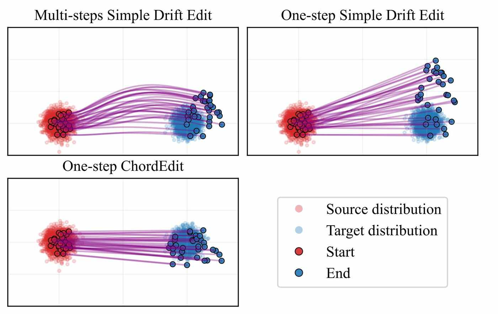</p>

*图 4：在 2D 合成分布上可视化三种传输行为，直观展示 Chord Field 的低能量、小偏差特性。*

- **(a) Ground Truth OT 路径**：从源分布（蓝色点云，右上）到目标分布（橙色点云，左下）的理想最优传输曲线（灰色连接线），路径平滑、直接、能量最小。
- **(b) Naive 残差场（$\delta=0$）**：单步大量积分下产生剧烈振荡的粒子轨迹，粒子群发散、无法收敛到目标中心——高能量表现为大幅度摆动。
- **(c) ChordEdit（$\delta>0$）**：粒子沿近乎直线的平滑路径紧密聚集在目标周围，偏差极小。$\delta>0$ 的时间平滑将 erratic 场"拉直"为近似最优传输。

### 2.4 理论性质：为什么 Chord 场更稳？

上面的推导给出了 Chord Control Field 的公式，但还需要回答一个问题：**凭什么说它比 naive 场稳定？** 论文给出了一系列数学定理来回答这个问题。下面用通俗语言解释每一条的含义，详细证明在论文附录中。

#### (1) $L^2$ 动能收缩

$$\int_0^1 \|\hat{u}(t)\|^2 dt \le \int_0^1 \|\mathbf{R}(t)\|^2 dt$$

- **$L^2$ 是什么？** 一个函数的 $L^2$ 范数（$\sqrt{\int\|f\|^2}$）衡量的是函数的"总能量"或"总振幅"。积分号 $\int_0^1 dt$ 表示对**整个时间轴**求和。
- **这个不等式在说什么？** 把 Chord 场在所有时间点的平方大小加起来（= 总动能），一定**不超过**naive 场的总动能。用大白话说：**平滑之后场不会变得更"剧烈"，只会更"温和"**。
- **为什么成立？** 这是 Jensen 不等式的直接推论。Jensen 不等式说：凸函数（比如平方）的平均值 ≤ 平均后代入凸函数的值。因为 $\hat{u}$ 是 $\mathbf{R}$ 的加权平均，$\|\hat{u}\|^2$ 不会超过 $\|\mathbf{R}\|^2$ 的加权平均。对时间积分后，加权平均变成了总体小于等于。
- **什么时候严格小于？** 当 $\delta > 0$（非零平滑）且 $\mathbf{R}$ 不是常数时，不等式严格成立。这意味着只要 naive 场有波动，平滑就会真实地降低能量。

#### (2) $L^\infty$ 范数收缩（逐点最大值也不增加）

$$\|\hat{u}\|_\infty \le \|\mathbf{R}\|_\infty, \quad \|\partial_t\hat{u}\|_\infty \le \|\partial_t\mathbf{R}\|_\infty, \quad \|\nabla_x\hat{u}\|_\infty \le \|\nabla_x\mathbf{R}\|_\infty$$

- **$L^\infty$ 是什么？** $L^\infty$ 范数衡量的是函数在整个定义域上的**最大绝对值**（"最坏的那个点有多大"）。不同于 $L^2$ 衡量总量，$L^\infty$ 衡量"峰值"。
- **第一条不等式**：Chord 场在任何位置、任何时间的取值都不会超过 naive 场的最大取值。**平滑不会引入新的极端值**。
- **第二条不等式**：Chord 场的时间变化率（$\partial_t$ = 对时间求导，衡量"场随时间的抖动有多快"）的峰值也被抑制了。
- **第三条不等式**：Chord 场的空间变化率（$\nabla_x$ = 对空间求导，衡量"相邻两点之间场的差异有多大"）的峰值也被抑制了。
- **为什么这三个很重要？** 它们直接决定了数值积分（ODE solver）的误差上界。下一节解释。

#### (3) 更紧的 Euler 误差界

- **背景**：ChordEdit 用一个 explicit Euler step（$x_{t+1}=x_t + h\cdot u(x_t)$，$h=1$）来传输图像。Euler 方法的**局部截断误差**（单步的近似精度）与 $u$ 的导数有关：变化越剧烈的场，Euler 误差越大。
- **一致性常数**：$\mathcal{C}(u) = \|\partial_t u\|_\infty + \|\nabla_x u\|_\infty \cdot \|u\|_\infty$。这个量控制了 Euler 一步之后的误差大小。
- **关键结论**：在非负、单位质量的时间平滑核假设下，论文给出 $\mathcal{C}_{\text{cho}} \le \mathcal{C}_{\text{nai}}$。更准确地说，这是**误差上界常数**的比较：Chord 场不会增加场幅值、时间导数和空间梯度的 $L^\infty$ 上界，因此 explicit Euler 的局部截断误差上界更紧。
- **全局误差**：论文进一步证明（Theorem C.6），两者都是 $O(h)$ 全局误差，但 ChordEdit 对应的常数不大于 naive。这里应理解为“理论上界更小或相等”，不是保证每一张图、每一次随机种子下的实际误差都严格更小。

#### (4) 方差缩减（为什么 $n=1$ 就够）

- **背景**：传统方法需要多个噪声样本（$n>1$）来降低估计方差（MC 平均：方差 $\propto 1/n$）。
- **Chord 的降方差机制**：把观测模型 $\mathbf{R} = u^\star + \eta$（$\eta$ 是噪声）代入 Chord 公式 $\hat{u} = K_\delta * \mathbf{R}$。平滑后的噪声项变为 $K_\delta * \eta$，其方差项由核的 $\|K_\delta\|_{L^2}^2$ 控制；对尺度为 $\delta$ 的核，典型量级是 $\|K_\delta\|_{L^2}^2 \propto 1/\delta$。直观上，窗口越宽，随机噪声越容易被平均掉。
- **代价**：平滑会引入 bias。附录先给出对称二阶核下的 bound：squared bias 为 $O(\delta^4)$、variance 为 $O(\delta^{-1})\sigma^2$；但 ChordEdit 实际用的是因果 one-sided kernel，附录 remark 明确说此时 bias 是 $O(\delta)$、squared bias 是 $O(\delta^2)$。所以正确理解是：$\delta$ 太小降噪不足，$\delta$ 太大又会过度平滑真实编辑方向，需要选一个折中点。
- **直接推论**：既然时间平滑已经提供了显著方差缩减，再叠加 MC 多噪声平均的边际收益会变小。论文并不是从理论上证明“所有情况下 $n=1$ 必然最优”，而是结合图 10-11 的实验说明：在他们的默认设置和 benchmark 上，$n=1$ 已经非常稳定。

### 2.5 Proximal Refinement（可选）

Transport 阶段保守优先（高 PSNR、保结构），可选择性追加 1 NFE 的语义精炼：

$$\text{prox}(x^{\text{pred}}, t_c, c_{\text{tar}}) = \mathcal{B}_{t_c} Q(x^{\text{pred}}, t_c, c_{\text{tar}})$$

**通俗理解**：transport 已经把结果推到目标语义附近，prox 是做最后的一步微调——代码里会把 $x^{\text{pred}}$ 用同一个噪声加到 $t_c=0.30$，再只用目标 prompt 做一次 `predict-x0`。论文也强调它不是 transport 的一部分，能量分析都在 prox 之前完成；prox 的作用主要是增强颜色、纹理、风格等目标语义。

- **为什么不是更强的去噪？** 如果 $t_c$ 太小（接近 0），噪声几乎为零，模型输入几乎是干净图，语义注入效果很弱。如果 $t_c$ 太大（接近 1），噪声太多，一步去噪会把之前 transport 保留的结构也破坏掉。$t_c=0.30$ 是论文在附录中通过系统扫描找到的平衡点。
- **为什么可选？** Transport 本身已经完成了主要的编辑转换。prox step 是锦上添花——增强语义表达但牺牲一点 PSNR（~1.7 dB）。用户可以选择不加（NFE=1, PSNR 23.89）或加（NFE=2, CLIP-Edited 22.96）。

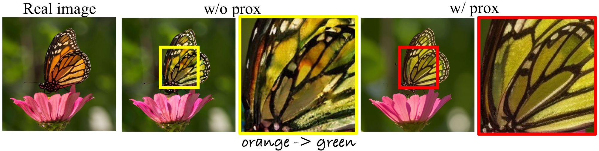

*图 5：Proximal Refinement 的定性消融，编辑任务为蝴蝶翅膀 `orange → green`。*

- **图像结构**：从左到右依次是原图、w/o prox 输出及其黄色框放大、w/ prox 输出及其红色框放大。放大区域集中在蝴蝶翅膀纹理，方便比较语义强度和局部纹理是否被破坏。
- **Transport Only（w/o prox）**：已经把橙色翅膀推向绿色，但颜色更像柔和过渡，部分橙黄纹理仍残留。这说明纯 transport 更偏保守，优先保持翅膀轮廓、花朵、背景虚化和整体构图。
- **Transport + Prox（w/ prox）**：绿色更明确、覆盖更充分，目标语义更强；同时翅膀黑色脉络和主体轮廓仍然保持。这正对应论文 caption 的结论：prox step 主要增强 target editing semantics。
- **设计哲学**：Transport 负责“安全传输”（结构保持），Prox 负责“语义增强”（表现力提升）。用户可按需选择 NFE=1（高 PSNR 23.89）或 NFE=2（强 CLIP-Edited 22.96）。

### 2.6 算法

```
Input:  x_src, c_src, c_tar, t(=0.90), δ(=0.15), λ(=1.00), t_c(=0.30)
1. û = (t·R(x_src, t-δ) + δ·R(x_src, t)) / (t + δ)     // 1 NFE, batch内并行4queries
2. x_pred ← x_src + λ·û                                 // Euler step
3. x_tar ← prox(x_pred, t_c, c_tar)                     // 1 NFE (optional)
```

---

## 三、模型适配：统一的 $\mathcal{B}_t$ 映射

ChordEdit 的模型无关性通过**时间纯量线性映射 $\mathcal{B}_t$** 实现，不同参数化的模型只需不同的标量系数：

| 模型类型 | 输出 $Q$ | $\mathcal{B}_t$ 系数 | 适用范围 |
|---------|---------|---------------------|---------|
| 噪声预测 | $\hat{\epsilon}_\theta$ | $-\dot{\alpha}(t)/(\alpha(t)\sigma(t))$ | SD-Turbo 等 |
| 速度预测 | $\mathbf{v}_\theta$ | $I$（恒等） | InstaFlow 等 |
| $x_0$ 预测 | $\hat{x}_0$ | $\dot{\alpha}(t)/\sigma(t)^2$ | Consistency models |
| $v$ 预测 | $\hat{v}$ | $-\dot{\alpha}(t)/\sigma(t)$ | Rectified flow 变体 |
| Score 预测 | $\hat{s}$ | $\beta(t)$ | Score-based SDE |

查询时间点（$t=0.90$、$t-\delta=0.75$）远离 $\alpha(t)\to 0$ 的奇点，保证计算稳定。

---

## 四、实验与结果

### 4.1 设置

- **数据集**：PIE-bench（700 张 512×512，10 类编辑任务）
- **指标（背景）**：PSNR↑、MSE↓、LPIPS↓（仅非编辑区域）
- **指标（语义）**：CLIP-Whole↑、CLIP-Edited↑（CLIP ViT-B/32）
- **指标（效率）**：Runtime↓、VRAM↓、NFE↓
- **硬件**：NVIDIA Titan 24GB；所有方法**不使用保护 mask**（公平比较）

### 4.2 主要结果

<p style="text-align: center;">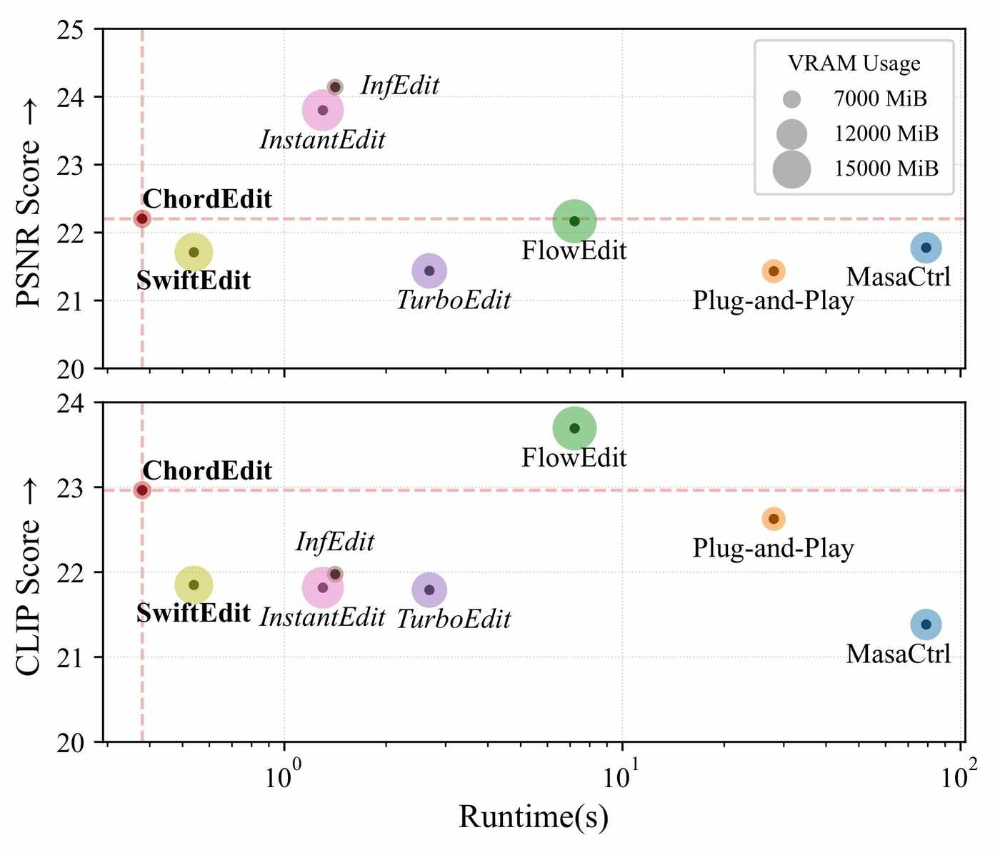</p>

*图 6：ChordEdit 与单步/少步/多步方法的三维对比。横轴 PSNR↑（背景保真），纵轴 CLIP-Edited↑（语义对齐），圆点大小 = Runtime（越大越慢）。*

- **多步方法**（右上方大圆点）：FlowEdit 22.17 PSNR / 26.64 CLIP / 7.22s——质量好但不可实时。DirectInv+PnP 55-79s。
- **少步方法**（中间区域）：InfEdit 24.14 PSNR / 1.41s——速度-质量折中，但语义略保守。
- **ChordEdit SD-Turbo**（红色三角，左上方）：以 0.38s（极小圆点）达到 22.20 PSNR / 25.58 CLIP——首次在"真·实时"条件下实现竞争力编辑质量，速度是 FlowEdit 的 19×、DirectInv 的 208×。
- **ChordEdit w/o prox**：PSNR 23.89（单步最高），仅 0.20s，NFE=1。

**完整定量表**（PIE-bench，MSE 和 LPIPS 单位 $10^3$，粗体为列内 top-3）：

| 类型 | 方法 | PSNR↑ | MSE↓ | LPIPS↓ | CLIP-W↑ | CLIP-E↑ | T-free | I-free | NFE↓ | Runtime↓ | VRAM↓ |
|------|------|-------|------|--------|---------|---------|--------|--------|------|---------|-------|
| 多步(≥30) | DDIM+MasaCtrl | 21.25 | 8.58 | 106.6 | 24.13 | 21.13 | ✓ | ✗ | 100 | 55.20s | 12272 |
| | DirectInv+PnP | 21.43 | 8.10 | 106.3 | **25.48** | **22.63** | ✓ | ✗ | 100 | 28.03s | 9262 |
| | FlowEdit(SD3) | 22.17 | 7.69 | 104.8 | **26.64** | **23.69** | ✓ | ✓ | 33 | 7.22s | 17140 |
| 少步(4) | InfEdit | **24.14** | **6.82** | **55.7** | 24.89 | 21.88 | ✓ | ✓ | 4 | 1.41s | **6502** |
| | InstantEdit | **23.80** | **4.21** | **60.9** | 24.97 | 21.82 | ✓ | ✗ | 8 | 1.30s | 16270 |
| **单步** | SwiftEdit(SBv2) | 21.71 | 8.22 | 91.2 | 24.93 | 21.85 | ✗ | ✗ | 2 | 0.54s | 15060 |
| | **ChordEdit(w/o prox)** | **23.89** | **5.05** | 88.4 | 24.97 | 21.87 | ✓ | ✓ | **1** | **0.20s** | 6988 |
| | **ChordEdit(SD-Turbo)** | 22.20 | 6.84 | 128.3 | **25.58** | **22.96** | ✓ | ✓ | 2 | **0.38s** | 6988 |
| | **ChordEdit(SwiftBrush-v2)** | 22.04 | 7.13 | 111.2 | 25.12 | 22.58 | ✓ | ✓ | 2 | **0.38s** | 6988 |

**核心发现**：Transport-only（NFE=1）以 23.89 PSNR 取得单步方法最优背景保真，直接验证 Chord Field 稳定性。完整版（NFE=2）CLIP-Edited 22.96 领先所有单步方法，接近多步 FlowEdit（23.69），速度快 19×。VRAM 仅 6988 MiB，不到 SwiftEdit（15060 MiB）的一半。

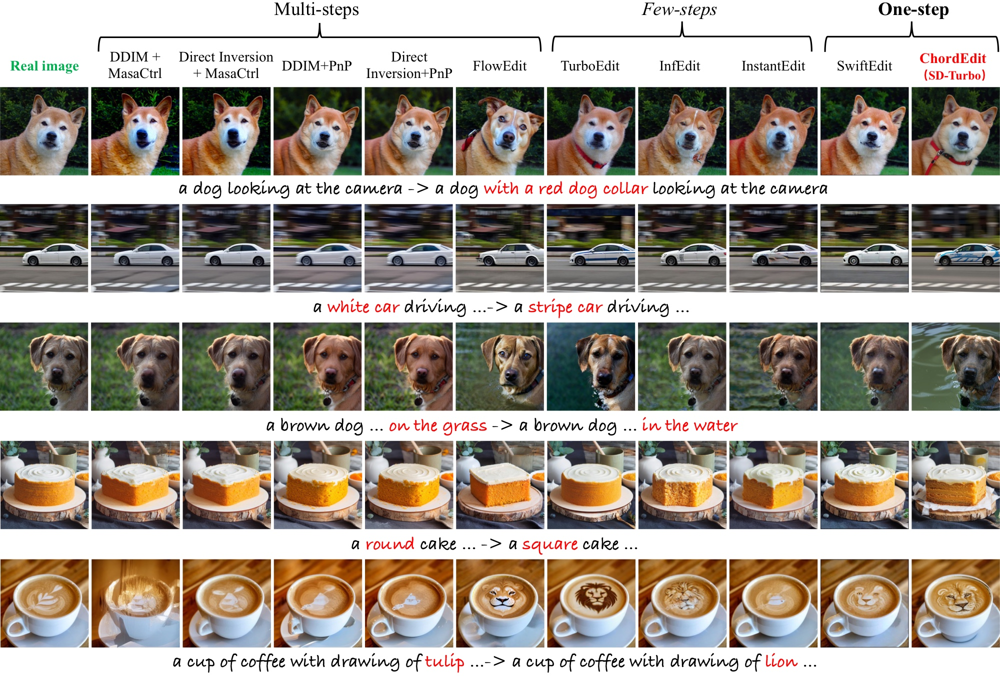

*图 7：多步/少步/单步方法的编辑结果逐行对比。第一列为原始输入，后面按 Multi-steps、Few-steps、One-step 分组。*

- **五个实际编辑任务**：从上到下分别是给狗加红色项圈、把白车改成带条纹的车、把草地上的狗改到水中、把圆形蛋糕改成方形蛋糕、把咖啡拉花从 tulip 改成 lion。每一行都同时考验目标语义是否出现，以及原图中不该变化的区域是否保持。
- **多步方法**：部分方法能做出目标语义，但经常带来额外改动。例如 FlowEdit 在狗项圈行里明显改变狗脸身份，在水中狗行里改变了狗的表情和背景质感；Direct Inversion + PnP 在若干行里结构保持较好，但运行时间很高。
- **少步方法**：TurboEdit、InfEdit、InstantEdit 通常比多步方法更快，但语义强度不稳定：有的结果只轻微加上项圈或条纹，有的会把蛋糕侧面纹理改得过重。它们体现的是速度和编辑强度之间的折中。
- **ChordEdit**：最后一列在单步/两次 NFE 的预算下仍能生成清晰目标语义：红项圈位置合理、车身条纹明显、狗进入水中、蛋糕被切换为方形、咖啡中出现狮子图案。更关键的是，它通常保留了原图主体姿态、相机视角和背景布局，支撑“实时编辑但不牺牲结构”的主张。

### 4.3 模型无关性

| T2I 模型 | Naive PSNR↑ | ChordEdit PSNR↑ | Naive CLIP-E↑ | ChordEdit CLIP-E↑ |
|---------|------------|----------------|---------------|-------------------|
| InstaFlow | 22.05 | **23.05** (+1.00) | 20.19 | **21.39** (+1.20) |
| SwiftBrush-v2 | 20.52 | **22.04** (+1.52) | 21.06 | **22.58** (+1.52) |
| SD-Turbo | 21.38 | **22.20** (+0.82) | 21.96 | **22.96** (+1.00) |

三种架构上一致 +0.8~1.5 dB PSNR 和 +1.0~1.5 CLIP-Edited 提升，证明方法跨模型鲁棒。

---

## 五、消融实验

### 5.1 Chord Control Field 稳定性分析

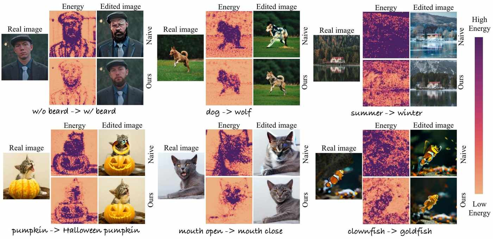

*图 8：编辑场能量定性可视化与编辑效果对比。图中每个案例都按“原图 → Naive 能量/结果 → Ours 能量/结果”组织，颜色条显示紫色代表高能量、浅橙色代表低能量。*

- **实际案例**：六个编辑任务分别是 `w/o beard → w/ beard`、`dog → wolf`、`summer → winter`、`pumpkin → Halloween pumpkin`、`mouth open → mouth close`、`clownfish → goldfish`。这些任务覆盖人物属性、动物替换、季节变换、节日属性、表情/口型修改和鱼类替换。
- **Naive 的能量图**：高能量区域通常扩散到目标之外，例如人物案例中脸部和躯干大面积变紫，夏冬场景中湖面、房屋、天空都有强响应。这对应输出中的身份变化、背景污染和伪影。
- **ChordEdit 的能量图**：能量更集中、更低，输出更接近“只改该改的地方”。例如加胡子案例保留了人物衣着和背景，dog→wolf 保留奔跑姿态和草地，summer→winter 则主要改变季节纹理而维持房屋与湖面构图。
- **核心含义**：这张图把论文的数学主张可视化了：低能量控制场不是抽象正则项，而是直接表现为更少的背景泄漏和更稳定的局部结构。

<table style="width: 82%; margin-left: auto; margin-right: auto;">
<tr>
<td width="50%">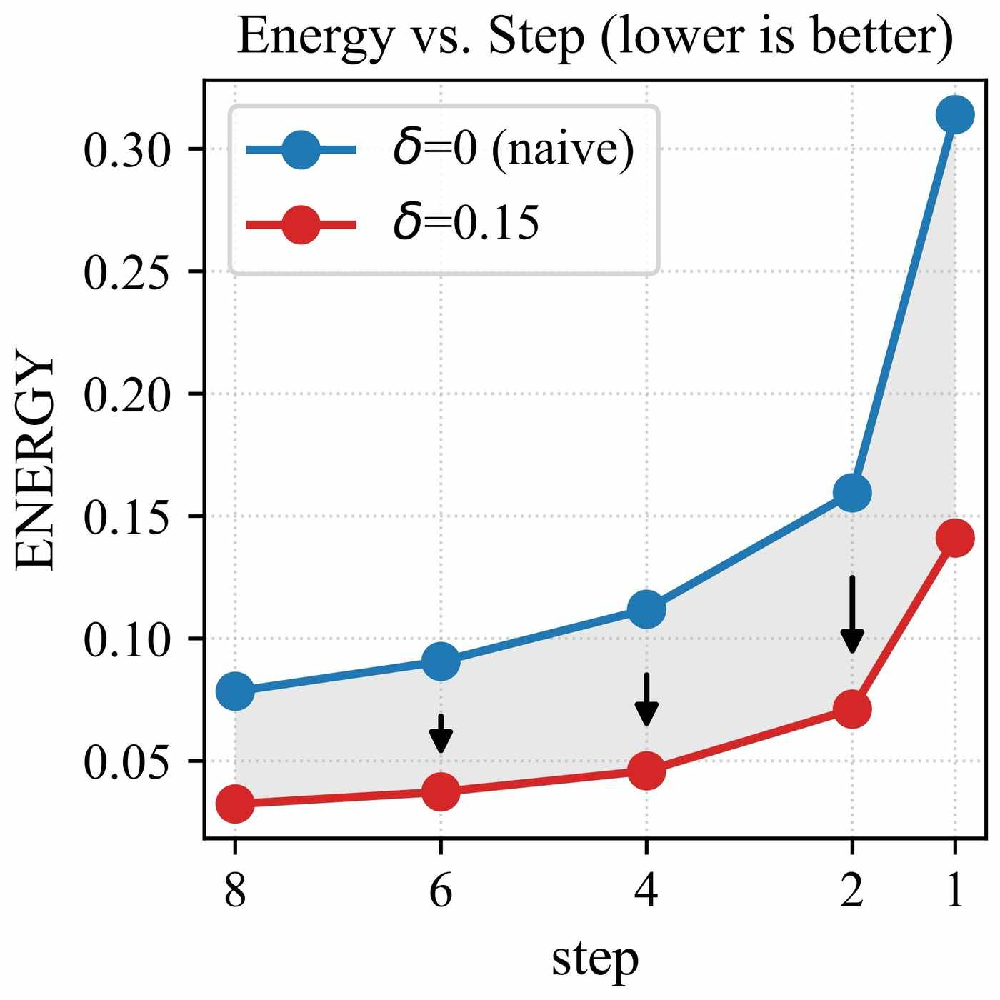<br><em>(a) 离散 Benamou–Brenier 动能 vs 积分步数 S</em></td>
<td width="50%">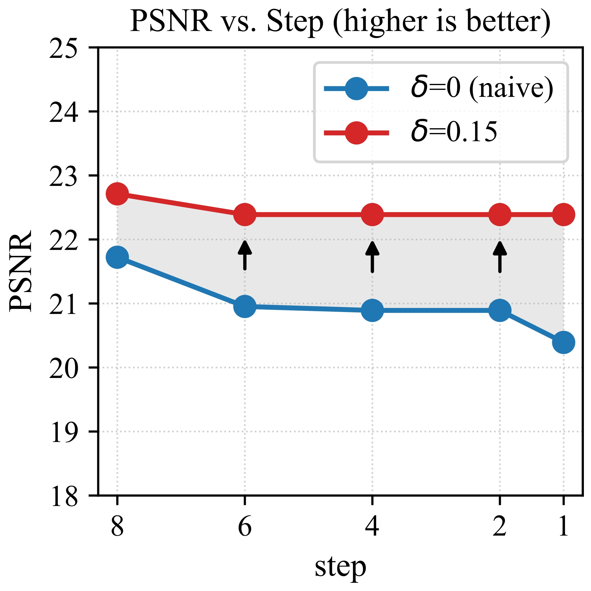<br><em>(b) 编辑区域 PSNR vs 积分步数 S</em></td>
</tr>
<tr>
<td width="50%">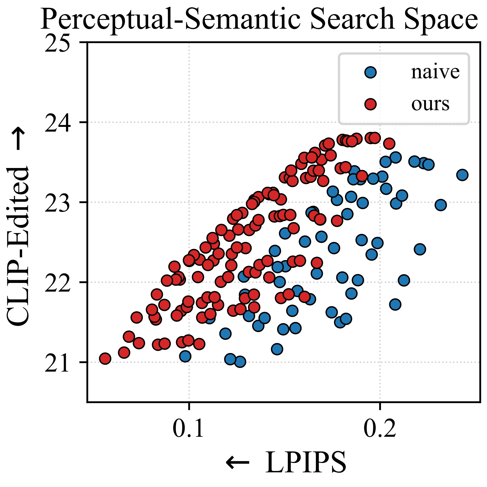<br><em>(c) LPIPS vs CLIP-Edited 散点分布</em></td>
<td width="50%">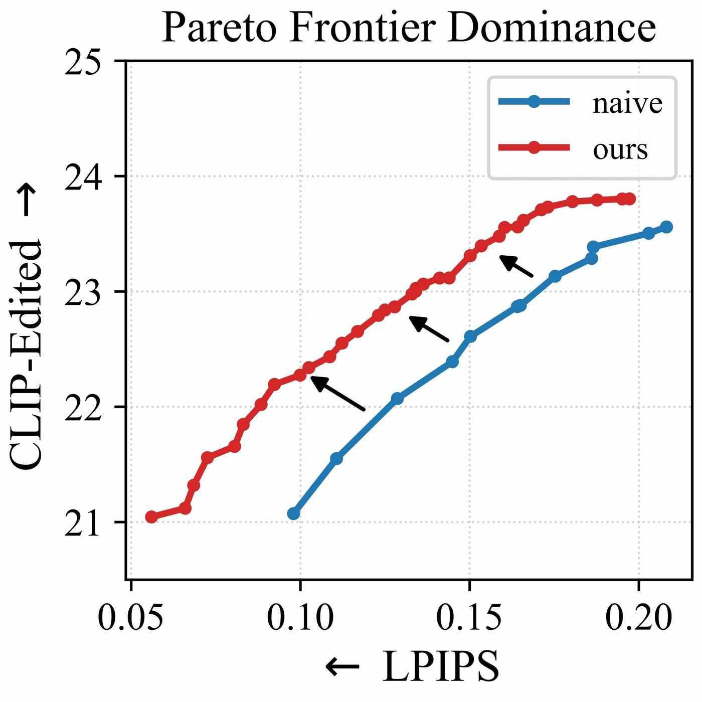<br><em>(d) LPIPS vs CLIP-Edited Pareto 前沿线</em></td>
</tr>
</table>

*图 9：Chord Control Field 稳定性与 Pareto 支配性的定量分析。蓝色 = naive（$\delta=0$），红色 = ChordEdit（$\delta=0.15$）。*

- **(a) 动能 vs 步数**：纵轴 $\bar{E}=\frac{1}{SC}\sum_{s} \sum_{\text{channel}}(\hat{u}_{t_s})^2$。Naive 的动能在 $S\to 1$ 时急剧攀升（数倍于多步时），ChordEdit 动能始终低且平坦——平滑已吸收 erratic 成分。
- **(b) PSNR vs 步数**：Naive 在 $S\to 1$ 时 PSNR 骤降至 ~20 dB 以下（严重失真），ChordEdit 始终维持 ~24 dB，$S=1$ 时领先 3-4 dB。
- **(c) 散点分布**：横轴 LPIPS↓，纵轴 CLIP-Edited↑。Naive 分布宽散、集中在左下（高质量+高语义不可兼得）；ChordEdit 分布紧凑、整体位于蓝色右上方——相同 LPIPS 下 CLIP 更高。
- **(d) Pareto 前沿**：红色前沿（ChordEdit）在所有感知保真水平上严格位于蓝色前沿（naive）之上——**严格 Pareto 支配**，不存在任何 naive 超参数组合能超越 ChordEdit。

### 5.2 噪声采样分析

<table>
<tr>
<td width="42%">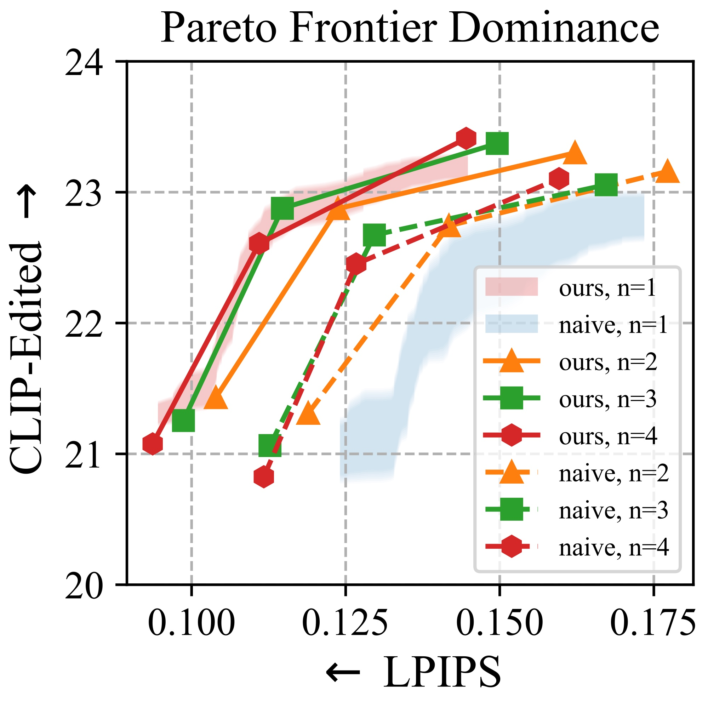<br><em>(a) LPIPS vs CLIP-Edited Pareto 前沿（按噪声样本数 n 分层）</em></td>
<td width="58%">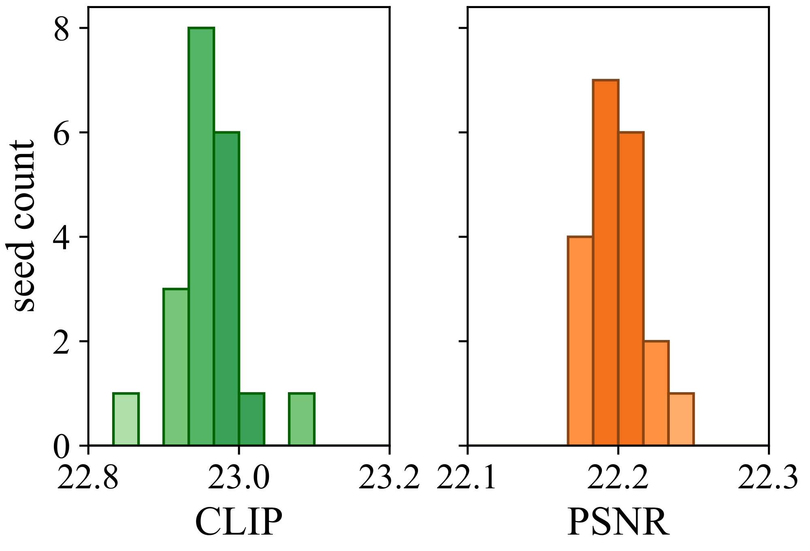<br><em>(b) n=1 下 20 种子的 CLIP-Edited（左）和 PSNR（右）分布直方图</em></td>
</tr>
</table>

*图 10：噪声样本数对编辑稳定性的影响。实线 = ChordEdit（$n=1,2,3,4$），虚线 = naive baseline。*

- **(a) Pareto 前沿**：ChordEdit 的 $n=1,2,3,4$ 四条前沿几乎完全重叠——增加噪声样本无边际收益。ChordEdit $n=1$ 前沿严格支配 naive $n=4$ 前沿。阴影区域（跨种子包络）ChordEdit 显著更窄。
- **(b) 种子鲁棒性**：CLIP-Edited CoV 仅 0.20%，PSNR CoV 仅 0.07%——分布极度集中。核平滑天然提供方差缩减，$n=1$ 已足够精确。

<p style="text-align: center;">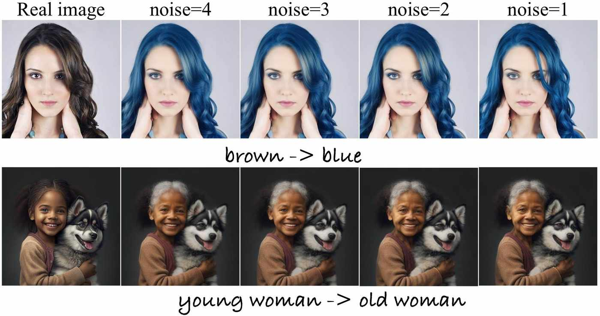</p>

*图 11：不同噪声样本数的 ChordEdit 输出（$\delta=0.15$，其余参数固定）。图中列顺序是 `noise=4,3,2,1`，不是从 1 到 4。*

- **实际编辑任务**：上排是头发颜色 `brown → blue`，下排是人物年龄 `young woman → old woman`。两组都属于容易受随机噪声影响的人像编辑，因此适合观察 seed/noise 采样稳定性。
- **定性结论**：四个噪声样本数下的输出几乎一致：蓝发的位置、发丝形态、面部结构，以及年龄编辑中的姿态、狗的位置、背景光照都没有明显漂移。这从视觉上支持图 10 的定量结论：Chord 的时间平滑已经提供足够方差缩减，继续增加 MC noise samples 收益很小。

### 5.3 Transport 与 Refinement 解耦

| 方法 | Naive PSNR↑ | Naive CLIP-E↑ | Ours PSNR↑ | Ours CLIP-E↑ | NFE |
|------|------------|--------------|-----------|-------------|-----|
| w/o prox（纯 transport） | 21.89 | 20.83 | **23.89** | 21.87 | 1 |
| w/ prox（完整版） | 21.38 | 21.96 | 22.20 | **22.96** | 2 |

Chord 场将 PSNR 从 21.89 提升到 23.89（+2.00 dB），同时 CLIP-Edited 也从 20.83 提升到 21.87——**不是牺牲语义换 PSNR，而是全方位提升**。加 prox 后 CLIP-Edited 进一步提升到 22.96（+1.09），代价 PSNR 降至 22.20（-1.69 dB），体现了语义强度 vs 背景保真的自然折中。

### 5.4 超参数分析

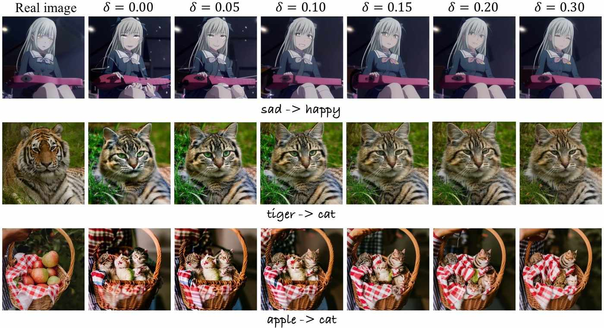

*图 12：固定其他参数、变化 $\delta$ 的编辑结果。三行分别是 `sad → happy`、`tiger → cat`、`apple → cat`。*

- **$\delta=0.00$（naive）**：没有时间平滑时，三行都出现明显不稳定。第一行表情编辑伴随脸部和手部结构扭曲；第二行虽然从老虎变向猫，但面部和背景都有过强重绘；第三行直接从苹果篮子跳到多只猫，结构变化非常激进。
- **$\delta=0.05$**：一旦加入很小的平滑窗口，输出立刻变得稳定。第一行保留人物、乐器和构图并开始露出笑容；第二行猫的面部结构更自然；第三行仍是猫篮子，但伪影和结构混乱明显减少。
- **$\delta=0.10/0.15/0.20$**：随着 $\delta$ 增大，背景和主体轮廓更稳，编辑语义也更可控。论文将 $\delta=0.15$ 作为默认值，是因为它在结构稳定和目标语义之间取得较好的折中。
- **$\delta=0.30$**：过度平滑后编辑会变保守或变软，例如表情变化弱化、猫的纹理趋于平均。核心结论不是“越大越好”，而是 $\delta>0$ 打开稳定性，$\delta$ 大小调节平滑 vs 语义强度。

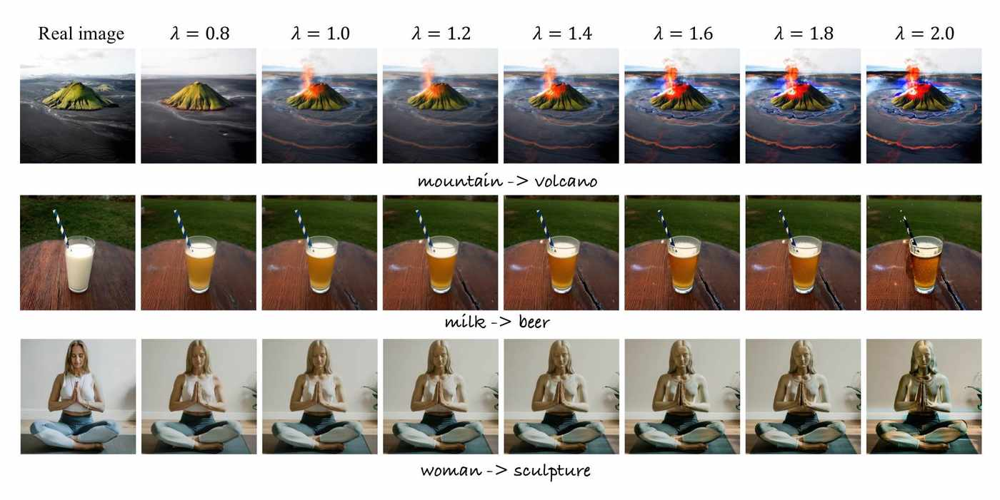

*图 13：固定其他参数、变化步长缩放 $\lambda$。三行分别是 `mountain → volcano`、`milk → beer`、`woman → sculpture`。*

- **$\lambda=0.8$**：编辑偏保守。火山行只出现轻微红色痕迹，牛奶行只是颜色变黄，人物行仍基本是原照片。这说明步长太小时，Chord 场虽稳定，但目标语义注入不足。
- **$\lambda=1.0/1.2/1.4$**：目标语义逐步增强。火山开始出现熔岩和烟雾，牛奶逐渐变为啤酒色，人物皮肤和光照开始向雕塑材质过渡。默认 $\lambda=1.0$ 是偏稳的设置，继续增大可以获得更强编辑。
- **$\lambda=1.6/1.8/2.0$**：语义最强，但背景保持开始承压。火山行的熔岩、烟雾和地表色彩大幅扩张；啤酒行的桌面裂纹和吸管颜色也被带动改变；雕塑行出现更明显的金属/石膏质感，同时整体光照和边缘结构也更容易偏离原图。
- **$\lambda$ 的角色**：它是直觉化的“编辑强度旋钮”。与 $\delta$ 主要控制稳定性不同，$\lambda$ 直接控制单步 Euler 更新幅度，越大越接近大胆重绘，越小越接近保守编辑。

---

## 六、核心洞察与技术亮点

1. **范式转换**：从"向量算术"（drift 差分）到"最优传输控制"（低能量场），从数学本质解决单步不稳定性
2. **极小实现代价**：Chord Control Field 仅是两个时间点的可观测场的加权平均——零额外参数、零额外模块、零额外内存
3. **理论-实验闭环**：动态 OT → $L^2$ 收缩 → $L^\infty$ 收缩 → 误差收紧 → Pareto 支配的完整证明链
4. **反直觉的 $n=1$ 发现**：核平滑天然降方差，MC 多噪声平均变得冗余
5. **分离式设计**：Transport（结构保持）+ Refinement（语义增强）解耦，用户可按需选择
6. **真正实时**：0.38s / 6988 MiB，可在消费级 GPU 上运行交互式 demo

---

## 七、代码实现解读

### 7.1 项目结构

```
ChordEdit/
├── pipeline_chord.py    # 核心 pipeline：ChordEditPipeline 类（524 行）
│                        #   - 模型加载（from_local_weights）
│                        #   - VAE 编解码 + CLIP 文本编码
│                        #   - _u_estimate：Chord Control Field 计算
│                        #   - _run_edit：Euler transport 主循环
│                        #   - _pred_x0：Tweedie's formula 单步去噪
├── utils.py             # 工具（177 行）：EditRecord、LocalEditDataset、
│                        #   load_yaml_config、first_param_point
├── app.py               # Gradio Web Demo（438 行）：参数滑块 UI + 内置示例
├── run_pie_bench.py     # PIE-Bench 批量评测（452 行）：CLI 参数覆盖、
│                        #   多进程安全导出、PIE 格式输出
├── images/              # 8 张内置示例图（001-008 子目录，含 meta.jsonl）
└── requirement.txt      # torch 2.5+cu124, diffusers, transformers, gradio 等
```

> **注意**：ChordEdit 是训练免方法，代码中**没有训练脚本**，所有功能均为纯推理。

### 7.2 环境与依赖

| 项目 | 说明 |
|------|------|
| Python | 3.12 |
| PyTorch | 2.5.0+cu124 |
| 核心库 | diffusers, transformers, torchvision |
| 预训练模型 | SD-Turbo（`stabilityai/sd-turbo`，HuggingFace） |
| 模型文件 | unet/、scheduler/、text_encoder/、tokenizer/、vae/（5 个 HF 子目录） |
| Web Demo | gradio |
| 评测数据 | PIE-bench（需额外下载，目录含 `annotation_images/` + `mapping_file.json`） |
| 硬件 | 单张 NVIDIA Titan 24GB；VRAM 峰值 ~7GB |

**关键依赖版本**（`requirement.txt`）：
```
torch==2.5.0+cu124
diffusers          # UNet2DConditionModel, DDPMScheduler, AutoencoderKL
transformers       # CLIPTextModel, AutoTokenizer
gradio             # Web interactive demo
torchvision        # transforms, InterpolationMode
pyyaml, Pillow     # 配置解析, 图像 I/O
numpy, matplotlib, seaborn   # 论文图表绘制
```

### 7.3 推理完整流程

```
                用户输入                          ChordEditPipeline
         ┌──────────────────┐          ┌──────────────────────────────────┐
         │  source image     │          │                                  │
         │  source prompt    │─────────►│  __call__(image, src, tgt, cfg)  │
         │  target prompt    │          │                                  │
         │  edit_config      │          └──────────────┬───────────────────┘
         └──────────────────┘                         │
                                                      ▼
         ┌────────────────────────────────────────────────────────────────┐
         │  Step 1: 预处理（pixel → latent, text → embedding）              │
         │                                                                │
         │  PIL Image                                                     │
         │    │ _CenterSquareCropTransform()   居中裁剪为正方形             │
         │    │ transforms.Resize(512,512)     缩放                        │
         │    │ transforms.ToTensor()          归一化 [-1,1]               │
         │    ▼                                                           │
         │  pixel_values  ──► VAE.encode() ──► z_src (4×64×64 latent)     │
         │                                                                │
         │  source_prompt ──► CLIP tokenizer + text_encoder ──► e_src      │
         │  target_prompt ──► CLIP tokenizer + text_encoder ──► e_tgt      │
         └────────────────────────────┬───────────────────────────────────┘
                                      │
                                      ▼
         ┌────────────────────────────────────────────────────────────────┐
         │  Step 2: Chord Transport（_run_edit, 1 NFE）                    │
         │                                                                │
         │  t_grid = [0.90]        # n_steps=1, 单步                      │
         │                                                                │
         │  _u_estimate(x, e_src, e_tgt, noise, t=0.90, δ=0.15):         │
         │    ┌─────────────────────────────────────────────────────┐     │
         │    │ ⑴ 获取 schedule 参数                                │     │
         │    │   α_s, σ_s = _get_alpha_sigma(x, t_idx_s)           │     │
         │    │   α_prev, σ_prev = _get_alpha_sigma(x, t_idx_s0)    │     │
         │    │                                                     │     │
         │    │ ⑵ 构造含噪代理（共享噪声）                          │     │
         │    │   z_s    = α_s    * x + σ_s    * noise              │     │
         │    │   z_prev = α_prev * x + σ_prev * noise              │     │
         │    │                                                     │     │
         │    │ ⑶ Batch UNet 推理（1 NFE, 4 queries 并行）          │     │
         │    │   samples = concat([z_s(src), z_s(tar),             │     │
         │    │                     z_prev(src), z_prev(tar)])       │     │
         │    │   conds   = concat([e_src, e_tgt, e_src, e_tgt])     │     │
         │    │   ε_pred = unet(samples, timesteps, conds)           │     │
         │    │                                                     │     │
         │    │ ⑷ x₀ 预测（Tweedie's formula）                      │     │
         │    │   x̂₀ = (z - σ * ε_pred) / α                         │     │
         │    │                                                     │     │
         │    │ ⑸ 计算可观测代理场（x₀ 空间差分 + MC 平均）         │     │
         │    │   dv_s  = mean(x̂₀_tar@t    - x̂₀_src@t)              │     │
         │    │   dv_s0 = mean(x̂₀_tar@t-δ  - x̂₀_src@t-δ)            │     │
         │    │                                                     │     │
         │    │ ⑹ Chord Control Field（时间加权平均）               │     │
         │    │   û = (δ * dv_s + t * dv_s0) / (t + δ)              │     │
         │    └─────────────────────────────────────────────────────┘     │
         │                                                                │
         │  Euler step: x = x + step_scale * û   # λ=1.0                  │
         └────────────────────────────┬───────────────────────────────────┘
                                      │
                                      ▼
         ┌────────────────────────────────────────────────────────────────┐
         │  Step 3: Proximal Refinement（可选, +1 NFE）                     │
         │                                                                │
         │  if cleanup:                                                   │
         │    z_tc = α_tc * x + σ_tc * noise[0]     # 加噪到 t_c=0.30     │
         │    ε_pred = unet(z_tc, t_idx_tc, e_tgt)   # 目标 prompt 去噪    │
         │    x = (z_tc - σ_tc * ε_pred) / α_tc      # Tweedie's formula  │
         └────────────────────────────┬───────────────────────────────────┘
                                      │
                                      ▼
         ┌────────────────────────────────────────────────────────────────┐
         │  Step 4: 后处理（latent → pixel）                                │
         │                                                                │
         │  latent ──► VAE.decode() ──► clamp[-1,1] ──► [0,1] ──► PIL    │
         └────────────────────────────────────────────────────────────────┘
```

### 7.4 公式→代码映射

论文公式 　 $\hat{u}_t(x_\tau) = \frac{t\cdot\mathbf{R}(x_\tau, t-\delta) + \delta\cdot\mathbf{R}(x_\tau, t)}{t+\delta}$ 　在 `_u_estimate` 方法（`pipeline_chord.py:428–486`）中的逐行对应：

| 论文符号 | 代码位置 | 代码变量 / 逻辑 |
|---------|---------|---------------|
| $x_\tau$（锚点） | L:429 | `x_anchor`（源图 VAE latent，`torch.Tensor [1,4,64,64]`） |
| $t$（编辑时间） | L:429 | `t_s`（float，默认 0.90，按论文取接近噪声端的 t=1→0 方向） |
| $\delta$（平滑窗口） | L:429 | `delta`（float，默认 0.15） |
| $\alpha_t, \sigma_t$（noise schedule） | L:430-431 | `_get_alpha_sigma()` → `alpha_s, sigma_s`（来自 `DDPMScheduler.alphas_cumprod`） |
| $z \sim K_t(\cdot\|x_\tau)$（含噪代理） | L:447-448 | `z_s = alpha_s * x_anchor + sigma_s * noise`（共享噪声，$n$ 个样本） |
| $\textit{UNet}(z, t, c)$（模型推理） | L:469-474 | `self.unet(sample=samples, timestep=timesteps, encoder_hidden_states=conds)` |
| Tweedie's formula（$\hat{x}_0$） | L:476 | `x0_all = (samples - sigma_cat * noise_pred) / alpha_cat` |
| $\Delta Q$（$x_0$ 空间差分） | L:478-481 | `dv_s = (x_tar_p_s - x_src_p_s).mean(dim=0)`（除噪声维度取平均） |
| $\mathbf{R}(x_\tau, t)$ | L:480 | `dv_s`（当前时间 $t$ 的可观测代理场） |
| $\mathbf{R}(x_\tau, t-\delta)$ | L:481 | `dv_s0`（窗口前端 $t-\delta$ 的可观测代理场） |
| **Chord Control Field** | L:483-486 | `(delta * dv_s + t_s * dv_s0) / (t_s + delta)` |

**关键实现细节**：

- **Batch 内并行**（L:450–474）：4 个 UNet 查询 `[z_s(src), z_s(tar), z_prev(src), z_prev(tar)]` 被 concat 为一次 forward，利用 GPU batch parallelism 在 1 NFE 内完成全部 transport 计算。
- **共享噪声**（L:447–448）：源和目标使用**同一噪声**构造含噪代理——这是观测模型的"固定 $x_t$"约束（$\Delta x_t = 0$），保证差分 $\Delta Q$ 反映的是条件变化而非噪声变化。
- **$x_0$ 空间操作**（L:476）：代码在 $x_0$ 预测空间计算 $\Delta\hat{x}_0$，而非论文的 velocity 空间 $\mathcal{B}_t\Delta Q$。两者数学等价（$\Delta\hat{x}_0 = -\frac{\sigma}{\alpha}\Delta\hat{\epsilon}$），但 $x_0$ 空间避免了显式求 $\mathcal{B}_t$ 系数（$\propto \dot{\alpha},\dot{\sigma}$），数值更稳定。
- **多噪声 MC 平均**（L:479）：`dv_s.sum(dim=0) / num_noises`，当 `noise_samples=n` 时先对各噪声下的差分取平均再算 Chord。论文证明了 $n=1$ 已足够——核平滑天然降方差。

### 7.5 关键代码摘录

**`_u_estimate` —— Chord Control Field 核心**（`pipeline_chord.py:428–486`）：

```python
def _u_estimate(self, x_anchor, src_embed, edit_embed, noise, t_s, delta):
    batch, device = x_anchor.shape[0], x_anchor.device
    t_idx_s  = self._time_to_index(batch, t_s, device=device)
    t_idx_s0 = self._time_to_index(batch, max(0.0, t_s - delta), device=device)

    noises = noise if isinstance(noise, (list, tuple)) else [noise]
    alpha_s, sigma_s = self._get_alpha_sigma(x_anchor, t_idx_s)
    alpha_prev, sigma_prev = self._get_alpha_sigma(x_anchor, t_idx_s0)

    num_noises = len(noises)
    noise_stack = torch.stack(noises, dim=0)          # [n, 1, 4, 64, 64]
    x_anchor_b = x_anchor.unsqueeze(0).expand(num_noises, -1, -1, -1, -1)
    alpha_s_b = alpha_s.unsqueeze(0).expand(num_noises, -1, -1, -1, -1)
    alpha_prev_b = alpha_prev.unsqueeze(0).expand(num_noises, -1, -1, -1, -1)
    sigma_s_b = sigma_s.unsqueeze(0).expand(num_noises, -1, -1, -1, -1)
    sigma_prev_b = sigma_prev.unsqueeze(0).expand(num_noises, -1, -1, -1, -1)

    # 含噪代理（共享噪声）
    z_s    = alpha_s_b    * x_anchor_b + sigma_s_b    * noise_stack
    z_prev = alpha_prev_b * x_anchor_b + sigma_prev_b * noise_stack

    # 4 queries 拼接 → 1 次 batch forward
    samples = torch.stack([z_s, z_s, z_prev, z_prev], dim=1)
    samples = samples.reshape(num_noises * 4 * batch, *x_anchor.shape[1:])
    conds = torch.cat([src_embed, edit_embed, src_embed, edit_embed], dim=0)
    conds = conds.repeat(num_noises, 1, 1)
    timesteps = torch.cat([t_idx_s, t_idx_s, t_idx_s0, t_idx_s0], dim=0)
    timesteps = timesteps.repeat(num_noises)

    # UNet 推理
    noise_pred = self.unet(
        sample=samples, timestep=timesteps,
        encoder_hidden_states=conds, return_dict=False,
    )[0]

    # Tweedie's formula → x₀ 预测
    x0_all = (samples - sigma_cat * noise_pred) / alpha_cat
    x0_all = x0_all.reshape(num_noises, 4, batch, *x_anchor.shape[1:])
    x_src_p_s, x_tar_p_s, x_src_p_s0, x_tar_p_s0 = x0_all.unbind(dim=1)

    # x₀ 空间差分 + MC 平均
    dv_s  = (x_tar_p_s  - x_src_p_s ).sum(dim=0) / float(num_noises)
    dv_s0 = (x_tar_p_s0 - x_src_p_s0).sum(dim=0) / float(num_noises)

    # Chord Control Field
    denom = (t_s + delta)
    if denom <= 1e-6:
        return dv_s
    return (delta * dv_s + t_s * dv_s0) / denom
```

**`_pred_x0` —— Tweedie's formula**（`pipeline_chord.py:416–426`）：

```python
def _pred_x0(self, x_anchor, timesteps, cond, noise):
    alpha_t, sigma_t = self._get_alpha_sigma(x_anchor, timesteps)
    z_t = alpha_t * x_anchor + sigma_t * noise           # 前向加噪
    noise_pred = self.unet(
        sample=z_t, timestep=timesteps,
        encoder_hidden_states=cond, return_dict=False,
    )[0]
    x0_pred = (z_t - sigma_t * noise_pred) / alpha_t      # Tweedie: x̂₀ = (z-σ·ε̂)/α
    return x0_pred
```

**`_run_edit` —— Euler transport 主循环**（`pipeline_chord.py:488–523`）：

```python
def _run_edit(self, x_src, src_embed, edit_embed, noise, params):
    if params["n_steps"] == 1:
        t_grid = [params["t_start"]]          # 默认 [0.90]
    else:
        t_grid = torch.linspace(               # 多步时均匀划分
            params["t_start"], params["t_end"],
            steps=params["n_steps"],
        ).tolist()

    x_curr = x_src
    for t_s in t_grid:
        u_hat = self._u_estimate(              # Chord Control Field
            x_curr, src_embed, edit_embed,
            noise, float(t_s), params["t_delta"],
        )
        x_curr = x_curr + params["step_scale"] * u_hat   # Euler step: x += λ·û

    if params["cleanup"]:                      # Proximal Refinement
        t_end_idx = self._time_to_index(x_src.shape[0], params["t_end"], device=device)
        x_curr = self._pred_x0(x_curr, t_end_idx, edit_embed, noise[0])

    return x_curr
```

**`__call__` —— 完整编辑入口**（`pipeline_chord.py:187–244`）：

```python
@torch.no_grad()
def __call__(self, image, *, source_prompt, target_prompt,
             edit_config=None, seed=None, output_type="pil"):
    # 1. 预处理
    pixel_values = self._prepare_image_tensor(image)       # PIL → [-1,1] Tensor
    latents = self._encode_image_to_latent(pixel_values)   # VAE encode
    src_embed = self.encode_prompt([source_prompt])         # CLIP text → embedding
    tgt_embed = self.encode_prompt([target_prompt])

    # 2. Chord transport + optional refinement
    x0_pred = self._run_edit(
        x_src=latents, src_embed=src_embed, edit_embed=tgt_embed,
        noise=self._prepare_noise_list(latents, seed, cfg["noise_samples"]),
        params=edit_params,
    )

    # 3. 后处理
    decoded = self._decode_latent_to_image(x0_pred)         # VAE decode → [0,1]
    images = self._tensor_to_pil(decoded) if output_type=="pil" else decoded
    return ChordEditPipelineOutput(images=images, latents=x0_pred)
```

### 7.6 PIE-Bench 评测流程

`run_pie_bench.py` 提供标准化的批量评测入口（`pipeline_chord.py` 中无评测逻辑，评测 PSNR/CLIP/LPIPS 需用户按 PIE-bench 官方流程自行计算）：

```
usage: python run_pie_bench.py --model-root /path/to/sd-turbo --pie-root /path/to/pie_bench

PIE-Bench 目录结构（需自行准备）:
pie_bench/
├── annotation_images/      # 700 张原始图像（子目录按 PIE 官方命名）
│   ├── 0/
│   │   ├── 0_0_0.png      # 编辑前原图
│   │   └── ...             # 变体、mask 等
│   └── ...
└── mapping_file.json       # 映射元数据：{sample_id: {image_path, original_prompt,
                            #   editing_prompt, editing_instruction, mask_path}}
```

评测脚本的数据流：
```
CLI args / YAML config
  │
  ├─► load_pipeline_config()     解析 editor.seed, editor.params_grid
  ├─► apply_cli_overrides()      --noise-samples 等 CLI 覆盖
  ├─► load_pie_records()         解析 mapping_file.json → List[PieRecord]
  │
  └─► for each PieRecord:
        ├─► Image.open() → RGB
        ├─► pipeline(image, src_prompt, tgt_prompt, seed)
        └─► save_prediction() → output/<method>/annotation_images/<rel_path>
```

### 7.7 Web Demo 交互设计

`app.py` 基于 Gradio 构建交互式编辑界面（`pipeline_chord.py` 无内置 UI）：

```
┌─ Left Panel ─────────────────────┐  ┌─ Right Panel ────┐
│  [Source Image]  (upload/drag)   │  │  [Editing Result] │
│  [Source Prompt] (textarea)      │  │                   │
│  [Target Prompt] (textarea)      │  │                   │
│                                  │  │                   │
│  Parameters:                     │  │                   │
│  Seed: [42]           (number)   │  │                   │
│  n_samples: [1]       (1-16)     │  │                   │
│  step_scale: [1.0]    (0.1-5.0)  │  │                   │
│  t_start: [0.90]      (0.01-1.0) │  │                   │
│  t_end: [0.30]        (0-0.99)   │  │                   │
│  t_delta: [0.15]      (0-0.5)    │  │                   │
│                                  │  │                   │
│  [Run Edit] (button)             │  │                   │
└──────────────────────────────────┘  └───────────────────┘

Examples: 8 张内置示例图，点击自动填充 src prompt + tgt prompt
特殊玩法：将 t_delta 拖到 0 → 观察 naive baseline 崩溃，直观感受 Chord 场作用
```

---

## 八、局限性

1. **极端编辑边界**：主要在 PIE-bench 10 类常规编辑上评估，未测试大幅视角变化、物体姿态重构等极端场景。底层 backbone 仍是天花板
2. **超参数 trade-off**：$\delta$ 非零即稳定，但 $t$、$\lambda$、$t_c$ 的调节需理解 trade-off 空间
3. **LPIPS 偏高**：完整版 LPIPS 128.25（$10^3$），prox refinement 的语义增强不可避免引入感知差异
4. **Backbone 依赖**：编辑质量受限于底层模型在特定概念上的生成能力
5. **安全风险**：可用于 deepfake（面部属性修改、人物替换），开源应配套使用条款

---

## 九、关键概念速查

| 概念 | 英文 | 简洁定义 |
|------|------|---------|
| Chord Control Field | CCF | $\hat{u}=K_\delta*\mathbf{R}$，两个时间点的可观测场的加权平均 |
| Naive editing field | — | $\Delta v = v(c_{\text{tar}}) - v(c_{\text{src}})$，无正则化漂移差分 |
| $\mathbf{R}$ | Observable proxy | 锚点处模型源/目标差分输出的共享噪声 MC 期望 |
| Benamou–Brenier OT | Dynamic OT | 在连续方程约束下最小化传输动能的动态最优传输 |
| Proximal Refinement | Prox step | 目标 prompt 对 transport 结果的单步 $x_0$ 预测 |
| $\delta$ | Smoothing window | $\delta=0$ 退化为 naive，$\delta>0$ 开启平滑 |
| $\mathcal{B}_t$ | Comparison-domain map | 参数化→velocity 域的时间纯量线性映射 |
| $L^2$ contraction | 能量收缩 | $\int\|\hat{u}\|^2 \le \int\|\mathbf{R}\|^2$，严格当 $\delta>0$ |
| $n=1$ | Single-noise | 默认单噪声设置，核平滑已天然降方差 |
