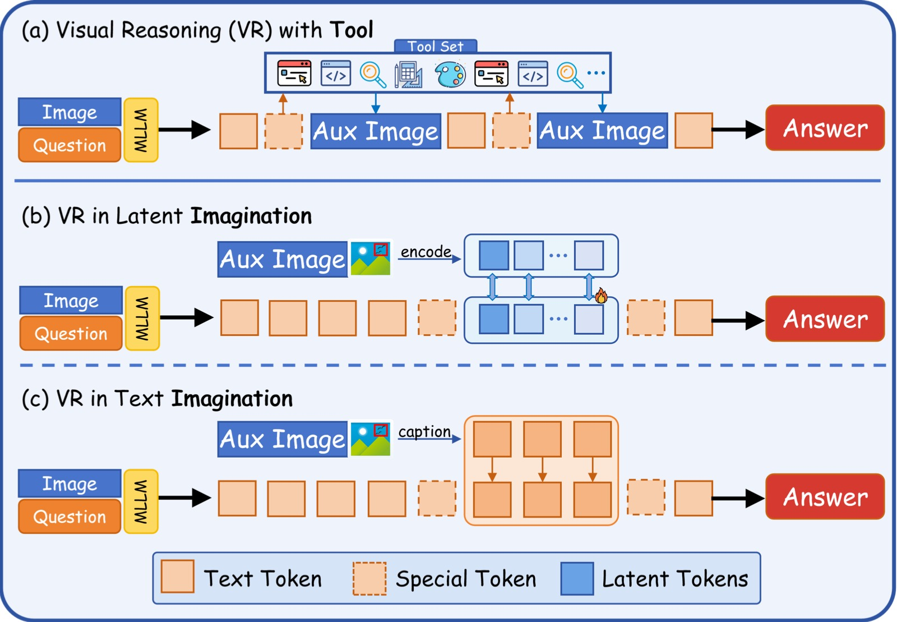
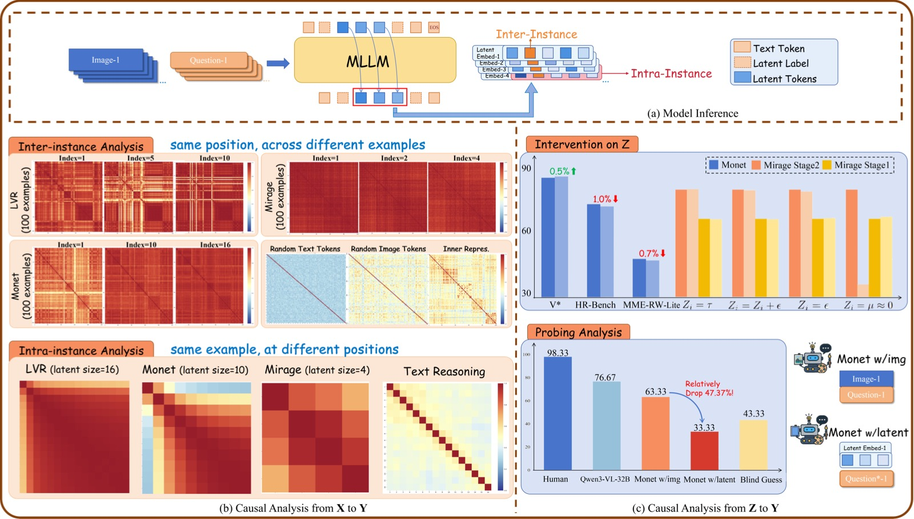
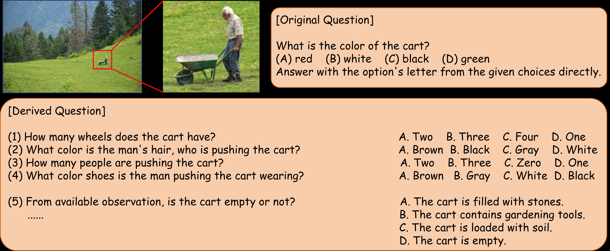
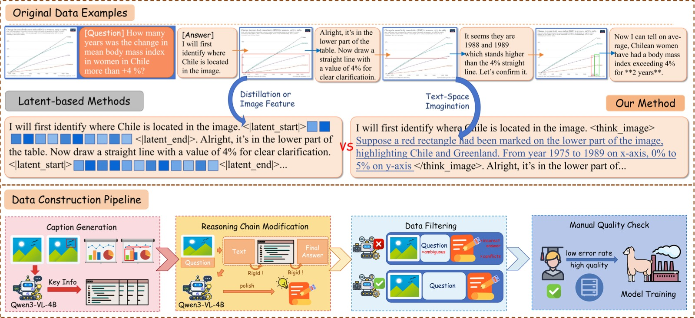
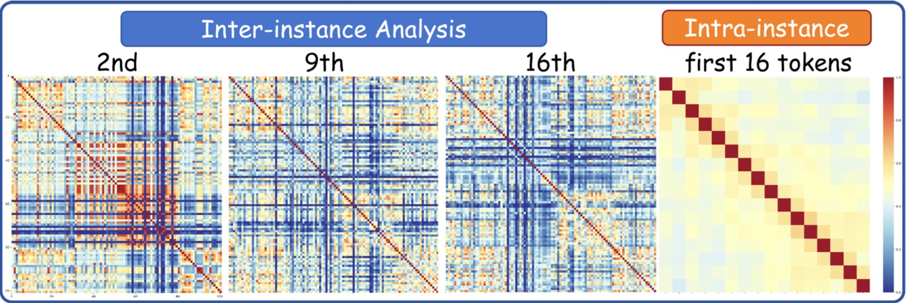
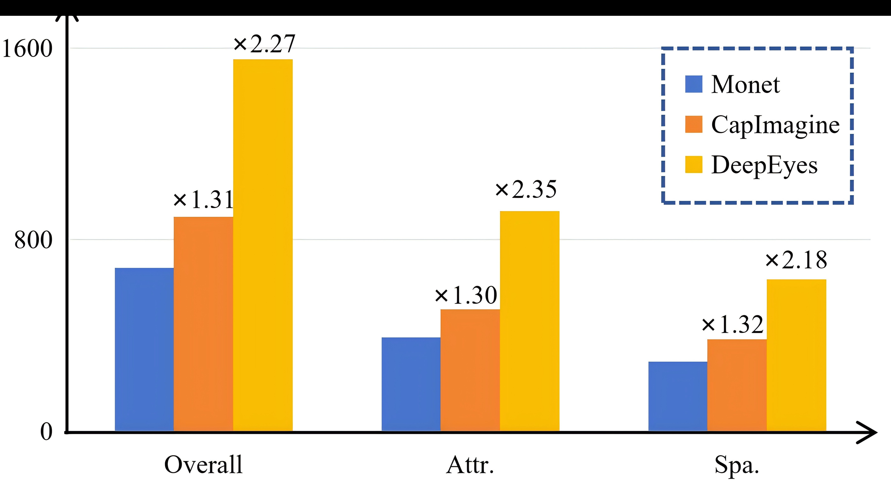

<!-- arxiv: 2602.22766 -->
<!-- venue: ICML 2026 -->
<!-- tags: 视觉推理, MLLM, 因果分析, 中介分析 -->

# CapImagine：Imagination Helps Visual Reasoning, But Not Yet in Latent Space

> 本文基于以下本地材料整理：
>
> - 论文 TeX 源码：`2026-06-11/arXiv-2602.22766v2/example_paper.tex`
> - 论文图片：`2026-06-11/arXiv-2602.22766v2/image1.pdf`、`image2.pdf`、`image3.pdf`、`image4.pdf`、`image5.png`、`image6.png`
> - 官方代码：`https://github.com/AI9Stars/CapImagine`（基于 Monet 代码库，CoT-SFT on Qwen2.5-VL-7B）
> - 本文图片导出目录：`2026-06-11/assets/capimagine/`

> **论文信息**
> - 作者：You Li（北京交通大学）、Chi Chen（清华大学，通讯）、Yanghao Li（清华大学，通讯）、Fanhu Zeng（清华大学）、Kaiyu Huang（北京交通大学）、Jinan Xu（北京交通大学）、Maosong Sun（清华大学）
> - 机构：北京交通大学计算机学院、清华大学
> - 投稿方向：ICML 2026（accepted）
> - arXiv ID：2602.22766v2
> - 代码：https://github.com/AI9Stars/CapImagine

## 一、核心问题

Latent Visual Reasoning 领域声称"模型在 latent space 中进行视觉想象"——但本文用因果中介分析证明：latent token 既不受输入影响、也不影响输出，更像 placeholder 而非推理载体。于是提出 **CapImagine**：把中间图像操作转化为文本描述，让模型在文本空间显式想象，在同一数据源下全面超越 latent-space baseline。

```text
之前的 LVR 方法：image + question → latent tokens → answer     （latent token 实际是摆设）
CapImagine 的做法：image + question → text imagination → answer  （文本想象真正起作用）
关键发现：改了 latent token，答案几乎不变；改了文本想象，答案断崖下跌
```

### 背景：视觉推理的两条路

MLLM 做复杂视觉推理，目前有两个主流范式：

- **文本空间推理**：纯文字 CoT 推理。问题是文字无法精确描述"那个偏左、轮廓不清晰的物体"，长文本还容易出现 attention 衰减。
- **工具辅助推理**：通过 zoom-in、画辅助线等工具操作图像（如 DeepEyes、PixelReasoner）。效果好但被预定义工具集限制，和人类"自由想象"差距大。

### LVR 的承诺与现实

**Latent Visual Reasoning（LVR）** 试图走第三条路——模型在 latent space 中推理、不经过文本 bottleneck、不受工具限制。从 Mirage → LVR → Monet，一系列方法用视觉特征或蒸馏信号监督 latent token，确实在 benchmark 上刷出了好成绩。

**但核心问题是：这些 latent token 到底在做什么？是真正在推理还是"搭顺风车"？**

## 二、核心思路 / 方法

本文的核心思路分为两大部分：先用因果中介分析证明现有 LVR 方法的 latent token 基本无效（分析与诊断），再提出 CapImagine 方法作为替代方案（解决与改进）。

### 2.1 因果分析框架：Latent Token 基本是摆设

#### 2.1.1 问题形式化

论文将 LVR 建模为因果链 $X \rightarrow Z \rightarrow Y$：$X$ = 输入（图像 + 问题），$Z$ = latent token，$Y$ = 最终答案。真正的"想象"应满足：改变 $X$ 会改变 $Z$，改变 $Z$ 会改变 $Y$。



*图 1：论文核心信息概览，一张图展示三种视觉推理范式的本质差异。该图为横向三栏布局，每栏对应一种范式。*

*子图 (a) — Reasoning with Tools（工具辅助推理）：画面展示了一个多步骤推理流程——模型接收原始图像（如书架照片）和问题后，通过调用 zoom-in 工具在图像上框出目标区域并放大，再从放大后的局部图像中提取细节信息（如书本数量），最终给出答案。图中用橙色箭头和标注框展示了"框选→放大→分析"的完整工具链。这种范式信息完整但受限于预定义工具集（只能 zoom-in、draw 等固定操作），无法像人类那样自由地在脑中变换视角。*

*子图 (b) — Latent-space Imagination（潜在空间想象）：画面展示了模型推理过程的 token 序列——蓝色方块代表正常文本 token，紫色方块代表 latent token（穿插在文本 token 之间）。关键视觉特征是 latent token 以"连续向量"形式存在（图中用 ⊕ 符号和渐变紫色表示），不经过离散解码。这种范式被期望在 embedding 空间自由"想象"，但本文的核心发现是：这些 latent token 的实际因果作用几乎为零——既不受输入变化影响（inter-instance 相似度极高），也不影响最终输出（替换为噪声后性能几乎不变）。*

*子图 (c) — Text-space Imagination（CapImagine，本文方案）：画面展示了 CapImagine 的推理流程——模型接收图像和问题后，生成显式的文本描述来替代中间图像（绿色高亮文字，如 "Upon highlighting, we can observe that..."），然后基于这些文本描述继续推理并给出最终答案。与子图 (b) 的关键区别在于：中间推理内容是可读、可验证的自然语言，而非黑盒连续向量。图中绿色文字的视觉强调传递了"文本想象是显式的、可审计的"这一核心主张。*

#### 2.1.2 分析框架总览



*图 2：系统性 latent 分析框架总览，是整篇论文因果分析部分的核心图表。该图为纵向三行布局，每行对应分析框架的一个层次。*

*子图 (a) — Model Inference（模型推理流程）：展示 latent token 的完整生命周期。左侧为输入：图像（经过 Vision Encoder 编码为 image tokens）和文本问题（编码为 text tokens）拼接后送入 LLM Backbone。中间展示 latent mode 的切换机制：模型先正常解码文本 token（蓝色方块序列），当输出 `<|latent_start|>` 特殊 token 后进入 latent mode——此时不再通过 lm_head 做离散采样，而是将 Transformer 最后一层的 hidden state（紫色方块）直接作为下一时间步的输入，形成 continuous feedback loop（图中用紫色双向箭头表示）。每个 latent token 本质上是维度 = hidden_size 的连续向量。当模型输出 `<|latent_end|>` 后退出 latent mode，恢复正常的离散文本解码。底部展示了具体的 token 序列格式：`<image> Question <|latent_start|> z₁ z₂ ... zₙ <|latent_end|> Answer`。*

*子图 (b) — Causal Analysis of X → Z（输入到 latent 的因果分析）：分左右两个面板。左侧为 Inter-instance Analysis（跨实例相似度热力图）——横轴和纵轴均为不同的测试实例（从 V*、MME、OCRBench-v2、MME-RealWorld-Lite、TableVQA 中采样的 100 个实例），热力图的每个格子 (i, j) 表示实例 i 和实例 j 在同一 latent 位置的余弦相似度。颜色从蓝（低相似度，~0.2）渐变到红（高相似度，~1.0）。图中同时对比了四种 token 类型的热力图：Text tokens、Image tokens、Inner representation 均显示大面积的蓝色/绿色（低相似度，有区分性），唯独 Latent tokens 的热力图呈现大面积红色（高相似度，~0.9–1.0），表示不同输入产生的 latent token 几乎一模一样。右侧为 Intra-instance Analysis（实例内相似度曲线）——横轴为推理步数（Step Index，0–10+），纵轴为余弦相似度（Cosine Similarity，0.0–1.0）。同时绘制了 Monet、LVR、Mirage 三种方法的曲线：三条曲线均随着步数增加而上升，LVR 上升最快（第 2 步即接近 1.0），Monet 次之（逐步上升至 ~0.95），Mirage 全程高相似度（~0.95+）。作为对比的 Text CoT 曲线始终在低位（~0.3–0.5），展示清晰的逐步状态转移。*

*子图 (c) — Causal Analysis of Z → Y（latent 到答案的因果分析）：分左右两个面板。左侧为 Intervention on Z（干预实验）——三组并排柱状图，分别对应 V*（Overall Accuracy, %）、HRBench4K（Overall Accuracy, %）、MME-RealWorld-Lite（Overall Accuracy, %）三个 benchmark。每组有蓝色柱（Monet 原版）和红色柱（Monet do(Z)，所有 latent token 替换为同一张量）。关键数据：V* 上蓝色 82.7 vs 红色 83.3（+0.6），HRBench4K 上蓝色 71.1 vs 红色 70.1（-1.0），MME-RealWorld-Lite 上蓝色 46.9 vs 红色 46.2（-0.7）。三组柱子的蓝红高度几乎一致，差异不超过 1.0 个百分点，误差线也大量重叠。右侧为 Probing Analysis（探测分析）——柱状图对比两种输入条件的准确率：Latent-only（仅用 latent token 作为输入回答 30 道衍生多选题）远低于图中标注的随机猜测线（灰色虚线），而 Image Input（用原始图像作为输入）达到 76.67%。横轴为两种条件，纵轴为 Accuracy (%)。*

#### 2.1.3 Finding 1：X → Z 断开——Latent token 不受输入影响

> **Finding 1：Latent token 在不同实例和不同任务间高度相似，并在推理过程中逐步退化（degeneration），最终坍缩为几乎相同的表示。**

**实验设置**：Monet（蒸馏式 LVR）、LVR（图像特征监督）、Mirage（压缩式 LVR）三种方法，V*、MME、OCRBench-v2、MME-RealWorld-Lite、TableVQA 五个 benchmark，采样 100 个测试实例。

**跨实例分析（Inter-instance）**：图 2(b) 热力图中，固定位置比较不同实例的 latent token——余弦相似度极高（红色，~0.9–1.0），而 Text/Image/Inner tokens 均为低相似度（蓝色/绿色，~0.2–0.5）。不同任务之间也同样高度相似——连"这是 VQA 还是 OCR"这种粗粒度区分都无法做到。

**实例内分析（Intra-instance）**：图 2(b) 相似度曲线中，三种方法退化速度不同——LVR 第 2 步即坍缩（曲线急速逼近 1.0），Monet 到第 5 步后逐步丧失区分性（曲线缓慢上升至 ~0.95），Mirage 全程高相似度（全程 ~0.95+）。作为对比，Text CoT 的 hidden state 相似度始终在 ~0.3–0.5，展示清晰的逐步状态转移。

**物理直觉解释**：Transformer hidden state 存在已知的各向异性锥退化现象，表示会自然聚拢导致高余弦相似度。离散 CoT 中的 `lm_head` + `argmax`/`sampling` 操作引入强非线性，将表示从退化锥"拉出"。Latent token 全程连续操作，缺乏此机制，因此被困在退化锥中。

#### 2.1.4 Finding 2：Z → Y 断开——改了 latent token 答案几乎不变

> **Finding 2：对 latent token Z 施加根本性改动（全部替换为相同张量、注入噪声、替换为纯噪声），最终答案 Y 几乎不变。**

**Monet 干预（通用场景）**：将所有 latent token 替换为同一共享张量——V* 上从 82.7 变为 83.3（反而微涨 0.6），HR-Bench4K 从 71.1 降到 70.1（仅降 1.0），MME-RealWorld-Lite 从 46.9 降到 46.2（仅降 0.7）。数据对应图 2(c) 左侧的三组柱状图，蓝红高度几乎一致。

**Mirage 干预（任务特定场景，VSP 数据集）**：四种干预方式的结果——全部同张量（Stage-1: 64.0, -0.2; Stage-2: 77.2, +0.2）、注入高斯噪声（Stage-1: 64.0, -0.2; Stage-2: 76.7, -0.3）、替换为纯噪声（Stage-1: 64.5, +0.3; Stage-2: 76.2, -0.8）、设为接近零（Stage-1: 65.0, +0.8; Stage-2: 35.5, -41.5）。Stage-2 全零干预的崩溃是因为触发了重复生成（repetition collapse），而非 latent 语义被破坏。

**核心信息**：将 latent token 替换为随机噪声后性能几乎不变——如果 latent token 是推理的关键载体，替换为噪声应导致性能崩盘。

#### 2.1.5 Finding 3：Latent token 编码的视觉语义极少

> **Finding 3：Latent token 编码的视觉语义极少，即使用 latent token 作为唯一输入回答最简单的 VQA 问题，正确率也远低于随机猜测。**

**探测实验设计**：从 V* 采样 $(I_i, q_i)$ → Monet 推理收集 $\{Z_i\}$ → 对同一图像区域构造 30 道不同属性的多选题 $\tilde{q}$（如原问题问"颜色"，衍生问"形状"、"数量"等）→ 对比两种输入条件：Latent-only（只用 $\{Z_i\}$）vs Image Input（用原始 $I_i$）。

**结果（对应图 2(c) 右侧柱状图）**：Latent-only 准确率远低于随机猜测线（灰色虚线），Image Input 达到 76.67%。原始图像能做到 76.67% 说明衍生问题是精心构造、可回答的，但 latent-only 连随机猜都不如——说明 Monet 生成的 latent token 根本没有保留关于图像关键区域的视觉语义。模型不是通过 latent token "看到"图像的。



*图 6：探测分析中构造的衍生问题示例，对应论文附录。该图展示了从原始 V\* 问题如何衍生出 30 道不同属性的多选题。左侧为原始图像区域，同一区域被标注出多个候选物体（如不同颜色的方框可能代表不同属性关注的局部区域）。右侧为衍生问题表格——每个衍生问题与原问题共享相同的视觉区域，但询问不同的属性维度（如原问题关注"颜色"，衍生问题关注"形状"、"数量"、"位置"等）。图中用水平分割线和不同的编号清晰地展示了多个衍生问题的格式——每道题包含一个上下文描述（如"Based on the same visual region..."）和一个多选题式的问题，选项为 A/B/C/D 格式。这些衍生问题的设计意图是检验：如果 latent token 真正编码了该区域的视觉语义，那么它应该能够回答该区域上的任何属性问题，而不仅仅是原问题关注的特定属性。结果表明 latent token 做不到。图中使用了彩色标注来强调衍生问题中属性维度的变化。*

#### 2.1.6 小结

```text
Finding 1: X → Z 断开（不受输入影响）
    +
Finding 2: Z → Y 断开（不影响输出）
    +
Finding 3: latent token 不编码视觉语义
    =
结论：latent token ≈ soft prompt / placeholder
     模型走了某条绕过 latent reasoning 的隐式捷径
```

### 2.3 CapImagine：回到文本空间进行显式想象

既然 latent token 没什么用，答案出奇简单：**把中间图像的操作翻译成文本描述——让模型在语言中"看见"。**



*图 3：CapImagine 完整方法论，纵向三栏布局展示从原始数据到训练数据的完整流程，以及两种方法的本质差异。*

*上半部分 — 原始 Interleaved 多模态推理数据格式：左侧展示了一个完整的推理轨迹示例——顶层是初始图像（书架照片）和问题（"How many books are on the shelf?"），中间是文本推理步骤（"Let me look at the shelf carefully..."），随后出现中间辅助图像（zoom-in 到书架局部），然后是继续推理（"Upon zooming in, I can see there are 15 books"），最后是最终答案（"15"）。关键观察：中间辅助图像承载了关键视觉信息（如"这里有 15 本书"），但 latent 方法试图把这些信息压缩到几个 latent token 里。*

*中间部分 — 两种方法论的本质差异对比：上半行为 Latent-space reasoning——特殊 token `<|latent_start|>` 触发 latent mode，后面的 latent token 用 ⊙ 符号表示（如 "⊙ ⊙ ⊙ ⊙"），最后 `<|latent_end|>` 退出。所有中间视觉操作的内容（如 zoom-in 看到的内容）被压缩到这些 ⊙ 里，不可解释、不可验证。下半行为 Text-space imagination（CapImagine）——特殊 token `<think_image>` 触发文本想象，后面是自然语言描述（如 "Upon zooming in, the highlighted region shows 15 books arranged in 3 rows..."），关键视觉信息以文字形式保留。绿色高亮区域视觉上强调文本想象的显式性。从 ⊙ 到文字的这一转换是 CapImagine 方法论的核心。*

*下半部分 — 数据构建流水线的三个步骤：Step 1（Data Rewriting）——左侧展示了两个子面板：Visual-CoT / Zebra-CoT 的 zoom-in 图像通过 Qwen3-VL-4B 生成聚焦描述，Refocus / CogCoM 的操作前后图像对通过 Qwen3-VL-4B 分析视觉差异（如标注数值从 unknown 变为 42）。Step 2（Global Refinement）——用 MLLM 重写推理链，将生成的文本描述自然融入原推理过程，避免"刚才还在说 A，突然插一段描述 B"的逻辑断裂。Step 3（Data Filtering）——用 MLLM 评估答案一致性和问题可回答性，从 125K 条实例中过滤保留 17K 高质量数据（仅占原始的 ~14%）。图中用漏斗图形强调数据量的逐步收缩。*

#### 2.3.1 数据流总览

```text
┌─────────────────────────────────────────────────────────┐
│                 Monet-SFT-125K (125K)                    │
│  ┌──────────┐  ┌──────────┐  ┌──────────┐  ┌────────┐ │
│  │Visual-CoT│  │Zebra-CoT │  │ Refocus  │  │ CogCoM │ │
│  │ (94.88%) │  │          │  │          │  │        │ │
│  └────┬─────┘  └────┬─────┘  └────┬─────┘  └───┬────┘ │
└───────┼─────────────┼─────────────┼─────────────┼───────┘
        │             │             │             │
        ▼             ▼             ▼             ▼
┌─────────────────────────────────────────────────────────┐
│            Step 1: Data Rewriting                        │
│  Qwen3-VL-4B 将中间图像 → 文本描述                        │
│  • Zoom-in 类：描述高亮区域的视觉语义                       │
│  • 操作类：描述图像操作前后的差异                           │
└──────────────────────────┬──────────────────────────────┘
                           │
                           ▼
┌─────────────────────────────────────────────────────────┐
│            Step 2: Global Refinement                     │
│  MLLM 重写推理链，让文本描述自然融入                         │
└──────────────────────────┬──────────────────────────────┘
                           │
                           ▼
┌─────────────────────────────────────────────────────────┐
│            Step 3: Data Filtering                        │
│  MLLM 评估答案一致性 + 问题可回答性                         │
│  125K → 17K（保留 ~14%）                                 │
└──────────────────────────┬──────────────────────────────┘
                           │
                           ▼
                 ┌─────────────────┐
                 │  CapImagine 训练 │
                 │  17K 高质量数据  │
                 │  CoT-SFT on     │
                 │  Qwen2.5-VL-7B  │
                 └─────────────────┘
```

#### 2.3.2 训练配置

| 配置项 | 值 |
|---|---|
| 基座模型 | Qwen2.5-VL-7B |
| 训练数据 | Monet-SFT-125K 重写 + 过滤后的 17K 实例 |
| 训练方式 | CoT-SFT（使用 Monet 代码库） |
| 硬件 | 8 × A800-80G GPU |
| Batch size | 1（gradient accumulation = 16） |
| 特殊策略 | 选取 best checkpoint（应对训练不稳定） |

## 三、训练目标

CapImagine 的训练目标是标准的 **CoT-SFT（Chain-of-Thought Supervised Fine-Tuning）**，没有引入额外的损失项或策略优化阶段。

**核心训练技术栈**：
- **损失函数**：标准交叉熵损失（next-token prediction），与常规 SFT 完全一致
- **训练范式**：仅在文本空间进行监督微调，不涉及 latent mode 的 continuous feedback loop 训练
- **与 Monet 的关键区别**：Monet 在 SFT 之后额外有一个 **Visual Latent Policy Optimization** 阶段——用强化学习优化 latent token 的生成策略。而 CapImagine 证明了纯文本空间的 SFT 即可全面超越含 RL 的 Monet，这也间接质疑了 Policy Optimization 在 latent reasoning 中的实际作用

**数据源自 Monet-SFT-125K**（经过重写 + 过滤后保留 17K 高质量实例），使用的代码库也是 Monet 的代码库——唯一改动是将 interleaved 中间图像替换为文本描述。这种"数据平权"设计确保了方法对比的公平性。

### 4.1 主实验：高分辨率感知 + 抽象推理

**表 1：主实验性能对比**。该表汇总了各方法在 V*、HR-Bench4K、HR-Bench8K、MME-RealWorld-Lite 和 BLINK（Jigsaw / Multi-View 子集）五个高分辨率感知和抽象推理 benchmark 上的表现。Latent-space 方法（LVR、Monet）虽然显著优于基座模型 Qwen2.5VL-7B，但 CapImagine（文本空间想象）在没有使用任何工具或图像操作的情况下全面超越 latent-space baseline，并在 BLINK Jigsaw 上取得最大领先（+14.7pp over Monet）。

| 模型 | V* | HR-Bench4K | HR-Bench8K | MME-RW-Lite | BLINK (Jigsaw/MV) |
|---|---|---|---|---|---|
| GPT-4o（闭源） | 67.5 | 59.0 | 55.5 | 52.0 | 55.3/59.4 |
| Qwen2.5VL-7B（基座） | 76.4 | 68.0 | 63.8 | 45.8 | 62.7/42.9 |
| PixelReasoner（工具） | 80.6 | 72.9 | 66.9 | 49.7 | - |
| DeepEyes（工具） | **90.0** | 75.1 | 72.6 | 53.2 | - |
| LVR（latent 想象） | 81.7 | 70.8 | 63.0 | 50.6 | 52.0/46.6 |
| Monet（latent 想象） | 83.3 | 71.0 | 68.0 | 46.9 | 50.0/47.4 |
| Monet + subset (17K) | 79.6 | 70.7 | 67.9 | - | - |
| **CapImagine（文本想象）** | **85.9** | **74.1** | **70.7** | **54.8** | **64.7/49.6** |

**核心观察**：(1) CapImagine 全面超越 Monet——V* +2.6pp、HR-Bench8K +2.7pp、MME-RW-Lite +7.9pp，同一数据源下文本想象 >> 潜在想象。(2) 虽不及 DeepEyes（90.0 vs 85.9 on V*），但 DeepEyes 直接操作图像有天然信息优势，CapImagine 仅靠文本描述。(3) BLINK Jigsaw 64.7 vs Monet 50.0（+14.7pp），证明文本想象对空间重构类抽象推理同样有效。

### 4.2 TableVQA

**表 2：TableVQA 基准性能对比**。该表展示了 CapImagine 在表格类视觉问答任务上的表现。表格类任务要求模型理解和比较表格中的数值与文本信息，对精确的文字识别和结构化理解要求高。CapImagine 全面超越 Monet，三个子任务（VWTQ、VWTQ-syn、VTabFact）均取得最高分，验证了文本想象在图表/表格等非自然图像场景下同样有效。

| 模型 | VWTQ | VWTQ-syn | VTabFact | Overall |
|---|---|---|---|---|
| Monet | 55.3 | 60.4 | 78.8 | 64.8 |
| **CapImagine** | **60.9** | **68.0** | **83.2** | **70.7** |

整体领先 5.9pp，三个子任务全面优于 Monet，验证文本想象在图表/表格等非自然图像上同样有效。

### 4.3 消融实验

**表 3：消融实验结果**。该表系统分析了四个因素对性能的影响：(1) Data Rewriting——去掉文本描述改为 `<think_image>` 占位符；(2) Data Filtering——直接用 125K 原始数据训练（中间图像替换为 `<think_image>`）；(3) 方法差距——用相同 17K 子集训练 Monet。表中括号内为相对于完整 CapImagine 的差值。三条消融路径清晰分离了数据质量和方法选择的影响。

| 消融条件 | V* | HR-Bench4K | HR-Bench8K |
|---|---|---|---|
| **CapImagine（完整）** | **85.9** | **74.1** | **70.7** |
| w/o Rewriting（用 `<think_image>` 占位） | 82.7 (-3.2) | 74.1 (0) | 69.8 (-0.9) |
| w/o Filtering（直接用 125K 原始数据） | 82.7 (-3.2) | 72.5 (-1.6) | 69.3 (-1.4) |
| Monet + subset（相同 17K 数据训练 Monet） | 79.6 (-6.3) | 70.7 (-3.4) | 67.9 (-2.8) |

三条结论：(1) 去掉文本想象 V* 掉 3.2pp——文本描述携带了关键推理信息。(2) 不过滤再掉 3.2pp——95% 的 Visual-CoT 数据质量差。(3) 用相同 17K 数据训练 Monet（V*: 79.6 vs 85.9），证明方法差距是本质的——文本空间想象本身 >> latent 想象。此外 SFT 版 Monet（去 Policy Optimization）与该 subset 效果持平，进一步质疑 latent reasoning 中 Policy Optimization 的实际作用。

### 4.4 CapImagine 的因果分析：文本想象是真正的因果变量



*图 4：CapImagine 中文本想象 token 的隐状态在两个维度的因果分析。该图为左右双面板布局，每个面板包含热力图和对比曲线。*

*子图 (a) — Inter-instance Analysis（跨实例相似度）：左侧热力图的横轴和纵轴为不同测试实例的文本想象 hidden state，颜色编码与图 2 相同（蓝色/绿色 = 低相似度，红色 = 高相似度）。CapImagine 的热力图主导颜色为蓝色和绿色（余弦相似度 ~0.2–0.5），与 latent token 的"全红"热力图（余弦相似度 ~0.9–1.0）形成鲜明对比。右侧为对比曲线——横轴为 Instance Index（实例索引），纵轴为 Cosine Similarity（余弦相似度）。CapImagine（下方蓝色曲线）的相似度值在 ~0.2–0.4 区间波动，远低于 latent reasoning 方法（上方红色曲线，在 ~0.7–0.9 区间）。这表明不同输入产生的文本想象内容有实质性差异——X → Z 因果链是连通的。*

*子图 (b) — Intra-instance Analysis（实例内相似度）：左侧热力图展示同一实例内相邻文本想象 token 之间的余弦相似度——主导颜色为中等蓝色至浅绿色（~0.4–0.7），说明相邻 token 有独立语义而非完全重复。右侧对比曲线——横轴为 Step Index（推理步数），纵轴为 Cosine Similarity。CapImagine（蓝色曲线）的相邻 token 相似度在 ~0.4–0.6 范围，持续低于 latent reasoning 方法（红色曲线，在 ~0.6–0.9 范围）。关键区别：latent 方法的曲线随步数上升（退化现象），而 CapImagine 的曲线在低位平稳波动——每个"想象 token"编码了不同的语义内容，而非逐步坍缩。*

**干预实验——改动文本想象内容的后果**：使用 Qwen3-32B 故意篡改推理过程中的想象描述（如把"物体是红色"改成"物体是蓝色"，把"框内有 15 本书"改成"框内有 3 本书"），然后让 CapImagine 基于篡改后的想象完成推理。

**表 4：CapImagine 干预实验结果**。该表展示了在 CapImagine 的推理过程中，用 Qwen3-32B 故意篡改文本想象内容后的性能变化。$(do(Z))$ 表示将推理中间的想象描述改为会导致错误结论的文本，然后让模型基于篡改后的内容完成推理。与图 2(c) 中 Monet 的干预结果（差异不超过 ±1.0pp）形成核心对比——文本想象被篡改后性能断崖式下跌（-63.4pp / -50.1pp），证明了文本想象的真正因果作用。

| 模型 | V* (Overall) | HR-Bench4K |
|---|---|---|
| CapImagine（原版） | 85.9 | 74.1 |
| CapImagine $do(Z)$（想象被篡改） | **22.5** (-63.4) | **24.0** (-50.1) |

**性能断崖式下跌——V* 从 85.9 掉到 22.5（-63.4pp），HR-Bench4K 从 74.1 掉到 24.0（-50.1pp）。** 这证明：(1) 文本想象内容在推理过程中起到了真正的、不可替代的因果作用；(2) 模型确实"读了"且"信了"这些文本想象；(3) 与 latent token 的"改了也白改"形成最核心的实验对比——**Imagination helps visual reasoning, but not yet in latent space**。

### 4.5 推理效率



*图 5：Monet（latent）、CapImagine（text）和 DeepEyes（tool）三种方法在 V* benchmark 各子类上的推理速度对比，柱状图格式。横轴为 V* benchmark 的不同子类别（Attribute / Spatial 等），每个类别包含三根并排柱形；纵轴为解码时间（Seconds），仅计解码阶段、不含图像编码和 prompt 处理时间。三种颜色对应三种方法——CapImagine（文本想象）、Monet（latent 想象）、DeepEyes（工具调用 + zoom-in 操作）。*

*关键数据：(1) CapImagine 与 Monet 的柱形高度基本持平（两者在大多数子类上的解码时间都在相近范围内波动），说明虽然文本想象序列比 latent token 长，但避开了 latent mode 的 continuous feedback 计算开销和 latent↔text 的模态切换成本，两者一增一减后耗时相当。(2) DeepEyes 的柱形高度约为 CapImagine 的 2×——工具方法需要在推理过程中实际执行 zoom-in 操作并重新编码放大后的图像区域，这是最耗时的环节；CapImagine 将这一步骤替换为纯文本生成，无需任何图像重编码。(3) CapImagine 以 ~2× 的速度提供了非常有竞争力的效果（V*: 85.9 vs DeepEyes 90.0），效率和效果的 trade-off 非常有利——在实践中，2× 加速可能意味着实时交互场景下从不可用到可用的差别。*

## 五、关键洞察与技术亮点

### 5.1 学术贡献

**第一层：系统性"拆穿" latent visual reasoning。** 不是"提出更好的 latent 方法"，而是"先证明现有方法可能有问题、再提出替代方案"。三个 Findings 从现象（高度同质）→机制（因果断裂）→根因（无语义），构成完整证据链。

**第二层：严格的实验设计建立因果论断。** "在相同 17K 子集上训练 Monet"是关键设计——将"数据更好"和"方法更好"两个混淆因素分离。同一份数据，文本想象力 > latent 想象力。

**第三层：端到端的因果验证闭环。** 对 CapImagine 做了与 latent token 完全相同的因果分析，展示文本想象 $X \rightarrow Z \rightarrow Y$ 的完整因果链——不是一个碰巧更好的 heuristic，而是一个因果上正确的方法。

### 5.2 技术亮点

1. **退化现象的物理直觉解释**：Transformer hidden state → 各向异性锥退化 → 离散解码非线性的"拉出"作用 → latent token 缺失此机制 → 渐进坍缩。
2. **多层次干预策略**：四种干预（共享张量、注入噪声、替换纯噪声、近似零值），强度从弱到强，覆盖"保持分布内"到"完全破坏分布"的完整区间。前三者几乎无影响，增强了结论可靠性。
3. **数据平权设计**：相同 17K 子集训练 Monet vs CapImagine，Monet 的 SFT 版去掉 Policy Optimization 后效果持平——进一步质疑 Policy Optimization 阶段在 latent reasoning 中的实际作用。

## 六、代码实现解读

CapImagine 的代码仓库（https://github.com/AI9Stars/CapImagine）基于 **Monet 代码库**进行修改，核心改动并不大。由于官方暂未提供本地克隆，以下根据论文描述整理关键实现要点。

### 6.1 架构概览

```text
┌───────────────────────────────────────────────────────────────┐
│                    CapImagine 实现流程                          │
├───────────────────────────────────────────────────────────────┤
│  1. 基座模型：Qwen2.5-VL-7B（Monet 使用的同一基座）              │
│  2. 数据准备阶段（独立脚本，非训练阶段）：                         │
│     ├── Step 1 Data Rewriting: Qwen3-VL-4B 推理               │
│     │   ├── Zoom-in 图 → 文本描述                              │
│     │   └── 操作前后图对 → 差异描述                              │
│     ├── Step 2 Global Refinement: MLLM 重写推理链               │
│     └── Step 3 Data Filtering: MLLM 评估过滤                    │
│  3. 训练阶段：CoT-SFT（标准 next-token prediction 训练）         │
│  4. 推理阶段：标准文本自回归解码（无 latent mode）                │
└───────────────────────────────────────────────────────────────┘
```

### 6.2 数据预处理流程（Python 脚本级概要）

```text
# Step 1: Data Rewriting（数据重写）
for each instance in Monet-SFT-125K:
    if zoom_in_image in instance:
        caption = Qwen3_VL_4B.generate(
            zoom_in_image + original_question,
            prompt="Describe the highlighted region in detail."
        )
        replace zoom_in_image with caption in trajectory
    elif image_before + image_after in instance:
        diff = Qwen3_VL_4B.describe_difference(
            image_before, image_after,
            prompt="What visual change occurred? Extract key info."
        )
        replace image_before_and_after with diff in trajectory

# Step 2: Global Refinement（全局推理链重写）
for each rewritten_trajectory:
    refined = MLLM.rewrite(
        rewritten_trajectory,
        prompt="Integrate image descriptions naturally into the reasoning chain."
    )

# Step 3: Data Filtering（数据过滤）
for each refined_trajectory:
    score = MLLM.judge(
        refined_trajectory,
        criteria=["answer_consistency", "question_answerability"]
    )
    if score < threshold:  # 最终保留 ~14%（125K → 17K）
        discard
```

### 6.3 推理流程差异

| 维度 | Monet（latent 推理） | CapImagine（文本想象） |
|---|---|---|
| 解码方式 | text ↔ latent mode 交替切换 | 纯文本自回归解码 |
| Mode 切换信号 | `<\|latent_start\|>` / `<\|latent_end\|>` | 无特殊 mode |
| 想象载体 | 连续 latent token（hidden_size 维向量） | 自然语言描述文本 |
| 中间状态编码 | continuous feedback loop（最后 hidden state → 下一时间步输入） | 标准 next-token prediction |
| 推理可解释性 | 低（latent token 不可读） | 高（文本可读、可审计、可干预） |
| 因果可验证性 | 弱（改了 token 性能几乎不变） | 强（改了文本描述性能断崖下降） |

### 6.4 公式与代码映射

论文中定义了 latent 推理的数学形式化：

$$h_i = \mathcal{M}(E(x); y_{<i}), \quad y_0 = \emptyset$$
$$y_i = \mathbb{I}(i \in \mathcal{I}_L) \cdot \phi(h_i) + \mathbb{I}(i \notin \mathcal{I}_L) \cdot E(\text{Decode}(h_i))$$

- $\mathbb{I}(i \in \mathcal{I}_L)$：判断当前步是否处于 latent mode → 代码中对应 `if token_id == LATENT_START_ID` 的特殊分支
- $\phi(h_i)$：latent token 的可选投影层 → 视具体实现，可能是一个线性层或 MLP
- $E(\text{Decode}(h_i))$：离散解码 → 标准 lm_head + argmax/sampling

在 CapImagine 中，上述公式简化为标准的自回归文本生成，不存在 $\mathbb{I}(i \in \mathcal{I}_L)$ 的判断——所有 token 均为离散文本 token。

## 七、局限性

1. **数据构建依赖 MLLM**：重写（Qwen3-VL-4B）和过滤（MLLM judge）的质量受限于所用模型的视觉理解能力，对某些领域图像（如医学影像）可能失效。
2. **仅验证 7B 规模**：所有实验基于 Qwen2.5-VL-7B，更大模型（32B/72B）上文本想象的优势可能不同——更大的模型天然有更强的文本推理能力。
3. **文本想象的长度开销**：文本比 latent token 长，在 prompt 长度、KV cache 占用、训练序列长度上开销更大。极长推理链（多步空间推理 + 多次 zoom-in）场景下可能显著增长。
4. **工具方法的不可替代性**：DeepEyes 在 V* 上领先 CapImagine 4pp（90.0 vs 85.9），某些视觉信息（精确的空间关系、像素级细节）可能确实难以完全用文本等价表达。
5. **因果分析的粗粒度干预**：全替换式干预可能被残差连接"绕过"。更精细的干预（如仅修改部分 latent token、按特定维度修改）可能揭示更细粒度的因果结构。

## 八、关键概念速查

| 概念 | 解释 |
|---|---|
| **LVR（Latent Visual Reasoning）** | 在 MLLM 隐空间中通过连续 latent token 进行视觉推理的范式，无需显式生成图像 |
| **Causal Mediation Analysis** | 因果中介分析：通过 do-calculus 对中间变量 Z 干预并观察 Y，判断 Z → Y 是否连通 |
| **Monet** | 蒸馏式 LVR，梯度传播限制在 latent token 上，联合优化视觉信号和文本语义 |
| **Mirage** | 首个 LVR 方法，通过压缩中间推理图像的视觉特征监督 latent token |
| **CapImagine** | 本文的文本空间想象方法——将 interleaved 中间图像操作转为自然语言描述 |
| **Representation Degeneration** | Transformer hidden state 自然聚入各向异性锥的现象，导致表示间高余弦相似度 |
| **Inter-instance / Intra-instance** | 跨实例分析（固定 latent 位置，比较不同输入）vs 实例内分析（同一实例内相邻 token 对比） |
| **do(Z) 干预** | 因果推断中的 do-operator——强制将变量设为特定值，切断来自上游的因果影响 |
| **Monet-SFT-125K** | Monet 构建的 125K interleaved 多模态推理数据集，被 CapImagine 用作数据源 |
| **V\*** | 细粒度视觉感知 benchmark，要求模型在高分辨率图像中定位和识别小目标的具体属性 |

---

*本笔记基于论文 "Imagination Helps Visual Reasoning, But Not Yet in Latent Space"（arXiv: 2602.22766v2, ICML 2026）撰写。*
