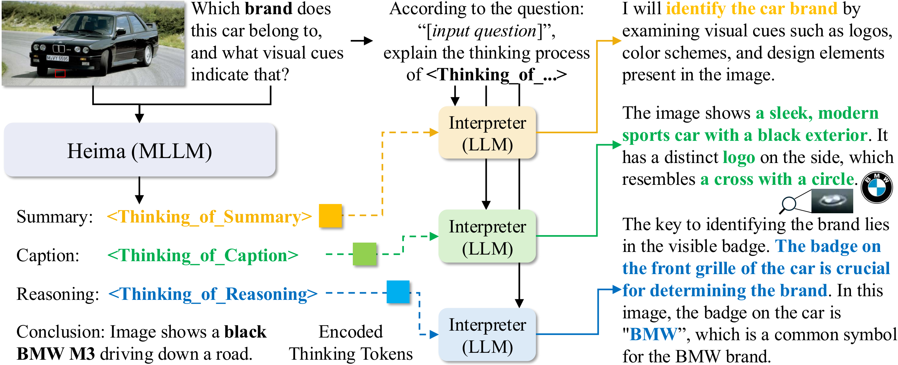
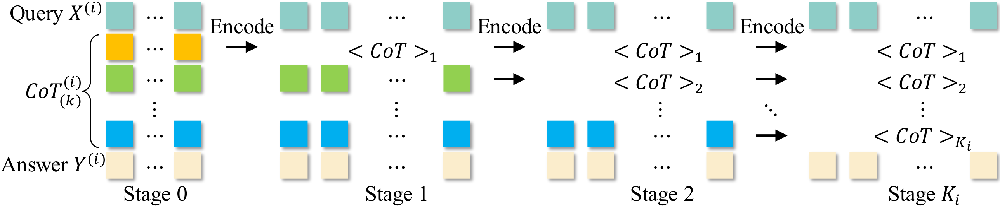
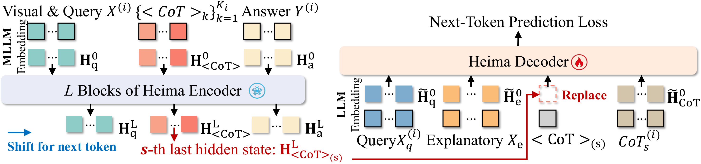
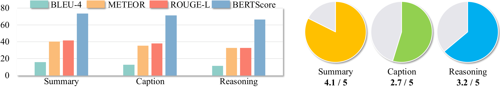

<!-- arxiv: 2501.19201 -->
<!-- venue: ICML 2026 -->
<!-- tags: MLLM, CoT, 推理效率, 信息论, 知识蒸馏 -->

# Heima：通过隐藏思考实现高效推理

> **论文**: Efficient Reasoning with Hidden Thinking
> **作者**: Xuan Shen, Yizhou Wang, Yufa Zhou, Xiangxi Shi, Pu Zhao, Yanzhi Wang, Jiuxiang Gu
> **机构**: Zhejiang University / Adobe / Duke / Oregon State / Northeastern
> **代码**: [shawnricecake/Heima](https://github.com/shawnricecake/Heima)

> 本文基于以下本地材料整理：
>
> - 论文 tex 源码：`arXiv-2501.19201v2/main.tex`、`sections/*.tex`
> - 论文图片：`arXiv-2501.19201v2/figures/*.pdf`
> - 官方代码：`Heima/`
> - 本文图片导出目录：`assets/heima/`

---

## 一、核心问题

Chain-of-Thought（CoT）推理已成为提升多模态大语言模型（MLLM）复杂问题求解能力的关键技术。然而，CoT 推理需要生成大量中间文本（对复杂问题可达数百 tokens），导致高昂的推理成本。

**核心问题**：CoT 的冗长文本包含大量冗余信息，能否将推理过程压缩到隐空间，以极少的"思考 token"替代冗长的文本 CoT，从而大幅提升推理效率？

---

## 二、核心思路/方法

Heima（hidden llama 的谐音）提出了一套完整的 CoT 压缩框架：用 MLLM 将多阶段 CoT 推理压缩为极少量的思考 token，再用纯文本 LLM 作为解释器重建推理过程。



*图 1：Heima 框架总览，用一个具体 Demo（识别图中汽车品牌）串联全流程。图片分为上下两栏。*

**上栏 (a) Heima 隐空间推理（MLLM）：**
输入为一张黑色 BMW M3 的图片和问题"Which automotive brand does this car belong to, and what visual cues or badges indicate that?"。Heima 不生成冗长的文本 CoT，而是用三个思考 token——`<Thinking_of_Summary>`、`<Thinking_of_Caption>`、`<Thinking_of_Reasoning>`——在隐空间中完成推理，最终输出结论"The image shows a black BMW M3 driving down a road"。每个思考 token 只占 1 个 token 位置，但它的 last hidden state 编码了对应推理阶段所需的全部信息（包括视觉特征）。Heima 的答案基于隐推理直接生成，跳过了传统 CoT 中数百个 token 的文本展开过程。

**下栏 (b) Heima 解释器重建推理（纯 LLM）：**
三个独立的纯文本解释器（基于 Llama-3.1-8B-Instruct）分别接收对应思考 token 的 last hidden state。关键设计：解释器**不看图像**，只接收思考 token 的隐表示 + 问题文本 + 解释性 prompt。Summary 解释器重建出"我将通过检查 logo、配色和设计元素来识别汽车品牌"；Caption 解释器重建出"图像显示一辆 sleek 的黑色现代跑车，侧面有一个十字加圆圈的独特 logo"；Reasoning 解释器重建出"前格栅上的徽章是 BMW，这是 BMW 品牌的常见标志，确认了品牌身份"。

这一 Demo 直接验证了 Heima 的核心主张：思考 token 的隐空间表示不仅保留了语言推理信息，还编码了细粒度的视觉特征（如 BMW logo 的十字+圆圈形状），供纯文本 LLM 在不看原图的情况下重建。*

### 2.1 思考 Token 与渐进式蒸馏

**思考 Token（Thinking Token）**：为每个 CoT 阶段（Summary、Caption、Reasoning）定义一个特殊的 vocabulary token（如 `<Thinking_of_Summary>`），将整个阶段的文本推理压缩到单个 token 的隐状态中。

**渐进式蒸馏（Progressive Distillation）**：不是一次性将所有 CoT 阶段替换为思考 token，而是逐阶段渐进替换：

- **Stage 0**：全部使用文本 CoT（标准 LLaVA-CoT 训练）
- **Stage 1**：仅将 Summary 替换为 `<CoT>_1`，其余保持文本
- **Stage 2**：将 Summary + Caption 替换为 `<CoT>_1`, `<CoT>_2`
- **Stage 3**：全部三个阶段都替换为思考 token
- **Recovering Stage**：最终用纯思考 token 额外微调一步，优化跨阶段 transition



*图 2：渐进式蒸馏（Progressive Distillation）的四个训练阶段。每行展示一个阶段使用的训练数据格式，从左到右的三个色块分别对应 Summary（蓝色）、Caption（黄色）、Reasoning（绿色）三个阶段，相同颜色 = 同一类推理内容。最后一列为答案（灰色）。

**Stage 0（无思考 token）：**
全部三个阶段都使用完整文本 CoT + 最终答案。这是标准的 LLaVA-CoT SFT 格式，模型学习"看图和问题 → 生成三段文本推理 → 给出答案"。此阶段的训练数据即为原始 LLaVA-CoT-100k，不做任何修改。

**Stage 1：**
Summary 阶段的文本 CoT 被替换为一个 `<Thinking_of_Summary>` 思考 token。Caption 和 Reasoning 仍保持文本 CoT。模型在此阶段学习将"问题复述/摘要"的推理内容压缩到单个 token 中，同时仍依赖 Caption 和 Reasoning 的文本信号来维持答案质量。这是最关键的一步——如果一步到位把所有 CoT 都替换掉，模型会因分布剧烈偏移而崩溃。

**Stage 2：**
Summary 和 Caption 两个阶段都替换为思考 token（`<Thinking_of_Summary>` + `<Thinking_of_Caption>`）。只有 Reasoning 阶段保留文本 CoT。模型在此阶段学习将视觉描述（Caption）也编码到隐空间，训练难度进一步增加。

**Stage 3：**
全部三个阶段都替换为思考 token + 答案。这是最终的 Heima 推理格式。模型仅凭三个思考 token 的隐状态完成全部推理并输出答案，完全不再依赖文本 CoT。

**Recovering Stage（图中未单独展示）：**
在 Stage 3 之后额外执行一步纯思考 token 的蒸馏（学习率从 1e-4 降至 1e-5），优化跨阶段的 transition 和 token 间的交互，确保整个隐推理链的信息流动是连贯的。消融实验表明去掉这一步会使平均准确率从 58.0 降至 56.6。*

训练数据集 $D_H$ 将原始 CoT 文本替换为思考 token：

$$D_H := \bigl\{ (X, \texttt{<CoTs>}, Y) \bigr\}$$

蒸馏目标为标准 next-token prediction：

$$\mathcal{L}(\theta) = -\mathbb{E}_{(X, Y, \texttt{<CoTs>}) \sim D_H} \log P_\theta(\texttt{<CoTs>}, Y \mid X)$$

### 2.2 信息论分析

论文从信息论角度证明了压缩的合理性。定义 $X$ 为输入，$\mathrm{CoTs}$ 为原始文本推理，$\texttt{<CoTs>}$ 为思考 token，$Y$ 为输出答案。

**核心定理**：由于 $\texttt{<CoTs>}=f(X,\mathrm{CoTs})$，由数据处理不等式有：

$$0 < I(Y;\texttt{<CoTs>}\mid X) \le I(Y;\mathrm{CoTs}\mid X)$$

等价于：

$$H(Y\mid X,\mathrm{CoTs}) \le H(Y\mid X,\texttt{<CoTs>}) \le H(Y\mid X)$$

**关键结论**：
- 思考 token 永远不可能比原始 CoT 包含更多关于 $Y$ 的信息
- 但只要 $I(Y;\texttt{<CoTs>}\mid X) > 0$，就保留了非平凡的推理信息
- 信息损失量 $I(Y;\mathrm{CoTs}\mid X,\texttt{<CoTs>})$ 量化了压缩带来的信息差距——解释器就是用来经验性地评估这个差距的大小

### 2.3 解释器（Interpreter）设计

为了量化信息差距，论文设计了基于纯 LLM 的解释器，将思考 token 的隐状态重构回文本 CoT。



*图 3：解释器（Interpreter）训练流程，展示如何将思考 token 的隐状态解码为文本 CoT。图片包含左右两个 panel。

**左栏 (a) Heima 推理——隐状态生成（冻结，不训练）：**
Heima（冻结的 MLLM）基于图像（Vision Input）和问题（Text Query）执行推理。它生成一串 token 序列：先输出三个阶段的思考 token（每个阶段 1 个特殊 token），再输出答案。对于第 s 个思考 token `<CoT>_(s)`，Heima 在其 Transformer 最后一层产生一个 last hidden state $H_{\texttt{<CoT>}_{(s)}} \in \mathbb{R}^{d}$（$d$ 为 hidden dimension，Llama-3.2-11B 中为 4096）。这个向量就是"压缩后的推理"——单个 token 的文本符号本身不携带信息，所有推理内容都编码在这个 4096 维向量中。

**右栏 (b) 解释器训练——隐状态替换 + 文本重建（可训练）：**
解释器是一个基于纯 LLM（Llama-3.1-8B-Instruct）的 LoRA 可训练模型。训练时：① Heima 生成思考 token 并提取 `H_Caught`（即 $H_{\texttt{<CoT>}_{(s)}}$）；② 在解释器的输入序列中，思考 token 的 **embedding 向量被 $H_{\texttt{<CoT>}_{(s)}}$ 替换**——这是核心操作，发生在 word embedding 层之后、Transformer 第一层之前；③ 解释器接收的完整输入为"解释性 prompt（According to the question, can you explain the thinking progress?）+ 纯文本问题 + 被替换的隐状态"；④ 解释器用标准 next-token prediction 自回归地生成重建的文本 CoT。

**为何不直接输入 token 符号？**
如果只输入 `<CoT>_(s)` 这个特殊 token 的文本符号（不带隐状态），解释器看到的只是一个固定的 token ID，没有任何与具体输入图像/问题相关的内容信息。Heima 的推理信息存储在思考 token 的 **hidden state** 中（隐状态随输入不同而变化），而非其 token identity（token 符号在所有样本中是固定的）。用 $H_{\texttt{<CoT>}_{(s)}}$ 替换 embedding 等于把 Heima 内部的"思考内容"直接传递给解释器。

**训练细节：**
解释器用 LoRA（rank=16，alpha=32）微调，学习率 5e-4，batch size=8，1 个 epoch。Heima 全程冻结。三个 CoT 阶段各训练一个独立的解释器（共 3 个），评估在 4300 个测试样本上进行。*

**训练方式**：
1. 使用冻结的 Heima 生成思考 token
2. 提取思考 token 的 last hidden state $H_{\texttt{<CoT>}_{(k)}}$
3. 在解释器中，用 $H_{\texttt{<CoT>}_{(k)}}$ **替换** token embedding，而非直接输入 token 符号
4. 使用解释性 prompt 引导重构：*"According to question: $X_q$, can you explain the thinking progress $\texttt{<CoT>}_{(k)}$?"*

**关键设计**：解释器为纯文本 LLM，不接收图像输入。这意味着思考 token 的隐表示中**必须编码了视觉信息**，解释器才能重构出包含视觉细节的推理过程。

---

## 三、训练目标

### 3.1 数据集准备

原始 CoT 训练数据集定义如下（$N$ 为总样本数）：

$$D := \big\{ \bigl(X,\, \mathrm{CoTs},\, Y \bigr) \big\}, ~~ |D| = N$$

其中 $X$ 为视觉 + 问题输入，$\mathrm{CoTs} = \{\mathrm{CoT}_{(k)}\}_{k=1}^{K_i}$ 为 $K_i$ 个阶段的文本 CoT，$Y$ 为最终答案。

将每个阶段的 CoT 文本替换为对应的思考 token，得到 Heima 数据集：

$$D_H := \bigl\{ \bigl( X, \texttt{<CoTs>}, Y \bigr) \bigr\}, ~~ |D_H| = N$$

其中 $\texttt{<CoTs>} := \{\texttt{<CoT>}_{(k)}\}_{k=1}^{K_i}$，每个思考 token 在 vocabulary 中定义为唯一的特殊 token（如 `<THINKING_OF_SUMMARY>`）。

### 3.2 蒸馏目标

标准 next-token prediction 损失：

$$\mathcal{L}(\theta) = -\mathbb{E}_{(X, Y, \texttt{<CoTs>}) \sim D_H} \log P_\theta(\texttt{<CoTs>}, Y \mid X)$$

### 3.3 渐近式蒸馏

$M$ 个训练阶段，第 $s$ 阶段的训练数据为：

$$D_P := \bigl\{ \bigl( X, \{\texttt{<CoT>}_{(k)}\}_{k=1}^{s}, \{\mathrm{CoT}_{(k)}\}_{k=s+1}^{K_i}, Y \bigr) \bigr\}$$

第 $s$ 阶段的优化目标为：

$$\max_{\theta} \mathbb{E} \log P_\theta \Bigl( \{\texttt{<CoT>}_{(k)}\}_{k=1}^{s}, \{\mathrm{CoT}_{(k)}\}_{k=s+1}^{K_i}, Y \mid X \Bigr)$$

渐进式蒸馏结束后，额外执行一步 Recovering Stage（纯思考 token 微调）。

### 3.4 解释器（Interpreter）训练目标

第 $k$ 个解释器的训练集：

$$D_I := \bigl\{ (X_{e}, X_q, \texttt{<CoT>}_{(k)}, H_{\texttt{<CoT>}_{(k)}}, \mathrm{CoT}_{(k)}) \bigr\}$$

训练目标：

$$\max_{\theta_k} \mathbb{E} \log P_{\theta_k} \Bigl( \mathrm{CoT}_{(k)} \mid X_{e}, X_q, H_{\texttt{<CoT>}_{(k)}} \Bigr)$$

---

## 四、实验与结果

### 4.1 实验配置

| 组件 | 模型 | 训练框架 |
|------|------|----------|
| Heima (MLLM) | Llama-3.2-11B-Vision-Instruct | LoRA (rank=16, alpha=32) |
| Interpreter (解释器) | Llama-3.1-8B-Instruct | LoRA |
| 辅助验证 | LLaVA-Next-Vicuna-7B | LoRA |

- **训练数据**：LLaVA-CoT-100k（100k 图像-QA 对，含 Summary/Caption/Reasoning 三阶段 CoT）
- **训练硬件**：8× H100 GPU
- **评估基准**：MMStar, MMBench V1.1, MMVet, MathVista, AI2D, HallusionBench
- **评估框架**：VLMEvalKit

**训练超参数（附录 Table A1-A3）：**

| 参数 | 渐进蒸馏 | Recovering | 解释器 |
|------|---------|------------|--------|
| Epoch | 1 | 1 | 1 |
| Batch Size | 6 | 8 | 8 |
| Gradient Accumulation | 1 | 1 | 1 |
| Optimizer | AdamW | AdamW | AdamW |
| Weight Decay | 0.01 | 0.01 | 0.01 |
| Learning Rate | 1e-4 | 1e-5 | 5e-4 |
| LR Schedule | cosine | cosine | cosine |
| Warmup Steps | 100 | 100 | 100 |
| Clip Grad Norm | 1 | 1 | 1 |
| Activation Checkpointing | TRUE | TRUE | TRUE |
| FSDP | TRUE | TRUE | TRUE |
| Bfloat16 | TRUE | TRUE | TRUE |

---

### 4.2 推理效率与精度

| 方法 | MMStar | MMBench | MMVet | MathVista | AI2D | Hallusion | Avg |
|------|--------|---------|-------|-----------|------|-----------|-----|
| Llama3.2-11B | 48.1 (140) | 58.2 (65) | 50.2 (106) | 50.3 (240) | 68.5 (75) | 37.2 (91) | 52.1 |
| LLaVA-CoT | 54.0 (181) | 70.7 (155) | 49.8 (227) | 50.9 (216) | 77.6 (179) | 63.8 (178) | 61.1 |
| Heima (w/o prog.) | 49.7 (13) | 72.5 (13) | 39.0 (72) | 39.3 (14) | 75.9 (13) | 61.3 (16) | 56.3 |
| Heima (w/o rec.) | 49.8 (13) | 71.6 (13) | 42.8 (80) | 39.8 (14) | 77.3 (13) | 58.5 (18) | 56.6 |
| **Heima** | **49.9 (13)** | **72.8 (13)** | **43.3 (76)** | **43.6 (14)** | **77.5 (13)** | **60.6 (17)** | **58.0** |

*表 1：主实验结果。括号内为平均生成 token 数（保留一位小数：MMStar 12.8, MMBench 12.9, MMVet 75.8, MathVista 13.8, AI2D 12.7, HallusionBench 16.9），Avg 列为 6 个基准的平均准确率。Heima 将 token 数降至原始 LLaVA-CoT 的约 6-8%（如 MMStar 上 12.8 vs 181.0）。"w/o prog." 表示一次性蒸馏所有 CoT 阶段（非渐进式），"w/o rec." 表示去掉最后的 recovering stage。*

**关键发现**：
- Heima 用不到 10% 的 token 保持了 LLaVA-CoT 的绝大部分精度（58.0 vs 61.1）
- 在 MMBench 上甚至**超越**了 LLaVA-CoT（72.8 vs 70.7），说明压缩过程可能去除了噪声
- 渐进式蒸馏提升 1.7 个百分点（58.0 vs 56.3），recovering stage 提升 1.4 个百分点（58.0 vs 56.6）——两者缺一不可
- 相比无 CoT 的 Llama3.2-11B 基线，Heima 在全部 6 个基准上均有大幅提升（58.0 vs 52.1）

### 4.3 跨模型架构泛化

在 LLaVA-Next-Vicuna-7B 上的验证（完整结果来自论文附录 Table A6）：

| 方法 | MMStar | MMBench | MMVet | MathVista | AI2D | Hallusion | Avg |
|------|--------|---------|-------|-----------|------|-----------|-----|
| LLaVA-Next-Vicuna-7B | 37.7 (3) | 65.6 (2) | 33.4 (144) | 30.2 (94) | 67.0 (2) | 32.3 (69) | 44.4 |
| LLaVA-Next-Vicuna-7B (CoT) | 46.5 (176) | 71.5 (155) | 47.5 (231) | 41.8 (191) | 77.3 (166) | 45.1 (150) | 55.0 |
| **Heima (7B)** | **44.6 (13)** | **73.5 (13)** | **43.4 (69)** | **40.6 (13)** | **77.1 (13)** | **43.3 (16)** | **53.8** |

同样将 token 降至约 6%，保持了 CoT 精度的 97.8%（53.8 vs 55.0），验证了方法的通用性（不限于 Llama 模型家族）。值得注意的是在 MMBench 上 Heima (7B) 甚至超越了 CoT 版本（73.5 vs 71.5）。

### 4.4 解释器重建质量



*图 4：解释器重建质量的定量评估。包含两个子图，在 4300 个测试样本上评估解释器重建的文本与原始 CoT 文本的相似度。

**子图 (a) 自动评估指标（左，四组柱状图）：**
展示 BLEU-4、METEOR、ROUGE-L、BERTScore 四个指标的结果，每组有三根柱子分别对应 Summary（蓝色）、Caption（黄色）、Reasoning（绿色）。横轴为评估指标，纵轴为分数。结果呈现一致的阶梯状：Summary > Caption > Reasoning。具体数据——BLEU：15.9 / 12.8 / 11.2；METEOR：40.1 / 35.5 / 32.7；ROUGE-L：41.6 / 37.9 / 32.7；BERTScore：73.4 / 71.4 / 66.6。

Summary 阶段重建质量最高（BERTScore 73.4），因为 Summary 本质是对问题的复述——"识别汽车品牌需要检查 logo 和设计元素"——这更多依赖文本理解，不需要太多视觉信息。Caption 居中（71.4），因为它需要从隐状态中提取图像的视觉描述，有一定难度。Reasoning 最低（66.6），因为 Reasoning 涉及多步逻辑推理链（"logo 是十字加圆圈 → 这是 BMW 的特征 → 确认品牌为 BMW"），任何一个环节出错都会影响最终匹配。但 BERTScore 66.6 仍属于"语义高度相关"区间，说明压缩保留了推理的核心逻辑。

**子图 (b) GPT-4o 语义相似度评估（右）：**
使用 GPT-4o 作为评判器，对三个阶段的 4300 个重建-原始文本对进行 1-5 分打分——1 分表示完全无关（不同主题、无内容重叠），5 分表示几乎完全一致（仅有措辞差异）。评分时 GPT-4o 同时参考原始图像和问题作为上下文。横轴为三个阶段，纵轴为平均相似度分数（越高越好）。

三个阶段的 GPT-4o 相似度分数均较高，与左侧自动指标的趋势一致（Summary > Caption > Reasoning）。GPT-4o 的评判比 BLEU/METEOR 等 n-gram 指标更能捕捉语义等价（例如"identify the brand by logo"和"check visual cues for brand recognition"在 BLEU 中匹配度低，但 GPT-4o 能识别其语义一致性）。这证实了解释器的重建不仅在词面层面对齐，在语义层面也与原始 CoT 高度一致。

**综合解读：**
左右两图共同验证了 Theorem 1 的信息论结论——压缩引入的信息差距 $I(Y;\mathrm{CoTs}\mid X,\texttt{<CoTs>})$ 在实践中很小：解释器不需要图像就能从思考 token 的隐状态中重建出语义正确的推理过程，说明思考 token 成功保留了 CoT 中的非平凡互信息。*

| Stage | BLEU | METEOR | ROUGE-L | BERTScore |
|-------|------|--------|---------|-----------|
| Summary | 15.9 | 40.1 | 41.6 | 73.4 |
| Caption | 12.8 | 35.5 | 37.9 | 71.4 |
| Reasoning | 11.2 | 32.7 | 32.7 | 66.6 |

**尤其值得注意的是，解释器是纯文本 LLM，不接收图像输入，却能重建出包含视觉细节的内容——这直接证明了思考 token 的隐表示中成功编码了多模态信息。**

---

## 五、消融实验 & 关键洞察


*图 5：消融实验汇总，包含三个子图。从左到右分别展示：(a) 思考 token 数量消融——不同数量的思考 token（每个 CoT 阶段）在 6 个基准上的零样本准确率，横轴为 #Token（1/2/4/8/16/32），纵轴为各基准准确率，单 token 方案在多数基准上表现最佳；(b) 自适应保留比例消融——按原始 CoT 长度的不同百分比保留思考 token 时的平均准确率，横轴为保留比例 Rate（0.1-0.9），纵轴为 6 个基准的平均准确率 Avg Acc，精度在 55.0-56.2 之间无规律波动；(c) 自适应保留比例下的生成 token 数——同一实验中在 MMStar 上的平均生成 token 数，横轴为保留比例 Rate，纵轴为 #Token，随比例增大 token 数线性增长，在 70% 时超过基线 LLaVA-CoT（181 tokens）。三个子图共同说明：固定 token 数量（单 token）远优于固定比例的方案。数据来自论文附录 Table A7、A8。*

### 5.1 思考 token 数量

每个 CoT 阶段用不同数量的思考 token 进行蒸馏（完整结果来自论文附录 Table A7）：

| #Token | MMStar | MMBench | MMVet | MathVista | AI2D | Hallusion | Avg Acc |
|--------|--------|---------|-------|-----------|------|-----------|---------|
| **1**  | **49.9** | **72.8** | **43.3** | **43.6** | **77.5** | **60.6** | **58.0** |
| 2      | 50.3  | 71.4    | 41.4  | 43.1      | 75.6 | 57.3      | 56.5    |
| 4      | 49.9  | 71.0    | 42.2  | 39.3      | 75.4 | 59.3      | 56.2    |
| 8      | 51.1  | 70.4    | 41.0  | 40.9      | 76.7 | 59.9      | 56.7    |
| 16     | 49.5  | 72.0    | 40.9  | 40.9      | 76.2 | 61.6      | 56.9    |
| 32     | 50.2  | 71.1    | 42.9  | 41.6      | 75.2 | 61.8      | 57.1    |

**结论**：单个思考 token 效果最优。更多 token 不会提升精度，反而可能引入噪声或过拟合。这说明一个 hidden state（4096 维）的容量已经足够编码单阶段 CoT 的推理信息。

### 5.2 自适应保留比例

按原始 CoT 长度的固定比例保留思考 token（10%-90%，完整数据来自论文附录 Table A8）：

| Ratio | MMStar | MMBench | MMVet | MathVista | AI2D | Hallusion | Avg |
|-------|--------|---------|-------|-----------|------|-----------|-----|
| 0.1 | 49.1 | 69.7 | 37.2 | 41.3 | 75.9 | 59.1 | 55.4 |
| 0.2 | 49.7 | 71.5 | 39.4 | 41.2 | 75.3 | 60.0 | 56.2 |
| 0.3 | 48.1 | 71.9 | 40.6 | 39.9 | 75.3 | 59.4 | 55.8 |
| 0.4 | 47.9 | 70.3 | 38.6 | 39.2 | 76.3 | 59.7 | 55.3 |
| 0.5 | 47.2 | 70.1 | 40.5 | 39.5 | 75.2 | 57.6 | 55.0 |
| 0.6 | 48.4 | 70.9 | 42.0 | 38.8 | 76.6 | 60.5 | 56.2 |
| 0.7 | 48.7 | 69.8 | 41.1 | 39.0 | 75.4 | 59.7 | 55.6 |
| 0.8 | 49.9 | 69.3 | 40.9 | 37.2 | 75.3 | 59.4 | 55.3 |
| 0.9 | 49.2 | 70.5 | 40.1 | 38.4 | 75.7 | 60.1 | 55.7 |

精度在 55.0-56.2 之间无规律波动，远低于单 token 方案的 58.0，且 token 数超过 70% 时生成的 token 数超过基线 LLaVA-CoT 的 181 tokens。**结论**：固定比例的自适应方法不适用于 CoT 压缩，核心矛盾不在 token 数量而在信息密度的编码方式。

### 5.3 解释器数量

用单一 LLM 同时解释三个阶段 vs 三个独立解释器的对比：

| 指标 | #解释器 | Summary | Caption | Reasoning |
|------|---------|---------|---------|-----------|
| BLEU | 1 | 9.5 | 6.8 | **11.3** |
| | 3 | **15.9** | **12.8** | 11.2 |
| METEOR | 1 | 32.7 | 25.4 | 32.5 |
| | 3 | **40.1** | **35.5** | **32.7** |
| ROUGE-L | 1 | 36.8 | 29.7 | 31.9 |
| | 3 | **41.6** | **37.9** | **32.7** |
| BERTScore | 1 | 67.8 | 60.6 | **67.3** |
| | 3 | **73.4** | **71.4** | 66.6 |

三个独立解释器在 Summary 和 Caption 阶段优势显著（BERTScore +5.6 / +10.8），但在 Reasoning 阶段单一解释器反而略优（BLEU 11.3 vs 11.2，BERTScore 67.3 vs 66.6）。**结论**：Summary 和 Caption 阶段内容差异大，需要独立解释器；Reasoning 阶段的文本模式相对固定，单一解释器也能胜任。

---

## 六、代码实现解读

### 6.1 代码结构

```
Heima/
├── heima/
│   ├── configs/                          # 训练/评估 YAML 配置
│   │   ├── 2_1-llama3_2_vision-*.yaml    # Stage 0 (全部文本 CoT)
│   │   ├── 2_2-llama3_2_vision-*.yaml    # Stage 1 (Summary → token)
│   │   ├── 2_3-llama3_2_vision-*.yaml    # Stage 2 (+Caption → token)
│   │   ├── 2_4-llama3_2_vision-*.yaml    # Stage 3 (+Reasoning → token)
│   │   ├── 2_5-llama3_2_vision-*.yaml    # Recovering Stage
│   │   ├── 4_1-llama3_2_vision-*.yaml    # 解释器推理配置
│   │   └── 5-llama3_2_vision-*.yaml      # Demo 配置
│   ├── scripts/                          # Shell 运行脚本
│   │   ├── run-1_1-*.sh                  # 数据准备（固定 token 数）
│   │   ├── run-1_2-*.sh                  # 解释器数据准备
│   │   ├── run-1_3-*.sh                  # 数据准备（自适应比例）
│   │   ├── run-2-train-*.sh              # 渐进式蒸馏训练
│   │   ├── run-4_1-decode-*.sh           # 推理评估
│   │   ├── run-5-demo-*.sh               # Demo
│   │   └── run-4_2-eval-*.sh             # 指标计算
│   └── main_python/
│       ├── 1_1-*.py                      # 数据准备：替换 CoT → 思考 token
│       ├── 1_2-*.py                      # 解释器数据集构建
│       ├── 1_3-*.py                      # 自适应比例数据准备
│       ├── 1_4-*.py                      # 序列特殊 token 数据准备
│       ├── 2-training-pipeline-*.py      # 核心：渐进式蒸馏 + 解释器联合训练
│       ├── 4_1-eval-decode-*.py          # 推理：生成 + 解释器重建
│       ├── 4_2-eval-metrics_compute.py   # 指标计算（BLEU/METEOR/ROUGE/BERTScore）
│       └── 5-demo-decode-*.py            # Demo 推理脚本
├── torchtune_pkg/                       # torchtune 训练框架封装
└── zero-shot-evaluation/                # VLMEvalKit 零样本评估
```

### 6.2 训练流程架构图

```
┌─────────────────────────────────────────────────────────────────┐
│               Heima 渐进式蒸馏 + 解释器联合训练流程                    │
│                                                                   │
│  ┌──────────┐    ┌──────────────────┐    ┌──────────────────┐    │
│  │ 数据准备  │───>│  Stage 0: 文本CoT │───>│  Stage 1: 替换    │    │
│  │ (1_1.py)  │    │  全部文本CoT    │    │  Summary → token │    │
│  └──────────┘    └──────────────────┘    └────────┬─────────┘    │
│                                                    │              │
│  ┌──────────────────┐    ┌──────────────────┐      │              │
│  │ Stage 4: Recover │<───│ Stage 3: 全部替换 │<─────┘              │
│  │ 纯 token 微调    │    │ 所有阶段→token  │                      │
│  └────────┬─────────┘    └──────────────────┘                      │
│           │                                                       │
│           ▼                                                       │
│  ┌──────────────────────────────────────────────────────────┐   │
│  │               解释器（Interpreter）训练                       │   │
│  │  ┌─────────────────┐  ┌─────────────────┐  ┌──────────┐ │   │
│  │  │ Summary Interp  │  │ Caption Interp  │  │ Reasoning│ │   │
│  │  │ (Llama-3.1-8B)  │  │ (Llama-3.1-8B)  │  │ Interp   │ │   │
│  │  └─────────────────┘  └─────────────────┘  └──────────┘ │   │
│  └──────────────────────────────────────────────────────────┘   │
└─────────────────────────────────────────────────────────────────┘
```

### 6.3 推理流程图

```
输入: 图像 + 问题
       │
       ▼
┌──────────────────┐
│  Heima           │  生成: <THINKING_OF_SUMMARY>
│  (MLLM, 冻结)    │         <THINKING_OF_CAPTION>
│                  │         <THINKING_OF_REASONING>
│                  │         <CONCLUSION> 答案
└────────┬─────────┘
         │ 提取每个思考 token 的 last hidden state
         │ (4096 维向量)
         ▼
┌─────────────────────────────────────────────┐
│  解释器（纯文本 LLM，不接收图像）               │
│                                              │
│  ┌──────────────┐  ┌──────────┐  ┌────────┐ │
│  │  Summary     │  │ Caption  │  │Reason. │ │
│  │  解释器      │  │ 解释器   │  │解释器  │ │
│  │  重建 Summary│  │ 重建 Cap.│  │重建 Rea│ │
│  └──────────────┘  └──────────┘  └────────┘ │
└─────────────────────────────────────────────┘
```

### 6.4 公式 → 代码映射

**数据集替换逻辑（1_1-organize_dataset-*.py）：**

原 CoT 文本格式：`<SUMMARY>...文本CoT...</SUMMARY><CAPTION>...文本CoT...</CAPTION><REASONING>...文本CoT...</REASONING><CONCLUSION>答案</CONCLUSION>`

数据集替换操作：
```python
# 将文本 CoT 替换为特殊 token（论文公式中 D → D_H 的实现）
thinking_answer = current_answer.replace(
    current_summary, "<THINKING_OF_SUMMARY>" * num_tokens
).replace(
    current_caption, "<THINKING_OF_CAPTION>" * num_tokens
).replace(
    current_reasoning, "<THINKING_OF_REASONING>" * num_tokens
)
```

**蒸馏训练（2-training-pipeline-*.py）：**

核心训练循环：
1. Heima (MLLM) 前向传播，生成 logits + last hidden states
2. 从 last hidden states 中提取思考 token 位置对应的 hidden state（通过 token ID 掩码定位）
3. 解释器前向传播：用 Heima 的思考 token hidden state **替换**解释器输入中对应位置的 embedding
4. 联合优化：Heima 的 next-token prediction loss + 解释器(next-token prediction loss)

```python
# 提取思考 token 的 last hidden state（关键操作）
mask_token_summary = (batch["tokens"][:, 1:] == TOKEN_ID_SUMMARY)
thinking_token_hidden = last_hidden_state[mask_token_summary]

# 解释器前向：用 Heima 的 hidden state 替换 embedding
logits = model_decoder(
    **batch_decoder,
    thinking_token=thinking_token_hidden,  # [B, N, 4096]
    thinking_token_mask=mask_special_token,
)
```

**特殊 token ID（在 tokenizer 中的映射）：**

| 特殊 token | ID | 对应阶段 |
|-----------|-----|---------|
| `<THINKING_OF_SUMMARY>` | 128013 | Summary |
| `<THINKING_OF_CAPTION>` | 128014 | Caption |
| `<THINKING_OF_REASONING>` | 128015 | Reasoning |

**框架依赖：** torchtune（基于 PyTorch FSDP 的分布式训练框架）、LoRA（rank=16, alpha=32）、AdamW optimizer、cosine LR scheduler。

---

## 七、局限性

1. **多解释器增加系统复杂度**：论文自身指出的主要局限——每个 CoT 阶段需要一个独立的解释器（3 个解释器），统一解释器是未来方向。消融实验（Table A9）显示单一解释器在 Summary 和 Caption 阶段性能显著下降（BERTScore -5.6 和 -10.8），说明当前设计难以统一。
2. **仅验证三阶段 CoT**：仅在 LLaVA-CoT-100k 的三阶段格式上验证，对于其他 CoT 结构（如更细粒度的多步骤推理、树状 CoT 等）的适用性未知。
3. **信息损失不可逆**：由信息论定理可知，压缩必然引入信息差距 $I(Y;\mathrm{CoTs}\mid X,\texttt{<CoTs>})$。虽然实验证明差距很小，但理论上的信息损失意味着在某些高精度任务上可能无法完全恢复 CoT 性能（平均 58.0 vs 61.1，差距约 3 个百分点）。
4. **解释器不能加速推理**：解释器不参与实际推理加速，仅用于事后分析和可解释性验证。如果需要用解释器重建推理过程，仍需额外的 LLM 推理成本。
5. **固定 CoT 阶段数限制**：当前 Heima 假设所有样本的 CoT 阶段数相同（K_i = 3），对于不同复杂度的任务无法动态调整思考 token 数量。

## 八、关键概念速查

| 概念 | 中文 | 解释 |
|------|------|------|
| Thinking Token | 思考 token | 特殊的 vocabulary token（如 `<THINKING_OF_SUMMARY>`），其 last hidden state 编码了整个 CoT 阶段的推理信息 |
| Progressive Distillation | 渐进式蒸馏 | 逐个阶段将文本 CoT 替换为思考 token 的分步训练策略，避免分布剧烈偏移 |
| Recovering Stage | 恢复阶段 | 渐进蒸馏结束后，用全部思考 token 额外微调一步，优化跨阶段 transition |
| Interpreter | 解释器 | 基于纯文本 LLM（Llama-3.1-8B）的模型，接收思考 token 的 hidden state 重建出文本 CoT |
| Hidden State Replacement | 隐状态替换 | 解释器的核心操作：用 Heima 生成的 last hidden state 替换解释器输入中对应特殊 token 的 embedding |
| Data Processing Inequality | 数据处理不等式 | 信息论基本定理，保证 $I(Y;\texttt{<CoTs>}\mid X) \le I(Y;\mathrm{CoTs}\mid X)$ |
| Information Gap | 信息差距 | $I(Y;\mathrm{CoTs}\mid X,\texttt{<CoTs>})$，量化压缩带来的信息损失 |
| <THINKING_OF_SUMMARY> | 摘要思考 token ID=128013 | 编码问题复述/摘要阶段推理的思考 token |
| <THINKING_OF_CAPTION> | 描述思考 token ID=128014 | 编码图像内容描述阶段推理的思考 token |
| <THINKING_OF_REASONING> | 推理思考 token ID=128015 | 编码多步逻辑推理阶段推理的思考 token |
| LoRA (rank=16, alpha=32) | 低秩适配 | Heima 和解释器使用的参数高效微调方法 |
| Abstract Projection | 抽象投影 | 解释器中的可训练投影层，将思考 token 的 hidden state 映射到 LLM 的 embedding 空间 |
