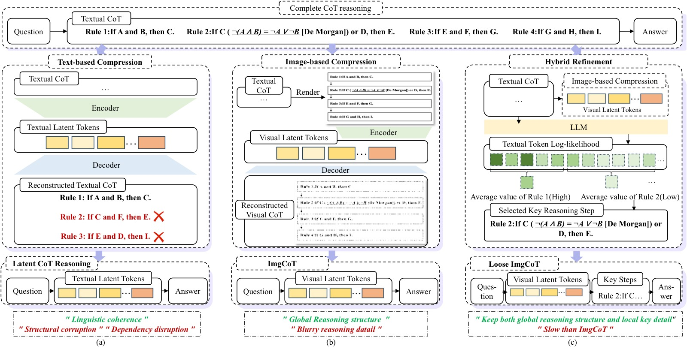
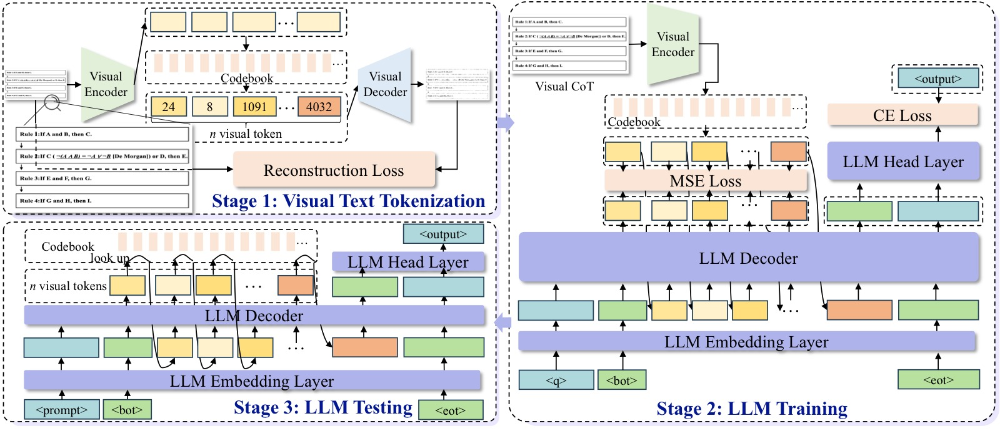
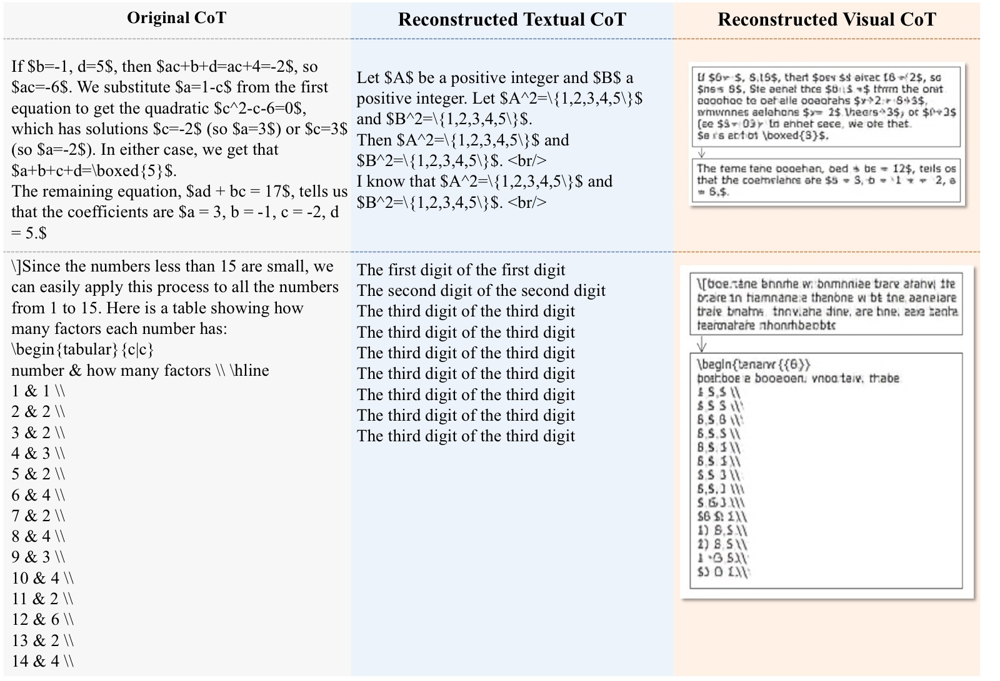
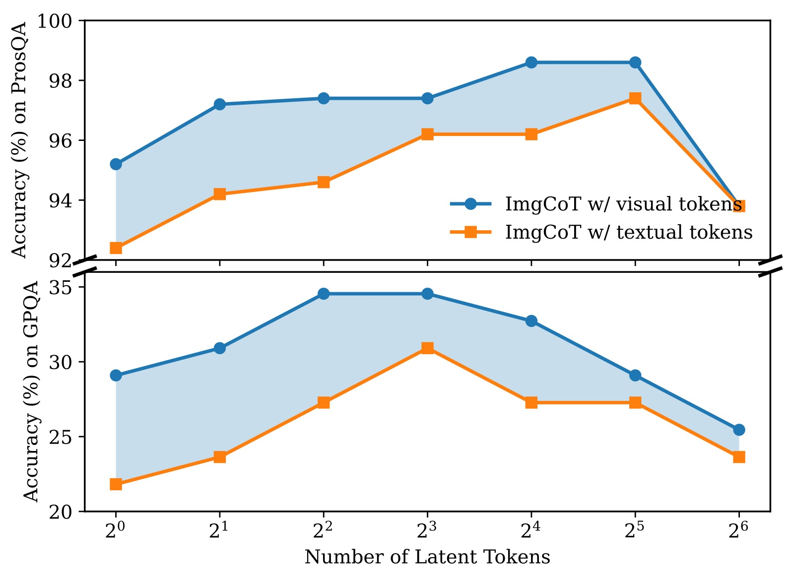
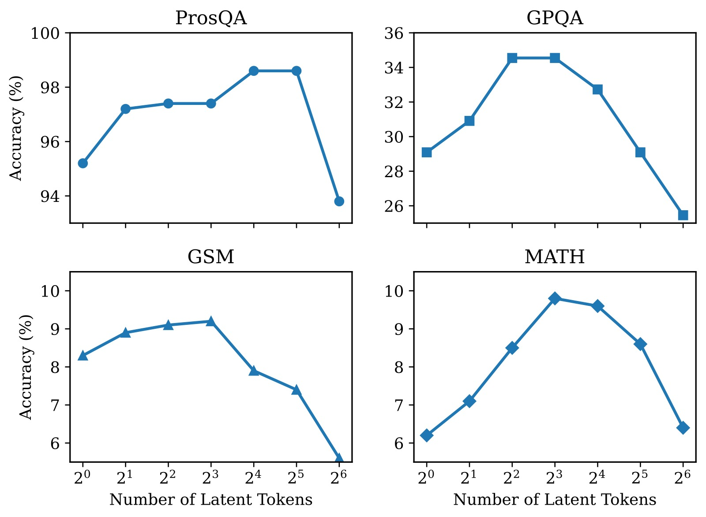
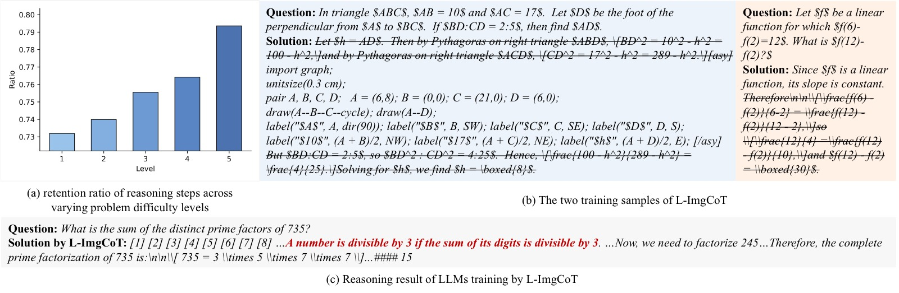

<!-- arxiv: 2601.22730 -->
<!-- venue: ICML 2026 -->
<!-- tags: 语言模型, 链式思考 -->

# ImgCoT: Compressing Long Chain of Thought into Compact Visual Tokens for Efficient Reasoning of Large Language Model

> **论文信息**
> - 作者：Xiaoshu Chen, Sihang Zhou, Ke Liang, Taichun Zhou, Xinwang Liu（国防科技大学）
> - 通讯作者：Xinwang Liu <chenxs@nudt.edu.cn>
> - 发表：ICML 2026
> - arXiv ID：2601.22730
> - 代码：未提供

> 本文基于以下本地材料整理：
>
> - 论文 tex 源码：`arXiv-2601.22730v1/example_paper.tex`
> - 论文图片：`arXiv-2601.22730v1/imgs/motivation.pdf`、`imgs/method.pdf`、`imgs/res_comparison.pdf`、`imgs/trend_n_tokens.pdf`、`imgs/LImgCoT-data.pdf`、`imgs/four_lines_broken_axis.pdf`、`imgs/case_appendix_data_filter.pdf`、`imgs/case_appendix_data_gen.pdf`
> - 本文图片导出目录：`assets/imgcot/`

---

## 一、核心问题

Chain-of-Thought（CoT）推理能显著提升 LLM 的推理能力，但代价是产生大量中间推理文本，造成高昂的推理开销。近期研究提出 **Latent CoT Reasoning**——将长文本 CoT 压缩为少量连续隐式 token，让 LLM 在隐空间而非显式文本上进行推理。

现有方法（如 CoLaR、VQ-VAE 类方法）采用自编码器（Autoencoder）范式：编码器将文本 CoT 压缩为隐式 token，解码器从隐式 token 重建文本 CoT。**重建目标"文本 CoT"引入了一个根本性偏见**：

> **语言归纳偏置（Linguistic Inductive Bias）**：隐式 token 被迫保留表面语言特征（词选择、句法结构、风格变化），而非抽象推理结构。结果：重建的 CoT 语言流畅，但推理结构经常出错（如遗漏步骤、篡改逻辑依赖）。

**本文核心洞察**：有效的隐式推理表征应该关注**推理结构**而非**语言形式**。解决思路：将重建目标从文本 CoT 切换为视觉 CoT，把"语言归纳偏置"转化为"空间归纳偏置"。

---

## 二、核心思路 / 方法

### 2.1 ImgCoT：从文本压缩到图像压缩

核心创新：**将重建目标从"文本 CoT"替换为"视觉 CoT"**——将 CoT 文本渲染成图像，让自编码器重建这些图像。

这一替换改变了压缩过程的归纳偏置：

| 维度 | 文本压缩 | 图像压缩（ImgCoT） |
|------|----------|-------------------|
| 归纳偏置 | 语言归纳偏置 | 空间归纳偏置 |
| 优先保留 | 词选择、句法、风格 | 推理步骤布局、逻辑依赖、结构化层次 |
| 重建结果 | 语言流畅但结构错误 | 结构正确但细节模糊 |

*图 1：三种 latent reasoning 方法的对比与动机说明。整张图分左、中、右三个面板，分别对应 (a) 文本 CoT 压缩、(b) ImgCoT 图像压缩、(c) Loose ImgCoT 混合推理。*

**子图 (a) 文本 CoT 压缩（Textual Latent Reasoning）：**

上排展示原始的文本 CoT——一个逻辑推理问题，包含 4 条逐步推理规则（Rule 1–4），规则之间有明确的逻辑依赖箭头。下排展示从 8 个文本隐式 token 解码重建的 CoT。三个结构性错误直接暴露了语言归纳偏置的核心问题：

- **步骤丢失**：原文 4 条规则被解码为仅 3 条，Rule 4 完全消失。这说明隐式 token 没有保留完整的推理步骤拓扑，而是在压缩时丢弃了部分内容。
- **依赖关系篡改**：Rule 2 和 Rule 3 之间的逻辑依赖方向被错误改写，改变了原始推理流程——加密过程的逻辑被扭曲。
- **表达形式替代语义**：重建的 CoT 语言依然流畅（语法正确、词汇恰当），但内容已偏离原意。隐式 token 学会了"推理应该长什么样"的表象，而非"推理的内在结构"。

这组对比揭示了根本问题：当重建目标是文本时，MSE/CE 损失会驱动隐式 token 优先保留对文本重建有帮助的信息——词汇选择、句式模板——而不是对"推理"本身有帮助的步骤结构和逻辑依赖。隐式空间里的 token 组合"记住了表达方式，但没有学会推理组织"。

**子图 (b) 图像压缩（ImgCoT，本文方法）：**

上排是渲染成图像的 CoT——原始文本被分段、加边框、画箭头标注步骤间依赖关系，形成一张视觉推理图。下排是从 8 个视觉隐式 token 重建的视觉 CoT。关键观察：

- **全局结构完好**：重建图像中四个步骤框完整，箭头方向正确，步骤之间的拓扑结构被准确保留。相比于 (a) 的步骤丢失，视觉隐式 token 成功捕获了推理的全局组织。
- **箭头标注准确**：Rule 1→Rule 2→Rule 4 以及 Rule 1→Rule 3→Rule 4 的依赖关系都保留下来，证明视觉隐式 token 确实在学习"步骤间的空间关系"而非"步骤内的文字形式"。
- **局部细节模糊**：Rule 2 中引用了 De Morgan's Law（逻辑代数中的基本定律，用于简化表达式），这是一个领域特定的精密推理技能。在重建图像中，这类精细的公式变换细节被模糊化——视觉隐式 token 对全局结构的编码能力很强，但对细粒度推理操作的编码能力有限。

这组对比直接支持了论文的核心论点：图像压缩引入了**空间归纳偏置**——模型倾向于利用 token 空间建模步骤布局和逻辑流程，而非记忆词语排列。这对通用知识（LLM 已有较强掌握）影响有限，但对领域特定技能（如逻辑定理、数学公式变换）可能造成精度损失。

**子图 (c) Loose ImgCoT（本文扩展）：**

在视觉隐式 token（绿色方块 $[\cdot]$）基础上，额外保留少量关键的文本推理步骤（红/蓝色文字）。视觉 token 捕获全局结构，文本步骤填补局部细节——"全局靠图像、细节靠文字"的混合推理范式。保留哪些步骤由基于 token log-likelihood 的自动策略决定（见 2.3 节）。

### 2.2 三阶段流程

*图 2：ImgCoT 三阶段训练与推理流程全景图。整张图水平分三段：Stage 1（视觉文本分词）、Stage 2（LLM 训练）、Stage 3（推理）。*

**阶段一（左上）：Visual Text Tokenization**

- 输入是一段文本 CoT（左上方块："Hence, the number 13 in the second table..."），经过渲染引擎转化为视觉文本图像（$512 \times 512$ 分辨率，带步骤边框和逻辑依赖箭头）。
- 视觉编码器（Visual Encoder）将图像压缩为 $n$ 个连续 embedding（图中展示为 $n=4$ 个 latent tokens），每个 token 经过与码本（Codebook，$k=4096$ 个原型向量）的最近邻查找完成离散量化。
- 离散化后的 $\hat{z}_1 \sim \hat{z}_n$ 送入视觉解码器（Visual Decoder）重建图像。重建损失 $\mathcal{L}_{rec} = \|\hat{I} - I\|_2^2$ 驱动编码器学会在有限 token 中保留图像的结构信息。
- **训练完成后，视觉解码器被丢弃**。后续只用编码器 + 码本将 CoT 压缩为离散 token。

**阶段二（中下）：LLM Fine-tuning**

- 训练样本的构造序列（从左到右）：$\langle q \rangle$（问题文本 token）→ `<bot>`（begin of thought，特殊 token）→ $z_1 z_2 ... z_n$（$n$ 个视觉隐式 token → `<eot>`（end of thought）→ $\langle a \rangle$（答案 token）。
- LLM 以自回归方式处理该序列：在隐式 token 段预测下一位置的连续 embedding（MSE 损失），在答案段预测下一个离散 token（CE 损失）。联合损失 $L_{ar}$ 同时优化两部分。
- 核心训练设计：LLM 必须学会从 8 个视觉隐式 token 中"读出"全局推理结构，并据此生成正确答案。因为 $n \ll |\langle c \rangle|$（完整 CoT 通常 100–200+ token），推理开销大幅降低。

**阶段三（右上）：Inference**

- 推理时流程高度精简：输入仅包含问题 token → `<bot>` → LLM 自回归生成隐式 token → `<eot>` → 答案 token。
- **视觉编码器在推理时被完全丢弃**——隐式 token 由 LLM 自身在前向传播中生成，不需要额外编码步骤，不引入任何额外计算开销。
- 图中用虚线箭头连接每个隐式 token 到 LLM backbone，表示 token 是顺序自回归生成的，每个 token 的生成都基于之前所有 token 的上下文。

### 2.3 Loose ImgCoT：补充关键推理细节

视觉隐式 token 有效捕获全局推理结构，但可能模糊**领域特定的精密推理细节**（如数学定理、代码操作）。L-ImgCoT 在视觉隐式 token 基础上，额外保留少量**关键文本推理步骤**。

**关键步骤自动选择策略**：

1. 计算 LLM 在通用预训练语料 $\mathcal{T}$ 上的平均 token 级对数似然 $\gamma$：
   $$conf(t, i) = \log(\text{softmax}(f_\theta(t_{:i}))^{\langle t_i \rangle})$$
   $$\gamma = \sum_{t^j \in \mathcal{T}} \sum_i conf(t^j, i)$$

2. 对 CoT $c$ 中每个推理步骤 $c^i$，若其平均对数似然 **高于** $\gamma$（即 LLM 已有较高置信度），则过滤并用 `...` 替换。
3. 连续过滤步骤合并为单个省略号，避免冗余标记。
4. 过滤后得到精简文本 $\hat{c}$，训练数据变为：$\{\langle q \rangle, \langle bot \rangle, z, \langle eot \rangle, \langle \hat{c} \rangle, \langle a \rangle\}$

> **直觉理解**：$\gamma$ 代表 LLM 对"通用知识"的掌握程度（论文报告不同模型的 $\gamma$ 值：Qwen2.5-0.5B 为 −1.589，Qwen2.5-1.5B 为 −1.356——模型越大、通用知识越强，$\gamma$ 越高）。高于 $\gamma$ 的步骤是 LLM 已掌握的通用技能（如基本算术、简单逻辑连接），可以省略；低于 $\gamma$ 的步骤是 LLM 不确定的领域知识（如特殊定理、代码操作），需要显式保留。

---

## 三、训练目标

| 组件 | 损失函数 | 说明 |
|------|---------|------|
| 视觉编码器 | $\mathcal{L}_{rec} = \|\hat{I} - I\|_2^2$ | 像素级 MSE 重建 |
| LLM（隐式 token 部分） | $\mathcal{L}_{mse}$ | MSE，预测连续隐式 token |
| LLM（文本输出部分） | $\mathcal{L}_{ce}$ | CE，标准 next-token prediction |

LLM 整体损失（ImgCoT）：
$$L_{ar} = \frac{\sum_{i=s_z}^{e_z} \mathcal{L}_{mse}(f_\theta(x_{:i}), x_i) + \sum_{i=s_o}^{e_o}\mathcal{L}_{ce}(f_\theta(x_{:i}), x_i)}{n + |\langle output \rangle|}$$

**关键实现细节**：
- 视觉编码器训练语料：MathPile（大规模数学语料库）
- 文本渲染策略：动态字体调整（默认 9pt，内容溢出则迭代缩小字体直到完整容纳；空白面积 >50% 则放大字体直到利用率≥50%）。$512 \times 512$ 分辨率
- 码本嵌入维度 $d$ 与下游 LLM 隐层大小对齐（0.5B→896，1.5B→1536，3B→3072）
- ≤1B 模型全参数微调，>1B 模型 LoRA（$r=12, \alpha=32$，注入所有注意力层）
- 优化器：AdamW（$\beta_1=0.9, \beta_2=0.95$，初始学习率 $10^{-5}$，cosine with restarts，warm-up 步数 = 总步数 × 15%）
- Batch size = 4（LLM 微调），视觉编码器 batch size = 24
- 训练 epoch：5（GPQA 数据集上 50 epoch，因其规模较小）

---

## 四、实验与结果

### 4.1 实验设置

- **4 个数据集**：
  - MATH：12,500 道竞赛数学题，极具挑战性
  - GSM8K：8,500 道小学数学算术题
  - GPQA-Extended：546 道科学问答（生物/物理/化学），涵盖细分领域
  - ProsQA：17,886 道逻辑推理题
- **3 个 LLM 骨干**：Qwen2.5-0.5B-Instruct、Qwen2.5-1.5B-Instruct、LLama3.2-3B-Instruct
- **5 个基线方法**：Full-CoT（完整文本 CoT 监督微调）、Coconut（COLING'25，课程学习渐进内化）、ICoT（完全隐式推理）、CODI（EMNLP'25，自蒸馏增强）、CoLaR（NeurIPS'25，池化压缩）

### 4.2 主实验结果（RQ1）

> **观察 1**：ImgCoT 仅用 8 个隐式 token，在多数场景下接近甚至超越 Full-CoT。说明正确抽象推理结构的重要性——Full-CoT 逐 token 生成完整推理链的路径，容易因局部微小错误导致最终答案出错。相比之下，ImgCoT 的隐式 token 压缩了"推理的骨架"，LLM 从骨架推导答案时反而更不容易被文本表面的噪音干扰。

> **观察 2**：L-ImgCoT 在几乎所有场景下达到或超越 Full-CoT，同时推理消耗降低约 30%。弥补了 ImgCoT 模糊关键推理细节的缺陷，为推理时延不敏感的场景提供了选择。

逐模型、逐基线分析主表（Table 1）的关键数据：

**Qwen2.5-0.5B-Instruct（最小模型）**：

- Full-CoT 在 MATH 上仅 9.2%，在 GSM8K 上 16.9%。该模型本身推理能力偏弱，逐 token 生成更容易累积错误。
- Coconut / ICoT / CODI / CoLaR 四个现有的 latent 推理方法普遍低于 Full-CoT——在 MATH 上最高仅 3.5%（Coconut），在 GSM8K 上最高仅 5.8%（CoLaR）。说明现有压缩方法在该量级模型上信息损失严重。
- ImgCoT 在 MATH 上达到 9.8%（超过 Full-CoT 的 9.2%），在 ProsQA 上达 97.4%（接近 Full-CoT 的 94.6% 且反超）。8 个视觉 token 传递的推理结构信息，比 150 个逐 token 生成的文本更准确。
- L-ImgCoT 在 MATH 上达 10.1%，GSM8K 上达 17.5%，GPQA 上达 38.1%——全部超过 Full-CoT，且 Token 消耗（102.8 / 64.7 / 89.3）显著低于 Full-CoT（149.4 / 116.3 / 150.2）。

**Qwen2.5-1.5B-Instruct（中等模型）**：

- 模型扩大后，Full-CoT 的基准有所提升（MATH 19.4%，GSM8K 44.1%）。
- ImgCoT 在 MATH 上达 19.5%（与 Full-CoT 持平），GSM8K 上达 38.7%（略低于 Full-CoT 的 44.1%——这是少数 ImgCoT 不如 Full-CoT 的 case，可能是数学推理步骤的精细细节在压缩中丢失所致）。
- L-ImgCoT 全部超过 Full-CoT：MATH 19.9%，GSM8K 45.2%，GPQA 43.6%——且 Token 消耗平均降低约 46%（MATH: 127.4 vs 238.7）。
- CoLaR 作为最强的文本隐式基线，GSM8K 上仅 6.9%，与 ImgCoT 的 38.7% 差距巨大——这直接反映了 pooling 式压缩 vs 图像压缩的信息保留能力差异。

**LLama3.2-3B-Instruct（最大模型）**：

- Full-CoT 基准更高（MATH 23.8%，GSM8K 60.5%，ProsQA 100%）。
- ImgCoT 在 MATH 上达 24.1%（超过 Full-CoT），GSM8K 上达 56.8%（略低于 Full-CoT 的 60.5%）。
- L-ImgCoT 在 MATH (24.3%) 和 GSM8K (61.0%) 上超过 Full-CoT，在 GPQA (45.5%) 上与 Full-CoT 持平——且 Token 消耗（143.8 / 63.2 / 115.7）远低于 Full-CoT（205.9 / 105.6 / 179.3）。

**跨模型的稳定趋势**：

- 三个模型量级上，ImgCoT 在 ProsQA（逻辑推理）上表现最强——0.5B: 97.4%、1.5B: 100%、3B: 100%。逻辑推理天然适合空间归纳偏置，因为逻辑依赖天然是可空间化的有向图结构。
- GPQA（科学常识）上，ICoT 在 0.5B 模型上意外达到 39.6%（超过 ImgCoT 的 34.5%），但随着模型增大 ImgCoT 逐步反超。ICoT 在 0.5B 上的优势可能来自课程学习从文本开始逐步内化，在极小模型上保留了更多常识细节。
- 文本压缩消融（w/ textual tokens）在所有设置下都低于图像压缩（ImgCoT），平均差距约 1–3pp，且差距随 $n$ 减小而扩大（见 RQ2）。

**两项关键消融实验（嵌入主表中）**：

- **Visual vs Textual Latent Tokens**：将重建目标从"视觉 CoT"换回"文本 CoT"（w/ textual tokens），训练框架和 token 数量完全一致。在所有模型 × 数据集组合下，视觉版本一致优于文本版本——这是"空间归纳偏置优于语言归纳偏置"的最直接证据。
- **w/o layout（无箭头标注）**：直接将文本渲染为图像但不标注逻辑依赖箭头。性能略低于有布局的 ImgCoT（例如 0.5B 模型 GPQA 上 32.7% vs 34.5%）。差距虽小但一致存在，说明箭头标注等显式逻辑建模对视觉隐式 token 的信息质量有正向贡献。

### 4.3 空间归纳偏置为何优于语言归纳偏置？（RQ2）

*图 3：原始 CoT 及其从不同隐式表征重建的结果的定性对比。图中分两行，每行展示一个推理 case，每行包含三组对比：Original CoT（原始推理链）、Reconstructed Textual CoT（从文本隐式 token 解码的文本）、Reconstructed Visual CoT（从视觉隐式 token 解码的图像）。*

**第一行 Case（逻辑推理类）**：

- **Original CoT**：一个多步骤推理，包含数学公式和逻辑依赖箭头。步骤之间用有向箭头标注推理方向，每个步骤框内包含数学推导。
- **Reconstructed Textual CoT**：解码出的文本在语言层面流畅可读（如 "In this case, the second step...is need to combine"），但与原始 CoT 的关联度极低——内容已偏离原始推导。这是语言归纳偏置的典型表现：隐式 token 保留了"推理文本应有的语言模式"，但没有保留"这次推理的实际内容"。就好像一个人记住了推理的腔调，但完全忘了具体推理了什么。
- **Reconstructed Visual CoT**：重建图像准确保留了推理步骤的拓扑结构——框的位置、箭头的方向和连接都正确。步骤内部的公式虽然可能模糊，但全局推理骨架完整。这说明视觉隐式 token 优先编码的是"步骤之间的空间关系"，而不是"步骤内的文字细节"。

**第二行 Case（表格推理类）**：

- **Original CoT**：涉及表格操作的推理（"second table, we can find..."），第二步骤框内包含完整的表格结构（多行多列数据）。
- **Reconstructed Textual CoT**：文本重建完全忽略了表格的二维结构，用线性文字粗糙地描述了表格内容，丢失了表格推理中最关键的"行列对应关系"。
- **Reconstructed Visual CoT**：重建图像忠实地还原了表格的行列结构——行数对齐、列宽比例得以保留。表格的二维空间布局本身就是推理结构的一部分。视觉隐式 token 天然适合编码这种空间化的信息组织形式，而文本 token 只能将其扁平化为线性序列。

**核心结论**：两组 case 从不同角度展示了两种归纳偏置的本质差异。文本压缩的记忆对象是"语言形式"——它学会生成一个看起来像推理的文本，但不保证其内容与原文一致。图像压缩的记忆对象是"空间布局"——它学会重建推理步骤在空间中的组织方式，这种组织方式天然地与推理逻辑绑定（框的位置 = 步骤顺序，箭头 = 逻辑依赖，表格 = 数据关系）。因此，图像压缩更偏向"理解推理"，文本压缩更偏向"模仿推理"。

#### 定量对比

*图 4：隐式 token 数量 $n$ 从 2 增至 64 时，视觉压缩（蓝线）与文本压缩（橙线）在各基准集上的性能变化趋势（Qwen2.5-0.5B-Instruct）。四个子图分别对应 MATH、GSM8K、GPQA、ProsQA。横轴为隐式 token 数 $n$（对数刻度），纵轴为准确率 Acc。*

这张图是论文最关键的定量证据。通过改变 $n$，论文制造了一个"信息瓶颈"——$n$ 越少，隐式 token 中能保留的信息越有限，两种压缩策略必须竞争性地决定"什么信息最值得保留"。曲线之间的差距直接反映了不同归纳偏置优先保留的信息对推理的有用程度。

**子图 (a) MATH（竞赛数学）：**

- 在 $n=2$ 时，视觉压缩约 7.5%、文本压缩约 5.5%，差距约 2pp。
- 随着 $n$ 增加到 8，视觉压缩爬升至约 9.8%，文本压缩爬升至约 9.0%，差距扩大到约 0.8pp。
- 在 $n=32 \to 64$ 区间，两条曲线均出现下降——过大 $n$ 导致组合空间急剧膨胀，模型在固定数据量下欠拟合（参见附录 sec:a3 分析）。

**子图 (b) GSM8K（小学数学）：**

- $n=2$ 时差距最大：视觉约 7.5%、文本约 4.5%，差距 3pp。说明在极度压缩的情况下，文本压缩几乎无法保留任何有用的推理信息，而视觉压缩仍能传递基本的推理步骤结构。
- $n=8$ 时视觉达峰值约 9.2%，文本约 8.3%。GSM8K 的推理相对简单（基本算术），两种方法的绝对差距较小但视觉版本始终领先。

**子图 (c) GPQA（科学常识）：**

- 整体趋势类似，但 $n=2$ 时差距更显著：视觉约 28%、文本约 22%，差距 6pp。科学常识推理中，结构化的知识组织方式（概念间的关系、推理的层次性）比语言表达更重要——这正是视觉压缩的优势领域。
- $n=8$ 时视觉达约 34.5%，超过 Full-CoT 的 34.5%。

**子图 (d) ProsQA（逻辑推理）：**

- $n=2$ 时差距最大：视觉约 90%、文本约 72%，差距约 18pp。这是四个数据集中差距最大的场景——逻辑推理的本质就是步骤间的依赖结构，因此"保留了结构就是保留了推理"。文本压缩在极度压缩下几乎崩溃，而视觉压缩仍保持较高水平。
- 视觉压缩在 $n=4$ 时已达约 96%，几乎饱和。逻辑推理的空间结构信息可以被极少量视觉 token 高效编码。

**跨数据集的关键规律**：

1. $n$ 越小，视觉 vs 文本的差距越大——在信息极度受限时，两种归纳偏置被迫做出不同取舍，视觉方案选择保留的结构信息对推理的边际价值始终高于文本方案保留的语言信息。
2. 差距大小与推理的结构化程度正相关——ProsQA（最强结构化）> GPQA > MATH > GSM8K（最弱结构化）。这完美支持了论文的核心论点。
3. $n$ 过大时性能反而下降（$n \ge 32$ 区间尤其明显）——论文将其归因于组合空间爆炸 + 固定数据量下的欠拟合。这是 ImgCoT 当前的一个工程局限性。

*图 5（附录补充）：当隐式 token 数 $n$ 从 2 逐步增大到 64 时，Qwen2.5-0.5B-Instruct 的推理性能变化趋势（融合四份基准集的平均趋势）。横轴为隐式 token 数 $n$（对数刻度），纵轴为准确率 Acc。可见在 $n=8$ 附近达到峰值，$n\ge 32$ 后性能出现明显下降——这与组合空间随 $n$ 指数级增长而训练数据固定所导致的欠拟合现象一致。论文在推理更大 $n$ 的模型时发现其 latent token 的输出经常出现乱码，进一步支持了欠拟合假设。*

### 4.4 空间归纳偏置的泛化性优势（RQ3）

论文认为推理结构（抽象逻辑模式）比任务特定的词汇表达更具**跨任务通用性**。语言表达随数据集而变化（不同的数据集有不同的措辞习惯、公式写法），但推理的底层逻辑模式是共通的。

**实验设计**：在 MetaMathQA（MATH+GSM 增强数据集，约 395K 样本）上训练 VQ-VAE 和 LLM，在**领域外**基准集上测试泛化性能（Qwen2.5-0.5B-Instruct）。

| 方法 | GSM（域内） | Gaokao（域外） | SVAMP（域外） | SingleEq（域外） | MultiArith（域外） |
|------|-----------|-------------|-------------|----------------|-----------------|
| ImgCoT（视觉压缩） | 11.4 | 3.1 | 9.6 | 12.0 | 5.8 |
| w/o visual tokens（文本压缩） | 10.0 | 1.8 | 5.6 | 8.4 | 4.2 |
| **视觉提升（ImgCoT−文本）** | **+1.4** | **+1.3** | **+4.0** | **+3.6** | **+1.6** |

**关键解读**：

- **域内（GSM）差距最小（1.4pp）**：MetaMathQA 包含 GSM 数据增强版，文本压缩可以通过记忆训练集的语言模式获得不错的域内表现。
- **域外差距大幅扩大**：SVAMP 上差距 4.0pp、SingleEq 上差距 3.6pp——文本压缩学到的"表达习惯"无法迁移到新数据集的不同措辞方式。视觉压缩学到的"推理结构"（如方程提取→变换→求解的步骤骨架）可以跨数据集复用。
- Gaokao-Math-2023（中国高考数学，中文命题）上差距 1.3pp——中文 vs 英文的语言差异对文本压缩的影响可能更显著，视觉压缩由于不关注语言形式而跨语言泛化更好。

这组实验是推理结构"跨任务通用性"的直接证明，也是空间归纳偏置相对于语言归纳偏置的一个重要优势：不仅压缩质量更好，泛化能力也更强。

### 4.5 L-ImgCoT 的精细推理保留能力（RQ4）

*图 6：L-ImgCoT 关键推理步骤保留策略的有效性验证。图分为三个主要部分：(a) 数据构建案例展示（训练时）、(b) 模型推理行为展示（推理时）、(c) MATH 难度级别维度的保留比例统计。*

**子图 (a) 训练数据构建（Training Samples）：**

展示了两个训练样本中，哪些推理步骤被保留（保留原文）、哪些被过滤（删除线标记）。

- **Blue Case：代码绘图技能**——被保留的步骤（红色/蓝色文字）涉及调用 Python 代码绘图（如 `matplotlib`），这是通用 LLM 不擅长的领域特定技能。LLM 对这种代码操作的 log-likelihood 低（不确定性高），因此被保留。被过滤的步骤（删除线）是"首先我们需要读取数据"、"然后我们设置图表标题"等通用叙述，LLM 已经高度熟悉。
- **Yellow Case：数学理论应用**——被保留的步骤涉及"L'Hospital's rule"（洛必达法则）、积分变换等高等数学技巧。被过滤的是"代入 x=0"、"化简表达式"等基本代数步骤。
- 关键信息：过滤策略不是随机丢弃——它精确地保留了 LLM 需要学习的"新技能"，丢弃了 LLM 已经具备的"基础能力"。$\gamma$ 阈值在这里起到了"知识过滤器"的作用。

**子图 (b) LLM 推理行为（Model Generation After L-ImgCoT Training）：**

展示了经过 L-ImgCoT 训练后，LLM 在推理时的实际输出行为。$[\cdot]$ 方块代表视觉隐式 token，后续文本是 LLM 自发决定显式输出的推理步骤。

- 模型学会了"选择性输出"：不是把所有推理步骤都写出，而是在隐空间"想"了全局结构后，只输出最关键的部分。例如图中红色文字标注的推理步骤——这些是模型判断为"需要显式确认"的关键推导。
- 模型输出的文本步骤量显著少于 Full-CoT——这直接体现在主表 token 消耗数据中（L-ImgCoT 比 Full-CoT 少约 30%）。

**子图 (c) MATH 难度级别维度的保留比例：**

按 MATH 数据集的 5 个难度级别（Level 1–5）统计推理步骤的被保留比例。横轴是难度等级，纵轴是保留比例。

- **单调递增趋势**：Level 1 保留比例最低（约 10–15%），Level 5 保留比例最高（约 30–35%）。越难的问题，需要的领域特定推理技能越多，模型的"已知范围"（高于 $\gamma$ 的部分）越少，自然保留更多步骤。
- 这个趋势验证了过滤策略的**合理性**：如果保留比例与难度无关（如均匀保留），说明策略是盲目的。单调递增的趋势说明 $\gamma$ 确实捕捉到了"模型的不确定性"，而难度高的题目确实有更多"模型不擅长的内容"。

#### 视觉隐式 Token 的必要性（消融实验）

| 方法 | MATH | GSM8K | GPQA | ProsQA |
|------|------|-------|------|--------|
| L-ImgCoT w/o visual tokens | 9.1 | 15.8 | 29.1 | 94.2 |
| L-ImgCoT w/ visual tokens | **10.1** | **17.5** | **38.1** | **98.6** |

去除视觉隐式 token 后性能显著下降。最值得关注的是：
- **GPQA 上差距最大（9pp 下降）**：科学常识推理中，全局推理结构（概念间关系、推理层次）对正确回答至关重要。没有视觉隐式 token 提供的全局蓝图，仅靠少量关键步骤碎片无法还原推理全貌。
- **ProsQA 上差距最小（4.4pp 下降）**：逻辑推理中，关键步骤自身已经包含足够的逻辑信息，全局结构的边际作用相对较小。
- 类比人类思维：先在脑海中画一个"推理地图"（视觉隐式 token），然后只需要在地图上标注几个关键点（保留的文本步骤）就能走通全路径。如果没有地图，每个步骤都是孤立的，容易走偏。

---

## 五、关键洞察与技术亮点

1. **归纳偏置切换**：从语言归纳偏置→空间归纳偏置是本文的**元创新**。重新定义了"有效的 CoT 压缩应该保留什么"这一根本问题——不是保留尽可能多的信息，而是保留对推理最有用的那类信息。

2. **视觉 CoT 作为重建目标**：将 CoT 文本渲染为图像并重建，是最直接迫使模型关注空间结构而非语言形式的手段。这比在文本空间加正则项、改损失函数等间接方法更本质。

3. **1D Tokenization 的选择**：采用 TiTok 而非传统 2D VQ-VAE 的关键原因是 1D token 全局感受野——每个 token 都可以捕获整张图像的布局信息，而非只能看到一块局部 patch。这天然适合保留推理步骤的整体拓扑，而非局部纹理/字体细节。

4. **Loose 推理范式**：通过 token 对数似然自动识别 LLM 不确定的步骤，实现了"全局隐式推理+局部显式推理"的混合范式。$\gamma$ 阈值利用 LLM 自身的知识边界作为过滤器——这是一个优雅的零额外成本机制。

5. **推理效率-精度灵活权衡**：ImgCoT 仅 8 token → 极致效率（适合对时延敏感的场景）；L-ImgCoT 约 100+ token → 极致精度（适合对准确率要求高的场景）。两者共享同一套视觉编码器，切换成本近乎为零。

6. **泛化性作为空间归纳偏置的核心优势**：RQ3 的实验设计（域内训练 → 域外测试）直接证明：视觉隐式 token 学到的推理结构可以跨数据集、跨语言迁移，而文本隐式 token 学到的语言模式高度数据集绑定。

---

## 六、局限性

1. **隐式 Token 数量的非单调性问题**：随着 $n$ 从 8 增大到 64，性能先升后降——论文归因于组合空间快速增长 + 固定数据量下的欠拟合。当 $n$ 很大时 LLM 甚至产生乱码输出。这限制了 ImgCoT 在需要更多推理信息的场景下的扩展性。增大训练数据量是否能缓解欠拟合，论文留给了未来工作。

2. **渲染策略依赖**：渲染质量（箭头标注方式、字体大小、边框样式）直接影响视觉 CoT 的信息密度。论文采用的动态字体策略和 Glyph 渲染引擎是一个合理起点，但未系统研究不同渲染策略（如颜色编码不同推理类型、缩进表示层级结构）的影响。

3. **领域技能过滤阈值 $\gamma$ 的敏感性**：$\gamma$ 的计算依赖通用预训练语料的选择和 LLM 的预训练程度。不同领域可能需要不同的 $\gamma$ 值，而论文对所有数据集使用了全局统一阈值。任务自适应的 $\gamma$ 可能是后续改进方向。

4. **仅覆盖三类推理场景**：实验限于数学/常识/逻辑推理，未验证在代码生成（涉及更复杂的语法结构）、多步规划（涉及动作-状态交替）、多模态推理（涉及视觉输入）等场景的效果。

5. **无开源代码**：论文未提供代码仓库。渲染引擎配置、VQ-VAE 训练细节、LLM 微调超参虽然部分有文字描述，但无法精确复现。

6. **渲染为多张图像的处理机制未充分验证**：论文提到当 CoT 过长、字体最小化后仍无法在单张 $512 \times 512$ 图像内容纳时，可将剩余内容渲染到额外图像，但承认当前数据集未触发此情况，因此该机制的推理行为未经实验验证。

---

## 七、关键概念速查

| 概念 | 解释 |
|------|------|
| **Latent CoT Reasoning** | 将文本推理链压缩为隐式 token，LLM 在隐空间上推理而非逐 token 生成文本 |
| **Linguistic Inductive Bias** | 文本压缩中，隐式 token 倾向于保留词选择、句法、风格等语言形式特征 |
| **Spatial Inductive Bias** | 图像压缩中，隐式 token 倾向于保留推理步骤的布局、依赖关系、层次结构 |
| **Visual CoT** | 将 CoT 文本渲染为图像，用边框标注步骤、箭头标注逻辑依赖 |
| **TiTok** | 1D 图像分词模型，每个 token 捕获全局空间信息，支持更高压缩比 |
| **VQ-VAE** | 向量量化变分自编码器，通过码本将连续 embedding 离散化为可学习原型 token |
| **L-ImgCoT** | 视觉隐式 token + 少量关键文本步骤的混合推理，弥补细节模糊 |
| **$\gamma$** | LLM 在通用预训练语料上的平均 log-likelihood，作为判断推理步骤"重要性"的阈值 |
