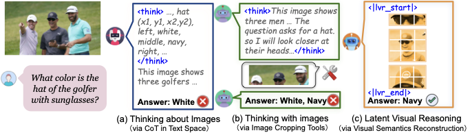
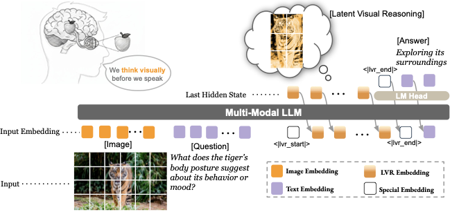

<!-- arxiv: 2509.24251 -->
<!-- venue: ICLR 2026 -->
<!-- tags: 视觉推理, 强化学习, 表征学习 -->

# LVR (Latent Visual Reasoning) — 阅读笔记

> **论文信息**
> - 论文：Latent Visual Reasoning
> - 主页：[vincentleebang.github.io/lvr-project-page](https://vincentleebang.github.io/lvr-project-page/)
> - 代码：[github.com/VincentLeebang/lvr](https://github.com/VincentLeebang/lvr)
> - 模型：[huggingface.co/vincentleebang/LVR-7B](https://huggingface.co/vincentleebang/LVR-7B)
> - arXiv ID：2509.24251v2

> 本文基于以下本地材料整理：
>
> - 论文 TeX 源码：`arXiv-2509.24251v2/`
> - 论文图片：`arXiv-2509.24251v2/figures/*.pdf`
> - 官方代码仓库：`lvr/`
> - 本文图片导出目录：`assets/lvr/`

---

## 1. 一句话讲清楚

LVR 的核心想法是：MLLM 在回答视觉问题前，先在 visual embedding 空间里"想一想"——用 LLM 的 hidden state 重建图像中与问题相关的 ROI 视觉语义；然后用 SFT + GRPO 两阶段训练让模型学会"怎么想"和"怎么答"。

这篇论文的核心不是又做了一个更大的 MLLM，而是提出了一个**全新的多模态推理范式**：让 LLM 在视觉和文本共享的语义空间中直接推理，打破"推理只能在文本空间进行"的固有假设。

```text
以前：image → LLM → text tokens → think about image → answer
      image → LLM → call tools → edit image → re-encode → answer
现在：image → LLM → latent visual reasoning (hidden states) → answer
关键：视觉推理直接在 embedding 空间完成，不经过文本中转，也不依赖外部工具
```

## 2. 论文要解决什么问题

### 2.1 现有多模态推理的两个瓶颈

当前 MLLM 的推理范式分两种，但都面临根本约束：

**范式一：Think about Images（在文本空间推理）**

```text
image + question → LLM → text CoT tokens → ... → answer
```

代表方法：LLaVA-CoT、Vision-R1、PAPO。模型在文字空间做 CoT 分解，生成额外的文本 token 辅助理解图像。

**问题**：(1) 文本空间是视觉信息的间接、低效表示——模型被迫把"看到什么"翻译成"文字描述"，再基于描述推理；(2) 过多文本 token 会主导上下文窗口，产生 **cross-modal interference**——文本信号盖过视觉信号。实验中 PAPO 和 Vision-R1 在 V\* 基准上反而比基座模型更差（PAPO: 78.5 → 36.1），就是个直接证据。

**范式二：Think with Images（调用外部工具操作图像）**

```text
image + question → LLM → tool call (crop/zoom/OCR) → re-encode → ... → answer
```

代表方法：PixelReasoner、Argus-X3、ViperGPT。模型在推理中调用外部工具编辑图像，将增强后的视觉 token 重新注入。

**问题**：(1) 受限于预定义工具的 API 能力——工具集固定，难以扩展；(2) 许多基本视觉操作（如缩放、裁剪 ROI）本可由 MLLM 自身的视觉编码器完成，不需要绕道工具调用；(3) 工具输出的图像被重新编码后会丢失原始信息。

### 2.2 核心洞察

论文提出了一个简洁而深刻的问题：

> *如果视觉 token 和文本 token 已经嵌入在 MLLM 的同一个共享语义空间中，为什么不同时在这个空间中对两者进行推理？*

灵感来自 NLP 中的 **COCONUT**（Continuous Thought）——它发现 LLM 可以通过传递 last hidden state 而非离散 token 来表达更高效的推理过程。LVR 把这个思想从纯文本扩展到**文本+视觉联合推理**：让 hidden state 直接逼近问题相关的视觉语义（ROI 的 visual embeddings），而不是把视觉信息转成文本再思考。



*图 1：论文 teaser，一张图概括三种多模态推理范式。*

- **(a) Think about Images**：图像编码后，LLM 完全在文本空间进行 CoT 推理（"I see a clock... the time is...")。视觉信息在整个推理链中只作为静态条件输入一次，后续推理步骤不直接触及视觉 token。问题：文本描述是视觉的有损压缩，精细的视觉细节（钟表指针角度、物体纹理、空间位置关系）在转成文字时已经丢失。
- **(b) Think with Images**：LLM 在推理过程中调用外部工具裁剪图像 ROI 并重新编码。相比 (a)，增强的视觉信息被注入推理过程。但问题在于：工具集是封闭的（只能 crop/zoom/OCR），且新注入的视觉 token 需要在统一框架中与文本 token 对齐，这会受训练数据偏差影响——模型可能学会了"忽视"重新注入的子图像。
- **(c) LVR（本论文）**：不转成文字、不调用工具——LLM 进入 latent reasoning 模式，用 hidden state 直接向 ROI 的 visual embedding 空间逼近（绿色→灰色 token 的过程）。视觉推理和文本生成在同一个自动回归过程中交替进行，共享同一套 attention 机制和 KV cache。关键区别：LVR 重建的是**视觉语义**（semantic-level ROI representation），而不是像素级图像。

### 2.3 问题定义

| 维度 | Think about Images | Think with Images | LVR |
|------|-------------------|-------------------|-----|
| 推理空间 | 纯文本 token | 文本 + 外部工具编辑的图像 | visual embedding + 文本 token 联合 |
| 视觉信号 | 静态，仅在开始时注入 | 动态，但依赖工具 API | 动态，模型自生成 |
| 信息损失 | 大（视觉→文本） | 中（重编码损失） | 小（在 embedding 空间操作） |
| 工具依赖 | 无 | 强 | 无 |
| 可扩展性 | 好（但效果差） | 差 | 好 |

## 3. 方法总览

LVR 把一次视觉问答拆成三段：

```text
image + question
  → text tokens (understanding)
  → <|lvr_start|>
  → latent visual reasoning (hidden state 自循环，逼近 ROI embedding)
  → <|lvr_end|>
  → answer (text tokens)
```

直观解释：

- `<|lvr_start|>`：表示"我需要先看清楚图中的关键区域再回答"。
- `latent visual reasoning`：LLM 进入特殊模式——每一步不预测离散 token，而是将 last hidden state 直接作为下一位置的 input embedding 传递。这些 hidden state 在 SFT 阶段被训练来逼近 ROI 视觉 token 的 ground-truth。相当于模型在心里"复现"关键视觉信息。
- `<|lvr_end|>`：表示"我看清楚了，可以开始回答了"。
- `answer`：基于增强后的上下文（包含 LVR 产生的视觉语义）进行标准文本生成。



*图 2：LVR 训练和推理流程全景图。该图包含三个主要部分：顶部是标准 MLLM 架构概览（Vision Encoder → Projector → LLM），展示了 visual tokens 和 text tokens 在共享语义空间中的嵌入方式。左侧中部是 SFT 阶段流程：bbox 标注位置对应的 visual tokens 被提取并注入到 `<|lvr_start|>` 与 `<|lvr_end|>` 之间的 `<|lvr|>` 占位位置（图中绿色表示 ground-truth visual embedding），LLM 的 last hidden state 通过 MSE loss 逼近这些 embedding。右侧中部是 RL 阶段（GRPO_latent）流程：模型 rollout 输出后，计算 format reward（检查是否含有 `<|lvr_start|>` 和 `<|lvr_end|>`）和 accuracy reward（答案是否正确），在 policy gradient 计算时通过 teacher-forcing forward pass 回放 rollout 时记录的 LVR hidden states 来计算 importance ratio。底部是三种推理解码策略：(1) Fixed Token——设定固定步数预算（图中标注为 4/8/16 steps），耗尽即退出；(2) Latent End Token——训练可学习向量，当 hidden state 与该向量的距离小于阈值时退出；(3) Mode Switching Loss——BCE loss 监督 LM Head 在正确时机预测 `<|lvr_end|>`。最终箭头汇聚到 "Answer" 输出。*

**左栏 — SFT 训练（Teacher Forcing）：**

- 输入：图像 + 问题 + ROI 边界框标注 + 答案。使用 **Visual COT** 数据集（438K QA 对，每对都有问题相关 ROI 的 bbox 标注）。
- 序列构造：`[Image Tokens] [Question] <|lvr_start|> <|lvr|> <|lvr|> ... <|lvr_end|> [Answer]`。`<|lvr|>` 位置上预先插入 ROI 的 ground-truth visual embedding（通过 bbox 从原始 image tokens 中按索引提取，O(1) 时间）。
- 联合损失：
  - **LVR Loss (MSE)**：`<|lvr_start|>` 位置的 LLM last hidden state → 逼近对应 `<|lvr|>` 位置的 ground-truth visual embedding。公式：$\mathcal{L}_{\text{LVR}} = \frac{1}{T_v} \sum_{t=1}^{T_v} \| \mathbf{h}_t - \mathbf{v}_t \|_2^2$
  - **NTP Loss (CE)**：答案部分的 standard next-token prediction。
  - 总损失：$\mathcal{L} = \mathcal{L}_{\text{NTP}} + \lambda_{\text{LVR}} \cdot \mathcal{L}_{\text{LVR}}$
- 此阶段仅训练 LLM 参数（冻结视觉编码器和 projector），让 LLM 学会在 hidden state 空间中表示视觉语义。
- LVR 输出的 hidden state 序列 `<H1, H2, H3, ...>` 作为后续答案生成的增强上下文——它们为文本生成提供了额外的视觉先验。

**右栏 — RL 训练（GRPO_latent）：**

- 使用 ViRL 数据集。SFT 后的模型加载 checkpoint，进入 GRPO 在线训练。
- 关键挑战：标准 GRPO 的 policy gradient loss $\min(r_t(\theta) \hat{A}_t, \text{clip}(r_t(\theta), 1-\varepsilon, 1+\varepsilon) \hat{A}_t)$ 定义在 token log-probability ratio $r_t(\theta) = \frac{\pi_\theta(y_t|...)}{\pi_{\theta_{\text{old}}}(y_t|...)}$ 上，但 LVR 过程不产生离散 token — 没有 log-prob 可算。
- **GRPO_latent 的核心 trick**：Rollout 时记录 LVR 阶段的 hidden states $\widetilde{h}^{\text{latent}}$；计算 importance ratio 时，做一次 teacher-forcing forward pass，把这些 hidden states 直接 patch 回 LVR 位置，使得模型在**完全相同的 LVR 上下文**下预测文本 token：

$$r_{i,t}(\theta) = \frac{\pi_{\theta}(y_{i,t} \mid q, I, \widetilde{h}^{\text{latent}}_{i}, y_{i,<t})}{\pi_{\theta_{\text{old}}}(y_{i,t} \mid q, I, \widetilde{h}^{\text{latent}}_{i}, y_{i,<t})}$$

- 奖励设计：
  - **格式奖励**（format reward）：输出是否同时包含 `<|lvr_start|>` 和 `<|lvr_end|>`（鼓励模型用 LVR）。
  - **准确性奖励**（accuracy reward）：答案是否正确（间接监督 LVR 的推理质量）。
- 和 SFT 的关键区别：RL 不约束 LVR 中间输出——不指定 ROI、不指定长度、不要求逼近特定 embedding。环境奖励"间接"告诉模型 LVR 做得好不好。这等价于让 LVR 过程"自我进化"。

**底部 — 三种推理解码策略：**

- **Fixed Token**（论文默认）：设定固定步数预算（4/8/16），用完即退出。好处是推理时完全确定，不需要额外判断逻辑。
- **Latent End Token**：训练一个可学习的 end vector，LVR hidden state 与它的距离小于阈值时退出。但实验发现严重不稳定。
- **Mode Switching Loss**：BCE loss 监督 LM Head 在正确时机预测 `<|lvr_end|>`。但 LVR 步数坍缩到 0。

| 模块 | 做什么 |
|------|--------|
| SFT (Visual COT) | 用 ROI bbox 数据让 LLM 学会在 hidden state 空间中重建视觉语义 |
| GRPO_latent (ViRL) | 用环境奖励让 LVR 过程自我进化，不约束中间输出 |
| Fixed Token Decoding | 推理时设定固定 LVR 步数，稳定可控 |

## 4. 模型与训练细节

### 4.1 基础架构

基于 **Qwen2.5-VL 3B / 7B**。视觉编码器最大分辨率 5120×28×28 pixels，最小 128×28×28。**冻结**视觉编码器和 multimodal projector，**仅训练 LLM 参数**。这样的设计选择是有意为之：论文的假说是"最优的模态投影可以在不调 projector 的情况下学到"，关键在 LLM 内部学会 visual reasoning，而非依赖 projector 的对齐。

### 4.2 特殊 Token 体系

```
<|lvr_start|>       → 触发 LVR 模式，LLM 从此位置开始传 hidden state
<|lvr|>             → 训练时的占位 token，实际 embedding 被替换为 ground-truth visual embedding
<|lvr_end|>         → 退出 LVR 模式，恢复文本生成
<|lvr_latent_end|>  → 可学习向量，用于 Latent End Token 策略（消融用，非主线）
```

### 4.3 训练数据与资源

| 阶段 | 模型 | 数据 | 关键参数 | 硬件 | 训练时间 |
|------|------|------|---------|------|---------|
| SFT | 3B + 7B | Visual COT (438K QA，均含 ROI bbox) | lr=1e-5, 2500 steps, λ_LVR (MSE), 数据打包 batch≈3.2/device | 4×AMD MI250 | ~40h (7B) |
| RL | 仅 3B | ViRL (视觉推理 QA，不含 bbox) | lr=1e-5, τ=0.9, β=0.04, 8 rollouts/input, ~1500 steps | 4×AMD MI250 | ~20h |

注：RL 阶段未扩展到 7B 是因为计算资源限制（论文明确指出），而非方法本身不支持。从 3B 的 RL 收益推断，7B + RL 应能取得更强结果。

### 4.4 前向传播的 Monkey Patch

LVR 通过在 Qwen2.5-VL 标准 forward 函数上 monkey patch 实现，核心逻辑（代码来自 `monkey_patch_forward_lvr.py`）：

```python
# 推理时的关键：上一位置的 last hidden state → 当前位置的 input embedding
if lvr_mode_switch:
    inputs_embeds[lvr_mode_switch, -1, :] = last_position_hidden_state[lvr_mode_switch]

# 训练时的关键：LVR token 位置插入 ground-truth visual embedding
if lvr_tokens is not None:
    # lvr_tokens 是 ROI 内 visual tokens 的全局索引列表
    selected_lvr_embeds = image_embeds[global_lvr_token_indices]  # [L_total, H]
    inputs_embeds[batch_indices, seq_positions] = selected_lvr_embeds
```

训练和推理的区别仅在于 `lvr_mode_switch` vs `lvr_tokens` 哪个被传入。

### 4.5 数据打包

LVR 的一个实现细节：由于不同图像的 visual token 数量差异很大（分辨率 × 内容复杂度），加上不同 ROI 的 token 数量也不同，batch 内长度极度不平衡。论文使用 InternVL 的自适应多模态数据打包策略——多个短实例拼成一个长序列，长实例单独处理。平均有效 batch size ~3.2 per device。不打包的话 GPU 利用率会很低（大量 padding）。

## 5. 解码策略分析

LVR 在推理时面临一个关键挑战：**如何判断 LVR 已经"想够了"**？

这个问题本质上是在连续 hidden state 空间中定义"停止条件"。论文探索了三种方案：

### 5.1 Fixed Token（论文采用）

设定固定步数 `k`（4/8/16），LLM 在 `<|lvr_start|>` 后强制运行 `k` 步 hidden-state 自循环，然后自动退出。

**为什么有效**：虽然看起来是"粗暴"方案，但实验表明只要步数 ≥ 4，性能就显著优于不推理的基线。8 步通常在大多数 benchmark 上达到最优。固定步数让训练和推理完全一致（SFT 阶段也是固定步数的 teacher forcing），不存在 train-test mismatch。

**为什么不是最优**：理论上简单问题可能只需要 1-2 步，复杂问题可能需要 16+ 步。固定步数意味着简单问题浪费计算、复杂问题可能不够用。

### 5.2 Latent End Token（失败）

训练一个可学习的 `lvr_latent_end` 向量。在 LVR 模式下，每一步计算 hidden state 与这个向量的距离（MSE / L1 / cosine），距离小于阈值就退出。

**失败原因**（论文的人类评估）：无论用哪种距离度量、哪种阈值，模型要么不退出（一直跑到 max length），要么提前退出（推理还没完成就终止）。根本原因是在 7B 模型的 3584 维 continuous hidden state 空间中，定义一个稳定、可泛化的"边界"极其困难——训练数据中的距离分布无法覆盖测试时的多样性。

### 5.3 Mode Switching Loss（完全失败）

在 SFT 阶段给 LM Head 添加 BCE loss：对 LVR 序列中最后一个 `<|lvr|>` token，监督 LM Head 在该位置输出高 `<|lvr_end|>` 概率；对其他 `<|lvr|>` token，监督低概率。推理时当 LM Head 预测 `<|lvr_end|>` 时退出。

**失败原因**：这种监督信号只在 SFT 数据中有明确的"最后一步"概念时才能工作。但在实际情况中，LM Head 在 LVR 模式下收到的 hidden state（而非正常 token embedding）与其训练分布不匹配，导致 `<|lvr_end|>` 的概率一直是噪声——模型 LVR 步数完全坍缩到 0。

### 5.4 小结

| 策略 | 原理 | 效果 | 核心问题 |
|------|------|------|---------|
| Fixed Token | 固定步数 k，用完退出 | **最优**（k=8 在多数 benchmark 表现最好） | 无法自适应 |
| Latent End Token | hidden state 与 learnable vector 距离 < 阈值退出 | 严重不稳定（V\*: 81.7→39.8） | continuous 空间无可靠边界 |
| Mode Switching Loss | BCE 监督 LM Head 预测 `<\|lvr_end\|>` 时机 | 完全失败（步数→0） | train-test 分布不匹配 |

论文最终选择 Fixed Token 作为默认策略。这是一个务实的折中——在可变长度推理的稳定性问题解决之前，固定步数至少提供了可靠、可复现的 strong baseline。

## 6. 实验结果深度解读

### 6.1 主要结果（7B 模型）

```
Benchmark 说明：
- V*：综合视觉细节理解（含两个子集）
- V*_DA (Detail Attribute)：细粒度视觉细节搜索
- V*_RP (Relative Position)：相对空间关系推理
- MMVP：通过微调图像细节扰动来测试感知鲁棒性
- Counting：场景中特定物体计数
- IQ-Test：几何/图形推理
- JigSaw：从碎片重建图像
- Relative Reflectance：像素级反射率比较（需多图像）
- Spatial Relation：场景内物体空间关系理解
```

**在 Qwen2.5-VL-7B 基座上的表现**（论文 Table 1）：

| 方法 | V\* | V\*_DA | V\*_RP | MMVP | Counting | IQ-Test | JigSaw | R.Refl | Spatial |
|------|-----|--------|--------|------|----------|---------|--------|--------|---------|
| Qwen2.5-VL（基座） | 78.5 | 81.7 | 73.7 | 66.7 | 66.7 | 26.0 | 52.0 | 38.8 | 87.4 |
| PAPO（Think about） | 36.1 | 25.2 | 52.6 | 54.3 | 66.7 | 29.3 | 52.0 | 39.6 | 88.8 |
| Vision-R1（Think about） | 70.2 | 70.4 | 69.7 | 46.7 | 51.7 | 26.7 | 27.3 | **44.8** | 66.4 |
| PixelReasoner（Think with） | 80.1 | 81.7 | 77.6 | 67.0 | 66.7 | 25.3 | 52.7 | 42.5 | 88.1 |
| SFT（同数据训练但不含 LVR） | 79.1 | 82.6 | 73.7 | 65.7 | 67.5 | 26.7 | 45.3 | 33.6 | 88.8 |
| **LVR (4 Steps)** | 81.2 | **84.4** | 76.3 | **72.0** | 69.2 | 28.7 | **52.7** | 42.5 | **89.5** |
| **LVR (8 Steps)** | **81.7** | **84.4** | 77.6 | 71.7 | 70.0 | **29.3** | 52.0 | 42.5 | 86.0 |
| **LVR (16 Steps)** | 80.6 | 81.7 | **79.0** | 71.7 | **70.8** | 27.3 | **52.7** | 41.8 | 87.4 |

**逐组对比分析：**

**① LVR vs 基座 Qwen2.5-VL（核心提升）：**

- V\*：`78.5 → 81.7`（+3.2pp）——LVR 让模型在综合视觉细节理解上超越基座。注意 V\* 是 V\*_DA 和 V\*_RP 的综合分，提升来自两个子集的协同增长。
- V\*_DA（细节搜索）：`81.7 → 84.4`（+2.7pp）。这是靠"心里复现 ROI 细节"来实现的——模型不再需要从原始 image tokens 中大海捞针，而是用 LVR 把注意力引导到正确区域。
- V\*_RP（空间推理）：`73.7 → 79.0`（+5.3pp，最大单项提升）。空间关系是一种难以用文字精确描述的信息（"A 在 B 的左上方，距离约 3 厘米" vs 直接在心里表示这个空间配置），所以 LVR 在空间推理上受益最大。
- MMVP（感知鲁棒性）：`66.7 → 72.0`（+5.3pp）。MMVP 通过微调图像细节测试模型是否真的"看清楚"了。LVR 让模型先重建关键区域的视觉语义再做判断，相当于多了一层 verification，减少了对微小变化的敏感度。
- Counting：`66.7 → 70.8`（+4.1pp）。计数任务需要精确遍历图像中的目标实例——LVR 让模型在"心里标出"目标位置后再数，比直接从全局图像 embedding 中推断更可靠。

**② LVR vs "Think about Images"（范式级对比）：**

- PAPO：V\* 从 78.5 **暴跌到 36.1**（-42.4pp）。这不是 bug，这是"文本空间 CoT 引入跨模态干扰"的直接证据。PAPO 在文本 CoT 中生成大量文字描述，导致 LLM 的 attention 从视觉 token 偏移到文本 token，模型"遗忘"了自己看到了什么。值得注意的是 PAPO 在 Spatial 上反而略优于基座（88.8 vs 87.4）——因为空间关系推理中，文本 CoT 的"逻辑链"确实有帮助；但当任务需要精确的视觉细节时，CoT 反成障碍。
- Vision-R1：V\* 从 78.5 **降到 70.2**（-8.3pp）。Vision-R1 也用了 CoT，但它的"think before answer"格式比 PAPO 更保守（先分析、再回答），文本 token 总量更少，所以 degradation 没有 PAPO 严重。但在 MMVP 上降至 46.7（-20.0pp），说明即使是轻度 CoT 也会损害对图像细节的判断——因为 CoT 让模型进入"语言模式"，离开"视觉模式"。
- LVR 成功的关键在于：**推理和感知在同一个 embedding 空间中连续进行，不存在"切换模式"导致的信号丢失**。Attention 始终能同时关注 visual token 和 reasoning hidden states。

**③ LVR vs "Think with Images"（工具依赖对比）：**

- PixelReasoner：V\* 80.1 vs LVR 81.7；V\*_RP 77.6 vs LVR 77.6（持平）。PixelReasoner 通过裁剪 ROI 子图像并重新编码来增强视觉信息，这已经是工具类方法中的最强基线。LVR 在不使用任何外部工具的情况下，仅靠 LLM 的 hidden state 循环就实现了匹配或超越。

**为什么重建优于裁剪**：裁剪的 ROI 子图像被重新编码时，视觉编码器的输出是"从零开始"的——它在子图像局部范围内重新做 ViT 编码，丢失了子图像在原图全局上下文中的语义关系。而 LVR 的 hidden state 始终在原始 image tokens + 文本的完整上下文中自回归生成，保留了原图的全局信息。

**④ LVR vs SFT 基线（隔离数据因素）：**

- SFT 是"用和 LVR 完全相同的数据做标准 SFT，但不使用 LVR 机制"的对照。SFT 在大多数 benchmark 上与基座持平甚至略差（V\*_RP 73.7→73.7、JigSaw 52.0→45.3），说明 Visual COT 数据集本身的质量并不能单独带来提升——**提升来自 LVR 机制，而不是训练数据**。

**⑤ 步数选择的影响：**

- 4→8 步：V\* 从 81.2 提升到 81.7，Counting 从 69.2 提升到 70.0。增加推理步数对需要遍历/搜索的任务（计数）有持续收益。
- 8→16 步：V\*_RP 从 77.6 提升到 79.0（空间推理持续受益），但 V\* 从 81.7 降到 80.6、IQ-Test 从 29.3 降到 27.3。步数过多反而在某些任务上产生噪声——LVR 生成过多 hidden state 可能引入伪影（偏离了精确的 ROI 语义，混入了无关的视觉信号）。

**⑥ 唯一短板 Relative Reflectance：**

- LVR (4/8/16) 在此 benchmark 上从基座的 38.8 略有提升（42.5/42.5/41.8），但低于 Vision-R1 的 44.8。Relative Reflectance 需要比较两张图像的像素级反射率差异，是多图像推理任务。LVR 的 SFT 数据和训练机制都是单图像的，无法对跨图像对比建模。论文明确指出这是"分布偏移"问题——不是方法不适用，而是训练未见。

### 6.2 RL 结果（3B 模型）

**在 Qwen2.5-VL-3B 基座上的 GRPO_latent 效果**（论文 Table 2）：

| 方法 | V\* | V\*_DA | V\*_RP | MMVP | IQ-Test | JigSaw |
|------|-----|--------|--------|------|---------|--------|
| PAPO（Think about） | 31.9 | 22.6 | 46.1 | 50.0 | 31.3 | 46.7 |
| **LVR SFT (4/8/16 Steps)** | 64.9 / 65.5 / 66.5 | 69.6 / 71.3 / 71.3 | 60.5 / 60.5 / 56.6 | 54.7 / 56.0 / 56.0 | 29.3 / 30.7 / 30.0 | 52.7 / 52.7 / 52.0 |
| **LVR RL (4/8/16 Steps)** | 65.5 / **67.0** / 66.5 | 69.6 / **72.2** / 71.3 | 59.2 / 59.2 / 59.2 | 55.3 / 55.3 / **58.0** | 30.7 / **32.0** / 30.0 | 52.7 / 52.7 / 50.7 |

**柱状对比分析（3B 尺度）：**

- PAPO 的灾难性失败在 3B 上被放大：V\* 仅 31.9，V\*_DA 仅 22.6——**3B 的文本生成能力更弱，CoT 产生的"文本噪音"对视觉信号的干扰更大**。
- LVR SFT 已经将 PAPO 的 V\* 从 31.9 提升到 66.5（+34.6pp，翻倍！），说明即使是最小的 3B 模型，只要有 latent visual reasoning，就能在视觉细节理解上远超过"在文本空间中挣扎推理"。
- LVR RL → SFT 的提升：
  - V\*：65.5 → 67.0（+1.5pp）
  - V\*_DA：71.3 → 72.2（+0.9pp）
  - MMVP：56.0 → 58.0（+2.0pp）
  - IQ-Test：30.7 → 32.0（+1.3pp）
- **RL 的提升不是毁灭性的，但非常稳健**。这符合"RL should not destroy SFT"的原则——GRPO_latent 的 KL 正则化（β=0.04）有效约束了策略不会偏离 SFT 太远。提升主要来自格式奖励引导模型更频繁、更有效地使用 LVR。

**格式奖励的必要性（消融发现）：**

去除格式奖励（即不奖励输出 `<|lvr_start|>` 和 `<|lvr_end|>` 的行为），训练立即崩溃——模型退化为纯文本输出，LVR 模块被完全绕过。这揭示了 LVR RL 的一个关键问题：**准确性奖励对 LVR 的监督是间接的**（"答对了"本身无法告诉模型"LVR 做得好"），格式奖励充当了"使用 LVR"的直接引导信号。没有格式奖励，模型的最优策略就是"不用 LVR，直接猜"，因为这样能最快完成 rollout。

### 6.3 消融实验深度分析

**6.3.1 LVR Head 的消融**（7B 模型，论文 Table 3）：

| 变体 | V\* | V\*_DA | V\*_RP | MMVP | IQ-Test | JigSaw |
|------|-----|--------|--------|------|---------|--------|
| **标准 LVR（无 Head）** | **81.7** | **84.4** | **77.6** | **71.7** | **29.3** | **52.0** |
| LVR + MLP Head | 74.4 | 76.5 | 71.1 | 69.7 | 23.3 | 50.0 |
| LVR + GLU Head | 79.6 | 82.6 | 75.0 | 69.0 | 25.3 | 44.0 |
| LVR + Latent End Token | 39.8 | 32.2 | 51.3 | 19.0 | 6.7 | 13.3 |

**为什么不加 Head 反而最好？**

论文探索了两种 Head 设计：MLP Head（LayerNorm + 2 层 MLP，无 up-proj）和 GLU Head（3 倍中间维度的 Gated Linear Unit，模仿 LLM 内部的 FFN 结构）。结果两种 Head 都不如不加。

- **MLP Head**：V\* 从 81.7 降到 74.4（-7.3pp）。MLP Head 引入了额外的可学习投影参数，将 LLM 的 hidden state 映射到一个"视觉语义空间"。但这个投影是在有标注的 Visual COT 数据上学到的——它学会了把 hidden state 映射到"Visual COT 的 ROI 分布"，但在其他 benchmark 的视觉分布上引入了分布偏移（domain shift）。标准 LVR 直接用 LLM 原生的 hidden state，它在所有训练数据（不仅仅是 Visual COT）上学到的语义空间更通用。
- **GLU Head**：V\* 降到 79.6（-2.1pp）。GLU Head 比 MLP Head 表现好，因为它的 gating 机制提供了更灵活的映射。但在 JigSaw 上暴跌到 44.0（vs 52.0），说明更大的参数容量反而导致在特定任务上过拟合。
- **核心洞察**：Vision Encoder → Projector 已经把视觉特征映射到了与 LLM hidden space 对齐的空间。在这个空间中，LLM 的 hidden state 可以直接表示视觉语义，不需要额外的"翻译层"。这印证了论文的最初假说：**在多模态投影之后的联合语义空间中，视觉和文本表示已经足够接近，推理可以直接进行**。

**6.3.2 Latent End Token 的灾难性失败：**

- V\*：81.7 → 39.8（-41.9pp）。这几乎等于整个 LVR 机制被破坏——模型无法正常使用 LVR，又无法顺利回归纯文本，产生混乱输出。
- MMVP：71.7 → 19.0（-52.7pp）。在需要精确感知的任务上，不可靠的停止条件导致灾难性后果。
- 论文测试了 MSE/L1/cosine 三种距离度量和多种阈值，均无法解决。根本问题：在 3584/4096 维的 continuous space 中，两个向量之间的"距离"的语义含义极度依赖于上下文。同一组距离值，在一个问题中意味着"推理完成"，在另一个问题中可能只是正常的 embedding 波动。

## 7. 代码实现关键细节

### 7.1 架构级数据流图

LVR 的核心修改集中在前向传播的 **embedding 替换** 位置 —— 不改变 Qwen2.5-VL 的 LLM backbone 结构，仅更改 forward 函数中 `inputs_embeds` 的构造方式：

```
训练模式 (SFT) 数据流：

    ┌──────────────────────────────────────────────────────────────────┐
    │  Input: image + question + bbox + answer                         │
    │                                                                  │
    │  Image ─→ Vision Encoder ─→ image_embeds (N个visual tokens)      │
    │               │                                                  │
    │               ▼                                                  │
    │          bbox → QwenVLBboxTokenMapper → ROI token 索引列表 I     │
    │               │         (O(1) 映射: pixel grid ↔ token grid)     │
    │               ▼                                                  │
    │          gather: v = image_embeds[global_indices(I)]             │
    │               │     ← ground-truth ROI visual embedding          │
    │               ▼                                                  │
    │  Sequence: [img_tokens] [question] <lvr_start> <lvr> ... <lvr_end> [answer]  │
    │                                           │                      │
    │                              inputs_embeds 在此位置替换为 v      │
    │                                           │                      │
    │                                           ▼                      │
    │  LLM forward → loss = CE(answer_logits) + λ·MSE(h, v)           │
    │                           (NTP loss)    (LVR loss)               │
    └──────────────────────────────────────────────────────────────────┘

推理模式 (Fixed Token) 数据流：

    ┌──────────────────────────────────────────────────────────────────┐
    │  Input: image + question                                         │
    │                                                                  │
    │  Step 1: prefill [img_tokens] [question] → KV cache              │
    │                                                                  │
    │  Step 2: autoregressive decoding                                 │
    │    ┌─ 预测 next_token === <lvr_start>? ──→ 进入 LVR 模式 ──┐    │
    │    │                                                     │        │
    │    │  LVR 模式循环:                                       │        │
    │    │    while lvr_remaining_steps > 0:                   │        │
    │    │      inputs_embeds[-1] = last_hidden_state[-1]      │        │
    │    │      LLM forward → new hidden_state                 │        │
    │    │      lvr_remaining_steps -= 1                       │        │
    │    │    end                                              │        │
    │    │                                                     │        │
    │    └── lvr_remaining_steps == 0 ──→ 退出 LVR 模式 ◄─────┘        │
    │                                                                  │
    │  Step 3: 正常文本解码 → answer                                    │
    └──────────────────────────────────────────────────────────────────┘

RL (GRPO_latent) 训练数据流：

    ┌──────────────────────────────────────────────────────────────────┐
    │  Rollout 阶段:                                                   │
    │    π_θ_old 生成 8 组 rollout                                     │
    │      每组记录: text_output + LVR hidden states h_latent          │
    │                                                                  │
    │  奖励计算:                                                       │
    │    format_reward: 输出含 <lvr_start> & <lvr_end> → 1 else 0     │
    │    accuracy_reward: 答案匹配 ground_truth → 1 else 0             │
    │    R_i = format_reward + accuracy_reward                          │
    │    A_i,t = group_normalize(R_i)                                   │
    │                                                                  │
    │  Policy Gradient 计算:                                           │
    │    对每组 rollout:                                                │
    │      teacher-forcing forward:                                     │
    │        patch h_latent 回 LVR 位置                                 │
    │        计算 π_θ(y_t|q,I,h_latent,y_<t)                           │
    │        计算 π_θ_old(y_t|q,I,h_latent,y_<t)                       │
    │        r_t(θ) = π_θ / π_θ_old                                     │
    │      loss = -min(r_t·A_t, clip(r_t)·A_t) + β·KL                  │
    └──────────────────────────────────────────────────────────────────┘
```

### 7.2 多种 forward 模式的 Monkey Patch

LVR 不修改 Qwen2.5-VL 源码，而是在 `replace_qwen2_5_with_mixed_modality_forward_lvr()` 中替换 HuggingFace 的 `Qwen2_5_VLForConditionalGeneration.forward`。共有 7 种 forward 变体，由参数组合决定：

| 场景 | forward 函数 | 触发条件 | 核心差异 |
|------|------------|---------|---------|
| SFT 训练（无 Head） | `qwen2_5_mixed_modality_forward_lvr` | `inference_mode=False, lvr_head=False` | 接受 `lvr_tokens` 注入 ground-truth visual embedding；计算 MSE(lvr) + CE(ntp) |
| SFT 训练（有 Head） | `qwen2_5_mixed_modality_forward_lvr_with_head` | `lvr_head=True` | 同上，外加 LVR Head 投影（MLP/GLU） |
| SFT + LatentEndToken | `*_with_latentEndToken` | `latent_end_token=True` | 额外处理 `<lvr_latent_end>` 位置，注入可学习向量 |
| SFT + ModeSwitchLoss | `*_with_modeSwitchLoss` | `mode_switch_loss=True` | 额外计算 BCE loss 监督 LM Head 预测 `<lvr_end>` 时机 |
| 推理（无 Head） | `qwen2_5_mixed_modality_forward_lvr_inference` | `inference_mode=True` | 接受 `lvr_mode_switch` 和 `last_position_hidden_state`；无 loss 计算 |
| 推理（有 Head） | `*_with_head_inference` | `lvr_head=True` | 推理时额外对 hidden state 应用 LVR Head 投影 |
| RL GRPO | `qwen2_5_mixed_modality_forward_lvr_grpo` | `rl=True` | 专用于 GRPO 训练，处理 teacher-forcing 的 hidden state replay |

训练和推理的 forward 逻辑**故意分开**——训练时需要处理 `lvr_tokens`（ground-truth visual embedding 注入），推理时需要处理 `lvr_mode_switch`（hidden state 自循环），两者有不同的 attention mask、position embedding 和数据流。

### 7.3 解码的三条路径

`QwenWithLVR.generate()` 根据 `decoding_strategy` 参数分派到三种解码函数：

```
┌─ decoding_strategy == "steps"  ──→ _lvr_deocding_by_steps()      # Fixed Token
├─ decoding_strategy == "latent" ──→ _lvr_deocding_with_latentend()  # Latent End Token
└─ else                         ──→ _lvr_deocding()                 # Vanilla (token-driven)
```

**Fixed Token 解码的核心逻辑**（`_lvr_deocding_by_steps`）：

```
1. 初始化: lvr_mode_switch = False, lvr_remaining_steps = lvr_steps_orig
2. 每个解码步:
   last_tokens = input_ids[:,-1]
   lvr_start_switch = (last_tokens == lvr_start_id)

   just_entered = ~lvr_mode_switch & (lvr_mode_switch | lvr_start_switch)
   lvr_remaining_steps = where(just_entered, lvr_steps_orig, lvr_remaining_steps)
   lvr_remaining_steps -= lvr_mode_switch.long()  # 在 LVR 模式中才递减
   lvr_mode_switch = (lvr_mode_switch | lvr_start_switch) & (lvr_remaining_steps > 0)
                                                            ↑
                                           关键：剩余步数 > 0 才保持 LVR 模式

3. 输入 embedding 替换:
   if lvr_mode_switch:
       inputs_embeds[lvr_mode_switch, -1, :] = last_position_hidden_state[lvr_mode_switch]
```

这个逻辑完全基于 counter，不依赖任何模型的内部 state 判断，因此绝对稳定。

**Latent End Token 解码** 用距离计算替代步数递减：

```
lvr_end_switch = distance(last_position_hidden_state, lvr_latent_end_emb) < threshold
lvr_mode_switch = lvr_mode_switch & ~lvr_end_switch & ~(lvr_step_counter >= max_steps)
```

### 7.4 O(1) ROI Token 索引映射

`QwenVLBboxTokenMapper` 实现了从像素坐标系到 visual token 索引的 O(1) 映射：

```python
class QwenVLBboxTokenMapper:
    def bbox_to_token_indices(self, bbox, image_height, image_width):
        # Step 1: 计算 token grid 尺寸
        grid_h = image_height // 14          # patch_size=14
        token_grid_h = grid_h // 2           # spatial_merge_size=2

        # Step 2: bbox -> token grid 坐标
        tx1 = int(x1 * token_grid_w)
        ty1 = int(y1 * token_grid_h)
        tx2 = min(ceil(x2 * token_grid_w), token_grid_w)

        # Step 3: 枚举 grid 生成 token 索引
        indices = [y * token_grid_w + x for y in range(ty1,ty2)
                                           for x in range(tx1,tx2)]
        return indices  # O(1) — 纯像素坐标换算，无需模型推理
```

核心假设：Qwen2.5-VL 的视觉编码器将图像分为 `(H/14) * (W/14)` 个 patch，每个 `2x2` patch 被 spatial merge 为一个 visual token。给定 bbox 在原始图像中的坐标，直接计算其在 token grid 上的覆盖范围，无需模型推理。

### 7.5 公式 → 代码映射

| 公式 | 代码位置 | 实现说明 |
|------|---------|---------|
| $\mathcal{L}_{\text{LVR}} = \frac{1}{T_v}\sum\|\mathbf{h}_t - \mathbf{v}_t\|_2^2$ | `monkey_patch_forward_lvr.py:331-334` | `selected_hidden_states` = LLM last hidden state at `<lvr_start>` positions; `selected_lvr_embeds` = ROI ground-truth visual embeddings; `lvr_loss_fct` 默认为 `MSELoss()` |
| $\mathcal{L}_{\text{NTP}} = -\frac{1}{T_y}\sum\log p_\theta(y_t\mid\dots)$ | `monkey_patch_forward_lvr.py:314-325` | 标准 `CrossEntropyLoss()`, `<lvr>` token 位置被 mask 掉 (`IGNORE_INDEX`) 不参与 CE 计算 |
| $\mathcal{L} = \mathcal{L}_{\text{NTP}} + \lambda_{\text{LVR}} \cdot \mathcal{L}_{\text{LVR}}$ | `train_lvr.py` | $\lambda_{\text{LVR}}$ 通过 `--lvr_loss_weight` 参数传入（默认值在训练脚本 `finetune_lvr_stage1_7b.sh` 中设置） |
| $r_{i,t}(\theta)=\frac{\pi_\theta(y_{i,t}\mid q,I,\widetilde{h}^{\text{latent}}_i,y_{i,<t})}{\pi_{\theta_{\text{old}}}(y_{i,t}\mid q,I,\widetilde{h}^{\text{latent}}_i,y_{i,<t})}$ | `monkey_patch_forward_lvr_rl.py` | rollout 时记录 $\widetilde{h}^{\text{latent}}$；teacher-forcing forward pass 将 hidden states patch 回 LVR 位置；HuggingFace TRL 的 GRPO trainer 计算 ratio |
| $\text{format\_reward} = \mathbb{1}[\text{含}<\vert\texttt{lvr\_start}\vert>\text{和}<\vert\texttt{lvr\_end}\vert>]$ | `reward_funcs.py:49-56` | `re.match(r"^<\|lvr_start\|>.*?<\|lvr_end\|>\s*<answer>.*?</answer>$", content)` |
| $\text{accuracy\_reward} = \mathbb{1}[\text{答案正确}]$ | `reward_funcs.py:6-46` | 先尝试 `math_verify.parse() + verify()` 符号匹配；失败则 fallback 到 `<answer>` tag 的字符串精确匹配 |
| $\hat{A}_{i,t} = \tilde{R}_i = \frac{R(y_i) - \text{mean}(R)}{\text{std}(R)}$ | `monkey_patch_forward_lvr_rl.py` + TRL | group 内标准化的 advantage，所有 text token 位置共享同一个 $\tilde{R}_i$ |
| $\text{BCE loss for mode switching}$ | `monkey_patch_forward_lvr.py:1335-1350` | 找到 `<lvr>` 序列末尾的 token，监督其 LM Head 输出 `lvr_end_id` 的概率接近 1，其他 token 接近 0 |
| hidden state 替换: $\text{embed}[t] = \mathbf{h}_{t-1}$ | `monkey_patch_forward_lvr.py:153-155` | `inputs_embeds[lvr_mode_switch, -1, :] = last_position_hidden_state[lvr_mode_switch]` |

### 7.6 数值稳定性补丁

Qwen2.5-VL 的 3D 卷积（`Qwen2_5_VisionPatchEmbed.forward`）在极端分辨率下可能因 fp16/bf16 精度引发 NaN。代码通过 `monkey_patch_patch_emb.py` 将 patch embed 计算局部切换到 fp32：

```python
def Qwen2_5_VisionPatchEmbedFp32Forward(self, hidden_states):
    target_dtype = self.proj.weight.dtype
    with torch.autocast(device_type=hidden_states.device.type, dtype=torch.float32):
        hidden_states = self.proj(hidden_states)
    hidden_states = hidden_states.view(-1, self.embed_dim).to(target_dtype)
    return hidden_states
```

### 7.7 训练脚本与 pipeline

```
LVR 训练分为两个阶段，由不同脚本驱动：

Stage 1 (SFT):  finetune_lvr_stage1_7b.sh  /  finetune_lvr_stage1_3b.sh
  - 数据: Visual COT (438K QA, 含 bbox)
  - 关键参数: lr=1e-5, lvr_head=False, enable_data_packing=True
  - 硬件: 4×AMD MI250, ~40h (7B)

Stage 2 (RL):  finetune_lvr_stage2_3b.sh
  - 数据: ViRL (不含 bbox)
  - 关键参数: lr=1e-5, τ=0.9, β=0.04, 8 rollouts/input
  - 硬件: 4×AMD MI250, ~20h (3B)
  - 注意: 7B 的 Stage 2 因资源限制未执行

两阶段共用 QwenWithLVR 模型类，但通过不同 forward 函数切换：
  Stage 1 → replace_qwen2_5_with_mixed_modality_forward_lvr()
  Stage 2 → replace_qwen2_5_with_mixed_modality_forward_lvr_rl()
```

## 8. 核心贡献总结

1. **提出 LVR 范式**：首次将 latent reasoning 从纯文本扩展到多模态，让 MLLM 在 visual embedding 空间中直接推理。这打破了"推理必须在文本空间"的固有假设。

2. **两阶段训练 + GRPO_latent**：SFT（teacher forcing）提供基础 visual reasoning 能力，GRPO_latent（回放 hidden state 计算 importance ratio）实现 RL 自进化。特别是方案解决了"没有 token 分布时如何做 policy gradient"这个核心工程挑战。

3. **实证发现**：
   - 文本空间 CoT **损害**视觉感知（PAPO V\*: 78.5→36.1）
   - 隐式重建 ROI 语义 **优于**显式工具调用（LVR > PixelReasoner）
   - LLM 原生 hidden space **不需要额外投影头**就能直接容纳视觉语义（不加 Head 最好）
   - 仅 4 步 latent reasoning 即可显著超越基座

## 9. 常见问题与讨论

### Q1：LVR 和 COCONUT 的关系是什么？

COCONUT 是纯文本 latent reasoning——模型用 hidden state 传递"思考"但不输出文字。LVR = COCONUT + visual grounding：hidden state 不再是无目标的"自由思考"，而是有明确的逼近目标（ROI visual embedding）。这个 grounding 是 LVR 能实际工作的关键——纯文本 latent reasoning 在 NLP 中的监督非常困难（因为没有"标准思维"），而 LVR 可以通过 bbox 标注获取 ground-truth visual target。

### Q2：LVR 的 hidden state 是什么？能被可视化吗？

LVR hidden state 是 LLM 最后一层输出的 3584 维（3B）/ 4096 维（7B）向量。它不是可解释的文本，也不对应可渲染的图像像素——它是**视觉语义的 latent representation**，位于 Vision Projector 输出所在的联合语义空间中。从实验来看，它编码了 ROI 内物体的类别、属性、空间关系等高级视觉语义，但无法直接可视化为图像（因为缺少 decoder）。

### Q3：为什么冻结视觉编码器和 projector？

论文的假说是：Vision Encoder → Projector 已经提供了足够好的模态投影，LLM 学会 LVR 不需要调整这个投影。解冻它们会增加训练不稳定性和计算成本，且可能引入 projector 对特定数据集的过拟合。实验证明这个选择是合理的——仅训练 LLM 参数已经带来显著提升。

### Q4：LVR 在什么任务上最有效？什么时候可能有害？

**最有效**：需要精确视觉细节的任务（V\*_DA +2.7pp）、需要空间关系推理的任务（V\*_RP +5.3pp）、感知鲁棒性测试（MMVP +5.3pp）。这些任务的特点是"答案高度依赖对图像特定区域的精确理解"。

**可能有害**：多图像比较任务（Relative Reflectance 提升有限）、已由基座充分解决的任务（Spatial 87.4→89.5，天花板效应）。此外，如果步数选择不当（如 16 步）可能在部分任务上引入退化。

## 10. 局限性

### 10.1 可变长度推理不可靠

Fixed Token 虽然好用但显然不是终极方案。论文在 Latent End Token 和 Mode Switching Loss 上的负结果说明，continuous space 中定义停止条件仍然是一个开放问题：

- **Latent End Token**：在 3584/4096 维的 continuous hidden state 空间中，两个向量之间的"距离"的语义含义极度依赖于上下文。同一组距离值，在一个问题中意味着"推理完成"，在另一个问题中可能只是正常的 embedding 波动。V\* 从 81.7 暴跌至 39.8。
- **Mode Switching Loss**：LM Head 在 LVR 模式下收到的 hidden state（而非正常 token embedding）与其训练分布不匹配，导致 `<|lvr_end|>` 的概率一直是噪声——模型 LVR 步数完全坍缩到 0。
- **Fixed Token 的权衡**：简单问题浪费计算（多跑无效的 hidden state 循环）、复杂问题可能推理深度不够。但它是目前唯一可靠的方案。

### 10.2 RL 只在 3B 上验证

计算资源限制导致 7B 的 RL 效果未知。3B 上的 RL 提升虽稳健但不大（+1-2pp），7B 上的 RL 是否有同样/更强的提升尚未验证。论文明确标注这是计算资源限制而非方法本身不支持。

### 10.3 多图像场景未覆盖

Relative Reflectance 的表现（38.8→42.5，低于 Vision-R1 的 44.8）暴露了单图像训练的限制。LVR 的 SFT 数据和训练机制都是单图像的，无法对跨图像对比建模。扩展到多图像需要重新设计 LVR 的推理目标。

### 10.4 GRPO_latent 的工程复杂度

训练 GRPO_latent 时需要：
1. 记录每个 rollout 的 hidden states（$\widetilde{h}^{\text{latent}}$）
2. 在 teacher-forcing forward pass 中精确 patch 回 LVR 位置
3. 维护 $\pi_\theta$ 和 $\pi_{\theta_{\text{old}}}$ 两套模型参数计算 importance ratio

这增加了训练代码的复杂度和内存开销（需同时保留 rollout hidden states + 两套模型参数）。

### 10.5 SFT 数据依赖

LVR 的 SFT 阶段依赖 Visual COT 数据集的 bbox 标注来提供 ground-truth ROI visual embedding。这意味着：
- 训练数据需要额外的 bbox 标注成本
- bbox 的质量直接影响 LVR 学习到的 visual reasoning 能力
- 如果 ROI 标注不准确，MSE loss 会引导 hidden state 逼近错误的视觉语义

## 11. 关键概念速查

| 概念 | 英文名称 | 定义 |
|------|----------|------|
| 潜在视觉推理 | Latent Visual Reasoning (LVR) | 在 MLLM 的 visual embedding 空间中，用 LLM 的 last hidden state 自循环逼近 ROI 视觉语义的推理范式 |
| 潜在思维 | Latent Visual Thoughts | LVR 模式下 LLM 产生的 hidden state 序列，编码了与问题相关的视觉语义信息 |
| GRPO 潜在版 | GRPO_latent | 针对 latent reasoning 改造的 GRPO 算法——rollout 时记录 LVR hidden states，teacher-forcing 时 patch 回模型计算 importance ratio |
| 固定步数解码 | Fixed Token Decoding | 设定固定 LVR 步数 k（4/8/16），用完即退出。论文默认策略 |
| 潜在结束 Token | Latent End Token | 可学习的隐藏向量，当 LVR hidden state 与其距离小于阈值时退出。实验证明不可靠 |
| 模式切换损失 | Mode Switching Loss | BCE loss 监督 LM Head 预测 `<|lvr_end|>` 的时机。完全失败 |
| Visual COT 数据集 | Visual COT | 438K QA 对的 VQA 数据集，每对都含问题相关 ROI 的 bbox 标注，用于 LVR SFT 训练 |
| ViRL 数据集 | ViRL | 不含 bbox 标注的视觉推理 QA 数据集，用于 LVR RL（GRPO_latent）训练 |
| 交叉模态干扰 | Cross-modal Interference | 文本空间 CoT 生成大量文本 token 时，LLM 的 attention 从视觉 token 偏移到文本 token，导致"视觉遗忘" |
| O(1) ROI 提取 | O(1) ROI Token Selection | 给定 bbox，$QwenVLBboxTokenMapper$ 通过 token grid 坐标映射在 O(1) 时间内定位 ROI 的 visual token 索引 |
| 数据打包 | Adaptive Multimodal Data Packing | InternVL 的自适应打包策略——多个短实例拼成一条长序列，长实例单独处理，解决 LVR 训练中长度极度不均的问题 |
| 数值稳定性补丁 | fp32 Patch Embed Monkey Patch | 将 Qwen2.5-VL 的 3D 卷积 patch embed 运算切换到 fp32 避免极端分辨率下的 NaN |
| 监督微调阶段 | SFT Stage | 用 Visual COT 数据集 + MSE (LVR Loss) + CE (NTP Loss) 联合训练，让 LLM 学会在 hidden state 空间重建 ROI 视觉语义 |
| 强化学习阶段 | RL Stage (GRPO_latent) | 用 ViRL 数据集 + 格式奖励 + 准确性奖励，让 LVR 过程自我进化，不约束中间输出 |

## 12. Takeaway

LVR = `latent visual reasoning in embedding space` + `SFT with ROI reconstruction` + `GRPO_latent with hidden-state replay`。

核心洞察：MLLM 的 Vision-Projector-LLM 架构已经创造了一个视觉和文本共享的语义空间，**直接在这个空间中对视觉语义进行推理，比把视觉转成文字或调用外部工具都更自然、更高效**。LVR 的成功在于它识别到了这个被忽视的设计空间，并用最少的改动（仅改变解码方式、添加 loss）实现了一个可训练的新范式。

---

*笔记生成时间：2026-06-11*
