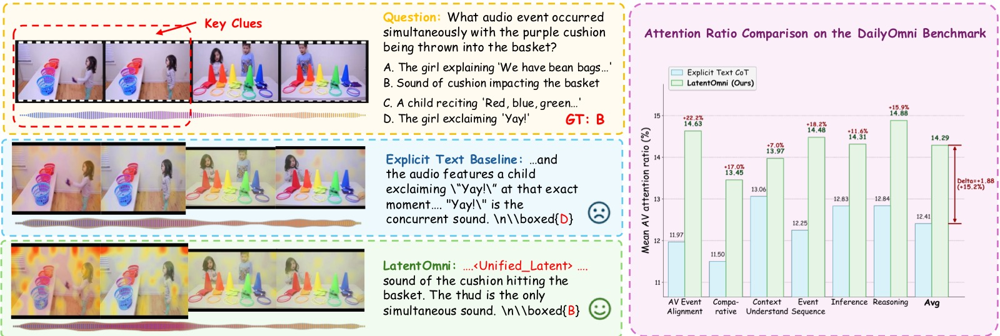
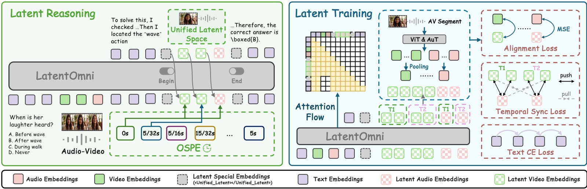
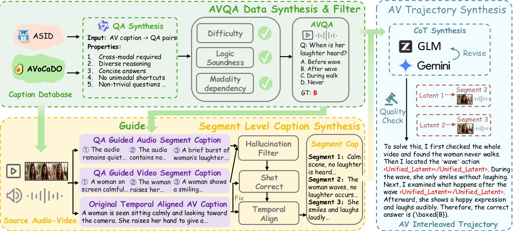
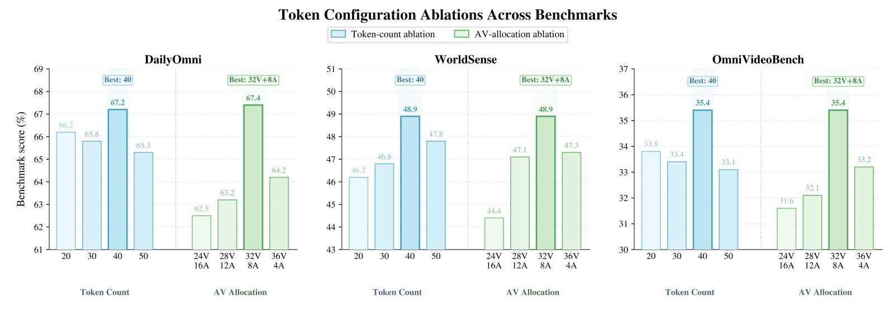
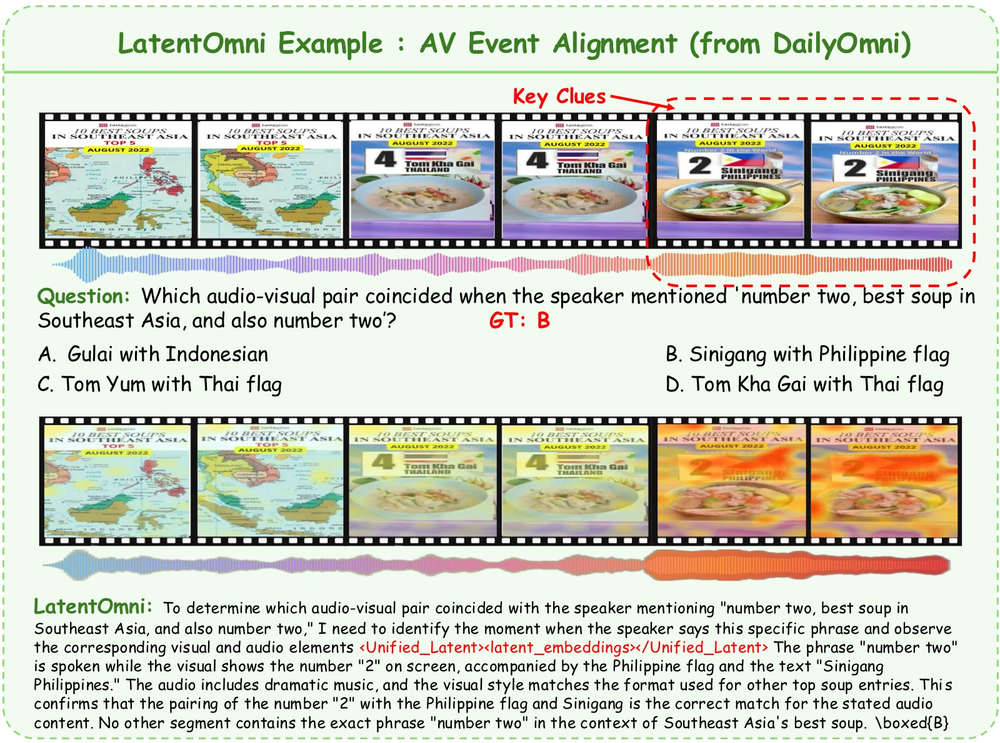
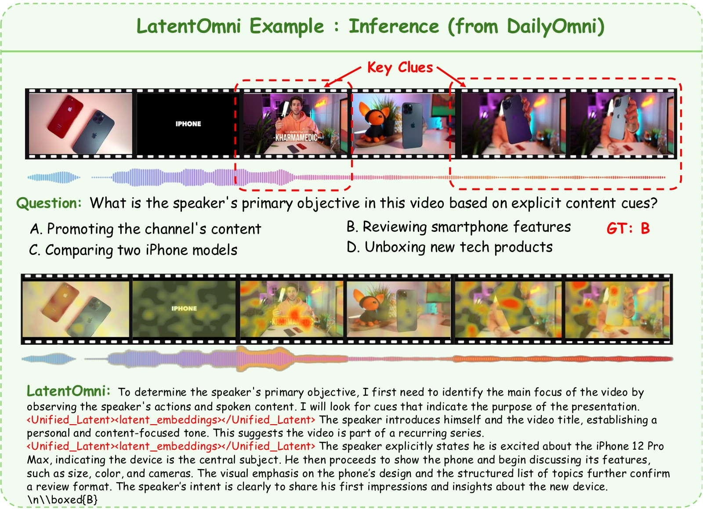
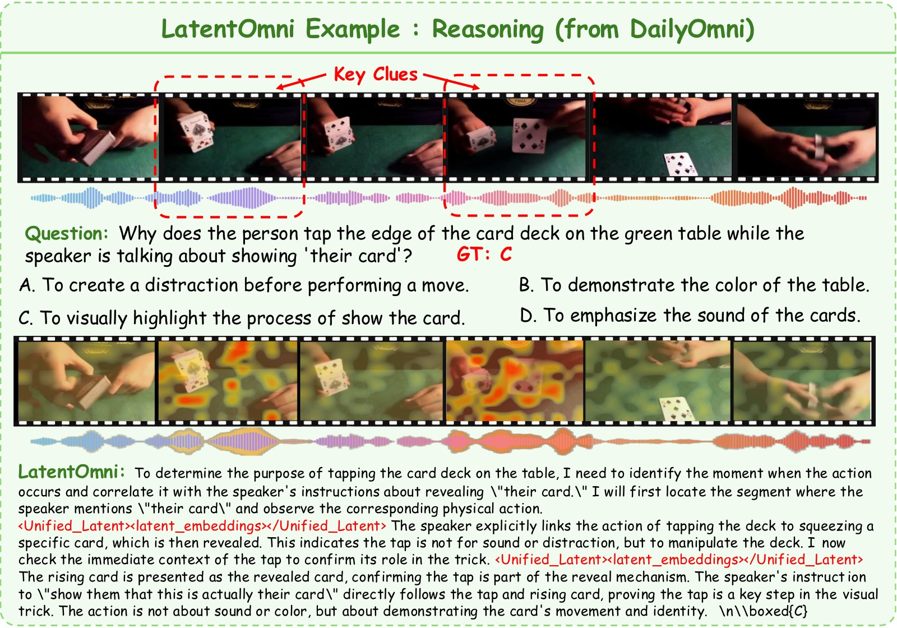

<!-- arxiv: 2605.22012 -->
<!-- venue: 投稿中 (under review) -->
<!-- tags: 全模态, 多模态理解, 链式思考 -->

# LatentOmni: Rethinking Omni-Modal Understanding via Unified Audio-Visual Latent Reasoning

> 本文基于以下本地材料整理：
> - 论文 tex 源码：`arXiv-2605.22012v1/latentomni.tex`
> - 论文章节文件：`arXiv-2605.22012v1/sections/`
> - 论文图片：`arXiv-2605.22012v1/fig/`
> - 本文图片导出目录：`assets/latentomni/`

> **论文信息**
> - 作者：Yifan Dai（SJTU & 快手 Kling）、Zhenhua Wu、Bohan Zeng、Daili Hua、Jialing Liu、Bozhou Li、Yuran Wang、Chengzhuo Tong、Hao Liang、Xiaochen Ma、Junbo Niu、Tianyu Guo、Yang Shi、Yue Ding、Yiyan Ji、Bingyin Mei、Yushuo Guan、Yuanxing Zhang、Pengfei Wan、Fangcheng Fu、Wentao Zhang
> - 机构：上海交大 AI 学院、快手 Kling 团队、北京大学、港科大、中科院自动化所、南京大学、中国人民大学、清华大学
> - arXiv：https://arxiv.org/abs/2605.22012
> - 基座模型：Qwen2.5-Omni-7B
> - 代码：未开源

---

## 一、核心问题

当前多模态大模型（MLLM）在音视频联合推理任务上表现不佳。根本原因在于：**主流方法将连续的音频和视觉信号压缩为离散文本 token 进行链式思考（Chain-of-Thought, CoT）**，这一"文本瓶颈"导致两个严重后果：

1. **信息损失（Information Loss）**：高维连续的音视频信号被强制映射到离散词汇空间，时序对齐的细粒度信息（如同步的视听觉线索）在文本化过程中被丢失。
2. **语言绑定现象（Language-Bound Phenomenon）**：模型在推理过程中过度依赖语言先验，对原始音视频输入的注意力逐渐减弱，造成"感官脱离"和幻觉。

> 直接表现：随着推理链加长，纯文本 CoT 对原始音视频信号的注意力持续下降，模型回答更多依赖语言统计规律而非真实的感官证据。

*图 1：LatentOmni 与 Explicit Text CoT 基线的对比，分左右两栏，分别从定性和定量角度证明隐空间推理如何防止"语言绑定"现象。*

**左栏 — 定性对比（Qualitative Comparison）：**

上图展示了一个具体的音视频推理示例。画面分为上排（Explicit Text CoT 基线）和下排（LatentOmni），每排包含三部分：输入的视频帧序列（顶部连续画面）、模型输出的推理过程（中间的文本/隐状态序列）、以及叠加在视频帧上的注意力热力图（深色=高注意力，浅色=低注意力）。

- 上排 Explicit Text CoT：模型生成了纯文本推理链（绿色高亮框标注的文本段落），但视频帧上的热力图显示注意力散乱分布——模型没有聚焦在回答问题所需的关键音视频帧上，而是均匀地扫视所有帧。这导致模型虽然读了"文本描述"，却没有真正"看到"关键视觉证据。最终给出错误答案（✗ 标记）。
- 下排 LatentOmni：推理过程中插入了 `<Unified_Latent>...latent embeddings...</Unified_Latent>` 段（绿色高亮标注），这是模型切换到隐空间、直接在连续特征中检索音视频证据的阶段。注意热力图的变化——深色高注意力区域精确落在了与问题相关的音视频帧上，不相关帧几乎无注意力权重。模型通过隐状态"回看"了正确的感官证据，最终给出正确答案（✓ 标记）。

**为什么这个定性对比重要**：它不是简单地展示"一个对了、一个错了"，而是通过热力图揭示了**错误和正确的机制差异**——Explicit Text CoT 的失败不是模型能力不够，而是文本媒介导致注意力从原始感官信号撤离（Language-Bound）；LatentOmni 的隐空间推理则让注意力重新锚定在音视频证据上。

**右栏 — 定量对比（Quantitative Comparison）：**

横轴为 Daily-Omni 基准上的任务类型（按音视频依赖程度分组），纵轴为 AV Token Attention Ratio——即模型总注意力中分配给原始音视频输入 token 的比例，而非分配给文本 token 的比例。红色柱为 LatentOmni，蓝色柱为 Explicit Text CoT。

关键趋势按任务类型从左到右：
- 左侧简单任务（AV Perception）：两者差距较小（~5pp），基线仍保留了部分音视频注意力。
- 中间推理任务（AV Inference）：差距扩大（~8-10pp），纯文本 CoT 将更多注意力转移到了文本推理链上。
- 右侧对齐任务（AV Alignment）：差距最大（~15pp），这是最需要精细跨模态时序对齐的任务类型——纯文本 CoT 几乎完全放弃了音视频注意力（AV Token Attention Ratio 接近最低点），而 LatentOmni 仍保持了最高水平的音视频注意力。

**这张图支持的核心论点**：文本 CoT 导致的"语言绑定"不是假说——右栏的定量数据直接显示随着任务对跨模态证据的需求增加，纯文本 CoT 对音视频信号的注意力系统性下降。LatentOmni 的隐空间推理通过将音视频证据保留在连续特征中，从根本上抑制了这种注意力转移。*

---

## 二、核心思路/方法

LatentOmni 的核心洞察是：**连续隐空间（latent space）比离散文本更适合承载和保留音视频感官信息**。与其把所有中间推理都写成文本，不如让模型在需要回顾音视频证据时，直接在连续隐空间中生成隐式推理状态。

具体做法：
- **文本 + 隐空间交替推理**：推理轨迹由文本 token（负责高层逻辑框架）和连续隐状态（负责密集音视频证据的保留和整合）交替组成。
- 当模型需要重新审视音视频信息时，生成特殊 token `<Unified_Latent>` 切换到连续隐空间，生成 K 个隐向量后再用 `</Unified_Latent>` 切回文本生成。
- 通过 **特征级监督** 和 **时序对齐的位置编码** 确保隐状态忠实于原始感官信号。

*图 2：LatentOmni 整体框架，分左（推理流程）右（训练目标）两栏，完整展示从音视频输入到答案输出的推理与优化路径。*

**左栏 — 推理流程（Reasoning Process）：**

从底部到顶部展示了完整的推理数据流：
- 底部输入层：音频编码器（Audio Encoder）将原始音频编码为 $H^a$，视觉编码器（Visual Encoder）将视频帧编码为 $H^v$，文本 query 映射为 $H^q$。三者共同送入 LLM backbone。
- 中间推理层（核心创新）：Backbone 自回归生成一个交替序列。黑色方块代表文本 token（如 logical reasoning steps），彩色方块代表隐状态 $z_{1:K}$。当需要回顾音视频证据时，模型输出 `<Unified_Latent>` 触发 token（紫色菱形），后续 K 步在连续空间 $\mathbb{R}^d$ 中生成隐状态（前 $K_v$ 个视觉、后 $K_a$ 个音频，用不同颜色区分），然后由 `</Unified_Latent>` 停止 token（红色菱形）切回文本生成。图中标注了 OSPE（Omni-Sync Position Embedding）的作用位置——它向隐状态注入基于共享物理时间戳的旋转位置编码，确保尽管视觉和音频隐状态在序列中依次生成，但同一时刻的视听特征在注意力空间中保持对齐。
- 顶部分输出层：最终答案 $a$ 综合了文本推理和隐状态的跨模态证据。

**右栏 — 训练目标（Training Objectives）：**

展示了三个损失函数和受控注意力流（Controlled Attention Flow）：
- $\mathcal{L}_{\text{text}}$（Text Prediction Loss）：标准 next-token 交叉熵，仅在离散 token（文本推理步骤、触发/停止 token、答案）上计算。图中箭头标注了文本 token 的预测路径——每个文本 token 基于其前的所有文本和隐状态上下文进行预测。
- $\mathcal{L}_{\text{latent}}$（Latent Alignment Loss）：每个生成的隐状态 $z_k$ 与对应的锚点特征 $a_k$（从标注的音视频片段中用 L2-norm 加权池化提取）计算 MSE。图中箭头标注了隐状态必须"对齐"到的目标锚点——这是防止 Language-Bound 的核心机制。
- $\mathcal{L}_{\text{sync}}$（Temporal Sync Loss）：对称 InfoNCE 对比损失，拉近同一时刻 $t$ 的视觉特征 $h_t^v$ 和音频特征 $h_t^a$，推开不同时刻对。图中标注了对比学习的正负样本对关系。
- 受控注意力流：图中用方向性箭头标注了训练时允许的注意力路径——文本 token 可关注隐状态、隐状态可关注原始音视频输入、最终答案可关注所有前文——确保信息在文本和隐空间之间双向流动。

**这张图支持的核心论点**：LatentOmni 不是一个激进的全隐空间推理方案，而是一个平衡文本逻辑和隐空间证据的混合架构——左栏展示了"怎么做"，右栏展示了"如何确保隐状态忠实于感官证据"。*

---

## 三、训练目标

为实现联合优化训练，LatentOmni 需要在推理架构、位置编码和数据构造上做特定设计，以下 3.1-3.4 依次展开。

### 3.1 音视频隐空间推理（Audio-Visual Latent Reasoning）

LatentOmni 的推理轨迹是一个**文本与隐状态交替的混合序列**：

$$S = \left[ w_{1:i}, u, z_{1:K}, u', w_{i+1:j}, u, z_{K+1:2K}, u', \dots, a \right]$$

其中：
- $w$ — 标准文本 token（离散）
- $u$ / $u'$ — `<Unified_Latent>` 触发 / 停止 token
- $z_k \in \mathbb{R}^d$ — 连续隐推理状态（transformer 最后一层输出，不经 LM head 映射回词汇表）
- $a$ — 最终答案

每个隐状态 $z_k$ 被直接作为下一个位置的输入 embedding 向前传播，形成**完全连续**的隐推理轨迹。前 $K_v$ 个位置分配给视觉隐状态，后 $K_a$ 个分配给音频隐状态（默认 $K=40$，$K_v=32$，$K_a=8$）。

**设计直觉**：文本提供逻辑骨架（"发生了什么→为什么→答案是什么"），隐空间负责在关键证据节点保留和整合密集的多模态信息——两者各司其职，互不替代。

### 3.2 Omni-Sync 位置编码（OSPE）

问题：视觉和音频隐状态是**依次生成**的（先 $K_v$ 个视觉，再 $K_a$ 个音频），属于同一时刻的视听特征可能在位置上被拉开，导致时序对齐丢失。

解决：OSPE 将 Qwen2.5-Omni 的 time-aligned multimodal RoPE 扩展到统一隐空间：

$$\operatorname{OSPE}(h, t) = h \odot \cos(t \Theta) + \mathcal{R}(h) \odot \sin(t \Theta)$$

- $t$ — 共享的物理时间戳（同一时刻的音视频帧使用相同的 $t$）
- $\Theta$ — 预定义的基频向量
- $\mathcal{R}(\cdot)$ — 在相邻维度上的块对角旋转矩阵

效果：即使视觉和音频隐状态在序列中位置不同，OSPE 通过注入同步的相对位置先验，使得同一时刻的音视频特征在注意力计算中保持对齐。

### 3.3 数据集构建：LatentOmni-Instruct-35K

训练隐空间推理需要一种特殊监督信号：**标注了每一步应该参考哪个音视频片段**的推理轨迹。现有数据集（通常是粗粒度的 QA 对）缺少这种片段级对齐。因此作者设计了三阶段数据合成 pipeline：

*图 3：LatentOmni-Instruct-35K 数据构建三阶段流水线，展示从原始音视频 caption 到最终 35K 条 interleaved 推理轨迹的完整数据流。*

图中以流程框图形式组织，按数据流动方向分为三个核心阶段：

**阶段 1 — AVQA 数据合成与过滤（AVQA Data Synthesis & Filtering）：**

数据流的起点是两个时间对齐的高质量音视频 caption 数据集——ASID-1M（一百万条结构化细粒度音视频指令标注）和 AVoCaDO（107K 条时序对齐的音视频 caption，专门标注视听事件的时间编排）。流程如下：
1. Qwen3-235B-A22B 将 caption 转化为初步 QA 对，生成过程被严格约束：问题必须同时依赖音频和视觉信息才能回答、覆盖多种推理类型、答案严格限定在 caption 内容内。
2. GLM-4.7 对每对 QA 打分（难度、逻辑严谨性、模态依赖度，各 1-5 分）和分类（10 种推理类型）。
3. 过滤规则：总分 < 13 分 → 丢弃；相邻类别间比例 > 3× → 降采样约束。图中用漏斗图标标注了过滤节点。

**阶段 2 — 片段级 Caption 合成（Segment-Level Caption Synthesis）：**

按时间戳切分原始音视频流为片段。采用分离策略（因为直接生成联合描述容易遗漏某一模态的信息）：
1. Qwen3-30B-A3B-Captioner 为每个片段分别生成纯视觉描述（场景、人物、动作、物体、镜头运动）和纯音频描述（音乐、环境音、语音内容）。
2. GLM-4.7 以原始时间对齐 caption 为参照，完成三件事：过滤高幻觉片段、修复镜头切分导致的不完整描述、重新对齐视听时序。

**阶段 3 — 音视频交替推理轨迹合成（AV-Interleaved Reasoning Trajectory Synthesis）：**

将前两阶段的输出（AVQA 对 + 片段级 caption）组合：
1. GLM-4.7 生成推理链，在需要引用特定片段的位置插入 `{[Segment n]}` 标记。关键 prompt 设计：禁止模型提及"caption"、"text"、"description"等词——模型被要求以"正在观看和聆听"的第一人称视角写推理文本。
2. Gemini-2.5-Flash 审核修正：纠正引用错误、剪除冗余分支、排除逻辑悖论或严重幻觉。
3. 最终将 `{[Segment n]}` 标记替换为对应的实际音视频片段内容，得到 35K 条 interleaved 推理轨迹。

**这张图支持的核心论点**：LatentOmni-Instruct-35K 不是简单的 QA 对扩展，而是通过三次过滤（评分→幻觉检查→逻辑审核）和强制跨模态依赖约束，构建了高质量的音视频推理监督信号。每一阶段的模型选择和 prompt 设计都有明确的工程考量。*

**数据特点**：
- 每条轨迹要求至少引用 1 个、最多 3 个音视频片段
- 推理过程明确要求从"感官证据"出发（prompt 禁止提及"caption"、"text"等词）
- 包含 10 种推理类型：视听联合感知、动作识别、空间布局理解、时序理解、属性对比、计数量化、情感氛围感知、语义摘要、逻辑关系推理、意图预测

### 3.4 训练目标

LatentOmni 使用三个互补的损失函数联合优化：

**（1）文本预测损失 $\mathcal{L}_{\text{text}}$**

标准自回归交叉熵，仅在离散 token（文本推理步骤 $w$、触发 token $u$、答案 $a$）上计算，保持模型的语言生成能力：

$$\mathcal{L}_{\text{text}} = - \frac{1}{N_{\text{text}}} \sum_{t=1}^{L} \mathbb{I}(s_t \in \mathcal{V}) \log p(s_t \mid S_{<t}, H^v, H^a, H^q)$$

**（2）隐空间对齐损失 $\mathcal{L}_{\text{latent}}$**

核心创新。从标注的音视频片段中提取特征（使用模型自身的视觉/音频编码器），通过无参数的 L2-norm 加权池化压缩为锚点序列 $A = [a_1, \dots, a_K]$，然后用 MSE 将生成的隐状态对齐到锚点：

$$\mathcal{L}_{\text{latent}} = \frac{1}{K} \sum_{k=1}^{K} \left\| z_k - a_k \right\|^2_2$$

> 这是防止"语言绑定"的关键机制：它迫使隐状态 $z_k$ 直接重建原始音视频特征，确保隐空间中的推理忠实于感官证据。

**（3）时序同步损失 $\mathcal{L}_{\text{sync}}$**

对称 InfoNCE 对比损失，对同一时刻 $t$ 的视觉特征 $h_t^v$ 和音频特征 $h_t^a$ 拉近，不同时刻的推开：

$$\mathcal{L}_{\text{sync}} = - \frac{1}{2 |\mathcal{T}|} \sum_{t \in \mathcal{T}} \left( \log \frac{\exp(\operatorname{sim}(h_t^v, h_t^a) / \tau)}{\sum_{t'} \exp(\operatorname{sim}(h_t^v, h_{t'}^a) / \tau)} + \log \frac{\exp(\operatorname{sim}(h_t^a, h_t^v) / \tau)}{\sum_{t'} \exp(\operatorname{sim}(h_t^a, h_{t'}^v) / \tau)} \right)$$

**最终联合目标**：

$$\mathcal{L}_{\text{total}} = \mathcal{L}_{\text{text}} + \lambda_1 \mathcal{L}_{\text{latent}} + \lambda_2 \mathcal{L}_{\text{sync}}$$

其中 $\lambda_1 = 0.005$，$\lambda_2 = 1.0$。

**训练配置**：
- 基座模型：Qwen2.5-Omni-7B
- 训练步数：750 steps（2 epochs）
- 学习率：$10^{-5}$，warmup 比例 0.05
- Batch size：1，梯度累积 12 步
- 最大帧数/样本：256
- 隐 token 数：固定 40（32 视觉 + 8 音频）

---

## 四、实验与结果

### 4.1 实验设置

**四个评测基准**（覆盖不同难度的音视频联合推理）：
| 基准 | 侧重点 | 特点 |
|------|--------|------|
| Daily-Omni | 日常场景推理 | 常见事件理解 |
| WorldSense | 物理/时空常识 | 结构化常识推理 |
| OmniVideoBench | 跨模态对齐与问答 | 细粒度音频类型和视频时长分片 |
| LVOmniBench | 长时多感官理解 | 持续长输入推理 |

**对照基线**：
- **Qwen2.5-Omni-7B**：基座模型（零样本推理）
- **Explicit Text CoT**：移除 LatentOmni-Instruct-35K 中所有音视频片段，仅用纯文本推理轨迹微调
- **Vanilla SFT**：直接用 LatentOmni-Instruct-35K 做标准指令微调（不使用隐空间推理）
- 开源多模态模型：VideoLLaMA2-7B、MiniCPM-o-7B、VITA-1.5-7B、HumanOmniV2-7B、Baichuan-Omni-1.5、OmniVinci
- 闭源模型：GPT-4o、Gemini-2.0-Flash、Gemini-2.5-Pro（作为参照）
- 隐推理方法：Monet、LVR（在 VideoMME 视觉子集上对比）

### 4.2 主要结果

| 方法 | Daily-Omni | WorldSense | OmniVideoBench | LVOmniBench |
|------|:----------:|:----------:|:--------------:|:-----------:|
| *GPT-4o* | *56.5* | *42.6* | *—* | *—* |
| *Gemini-2.0-Flash* | *67.8* | *56.2* | *41.5* | *42.9* |
| *Gemini-2.5-Pro* | *81.4* | *64.6* | *58.9* | *—* |
| VideoLLaMA2-7B | 35.2 | 25.4 | 29.2 | 27.0 |
| MiniCPM-o-7B | 53.1 | 29.7 | 29.7 | 34.8 |
| VITA-1.5-7B | 44.7 | 36.9 | 30.5 | — |
| HumanOmniV2-7B | 58.5 | 47.1 | 30.5 | 32.3 |
| Baichuan-Omni-1.5 | 50.0 | 43.3 | 30.7 | 32.8 |
| OmniVinci | 66.5 | 48.2 | 32.1 | — |
| Qwen2.5-Omni-7B | 62.9 | 45.4 | 29.3 | 32.0 |
| + Explicit Text CoT | 65.6 | 46.6 | 33.2 | 32.1 |
| + Vanilla SFT | 62.0 | 47.5 | 30.5 | 33.2 |
| **LatentOmni** | **67.4** | **48.9** | **35.4** | **35.1** |

**关键发现**：

1. **相对基座模型**：LatentOmni 在四个基准上分别提升 +4.5pp、+3.5pp、+6.1pp、+3.1pp，OmniVideoBench 上提升最显著（+6.1pp），说明隐空间推理特别有利于需要精细跨模态对齐的任务。

2. **相对 Explicit Text CoT**：全面超越纯文本 CoT（+1.8pp ~ +3.0pp），且增益随任务难度增加而增大。这表明隐空间推理的优势不是来自额外的数据或训练，而是来自**在连续空间中保留音视频证据**这一根本设计。

3. **相对 Vanilla SFT**：直接 SFT 反而在 Daily-Omni 上降低了 0.9pp（62.9→62.0），说明缺少隐空间推理机制的普通微调无法利用 interleaved 数据的结构优势；LatentOmni 相比 Vanilla SFT 提升 +5.4pp，差距远超 Text CoT 的 +3.6pp。

4. **OmniVideoBench 细粒度分析**：

| 方法 | Music | Sound | Speech | (0,1]min | (1,5]min | (5,10]min | (10,30]min | 平均 |
|------|:-----:|:-----:|:------:|:--------:|:--------:|:---------:|:----------:|:----:|
| Qwen2.5-Omni-7B | 23.1 | 25.3 | 30.7 | 41.6 | 27.4 | 25.3 | 26.7 | 29.3 |
| + Explicit Text CoT | 30.0 | 32.0 | 33.9 | 39.4 | 32.7 | 31.0 | 30.7 | 33.2 |
| **LatentOmni** | **33.3** | 30.2 | **36.7** | **45.2** | **33.2** | **33.3** | **34.0** | **35.4** |

- 在 Music（+3.3pp）和 Speech（+2.8pp）类别上优势明显，表明隐空间对非视觉信息的保留效果好于文本化
- 在长视频（10-30min）上 LatentOmni 达 34.0%，远超 Text CoT 的 30.7%（+3.3pp），证明隐空间推理对长时序信息保留特别有效

5. **视觉隐推理对比**（VideoMME，纯视觉设定）：

| 方法 | Overall | Short | Medium | Long |
|------|:------:|:-----:|:------:|:----:|
| LVR | 36.7 | 39.2 | 36.6 | 34.3 |
| Monet | 51.6 | 52.9 | 56.0 | 46.0 |
| **LatentOmni** | **60.8** | **70.8** | **60.5** | **50.4** |

即使去掉音频，LatentOmni 的隐推理设计在纯视觉任务上也显著优于专门的视觉隐推理方法，说明其架构通用性。

### 4.3 消融实验

*图 4：隐 token 配置消融实验，在 Daily-Omni、WorldSense、OmniVideoBench 三个基准上评测。图包含三组子图，分别回答"要用多少个隐 token""音视频怎么分配""训练超参数怎么调"三个架构决策问题。*

**子图 (a) — 隐 Token 总数消融（Latent Token Count Ablation）：**

固定音视频分配比例不变，横轴为隐 token 总数（20 / 30 / 40 / 50），纵轴为各基准上的准确率。柱状图按基准分组（Daily-Omni、WorldSense、OmniVideoBench），每个总数配置下有三根柱形。

关键数据与趋势：
- 20 → 30 → 40：所有基准上准确率持续攀升。40 token 时达到峰值——Daily-Omni 约 67.4、WorldSense 约 48.9、OmniVideoBench 约 35.4。
- 40 → 50：所有基准上准确率下降。论文分析为"表征噪声"——当隐 token 数超出有效表征需求时，多余的 token 中未被 $\mathcal{L}_{\text{latent}}$ 充分约束的维度开始自由漂移，干扰后续文本推理。50 token 的 Daily-Omni 约降至 65.3，WorldSense 约降至 47.8。
- 20 token 时性能最弱：表征容量成为瓶颈——一个隐 token 需要同时编码视觉空间关系、音频时序信息和跨模态关联，信息压缩过于激进。

**为什么 Peak at 40 重要**：这不是随便选的——如果 80 或 100 token 更好，说明隐空间推理还有大量未利用容量；Peak at 40 说明当前训练设置已经充分利用了隐空间的有效表征能力，进一步增加 token 只会带来噪声。

**子图 (b) — 音视频隐 Token 分配比例消融（AV Latent Allocation Ratio）：**

固定总数为最优的 40 个 token，横轴为不同的视觉/音频分配比例（24V+16A / 28V+12A / 32V+8A / 36V+4A），纵轴为准确率。柱状图按基准分组。

关键数据与趋势：
- 32V+8A（视觉占 80%）在所有三个基准上最优。这反映了视觉信息的固有复杂度——空间场景、多物体关系、动作序列等需要比音频更大的表征带宽。
- 36V+4A（视觉占 90%）：性能已开始下降，说明 4 个音频 token 不足以提供有效的跨模态对齐锚点。**这个负结果本身是重要发现**——它证明了音频 token 的价值不在于编码所有音频细节，而在于为视觉推理提供时序和语义参照。
- 24V+16A（视觉占 60%）：性能显著低于最优，说明过度分配音频 token 挤占了视觉的表征空间，而多出来的音频 token 并未带来等价的信息增益。

**子图 (c) — 损失权重 $\lambda_1$ 和 $\lambda_2$ 敏感度分析（Hyperparameter Sensitivity）：**

固定其他设置，分别改变 $\lambda_1$（$\mathcal{L}_{\text{latent}}$ 的权重）和 $\lambda_2$（$\mathcal{L}_{\text{sync}}$ 的权重），在 Daily-Omni 上观察准确率变化。

- $\lambda_1$ 曲线：从 0.001 → 0.005 → 0.01。0.001 时准确率明显偏低——$\mathcal{L}_{\text{latent}}$ 信号太弱，隐状态逐渐被语言先验主导，回到"语言绑定"状态。0.005 时达到峰值。0.01 时略微下降——过强的隐空间约束开始干扰语言推理的灵活性。论文最终选择 $\lambda_1=0.005$。
- $\lambda_2$ 曲线：$\lambda_2=1.0$ 达到最优。过低（0.5）时跨模态时序对齐不充分，在长视频任务上有负面影响。过高（2.0）时过强的同步约束限制了文本推理的语义抽象能力——模型过于拘泥于逐帧对齐，丧失了跨时间推理的自由度。

**为什么要看这张图**：这三组子图共同回答了 LatentOmni 的三个架构决策——40 token / 32V+8A / $\lambda_1=0.005,\lambda_2=1.0$——不是随手选的，而是通过系统消融找到的均衡点。特别是子图 (b) 中 36V+4A 的下降和子图 (c) 中 $\lambda_1$ 过低/$\lambda_2$ 过高的两侧下降，展示了"不够"和"过分"之间的窄带最优区间。*

**组件消融**：

| 配置 | Daily-Omni | WorldSense | OmniVideoBench | LVOmniBench |
|------|:----------:|:----------:|:--------------:|:-----------:|
| LatentOmni（完整） | **67.4** | **48.9** | **35.4** | **35.1** |
| w/o Audio in Latent Space | 65.9 (−1.5) | 47.8 (−1.1) | 33.6 (−1.8) | 31.6 (−3.5) |
| w/o Visual in Latent Space | 63.5 (−3.9) | 47.2 (−1.7) | 33.5 (−1.9) | 32.1 (−3.0) |
| w/o OSPE | 66.0 (−1.4) | 47.8 (−1.1) | 34.9 (−0.5) | 33.1 (−2.0) |
| w/o $\mathcal{L}_{\text{latent}}$ | 61.0 (−6.4) | 45.2 (−3.7) | 31.8 (−3.6) | 30.2 (−4.9) |
| w/o $\mathcal{L}_{\text{sync}}$ | 65.9 (−1.5) | 47.1 (−1.8) | 34.0 (−1.4) | 33.1 (−2.0) |
| Qwen2.5-Omni-7B（基座） | 62.9 | 45.4 | 29.3 | 32.0 |
| + Explicit Text CoT | 65.6 | 46.6 | 33.2 | 32.1 |
| + Vanilla SFT | 62.0 | 47.5 | 30.5 | 33.2 |

**关键发现**：
- $\mathcal{L}_{\text{latent}}$ 是最核心的组件，移除后性能暴跌（Daily-Omni 67.4→61.0），印证了特征级监督是防止"语言绑定"的主要机制
- 去掉音频隐状态在 LVOmniBench 上损失最大（−3.5pp），说明长时多感官理解特别依赖音频信息的隐空间保留
- OSPE 在所有基准上都有正向贡献，尤其在长时任务（LVOmniBench）上最明显（−2.0pp），验证了时序对齐对持续推理的重要性
- $\mathcal{L}_{\text{sync}}$ 提供互补增益——单独移除影响中等，但配合 $\mathcal{L}_{\text{latent}}$ 形成协同效果

**隐 token 配置消融**：
- Token 数从 20→40 逐步提升，40 达到峰值，50 反而下降（噪声引入）
- 最优分配比例：32 视觉 + 8 音频——视觉推理需要更大表征带宽，但少量专用音频 token 对跨模态对齐仍然关键

### 4.4 Case Study 定性分析

论文在附录中提供了三组 LatentOmni 的 Case Study 样例，展示模型在不同音视频推理场景下的隐空间推理与注意力聚焦能力。

*图 5：LatentOmni 在 AV Event Alignment 任务上的推理示例。左侧是输入视频帧序列（多帧画面展示场景的连续变化），中间是模型生成的推理文本（含 `<Unified_Latent>...<latent_embeddings>...</Unified_Latent>` 隐推理段），右侧是对应的注意力热力图叠加在视频帧上（深色=高权重）。图中展示的具体场景包含多个时序对齐的音视频线索（如人物动作与对应声音的同步出现），LatentOmni 的注意力精准集中在事件对齐的关键帧上——深色区域恰好覆盖了声音与视觉动作同步发生的时刻。相比之下，Explicit Text CoT 基线的注意力分布较为弥散，无法有效区分哪些帧包含事件对齐的证据。这个案例直接展示了隐空间推理如何通过保持连续特征来实现精确的跨模态事件对齐。*

*图 6：LatentOmni 在 AV Inference 任务上的推理示例（推断类任务）。输入是一个需要综合视听信息进行推断的场景（如根据视觉中的人物动作和背景中的声音推断事件原因）。图中展示了 LatentOmni 的推理链包含多次文本→隐空间的交替切换——每次切换到隐空间时，注意力热力图精确地重新聚焦到提供关键证据的音视频帧上。关键观察：模型在生成第 1 个隐推理段时聚焦于某一段视觉帧，在第 2 个隐推理段时注意力转移到另一段包含关键音频线索的帧上——这种"分阶段聚焦"行为表明模型能够在不同推理子步骤中按需访问不同的感官证据，这与文本 CoT 倾向于将所有信息压缩到同一段文本中的行为形成鲜明对比。*

*图 7：LatentOmni 在 AV Reasoning 任务上的推理示例（复杂推理类任务）。该场景涉及多步逻辑推理（因果链建立、跨模态证据的综合），需要模型在多段音视频片段之间建立联系。图中展示 LatentOmni 在较长的推理链中进行了多次隐空间切换（图中标注了三个 `<Unified_Latent>` 段），每次切换时注意力热力图都稳定地落在对应的证据帧上，没有出现注意力漂移或退化。这一观察直接支持了论文的核心论点——隐空间推理通过保持连续特征表示，在长推理链中有效抑制了"语言绑定"导致的注意力衰减。三个 case study 覆盖了从对齐→推断→推理的递进难度，系统性地展示了 LatentOmni 在不同跨模态推理复杂度下的行为一致性。*

---

## 五、关键洞察与技术亮点

### 5.1 "文本瓶颈"的诊断与解决

论文系统地诊断了 MLLM 音视频推理失败的根因——**不是模型不够大，而是推理媒介不对**。通过注意力可视化（图1）直接证明纯文本 CoT 对音视频信号的注意力持续衰减，这比单纯的准确率下降更有说服力。

### 5.2 特征级隐空间监督（Feature-Level Supervision）

这是 LatentOmni 最精妙的设计。不同于之前工作（如 Coconut）仅通过语言建模目标隐式优化隐状态，LatentOmni 通过 $\mathcal{L}_{\text{latent}}$ 直接要求生成的隐状态**重建原始感官特征**。这相当于在隐空间中设置了一个"锚点"，强制模型在推理过程中不断回望原始证据。

### 5.3 文本与隐空间的混合推理

LatentOmni 不做"纯隐空间推理"（完全抛弃文本），也不做"纯文本 CoT"（完全抛弃连续信息）。通过交替机制，文本负责可解释的逻辑框架，隐空间负责信息密集的证据整合——这是一个务实的折中，既保留了 LLM 的语言推理先验，又克服了文本瓶颈。

### 5.4 实验设计的严谨性

三重对照（基座 vs Text CoT vs Vanilla SFT）的设计非常干净，排除了解释混淆：Vanilla SFT 的倒退（Daily-Omni 上 62.9→62.0）直接证明了"有 interleaved 数据但没有隐空间推理 = 浪费了数据结构"这一核心论点。

### 5.5 数据合成流水线的工程价值

35K 的高质量 interleaved 推理轨迹数据集的构建方法论（三阶段：QA 合成→片段 caption→轨迹合成）为后续工作提供了可复用的范式。特别是"禁止提及 caption/text"的 prompt 设计（将文本描述伪装成感官体验），是一个巧妙的工程技巧。

---

## 六、局限性

1. **模态覆盖范围有限**：当前仅支持视觉+音频+文本，未涉及 3D 空间表示、触觉、动作指令等物理交互信号。将更广泛的异构模态映射到统一隐空间仍是开放挑战。
2. **固定隐 token 数的限制**：当前使用固定 40 个隐 token，可能需要根据不同问题复杂度自适应调整。
3. **训练规模有限**：仅在 35K 数据上微调 2 个 epoch，更大规模数据上的 Scaling 行为未探索。
4. **隐状态不可解释**：连续隐状态无法像文本 CoT 那样直接阅读，调试和可信度评估存在挑战。
5. **与闭源模型的差距**：尽管在开源模型中达到最优，但与 Gemini-2.5-Pro（81.4 vs 67.4 在 Daily-Omni）仍有明显差距。

---

## 七、关键概念速查

| 概念 | 说明 |
|------|------|
| **Language-Bound Phenomenon** | 文本 CoT 导致模型过度依赖语言先验，忽视原始感官信号的倾向 |
| **Unified Latent Space** | 音视频特征和文本 embedding 共享的连续高维空间 $\mathbb{R}^d$ |
| **OSPE** | Omni-Sync Position Embedding，通过共享物理时间戳的 RoPE 对齐跨模态隐状态 |
| **$\mathcal{L}_{\text{latent}}$** | 隐空间对齐损失，用 MSE 将生成隐状态对齐到池化后的音视频特征锚点 |
| **$\mathcal{L}_{\text{sync}}$** | 时序同步损失，对称 InfoNCE 对比损失拉近同时刻的音视频特征 |
| **LatentOmni-Instruct-35K** | 包含音视频片段引用标注的 interleaved 推理轨迹数据集 |
| **混合推理序列 S** | 文本 token 与连续隐状态交替的推理轨迹 |
| **K=40, K_v=32, K_a=8** | 默认隐 token 配置（总数 40，视觉 32，音频 8） |

