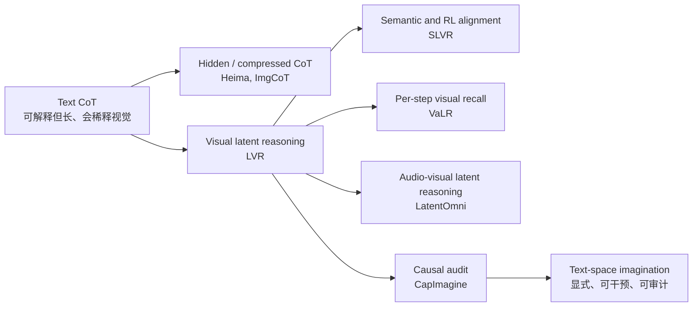

<!-- arxiv: N/A -->
<!-- venue: PaperNotes 综述 2026 -->
<!-- tags: 综述, 多模态理解, 视觉推理, 链式思考, 音视频推理 -->

# Latent Reasoning for Multimodal Models: A Survey Note

> **笔记信息**
> - 类型：综述性质笔记
> - 范围：基于 `2026-06-11/` 下 7 篇 latent reasoning / hidden thinking / multimodal reasoning 相关论文笔记
> - 覆盖论文：CapImagine、Heima、ImgCoT、LVR、LatentOmni、SLVR、VaLR
> - 日期：2026-06-11
> - 关键词：latent reasoning、hidden thinking、text bottleneck、visual grounding、CoT compression、causal intervention

> 本文基于以下本地材料整理：
>
> - [CapImagine: Imagination Helps Visual Reasoning, But Not Yet in Latent Space](CapImagine_阅读笔记.html)
> - [Heima: Efficient Reasoning with Hidden Thinking](Heima_阅读笔记.html)
> - [ImgCoT: Compressing Long Chain of Thought into Compact Visual Tokens for Efficient Reasoning of Large Language Model](ImgCoT_阅读笔记.html)
> - [LVR: Latent Visual Reasoning](LVR_阅读笔记.html)
> - [LatentOmni: Rethinking Omni-Modal Understanding via Unified Audio-Visual Latent Reasoning](LatentOmni_阅读笔记.html)
> - [SLVR: Semantic-Enriched Latent Visual Reasoning](SLVR_阅读笔记.html)
> - [VaLR: Vision-aligned Latent Reasoning for Multi-modal Large Language Model](VaLR_分享笔记.html)

---

## 一、核心结论

这 7 篇论文共同围绕一个问题展开：**多模态模型的中间推理到底应该写成文本，还是压缩到连续 latent space 里？**

它们并没有给出一个单边答案。更准确的结论是：

> **latent reasoning 不是天然有效，只有当 latent token 被强监督、可干预、能保持输入差异并真正影响输出时，它才是推理变量；否则它很容易退化为占位符、soft prompt 或压缩噪声。**

这批工作可以分成三条主线：

1. **视觉 latent 推理线**：LVR、SLVR、VaLR、LatentOmni 认为文本 CoT 会丢失视觉/音视频证据，因此希望让模型在连续空间中保存感官信息。
2. **CoT 压缩线**：Heima、ImgCoT 关注推理效率，把长文本 CoT 压缩成少量 hidden / visual tokens，但两者对"压缩什么"的理解不同。
3. **反证与替代线**：CapImagine 用因果分析指出现有 LVR latent token 很可能不是真推理变量，转而主张显式 text-space imagination。

<table>
<tr>
<td width="50%"><br><em>图1(a)：LVR 的核心主张。相比纯文本推理和外部工具推理，LVR 试图让 LLM hidden state 直接重建 ROI 视觉语义，在 visual-text joint embedding space 中推理。</em></td>
<td width="50%"><br><em>图1(b)：CapImagine 的反证框架。它分别检查 X→Z 和 Z→Y 两条因果边，发现多个 LVR 方法的 latent token 高度同质，替换后答案几乎不变。</em></td>
</tr>
</table>

*图1：这两张图构成了本综述的核心张力。LVR 代表"latent space 可以承载视觉推理"的正向主张；CapImagine 代表"不能只看性能提升，必须证明 latent token 真的被输入驱动、并真的影响答案"的反向审计。后续 SLVR、VaLR、LatentOmni 的价值，正是在这个审计标准下重新强化 latent 的语义、视觉和时序监督。*

如果把这 7 篇论文放在同一坐标系中，核心分歧不是"要不要 latent"，而是四个更具体的问题：

| 问题 | 支持 latent 的论文 | 质疑或修正 |
|---|---|---|
| latent 是否保留输入差异？ | LVR、SLVR、VaLR、LatentOmni | CapImagine 指出现有 LVR latent 可能跨实例高度相似 |
| latent 是否真正影响输出？ | SLVR、LatentOmni、VaLR 通过性能/消融间接证明 | CapImagine 要求 do-intervention，替换 latent 后输出应显著变 |
| latent 压缩的是什么？ | Heima 压缩 CoT 阶段，ImgCoT 压缩推理结构，LVR 压缩视觉 ROI | CapImagine 认为黑盒 latent 不如可审计文本想象 |
| latent 如何训练才不坍缩？ | 视觉重建、语义 embedding、REPA、OSPE、progressive distillation | 固定长度/可变长度、训练-推理 mismatch、语义不足仍是风险 |

---

## 二、资料范围与谱系

这篇综述只使用当前仓库中 2026-06-11 已整理的 7 篇笔记，不额外引入未读论文。

| 论文 | 类型 | 解决的核心问题 | 在谱系中的角色 |
|---|---|---|---|
| [LVR](LVR_阅读笔记.html) | 视觉 latent 推理 | 文本空间不是视觉信息的高效表示 | 提出"用 LLM hidden state 重建 ROI 视觉语义"的基本范式 |
| [SLVR](SLVR_阅读笔记.html) | 语义增强 LVR + RL | LVR 只靠视觉特征监督，语义贫乏且跨问题不稳定 | 给 latent 增加 semantic latent 与 multi-query consistency |
| [VaLR](VaLR_分享笔记.html) | 视觉对齐 latent CoT | 长 CoT 中视觉信号被文本稀释 | 每步推理前生成 vision-aligned latent token，恢复 test-time scaling |
| [LatentOmni](LatentOmni_阅读笔记.html) | 音视频 unified latent reasoning | 文本 CoT 无法保留连续音视频与时序对齐证据 | 将文本推理与 audio-visual latent 交替生成，并用 OSPE 保持同步 |
| [Heima](Heima_阅读笔记.html) | Hidden thinking / CoT 压缩 | 文本 CoT token 成本过高 | 用少量思考 token 压缩 Summary/Caption/Reasoning 阶段 |
| [ImgCoT](ImgCoT_阅读笔记.html) | Visual-token CoT compression | 文本压缩保留语言形式而非推理结构 | 将 CoT 渲染成图像，用空间归纳偏置保留推理拓扑 |
| [CapImagine](CapImagine_阅读笔记.html) | 因果审计 + 文本想象 | LVR latent token 可能是无效占位符 | 用中介分析否定"现有 latent 真推理"，提出 text-space imagination |

可以把这 7 篇放成一条方法演化链：



这张图表达的是：LVR 不是终点，而是一个分岔点。后续论文要么增强 latent 的监督信号，要么压缩文本 CoT，要么直接质疑 latent 的因果地位。

---

## 三、为什么大家都想逃离纯文本 CoT

这批论文共同反对一个隐含假设：**模型只要把中间过程写成文本，就能可靠地进行多模态推理。**

纯文本 CoT 的问题主要有三类。

### 3.1 视觉/音视频证据在文本中被低维化

图像、视频和音频是连续、高维、带空间与时间结构的信号。把它们全部转成自然语言，会丢失很多不易命名的细节：相对位置、局部纹理、时序同步、细小物体、动作节奏、音画对齐等。

LVR 的说法是：文本是视觉的间接表示，模型被迫先把"看到什么"翻译成描述，再在描述上推理。LatentOmni 则把这个问题推广到全模态：音视频事件常常依赖同步时刻的声画线索，文本摘要天然会损失这类对齐信息。


*图2：LatentOmni 对 explicit text CoT 的诊断。左侧定性例子说明文本推理链容易转向语言先验，右侧定量柱状图显示任务越依赖音视频证据，纯文本 CoT 分配给原始 AV token 的注意力越低。LatentOmni 的核心不是"不用文本"，而是在文本逻辑步骤之间插入连续 audio-visual latent，让模型在关键推理节点重新接触感官证据。*

### 3.2 长 CoT 会带来 token 成本和注意力稀释

Heima 和 VaLR 都强调长链推理的代价，但关注点不同：

- Heima 关注 **效率成本**：一段 CoT 可能有数百个 token，推理延迟和成本很高。
- VaLR 关注 **视觉信号稀释**：生成的文本 token 越多，初始图像 token 在上下文中的相对影响越弱，模型越来越像在"纯语言补全"。

Heima 用 3 个 thinking tokens 分别压缩 Summary / Caption / Reasoning；VaLR 则在每一步文本推理前插入一组 latent tokens，相当于给长推理链加视觉检查点。

### 3.3 文本压缩容易保留语言形式，而不是推理结构

ImgCoT 对文本 latent compression 的批评很具体：如果把长 CoT 压成 hidden tokens 后再重建文本，模型容易保留词汇、句法、模板风格，却丢失逻辑依赖和步骤拓扑。


*图3：ImgCoT 对比三种 CoT 压缩方式。文本压缩重建出的 CoT 看起来流畅，却会丢步骤、改依赖；图像压缩把推理链渲染成带箭头和布局的视觉结构，使 latent token 更关注全局推理拓扑；Loose ImgCoT 再保留少量关键文本步骤，补足视觉压缩对局部细节的模糊。这个图说明"压缩 CoT"不是简单减少 token，而是选择哪种归纳偏置来保存推理信息。*

---

## 四、第一类范式：视觉 latent 作为推理载体

### 4.1 LVR：用 hidden state 重建 ROI 视觉语义

LVR 的核心想法是：当模型需要对图像中某个区域推理时，不必调用外部工具裁剪图像，也不必生成一大段文字描述，而是让 LLM 进入 LVR mode，用最后一层 hidden state 近似重建 query-relevant visual tokens。

形式上可以理解为：

$$
h^{\text{LVR}}_{1:K} \approx v^{\text{ROI}}_{1:K}
$$

其中 $h^{\text{LVR}}$ 是 LLM 自回归产生的 latent hidden states，$v^{\text{ROI}}$ 是视觉编码器和 projector 输出的 ROI token。训练时用 MSE 对齐；推理时模型生成固定步数 latent，然后回到文本模式输出答案。


*图4：LVR 训练和推理流程。SFT 阶段用 bounding box 找到与问题相关的视觉 token，并监督 LLM hidden state 重建这些 token；RL 阶段用 adapted GRPO 继续优化文本生成；推理时模型遇到特殊 token 后进入 LVR mode，把上一位置 hidden state 作为下一位置输入 embedding，生成一段 latent visual thoughts。图中最关键的是训练-推理的角色切换：训练时 latent 有明确视觉目标，推理时 latent 必须自己维持语义。*

LVR 的价值在于它给了一个非常直接的范式：**让 LLM 在视觉 joint embedding space 里推理，而不是先把视觉翻译成文字。**

但它也暴露了几个问题：

- 固定步数策略简单有效，但不可自适应；
- latent end token 和 mode switching loss 都不稳定；
- latent 是否真正承载语义，单靠 benchmark 提升还不足以证明；
- RL 只在 3B 上验证，工程复杂度高。

CapImagine 后续正是抓住最后一点：如果 latent token 真有效，它应该在因果干预中不可替代。

### 4.2 SLVR：给 latent 加语义监督和跨问题一致性

SLVR 可以看作对 LVR 的直接补强。它认为 LVR 的 visual latent 只用视觉特征 MSE 对齐，容易学到外观级表征，但缺少颜色、动作、材质、空间关系等属性语义。于是引入两个额外约束：

1. **semantic latent**：在 visual latent 后增加 `<sem>` token，用 Qwen3 embedding 编码的属性描述作为监督目标；
2. **multi-query consistency**：同一区域面对两个不同问题时，latent 不应剧烈漂移；M-GRPO 用跨问题一致性奖励约束这一点。


*图5：SLVR 的两阶段框架。Stage 1 同时训练 visual latent、semantic latent 和答案生成；Stage 2 对同一区域的两个问题联合优化，使 latent 在不同问题扰动下保持稳定。相比 LVR，SLVR 不是只让 latent "像视觉特征"，而是让它同时 "懂属性语义" 和 "对同一区域跨问题一致"。*

SLVR 的意义在于把 latent reasoning 从"连续空间技巧"推进到"结构化表征学习"：

$$
\mathcal{L}_{stage1}
= \mathcal{L}_{vis}
+ \mathcal{L}_{sem}
+ \mathcal{L}_{ans}
$$

$$
\mathcal{R}
= \lambda_{ans}\mathcal{R}_{ans}
+ \lambda_{cons}\mathcal{R}_{cons}
+ \lambda_{stab}\mathcal{R}_{stab}
$$

这也回应了 CapImagine 式质疑的一部分：如果 latent 会跨实例坍缩，那就增加属性级语义监督；如果 latent 会随问题表述漂移，那就增加 multi-query consistency。

不过 SLVR 仍然不是完全的因果证明。它展示了性能、消融和代码实现上的有效性，但不像 CapImagine 那样直接问：把 latent 换掉后输出是否崩掉？

### 4.3 VaLR：每一步 CoT 前做视觉回注

VaLR 的问题定义和 LVR 不完全一样。LVR 关注"视觉推理可否在 latent space 发生"，VaLR 关注"长 CoT 中视觉信息为什么越来越弱"。

VaLR 的推理序列是交替式的：

```text
image + question
  -> <latent> z_1 ... z_K </latent>
  -> reasoning step 1
  -> <latent> z_1 ... z_K </latent>
  -> reasoning step 2
  -> ...
  -> answer
```

每一段 latent tokens 通过 REPA loss 对齐外部视觉编码器特征：

$$
\mathcal{L}
= \mathcal{L}_{CE}
+ \lambda \mathcal{L}_{REPA}
$$


*图6：VaLR 框架。左侧展示 latent mode 与 language mode 的交替生成，右侧展示 REPA 对齐训练。外部视觉编码器只在训练时提供 patch-wise 特征监督，推理时不再调用。VaLR 的关键不是把视觉特征直接塞进输入，而是让 MLLM 内部 latent states 学会在每个推理步骤前重新激活视觉 grounding。*

VaLR 最重要的实验现象是 **test-time scaling**：在多个 benchmark 上，VaLR 随推理长度增加性能单调提升，而 Ocean-R1 / LVR 等 baseline 在长推理后退化。这说明它不是简单压缩 CoT，而是在延长推理时持续保持视觉 grounding。


*图7：VaLR 的推理长度-性能曲线。四个子图对应不同 benchmark，VaLR 是唯一在推理长度增加时持续收益的方法。这个结果把 VaLR 和普通 CoT 区分开来：如果没有视觉对齐，长推理会变成语言幻觉；如果每步 latent 都被视觉特征校准，长推理才可能像 LLM 的 test-time scaling 一样变强。*

VaLR 的边界也很清楚：它依赖外部视觉编码器质量；latent token 仍然不可解释；REPA 训练资源较重；是否能推广到视频、音频和具身动作还需要验证。

### 4.4 LatentOmni：从视觉扩展到音视频时序对齐

LatentOmni 把 VaLR/LVR 的问题推广到 omni-modal setting：很多任务不是单张图像上的空间推理，而是音频和视频共同决定答案，例如某个声音是否对应某个画面动作、事件发生的时刻、人物行为与语音之间的关系。

它的推理轨迹混合文本和连续 AV latent：

```text
text reasoning
  -> <Unified_Latent> visual latent + audio latent </Unified_Latent>
  -> text reasoning
  -> answer
```

关键设计是 **OSPE（Omni-Sync Position Embedding）**：视觉 latent 和音频 latent 虽然在序列中依次生成，但位置编码按共享物理时间戳对齐，避免模型把同步事件拆散。


*图8：LatentOmni 整体架构。底部编码音频、视频和问题，中间生成文本 token 与 unified latent token 的交替序列，右侧用 text loss、feature loss 和 controlled attention flow 约束训练。OSPE 是理解这篇论文的关键：连续 latent 不只是压缩信息，还要保留音画同步关系。*

LatentOmni 的贡献在于把 latent reasoning 的目标从"减少 token"扩展为"保留连续感官证据"：

- 文本负责高层逻辑；
- latent 负责密集音视频证据；
- OSPE 负责跨模态时序同步；
- attention analysis 证明 latent 会让模型更多关注原始 AV token。

它的局限同样典型：数据合成流水线复杂，基于 Qwen2.5-Omni-7B 的结论是否 scale 到更大模型未知，latent token 个数和音视频分配需要细调。

---

## 五、第二类范式：把 CoT 压缩成 hidden / visual tokens

LVR、SLVR、VaLR、LatentOmni 主要从多模态 grounding 出发；Heima 和 ImgCoT 则从 **CoT 太长、太贵、太冗余** 出发。

### 5.1 Heima：把 CoT 阶段压缩到少量 thinking tokens

Heima 把多模态 CoT 拆成三个阶段：Summary、Caption、Reasoning。每个阶段用一个特殊 thinking token 替代完整文本，并用渐进式蒸馏避免一次性替换导致崩溃：

```text
Stage 0: Summary text + Caption text + Reasoning text
Stage 1: <Thinking_of_Summary> + Caption text + Reasoning text
Stage 2: <Thinking_of_Summary> + <Thinking_of_Caption> + Reasoning text
Stage 3: <Thinking_of_Summary> + <Thinking_of_Caption> + <Thinking_of_Reasoning>
Recovering: pure thinking tokens fine-tuning
```


*图9：Heima 的 progressive distillation。每一行对应一个训练阶段，逐步把文本 CoT 替换成 thinking tokens。这个设计的核心是分布平滑：让模型先学会压缩 Summary，再压缩 Caption，最后压缩 Reasoning，而不是一次性把全部可读推理删掉。*

Heima 的一个重要设计是解释器（Interpreter）：纯文本 LLM 不看原图，只读 thinking token 的 hidden state，并尝试重建 Summary / Caption / Reasoning。这让 hidden thinking 不完全是黑盒，至少能被一个 decoder probe 检查。

不过从 CapImagine 的标准看，Heima 的解释器更多是 **可读性探针**，不是严格因果干预。它能说明 hidden state 中确实含有可重建信息，但还不能完全证明模型最终答案依赖这些 hidden states 的所有语义。

### 5.2 ImgCoT：用图像压缩保留推理拓扑

ImgCoT 对文本压缩提出更细的批评：文本 autoencoder 会学习语言模式，而不是推理结构。它把 CoT 渲染成图像，让视觉 tokenizer / autoencoder 保留步骤布局、箭头依赖和全局结构。

```text
text CoT -> rendered CoT image -> visual latent tokens -> LLM reasoning
```

ImgCoT 的关键不是"图像更适合所有推理"，而是 **空间归纳偏置更适合保留结构**。当 CoT 是多步逻辑、数学推导、规则链时，步骤位置和箭头关系比某个具体措辞更重要。


*图10：ImgCoT 整体训练流程。先训练视觉编码器重建可视化文本，再训练 LLM 基于 visual latent tokens 推理。这个流程把长文本 CoT 的压缩目标从"重建自然语言"改成"重建视觉化结构"，从而减少语言表层形式对 latent 的干扰。*

Loose ImgCoT 是对纯视觉压缩的补充：对于高不确定、领域特定的关键推理步骤，仍保留少量文本 token；对通用步骤则交给 latent 压缩。这实际上形成了一个混合策略：

$$
\text{Reasoning} =
\text{Visual latent for global structure}
+ \text{Text tokens for critical local details}
$$

这和 LatentOmni / VaLR 的混合思想一致：纯文本和纯 latent 都不是最优，关键是让不同信息类型走适合自己的通道。

---

## 六、第三类范式：CapImagine 的因果审计与文本想象

CapImagine 是这批论文中最重要的"刹车"。它提醒我们：latent reasoning 的 benchmark 提升可能来自训练数据、prompt、额外监督、soft prompt 效应，而不一定来自 latent token 真正承担推理。

CapImagine 用因果中介分析检查两条边：

$$
X \rightarrow Z \rightarrow Y
$$

其中 $X$ 是输入图像和问题，$Z$ 是 latent token，$Y$ 是答案。真正的 latent reasoning 至少应满足：

1. 改变输入 $X$ 会改变 latent $Z$；
2. 干预 latent $Z$ 会改变输出 $Y$。


*图11：CapImagine 方法图。上半部分展示原始 interleaved 多模态推理数据，中间对比 latent-space reasoning 与 text-space imagination，下半部分展示数据重写、全局 refinement 和过滤流程。CapImagine 的核心策略不是继续修补 latent，而是把中间视觉操作转成可读文本描述，使中间变量可以被人读、被模型使用，也可以被直接篡改做因果检验。*

CapImagine 的实验发现非常尖锐：

- Monet / LVR / Mirage 的 latent token 在跨实例上高度相似；
- 替换 Monet latent token 后，V*、HRBench4K、MME-RealWorld-Lite 性能变化不超过约 1 个百分点；
- 用 latent-only 回答衍生 VQA 问题，准确率低于随机猜测；
- 但篡改 CapImagine 的文本想象内容后，性能断崖式下降：V* 从 85.9 掉到 22.5，HR-Bench4K 从 74.1 掉到 24.0。

这给所有 latent reasoning 方法提出了一个硬标准：

> **不要只报告加了 latent 后 benchmark 上涨；还要证明 latent 随输入变化、能被探测、被干预后输出会变，并且替换为常量/噪声时性能会显著下降。**

CapImagine 也不是完美答案。文本想象重新引入了 text bottleneck，而且它依赖 Qwen3-VL-4B 进行数据重写和过滤；它证明的是"当前若干 LVR 方法的 latent 证据不足"，而不是"所有 latent reasoning 都不可能有效"。

---

## 七、统一比较：latent 到底应该承担什么角色

把 7 篇论文合起来看，latent token 至少有五种不同角色。很多争论来自把这些角色混在一起。

| 角色 | 代表论文 | latent 承载的信息 | 主要监督 | 最大风险 |
|---|---|---|---|---|
| ROI 视觉语义 | LVR | 与问题相关的图像区域特征 | MSE 对齐 visual tokens | 语义不足、固定长度、因果作用不明 |
| 语义增强区域表征 | SLVR | visual latent + semantic latent | 视觉重建、语义 embedding、M-GRPO | 训练复杂，仍需更强干预证明 |
| 每步视觉检查点 | VaLR | 推理过程中重新激活的视觉特征 | REPA 对齐外部视觉编码器 | 依赖外部 encoder，latent 不可解释 |
| 音视频时序证据 | LatentOmni | audio-visual continuous evidence | feature loss、OSPE、controlled attention | 数据合成复杂，token 分配敏感 |
| 压缩 CoT 内容 | Heima | Summary/Caption/Reasoning hidden state | progressive distillation、解释器重建 | 信息损失，多解释器复杂 |
| 压缩推理结构 | ImgCoT | CoT 的空间布局和逻辑拓扑 | visual reconstruction + LLM SFT | 图像渲染机制复杂，局部细节模糊 |
| 被审计的中间变量 | CapImagine | text-space imagination | CoT-SFT + intervention analysis | 文本瓶颈仍在，生成数据质量依赖强 |

一个更有用的分类方式是按 **latent 的可验证性** 排序：

| 可验证性层级 | 标准 | 对应论文 |
|---|---|---|
| Level 1：性能相关 | 加 latent 后 benchmark 变好 | LVR、VaLR、SLVR、LatentOmni、Heima、ImgCoT |
| Level 2：可探测 | latent 中能重建或 probe 出信息 | Heima、SLVR、LatentOmni、VaLR |
| Level 3：可消融 | 去掉某类 latent / 对齐损失会掉点 | VaLR、SLVR、LatentOmni、ImgCoT、Heima |
| Level 4：可干预 | 人为改 latent / 中间变量会显著改变答案 | CapImagine 对 text imagination 做到了；latent 方法普遍还不足 |

这说明未来 latent reasoning 工作如果要更有说服力，应从 Level 1/2/3 往 Level 4 推进。

---

## 八、关键技术路线对比

### 8.1 监督信号：从 MSE 到语义、再到因果

这批论文的监督信号可以按强度分层：

```text
弱监督：只看最终答案 CE
  ↓
视觉特征对齐：MSE / REPA / feature loss
  ↓
语义监督：attribute description embedding
  ↓
一致性约束：multi-query consistency / stability reward
  ↓
因果干预：do(Z), textual intervention, probing
```

LVR 的视觉 MSE 是第一步，但 CapImagine 说明这可能不足。SLVR 加语义和跨问题一致性，VaLR 加每步 REPA，LatentOmni 加时序位置和 AV feature supervision，都是在提升 latent 的信息约束。

### 8.2 生成方式：固定长度 vs 自适应长度

固定长度 latent 的优点是训练推理一致、稳定、容易实现。LVR 的经验说明，只要步数足够，固定 latent steps 能工作。

但固定长度也有浪费和表达不足：

- 简单问题不需要太多 latent；
- 复杂问题可能需要更多；
- 可变终止 token 训练不稳定；
- 长 latent 序列可能引入组合空间爆炸或过拟合。

这在多篇论文里反复出现：LVR 的 latent end token 不稳定，ImgCoT 的 token 数过大性能下降，LatentOmni 需要调 K=40 / K_v=32 / K_a=8，Heima 发现单 token 比按比例保留更稳。

### 8.3 文本与 latent 的关系：替代还是互补

这 7 篇最终都没有真正证明"纯 latent"是唯一方向。更稳健的结论是：**文本和 latent 应该分工。**

| 信息类型 | 更适合文本 | 更适合 latent |
|---|---|---|
| 高层逻辑、可读解释、可干预审计 | 是 | 否 |
| 局部视觉纹理、空间细节、ROI 表征 | 否 | 是 |
| 音视频同步、连续时间证据 | 否 | 是 |
| 长 CoT 的结构拓扑 | 视情况 | ImgCoT 认为视觉 latent 更好 |
| 关键领域步骤、公式、代码操作 | 是 | 纯 latent 容易模糊 |

VaLR、LatentOmni、ImgCoT 都走向混合范式：文本负责逻辑框架，latent 负责感官证据或结构压缩。

---

## 九、对后续论文的评价标准

读这类 latent reasoning 论文时，可以用以下 checklist：

### 9.1 latent 是否有明确语义对象

需要问：

- latent 对齐的是 ROI visual tokens、audio/video features、semantic embedding，还是只是模型 hidden state？
- latent 的位置、长度、触发条件是否明确？
- latent 是训练时辅助，还是推理时也实际参与？

如果论文只说"模型在 latent space 中思考"，但没有说明 latent 对齐什么、影响什么，就要保持怀疑。

### 9.2 是否证明 X→Z

也就是输入变化是否真的改变 latent。可接受证据包括：

- 跨实例 latent 相似度低；
- 同一实例不同问题下 latent 有合理差异；
- latent 能被 probe 出图像属性、音视频事件、推理结构；
- 可视化或 nearest-neighbor 反映输入语义。

CapImagine 的 Finding 1 正是在这一点上质疑现有 LVR。

### 9.3 是否证明 Z→Y

也就是 latent 是否真的影响答案。强证据包括：

- 替换 latent 后性能大幅下降；
- 篡改 latent 内容导致可预测的错误；
- 只保留 latent 能回答相关 probe；
- 去掉对齐损失或语义监督后特定能力下降。

CapImagine 对 text imagination 做到了 Z→Y 干预；多数 latent 方法目前还停留在消融和间接证据。

### 9.4 是否解决 train-test mismatch

latent 方法特别容易出现训练和推理不一致：

- 训练时 teacher forcing，推理时自回归；
- 训练时有 GT visual tokens，推理时没有；
- 训练时固定长度，推理时想要自适应；
- 训练时外部 encoder 对齐，推理时只靠模型内部记忆。

Heima 的 progressive distillation、VaLR 的训练时 REPA、LVR 的 fixed token、LatentOmni 的 controlled attention flow，本质都是在处理这个问题。

---

## 十、开放问题

### 10.1 latent reasoning 的因果证据还不够统一

CapImagine 提出的干预标准很重要，但它主要针对 Monet/LVR/Mirage 这类视觉 latent 方法。SLVR、VaLR、LatentOmni 这些后续强化监督的 latent 方法，还需要更系统地接受类似审计：

- 将 latent 替换为常量、噪声、其他实例 latent；
- 对 semantic latent 做属性级篡改；
- 对 audio / visual latent 做时间错位；
- 检查输出错误是否按预期变化。

### 10.2 latent 的可解释性与可控性仍弱

Heima 用解释器重建 hidden thought，CapImagine 用文本想象直接可读，ImgCoT 用视觉化 CoT 保留结构。这些都在尝试让中间推理可检查。

但 LVR / SLVR / VaLR / LatentOmni 中的连续 latent 仍然难以直接解释。未来可能需要：

- latent-to-text / latent-to-region decoder；
- 属性级编辑；
- counterfactual latent intervention；
- 人类可读的 latent probe benchmark。

### 10.3 纯文本、纯 latent、混合推理的边界还不清楚

从这批论文看，最稳的方向不是"全部 latent 化"，而是混合推理：

- 文本：高层逻辑、可读解释、关键符号步骤；
- latent：视觉/音视频证据、空间结构、压缩冗余过程；
- 工具：需要真实图像裁剪、外部计算或可验证操作时仍有价值。

真正的问题是：模型如何自动决定何时写文本、何时进入 latent、何时调用工具？

### 10.4 benchmark 提升与机制解释之间仍有距离

很多 latent 方法在 benchmark 上有效，但机制解释不充分。CapImagine 反过来机制解释很强，但使用文本想象牺牲了 latent 的紧凑性和部分感官保真。未来的强论文需要同时满足：

1. 性能提升；
2. token / latency 受控；
3. latent 中间变量可 probe；
4. latent 干预会改变输出；
5. 对齐损失和数据构造不是主要混淆因素。

---

## 十一、Takeaway

这 7 篇论文给出的共同判断是：多模态推理正在从"写更长的文字 CoT"转向"选择合适的中间表示"。

但 latent reasoning 的关键不是把推理藏起来，而是让中间表示真正承担信息和因果作用：

- LVR 提出视觉 latent 推理范式；
- SLVR 用语义监督和多查询一致性修补 LVR 的语义贫乏；
- VaLR 把 latent 变成长推理中的视觉检查点；
- LatentOmni 把 latent 扩展到音视频时序证据；
- Heima 用 thinking tokens 压缩多阶段 CoT；
- ImgCoT 用视觉化结构压缩推理拓扑；
- CapImagine 则提醒：没有因果证据的 latent token 可能只是占位符。

因此，对未来 latent reasoning 工作最简洁的评价标准是：

> **不要问模型有没有 latent token；要问这些 latent token 是否由输入驱动、是否保存了文本无法稳定保存的信息、是否在干预时改变输出、是否比文本和工具更适合承担这部分推理。**
