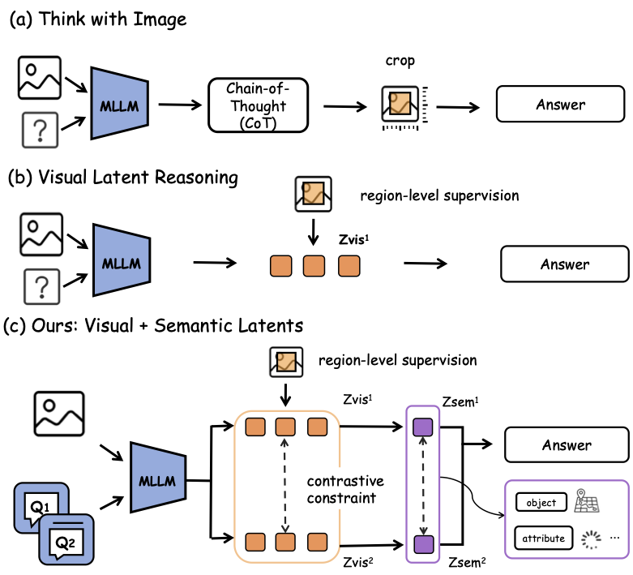
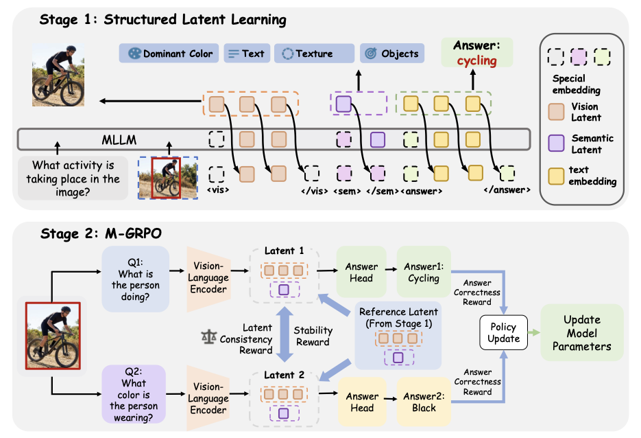
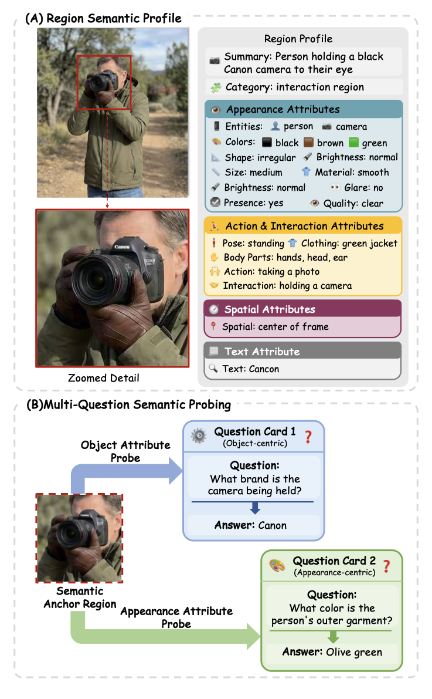

<!-- arxiv: 2605.19342 -->
<!-- venue: ICML 2026 -->
<!-- tags: VLA, 视觉推理, 强化学习 -->

# SLVR: Semantic-Enriched Latent Visual Reasoning

> 本文基于以下本地材料整理：
>
> - 论文 TeX 源码：`arXiv-2605.19342v2/example_paper.tex`
> - 论文插图：`arXiv-2605.19342v2/images/*.pdf`（figure1_n.pdf, figure2.pdf, dataset_region_multiq.pdf）
> - 官方代码：`slvr/`（ICML 2026 官方实现，基于 Qwen2.5-VL-7B + DeepSpeed + TRL）
> - 本文图片导出目录：`assets/slvr/`

> **论文信息**
> - 作者：Tianrun Xu, Yue Sun, Qixun Wang, Jingyi Lu, Yuan Wang, Tianren Zhang, Longteng Guo, Fengyun Rao, Jing LYU, Feng Chen†, Jing Liu†
> - 通讯作者：Feng Chen (chenfeng@mail.tsinghua.edu.cn), Jing Liu (jliu@nlpr.ia.ac.cn)
> - 单位：清华大学自动化系 & 电子系、中关村人工智能学院、中国农业大学、北京大学、北京理工大学、中科院自动化所、腾讯微信视觉
> - 发表：ICML 2026
> - arXiv ID：2605.19342
> - 代码：https://github.com/tinnel123666888/slvr
> - 数据集：SLV-Set（[tinnel123/slv-set](https://huggingface.co/datasets/tinnel123/slv-set)）、SV-QA（[tinnel123/sv-qa](https://huggingface.co/datasets/tinnel123/sv-qa)）

---

## 一、核心问题

现有的多模态潜在空间推理（latent visual reasoning）方法，如 LVR（Latent Visual Reasoning），试图用紧凑的潜在表征替代显式的"看图思考"（thinking with images）过程。但这些方法存在两个根本性问题：

1. **语义贫乏**：LVR 仅依赖视觉特征重建作为监督信号（MSE alignment to vision encoder features），学到的 latent 主要编码外观级（appearance-level）信息，缺乏对物体属性、状态、关系等细粒度语义的显式建模。
2. **单一查询视角**：现有方法的 latent 训练由单一任务驱动，没有统一的机制让同一个 rich latent 支持同一区域上的多种推理粒度。当同一区域被从不同语义角度提问时，单查询训练的 latent 无法稳定支持所有回答。



*图 1：三种视觉推理范式的概念对比，也是 paper 的 teaser 图。全图分为三栏，从左到右按推理效率和语义丰富度递进排列。*

**子图 (a) 显式推理或裁剪证据（"thinking with images"）：**

左侧面板展示的是当前主流范式——模型在推理过程中反复访问原始图像：先用视觉编码器处理整张图，根据问题确定需要关注的区域，然后通过图像裁剪（crop）或缩放（zoom-in）获取该区域的高分辨率视图，再对裁剪后的图像块单独编码，最终结合裁剪证据输出答案。代表方法包括 DeepEyes（自适应缩放）、GRIT（RL 引导区域选择）、V\*（引导式视觉搜索）。这种范式的优势是信息保真——模型直接"看"原始像素，对细粒度细节（如小文字、远距离物体）有最强的分辨能力。代价是计算效率——每次裁剪都需要重新编码图像，多次迭代下推理延迟远高于纯文本方法。图中用多个蓝色方块表示多轮裁剪—编码循环，箭头表示信息流反复经过 vision encoder。

**子图 (b) 仅视觉监督的 latent 推理（LVR 范式）：**

中间面板展示的是 Latent Visual Reasoning（LVR）的思路——不反复裁剪图像，而是将目标区域的视觉信息一次性压缩为 compact latent 向量。流程：输入图像和问题 → 视觉编码器提取 patch features → 选出 ROI 对应 patches → LLM 在 latent space 中自回归推理 → 输出答案。关键约束是 latent 仅由视觉特征重建损失（MSE 对齐 vision encoder features）监督，确保 latent "长得像"目标区域。但这种监督隐含地假设：如果 latent 数值上接近视觉特征，它就应该蕴含足够的语义信息来支持推理。这个假设的漏洞在于 vision encoder 的 patch features 本身不显式编码语义属性（如颜色类别、动作类型、空间关系），它们编码的是像素级的纹理和边缘特征。图中以虚线框标出 latent vector、以简单的箭头流向表示"一次压缩、直接推理"的高效路径——对比子图(a)的多次裁剪循环，计算量大幅下降。

**子图 (c) SLVR：视觉 + 语义双重监督 + 跨问题对比对齐（本文提出）：**

右侧面板展示了 SLVR 的核心创新——在 LVR 的 visual latent 基础上，新增了一个独立的 semantic latent（以 `<sem>` token 表示），由属性级文本监督驱动。流程分为两阶段：Stage 1（下排）：图像编码后同时产生 visual latent（绿色方块，MSE 对齐视觉特征）和 semantic latent（紫色方块，MSE 对齐 Qwen3 embedding 编码的属性描述）。属性描述涵盖颜色、形状、材质、动作、空间关系等结构化语义字段。Stage 2（上排）：同一区域的两个不同语义角度的问题（Question A：颜色相关、Question B：动作相关）各自产生 latent pair，M-GRPO 的 cross-question contrast 奖励迫使两个 latent pair 在保持答案正确性的同时互相一致——这样无论问颜色还是问动作，latent 都稳定编码了区域的完整语义。图中用双箭头表示 consistency 约束，用紫色渐变表示 semantic latent 从属性描述中获取的丰富语义信息，与子图(b)的"纯绿色"形成直观对比：SLVR 的 latent 不仅"像"对应区域，还"理解"区域里的语义。*

---

## 二、核心思路 / 方法

SLVR 提出一个**两阶段学习框架**，核心思想：先让 latent 编码丰富的属性级语义，再通过多查询优化对齐 latent 与多样的推理目标。

### 2.1 Stage 1：结构化 Latent 学习（Structured Latent Learning）



*图 2：SLVR 两阶段框架总览。全图分为上下两栏，分别对应 Stage 1（结构化 Latent 学习）和 Stage 2（M-GRPO 多查询优化），是理解论文方法最核心的图。*

**子图 (a) Stage 1：结构化 Latent 学习（Structured Latent Learning）：**

上半部分展示了 Stage 1 的输入、模型组件和信息流。数据输入由三部分组成——一张整图（Image）、一个自然语言问题（Question："描述该区域中的猫的外观"）、以及一个目标区域的 bounding box（ROI，如红色框标注的猫所在区域）。这三者联合输入模型。模型结构从下往上包含三个颜色编码的模块：绿色模块是视觉编码器（Vision Encoder），负责把整张图像编码为 patch feature 序列，对于 7B 模型通常产生数千个 3584 维的视觉 token；紫色模块是文本投影头（Text Embedding Projector），将 semantic latent 映射到 4096 维语义嵌入空间；蓝色模块是 LLM Backbone（基于 Qwen2.5-VL-7B），负责处理 token 序列并执行推理。

信息流的详细路径：图像经过 Vision Encoder 得到 patch features $\{\mathbf{v}^{enc}_t\}$。ROI 指定的 token indices（通过 Bbox→Token 映射选出）对应的 patch features 被包裹在 `<|vision_start|>` 和 `<|vision_end|>` 之间，这些位置的 LLM hidden states 构成区域视觉 latent $\mathcal{H}_{vis}$。紧接着 `<|vision_end|>` 之后是 `<sem>` 特殊 token，其 hidden state 先经过 LLM backbone 的一层处理，然后送入紫色 Text Embedding Projector 投影为 $\hat{\mathbf{e}}_{sem} \in \mathbb{R}^{4096}$。三个阶段被三个损失函数联合监督——$\mathcal{L}_{vis}$（绿色箭头，MSE 对齐 visual latent 与 vision encoder 的 patch features）、$\mathcal{L}_{sem}$（紫色箭头，MSE 对齐投影后的 semantic latent 与 Qwen3 embedding 编码的属性描述向量 $\mathbf{e}$）、以及未在图中显式画出但实际存在的 $\mathcal{L}_{ans}$（自回归答案生成损失）。图中底部的"Answer Supervision"文本提示模型最终还需要正确回答问题——三路损失同时作用，确保 latent 既视觉保真又语义丰富。

**子图 (b) Stage 2：M-GRPO 多查询分组相对策略优化：**

下半部分展示了 Stage 2 的优化逻辑，这是本文方法区别于 LVR 的核心差异点。同一个图像区域 $(I, r)$ 关联两个语义不同的问题——图中示例为 $q_1$（"猫的毛是什么颜色？"）和 $q_2$（"猫在做什么？"）。模型分别为每个问题生成对应的 latent 对——$q_1$ 产生 $(\mathcal{H}_{vis}^{(1)}, z_{sem}^{(1)})$（左侧 Latent 1），$q_2$ 产生 $(\mathcal{H}_{vis}^{(2)}, z_{sem}^{(2)})$（右侧 Latent 2）。这两个 latent 对在三项奖励的驱动下被联合优化：

1. **Answer Correctness Reward**（$\mathcal{R}_{ans}$，橙色标注）：由 Qwen3-Max 作为 LLM Judge 评估每个问题的预测答案是否与 ground truth 语义等价。两个问题各有一个独立的正确性奖励，确保 multi-query 优化不会牺牲任一单个问题的准确性。

2. **Latent Consistency Reward**（$\mathcal{R}_{cons}$，绿色双向箭头）：分别惩罚 semantic latent 和 visual latent 在两个问题之间的不一致——如果同一个区域对 q1 产生了一种 latent、对 q2 产生了截然不同的另一种 latent，说明 latent 的语义编码不够稳定，会被扣分。图中以双向绿色箭头连接两个 Latent，箭头上的 $\| \cdot \|_2$ 符号表示用 L2 距离度量差异。

3. **Stability Regularization**（$\mathcal{R}_{stab}$，灰色锁定图标）：将当前 latent 与 Stage 1 冻结模型在同样样本上产生的参考 latent（Reference Latent）做 margin-based L2 对齐——偏离超过容忍度 $\tau$ 时才扣分。这类似于 PPO 的 KL 惩罚，防止 RL 探索摧毁 Stage 1 已经学好的语义结构。图中以 Stage 1 Latent（灰色虚线框）作为锚点，用灰色箭头指向当前优化的 latent。

三项奖励按权重合并后（$\mathcal{R} = \lambda_{ans}\mathcal{R}_{ans} + \lambda_{cons}\mathcal{R}_{cons} + \lambda_{stab}\mathcal{R}_{stab}$），通过 GRPO 的 group-relative advantage + clipped importance sampling 机制更新 latent-generation policy。图最底部标注了 M-GRPO 的核心技术——Multiple Queries 联合 Group Relative Policy Optimization。*

**输入与 Token 构造：**

给定图像 $I$ 和问题 $q$，通过 vision encoder 编码后，用 bounding box 指定的 ROI token 序列被包裹在 `<|vision_start|>` 和 `<|vision_end|>` 之间，形成**区域视觉 latent** $\mathcal{H}_{vis} = \{\mathbf{h}^{lat}_t\}_{t=1}^{T_v}$。

在 `<|vision_end|>` 之后插入特殊 token `<sem>`，其隐藏状态作为**语义 latent** $\mathbf{z}_{sem}$，用于聚合区域级语义信息。

**三个监督信号：**

| 损失 | 目标 | 公式 |
|------|------|------|
| $\mathcal{L}_{vis}$ | 区域视觉 latent 对齐 vision encoder 特征 | $\sum_{t=1}^{T_v} \| \mathbf{h}^{lat}_t - \mathbf{v}^{enc}_t \|_2^2$ |
| $\mathcal{L}_{sem}$ | 语义 latent 对齐属性语义嵌入 | $\text{MSE}(W\mathbf{z}_{sem}, \mathbf{e})$，其中 $\mathbf{e} \in \mathbb{R}^{4096}$ 是 Qwen3 embedding 编码的属性描述 |
| $\mathcal{L}_{ans}$ | 答案监督（标准 LM loss） | 自回归交叉熵 |

总目标：$\mathcal{L}_{stage1} = \mathcal{L}_{vis} + \mathcal{L}_{sem}$

**关键设计（代码印证）：**

```python
# 特殊 token 定义（src/constants.py）
VISION_START_TOKEN = "<|vision_start|>"
VISION_END_TOKEN = "<|vision_end|>"
SEM_TOKEN = "<|sem|>"
SEM_END_TOKEN = "</sem>"

# 语义投影头（src/model/slvr_heads.py）
class SLVRTextHead(nn.Module):
    # 将 hidden_size → 4096 维语义嵌入空间
    # 结构：LayerNorm → Linear → GELU → Linear
```

### 2.2 Stage 2：多查询分组相对策略优化（M-GRPO）

Stage 2 的核心是 **M-GRPO**（Multi-query Group Relative Policy Optimization），继承自 DeepSeek-R1 的 GRPO 框架，但针对多查询场景做了扩展。

**核心思想：** 对同一区域 $r$ 的两个语义不同的问题 $q_1, q_2$，模型分别产生 latent 对 $(H_{vis}^{(i)}, z_{sem}^{(i)})$，M-GRPO 通过三项奖励联合优化——

| 奖励项 | 作用 | 公式 |
|--------|------|------|
| $\mathcal{R}_{ans}^{(i)}$ | 答案正确性（LLM judge 评估） | $\mathbb{I}(\hat{y}_i = y_i)$ |
| $\mathcal{R}_{cons}$ | **跨查询 latent 一致性**（同时约束视觉和语义 latent） | $-\sum_{i \neq j} \left( \lambda_{sem}\|z_{sem}^{(i)} - z_{sem}^{(j)}\|_2 + \lambda_{vis}\frac{1}{T_v}\sum_t \|h_t^{(i)} - h_t^{(j)}\|_2 \right)$ |
| $\mathcal{R}_{stab}^{(i)}$ | **稳定性正则化**（防止偏离 Stage 1 分布） | $-\max(0, \|z_{sem}^{(i)} - \bar{z}_{sem}\|_2 - \tau_{sem}) - \max(0, \frac{1}{T_v}\sum_t \|h_t^{(i)} - \bar{h}_t\|_2 - \tau_{vis})$ |

**GRPO 更新公式：**

$$\mathcal{J}_{\text{M-GRPO}}(\theta) = \mathbb{E}_{(I,r), (q_1,q_2), o \sim \pi_{\theta_{old}}} \left[ \frac{1}{2}\sum_{i=1}^{2} \frac{1}{G}\sum_{g=1}^{G} \frac{1}{|O_{i,g}|}\sum_t \min(\rho_{i,g,t} \hat{A}_{i,g,t}, \text{clip}(\rho_{i,g,t}, 1-\epsilon, 1+\epsilon) \hat{A}_{i,g,t}) - \beta D_{KL}(\pi_\theta \| \pi_{\theta_{old}}) \right]$$

**代码印证（src/params.py）：**

```python
# M-GRPO 关键超参数
lambda_sem: float = 0.01    # 语义 latent 一致性权重
lambda_vis: float = 0.01    # 视觉 latent 一致性权重
tau_sem: float = 1.0        # 语义 latent 稳定容忍度
tau_vis: float = 1.0        # 视觉 latent 稳定容忍度
lambda_consistency: float = 0.05   # 整体一致性奖励
lambda_stability: float = 0.05     # 整体稳定性奖励
```

**Judge 机制（src/train/mgrpo_reward_funcs.py）：**
- 使用 Qwen3-Max 作为 LLM judge，通过 vLLM 推理服务
- 后台线程定期从 broker 刷新 IP 池，ThreadPoolExecutor 并发调用
- 支持 judge 不可用时自动回退到字符串匹配
- 正确答案性判断：语义等价性比较（支持字母选项 / 文本答案 / 数字匹配）

---

## 三、数据集构建

### 3.1 SLV-Set

基于 Visual-CoT（ViSCoT）数据集构建，包含两个互补组件：

| 组件 | 规模 | 内容 | 用途 |
|------|------|------|------|
| 属性级语义数据集 | ~400K 区域描述 | Qwen3-VL-235B 生成的结构化区域语义档案（实体、颜色、形状、材质、动作、交互、空间关系、文字内容） | Stage 1 语义监督 |
| 多查询数据集 | ~800K QA 对 | 每个区域关联 2-4 个从不同语义角度提问的 QA 对 | Stage 2 M-GRPO 训练 |



*图 3：SLV-Set 数据集构建流水线，分为两个子图，分别对应属性级语义标注和多查询问题生成两大环节。*

**子图 (a) Region-Centric Prompt 和属性级语义标注：**

上半部分展示了如何用 Qwen3-VL-235B 为每个关键区域生成结构化的"区域语义档案"（Region Semantic Profile）。流程从左到右分为三步：

第一步——输入（左侧）：给定一张图像及其原始问题（如"这个物体是什么颜色？"），通过 bounding box 标注出关键区域（如红框框出的物体区域）。区域相关的视觉信息作为模型关注的焦点。

第二步——Region-Centric Prompting（中间）：设计专门的 prompt 策略，引导 Qwen3-VL-235B 只关注 bounding box 指定的区域，从标准化字段描述该区域的语义。Prompt 要求模型输出结构化字段，覆盖四个维度——Appearance 属性（实体类别 Entity、颜色 Color、形状 Shape、材质 Material）、Action & Interaction 属性（区域内实体正在做的动作、与其他物体的交互关系）、Spatial 属性（相对位置、方向、深度关系）、以及 Visible Text（区域内出现的文字内容）。图中用多层展开的彩色标签表示这些字段，左右对称排列，直观展示每个属性维度的内容。这个结构化档案确保了语义监督信号是细粒度且可解释的——不像 LVR 只用一个标量 MSE 值来隐式衡量"像不像"。

第三步——语义嵌入编码（右侧）：生成的文本属性描述（Region Semantic Profile → Description 1, Description 2, ...）被送入 Qwen3 Embedding Model，编码为一个统一的 4096 维语义向量 $\mathbf{e} \in \mathbb{R}^{4096}$。这个向量随后成为 Stage 1 语义 latent 的训练目标。图中以蓝色方块 "4096-dim" 表示最终的嵌入向量。

**子图 (b) Multi-Query Question Generation（多查询问题生成）：**

下半部分展示了如何基于同一视觉区域生成多个语义角度不同的 QA 对。关键设计是："语义不同"不是随机的——每个问题被设计为探测区域的不同语义维度。图示流程：

左侧是同一个被 bounding box 标注的目标区域（如一个穿某颜色衣服的人、或某个特定物体）。Qwen3-VL-235B 被 prompt 引导，围绕该区域生成 2-4 个问题，每个问题从不同的语义角度切入——例如一个问题是关于颜色的（"这个人穿什么颜色的衣服？"），另一个问题是关于动作的（"这个人在做什么？"），还可能有关于空间关系（"这个人站在什么东西的旁边？"）或物体属性（"这个人手里拿着什么？"）的问题。图中用不同颜色的矩形框（黄色、橙色、蓝色等）区分不同角度的问题。

每个问题都是完整的 QA 对，包含自然语言问题（如 "Q: What is the color of the car?"）、对应的答案选项或自由文本答案、以及指向同一个 bounding box 的标注。这些 QA 对随后被组织为训练样本，每个样本格式为 $(i, q_1, q_2, b)$——图像、两个语义不同的问题、共享的 bounding box。这是在为 Stage 2 M-GRPO 的 joint optimization 准备数据——M-GRPO 要求同一区域有多于一个问题才能计算跨查询一致性奖励。图底部以树状分叉结构表示：一个区域（树干）→ 多个语义角度的问题（树枝）→ 各自独立的答案（树叶），直观表达了同一个 latent 需要支撑多种语义查询的设计意图。*

**质量验证：** 人工后验检查全部 SLV-Set，发现 29,457 条错误标注（错误率 7.29%）。主要错误类型：颜色错配（19.94%）、动作/姿态错误（14.55%）、空间关系错误（13.28%）、幻觉属性（11.80%）。

每个样本格式：$(q, i, b, \mathcal{A}, \mathbf{e})$ — 问题、图像、边界框、属性集、4096 维语义嵌入。

### 3.2 SV-QA 评估基准

基于 V*、HRBench-4K、HRBench-8K 构建，每个区域从原始问题 $q_1$ 和生成的 $q_2$ 两个语义维度提问。**591 对样本**，经人工审查修正（19 题与原始题过度重叠、8 题含幻觉内容）。

---

## 四、代码架构

### 4.1 项目结构

```
slvr/
├── src/
│   ├── model/
│   │   ├── qwen_slvr_model.py      # QwenWithSLVR 模型定义（含特殊 token embedding）
│   │   ├── qwen_slvr_model_ori.py  # 原始版本
│   │   └── slvr_heads.py           # SLVRHead（视觉）/ SLVRTextHead（语义）/ SLVRHeadGLU
│   ├── train/
│   │   ├── train_sft.py            # Stage 1 SFT 训练入口
│   │   ├── train_mgrpo.py          # Stage 2 M-GRPO 训练入口
│   │   ├── train_grpo.py           # 标准 GRPO 训练入口（消融用）
│   │   ├── mgrpo_reward_funcs.py   # M-GRPO 奖励函数（accuracy + format）
│   │   ├── monkey_patch_forward_slvr.py       # 训练前向 monkey-patch（核心）
│   │   ├── monkey_patch_forward_slvr_rl.py    # RL 专用 monkey-patch
│   │   └── preflight_mgrpo_infer.py           # M-GRPO 推理预检
│   ├── dataset/                    # 数据集加载（SFT / M-GRPO）
│   ├── trainer/
│   │   └── mgrpo_trainer.py       # M-GRPO Trainer（含 consistency/stability 奖励计算）
│   ├── slvr_utils.py              # Bbox → Token 索引映射（QwenVLBboxTokenMapper）
│   ├── params.py                   # 训练参数定义（含 M-GRPO 超参数）
│   └── constants.py                # 特殊 token 定义
├── scripts/
│   ├── finetune_slvr_stage1_7b_viscot.sh    # Stage 1 训练脚本
│   └── finetune_slvr_stage2_7b_mgrpo_viscot.sh  # Stage 2 训练脚本
├── inf_batch_dir_old.py            # 批量推理脚本
├── environment.yaml                # Conda 环境
└── requirements.txt
```

### 4.2 关键技术细节

**Bounding Box → Token 索引映射（`QwenVLBboxTokenMapper`）：**
- 基于 Qwen 2.5 VL 的 vision tower 参数：patch_size=14, spatial_merge_size=2
- 动态计算每张图像的 token grid，支持 xyxy / xywh 两种 bbox 格式
- 自动归一化 bbox 坐标，提供双向转换（bbox → indices / indices → bbox）
- 注意：bbox 标注时维度可能与 Qwen 图像预处理后的实际维度不一致（resize），代码注释提醒使用者**假设 bbox 是归一化的**

**前向传播 Monkey-Patch（`monkey_patch_forward_slvr.py`，~121K，代码库最大文件）：**
- 替换 Qwen2.5-VL 的 `Qwen2_5_VLForConditionalGeneration` 前向传播
- 支持 3 种模式：`inference_mode=False, rl=False`（Stage 1 SFT）、`inference_mode=False, rl=True`（Stage 2 M-GRPO）、`inference_mode=True`（推理）
- 在 hidden states 中提取 `<|vision_start|>` 到 `<|vision_end|>` 之间的视觉 latent，以及 `<sem>` 位置的语义 latent

**M-GRPO Trainer（`mgrpo_trainer.py`）：**
- 继承自 TRL 的 GRPOTrainer
- 每个 sample 包含两个问题（q1, q2）的 completion
- `mgrpo_reward_funcs.py` 中 accuracy_reward 返回 q1 和 q2 答案正确性的加权组合（默认 q1 权重 0.7, q2 权重 0.3）
- format_reward 检查输出格式：`<|vision_start|>[visual latents]<|vision_end|><sem>[semantic latent]</sem><answer>...</answer>`
- 一致性奖励和稳定性奖励在 trainer 内部从 hidden states 计算（使用 L2 距离）

**推理（`inf_batch_dir_old.py`）：**
- 配置类 `Config`：MODEL_PATH, INPUT_DIR, OUTPUT_DIR, STEPS（latent reasoning 步数，默认 8）
- `DECODING_STRATEGY = "latent"` 启用 SLVR 式推理
- 自动检测可用 GPU，OOM 时自动回退

---

## 五、实验结果

### 5.1 标准 VQA 基准

| 模型 | 推理范式 | OKVQA | GQA | VizWiz | ChartQA | TextVQA | AI2D |
|------|---------|-------|-----|--------|---------|---------|------|
| Qwen2.5-VL-7B | 纯文本 | 58.9 | 53.2 | 54.1 | 74.4 | 79.1 | 69.5 |
| LVR | 视觉 latent | 50.6 | **57.4** | 33.1 | 64.4 | 75.1 | **77.3** |
| **SLVR-7B** | 视觉 + 语义 latent | **61.8** | 55.6 | **57.8** | **77.2** | **79.3** | 76.0 |
| *Gain over LVR* | | *+11.2* | *-1.8* | *+24.7* | *+12.8* | *+4.2* | *-1.3* |

**关键发现：** SLVR 在 OKVQA（+11.2）、VizWiz（+24.7）、ChartQA（+12.8）上对 LVR 提升显著，说明语义 latent 在这些需要细粒度语义理解的场景中作用突出。

### 5.2 SV-QA 基准（核心实验）

| 设置 | V* Q1 | V* Q2 | V* Both | HRBench-4K Both | HRBench-8K Both |
|------|-------|-------|---------|------------------|------------------|
| Qwen2.5-VL | 76.4 | 55.5 | 44.0 | 45.8 | 37.5 |
| DeepEyes（显式裁剪） | **83.3** | 79.1 | **70.2** | 60.6 | 49.0 |
| LVR | 81.7 | 77.5 | 65.4 | 57.9 | 46.6 |
| **SLVR-7B** | 82.2 | **80.1** | 69.1 | **61.1** | **50.6** |
| *Gain over LVR* | *+0.5* | *+2.6* | *+3.7* | *+3.2* | *+4.0* |

**关键发现：**
- SLVR 在 Both Correct（两个问题都答对）指标上全面超越 LVR（+3.2 ~ +4.0），证明语义 latent 能同时编码多种语义维度
- 与其他 method 对比：纯文本方法（Qwen2.5-VL）在 Q2 上性能暴跌（Q1 76.4 → Q2 55.5），说明文本推理无法稳定支持语义变化
- DeepEyes 在 V* Q1 上最高（83.3），但这是通过**推理时显式图像裁剪**实现的，计算开销巨大；SLVR 完全通过 latent 推理实现 competitive 的 Q1 性能

### 5.3 VisualPuzzles 推理能力评估

| 模型 | Algorithmic | Analogical | Deductive | Inductive | Spatial | Overall |
|------|-------------|------------|-----------|-----------|---------|---------|
| Qwen2.5-VL | 35.9 | 26.1 | 35.5 | **28.7** | 21.3 | 29.2 |
| LVR | 31.3 | 25.6 | 40.5 | 24.4 | 26.2 | 29.4 |
| **SLVR** | **37.4** | **28.0** | **45.5** | 26.3 | **33.6** | **34.2** |

**关键发现：** SLVR 在 Deductive（+5.0）和 Spatial（+7.4）推理类别上大幅超越 LVR，证明属性级语义监督帮助模型捕获了结构化关系和空间线索，这些是纯视觉监督 latent 所遗漏的。

### 5.4 消融实验

| 设置 | 组件 | V* Both | HRBench-4K Both | HRBench-8K Both |
|------|------|---------|------------------|------------------|
| **文本基线** | | | | |
| SFT (single-Q) | — | 51.8 | 52.8 | 43.5 |
| SFT (multi-Q) | +多查询数据 | 57.1 | 50.1 | 41.1 |
| SFT + GRPO (multi-Q) | +强化学习 | 58.6 | 55.5 | 47.8 |
| **Latent 推理** | | | | |
| LVR | 基线 | 65.4 | 57.9 | 46.6 |
| + Stage 1 | +语义 latent 监督 | 67.5 | 59.6 | 46.9 |
| + GRPO (Single-Q) | +单查询 GRPO | 62.8 | 57.6 | 49.3 |
| + Multi-Q | +多查询 GRPO（无 M-GRPO） | 68.1 | 60.3 | 49.9 |
| **SLVR-7B (Full)** | +M-GRPO 显式一致性约束 | **69.1** | **61.1** | **50.6** |

**核心消融结论：**

1. **文本 vs. Latent**：即使是数据量相同的最强文本基线（SFT + GRPO multi-Q），Both Correct 也全面落后 latent 推理方法（V* 58.6 vs. 69.1），说明文本链式思维在"同一区域多角度提问"场景中难以维持稳定 grounding。
2. **Stage 1 语义监督**：加入语义 latent 后，V* Both 从 65.4 提升到 67.5，验证属性级语义信息有助于 joint correctness。
3. **多查询 vs. 单查询 GRPO**：Multi-Q（多查询数据 + 标准 GRPO）比 Single-Q GRPO 提升了 Both Correct，说明更多样的训练信号本身有益。
4. **M-GRPO 一致性约束是关键**：M-GRPO（显式 latent 一致性约束）在 Multi-Q 基础上进一步提升，证明显式对齐同一区域上的 cross-query latent 对语义一致性至关重要。

---

## 六、关键洞察与讨论

### 6.1 为什么需要语义 latent 而不只是视觉 latent？

LVR 的视觉 latent 通过直接对齐 vision encoder 特征来保留视觉信息，但 vision encoder 的 patch 特征本身不显式编码"这是红色"、"这个人在跑"等属性语义——这些语义分散在深层特征中，缺乏显式的结构化引导。SLVR 引入一个额外的 `<sem>` token 作为**语义聚合点**，直接以结构化属性文本的嵌入作为监督，迫使模型将分散的视觉语义压缩到该 token 的 hidden state 中。

### 6.2 M-GRPO 的 motivation

Stage 1 虽然给单个 latent 编码了语义信息，但没有保证**在不同问题的扰动下该语义能稳定激活**。M-GRPO 的 latent consistency reward 直接对"两个不同问题产生不同 latent"这种 drift 进行惩罚，保证同一区域的核心语义表征不受问题表述方式的影响，而只保留 task-specific 的微小差异。

### 6.3 与 DeepEyes 等"看图思考"方法的关系

DeepEyes 通过推理时反复裁剪区域图像来获取高分辨率视觉证据，准确率高但计算开销大。SLVR 通过 latent 学习一次性地将区域信息压缩为 compact 表征，推理时无需显式图像操作。两者不是互斥的——理想情况下，semantic-enriched latent 可以作为 DeepEyes 等方法的"内化"版本，减少裁剪迭代次数。

### 6.4 局限性

- 语义监督依赖 Qwen3-VL-235B 生成属性标注，存在 7.29% 的错误率（颜色错配、动作/姿态错误等），语义 latent 的上限受制于属性标注质量
- 语义 latent 通过 L2 对齐 Qwen3 embedding 来学习，没有显式验证学到的 latent 是否保留了可解释的语义维度
- 实验在 Qwen2.5-VL-7B 上进行，更大规模模型的 scaling behavior 未知
- M-GRPO 的两问题联合优化目前限制在 q1 + q2 组内，扩展到 3+ 问题可能需要新的 group 构建策略

---

## 七、总结

SLVR 通过两阶段训练为 latent visual reasoning 引入**细粒度属性级语义监督**和**多查询一致性对齐**：

- **Stage 1**：在 LVR 的视觉 latent 重建基础上，新增 `<sem>` 语义 latent 和属性语义对齐损失，使 latent 编码结构化语义
- **Stage 2**：设计 M-GRPO，同时优化同一区域两个语义不同问题的答案正确性、latent 一致性和分布稳定性
- 配套构建 SLV-Set（~400K 属性 + 800K QA 对）和 SV-QA（591 对多角度问题）数据集
- 在 SV-QA 的 Both Correct 指标上全面超越 LVR（+3.2 ~ +4.0），在 VisualPuzzles 的 Deductive 推理上超越 LVR 5 个百分点
