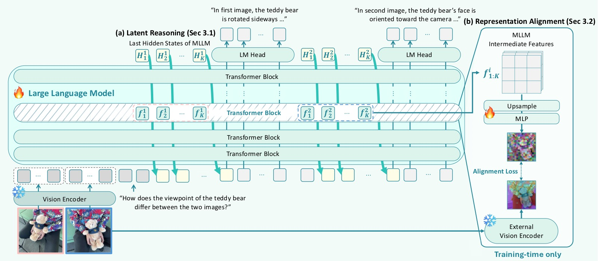
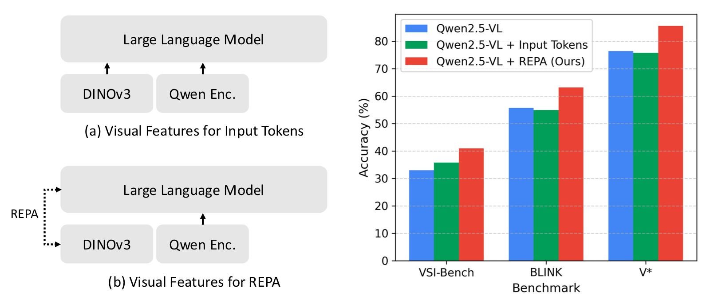
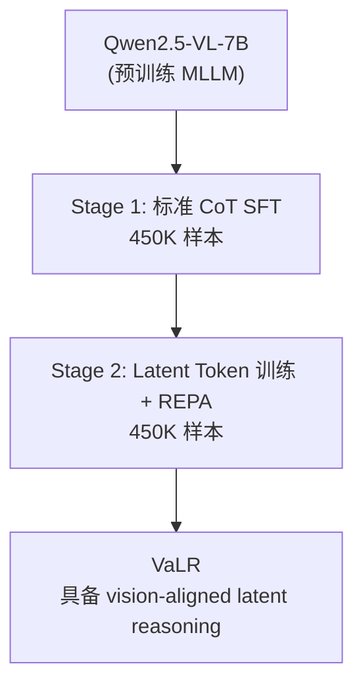
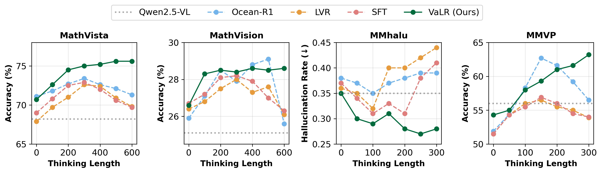
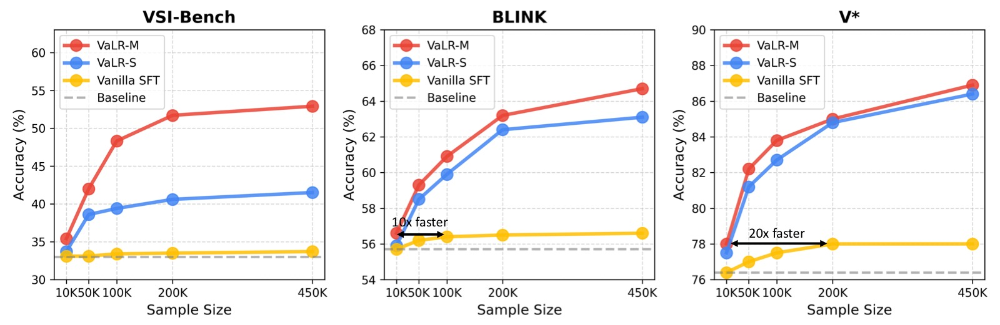
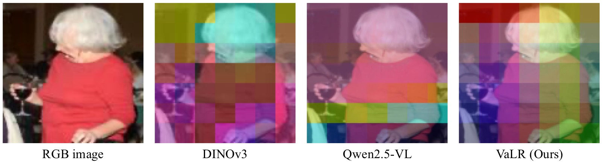

<!-- arxiv: 2602.04476 -->
<!-- venue: ICML 2026 -->
<!-- tags: 多模态理解, 视觉推理, 表征学习 -->

# VaLR 论文分享简明笔记

> **论文信息**
> - 论文：Vision-aligned Latent Reasoning for Multi-modal Large Language Model
> - 作者：Byungwoo Jeon、Yoonwoo Jeong、Hyunseok Lee、Minsu Cho、Jinwoo Shin
> - 机构：KAIST、POSTECH、RLWRLD
> - 投稿方向：ICML 2026（accepted）
> - arXiv ID：2602.04476v2
> - 代码：论文指向项目页 https://rootyjeon.github.io/valr/；本地未克隆官方代码

> 本文基于以下本地材料整理：
>
> - 详细笔记：`VaLR_阅读笔记.md`
> - 论文 tex 源码：`arXiv-2602.04476v2/main.tex`
> - 论文图片：`arXiv-2602.04476v2/images/*.pdf`
> - 本文图片导出目录：`assets/valr/`

## 1. 一句话讲清楚

VaLR 的核心想法是：MLLM 在做 CoT 推理时，每一步思考之前先默默地"看一眼"图像——动态生成一组与视觉特征对齐的 latent token，防止视觉信息随着推理链变长而逐渐"忘掉"。

这篇论文的核心不是又做了一个更大的 MLLM，而是发现并解决了 MLLM 的关键缺陷：**随着生成序列增长，视觉信号会逐渐衰减（dilution of visual information）**，而 VaLR 通过在每步推理前插入 vision-aligned latent token 作为"视觉检查点"，让模型始终保持在视觉 grounding 上。



*图 1：VaLR 框架总览。图片分左右两个子图，展示 VaLR 的推理机制和训练方式。*

**子图 (a) VaLR 推理过程**：展示模型在一次完整推理中的 token 生成流程。左侧输入图像 I_0, I_1, I_2（多视角图像，颜色深浅代表不同视角）和文本问题。推理从左到右展开：
- 首先处理图像 token（左侧橙色横条）和文本 token（紫色横条），经过 Transformer 得到 hidden states（蓝色竖条）。
- 然后进入"潜在模式"（latent mode，绿色区域）：模型预测 `<latent>` 特殊 token 后，开始生成 K 个连续 latent token。每个 latent token 的输入不是普通 token embedding，而是上一个 latent token 的 hidden state h_i（图中弯箭头所示），形成自循环。latent token 不与任何文字对应，是纯连续向量。
- K 步后预测 `</latent>`，切换回"语言模式"（language mode，蓝色区域）：生成第一段文本推理步骤 r^(1)（如"Step 1: Identify objects"）。
- 再次进入潜在模式（第二个绿色区域），生成新一轮 latent token，再回到语言模式生成 r^(2)，以此类推，直至最终输出 answer。
- 底部标注："Per-step visual recall via latent tokens"（每步通过 latent token 回注视觉信息），强调 latent token 的作用是为每步推理提供视觉锚点。

**子图 (b) REPA 对齐训练（仅训练时使用，推理时不依赖）**：
- 左侧：原始输入图像 I^(i) 经过冻结的外部视觉编码器（如 DINOv3、SigLIP、CLIP、π³），提取出 patch-wise 视觉特征 F_φ^(i)（蓝色特征图网格）。
- 右侧：MLLM 在潜在模式下生成的 latent token hidden states，通过可学习的 MLP 投影头 ψ 和 Upsample 操作映射到与视觉特征相同的维度，得到 F̂_MLLM^(i)（绿色特征图网格）。
- 中间：计算两组特征图的 patch-wise 余弦相似度，作为 REPA 对齐损失 L_REPA。这个损失强制 MLLM 的 latent 表示向视觉编码器学到的真实视觉特征靠拢。
- 核心洞察：外部视觉编码器**仅在训练时使用**（"External vision encoders used during training only"），训练完成后 MLLM 自己就内化了视觉 grounding 能力，推理时无需额外编码器。

```text
以前：image + question -> CoT 推理 -> answer
            ↓ 视觉信号逐渐衰减
现在：image + question -> [看眼图] step1 -> [看眼图] step2 -> ... -> answer
            ↑ 每步前用 latent token 回注视觉信息
关键：latent token 与视觉编码器特征对齐，训练后内化视觉 grounding 能力
```

## 2. 论文要解决什么问题

MLLM 在常规 VQA 上表现不错，但一到需要长链推理的任务就容易"跑偏"。根本原因不是语言推理能力不够，而是：

```text
image + question -> step1 -> step2 -> step3 -> ... -> stepN -> answer
  ↑视觉信号                                     ↑视觉信号几乎没了
```

两个核心痛点：

1. **视觉信号稀释**：自回归生成过程中，文本 token 越生成越多，图像 token 在长序列中的相对权重越来越小。模型逐渐"忘记"图像里有什么，推理变成纯文本游戏。

2. **现有方法不可持续**：
   - 纯文本 CoT 增强（如 Math-LLaVA、Flow-DPO）：增强的是文本推理，不解决视觉衰减。
   - 交错视觉 token（如 DeepEyes、Machine-CoT）：视觉信息只作为初始固定上下文一次性注入，后续推理步骤无法重新感知图像。
   - 潜在空间推理（如 Monet、CoVT、LVR）：仍然只使用静态的初始视觉特征，没有动态回注机制。

VaLR 的切入点是：**与其一次性给足视觉信息然后指望模型记住，不如在每一步推理前都给模型一个"再看一眼"的机会。** 这个"再看一眼"不是重新跑视觉编码器，而是通过训练让模型学会在 latent token 中内化视觉信息。

## 3. 方法总览

VaLR 把一次多模态推理拆成交替的两段：

```text
image + question
  -> <latent> latent_tokens </latent>   (visual checkpoint)
  -> reasoning step 1
  -> <latent> latent_tokens </latent>   (visual checkpoint)
  -> reasoning step 2
  -> ...
  -> answer
```

直观解释：

- **`<latent> ... </latent>`**：模型进入"潜在模式"，生成 K 个连续 latent token。这些 token 不对应任何文本词汇，而是以模型内部 hidden state 的形式传播。
- **latent token 的训练目标**：与外部视觉编码器（DINOv3、SigLIP、CLIP 等）的 patch-wise 特征做余弦相似度对齐（REPA loss），鼓励 latent token 编码丰富的视觉信息。
- **推理步骤**：latent token 为后续的文本 CoT 推理提供"视觉锚点"，让模型知道现在看到的是什么、应该关注图像的哪些区域。

| 模块 | 做什么 |
|---|---|
| Latent token generation | 在每步推理前生成 K 个潜在 token，作为视觉检查点 |
| REPA alignment | 训练时将 latent token 的 hidden states 对齐到视觉编码器特征 |
| Multi-encoder alignment | 利用多个视觉编码器的互补表征（语义 + 空间 + 3D） |
| Two-stage curriculum | Stage 1 学 CoT 推理 → Stage 2 学 latent 推理 + REPA |

## 4. 核心方法细节

### 4.1 潜在推理机制（Latent Reasoning）

VaLR 在推理时交替切换两种模式：

**语言模式**（正常自回归）：
```
E_{t+1} = [E_t; e(x_{t+1})]    # 输入是下一个 token 的 embedding
H_{t+1} = Transformer(E_{t+1})
```

**潜在模式**（latent reasoning）：
```
E_{t+1} = [E_t; h_t]           # 输入是上一时刻的 hidden state
H_{t+1} = Transformer(E_{t+1})
```

关键区别：潜在模式下不使用 token embedding，而是直接把上一时刻的 hidden state `h_t` 喂回 Transformer。这让模型在连续向量空间中"思考"，不受离散词汇表的限制。

模型通过预测特殊 token 来切换模式：
- 预测 `<latent>` → 进入潜在模式，固定 K 步后自动退出
- 预测 `</latent>` → 回到语言模式，继续文本生成

### 4.2 REPA 表征对齐

latent token 不能是"空的"——它们需要编码视觉信息才有意义。VaLR 的做法是：训练时将 MLLM 中间层的 latent token hidden states 对齐到预训练视觉编码器的特征。

**直觉**：就像教学生画画时给他一张参考图，告诉他"你画的应该像这个"——REPA 告诉 MLLM"你的 latent 表示应该像 DINOv3 对这张图的理解"。

具体流程：

1. 对每步推理对应的目标图像 `I^(i)`，用冻结的视觉编码器 φ 提取 patch-wise 特征：`F_φ^(i) ∈ R^(P×D)`
2. 提取 MLLM 第 12 层（中间层）的 latent token hidden states：`F_MLLM^(i)`
3. 通过可学习 MLP ψ 投影并 upsample 到与视觉特征相同维度：`F̂_MLLM^(i) = ψ(Upsample(F_MLLM^(i)))`
4. 计算 patch-wise 余弦相似度作为对齐损失：

```math
L_REPA = -\frac{1}{NP} \sum_{i=1}^{N} \sum_{p=1}^P \text{sim}\left(\hat{F}_{MLLM}^{(i)}[p,:], F_\phi^{(i)}[p,:]\right)
```

**关键设计选择**：
- 对齐目标层选在 MLLM 第 12 层（中间层），消融实验证实这里视觉信息最显著
- 对齐只用于训练，推理时不依赖外部编码器——MLLM 已经内化了视觉 grounding 能力
- 可以同时对齐多个编码器，获取互补的视觉表征（见下文）

### 4.3 多编码器对齐

不同视觉编码器有不同"专长"，VaLR 可以同时对齐多个：

| 编码器 | 擅长能力 | 典型代表 |
|-------|---------|---------|
| CLIP / SigLIPv2 | 语义理解（这是什么物体） | CLIP ViT-L, SigLIPv2 ViT-L |
| DINOv2/v3 | 细粒度外观 + 空间关系（物体在哪里、什么结构） | DINOv3 ViT-L |
| π³ | 3D 空间结构（深度、几何关系） | π³ ViT-L |

多编码器 REPA 损失就是各编码器 REPA 损失的均值，每个编码器有独立的投影头 ψ_m：

```math
L_REPA^multi = \frac{1}{M} \sum_{m=1}^{M} L_REPA^{(m)}
```

消融实验的核心规律是"专长互补"：
- π³ 加入后，VSI-Bench（3D 空间推理）大幅提升：41.5% → 52.4%
- SigLIPv2 加入后，MMStar（语义理解）提升：70.8% → 72.0%
- 三者全部启用达到全局最优



*图 2：REPA 对齐 vs 将 DINOv3 特征作为输入 token 两种使用外部视觉特征的方式对比。图片分左右两个子图，并在三个 benchmark 上比较。*

**子图 (a) Visual features as input tokens（绿色）**：将 DINOv3 提取的视觉特征直接拼接为 MLLM 的输入 token（类似给模型额外加一组图像 token）。这种方式相当于在推理开始时一次性注入额外视觉信息，但特征作为固定输入存在于整个序列中，不会随推理步骤动态更新。图表左侧显示输入流程：Image → DINOv3 → Input tokens of MLLM。

**子图 (b) VaLR REPA alignment（红色）**：本文提出的 REPA 对齐方式。DINOv3 特征不作为输入 token，而是在训练时作为 latent token 的对齐目标（REPA loss）。图表左侧显示训练流程：Image → DINOv3 → MLLM embeddings，标注 "Align the embeddings via REPA"。注意推理时不需要 DINOv3（标注 "Testing"）。

**三组柱状图对比**（横轴为 benchmark，纵轴为准确率 %）：
- **VSI-Bench**：REPA（红色）约 41.5% vs Input token（绿色）约 34%，REPA 高约 7.5 个百分点，优势最明显——证明在需要多视角长上下文理解的任务中，动态对齐远优于静态注入。
- **BLINK**：REPA 约 63% vs Input token 约 57%，高约 6 个百分点。
- **V\***：REPA 约 86% vs Input token 约 82%，高约 4 个百分点。
- 三个 benchmark 上 REPA 全面优于输入 token 方式。核心优势：(1) 推理时不需要外部编码器，效率更高；(2) REPA 使每步推理都能动态回注视觉信息，而输入 token 方式仅提供一次性静态信息。

## 5. 训练目标与流程

论文采用两阶段课程学习，逐步赋予 MLLM 潜在推理能力：



### Stage 1：标准 CoT SFT

- 数据集：450K 样本混合（Zebra-CoT、CogCoM、ReFocus、Visual-CoT、OneThinker-SFT、GCoT）
- 目标：标准的自回归语言建模（CE loss），让模型学会 CoT 推理范式
- 冻结视觉编码器，仅训练语言模型解码器
- 学习率 1e-5，DeepSpeed ZeRO-2，4× A100

### Stage 2：Latent Token 训练 + REPA

- 将 CoT 数据改造：每个推理步骤前插入 K=16 个 latent token（首尾用 `<latent>` / `</latent>` 包裹）
- 多视角数据：用 GPT-4o 自动标注每个推理步骤对应的目标图像
- 交错数据：利用数据集中自然存在的图像插入位置触发 latent 模式
- 总损失：`L = L_CE + λ·L_REPA`（λ=0.5，消融实验证实最优）
- 学习率 2e-6（LLM）+ 1e-5（MLP 投影头）

### 训练资源

| 阶段 | 数据量 | 硬件 | 关键配置 |
|---|---|---|---|
| Stage 1 SFT | 450K CoT 样本 | 4× A100 | lr=1e-5, DeepSpeed ZeRO-2, batch=2/GPU, grad_accum=16 |
| Stage 2 REPA | 450K CoT 样本 | 4× A100 | lr=2e-6(LLM) / 1e-5(MLP), λ=0.5, K=16, epoch=1 |

## 6. 实验结论

### 6.1 3D 空间推理（VSI-Bench）

VSI-Bench 需要模型从多视角图像中整合空间信息做推理，是对长上下文视觉记忆的硬核测试。

| 方法 | Avg. | 物体计数 | 绝对距离 | 相对距离 | 路径规划 |
|---|---:|---:|---:|---:|---:|
| GPT-4o | 34.0 | 46.2 | 5.3 | 37.0 | 31.5 |
| Qwen2.5-VL-7B | 33.0 | 40.9 | 14.8 | 38.6 | 33.0 |
| + vanilla SFT | 33.7 | 42.3 | 14.7 | 39.4 | 32.5 |
| + LVR | 18.4 | 21.4 | 3.6 | 35.1 | 32.0 |
| + CoVT | 18.6 | 16.5 | 2.3 | 35.9 | 25.8 |
| + Monet | 14.0 | 1.9 | 0.1 | 38.0 | 24.2 |
| **VaLR-S** (单编码器) | **41.5** | **49.0** | **24.5** | **43.9** | **34.0** |
| **VaLR-M** (多编码器) | **52.9** | **66.4** | **40.6** | **50.0** | **35.1** |

最值得关注的数据：

- **LVR、CoVT、Monet 在 VSI-Bench 上全部崩溃**（14-18%），远不如不做任何改动的原始 Qwen2.5-VL（33.0%）。这强烈证明：没有视觉对齐的潜在推理在长上下文任务上不如不推理。
- **VaLR-M 从 33.0% 提升到 52.9%**，提高 19.9 个百分点，在 8 个子任务上全面 SOTA。尤其在需要精确空间测量的子任务（绝对距离 5.3% → 40.6%，物体计数 40.9% → 66.4%）上提升巨大。

### 6.2 感知任务 Benchmark

| 方法 | BLINK | MMVP | MMStar | V^* | CVBench |
|------|-------|------|--------|-----|---------|
| GPT-4o | 63.0 | 68.7 | 65.2 | 42.9 | 79.2 |
| Qwen2.5-VL-7B | 55.7 | 56.0 | 67.1 | 76.4 | 74.5 |
| + LVR | 52.8 | 59.3 | 64.4 | 81.7 | 76.9 |
| + CoVT | 56.0 | 58.7 | 69.2 | 78.0 | 80.0 |
| + Monet | 49.1 | 50.0 | 53.3 | 83.3 | 71.1 |
| **VaLR-S** | **63.1** | **60.3** | **70.8** | **86.4** | **83.1** |
| **VaLR-M** | **64.7** | **60.3** | **72.3** | **86.9** | **87.6** |

关键观察：

- VaLR 不仅在长上下文任务上提升显著，在短上下文感知任务上也全面优于 baseline——说明视觉 grounding 是通用能力，不是长任务专属。
- 与推理模型 R1-OneVision（50.1% BLINK）和 Ocean-R1（56.8% BLINK、78.0% V^*）相比，VaLR 表现更稳定。推理模型在某些 benchmark 上强、某些上弱（如 Ocean-R1 在 BLINK 仅 56.8%），而 VaLR 在所有感知 benchmark 上一致提升。

### 6.3 Test-time Scaling 行为（论文最大亮点）



*图 3：推理长度 vs 模型性能分析。四个子图分别对应四个 benchmark，横轴均为推理长度（generated reasoning length in tokens），测试模型在不同推理长度下的性能变化趋势。VaLR 是唯一在推理长度增加时性能单调提升的方法。*

**四个子图的布局和含义**：

四个 benchmark 覆盖不同类型的推理任务——MathVista（数学推理）、MathVision（数学视觉推理）、MMhalu（多模态幻觉检测，越低越好）、MMVP（细粒度视觉感知）。对每个 benchmark，将测试样本按生成的推理 token 数分组，统计每组的准确率或幻觉率。红色曲线 = VaLR，蓝色曲线 = Ocean-R1，绿色曲线 = LVR。

**子图 (a) MathVista（Acc. %）**：
- 横轴：推理长度（tokens），从约 100 到 500+ tokens。
- 纵轴：准确率（%），约 55-70% 区间。
- Ocean-R1（蓝色）在约 200 tokens 时达到峰值约 66%，之后随推理长度增加持续退化，到 500+ tokens 降至约 60%。
- LVR（绿色）整体低于 Ocean-R1，在中等长度达到峰值后同样退化。
- VaLR（红色）起点约 60%，随着推理长度从 100 → 500+ tokens，性能从 60% 持续单调提升至约 68%，全程无退化。

**子图 (b) MathVision（Acc. %）**：
- 横轴：推理长度（tokens），约 100 到 500+ tokens。
- 纵轴：准确率（%），约 25-42% 区间。注意整体数值低于 MathVista，因为 MathVision 是更难的视觉数学推理 benchmark。
- Ocean-R1（蓝色）和 LVR（绿色）在约 200-300 tokens 后均出现明显退化，LVR 退化更严重。
- VaLR（红色）从约 28% 起步，在 400+ tokens 处升至约 38-42%，表现出一致的上升趋势。

**子图 (c) MMhalu（Hal. Rate %，越低越好）**：
- 横轴：推理长度（tokens），约 100 到 500+ tokens。
- 纵轴：幻觉率（%），越低越好，约 35-55% 区间。
- 这是唯一一个"越低越好"的指标。Ocean-R1（蓝色）的幻觉率随推理长度增加而持续上升（从约 42% 升至约 52%），推理越长幻觉越多。
- LVR（绿色）同样随推理长度增加而幻觉率上升。
- VaLR（红色）的幻觉率随推理长度增加而持续下降（从约 48% 降至约 38%），推理越长幻觉越少——这是反直觉且强有力的结论，直接证明视觉对齐让模型"看清楚了细节"而不是"脑补"。

**子图 (d) MMVP（Acc. %）**：
- 横轴：推理长度（tokens），约 60 到 350 tokens。注意这个 benchmark 的推理长度范围比其他三个窄。
- 纵轴：准确率（%），约 50-68% 区间。
- Ocean-R1（蓝色）在约 150 tokens 达到峰值约 63%，之后急剧退化至约 57%，推理长度从 150→300 tokens 下降约 6 个百分点。
- LVR（绿色）全程低于 60%，表现最差，说明缺乏视觉对齐的潜在推理在细粒度视觉任务上完全失效。
- VaLR（红色）从约 56% 起步，持续提升至约 66%，全程高于所有基线，且在 300 tokens 处仍保持上升趋势。

**核心结论**：四个 benchmark 上的趋势高度一致——Ocean-R1 和 LVR 在中等推理长度后开始退化，VaLR 在全部四个 benchmark 上均表现出单调提升。这直接验证了论文的核心主张：没有视觉对齐，更长的推理反而有害（模型在"脑补"）；有了视觉对齐，推理越长越受益。这是 MLLM 领域首次观察到类似 LLM 的 test-time scaling law。

### 6.4 消融实验

**REPA 对齐层分析：**

论文还消融了 MLLM 中对齐层的选择。在 Qwen2.5-VL-7B 的 28 层中，选取第 4 层（Front）、第 12 层（Middle）、第 27 层（Last）分别做 REPA 对齐：

| 对齐层 | BLINK | MMVP | MMStar | V^* | CVBench |
|-------|-------|------|--------|-----|---------|
| Qwen2.5-VL-7B (baseline) | 55.7 | 56.0 | 67.1 | 76.4 | 74.5 |
| Front (第 4 层) | 59.2 | 55.7 | 68.5 | 83.8 | 78.6 |
| Middle (第 12 层) | **63.1** | **60.3** | **70.8** | **86.4** | **83.1** |
| Last (第 27 层) | 62.8 | 60.0 | 70.8 | 85.3 | 82.5 |

结果表明虽然各层对齐均有提升，但中间层（12th）效果最优，说明 MLLM 中间层确实是视觉信息最集中的位置。这一发现与 REPA、YourVLM、Devil's Advocate 等 prior work 的观察一致。

**REPA 表征对齐的有效性：**

| 配置 | VSI-Bench | BLINK | V^* | CVBench |
|------|-----------|-------|-----|---------|
| Qwen2.5-VL-7B | 33.0 | 55.7 | 76.4 | 74.5 |
| VaLR w/o VA（无视觉对齐） | 34.0 | 57.1 | 75.9 | 73.4 |
| VaLR w/ QE（Qwen 原生编码器对齐） | 39.6 | 58.9 | 81.7 | 81.6 |
| **VaLR w/ DINOv3** | **41.5** | **63.1** | **86.4** | **83.1** |

三层信息：
1. 纯潜在推理（w/o VA）：几乎无提升（VSI-Bench 34.0 vs 33.0），**视觉对齐是 VaLR 的核心**。
2. 使用 Qwen 原生编码器对齐：有效但不如外部编码器（VSI-Bench 39.6 vs 41.5），说明外部编码器的特征更丰富。
3. DINOv3 对齐效果最好，因为它提供细粒度的空间和外观特征。V^* 上达到 86.4%（+10.0 个百分点），在所有编码器中最优。

**不同视觉编码器的通用性：**

| 对齐编码器 | BLINK | MMVP | MMStar | V^* | CVBench |
|-----------|-------|------|--------|-----|---------|
| Qwen2.5-VL-7B (baseline) | 55.7 | 56.0 | 67.1 | 76.4 | 74.5 |
| + CLIP | 62.3 | 59.3 | 71.0 | 83.2 | 79.1 |
| + SigLIPv2 | 62.8 | 59.7 | 71.3 | 83.2 | 81.9 |
| + DINOv2 | 62.7 | 60.0 | 70.7 | 83.8 | 81.8 |
| + DINOv3 | **63.1** | **60.3** | 70.8 | **86.4** | **83.1** |

VaLR 对 CLIP、SigLIPv2、DINOv2、DINOv3 全部有效，编码器越强增益越大。DINOv3 在 V^* 上达到 86.4%（+10.0 个百分点），在所有编码器中最优。

**多编码器的互补效应：**

| π³ | DINOv3 | SigLIPv2 | VSI-Bench | BLINK | MMStar |
|----|--------|----------|-----------|-------|--------|
| ✗ | ✗ | ✗ | 33.0 | 55.7 | 67.1 |
| ✓ | ✓ | ✗ | 52.4 | 64.6 | 68.9 |
| ✗ | ✓ | ✓ | 41.9 | 62.5 | 72.0 |
| ✓ | ✓ | ✓ | **52.9** | **64.7** | **72.3** |

π³ 对 3D 任务（VSI-Bench）提升巨大（41.9 → 52.4），SigLIPv2 对语义任务（MMStar）增益明显（68.9 → 72.0）。三者结合达到全局最优，验证了专长互补的假设。

**数据扩展性：**



*图 4：数据扩展性分析。三个子图分别对比 Vanilla SFT（灰色）、VaLR-S（单编码器，蓝色）、VaLR-M（多编码器，红色）在三个 benchmark 上随训练样本增加的性能变化。*

**三个子图的布局**：横轴均为训练数据量（Training data size），五个刻度为 10K、50K、100K、200K、450K。纵轴均为准确率（Accuracy %）。三条曲线分别代表三种训练配置。

**子图 (a) VSI-Bench**：
- 横轴：训练数据量（10K → 450K）。
- 纵轴：准确率（%），约 32-54% 区间。
- Vanilla SFT（灰色）：起点约 32%，在 200K 后趋于饱和，450K 时约 34%。
- VaLR-S（蓝色）：10K 时约 34%，随数据增长持续提升，450K 达约 41%。
- VaLR-M（红色）：10K 时约 36%，全程高于其他两条曲线，450K 达约 53%。从 10K → 450K 提升约 17 个百分点，增长斜率最大。

**子图 (b) BLINK**：
- 纵轴：准确率（%），约 55-65% 区间。
- Vanilla SFT（灰色）：10K 时约 55%，200K 时约 57%，几乎不增长。
- VaLR-S（蓝色）：10K 时约 57%，增长平缓，450K 时约 63%。
- VaLR-M（红色）：10K 时约 59%，450K 时约 65%，全程领先。

**子图 (c) V\***：
- 纵轴：准确率（%），约 70-87% 区间。这个 benchmark 上数据扩展性差异最显著。
- Vanilla SFT（灰色）：10K 时约 73%，200K 后约 78% 就几乎不再增长，呈现明显的数据饱和。
- VaLR-S（蓝色）：10K 时约 74%，450K 时约 86%。值得注意的是，VaLR-S 在约 50K 时就达到了 Vanilla SFT 在 450K 时的性能水平（~82%），数据效率提升近 9 倍。
- VaLR-M（红色）：10K 时约 78%，450K 时约 87%。VaLR-M 在 10K 时就超过了 Vanilla SFT 在 200K 时的性能，论文声称 **VaLR-M 达到同等性能所需的训练数据仅为 Vanilla SFT 的 1/20 以下**。

**核心结论**：(1) Vanilla SFT 在 200K 后明显饱和，VaLR 两种变体都随数据增长持续提升，说明视觉对齐让模型更有效地从训练数据中提取信息；(2) 多编码器（VaLR-M）在数据效率上远超单编码器和 vanilla SFT；(3) 在所有数据点上，VaLR-M > VaLR-S > Vanilla SFT，呈现一致的层级关系。

**推理效率：**

| 方法 | 32-view (秒) | 1-view (秒) |
|------|------------|------------|
| Qwen2.5-VL | 1.21 | 0.64 |
| + vanilla SFT | 1.43 | 0.68 |
| + LVR | 1.49 | 0.66 |
| + Monet | 1.51 | 0.79 |
| **+ VaLR** | **1.55** | **0.80** |

VaLR 的推理开销很小（比 vanilla SFT 仅慢约 10%），且推理时完全不需要外部视觉编码器。

### 6.5 特征可视化



*图 5：MLLM 中间层特征可视化。对比 VaLR 训练前后 MLLM 第 12 层 hidden states 的主成分可视化，直观展示 REPA 对齐对内部表征的影响。*

图中展示多组图像的三列对比：
- **左列（输入图像）**：原始输入图像。
- **中列（Before REPA / w/o VA）**：未做 REPA 对齐时，MLLM 第 12 层 hidden states 的主成分可视化。特征图呈现模糊、扩散的全局激活模式，没有明确的物体边界或语义结构——模型的内部表征缺乏视觉 grounding。
- **右列（After REPA / VaLR）**：REPA 对齐训练后，同样层的 hidden states 主成分可视化。特征图呈现清晰的物体轮廓、语义分割和空间结构——猫的头部形状、室内场景的墙面和家具布局、物体的边缘轮廓都变得清晰可辨。

**核心信息**：REPA 对齐不是抽象的数字提升，而是从根本上改变了 MLLM 内部表征的质量——从"模糊感知"变为"清晰看见"。这与图 3 的 test-time scaling 行为形成闭环：因为 MLLM 真的"看清楚了"，所以推理越长越受益；而 baseline 因为"看不清楚"，推理越长越容易脑补幻觉。

## 7. 这篇论文的核心贡献

可以概括成三点：

1. **发现并解决了 MLLM 视觉信号衰减问题。**
   明确指出 MLLM 在长上下文推理中视觉信息逐渐稀释，这是限制 test-time scaling 的根本原因。

2. **提出 VaLR 框架。**
   通过在每步 CoT 推理前动态生成 vision-aligned latent token，让模型始终保持在视觉 grounding 上，以极小推理开销（+10%）实现显著性能提升。

3. **首次在 MLLM 上展示 test-time scaling 行为。**
   VaLR 是第一个随着推理链增长性能单调提升的 MLLM 方法——baseline 在长推理中退化，VaLR 持续受益。这为 MLLM 的推理效率研究开辟了新方向。

## 8. 局限性

1. **数据依赖**：多视角数据需要 GPT-4o 辅助标注每步推理对应的目标图像，引入了外部依赖和一定的数据质量不确定性。
2. **固定 K 值**：目前 K=16 是固定长度，不如 LaST-R1 的 adaptive CoT 那样可以根据需要动态调整 latent 长度。
3. **Benchmark 验证**：主要在 VQA benchmark 上验证，论文定位的 CUA 和 VLA 场景缺少真实环境评估。
4. **与 RL 推理的关系**：与 R1-style 强化学习推理（如 R1-OneVision）的对比有限——后者在某些 benchmark 上意外退步，原因值得深入。
5. **语言 CoT 质量保真度**：目前训练使用固定数据集的 CoT 标注，如果 CoT 本身有错误或不完整，REPA 对齐会强化这些错误的视觉关联。

## 9. 常见问题

### Q1：latent token 是可解释的自然语言吗？

不是。latent token 是连续向量，不映射到任何文字。它们更像是模型内部的"视觉摘要"——通过 REPA 对齐学到的、关于图像的紧凑表示。这些表示对后续的文本推理提供视觉 grounding，但本身不是人类可读的。

### Q2：REPA 对齐只在训练时使用，推理时怎么保证模型还记得视觉信息？

这正是 VaLR 设计的巧妙之处：REPA 对齐是一种**知识蒸馏**——训练时逼着 MLLM 的中间层学习输出与视觉编码器相似的特征。训练完成后，这种能力被内化到模型参数中。推理时，模型生成 latent token 的过程自然产生了富含视觉信息的 hidden states，不需要再跑外部编码器。

消融实验也证实了这一点：用 Qwen 原生编码器（非外部）对齐同样有效，说明关键不是"外部编码器更好"，而是"对齐提供了一个有效的视觉特征学习信号"。

### Q3：为什么不直接把 DINOv3 特征作为输入 token 喂给 LLM？

论文对比了这两种方法（图 2），REPA 对齐全面优于直接输入视觉特征。原因是：

- **效率**：作为输入 token 会增加序列长度和推理计算量，且每次推理都要跑 DINOv3。REPA 方式推理时不依赖外部编码器。
- **效果**：输入 token 方式只提供一次性的静态信息；REPA 方式让每个推理步骤都可以动态地从图像中提取所需信息。

### Q4：VaLR 和 LaST-R1、Heima 等其他 latent reasoning 工作有什么关系？

都使用了 latent token 作为"思考"媒介，但定位不同：

- **LaST-R1**：latent token 用于机器人 VLA 中的物理推理，target 来自 DINOv3 的 `<CLS>` token
- **Heima**：latent token 用于高效推理，核心是隐藏思考过程
- **VaLR**：latent token 用于多模态 CoT 推理中的视觉信息保持，核心贡献是发现了视觉信号衰减问题并通过每步视觉对齐解决

VaLR 的独特之处在于：它是**每步推理前都做一次视觉对齐**，而不是仅在开始或结束时对齐一次。

### Q5：VaLR 的最大局限是什么？

详见第 8 节"局限性"。

## 10. 关键概念速查

| 概念 | 含义 |
|------|------|
| VaLR | Vision-aligned Latent Reasoning，在每步推理前生成视觉对齐的 latent token 作为视觉检查点 |
| Latent Token | 不对应任何文字的连续向量，通过 self-loop（hidden state → input）在潜在空间中推理 |
| Latent Mode | 模型使用上一时刻 hidden state 作为下一输入的模式，区别于使用 token embedding 的 Language Mode |
| REPA | Representation Alignment，将 MLLM 中间层特征与外部视觉编码器的 patch-wise 特征做余弦相似度对齐 |
| 视觉信号稀释 (Visual Information Dilution) | 随着自回归推理链增长，图像 token 在整个序列中的相对权重下降，模型逐渐"忘记"视觉信息 |
| Multi-encoder Alignment | 同时对齐多个视觉编码器（DINOv3, SigLIPv2, π³），利用其互补表征（空间、语义、3D） |
| Test-time Scaling | VaLR 首次在 MLLM 领域展示出类似 LLM 的 test-time scaling law：推理越长性能越高 |
| VaLR-S | Single encoder version，使用单个 DINOv3 做 REPA 对齐 |
| VaLR-M | Multi-encoder version，同时对齐 DINOv3 + SigLIPv2 + π³，效果最优 |
| Stage 1 / Stage 2 | 两阶段课程学习：Stage 1 学标准 CoT 推理（CE loss），Stage 2 插入 latent token 并施加 REPA loss |

## 11. 最短版 takeaway

VaLR = `CoT reasoning` + `vision-aligned latent checkpoint per step`。

它的核心洞察是：MLLM 在做长推理时会逐渐"忘记"图像——不是因为推理能力不够，而是因为视觉信号被文本序列稀释了。VaLR 的解决方法是在每个推理步骤前插入一组与视觉编码器特征对齐的 latent token，作为"视觉检查点"。这种方法简单、高效（推理开销 +10%）、通用（适配任何视觉编码器），且首次让 MLLM 展现出类似 LLM 的 test-time scaling 行为。
