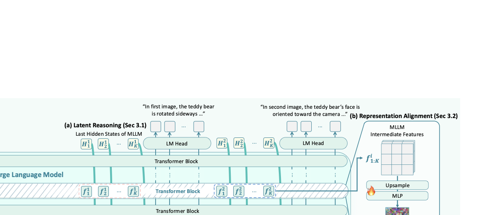
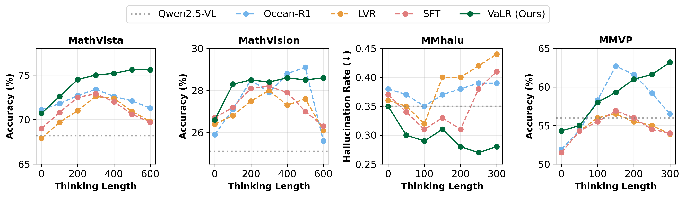
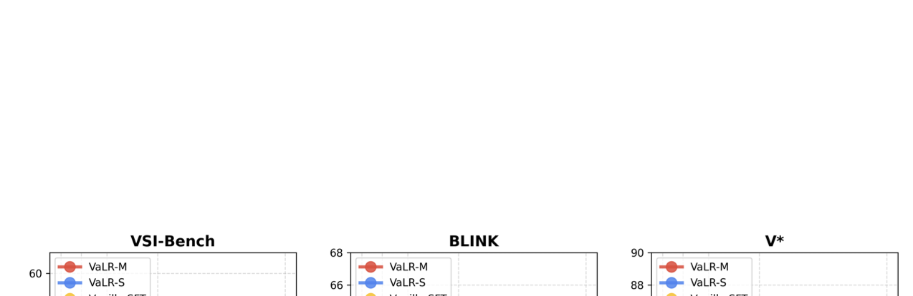

<!-- arxiv: 2602.04476 -->
<!-- venue: ICML 2026（投稿中） -->
<!-- tags: MLLM, 多模态推理, 潜在推理, 表征学习 -->

# Vision-aligned Latent Reasoning for Multi-modal Large Language Model

**Authors:** Byungwoo Jeon (KAIST), Yoonwoo Jeong (POSTECH), Hyunseok Lee (KAIST), Minsu Cho\* (POSTECH/RLWRLD), Jinwoo Shin\* (KAIST/RLWRLD)

**Project:** [rootyjeon.github.io/valr](https://rootyjeon.github.io/valr/)

---

## 核心贡献

1. **提出 VaLR（Vision-aligned Latent Reasoning）**：一种多模态推理框架，在 CoT 推理的每一步之前动态生成与视觉信息对齐的潜在 token（latent tokens），作为"视觉检查点"来保持推理过程中的视觉 grounding。
2. **REPA 表征对齐**：将 MLLM 中间层的 hidden states 与预训练视觉编码器（DINOv3、SigLIPv2、CLIP 等）的特征进行 patch-wise 余弦相似度对齐，鼓励潜在 token 编码视觉信息。
3. **多编码器对齐**：同时利用多个视觉编码器（如 DINOv3 + SigLIPv2 + π³）的互补表征，注入语义、空间和 3D 几何信息。
4. **两阶段课程训练**：Stage 1 标准 SFT 建立 CoT 推理基础 → Stage 2 插入潜在 token 并使用 REPA 损失训练。
5. **首次在 MLLM 上展现出 test-time scaling 行为**：随着推理长度增加，VaLR 性能单调提升，而基线方法逐渐退化。

---

## 动机与背景

### 问题

MLLM 在需要多步推理的任务（如 CUA、VLA）中表现不佳，根本原因是：**随着生成序列变长，视觉信号逐渐衰减（dilution of visual information）**，导致模型无法有效利用 test-time scaling。现有方法要么只增强文本推理而忽略视觉信号逐步衰减，要么仅在推理开始时提供一次性的静态视觉特征，缺乏动态的视觉信息回注机制。

### 相关工作对比

| 研究方向 | 代表工作 | 局限 |
|---------|---------|------|
| 文本 CoT + SFT/RL | Math-LLaVA, Flow-DPO | 视觉信号随序列增长衰减 |
| 交错视觉 token | DeepEyes, Machine-CoT | 仅使用静态单视角特征，一次性注入 |
| 潜在空间推理 | Monet, CoVT, LVR | 视觉信息仅作为固定初始上下文 |
| **VaLR（本工作）** | — | ✅ 每一步前动态注入视觉对齐的潜在 token |

---

## 方法详解

### 1. 潜在推理机制（Latent Reasoning）



VaLR 在推理过程中交替切换两种模式：

- **语言模式**：正常自回归生成文本 token，使用 token embedding 作为 Transformer 输入
- **潜在模式**：生成 K 个潜在 token，使用上一时刻的 hidden state `h_t` 作为下一时刻输入（而非 token embedding）

```
E_{t+1} = [E_t; h_t]           if 潜在模式
E_{t+1} = [E_t; e(x_{t+1})]    if 语言模式
```

- 模型预测 `<latent>` token 进入潜在模式
- 固定 K 步后（默认 K=16），预测 `</latent>` token 回到语言模式
- 最终通过 LM-Head 从 hidden state 解码文本输出

**核心思想**：每一步 CoT 推理步骤 `rⁱ` 之前插入 K 个潜在 token `[ℓ₁ⁱ, ..., ℓₖⁱ]`，形成：

```
v, q → (ℓ_{[1:K]}^(i), r^(i))_{i=1}^N → a
```

### 2. 表征对齐（REPA — Representation Alignment）

在潜在模式下，将 MLLM 中间层特征与外部视觉编码器的 patch-wise 特征对齐：

**对齐目标**：

```
L_REPA = -1/(N·P) · Σᵢ₌₁ᴺ Σₚ₌₁ᴾ sim( F̂_MLLMⁱ[p,:],  F_ϕⁱ[p,:] )
```

其中：
- `F_ϕⁱ`：视觉编码器 ϕ 对图像 Iⁱ 提取的 patch 特征，维度 R^(P×D)
- `F_MLLMⁱ`：MLLM 第 12 层（中间层）提取的 latent token 特征
- `F̂_MLLMⁱ = ψ(Upsample(F_MLLMⁱ))`：通过可学习 MLP ψ 投影到与视觉特征相同维度
- `sim(·,·)`：余弦相似度

**关键点**：
- REPA 仅用于训练阶段，推理时不使用外部视觉编码器
- 对齐使 MLLM 学会在潜在 token 中"内化"视觉信息

### 3. 多编码器对齐

利用不同视觉编码器的互补能力：

| 编码器 | 擅长能力 |
|-------|---------|
| CLIP / SigLIPv2 | 语义理解（semantics） |
| DINOv2/v3 | 细粒度外观 + 空间关系 |
| π³ | 3D 空间结构 |

多编码器 REPA 损失为各编码器 REPA 损失的均值：

```
L_REPA^multi = (1/M) · Σₘ₌₁ᴹ L_REPA^(m)
```

每个编码器有独立的可学习投影头 ψₘ。

### 4. 两阶段训练流程

**Stage 1：标准 CoT SFT（450K 样本）**

- 在预训练 MLLM 上进行标准 CoT 监督微调
- 冻结视觉编码器，仅训练解码器
- 损失：标准交叉熵 `L_CE`
- 数据集混合：Zebra-CoT、CogCoM、ReFocus、Visual-CoT、OneThinker-SFT、GCoT

**Stage 2：潜在 token 训练 + REPA（450K 样本）**

- 在每个推理步骤前插入 K=16 个潜在 token（首尾用 `<latent>` / `</latent>` 包裹）
- 总损失：`L = L_CE + λ·L_REPA`（λ = 0.5）
- 多视角数据：使用 GPT-4o 自动标注每个推理步骤对应的目标图像
- 交错数据：利用数据集中自然存在的图像插入位置

---

## 实验与结果

### 实验设置

- **基础模型**：Qwen2.5-VL-7B
- **默认对齐编码器**：DINOv3 (ViT-L)
- **VaLR-S**：单编码器对齐（DINOv3）
- **VaLR-M**：多编码器对齐（DINOv3 + SigLIPv2 + π³）
- **训练**：4× NVIDIA Tesla A100，DeepSpeed ZeRO-2

### 3D 空间推理（VSI-Bench）

| 方法 | Avg. | 相对距离 | 绝对距离 | 物体计数 |
|------|------|---------|---------|---------|
| GPT-4o | 34.0 | 37.0 | 5.3 | 46.2 |
| Qwen2.5-VL-7B | 33.0 | 38.6 | 14.8 | 40.9 |
| + vanilla SFT | 33.7 | 39.4 | 14.7 | 42.3 |
| + LVR | 18.4 | 35.1 | 3.6 | 21.4 |
| + CoVT | 18.6 | 35.9 | 2.3 | 16.5 |
| + Monet | 14.0 | 38.0 | 0.1 | 1.9 |
| **VaLR-S** | **41.5** | **43.9** | **24.5** | **49.0** |
| **VaLR-M** | **52.9** | **50.0** | **40.6** | **66.4** |

> **关键发现**：LVR、CoVT、Monet 等潜在推理 baselines 在 VSI-Bench 上崩溃（14-18%），因为没有视觉对齐，长推理下视觉信息完全丧失。VaLR-M 在 8 个子任务上全面 SOTA。

### 感知任务 Benchmark

| 方法 | BLINK | MMVP | MMStar | V\* | CVBench |
|------|-------|------|--------|-----|---------|
| GPT-4o | 63.0 | 68.7 | 65.2 | 42.9 | 79.2 |
| Qwen2.5-VL-7B | 55.7 | 56.0 | 67.1 | 76.4 | 74.5 |
| + LVR | 52.8 | 59.3 | 64.4 | 81.7 | 76.9 |
| + CoVT | 56.0 | 58.7 | 69.2 | 78.0 | 80.0 |
| + Monet | 49.1 | 50.0 | 53.3 | 83.3 | 71.1 |
| **VaLR-S** | **63.1** | **60.3** | **70.8** | **86.4** | **83.1** |
| **VaLR-M** | **64.7** | **60.3** | **72.3** | **86.9** | **87.6** |

> **关键发现**：VaLR 不仅在长上下文推理中提升显著，在短上下文感知任务上也全面优于 baseline，说明视觉 grounding 是通用能力。

### Test-time Scaling 行为



- 在 MathVista、MathVision、MMhalu、MMVP 四个 benchmark 上按推理长度分组
- **Baseline（Ocean-R1, LVR）**：在中等推理长度达到峰值后退化
- **VaLR**：随着推理长度增加，性能单调提升
- 在 MMVP 上，Ocean-R1 从 62.7% 崩溃到 56.5%（300 tokens），而 VaLR 持续保持高性能

---

## 消融与分析

### REPA 表征对齐的有效性

| 配置 | VSI-Bench | BLINK | V\* | CVBench |
|------|-----------|-------|-----|---------|
| Qwen2.5-VL-7B | 33.0 | 55.7 | 76.4 | 74.5 |
| VaLR w/o VA（无视觉对齐） | 34.0 | 57.1 | 75.9 | 73.4 |
| VaLR w/ QE（Qwen 原生编码器） | 39.6 | 58.9 | 81.7 | 81.6 |
| **VaLR w/ DINOv3** | **41.5** | **63.1** | **86.4** | **83.1** |

> 即使使用 Qwen 原生编码器（无外部编码器），VaLR 仍显著优于 baseline；外部编码器进一步增益。纯潜在推理（w/o VA）几乎无提升，说明视觉对齐是核心。

### 不同视觉编码器的通用性

| 对齐编码器 | BLINK | MMVP | MMStar | V\* | CVBench |
|-----------|-------|------|--------|-----|---------|
| Baseline | 55.7 | 56.0 | 67.1 | 76.4 | 74.5 |
| + CLIP | 62.3 | 59.3 | 71.0 | 83.2 | 79.1 |
| + SigLIPv2 | 62.8 | 59.7 | 71.3 | 83.2 | 81.9 |
| + DINOv2 | 62.7 | 60.0 | 70.7 | 83.8 | 81.8 |
| **+ DINOv3** | **63.1** | **60.3** | **70.8** | **86.4** | **83.1** |

> VaLR 对各种视觉编码器均有效，编码器越强则增益越大。

### 多编码器的互补效应

| π³ | DINOv3 | SigLIPv2 | VSI-Bench | BLINK | MMStar |
|----|--------|----------|-----------|-------|--------|
| ✗ | ✗ | ✗ | 33.0 | 55.7 | 67.1 |
| ✓ | ✓ | ✗ | 52.4 | 64.6 | 68.9 |
| ✗ | ✓ | ✓ | 41.9 | 62.5 | 72.0 |
| ✓ | ✓ | ✓ | **52.9** | **64.7** | **72.3** |

> π³ 主要提升 3D 任务（VSI-Bench），SigLIPv2 提升语义感知；三者结合最佳。

### 对齐层选择

- Front（第 4 层）：提升有限
- **Middle（第 12 层）**：效果最佳，与前人发现一致——视觉信息最显著地体现在 MLLM 中间层
- Last（第 27 层）：效果次之

### 数据扩展性



- 随着训练数据从 10K → 450K，VaLR 持续提升
- Vanilla SFT 在 200K 后饱和
- **VaLR-M 在 V\* 上达到同等性能所需的训练数据 ≤ Vanilla SFT 的 1/20**

### 推理效率

| 方法 | 32-view (s) | 1-view (s) |
|------|------------|------------|
| Qwen2.5-VL | 1.21 | 0.64 |
| + vanilla SFT | 1.43 | 0.68 |
| + LVR | 1.49 | 0.66 |
| + Monet | 1.51 | 0.79 |
| **+ VaLR** | **1.55** | **0.80** |

> VaLR 的推理开销很小（比 vanilla SFT 仅慢约 10%），且在推理时不需要外部视觉编码器。

---

## 总结与评价

### 方法亮点

1. **简洁有效**：通过在每步 CoT 前插入视觉对齐的潜在 token，以极小的推理开销实现了显著的性能提升
2. **首次展示 MLLM 的 test-time scaling**：基线在长推理中退化，VaLR 持续提升——这可能是 MLLM 推理方向的重要里程碑
3. **编码器通用性**：VaLR 框架适配于任何视觉编码器，且多编码器互补产生协同增益
4. **推理效率**：无需在推理时使用外部视觉编码器（对齐信息已内化到潜在 token 中），对比 input token 方法有明显效率优势

### 局限与思考

- **数据依赖性**：REPA 对齐需要每步推理对应的目标图像标注，多视角数据集需 GPT-4o 辅助标注，一定程度上引入了外部依赖
- **视觉编码器选择**：虽然对编码器通用，但论文未探索不同编码器组合的自动化选择策略
- **K 值上限**：K 增加到 25 仍有提升但边际收益递减，未探索更大 K 值是否饱和或退化
- **与 RL 推理的对比**：论文主要对比 SFT-based 推理方法，与 R1-style 的强化学习推理（如 R1-OneVision）的对比有限——后者在 VSI-Bench 上意外退步（16.1%），值得进一步分析
- **应用场景**：论文定位 VLA 和 CUA 是目标场景，但主要在 VQA benchmark 上验证，缺少真实 agent 环境中的评估

### 对未来工作的启示

- 视觉对齐的潜在推理为 MLLM 的 test-time scaling 开辟了新路径，可能启发将类似方法应用于视频理解、具身智能等需要长程视觉记忆的场景
- 多编码器对齐的可扩展性暗示：可以持续"外挂"更多专用感知模块来增强 MLLM 的特定视觉能力，而无需重新训练整个模型
