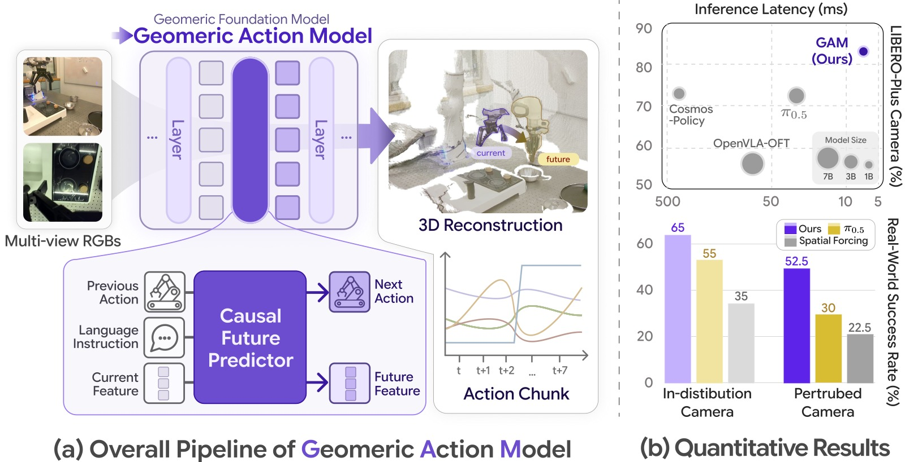
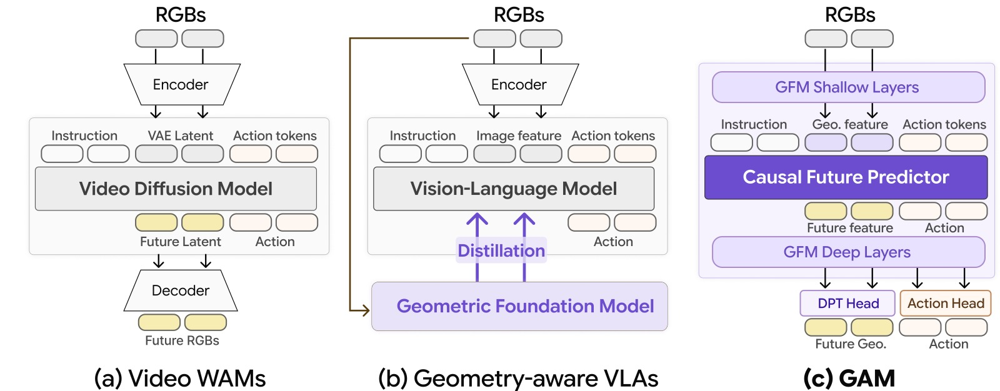
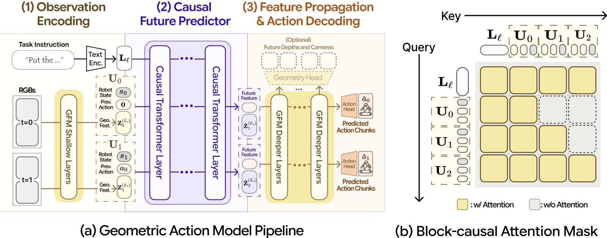
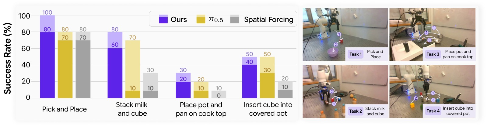
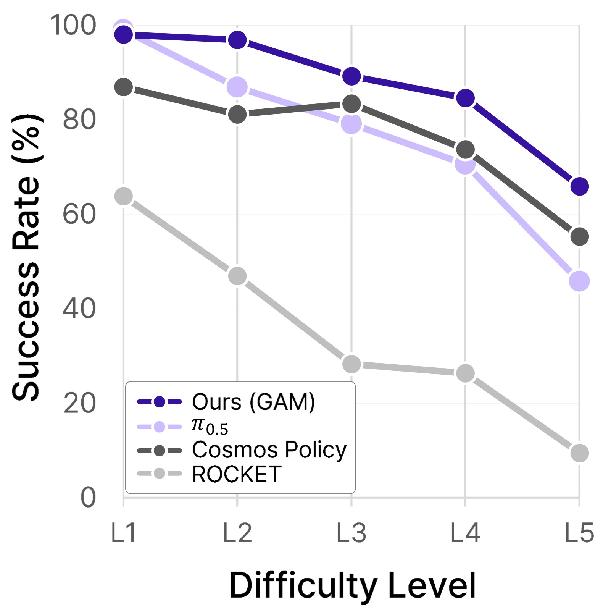
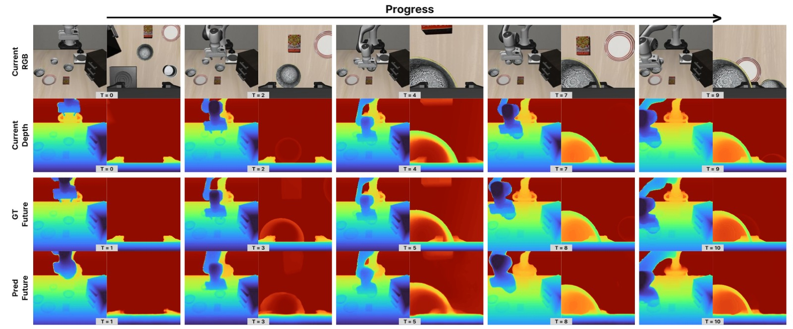
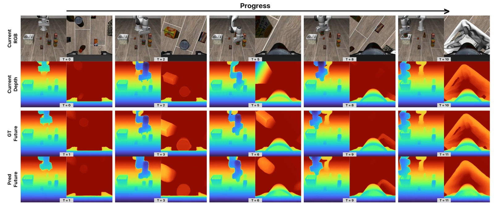
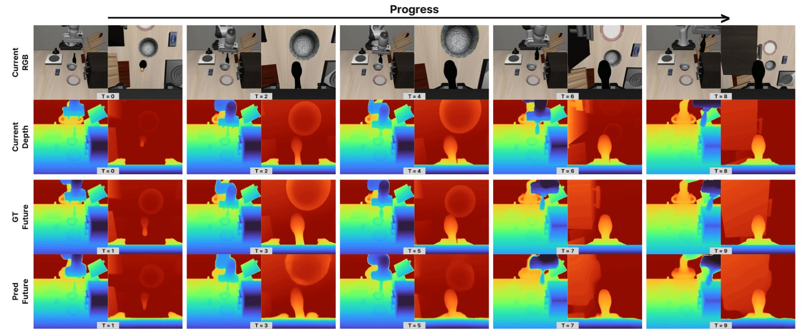
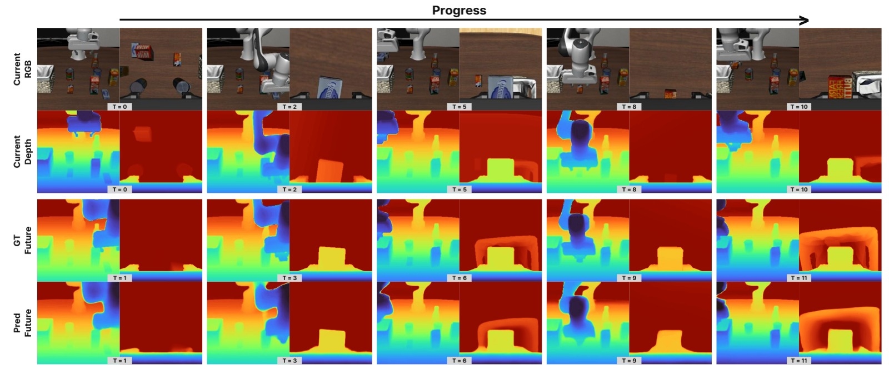
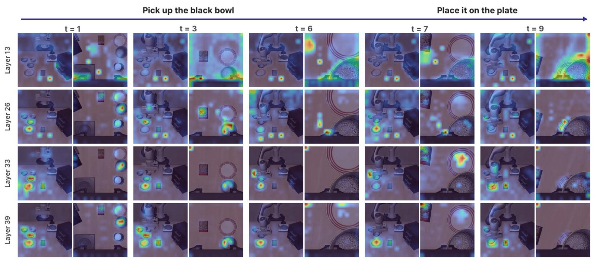

<!-- arxiv: 2606.17046 -->
<!-- venue: CoRL 2026（投稿，under review） -->
<!-- tags: VLA, 世界模型, 3D重建, 泛化, 强化学习 -->

# Geometric Action Model for Robot Policy Learning

> **论文信息**
> - 作者：Jisang Han\*、Seonghu Jeon\*、Jaewoo Jung、René Zurbrügg、Honggyu An、Tifanny Portela、Marco Hutter、Marc Pollefeys、Seungryong Kim†、Sunghwan Hong†
> - 通讯作者：Seungryong Kim（KAIST AI）、Sunghwan Hong（ETH AI Center）
> - 机构：KAIST AI / ETH Zurich / ETH AI Center
> - 投稿方向：CoRL 2026（投稿中，under review）
> - arXiv ID：2606.17046v1
> - 项目主页：https://cvlab-kaist.github.io/Geometric-Action-Model/
>
> 本文基于以下本地材料整理：
>
> - 论文 TeX 源码：`arXiv-2606.17046v1/`（主文件：`main.tex`，章节在 `sections/`）
> - 论文插图：`arXiv-2606.17046v1/figures/*.pdf`（关键图：`teaser3.pdf`、`arch3.pdf`、`compare2.pdf`、`real_task.pdf`、`camera_perturb.pdf`、`attention_layers_timestep_subset_pretendard_v4.pdf`）
> - 本文图片导出目录：`assets/GAM/`

---

## 一、核心问题

机器人操作策略需要同时理解语言指令、视觉外观、3D 场景几何、机器人状态和物理动力学。现有两类主流方法各有根本缺陷：

- **Vision-Language-Action Models (VLAs)**：继承 VLM 的语义先验，但本质上在 2D 图像空间工作，缺乏深度/遮挡/尺度的显式 3D 理解，导致面对相机视角变化、背景变化等场景扰动时泛化性差。
- **Video World-Action Models (WAMs)**：利用视频扩散模型预测未来帧和动作，但视频先验仍是 2D 像素空间，且扩散采样导致推理极慢（Cosmos Policy 需 382ms）。

已有工作尝试将几何基础模型（GFM）引入 VLA（Spatial Forcing、ROCKET），但只是把 GFM 当作**静态特征提取器**或**蒸馏信号来源**——GFM 的多层几何结构从未被真正用作策略自身的时序和动作生成主干。

**核心问题**：能否将预训练的几何基础模型（GFM）**整体重用**为机器人策略的感知-预测-解码共享骨干，同时获得 3D 几何先验、世界模型时序建模和高效推理三者？

---

## 二、核心思路 / 方法

### 2.1 整体设计直觉

**(a) 总览管线**：左侧展示 GAM 的核心流程——多视图 RGB 图像输入 GFM 浅层提取几何特征，Causal Future Predictor 接收当前几何特征、前序动作和语言指令，同时预测下一步动作（Next Action）和未来几何特征（Future Feature），未来特征再通过 GFM 深层生成 3D 重建。右侧曲线显示 action chunk 的时序输出方式（预测 t 到 t+7 共 8 步动作）。

**(b) 量化结果**：上方散点图横轴为推理延迟（ms，注意 X 轴反向，从大到小），纵轴为 LIBERO-Plus Camera 成功率。GAM（蓝色大点，右上角）同时达到最高成功率（~83%）和最低延迟（~7ms），而 Cosmos Policy 延迟超过 400ms；气泡大小对应模型参数量，GAM 以 1.4B 参数实现最优性能。下方柱状图为真实机器人实验结果，GAM（紫色）在 ID（正常相机）和 OOD（扰动相机）设置下均明显优于 π₀.₅（黄色）和 Spatial Forcing（灰色），ID/OOD 成功率分别为 65%/52.5% vs. 55%/30%（π₀.₅）。

### 2.2 方法对比：三种范式

**(a) Video WAMs**（Cosmos Policy、MIMIC 等）：输入 RGB → Encoder → 视频扩散模型，在 VAE latent 空间中同时预测 Future Latent 和 Action → Decoder → Future RGB。问题：2D 像素空间，扩散多步去噪极慢。

**(b) Geometry-aware VLAs**（Spatial Forcing、ROCKET）：输入 RGB → VLM Encoder → Vision-Language Model 输出 Action。GFM 仅通过 Distillation 向 VLM 注入几何特征，是**外挂**的特征提供者，未融入预测通路。问题：GFM 的几何结构被浪费。

**(c) GAM（本文）**：直接将 GFM 劈成两半，在分裂点插入 Causal Future Predictor。GFM 浅层 → Geo. feature → CFP（融合 language + action tokens）→ 预测 Future feature 和 Action token → GFM 深层（统一解码器）→ DPT Head 输出 Future Geo. / Action Head 输出 Action。**GFM 既是感知主干，也是世界模型的解码器**，一次前向传播完成所有计算。

### 2.3 GAM 架构详解

**(a) GAM 完整管线**（左图）：

三阶段串联，**全部在 GFM 一个骨干内完成**：

1. **Observation Encoding**：多视图 RGB 经 GFM 浅层（layers 1…L_s）编码成每时刻的几何 latent $\mathbf{Z}_{t'}^{(L_s)}$。每个时刻独立编码，输出上下文窗口 H 个时刻的 latent 序列。
2. **Causal Future Predictor**（紫色大块）：在 split layer $L_s=12$ 处插入 12 层因果 Transformer $g_\phi$，接受：
   - 任务语言 $\mathbf{L}_\ell$（frozen T5 编码）
   - 每时刻 block：$\mathbf{U}_{t'} = [\psi_s(s_{t'}); \psi_a(a_{t'-1}); \mathbf{Z}_{t'}^{(L_s)}]$（proprioception + 上一动作 + 几何 latent）
   - 使用 block-causal attention（右图所示），预测 $\tilde{\mathbf{Z}}_{t'+1}^{(L_s)}$（未来几何 latent）和 $\tilde{\mathbf{a}}_{t'}$（动作 token）
3. **Feature Propagation & Action Decoding**：动作 token 复制 V 份拼接到各视角几何 token，一起经过 GFM 深层（layers L_s+1…M），最终由 Action Head 回归动作 chunk，DPT Head 解码未来深度图。

**(b) Block-Causal Attention Mask**（右图）：黄色（w/ Attention）表示允许注意，灰色虚线（w/o Attention）表示被 mask。$\mathbf{L}_\ell$（语言）对所有时刻可见；每个时刻 block $\mathbf{U}_i$ 只能注意自身和之前的 block（因果），不能看未来——保证无 future leakage。这一设计直接借鉴 π₀ 的 block-causal attention。

### 2.4 数学形式

**问题形式化**：给定 H 帧历史观测 $o_{t-H+1:t}$、本体感觉状态 $s_{t-H+1:t}$、动作历史 $a_{t-H:t-1}$ 和语言指令 $\ell$，学习策略：

$$\pi_\theta\colon\big(\{o_{t-H+1}, \ldots, o_t\},\, \{s_{t-H+1}, \ldots, s_t\},\, \{a_{t-H}, \ldots, a_{t-1}\},\, \ell\big)\mapsto\hat a_t$$

其中 $\hat{a}_t \in \mathbb{R}^{C \times d_a}$ 为长度 $C=8$ 的动作 chunk，$d_a=7$（end-effector delta-pose）。

**GFM 分割**：

$$E_{\leq L_s} = f^{(L_s)} \circ \cdots \circ f^{(1)}, \qquad D_{>L_s} = f^{(M)} \circ \cdots \circ f^{(L_s+1)}$$

$L_s$ 的选取需满足：足够深以提取丰富特征，但浅于 DPT head 用到的最早层 $m_1$，保证预测的 future tokens 能被 DPT 解码。

**Causal Future Predictor 输入**：

$$\mathbf{p}_{t'} = \psi_s(s_{t'}), \quad \mathbf{q}_{t'} = \psi_a(a_{t'-1}), \quad \mathbf{U}_{t'}=[\mathbf{p}_{t'};\mathbf{q}_{t'};\mathbf{Z}_{t'}^{(L_s)}]$$
$$\mathbf{X} = [\mathbf{L}_\ell; \mathbf{U}_{t-H+1}; \ldots; \mathbf{U}_t]$$

**Feature Propagation**：

$$\tilde{\mathbf{Z}}_{t'+1}^{(M)} = D_{>L_s}\!\Big(\Big[\big[\tilde{\mathbf{Z}}_{1,t'+1}^{(L_s)};\, \tilde{\mathbf{a}}_{1,t'}\big], \ldots, \big[\tilde{\mathbf{Z}}_{V,t'+1}^{(L_s)};\, \tilde{\mathbf{a}}_{V,t'}\big]\Big]\Big)$$

---

## 三、训练目标

$$\mathcal{L}_{\text{total}} = \lambda_{\text{act}} \mathcal{L}_{\text{act}} + \lambda_{\text{feat}} \mathcal{L}_{\text{feat}} + \lambda_{\text{depth}} \mathcal{L}_{\text{depth}}$$

三项损失的权重为 $\lambda_{\text{act}}=3$、$\lambda_{\text{feat}}=1$、$\lambda_{\text{depth}}=3$。

| 损失项 | 含义 | 公式/说明 |
|--------|------|-----------|
| $\mathcal{L}_{\text{act}}$ | 动作回归损失 | 预测动作 chunk $\hat{a}_{t'}$ 与专家动作 $a_{t'}$ 的 $\ell_1$ 距离，对上下文窗口内所有时刻求和 |
| $\mathcal{L}_{\text{feat}}$ | 未来特征预测损失 | $\sum_{t'\in\mathcal{H}} \|\tilde{\mathbf{Z}}_{t'+1}^{(L_s)} - \mathbf{Z}_{t'+1}^{(L_s)}\|_1$，将预测的未来 latent 对齐到冻结 GFM 编码的真实下一帧 latent |
| $\mathcal{L}_{\text{depth}}$ | 未来深度预测损失 | DPT head 解码的预测未来深度图 $\tilde{D}_{t'+1}$ 与 GT 未来深度 $D_{t'+1}$ 之间的 scale-invariant + gradient-matching 损失（继承 GFM 原始深度损失） |

**直觉**：$\mathcal{L}_{\text{feat}}$ 迫使预测器学习几何时序转移（"世界将如何变化"）；$\mathcal{L}_{\text{depth}}$ 进一步将预测锚定到有效 3D 结构，防止 latent 预测漂移到无意义空间。

---

## 四、实验与结果

### 4.1 实现细节

| 组件 | 配置 |
|------|------|
| GFM 主干 | DA3-Giant（在 Track4World 上微调） |
| 分割层 | $L_s=12$（帧内注意力切换为全局注意力的边界） |
| 因果预测器 | 12 层 Transformer，宽度 $d_g=1024$ |
| 语言编码器 | frozen T5 |
| 上下文窗口 | 预训练 $H=4$，后训练 $H=1$ |
| 动作 chunk 长度 | $C=8$，$d_a=7$（7DoF end-effector）|
| 本体感觉维度 | $d_s=7$ |
| 总参数量 | 1.4B（可训练 983.2M） |
| 预训练数据 | 784K 轨迹（OXE 72% + MimicGen 18% + RoboCasa365 10%） |
| 预训练算力 | 64× GH200，~96h |
| 后训练算力 | 16× GH200，~48h |

### 4.2 主实验：LIBERO & LIBERO-Plus

LIBERO-Plus 在标准 LIBERO 训练集上训练，**零样本**评估 7 种扰动（相机视角、机器人初始位置、语言改写、光照、背景、传感器噪声、场景布局）。

| 方法 | 规模 | Orig. | Plus | Cam. | Robot | Lang. | Light | BG | Noise | Layout |
|------|------|-------|------|------|-------|-------|-------|-----|-------|--------|
| π₀.₅ | 3.3B | 96.9 | **84.6** | 72.0 | **76.6** | **86.5** | 96.1 | **95.2** | 86.7 | **86.0** |
| OpenVLA-OFT | 7B | 97.1 | 69.6 | 56.4 | 31.9 | 79.5 | 88.7 | 93.3 | 75.8 | 74.3 |
| π₀ | 3.3B | 91.3 | 69.3 | 61.0 | 40.8 | 63.7 | 89.3 | 84.1 | 80.1 | 75.9 |
| Cosmos-Policy | 2B | **98.5** | 82.4 | **73.4** | 63.3 | **89.3** | **98.9** | 83.5 | **89.3** | 84.0 |
| π₀.₅ + Spatial Forcing | 3.3B | 94.0 | 25.7 | 0.1 | 0.3 | 26.8 | 66.0 | 45.9 | 0.1 | 59.8 |
| π₀.₅ + ROCKET | 3.3B | 95.3 | 47.5 | 30.9 | 75.6 | 29.3 | 69.2 | 47.0 | 25.4 | 62.0 |
| **GAM（Ours）** | **1.4B** | **97.6** | **🥇85.5** | **🥇83.1** | 🥈70.0 | 🥉84.8 | 🥈97.2 | 🥈94.3 | **🥇95.3** | 🥉79.1 |

> **关键发现**：GAM 在 LIBERO-Plus 整体成功率（85.5%）上超越所有对手，在 Camera 扰动上以 83.1% 高出第二名（Cosmos Policy 73.4%）整整 **+9.7%p**。尽管 Geometry-aware VLA 方法理论上也利用了 GFM，但 Spatial Forcing 在 Camera 扰动下几近崩溃（0.1%），ROCKET 也仅 30.9%——说明"蒸馏"式使用 GFM 远不如 GAM 的"重用"式使用。

### 4.3 推理效率

| 方法 | 规模 | 延迟 |
|------|------|------|
| Cosmos Policy | 2B | 382.4ms |
| OpenVLA-OFT | 7B | 77.8ms |
| π₀.₅ | 3.3B | 29.2ms |
| **GAM（Ours）** | **1.4B** | **6.9ms（≈145Hz）** |

GAM 使用 CUDA Graphs 加速后达到 6.9ms，是 Cosmos Policy 的 **55× 加速**。原因：GAM 是单次前向传播，无需扩散多步去噪，且通过 KV 缓存在线维护历史上下文（推理时每步只处理最新一帧）。

### 4.4 真实机器人实验

左侧柱状图展示四个任务（Pick and Place、Stack milk and cube、Place pot and pan on cook top、Insert cube into covered pot）在 ID（正常相机，浅色）和 OOD（扰动相机，深色）下的成功率。三种方法（紫色=GAM、黄色=π₀.₅、灰色=Spatial Forcing）各评估 20 trials（10 ID + 10 OOD）。

关键数据：
- **Pick and Place**：GAM ID 100% / OOD 80%，π₀.₅ 80%/70%，Spatial Forcing 80%/70%——ID 下差距不大，OOD 下 GAM 仍保持 80%
- **Stack milk and cube**：GAM 80%/60%，π₀.₅ 70%/10%，Spatial Forcing 10%/10%——GAM 在这个需要精准接触的任务中 OOD 优势巨大（60% vs. 10%）
- **Place pot and pan on cook top**：GAM 30%/20%，π₀.₅ 20%/10%，Spatial Forcing 30%/0%
- **Insert cube into covered pot**：GAM 50%/40%，π₀.₅ 50%/30%，Spatial Forcing 20%/10%

右侧四张图像展示四项任务的机器人执行流程，每图标注动作序列（①②③步骤），包括 Franka 机械臂配置的抓取、堆叠、插入等操作。

> 真实机器人结果验证了仿真中观察到的泛化性：GAM 在相机扰动设置（OOD）下相较所有基线保持更高成功率，说明几何先验对真实场景的 domain gap 同样有效。

---

## 五、关键洞察与技术亮点

### 5.1 消融实验

**组件消融（LIBERO-Object suite）**：

| 预训练 | $\mathcal{L}_{\text{depth}}$ | $\mathcal{L}_{\text{feat}}$ | H | Orig. SR (%) | Plus SR (%) |
|--------|-----|-----|---|------|------|
| ✓ | ✓ | ✓ | 1 | **99.6** | **89.7** |
| ✓ | ✓ | ✓ | 2 | 97.2 | 84.4 |
| ✓ | ✓ | ✓ | 4 | 98.2 | 85.1 |
| ✓ | ✗ | ✓ | 1 | 98.4 | 89.0 |
| ✓ | ✗ | ✗ | 1 | 98.6 | 89.5 |
| ✓ | ✓ | ✗ | 1 | **99.6** | **89.7** |
| ✗ | ✓ | ✓ | 1 | 98.4 | 73.4 |
| ✗ | ✗ | ✓ | 1 | 95.2 | 66.5 |
| ✗ | ✓ | ✗ | 1 | 96.4 | 80.0 |
| ✗ | ✗ | ✗ | 1 | 93.6 | 50.0 |

洞察：
1. **预训练是最关键因素**：去掉预训练后 LIBERO-Plus 从 89.7% 崩溃到最低 50%（-39.7%p），而 LIBERO Orig. 只轻微下降——说明预训练主要贡献鲁棒性，而非基本任务能力。
2. **几何监督（$\mathcal{L}_{\text{depth}}$/$\mathcal{L}_{\text{feat}}$）在无预训练时作用显著**：无预训练 + 只加 $\mathcal{L}_{\text{depth}}$ 可将 LIBERO-Plus 从 50% 提升到 80%——说明即使无法用大规模预训练，未来几何预测作为辅助监督本身就有强正则效果。
3. **上下文长度 H=1 最优**：更长历史（H=2/4）反而降低鲁棒性，与先前研究一致——历史上下文引入虚假相关性。

**Split Layer 消融**：

| Split layer $L_s$ | Orig. (%) | Plus (%) |
|---|---|---|
| 0 | 5.4 | 1.8 |
| **12** | **99.6** | **70.1** |
| 19 | 95.6 | 63.4 |
| 27 | 1.2 | 1.6 |
| 33 | 0.0 | 0.0 |
| 39 | 0.0 | 0.0 |

$L_s=12$ 恰好是 GFM 中帧内注意力（frame-wise attention）与全局注意力（global attention）交替的边界。插入太早（$L_s=0$）或太晚（$L_s\geq27$）均导致完全崩溃——预测的 tokens 需要经过足够多的深层 GFM blocks 才能被正确整合进预训练的 3D 几何先验。

### 5.2 相机扰动难度曲线

横轴为 LIBERO-Plus 相机扰动的难度等级 L1→L5（L1=轻微，L5=最大扰动），纵轴为成功率（%）。对比四条曲线：

- **GAM（深蓝虚线）**：L1 起点 ≈98%，随难度上升缓慢下降，L5 仍保持约 65%，全程始终居首
- **π₀.₅（浅紫线）**：L1 ≈100%，但下降更陡，L5 约 46%
- **Cosmos Policy（深灰线）**：L1 约 87%，趋势与 GAM 相近，L5 约 55%，但整体低于 GAM
- **ROCKET（浅灰线）**：L1 仅约 63%，急剧下降，L5 约 10%——几乎完全失效

GAM 的曲线斜率最小，说明其几何先验对视角变化具有真正的尺度不变性，而非仅依赖纹理相关性。

### 5.3 未来深度图预测可视化

<table><tr>
<td width="50%"> <em>LIBERO Suite 1：pick-and-place 类任务</em></td>
<td width="50%"> <em>LIBERO Suite 2</em></td>
</tr><tr>
<td width="50%"> <em>LIBERO Suite 3</em></td>
<td width="50%"> <em>LIBERO Suite 4</em></td>
</tr></table>

每张图展示四行：第一行 Current RGB（当前帧 RGB，T=0/2/4/7/9），第二行 Current Depth（GFM 解码的当前帧深度图），第三行 GT Future（下一帧的真实深度图，T=1/3/5/8/10），第四行 Pred Future（GAM 预测的未来深度图）。

颜色映射：蓝色=近（机器人末端/物体近距离），红色=远（桌面/背景）。对比第三行 GT 和第四行 Pred，GAM 准确预测了机器人末端执行器的运动轨迹（蓝色区域在 Pred Future 中的位置与 GT 高度吻合），以及物体位移后的深度变化。这证明因果预测器确实学到了几何时序动态，而非仅仅复制当前帧。

### 5.4 注意力可视化

图中展示 "Pick up the black bowl → Place it on the plate" 任务（9 个时步）在 Layer 13/26/33/39 的 action token 注意力热图（热图叠加在 RGB 帧上，红/黄色=高注意力，蓝色=低注意力）。

- **Layer 13**（最浅）：注意力分散，关注较大场景区域，在 t=6（转换点）开始聚焦到目标 plate
- **Layer 26**（中层）：注意力更集中，t=1-6（拾取阶段）热点明显落在 bowl 位置，t=7-9（放置阶段）热点转移到 plate
- **Layer 33**（较深）：在接触点附近保持较精准的注意力聚焦，尤其在 t=3 和 t=7 关键帧
- **Layer 39**（最深）：注意力更弥散，但对 plate 的注意力保持，说明高层仍保留任务相关 context

这一可视化与 split layer 消融结论一致：中层（Layer 13-26 之间，即 $L_s=12$ 对应区域）保留了对象级结构，而深层用于 action token 的精细化（refinement），两者缺一不可。

---

## 六、局限性

1. **语言推理能力受限于冻结 T5 编码器**：GAM 的语言指令处理仅靠 T5 frozen 特征，缺乏大语言模型的常识推理和多步规划能力。集成外部推理模块或 LLM 是自然的下一步。
2. **真实场景深度监督依赖伪标签**：真实机器人实验中无法获取 GT 深度，只能用预训练 GFM 自身的输出作为 pseudo-label，存在 self-training 偏差。
3. **未探索更大规模 GFM**：现有实验基于 DA3-Giant（1.4B），更大 GFM 在数据/模型 scaling 下的表现未知。
4. **多视角数量固定**：当前固定为 2 个视角（外部相机 + 腕部相机），动态数量视角下的泛化性未测试。

---

## 七、关键概念速查

| 术语 | 解释 |
|------|------|
| GFM（Geometric Foundation Model） | 从多视图 RGB 估计稠密 3D 几何的前馈 Transformer，如 VGGT、DA3 |
| DA3-Giant | Depth Anything v3 Giant，作为 GAM 主干的 GFM |
| Split layer $L_s$ | GFM 被分割的中间层编号（$L_s=12$），浅层做编码器，深层做解码器 |
| Causal Future Predictor | 插入 split layer 的 12 层因果 Transformer，预测未来几何 latent 和动作 token |
| Block-causal attention | 时刻 block 之间的因果 mask，防止 future leakage |
| LIBERO-Plus | 在 LIBERO 训练集上零样本评估 7 种场景扰动的鲁棒性基准 |
| Action chunk | 模型一次预测的未来 $C=8$ 步动作序列，开环执行后再观测 |
| KV cache | 推理时缓存历史 key-value，每步只处理新帧，实现 6.9ms 推理 |
| DPT head | Dense Prediction Transformer 解码头，将 GFM 多层特征融合为像素级深度图 |
| Track4World | 用于微调 DA3-Giant 的额外预训练数据集 |
