<!-- arxiv: 2606.17846 -->
<!-- venue: Qwen Technical Report 2026 -->
<!-- tags: VLA, 泛化 -->

# Qwen-RobotManip Technical Report: Alignment Unlocks Scale for Robotic Manipulation Foundation Models

> **论文信息**
> - 作者：Qwen Team
> - 发布：Qwen Technical Report 2026
> - arXiv ID：2606.17846
> - 代码：论文未提供相邻官方代码仓库；本文主要基于 TeX 源码、图表和技术报告中的系统描述整理。
>
> 本文基于以下本地材料整理：
>
> - 论文 TeX 源码：`arXiv-2606.17846v2/`（主文件：`colm2024_conference.tex`，章节目录：`chapter/*.tex`）
> - 论文插图：`arXiv-2606.17846v2/figures/*.pdf`
> - 官方代码：未在本地笔记目录中提供
> - 本文图片导出目录：`assets/qwen-robotmanip/`

---

## 一、核心问题

这篇技术报告讨论的问题可以概括为：**机器人操作 VLA 模型想从“小数据 imitation policy”扩展到“跨任务、跨场景、跨具身 foundation model”，真正缺的不是单纯扩大参数量，而是让不同数据源在状态、动作、相机、语言和具身语义上可对齐。**

已有通用 VLA 模型通常会遇到三类瓶颈：

| 瓶颈 | 具体表现 | Qwen-RobotManip 的切入点 |
|---|---|---|
| 数据异构 | 不同机器人、相机、坐标系、动作接口无法直接混训 | 统一 80 维 canonical state/action，并把 EEF action 放到 camera frame |
| 泛化评测弱 | LIBERO、RoboTwin 等 IID benchmark 上 scratch 模型也能很高 | 强调 LIBERO-Plus、RoboTwin-Clean2Rand、RoboTwin-IF、RoboTwin-XE、RoboCasa365 等 OOD setting |
| 数据规模不足 | 机器人遥操作数据昂贵，跨具身覆盖有限 | 将 1,933h 第一视角人类手部视频合成为 15 种机器人形态，得到 24,808h H2R demonstrations |

论文最重要的判断是：**scale 必须建立在 alignment 之上**。如果机器人数据没有统一动作语义，扩展数据量只会把互相矛盾的控制信号混在一起；如果人类视频没有动作和视觉双重对齐，直接混入也只能增加视觉多样性，无法稳定提升操作策略。

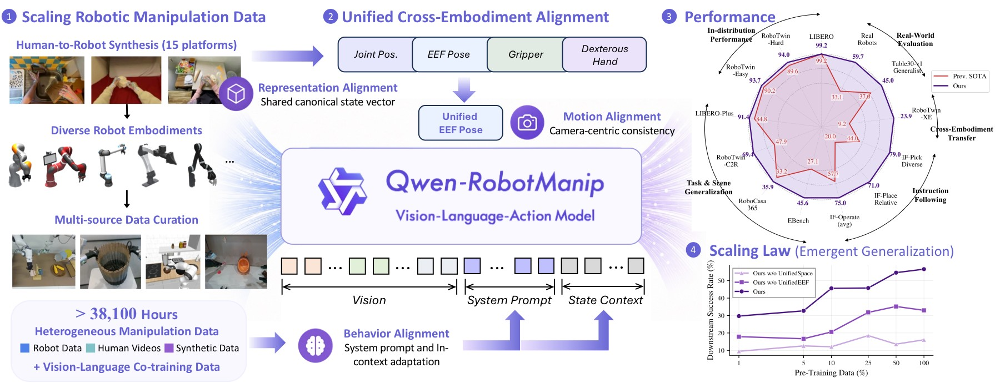

*图 1：Qwen-RobotManip 的整体路线图。画面左侧是数据扩展：开源机器人数据、第一视角人类操作视频和 Human-to-Robot 合成数据共同构成大规模 manipulation corpus；中间是 Qwen-VL backbone 加 flow-matching action head 的 VLA 模型；右侧是跨 benchmark、跨真实机器人和 RoboChallenge 的评测摘要。*

- **数据层**：图中把 robot data、human manipulation video、Human-to-Robot synthesis 放在同一条扩展路径上，强调这不是简单收集更多 demonstration，而是先做动作/视觉对齐，再把 human hand trajectories 转成 robot trajectories。
- **模型层**：Qwen-VL 负责图像、语言和上下文理解，DiT action expert 负责连续动作生成。这个分工让通用 VLM 能力通过 hidden states 注入 action denoising，而不是把动作当作普通文本 token 生成。
- **评测层**：右侧结果不是只展示标准仿真任务，而是覆盖 OOD、instruction following、cross-embodiment、real-world 和 challenge tasks。它对应论文反复强调的观点：foundation policy 应该用迁移和鲁棒性衡量，而不是只看 IID 成功率。

---

## 二、核心思路与方法

### 2.1 总体架构：VLM 做理解，DiT 做动作生成

Qwen-RobotManip 基于 Qwen-VL/Qwen3.5 视觉语言骨干，输入包括多视角图像、语言指令、结构化 embodiment prompt、当前 state，以及可选的 episode 内历史 context。动作头是一个 flow-matching Diffusion Transformer：10 个 transformer blocks，hidden dim 768，12 heads，用 4-step Euler integration 生成 action chunk；context 版本在消融中通常需要 10 step 才稳定。

```text
multi-view images + instruction + embodiment prompt + state/history
        │
        ▼
Qwen-VL backbone
        │  last-layer hidden states
        ▼
Flow-Matching DiT Action Expert
        │  alternating cross-attention
        ▼
80D canonical action chunk
```

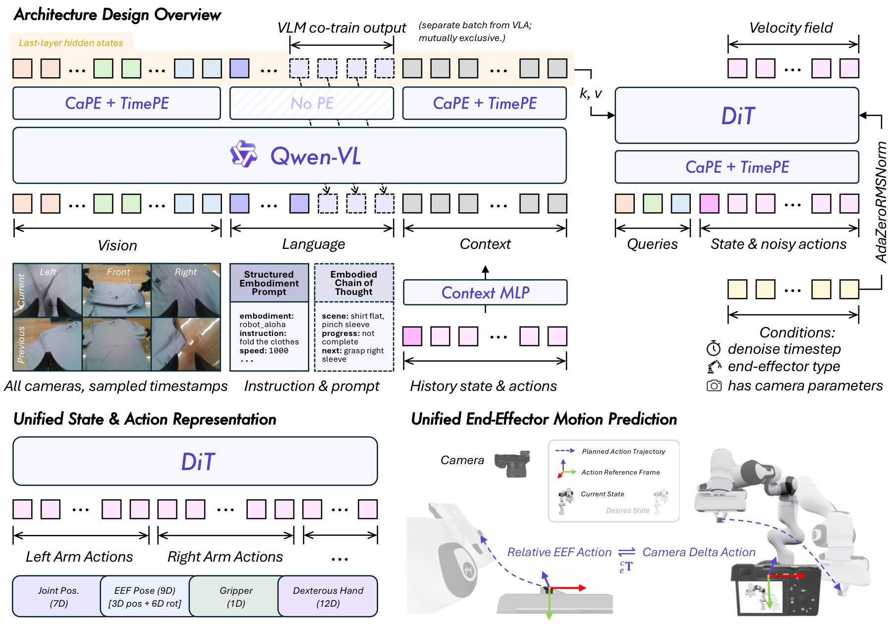

*图 2：Qwen-RobotManip 的模型与动作表示总览。图中上方是 Qwen-VL backbone，下方是 DiT action expert；左侧强调 multi-view observation、structured embodiment prompt 和 history context；右侧展示 80 维统一状态/动作空间以及 camera-frame delta EEF action。*

- **结构拆解**：Qwen-VL 先把多视角图像、语言和上下文编码成 token 表示，DiT action expert 再在去噪过程中通过 cross-attention 读取这些表示。论文采用 alternating cross-attention：偶数层更偏视觉 token，奇数层更偏语言 token，使动作生成既能关注几何状态，也能保留任务语义。
- **动作表示**：80 维 canonical vector 由两个 29 维 arm block 加 22 个预留维度组成。每个 arm block 包括 7 维 joint positions、9 维 EEF pose、1 维 gripper state 和 12 维 dexterous hand joints。不同机器人只填充自己有意义的维度，其余 zero-pad，并用 binary mask 屏蔽无效 loss。
- **关键对齐点**：EEF action 不使用世界坐标或机器人 base frame，而使用 camera-frame delta pose。这样图像中相似的“向左夹取”“靠近目标”等运动，在数值动作空间里也更接近，有利于跨相机、跨机器人、跨数据源共享。
- **为什么这张图重要**：它解释了论文标题中 alignment 的具体含义。alignment 不是一个单独模块，而是贯穿状态/动作语义、相机坐标、prompt 结构和历史上下文注入的系统设计。

### 2.2 80 维统一状态/动作空间

传统做法常把不同机器人的动作字段直接拼接，或者为每个机器人设计单独 action head。Qwen-RobotManip 的做法是先定义一个统一语义空间：

| 组成 | 维度 | 含义 |
|---|---:|---|
| 左臂 block | 29 | joint、EEF pose、gripper、dexterous hand joints |
| 右臂 block | 29 | 与左臂同构 |
| 预留维度 | 22 | 为移动底盘、未来传感器或扩展控制量留接口 |
| 总计 | 80 | 所有机器人都投影到这个 canonical space |

这个设计的直觉是：不同机器人虽然几何不同，但许多操作语义是共享的。例如双臂抓取、夹爪闭合、末端朝目标移动，都可以在同一个语义 slot 中表达。zero-padding 加 mask 保证没有的自由度不参与监督，避免模型把空维度当成动作规律。

### 2.3 Camera-frame delta EEF：让视觉相似的动作数值也相似

论文把 EEF action 表示成相机坐标系下的 delta pose，而不是常见的 robot-base frame 或局部 EEF frame。其动机是机器人学习中的数据对齐问题：同一个“从图像左侧移到目标上方”的动作，在不同机器人 base 坐标系里可能数值方向完全不同；但从相机视角看，它们具有相似的视觉几何。

```text
传统：robot base frame action
  同一视觉动作 -> 不同机器人坐标值差异大

Qwen-RobotManip：camera-frame delta EEF
  同一视觉动作 -> 更接近的数值 delta
```

论文还在 DiT 中加入 camera positional encoding，并把 camera type、EEF type、auxiliary flag 作为条件。auxiliary flag 用于处理没有相机标定的数据：有标定时使用 camera-frame delta，没有标定时退回 robot-base relative mode。这一点很实际，因为大规模开源机器人数据并不总是提供完整相机外参。

### 2.4 In-context policy adaptation

Qwen-RobotManip 还引入 episode 内历史上下文：过去的 observation、state、action chunk 会作为 context tokens 注入 VLM。它的作用不是语言模型意义上的长时记忆，而是让 policy 从少量历史交互中隐式识别当前机器人/环境的运动学风格。

训练时采用 stochastic context sampling，随机抽取 episode 内历史片段，避免模型简单复制最近动作。消融显示 context 对 robot perturbation、RoboTwin-Clean2Rand Hard 等设置帮助明显，但也带来推理稳定性要求：4 denoise steps 时 context 模型会 jitter，10 steps 后才稳定，20 steps 相比 10 steps 收益不大。

---

## 三、数据与训练

### 3.1 机器人数据、第一视角视频和 H2R 合成

Qwen-RobotManip 的 manipulation corpus 约 38,100 小时，核心由三部分构成：

| 数据类型 | 规模 | 作用 |
|---|---:|---|
| Robot single-arm | 3,808h | 覆盖单臂抓取、放置、工具使用等基础操作 |
| Robot dual-arm | 6,744h | 提供双臂协同、长程组合任务和 bimanual manipulation |
| Robot mobile & humanoid | 868h | 扩展移动机器人和人形平台经验 |
| Human hands | 1,933h | 提供第一视角人类操作视觉和动作意图 |
| Human-to-Robot | 24,808h | 将人类视频合成为 15 种双臂机器人演示 |

机器人数据来自 9 个开源数据源，包括 OXE、AgiBotWorld-Beta、RoboMIND/RoboMIND2.0、Galaxea Open-World、RoboCOIN、DROID、RH20T、RDT-1B 和 InternData-A1。人类数据来自 EgoDex、VITRA、EgoVerse。

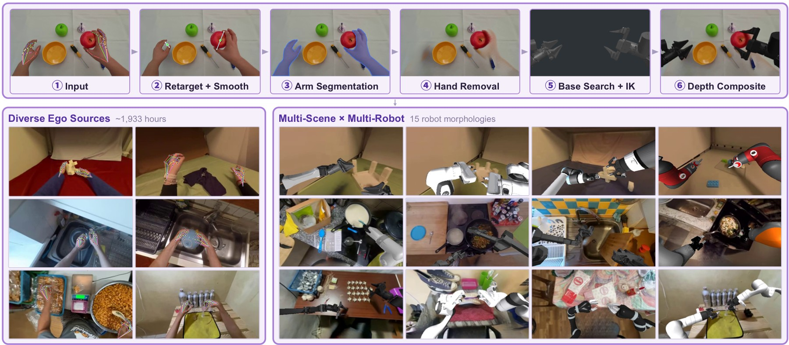

*图 3：Human-to-Robot pipeline。上半部分展示从人手轨迹到机器人轨迹的 action alignment，下半部分展示视觉对齐和 15 种机器人形态的批量渲染。*

- **动作对齐**：系统从 MANO hand keypoints 构造虚拟手指，把 thumb 与 index/middle 的加权虚拟指尖映射到 gripper center、orientation 和 width。position/width 用 Savitzky-Golay 平滑，orientation 用 Gaussian-weighted SLERP 平滑，减少人手轨迹抖动对机器人 IK 的影响。
- **视觉对齐**：图中依次包含 SAM3 手臂分割、ProPainter 人手 inpainting、MuJoCo IK 渲染机器人、Depth Anything v3 遮挡合成。它不是只把机器人贴到图上，而是尝试处理手臂遮挡、深度关系和目标接触区域。
- **规模扩展**：1,933h 第一视角人类视频被渲染成 Panda、UR5e、ARX-L5、xArm7、Sawyer、Kinova Gen3、IIWA、Jaco、FR3、UR10e、ViperX、WidowX、Piper、YAM、AgileX ALOHA 等 15 种双臂 morphology，最终得到 24,808h H2R demonstrations。
- **为什么这张图重要**：它解释了 Qwen-RobotManip 的数据规模不是靠私有大规模 teleoperation，而是靠“人类视频动作重定向 + 视觉合成”扩展开源数据。后续消融显示 H2R 相比只加 raw ego video 更能提升 camera/viewpoint 泛化。

### 3.2 数据清洗：不能让 scale 放大噪声

大规模机器人数据最危险的问题是 state/action 与视频不一致。论文使用五阶段 state-action signal filtering：sudden change detection、state-action trend alignment、extreme value filtering、joint-EEF FK consistency、base frame and EEF orientation alignment。一个典型例子是 RoboMIND UR-type 数据中有 81% episode 存在 state-action misalignment，被过滤掉。

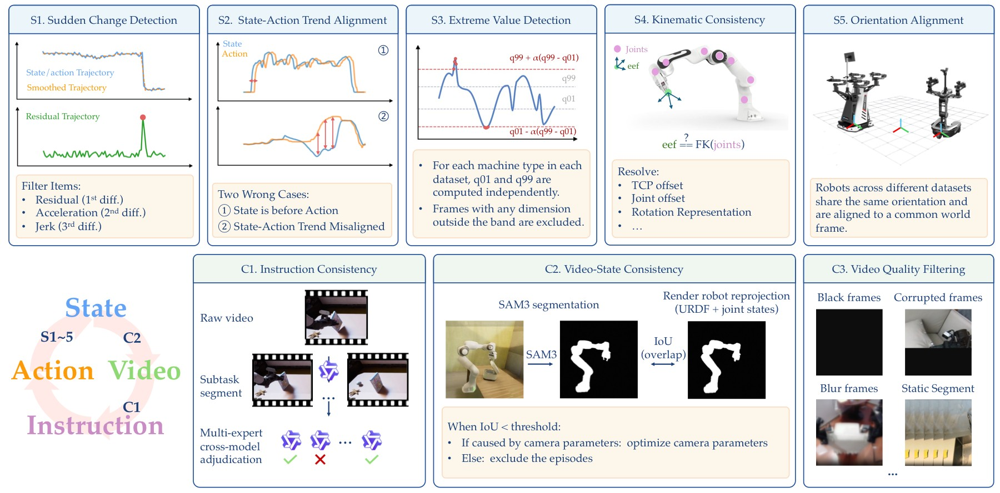

*图 4：数据清洗流程图。左侧是五阶段 state-action signal filtering，右侧是跨模态质量检查，包括 instruction consistency、video-state consistency 和 video quality filtering。*

- **state-action 过滤**：图中曲线和阈值示意展示了从突变、趋势错位、极值、FK 不一致到 base/EEF orientation 不一致的逐层筛查。它解决的是机器人数据中最常见的“看起来像一条 demo，实际动作标签不可信”的问题。
- **video-state consistency**：论文使用 URDF 渲染机器人投影，再与 fine-tuned SAM3 分割出的真实 robot mask 做重叠比较。如果视频中的机械臂位置和状态重建不一致，这条样本会被降权或剔除。
- **跨模态检查**：instruction consistency 和 video quality filtering 保证语言指令、视觉内容、动作轨迹三者一致。对于 VLA 模型，语言错配会直接训练出错误 grounding，因此这一环节和动作清洗同等重要。
- **与方法主张的关系**：这张图支持论文“alignment unlocks scale”的另一面：scale 不只是数量，还是把错误坐标、错误指令和错误视频关系过滤掉后的有效规模。

### 3.3 双流训练：VLA 与 VLM co-training

预训练阶段包含两个 stream：VLA robot stream 和 VLM vision-language stream，比例为 9:1。VLA 使用 masked flow matching loss，VLM 使用 next-token prediction loss，总 loss 为：

$$L = L_{FM} + \lambda L_{VLM}, \quad \lambda=0.1$$

动作扩散训练中，同一个 action chunk 重复采样 8 次 noise 和 timestep（`K_repeat=8`），提高 flow matching 对不同噪声水平的覆盖。SFT 阶段只优化 flow matching，不再使用 VLM next-token loss；mixed post-training 可混入 VL 数据和相近分布的预训练 VLA 数据，缓解 VLA-to-VA degradation。

---

## 四、实验与结果

### 4.1 标准 IID benchmark 不是充分证据

论文先用 LIBERO / RoboTwin-Easy / RoboTwin-Hard 说明一个容易被忽视的问题：标准 benchmark 可能无法区分 foundation policy 和强 scratch policy。

| 模型 | LIBERO | RoboTwin-Easy | RoboTwin-Hard |
|---|---:|---:|---:|
| pi0 | 94.4 | 65.9 | 58.4 |
| pi0.5 | 97.6 | 82.7 | 76.8 |
| StarVLA | 98.0 | 85.7 | 87.3 |
| Abot-M0 | 98.6 | 86.1 | 85.1 |
| Being-H0.7 | 99.2 | 90.2 | 89.6 |
| Qwen-RobotManip-scratch | 98.2 | 88.7 | 88.4 |
| Qwen-RobotManip | 99.1 | 93.4 | 92.5 |
| Qwen-RobotManip-Context | 99.2 | 93.7 | 94.0 |

scratch 模型在这些任务上也很高，因此论文后续重点转向 OOD、instruction following 和 cross-embodiment。

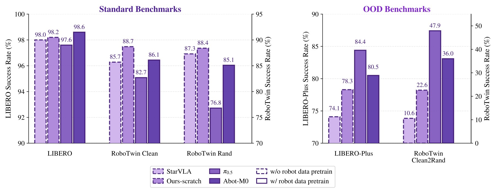

*图 5：IID benchmark 诊断。左侧展示 LIBERO / RoboTwin 标准设置下 scratch 模型也能接近 pretrained model；右侧展示 LIBERO-Plus / RoboTwin-Clean2Rand 等 OOD setting 才能拉开差距。*

- **左侧信息**：标准任务的场景、物体和动作分布相对固定，模型只要有足够 imitation 容量就能学到高成功率。Qwen-RobotManip 虽然仍领先，但领先幅度不足以说明 foundation capability。
- **右侧信息**：当相机、背景、布局、物体 clutter 或 robot embodiment 被扰动后，scratch 模型下降明显，预训练模型和 context 版本优势扩大。
- **评测启示**：论文不是回避 IID 高分，而是把它作为反例说明：如果 benchmark 不改变任务分布，就很难判断大规模预训练是否真正带来泛化。

### 4.2 OOD 泛化、指令跟随与跨具身

| 评测 | 关键结果 | 结论 |
|---|---|---|
| LIBERO-Plus | Ours 89.0，Ours-Context 91.4，pi0.5 84.4 | context 对 Robot perturbation 从 75.5 提升到 83.9 |
| RoboTwin-Clean2Rand Hard | Ours joint 62.6，Ours-Context joint 69.4，pi0.5 47.9 | clutter 和随机外观下预训练收益明显 |
| RoboCasa365 | Ours Total 35.9，RLDX-1 33.2，pi0.5 16.9 | Composite-Unseen 14.9 接近 RLDX-1 的 3 倍 |
| EBench | Ours SR / Score = 45.6 / 60，pi0.5 = 27.1 / 41 | 背景、指令、物体、混合扰动下更稳 |
| RoboTwin-IF | Ours Avg 72.2，pi0.5 Avg 49.6 | 对 verb、target、relative place 的语言区分更强 |
| RoboTwin-XE | Ours eef Total 23.9，pi0.5 eef 7.5 | camera-frame EEF 带来 3.2x zero-shot transfer |

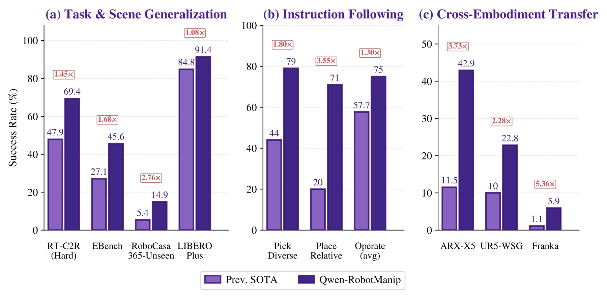

*图 6：OOD 结果总结。图中按 task/scene generalization、instruction following、zero-shot cross-embodiment 三条轴比较 Qwen-RobotManip 与 prior SOTA。*

- **左侧 task/scene generalization**：LIBERO-Plus、RoboTwin-Clean2Rand、RoboCasa365 都不是简单重复训练分布，而是改变相机、布局、背景、任务组合或物体状态。Qwen-RobotManip 的优势集中出现在这些分布偏移设置中。
- **中间 instruction following**：RoboTwin-IF 不是只看能否抓到东西，而是用动词、目标物和相对位置区分指令。Ours 在 Pick-Diverse、Place-Relative、Mic-Drawer、Operate-Tabletop 等任务上比 pi0.5 高 27 到 37 点，说明语言 grounding 不只是模板匹配。
- **右侧 cross-embodiment**：RoboTwin-XE 中 ARX-X5、UR5-WSG、Franka Panda 都是 unseen embodiments。Ours eef 的平均成功率 23.9 仍不高，但已经是 pi0.5 eef 7.5 的 3.2 倍，说明 camera-frame delta EEF 确实改善了零样本迁移。
- **需要保留的边界**：Franka 上 Ours eef 只有 5.9，说明跨具身迁移还远未解决；论文的贡献是明显提升，而不是宣称已经通用。

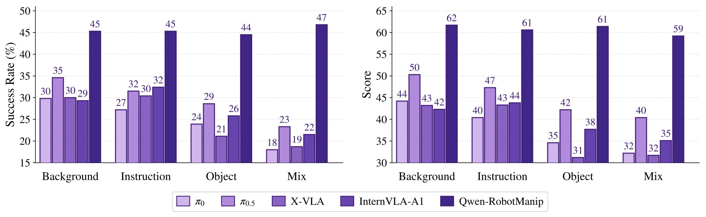

*图 7：EBench 的 operating mode、horizon、precision 与扰动维度拆解。图中柱状图比较多个 VLA baseline 与 Qwen-RobotManip，包含 tabletop、simple pick-and-place、long-horizon 等设置。*

- **任务类型拆解**：Ours 在 Table Top 上达到 50.0 / 70，而 pi0.5 为 12.9 / 32；在 Simple PnP 上 Ours 56.5 / 60，X-VLA 50.0 / 54；Long Horizon 上 Ours 29.9 / 55，pi0.5 18.1 / 39。长程任务仍难，但优势没有只局限在短程抓放。
- **扰动维度**：pi0.5 从 Background 34.6 掉到 Mix 23.3；Ours 在 44.5 到 46.8 区间基本不掉，Mix 46.8 甚至高于单独 Background 45.3。这说明模型并非只适配某一种扰动，而是对组合扰动也保持稳定。
- **论文论点连接**：EBench 支持“大规模预训练 + 对齐表示”提升 OOD 鲁棒性，而不是只提升标准任务成功率。

### 4.3 真实机器人和 RoboChallenge

真实 CobotMagic ALOHA ID 设置中，Ours 平均成功率 88.6%，pi0.5 为 42.9%，StarVLA 为 20.0%。OOD 设置中，Ours 87.5%，pi0.5 37.5%，StarVLA 0.0%。ARX ALOHA few-shot 任务中，Ours 在 4/5 任务领先，但 Insert Screw 仍只有 10.0%，所有模型 full insertion 都是 0/10。

RoboChallenge Table30-v1 Generalist Track 中，Ours 成功率/过程分为 45 / 59.83，DM0_generalist 为 37 / 48.43，pi0.5_generalist 为 17.67 / 31.27。相对 DM0 的成功率提升约 20%。但 UR5 子集上 DM0 58.3 / 66.2，高于 Ours 51.7 / 60.9，需要避免写成每个机器人都第一。

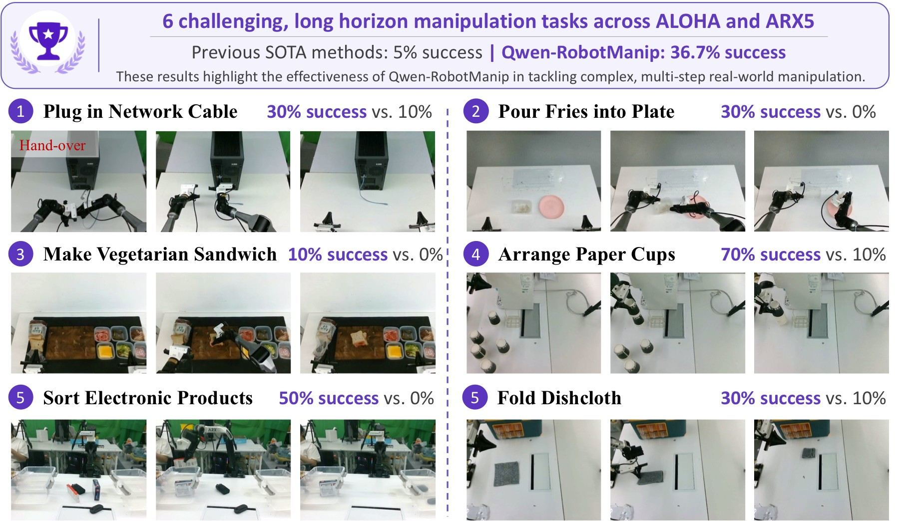

*图 8：RoboChallenge 六个长程挑战任务和真实机器人案例摘要。图中包含 Network Cable、Fries into Plate、Sandwich、Paper Cups、Electronic Products、Dishcloth 等任务，每个任务给出多帧执行过程和成功率对比。*

- **任务结构**：这些任务不是单步 pick-and-place，而是包含双臂协调、包装打开、物体整理、分类、重复尝试等长程操作。图中每行的连续帧展示从初始状态到完成状态的过程，而不是单张成功截图。
- **关键数字**：六个挑战长程任务中，prior SOTA generalist 平均约 5%，Qwen-RobotManip 达到 36.7%。这比标准 benchmark 更能体现复杂任务迁移能力。
- **失败与成功对照**：case study 中 DM0 或 pi0.5 常在初始协调、物体卡住、掉落后恢复等环节失败；Qwen-RobotManip 能在某些任务中重试并恢复，例如 ARX5 sort electronic products 中两次掉落后第三次成功。
- **边界条件**：真实实验数量仍有限，更多是部署能力和 qualitative robustness 证据，不应把它解读为所有开放环境下的统计性胜利。

---

## 五、关键图表解读

### 5.1 跨具身 zero-shot：EEF 表示比 joint 表示更关键

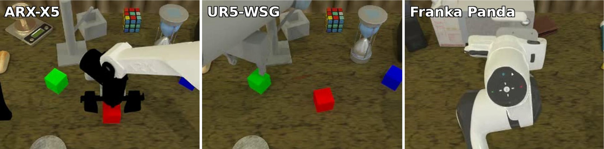

*图 9：RoboTwin-XE 评测场景，展示 ARX-X5、UR5-WSG 和 Franka Panda 三种 unseen embodiments。图中红/绿/蓝标记用于区分任务目标、末端执行器或关键物体位置。*

- **图像结构**：三列分别对应三种未见机器人。每个场景都保留 tabletop manipulation 的基本任务语义，但机械臂外观、夹爪形态和运动学约束不同。
- **结果含义**：pi0.5 joint 在 ARX-X5 / UR5-WSG / Franka 上为 24.6 / 2.2 / 0.9，总分 9.2；pi0.5 eef 总分 7.5。Ours joint 总分 14.5，Ours eef 总分 23.9，其中 UR5 上 Ours eef 22.8 是 Ours joint 4.1 的 5.6 倍。
- **为什么重要**：跨具身不是简单换一张机器人图片。模型必须把视觉目标和新机器人末端运动对应起来。camera-frame EEF 把动作表达和相机观察绑定，使“图像中的接近/离开/夹取”更容易跨机器人复用。

### 5.2 Scaling：只有对齐后的动作空间才吃得到数据规模

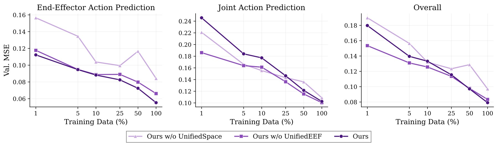

*图 10：不同 state/action representation 的数据 scaling curves。曲线比较 w/o UnifiedSpace、w/o UnifiedEEF 和完整 Ours 在 EEF/Joint action prediction 上随数据规模变化的 MSE。*

- **坐标含义**：横轴是训练数据规模或训练阶段，纵轴是 action prediction MSE。论文关注的不是单点 MSE，而是数据规模扩大时曲线是否稳定下降。
- **主要趋势**：w/o UnifiedSpace 的 EEF MSE 曲线更高且不稳定，说明直接拼接不同机器人原始动作字段会让模型看到互相不对齐的监督信号。加入 UnifiedSpace 后曲线更接近 log-linear scaling，进一步加入 UnifiedEEF 后下游成功率更好。
- **论文论点连接**：这张图是标题中 “Alignment Unlocks Scale” 最直接的证据。没有统一语义空间时，更多数据不一定带来更清晰的学习信号；对齐之后，scale 才更像可预测地转化为性能。

### 5.3 Mixed post-training：VL 数据和 UnifiedEEF 需要配合

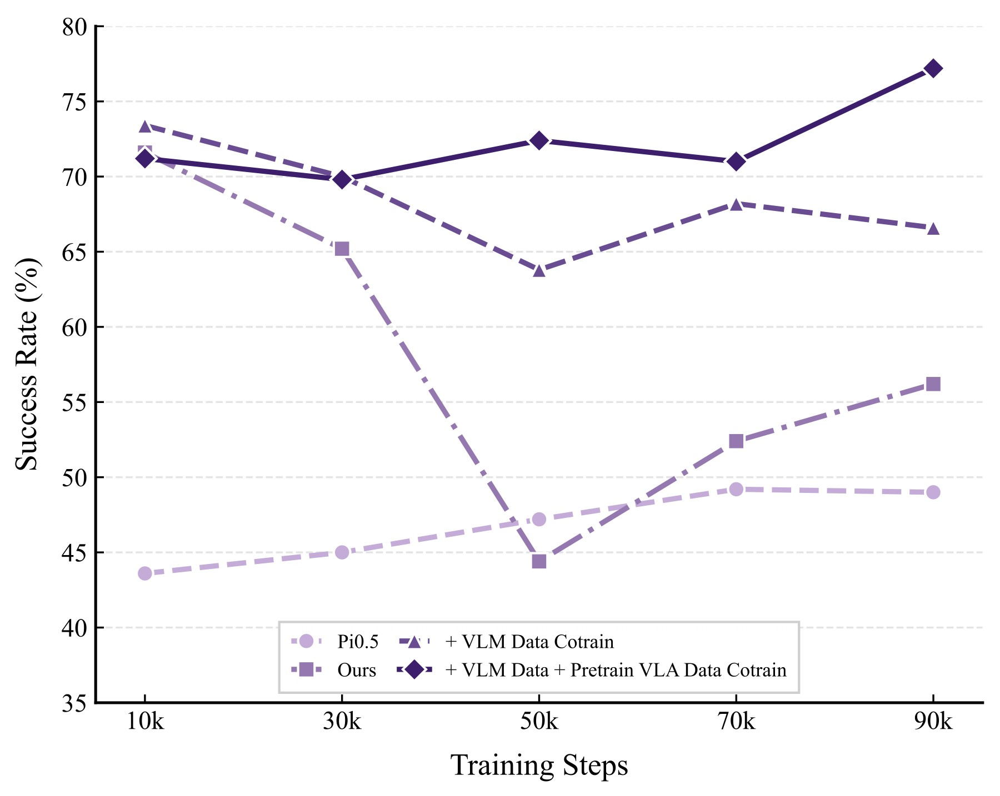

*图 11：RoboTwin-IF 上不同 post-training 数据组合随训练步数的表现。曲线比较只做 domain SFT、加入 10% VL data、再加入 auxiliary VLA pretraining data 等设置。*

- **横纵轴含义**：横轴是 post-training steps（10k 到 90k），纵轴是 RoboTwin-IF success rate。RoboTwin-IF 是指令跟随测试，因此能观察模型是否因为 domain SFT 而丢失语言区分能力。
- **主要现象**：只用 RoboTwin-Clean 做 domain SFT 时，训练步数增加会出现过拟合和 IF 表现下降；加入 10% VL data 可以缓解不稳定；再加入 auxiliary VLA pretraining data 后，RoboTwin-IF 随训练继续提升。
- **进一步条件**：另一张 `mixedposttrain.jpg` 显示 UnifiedEEF 是 mixed post-training 的必要条件。去掉 UnifiedEEF baseline 从 71.6% 降到 35.0%；没有 UnifiedEEF 再混合数据会 collapse 到 0.0%；完整 UnifiedEEF + mixed pretraining 可到 75.8%。
- **结论**：语言能力、动作对齐和后训练数据配比是耦合的。不能只把 VL 数据当作额外正则项，如果底层动作空间没有对齐，混合训练甚至可能崩溃。

---

## 六、系统实现 / 工程接口 / 部署

虽然本地没有官方代码仓库，论文仍给出了足够明确的系统接口。

```text
Observation stream:
  multi-view RGB + camera calibration + current robot state

Prompt stream:
  embodiment name + instruction + speed + fps + camera view direction

Context stream (optional):
  past observation/state/action chunks sampled from same episode

Action stream:
  80D canonical action chunk -> robot-specific control adapter
```

部署时，真实机器人通过 WiFi 把 observation 发送到远程服务器，服务器运行 VLA 推理并返回 action chunk。系统使用 Real-Time Chunking：机器人执行当前 chunk 的同时，服务器异步生成下一个 chunk，以隐藏网络和云端推理延迟。

这种接口的工程含义是：Qwen-RobotManip 并不要求每台机器人都重训一个单独模型，而是要求每台机器人能提供三个适配层：状态/动作到 80 维 canonical space 的映射、相机标定或 fallback action frame、embodiment prompt 字段。真正困难的工程部分从“改模型结构”转移到“保证数据和控制接口对齐”。

---

## 七、局限性

- Human-to-Robot 合成依赖 retargeting、inpainting 和 depth-guided compositing，合成伪影或错误 IK 会限制数据质量上限。
- OOD 仿真评测更强，但仍不能完全替代大规模真实世界部署。
- camera-frame EEF 依赖相机内外参；没有标定时需要退回 robot-base relative mode，跨具身收益会下降。
- context 模型在 episode 开始时缺少历史，只能 zero padding，真实部署中可能有启动迟疑；论文因此同时发布 context-free 和 context 版本。
- 精密接触任务仍明显困难：ALOHA yellow-disc-insertion 只有 2/5；ARX Insert Screw full insertion 所有模型都是 0/10。
- zero-shot 跨具身还远未解决：RoboTwin-XE Franka 上 Ours eef 只有 5.9%。
- RoboChallenge 中不是每个机器人都领先，UR5 子集 DM0_generalist 高于 Ours。
- 部分表格区分 Ours、Ours-Context、joint、eef，引用数字时必须明确配置。

---

## 八、关键概念速查

| 概念 | 含义 |
|---|---|
| UnifiedSpace | 把不同机器人状态/动作映射到统一 80 维语义空间 |
| UnifiedEEF | 使用 camera-frame delta EEF action，让视觉相似动作在数值空间也更接近 |
| In-context policy adaptation | 用 episode 内历史 observation/state/action 作为隐式机器人和环境适配信号 |
| Human-to-Robot synthesis | 从第一视角人类操作视频重定向到机器人轨迹并渲染成 robot demonstrations |
| VLA/VLM co-training | 9:1 混合 robot stream 和 vision-language stream，保留语言和视觉理解能力 |
| Mixed post-training | 后训练时混入 VL 数据和辅助 VLA 预训练数据，缓解 IF 和 VLA-to-VA 退化 |
| RoboTwin-IF | 测试模型能否区分动词、目标物和相对位置的指令跟随 benchmark |
| RoboTwin-XE | 测试 zero-shot cross-embodiment transfer 的 benchmark |
