<!-- arxiv: 2606.18112 -->
<!-- venue: Qwen Technical Report 2026 -->
<!-- tags: 导航, VLA, 自动驾驶, 多模态理解 -->

# Qwen-RobotNav Technical Report: A Scalable Navigation Model Designed for an Agentic Navigation System

> **论文信息**
> - 作者：Qwen Team
> - 发布：Qwen Technical Report 2026
> - arXiv ID：2606.18112
> - 代码：论文未提供相邻官方代码仓库；本文主要基于 TeX 源码、图表和技术报告中的系统描述整理。
>
> 本文基于以下本地材料整理：
>
> - 论文 TeX 源码：`arXiv-2606.18112v1/`（主文件：`colm2024_conference.tex`，章节目录：`Section/*.tex`，表格目录：`Tables/*.tex`）
> - 论文插图：`arXiv-2606.18112v1/figures/*.pdf`、`*.jpg`
> - 官方代码：未在本地笔记目录中提供
> - 本文图片导出目录：`assets/qwen-robotnav/`

---

## 一、核心问题

Qwen-RobotNav 讨论的问题是：**怎样把 VLN、PointNav、ObjNav、Tracking、自动驾驶等导航任务统一成一个可被外层 agent 调用的导航模型，而不是为每个任务设计独立 policy？**

论文的答案不是增加复杂模块，而是把导航任务重写成一个统一接口：

```text
observation context + task instruction + task mode
        -> K=8 future waypoints, each (x, y, theta)
```

更关键的是，Qwen-RobotNav 不是孤立 policy，而是为 agentic navigation system 设计的 executor。外层 LLM planner 可以根据长程目标选择任务模式、调整视觉 token budget、改变时间衰减、选择相机权重，并把每次 rollout 压缩成 evidence memory。

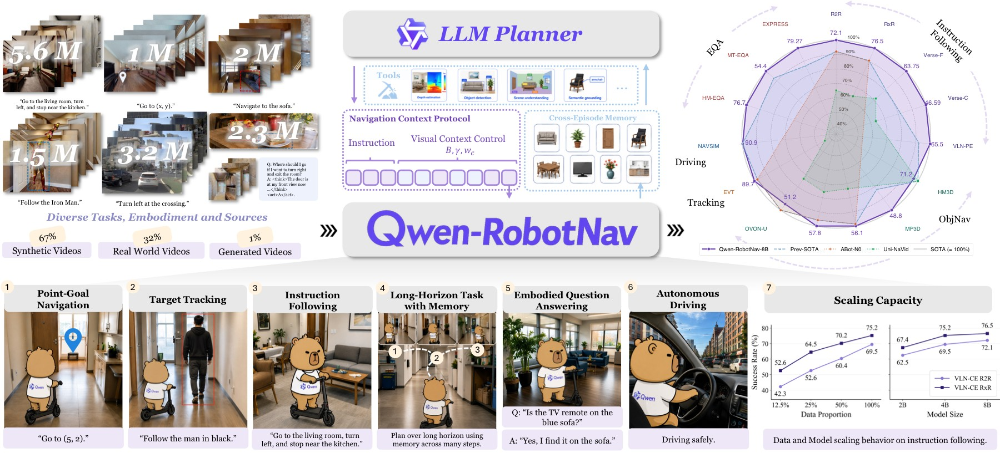

*图 1：Qwen-RobotNav 的系统总览。图中左侧是 15.6M 多任务训练数据，中间是统一 waypoint prediction 模型，右侧是 agentic navigation context protocol：LLM planner 调用 Qwen-RobotNav、辅助视觉工具和 memory notebook。*

- **数据层**：左侧把 instruction following、PointNav、ObjectNav、Tracking、autonomous driving、general VL 和 navigation reasoning 放在同一训练池中，总规模 15.6M samples。
- **模型层**：中间强调所有任务最终都输出 waypoint trajectory，而不是在 VLN 输出动作 token、在 PointNav 输出坐标、在 driving 输出轨迹时各做一套 head。
- **系统层**：右侧展示 planner、navigation calls、trajectory evidence、memory updates 的闭环。Qwen-RobotNav 是 reactive executor，外层 agent 负责长程目标分解和证据管理。
- **为什么重要**：这张图解释了标题里的 “designed for an agentic navigation system”。模型的可扩展性不只来自训练数据规模，也来自观察上下文可参数化，能被上层 planner 动态重配置。

---

## 二、核心思路与方法

### 2.1 统一 waypoint prediction

Qwen-RobotNav 基于 Qwen3-VL，继承 SigLIP-2 ViT、动态分辨率、2D-RoPE、patch merger、DeepStack 等视觉语言能力。所有导航任务输出 `K=8` 个未来 waypoints，每个 waypoint 为 `(x, y, theta)`，总共 24 维。动作头只是一个轻量 4 层 MLP，hidden dim 512，GELU；主要空间推理仍由 VLM/LLM backbone 承担。

```text
images + prompt + task mode + context tags
        │
        ▼
Qwen3-VL backbone
        │
        ▼
4-layer MLP action head
        │
        ▼
8 waypoints: (x, y, theta) x 8
```

训练目标是 trajectory MSE 加 VL next-token loss，`lambda=1.0`。waypoint 按各数据集 99th percentile scale 归一化到 `[-1, 1]`，推理时再反归一化。

### 2.2 Task-adaptive observation encoding

Qwen-RobotNav 的核心不是新网络结构，而是把 observation context 变成可控参数：

$$\Phi = (B, \gamma, \{w_c\}, m, b_{min}, b_{max})$$

| 参数 | 含义 | 论文设置 / 例子 |
|---|---|---|
| `B` | 总视觉 token budget | 训练范围 2048 到 4096 |
| `gamma` | 时间衰减，越大越偏近期帧 | 训练范围 1 到 3；`gamma=2` 时最新帧约为最旧帧 7.4 倍权重 |
| `w_c` | 相机权重 | front/right/back/left 可设为 `[2.0, 1.0, 0.5, 1.0]` |
| `m` | 帧采样模式 | `random` 覆盖长历史，`latest` 偏局部反应 |
| `b_min` / `b_max` | 每图 token 下限/上限 | 训练时分别随机采样 1-8 和 128-256 |

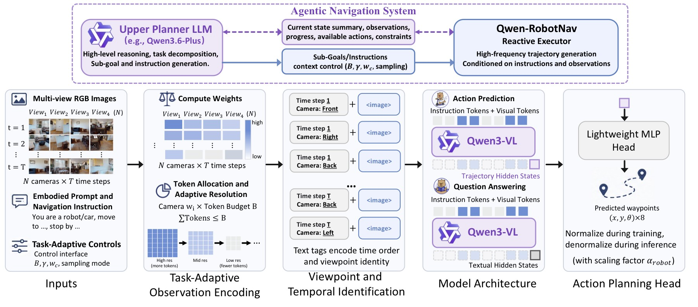

*图 2：Qwen-RobotNav pipeline。上半部分展示 agentic planner 选择 task-adaptive context parameters；下半部分展示多视角 RGB、embodied prompt、instruction、token allocation、temporal/viewpoint tags、Qwen3-VL backbone 和 MLP action head。*

- **观察编码流程**：系统先按时间衰减和相机权重分配 token，再把每个 `(time, camera)` cell 编码为带自然语言标签的图像输入，例如 `Time step 0 Front View <image>`。相机身份、时间顺序和具身差异都通过语言 tag/preamble 表达，而不是新增专用 embedding。
- **token allocation**：算法先给每个 cell 最小 token，再按 `omega_t * w_c` 分配剩余 token；超过 `b_max` 的 surplus 会迭代重分配。这使模型可以在同一结构下处理短程 tracking、长程 VLN 和多相机 driving。
- **planner 接口**：上层 agent 可以按任务切换 `Phi`。例如 target tracking 更偏 latest frames 和高 front camera weight；长程 VLN 需要保留更长历史，不能把所有 token 都给最近画面。
- **论文论点连接**：这张图说明 Qwen-RobotNav 的“多任务统一”不是把所有图片硬塞给 VLM，而是让观察上下文成为可调资源。

### 2.3 Agentic navigation system

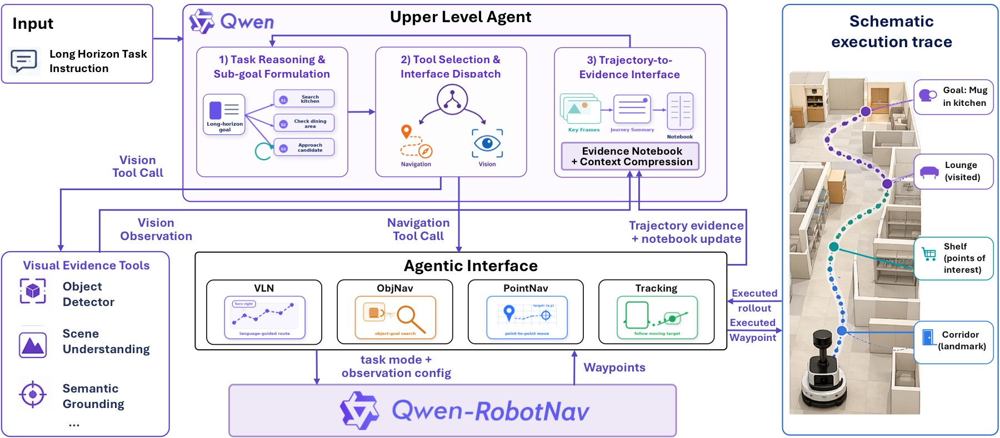

*图 3：agentic navigation 系统。外层 planner 把长程任务拆成 sub-goals，调用辅助视觉工具或 Qwen-RobotNav；每次导航调用带 instruction、task mode、observation config；harness 回传 key frames、trajectory summaries 和 evidence notebook updates。*

- **两级角色**：Qwen3.6-Plus 或 Qwen3.5-Plus 作为 planner，负责长程任务分解、工具选择和 memory 管理；Qwen-RobotNav 作为 executor，负责根据当前 observation 和指令输出 waypoints。
- **调用形式**：一次导航调用可写成 `nav_qwennav(L_i, tau_i, Phi_i)`，其中 `L_i` 是局部语言目标，`tau_i` 是 task mode，`Phi_i` 是观察配置。
- **记忆机制**：系统维护单次 rollout 的 compact trajectory evidence，以及跨 episode 的 evidence notebook。记录内容包括已搜索区域、候选目标位置、被否定假设、landmark cue、关键帧 ID 和 outcome。
- **工具边界**：object detection、scene understanding、semantic grounding 等辅助视觉工具只提供证据，不替代 Qwen-RobotNav 做 waypoint prediction。

---

## 三、数据与训练

### 3.1 15.6M 多任务训练样本

训练数据总规模 15.6M samples，其中约 85% 是导航轨迹数据，15% 是视觉语言和导航推理数据。

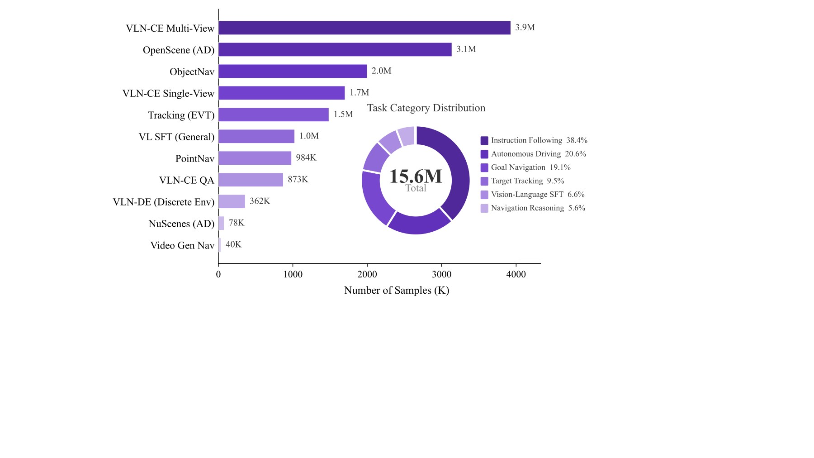

*图 4：数据分布。左侧柱状图列出各数据源 sample counts，右侧环形图汇总 task category，总计 15.6M。*

- **Instruction following**：5.63M，包括 VLN-CE R2R 1,491K 和 RxR 4,140K，是最大数据源之一。
- **PointNav / ObjectNav / Tracking**：PointNav 984K，ObjectNav 2,000K，Target tracking 1,486K。它们分别训练坐标目标、开放词表目标搜索和目标跟踪能力。
- **Autonomous driving**：约 3.2M supervision instances，包括 nuScenes 78K 和 OpenScene 3,138K。同一轨迹可生成多种 conditioning variant。
- **视觉语言和推理数据**：general VL 约 1.0M，navigation-specific reasoning 873K，discrete multi-round navigation 362K。
- **为什么这张图重要**：它显示 Qwen-RobotNav 不是只靠 VLN 或 Habitat 数据，而是把导航、跟踪、驾驶和视觉推理混在一个训练分布里，为统一 waypoint head 提供跨任务监督。

### 3.2 PointNav、ObjectNav 和 T2V 自动生成数据

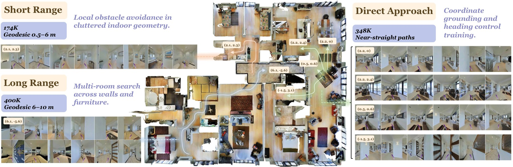

*图 5：PointNav 数据可视化。图中分为 Direct Approach、Short Range 和 Long Range 三类坐标目标，分别对应 348K、174K 和 400K samples。*

- **Direct Approach**：目标坐标在当前视野或短距离内，主要训练模型把视觉几何直接映射成前进/转向 waypoint。
- **Short Range**：目标需要较少步数才能到达，要求模型在局部空间中保持方向和距离估计。
- **Long Range**：目标跨越更长路径，需要利用历史观察和更宽 token budget，和 VLN 的长程记忆需求接近。
- **设计意义**：PointNav 不只是一个 benchmark，而是作为连续导航几何的基础训练信号，帮助模型在 VLN/ObjNav 中输出可执行轨迹。

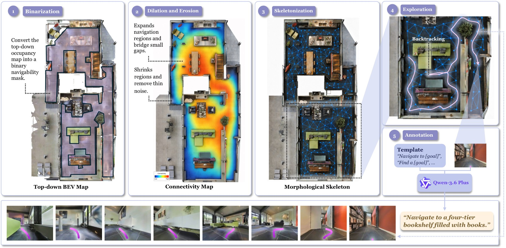

*图 6：ObjectNav 数据生成流程。图中从 occupancy map 二值化、形态学处理、skeletonization 到带 dead-end backtracking 的探索轨迹，最后由 VLM 在终点视角标注开放词表目标。*

- **地图处理**：occupancy map 经过二值化和形态学操作后生成 skeleton，得到可遍历的房间/走廊拓扑。
- **探索轨迹**：系统使用带 dead-end backtracking 的探索路径，模拟在未知环境中寻找目标，而不是直接给最短路径。
- **开放词表目标**：终点视角由 VLM 标注目标物，因此 ObjectNav 不局限于固定类别表。这使 Qwen-RobotNav 更接近真实语言指令中的对象搜索。
- **副作用**：这种 skeleton-based 训练提高找到目标概率，但可能让路径偏长。论文在 OVON/ObjNav 结果中也提到 QwenNav 的 SR 强但 SPL 相对低。

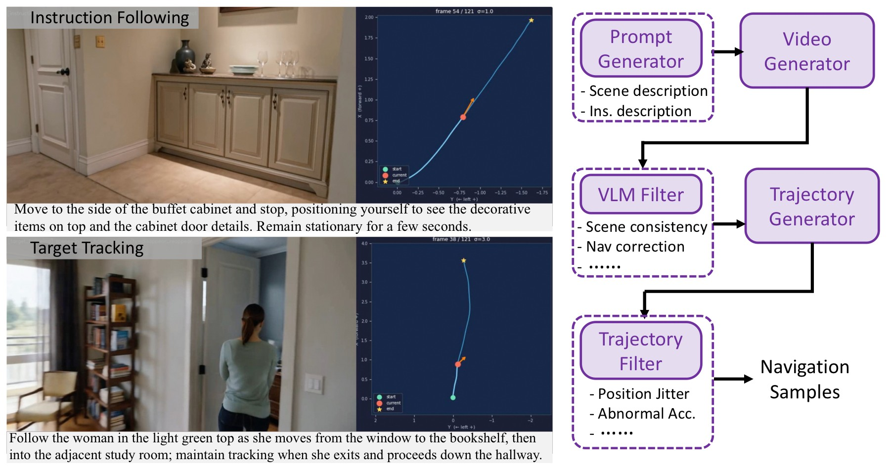

*图 7：T2V 自动生成导航数据流程。右侧依次是 LLM 生成 prompt/instruction、T2V 合成视频、VLM 过滤、单目 depth/pose 提取轨迹、kinematic filter；左侧给出 instruction following 和 target tracking 示例。*

- **生成链条**：LLM 先生成导航 prompt 和指令，T2V 模型生成视频，VLM 过滤不合格样本，再用单目 depth/pose 恢复 2D 轨迹，最后用运动学规则过滤不合理轨迹。
- **用途**：这部分数据只有 40K，不是最大来源，但补充了真实数据中少见的语言场景和目标运动模式。
- **风险**：生成视频可能带有视觉或运动偏差，因此必须经过 VLM 和 kinematic filter。论文没有系统报告这些生成偏差的失败案例，笔记中不应过度夸大其贡献。

---

## 四、实验与结果

### 4.1 VLN 与导航基准

| Benchmark | Qwen-RobotNav 关键结果 | 结论 |
|---|---|---|
| VLN-CE R2R panoramic | 8B SR 72.1，SPL 66.6 | 比 NavFoM 高 10.4 SR points |
| VLN-CE RxR panoramic | 8B SR 76.5，SPL 65.7 | 比 NavFoM 高 12.1 SR points |
| VLNVerse fine-grained | 8B SR 63.75，SPL 57.93 | fine/coarse 两档均最优 |
| VLN-PE | 8B SR 65.50，SPL 61.19 | 最低 NE、最高 OS/SR/SPL |
| HM3D ObjectNav | 4B SR 75.6，SPL 30.6 | 使用更难 HM3D v2，SR 强但路径效率一般 |
| EVT-Bench tracking | 4B TR 90.0，8B SR 78.6 | TR 最高，但 SR 低于 ABot-N0/TrackVLA++ |

VLN-CE 结果中，panoramic 8B 在 R2R 上 NE 3.53、OS 78.5、SR 72.1、SPL 66.6；在 RxR 上 NE 3.58、nDTW 72.5、SR 76.5、SPL 65.7。相比 NavFoM，R2R SR 提高 10.4 points，RxR SR 提高 12.1 points。

### 4.2 自动驾驶和 EQA

NAVSIM navtest 中，如果没有历史 ego-status prior，QwenNav-4B / 8B 的 PDMS 都是 79.5；加入 previous three frames 的历史轨迹 prior 后，4B 达到 PDMS 91.4，8B 为 90.9。4B 的 91.4 比 NavFoM 高 7.1、AutoVLA 高 2.3、ReCogDrive 高 0.6、ReflectDrive 高 0.3。

EQA 中，Qwen3.6-Plus + QwenNav-8B 在 HM-EQA 上 Acc 76.7、Steps 0.15，在 MT-EQA 上 Acc 54.4、Steps 0.19，在 EXPRESS-Bench 上 LLM Score 79.27、E_path 33.96。相比 FAST-EQA，HM-EQA 高 7.5 points，MT-HM3D 高 3.9 points，EXPRESS-Bench 高 10.57 points。

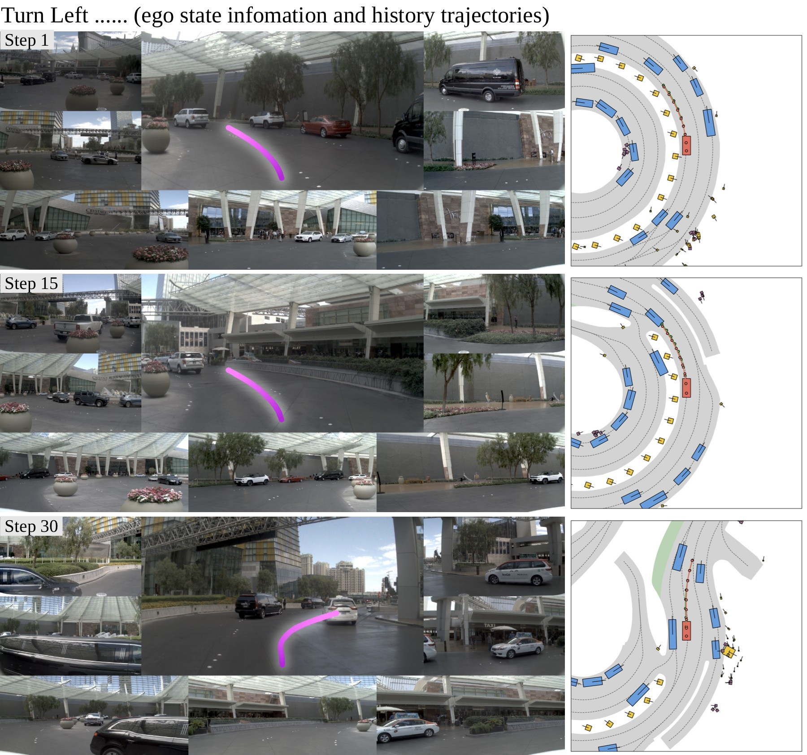

*图 8：NAVSIM 左转闭环规划。每个时间步展示多视角相机、front-view 上的预测轨迹和 BEV scene，覆盖 Step 1 到 Step 30 的连续弯道轨迹。*

- **图像结构**：左侧是多相机输入，右侧是 BEV 或轨迹可视化；粉色轨迹展示模型预测的未来路线，随时间从直行进入左转过程。
- **闭环含义**：不是单帧 open-loop 预测，而是连续 step 中不断根据新观察更新轨迹。Step 1 到 Step 30 的轨迹需要保持 lane geometry 和转弯方向一致。
- **关键数字关联**：NAVSIM 上历史 prior 对 PDMS 提升超过 11 points，说明驾驶任务中短期 ego history 对速度、曲率和舒适性判断很重要。图中连续弯道正是这种历史上下文发挥作用的场景。

### 4.3 Scaling 与观察配置消融

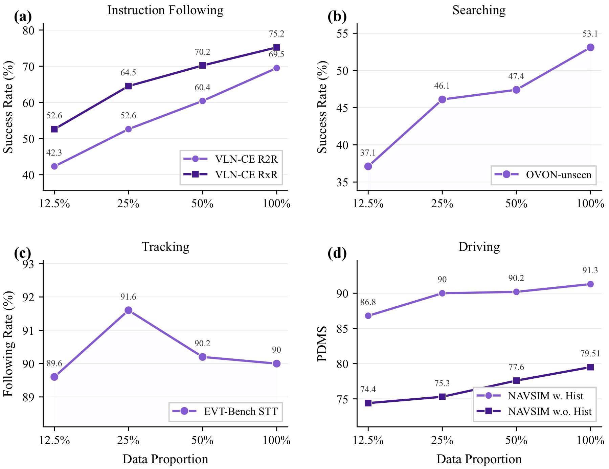

*图 9：数据比例消融。四个子图分别覆盖 instruction following、searching、tracking、driving，横轴是训练数据比例，纵轴是对应 benchmark 的成功率或 PDMS。*

- **instruction following**：VLN-CE RxR 随数据比例增长收益最明显，说明长程语言导航依赖更丰富的路线、场景和语言表达覆盖。
- **searching / ObjNav**：随着数据比例上升，搜索类任务 SR 提升，但路径效率不一定同步提升，这与 skeleton exploration 数据带来的 reach-first 倾向一致。
- **tracking**：EVT-Bench tracking 在中等数据后更早饱和，且有轻微非单调，说明短程反应任务对数据规模的边际收益小于长程 VLN。
- **driving**：NAVSIM 指标随数据比例整体上升，尤其在加入更多驾驶场景后 PDMS 改善，但仍依赖历史 ego-status prior。

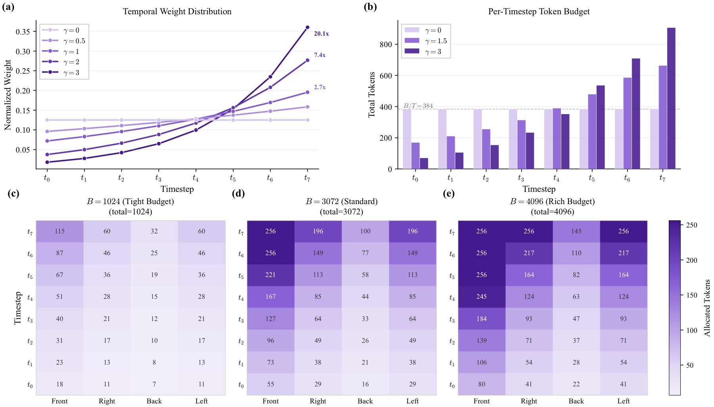

*图 10：task-adaptive observation encoding 消融。左上是不同 gamma 的时间权重曲线，右上是固定 B=3072 时每时间步 token budget；下方是 B=1024/3072/4096 下的 time-camera token allocation matrix。*

- **gamma 曲线**：gamma 越大，token 分配越偏向最新帧。固定 B=3072 时，`gamma=3.0` 的 VLN-CE R2R SR 达峰 72.5，`gamma=3.5` 后略降，说明过强 recency 会牺牲早期历史。
- **token budget**：固定 `gamma=2.0` 时，B 从 2048 到 4608，SR 从 70.8% 到 74.6%；OSR 在 B=3584 达峰 82.7 后略降。更多视觉 token 通常有利，但分配不佳会边际递减。
- **time-camera matrix**：下方热力图展示不同 token budget 下，front/right/back/left 和历史时间步如何分配资源。它把“看哪些图、看多少细节”显式变成可调接口。
- **论文论点连接**：这张图支撑了 Qwen-RobotNav 的系统设计：agent 可以按任务重配观察上下文，而不是每次都把固定数量、固定视角的图像输入模型。

---

## 五、关键图表解读

### 5.1 Benchmark 总览：强项与短板并存

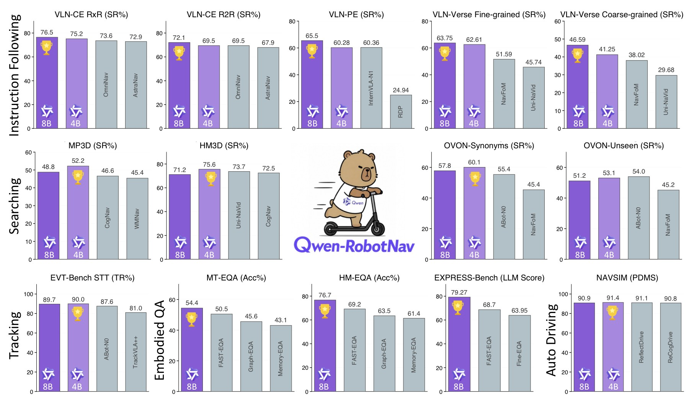

*图 11：Qwen-RobotNav benchmark summary。图中跨 instruction following、object search、target tracking、EQA、autonomous driving 展示 4B/8B 与 specialist/foundation baselines 的对比，奖杯标出最优项。*

- **多任务覆盖**：这张图把 VLN、ObjNav、tracking、EQA、NAVSIM 放在同一页，强调 Qwen-RobotNav 是统一导航模型，而不是单 benchmark 专用方法。
- **强项**：VLN-CE、VLNVerse、VLN-PE、EVT Tracking Rate、NAVSIM PDMS 和 EQA 组合结果都表现突出。尤其 VLN-CE panoramic 8B 的 R2R/RxR SR 分别达到 72.1/76.5。
- **短板**：tracking 的 TR 高但 SR 不是最高；OVON/ObjectNav 中 SR 强但 SPL 相对弱；AlpaSim zero-shot 明显落后专用 Alpamayo-R1。这些都说明统一模型牺牲了部分专用效率。

### 5.2 真实部署与延迟

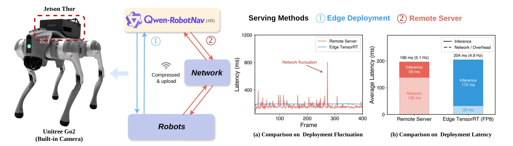

*图 12：Unitree Go2 部署架构和延迟对比。左侧是 remote-server 与 edge Jetson Thor FP8/TensorRT pipeline；右侧展示 per-frame latency 和平均 latency breakdown。*

- **两种部署形态**：remote-server 平均端到端 196ms，约 5.1Hz；on-device Jetson Thor FP8/TensorRT 平均 204ms，约 4.9Hz。
- **延迟权衡**：remote-server 平均略快，但网络波动更大；edge 端略慢但稳定性更好，适合 tracking 等对 jitter 敏感的任务。
- **系统意义**：导航模型输出 waypoint，而不是直接高频关节控制，因此 5Hz 级别对许多移动导航任务可用。但对于高速避障或强动态场景，仍需要底层 controller 或安全模块补充。

### 5.3 真实 agentic 长程任务

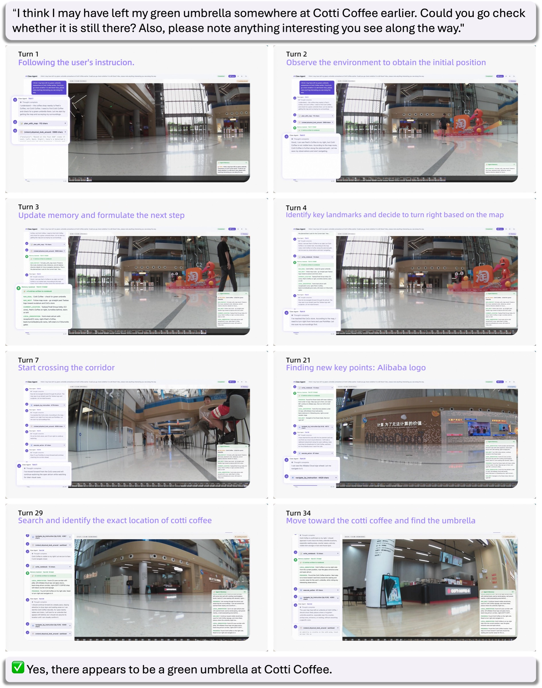

*图 13：真实机器人 agentic 长程任务。用户询问 Cotti Coffee 是否有绿色雨伞，系统分解子目标、沿 landmark 导航、更新 memory，最终基于视觉证据回答。*

- **任务结构**：这不是“走到某个坐标”的短程任务，而是包含信息需求、候选位置搜索、视觉证据收集和最终回答的 embodied QA。
- **agent 流程**：planner 根据目标生成子任务，Qwen-RobotNav 执行到 landmark 或候选区域，视觉工具检查证据，memory 记录已搜索区域和被否定假设。
- **为什么重要**：它展示 Qwen-RobotNav 的定位不是替代 LLM planner，而是给 planner 一个可调用、可重配置的导航执行器。长程成功依赖 waypoint policy、视觉工具和 memory 共同工作。
- **证据边界**：该图是 qualitative showcase，不是大规模真实机器人统计 benchmark，不能用它替代定量结果。

---

## 六、系统实现 / 工程接口 / 部署

Qwen-RobotNav 的接口可以抽象为：

```text
Planner:
  choose subgoal L_i
  choose task mode tau_i
  choose observation config Phi_i

Executor:
  Qwen-RobotNav(observation, L_i, tau_i, Phi_i)
      -> 8 waypoint trajectory

Harness:
  execute low-level controller
  summarize trajectory evidence
  update rollout memory and cross-episode notebook
```

这套接口的工程价值在于：长程任务不要求一个单体模型记住所有历史，也不要求导航 policy 自己做所有语义判断。planner 可以把“去厨房找绿色雨伞”分解成可验证的子目标；Qwen-RobotNav 只负责在当前上下文下产生可执行轨迹；memory 负责把探索证据持久化。

---

## 七、局限性

- Token allocation 是经验启发式，不是 principled token allocation；不同任务的最佳 `Phi` 仍需调参。
- AlpaSim zero-shot 明显落后专用 Alpamayo-R1，说明自动驾驶长程 closed-loop 迁移仍有限。
- NAVSIM 高分强依赖历史 ego-status prior；无 prior 时 PDMS 从 91.4/90.9 降到 79.5。
- EVT tracking 虽然 TR 最高，但 SR 低于 ABot-N0 和 TrackVLA++。
- OVON/ObjectNav 的 high SR 伴随较低 SPL，路径效率仍需改进。
- HM3D closed-vocabulary 对比存在版本差异：多数 prior 是 HM3D v1，QwenNav 使用更难的 HM3D v2。
- 真实机器人实验主要是 qualitative showcase，统计规模有限。
- 数据中包含 LLM/VLM/T2V/Qwen-Image-Edit 生成或增强样本，可能引入生成模型偏差。
- 通过自然语言 tags/preamble 表达 camera/time/embodiment 简单可扩展，但对 prompt 格式和语言 grounding 依赖较强。

---

## 八、关键概念速查

| 概念 | 含义 |
|---|---|
| Unified waypoint prediction | 所有导航任务都输出 8 个 `(x, y, theta)` waypoints |
| Task-adaptive observation encoding | 用 `B`、`gamma`、相机权重和采样模式控制视觉上下文 |
| `Phi` | navigation context protocol 的参数集合 |
| Temporal decay `gamma` | 控制 token 分配偏向近期帧还是长历史 |
| Evidence notebook | 跨 episode 记忆，记录已搜索区域、候选目标和否定假设 |
| VLN / PointNav / ObjNav / Tracking | Qwen-RobotNav 统一覆盖的主要导航任务类型 |
| NAVSIM PDMS | 自动驾驶闭环规划综合指标 |
| Agentic navigation | LLM planner、导航 executor、视觉工具和 memory 组成的长程导航系统 |
