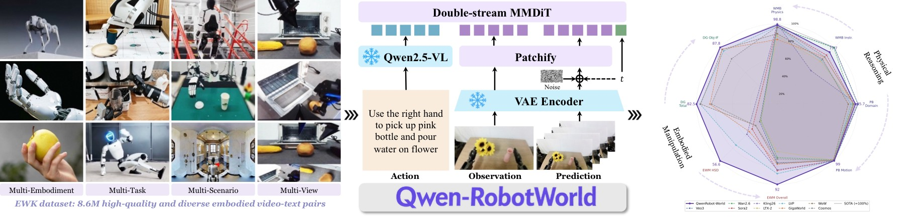
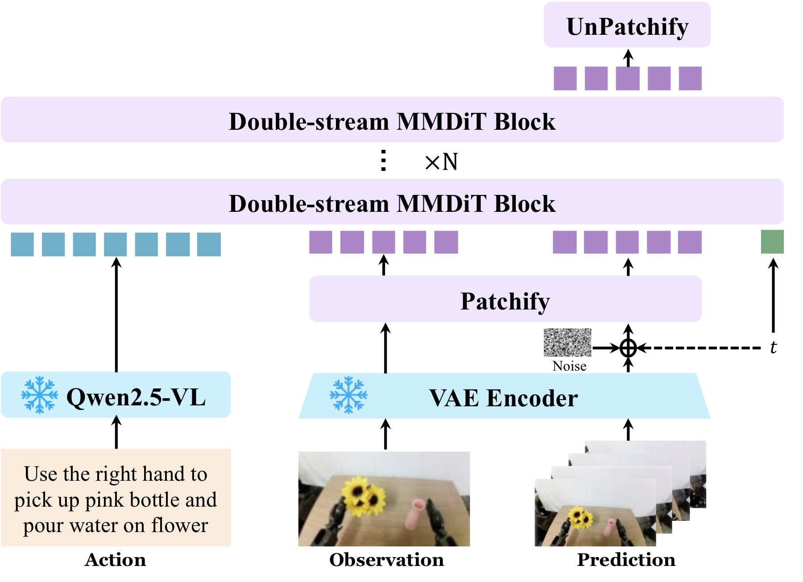
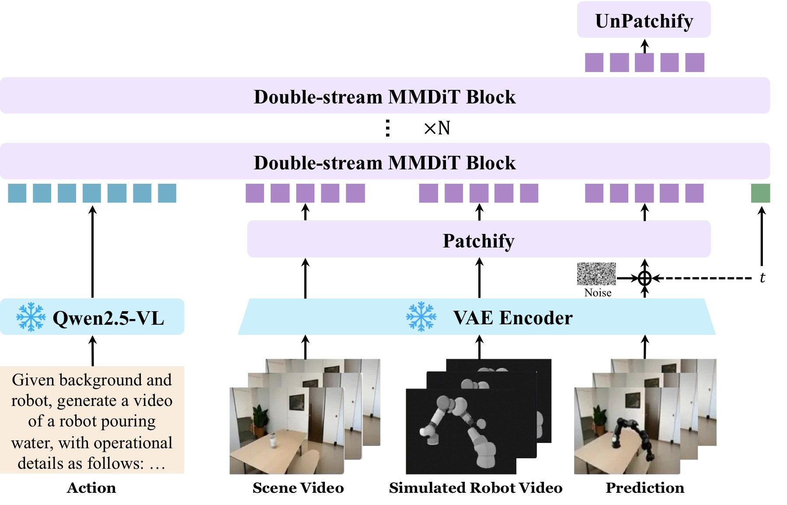
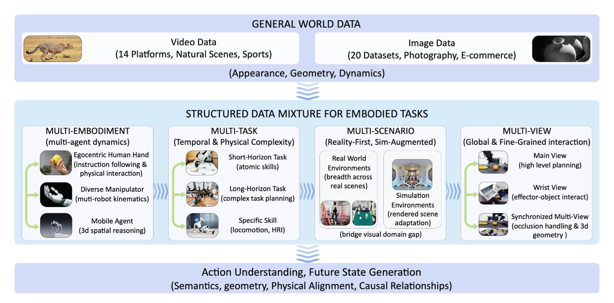
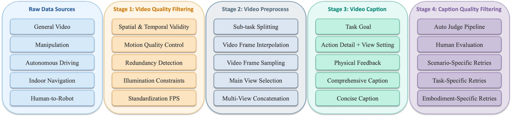
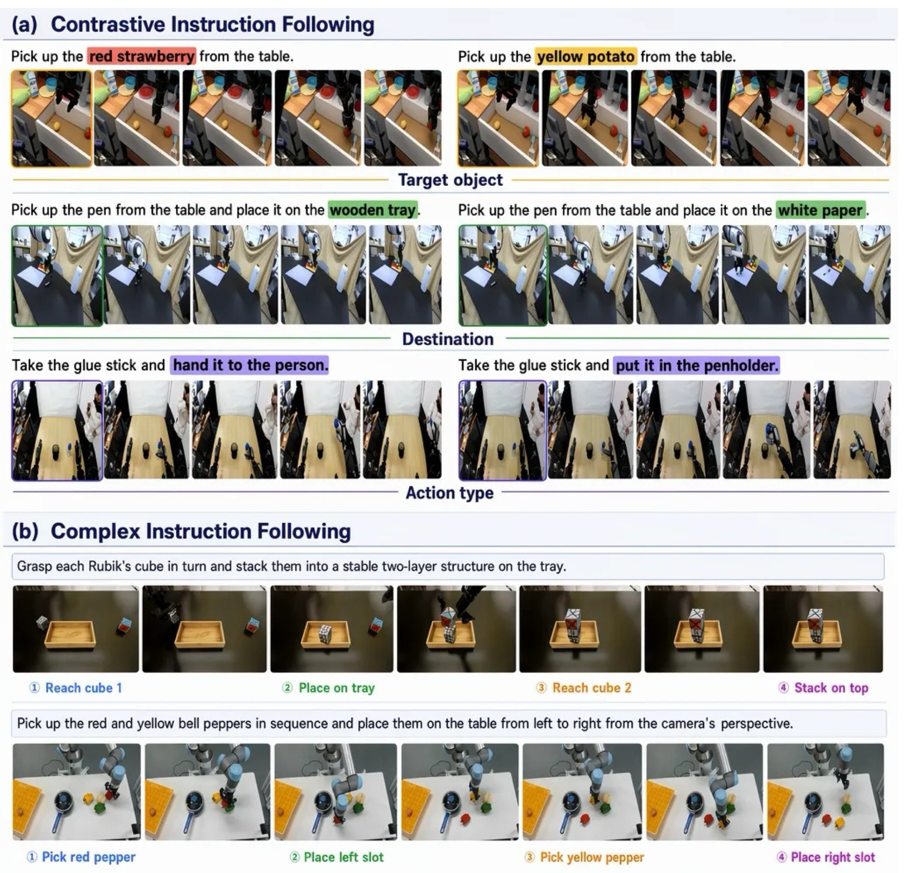
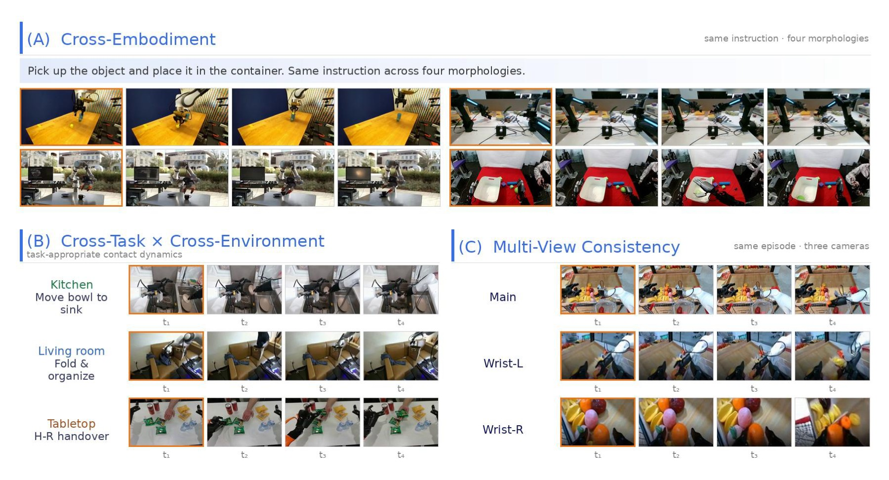
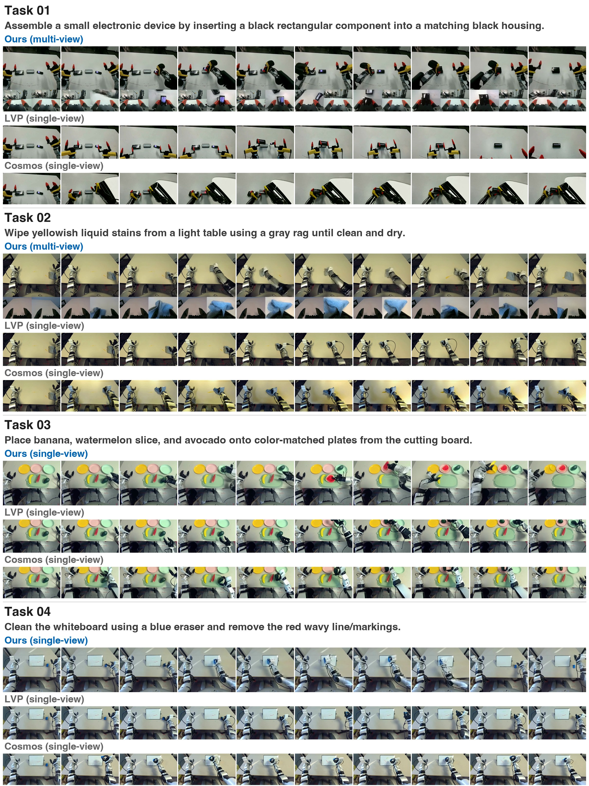
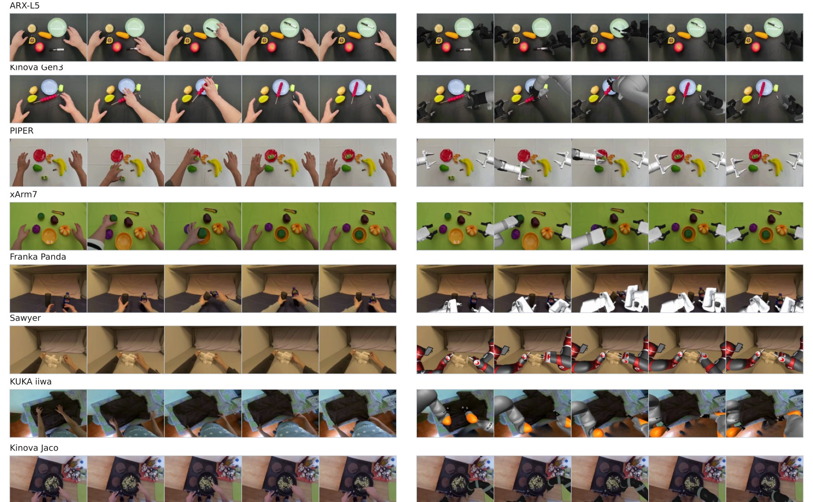
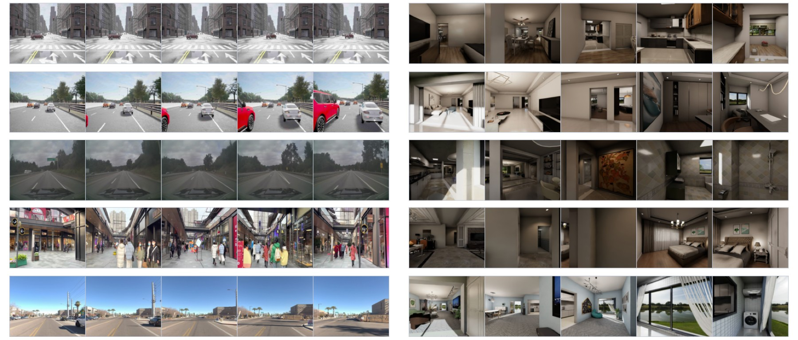

<!-- arxiv: 2606.17030 -->
<!-- venue: Qwen Technical Report 2026 -->
<!-- tags: WAM, 世界模型, 视频生成, 自动驾驶 -->

# Qwen-RobotWorld Technical Report: Unifying Embodied World Modeling through Language-Conditioned Video Generation

> **论文信息**
> - 作者：Qwen Team
> - 发布：Qwen Technical Report 2026
> - arXiv ID：2606.17030
> - 代码：论文未提供相邻官方代码仓库；本文主要基于 TeX 源码、图表和技术报告中的系统描述整理。
>
> 本文基于以下本地材料整理：
>
> - 论文 TeX 源码：`arXiv-2606.17030v3/`（主文件：`colm2024_conference.tex`，章节目录：`content/*.tex`）
> - 论文插图：`arXiv-2606.17030v3/content/*.pdf`、`*.png`
> - 官方代码：未在本地笔记目录中提供
> - 本文图片导出目录：`assets/qwen-robotworld/`

---

## 一、核心问题

Qwen-RobotWorld 解决的是 embodied intelligence 中的世界模型问题：**给定当前视觉状态和语言描述的动作，模型能否预测未来视觉轨迹，并且这种预测能跨机器人操作、自动驾驶、室内导航、人到机器人迁移等场景统一工作？**

它不是传统只面向某个机器人控制器的 dynamics model，而是把世界模型重新定义为 language-conditioned video generation：

```text
current visual observation + language action
        -> future visual trajectory
```

这种设定有三个直接应用方向：

| 应用方向 | 世界模型提供什么 | 现实用途 |
|---|---|---|
| Synthetic data generation | 根据语言动作生成未来视频 | 扩充策略训练数据，覆盖稀有任务和新具身 |
| Virtual policy evaluation | 在执行前预测不同动作的后果 | 做离线评估或安全过滤 |
| Planning signal | 给 planner 提供视觉化 rollout | 辅助语言/动作规划，而不是只靠符号推理 |

论文的核心挑战在于统一性：不同机器人动作形式、自动驾驶 maneuver、室内导航指令和人类手部演示看起来差异很大。Qwen-RobotWorld 的答案是把动作统一成自然语言，并用冻结 Qwen2.5-VL 编码复杂语言动作，再用大规模视频扩散模型预测未来。



*图 1：Qwen-RobotWorld 的摘要 teaser。左侧展示 EWK 数据集的 multi-embodiment、multi-task、multi-scenario、multi-view 覆盖；中间展示语言动作条件视频世界模型；右侧用雷达图和 benchmark 摘要展示 WorldModelBench、DreamGen、EWMBench、PBench 等评测表现。*

- **左侧数据覆盖**：图中把 manipulation、driving、navigation、human-to-robot transfer 和 general video 放在同一数据宇宙里，说明模型目标不是单一机器人手臂，而是面向广义 embodied scenes。
- **中间模型路径**：语言动作由 Qwen2.5-VL 编码，视觉状态由 VAE 编码成 latent，二者进入 double-stream MMDiT。这个设计把“动作理解”和“视频生成”解耦：语言理解由强 MLLM 负责，视觉转移由扩散骨干负责。
- **右侧结果**：Qwen-RobotWorld 在 EWMBench 和 DreamGen Bench 排名第一，在 WorldModelBench 开源第一、总体第三，在 PBench 超过所有开源模型。雷达图的作用是强调它不是只在单个具身 benchmark 上调优。

---

## 二、核心思路与方法

### 2.1 世界模型作为语言条件视频生成器

论文把 embodied world modeling 写成视觉状态转移：输入当前视觉状态 $s_t$ 和语言动作 $a_t$，预测未来状态 $s_{t+1:t+H}$。这里的 $a_t$ 可以是“pick up the cup”“turn left at the intersection”“walk through the door”，也可以是更细的机器人动作描述。

选择自然语言作为动作接口有两个好处：

1. **统一不同具身动作空间**：机器人关节命令、自动驾驶轨迹和室内导航路径都可以转写成语言动作。
2. **复用 MLLM 的语义与物理知识**：复杂指令、对象关系、动作结果可以通过 Qwen2.5-VL 的 hidden states 表达。

### 2.2 模型结构：Qwen2.5-VL + Wan-VAE + 20B MMDiT



*图 2：Qwen-RobotWorld 的主模型结构。左侧冻结 Qwen2.5-VL 对语言动作编码；下方 VAE encoder 把 observation 和 prediction video 编码为 latent；中间 60 层 double-stream MMDiT 在 understanding stream 与 generation stream 之间做 joint attention；右上 unpatchify 后通过 VAE decoder 还原视频。*

- **输入拆解**：语言动作进入冻结 Qwen2.5-VL，得到最后层 hidden states；视频帧进入 Wan-VAE，得到 latent tokens。两条信息流不是简单拼接，而是分别进入 MMDiT 的 understanding stream 和 generation stream。
- **MMDiT 规模**：转移模型参数量约 20B，包含 60 个 double-stream blocks、24 个 attention heads、head dim 128、hidden size 3072、patch size 2x2，最多支持 48,360 个 video tokens。MLLM 约 7B，VAE 127M。
- **位置编码**：视频使用 3D RoPE 编码时间、高、宽，维度非对称分配为 `[16, 56, 56]`。空间维度比时间维度更多，符合 embodied video 中空间几何和物体关系比单纯时间顺序更复杂的特点。
- **为什么重要**：图中双流结构避免了“语言动作只是一个弱文本 prompt”的问题。动作语义在每层 joint attention 中反复调制视觉生成，适合需要精细 language grounding 的操作和导航场景。

### 2.3 Scene2Robot：人到机器人迁移的三段条件机制



*图 3：Scene2Robot 模型结构。输入被组织为 scene condition、robot reference、generation 三段：前两段作为条件，generation 段是要生成的机器人执行视频。*

- **三段式输入**：scene condition 段提供真实场景和任务环境，robot reference 段提供目标机器人外观和形态，generation 段需要生成 photorealistic robot execution。前两段 timestep 设为 0，并从 loss 中排除，只对 generation 段训练。
- **信息融合方式**：三段 token 在 MMDiT joint attention 中交互，因此模型既能看到人类/场景动作意图，也能看到目标机器人的形态约束。
- **应用意义**：这为 human-to-robot transfer 提供视频级世界模型接口。它不直接输出控制命令，而是生成机器人在目标场景中执行任务的未来视觉轨迹，可用于数据合成、策略评估或 planner 视觉想象。

---

## 三、数据与训练

### 3.1 EWK 数据集：8.6M video-text pairs

Qwen-RobotWorld 构建了 EWK 数据集，约 8.6M video-text pairs、200M+ observation frames，包含 20+ embodiments 和 500+ action categories。整体上约 70% embodied data，30% general video/image data。



*图 4：EWK 训练语料总览。上方是 general world data，中间是 structured embodied data mixture，按 Multi-Embodiment、Multi-Task、Multi-Scenario、Multi-View 四个轴组织，底部强调这些数据共同支持 action understanding 与 future state generation。*

- **上方 general world data**：通用视频和图像数据提供视觉质量、物体外观、场景动态和一般物理先验。论文在 SFT 阶段仍持续混入 general data，避免具身专精损害通用视频能力。
- **中间 embodied mixture**：manipulation 数据约 4.3M 单视角 samples，另有约 1.6M 多视角同步 samples；自动驾驶 raw pool 包括 Waymo E2E、NVIDIA PhysicalAI-AD、Bench2Drive、Sekai，总计 1,744,405 clips / 2,405h；室内导航来自 VLNVerse，6,064 successful episodes、134 scenes、49.8km、5.8h。
- **多视角意义**：约 1.6M embodied samples 包含 2 到 4 个同步相机视角，这对世界模型很关键，因为同一动作必须在主视角、腕部视角或多车载相机中保持几何一致。
- **口径注意**：论文中 raw pool、过滤后训练 mixture 和最终采样比例有不同口径，写结果时应区分“原始收集规模”和“训练采样比例”。

### 3.2 五层标注和数据处理流水线



*图 5：数据处理 pipeline。流程从 raw data sources 开始，经过 video quality filtering、video preprocess、video caption、caption quality filtering，最终形成可训练的 video-text pairs。caption 部分包含五层标注：task goal、action detail、physical feedback、comprehensive caption、concise caption。*

- **五层 caption**：task goal 描述任务目标，action detail 描述细粒度动作和视角设置，physical feedback 描述接触、运动结果等物理反馈，comprehensive caption 长 50 到 100 words，concise caption 长 15 到 30 words。训练时 comprehensive 和 concise 各 50% 采样。
- **质量闭环**：图中不仅有自动 caption，还包含 auto judge、人评、scenario/task/embodiment-specific retries。也就是说，语言动作不是一次生成就结束，而是按任务和场景类型反复修正。
- **为什么重要**：自然语言是 Qwen-RobotWorld 的统一动作接口，因此 caption 质量直接决定动作条件是否可学习。若 caption 只描述画面而不描述动作后果，模型会退化成普通视频生成器。

### 3.3 训练策略

训练采用 flow matching。预训练阶段使用 200M+ real-world observation samples，联合 T2I、T2V、TI2V 任务；T2I 被用作视觉质量和物体形态 anchor，以减少视频生成中的物体变形和身份漂移。SFT 阶段做 embodied specialization，同时持续混入 general world data。正文摘要给出的 SFT 混合比例为 70% embodied / 30% general；embodied 内 manipulation 约 90%，multi-view concatenation 与 navigation/driving 各约 5%。

---

## 四、实验与结果

### 4.1 四个世界模型 benchmark

| Benchmark | Qwen-RobotWorld 结果 | 关键结论 |
|---|---|---|
| EWMBench | Overall 4.60 | 第 1；比第二名 LVP 4.05 高 0.55 |
| DreamGen Bench | Total 4.952 | 第 1；GR1-Object IF 0.878 最强 |
| PBench | Overall 0.804 | 超过所有开源模型；Domain 0.857，Motion 0.990 |
| WorldModelBench | Total 8.99 | 开源第 1、总体第 3；四个物理类别满分，Penetration 0.94 |

更细的数字如下：

- **EWMBench**：SceneC 0.9142，HSD 0.5660，Dyn 0.3429，nDTW 0.6708，Diversity 0.0114，BLEU 0.2079，CLIP 0.8834，Logics 1.0000，Overall 4.60。
- **DreamGen Bench**：GR1-Env PA/IF = 0.828/0.793，GR1-Object 0.840/0.878，GR1-Behavior 0.781/0.832，Total 4.952。注意 GR1-Behavior IF 0.832 低于 LVP 0.889 和 GigaWorld 0.884。
- **PBench**：Quality 0.751，Domain 0.857，Overall 0.804；Overall 仍低于 Veo3 0.827、Kling26 0.821、Sora2 0.805，说明它在闭源通用视频模型前仍有视觉质量差距。
- **WorldModelBench**：Instruction 2.33，Common Sense Overall 1.72，Physics Overall 4.94，Total 8.99。Newton、Mass、Fluid、Gravity 为 1.00，Penetration 为 0.94，因此不应笼统写所有物理项满分。

### 4.2 语言 grounding 与操作泛化



*图 6：语言 grounding 定性图。上半部分是 contrastive instruction following：相同初始帧只改变关键词，测试 target object、destination、action type；下半部分是 complex instruction following，展示多步任务和抽象目标推理。*

- **contrastive 部分**：图中多组样例保持初始画面接近，只改变诸如目标物、放置位置或动作类型的关键词。如果生成视频跟随了错误目标，说明世界模型只是学到视觉惯性而没有理解 action language。
- **complex 部分**：复杂指令要求模型把抽象目标转成动作序列，例如先定位目标，再执行移动或操作。图中连续帧展示了动作从起始状态到结果状态的变化。
- **论文论点连接**：这些定性结果补充了自动 benchmark，因为它们直接展示冻结 Qwen2.5-VL action encoder 对细粒度语言差异的利用方式。



*图 7：操作泛化可视化。图中分为 cross-embodiment、cross-task/cross-environment 和 multi-view consistency 三部分，展示 single-arm、dual-arm、humanoid、dexterous hand，以及 fruit pick-and-place、cloth folding、handover 等任务。*

- **cross-embodiment**：同一类指令可生成不同机器人形态的未来视频，包括单臂、双臂、人形或灵巧手。重点不是控制成功率，而是世界模型能否保持动作语义和具身外观一致。
- **cross-task/cross-environment**：不同厨房、桌面、布料或人机交互场景下，模型需要同时预测物体运动、接触变化和机器人末端位置。
- **multi-view consistency**：同一动作在主视角、腕部左/右视角中应同步演化。多视角一致性是世界模型能否用于策略评估和数据生成的关键，如果不同视角预测互相矛盾，合成数据就很难用于训练。

### 4.3 RoboTwin-IF、Human-to-Robot 和移动场景



*图 8：RoboTwin-IF zero-shot 定性对比。相同 initial frame、prompt 和相机布局下，对比 Qwen-RobotWorld、LVP、Cosmos2.5-14B 的语言-动作对齐和多视角一致性。*

- **图像结构**：每组样例包含多个均匀采样帧，通常同时展示多个 camera views。这样可以观察模型是否在整个执行过程中保持目标一致，而不是只生成第一帧附近的合理画面。
- **对比重点**：Qwen-RobotWorld 被用来展示更稳定的动作完成和视角一致性；LVP/Cosmos 的问题通常表现为目标物错位、动作停滞、视角之间状态不一致。
- **注意事项**：源码中没有 RoboTwin-IF 的量化表，因此这张图只能作为 qualitative zero-shot evidence，不能写成有具体分数领先。



*图 9：人到机器人迁移可视化。每行对比 human demonstration 和 synthesized robot execution，每个视频采样 5 帧，覆盖 8 种目标 embodiment。*

- **场景含义**：模型需要把人手演示中的任务意图迁移到机器人执行视频中，同时适配机器人外观、关节限制和末端轨迹。
- **视觉挑战**：如果只做图像替换，机器人可能与物体接触关系错误；如果只做轨迹 retarget，生成画面可能不真实。Scene2Robot 的三段条件机制正是为了解决“场景意图”和“机器人形态”两类条件同时存在的问题。
- **应用边界**：这仍是视频生成结果，不等于真实机器人闭环执行成功率。它更适合作为数据合成和 planning imagination 的中间表示。



*图 10：移动场景生成。左侧展示 Bench2Drive、NVIDIA PhysicalAI-AD、Sekai、Waymo 等自动驾驶样例；右侧展示 VLNVerse 语言引导室内导航，每个 episode 展示 5 个均匀采样帧。*

- **自动驾驶部分**：多车载视角和道路场景要求模型保持 lane geometry、车辆运动和交通环境一致。语言动作可能是 turn、go straight、follow route 等 maneuver。
- **室内导航部分**：第一人称视角下，模型需要根据语言指令预测穿过房间、转弯或靠近目标区域后的未来画面。它测试的是空间连续性和目标方向感。
- **统一性意义**：这张图展示 Qwen-RobotWorld 不只服务桌面 manipulation。它把 driving 和 navigation 也纳入 language-conditioned future state generation，使同一架构覆盖更宽的 embodied world modeling。

---

## 五、关键洞察与技术亮点

1. **自然语言动作接口降低了跨具身动作对齐成本。** 论文没有试图为所有机器人、车辆和导航任务设计统一连续动作空间，而是把动作先映射成语言，再交给 Qwen2.5-VL 编码。
2. **世界模型不是纯视频美学任务。** PBench 中 Aesthetic 0.455、Imaging 0.649 说明视觉质量不是绝对 SOTA；但 Domain 0.857、Motion 0.990 和 WorldModelBench 物理项显示它更偏具身物理和动作一致性。
3. **多视角数据是 embodied video 的关键。** 单视角生成可以看起来合理，但多视角一致性才决定它能否作为机器人数据或 policy evaluator。
4. **论文没有系统消融表。** Qwen2.5-VL action encoder、T2I co-training、multi-view concatenation、general+expert curriculum 的贡献主要来自设计论证和定性结果，不能写成逐项 ablation 已严格证明。

---

## 六、系统实现 / 工程接口 / 部署

Qwen-RobotWorld 的工程接口可以理解为一个视频 rollout service：

```text
Input:
  observation frames or scene video
  language action / instruction
  optional robot reference or multi-view context

World model:
  frozen Qwen2.5-VL action encoder
  Wan-VAE video latent encoder/decoder
  20B double-stream MMDiT transition model

Output:
  future video trajectory
```

它本身不输出机器人控制量，因此在机器人系统中通常需要与 planner 或 policy 结合：planner 提出候选语言动作，world model 生成未来视觉结果，外层系统再选择更安全或更接近目标的动作。对于数据合成，则可把生成视频进一步转成监督样本或用作 policy augmentation。

---

## 七、局限性

- 没有独立系统消融表，难以量化每个设计组件的边际贡献。
- PBench 视觉质量指标不是绝对领先，Aesthetic 和 Imaging 偏低，闭源通用视频模型在 overall 上仍更强。
- DreamGen 的 GR1-Behavior IF 低于 LVP 和 GigaWorld，说明长程行为泛化仍有短板。
- WorldModelBench 物理项中 Penetration 是 0.94，不是所有物理类别满分。
- RoboTwin-IF 只有定性图，没有量化表。
- DreamGen IF、PBench Domain 等自动评测依赖 VLM judge，可能带有 evaluator bias。
- 论文展示的是世界模型能力，没有直接给出闭环策略训练收益或真实机器人成功率表。

---

## 八、关键概念速查

| 概念 | 含义 |
|---|---|
| Embodied world model | 给定当前视觉状态和动作条件，预测未来视觉状态的模型 |
| Language-conditioned video generation | 用自然语言动作作为条件生成未来视频 |
| EWK | Qwen-RobotWorld 构建的 8.6M video-text pairs 数据集 |
| MMDiT | 双流 diffusion transformer，分别处理语言理解流和视频生成流 |
| Scene2Robot | 用 scene condition、robot reference、generation 三段条件做人到机器人视频迁移 |
| Multi-view consistency | 同一动作在多个同步视角下保持几何和状态一致 |
| EWMBench / DreamGen / PBench / WorldModelBench | 论文主要使用的四类世界模型评测 |
