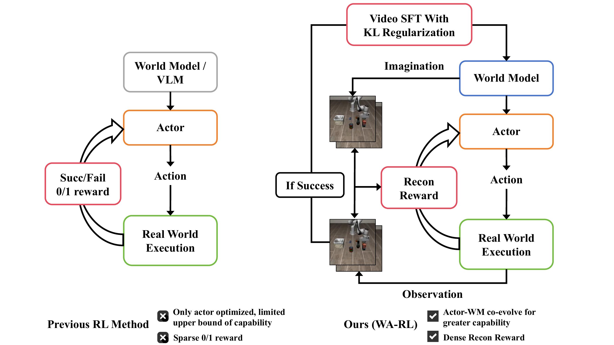
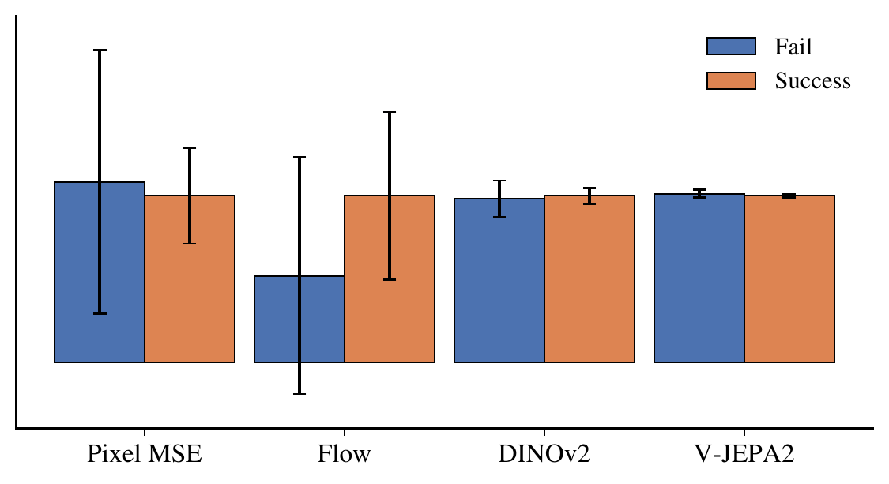
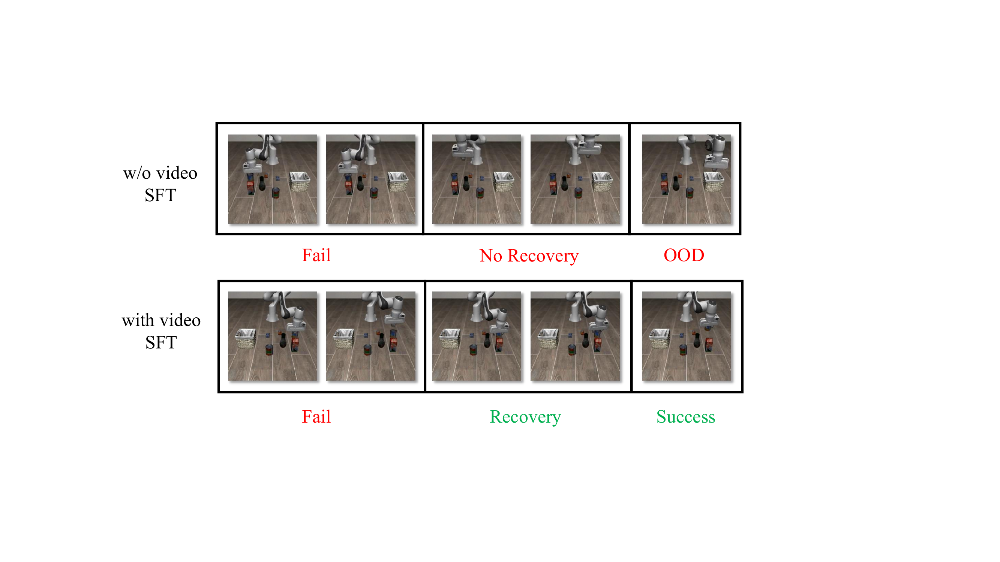

<!-- arxiv: 2606.17906 -->
<!-- venue: arXiv 2026 -->
<!-- tags: WAM, 强化学习, 机器人, 世界模型, 视频生成 -->

# WAM-RL: World-Action Model Reinforcement Learning with Reconstruction Rewards and Online Video SFT

> **论文信息**
> - 作者：Zezhong Qian（北京大学）, Xiaowei Chi（北京大学，Project Leader）, Yu Qi（东北大学）, Haozhan Li（清华大学）, Zhi Yang Chen（北京大学）, Shanghang Zhang（北京大学，通讯作者）
> - 发表：arXiv 2026
> - arXiv ID：2606.17906
> - 代码：未提供
> 
> 本文基于以下本地材料整理：arXiv TeX 源码（`notes/2026-06/2026-06-24/arXiv-2606.17906v1/`）

---

## 一、核心问题

**World-Action（WA）模型在机器人策略学习中展现了强大的泛化能力和数据效率，但它们为什么无法持续进化？**

以 Genie Envisioner、Cosmos Policy、DreamZero 为代表的 WA 模型通过视频生成联合建模未来观测和动作，利用视觉预测结构为长时域决策提供归纳偏置，在仿真和真实场景中均表现优异。然而，现有 WA 模型**主要依赖专家轨迹的监督学习**进行训练，这带来了两个根本性限制：

1. **技能受限于演示分布**：学到的策略被训练数据的支持集所约束，难以在演示分布之外习得精细操控技能。
2. **缺乏持续改进能力**：模型无法通过与环境的在线交互持续改进，而这对于适应新场景和纠正执行错误至关重要。

一个自然的方向是将强化学习（RL）引入 WA 范式。但直接套用现有 VLA 模型的 RL 方法行不通：VLA 的 RL 方法主要优化动作策略而固定视觉表征；而 WA 模型中，**动作模型深度依赖世界模型的潜空间**，naively 施加 RL 或在线微调会导致潜表征分布漂移（distribution shift），引发不稳定和性能退化。

*图 1：WAM-RL 框架总览。通过在线交互联合优化世界模型和动作模型（actor）。世界模型生成想象的未来观测，由 actor 翻译为动作并在真实环境中执行。产生的观测用于更新两个组件：世界模型通过成功轨迹的在线视频自监督微调加 KL 正则化来精炼，actor 则通过衡量想象结果与执行结果一致性的重建稠密奖励来优化。*

### 为什么 WA 模型的 RL 比 VLA 更难？

WA 模型由两个紧耦合组件构成：
- **世界模型（World Model）**：生成未来预测（视频帧），是核心能力的来源
- **动作模型（Actor/Action Model）**：将世界模型的潜表征映射为可执行动作，本质是一个"翻译器"

论文的核心观察是：**WA 模型的主要能力来自世界模型，而动作模型只是将潜预测转换为动作的翻译器**。因此，naive 地只优化 actor（如 VLA 的常见做法）是不够的——世界模型的预测精度从根本上约束了 actor 的表现上限。

---

## 二、核心思路与方法

### 2.1 背景：Flow Matching 与 Flow-SDE

在讲 WAM-RL 的方法之前，先理解其技术基础——流匹配（Flow Matching）及其 RL 扩展 Flow-SDE。

**Flow Matching 用于视频生成**：

Flow Matching 通过学习一个向量场 $v_\theta(x_t, t)$ 将简单分布（高斯噪声）传输到数据分布（视频序列），其连续时间公式为：

$$\frac{d x_t}{d t} = v_\theta(x_t, t)$$

训练目标为匹配真实的传输方向：
$$\mathcal{L}_{\text{FM}} = \mathbb{E}_{x_0, x_1, t} \left[ \left\| v_\theta(x_t, t) - v^*(x_t, t) \right\|^2 \right]$$

其中 $x_0 \sim p_0$（噪声），$x_1 \sim p_{\text{data}}$（视频），$x_t$ 是两者间的插值。

**从 Flow Matching 到 Flow-SDE：引入随机性以支持 RL**：

Flow Matching 本质是确定性过程（ODE），无法直接用于 RL——RL 需要**随机性**（探索）和**可计算的动作似然**（策略梯度）。Flow-SDE 通过注入布朗运动将确定性 ODE 转为随机微分方程（SDE）：

$$d x_t = v_\theta(x_t, t)\, dt + \sigma\, dW_t$$

这使得去噪过程成为一系列条件高斯转移：
$$p(x_{t-1} \mid x_t) = \mathcal{N}\big(x_{t-1}; \mu_\theta(x_t, t), \sigma^2 I \big)$$

由此，flow-based 策略可被解释为潜空间中的**马尔可夫决策过程（MDP）**：状态对应 $x_t$，动作对应去噪转移。动作序列的似然可分解为：

$$\log \pi_\theta(a \mid s) = \sum_t \log p(x_{t-1} \mid x_t)$$

这使得标准策略梯度方法可以被直接应用：
$$\nabla_\theta J = \mathbb{E} \left[ \nabla_\theta \log \pi_\theta(a \mid s)\, A(s,a) \right]$$

### 2.2 整体框架：联合优化两大组件

WAM-RL 的核心设计理念是：**让世界模型和 actor 协同进化**。这通过两个协调机制实现：

| 组件 | 优化方式 | 核心约束 |
|------|---------|---------|
| 世界模型 | 在线视频 SFT（成功轨迹） | KL 正则化稳定潜空间 |
| 动作模型（Actor） | RL + 重建稠密奖励 | 奖励信号对齐世界模型的预测目标 |

### 2.3 在线视频 SFT + KL 正则化：稳定地改进世界模型

#### 为什么需要 KL 正则化？

直觉上，用 RL 交互中收集的成功轨迹来微调世界模型是自然的——让模型更好地预测任务相关的动态。但直接微调会导致严重不稳定：

> Actor 深度依赖世界模型的潜特征分布。在线更新会显著偏移这一分布，导致 actor 学到的策略与演化的潜空间之间出现不匹配——actor 迅速失效。

#### KL 正则化的具体做法

论文为 DiT-based 世界模型的确定性中间特征构造高斯近似，使 KL 散度良定义：

1. **定义近似潜分布**：
   $$p_\theta(z_t \mid x_{<t}) = \mathcal{N}\big(z_t, \Sigma_\theta\big), \quad p_{\text{old}}(z_t \mid x_{<t}) = \mathcal{N}\big(z_t^{\text{old}}, \Sigma_{\text{old}}\big)$$
   - $z_t = f_\theta(x_{<t})$：当前世界模型的确定性潜特征（作均值）
   - $z_t^{\text{old}} = f_{\text{old}}(x_{<t})$：冻结的预训练世界模型的潜特征
   - $\Sigma_\theta$：通过 EMA 在训练中估计的特征方差（对角协方差）
   - $\Sigma_{\text{old}}$：从冻结模型预计算，固定不变

2. **KL 正则化项**：
   $$\mathcal{L}_{\text{KL}} = \mathbb{E}_{t} \left[ D_{\text{KL}}\Big( \mathcal{N}(z_t, \Sigma_\theta) \;\|\; \mathcal{N}(z_t^{\text{old}}, \Sigma_{\text{old}}) \Big) \right]$$

3. **世界模型的最终目标**：
   $$\mathcal{L}_{\text{WM}} = \mathcal{L}_{\text{video}} + \lambda_{\text{KL}} \mathcal{L}_{\text{KL}}$$

**直观理解**：KL 项约束更新后的世界模型保持预训练模型的潜特征几何结构，防止 abrupt distribution shift，同时允许渐进式适应。论文观察到这种方法稳定了联合训练，但改进是温和的——反映了稳定性和适应性之间的权衡。

### 2.4 基于重建奖励的 Actor RL：让执行忠实于想象

#### 核心思路

Actor 的职责是将世界模型的"想象"翻译为真实动作。因此，一个自然的优化目标是：**让真实环境中执行的轨迹忠实地实现世界模型的预测**。

#### 重建奖励

定义重建奖励为世界模型预测的未来观测 $\hat{x}_{t+1:t+H}$ 与执行 actor 后真实观测 $x_{t+1:t+H}$ 之间的一致性：

$$r_t = \mathrm{sim}(\hat{x}_{t+1:t+H}, x_{t+1:t+H})$$

这个奖励直接对齐 actor 与世界模型：**不是优化任务特定目标，而是鼓励 actor 实现编码在世界模型预测中的潜计划**。Actor 学会了"执行与世界模型预测结构一致的动作"。

#### 相似度函数的选择

论文考察了四种相似度函数：

| 相似度函数 | 测量维度 | 特点 |
|-----------|---------|------|
| Pixel MSE | 像素级外观匹配 | 与世界模型训练目标对齐最好 |
| Optical Flow MSE | 运动一致性 | 成功/失败区分度最强 |
| DINOv2 MSE | 高层语义对齐 | 语义敏感 |
| V-JEPA2 MSE | 视频级语义对齐 | 视频特征空间对齐 |

一个反直觉的实验发现（详见第四节消融）：**Optical Flow 在奖励空间中成功与失败的区分度最大，但下游成功率反而不如 Pixel MSE**。论文假设这是因为 pixel-level 重建与世界模型的训练目标（也是预测视觉观测）更加一致，且对 OOD 动作施加更强的惩罚——当 actor 产出偏离世界模型预测的动作时，像素差异变大，产生强负信号，起到了正则化策略、防止不稳定行为的作用。

#### 策略梯度优化

给定重建奖励后，actor 通过标准策略梯度优化：
$$\nabla_\phi J = \mathbb{E} \left[ \nabla_\phi \log \pi_\phi(a_t \mid s_t) A_t \right]$$

其中优势函数 $A_t$ 从重建奖励计算。

---

## 三、实验与结果

### 3.1 设置

- **架构基础**：Genie Envisioner-ACT，世界模型为 DiT-based 视频生成器，actor 消费中间潜特征输出动作
- **硬件**：8× NVIDIA A800 GPU，训练 8 小时
- **Benchmark**：
  - **LIBERO-Object**：物体中心操控任务，强调组合泛化
  - **RLBench（Water Plants）**：多步机器人技能任务
- **Baseline**：
  - **Base**：预训练 WA 模型，无 RL
  - **$\pi_{\text{RL}}$**：仅优化 actor 的 RL（不加世界模型优化）

### 3.2 主要结果

| 方法 | LIBERO-Object | RLBench (Water Plants) |
|------|:------------:|:---------------------:|
| Base | 68% | 19% |
| $\pi_{\text{RL}}$（actor-only） | 78% | 18% |
| **WAM-RL (Ours)** | **82%** | **22%** |

**关键发现**：

1. **短时域任务（LIBERO-Object）**：Actor-only RL（$\pi_{\text{RL}}$）从 68% 提升到 78%（+10%），说明优化 actor 本身对短时域任务是有效的。但 WAM-RL 的联合优化进一步提升到 82%（+4%），说明世界模型的改进即使在短时域也有增益。

2. **长时域任务（RLBench Water Plants）**：Actor-only RL **完全无效**——$\pi_{\text{RL}}$ 的 18% 甚至略低于 Base 的 19%。这是因为在长时域下，actor 受世界模型预测精度的约束，累积预测误差无法仅靠优化 actor 来弥补。**只有联合优化世界模型**才能将成功率从 19% 提升到 22%。

3. **恢复行为的涌现**：在线视频 SFT 后的世界模型更频繁地生成恢复行为——例如抓取失败后预测重新调整夹爪、重新尝试抓取的动作。这种恢复动态的预测使得 actor 能执行更鲁棒的策略。

### 3.3 重建奖励消融

*图 2：不同重建目标的归一化奖励分布。每个指标被归一化使成功奖励 = 1，失败奖励按比例缩放。误差棒 = 2× 标准差。Optical Flow 在成功/失败之间展现出最强的分离度，但其下游任务成功率反而不如 Pixel MSE。*

| 方法 | RLBench 成功率 |
|------|:------------:|
| Base | 19% |
| $\pi_{\text{RL}}$ | 18% |
| Pixel MSE | **21%** |
| Optical Flow MSE | 19% |
| DINO MSE | 16% |
| V-JEPA2 | 17% |

**核心洞察——奖励区分度 ≠ 优化有效性**：

- **Optical Flow**：奖励空间中成功/失败的 gap 最大（图 2），区分度最强，但下游成功率仅 19%（与 Base 持平）。
- **Pixel MSE**：奖励区分度相对弱，但下游成功率最高（21%）。

论文解释：
1. Pixel MSE 与世界模型的训练目标（预测视觉观测）**对齐更好**，因此奖励信号与模型内部表征更一致
2. Pixel MSE 对 **OOD 动作施加更强惩罚**：当 actor 偏离世界模型预测时，像素差异急剧增大，起到了正则化效果
3. 这表明：**奖励信号的"与模型训练目标的一致性"比"成功/失败区分度"更重要**

---

## 四、视频 SFT 定性分析

*图 3：有无视频 SFT 在一个 action chunk 中的行为对比。上图：无视频 SFT，模型在初始错误后无法恢复，快速漂移为 OOD 行为。下图：有视频 SFT，模型学会预见失败并生成恢复动作，最终成功完成任务。*

**无视频 SFT（上图）**：
- 抓取失败后，预测轨迹不包含纠正动作
- 沿错误路径持续漂移，最终进入 OOD 行为
- 世界模型缺乏对失败动态和恢复策略的建模能力

**有视频 SFT（下图）**：
- 初始失败后，预测轨迹包含纠正性调整
- 例如重新定位夹爪、重新尝试抓取
- 恢复行为在**单个开环执行块内**涌现——世界模型内化了失败模式及其纠正动作

这一定性对比直接说明了：**视频 SFT 让世界模型不再假设理想执行，而是学会推理可能的偏差及纠正方式。**

---

## 五、核心洞察与技术亮点

1. **首次将 RL 引入 WA 范式**：WAM-RL 是第一个在 World-Action 框架下实现强化学习的工作，提出联合优化世界模型和动作模型的训练策略。

2. **关键发现：长时域任务必须联合优化**：Actor-only RL 在短时域有效但在长时域失效——因为世界模型的累积预测误差是根本瓶颈。只有协同改进世界模型才能突破。

3. **KL 正则化稳定潜空间**：通过将确定性 DiT 特征高斯化 + KL 约束，在允许世界模型适应新数据的同时防止潜空间 abrupt shift，解决了联合训练的不稳定性。

4. **重建奖励 vs 任务奖励**：用"想象 vs 执行的一致性"（重建奖励）而非传统任务奖励来优化 actor——使 actor 忠实于世界模型的规划，而非追逐可能误导的稀疏任务信号。

5. **奖励区分度悖论**：实验揭示了"奖励区分度 ≠ 优化有效性"的反直觉现象——Optical Flow 区分度最高但效果差，Pixel MSE 区分度低但效果好。奖励信号与模型训练目标的一致性才是关键。

6. **恢复行为涌现**：视频 SFT 后世界模型内化了失败-恢复动态，单个 action chunk 内即可预测纠错动作，无需显式规划或额外推理。

---

## 六、局限性

1. **KL 正则化的天花板**：KL 约束在稳定训练的同时限制了世界模型的适应幅度——模型难以大幅超越预训练分布的能力边界，尤其在更大规模下这可能成为瓶颈。

2. **重建奖励的判别力有限**：当前奖励信号（Pixel MSE、Optical Flow 等）基于预训练表征或手工设计的相似度指标，成功/失败的对比度有限。论文建议未来探索更具表达力和任务感知的奖励形式。

3. **任务覆盖面有限**：仅在 LIBERO-Object 和 RLBench Water Plants 两个设定上评估，未测试更多样化的长时域操控任务和真实机器人场景。

4. **计算成本高**：8× A800 GPU 训练 8 小时——在线 RL + 视频 SFT 的混合训练对算力需求不低。

5. **无代码开源**：论文未提供代码实现，复现门槛较高。

6. **未探索的维度**：世界模型和 actor 的更新频率/比例、KL 系数的最优调度策略、更大规模下的 scaling 行为均未系统研究。

---

## 七、关键概念速查

| 概念 | 英文 | 简洁定义 |
|------|------|---------|
| WA 模型 | World-Action Model | 联合建模未来观测和动作的视频生成式策略模型 |
| WAM-RL | WAM Reinforcement Learning | 首个将 RL 引入 WA 范式的框架，联合优化世界模型和 actor |
| Flow Matching | — | 学习向量场将噪声传输到数据的连续时间生成模型 |
| Flow-SDE | — | 在 Flow ODE 中注入布朗运动，使其支持随机探索和似然估计 |
| KL 正则化 | KL Regularization | 约束更新后世界模型的潜分布接近预训练模型，防止分布漂移 |
| 重建奖励 | Reconstruction Reward | 衡量世界模型预测与真实执行结果一致性的稠密奖励 |
| 在线视频 SFT | Online Video SFT | 用 RL 交互中收集的成功轨迹在线微调世界模型的视频预测能力 |
| 恢复行为 | Recovery Behavior | 世界模型在预测失败后自动生成纠错动作（如重新抓取）的能力 |
| $\mathcal{L}_{\text{WM}}$ | World Model Loss | $\mathcal{L}_{\text{video}} + \lambda_{\text{KL}}\mathcal{L}_{\text{KL}}$，世界模型的联合训练目标 |
| Actor-only RL | — | 仅优化动作模型而固定世界模型的 RL 方法，长时域下失效 |
