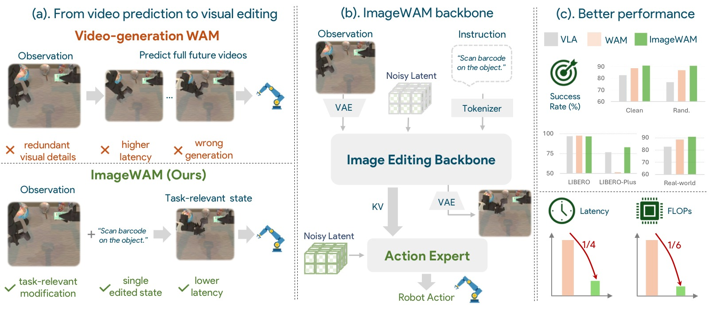
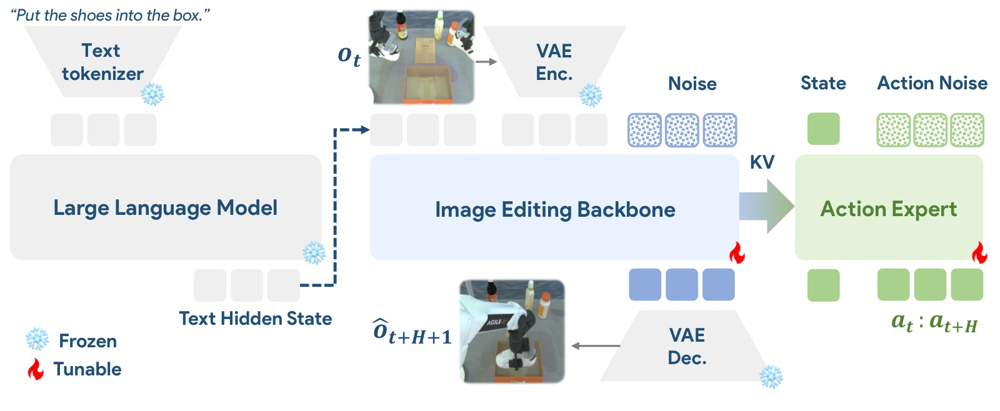
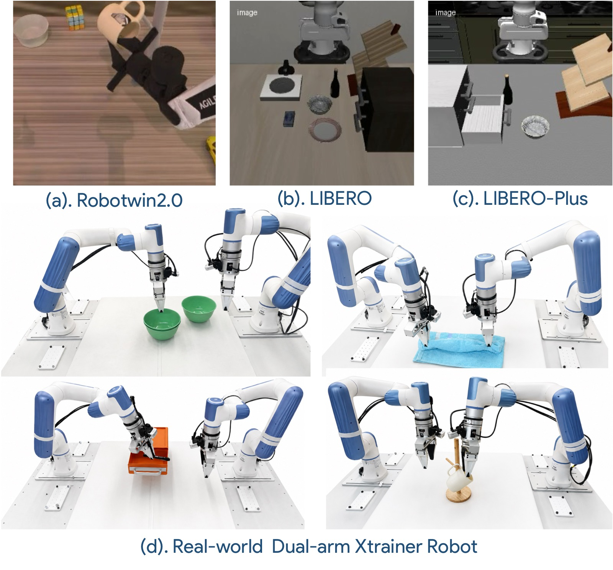
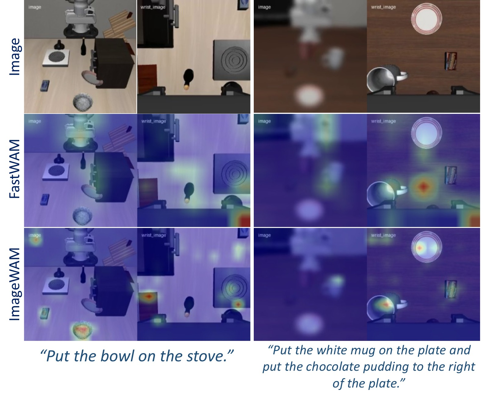
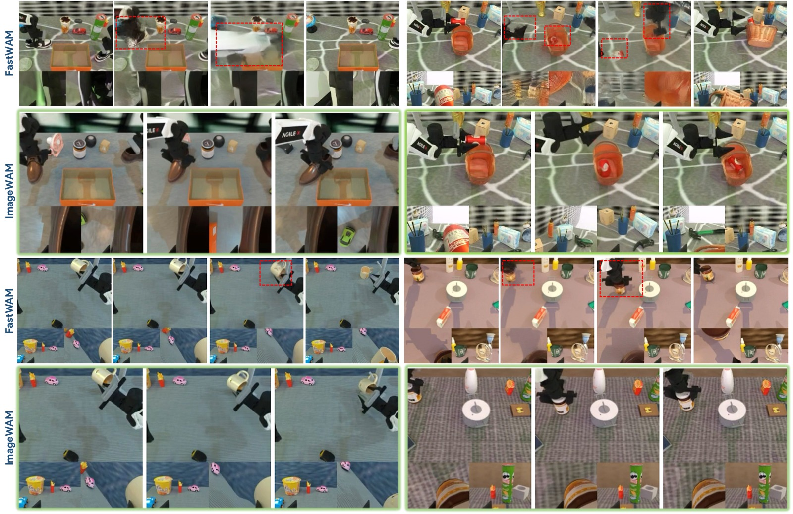

<!-- arxiv: 2606.19531 -->
<!-- venue: 投稿（under review） -->
<!-- tags: WAM, VLA, 扩散模型 -->

# ImageWAM: Do World Action Models Really Need Video Generation, or Just Image Editing?

> **论文信息**
> - 作者：Yuyang Zhang*, Wenyao Zhang*, Zekun Qi, He Zhang, Haitao Lin, Jingbo Zhang, Yao Mu, Xiaokang Yang, Wenjun Zeng, Xin Jin
> - 通讯作者：Xin Jin
> - 机构：上海交通大学（SJTU），东部理工学院（Eastern Institute of Technology），腾讯 Robotics X，清华大学，中关村实验室
> - 投稿方向：投稿（under review）
> - arXiv ID：2606.19531
> - 项目主页：https://zhangwenyao1.github.io/ImageWAM/
> - 代码：https://github.com/yuyangalin/ImageWAM
> - 日期：2026-06-25
>
> 本文基于以下本地材料整理：
>
> - 论文 TeX 源码：`arXiv-2606.19531v1/`（主文件：`main.tex`，附录：`sup.tex`）
> - 论文插图：`arXiv-2606.19531v1/figs/*.pdf`（teaser0529.pdf、framework.pdf、exp.pdf、attention.pdf、imagevsvideo.pdf）
> - 官方代码：`ImageWAM/`（基于 FastWAM 框架，支持 FLUX.2 / OmniGen2 / Ovis-U1 三种图像编辑 backbone）
> - 本文图片导出目录：`assets/imagewam/`

---



*图1：ImageWAM 的核心主张对比图。上图 (a) 展示传统视频生成 WAM 的"先想象再行动"范式：模型需要预测从当前观测 o_t 到未来多帧 o_{t+1:t+H+1} 的完整视频轨迹，然后再从视频中提取信息来预测动作序列 a_{t:t+H}。这种范式有三个问题：① 需要生成稠密的多帧时空 token，推理成本高；② 大量模型容量浪费在行动无关的外观细节、背景变化和相机运动上；③ 生成的未来视频可能包含物理不一致的伪影，误导下游动作预测。下图 (b) 展示 ImageWAM 的方案：使用图像编辑 backbone 替代视频生成，模型只需预测从当前观测到目标状态的单帧变换 o_t → \hat{o}_{edit}，中间编辑去噪过程的 KV caches 作为紧凑的"世界动作上下文"直接输入 Action Expert（flow-matching Action DiT），推理时完全不解码未来帧。核心优势：1/4 延迟、1/6 FLOPs，同时保持竞争力。*

---

## 一、核心问题

当前 World Action Models（WAMs）普遍依赖视频生成模型作为世界动作推理的 backbone。典型的视频 WAM 遵循"先想象再行动"范式：

```text
视频 WAM: (当前观测 o_t, 语言指令 l) → 预测未来视频帧 ō_{t+1:t+H+1} → 预测动作 a_{t:t+H}
```

这个范式存在三个耦合的局限性：

1. **推理代价高昂**：视频生成需要预测稠密的多帧未来 token（每帧包含大量空间 token），导致 inference latency 和 FLOPs 很高，难以满足实时控制需求。

2. **容量浪费在行动无关细节上**：视频生成模型必须建模完整场景演化——包括外观细节、背景变化、相机运动、时间平滑性等——这些与机器人下一步动作只有弱相关性。大量的模型容量被用于无关视觉细节。

3. **长程未来想象引入错误**：生成物理一致的未来视频本身就是困难的代理任务。对于精细操作任务中的微小接触事件、物体位移或构型变化，视频预测极易出错。如果未来视频是错的，基于其预测的动作也会被误导。

> **ImageWAM 的核心论点**：世界动作模型不需要完整的视频生成——来自图像编辑（image editing）模型的中间表征（KV caches）就可以提供足够的"世界动作上下文"，而且更高效、更聚焦于行动相关的视觉变化。

---

## 二、核心思路 / 方法

### 2.1 核心洞察：图像编辑 > 视频生成

论文指出，图像编辑模型具有三个适用于机器人策略学习的天然优势：

**优势一：指令到变化的对齐（Instruction-to-Change Alignment）。** 图像编辑的预训练目标直接将语言指令与视觉变化耦合——模型需要理解"什么应该变化、在哪里变化、如何变化"。这与机器人策略的决策逻辑高度一致。

**优势二：更简单且更行动相关的代理任务。** 图像编辑只需要建模"当前状态 → 指令一致的目标状态"之间的视觉差异，而不是完整的时空轨迹。这避免了在无关时间细节上浪费容量。

**优势三：更紧凑的推理路径。** 策略可以使用图像编辑内部的编辑感知表征（KV caches）作为条件，而不需要在推理时解码完整的编辑图像。即：**只提取中间特征，不解码最终图像**。

### 2.2 ImageWAM 架构



*图 2：ImageWAM Pipeline 架构。给定语言指令 l 和当前观测 o_t，图像编辑 backbone（如 FLUX.2 / OmniGen2 / Ovis-U1）生成未来帧 o_{t+H+1}（仅训练时需要）。中间的编辑 KV caches 通过 MoT（Mixture of Transformers）joint attention 传递给 Action Expert（flow-matching Action DiT），Action Expert 同时以机器人状态（proprioception）和动作噪声为条件，预测未来动作序列 a_{t:t+H}。关键设计：推理时不解码编辑图像，只提取编辑 KV caches。*

ImageWAM 的总体流水线可以形式化为两步：

```text
训练时:  (o_t, l) → 编辑 backbone 去噪 → 编辑 KV caches → Action DiT → a_{t:t+H}
推理时:  (o_t, l) → 编辑 backbone 单步前向 → 编辑 KV caches → Action DiT (3步去噪) → a_{t:t+H}
```

训练时的目标未来帧是 $\hat{o}_{\mathrm{edit}} \equiv \hat{o}_{t+H+1}$，即当前观测在指令 $l$ 下执行动作循环 $H$ 步后的单帧目标状态。

对比视频 WAM 的"多帧稠密预测"，ImageWAM 只预测一个目标端点帧，作为紧凑的世界动作中间件。

### 2.3 编辑 KV Caches 提取

训练时，随机采样一个编辑去噪步 $\tau$，运行编辑 backbone 在该步的前向传播，收集每层 transformer 的 KV cache：

$$
\mathcal{C}_{\mathrm{edit}}^{\tau}
=
\left\{
(K_{\ell}^{\tau}, V_{\ell}^{\tau})
\right\}_{\ell=1}^{L}
=
f_{\mathrm{edit}}^{\tau}(o_t, l),
$$

其中 $L$ 是 transformer 层数。$\mathcal{C}_{\mathrm{edit}}^{\tau}$ 包含了 visual latent 经过语言指令交互后的信息——它编码了任务条件下的视觉变换信息，而不需要解码出最终的编辑图像。

推理时，选择一个固定的编辑去噪步 $\tau^\star$，执行一次编辑 backbone 前向传播得到 KV caches：

$$
\mathcal{C}_{\mathrm{edit}}^{\tau^\star}
=
f_{\mathrm{edit}}^{\tau^\star}(o_t, l).
$$

### 2.4 Action Expert（Flow-Matching Action DiT）

Action Expert 以编辑 KV caches 为条件，使用 flow matching 目标生成动作 chunk。动作 chunk 由 $H$ 个连续动作组成（LIBERO 和 RoboTwin 中 H=16）。

推理时，Action DiT 在编辑 KV caches 条件下执行动作去噪（论文默认 3 步去噪），生成动作：

$$
\hat{\mathbf{a}}_{t:t+H}
\sim
p_\theta(
\mathbf{a}_{t:t+H}
\mid
o_t, l, \mathcal{C}_{\mathrm{edit}}^{\tau^\star}
).
$$

### 2.5 MoT（Mixture of Transformers）—— 四种 token 的联合注意力

MoT 是连接编辑 backbone 和 Action Expert 的核心架构。它将原有的自注意力机制扩展为四种 token 类型的联合自注意力：

1. **语言上下文 token（Language Context）**：VLM（Qwen2.5-VL-3B / Qwen3-4B/8B）编码的指令和视觉理解嵌入
2. **视觉条件 token（Visual Condition）**：当前观测 $o_t$ 经 VAE 编码后的 latent，作为编辑 backbone 的 reference image
3. **视觉预测 token（Visual Prediction）**：目标未来帧的噪声 latent（训练时逐渐去噪）
4. **动作 token（Action）**：Action DiT 中 flow matching 去噪的动作嵌入

注意力 mask 的设计：
- **动作 token**（Action）可以单向关注其他三种 token——它能"看到"语言、视觉条件和视觉预测的信息
- **噪声视觉 token**（Visual Prediction）只关注上下文 token，不干扰干净的上下文特征

> **关键设计**：Action token 是唯一能"看到"全部四种 token 的角色。这确保了动作预测能够同时利用语言理解、当前视觉状态和未来视觉变换信息，而不会让视觉预测信息的噪声干扰去噪过程。

### 2.6 Three Backbone Variants

ImageWAM 支持三种图像编辑 backbone，均使用类似架构设计：

| Variant | LLM Backbone | Image DiT | Action DiT 参数量 | 特点 |
|---------|-------------|-----------|-------------------|------|
| **FLUX.2** 4B | Qwen3-4B | FLUX.2 klein-base-4B | 642M | 推荐，性能最强 |
| **FLUX.2** 9B | Qwen3-8B | FLUX.2 klein-base-9B | 952M | 更大 backbone，鲁棒性提升 |
| **OmniGen2** | Qwen2.5-VL-3B | OmniGen2 DiT | 760M | 基于 Qwen2.5-VL |
| **Ovis-U1** | Qwen3-1.7B | Ovis-U1 DiT (1.1B) | 1.1B | 最小变体，适合资源受限场景 |

---

## 三、训练目标

### 3.1 图像编辑目标（Image Flow Matching Loss）

编辑分支训练来预测任务相关的未来端点帧。设 $o_{t+H+1}$ 为目标未来观测，$z^{*}_{t+H+1}=E_{\mathrm{vae}}(o_{t+H+1})$ 为 VAE 编码的 latent。采样图像噪声 $\epsilon_z \sim \mathcal{N}(0,I)$ 和图像 flow time $r \in (0,1)$，构造插值 latent：

$$
z_r
=
(1-r) z^{*}_{t+H+1}
+
r \epsilon_z .
$$

图像 diffusion 分支预测速度场：

$$
\mathcal{L}_{\mathrm{img}}
=
\mathbb{E}_{z^{*}, \epsilon_z, r}
\left[
\left\|
u_\phi(
z_r,
r
\mid
o_t, l
)
-
(\epsilon_z - z^{*}_{t+K})
\right\|_2^2
\right],
$$

其中 $u_\phi$ 是图像分支的速度预测器。

### 3.2 Action Flow Matching Loss

设 $\mathbf{a}^{*}_{t:t+H}$ 为 expert action chunk，$\epsilon_a \sim \mathcal{N}(0,I)$ 为高斯噪声。采样 action flow time $s \in (0,1)$，构造插值动作样本：

$$
\mathbf{a}_s
=
(1-s)\mathbf{a}^{*}_{t:t+H}
+
s\epsilon_a .
$$

以当前观测、语言指令和编辑 KV caches $\mathcal{C}_{\mathrm{edit}}^{\tau}$ 为条件，Action Expert 预测速度场：

$$
\mathcal{L}_{\mathrm{act}}
=
\mathbb{E}_{\mathbf{a}^{*}, \epsilon_a, s, \tau}
\left[
\left\|
v_\theta(
\mathbf{a}_s,
s
\mid
o_t, l, \mathcal{C}_{\mathrm{edit}}^{\tau}
)
-
(\epsilon_a - \mathbf{a}^{*}_{t:t+H})
\right\|_2^2
\right].
$$

### 3.3 联合优化

联合优化图像分支和 Action Expert：

$$
\mathcal{L} = \mathcal{L}_{\mathrm{act}} + \mathcal{L}_{\mathrm{img}}.
$$

关键设计：
- 随机采样 $\tau$（编辑去噪步数）在训练时让 Action Expert 接触到不同去噪阶段的编辑 cache，增强鲁棒性
- 冻结 VLM 和 multimodal understanding 组件，仅训练 diffusion 图像分支和 Action Expert
- Action DiT 采用 weight-copy 初始化：从编辑 backbone 复制权重并插值到 Action DiT 的尺寸

### 3.4 高效推理设计（Prefix-Only Inference）

与 FastWAM 类似的 prefix-only attention 策略：

1. **训练时**：编辑 backbone 正常执行去噪，提取中间层 KV caches
2. **推理时**：
   - 不运行完整去噪轨迹，只选固定 $\tau^\star$
   - 一次编辑 backbone 前向传播 → 提取 KV caches
   - Action Expert 在这些 cache 上执行 3 步 flow matching 去噪生成动作
   - **不编辑未来帧、不解码编辑图像**

这种设计将推理 latency 从视频 WAM 的 1081ms 降到 263ms（1/4），FLOPs 从 63.65 降到 9.72（1/6）。

---

## 四、实验与结果

### 4.1 RoboTwin 2.0 结果



*图 3：实验设置概览。左半部分展示 RoboTwin 2.0（双臂操作，50+ 任务，Clean / Randomized 两种评估设置）、LIBERO（Spatial / Object / Goal / Long 四个 suite）和 LIBERO-Plus（7 种扰动维度，373 个实验变体）的仿真环境。右半部分展示真实机器人实验的四项任务（堆叠三个碗、折叠毛巾、打开抽屉并存放标记笔、将杯子挂到架子上），使用 Dobot XTrainer 双臂机器人平台。*

**RoboTwin 2.0 主表**（Clean 和 Randomized 两种评估设置）：

| Method | P.T. | Clean | Rand. | Avg. |
|--------|:----:|:-----:|:-----:|:----:|
| $\pi_0$ | Yes | 65.92 | 58.40 | 62.16 |
| $\pi_{0.5}$ | Yes | 82.74 | 76.76 | 79.75 |
| ABot-M0 | No | 81.20 | 80.40 | 80.80 |
| Motus | Yes | 88.66 | 87.02 | 87.80 |
| LingBot-VA | Yes | 92.90 | 91.50 | 92.20 |
| FastWAM | No | 91.88 | 91.78 | 91.83 |
| **ImageWAM (Ours)** | **No** | **93.20** | **93.56** | **93.38** |

P.T. = Policy Pretraining（额外的策略预训练，通常包含海量机器人数据微调）。ImageWAM 没有使用任何额外策略预训练，仅在下游 benchmark 数据上训练，就超越了所有 VLA 和 WAM 基线。

> **关键发现**：ImageWAM 在 Randomized 设置下（93.56%）甚至高于 Clean 设置（93.20%），说明编辑 backbone 提供的 source-conditioned 变换特征对场景随机化具有天然的鲁棒性。

### 4.2 LIBERO 结果

| Method | P.T. | Spatial | Object | Goal | Long | Avg. |
|--------|:----:|:-------:|:------:|:----:|:----:|:----:|
| OpenVLA | Yes | 84.7 | 88.4 | 79.2 | 53.7 | 76.5 |
| GR00T N1 | Yes | 84.7 | 88.4 | 79.2 | 53.7 | 76.5 |
| $\pi_0$ | Yes | 96.8 | 98.8 | 95.8 | 85.2 | 94.1 |
| $\pi_{0.5}$ | Yes | 98.8 | 98.2 | 98.0 | 92.4 | 96.9 |
| LingBot-VA | Yes | 98.5 | 99.6 | 97.2 | 98.5 | 98.5 |
| Motus | Yes | 96.8 | 99.8 | 96.6 | 97.6 | 97.7 |
| FastWAM | No | 98.2 | 100.0 | 97.0 | 95.2 | 97.6 |
| **ImageWAM (Ours)** | **No** | **97.2** | **99.2** | **98.8** | **98.4** | **98.4** |

LIBERO-Long 长程任务 98.4%，接近 SOTA 的 LingBot-VA（98.5%），但 ImageWAM 没有使用任何额外策略预训练。

### 4.3 LIBERO-Plus 结果（FLUX.2 4B）

| Method | P.T. | Camera | Robot | Language | Light | Background | Noise | Layout | Avg |
|--------|:----:|:------:|:-----:|:--------:|:-----:|:----------:|:-----:|:------:|:---:|
| UniVLA | Yes | 1.8 | 46.2 | 69.6 | 69.0 | 81.0 | 21.2 | 31.9 | 42.9 |
| OpenVLA-OFT | Yes | 56.4 | 31.9 | 79.5 | 88.7 | 93.3 | 75.8 | 74.2 | 69.6 |
| $\pi_0$ | Yes | 13.8 | 6.0 | 58.8 | 85.0 | 81.4 | 79.0 | 68.9 | 53.6 |
| $\pi_0$-Fast | Yes | 65.1 | 21.6 | 61.0 | 73.2 | 73.2 | 74.4 | 68.8 | 61.6 |
| WorldVLA | Yes | 0.1 | 27.9 | 41.6 | 43.7 | 17.1 | 10.9 | 38.0 | 25.0 |
| FastWAM | No | 16.4 | 44.5 | 68.9 | 78.2 | 53.7 | 37.7 | 60.7 | 51.5 |
| **ImageWAM (OmniGen2)** | **No** | 80.0 | 49.2 | 70.9 | 82.6 | 69.4 | 77.1 | 71.8 | 71.8 |
| **ImageWAM (Ovis-U1)** | **No** | 63.3 | 58.4 | 75.4 | 86.3 | 66.7 | 75.2 | 74.6 | 71.2 |
| **ImageWAM (FLUX.2 4B)** | **No** | **80.8** | **50.3** | **91.4** | **98.1** | **85.5** | **93.8** | **80.5** | **83.1** |

> **关键发现**：FLUX.2 4B 变体在不使用任何额外策略预训练的情况下，以 83.1% 的平均成功率大幅超越所有基线。在 Language（91.4%）、Light（98.1%）、Noise（93.8%）和 Layout（80.5%）等多个扰动维度上均为最优。

### 4.4 LIBERO-Plus 更大 backbone 对比

| Method | P.T. | Camera | Robot | Language | Light | Background | Noise | Layout | Avg |
|--------|:----:|:------:|:-----:|:--------:|:-----:|:----------:|:-----:|:------:|:---:|
| ImageWAM (FLUX.2 4B) | No | 80.8 | 50.3 | 91.4 | 98.1 | 85.5 | 93.8 | 80.5 | **83.1** |
| ImageWAM (FLUX.2 9B) | No | 79.8 | 58.7 | 95.2 | 96.1 | 91.2 | 93.3 | 83.1 | **85.2** |

FLUX.2 9B 将平均成功率从 83.1% 提升到 85.2%，主要贡献来自 Robot、Language、Background 和 Layout 扰动维度。但 Camera、Light 和 Noise 维度没有单调提升——说明 backbone scaling 的收益与具体扰动类型在编辑 cache 中的对齐程度有关。

### 4.5 真实机器人实验结果

| Method | T1 (Stack Three Bowls) | T2 (Fold Towel) | T3 (Open Drawer & Store Marker) | T4 (Hang Cup On Rack) | Avg |
|--------|:------:|:------:|:------:|:------:|:----:|
| $\pi_0$ | 57 | 58 | 54 | 54 | 55.8 |
| $\pi_{0.5}$ | 83 | 77 | 74 | 55 | 72.3 |
| FastWAM | 88 | 75 | 77 | 76 | 79.0 |
| **ImageWAM (Ours)** | **94** | **84** | **78** | **82** | **84.5** |

> **关键发现**：ImageWAM 在所有四项真实任务上均为最优。最大提升在 T2（折叠毛巾）：比 FastWAM 高 9 个百分点（84% vs 75%），说明编辑上下文对可变形物体的视觉变换推理尤其有效。T3（打开抽屉 + 存放标记笔）上，WAM 类方法（FastWAM 77%, ImageWAM 78%）远超 $\pi_0$（54%），说明世界动作推理有助于缓解视觉遮挡的影响。

### 4.6 推理效率对比

| Method | Latency (ms) | TFLOPs | Intermediate Type |
|--------|:-----------:|:------:|:-----------------:|
| FastWAM-IDM | 1081 | 63.65 | Video |
| FastWAM (1 Step) | 302 | 13.21 | Cache |
| **ImageWAM (Ours)** | **263** | **9.72** | **Cache** |

ImageWAM 将 latency 降到 263ms（视频 WAM 的 1/4），FLOPs 降到 9.72（视频 WAM 的 1/6）。

### 4.7 推理延迟优化（附录）

| Variant | Latency (ms) | Speedup |
|---------|:-----------:|:-------:|
| FastWAM (1x Video Denoise) | 302 | 1.00x |
| ImageWAM (1x Video Denoise) | 263 | 1.15x |
| FastWAM (Prefix Only) | 194 | 1.56x |
| + Compiled | 80 | 3.78x |
| ImageWAM (Prefix Only) | 198 | 1.53x |
| + Action Loop Compile | 85 | 3.55x |
| + Image Prefill Compile | 77 | 3.92x |
| + Action Static Graph | 69 | 4.38x |

使用 torch.compile + static CUDA graphs 后，ImageWAM 推理延迟可降至 69ms，相比 FastWAM 基线实现 4.38x 加速。

### 4.8 与统一理解-生成模型的对比

| Method | P.T. | LIBERO | RoboTwin2.0 Clean Only | RoboTwin2.0 Clean2Hard |
|--------|:----:|:-----:|:----------------------:|:----------------------:|
| UniVLA | Yes | 95.5 | -- | -- |
| BagelVLA (w/ K.F.) | Yes | -- | 75.3 | 20.9 |
| BagelVLA (w/o K.F.) | Yes | -- | 56.7 | 15.9 |
| **ImageWAM (Ours)** | **No** | **98.4** | **84.4** | **18.3** |

在相似的 non-keyframe 未来预测设置下，不使用额外策略预训练的 ImageWAM 大幅超过统一模型（UniVLA 和 BagelVLA）。

### 4.9 训练超参数与成本

**通用训练超参数**：

| 参数 | 值 |
|------|:----:|
| GPUs | 8 NVIDIA H20 |
| 分布式策略 | DeepSpeed ZeRO-1（FLUX.2 9B 使用 ZeRO-2） |
| 精度 | bf16 |
| 优化器 | AdamW |
| 学习率 | $1 \times 10^{-4}$ |
| Weight decay | $1 \times 10^{-2}$ |
| LR scheduler | Warmup cosine |
| Warmup steps | $0.05 T_{\mathrm{total}}$ |
| 最小 LR | $0.01 \times \mathrm{lr}$ |
| Gradient clipping | 1.0 |

**数据集特定配置**：

| 参数 | LIBERO | RoboTwin |
|------|:------:|:--------:|
| 输入视图数 | 2 | 3 |
| 视图布局 | 水平拼接 | 腕部水平 + 垂直拼接 |
| 输入分辨率 | $224 \times 448$ | $288 \times 256$ |
| 未来帧预测步 | 16 | 16 |
| Action chunk 长度 | 16 | 16 |
| 训练 epoch | 10 | 5 |

**训练成本**：

| Benchmark | Model | Time | Batch/GPU |
|-----------|:-----:|:----:|:---------:|
| LIBERO | OmniGen2 | 18 hours | 12 |
| LIBERO | Ovis-U1 | 18 hours | 16 |
| LIBERO | FLUX.2 4B | 18 hours | 10 |
| LIBERO | FLUX.2 9B | 1.6 days | 12 |
| RoboTwin | OmniGen2 | 5 days | 48 |
| RoboTwin | FLUX.2 4B | 5 days | 48 |
| Real-World | OmniGen2 | 18 hours | 16 |

---

## 五、关键洞察与技术亮点

### 5.1 为什么图像编辑 < 视频生成做 WAM

论文的核心论点可以从三个维度理解：

**1. 表征密度（Representation Density）。** 视频 WAM 需要为多个未来帧的每个空间位置生成 token——一个 $T \times H \times W$ 的时空网格。ImageWAM 只需要一组层级的 KV caches（$L$ 层 × 每层的 key/value 序列）。后者的维度远小于前者，同时保留了足够的视觉变换信息用于动作预测。

**2. 信息聚焦（Information Focus）。** 视频生成必须建模所有视觉细节（背景、光照、纹理等），而图像编辑天然专注于"发生了什么变化"。对于操作任务，成功的决策通常只需要理解"物体被移动到哪里""夹爪与物体的接触点"等变化信息。编辑模型的预训练目标恰好强化了这种 change-centric 的表示能力。

**3. 推理效率（Inference Efficiency）。** 图像编辑 backbone 可以在推理时不解码最终图像——只提取中间 KV caches → 动作预测。而视频 WAM 必须执行完整的多步去噪才能得到表征。这导致 ImageWAM 的延迟只有视频 WAM 的 1/4，FLOPs 只有 1/6。

### 5.2 "No Future Frame Decoding at Inference" 设计

这是 ImageWAM 最重要的工程设计决策：

```text
训练时: 编辑 backbone 执行完整去噪 → 提取过程中所有层的 KV caches → Action Expert 以 KV caches 为条件
推理时: 编辑 backbone 仅执行一次前向传播 → 提取单步 KV caches → Action Expert 以 KV caches 为条件生成动作
        不执行编辑图像解码、不产生最终编辑图像
```

这个设计意味着 ImageWAM 在推理时**完全不需要运行 diffusion 去噪链**，只需要一次 transformer 前向即可。对比视频 WAM（需要多次去噪步来生成多帧未来），这是 100 倍以上的计算节省。

### 5.3 Frozen VLM + Trainable Diffusion 的解耦

ImageWAM 保持 VLM 组件的冻结，只训练 diffusion 图像分支和 Action Expert：

- **冻结 VLM**（Qwen2.5-VL / Qwen3）：提供稳定的语言-视觉 conditioning。VLM 的多模态理解能力来自大规模预训练，不需要在下游任务中更新
- **可训练 Diffusion 分支**：学习预测任务相关的未来端点帧，产生对动作预测有用的编辑 caches
- **Action Expert**：直接接受 RL 风格的策略学习信号

这种解耦设计避免了下游任务训练破坏 VLM 的通用理解能力，同时也利用了 VLM 的大规模预训练。与统一理解-生成模型（如 UniVLA 和 BagelVLA）相比，这种解耦避免了理解和生成两种目标之间的干扰。

### 5.4 Attention 可视化分析



*图 4：Attention 可视化对比——ImageWAM vs FastWAM。左半边展示 ImageWAM（FLUX.2 4B）的 action token attention 热力图，右半边展示 FastWAM 的 attention 热力图。每条水平线对应一个动作 token（action chunk 长度为 16 时共 16 行），横轴为条件序列的 token 位置。ImageWAM 的 attention 集中在任务相关的变化区域（操作物体、目标位置、接触区域），而 FastWAM 的 attention 更分散，覆盖了更大的背景区域。这说明编辑 caches 编码了 source-grounded 且 change-centric 的视觉信息，为 Action Expert 提供了更精准的上下文。*

### 5.5 视频伪影对比



*图 5：未来视频伪影可能误导动作预测。图中展示了一个视频 WAM 基线的失败案例：生成的未来帧在任务相关物体周围出现明显的伪影（几何形变、空间布局不一致），这些伪影作为动作条件会导致策略失败。ImageWAM 避免了稠密未来视频的想象，直接将紧凑的图像编辑 caches 作为动作条件上下文。上方（Video-WAM）展示了两个时间步的未来帧：在时间步 N 帧后，生成的物体表面出现扭曲和模糊；在时间步 N+K 帧后，物体的几何形状进一步失真、空间关系不再符合物理规律。下方（ImageWAM，Ours）标注为"没有未来帧生成"——因为 ImageWAM 不解码任何未来帧，所以不会出现这种伪影累积问题。*

---

## 六、代码实现解读

ImageWAM 的官方代码基于 FastWAM 框架，使用 Python + PyTorch 实现。核心模型在 `src/imagewam/models/backbones/` 目录下。以下按模块分析关键实现。

### 6.1 整体架构

```
ImageWAM (顶层模型，src/imagewam/models/backbones/imagewam.py)
│
├── video_expert (扩散图像编辑 backbone)
│   ├── FLUX.2 变体: Flux2VideoExpert (flux2_video_expert.py)
│   ├── OmniGen2 变体: OmniGen2VideoExpert (omnigen2_video_expert.py)
│   └── Ovis-U1 变体: OvisU1VideoExpert (ovis_u1_video_expert.py)
│
├── action_expert (Action DiT, 不同变体)
│   ├── 基础 ActionDiT: action_dit.py (Wan22 协议)
│   ├── FLUX.2 变体: ActionDiTFlux2 (action_dit_flux2.py)
│   ├── OmniGen2 变体: ActionDiTOmnigen2 (action_dit_omnigen2.py)
│   └── Ovis-U1 变体: ActionDiTYak (action_dit_yak.py)
│
├── mot: MoT (Mixture of Transformers, mot.py)
│   ├── video_expert.blocks → 视觉和语言 token 的处理
│   ├── action_expert.blocks → 动作 token 的处理
│   └── _mixed_attention() → 四种 token 类型的联合注意力
│
├── vae (图像编码器/解码器)
│   ├── Wan22 VAE (来自 Wan-AI)
│   ├── OmniGen2 VAE (AutoencoderKL)
│   ├── Ovis-U1 VAE (来自 Ovis-U1 visual_generator)
│   └── FLUX.2 AE (AutoEncoder from flux2)
│
└── text_encoder (VLM)
    ├── Qwen2.5-VL-3B (OmniGen2 变体)
    ├── Qwen3-4B/8B (FLUX.2 变体)
    └── Qwen3-1.7B (Ovis-U1 变体)
```

### 6.2 Key Class: ImageWAM（顶层模型）

`ImageWAM` 类（`imagewam.py`）是所有变体共有的顶层容器，负责：

- **模型初始化**：通过五个 `from_*_pretrained()` 工厂方法加载不同 backbone 的预训练权重
- **数据预处理**：`build_inputs()` 系列方法将原始样本编码为 model-ready 的 tensor
- **VAE 编解码**：`_encode_video_latents()` / `_decode_latents()` 等方法
- **文本编码**：处理 VLM 的文本和视觉输入
- **训练/推理调度**：使用 `WanContinuousFlowMatchScheduler` 控制去噪步

`ImageWAM` 的构造函数接受以下关键参数：

```python
class ImageWAM(torch.nn.Module):
    def __init__(
        self,
        video_expert,      # 扩散图像编辑 backbone
        action_expert,     # Action DiT
        mot,               # MoT (Mixture of Transformers)
        vae,               # 图像编码/解码器
        text_encoder,      # VLM (Qwen 等)
        tokenizer,         # 文本分词器
        text_dim,          # 文本嵌入维度
        proprio_dim,       # 本体感知维度 (可选)
        loss_lambda_video=1.0,  # 图像 loss 权重
        loss_lambda_action=1.0, # 动作 loss 权重
        ...
    )
```

### 6.3 Key Class: MoT（Mixture of Transformers）

`MoT` 类（`mot.py`）是连接编辑 backbone 和 Action Expert 的核心架构。关键设计：

**初始化**: 接收 `mixtures` 字典（至少包含 `"video"` 和 `"action"` 两个 expert），检查两者的 `num_layers`、`num_heads`、`num_kv_heads`、`attn_head_dim`、`block_protocol` 是否一致。这确保了两种 expert 在每层的 attention head 配置兼容，是实现 joint attention 的前提。

**四种 token 类型的 joint attention**: MoT 的 `forward()` 方法遍历每一层，调用 `_build_expert_attention_io()` 为每个 expert 提取 Q/K/V，然后将所有 expert 的 Q/K/V 拼接成全序列，执行一次 `_mixed_attention()`：

```python
# MoT.forward() 中的核心逻辑（简化）
for layer_idx in range(self.num_layers):
    q_chunks, k_chunks, v_chunks = [], [], []
    for name in self.expert_order:  # ["video", "action"]
        expert = self.mixtures[name]
        block = expert.blocks[layer_idx]
        built = self._build_expert_attention_io(expert, block, tokens_all[name], ...)
        q_chunks.append(built["q"])
        k_chunks.append(built["k"])
        v_chunks.append(built["v"])
    
    # 一次联合注意力（4种 token 一起）
    mixed = self._mixed_attention(
        q_cat=torch.cat(q_chunks, dim=1),
        k_cat=torch.cat(k_chunks, dim=1),
        v_cat=torch.cat(v_chunks, dim=1),
        attention_mask=attention_mask,  # 控制 token 之间的可见性
    )
    
    # 按 expert 分离注意力输出，分别应用 post-block
    for name, seq_len in zip(self.expert_order, seq_lens):
        tokens_all[name] = self._apply_post_with_optional_checkpoint(
            block=..., mixed_slice=mixed[:, start:end, :], ...
        )
```

**Attention mask 的 one-way 设计**: 论文使用 attention mask 实现动作 token 的单向关注：
- Action token 可以关注所有其他 token（语言、视觉条件、视觉预测）
- 噪声视觉 token 只关注上下文 token（不关注动作和其他噪声 token）
- 这确保动作预测能获得充分的上下文信息，同时视觉去噪不受动作预测的干扰

**Prefix-only inference 支持**: `prefill_video_cache()` 和 `forward_action_with_video_cache()` 实现了编辑 backbone KV caches 的预填充和动作 token 的条件生成。这对应论文中推理时"一次前向 → KV caches → Action DiT 去噪"的高效流程。

### 6.4 Key Class: ActionDiT

`ActionDiT` 类（`action_dit.py`）是 flow matching 动作头，与编辑 backbone 使用相同的 transformer block 架构。核心结构：

```python
class ActionDiT(nn.Module):
    def __init__(self, hidden_dim, action_dim, ffn_dim, text_dim, freq_dim,
                 eps, num_heads, attn_head_dim, num_layers, ...):
        # 动作输入编码器: 将连续动作映射到隐藏维度
        self.action_encoder = nn.Linear(action_dim, hidden_dim)
        # 文本条件嵌入: 将 VLM 输出映射到隐藏维度
        self.text_embedding = nn.Sequential(
            nn.Linear(text_dim, hidden_dim),
            nn.GELU(approximate="tanh"),
            nn.Linear(hidden_dim, hidden_dim),
        )
        # 时间条件嵌入: flow matching 的时间步嵌入
        self.time_embedding = nn.Sequential(
            nn.Linear(freq_dim, hidden_dim),
            nn.SiLU(),
            nn.Linear(hidden_dim, hidden_dim),
        )
        self.blocks = nn.ModuleList([DiTBlock(...) for _ in range(num_layers)])
        self.head = nn.Linear(hidden_dim, action_dim)  # 动作输出投影
```

Action DiT 与编辑 backbone 共享相同的 block 架构，但 `hidden_dim` 可以更小（FLUX.2 变体中使用 1024 以控制参数量），从而显著降低推理计算量。

**Weight-copy 初始化**: Action DiT 的权重从编辑 backbone 复制并插值。具体做法：
- 对于 OmniGen2 变体：直接从 OmniGen2 DiT 复制 weights
- 对于 FLUX.2 变体：lower layers 从 double-stream 的图像 stream 复制，higher layers 从 single-stream blocks 复制

### 6.5 训练流程

`Wan22Trainer` 类（`trainer.py`）基于 HuggingFace Accelerate + DeepSpeed：

```text
Wan22Trainer.fit()
│
├── accelerator.prepare(model, optimizer, loader, scheduler)
│   ← 自动集成 DeepSpeed ZeRO / FSDP
│
├── 每步训练循环:
│   ├── sample = next(train_loader)
│   ├── inputs = model.build_inputs(sample)
│   │   ← VAE encode + text encoding
│   ├── 采样 image noise ε_z, action noise ε_a
│   ├── 采 sample image flow time r, action flow time s
│   ├── 采样 editing denoising timestep τ
│   ├── 前向:
│   │   ├── video_expert 预测速度 → L_img
│   │   ├── 提取编辑 KV caches C_edit^τ
│   │   └── Action Expert 以 C_edit^τ 为条件预测速度 → L_act
│   ├── loss = L_img + L_act
│   └── accelerator.backward(loss)
│       ← DeepSpeed ZeRO gradients sync
```

### 6.6 公式 → 代码映射

| 论文公式 | 代码位置 | 说明 |
|---------|---------|------|
| 编辑 cache 提取 $\mathcal{C}_{\mathrm{edit}}^{\tau} = f_{\mathrm{edit}}^{\tau}(o_t, l)$ | `MoT.prefill_video_cache()` / `MoT.prefill_flux2_video_cache()` | 在每个 transformer block 中捕获 KV 对 |
| 动作条件预测 $v_\theta(\mathbf{a}_s, s \mid o_t, l, \mathcal{C}_{\mathrm{edit}}^{\tau})$ | `MoT.forward_action_with_video_cache()` / `MoT.forward_flux2_action_with_video_cache()` | 以预填充的 video cache 为 key/value 背景，action token 交叉关注 |
| 图像 flow matching loss $\mathcal{L}_{\mathrm{img}}$ | `imagewam.py` 中的训练循环（不单独封装，训练时直接用 video_expert 预测） | 连续流匹配：插值 latent, 预测速度 |
| 动作 flow matching loss $\mathcal{L}_{\mathrm{act}}$ | 同上的训练循环（action_expert 预测部分） | 连续流匹配：插值动作, 预测速度 |
| 联合 loss $\mathcal{L} = \mathcal{L}_{\mathrm{act}} + \mathcal{L}_{\mathrm{img}}$ | `imagewam.py` 构造函数中 `loss_lambda_video` 和 `loss_lambda_action` | 默认 1:1 加权 |
| Weight-copy 初始化 | `action_dit.py` + 各变体的 `from_pretrained()` | 复制编辑 backbone weights + 插值 |

---

## 七、局限性

1. **长程任务限制**。论文没有明确探索纯编辑 caches 在超长程任务（>100 步）上的表现。对于需要长期物理状态记忆的任务（如装配序列、多阶段操作），单帧目标端点可能不足以编码完整的任务结构。编辑 KV caches 作为"有损摘要"可能丢失长程依赖的关键信息。

2. **真实实验范围有限**。真实机器人实验仅在 4 个任务上评估，涉及场景和物体类型有限。论文没有在更加多样化的真机环境（如杂乱桌面、不可见物体类别、多机器人协作）中验证 ImageWAM 的泛化能力。

3. **对编辑 backbone 架构的依赖**。ImageWAM 的 KV cache 提取机制依赖于具体的图像编辑 backbone 架构（FLUX.2、OmniGen2、Ovis-U1），不是完全 plug-and-play 的。更换 backbone 需要为新的 transformer 结构适配 KV cache 提取逻辑。在三种变体中，KVCache 的提取策略都高度定制化了各自的 attention 机制（double-stream + single-stream 等）。

4. **未与最强预训练 VLA 完全对比**。在 LIBERO 上，一些基线（如 LingBot-VA、Motus）使用额外的策略预训练数据。ImageWAM 在不使用额外预训练的情况下表现极具竞争力（98.4% vs LingBot-VA 98.5%），但如果 ImageWAM 也进行大规模策略预训练，其上限尚未探索。

5. **Action DiT 的计算效率**。在典型 action chunk 长度下，动作 token 数量相对较少（远少于视觉 token），导致 Action DiT 的并行效率有时不够理想。论文在附录中提到，torch.compile 主要受益于 action head 的加速——这暗示 action head 在原生 PyTorch 中的计算效率仍有优化空间。

---

## 八、关键概念速查

| 概念 | 说明 |
|------|------|
| **WAM** | World Action Model，世界动作模型。在预测动作前引入视觉推理步骤的机器人策略范式 |
| **Image Editing** | 图像编辑。以源图像和语言指令为条件生成变换后的图像，ImageWAM 用其替代视频生成 |
| **KV Cache** | Key-Value Cache。Transformer 注意力中的键值对，ImageWAM 提取编辑去噪过程中的中间 KV caches 作为动作条件 |
| **MoT** | Mixture of Transformers。联合四种 token 类型（语言上下文、视觉条件、视觉预测、动作）的联合注意力机制 |
| **Flow Matching** | 流匹配。连续时间扩散框架，将数据分布插值到高斯噪声，训练模型预测速度场 |
| **Action Chunk** | 动作块。一次决策预测的连续动作序列（LIBERO 和 RoboTwin 中 chunk length = 16） |
| **Action DiT** | Action Diffusion Transformer。flow-matching 动作头，与编辑 backbone 相同架构但参数量更小（642M-1.1B） |
| **Prefix-Only Inference** | 前缀推理。推理时不解码未来帧，只使用编辑 backbone 的一次前向得到的 KV caches 作为动作条件 |
| **Weight-Copy Initialization** | 权重复制初始化。Action DiT 从编辑 backbone 复制权重并插值，加速早期训练 |
| **LIBERO-Plus** | LIBERO 的增强版评估基准，包含 7 种扰动维度（Camera, Robot, Language, Light, Background, Noise, Layout），共 373 个实验变体 |
