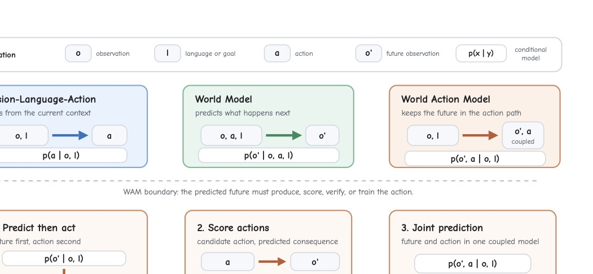
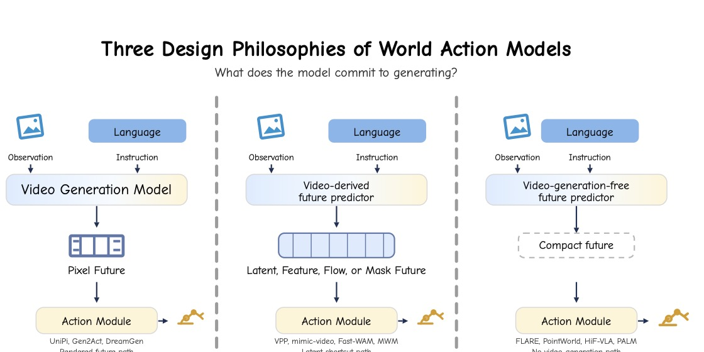
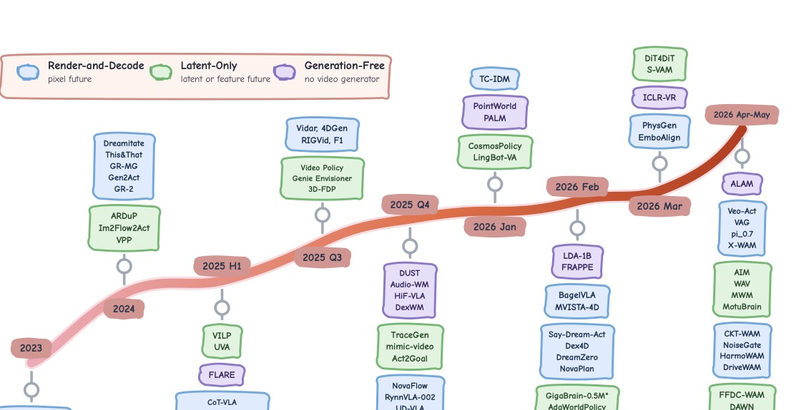
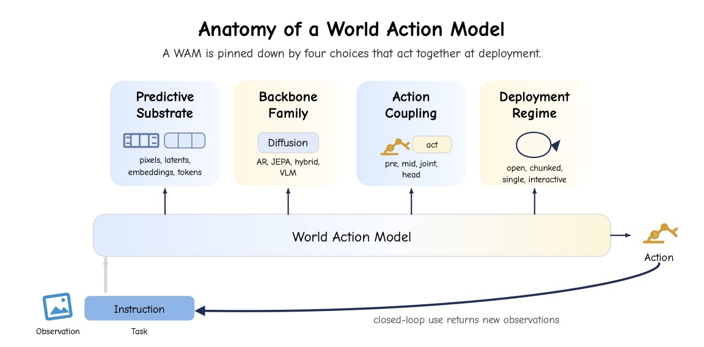
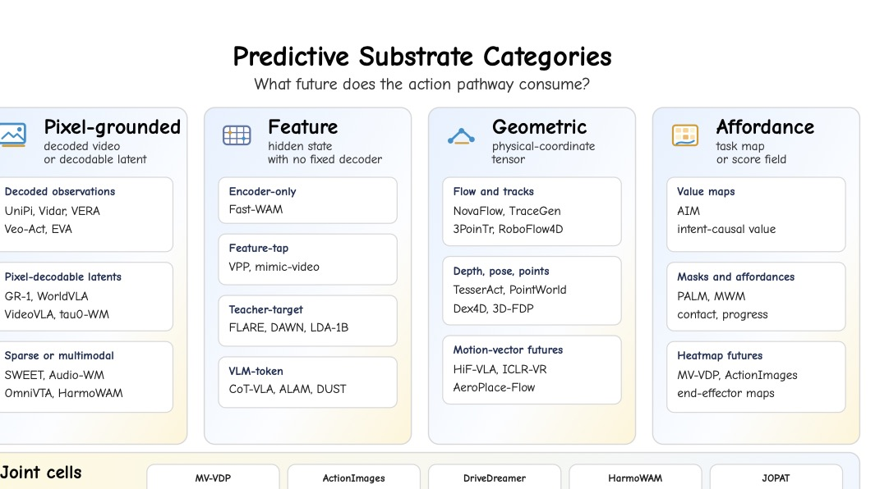
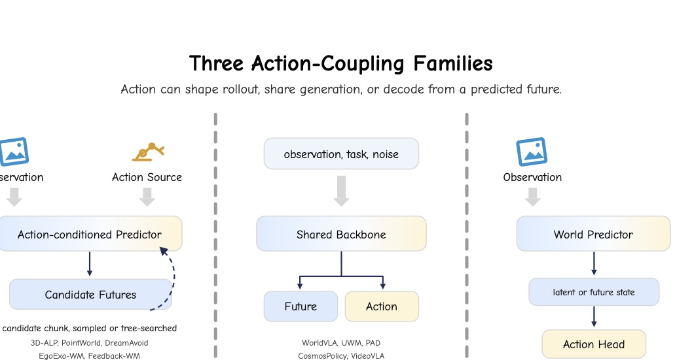

<!-- arxiv: 2606.20781 -->
<!-- venue: arXiv 2026 -->
<!-- tags: WAM, 世界模型, 综述, VLA, 视频生成 -->

# World Action Models: A Survey — 阅读笔记

> **论文信息**
> - 作者：Qiuhong Shen, Shihua Zhang, Yue Liao, Qi Li, Zhenxiong Tan, Shizun Wang, Shuicheng Yan, Xinchao Wang†
> - 通讯作者：Xinchao Wang
> - 机构：National University of Singapore
> - arXiv ID：2606.20781
> - 项目主页：https://world-action-models.github.io/
> - 日期：2026-06

---

## 一、一句话讲清楚

这篇综述给 World Action Models（WAMs）下了统一的定义：**WAM 是一种 embodied predictive-action model，它预测未来（predictive），并且把预测的未来用于产生、选择或校验动作（action-facing）**。论文的核心贡献不是提出新方法，而是用一套统一的框架（4-tuple 解剖 + 三大设计哲学 + 五大核心属性）把当前几百篇相关工作组织成一张可导航的地图。

```text
传统 VLA：observation → action（不预测未来）
WAM：     observation → predicted future → action（预测为动作服务）
关键区分：不是所有预测未来的模型都是 WAM，预测结果必须进入动作路径
```

---

## 二、核心问题：WAM 的边界在哪里？

### 2.1 五类模型的精确定义

论文第 2 节用损失函数形式化地划清了五个常被混淆的概念的边界：

| 模型类型 | 数学定义 | 关键特点 |
|---------|---------|---------|
| **VLA** | $\mathcal{L}_{\text{VLA}} = -\log p_\theta(a \mid o, l)$ | 直接从观测映射到动作，不建模未来 |
| **World Model** | $\mathcal{L}_{\text{WM}} = -\log p_\theta(o' \mid o, a, l)$ | 预测未来观测，但不负责选动作 |
| **Video Generation Model** | $\mathcal{L}_{\text{VGM}} = -\log p_\theta(o' \mid r)$ | 从 prompt 生成视频，与动作无关 |
| **Video World Model** | $\mathcal{L}_{\text{VWM}} = -\log p_\theta(o' \mid o, a, l)$ | 动作条件的视频预测器（World Model 的视觉特化） |
| **WAM** | $\mathcal{L}_{\text{WAM}} = -\log p_\theta(o', a \mid o, l)$ | 预测的未来必须进入动作路径 |

### 2.2 WAM 的三种实现形式

WAM 可以通过三种方式实现"预测为动作服务"：

**形式一：先预测后动作（Cascade）**
$$p_\Theta(o', a \mid o, l) = p_\theta(o' \mid o, l) \, q_\psi(a \mid o, o', l)$$

- 早期代表：UniPi（text→video→inverse dynamics→action）
- 动作模块 $q_\psi$ 可以是 inverse dynamics、pose tracker、trajectory optimizer 等

**形式二：先提议动作再看后果（Rollout-Scoring）**
$$p_\Theta(o', a \mid o, l) = q_\psi(a \mid o, l) \, p_\theta(o' \mid o, a, l)$$

- 候选动作先被提出，然后通过预测其后果来打分
- 代表：PointWorld（MPPI + point-flow dynamics）、DreamAvoid（critical-phase scoring）

**形式三：联合预测（Joint）**
$$p_\Theta(o', a \mid o, l)$$

- 未来和动作由一个共享 backbone 同时产出
- 代表：GR-1/GR-2、PAD、UWM、DreamZero、Fast-WAM

> **关键判决标准**：一个直接 VLA 加一个辅助的未来预测 loss、仅用作 RL 环境的 simulator、或在推理时丢弃的未来 head，都**不算 WAM**。WAM 要求预测的未来在推理时仍然在动作路径上。



*图 1：WAM 的定义。直接 VLA 从当前上下文预测动作；World Model 预测未来观测；WAM 要求预测的未来进入动作路径——通过 cascade、rollout-scoring、或 joint prediction。*

---

## 三、三大设计哲学

论文第 3 节从"动作在推理路径上的哪个位置被解码"这个视角，将所有 WAM 分为三个互斥的哲学阵营。分类标准是**推理时**（或动作监督时）最后需要的未来表征形式。



*图 2：三大设计哲学。Render-and-Decode 跑到像素输出才解码动作；Latent-Only 在像素解码前截停；Video-Generation-Free 完全不用视频生成 backbone。*



*图 3：WAM 时间线。Render-and-Decode 出现最早，Latent-Only 随后兴起（开始把像素解码从控制路径中移除），Video-Generation-Free 作为更近期的替代方案出现。*

### 3.1 Render-and-Decode（渲染-解码型）

**定义**：把视频生成 backbone 跑到像素输出，然后从渲染的未来中解码动作。

**核心前提**：渲染的未来值得在推理时产生，因为它保留了视频 backbone 学到的完整视觉先验（外观、运动、接触、场景动力学）。

**代价**：视觉合成成为策略延迟预算的一部分。

**代表作演进路线**：

| 阶段 | 代表工作 | 核心思路 |
|------|---------|---------|
| 奠基 | UniPi | text→video→inverse dynamics，建立"视频即计划"模板 |
| 扩展 | AVDC, Dreamitate, Gen2Act | 用密集对应、生成的人手视频替代动作标签 |
| 模块化分离 | DreamGen, RIGVid, VERA | 世界模型与动作恢复分开训练，可跨 embodiment 复用 |
| 几何中间层 | NovaFlow, Dream2Flow, 3D-ALP | 从生成视频中提取 3D flow/pose，再做控制 |
| 联合生成 | GR-1, GR-2, PAD, WorldVLA | 动作预测进入视频 backbone 内部，不再外挂 decoder |
| 稀疏未来 | RoboEnvision, CoT-VLA, π₀.₇, SWEET | 只渲染关键帧/子目标，不全量生成视频 |
| Foundation 级 | DreamZero, Say-Dream-Act, Vidar, Veo-Act | 大视频 backbone 进入闭环控制 |

**核心局限**：每个预测步都要付完整去噪/自回归的代价，而 actor 很少消费全部渲染输出。视频质量指标与下游任务成功率弱相关。

### 3.2 Latent-Only（纯隐式型）

**定义**：保留视频世界模型的训练先验，但推理时在像素解码之前截停——动作从中间 latent、去噪特征、光流场、语义 mask 或 value map 中解码。

**动机**：保留视频学到的时序和物理结构，同时降低推理成本。

**关键设计选择**：在哪里截断预测路径？

| 截断点 | 代表工作 | 核心思路 |
|--------|---------|---------|
| 视频 latent 中间状态 | ARDuP, VPP, VILP | 从 video diffusion 中间层解码动作 |
| 去噪轨迹早期检查点 | mimic-video, DiT4DiT, S-VAM | 从去噪中间步（而非最终步）解码动作 |
| 结构化运动预测 | Im2Flow2Act, 3DFlowAction, TraceGen | 先预测 flow/trace，再解码动作 |
| 联合训练+推理时跳过 | UWM, Fast-WAM, GigaWorld-Policy | 训练时联合视频-动作，推理时关闭视频分支 |
| 跨模态 latent | OmniVTA, VTAM, CLWM | 触觉 latent、特征 latent 同样适用 |

**核心权衡**：保留了视频预训练的动力学先验，但失去了直接的视觉可解释性。

### 3.3 Video-Generation-Free（无视频生成型）

**定义**：完全不用视频生成 backbone。预测组件在 LLM/VLM/JEPA/DINO 特征回归器/非视频扩散 backbone 的嵌入或 token 空间中产生未来表征。

**动机**：避免视频生成的训练和推理成本，同时在更紧凑的表征空间中保留预测监督。

**四类实现路径**：

| 路径 | 代表工作 | 核心思路 |
|------|---------|---------|
| 特征预测 | FLARE, FRAPPE, LDA-1B | 用 frozen teacher/VFM embedding 作为未来预测 target |
| 学习 token/隐式转移 | DUST, ALAM | 在 VLM 的 token 空间中预测未来 |
| 结构化非像素未来 | PointWorld, PALM, HiF-VLA | 预测 3D 点流、affordance map、运动矢量等几何/任务结构 |
| 跨模态 | Audio-WM | 预测未来声音的 Mel latent，用于接触声学丰富的任务 |

---

## 四、WAM 的四轴解剖

论文第 4 节将每个 WAM 视为同一个数学对象的不同实现：

$$p_\Theta\left(s_{t+1:t+H}, a_{t:t+H-1} \mid o_{\le t}, a_{<t}, l\right)$$

四个设计轴分别是：



*图 4：WAM 的四轴解剖。任何 WAM 都可以通过四个可分离但相互影响的选择来指定。*

### 4.1 轴一：预测基板（Predictive Substrate）

**$s_{t+1:t+H}$ 生活在哪里？** 这是"未来用什么形式呈现给动作"的问题。



*图 5：四种预测基板类别。*

| 基板类别 | 形式 | 代表工作 | 优点 | 缺点 |
|---------|------|---------|------|------|
| **像素基板** | RGB/RGB-D/多视角视频 或 VAE/VQ latent（有固定 decoder） | UniPi, GR-1, PAD, WorldVLA | 可检查、保留外观先验 | 生成成本高、大量细节动作不需要 |
| **特征基板** | 学习的 hidden state / teacher embedding / VLM token block（无固定视觉 decoder） | Fast-WAM, FLARE, LDA-1B, VPP | 紧凑、语义不变性强 | 无直接视觉质量指标 |
| **几何基板** | 光流/点轨迹/深度/pose/运动矢量/polyline | Im2Flow2Act, PointWorld, TesserAct, HiF-VLA | 更接近控制接口、成本低 | 丢失外观语义 |
| **Affordance 基板** | value map/contact map/semantic mask/heatmap | AIM, PALM, MWM | 直接任务相关、紧凑 | 需任务特定标注 |

> **关键区分**：基板和耦合是独立的轴。Fast-WAM 是特征基板 + encoder-only；τ₀-WM 是像素基板 + joint-denoising。两者可以自由组合。

### 4.2 轴二：动作耦合（Action Coupling）

**动作如何进入和离开模型？** 三种顶层分解：



*图 6：三种动作耦合模式。*

**模式 1：动作条件的 Rollout（Action-Conditioned Rollout）**
$$q_\psi(a \mid c) \cdot p_\theta(s \mid c, a)$$

- 动作先被提出（planner/policy/sampler），世界模型预测后果
- 支持反事实推理：多个候选动作并行评分
- 代表：PointWorld（MPPI + point-flow）、DreamAvoid（critical-phase 评分）、3D-ALP（MCTS + 3D 渲染 oracle）

**模式 2：联合生成（Joint Generation）**
$$p_\theta(s, a \mid c)$$

- 基板和动作由同一个生成过程产生
- 训练目标：$\mathcal{L}_\text{joint} = \mathcal{L}_\text{gen}(s) + \lambda \cdot \mathcal{L}_\text{act}(a)$
- 代表：UWM, PAD, VideoVLA, GR-1, Motus, DreamZero
- 优点：单次采样产生基板+动作，两者一致性强
- 缺点：生成 loss 和动作 loss 可能冲突，需要仔细的 λ 调度

**模式 3：预测后动作头（Post-Prediction Head）**
$$p_\theta(s \mid c) \cdot q_\psi(a \mid s, c)$$

- 基板先生成，动作专家后解码
- $q_\psi$ 通常较小，可单独训练，可跨 embodiment 替换
- 代表：UniPi（video→inverse dynamics→action）、CoT-VLA、FLARE、mimic-video
- 优势：预训练预测器可冻结复用
- 风险：如果基板不保留动作相关信息，$q_\psi$ 不可靠

**动作表示**：连续控制（$\mathbb{R}^{d_a}$）、离散 token（codebook binning）、学习 latent action（$\mathbb{R}^{d_z}, d_z \ll d_a$）。

**Chunk size**：单步动作（低延迟但高调用频率）vs 长 chunk（摊销 backbone 成本但无法中途反应）。

### 4.3 轴三：架构 backbone（Architectural Backbone）

**用什么函数族实现预测？** 五大 backbone 家族：

| Backbone 家族 | 核心参数化 | 典型训练目标 | 代表 WAM |
|--------------|-----------|-------------|---------|
| **迭代去噪（Video Diffusion）** | $p_\theta(s \mid c) = \int p(s^{(N)})\prod p_\theta(s^{(n-1)} \mid s^{(n)}, c)$ | Score-matching / Flow-matching | UniPi, PAD, VideoVLA, CosmosPolicy |
| **自回归（Autoregressive）** | $p_\theta(y_{1:M} \mid c) = \prod_j p_\theta(y_j \mid y_{<j}, c)$ | 下一元素 CE / regression | GR-1, GR-2, WorldVLA, PhysGen |
| **联合嵌入预测（JEPA）** | $s = f_\theta^\text{pred}(\mathbf{E}^\text{ctx}(x_\text{ctx}))$，target 来自 EMA encoder | 特征空间 MSE | FLARE, DAWN, V-JEPA~2 |
| **混合型（Hybrid）** | $g_\theta(c) \to \{h_\theta^s, h_\theta^a\}$，共享 trunk 多头输出 | $\mathcal{L}_\text{gen} + \lambda \mathcal{L}_\text{act}$ | UVA, Motus, F1, X-WAM, DriveWAM |
| **LLM/VLM-backbone** | VLM forward → future token block → $q_\psi$ 解码动作 | VLM 的 next-token + 动作 loss | π₀.₇, CoT-VLA, LDA-1B, PALM |

> **重要澄清**：自回归是 backbone 参数化，不等于 joint action prediction。很多自回归 WAM 的流只预测基板，动作由外部 $q_\psi$ 解码。

### 4.4 轴四：部署模式（Deployment Regime）

**WAM 以什么频率、什么窗口被调用？**

| 模式 | 公式 | 特点 | 代表 |
|------|------|------|------|
| **开环 rollout** | $H \approx T$，调用一次 | 成本一次性支付，无法反应偏差 | UniPi, AVDC, RoboEnvision |
| **分块闭环** | $H = K$，每 $K$ 步重规划一次 | 摊销大 backbone 成本，实时可行 | π₀.₇, CoT-VLA, Motus, DreamZero |
| **单步闭环** | $H = 1$，每控制步调用 | 最高反应性，每步成本最高 | WorldVLA, GR-1, PAD |
| **交互式模拟** | 无限 horizon，跨调用携带状态（KV-cache/persistent latent） | 最灵活，但需要因果一致性 | DreamZero（KV-cache 重接地） |

---

## 五、五大核心属性

论文第 5 节讨论 WAM 一旦进入控制回路后必须满足的五个属性。它们不是检查清单，而是一组相互竞争的约束。

### 5.1 可交互性（Interactability）

**WAM 必须在生成过程中接受控制信号，而不是只在生成完后才解码动作。**

动作绑定时机是一个从"生成后解码"到"生成中控制"的谱系：

```text
Post-prediction decoding           In-generation control
（生成完后解码）        ─────────────────────→        （生成中控制）
UniPi, AVDC               CoVAR, UWM, AdaWorld
最便宜、最模块化                             预测的未来真正被动作塑造
```

**瓶颈化动作通路**是极端形式——AIM 把未来暴露为 spatial value map、GigaWorld-Policy 让动作成为主要预测目标。通道越窄，推理越便宜，但动作能利用的未来信息也越少。

### 5.2 因果性（Causality）

**未来的信息不能泄漏到当前执行的动作中。**

三种实现手段：

1. **因果 token 流**（GR-1/GR-2/PhysGen/WorldVLA）：因果 masking + KV-cache，预测下一个元素时只看过去
2. **无泄漏去噪**（WorldVLA/CoT-VLA/UD-VLA）：chunk 内 action token 不能 attend 到 future-pixel token
3. **动作优先推理**（mimic-video/S-VAM/Fast-WAM）：控制器通常更需要下一个动作而非完整精修的未来视频——中间 ODE 检查点、单次前向传播就够了

**关键操作**：用因果结构同时解决两个问题——阻止未来信息泄漏 + 把计算花在能改变下一个决策的预测部分。

### 5.3 持续性（Persistence）

**在反复动作-观测-重规划下保持状态一致。**

三种失败模式及应对：

| 失败模式 | 原因 | 应对机制 | 代表 |
|---------|------|---------|------|
| **漂移** | 预测误差逐步累积 | 观测替换：用实测替换预测，更新 cache | DreamZero（KV-cache 重接地） |
| **成本增长** | 注意完整历史的复杂度上升 | 有界记忆：固定预算内的上下文管理 | DexWM（bounded test-time memory） |
| **遗忘** | 有限上下文丢弃场景身份 | 多尺度时序哈希 | Act2Goal（近稠密远稀疏） |

### 5.4 物理合理性（Physical Plausibility）

**预测的未来必须能被 embodiment 实际执行，而不只是看起来逼真。**

三层物理约束阶梯：

```text
最上层：全 RGB → 下一阶梯：RGB-D/Normal/4D 点云 → 再往下：光流/3D 物体流
→ 更底层：语义 mask → 最底层：完全不渲染（特征空间/affordance）
```

每往下一层，就丢掉控制器不需要的外观信息，迫使容量流向几何、接触和动力学。

**其他物理通道**：
- **触觉预测**：OmniVTA 预测触觉接触状态，快慢双通道控制
- **力预测**：AdaWorldPolicy 加力预测分支，用力-力矩失配做在线适应
- **运动学一致性**：PAD/GR-1/CosmosPolicy 用本体感知条件化预测；DexWM 加手部一致性 loss

### 5.5 泛化性（Generalization）

**WAM 的泛化比 VLA 更严格——因为预测基板和动作通路都必须经受住分布偏移。**

三种泛化路径：

| 路径 | 转移什么 | 代表 | 局限 |
|------|---------|------|------|
| **视频先验迁移** | 大规模视频预训练 → 动作微调 | GR-2, VideoVLA, DreamZero | 需要 inverse model/subgoal generator 连接 |
| **基板迁移** | 把未来换成不携带外观信息的表征（flow/mask/feature） | Im2Flow2Act, MWM, FRAPPE | 难以用视频指标评估 |
| **动作抽象迁移** | 分离基板（承载任务动态）和动作解码器（承载 embodiment 特定运动学） | LDA-1B, DUST, ALAM | 抽象动作仍需 decoder/calibration |

**核心原则**：在仍然能约束控制的最高不变性层面预测。没有一种设计对所有偏移都最优。

---

## 六、数据与评估

### 6.1 数据来源

五种数据来源，每种在规模-标签质量-物理真实性之间提供不同的折中：

| 数据源 | 特点 | 代表 |
|--------|------|------|
| **机器人遥操作** | 最精确的动作标签，消耗机器人/操作员时间 | OXE, RoboMIND, RoboSet |
| **便携人类演示** | 高通量，有 embodiment gap | EgoMimic, EgoDex, EgoVerse |
| **互联网自我中心视频** | 最大规模，缺少动作通道 | Ego4D, EPIC-KITCHENS, EgoScale |
| **仿真** | 精确标签+可控课程，有 sim-to-real gap | LIBERO, RoboTwin, ManiSkill |
| **WAM 自身生成** | 神经轨迹填补物理采集空白，继承生成器失败模式 | DreamGen, IRASim |

### 6.2 评估

三个层次且尚未完全统一：

1. **视觉保真度指标**（FVD, FID, LPIPS, PSNR, SSIM）：便宜但与下游任务成功率弱相关
2. **闭环基准**（LIBERO, RoboTwin, ManiSkill, 真机测试）：更可信但每轮消耗 robot/simulator
3. **物理合理性和长程一致性**：尚无标准指标——触觉误差、运动学一致性检查仍在早期

**核心矛盾**：WAM 越适合真实使用，越难评估——分块/交互式闭环控制需要更长 horizon、更严延迟约束和真实环境变化。

---

## 七、开放挑战

论文第 7 节提出了七个开放问题：

### 7.1 多想还是多做？（Dream More or Act More?）

**核心张力**：更丰富的未来（更大的 backbone、更深的去噪）改善动作基板，但增加观测到控制的延迟。

当前方法的两种选择：
- **少想多做**：S-VAM（蒸馏去噪特征）、Fast-WAM（推理时关闭视频分支）、GigaWorld-Policy（mask 掉未来视频 token）
- **多想少做**：DreamZero（优化栈把大视频 backbone 带入闭环）、CosmosPolicy（重复 model+value 查询规划）

**开放问题**：暴露一个可控的 fidelity-latency 曲线，让 WAM 根据状态选择用多少未来信息。更进一步，使这成为运行时的自适应决策——接触敏感状态多花未来预算，常规运动中少花。

### 7.2 每个阶段该学什么数据？

WAM 需要视觉动态、embodiment 对齐、可执行动作、后训练调度器——这些不应从同一数据源学习。

- pretraining 阶段：什么样的视频能教后面动作路径需要的动态？（VidMan：机器人域视频有帮助，不匹配的自我中心视频可能有害）
- 对齐阶段：自我中心人类数据、配对人-机器人演示、可穿戴设备——哪种偏差最小？
- 动作阶段：action-free 方法（LAPA, DUST, ALAM）减少对标注的依赖，但不能完全消除

**缺失的关键结果**：数据源 × 阶段 × 质量 × 模型大小 × 动作接地的联合 scaling law。

### 7.3 记忆能跟上吗？

- 自回归预测有漂移问题（IRASim, PhysGen）
- 有界测试时记忆有遗忘风险（CLWM）
- 紧凑 latent state 在长操作 episode 中丢失物体级空间细节（Dreamer 4）

**开放问题**：将 bounded memory、spatial indexing 和 observation replacement 组合成一个在长任务中保持反应性的方法。

### 7.4 WAM 如何泛化？

- Domain randomization 仍是硬测试：Act2Goal 在强随机条件下骤降，FRAPPE 也远低于实用率
- Video prior 帮助泛化，但不解决形态学偏移（DreamZero 仍需适应）
- 正信号：EgoScale 展示了灵巧预训练量的清晰 scaling law

**开放问题**：在训练前为声明的偏移做设计，然后测试基板和动作解码器是否跨该偏移泛化。

### 7.5 什么让抽象动作接地？

- 2D 物体流无法表示深度平移/面外旋转/接触力
- Point-track 和 flow 适配器继承 tracker/depth estimator 的误差
- 学习 latent action 在精细抓取时困难（LAPA）
- 代数一致性是有用的规律，但不是力/力矩/接触的解释（ALAM）

**开放问题**：保留抽象动作的数据优势，同时加入物理接地信号和用于失败分析的可检查 handle。

### 7.6 什么样的未来是物理的？

- 单帧条件的 flow 世界模型无法编码物体速度（FlowDreamer）
- 触觉力代理未校准（VTAM）
- 执行性 reward 如果只评分平滑度和关节限制会遗漏接触（EVA）

部分方法指向更好标准：RoboScape 加几何一致性约束、OmniVTA/DexWM 加入触觉/灵巧状态、AdaWorldPolicy 在训练目标中包含动作条件的未来结构。

### 7.7 评估应该报告什么？

- 世界模型质量与下游策略效用仅弱相关（MotuBrain）
- 平均成功率隐藏相反模式（HarmoWAM：转运有用的调度在精确交互时失败）
- 延迟通常与准确率分开报告

**理想协议**："accuracy-at-budget"——把成功率、延迟、持续 horizon、峰值内存和接触敏感失败标签放在同一轴上。

---

## 八、核心贡献总结

1. **统一定义**：给出了 WAM 的精确定义——预测的未来必须进入动作路径（cascade / rollout-scoring / joint prediction），排除了不满足该标准的直接 VLA 和纯世界模型。

2. **双重分类体系**：
   - **哲学层面**：Render-and-Decode / Latent-Only / Video-Generation-Free（按"动作在哪里被解码"分类）
   - **组件层面**：Substrate × Backbone × Coupling × Deployment（4-tuple 统一表示）

3. **五大核心属性**：Interactability / Causality / Persistence / Physical Plausibility / Generalization——不是检查清单，而是一组相互竞争的约束。

4. **统一观察**：整个领域的演进方向不是"生成更多未来"，而是**"生成更少但更精准的未来"**——只保留控制需要的那部分。

---

## 九、关键概念速查

| 概念 | 说明 |
|------|------|
| **WAM** | World Action Model — 预测未来并把预测用于动作的 embodied model |
| **Render-and-Decode** | 视频 backbone 跑到像素输出，再解码动作 |
| **Latent-Only** | 保留视频 backbone 训练先验，推理时在像素解码前截停 |
| **Video-Generation-Free** | 完全不用视频生成 backbone，未来在 token/feature/geometry 空间中 |
| **Predictive Substrate** | 未来用什么形式呈现给动作（像素/特征/几何/affordance） |
| **Action Coupling** | 动作如何进入和离开模型（rollout/joint/head） |
| **Deployment Regime** | WAM 被调用的频率和窗口（开环/分块闭环/单步闭环） |
| **Interactability** | 控制信号能在生成过程中塑造未来，而非只在生成后解码 |
| **Causality** | 未来信息不能泄漏到当前执行的动作中 |
| **Persistence** | 反复动作-观测-重规划下保持长程状态一致 |
| **Physical Plausibility** | 预测的未来能被 embodiment 实际执行，不只看视觉逼真 |

---

## 十、Takeaway

这篇综述的核心信息是：**WAM 不是"视频生成器 + 动作头"，而是一类设计选择在"表征丰富性 vs 计算/内存/延迟"之间做权衡的预测-动作方法。领域正在朝着"生成更少的未来，但保留控制所需的那部分"的方向演进。**

理解 WAM 的正确方式不是记住每篇论文的名字，而是通过 4-tuple（基板 × backbone × 耦合 × 部署）来定位任何新方法，通过五大属性来衡量它的实际表现，通过数据-评估的 trade-off 来判断它的实用价值。
